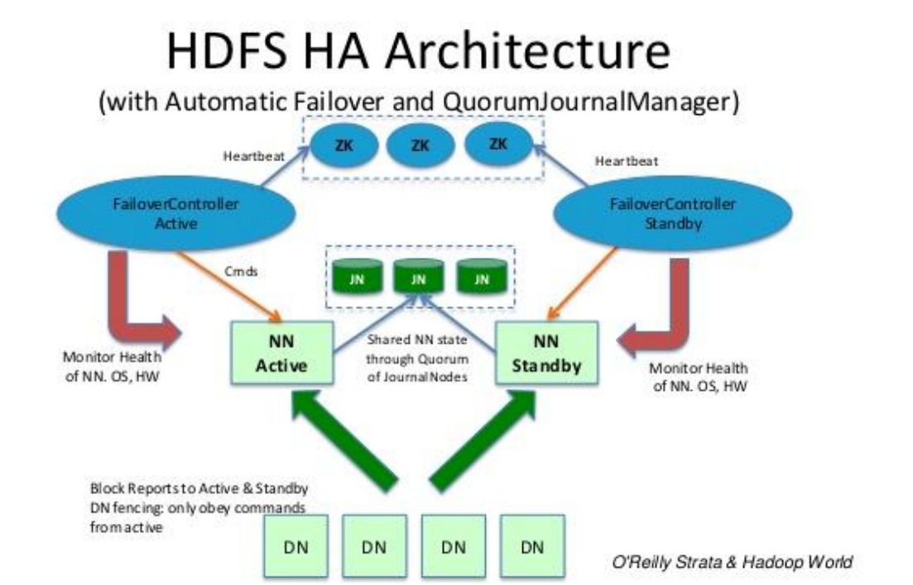
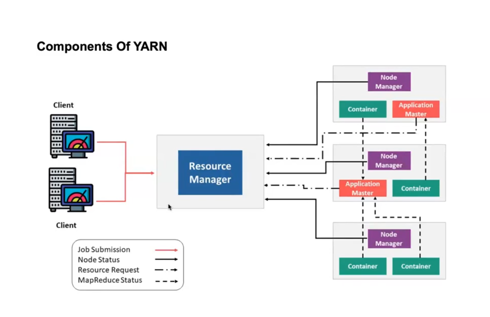
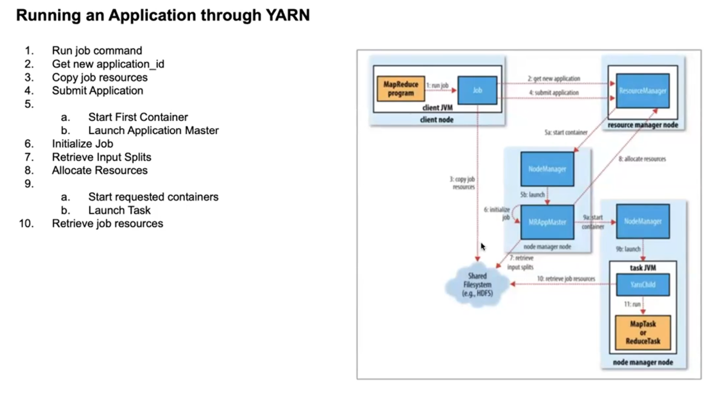

# **Big Data Fundamentals**  
#### **What is Big Data?**  
Big Data refers to extremely large datasets that are difficult to process using traditional data management tools. The volume and complexity of this data grow exponentially, requiring specialized frameworks like Hadoop.  

---

### **5 V’s of Big Data**  
1. **Volume** – Huge amounts of data are generated, ranging from terabytes to petabytes and exabytes.  
2. **Velocity** – Data is generated at high speed (e.g., real-time data from social media and IoT).  
3. **Variety** – Different formats of data: structured (databases), semi-structured (JSON, XML), and unstructured (images, videos, emails).  
4. **Veracity** – Ensuring the reliability and accuracy of data.  
5. **Value** – Extracting meaningful insights to make business decisions.  

---

### **Examples of Big Data**  
- **Social Media** – Data from Facebook, Twitter, Instagram.  
- **Healthcare** – Patient records, medical images.  
- **Finance** – Stock exchange data, transactions.  
- **E-commerce** – Purchase data from Amazon, eBay.  
- **IoT** – Data from smart devices.  
- **Transportation** – Traffic data, GPS logs from Google Maps, Uber.  

---

### **Types of Data**  
1. **Structured Data** – Stored in relational databases (e.g., SQL).  
2. **Unstructured Data** – Includes emails, images, videos, PDFs.  
3. **Semi-Structured Data** – A mix of both structured and unstructured data (e.g., JSON, XML, email with metadata).  

---

### **What is a Cluster?**  
A **cluster** is a collection of multiple computers (nodes) working together to act as a single system. This improves performance, scalability, and fault tolerance.  

---

### **Scaling in Clusters**  
1. **Vertical Scaling (Scaling Up)** – Adding more resources (CPU, RAM, storage) to a single machine.  
2. **Horizontal Scaling (Scaling Out)** – Adding more machines (nodes) to distribute the load.  

---

### **Hadoop Overview**  
Hadoop is an **open-source framework** designed for **storing and processing** large datasets across multiple computers.  

**Main Components of Hadoop:**  
1. **Hadoop Distributed File System (HDFS)** – Storage layer, distributing data across multiple nodes.  
2. **MapReduce** – Processing framework that breaks tasks into small chunks and processes them in parallel.  
3. **Yet Another Resource Negotiator (YARN)** – Manages cluster resources and schedules jobs efficiently.  

---

### **Properties of Hadoop**  
- **Scalability** – Can handle growing data volumes.  
- **Cost-effectiveness** – Uses inexpensive hardware.  
- **Flexibility** – Works with all types of data.  
- **Fault Tolerance** – Replicates data to prevent loss.  
- **Data Locality** – Moves computation to the node where data is stored, reducing network congestion.  
- **Simplicity** – Uses MapReduce for easy data processing.  
- **Open-source** – Free to use and modify.  

---

### **HDFS (Hadoop Distributed File System)**  
HDFS follows a **Master-Slave Architecture** with two key components:  
1. **NameNode (Master)** – Stores metadata, tracks file locations.  
2. **DataNode (Slave)** – Stores actual data blocks and responds to read/write requests.  

#### **Key HDFS Concepts**  
- **Block Size** – Default is **128MB or 256MB**, much larger than traditional file systems.  
- **Replication** – Default is **3 copies per block** for fault tolerance.  
- **Rack Awareness** – Distributes data across different racks for better fault tolerance.  

---

### **Secondary NameNode vs. Standby NameNode**  
1. **Secondary NameNode** – Helps in metadata checkpointing but **does not act as a failover** for NameNode failure.  
2. **Standby NameNode** – A **hot backup** that synchronizes with the active NameNode and **automatically takes over in case of failure**.  

---

### **HDFS Operations**  
1. **Write Operation** – Data is broken into blocks, replicated, and stored across multiple DataNodes.  
2. **Read Operation** – Data is fetched from the nearest DataNode to minimize latency.  

---


<br/>
<br/>

# **HDFS Blocks in Hadoop**  

A **block** in Hadoop is the smallest unit of storage in the **Hadoop Distributed File System (HDFS)**. Unlike traditional file systems (where block sizes are typically **4 KB to 64 KB**), Hadoop uses much larger blocks (default **128 MB or 256 MB**) to efficiently handle **big data processing**.  

---

## **1. Why Does Hadoop Use Large Blocks?**  
- **Reduces Metadata Overhead**: Each file stored in HDFS has metadata maintained by the NameNode. If the block size were small, the NameNode would need to manage too many blocks, leading to high memory usage.  
- **Optimized for Streaming Reads**: Hadoop is designed for processing large datasets, not small, random-access reads. Large blocks ensure **efficient sequential data processing**.  
- **Minimizes Network Traffic**: Since large blocks reduce the number of splits, **less data is transferred between nodes**, improving performance.  

---

## **2. HDFS Block Characteristics**  
- **Default Block Size**: **128 MB** (Hadoop 2.x and later) or **64 MB** (Hadoop 1.x). Can be configured based on workload.  
- **Logical Representation**: Unlike physical disk blocks, HDFS blocks are **logical**—a single block **can span multiple physical disks** across different DataNodes.  
- **File Splitting**: If a file is larger than the block size, it is split into **multiple blocks** (e.g., a **500 MB file** will be split into **four 128 MB blocks + one 4 MB block**).  
- **No Wastage of Space**: If a block **is not fully utilized**, the remaining space **is not shared** with other files (e.g., a 50 MB file in a 128 MB block still uses one full block).  

---

## **3. Example: How Data is Stored in HDFS Blocks**  
Let's assume:  
- Block size = **128 MB**  
- Replication factor = **3**  

| File Size  | Blocks Created |
|------------|--------------|
| 200 MB  | Block 1 (128 MB) + Block 2 (72 MB) |
| 300 MB  | Block 1 (128 MB) + Block 2 (128 MB) + Block 3 (44 MB) |

Each block is **replicated three times** across different DataNodes for **fault tolerance**.  

---

## **4. Block Replication (Fault Tolerance)**  
HDFS ensures **high availability** by replicating blocks across multiple DataNodes.  
- **Default Replication Factor**: **3 copies**  
- **Placement Strategy**:  
  - First copy → Stored on a **random node in the cluster**  
  - Second copy → Stored on a **different node in a different rack**  
  - Third copy → Stored on **another node in the same rack as the second copy**  

If a node fails, Hadoop automatically **re-replicates lost blocks** from existing copies to maintain the replication factor.  

---

## **5. Why is HDFS Block Size Larger than Traditional File Systems?**  
| Feature           | Traditional File Systems | HDFS |
|------------------|------------------------|------|
| Block Size       | 4 KB – 64 KB             | 128 MB – 256 MB |
| Storage Type     | Local disks              | Distributed across clusters |
| Read/Write Mode  | Random Access            | Sequential Processing |
| Performance      | Fast for small files     | Optimized for large files |

### **Key Takeaway**  
HDFS uses **large blocks** to handle **big data efficiently**, minimize **metadata overhead**, and support **fault tolerance through replication**.

---

<br/>
<br/>

# **📌 Secondary NameNode vs. Standby NameNode in Hadoop**  

In Hadoop, **both the Secondary NameNode and Standby NameNode** play a role in managing the **NameNode’s metadata**, but their functions are **very different**. Many people mistakenly assume that the **Secondary NameNode is a backup NameNode**, but this is **incorrect**.

---

## **🟢 1. What is Secondary NameNode?**  

✅ The **Secondary NameNode (SNN)** is **NOT a failover NameNode**.  
✅ Its primary job is to **periodically merge the edit logs** with the **fsimage** to create an updated snapshot of the metadata.  
✅ It helps in **reducing the edit log size** so that the NameNode can restart faster.  

### **🔹 How Does Secondary NameNode Work?**  
1️⃣ **Copies fsimage and edit logs from NameNode**.  
2️⃣ **Applies edit logs to the fsimage** (i.e., merges changes).  
3️⃣ **Saves the new fsimage back to NameNode**.  
4️⃣ **Deletes old edit logs** after merging to reduce memory usage.  

📌 **Understanding:**  
💡 *Think of the Secondary NameNode as a "metadata assistant" that cleans up logs to ensure the NameNode starts faster.*  

---

## **🟢 2. What is Standby NameNode?**  

✅ The **Standby NameNode (SBN)** is a **hot backup** that takes over immediately if the **Active NameNode fails**.  
✅ It runs in a **high-availability (HA) Hadoop cluster**.  
✅ It constantly **syncs with the Active NameNode** using **journal nodes** to keep its metadata up to date.  

### **🔹 How Does Standby NameNode Work?**  
1️⃣ **Continuously receives metadata updates** from Active NameNode.  
2️⃣ **Uses JournalNodes to keep itself in sync** with Active NameNode.  
3️⃣ If Active NameNode **fails**, the Standby NameNode **automatically takes over**.  

📌 **Understanding:**  
💡 *The Standby NameNode is a "live duplicate" of the Active NameNode and ensures high availability of the Hadoop cluster.*  

---

## **🟢 3. Key Differences Between Secondary NameNode and Standby NameNode**  

| **Feature** | **Secondary NameNode** | **Standby NameNode** |
|------------|----------------|----------------|
| **Purpose** | Merges edit logs to create a clean `fsimage`. | Acts as a **backup** for failover in HA mode. |
| **Failover Support** | ❌ **NOT a failover** NameNode. | ✅ **Supports automatic failover**. |
| **Real-Time Sync** | ❌ Periodic sync only. | ✅ **Continuously syncs** with Active NameNode. |
| **Journal Nodes** | ❌ Not used. | ✅ Uses **JournalNodes** for synchronization. |
| **Cluster Type** | Works in **non-HA Hadoop clusters**. | Works in **HA-enabled clusters**. |
| **Metadata Storage** | Stores a **backup copy of fsimage** but doesn’t take over. | Stores **live metadata and can take over** instantly. |
| **Data Recovery** | Helps in **recovering metadata** if NameNode restarts. | **Takes over instantly** if Active NameNode crashes. |

📌 **Understanding:**  
💡 *The Secondary NameNode only helps with metadata cleanup, while the Standby NameNode ensures high availability by acting as a live backup.*  

---

## **🟢 4. When to Use Secondary NameNode vs. Standby NameNode?**  

| **Use Case** | **Solution** |
|-------------|-------------|
| **Small clusters** where failover is not critical. | Use **Secondary NameNode** (manual restart needed if NameNode fails). |
| **Large production clusters** where downtime is unacceptable. | Use **Standby NameNode** (automatic failover). |

📌 **Understanding:**  
💡 *For enterprise-level production environments, always use a **Standby NameNode** for high availability.*  

---

## **🟢 5. High Availability (HA) Configuration with Standby NameNode**  

To enable **HA mode** in Hadoop:  
1️⃣ **Set up two NameNodes** – One **Active** and one **Standby**.  
2️⃣ **Use JournalNodes** to sync metadata between them.  
3️⃣ **Configure Zookeeper** to monitor NameNode health and trigger failover if needed.  

📌 **Understanding:**  
💡 *Without HA mode, if a NameNode crashes, the entire cluster stops working. Standby NameNode prevents this by taking over instantly.*  

---

## **✅ Summary: Key Takeaways**  
📌 **Secondary NameNode is NOT a backup** – It only **merges metadata** to speed up NameNode recovery.  
📌 **Standby NameNode is a failover NameNode** – It takes over automatically when Active NameNode fails.  
📌 **Use Standby NameNode in production** for **high availability**.  
📌 **JournalNodes + Zookeeper** ensure real-time failover in an HA-enabled cluster.  

<br/>
<br/>


## **📌 Explanation of HDFS HA Architecture (with Automatic Failover and QuorumJournalManager)**  

This diagram represents the **High Availability (HA) Architecture** of **HDFS (Hadoop Distributed File System)** with **automatic failover** using **Quorum Journal Manager (QJM)**.

---

## **🟢 Key Components in the Diagram**  

### **1️⃣ NameNodes (NN)**  
- **NN Active (Active NameNode)**:  
  - Handles all client requests for file operations.  
  - Maintains the latest metadata of HDFS.  
  - Communicates with DataNodes (DNs).  
- **NN Standby (Standby NameNode)**:  
  - Synchronizes with the Active NameNode.  
  - Remains in a "hot backup" state.  
  - Takes over automatically if the Active NN fails.  

---

### **2️⃣ DataNodes (DNs)**  
- These are the **worker nodes** in Hadoop.  
- They store the **actual data blocks** of HDFS files.  
- Both the Active and Standby NameNodes receive block reports from DataNodes.  

---

### **3️⃣ JournalNodes (JN)**  
- These are the **Quorum Journal Nodes** (at least **3** nodes for fault tolerance).  
- They **store metadata updates** from the Active NameNode.  
- The Standby NameNode **reads from the JournalNodes** to stay synchronized.  

📌 **Understanding:**  
💡 *The JournalNodes ensure that the Standby NameNode has the latest metadata in case of failover.*  

---

### **4️⃣ Zookeeper (ZK) and Failover Controllers**  
- **Zookeeper (ZK)** monitors the health of the NameNodes.  
- **Failover Controller (FC)**:  
  - One is assigned as **Active Failover Controller** and another as **Standby Failover Controller**.  
  - It keeps track of the health of **Active and Standby NameNodes**.  
  - Automatically switches the Active NameNode to the Standby NameNode if needed.  

📌 **Understanding:**  
💡 *Zookeeper + Failover Controller helps in automatic failover if the Active NameNode crashes.*  

---

## **🟢 Working of HDFS HA with Automatic Failover**  

1️⃣ **Normal Operation:**  
- The **Active NameNode** processes all client requests.  
- The **Standby NameNode** continuously syncs metadata from JournalNodes.  
- DataNodes send **block reports** to both NameNodes.  

2️⃣ **Metadata Synchronization:**  
- The **Active NN writes edits (metadata changes) to JournalNodes**.  
- The **Standby NN reads from JournalNodes** to stay updated.  

3️⃣ **Automatic Failover in Case of Failure:**  
- **Zookeeper detects a failure** in the Active NameNode.  
- The **Failover Controller triggers a switch** from Active NN to Standby NN.  
- The **Standby NameNode becomes Active** and takes over operations.  

📌 **Understanding:**  
💡 *This process ensures that Hadoop continues to function even if the Active NameNode crashes, preventing downtime.*  

---

## **🟢 Key Advantages of This HA Architecture**  

✅ **High Availability** – Prevents Hadoop from crashing due to NameNode failure.  
✅ **Automatic Failover** – No manual intervention needed during failure.  
✅ **Quorum-Based Decision Making** – Prevents split-brain scenarios (both NNs becoming active).  
✅ **Better Fault Tolerance** – JournalNodes ensure metadata is always available.  

---

## **✅ Summary: How It Works Step-by-Step**  

🔹 **Active NameNode processes client requests.**  
🔹 **All metadata changes are written to JournalNodes.**  
🔹 **Standby NameNode reads from JournalNodes to stay updated.**  
🔹 **Zookeeper and Failover Controllers monitor NameNode health.**  
🔹 **If Active NN fails, Standby NN takes over automatically.**  
🔹 **The system continues without downtime.**  


# **📌 Detailed Explanation of Hadoop Day 2 Notes (MapReduce & YARN)**  

---

## **🟢 1. What is MapReduce?**  
**MapReduce** is a **programming model** used in Hadoop to process **large datasets in parallel** across multiple machines in a distributed cluster. It follows a **Divide and Conquer** approach to break large data into smaller chunks and process them efficiently.

### **🔹 How MapReduce Works?**  
MapReduce consists of two main phases:  

1. **Map Phase (Mapper Job)**
   - Reads a **block of data** and **processes** it into **key-value pairs**.
   - The key-value pairs are **intermediate outputs**.

2. **Reduce Phase (Reducer Job)**
   - Takes intermediate key-value pairs from **multiple mappers**.
   - Aggregates, summarizes, and processes them into the **final output**.

👉 **Example:** *Word Count Problem*  
- **Input:** `"Hadoop is great. Hadoop is fast."`
- **Mapper Output (Intermediate Key-Value Pairs):**  
  ```json
  ("Hadoop", 1), ("is", 1), ("great.", 1), ("Hadoop", 1), ("is", 1), ("fast.", 1)
  ```
- **Reducer Output (Final Aggregated Result):**  
  ```json
  ("Hadoop", 2), ("is", 2), ("great.", 1), ("fast.", 1)
  ```

---

## **🟢 2. Advantages of MapReduce**
✅ **Parallel Processing** – Jobs run on multiple nodes, reducing execution time.  
✅ **Data Locality** – Instead of moving large data to computation, MapReduce moves computation to where data is stored.  
✅ **Scalability** – Handles petabytes of data.  
✅ **Fault Tolerance** – If a node fails, tasks are re-executed on another node.  

---

## **🟢 3. MapReduce Workflow (Data Flow)**  

### **🔹 Input Files & Input Splitting**  
📌 **Input Data is stored in HDFS** and split into smaller chunks called **InputSplits**. Each split is assigned to a Mapper.  
- **Example:** A 1 GB file with 128 MB block size → **8 blocks** → **8 InputSplits** → **8 Mappers**.  

### **🔹 Key Components of MapReduce Execution**  

| **Component**  | **Description** |
|---------------|---------------|
| **InputFormat** | Defines how input data is split and read (e.g., TextInputFormat, SequenceFileInputFormat). |
| **RecordReader** | Converts raw input into key-value pairs (e.g., `(line number, line content)`). |
| **Mapper** | Processes input and generates intermediate key-value pairs. |
| **Combiner (Mini Reducer)** | Performs **local aggregation** of key-value pairs (reduces data before sending to Reducer). |
| **Partitioner** | Distributes key-value pairs among Reducers based on the key. |
| **Shuffling & Sorting** | Groups key-value pairs with the same key before reducing. |
| **Reducer** | Aggregates and produces final output. |
| **RecordWriter** | Writes final output to HDFS. |
| **OutputFormat** | Defines how final output is written (e.g., TextOutputFormat). |

---

## **🟢 4. Difference Between Input Split & Block**  
| **Feature**  | **Input Split**  | **HDFS Block**  |
|------------|--------------|--------------|
| **Definition** | Logical division of data for processing | Physical division of data for storage |
| **Size** | Variable (depends on data & split logic) | Fixed (default **128 MB** or **256 MB**) |
| **Used By** | Mapper tasks | HDFS storage system |
| **Processing** | Each split is processed by a **single Mapper** | A block can be used by multiple Mappers |

### **Example:**  
A 500 MB file with a 128 MB block size:  
- **Blocks:** **4 blocks + 1 partial block** (128MB each).  
- **InputSplits:** If we use **8 Mappers**, there will be **8 InputSplits**, even though there are only **5 blocks**.  

---

## **🟢 5. What is YARN? (Yet Another Resource Negotiator)**  
YARN is the **resource management layer** in Hadoop. It was introduced in **Hadoop 2.x** to improve **scalability and resource allocation**.  

**Before YARN:**  
- Hadoop 1.0 had a **single JobTracker** (handled scheduling + monitoring), which was a **bottleneck**.  

**After YARN:**  
- Introduced **Resource Manager** (RM) and **Node Managers** (NM) to handle resources separately.  

---

## **🟢 6. Components of YARN**  

### **1️⃣ Resource Manager (RM)**
**Master component** that **allocates cluster resources** to applications.  
It has two parts:  
- **Scheduler** – Allocates resources to tasks but doesn’t monitor them.  
- **Application Manager** – Manages application lifecycle (starting/stopping jobs).  

### **2️⃣ Node Manager (NM)**
**Runs on each slave node** and reports to the RM.  
- Monitors CPU & memory usage.  
- Launches containers and manages execution.  
- Can kill a task if instructed by RM.  

### **3️⃣ Application Master (AM)**
- Created for each job to handle execution.  
- Requests resources from the RM.  
- Monitors progress and handles **fault tolerance**.  

### **4️⃣ Container**
- **Unit of resource allocation** (CPU, memory).  
- Runs a single **Map or Reduce task**.  

---

## **🟢 7. Running an Application through YARN**  

### **Step-by-Step Execution Flow**  

| **Step**  | **Description**  |
|-----------|---------------|
| **1. Job Submission** | The client submits the application to the **Resource Manager (RM)**. |
| **2. Application ID Assignment** | RM assigns a unique **Application ID**. |
| **3. Copy Job Resources** | HDFS stores input data, JAR files, configuration files. |
| **4. Application Submission** | RM assigns an **Application Master (AM)** for execution. |
| **5. Launch Application Master** | AM starts in the first container allocated. |
| **6. Initialize Job** | AM retrieves **input splits** and prepares for execution. |
| **7. Allocate Resources** | AM requests CPU/memory from RM. |
| **8. Start Containers** | Node Managers launch containers and start tasks. |
| **9. Task Execution** | Tasks are executed inside the containers. |
| **10. Monitoring & Fault Tolerance** | AM tracks progress and re-runs failed tasks. |
| **11. Completion & Resource Release** | After job completion, containers and AM are shut down. |

---

## **🟢 8. Why YARN is Better than Hadoop 1.0?**  
| **Feature**  | **Hadoop 1.0 (MRv1)** | **Hadoop 2.0 (YARN)** |
|------------|----------------|----------------|
| **Job Scheduling** | **JobTracker** does everything (overloaded) | **Resource Manager + Application Master** |
| **Scalability** | Limited to **40,000 nodes** | Can scale to **1 million nodes** |
| **Resource Utilization** | Jobs wait if TaskTrackers are full | Dynamic allocation of containers |
| **Fault Tolerance** | If JobTracker fails, job restarts | **Automatic re-execution of failed jobs** |

---

## **✅ Summary**  
📌 **MapReduce** efficiently processes large datasets using the **Map → Shuffle → Reduce** model.  
📌 **YARN** introduced better resource management for **scalability & performance**.  
📌 **HDFS Block vs. Input Split**: Blocks are for **storage**, Splits are for **processing**.  
📌 **Key YARN Components**: **Resource Manager, Node Manager, Application Master, Containers**.  


---
# **Hadoop 1.0 (Before 2012)**
- **Processing Model:** Only **MapReduce** was available for data processing.
- **Cluster Resource Management:** MapReduce itself handled both **data processing** and **cluster resource management**, which was inefficient.
- **Storage Layer:** **HDFS (Hadoop Distributed File System)** was used for reliable, redundant storage.

**Limitations of Hadoop 1.0:**
- **Scalability Issues:** MapReduce was tightly coupled with cluster resource management, making it inefficient for handling multiple jobs.
- **Limited Processing Models:** Only **batch processing** with MapReduce was supported.
- **Resource Utilization:** Jobs had to wait for resources, leading to inefficient cluster usage.

---

# **Hadoop 2.7 (Since 2012)**
- **Processing Model:** Introduced support for **multiple processing models** such as **Spark, Storm, etc.**, in addition to MapReduce.
- **Cluster Resource Management:** **YARN (Yet Another Resource Negotiator)** was introduced, which separated resource management from data processing.
- **Storage Layer:** HDFS remained the same as a reliable storage system.

**Advantages of Hadoop 2.7:**
✅ **Better Resource Utilization:** YARN efficiently allocates resources, improving cluster performance.  
✅ **Multiple Processing Models:** Supports **real-time (Storm), in-memory (Spark), and batch processing (MapReduce)**.  
✅ **Scalability & Flexibility:** Can handle more concurrent jobs efficiently.

---

### **Key Differences Between Hadoop 1.0 & 2.7**
| Feature | Hadoop 1.0 | Hadoop 2.7 |
|---------|------------|------------|
| **Processing Framework** | Only **MapReduce** | **MapReduce, Spark, Storm, etc.** |
| **Cluster Resource Management** | Handled by **MapReduce** | **Handled by YARN** |
| **Storage System** | **HDFS** | **HDFS** (unchanged) |
| **Efficiency** | Limited parallel processing | Better resource allocation & job scheduling |
| **Scalability** | Limited due to tight coupling | Highly scalable |

🚀 **Conclusion:** Hadoop 2.7 brought major improvements by introducing **YARN**, enabling multiple processing models beyond MapReduce and optimizing resource utilization.


# **Detailed Explanation of YARN in Hadoop**

YARN (Yet Another Resource Negotiator) is the resource management layer in Hadoop. It was introduced with Hadoop 2.x to improve the scalability and efficiency of cluster resource management.

---

## **Why YARN?**
Before YARN, Hadoop 1.0 used a **monolithic** approach where MapReduce handled both **resource management** and **job scheduling**. This had several limitations:
- **Scalability issues** due to a single JobTracker managing all jobs.
- **Lack of multi-framework support** (only MapReduce was supported).
- **Inefficient resource utilization**, as resources were tied to jobs and not dynamically allocated.

With the introduction of YARN, Hadoop became more **flexible**, allowing multiple data processing engines (MapReduce, Spark, Storm, etc.) to share resources efficiently.

---

## **Components of YARN**
YARN consists of **four** main components:

### **1. Resource Manager (RM)**
The **Resource Manager (RM)** is the **master daemon** responsible for managing resources across the Hadoop cluster. It has two key sub-components:
   - **Scheduler:** Allocates resources to running applications based on policies (FIFO, Fair Scheduling, Capacity Scheduler).
   - **Application Manager:** Manages the lifecycle of applications, including starting the Application Master (AM) and monitoring applications.

### **2. Node Manager (NM)**
The **Node Manager (NM)** runs on each **worker node** and is responsible for:
   - Monitoring container resource usage.
   - Reporting node health to the Resource Manager.
   - Managing the execution of tasks within containers.

### **3. Application Master (AM)**
Each job has its own **Application Master (AM)**, which:
   - Negotiates resources with the Resource Manager.
   - Works with the Node Manager to launch containers.
   - Monitors the execution of tasks and handles failures.

### **4. Containers**
A **container** is the basic unit of resource allocation in YARN. It includes:
   - CPU, memory, and disk resources for a specific task.
   - Containers are dynamically allocated and released to improve resource utilization.

---

## **How YARN Works? (Execution Flow)**
### **1. Application Submission**
   - The client submits a job to the **Resource Manager (RM)**.
   - RM assigns a unique **Application ID**.

### **2. Application Master Initialization**
   - RM starts the **Application Master (AM)** on a node.
   - AM requests resources from RM.

### **3. Resource Allocation**
   - The **Scheduler** in RM allocates **Containers** based on job requirements.

### **4. Container Execution**
   - AM contacts **Node Managers (NM)** to start containers.
   - Tasks are executed inside these containers.

### **5. Monitoring and Fault Tolerance**
   - AM monitors the execution of tasks.
   - If a container fails, AM requests a new one from RM and retries the task.

### **6. Job Completion and Cleanup**
   - After successful execution, AM releases resources and informs RM.
   - The client retrieves the results.

---

## **Advantages of YARN**
✅ **Supports multiple frameworks** (MapReduce, Spark, Storm, etc.).  
✅ **Improves cluster utilization** by dynamically allocating resources.  
✅ **Better scalability** than Hadoop 1.0.  
✅ **Fault-tolerant** execution with automatic recovery.  

YARN transformed Hadoop into a **multi-purpose** big data processing platform, making it highly **scalable** and **efficient**. 🚀


<br/>
<br/>

# **Detailed Explanation of YARN Components (Based on the Diagram)**



This diagram illustrates the **YARN (Yet Another Resource Negotiator) architecture** and its components in a Hadoop cluster. YARN is responsible for **resource management and job scheduling** in Hadoop.

---

## **1. Components in the Diagram**
The diagram consists of the following major components:

### **1️⃣ Client**
- The **client** submits a job to the YARN **Resource Manager**.
- The job request contains information about the application (e.g., MapReduce job, Spark job).
- Represented in the diagram as two computer systems on the left.

---

### **2️⃣ Resource Manager (RM)**
- The **Resource Manager** is the central authority in YARN.
- It manages resources across the cluster and schedules jobs.
- It has two main responsibilities:
  - **Scheduler** → Allocates resources to running applications.
  - **Application Manager** → Manages the Application Master (AM) lifecycle.
- In the diagram, RM is at the center.

#### **Job Flow in RM**
- **Job Submission (🔴 Red Arrow):** The client submits a job to the RM.
- **Resource Request (📶 Dashed Arrow):** The Application Master (AM) requests resources from RM.
- **Node Status Update (⬛ Solid Arrow):** Node Managers report their health status to RM.

---

### **3️⃣ Node Manager (NM)**
- Runs on each worker node in the cluster.
- Manages the execution of tasks within **Containers**.
- Communicates with the **Resource Manager** and **Application Master**.
- Ensures that resources (CPU, memory, disk) are not overused.
- **Each NM reports to the RM** about its availability.
- In the diagram, Node Managers are purple boxes.

---

### **4️⃣ Application Master (AM)**
- Every job has its own **Application Master**.
- Responsible for:
  - Requesting resources from RM.
  - Assigning tasks to **containers**.
  - Monitoring task execution.
  - Handling failures and retries.
- Shown as **red boxes** in the diagram.

---

### **5️⃣ Containers**
- The basic unit of resource allocation in YARN.
- A container can run **MapReduce tasks, Spark jobs, or any other processing task**.
- Containers are allocated by **Node Managers** as per the AM’s request.
- In the diagram, containers are **green boxes**.

---

## **2. How YARN Works (Step-by-Step Execution Flow)**
### **Step 1: Job Submission**
- The **client submits a job** (e.g., a MapReduce job) to the **Resource Manager**.
- (🔴 Red Arrow) **Job submission request** is sent to RM.

### **Step 2: Application Master Initialization**
- RM starts the **Application Master (AM)** on a **Node Manager (NM)**.
- (📶 Dashed Arrow) The **AM requests resources** from the RM.

### **Step 3: Resource Allocation**
- RM **allocates containers** based on availability.
- (⬛ Solid Arrow) **Node Managers report their health status** to RM.

### **Step 4: Task Execution in Containers**
- AM assigns tasks to **Containers** running on Node Managers.
- The containers execute the task (e.g., MapReduce, Spark processing).

### **Step 5: Monitoring and Completion**
- AM **monitors the tasks** running in the containers.
- If a task fails, AM requests a new container and retries the task.
- Once the job is finished, AM notifies RM and releases resources.

---

## **3. Acknowledgment (ACK) in YARN**
### **How Acknowledgment Works?**
- **Job Completion ACK** → When the job is completed, AM sends an acknowledgment (ACK) to RM.
- **Container Allocation ACK** → When a container is successfully assigned to a task, the NM sends an ACK to AM.
- **Node Status ACK** → NM regularly sends an ACK to RM to indicate it is alive and functioning.

---

## **4. Key Takeaways**
✅ **YARN enables multi-framework processing** (not just MapReduce, but also Spark, Storm, etc.).  
✅ **Decouples resource management from job execution**, improving scalability.  
✅ **Efficient resource utilization** using dynamic allocation.  
✅ **Fault tolerance** through AM retries and NM status reporting.  

This is how YARN efficiently **manages resources** and **executes jobs** in Hadoop! 🚀


<br/>
<br/>

# **Detailed Explanation of YARN in Hadoop**

YARN (Yet Another Resource Negotiator) is the resource management layer in Hadoop. It was introduced with Hadoop 2.x to improve the scalability and efficiency of cluster resource management.

---

## **Why YARN?**
Before YARN, Hadoop 1.0 used a **monolithic** approach where MapReduce handled both **resource management** and **job scheduling**. This had several limitations:
- **Scalability issues** due to a single JobTracker managing all jobs.
- **Lack of multi-framework support** (only MapReduce was supported).
- **Inefficient resource utilization**, as resources were tied to jobs and not dynamically allocated.

With the introduction of YARN, Hadoop became more **flexible**, allowing multiple data processing engines (MapReduce, Spark, Storm, etc.) to share resources efficiently.

---

## **Components of YARN**
YARN consists of **four** main components:

### **1. Resource Manager (RM)**
The **Resource Manager (RM)** is the **master daemon** responsible for managing resources across the Hadoop cluster. It has two key sub-components:
   - **Scheduler:** Allocates resources to running applications based on policies (FIFO, Fair Scheduling, Capacity Scheduler).
   - **Application Manager:** Manages the lifecycle of applications, including starting the Application Master (AM) and monitoring applications.

### **2. Node Manager (NM)**
The **Node Manager (NM)** runs on each **worker node** and is responsible for:
   - Monitoring container resource usage.
   - Reporting node health to the Resource Manager.
   - Managing the execution of tasks within containers.

### **3. Application Master (AM)**
Each job has its own **Application Master (AM)**, which:
   - Negotiates resources with the Resource Manager.
   - Works with the Node Manager to launch containers.
   - Monitors the execution of tasks and handles failures.

### **4. Containers**
A **container** is the basic unit of resource allocation in YARN. It includes:
   - CPU, memory, and disk resources for a specific task.
   - Containers are dynamically allocated and released to improve resource utilization.

---

## **How YARN Works? (Execution Flow)**
### **1. Application Submission**
   - The client submits a job to the **Resource Manager (RM)**.
   - RM assigns a unique **Application ID**.

### **2. Application Master Initialization**
   - RM starts the **Application Master (AM)** on a node.
   - AM requests resources from RM.

### **3. Resource Allocation**
   - The **Scheduler** in RM allocates **Containers** based on job requirements.

### **4. Container Execution**
   - AM contacts **Node Managers (NM)** to start containers.
   - Tasks are executed inside these containers.

### **5. Monitoring and Fault Tolerance**
   - AM monitors the execution of tasks.
   - If a container fails, AM requests a new one from RM and retries the task.

### **6. Job Completion and Cleanup**
   - After successful execution, AM releases resources and informs RM.
   - The client retrieves the results.

---

## **Advantages of YARN**
✅ **Supports multiple frameworks** (MapReduce, Spark, Storm, etc.).  
✅ **Improves cluster utilization** by dynamically allocating resources.  
✅ **Better scalability** than Hadoop 1.0.  
✅ **Fault-tolerant** execution with automatic recovery.  

YARN transformed Hadoop into a **multi-purpose** big data processing platform, making it highly **scalable** and **efficient**. 🚀