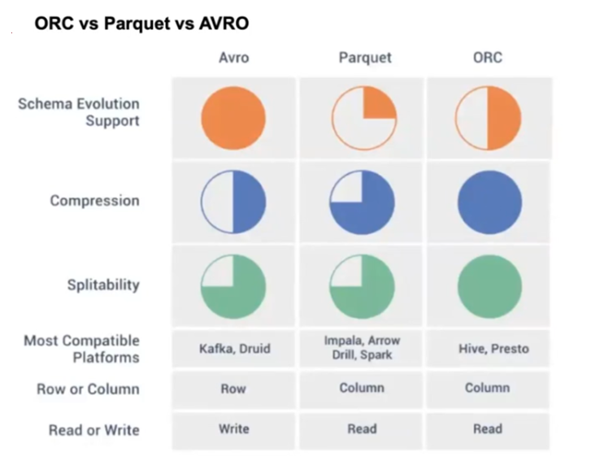

# **Detailed Explanation of Hive Data Storage and SerDe**

The notes cover different aspects of **data storage in Hive**, including **plain text vs. byte storage**, **SerDe (Serializer/Deserializer)**, **row format and MapReduce input/output format**, and various **file formats used in Hive** (like ORC, Parquet, Avro). Below is a structured explanation of each topic.

---

# **1. Plain Text Data Storage vs. Byte (Binary) Data Storage**
Data can be stored in **two primary ways**: **plain text format** or **binary format (bytes)**.

### **Plain Text Data Storage**
📌 **Key Characteristics:**
- Data is stored as **readable characters** (ASCII, UTF-8, etc.).
- Example: **The number `12345` is stored as the characters `'1'`, `'2'`, `'3'`, `'4'`, and `'5'`.**
- Each character typically takes **1 byte (ASCII) or 2 bytes (UTF-16)**.
- Storing `12345` in ASCII takes **5 bytes**, and in UTF-16, it takes **10 bytes**.

✅ **Advantages:**
- **Human-readable** (you can open and understand it directly in a text editor).
- **Easy to debug and modify** without special tools.

❌ **Disadvantages:**
- **Inefficient in terms of storage** (uses more space than binary).
- **Slow to process** (requires more memory and CPU cycles).

---

### **Byte (Binary) Data Storage**
📌 **Key Characteristics:**
- Data is stored in **binary (0s and 1s)**.
- Example: **The number `12345` in binary is `11000000111001`**.
- The binary representation **only takes 2 bytes (16 bits)**.
- Storage is **more compact and efficient**.

✅ **Advantages:**
- **More space-efficient** (requires less storage than plain text).
- **Faster to read/write** (since computers process binary data directly).

❌ **Disadvantages:**
- **Not human-readable** (requires special tools to interpret).
- **More difficult to debug** compared to text storage.

---

# **2. SerDe in Hive**
### **What is SerDe?**
**SerDe (Serializer/Deserializer)** is a component in Hive responsible for **reading and writing data in custom formats**.

### **Role of SerDe in Hive:**
- **Serialization:** Converts an object from memory into bytes that can be stored in a file.
- **Deserialization:** Converts bytes back into an object that Hive can understand.

📌 **Key Points:**
- **When reading data**, SerDe **deserializes it** into a format that Hive can process.
- **When writing data**, SerDe **serializes it** into a format suitable for storage.

Example:
```sql
SELECT * FROM employee;  -- Deserialization (data is converted into a readable format)
INSERT INTO TABLE employee VALUES ('John', 30); -- Serialization (data is converted into binary format)
```

---

# **3. Hive Row Format & MapReduce Input/Output Format**
In Hive, **two important sections** define how data is read and written:
1. **Row Format:** Specifies the SerDe library used to **convert rows into columns**.
2. **Stored As:** Defines the **InputFormat and OutputFormat** libraries used by MapReduce to **read/write data in HDFS**.

Example:
```sql
CREATE TABLE employees (
    id INT,
    name STRING,
    salary FLOAT
)
ROW FORMAT DELIMITED
FIELDS TERMINATED BY ','
STORED AS TEXTFILE;
```
📌 **Explanation:**
- **`ROW FORMAT DELIMITED`** → Specifies how to split the fields (CSV format in this case).
- **`FIELDS TERMINATED BY ','`** → Defines that columns are separated by a comma.
- **`STORED AS TEXTFILE`** → Uses **TextFile format** (default format in Hive).

---

# **4. File Formats in Hive & SerDe Libraries**
Hive supports multiple file formats for storage. Each file format has its own **advantages** and is associated with a **SerDe library**.

## **a) TextFile (Default Format)**
📌 **Characteristics:**
- **Default file format in Hive**.
- Each line in the file represents a **record**.
- Uses **LazySimpleSerDe** for serialization/deserialization.

✅ **Pros:**  
- Simple and easy to use.  
- Human-readable.  

❌ **Cons:**  
- No **column pruning** (reads all columns even if not needed).  
- **No compression** → Consumes more space.

---

## **b) SequenceFile**
📌 **Characteristics:**
- Stores data as **binary key/value pairs**.
- Uses **SequenceFileInputFormat** and **SequenceFileOutputFormat**.
- Default SerDe: **LazySimpleSerDe**.

✅ **Pros:**  
- **Faster than TextFile** (because it stores data in binary).  
- Supports **compression**.  

❌ **Cons:**  
- Not human-readable.  
- Not widely used for analytical queries.

---

## **c) JSON**
📌 **Characteristics:**
- Stores data in **JSON format**.
- Uses **JsonSerDe** for serialization/deserialization.

✅ **Pros:**  
- Human-readable.  
- Good for **semi-structured data**.  

❌ **Cons:**  
- JSON files are **not splittable** → **Only one mapper can process a file** → **Bad for performance**.

---

## **d) CSV (Comma-Separated Values)**
📌 **Characteristics:**
- Stores **tabular data** in plain text format.
- Uses **LazySimpleSerDe** or **OpenCSVSerde**.

✅ **Pros:**  
- **Easy to read & write**.  
- Works well with **Excel & databases**.  

❌ **Cons:**  
- **Not splittable** → Bad for parallel processing.  
- No **compression**.

---

## **e) RCFile (Record Columnar File)**
📌 **Characteristics:**
- Developed by **Facebook**.
- Stores **columnar data** for **better query performance**.
- Uses **ColumnarSerDe**.

✅ **Pros:**  
- **Faster than row-based formats** (like CSV, JSON).  
- Efficient storage & retrieval.

❌ **Cons:**  
- Not as optimized as **ORC or Parquet**.

---

## **f) ORC (Optimized Row Columnar)**
📌 **Characteristics:**
- Developed by **Hortonworks**.
- Provides **high compression & indexing**.
- Uses **OrcSerde**.

✅ **Pros:**  
- **High compression**.  
- **Supports indexing & bloom filters**.  

❌ **Cons:**  
- **Not ideal for write-heavy workloads**.

---

## **g) Parquet**
📌 **Characteristics:**
- **Columnar format** used in Hadoop ecosystem.
- Uses **ParquetHiveSerDe**.

✅ **Pros:**  
- **Best for analytical queries**.  
- **Highly compressed & efficient**.

❌ **Cons:**  
- **Not good for frequent row-based updates**.

---

## **h) Avro**
📌 **Characteristics:**
- **Row-oriented format**, supports **schema evolution**.
- Uses **AvroSerDe**.

✅ **Pros:**  
- **Good for write-heavy workloads**.  
- **Supports schema evolution**.  

❌ **Cons:**  
- **Not as compressed as ORC/Parquet**.

---

# **5. ORC vs. Parquet vs. Avro**
### **How to choose the best file format?**
| **Criteria** | **ORC** | **Parquet** | **Avro** |
|-------------|--------|---------|-------|
| **Best for** | Hive Queries | Analytics | Write-heavy workloads |
| **Format Type** | Columnar | Columnar | Row-based |
| **Compression** | High | High | Medium |
| **Schema Evolution** | Limited | Limited | Best |
| **Performance** | Fast queries | Best for large datasets | Best for frequent inserts |

---

# **Conclusion**
- **Use ORC/Parquet** for **fast analytics**.
- **Use Avro** for **data that changes over time (schema evolution)**.
- **Use CSV/TextFile** only if **human-readability is needed**.

<br/>
<br/>

# **Hive SerDe (Serializer/Deserializer) and Row Format Explanation**

## **1. Understanding SerDe in Hive**
### **What is SerDe?**
- **SerDe (Serializer/Deserializer)** is a component in Hive that allows **reading (deserialization) and writing (serialization)** of data in different formats.
- It is responsible for **converting raw file data into structured Hive table data** and vice versa.

### **Example Explanation:**
📌 **Concept of Serialization & Deserialization in Hive**  
- **SELECT query (Deserialization):** Converts raw data stored in HDFS into a structured table format (columns).
- **INSERT query (Serialization):** Converts structured table data into raw files (for storage in HDFS).

📌 **Example:**  
```sql
SELECT * FROM employees;  -- Hive deserializes raw HDFS data into columns.
INSERT INTO employees VALUES ('John', 'Manager'); -- Hive serializes the data into files.
```

---

## **2. Hive Row Format & MapReduce Input/Output Format**
In any **Hive table definition**, there are **two important sections**:

| **Section** | **Purpose** |
|------------|------------|
| **Row Format** | Defines how **rows are split into columns** (using SerDe libraries). |
| **Stored As** | Defines the **InputFormat and OutputFormat** used by MapReduce to **read/write data in HDFS**. |

📌 **Example Table with Row Format and SerDe:**
```sql
CREATE TABLE my_table (
    a STRING,
    b STRING
)
ROW FORMAT SERDE 'org.apache.hadoop.hive.serde2.OpenCSVSerde'
WITH SERDEPROPERTIES (
    "separatorChar" = "\t",
    "quoteChar" = "\"",
    "escapeChar" = "\\"
)
STORED AS TEXTFILE;
```
✅ **Explanation:**
- **`ROW FORMAT SERDE 'org.apache.hadoop.hive.serde2.OpenCSVSerde'`**  
  - Specifies that Hive should use **OpenCSVSerde** to **process CSV files**.
- **`WITH SERDEPROPERTIES`**
  - `"separatorChar" = "\t"` → Columns are separated by a **tab (`\t`)**.
  - `"quoteChar" = "\"" ` → Double quotes are used for **quoted values**.
  - `"escapeChar" = "\\" ` → Backslash is used as an **escape character**.
- **`STORED AS TEXTFILE`**  
  - The table will be **stored as a text file** in HDFS.

---

## **3. Commonly Used SerDe Libraries in Hive**
### **a) LazySimpleSerDe (Default)**
📌 **Used for:**  
- **Text-based files** like CSV, TSV.
- **Automatically detects delimiters** (commas, tabs).

✅ **Example:**
```sql
CREATE TABLE my_table (
    id INT,
    name STRING,
    salary FLOAT
)
ROW FORMAT SERDE 'org.apache.hadoop.hive.serde2.lazy.LazySimpleSerDe'
STORED AS TEXTFILE;
```
- **Best for simple tabular text files**.

---

### **b) OpenCSVSerde (Advanced CSV Processing)**
📌 **Used for:**  
- CSV files with **special characters, escape sequences**.
- Allows **custom delimiters** (`TAB`, `|`, etc.).

✅ **Example:**
```sql
CREATE TABLE csv_table (
    id INT,
    name STRING,
    age INT
)
ROW FORMAT SERDE 'org.apache.hadoop.hive.serde2.OpenCSVSerde'
WITH SERDEPROPERTIES (
    "separatorChar" = ",",
    "quoteChar" = "\"",
    "escapeChar" = "\\"
)
STORED AS TEXTFILE;
```
- **Best for handling CSV files with quotes, special characters**.

---

### **c) JsonSerDe (For JSON Data)**
📌 **Used for:**  
- **Reading and writing JSON** files in Hive.

✅ **Example:**
```sql
CREATE TABLE json_table (
    id INT,
    name STRING,
    data STRING
)
ROW FORMAT SERDE 'org.apache.hive.hcatalog.data.JsonSerDe'
STORED AS TEXTFILE;
```
- **Best for storing semi-structured JSON data in Hive**.

---

### **d) AvroSerDe (For Avro File Format)**
📌 **Used for:**  
- **Schema evolution** (dynamic changes in table structure).
- Efficient **row-based** storage.

✅ **Example:**
```sql
CREATE TABLE avro_table (
    id INT,
    name STRING
)
STORED AS AVRO;
```
- **Best for handling evolving schemas**.

---

### **e) ORCSerDe (For ORC Files)**
📌 **Used for:**  
- Highly **optimized columnar storage** format.

✅ **Example:**
```sql
CREATE TABLE orc_table (
    id INT,
    name STRING
)
STORED AS ORC;
```
- **Best for high-speed Hive queries**.

---

### **f) ParquetHiveSerDe (For Parquet Files)**
📌 **Used for:**  
- **Efficient columnar storage**.

✅ **Example:**
```sql
CREATE TABLE parquet_table (
    id INT,
    name STRING
)
STORED AS PARQUET;
```
- **Best for analytics with high compression**.

---

## **4. Summary of SerDe Libraries**
| **SerDe Library** | **Used For** | **Example Storage Format** |
|------------------|-------------|---------------------|
| LazySimpleSerDe | Default text-based files | `STORED AS TEXTFILE` |
| OpenCSVSerde | Advanced CSV handling | `STORED AS TEXTFILE` |
| JsonSerDe | Reading/writing JSON data | `STORED AS TEXTFILE` |
| AvroSerDe | Row-based Avro format | `STORED AS AVRO` |
| ORCSerDe | Optimized columnar storage | `STORED AS ORC` |
| ParquetHiveSerDe | Highly compressed columnar storage | `STORED AS PARQUET` |

---

## **5. Conclusion**
- **SerDe allows Hive to process different file formats efficiently**.
- **Use LazySimpleSerDe for simple text files, OpenCSVSerde for CSV, and JsonSerDe for JSON files**.
- **For high-performance analytics, ORC and Parquet are the best options**.

<br/>
<br/>

# **ORC vs Parquet vs Avro: A Comparison**  

These are three popular **columnar** and **row-based** storage formats used in **big data processing** with Hive, Spark, and other frameworks. Here's a breakdown of their differences:

---

## **1. ORC (Optimized Row Columnar)**
- **Type**: Columnar format
- **Best For**: Hive & Hadoop ecosystem
- **Compression**: High (Zlib, Snappy, LZO)
- **Schema Evolution**: Limited support
- **Performance**: 
  - Faster reading & writing than Parquet (for Hive)
  - Efficient for large-scale analytics in Hive  
- **Use Cases**: Hive-based workloads, batch processing, and high-compression needs

---

## **2. Parquet**
- **Type**: Columnar format  
- **Best For**: Apache Spark, Presto, and Impala  
- **Compression**: High (Snappy, Gzip, LZO)  
- **Schema Evolution**: Supports adding new columns  
- **Performance**: 
  - Best for Spark-based analytics  
  - Optimized for queries scanning a few columns  
- **Use Cases**: Data lakes, big data analytics, ML pipelines  

---

## **3. Avro**
- **Type**: Row-based format  
- **Best For**: Streaming & ETL  
- **Compression**: Moderate (Snappy, Deflate)  
- **Schema Evolution**: Strong support (Backward & Forward compatibility)  
- **Performance**:
  - Good for write-heavy workloads  
  - Best for storing entire records (good for Kafka & logs)  
- **Use Cases**: Data serialization, Kafka, event streaming, and log storage  

---

### **Comparison Table**
| Feature      | ORC | Parquet | Avro |
|-------------|-----|---------|------|
| **Format** | Columnar | Columnar | Row-based |
| **Best For** | Hive | Spark, Presto | Kafka, ETL |
| **Compression** | High | High | Moderate |
| **Schema Evolution** | Limited | Supports adding columns | Strong (Backward & Forward) |
| **Performance** | Best for Hive | Best for Spark | Best for serialization & streaming |
| **Use Case** | Batch analytics | Big data analytics | Event-driven & log storage |

---

### **Which One Should You Use?**
- **Use ORC** if you're working with **Hive** and need **high compression & fast performance**.  
- **Use Parquet** for **Spark-based big data analytics** and **query efficiency**.  
- **Use Avro** for **Kafka, ETL pipelines, and schema evolution needs**.  

<br/>
<br/>

# **ORC vs Parquet vs Avro: A Comparison**  

These are three popular **columnar** and **row-based** storage formats used in **big data processing** with Hive, Spark, and other frameworks. Here's a breakdown of their differences:

---

## **1. ORC (Optimized Row Columnar)**
- **Type**: Columnar format
- **Best For**: Hive & Hadoop ecosystem
- **Compression**: High (Zlib, Snappy, LZO)
- **Schema Evolution**: Limited support
- **Performance**: 
  - Faster reading & writing than Parquet (for Hive)
  - Efficient for large-scale analytics in Hive  
- **Use Cases**: Hive-based workloads, batch processing, and high-compression needs

---

## **2. Parquet**
- **Type**: Columnar format  
- **Best For**: Apache Spark, Presto, and Impala  
- **Compression**: High (Snappy, Gzip, LZO)  
- **Schema Evolution**: Supports adding new columns  
- **Performance**: 
  - Best for Spark-based analytics  
  - Optimized for queries scanning a few columns  
- **Use Cases**: Data lakes, big data analytics, ML pipelines  

---

## **3. Avro**
- **Type**: Row-based format  
- **Best For**: Streaming & ETL  
- **Compression**: Moderate (Snappy, Deflate)  
- **Schema Evolution**: Strong support (Backward & Forward compatibility)  
- **Performance**:
  - Good for write-heavy workloads  
  - Best for storing entire records (good for Kafka & logs)  
- **Use Cases**: Data serialization, Kafka, event streaming, and log storage  

---

### **Comparison Table**
| Feature      | ORC | Parquet | Avro |
|-------------|-----|---------|------|
| **Format** | Columnar | Columnar | Row-based |
| **Best For** | Hive | Spark, Presto | Kafka, ETL |
| **Compression** | High | High | Moderate |
| **Schema Evolution** | Limited | Supports adding columns | Strong (Backward & Forward) |
| **Performance** | Best for Hive | Best for Spark | Best for serialization & streaming |
| **Use Case** | Batch analytics | Big data analytics | Event-driven & log storage |

---

### **Which One Should You Use?**
- **Use ORC** if you're working with **Hive** and need **high compression & fast performance**.  
- **Use Parquet** for **Spark-based big data analytics** and **query efficiency**.  
- **Use Avro** for **Kafka, ETL pipelines, and schema evolution needs**.  

<br/>
<br/>

# **RCF (Row Columnar File) and ORCF (Optimized Row Columnar File) Formats**  

Both **RCF** and **ORCF** are less commonly discussed storage formats, but they are typically associated with **columnar data storage** and **big data frameworks**. Below is an explanation of these formats based on how they relate to existing data storage technologies.

---

### **1. RCF (Row Columnar File)**
RCF is a **hybrid storage format** that combines both **row-based** and **columnar storage** principles. It is designed to **optimize performance** for workloads requiring both row-based and columnar-based querying.

#### **Features of RCF:**
- **Hybrid approach:** Stores data in both **row and column format** for optimized read/write operations.
- **Faster queries**: Supports both OLAP (Online Analytical Processing) and OLTP (Online Transaction Processing) workloads.
- **Efficient storage**: Balances between **row-based storage** (good for transactional data) and **columnar storage** (good for analytics).
- **Better indexing**: Allows faster retrieval of rows and specific columns.

#### **Use Cases of RCF:**
- Scenarios where **both transactional (OLTP) and analytical (OLAP)** queries are needed.
- Databases and data warehouses where **mixed query types** are common.
- Systems requiring **high-speed reads and writes** with structured data.

---

### **2. ORCF (Optimized Row Columnar File)**
**ORCF** is an **enhanced version of RCF**, often linked to **ORC (Optimized Row Columnar) format** used in big data processing.

#### **Features of ORCF:**
- **Similar to ORC format** but optimized for specific big data systems.
- **Columnar storage**: Best suited for **analytical queries** (OLAP).
- **High compression**: Reduces storage costs and speeds up queries.
- **Better indexing**: Enables fast scans and retrievals of large datasets.
- **Efficient processing**: Works well with **Hive, Spark, Presto, and Hadoop**.

#### **Use Cases of ORCF:**
- **Big Data processing** in Hive and Hadoop ecosystems.
- **Analytical workloads** that require **fast read access** to specific columns.
- **Cloud-based data warehouses** with high compression needs.

---

### **Comparison Table: RCF vs ORCF**
| Feature | **RCF (Row Columnar File)** | **ORCF (Optimized Row Columnar File)** |
|---------|----------------------------|----------------------------------|
| **Storage Type** | Hybrid (Row + Column) | Columnar |
| **Best For** | OLTP + OLAP workloads | OLAP workloads |
| **Compression** | Moderate | High |
| **Performance** | Balanced read/write | Fast read-heavy queries |
| **Use Case** | Mixed query systems | Big data analytics (Hive, Spark) |

---

### **Conclusion:**
- **RCF** is a **hybrid** format useful for mixed **transactional and analytical queries**.  
- **ORCF** is an **optimized columnar format**, similar to **ORC**, designed for **big data analytics**.  


<br/>
<br/>

# **How ORC Uses Bloom Filters Internally**  

**ORC (Optimized Row Columnar)** format is a columnar storage format used in **Hive, Spark, and other Big Data frameworks**. It provides efficient **storage, compression, and indexing** to speed up query execution.  

One of its key optimizations is the use of **Bloom Filters**, which help in **reducing I/O and improving query performance**.

---

## **📌 What is a Bloom Filter?**
A **Bloom Filter** is a **probabilistic data structure** used to check whether an element **may exist** in a dataset. It:
- **Uses hash functions** to map elements into a **bit array**.
- **Allows fast lookups** while using **less memory**.
- **May return false positives** but **never false negatives** (i.e., if it says an element does not exist, it definitely does not exist).

---

## **🔍 How ORC Uses Bloom Filters?**
ORC files store **Bloom Filters at the stripe level** to accelerate queries. Here’s how:

### **1️⃣ Bloom Filters in ORC Stripe Structure**
ORC files are divided into **stripes**, and each stripe has an **index** that includes:
- Min and Max values of each column (for predicate pushdown)
- **Bloom Filters for specific columns** (for fast membership checks)

### **2️⃣ Query Optimization with Bloom Filters**
When a query includes a **filter condition** (e.g., `WHERE col = 'value'`), ORC uses Bloom Filters as follows:

#### **Step 1: Predicate Pushdown Optimization**
Before scanning the data, ORC checks the Bloom Filter:
- If the filter **indicates that the value does NOT exist**, ORC **skips reading that stripe** → **reduces I/O**.
- If the filter **indicates that the value may exist**, ORC **proceeds to scan** the data inside the stripe.

#### **Step 2: Hash-Based Lookups**
- The filter **applies multiple hash functions** on the search value.
- If the corresponding bits in the Bloom Filter are set, the value **may be present**.
- ORC then **reads only the necessary rows**, avoiding full table scans.

---

## **💡 Example: How ORC Uses Bloom Filters**
### **Scenario: Querying ORC Table**
```sql
SELECT * FROM orders WHERE customer_id = 'C1234';
```
- ORC first checks the **Bloom Filter for `customer_id`**.
- If `C1234` is **not found**, ORC skips scanning that stripe.
- If `C1234` **may exist**, ORC loads the stripe and scans the relevant rows.

This **reduces the amount of data read** from storage and speeds up query execution.

---

## **📊 Bloom Filter vs Min/Max Index in ORC**
| Feature | **Bloom Filter** | **Min/Max Index** |
|---------|----------------|----------------|
| **Use Case** | Exact match filters (`=`) | Range-based queries (`BETWEEN`, `<`, `>`) |
| **False Positives?** | Yes | No |
| **False Negatives?** | No | No |
| **Speed Boost** | High (for equality lookups) | High (for range filters) |
| **I/O Reduction** | Skips non-matching stripes | Skips stripes outside min/max range |

---

## **🔹 When to Use Bloom Filters in ORC?**
- Works best for **high-cardinality columns** (e.g., `customer_id`, `email`).
- Ideal for **point lookups** (equality filters like `WHERE col = 'value'`).
- Should be **avoided for low-cardinality columns** (e.g., `gender`, `status`).

---

## **🚀 Summary**
- **Bloom Filters in ORC** store precomputed hashes of column values at the **stripe level**.
- They help **quickly check** whether a value exists, reducing **disk I/O**.
- Best used for **high-cardinality columns** in **equality-based queries**.

This significantly **improves query performance** for large datasets! 🚀🔥

<br/>
<br/>

### **🔍 Real-time In-depth Example: Bloom Filters in ORC**  

Let’s go step by step through a real-world **big data scenario** using **ORC with Bloom Filters** to optimize query performance.  

---

## **📌 Scenario: E-commerce Order System**
### **Dataset: `orders` Table in ORC**
Imagine we have an **e-commerce platform** where millions of customers place orders daily. We store order data in **Hive using ORC format**, and our table is structured as follows:

```sql
CREATE TABLE orders (
    order_id STRING,
    customer_id STRING,
    product_id STRING,
    order_date DATE,
    amount DECIMAL(10,2)
)
STORED AS ORC
TBLPROPERTIES ("orc.bloom.filter.columns" = "customer_id");
```
### **💡 Why Use Bloom Filters on `customer_id`?**
- **High Cardinality**: There are **millions of unique customers**, so indexing them traditionally would be expensive.
- **Frequent Lookups**: Queries often filter orders by `customer_id`, such as:
  ```sql
  SELECT * FROM orders WHERE customer_id = 'C1234';
  ```
- **Improves Query Performance**: Bloom filters **eliminate unnecessary disk reads** for customers that do not exist in a given ORC stripe.

---

## **🔍 Step-by-Step Execution with Bloom Filters**
### **📂 Step 1: ORC File Structure**
ORC divides data into **stripes** (default ~256MB), each containing:
- **Index Data** (min/max values, Bloom Filters)
- **Row Data** (actual records)
- **Stripe Footer** (metadata)

---

### **📌 Step 2: Query Execution (`WHERE customer_id = 'C1234'`)**
When the query runs:
1. **Hive reads ORC metadata (not full data!)**
   - It **scans Bloom Filters** in each stripe for `customer_id = 'C1234'`.
   - If the Bloom Filter **excludes the value**, the stripe is **skipped**.
   - If the Bloom Filter **says "maybe present"**, Hive reads that stripe.

2. **Example Stripe Filtering**
   - Assume ORC file has **3 stripes**:
     | Stripe | Min `customer_id` | Max `customer_id` | Bloom Filter Contains `C1234`? | Stripe Scanned? |
     |--------|------------------|------------------|-----------------------------|----------------|
     | **1**  | `C0001`          | `C5000`         | ✅ Yes  (Maybe Present)     | ✅ Read       |
     | **2**  | `C5001`          | `C9999`         | ❌ No  (Definitely Absent)  | ❌ Skipped    |
     | **3**  | `C10000`         | `C15000`        | ❌ No  (Definitely Absent)  | ❌ Skipped    |

   - **Without Bloom Filters**: All stripes are scanned (Full Table Scan ❌).
   - **With Bloom Filters**: Only **Stripe 1 is read**, saving **66% disk I/O** (Faster Query ✅).

---

## **🔬 Step 3: How Bloom Filters Work in ORC Internally**
Bloom Filters are **bit arrays** combined with **hash functions**.  
When `customer_id` values are inserted into ORC:
1. Each value is **hashed using multiple hash functions**.
2. The result sets **bits in a bit array**.
3. During lookups, the same hash functions check if bits are set.

**Example for `customer_id = 'C1234'`:**
- Assume ORC uses **3 hash functions** (`h1`, `h2`, `h3`).
- When inserting `C1234`, the hashes compute:
  ```plaintext
  h1(C1234) = 17  --> Set bit 17 in bit array.
  h2(C1234) = 43  --> Set bit 43.
  h3(C1234) = 89  --> Set bit 89.
  ```
- When querying `C1234`, it checks bits 17, 43, and 89.
  - If **all bits are set**, the value **may be present** (Stripe scanned).
  - If **any bit is unset**, the value **is not present** (Stripe skipped).

---

## **⏳ Step 4: Performance Gains**
| Query | Without Bloom Filter | With Bloom Filter |
|---------|----------------------|----------------------|
| `WHERE customer_id = 'C1234'` | **Full table scan** (slow) | **Reads only required stripes** (fast) |
| `WHERE amount > 1000` | Min/Max Indexing | Min/Max Indexing (Bloom Filters Not Used) |
| `WHERE customer_id IN ('C1234', 'C5678')` | Full table scan | Efficient Stripe Pruning |

**Speed Improvement:** 🚀 **2-10x faster queries** for high-cardinality columns.

---

## **🛠 Best Practices for Using Bloom Filters in ORC**
1. ✅ **Use on High-Cardinality Columns** (`customer_id`, `email`, `transaction_id`).
2. ❌ **Avoid for Low-Cardinality Columns** (`gender`, `status`) → Waste of memory.
3. 🔄 **Enable Bloom Filters Selectively**:
   ```sql
   ALTER TABLE orders SET TBLPROPERTIES ("orc.bloom.filter.columns"="customer_id");
   ```
4. 📏 **Tune Bloom Filter FPP (False Positive Probability)**:
   - Default is `0.05` (5% false positives).
   - Can be changed:
     ```sql
     ALTER TABLE orders SET TBLPROPERTIES ("orc.bloom.filter.fpp"="0.02");
     ```
   - Lower FPP = More memory usage but fewer false positives.

---

## **🚀 Conclusion**
Bloom Filters in ORC help in:
✅ **Faster queries** by skipping unnecessary data.  
✅ **Reduced disk I/O**, making big data processing efficient.  
✅ **Works best for equality filters** (`=`) on **high-cardinality** columns.

<br/>
<br/>

## **📌 Parquet File Format in Hive: Detailed Explanation and Use Cases**  

### **📝 What is Parquet?**  
**Apache Parquet** is a **columnar storage format** optimized for **big data processing**. It is widely used in **Hive, Spark, Presto, Impala, and other big data frameworks** due to its efficiency in storage and query performance.

---

## **🔍 Why Use Parquet in Hive?**
| **Feature**          | **Parquet (Columnar Format)** | **Text/CSV (Row-Based Format)** |
|----------------------|-----------------------------|-------------------------------|
| **Storage Efficiency** | ✅ **Highly Compressed** (Snappy, Gzip, LZO) | ❌ Large storage size |
| **Query Performance** | ✅ **Fast column reads** | ❌ Slow due to full row scans |
| **Schema Evolution** | ✅ Supports schema evolution | ❌ No schema enforcement |
| **Splittable for Parallelism** | ✅ Yes | ❌ No |
| **I/O Operations** | ✅ Less data read (column pruning) | ❌ Reads full rows |

---

# **📂 How Parquet Stores Data Internally**
### **1️⃣ Columnar Storage**
- Instead of storing **rows together**, **columns are stored together**.
- Queries can **read only required columns**, reducing **I/O overhead**.

### **2️⃣ Data Organization (Parquet File Structure)**
```
Parquet File
├── Row Groups (Chunks of Data)
│   ├── Column Chunks (One per Column)
│   │   ├── Page Headers
│   │   ├── Data Pages (Encoded, Compressed)
│   │   ├── Dictionary Pages (Optional)
│   ├── Metadata (Schema, Min/Max, Compression)
```
- **Row Groups** → Store large batches of rows.
- **Column Chunks** → Each column stored separately.
- **Data Pages** → Contain actual compressed data.
- **Dictionary Encoding** → Stores repeating values efficiently.

---

## **🔥 Example: Creating a Parquet Table in Hive**
### **1️⃣ Create Table with Parquet Format**
```sql
CREATE TABLE orders_parquet (
    order_id STRING,
    customer_id STRING,
    order_date DATE,
    amount DECIMAL(10,2)
)
STORED AS PARQUET;
```
- **`STORED AS PARQUET`** → Tells Hive to store the data in Parquet format.
- **Hive automatically optimizes storage using columnar compression**.

### **2️⃣ Load Data into Parquet Table**
```sql
INSERT INTO orders_parquet 
SELECT * FROM orders_textfile;
```
- Converts **row-based** data into **optimized columnar Parquet format**.

### **3️⃣ Query Performance Optimization**
If we run:
```sql
SELECT order_id, amount FROM orders_parquet WHERE customer_id = 'C1234';
```
- **Without Parquet:** Full table scan (reads all columns).  
- **With Parquet:** Reads **only `order_id` and `amount` columns** (faster query execution 🚀).  

---

## **📌 Use Cases for Parquet in Hive**
### **1️⃣ Data Warehousing & OLAP Queries**
- **Parquet is best for analytical workloads** (e.g., sales reports, customer behavior analysis).
- Example:
  ```sql
  SELECT product_id, SUM(amount) FROM orders_parquet 
  WHERE order_date BETWEEN '2024-01-01' AND '2024-12-31'
  GROUP BY product_id;
  ```
  - **Fast Aggregation**: Reads only `product_id` and `amount` columns.
  - **Reduced I/O**: No need to scan full rows.

### **2️⃣ Storing Large Datasets with Compression**
- Parquet supports **Snappy, Gzip, LZO compression** to save storage.
- Example:
  ```sql
  CREATE TABLE logs_parquet (
      event_id STRING,
      user_id STRING,
      event_time TIMESTAMP,
      event_type STRING
  )
  STORED AS PARQUET
  TBLPROPERTIES ("parquet.compression"="SNAPPY");
  ```
  - **Snappy compression** improves read performance.

### **3️⃣ Schema Evolution & Data Lake Integration**
- Parquet supports **adding new columns without breaking old queries**.
- Example:
  ```sql
  ALTER TABLE orders_parquet ADD COLUMNS (discount DECIMAL(5,2));
  ```
  - Old data is **not affected**, only new data has `discount`.

### **4️⃣ Faster Joins & Partitioning**
- Partitioning in Parquet makes queries even faster.
- Example:
  ```sql
  CREATE TABLE orders_partitioned (
      order_id STRING,
      customer_id STRING,
      amount DECIMAL(10,2)
  )
  PARTITIONED BY (order_date DATE)
  STORED AS PARQUET;
  ```
  - **Query on specific partitions instead of scanning full table**.

---

## **🔄 Parquet vs ORC vs Avro (Comparison Table)**
| Feature            | Parquet                 | ORC                     | Avro                  |
|--------------------|------------------------|-------------------------|------------------------|
| **Storage Format** | Columnar               | Columnar                | Row-based              |
| **Best for**       | Analytical Queries (OLAP) | Hive Queries (Optimized for Hive) | Streaming & Serialization |
| **Compression**    | Snappy, Gzip, LZO       | Zlib, Snappy             | Deflate, Snappy        |
| **Schema Evolution** | ✅ Supports evolution | ✅ Supports evolution | ✅ Best for schema changes |
| **Query Speed**    | 🚀 Very fast for reads | 🚀 Optimized for Hive | 🔽 Slower for analytics |
| **Splittable?**    | ✅ Yes                  | ✅ Yes                   | ❌ No                   |

---

## **🚀 Summary**
✅ **Parquet is best for analytical queries** in Hive due to **columnar storage** and **compression**.  
✅ **Saves storage & improves performance** by reducing I/O.  
✅ **Supports schema evolution & partitioning** for flexible data warehousing.  
✅ **Ideal for Hive, Spark, Presto, and Data Lake use cases**.  

---



This image provides a **comparative analysis** of **ORC, Parquet, and Avro file formats** based on various characteristics. Let's break it down in detail:

---

### **📌 1. Schema Evolution Support**
- **Avro** (🟠 Full Circle) → **Best support for schema evolution** (i.e., adding/removing fields without breaking data compatibility).
- **Parquet & ORC** (🟠 Partial Circle) → **Limited schema evolution support**, primarily allowing column additions but not deletions or renaming.

✅ **Best for schema evolution** → **Avro**  
🔽 **Parquet & ORC have restrictions on schema changes.**

---

### **📌 2. Compression**
- **ORC** (🔵 Full Circle) → **Highest compression efficiency** due to advanced compression techniques like **Zlib, Snappy, and LZO**.
- **Parquet** (🔵 Large Partial Circle) → **Good compression**, but slightly less efficient than ORC.
- **Avro** (🔵 Small Partial Circle) → **Lower compression efficiency** compared to columnar formats.

✅ **Best for compression** → **ORC**  
🔽 **Parquet is next, followed by Avro.**

---

### **📌 3. Splitability (Parallel Processing)**
- **Avro** (🟢 Full Circle) → **Best splitability** (row-based format allows easy distributed processing).
- **Parquet** (🟢 Partial Circle) → **Splitable but less than Avro**, as it works with columnar storage.
- **ORC** (🟢 Partial Circle) → **Similar to Parquet, slightly optimized for Hive processing**.

✅ **Best for parallelism (splitability)** → **Avro**  
🔽 **Parquet & ORC can be split, but row groups impact parallelism.**

---

### **📌 4. Most Compatible Platforms**
- **Avro** → Best for **Kafka, Druid**, and other streaming platforms (due to row-based structure).
- **Parquet** → Optimized for **Impala, Apache Arrow, Drill, Spark**, used in analytics workloads.
- **ORC** → Best suited for **Hive, Presto**, and large-scale data warehousing.

✅ **Best for streaming (Kafka, Druid)** → **Avro**  
✅ **Best for analytical queries (Hive, Spark, Impala)** → **Parquet, ORC**

---

### **📌 5. Row or Column Storage**
- **Avro** → **Row-based** (stores complete rows together).
- **Parquet & ORC** → **Columnar-based** (stores data column-wise for optimized analytical queries).

✅ **Best for fast row-based access** → **Avro**  
✅ **Best for columnar analytical queries** → **Parquet & ORC**

---

### **📌 6. Read vs. Write Performance**
- **Avro** → **Best for writing** (since it writes complete rows).
- **Parquet & ORC** → **Best for reading** (since columnar storage speeds up queries).

✅ **Best for write-heavy workloads** → **Avro**  
✅ **Best for read-heavy analytics** → **Parquet, ORC**

---

## **🛠️ Summary (Which One to Use?)**
| **Use Case**          | **Best Format** |
|----------------------|---------------|
| **Fast Read Performance (Analytics, OLAP Queries)** | **Parquet, ORC** |
| **Fast Write Performance (Streaming, Logging, Kafka)** | **Avro** |
| **Schema Evolution (Frequent Schema Changes)** | **Avro** |
| **Best Compression & Storage Efficiency** | **ORC** |
| **Best for Hadoop & Hive** | **ORC** |
| **Best for Spark, Impala, Presto** | **Parquet** |
| **Best for Streaming (Kafka, Druid, Flink)** | **Avro** |

<br/>
<br/>

# **How to choose the right file format (**ORC, Parquet, or Avro**) based on different use cases. Let’s break it down:** 

### **📌 1. Columnar vs. Row-based Storage**
- **Parquet & ORC (Columnar storage)** → **Best for read-heavy workloads**  
  - Efficient for querying a subset of total columns.
  - Allows skipping over non-relevant data quickly.
  - Used in **analytical workloads** where specific columns are frequently queried.  

- **Avro (Row-based storage)** → **Best for write-heavy workloads**  
  - Stores **entire rows together**, making it ideal for scenarios where most or all columns are read together.
  - Best suited for **streaming and transactional data**.

✅ **Use Parquet/ORC for analytics**  
✅ **Use Avro for streaming or transactional data**  

---

### **📌 2. Schema Evolution**
- **Avro → Best for schema evolution**  
  - Supports adding/removing fields **without breaking compatibility**.  
  - Stores **schema and data together**, making it flexible for evolving data models.  

- **Parquet & ORC → Limited schema evolution support**  
  - Can **add columns** but not easily **modify or remove** existing ones.  

✅ **Use Avro if your schema changes frequently.**  
🔽 **Parquet & ORC have restrictions on schema updates.**  

---

### **📌 3. Compression**
- **Parquet & ORC → Best compression efficiency**  
  - Columnar storage ensures **better compression** because **similar data types** are stored together.  
  - This improves **query performance** and reduces **storage costs**.  

- **Avro → Supports compression but is less efficient**  
  - Being **row-based**, it cannot **compress as efficiently** as columnar formats.  

✅ **Use Parquet/ORC if storage and performance optimization is a priority.**  

---

### **📌 4. Splitability (Parallel Processing)**
- **All three formats (Avro, Parquet, ORC) support splitability.**  
  - Even when compressed, these formats allow data to be divided into smaller parts, enabling **parallel processing**.  

✅ **Use any of the three formats for distributed processing** (Hadoop, Spark).  

---

### **📌 5. Complex Types & Nested Data**
- **Parquet → Best for nested data structures**  
  - Efficiently encodes and compresses **nested data** (e.g., JSON-like structures).  
  - Makes it ideal for **big data processing** in systems like **Spark, Presto, and Impala**.  

✅ **Use Parquet for complex, deeply nested data.**  

---

### **🛠️ Which File Format Should You Use?**
| **Use Case**            | **Best Format** |
|------------------------|---------------|
| **Fast read performance (Analytics, OLAP Queries)** | **Parquet, ORC** |
| **Fast write performance (Streaming, Logging, Kafka, Transactions)** | **Avro** |
| **Schema Evolution (Frequent Schema Changes)** | **Avro** |
| **Best Compression & Storage Efficiency** | **ORC** |
| **Best for Hadoop & Hive Queries** | **ORC** |
| **Best for Spark, Impala, Presto** | **Parquet** |
| **Best for Streaming (Kafka, Druid, Flink, Log Processing)** | **Avro** |

