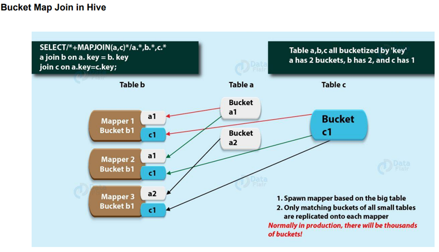

# **Detailed Notes on Hive Day 3**  

## **Partitioning in Hive**  
Partitioning in Apache Hive is a way to divide a table into smaller, related parts based on column values like date, city, or department. It helps in faster query execution by allowing Hive to scan only relevant partitions instead of the entire dataset.

### **Why is Partitioning Important?**  
1. **Speeds Up Queries** – Reduces data search space, leading to faster query execution.  
2. **Reduces I/O Operations** – Scans only necessary partitions, minimizing unnecessary I/O operations.  
3. **Improves Query Performance** – Limits data read operations, optimizing query speed.  
4. **Saves Resources** – Uses fewer computational resources by processing only relevant partitions.  
5. **Manages Large Datasets** – Helps in handling big data efficiently.  
6. **Efficient Filtering** – Speeds up queries that filter based on specific columns.  
7. **Scalability** – New partitions can be added dynamically without degrading performance.  
8. **Data Management & Archiving** – Allows easy deletion or archiving of partitions based on attributes like date.  

### **Creating a Partitioned Table in Hive**
```sql
CREATE TABLE zipcodes (
    RecordNumber int,
    Country string,
    City string,
    Zipcode int
) PARTITIONED BY (state string)
ROW FORMAT DELIMITED
FIELDS TERMINATED BY ',';
```

## **Types of Partitioning in Hive**  

### **1. Static Partitioning**  
- Data is manually inserted into a specific partition.  
- Preferred when loading large files into Hive tables.  
- Faster data loading compared to dynamic partitioning.  
- Requires explicit declaration of partition values.  
- Can be altered or modified.  
- By default, Hive uses **strict mode** for static partitions.  
- The `WHERE` clause is mandatory in static partitions.  

**Syntax to Load Data in a Static Partition:**  
```sql
LOAD DATA INPATH '/hdfs/path/to/datafile' INTO TABLE employees PARTITION (year='2023');
```
OR  
```sql
INSERT OVERWRITE TABLE employees PARTITION (year='2023') 
SELECT name, age FROM emp_data WHERE year = '2023';
```

### **2. Dynamic Partitioning**  
- Partitions are created automatically based on data values.  
- Suitable for large datasets where the number of partitions is unknown.  
- Takes more time compared to static partitioning.  
- No need for a `WHERE` clause to limit partitioning.  
- Cannot alter partitions dynamically.  
- Requires **non-strict mode** for execution.  

**Enabling Dynamic Partitioning:**
```sql
SET hive.exec.dynamic.partition = true;
SET hive.exec.dynamic.partition.mode = nonstrict;
```

**Syntax to Load Data in a Dynamic Partition:**  
```sql
INSERT OVERWRITE TABLE employees PARTITION (year) 
SELECT name, age, year FROM emp_data;
```

---

## **Bucketing in Hive**  
When partitioning results in too many small partitions, **bucketing** is used to distribute data into fixed-sized segments (buckets). This helps optimize query performance and resource utilization.  

### **How Bucketing Works**
- Uses **hashing** on a column value and assigns data to buckets.  
- Uses the **MOD** function to determine the bucket number (e.g., `column_value % total_buckets`).  
- Data with the same bucketed column value goes into the same bucket.  
- Requires the **CLUSTERED BY** clause to specify bucketing.  

**Syntax to Create a Bucketed Table:**
```sql
CREATE TABLE employees_bucketed (
    employee_id INT,
    first_name STRING,
    last_name STRING,
    salary FLOAT,
    department_id INT
) CLUSTERED BY (employee_id) INTO 4 BUCKETS
ROW FORMAT DELIMITED
FIELDS TERMINATED BY ','
STORED AS TEXTFILE;
```

### **Difference Between Partitioning & Bucketing**
| Feature       | Partitioning | Bucketing |
|--------------|-------------|-----------|
| Data Division | Based on column values | Based on hash function |
| Purpose | Reduces data scan space | Optimizes query performance |
| Number of Divisions | Can be large | Fixed number of buckets |
| Metadata Storage | Increases as partitions grow | Less metadata overhead |

### **Using Partitioning & Bucketing Together**
```sql
CREATE TABLE employees (
    employee_id INT,
    first_name STRING,
    last_name STRING,
    salary FLOAT
) PARTITIONED BY (department_id INT)
CLUSTERED BY (employee_id) INTO 4 BUCKETS
ROW FORMAT DELIMITED
FIELDS TERMINATED BY ','
STORED AS TEXTFILE;
```
This improves data retrieval performance while reducing storage overhead.

---

## **Primary Key in Hive**  
Hive does **not enforce** primary keys like RDBMS. However, from **Hive 2.1.0**, primary keys can be defined for documentation purposes using **DISABLE NOVALIDATE**.

```sql
CREATE TABLE customers (
    customer_id INT,
    name STRING,
    address STRING,
    PRIMARY KEY (customer_id) DISABLE NOVALIDATE
) STORED AS ORC;
```

---

## **Joins in Hive**  

### **1. Map Side Join (Broadcast Join)**
- Optimized join where a **small table** is loaded into memory.  
- Avoids reducer usage, improving performance.  
- Best for cases where one table is significantly smaller than the other.  

**Enabling Map Side Join:**
```sql
SET hive.auto.convert.join=true;
SET hive.mapjoin.smalltable.filesize=50000000;  // Setting 50MB as the limit
```
---

### **2. Bucket Map Join**
- Both tables should be **bucketed on the join column**.  
- Instead of loading the entire small table into memory, only relevant buckets are loaded.  
- Reduces memory consumption and improves performance.  

**Enabling Bucket Map Join:**
```sql
SET hive.auto.convert.join=true;
SET hive.optimize.bucketmapjoin=true;
```

---

### **3. Sorted Merge Bucket (SMB) Join**
- Both tables should be **bucketed & sorted** on the join column.  
- Does not require one table to fit into memory.  
- Optimized for large dataset joins.  

**Enabling SMB Join:**
```sql
SET hive.auto.convert.sortmerge.join=true;
SET hive.optimize.bucketmapjoin.sortedmerge=true;
```

---

### **4. Skew Join in Hive**
- Handles **data skew** where some keys appear frequently, causing slow reducers.  
- Hive first processes non-skewed keys, then redistributes skewed keys across reducers.  

**Enabling Skew Join:**
```sql
SET hive.optimize.skewjoin=true;
SET hive.skewjoin.key=50000;  // Setting the threshold to 50,000
```

---

## **Conclusion**
- **Partitioning** optimizes data retrieval and storage efficiency by dividing tables into logical subsets.  
- **Bucketing** reduces excessive partitioning overhead and improves performance.  
- **Joins** in Hive can be optimized using **Map Side Join, Bucket Map Join, Sorted Merge Bucket Join, and Skew Join** to handle large-scale data efficiently.  
- **Primary keys** exist for documentation but are not enforced.  

---
These notes cover all essential concepts from your document with explanations and syntax for better understanding. Let me know if you need more details on any topic! 🚀


<br/>
<br/>

## **📌 1. Table Creation & Data Loading**
### **(A) Creating a Simple Table**
```sql
CREATE TABLE sales_data_v2 ( 
    p_type STRING, 
    total_sales INT 
) 
ROW FORMAT DELIMITED 
FIELDS TERMINATED BY ',';
```
**Explanation:**  
- This creates a simple table named **`sales_data_v2`** with two columns:
  - **`p_type` (STRING)** → Represents product type.
  - **`total_sales` (INT)** → Stores total sales.
- **`ROW FORMAT DELIMITED`** → Specifies that the table will store delimited text data.
- **`FIELDS TERMINATED BY ','`** → Defines **comma (`,`)** as the delimiter separating the values in a row.

**Example Data (`sales_data_raw.csv`):**
```
Electronics,50000
Clothing,30000
Groceries,20000
```
---

### **(B) Loading Data into the Table**
```sql
LOAD DATA LOCAL INPATH 'file:///home/myDataskills/sales_data_raw.csv' 
INTO TABLE sales_data_v2;
```
**Explanation:**  
- Loads data from a **local CSV file** into the table **`sales_data_v2`**.
- **`LOCAL INPATH`** → Means the file is stored **locally**, not in HDFS.
- The file **`sales_data_raw.csv`** is expected to be in the specified location.

---

## **📌 2. Creating a Backup Table**
```sql
CREATE TABLE sales_data_v2_bkup AS 
SELECT * FROM sales_data_v2;
```
**Explanation:**  
- This command creates a **backup table** named `sales_data_v2_bkup`.
- The **`AS SELECT * FROM sales_data_v2`** copies all the data from `sales_data_v2` into the backup table.

---

## **📌 3. Working with Different File Formats**
Hive supports various file formats like **CSV, JSON, Parquet, and ORC**.

### **(A) Creating a CSV Table with SerDe**
```sql
CREATE TABLE csv_table (
    name STRING,
    location STRING
)
ROW FORMAT SERDE 'org.apache.hadoop.hive.serde2.OpenCSVSerde'
WITH SERDEPROPERTIES (
  'separatorChar' = ',',
  'quoteChar' = '\"',
  'escapeChar' = '\\'
)
STORED AS TEXTFILE
TBLPROPERTIES ("skip.header.line.count" = "1");
```
**Explanation:**  
- **`OpenCSVSerde`** → Tells Hive how to process CSV files.
- **`separatorChar` = ','** → Specifies that values are separated by a **comma**.
- **`quoteChar` = '\"'** → Defines **double quotes** as the enclosing character.
- **`escapeChar` = '\\'** → Allows escaping special characters.
- **`TBLPROPERTIES ("skip.header.line.count" = "1")`** → Skips the **header row**.

**Example Data (`csv_file.csv`):**
```
name,location
John,New York
Alice,California
```

### **Loading Data**
```sql
LOAD DATA LOCAL INPATH 'file:///home/myDataskills/csv_file.csv' 
INTO TABLE csv_table;
```
---

### **(B) Creating a JSON Table with SerDe**
```sql
CREATE TABLE json_table (
    name STRING,
    id INT,
    skills ARRAY<STRING>
)
ROW FORMAT SERDE 'org.apache.hadoop.hive.serde2.JsonSerDe'
STORED AS TEXTFILE;
```
**Explanation:**  
- **Uses `JsonSerDe`** → Allows Hive to read **JSON format**.
- **Example JSON Data (`json_file.json`):**
```json
{"name": "John", "id": 1, "skills": ["Java", "SQL"]}
{"name": "Alice", "id": 2, "skills": ["Python", "Hive"]}
```

### **Loading Data**
```sql
LOAD DATA LOCAL INPATH 'file:///home/myDataskills/json_file.json' 
INTO TABLE json_table;
```
---

### **(C) Storing Data in Parquet Format**
```sql
CREATE TABLE sales_data_pq_final (
    product_type STRING,
    total_sales INT
)
STORED AS PARQUET;
```
**Explanation:**  
- **Parquet is a columnar storage format**, which is optimized for analytics and queries.
- The data will be stored in **binary format**, making it **faster** than CSV and JSON.

### **Inserting Data from `sales_data_v2`**
```sql
FROM sales_data_v2 
INSERT OVERWRITE TABLE sales_data_pq_final 
SELECT *;
```

---

## **📌 4. Partitioning Tables in Hive**
Partitioning allows data to be stored in different directories based on column values.

### **(A) Static Partitioning**
```sql
CREATE TABLE automobile_sales_data_static_part (
    ORDERNUMBER INT,
    QUANTITYORDERED INT,
    SALES FLOAT,
    YEAR_ID INT
)
PARTITIONED BY (COUNTRY STRING);
```
- This table is **partitioned by COUNTRY** (each country gets a separate folder in HDFS).

### **Loading Data into a Specific Partition**
```sql
INSERT OVERWRITE TABLE automobile_sales_data_static_part 
PARTITION(COUNTRY = 'USA') 
SELECT ORDERNUMBER, QUANTITYORDERED, SALES, YEAR_ID 
FROM automobile_sales_data_orc 
WHERE COUNTRY = 'USA';
```
- Only **USA data** will be stored in a separate partition.

---

### **(B) Dynamic Partitioning**
```sql
SET hive.exec.dynamic.partition.mode = nonstrict;
```
- Enables **automatic partitioning** instead of manually specifying partitions.

```sql
INSERT OVERWRITE TABLE automobile_sales_data_dynamic_part 
PARTITION(COUNTRY) 
SELECT ORDERNUMBER, QUANTITYORDERED, SALES, YEAR_ID, COUNTRY 
FROM automobile_sales_data_orc;
```
- Hive will automatically create **partitions based on COUNTRY values**.

---

### **(C) Multi-Level Partitioning**
```sql
CREATE TABLE automobile_sales_dynamic_multilevel_part (
    ORDERNUMBER INT,
    QUANTITYORDERED INT,
    SALES FLOAT
)
PARTITIONED BY (COUNTRY STRING, YEAR_ID INT);
```
- The data will be stored in **two levels of partitions**:  
  - **First by COUNTRY**  
  - **Then by YEAR_ID**

### **Inserting Data**
```sql
INSERT OVERWRITE TABLE automobile_sales_dynamic_multilevel_part 
PARTITION(COUNTRY, YEAR_ID) 
SELECT ORDERNUMBER, QUANTITYORDERED, SALES, COUNTRY, YEAR_ID 
FROM automobile_sales_data_orc;
```

---

## **📌 5. Bucketing for Optimization**
### **(A) Creating a Bucketed Table**
```sql
CREATE TABLE buck_users (
    id INT,
    name STRING,
    salary INT,
    unit STRING
)
CLUSTERED BY (id) 
INTO 2 BUCKETS;
```
- **Bucketing divides data into fixed-size buckets** based on `id`.
- Improves **query performance** and **join efficiency**.

### **Inserting Data**
```sql
INSERT OVERWRITE TABLE buck_users 
SELECT * FROM users;
```

---

## **📌 6. Optimized Joins in Hive**
### **(A) Enabling Map-Side Join**
```sql
SET hive.auto.convert.join = true;
```
- This allows **faster joins** by processing smaller tables in memory.

```sql
SELECT * 
FROM buck_users u 
INNER JOIN buck_locations l 
ON u.id = l.id;
```

### **(B) Enabling Bucket Map Join**
```sql
SET hive.optimize.bucketmapjoin = true;
```
- Optimizes **joins on bucketed tables**.

### **(C) Enabling Sorted Merge Bucket Map Join**
```sql
SET hive.auto.convert.sortmerge.join = true; 
SET hive.optimize.bucketmapjoin.sortedmerge = true;
```
- **Best optimization for large-scale joins**.

---

## **🔹 Summary**
1. **CSV, JSON, and Parquet** → Different storage formats.
2. **Partitioning** → Splits data into directories.
3. **Bucketing** → Divides data into fixed-sized parts.
4. **Optimized Joins** → Improve performance in large datasets.

<br/>
<br/>

# Step-by-Step Process for Creating Tables in Hive, Inserting Data, and Applying Partitioning and Bucketing

We will use the provided CSV files (`users.csv` and `locations.csv`) to demonstrate how to:
1. Create tables in Hive.
2. Load data from CSV files into Hive tables.
3. Apply **partitioning** and **bucketing** to optimize query performance.

---

### **Step 1: Create Tables in Hive**

#### **1.1 Create `users` Table**
The `users.csv` file contains the following columns:
- `id`: Unique identifier for each user.
- `name`: Name of the user.
- `salary`: Salary of the user.
- `department`: Department the user belongs to.

```sql
CREATE TABLE users (
    id INT,
    name STRING,
    salary INT,
    department STRING
)
ROW FORMAT DELIMITED
FIELDS TERMINATED BY ','
STORED AS TEXTFILE;
```

#### **1.2 Create `locations` Table**
The `locations.csv` file contains the following columns:
- `id`: Unique identifier for each location.
- `location`: Name of the location.

```sql
CREATE TABLE locations (
    id INT,
    location STRING
)
ROW FORMAT DELIMITED
FIELDS TERMINATED BY ','
STORED AS TEXTFILE;
```

---

### **Step 2: Load Data from CSV Files into Hive Tables**

#### **2.1 Load Data into `users` Table**
Use the `LOAD DATA` command to load data from `users.csv` into the `users` table.

```sql
LOAD DATA LOCAL INPATH '/path/to/users.csv' INTO TABLE users;
```

#### **2.2 Load Data into `locations` Table**
Use the `LOAD DATA` command to load data from `locations.csv` into the `locations` table.

```sql
LOAD DATA LOCAL INPATH '/path/to/locations.csv' INTO TABLE locations;
```

---

### **Step 3: Apply Partitioning**

#### **3.1 Create a Partitioned Table**
We will partition the `users` table by the `department` column. This will create separate directories for each department in HDFS.

```sql
CREATE TABLE users_partitioned (
    id INT,
    name STRING,
    salary INT
)
PARTITIONED BY (department STRING)
ROW FORMAT DELIMITED
FIELDS TERMINATED BY ','
STORED AS TEXTFILE;
```

#### **3.2 Insert Data into the Partitioned Table**
Insert data into the partitioned table using the `INSERT OVERWRITE` command.

```sql
INSERT OVERWRITE TABLE users_partitioned PARTITION (department)
SELECT id, name, salary, department FROM users;
```

- **Result**: The `users_partitioned` table will have separate partitions for each department (`DNA` and `FCS`).

---

### **Step 4: Apply Bucketing**

#### **4.1 Create a Bucketed Table**
We will bucket the `users` table by the `id` column into 2 buckets. This will distribute the data evenly across 2 files.

```sql
CREATE TABLE users_bucketed (
    id INT,
    name STRING,
    salary INT,
    department STRING
)
CLUSTERED BY (id) INTO 2 BUCKETS
ROW FORMAT DELIMITED
FIELDS TERMINATED BY ','
STORED AS TEXTFILE;
```

#### **4.2 Insert Data into the Bucketed Table**
Insert data into the bucketed table using the `INSERT OVERWRITE` command.

```sql
INSERT OVERWRITE TABLE users_bucketed
SELECT * FROM users;
```

- **Result**: The `users_bucketed` table will have 2 buckets, with records distributed based on a hash of the `id` column.

---

### **Step 5: Combining Partitioning and Bucketing**

#### **5.1 Create a Partitioned and Bucketed Table**
We will create a table that is both partitioned by `department` and bucketed by `id`.

```sql
CREATE TABLE users_partitioned_bucketed (
    id INT,
    name STRING,
    salary INT
)
PARTITIONED BY (department STRING)
CLUSTERED BY (id) INTO 2 BUCKETS
ROW FORMAT DELIMITED
FIELDS TERMINATED BY ','
STORED AS TEXTFILE;
```

#### **5.2 Insert Data into the Partitioned and Bucketed Table**
Insert data into the table using the `INSERT OVERWRITE` command.

```sql
INSERT OVERWRITE TABLE users_partitioned_bucketed PARTITION (department)
SELECT id, name, salary, department FROM users;
```

- **Result**: The `users_partitioned_bucketed` table will have:
  - Partitions for each department (`DNA` and `FCS`).
  - Within each partition, data will be distributed into 2 buckets based on the `id` column.

---

### **Step 6: Querying the Tables**

#### **6.1 Querying a Partitioned Table**
To query data for a specific department (e.g., `DNA`):

```sql
SELECT * FROM users_partitioned WHERE department = 'DNA';
```

- **Benefit**: Hive will only scan the `department=DNA` partition, improving query performance.

#### **6.2 Querying a Bucketed Table**
To query data from a specific bucket:

```sql
SELECT * FROM users_bucketed TABLESAMPLE(BUCKET 1 OUT OF 2);
```

- **Benefit**: Hive will only scan the first bucket, allowing for efficient data sampling.

#### **6.3 Querying a Partitioned and Bucketed Table**
To query data for a specific department and bucket:

```sql
SELECT * FROM users_partitioned_bucketed
WHERE department = 'DNA'
TABLESAMPLE(BUCKET 1 OUT OF 2);
```

- **Benefit**: Hive will only scan the `department=DNA` partition and the first bucket, further optimizing query performance.

---

### **Summary of Steps**
1. **Create Tables**: Define the schema for `users` and `locations` tables.
2. **Load Data**: Load data from CSV files into Hive tables.
3. **Partitioning**: Create a partitioned table (`users_partitioned`) to organize data by `department`.
4. **Bucketing**: Create a bucketed table (`users_bucketed`) to distribute data evenly across buckets.
5. **Combining Partitioning and Bucketing**: Create a table (`users_partitioned_bucketed`) that uses both techniques for optimal query performance.
6. **Querying**: Demonstrate how to query partitioned and bucketed tables efficiently.

By following these steps, you can effectively manage and query large datasets in Hive using partitioning and bucketing.


<br/>
<br/>

# **Optimal Joins in Hive: Detailed Explanation with Real-Time Example**

In Hive, **joins** are used to combine data from two or more tables based on a related column. However, joins can be expensive operations, especially when dealing with large datasets. To optimize join performance, Hive provides several techniques, such as **Map Joins**, **Bucket Map Joins**, and **Sorted Merge Bucket Joins**. Below, we’ll explore these concepts in detail with a real-time example.

---

### **1. Map Join (Broadcast Join)**

#### **Concept**:
- A **Map Join** is an optimization where the smaller table is loaded into memory and broadcasted to all mappers.
- The join is performed in the **map phase**, eliminating the need for a reduce phase.
- This is ideal when one table is small enough to fit into memory.

#### **Real-Time Example**:
- **Tables**:
  - `orders` (large table): Contains order details.
  - `customers` (small table): Contains customer details.
- **Scenario**: You want to join `orders` and `customers` on `customer_id`.

#### **Steps**:
1. **Enable Map Join**:
   ```sql
   SET hive.auto.convert.join=true;
   SET hive.mapjoin.smalltable.filesize=25000000; -- Set small table size limit (default: 25MB)
   ```

2. **Perform the Join**:
   ```sql
   SELECT o.order_id, o.order_date, c.customer_name
   FROM orders o
   JOIN customers c
   ON o.customer_id = c.customer_id;
   ```

- **How It Works**:
  - The `customers` table is loaded into memory and broadcasted to all mappers.
  - Each mapper reads a chunk of the `orders` table and performs the join with the in-memory `customers` table.
  - No reduce phase is needed, making the join faster.

---

### **2. Bucket Map Join**

#### **Concept**:
- A **Bucket Map Join** is an optimization where both tables are **bucketed** on the join column.
- Only the relevant buckets from the small table are loaded into memory, reducing memory usage.
- This allows larger tables to be used in Map Joins.

#### **Real-Time Example**:
- **Tables**:
  - `orders` (bucketed by `customer_id` into 4 buckets).
  - `customers` (bucketed by `customer_id` into 4 buckets).
- **Scenario**: You want to join `orders` and `customers` on `customer_id`.

#### **Steps**:
1. **Create Bucketed Tables**:
   ```sql
   CREATE TABLE orders_bucketed (
       order_id INT,
       order_date STRING,
       customer_id INT
   )
   CLUSTERED BY (customer_id) INTO 4 BUCKETS;

   CREATE TABLE customers_bucketed (
       customer_id INT,
       customer_name STRING
   )
   CLUSTERED BY (customer_id) INTO 4 BUCKETS;
   ```

2. **Enable Bucket Map Join**:
   ```sql
   SET hive.auto.convert.join=true;
   SET hive.optimize.bucketmapjoin=true;
   ```

3. **Perform the Join**:
   ```sql
   SELECT o.order_id, o.order_date, c.customer_name
   FROM orders_bucketed o
   JOIN customers_bucketed c
   ON o.customer_id = c.customer_id;
   ```

- **How It Works**:
  - Only the matching buckets from the `customers` table are loaded into memory.
  - Each mapper reads a bucket from the `orders` table and joins it with the corresponding bucket from the `customers` table.
  - This reduces memory usage and improves performance.

---

### **3. Sorted Merge Bucket (SMB) Join**

#### **Concept**:
- A **Sorted Merge Bucket Join** is an optimization where both tables are **bucketed and sorted** on the join column.
- Each mapper reads a bucket from each table and performs the join, reducing disk I/O.
- This is scalable and does not require the small table to fit into memory.

#### **Real-Time Example**:
- **Tables**:
  - `orders` (bucketed and sorted by `customer_id` into 4 buckets).
  - `customers` (bucketed and sorted by `customer_id` into 4 buckets).
- **Scenario**: You want to join `orders` and `customers` on `customer_id`.

#### **Steps**:
1. **Create Bucketed and Sorted Tables**:
   ```sql
   CREATE TABLE orders_sorted_bucketed (
       order_id INT,
       order_date STRING,
       customer_id INT
   )
   CLUSTERED BY (customer_id) SORTED BY (customer_id) INTO 4 BUCKETS;

   CREATE TABLE customers_sorted_bucketed (
       customer_id INT,
       customer_name STRING
   )
   CLUSTERED BY (customer_id) SORTED BY (customer_id) INTO 4 BUCKETS;
   ```

2. **Enable SMB Join**:
   ```sql
   SET hive.auto.convert.sortmerge.join=true;
   SET hive.optimize.bucketmapjoin.sortedmerge=true;
   ```

3. **Perform the Join**:
   ```sql
   SELECT o.order_id, o.order_date, c.customer_name
   FROM orders_sorted_bucketed o
   JOIN customers_sorted_bucketed c
   ON o.customer_id = c.customer_id;
   ```

- **How It Works**:
  - Each mapper reads a bucket from the `orders` table and the corresponding bucket from the `customers` table.
  - Since both tables are sorted, the join can be performed efficiently without additional sorting.
  - This reduces disk I/O and improves performance.

---

### **4. Skew Join**

#### **Concept**:
- A **Skew Join** is used to handle **skewed data**, where some keys appear more frequently than others.
- Skewed keys are processed separately to avoid overloading a single reducer.

#### **Real-Time Example**:
- **Tables**:
  - `sales` (contains skewed data for `product_id`).
  - `products` (contains product details).
- **Scenario**: You want to join `sales` and `products` on `product_id`, but some `product_id` values are very frequent.

#### **Steps**:
1. **Enable Skew Join**:
   ```sql
   SET hive.optimize.skewjoin=true;
   SET hive.skewjoin.key=10000; -- Set threshold for skewed keys (default: 10000)
   ```

2. **Perform the Join**:
   ```sql
   SELECT s.sale_id, s.sale_date, p.product_name
   FROM sales s
   JOIN products p
   ON s.product_id = p.product_id;
   ```

- **How It Works**:
  - Hive identifies skewed keys (e.g., `product_id` values that appear more than 10,000 times).
  - Non-skewed keys are processed in the first stage.
  - Skewed keys are processed in the second stage, where they are distributed across multiple reducers.
  - This avoids overloading a single reducer and improves performance.

---

### **Summary of Optimal Joins in Hive**

| **Join Type**          | **Use Case**                                                                 | **Optimization**                                                                 |
|-------------------------|-----------------------------------------------------------------------------|---------------------------------------------------------------------------------|
| **Map Join**            | Small table fits in memory.                                                 | Loads small table into memory and performs join in map phase.                   |
| **Bucket Map Join**     | Both tables are bucketed on the join column.                                | Loads only relevant buckets into memory.                                        |
| **SMB Join**            | Both tables are bucketed and sorted on the join column.                     | Performs join by reading corresponding buckets, reducing disk I/O.             |
| **Skew Join**           | Data is skewed (some keys appear very frequently).                          | Processes skewed keys separately to avoid overloading reducers.                 |

---

### **Real-Time Example: E-Commerce Data Analysis**

#### **Scenario**:
- You have two tables:
  - `orders`: Contains order details (large table).
  - `customers`: Contains customer details (small table).
- You want to analyze orders by joining these tables on `customer_id`.

#### **Optimal Join Strategy**:
1. Use a **Map Join** if the `customers` table is small enough to fit into memory.
2. Use a **Bucket Map Join** if both tables are bucketed on `customer_id`.
3. Use an **SMB Join** if both tables are bucketed and sorted on `customer_id`.
4. Use a **Skew Join** if the `customer_id` column is skewed (some customers have many orders).

By applying these optimizations, you can significantly improve the performance of joins in Hive, especially when dealing with large datasets.

<br/>
<br/>


# **What is a Map Side Join?**

A **Map Side Join** (also known as a **Broadcast Join**) is an optimized join operation in Hive where:
- The **smaller table** (dimension table) is loaded into memory.
- The **larger table** (fact table) is read line by line.
- The join operation is performed during the **map phase** of the MapReduce job, eliminating the need for a **reduce phase**.

This makes the join operation **much faster** than a traditional join, which requires both map and reduce phases.

---

### **Why Use a Map Side Join?**

- **Performance**: Since the smaller table is loaded into memory and the join is performed in the map phase, the operation is faster.
- **No Reduce Phase**: The absence of a reduce phase reduces the overhead of shuffling and sorting data.
- **Ideal for Small Tables**: This join is most effective when one of the tables is small enough to fit into memory.

---

### **How Does a Map Side Join Work?**

1. **Small Table in Memory**:
   - The smaller table (e.g., `customers`) is loaded into memory and broadcasted to all mappers.
   
2. **Large Table Processing**:
   - The larger table (e.g., `orders`) is read line by line by the mappers.
   
3. **Join Operation**:
   - Each mapper performs the join between the rows of the larger table and the in-memory smaller table.
   
4. **Output**:
   - The joined results are written directly to the output files, bypassing the reduce phase.

---

### **Configuration for Map Side Join**

To enable and configure a Map Side Join in Hive, you need to set the following properties:

#### **1. `hive.auto.convert.join`**
- **Purpose**: This property allows Hive to automatically convert a common join into a Map Join if the smaller table fits into memory.
- **Default Value**: `false`
- **Set to**: `true`
- **Example**:
  ```sql
  SET hive.auto.convert.join=true;
  ```

#### **2. `hive.mapjoin.smalltable.filesize`**
- **Purpose**: This property sets the maximum size of the small table that can be loaded into memory for a Map Join.
- **Default Value**: `25000000 bytes` (approximately 25MB)
- **Set to**: A higher value if your small table is larger than 25MB (e.g., 50MB).
- **Example**:
  ```sql
  SET hive.mapjoin.smalltable.filesize=50000000; -- 50MB
  ```

---

### **Real-Time Example of Map Side Join**

#### **Scenario**:
- You have two tables:
  - `orders` (large table): Contains order details.
  - `customers` (small table): Contains customer details.
- You want to join these tables on `customer_id` to get order details along with customer names.

#### **Steps**:
1. **Enable Map Join**:
   ```sql
   SET hive.auto.convert.join=true;
   SET hive.mapjoin.smalltable.filesize=50000000; -- Set small table size limit to 50MB
   ```

2. **Perform the Join**:
   ```sql
   SELECT o.order_id, o.order_date, c.customer_name
   FROM orders o
   JOIN customers c
   ON o.customer_id = c.customer_id;
   ```

#### **How It Works**:
- The `customers` table is loaded into memory and broadcasted to all mappers.
- Each mapper reads a chunk of the `orders` table and performs the join with the in-memory `customers` table.
- The results are written directly to the output files without requiring a reduce phase.

---

### **Advantages of Map Side Join**
1. **Faster Execution**: No reduce phase means less overhead and faster execution.
2. **Efficient for Small Tables**: Ideal when one table is small enough to fit into memory.
3. **Reduced Disk I/O**: Since the smaller table is in memory, there is less disk I/O compared to traditional joins.

---

### **Limitations of Map Side Join**
1. **Memory Constraint**: The smaller table must fit into memory. If the table is too large, the join will fail or fall back to a regular join.
2. **Not Suitable for Large Tables**: If both tables are large, a Map Side Join cannot be used.

---

### **Summary**

- **Map Side Join** is a powerful optimization in Hive for joining a small table with a large table.
- It works by loading the smaller table into memory and performing the join in the map phase, eliminating the need for a reduce phase.
- To use it, enable `hive.auto.convert.join` and set an appropriate value for `hive.mapjoin.smalltable.filesize`.
- It is ideal for scenarios where one table is small and can fit into memory, such as joining a large `orders` table with a small `customers` table.

By using Map Side Joins, you can significantly improve the performance of your Hive queries when dealing with large datasets.

<br/>
<br/>

# **What is a Bucket Map Join?**

A **Bucket Map Join** is an optimized version of a **Map Join** in Hive where:
- Both tables are **bucketed** on the join column(s).
- Instead of loading the entire small table into memory, only the **relevant buckets** from the small table are loaded.
- This reduces memory usage and allows larger tables to be used in a Map Join.

---

### **Why Use a Bucket Map Join?**

- **Reduced Memory Usage**: Only the relevant buckets from the small table are loaded into memory, making it more memory-efficient than a standard Map Join.
- **Handles Larger Tables**: Since only specific buckets are loaded, larger tables can be used in the join operation.
- **Improved Performance**: By reducing the amount of data loaded into memory, the join operation becomes faster and more efficient.

---

### **Conditions for Bucket Map Join**

To perform a Bucket Map Join, the following conditions must be satisfied:
1. **Both Tables Must Be Bucketed**:
   - Both the large table (fact table) and the small table (dimension table) must be **bucketed** on the join column(s).
   
2. **Number of Buckets**:
   - The number of buckets in the **large table** must be a **multiple** of the number of buckets in the **small table**.
   - Example: If the small table has 2 buckets, the large table must have 2, 4, 6, etc., buckets.

---

### **Configuration for Bucket Map Join**

To enable and configure a Bucket Map Join in Hive, you need to set the following properties:

#### **1. `hive.auto.convert.join`**
- **Purpose**: This property allows Hive to automatically convert a common join into a Map Join if the conditions are met.
- **Default Value**: `false`
- **Set to**: `true`
- **Example**:
  ```sql
  SET hive.auto.convert.join=true;
  ```

#### **2. `hive.optimize.bucketmapjoin`**
- **Purpose**: This property enables Hive to convert common joins into Bucket Map Joins when the conditions are satisfied.
- **Default Value**: `false`
- **Set to**: `true`
- **Example**:
  ```sql
  SET hive.optimize.bucketmapjoin=true;
  ```

---

### **Real-Time Example of Bucket Map Join**

#### **Scenario**:
- You have two tables:
  - `orders` (large table): Bucketed by `customer_id` into 4 buckets.
  - `customers` (small table): Bucketed by `customer_id` into 2 buckets.
- You want to join these tables on `customer_id` to get order details along with customer names.

#### **Steps**:
1. **Create Bucketed Tables**:
   ```sql
   CREATE TABLE orders_bucketed (
       order_id INT,
       order_date STRING,
       customer_id INT
   )
   CLUSTERED BY (customer_id) INTO 4 BUCKETS;

   CREATE TABLE customers_bucketed (
       customer_id INT,
       customer_name STRING
   )
   CLUSTERED BY (customer_id) INTO 2 BUCKETS;
   ```

2. **Enable Bucket Map Join**:
   ```sql
   SET hive.auto.convert.join=true;
   SET hive.optimize.bucketmapjoin=true;
   ```

3. **Perform the Join**:
   ```sql
   SELECT o.order_id, o.order_date, c.customer_name
   FROM orders_bucketed o
   JOIN customers_bucketed c
   ON o.customer_id = c.customer_id;
   ```

#### **How It Works**:
- The `orders` table is divided into 4 buckets, and the `customers` table is divided into 2 buckets.
- Only the relevant buckets from the `customers` table are loaded into memory.
- Each mapper reads a bucket from the `orders` table and joins it with the corresponding bucket from the `customers` table.
- The results are written directly to the output files without requiring a reduce phase.

---

### **Advantages of Bucket Map Join**
1. **Memory Efficiency**: Only relevant buckets are loaded into memory, reducing memory usage.
2. **Handles Larger Tables**: Allows larger tables to be used in Map Joins.
3. **Improved Performance**: By reducing the amount of data loaded into memory, the join operation becomes faster.

---

### **Limitations of Bucket Map Join**
1. **Bucketing Required**: Both tables must be bucketed on the join column(s).
2. **Bucket Multiple Constraint**: The number of buckets in the large table must be a multiple of the number of buckets in the small table.

---

### **Summary**

- **Bucket Map Join** is an optimization of Map Join in Hive where both tables are bucketed on the join column(s).
- It reduces memory usage by loading only the relevant buckets from the small table into memory.
- To use it, enable `hive.auto.convert.join` and `hive.optimize.bucketmapjoin`.
- It is ideal for scenarios where both tables are bucketed and the large table has a multiple of the number of buckets in the small table.

By using Bucket Map Joins, you can significantly improve the performance and efficiency of your Hive queries when dealing with large datasets.

<br/>
<br/>



The image you provided explains the concept of **Bucket Map Join** in Apache Hive with a specific example. Let’s break it down step by step and explain it in detail:

---

### **What is a Bucket Map Join?**

A **Bucket Map Join** is an optimized join operation in Hive where:
- Both tables are **bucketed** on the join column(s).
- Only the **relevant buckets** from the small table(s) are loaded into memory.
- This reduces memory usage and allows larger tables to be used in the join operation.

---

### **Key Concepts in the Example**

1. **Tables Involved**:
   - **Table `a`**: Bucketed by `key` into 2 buckets (`a1`, `a2`).
   - **Table `b`**: Bucketed by `key` into 2 buckets (`b1`, `b2`).
   - **Table `c`**: Bucketed by `key` into 1 bucket (`c1`).

2. **Join Condition**:
   - The tables are joined on the `key` column.
   - The query joins `a` with `b` and `c` using the `key` column.

3. **Mapper Behavior**:
   - Mappers are spawned based on the **big table** (in this case, `b`).
   - Only the **matching buckets** from the small tables (`a` and `c`) are replicated onto each mapper.

---

### **How Does a Bucket Map Join Work?**

1. **Bucketing**:
   - Each table is divided into buckets based on the `key` column.
   - Table `a` has 2 buckets (`a1`, `a2`).
   - Table `b` has 2 buckets (`b1`, `b2`).
   - Table `c` has 1 bucket (`c1`).

2. **Mapper Spawning**:
   - Mappers are created based on the **big table** (`b`).
   - Each mapper processes a specific bucket from the big table.

3. **Bucket Replication**:
   - Only the **matching buckets** from the small tables (`a` and `c`) are loaded into memory for each mapper.
   - For example:
     - If a mapper is processing bucket `b1` from table `b`, it will load the corresponding bucket `a1` from table `a` and bucket `c1` from table `c`.

4. **Join Execution**:
   - The join operation is performed within each mapper.
   - The results are written directly to the output files without requiring a reduce phase.

---

### **Example Query**

The query in the image is:

```sql
SELECT /*+MAPJOIN(a,c)*/ a.*, b.*, c.*
FROM a
JOIN b ON a.key = b.key
JOIN c ON a.key = c.key;
```

- **`/*+MAPJOIN(a,c)*/`**: This hint tells Hive to use a Map Join for tables `a` and `c`.
- **Join Conditions**:
  - `a` is joined with `b` on `a.key = b.key`.
  - `a` is joined with `c` on `a.key = c.key`.

---

### **Steps in the Bucket Map Join**

1. **Mapper 1**:
   - Processes bucket `b1` from table `b`.
   - Loads bucket `a1` from table `a` and bucket `c1` from table `c` into memory.
   - Performs the join between `b1`, `a1`, and `c1`.

2. **Mapper 2**:
   - Processes bucket `b2` from table `b`.
   - Loads bucket `a2` from table `a` and bucket `c1` from table `c` into memory.
   - Performs the join between `b2`, `a2`, and `c1`.

3. **Mapper 3**:
   - Processes bucket `b1` from table `b`.
   - Loads bucket `a1` from table `a` and bucket `c1` from table `c` into memory.
   - Performs the join between `b1`, `a1`, and `c1`.

---

### **Advantages of Bucket Map Join**

1. **Memory Efficiency**:
   - Only the relevant buckets from the small tables are loaded into memory, reducing memory usage.

2. **Handles Larger Tables**:
   - Since only specific buckets are loaded, larger tables can be used in the join operation.

3. **Improved Performance**:
   - By reducing the amount of data loaded into memory, the join operation becomes faster and more efficient.

---

### **Limitations of Bucket Map Join**

1. **Bucketing Required**:
   - Both tables must be bucketed on the join column(s).

2. **Bucket Multiple Constraint**:
   - The number of buckets in the large table must be a multiple of the number of buckets in the small table.

---

### **Summary**

- **Bucket Map Join** is an optimization of Map Join in Hive where both tables are bucketed on the join column(s).
- It reduces memory usage by loading only the relevant buckets from the small table(s) into memory.
- In the example:
  - Table `a` has 2 buckets, table `b` has 2 buckets, and table `c` has 1 bucket.
  - Mappers are spawned based on the big table (`b`), and only the matching buckets from the small tables (`a` and `c`) are loaded into memory.
- This optimization is ideal for scenarios where both tables are bucketed and the large table has a multiple of the number of buckets in the small table.

By using Bucket Map Joins, you can significantly improve the performance and efficiency of your Hive queries when dealing with large datasets.


<br/>
<br/>

# **Sorted Merge Bucket (SMB) Join in Hive: Detailed Explanation**

The **Sorted Merge Bucket (SMB) Join** is an advanced optimization technique in Apache Hive designed to improve the performance of join operations when working with large datasets. It is particularly useful when both tables involved in the join are **bucketed** and **sorted** on the join column(s). Below is a detailed explanation of SMB Join, its working, and how to enable it.

---

### **What is Sorted Merge Bucket (SMB) Join?**

- **Definition**: SMB Join is an optimization technique where both tables are **bucketed** and **sorted** on the join column(s). This allows Hive to perform the join operation more efficiently by reducing disk I/O and avoiding the need to load the entire small table into memory.
- **Key Feature**: Unlike **Map Join** or **Bucket Map Join**, SMB Join does not require one of the tables to fit into memory, making it more scalable for large datasets.

---

### **How Does SMB Join Work?**

1. **Bucketing**:
   - Both tables are divided into a fixed number of **buckets** based on a hash function applied to the join column(s).
   - Example: If both tables are bucketed into 4 buckets, each bucket contains a subset of the data.

2. **Sorting**:
   - Within each bucket, the data is **sorted** based on the join column(s).
   - Example: If the join column is `customer_id`, the data in each bucket is sorted by `customer_id`.

3. **Join Operation**:
   - Each mapper reads a **corresponding bucket** from both tables.
   - Since the data is sorted, the join operation can be performed efficiently by merging the sorted buckets.
   - This reduces the need for shuffling and sorting data during the join, minimizing disk I/O.

---

### **Conditions for SMB Join**

For SMB Join to work, the following conditions must be satisfied:
1. **Both Tables Must Be Bucketed**:
   - Both tables must be bucketed on the join column(s).
   - Example: If the join column is `customer_id`, both tables must be bucketed by `customer_id`.

2. **Both Tables Must Be Sorted**:
   - Within each bucket, the data must be sorted on the join column(s).
   - Example: If the join column is `customer_id`, the data in each bucket must be sorted by `customer_id`.

3. **Same Number of Buckets**:
   - Both tables must have the **same number of buckets**.
   - Example: If one table has 4 buckets, the other table must also have 4 buckets.

---

### **Advantages of SMB Join**

1. **Scalability**:
   - SMB Join does not require one of the tables to fit into memory, making it suitable for large datasets.

2. **Reduced Disk I/O**:
   - Since the data is sorted, the join operation can be performed by merging sorted buckets, reducing disk I/O.

3. **Efficient Join Execution**:
   - The join operation is performed within each mapper, eliminating the need for a reduce phase.

---

### **How to Enable SMB Join**

To enable SMB Join in Hive, you need to set the following properties:

#### **1. `hive.auto.convert.sortmerge.join`**
- **Purpose**: This property allows Hive to automatically convert a common join into an SMB Join when the conditions are met.
- **Default Value**: `false`
- **Set to**: `true`
- **Example**:
  ```sql
  SET hive.auto.convert.sortmerge.join=true;
  ```

#### **2. `hive.optimize.bucketmapjoin.sortedmerge`**
- **Purpose**: This property enables Hive to perform SMB Joins.
- **Default Value**: `false`
- **Set to**: `true`
- **Example**:
  ```sql
  SET hive.optimize.bucketmapjoin.sortedmerge=true;
  ```

---

### **Real-Time Example of SMB Join**

#### **Scenario**:
- You have two tables:
  - `orders`: Bucketed and sorted by `customer_id` into 4 buckets.
  - `customers`: Bucketed and sorted by `customer_id` into 4 buckets.
- You want to join these tables on `customer_id`.

#### **Steps**:
1. **Create Bucketed and Sorted Tables**:
   ```sql
   CREATE TABLE orders_bucketed_sorted (
       order_id INT,
       order_date STRING,
       customer_id INT
   )
   CLUSTERED BY (customer_id) SORTED BY (customer_id) INTO 4 BUCKETS;

   CREATE TABLE customers_bucketed_sorted (
       customer_id INT,
       customer_name STRING
   )
   CLUSTERED BY (customer_id) SORTED BY (customer_id) INTO 4 BUCKETS;
   ```

2. **Enable SMB Join**:
   ```sql
   SET hive.auto.convert.sortmerge.join=true;
   SET hive.optimize.bucketmapjoin.sortedmerge=true;
   ```

3. **Perform the Join**:
   ```sql
   SELECT o.order_id, o.order_date, c.customer_name
   FROM orders_bucketed_sorted o
   JOIN customers_bucketed_sorted c
   ON o.customer_id = c.customer_id;
   ```

#### **How It Works**:
- Each mapper reads a bucket from the `orders` table and the corresponding bucket from the `customers` table.
- Since the data is sorted, the join operation is performed by merging the sorted buckets.
- The results are written directly to the output files without requiring a reduce phase.

---

### **Comparison with Other Join Types**

| **Join Type**          | **Memory Usage** | **Scalability** | **Bucketing Required** | **Sorting Required** |
|-------------------------|------------------|-----------------|-------------------------|----------------------|
| **Map Join**            | High             | Low             | No                      | No                   |
| **Bucket Map Join**     | Medium           | Medium          | Yes                     | No                   |
| **SMB Join**            | Low              | High            | Yes                     | Yes                  |

---

### **Summary**

- **SMB Join** is a highly efficient join optimization technique in Hive for large datasets.
- It requires both tables to be **bucketed** and **sorted** on the join column(s).
- It reduces disk I/O by performing the join operation within each mapper using sorted buckets.
- To enable SMB Join, set `hive.auto.convert.sortmerge.join` and `hive.optimize.bucketmapjoin.sortedmerge` to `true`.

By using SMB Join, you can significantly improve the performance of join operations in Hive, especially when working with large datasets. 


<br/>
<br/>

# **Real-Time Uses of Sorted Merge Bucket (SMB) Join in Hive**

The **Sorted Merge Bucket (SMB) Join** is a powerful optimization technique in Hive, particularly useful for large-scale data processing scenarios where both tables are **bucketed** and **sorted** on the join column(s). Below, we’ll explore real-time use cases of SMB Join, along with example datasets and step-by-step explanations.

---

### **Real-Time Use Cases of SMB Join**

1. **E-Commerce Analytics**:
   - **Scenario**: An e-commerce platform wants to analyze customer orders and customer details to generate insights like customer lifetime value, order trends, etc.
   - **Tables**:
     - `orders`: Contains order details (e.g., `order_id`, `customer_id`, `order_date`, `amount`).
     - `customers`: Contains customer details (e.g., `customer_id`, `customer_name`, `location`).
   - **Join Condition**: Join `orders` and `customers` on `customer_id`.

2. **Log Analysis**:
   - **Scenario**: A company wants to analyze server logs and user activity logs to identify patterns or troubleshoot issues.
   - **Tables**:
     - `server_logs`: Contains server logs (e.g., `log_id`, `user_id`, `timestamp`, `event`).
     - `user_activity`: Contains user activity logs (e.g., `user_id`, `activity`, `timestamp`).
   - **Join Condition**: Join `server_logs` and `user_activity` on `user_id`.

3. **Financial Data Processing**:
   - **Scenario**: A bank wants to analyze transactions and customer accounts to detect fraud or generate financial reports.
   - **Tables**:
     - `transactions`: Contains transaction details (e.g., `transaction_id`, `account_id`, `amount`, `date`).
     - `accounts`: Contains account details (e.g., `account_id`, `customer_id`, `balance`).
   - **Join Condition**: Join `transactions` and `accounts` on `account_id`.

4. **Social Media Analytics**:
   - **Scenario**: A social media platform wants to analyze user posts and user profiles to understand engagement trends.
   - **Tables**:
     - `posts`: Contains post details (e.g., `post_id`, `user_id`, `content`, `timestamp`).
     - `users`: Contains user details (e.g., `user_id`, `username`, `location`).
   - **Join Condition**: Join `posts` and `users` on `user_id`.

---

### **Example Dataset and Step-by-Step Implementation**

Let’s take the **E-Commerce Analytics** use case and implement it using SMB Join.

#### **Step 1: Create Bucketed and Sorted Tables**

1. **Create `orders` Table**:
   ```sql
   CREATE TABLE orders_bucketed_sorted (
       order_id INT,
       order_date STRING,
       customer_id INT,
       amount FLOAT
   )
   CLUSTERED BY (customer_id) SORTED BY (customer_id) INTO 4 BUCKETS;
   ```

2. **Create `customers` Table**:
   ```sql
   CREATE TABLE customers_bucketed_sorted (
       customer_id INT,
       customer_name STRING,
       location STRING
   )
   CLUSTERED BY (customer_id) SORTED BY (customer_id) INTO 4 BUCKETS;
   ```

---

#### **Step 2: Load Data into Tables**

1. **Load Data into `orders` Table**:
   ```sql
   INSERT INTO TABLE orders_bucketed_sorted
   VALUES
   (1, '2023-10-01', 101, 100.0),
   (2, '2023-10-02', 102, 200.0),
   (3, '2023-10-03', 101, 150.0),
   (4, '2023-10-04', 103, 300.0);
   ```

2. **Load Data into `customers` Table**:
   ```sql
   INSERT INTO TABLE customers_bucketed_sorted
   VALUES
   (101, 'Alice', 'New York'),
   (102, 'Bob', 'San Francisco'),
   (103, 'Charlie', 'Chicago');
   ```

---

#### **Step 3: Enable SMB Join**

1. **Set Hive Properties**:
   ```sql
   SET hive.auto.convert.sortmerge.join=true;
   SET hive.optimize.bucketmapjoin.sortedmerge=true;
   ```

---

#### **Step 4: Perform the SMB Join**

1. **Join `orders` and `customers` on `customer_id`**:
   ```sql
   SELECT o.order_id, o.order_date, c.customer_name, o.amount
   FROM orders_bucketed_sorted o
   JOIN customers_bucketed_sorted c
   ON o.customer_id = c.customer_id;
   ```

---

#### **Step 5: How It Works**

1. **Bucketing**:
   - Both tables are divided into 4 buckets based on `customer_id`.
   - Example:
     - Bucket 1: `customer_id % 4 = 0`
     - Bucket 2: `customer_id % 4 = 1`
     - Bucket 3: `customer_id % 4 = 2`
     - Bucket 4: `customer_id % 4 = 3`

2. **Sorting**:
   - Within each bucket, the data is sorted by `customer_id`.

3. **Join Execution**:
   - Each mapper reads a bucket from the `orders` table and the corresponding bucket from the `customers` table.
   - Since the data is sorted, the join operation is performed by merging the sorted buckets.
   - The results are written directly to the output files without requiring a reduce phase.

---

#### **Step 6: Output**

The output of the query will be:

| **order_id** | **order_date** | **customer_name** | **amount** |
|--------------|----------------|-------------------|------------|
| 1            | 2023-10-01     | Alice             | 100.0      |
| 3            | 2023-10-03     | Alice             | 150.0      |
| 2            | 2023-10-02     | Bob               | 200.0      |
| 4            | 2023-10-04     | Charlie           | 300.0      |

---

### **Advantages of SMB Join in Real-Time Scenarios**

1. **Scalability**:
   - SMB Join is highly scalable and can handle large datasets without requiring one table to fit into memory.

2. **Efficiency**:
   - By reducing disk I/O and avoiding the reduce phase, SMB Join significantly improves query performance.

3. **Flexibility**:
   - SMB Join can be used in various real-time scenarios, such as e-commerce analytics, log analysis, financial data processing, and social media analytics.

---

### **Summary**

- **SMB Join** is ideal for scenarios where both tables are **bucketed** and **sorted** on the join column(s).
- It is highly efficient and scalable, making it suitable for large-scale data processing.
- Real-time use cases include **e-commerce analytics**, **log analysis**, **financial data processing**, and **social media analytics**.

By using SMB Join, you can optimize join operations in Hive and improve the performance of your queries in real-time scenarios. 


<br/>
<br/>

# **Skew Join in Hive: Detailed Explanation**

The **Skew Join** is an optimization technique in Apache Hive designed to handle **skewed data** during join operations. Skewed data occurs when some keys in the dataset appear much more frequently than others, leading to uneven distribution of data across reducers. This can cause performance bottlenecks, as a few reducers end up processing a large portion of the data while others remain underutilized. Below is a detailed explanation of Skew Join, its working, and how to enable it.

---

### **What is Skewed Data?**

- **Definition**: Skewed data refers to a situation where certain keys in a dataset have a significantly higher frequency than others.
- **Example**: In a dataset of customer orders, a few customers might have placed thousands of orders, while most customers have only a few orders.
- **Problem**: During a join operation, the reducers processing the high-frequency keys (e.g., customers with thousands of orders) take much longer to complete, leading to inefficiency.

---

### **What is Skew Join?**

- **Definition**: Skew Join is an optimization technique that handles skewed data by splitting the join operation into two stages:
  1. **Non-Skewed Keys**: Process all non-skewed keys in the first stage.
  2. **Skewed Keys**: Process skewed keys in the second stage by distributing them across multiple reducers.
- **Purpose**: To prevent a few reducers from being overloaded with skewed data, improving the overall performance of the join operation.

---

### **How Does Skew Join Work?**

1. **Stage 1: Non-Skewed Keys**:
   - Hive identifies the skewed keys (e.g., keys with a frequency above a certain threshold).
   - All non-skewed keys are processed in the first stage using a regular join operation.

2. **Stage 2: Skewed Keys**:
   - The skewed keys are partitioned into multiple reducers using a hash function.
   - Each reducer processes a subset of the skewed keys, reducing the burden on a single reducer.

---

### **Conditions for Skew Join**

To perform a Skew Join, the following conditions must be satisfied:
1. **Two-Table Join**:
   - Skew Join is only supported for **two-table joins**. Multi-table joins are not supported.
   
2. **Skewed Key Distribution**:
   - There must be skew in the key distribution. If the keys are uniformly distributed, Skew Join may not provide any advantage and could even be less efficient than a regular join.

---

### **How to Enable Skew Join**

To enable Skew Join in Hive, you need to set the following properties:

#### **1. `hive.optimize.skewjoin`**
- **Purpose**: This property enables the Skew Join optimization.
- **Default Value**: `false`
- **Set to**: `true`
- **Example**:
  ```sql
  SET hive.optimize.skewjoin=true;
  ```

#### **2. `hive.skewjoin.key`**
- **Purpose**: This property sets the minimum number of rows for a key to be considered skewed.
- **Default Value**: `100000` (100,000 rows)
- **Set to**: A value based on your dataset (e.g., 50000 for 50,000 rows).
- **Example**:
  ```sql
  SET hive.skewjoin.key=50000;
  ```

---

### **Real-Time Example of Skew Join**

#### **Scenario**:
- You have two tables:
  - `orders`: Contains order details (e.g., `order_id`, `customer_id`, `order_date`).
  - `customers`: Contains customer details (e.g., `customer_id`, `customer_name`).
- The `customer_id` column in the `orders` table is skewed, meaning a few customers have placed a large number of orders.

#### **Steps**:
1. **Enable Skew Join**:
   ```sql
   SET hive.optimize.skewjoin=true;
   SET hive.skewjoin.key=50000; -- Set threshold for skewed keys
   ```

2. **Perform the Join**:
   ```sql
   SELECT o.order_id, o.order_date, c.customer_name
   FROM orders o
   JOIN customers c
   ON o.customer_id = c.customer_id;
   ```

#### **How It Works**:
1. **Stage 1: Non-Skewed Keys**:
   - Hive identifies the skewed `customer_id` values (e.g., customers with more than 50,000 orders).
   - All non-skewed keys are processed using a regular join.

2. **Stage 2: Skewed Keys**:
   - The skewed keys (e.g., customers with more than 50,000 orders) are partitioned into multiple reducers.
   - Each reducer processes a subset of the skewed keys, ensuring that no single reducer is overloaded.

---

### **Advantages of Skew Join**

1. **Improved Performance**:
   - By distributing skewed keys across multiple reducers, Skew Join prevents a few reducers from becoming bottlenecks.

2. **Efficient Resource Utilization**:
   - Reducers are utilized more evenly, improving overall cluster efficiency.

3. **Handles Real-World Data**:
   - Skewed data is common in real-world datasets (e.g., a few customers placing most orders). Skew Join is designed to handle such scenarios effectively.

---

### **Limitations of Skew Join**

1. **Two-Table Join Only**:
   - Skew Join is only supported for two-table joins. Multi-table joins are not supported.

2. **Requires Skewed Data**:
   - If the key distribution is uniform, Skew Join may not provide any advantage and could be less efficient than a regular join.

---

### **Summary**

- **Skew Join** is an optimization technique in Hive for handling skewed data during join operations.
- It works by splitting the join into two stages:
  1. Processing non-skewed keys.
  2. Distributing skewed keys across multiple reducers.
- To enable Skew Join, set `hive.optimize.skewjoin=true` and configure `hive.skewjoin.key` based on your dataset.
- Skew Join is ideal for real-world scenarios where data is skewed, such as e-commerce analytics, log analysis, and financial data processing.

By using Skew Join, you can significantly improve the performance of join operations in Hive when dealing with skewed data. 


<br/>
<br/>

# **Join Optimizations in Hive: Detailed Explanation**

Join operations in Hive can be resource-intensive, especially when dealing with large datasets. To improve performance, Hive provides several **join optimization techniques**, such as **Map Side Join**, **Bucket Map Join**, and **Sorted Merge Bucket Join**. Below is a detailed explanation of each optimization technique, how they work, and when to use them.

---

### **1. Map Side Join (Broadcast Join)**

#### **What is Map Side Join?**
- **Definition**: A **Map Side Join** is an optimization where the smaller table is loaded into memory and broadcasted to all mappers. The join operation is performed in the **map phase**, eliminating the need for a reduce phase.
- **Use Case**: Ideal when one table is small enough to fit into memory.

#### **How Does It Work?**
1. The smaller table (dimension table) is loaded into memory and broadcasted to all mappers.
2. The larger table (fact table) is read line by line by the mappers.
3. Each mapper performs the join between the rows of the larger table and the in-memory smaller table.
4. The results are written directly to the output files without requiring a reduce phase.

#### **Advantages**:
- **Faster Execution**: No reduce phase means less overhead and faster execution.
- **Efficient for Small Tables**: Ideal when one table is small enough to fit into memory.

#### **Limitations**:
- **Memory Constraint**: The smaller table must fit into memory.
- **Not Suitable for Large Tables**: If both tables are large, Map Side Join cannot be used.

#### **Example**:
```sql
SET hive.auto.convert.join=true; 

SELECT * FROM buck_users u INNER JOIN buck_locations l ON u.id = l.id;
```
- **Explanation**:
  - The `buck_locations` table (smaller table) is loaded into memory.
  - The `buck_users` table (larger table) is read line by line.
  - The join is performed in the map phase, and the results are written directly to the output files.

---

### **2. Bucket Map Join**

#### **What is Bucket Map Join?**
- **Definition**: A **Bucket Map Join** is an optimization where both tables are **bucketed** on the join column(s). Instead of loading the entire small table into memory, only the relevant buckets from the small table are loaded.
- **Use Case**: Ideal when both tables are bucketed on the join column(s).

#### **How Does It Work?**
1. Both tables are divided into a fixed number of **buckets** based on a hash function applied to the join column(s).
2. Only the **matching buckets** from the small table are loaded into memory.
3. Each mapper reads a bucket from the large table and joins it with the corresponding bucket from the small table.
4. The results are written directly to the output files without requiring a reduce phase.

#### **Advantages**:
- **Reduced Memory Usage**: Only relevant buckets are loaded into memory.
- **Handles Larger Tables**: Allows larger tables to be used in Map Joins.

#### **Limitations**:
- **Bucketing Required**: Both tables must be bucketed on the join column(s).
- **Bucket Multiple Constraint**: The number of buckets in the large table must be a multiple of the number of buckets in the small table.

#### **Example**:
```sql
set hive.optimize.bucketmapjoin=true; 
SET hive.auto.convert.join=true;

SELECT * FROM buck_users u INNER JOIN buck_locations l ON u.id = l.id;
```
- **Explanation**:
  - Both `buck_users` and `buck_locations` are bucketed on the `id` column.
  - Only the relevant buckets from `buck_locations` are loaded into memory.
  - The join is performed within each mapper, and the results are written directly to the output files.

---

### **3. Sorted Merge Bucket Join (SMB Join)**

#### **What is Sorted Merge Bucket Join?**
- **Definition**: A **Sorted Merge Bucket Join** is an optimization where both tables are **bucketed** and **sorted** on the join column(s). This allows Hive to perform the join operation more efficiently by reducing disk I/O.
- **Use Case**: Ideal when both tables are bucketed and sorted on the join column(s).

#### **How Does It Work?**
1. Both tables are divided into a fixed number of **buckets** based on a hash function applied to the join column(s).
2. Within each bucket, the data is **sorted** based on the join column(s).
3. Each mapper reads a **corresponding bucket** from both tables.
4. Since the data is sorted, the join operation can be performed efficiently by merging the sorted buckets.
5. The results are written directly to the output files without requiring a reduce phase.

#### **Advantages**:
- **Scalability**: Does not require one table to fit into memory, making it suitable for large datasets.
- **Reduced Disk I/O**: The join operation is performed by merging sorted buckets, reducing disk I/O.

#### **Limitations**:
- **Bucketing and Sorting Required**: Both tables must be bucketed and sorted on the join column(s).
- **Same Number of Buckets**: Both tables must have the same number of buckets.

#### **Example**:
```sql
set hive.auto.convert.sortmerge.join=true; 
set hive.optimize.bucketmapjoin.sortedmerge = true;

SELECT * FROM buck_users u INNER JOIN buck_locations l ON u.id = l.id;
```
- **Explanation**:
  - Both `buck_users` and `buck_locations` are bucketed and sorted on the `id` column.
  - Each mapper reads a bucket from `buck_users` and the corresponding bucket from `buck_locations`.
  - The join is performed by merging the sorted buckets, and the results are written directly to the output files.

---

### **Comparison of Join Optimizations**

| **Join Type**          | **Memory Usage** | **Scalability** | **Bucketing Required** | **Sorting Required** |
|-------------------------|------------------|-----------------|-------------------------|----------------------|
| **Map Side Join**       | High             | Low             | No                      | No                   |
| **Bucket Map Join**     | Medium           | Medium          | Yes                     | No                   |
| **Sorted Merge Bucket Join** | Low              | High            | Yes                     | Yes                  |

---

### **When to Use Which Join Optimization?**

1. **Map Side Join**:
   - Use when one table is small enough to fit into memory.
   - Example: Joining a small `customers` table with a large `orders` table.

2. **Bucket Map Join**:
   - Use when both tables are bucketed on the join column(s).
   - Example: Joining two large tables (`orders` and `customers`) that are bucketed on `customer_id`.

3. **Sorted Merge Bucket Join**:
   - Use when both tables are bucketed and sorted on the join column(s).
   - Example: Joining two large tables (`orders` and `customers`) that are bucketed and sorted on `customer_id`.

---

### **Summary**

- **Map Side Join**: Ideal for small tables that can fit into memory.
- **Bucket Map Join**: Ideal for bucketed tables, reducing memory usage.
- **Sorted Merge Bucket Join**: Ideal for bucketed and sorted tables, providing scalability and reduced disk I/O.

By using these join optimizations, you can significantly improve the performance of your Hive queries when working with large datasets. 

<br/>
<br/>


