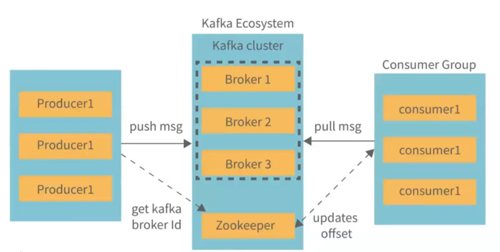
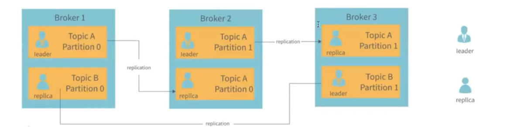
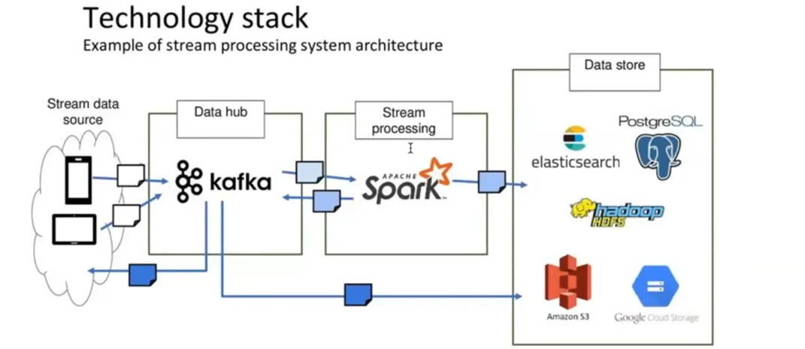

# **What is Kafka ?**

Apache Kafka is a distributed streaming platform that is widely used for building real-time data pipelines and streaming applications. It is designed to handle high volumes of data and provides low-latency, fault-tolerant, and scalable messaging capabilities. Let's break down the key concepts mentioned in the file:

### Messaging System

A messaging system is responsible for transferring data (messages) from one application to another. This allows applications to focus on processing data without worrying about the underlying communication mechanisms. Messaging systems ensure that data is reliably delivered between applications, even if they are running on different systems or at different times.

### Distributed Messaging

Distributed messaging involves the use of a message queue to facilitate asynchronous communication between applications. In this setup, messages are stored in a queue until the receiving application is ready to process them. This decouples the sending and receiving applications, allowing them to operate independently and at their own pace.

### Messaging Patterns

There are two primary messaging patterns used in distributed systems:

1. **Point-to-Point Messaging System**: In this pattern, messages are sent from a producer to a specific consumer. Each message is typically consumed by only one consumer. This is useful for scenarios where tasks need to be distributed among multiple workers, such as in a task queue.

2. **Publish-Subscribe Messaging System**: In this pattern, messages are broadcast to all consumers that have subscribed to a particular topic. This allows multiple consumers to receive the same message, making it suitable for scenarios like event broadcasting or real-time notifications.

### Apache Kafka's Role

Apache Kafka combines the benefits of both messaging patterns and provides a robust platform for handling real-time data streams. Here’s how Kafka achieves this:

- **Producers and Consumers**: Producers are applications that publish data to Kafka topics, while consumers are applications that subscribe to topics and process the published data.

- **Topics**: Topics are categories or feeds to which records (messages) are sent by producers and from which records are read by consumers. Topics are partitioned and replicated across multiple brokers for scalability and fault tolerance.

- **Brokers**: Kafka brokers are servers that store data and serve client requests. A Kafka cluster consists of multiple brokers to ensure data redundancy and high availability.

- **Scalability and Fault Tolerance**: Kafka is designed to handle large volumes of data and can scale horizontally by adding more brokers to the cluster. It also replicates data across multiple brokers to ensure fault tolerance.

- **Performance**: Kafka provides high throughput and low latency, making it suitable for real-time data processing and streaming applications.

In summary, Apache Kafka is a powerful messaging system that enables efficient, reliable, and scalable communication between producers and consumers. It is widely used in modern distributed systems for real-time data processing, log aggregation, event sourcing, and more.

## **Point-to-Point Messaging System** and **Publish-Subscribe Messaging System**. These patterns define how messages are sent and received between producers and consumers. Let's break down each system in detail:

---

### 1. **Point-to-Point Messaging System**

- **How it Works**: In this system, messages are stored in a **queue**. Multiple consumers can access the queue, but each message is consumed by **only one consumer**. Once a consumer reads a message, the message is removed from the queue and is no longer available for other consumers.

- **Key Characteristics**:
  - **Message Retention**: Messages remain in the queue until they are consumed by a consumer.
  - **Single Consumer per Message**: Each message is processed by only one consumer, ensuring that tasks or data are distributed among consumers.
  - **Disappearance After Consumption**: Once a message is consumed, it is removed from the queue, preventing duplicate processing.

- **Use Cases**:
  - Task distribution systems (e.g., distributing tasks among worker nodes).
  - Load balancing, where tasks are divided among multiple consumers.
  - Scenarios where each message should be processed exactly once.

---

### 2. **Publish-Subscribe Messaging System**

- **How it Works**: In this system, messages are stored in a **topic**. Unlike the Point-to-Point system, multiple consumers (subscribers) can subscribe to a topic and receive **all messages** published to that topic. Each message is broadcast to all subscribers, and the message remains in the topic until it expires or is manually removed.

- **Key Characteristics**:
  - **Message Retention**: Messages remain in the topic and are available to all subscribers until they expire or are deleted.
  - **Multiple Consumers per Message**: Multiple subscribers can receive and process the same message.
  - **Producers and Consumers**: Producers are called **publishers**, and consumers are called **subscribers**.

- **Use Cases**:
  - Real-time event broadcasting (e.g., stock market updates, live notifications).
  - Log aggregation, where multiple systems need to process the same logs.
  - Scenarios where multiple systems or services need to react to the same event or data.

---

### Comparison of the Two Systems

| Feature                     | Point-to-Point Messaging System          | Publish-Subscribe Messaging System       |
|-----------------------------|-----------------------------------------|-----------------------------------------|
| **Message Storage**         | Messages are stored in a queue.          | Messages are stored in a topic.          |
| **Message Consumption**     | Only one consumer processes a message.   | Multiple consumers can process a message.|
| **Message Retention**      | Message is removed after consumption.    | Message remains in the topic until it expires or is deleted. |
| **Use Case**                | Task distribution, load balancing.      | Event broadcasting, log aggregation.    |

---

### How Kafka Implements These Patterns

Apache Kafka is primarily based on the **Publish-Subscribe model**, but it also supports features that make it flexible for various use cases:

- **Topics**: Kafka uses topics to categorize messages. Producers publish messages to topics, and consumers subscribe to topics to receive messages.
- **Consumer Groups**: Kafka allows consumers to be grouped into **consumer groups**. Each group can have multiple consumers, and messages in a topic are distributed among the consumers in the group. This enables Kafka to support both:
  - **Publish-Subscribe**: Multiple consumer groups can subscribe to the same topic, and each group will receive all messages.
  - **Point-to-Point**: Within a single consumer group, each message is consumed by only one consumer, similar to a queue.

---

### Summary

- **Point-to-Point Messaging System**: Messages are consumed by only one consumer and removed after processing. Ideal for task distribution and load balancing.
- **Publish-Subscribe Messaging System**: Messages are broadcast to multiple consumers and remain in the topic. Ideal for event broadcasting and real-time data sharing.
- **Kafka's Flexibility**: Kafka combines the strengths of both systems, making it a versatile platform for distributed messaging and real-time data processing.

<br/>
<br/>

# comparison between a system **before** and **after** implementing **Apache Kafka**

---

### 1. **Before Kafka**
In the "Before Kafka" scenario, the architecture is complex and inefficient:
- **Multiple Data Sources**: There are numerous data sources (e.g., applications, databases, IoT devices) generating data.
- **Direct Connections to Data Targets**: Each data source is directly connected to one or more data targets (e.g., databases, analytics systems, applications). This creates a **tightly coupled** system with the following issues:
  - **Complexity**: Managing multiple direct connections between sources and targets becomes difficult as the system grows.
  - **Scalability Issues**: Adding new data sources or targets requires significant effort and can lead to bottlenecks.
  - **Fault Tolerance**: If a data target fails, the corresponding data source may be affected, leading to data loss or system downtime.
  - **Data Duplication**: The same data may need to be sent to multiple targets, increasing network traffic and storage requirements.

---

### 2. **After Kafka**
In the "After Kafka" scenario, Kafka acts as a central hub for data streaming, simplifying the architecture:
- **Data Sources**: Multiple data sources (e.g., applications, databases, IoT devices) send data to Kafka topics.
- **Kafka as a Central Hub**: Kafka acts as an intermediary, decoupling data sources from data targets. It provides:
  - **Scalability**: Kafka can handle high volumes of data and distribute it efficiently.
  - **Fault Tolerance**: Data is replicated across Kafka brokers, ensuring no data is lost even if a broker fails.
  - **Real-time Streaming**: Kafka enables real-time data processing and distribution.
- **Data Targets**: Multiple data targets (e.g., databases, analytics systems, applications) subscribe to Kafka topics and consume data as needed. This allows for:
  - **Flexibility**: New data targets can be added without affecting data sources.
  - **Efficiency**: Data is sent once to Kafka and can be consumed by multiple targets, reducing duplication and network traffic.

---

### 3. **Key Benefits of Using Kafka**
- **Decoupling**: Kafka decouples data sources from data targets, allowing them to operate independently and scale as needed.
- **Simplified Architecture**: Kafka reduces the complexity of managing multiple direct connections between sources and targets.
- **Real-time Data Processing**: Kafka enables real-time data streaming, making it ideal for use cases like real-time analytics, monitoring, and event-driven architectures.
- **Scalability**: Kafka can handle large volumes of data and distribute it across multiple consumers.
- **Fault Tolerance**: Data replication in Kafka ensures that no data is lost, even in the event of failures.

---

### 4. **Example Use Case**
Imagine a ride-sharing platform:
- **Before Kafka**:
  - The Rider App, Driver App, and API/Services each send data directly to multiple systems (e.g., real-time analytics, databases, notifications).
  - This creates a complex web of connections, making it difficult to manage and scale.
- **After Kafka**:
  - The Rider App, Driver App, and API/Services send data to Kafka topics.
  - Kafka streams the data to various systems (e.g., real-time analytics, databases, notifications) in real time.
  - This simplifies the architecture, improves scalability, and ensures fault tolerance.

---

### Summary
The "Before and After Kafka" comparison highlights how Kafka transforms a complex, tightly coupled system into a streamlined, scalable, and fault-tolerant architecture. By acting as a central hub for data streaming, Kafka simplifies data flow, enables real-time processing, and improves overall system efficiency. This makes Kafka an essential tool for modern, data-driven applications.


<br/>
<br/>

# **Architecture of Apache Kafka**, focusing on its key components and how they interact within the Kafka ecosystem. Let's break it down step by step:

---

### 1. **Kafka Ecosystem**
The Kafka ecosystem consists of several core components that work together to enable distributed messaging and real-time data streaming. The main components are:

#### a. **Kafka Cluster**
- A Kafka cluster is a group of **brokers** (servers) that work together to store and manage data streams.
- The cluster ensures **scalability**, **fault tolerance**, and **high availability** by distributing data across multiple brokers.

#### b. **Brokers**
- Brokers are the servers that make up the Kafka cluster. Each broker is responsible for:
  - Storing data (messages) in **topics**.
  - Handling read and write requests from **producers** and **consumers**.
  - Replicating data to other brokers for fault tolerance.
- In the diagram, there are three brokers (**Broker 1**, **Broker 2**, **Broker 3**), which is a common setup for redundancy and scalability.

#### c. **Zookeeper**
- Zookeeper is a centralized service used by Kafka for:
  - Managing and coordinating Kafka brokers.
  - Maintaining metadata about the Kafka cluster (e.g., topic configurations, broker IDs, consumer offsets).
  - Electing a leader for partitions and handling broker failures.
- Zookeeper ensures that the Kafka cluster operates smoothly and remains consistent.

#### d. **Producers and Consumers**
- **Producers**: Applications or services that publish data (messages) to Kafka topics.
- **Consumers**: Applications or services that subscribe to Kafka topics and process the data.

---

### 2. **Kafka Cluster and Brokers**
- **Broker 1**, **Broker 2**, and **Broker 3** are part of the Kafka cluster.
- Producers **push messages** to the brokers, which store the messages in topics.
- Consumers **get messages** from the brokers by subscribing to topics.
- Each broker has a unique **broker ID**, which is used to identify it within the cluster.

---

### 3. **Zookeeper's Role**
- Zookeeper plays a critical role in managing the Kafka cluster:
  - It **updates offsets** for consumers, ensuring that each consumer knows where it left off reading from a topic.
  - It helps in electing a leader for each partition, which is responsible for handling all read/write requests for that partition.
  - It monitors the health of brokers and handles broker failures by reassigning partitions to other brokers.

---

### 4. **Consumer Group**
- A **consumer group** is a set of consumers that work together to consume data from Kafka topics.
- Each consumer in the group reads from a subset of partitions in a topic, allowing for parallel processing and load balancing.
- In the diagram, there are three consumers (**consumer1**, **consumer1**, **consumer1**) in the consumer group. These consumers share the workload of processing messages from Kafka topics.

---

### 5. **Key Concepts in Kafka Architecture**
- **Topics**: Categories or feeds to which messages are published by producers and from which messages are read by consumers.
- **Partitions**: Topics are divided into partitions, which allow Kafka to scale and distribute data across multiple brokers.
- **Replication**: Kafka replicates partitions across multiple brokers to ensure fault tolerance and high availability.
- **Offsets**: Each message in a partition has a unique offset, which is used to track the position of consumers in the partition.

---

### 6. **How It All Works Together**
1. **Producers** publish messages to Kafka topics, which are stored in partitions across the brokers.
2. **Consumers** in a consumer group subscribe to topics and read messages from the partitions.
3. **Zookeeper** manages the Kafka cluster, ensuring that brokers, topics, and partitions are coordinated and that consumer offsets are tracked.
4. The Kafka cluster ensures that data is distributed, replicated, and fault-tolerant, providing a reliable platform for real-time data streaming.

---

### Summary
The architecture of Apache Kafka is designed to be **scalable**, **fault-tolerant**, and **highly available**. Key components like **brokers**, **Zookeeper**, **producers**, and **consumers** work together to enable real-time data streaming and processing. Kafka's distributed nature and use of consumer groups make it a powerful tool for building modern, data-driven applications.

<br/>
<br/>

# **Kafka Consumer**

#### **Definition**
A Kafka consumer is an application or service that reads (or consumes) messages from Kafka topics. It subscribes to one or more topics and processes the messages stored in those topics.

---

### **Key Features and Responsibilities**

1. **Subscribing to Topics**:
   - A consumer can subscribe to one or more Kafka topics to receive messages.
   - Topics are divided into **partitions**, and consumers read messages from these partitions.

2. **Deserialization**:
   - Messages in Kafka are stored as byte arrays. The consumer **deserializes** this byte data into a usable format (e.g., JSON, Avro, or custom formats) for further processing.

3. **Offset Management**:
   - Each message in a partition has a unique **offset**, which acts as a message identifier.
   - The consumer tracks its **offset** (the position of the last message it read) to ensure it knows where to continue reading from in the partition.
   - This allows the consumer to resume processing from where it left off, even after a restart or failure.

4. **Consumer Groups**:
   - Consumers can be part of a **consumer group**, which is a set of consumers that work together to consume messages from one or more topics.
   - Each consumer in the group reads from a subset of partitions, enabling **parallel processing** and **load balancing**.
   - If one consumer in the group fails, the remaining consumers can take over its partitions, ensuring **fault tolerance**.

5. **Message Processing**:
   - Once the consumer reads a message, it can process the data according to the application's requirements (e.g., performing calculations, storing data in a database, or triggering actions).

---

### **How Kafka Consumers Work**

1. **Subscription**:
   - The consumer subscribes to one or more Kafka topics.
   - Kafka assigns the consumer to specific partitions within those topics.

2. **Polling for Messages**:
   - The consumer continuously polls the Kafka broker for new messages in its assigned partitions.
   - It reads messages starting from the last committed offset.

3. **Deserialization and Processing**:
   - The consumer deserializes the byte data into a usable format.
   - It processes the messages according to the application logic.

4. **Offset Commitment**:
   - After processing a message, the consumer commits the offset to Kafka.
   - This ensures that the consumer does not reprocess the same message in case of a restart.

5. **Scalability and Fault Tolerance**:
   - In a consumer group, multiple consumers share the workload of reading messages from partitions.
   - If a consumer fails, its partitions are reassigned to other consumers in the group, ensuring uninterrupted processing.

---

### **Use Cases for Kafka Consumers**

1. **Real-time Data Processing**:
   - Consumers process streaming data in real time for applications like real-time analytics, monitoring, and alerts.

2. **Event-driven Architectures**:
   - Consumers react to events (messages) by triggering actions or workflows in other systems.

3. **Data Integration**:
   - Consumers read data from Kafka and store it in databases, data lakes, or other storage systems.

4. **Log Aggregation**:
   - Consumers collect and process logs from multiple sources for debugging, monitoring, or analysis.

5. **Machine Learning and Data Science**:
   - Consumers feed streaming data into machine learning models or data science pipelines for real-time predictions or analysis.

---

### **Summary**
The **Kafka Consumer** is a critical component in the Kafka ecosystem, responsible for reading and processing messages from Kafka topics. Key features like **offset management**, **consumer groups**, and **deserialization** make it a powerful tool for building scalable, fault-tolerant, and real-time data processing systems. Whether used for real-time analytics, event-driven architectures, or data integration, Kafka consumers play a vital role in modern data pipelines.

<br/>
<br/>

# The role of **`Apache ZooKeeper`** in a **`Kafka cluster`**.

---

### **What Does ZooKeeper Do in a Kafka Cluster?**

#### 1. **Broker Management**
- **Role**: ZooKeeper helps manage and coordinate the Kafka brokers in the cluster.
- **Functionality**:
  - It maintains a list of all active brokers in the cluster.
  - It tracks the status of each broker (e.g., whether it is alive or has failed).
- **Importance**: This ensures that the Kafka cluster is aware of all available brokers and can distribute data and workload efficiently.

---

#### 2. **Topic Configuration Management**
- **Role**: ZooKeeper stores and manages metadata about Kafka topics and partitions.
- **Functionality**:
  - It maintains a list of all topics in the Kafka cluster.
  - It stores information about the number of partitions for each topic.
  - It tracks the location (broker) of each partition.
  - It keeps a list of consumer groups and their associated metadata.
- **Importance**: This metadata is crucial for Kafka to route messages correctly and ensure that consumers can read from the appropriate partitions.

---

#### 3. **Leader Election**
- **Role**: ZooKeeper facilitates leader election for Kafka partitions.
- **Functionality**:
  - Each partition in Kafka has a **leader** broker responsible for handling all read and write requests for that partition.
  - If the leader broker fails, ZooKeeper triggers a **leader election** to choose a new leader from the available replicas.
- **Importance**: Leader election ensures that partitions remain available and operational even if a broker fails, maintaining the cluster's fault tolerance.

---

#### 4. **Cluster Membership**
- **Role**: ZooKeeper keeps track of all nodes (brokers) in the Kafka cluster.
- **Functionality**:
  - It monitors the health of each broker and detects failures.
  - If a broker fails, ZooKeeper notifies the cluster, allowing it to reassign partitions and adjust the workload.
- **Importance**: This ensures that the Kafka cluster remains aware of its members and can handle broker failures gracefully.

---

#### 5. **Synchronization**
- **Role**: ZooKeeper helps coordinate and synchronize activities across the Kafka cluster.
- **Functionality**:
  - It ensures that all brokers have a consistent view of the cluster state (e.g., topic configurations, partition assignments, and consumer offsets).
  - It coordinates tasks like partition reassignment and consumer group rebalancing.
- **Importance**: Synchronization is critical for maintaining consistency and ensuring that all components of the Kafka cluster work together seamlessly.

---

### **How ZooKeeper Works with Kafka**
1. **Broker Registration**: When a Kafka broker starts, it registers itself with ZooKeeper.
2. **Metadata Storage**: ZooKeeper stores metadata about topics, partitions, and consumer groups.
3. **Failure Detection**: ZooKeeper monitors brokers and detects failures.
4. **Leader Election**: If a leader broker fails, ZooKeeper elects a new leader for the affected partitions.
5. **Cluster Coordination**: ZooKeeper ensures that all brokers and consumers have a consistent view of the cluster state.

---

### **Why ZooKeeper is Important for Kafka**
- **Centralized Management**: ZooKeeper provides a centralized way to manage and coordinate the Kafka cluster, simplifying operations.
- **Fault Tolerance**: By handling leader election and failure detection, ZooKeeper ensures that the Kafka cluster remains operational even during broker failures.
- **Consistency**: ZooKeeper ensures that all components of the Kafka cluster have a consistent view of the cluster state, preventing conflicts and inconsistencies.
- **Scalability**: ZooKeeper helps Kafka scale by managing broker membership and partition assignments efficiently.

---

### **Summary**
ZooKeeper is a critical component of the Kafka ecosystem, responsible for:
- Managing and coordinating Kafka brokers.
- Storing and managing topic and partition metadata.
- Facilitating leader election and failure recovery.
- Monitoring cluster membership and ensuring synchronization.

Without ZooKeeper, Kafka would lack the centralized coordination and fault tolerance needed to operate as a reliable, scalable, and distributed messaging system. However, it's worth noting that newer versions of Kafka (starting from Kafka 2.8.0) are moving towards removing the dependency on ZooKeeper with the introduction of **Kafka Raft Metadata (KRaft)** mode, which allows Kafka to manage its metadata internally.


<br/>
<br/>

# **`Topics` in Apache Kafka**

---

### **1. Kafka Topic**
- **Definition**: A Kafka topic is a category or stream name to which messages (data) are published by **producers** and retrieved by **consumers**.
- **Role**: Topics act as logical channels or feeds that organize data streams in Kafka.
- **Example**: In a ride-sharing platform, topics could include `ride-requests`, `driver-locations`, and `payment-transactions`.

---

### **2. Partitions**
- **Definition**: Each Kafka topic is divided into one or more **partitions**. Partitions allow data to be distributed and parallelized across multiple brokers.
- **Role**:
  - **Parallelism**: Partitions enable Kafka to handle high throughput by allowing data to be written to and read from multiple partitions simultaneously.
  - **Scalability**: Partitions can be spread across multiple brokers, enabling Kafka to scale horizontally.
- **Key Points**:
  - Each partition is an ordered, immutable sequence of messages.
  - Messages within a partition are assigned a unique **offset**, which acts as a message identifier.

---

### **3. Producer Data Writing**
- **How Producers Write Data**:
  - Producers publish messages to Kafka topics.
  - Producers can choose which partition to write to within a topic:
    - **Round-Robin**: Messages are distributed evenly across partitions.
    - **Semantic Partitioning**: Messages are assigned to partitions based on a key (e.g., user ID, order ID), ensuring that related messages go to the same partition.
- **Importance**: Partitioning allows producers to control how data is distributed and ensures ordered processing of related messages.

---

### **4. Consumer Data Reading**
- **How Consumers Read Data**:
  - Consumers subscribe to topics and read messages from partitions.
  - Consumers read messages in the order they were written, maintaining an **offset** to track their progress.
  - Each consumer group can have multiple consumers, with each consumer reading from a subset of partitions.
- **Key Points**:
  - Offsets allow consumers to resume reading from where they left off, even after a restart.
  - Consumers in a group share the workload of reading from partitions, enabling parallel processing.

---

### **5. Retention Policy**
- **Definition**: Kafka topics retain all messages for a configurable period of time, regardless of whether they have been consumed.
- **Role**:
  - **Data Durability**: Messages are stored in Kafka until they expire, ensuring that consumers can read them even if they were offline.
  - **Configurable**: The retention period can be set per topic, allowing flexibility based on use cases (e.g., short-term for real-time processing, long-term for historical analysis).
- **Example**: A topic might retain messages for 7 days, after which older messages are deleted.

---

### **6. Immutable Records**
- **Definition**: Once a message is written to a Kafka topic partition, it cannot be changed or deleted (it is **immutable**).
- **Role**:
  - **Data Integrity**: Immutability ensures that messages remain consistent and unaltered, providing a reliable record of events.
  - **Replayability**: Consumers can reread messages from the beginning of a partition, enabling use cases like reprocessing or debugging.
- **Key Point**: Immutability is a core design principle of Kafka, ensuring that data remains trustworthy and consistent.

---

### **Summary of Kafka Topics**
- **Topics** are the central abstraction in Kafka, acting as named streams for organizing data.
- **Partitions** enable parallelism, scalability, and ordered processing within topics.
- **Producers** write data to topics, choosing partitions based on round-robin or semantic partitioning.
- **Consumers** read data from topics, maintaining offsets to track progress.
- **Retention Policies** ensure data is stored for a configurable period, providing durability and replayability.
- **Immutable Records** guarantee data integrity and consistency.

---

### **Why Topics are Important**
- **Organization**: Topics provide a logical way to categorize and manage data streams.
- **Scalability**: Partitions allow Kafka to handle high volumes of data and parallel processing.
- **Fault Tolerance**: Replication of partitions across brokers ensures data availability even during failures.
- **Flexibility**: Configurable retention policies and partitioning strategies make Kafka adaptable to various use cases.

---

### **Example Use Case**
Imagine a real-time analytics system for an e-commerce platform:
- **Topics**: `user-actions`, `order-events`, `inventory-updates`.
- **Producers**: Applications that publish user clicks, order placements, and inventory changes to these topics.
- **Consumers**: Analytics engines that read from these topics to generate real-time insights, such as popular products or low-stock alerts.
- **Partitions**: Each topic is divided into partitions to handle high traffic and ensure fast processing.
- **Retention**: Messages are retained for 30 days, allowing historical analysis.

---

### **Conclusion**
Kafka topics are the foundation of Kafka's messaging system, providing a scalable, fault-tolerant, and flexible way to manage data streams. By understanding topics, partitions, producers, consumers, retention policies, and immutability, you can effectively design and implement real-time data pipelines using Kafka.


<br/>
<br/>

# **`Partitions` in Apache Kafka**

---

### **1. What is a Partition?**
- **Definition**: A partition is a division or subset of a Kafka topic. Each topic can be divided into one or more partitions.
- **Role**: Partitions allow Kafka to distribute data across multiple brokers, enabling parallelism and scalability.

---

### **2. Key Features of Partitions**

#### a. **Parallelism**
- **How it Works**: Each partition can be placed on a separate broker (server), allowing a topic to handle data volumes that exceed the capacity of a single server.
- **Benefits**:
  - **Increased Throughput**: Producers and consumers can read and write data to different partitions concurrently, improving overall performance.
  - **Scalability**: Partitions enable Kafka to scale horizontally by adding more brokers and distributing partitions across them.

#### b. **Ordering**
- **How it Works**: Kafka guarantees that messages within a single partition are stored in the exact order they were produced.
- **Limitation**: Order is only guaranteed within a partition. If order is important across partitions (e.g., for globally ordered events), additional design considerations (e.g., using a single partition or custom logic) are needed.

#### c. **Replication**
- **How it Works**: Partitions can be replicated across multiple brokers based on the topic's **replication factor**. Each partition has one leader and multiple replicas.
- **Benefits**:
  - **Data Reliability**: Replication ensures that data is not lost even if a broker fails.
  - **High Availability**: If the leader broker fails, one of the replicas can take over as the new leader.

#### d. **Failover**
- **How it Works**: If a broker fails, the leadership of the partitions owned by that broker is automatically transferred to another broker that has a replica of those partitions.
- **Benefits**:
  - **Fault Tolerance**: Failover ensures that the Kafka cluster remains operational even during broker failures.
  - **Seamless Recovery**: Consumers and producers can continue working without interruption.

#### e. **Consumer Groups**
- **How it Works**: Each partition can be consumed by only one consumer within a consumer group at a time. If a topic has multiple partitions, multiple consumers in the same group can read from different partitions simultaneously.
- **Benefits**:
  - **Load Balancing**: Multiple consumers can share the workload of processing messages from a topic.
  - **Scalability**: Adding more partitions and consumers allows the system to handle higher data volumes.

#### f. **Offset**
- **How it Works**: Each message in a partition is assigned a unique, sequential identifier called an **offset**. Consumers use offsets to track their position in the partition.
- **Benefits**:
  - **Message Tracking**: Offsets allow consumers to resume reading from where they left off, even after a restart.
  - **Ordered Processing**: Offsets ensure that messages are processed in the order they were written.

---

### **3. Why Partitions are Important**

- **Scalability**: Partitions allow Kafka to distribute data across multiple brokers, enabling the system to handle large volumes of data and high throughput.
- **Fault Tolerance**: Replication and failover mechanisms ensure that data is not lost and the system remains available even during failures.
- **Ordered Processing**: Partitions guarantee message order within a partition, which is crucial for many use cases.
- **Parallelism**: Partitions enable concurrent processing by producers and consumers, improving performance and efficiency.

---

### **4. Example Use Case**

Imagine a real-time analytics system for a social media platform:
- **Topic**: `user-activity`.
- **Partitions**: The topic is divided into 10 partitions, each stored on a different broker.
- **Producers**: Applications publish user activity events (e.g., likes, comments, shares) to the `user-activity` topic.
- **Consumers**: Analytics engines consume messages from the topic to generate real-time insights.
- **Consumer Group**: A group of 10 consumers reads from the 10 partitions in parallel, ensuring high throughput.
- **Replication**: Each partition is replicated across 3 brokers for fault tolerance.
- **Offsets**: Consumers track their progress using offsets, allowing them to resume processing after a restart.

---

### **Summary**
Partitions are a core concept in Apache Kafka, enabling scalability, fault tolerance, and high performance. By dividing topics into partitions, Kafka can distribute data across multiple brokers, ensure ordered processing, and handle high volumes of data efficiently. Key features like replication, failover, consumer groups, and offsets make partitions essential for building robust, real-time data pipelines.


<br/>
<br/>


# **Kafka `Producer`**

The content provided explains how a **Kafka Producer** determines which partition to write a message to within a Kafka topic. The partition selection process is crucial for ensuring efficient data distribution, maintaining order, and supporting custom use cases. Let's break down the key methods used by Kafka producers to publish messages to partitions:

---

### **1. Round-Robin (Default Method)**
- **How it Works**: If no key is provided with the message, the producer uses a **round-robin** strategy to distribute messages evenly across all available partitions.
- **Process**:
  - The producer writes the first message to Partition 1, the second message to Partition 2, the third message to Partition 3, and so on.
  - After reaching the last partition, it starts again from Partition 1.
- **Benefits**:
  - **Load Balancing**: Ensures that data is evenly distributed across all partitions, preventing any single partition from becoming a bottleneck.
  - **Simplicity**: Easy to implement and requires no additional configuration.
- **Use Case**: Ideal for scenarios where message order is not important, and the goal is to distribute data evenly.

---

### **2. Keyed Message**
- **How it Works**: If a key is provided with the message, the producer uses a **hashing algorithm** (e.g., MurmurHash) to determine the partition based on the key.
- **Process**:
  - The producer hashes the key to generate a numeric value.
  - This value is used to map the message to a specific partition (e.g., `hash(key) % number_of_partitions`).
- **Benefits**:
  - **Order Preservation**: Ensures that all messages with the same key are written to the same partition, maintaining the order of related messages.
  - **Efficient Data Organization**: Useful for scenarios where related messages (e.g., messages for the same user or order) need to be processed in sequence.
- **Use Case**: Ideal for use cases like event sourcing, where maintaining the order of related events is critical.

---

### **3. Custom Partitioner**
- **How it Works**: Producers can implement a **custom partitioning strategy** by defining their own partitioner logic.
- **Process**:
  - The producer uses custom logic (e.g., based on business rules, geographic location, or other criteria) to determine the partition for each message.
  - This requires implementing the `Partitioner` interface in Kafka.
- **Benefits**:
  - **Flexibility**: Allows for fine-grained control over how messages are distributed across partitions.
  - **Custom Use Cases**: Supports complex partitioning strategies tailored to specific business needs.
- **Use Case**: Ideal for advanced use cases where default partitioning strategies (round-robin or key-based) are insufficient.

---

### **4. Why Partitioning is Important**
- **Scalability**: Partitioning allows Kafka to distribute data across multiple brokers, enabling horizontal scaling and high throughput.
- **Ordering**: Key-based partitioning ensures that related messages are processed in order, which is critical for many use cases.
- **Load Balancing**: Round-robin partitioning ensures even distribution of data, preventing hotspots and bottlenecks.
- **Customization**: Custom partitioning allows for tailored solutions to meet specific business requirements.

---

### **5. Example Use Case**

Imagine an e-commerce platform:
- **Topic**: `order-events`.
- **Partitions**: The topic has 5 partitions.
- **Producers**:
  - **Round-Robin**: Used for general order events (e.g., `order-created`, `order-updated`) where order is not critical.
  - **Keyed Message**: Used for events related to a specific order (e.g., `order-123`) to ensure all events for that order are processed in sequence.
  - **Custom Partitioner**: Used to route events based on geographic region (e.g., orders from the US go to Partition 1, orders from Europe go to Partition 2).
- **Consumers**: Multiple consumers read from the partitions in parallel, ensuring high throughput and ordered processing where needed.

---

### **Summary**
Kafka producers use one of three methods to determine which partition to write a message to:
1. **Round-Robin**: Distributes messages evenly across partitions (default when no key is provided).
2. **Keyed Message**: Uses a hash of the key to ensure related messages go to the same partition (maintains order).
3. **Custom Partitioner**: Allows for custom logic to determine the partition (supports advanced use cases).

These strategies ensure efficient data distribution, maintain order where necessary, and provide flexibility for custom requirements, making Kafka a powerful tool for building scalable and reliable data pipelines.

<br/>
<br/>

#  **`Topic Replication Factor` in Apache Kafka**

The content provided explains the concept of **Topic Replication Factor in Apache Kafka**, which is crucial for ensuring data reliability, fault tolerance, and high availability in a Kafka cluster. Let's break down the key points and the example provided:



---

### **1. What is Replication in Kafka?**
- **Definition**: Replication in Kafka refers to creating multiple copies (replicas) of each partition across different brokers in the cluster.
- **Purpose**: Replication ensures that data is not lost even if a broker fails, providing fault tolerance and high availability.

---

### **2. Replication Factor**
- **Definition**: The replication factor is the number of copies (replicas) of a partition that Kafka maintains across brokers.
- **Example**: If the replication factor is 2, each partition will have one **leader** (primary copy) and one **replica** (backup copy).
- **Importance**: A higher replication factor increases data reliability but also requires more storage and network bandwidth.

---

### **3. Key Concepts in Replication**

#### a. **Leader and Replicas**
- **Leader**: For each partition, one broker is designated as the **leader**. The leader handles all read and write requests for that partition.
- **Replicas**: Other brokers maintain **replicas** of the partition, which are synchronized copies of the leader's data.
- **Role of Replicas**: If the leader broker fails, one of the replicas can take over as the new leader, ensuring continuous availability.

#### b. **Partition-Level Replication**
- **How it Works**: Replication is performed at the **partition level**. Each partition of a topic can have its own replication factor.
- **Example**: A topic with 3 partitions and a replication factor of 2 will have 2 copies (1 leader + 1 replica) for each partition, distributed across brokers.

#### c. **Broker Leadership**
- **Single Leader**: Only one broker can be the leader for a given partition at any time. Other brokers maintain synchronized replicas.
- **Failover**: If the leader broker fails, Kafka automatically elects a new leader from the available replicas.

---

### **4. Example Provided in the Content**

The example describes a Kafka cluster with **3 brokers** and **3 topics** (Topic A, Topic B, and Topic C). Here's how replication works in this setup:

#### **Broker 1**
- **Topic A, Partition 0**: Leader
- **Topic B, Partition 0**: Replica

#### **Broker 2**
- **Topic A, Partition 1**: Leader
- **Topic A, Partition 0**: Replica

#### **Broker 3**
- **Topic A, Partition 1**: Replica
- **Topic B, Partition 1**: Leader
- **Topic B, Partition 0**: Replica

#### **Key Points from the Example**
- **Replication Factor of 2**: Each partition has one leader and one replica, ensuring fault tolerance.
- **Leader Distribution**: Each broker acts as a leader for some partitions and a replica for others, balancing the load.
- **Partition-Level Replication**: Replication is managed at the partition level, not the topic level.

---

### **5. Important Considerations**

#### a. **Replication Factor vs. Number of Brokers**
- **Rule of Thumb**: The replication factor should not exceed the number of brokers in the cluster. For example, if you have 3 brokers, the maximum replication factor you can set is 3.
- **Over-Saturation**: Setting a replication factor higher than the number of brokers will result in an error, as Kafka cannot create additional replicas without additional brokers.

#### b. **Trade-Offs**
- **Higher Replication Factor**: Increases data reliability and fault tolerance but requires more storage and network resources.
- **Lower Replication Factor**: Reduces resource usage but increases the risk of data loss in case of broker failures.

---

### **6. Why Replication is Important**
- **Fault Tolerance**: Replication ensures that data is not lost even if a broker fails.
- **High Availability**: If a broker goes down, one of the replicas can take over as the leader, ensuring continuous operation.
- **Data Durability**: Replicated data is stored on multiple brokers, reducing the risk of data loss.

---

### **7. Example Use Case**

Imagine a financial transaction system:
- **Topic**: `transactions`.
- **Partitions**: The topic has 3 partitions, each with a replication factor of 2.
- **Brokers**: 3 brokers in the cluster.
- **Setup**:
  - **Partition 0**: Leader on Broker 1, Replica on Broker 2.
  - **Partition 1**: Leader on Broker 2, Replica on Broker 3.
  - **Partition 2**: Leader on Broker 3, Replica on Broker 1.
- **Failover**: If Broker 1 fails, Partition 0's replica on Broker 2 becomes the new leader, ensuring uninterrupted processing of transactions.

---

### **Summary**
- **Replication Factor**: Determines the number of copies (replicas) of each partition in a Kafka cluster.
- **Leader and Replicas**: Each partition has one leader (handles read/write requests) and one or more replicas (backup copies).
- **Fault Tolerance**: Replication ensures data is not lost and the system remains available even during broker failures.
- **Partition-Level Replication**: Replication is managed at the partition level, allowing for fine-grained control over data reliability.

By understanding and configuring replication factors appropriately, you can build a Kafka cluster that is both reliable and scalable, ensuring high availability and fault tolerance for your data streams.

<br/>
<br/>

# **`Consumer Groups` in Apache Kafka**

The content provided explains the concept of **Consumer Groups in Apache Kafka**, which are essential for enabling parallel processing and load balancing when consuming data from Kafka topics. Let's break down the key points and the example provided:

---

### **1. What is a Consumer Group?**
- **Definition**: A consumer group is a collection of consumers that work together to consume data from one or more Kafka topics.
- **Role**: Consumer groups allow Kafka to distribute the workload of reading messages from topic partitions across multiple consumers, enabling parallel processing and scalability.

---

### **2. How Consumer Groups Work**

#### a. **Partition Assignment**
- **Partition Distribution**: Each partition of a topic is assigned to only one consumer within a consumer group at a time.
- **Load Balancing**: Kafka ensures that partitions are distributed as evenly as possible among the consumers in the group.
- **Example**: If a topic has 6 partitions and a consumer group has 3 consumers, each consumer will be assigned 2 partitions.

#### b. **Group ID**
- **Shared Group ID**: All consumers in the same consumer group share a common **group ID**.
- **Coordination**: Kafka uses the group ID to coordinate partition assignments and track the progress (offsets) of each consumer in the group.

#### c. **Message Queuing vs. Publish-Subscribe**
- **Message Queuing**: Within a consumer group, each partition is consumed by only one consumer, similar to a message queue where each message is processed by a single consumer.
- **Publish-Subscribe**: Multiple consumer groups can subscribe to the same topic, and each group will receive all messages, similar to a publish-subscribe model.

---

### **3. Example Provided in the Content**

The example describes a Kafka cluster with **2 servers** (brokers) and **2 consumer groups** (Consumer Group A and Consumer Group B). Here's how it works:

#### **Kafka Cluster**
- **Server 1**:
  - **Partition 0 (P0)**
  - **Partition 3 (P3)**
- **Server 2**:
  - **Partition 1 (P1)**
  - **Partition 2 (P2)**

#### **Consumers**
- **C1, C2, C3, C4, C5, C6**: These are individual consumers that belong to either Consumer Group A or Consumer Group B.

#### **Consumer Groups**
- **Consumer Group A**: A group of consumers (e.g., C1, C2, C3) that work together to consume data from the topic.
- **Consumer Group B**: Another group of consumers (e.g., C4, C5, C6) that also consume data from the same topic but operate independently of Consumer Group A.

#### **Partition Assignment**
- Within each consumer group, partitions are assigned to consumers. For example:
  - In **Consumer Group A**, C1 might be assigned P0 and P1, C2 might be assigned P2, and C3 might be assigned P3.
  - In **Consumer Group B**, C4 might be assigned P0, C5 might be assigned P1 and P2, and C6 might be assigned P3.

---

### **4. Key Benefits of Consumer Groups**

#### a. **Parallel Processing**
- **How it Works**: Multiple consumers in a group can read from different partitions simultaneously, increasing the overall throughput.
- **Example**: If a topic has 6 partitions and 3 consumers, each consumer can process 2 partitions in parallel.

#### b. **Load Balancing**
- **How it Works**: Kafka automatically balances the load by assigning partitions evenly among consumers in the group.
- **Example**: If a new consumer joins the group, Kafka will reassign partitions to ensure an even distribution.

#### c. **Fault Tolerance**
- **How it Works**: If a consumer in the group fails, its partitions are reassigned to other consumers in the group, ensuring continuous processing.
- **Example**: If C1 in Consumer Group A fails, its partitions (P0 and P1) can be reassigned to C2 and C3.

#### d. **Scalability**
- **How it Works**: Adding more consumers to a group allows the system to handle higher data volumes by increasing parallelism.
- **Example**: If the data load increases, you can add more consumers to the group to share the workload.

---

### **5. Example Use Case**

Imagine a real-time analytics system for an e-commerce platform:
- **Topic**: `user-activity`.
- **Partitions**: The topic has 6 partitions.
- **Consumer Group A**: A group of 3 consumers (C1, C2, C3) that process user activity data for real-time analytics.
  - **Partition Assignment**: C1 processes P0 and P1, C2 processes P2 and P3, and C3 processes P4 and P5.
- **Consumer Group B**: A group of 2 consumers (C4, C5) that process the same data for generating alerts.
  - **Partition Assignment**: C4 processes P0, P1, and P2, while C5 processes P3, P4, and P5.

---

### **Summary**
- **Consumer Groups**: Allow multiple consumers to work together to consume data from Kafka topics, enabling parallel processing and load balancing.
- **Partition Assignment**: Each partition is consumed by only one consumer within a group, ensuring ordered processing and efficient resource usage.
- **Scalability and Fault Tolerance**: Adding more consumers to a group increases throughput, and Kafka automatically reassigns partitions if a consumer fails.
- **Message Queuing and Publish-Subscribe**: Consumer groups enable Kafka to support both message queuing (within a group) and publish-subscribe (across groups) architectures.

By using consumer groups effectively, you can build scalable, fault-tolerant, and high-performance data processing systems with Kafka.

<br/>
<br/>

# **how consumers in a consumer group read messages**

The content provided explains how **consumers in a consumer group** read messages from Kafka topics, focusing on the distribution of partitions among consumers and the implications for message ordering and throughput. Let's break down the key points:

---

### **1. Single Consumer in a Consumer Group**
- **Scenario**: When there is only **one consumer** in a consumer group, that consumer reads messages from **all partitions** of the subscribed topic.
- **Behavior**:
  - The single consumer is responsible for processing all messages in the topic.
  - It reads messages from each partition in the order they were written (maintaining partition-level ordering).
- **Use Case**: This setup is common in simple or low-throughput systems where a single consumer is sufficient to handle the data load.

---

### **2. Multiple Consumers in a Consumer Group**
- **Scenario**: When there are **multiple consumers** in a consumer group, the partitions of the topic are **divided among the consumers**.
- **Behavior**:
  - Each partition is assigned to **only one consumer** in the group at a time.
  - Consumers read messages from their assigned partitions **concurrently**, enabling parallel processing.
  - Kafka ensures that the workload is distributed as evenly as possible among the consumers.
- **Benefits**:
  - **Increased Throughput**: Parallel processing by multiple consumers allows the system to handle higher data volumes.
  - **Scalability**: Adding more consumers to the group increases the system's capacity to process data.
- **Use Case**: This setup is ideal for high-throughput systems where data needs to be processed quickly and efficiently.

---

### **3. Key Rules for Partition Assignment**
- **One Partition, One Consumer**: A single partition can only be read by **one consumer** within a specific consumer group at a time. This ensures that the order of messages within the partition is preserved.
- **Order Preservation**: Since each partition is consumed by only one consumer, the order of messages within the partition is maintained.
- **Load Balancing**: Kafka automatically balances the load by assigning partitions evenly among the consumers in the group.

---

### **4. Example Scenarios**

#### a. **Single Consumer**
- **Topic**: `user-activity` with 4 partitions (P0, P1, P2, P3).
- **Consumer Group**: 1 consumer (C1).
- **Behavior**:
  - C1 reads messages from all 4 partitions (P0, P1, P2, P3).
  - Messages are processed in the order they were written to each partition.

#### b. **Multiple Consumers**
- **Topic**: `user-activity` with 4 partitions (P0, P1, P2, P3).
- **Consumer Group**: 2 consumers (C1, C2).
- **Behavior**:
  - Partitions are divided between C1 and C2. For example:
    - C1 reads from P0 and P1.
    - C2 reads from P2 and P3.
  - Messages within each partition are processed in order, but messages across partitions may be processed concurrently.

#### c. **Adding More Consumers**
- **Topic**: `user-activity` with 4 partitions (P0, P1, P2, P3).
- **Consumer Group**: 4 consumers (C1, C2, C3, C4).
- **Behavior**:
  - Each consumer reads from one partition:
    - C1 reads from P0.
    - C2 reads from P1.
    - C3 reads from P2.
    - C4 reads from P3.
  - This setup maximizes parallelism and throughput.

---

### **5. Why Partition Assignment Matters**
- **Ordering**: By ensuring that each partition is consumed by only one consumer, Kafka maintains the order of messages within the partition.
- **Scalability**: Partition assignment allows Kafka to scale horizontally by adding more consumers to the group.
- **Fault Tolerance**: If a consumer fails, its partitions are reassigned to other consumers in the group, ensuring continuous processing.

---

### **6. Example Use Case**

Imagine a real-time analytics system for a social media platform:
- **Topic**: `user-activity` with 8 partitions.
- **Consumer Group**: 4 consumers (C1, C2, C3, C4).
- **Partition Assignment**:
  - C1 reads from P0 and P1.
  - C2 reads from P2 and P3.
  - C3 reads from P4 and P5.
  - C4 reads from P6 and P7.
- **Behavior**:
  - Each consumer processes messages from its assigned partitions in order.
  - The system can handle a high volume of user activity data in real time.

---

### **Summary**
- **Single Consumer**: Reads from all partitions of a topic, maintaining order within each partition.
- **Multiple Consumers**: Partitions are divided among consumers, enabling parallel processing and increasing throughput.
- **Key Rule**: A single partition can only be read by one consumer in a group at a time, ensuring message order is preserved.
- **Scalability and Fault Tolerance**: Adding more consumers to a group increases throughput, and Kafka automatically reassigns partitions if a consumer fails.

By understanding how consumers in a consumer group read messages, you can design Kafka-based systems that are scalable, fault-tolerant, and capable of handling high data volumes efficiently.

<br/>
<br/>

# **Advantages of using consumer groups in Apache Kafka**

The content provided highlights the **advantages of using consumer groups in Apache Kafka**, which are essential for building scalable, fault-tolerant, and high-performance data processing systems. Let's break down each advantage in detail:

---

### **1. Load Balancing**
- **How it Works**: Consumer groups distribute the messages from a topic's partitions among multiple consumers in the group.
- **Benefit**:
  - **Even Distribution**: The workload is evenly spread across all consumers, preventing any single consumer from becoming a bottleneck.
  - **Higher Throughput**: By balancing the load, the system can handle a higher volume of messages efficiently.
- **Example**: If a topic has 6 partitions and 3 consumers in a group, each consumer will be assigned 2 partitions, ensuring balanced processing.

---

### **2. Fault Tolerance**
- **How it Works**: If a consumer in the group fails, Kafka automatically reassigns its partitions to other active consumers in the group.
- **Benefit**:
  - **Continuous Processing**: Ensures that messages are not left unprocessed, even if a consumer goes down.
  - **No Data Loss**: Reassigning partitions to other consumers prevents data loss and maintains system reliability.
- **Example**: If Consumer C1 fails, its partitions (e.g., P0 and P1) are reassigned to Consumers C2 and C3, ensuring uninterrupted processing.

---

### **3. Scalability**
- **How it Works**: You can increase the number of consumers in a group to handle higher data volumes or improve processing speed.
- **Benefit**:
  - **Easy Scaling**: Adding more consumers allows the system to scale horizontally, accommodating increased workloads without significant changes to the architecture.
  - **Flexibility**: The system can dynamically adjust to varying data loads by scaling the number of consumers up or down.
- **Example**: If the data load increases, you can add more consumers to the group to share the workload and maintain performance.

---

### **4. Parallelism**
- **How it Works**: Each consumer in a group reads from a unique set of partitions, allowing multiple consumers to process messages concurrently.
- **Benefit**:
  - **Improved Speed**: Parallel processing increases the overall speed and efficiency of data processing.
  - **Resource Utilization**: Maximizes the use of available resources by distributing the workload across multiple consumers.
- **Example**: With 4 consumers and 8 partitions, each consumer processes 2 partitions in parallel, significantly reducing processing time.

---

### **5. Ordering Guarantee**
- **How it Works**: Within each partition, messages are consumed in the order they were written. Since a single partition is consumed by only one consumer in the group, the order of messages is preserved.
- **Benefit**:
  - **Consistent Processing**: Ensures that messages are processed in the correct sequence, which is critical for many use cases (e.g., financial transactions, event sourcing).
  - **Reliability**: Maintains the integrity of the data by preserving the order of events.
- **Example**: In a topic tracking financial transactions, the order of transactions within a partition is preserved, ensuring accurate processing.

---

### **6. Example Use Case**

Imagine a real-time analytics system for an e-commerce platform:
- **Topic**: `user-activity` with 12 partitions.
- **Consumer Group**: 4 consumers (C1, C2, C3, C4).
- **Behavior**:
  - **Load Balancing**: Each consumer is assigned 3 partitions, ensuring even distribution of the workload.
  - **Fault Tolerance**: If C1 fails, its partitions are reassigned to C2, C3, and C4, ensuring continuous processing.
  - **Scalability**: If the data load increases, more consumers can be added to the group to handle the additional partitions.
  - **Parallelism**: Each consumer processes its assigned partitions in parallel, improving overall throughput.
  - **Ordering Guarantee**: Messages within each partition are processed in the order they were written, ensuring accurate analytics.

---

### **Summary**
- **Load Balancing**: Distributes the workload evenly among consumers, improving throughput.
- **Fault Tolerance**: Automatically reassigns partitions if a consumer fails, ensuring continuous processing.
- **Scalability**: Allows easy scaling by adding more consumers to the group.
- **Parallelism**: Enables concurrent processing of messages, increasing efficiency.
- **Ordering Guarantee**: Preserves the order of messages within each partition, ensuring reliable processing.

By leveraging these advantages, consumer groups in Kafka enable the creation of robust, scalable, and high-performance data processing systems, making Kafka a powerful tool for real-time data streaming and analytics.

<br/>
<br/>

# **`Rebalancing` in Apache Kafka**

The content provided explains the concept of **Rebalancing in Apache Kafka**, which is a critical process for ensuring fair distribution of partitions among consumers in a consumer group. Let's break down the key points and the implications of rebalancing:

---

### **1. What is Rebalancing?**
- **Definition**: Rebalancing is the process of redistributing the partitions of topics across all consumers in a consumer group.
- **Purpose**: It ensures that all consumers in the group have an equal (or nearly equal) number of partitions to consume from, thereby balancing the load and maintaining efficient data processing.

---

### **2. When is Rebalancing Triggered?**
Rebalancing can be triggered by several events:

#### a. **Addition or Removal of a Consumer**
- **New Consumer Joins**: When a new consumer joins the group, Kafka triggers a rebalance to assign it a fair share of partitions.
- **Consumer Leaves or Crashes**: If a consumer leaves the group (e.g., due to failure or shutdown), its partitions are reassigned to the remaining consumers.

#### b. **Addition or Removal of a Topic’s Partition**
- **Partition Added**: If a new partition is added to a topic that the consumer group is subscribed to, a rebalance is triggered to assign the new partition to a consumer.
- **Partition Removed**: If a partition is removed, the consumers need to be reassigned to the remaining partitions.

#### c. **Consumer Finishes Consuming Messages**
- **Offset Commitment**: When a consumer finishes consuming all messages in its assigned partitions and commits the offset back to Kafka, a rebalance may be triggered to assign it new partitions.

---

### **3. How Rebalancing Works**
- **Partition Redistribution**: During a rebalance, Kafka reassigns partitions to consumers in the group to ensure an even distribution.
- **Temporary Disruption**: While rebalancing is happening, consumers may temporarily stop processing messages, which can cause a brief pause in data consumption.
- **Offset Management**: Kafka allows you to control when and how consumers commit their offsets, which can help minimize the disruption caused by rebalancing.

---

### **4. Impact of Rebalancing**
- **Positive Impact**:
  - **Load Balancing**: Ensures that the workload is evenly distributed among consumers, improving overall throughput and efficiency.
  - **Fault Tolerance**: Automatically reassigns partitions if a consumer fails, ensuring continuous processing.
  - **Scalability**: Allows the system to dynamically adjust to changes in the number of consumers or partitions.
- **Negative Impact**:
  - **Temporary Disruption**: Consumers may pause processing during rebalancing, leading to a brief delay in message consumption.
  - **Overhead**: Frequent rebalancing can introduce additional overhead and reduce system performance.

---

### **5. Minimizing the Impact of Rebalancing**
To reduce the disruption caused by rebalancing, consider the following strategies:
- **Control Offset Commitment**: Configure consumers to commit offsets at strategic points (e.g., after processing a batch of messages) to minimize the impact of rebalancing.
- **Static Membership**: Use Kafka's **static membership** feature to reduce unnecessary rebalances when consumers temporarily disconnect and reconnect.
- **Optimize Consumer Group Size**: Ensure that the number of consumers in the group is appropriate for the number of partitions to avoid frequent rebalances.

---

### **6. Example Use Case**

Imagine a real-time analytics system for an e-commerce platform:
- **Topic**: `user-activity` with 8 partitions.
- **Consumer Group**: 4 consumers (C1, C2, C3, C4).
- **Initial Assignment**:
  - C1: P0, P1
  - C2: P2, P3
  - C3: P4, P5
  - C4: P6, P7
- **Scenario 1: New Consumer Joins**:
  - A new consumer (C5) joins the group.
  - **Rebalance**: Partitions are redistributed. For example:
    - C1: P0
    - C2: P1, P2
    - C3: P3, P4
    - C4: P5, P6
    - C5: P7
- **Scenario 2: Consumer Fails**:
  - C3 fails.
  - **Rebalance**: Partitions P3 and P4 are reassigned to C1, C2, and C4.
    - C1: P0, P3
    - C2: P1, P2, P4
    - C4: P5, P6, P7

---

### **Summary**
- **Rebalancing**: The process of redistributing partitions among consumers in a group to ensure load balancing and fault tolerance.
- **Triggers**: Rebalancing is triggered by changes such as adding/removing consumers, adding/removing partitions, or offset commitment.
- **Impact**: While rebalancing ensures fair distribution and fault tolerance, it can cause temporary disruptions in message processing.
- **Mitigation**: Strategies like controlling offset commitment and using static membership can help minimize the impact of rebalancing.

By understanding and managing rebalancing effectively, you can ensure that your Kafka-based system remains scalable, fault-tolerant, and efficient, even as the number of consumers or partitions changes.

<br/>
<br/>

# **`Offset Management` in Apache Kafka**

The content provided explains **Offset Management in Apache Kafka**, which is a crucial aspect of ensuring reliable message consumption and tracking progress within a Kafka topic. Let's break down the key points and concepts:

---

### **1. What is an Offset?**
- **Definition**: An **offset** is a unique, sequential identifier assigned to each message within a Kafka partition.
- **Role**: Offsets allow consumers to track their position in a partition, ensuring that they can resume reading from where they left off, even after a restart or failure.

---

### **2. How Offset Management Works**

#### a. **Committing Offsets**
- **Process**: When a consumer reads a message from a partition, it **commits** the offset of that message back to Kafka.
- **Purpose**: Committing offsets allows Kafka to keep track of which messages have been consumed and which ones are still pending.
- **Example**: If a consumer reads a message with offset 5, it commits offset 5 to Kafka, indicating that it has processed all messages up to and including offset 5.

#### b. **Internal Topic: `__consumer_offsets`**
- **Role**: Kafka uses an internal topic named `__consumer_offsets` to store and manage consumer offsets.
- **History**: Earlier versions of Kafka used **Apache ZooKeeper** for offset tracking, but since version 0.9, Kafka has transitioned to using the `__consumer_offsets` topic.
- **Benefits**:
  - **Scalability**: The internal topic is more scalable and efficient than using ZooKeeper.
  - **Durability**: Offsets stored in the internal topic are more durable and reliable.

---

### **3. Types of Offsets**

#### a. **Current Offset**
- **Definition**: The **current offset** is a reference to the most recent record that Kafka has provided to a consumer.
- **Role**: It ensures that the consumer does not receive the same record twice.
- **Example**: If a consumer has read up to offset 10, the current offset is 10, and the next message it will receive is at offset 11.

#### b. **Committed Offset**
- **Definition**: The **committed offset** is a pointer to the last record that a consumer has successfully processed and committed back to Kafka.
- **Role**: It is used to track the consumer's progress and is critical for fault tolerance and recovery.
- **Example**: If a consumer commits offset 10, it means it has successfully processed all messages up to offset 10. If the consumer restarts, it will resume reading from offset 11.

---

### **4. Why Offset Management is Important**

#### a. **Fault Tolerance**
- **How it Works**: If a consumer fails or restarts, it can resume processing from the last committed offset, ensuring no messages are lost or reprocessed unnecessarily.
- **Example**: If a consumer crashes after processing offset 10, it will resume from offset 11 when it restarts.

#### b. **Exactly-Once Semantics**
- **How it Works**: By committing offsets after processing, Kafka ensures that each message is processed exactly once, even in the event of failures or restarts.
- **Example**: If a consumer processes a message but crashes before committing the offset, it will reprocess the message upon restart, ensuring no data is lost.

#### c. **Replayability**
- **How it Works**: Consumers can reset their offsets to replay messages from a specific point in the partition, which is useful for debugging or reprocessing data.
- **Example**: A consumer can reset its offset to 5 to reprocess all messages from offset 5 onwards.

---

### **5. Example Use Case**

Imagine a real-time analytics system for an e-commerce platform:
- **Topic**: `user-activity` with 4 partitions.
- **Consumer Group**: 2 consumers (C1, C2).
- **Behavior**:
  - **C1** reads from partitions P0 and P1.
    - It processes messages up to offset 10 in P0 and offset 15 in P1, then commits these offsets.
  - **C2** reads from partitions P2 and P3.
    - It processes messages up to offset 20 in P2 and offset 25 in P3, then commits these offsets.
- **Fault Tolerance**:
  - If C1 crashes, it will resume processing from offset 11 in P0 and offset 16 in P1 when it restarts.
  - If C2 crashes, it will resume processing from offset 21 in P2 and offset 26 in P3 when it restarts.

---

### **Summary**
- **Offset**: A unique identifier for each message in a Kafka partition, used to track consumer progress.
- **Committing Offsets**: Consumers commit offsets to Kafka to indicate which messages have been processed.
- **Internal Topic**: Kafka uses the `__consumer_offsets` topic to store and manage consumer offsets.
- **Current Offset**: Tracks the most recent message provided to the consumer.
- **Committed Offset**: Tracks the last message successfully processed by the consumer.
- **Importance**: Offset management ensures fault tolerance, exactly-once semantics, and replayability in Kafka.

By understanding and effectively managing offsets, you can build reliable, fault-tolerant, and scalable Kafka-based systems that ensure no data is lost or reprocessed unnecessarily.

<br/>
<br/>

# **`Offset Management` in Apache Kafka**

The content provided discusses **Offset Management in Apache Kafka**, focusing on the challenges of **auto-commit** and the benefits of **manual commit** for ensuring reliable message processing. Let's break down the key points and concepts:

---

### **1. The Problem with Auto-Commit**
- **Scenario**: A consumer processes the first 10 records in a partition but crashes before committing the offsets.
- **Result**: During rebalancing, the partition is assigned to a new consumer. Since no offsets were committed, the new consumer starts reading from the beginning, reprocessing the first 10 records.
- **Issue**: This leads to **duplicate processing**, which can be problematic for applications requiring exactly-once semantics.

---

### **2. Manual Commit as a Solution**
- **Definition**: Manual commit allows the consumer application to explicitly control when offsets are committed to Kafka.
- **How to Enable**: Set the `enable.auto.commit` property to `false` to disable auto-commit and take control of offset commits.
- **Benefits**:
  - **Precise Control**: Offsets are committed only after the consumer has successfully processed the messages, reducing the risk of duplicates.
  - **Flexibility**: The consumer can decide when to commit offsets based on application logic.

---

### **3. Types of Manual Commit**

#### a. **Commit Sync (Synchronous Commit)**
- **How it Works**: The consumer commits offsets and waits for acknowledgment from Kafka before proceeding.
- **Behavior**:
  - **Blocking**: The commit operation blocks the consumer until Kafka acknowledges the commit.
  - **Retry**: If the commit fails due to a recoverable error, the consumer retries the commit.
- **Pros**:
  - **Reliability**: Ensures that offsets are committed successfully before the consumer continues processing.
- **Cons**:
  - **Performance Impact**: The blocking nature of synchronous commits can slow down the consumer, especially in high-throughput systems.

#### b. **Commit Async (Asynchronous Commit)**
- **How it Works**: The consumer sends the commit request to Kafka and continues processing without waiting for acknowledgment.
- **Behavior**:
  - **Non-Blocking**: The consumer does not wait for Kafka to acknowledge the commit.
  - **No Retry**: If the commit fails, the consumer does not retry the operation.
- **Pros**:
  - **Performance**: Asynchronous commits do not block the consumer, improving throughput.
- **Cons**:
  - **Risk of Data Loss**: If the commit fails, the consumer may not retry, leading to potential data loss or reprocessing.

---

### **4. Example of Manual Commit**

Imagine a consumer reading from a Kafka topic:
- **Topic**: `user-activity` with 1 partition.
- **Behavior**:
  1. The consumer polls and receives 10 messages (offsets 0 to 9).
  2. It processes these messages and then **manually commits** the offset (e.g., offset 9) using either `commitSync` or `commitAsync`.
  3. If the consumer crashes after committing the offset, the new consumer will start reading from offset 10, avoiding reprocessing of the first 10 messages.

---

### **5. Key Considerations for Manual Commit**

#### a. **When to Commit**
- **After Processing**: Commit offsets only after the messages have been successfully processed to avoid data loss.
- **Batch Processing**: For efficiency, commit offsets after processing a batch of messages rather than after each individual message.

#### b. **Handling Failures**
- **Synchronous Commit**: Use `commitSync` for critical applications where data integrity is paramount.
- **Asynchronous Commit**: Use `commitAsync` for high-throughput systems where performance is a priority, but be aware of the risk of data loss.

#### c. **Rebalancing**
- **Impact**: During rebalancing, consumers may temporarily stop processing messages. Manual commits ensure that offsets are committed before rebalancing, minimizing the risk of duplicates.

---

### **6. Example Use Case**

Imagine a real-time analytics system for an e-commerce platform:
- **Topic**: `order-events` with 4 partitions.
- **Consumer Group**: 2 consumers (C1, C2).
- **Behavior**:
  - **C1** reads from partitions P0 and P1.
    - It processes messages up to offset 10 in P0 and offset 15 in P1, then manually commits these offsets using `commitSync`.
  - **C2** reads from partitions P2 and P3.
    - It processes messages up to offset 20 in P2 and offset 25 in P3, then manually commits these offsets using `commitAsync`.
- **Fault Tolerance**:
  - If C1 crashes, it will resume processing from offset 11 in P0 and offset 16 in P1 when it restarts.
  - If C2 crashes, it will resume processing from offset 21 in P2 and offset 26 in P3 when it restarts.

---

### **Summary**
- **Auto-Commit**: Automatically commits offsets at regular intervals, but can lead to duplicate processing if the consumer crashes before committing.
- **Manual Commit**: Allows the consumer to explicitly control when offsets are committed, reducing the risk of duplicates.
  - **Commit Sync**: Reliable but blocking; retries on failure.
  - **Commit Async**: Non-blocking but does not retry on failure.
- **Use Case**: Manual commits are ideal for applications requiring precise control over offset management, such as financial transactions or real-time analytics.

By understanding and effectively managing offsets, you can ensure that your Kafka-based system is reliable, fault-tolerant, and capable of handling high data volumes efficiently.

<br/>
<br/>

# What if AsyncCommit failure is non-retyable?

The content provided discusses the potential failure of **asynchronous commits (commitAsync)** in Apache Kafka and how to handle such failures using **callback functions**. Let's break down the key points and concepts:

---

### **1. Asynchronous Commit (commitAsync)**
- **Definition**: Asynchronous commit allows a Kafka consumer to send a commit request to Kafka without waiting for acknowledgment.
- **Behavior**:
  - The consumer continues processing messages while the commit request is handled in the background.
  - If the commit fails, the consumer does not retry the operation.
- **Use Case**: Ideal for high-throughput systems where performance is critical, and occasional commit failures are acceptable.

---

### **2. Why Asynchronous Commits Can Fail**
Asynchronous commits can fail for various reasons, including:
- **Broker Downtime**: The Kafka broker may be temporarily unavailable.
- **Consumer Eviction**: The consumer may be considered dead by the group coordinator and removed from the consumer group.
- **Invalid Offset**: The committed offset may be larger than the last offset available on the broker.
- **Network Issues**: Temporary network glitches may prevent the commit request from reaching the broker.

---

### **3. Handling Non-Retryable Failures**
- **Non-Retryable Errors**: Some errors (e.g., consumer eviction, invalid offset) cannot be retried because they indicate a fundamental issue that requires intervention.
- **Challenge**: Since `commitAsync` runs in the background, the application does not receive direct notification of commit failures.

---

### **4. Using Callback Functions**
- **Purpose**: A **callback function** can be provided to handle commit failures or successes when using `commitAsync`.
- **How it Works**:
  - The callback function is triggered when the commit operation completes, whether it succeeds or fails.
  - The function can log errors, trigger alerts, or take other appropriate actions based on the outcome.
- **Implementation**:
  - In Python, the `commit()` function allows you to pass a callback function using the `callback` parameter.

---

### **5. Example of a Callback Function**

Here’s an example of how to implement a callback function in Python:

```python
def commit_callback(err, offsets):
    if err is not None:
        # Handle commit failure
        print(f"Commit failed: {str(err)}")
    else:
        # Handle commit success
        print(f"Commit succeeded with offsets: {offsets}")

# In your consumer loop
consumer.commit(asynchronous=True, callback=commit_callback)
```

#### **Explanation**:
- **commit_callback**: This function is called when the commit operation completes.
  - If an error (`err`) occurs, it logs the failure.
  - If the commit succeeds, it logs the successful offsets.
- **consumer.commit**: The `commit()` method is called with `asynchronous=True` to enable asynchronous commit, and the `callback` parameter is set to the `commit_callback` function.

---

### **6. Key Considerations**

#### a. **Logging and Monitoring**
- **Log Errors**: Use the callback function to log commit failures for debugging and monitoring.
- **Trigger Alerts**: If a commit failure indicates a critical issue (e.g., consumer eviction), trigger alerts to notify the operations team.

#### b. **Handling Failures**
- **Recoverable Errors**: For recoverable errors (e.g., temporary broker downtime), you can implement custom retry logic in the callback function.
- **Non-Retryable Errors**: For non-retryable errors (e.g., invalid offset), take appropriate action, such as resetting the consumer or stopping processing.

#### c. **Performance Impact**
- **Asynchronous Commit**: Improves performance by not blocking the consumer, but requires careful handling of commit failures to avoid data loss or duplicates.

---

### **7. Example Use Case**

Imagine a real-time analytics system for an e-commerce platform:
- **Topic**: `order-events` with 4 partitions.
- **Consumer Group**: 2 consumers (C1, C2).
- **Behavior**:
  - **C1** reads from partitions P0 and P1.
    - It processes messages up to offset 10 in P0 and offset 15 in P1, then commits these offsets asynchronously.
    - If the commit fails, the callback function logs the error and triggers an alert.
  - **C2** reads from partitions P2 and P3.
    - It processes messages up to offset 20 in P2 and offset 25 in P3, then commits these offsets asynchronously.
    - If the commit fails, the callback function logs the error and triggers an alert.

---

### **Summary**
- **Asynchronous Commit**: Improves performance but does not retry on failure.
- **Callback Function**: Allows you to handle commit failures or successes when using `commitAsync`.
- **Use Case**: Ideal for high-throughput systems where performance is critical, but requires careful handling of commit failures to ensure data integrity.

By using callback functions with asynchronous commits, you can build a Kafka-based system that is both high-performance and resilient to commit failures.


<br/>
<br/>

# The **differences between synchronous (commitSync)** and **asynchronous (commitAsync)**

The content provided discusses the **differences between synchronous (commitSync)** and **asynchronous (commitAsync)** commits in Apache Kafka and provides guidance on when to use each approach. Let's break down the key points and considerations:

---

### **1. Synchronous Commit (commitSync)**

#### a. **How it Works**
- **Definition**: Synchronous commit blocks the consumer until Kafka acknowledges the commit.
- **Behavior**:
  - The consumer sends the commit request and waits for a response from Kafka.
  - If the commit fails due to a recoverable error, the consumer retries the operation indefinitely until it succeeds or encounters a fatal error.

#### b. **When to Use**
- **Use Case**: Synchronous commit is ideal for applications where **data reliability is critical**.
- **Examples**:
  - Financial transactions where every message must be processed exactly once.
  - Systems where data loss or duplicates are unacceptable.

#### c. **Pros and Cons**
- **Pros**:
  - **High Reliability**: Ensures that offsets are committed successfully before the consumer continues processing.
  - **Retry Mechanism**: Automatically retries on recoverable errors, reducing the risk of data loss.
- **Cons**:
  - **Performance Impact**: The blocking nature of synchronous commits can slow down the consumer, especially in high-throughput systems.

---

### **2. Asynchronous Commit (commitAsync)**

#### a. **How it Works**
- **Definition**: Asynchronous commit allows the consumer to send the commit request to Kafka without waiting for acknowledgment.
- **Behavior**:
  - The consumer continues processing messages while the commit request is handled in the background.
  - If the commit fails, the consumer does not retry the operation.

#### b. **When to Use**
- **Use Case**: Asynchronous commit is ideal for applications where **processing speed is important**, and some data loss is tolerable.
- **Examples**:
  - Real-time analytics systems where occasional data loss is acceptable.
  - High-throughput systems where performance is a priority.

#### c. **Pros and Cons**
- **Pros**:
  - **High Performance**: Does not block the consumer, improving throughput and reducing latency.
  - **Scalability**: Suitable for systems with high message volumes.
- **Cons**:
  - **Risk of Data Loss**: If the commit fails, the consumer does not retry, potentially leading to data loss or duplicates.

---

### **3. Combination Approach**

#### a. **How it Works**
- **Definition**: Many applications use a combination of **commitAsync** for regular commits and **commitSync** before shutting down.
- **Behavior**:
  - During normal operation, the consumer uses `commitAsync` to commit offsets periodically, ensuring high performance.
  - Before shutting down, the consumer uses `commitSync` to ensure that the final offsets are committed successfully, providing reliability.

#### b. **When to Use**
- **Use Case**: This approach is ideal for applications that need to **balance speed and reliability**.
- **Examples**:
  - Systems that require high throughput during normal operation but cannot afford data loss during shutdown.
  - Applications where occasional data loss is acceptable, but final state consistency is critical.

#### c. **Pros and Cons**
- **Pros**:
  - **Balanced Approach**: Combines the performance benefits of `commitAsync` with the reliability of `commitSync`.
  - **Flexibility**: Allows the application to prioritize speed during normal operation and reliability during shutdown.
- **Cons**:
  - **Complexity**: Requires careful implementation to ensure that `commitSync` is used correctly during shutdown.

---

### **4. Key Considerations**

#### a. **Data Reliability**
- **Critical Systems**: Use `commitSync` if your application cannot tolerate data loss or duplicates.
- **Tolerant Systems**: Use `commitAsync` if occasional data loss is acceptable.

#### b. **Performance Requirements**
- **High Throughput**: Use `commitAsync` to maximize processing speed and reduce latency.
- **Lower Throughput**: Use `commitSync` if performance is less critical than data reliability.

#### c. **Shutdown Handling**
- **Graceful Shutdown**: Use `commitSync` before shutting down the consumer to ensure that the final offsets are committed.
- **Unexpected Shutdown**: Implement mechanisms to handle unexpected shutdowns, such as periodic `commitSync` or checkpointing.

---

### **5. Example Use Case**

Imagine a real-time analytics system for an e-commerce platform:
- **Topic**: `user-activity` with 4 partitions.
- **Consumer Group**: 2 consumers (C1, C2).
- **Behavior**:
  - **Normal Operation**:
    - C1 and C2 use `commitAsync` to commit offsets periodically, ensuring high throughput.
  - **Shutdown**:
    - Before shutting down, C1 and C2 use `commitSync` to commit the final offsets, ensuring no data is lost.
- **Fault Tolerance**:
  - If C1 crashes, it will resume processing from the last committed offset when it restarts.
  - If C2 crashes, it will resume processing from the last committed offset when it restarts.

---

### **Summary**
- **Synchronous Commit (commitSync)**: Use when **data reliability is critical**. It blocks the consumer but ensures offsets are committed successfully.
- **Asynchronous Commit (commitAsync)**: Use when **processing speed is important**. It does not block the consumer but does not retry on failure.
- **Combination Approach**: Use `commitAsync` for regular commits and `commitSync` before shutting down to balance speed and reliability.

By understanding the trade-offs between synchronous and asynchronous commits, you can choose the right approach for your Kafka-based system, ensuring that it meets your requirements for both performance and data reliability.

<br/>
<br/>

# **`Read strategies` in Apache Kafka**

The content provided explains the **read strategies in Apache Kafka**, which allow consumers to control where they start reading messages from a topic. These strategies provide flexibility for different use cases, such as processing historical data, reading only new messages, or resuming from a specific point. Let's break down the key points and concepts:

---

### **1. What is an Offset?**
- **Definition**: An **offset** is a unique, sequential identifier assigned to each message within a Kafka partition.
- **Role**: Offsets allow consumers to track their position in a partition, ensuring they can resume reading from where they left off, even after a restart or failure.

---

### **2. Read Strategies in Kafka**

#### a. **Read From the Beginning**
- **How it Works**: The consumer starts reading from the earliest available message in the partition.
- **Configuration**: Set the `auto.offset.reset` property to `earliest`.
- **Use Case**: Ideal for scenarios where you need to process all historical data in a topic.
- **Example**: A data pipeline that processes all past transactions in a financial system.

#### b. **Read From the End (Latest)**
- **How it Works**: The consumer starts reading from the latest message in the partition, ignoring historical data.
- **Configuration**: Set the `auto.offset.reset` property to `latest`.
- **Use Case**: Ideal for real-time systems where only new messages are relevant.
- **Example**: A real-time dashboard that displays live user activity.

#### c. **Read From a Specific Offset**
- **How it Works**: The consumer starts reading from a specific offset in the partition.
- **Method**: Use the `seek()` method on the `KafkaConsumer` object to set the consumer's position to a specific offset.
- **Use Case**: Useful for replaying specific messages or resuming from a known point.
- **Example**: Debugging or reprocessing specific events in a data stream.

#### d. **Committing and Reading from Committed Offsets**
- **How it Works**: The consumer commits offsets after processing messages. If the consumer restarts, it resumes reading from the last committed offset.
- **Use Case**: Ensures that the consumer can continue processing from where it left off, even after a failure or restart.
- **Example**: A fault-tolerant system that processes messages exactly once.

---

### **3. Key Considerations**

#### a. **Offset Management**
- **Committing Offsets**: Regularly committing offsets ensures that the consumer can resume processing from the correct position.
- **Manual vs. Auto Commit**: Choose between manual and auto-commit based on your application's reliability and performance requirements.

#### b. **Rebalancing**
- **Impact**: During rebalancing, consumers may temporarily stop processing messages. Proper offset management ensures that consumers can resume processing from the correct position after rebalancing.
- **Handling**: Use strategies like `commitSync` before rebalancing to ensure offsets are committed.

#### c. **Fault Tolerance**
- **Recovery**: If a consumer fails, it can resume processing from the last committed offset, ensuring no data is lost or reprocessed unnecessarily.
- **Exactly-Once Semantics**: Proper offset management is critical for achieving exactly-once processing semantics.

---

### **4. Example Use Case**

Imagine a real-time analytics system for an e-commerce platform:
- **Topic**: `user-activity` with 4 partitions.
- **Consumer Group**: 2 consumers (C1, C2).
- **Behavior**:
  - **C1** reads from partitions P0 and P1.
    - It starts reading from the beginning (`auto.offset.reset=earliest`) to process all historical data.
    - After processing, it commits offsets to ensure it can resume from the correct position if it restarts.
  - **C2** reads from partitions P2 and P3.
    - It starts reading from the latest message (`auto.offset.reset=latest`) to process only new user activity.
    - It uses the `seek()` method to replay specific messages for debugging purposes.

---

### **Summary**
- **Read From the Beginning**: Start reading from the earliest message in the partition (`auto.offset.reset=earliest`).
- **Read From the End (Latest)**: Start reading from the latest message (`auto.offset.reset=latest`).
- **Read From a Specific Offset**: Use the `seek()` method to start reading from a specific offset.
- **Committing and Reading from Committed Offsets**: Commit offsets to ensure the consumer can resume processing from the correct position after a restart.

By understanding and using these read strategies, you can design Kafka-based systems that are flexible, fault-tolerant, and capable of handling a wide range of use cases, from historical data processing to real-time analytics.

<br/>
<br/>

# **Role of Apache Kafka in data engineering and data pipeline processes**

The content provided highlights the **role of Apache Kafka in data engineering and data pipeline processes**, emphasizing its importance in real-time data ingestion, processing, and integration. Let's break down the key points and concepts:

---

### **1. Data Ingestion & Integration**
- **Role**: Kafka acts as a central hub for ingesting real-time data from various sources, such as applications, databases, IoT devices, and logs.
- **How it Works**:
  - **Producers**: Applications or systems that generate data (e.g., user activity logs, sensor data) publish messages to Kafka topics.
  - **Topics**: Kafka topics organize data streams, allowing multiple consumers to subscribe and process the data.
- **Benefits**:
  - **Unified Data Hub**: Kafka provides a single platform for collecting and distributing data across different systems.
  - **Scalability**: Kafka can handle high volumes of data from multiple sources, making it ideal for large-scale data ingestion.
- **Use Case**: A ride-sharing platform uses Kafka to ingest real-time data from rider and driver apps, APIs, and databases.

---

### **2. Real-Time Analytics & Stream Processing**
- **Role**: Kafka enables real-time data processing and analytics, allowing systems to transform and analyze data as it arrives.
- **How it Works**:
  - **Consumers**: Applications or stream processing frameworks (e.g., Apache Flink, Apache Samza) subscribe to Kafka topics and process data in real time.
  - **Stream Processing**: Data is transformed, aggregated, or analyzed on the fly, enabling real-time insights and actions.
- **Benefits**:
  - **Low Latency**: Kafka provides low-latency data processing, making it suitable for real-time use cases.
  - **Flexibility**: Kafka integrates with various stream processing tools, allowing for complex data transformations and analytics.
- **Use Case**: An e-commerce platform uses Kafka to process real-time user activity data, generating recommendations and triggering personalized offers.

---

### **3. Event Sourcing & Decoupling**
- **Role**: Kafka provides an audit trail of events and acts as a buffer between data producers and consumers, decoupling system dependencies.
- **How it Works**:
  - **Event Sourcing**: Kafka stores a log of all events (messages) in a topic, providing a historical record of changes or actions.
  - **Decoupling**: Producers and consumers operate independently, with Kafka acting as an intermediary that ensures data is reliably delivered.
- **Benefits**:
  - **Audit Trail**: Kafka's immutable log of events allows systems to replay or audit past events.
  - **System Independence**: Decoupling producers and consumers allows systems to evolve independently, improving scalability and maintainability.
- **Use Case**: A financial system uses Kafka to log all transactions, enabling auditability and ensuring that downstream systems (e.g., fraud detection, reporting) can process transactions independently.

---

### **4. Key Use Cases**
- **Real-Time Analytics**: Kafka enables real-time processing of data streams for applications like dashboards, monitoring, and alerting.
- **Transaction Processing**: Kafka ensures reliable and ordered processing of transactions in systems like payment gateways or stock trading platforms.
- **Log Aggregation**: Kafka collects and centralizes logs from multiple sources, making it easier to monitor and analyze system behavior.
- **Stream Processing for Recommendations**: Kafka processes real-time user activity data to generate personalized recommendations in e-commerce or content platforms.
- **IoT Sensor Data**: Kafka ingests and processes data from IoT devices, enabling real-time monitoring and control of connected devices.

---

### **5. Why Kafka is Crucial in Data Engineering**
- **Scalability**: Kafka can handle high volumes of data and scale horizontally by adding more brokers.
- **Fault Tolerance**: Kafka replicates data across multiple brokers, ensuring no data is lost even during failures.
- **Real-Time Capabilities**: Kafka provides low-latency data processing, making it ideal for real-time use cases.
- **Flexibility**: Kafka integrates with a wide range of systems and tools, making it a versatile choice for data pipelines.

---

### **6. Example Use Case**

Imagine a real-time analytics system for an e-commerce platform:
- **Data Ingestion**:
  - Kafka ingests real-time data from user activity logs, transaction systems, and inventory databases.
- **Real-Time Analytics**:
  - Stream processing frameworks (e.g., Apache Flink) subscribe to Kafka topics and process data in real time to generate insights like trending products or low-stock alerts.
- **Event Sourcing**:
  - Kafka logs all user actions (e.g., clicks, purchases) in a topic, providing an audit trail for analysis and replay.
- **Decoupling**:
  - The inventory system publishes stock updates to Kafka, and the recommendation system consumes these updates independently to adjust product recommendations.

---

### **Summary**
- **Data Ingestion & Integration**: Kafka acts as a central hub for ingesting and distributing real-time data from various sources.
- **Real-Time Analytics & Stream Processing**: Kafka enables low-latency data processing and analytics, making it ideal for real-time use cases.
- **Event Sourcing & Decoupling**: Kafka provides an audit trail of events and decouples producers and consumers, improving system scalability and maintainability.

By integrating Kafka into data engineering and data pipeline processes, organizations can build scalable, fault-tolerant, and real-time data systems that meet the demands of modern applications.

<br/>
<br/>

# How does Apache Kafka integrate into data engineering and data pipeline processes ?



The content provided outlines how **Apache Kafka integrates into data engineering and data pipeline processes**, particularly in the context of a **stream processing system architecture**. It also mentions a **technology stack** that includes various tools and platforms commonly used alongside Kafka. Let's break down the key points and concepts:

---

### **1. Apache Kafka in Data Engineering**
- **Role**: Kafka acts as a **central data hub** for real-time data ingestion, processing, and distribution in data pipelines.
- **Key Functions**:
  - **Data Ingestion**: Kafka collects data from various sources (e.g., applications, IoT devices, logs) and makes it available for downstream processing.
  - **Data Distribution**: Kafka distributes data to multiple consumers, enabling real-time analytics, storage, and other processing tasks.
  - **Decoupling**: Kafka decouples data producers (sources) from consumers (processing systems), allowing systems to scale independently.

---

### **2. Stream Processing System Architecture**
The architecture described in the content involves the following components:

#### a. **Stream Data Source**
- **Definition**: The origin of real-time data streams, such as user activity logs, IoT sensors, or transaction systems.
- **Role**: Produces data that is ingested into Kafka for further processing.
- **Examples**:
  - User activity logs from a mobile app.
  - Sensor data from IoT devices.
  - Transaction data from a payment gateway.

#### b. **Data Hub (Kafka)**
- **Role**: Kafka acts as the central hub for collecting, storing, and distributing real-time data streams.
- **Key Features**:
  - **Scalability**: Kafka can handle high volumes of data from multiple sources.
  - **Fault Tolerance**: Kafka replicates data across multiple brokers, ensuring no data is lost during failures.
  - **Real-Time Capabilities**: Kafka provides low-latency data delivery, making it ideal for real-time use cases.

#### c. **Stream Processing**
- **Role**: Real-time processing of data streams to transform, aggregate, or analyze data as it arrives.
- **Tools**: Apache Spark, Apache Flink, or Kafka Streams are commonly used for stream processing.
- **Use Cases**:
  - Real-time analytics (e.g., generating dashboards or alerts).
  - Event-driven workflows (e.g., triggering actions based on specific events).
  - Data enrichment (e.g., joining streams with static data).

#### d. **Data Store**
- **Role**: Stores processed data for further analysis, querying, or long-term retention.
- **Examples**:
  - **PostgreSQL**: A relational database for structured data.
  - **Elasticsearch**: A search and analytics engine for log and event data.
  - **Hadoop/HDFS**: A distributed file system for large-scale data storage.
  - **Amazon S3/Google Cloud Storage**: Cloud-based object storage for scalable and durable data storage.

---

### **3. Technology Stack**
The technology stack mentioned in the content includes the following tools and platforms:

#### a. **Apache Kafka**
- **Role**: Central data hub for real-time data ingestion and distribution.
- **Use Case**: Collects and distributes data from various sources to downstream systems.

#### b. **Apache Spark**
- **Role**: A distributed stream processing framework for real-time data processing.
- **Use Case**: Processes data streams from Kafka to perform transformations, aggregations, or analytics.

#### c. **PostgreSQL**
- **Role**: A relational database for storing structured data.
- **Use Case**: Stores processed data for querying and analysis.

#### d. **Elasticsearch**
- **Role**: A search and analytics engine for log and event data.
- **Use Case**: Indexes and analyzes real-time data streams for monitoring or search purposes.

#### e. **Hadoop/HDFS**
- **Role**: A distributed file system for large-scale data storage.
- **Use Case**: Stores large volumes of raw or processed data for batch processing or long-term retention.

#### f. **Amazon S3/Google Cloud Storage**
- **Role**: Cloud-based object storage for scalable and durable data storage.
- **Use Case**: Stores data in the cloud for cost-effective and scalable storage solutions.

---

### **4. Example Use Case**

Imagine a real-time analytics system for an e-commerce platform:
- **Stream Data Source**:
  - User activity logs from the e-commerce website and mobile app.
  - Transaction data from the payment gateway.
- **Data Hub (Kafka)**:
  - Kafka ingests data from the sources and distributes it to downstream systems.
- **Stream Processing**:
  - Apache Spark processes the data streams in real time to generate insights like trending products or low-stock alerts.
- **Data Store**:
  - Processed data is stored in PostgreSQL for querying and analysis.
  - Logs and event data are indexed in Elasticsearch for monitoring and search.
  - Raw data is stored in Amazon S3 for long-term retention and batch processing.

---

### **Summary**
- **Apache Kafka**: Acts as a central data hub for real-time data ingestion and distribution.
- **Stream Processing**: Tools like Apache Spark process data streams in real time for analytics and transformations.
- **Data Stores**: Processed data is stored in various systems (e.g., PostgreSQL, Elasticsearch, Amazon S3) for querying, analysis, and long-term retention.

By integrating Kafka into data engineering and data pipeline processes, organizations can build scalable, fault-tolerant, and real-time data systems that meet the demands of modern applications. The combination of Kafka with tools like Spark, PostgreSQL, and Elasticsearch creates a powerful technology stack for real-time data processing and analytics.

<br/>
<br/>

# **Schema Registry in Confluent Kafka: A Detailed Guide**  

#### **1. Introduction**  
Schema Registry is a critical component in Confluent Kafka that helps manage and enforce data consistency across producers and consumers by storing and validating schemas. It enables schema evolution while ensuring compatibility between different versions of the schema.

---

### **2. Why Schema Registry?**
- **Schema Enforcement:** Ensures that all messages follow a predefined format.
- **Compatibility Management:** Supports schema evolution without breaking existing applications.
- **Efficient Serialization:** Reduces payload size using Avro, Protobuf, or JSON Schema.
- **Decoupling Producers & Consumers:** Producers and consumers don’t need to hard-code schemas; they fetch the schema dynamically.

---

### **3. Components of Schema Registry**
1. **Schema Store:** Stores schema metadata in a Kafka topic (`_schemas` by default).
2. **REST API:** Provides a RESTful interface for schema management.
3. **Serializer & Deserializer (SerDes):** Clients use SerDes to serialize and deserialize messages using registered schemas.
4. **Compatibility Checker:** Ensures new schema versions are compatible with existing ones.

---

### **4. Schema Registry Architecture**
- Schema Registry runs as a separate service and integrates with Kafka.
- Producers write Avro/Protobuf/JSON messages using registered schemas.
- Consumers fetch schemas from the registry to deserialize messages correctly.

---

### **5. Supported Schema Formats**
- **Apache Avro (Recommended)**
- **Protocol Buffers (Protobuf)**
- **JSON Schema**

---

### **6. How Schema Registry Works?**
1. **Producer Workflow:**
   - Producer serializes data using an Avro/Protobuf/JSON schema.
   - The schema is registered in Schema Registry (if not already present).
   - The schema ID is embedded in the message.
   - Message is published to Kafka.

2. **Consumer Workflow:**
   - Consumer reads the schema ID from the message.
   - Fetches the schema from Schema Registry (if not cached).
   - Deserializes the message using the fetched schema.

---

### **7. Schema Evolution & Compatibility Modes**
Schema Registry supports **schema evolution** to handle changes in data structures over time. Compatibility modes:
- **Backward Compatibility:** New schema can read old data.
- **Forward Compatibility:** Old schema can read new data.
- **Full Compatibility:** Both forward and backward compatible.
- **None:** No restrictions on schema changes.

---

### **8. Setting Up Schema Registry**
#### **Step 1: Start Confluent Platform**
```bash
confluent local services start
```
#### **Step 2: Start Schema Registry**
```bash
confluent local services schema-registry start
```
#### **Step 3: Register a Schema**
Example: Register an Avro schema using REST API
```bash
curl -X POST -H "Content-Type: application/vnd.schemaregistry.v1+json" \
--data '{"schema": "{\"type\": \"record\", \"name\": \"User\", \"fields\": [{\"name\": \"id\", \"type\": \"int\"}, {\"name\": \"name\", \"type\": \"string\"}]}"}' \
http://localhost:8081/subjects/user-value/versions
```

---

### **9. Fetching Schema from Registry**
```bash
curl -X GET http://localhost:8081/subjects/user-value/versions/latest
```

---

### **10. Integration with Kafka Clients**
#### **Producer Code (Java)**
```java
Properties props = new Properties();
props.put("bootstrap.servers", "localhost:9092");
props.put("key.serializer", "org.apache.kafka.common.serialization.StringSerializer");
props.put("value.serializer", "io.confluent.kafka.serializers.KafkaAvroSerializer");
props.put("schema.registry.url", "http://localhost:8081");

KafkaProducer<String, GenericRecord> producer = new KafkaProducer<>(props);
```

#### **Consumer Code (Java)**
```java
props.put("key.deserializer", "org.apache.kafka.common.serialization.StringDeserializer");
props.put("value.deserializer", "io.confluent.kafka.serializers.KafkaAvroDeserializer");
props.put("specific.avro.reader", "true");

KafkaConsumer<String, GenericRecord> consumer = new KafkaConsumer<>(props);
```

---

### **11. Schema Registry Best Practices**
- **Use Avro** for efficiency and compatibility.
- **Enable Compatibility Mode** to prevent breaking changes.
- **Use Separate Subjects** for key and value schemas.
- **Cache Schema Locally** to avoid excessive registry calls.
- **Monitor Schema Registry Logs** for errors and performance issues.

---

### **12. Common Issues & Troubleshooting**
| Issue | Solution |
|-------|----------|
| Schema not found | Check if the schema is registered with `curl http://localhost:8081/subjects` |
| Serialization Exception | Ensure the producer uses `KafkaAvroSerializer` and the consumer uses `KafkaAvroDeserializer` |
| Compatibility errors | Verify the compatibility mode using `GET /config/{subject}` |

---

### **13. Conclusion**
Schema Registry is an essential component in Kafka architecture for managing schemas and ensuring data consistency. By using it effectively, you can achieve schema evolution, enforce data integrity, and build scalable Kafka applications.
