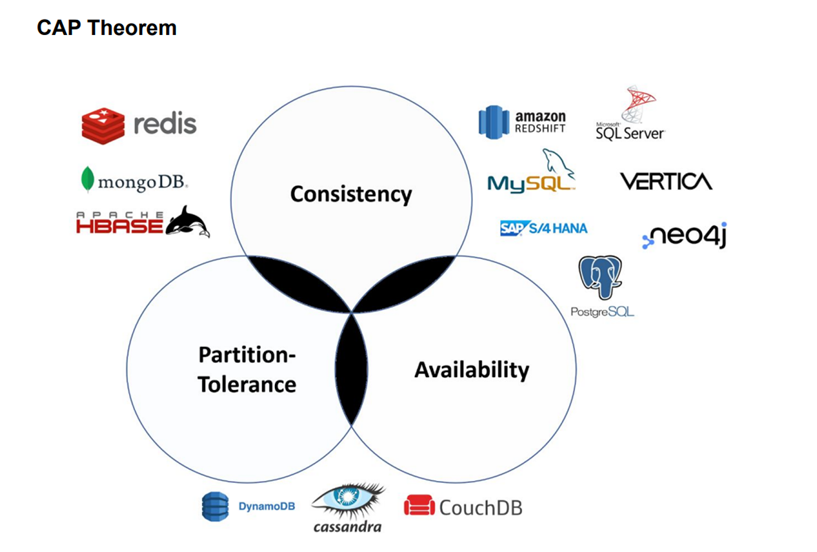
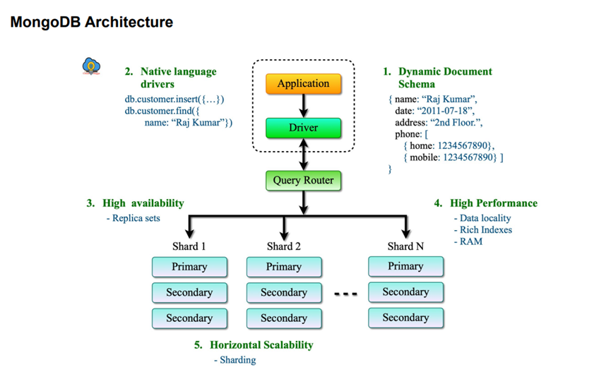

# **What is a NoSQL Database?**  

A **NoSQL database** (short for "Not Only SQL") is a type of database that does not rely on the traditional relational database model (tables with rows and columns). Instead, NoSQL databases store and retrieve data using different structures such as key-value pairs, documents, graphs, or wide-columns. These databases are designed to handle large-scale, high-velocity, and diverse types of data efficiently.  

NoSQL databases are widely used in modern applications that require **high availability, scalability, and flexibility**, such as real-time analytics, social media platforms, IoT applications, and big data processing.

---

## **Key Characteristics of NoSQL Databases**

### 1. **Schema-less (Flexible Data Model)**
   - Unlike relational databases, NoSQL databases do not require a **predefined schema**.
   - This means that different records in the same database can have different structures.
   - It is useful when dealing with **unstructured or semi-structured data**, such as JSON or XML.

   **Example:** In a NoSQL document database, one record may contain:
   ```json
   {
       "name": "John Doe",
       "age": 30,
       "email": "johndoe@example.com"
   }
   ```
   While another record can have a different structure:
   ```json
   {
       "name": "Alice",
       "phone": "+1234567890"
   }
   ```

---

### 2. **Scalability (Horizontal Scaling)**
   - NoSQL databases are designed to **scale out** (horizontally) rather than **scale up**.
   - This means instead of adding more power (CPU/RAM) to a single machine, you can **add more servers** to distribute the workload.
   - This makes them ideal for applications with high traffic and large amounts of data.

   **Example:**  
   - Relational databases like MySQL require **vertical scaling** (adding more resources to a single server).  
   - NoSQL databases like MongoDB or Cassandra allow **horizontal scaling** (adding more servers to distribute the load).

---

### 3. **Diverse Data Models**
   - NoSQL databases support **multiple data models**, which makes them suitable for different use cases.
   - The four primary types of NoSQL databases are:

     | Type             | Description | Example Databases |
     |------------------|-------------|-------------------|
     | **Key-Value Stores** | Data is stored as a **key-value** pair, like a dictionary. | Redis, DynamoDB, Riak |
     | **Document Stores** | Data is stored in **JSON-like** documents, making it easy to store complex data. | MongoDB, CouchDB |
     | **Column-Family Stores** | Data is stored in **columns** rather than rows, ideal for big data and analytics. | Cassandra, HBase |
     | **Graph Databases** | Data is stored as **nodes and edges**, useful for social networks, fraud detection, etc. | Neo4j, ArangoDB |

---

### 4. **Distributed Architecture (High Availability & Fault Tolerance)**
   - Many NoSQL databases are **distributed by design**, meaning data is stored across multiple nodes (servers).
   - If one node fails, another node can take over, ensuring **high availability**.
   - This makes NoSQL databases **fault-tolerant** and resistant to hardware failures.

   **Example:**  
   - MongoDB uses **replication** to copy data across multiple nodes.
   - Apache Cassandra follows a **peer-to-peer architecture** where each node is equal and there is no single point of failure.

---

### 5. **Performance (Fast Read/Write Operations)**
   - NoSQL databases can handle **high-throughput transactions** efficiently.
   - They eliminate the need for **joins, complex queries, and ACID transactions**, which makes reads and writes much faster.
   - This is particularly beneficial for applications requiring **real-time performance**.

   **Example:**  
   - Redis (a key-value store) is used as a caching layer because of its extremely **low-latency read and write operations**.
   - MongoDB can **shard** data across multiple servers, improving query performance.

---

## **When to Use NoSQL Databases?**
You should consider NoSQL databases when:
1. **You need to handle large amounts of unstructured or semi-structured data.**
2. **Your application requires high scalability and availability.**
3. **You need real-time data processing and fast response times.**
4. **Your data model changes frequently, and a fixed schema is not ideal.**
5. **You are dealing with big data or analytics that require distributed processing.**

---

## **When to Avoid NoSQL Databases?**
Despite their advantages, NoSQL databases may not be suitable when:
1. **You need strict ACID transactions** (e.g., banking applications).
2. **You require complex queries with multiple joins** (relational databases are more efficient for this).
3. **Your data is structured and does not change frequently.**
4. **You have a small application with a low data volume** (a relational database may be simpler and more efficient).

---

## **Conclusion**
NoSQL databases provide a **flexible, scalable, and high-performance** alternative to relational databases. They are widely used in modern web applications, real-time analytics, and big data processing. By understanding the **different types of NoSQL databases** and their strengths, you can choose the best solution based on your specific needs.

<br/>
<br/>

# **Types of NoSQL Databases**  

NoSQL databases are categorized into **four main types**, based on how they store and organize data:  

1. **Document Databases**  
2. **Key-Value Databases**  
3. **Column-Family Databases**  
4. **Graph Databases**  

Let's explore each type in detail with examples.  

---

## **1. Document Databases**  

### **Overview**  
- Store data in **documents**, usually in a **JSON (JavaScript Object Notation) or BSON (Binary JSON) format**.  
- Each document contains **key-value pairs**, where values can be **strings, numbers, arrays, booleans, objects, or nested documents**.  
- Unlike relational databases, each document **does not need to have the same structure**, making it highly **flexible and schema-less**.  
- Data is grouped into **collections** instead of tables (as in relational databases).  

### **Key Features**  
✅ **Flexible schema**: Documents can have different fields and structures.  
✅ **High scalability**: Supports **horizontal scaling** by distributing documents across multiple servers.  
✅ **Rich query capabilities**: Can query nested fields, perform text searches, and apply filters.  
✅ **Good for hierarchical data**: Stores complex, nested data structures naturally.  

### **Example Document (MongoDB)**  
```json
{
    "user_id": 101,
    "name": "John Doe",
    "email": "johndoe@example.com",
    "address": {
        "street": "123 Main St",
        "city": "New York",
        "zip": "10001"
    },
    "orders": [
        {
            "order_id": "A001",
            "amount": 250,
            "status": "shipped"
        },
        {
            "order_id": "A002",
            "amount": 150,
            "status": "processing"
        }
    ]
}
```

### **Use Cases**  
✅ Content management systems (CMS)  
✅ E-commerce platforms (storing product catalogs, customer data)  
✅ Real-time analytics  
✅ Storing user profiles (social media, gaming)  

### **Examples of Document Databases**  
- **MongoDB** (most popular document store, widely used in web applications)  
- **CouchDB** (known for easy replication and offline-first capabilities)  
- **Firebase Firestore** (used in mobile and real-time apps)  

---

## **2. Key-Value Databases**  

### **Overview**  
- **Simplest** form of NoSQL databases.  
- Stores data as a **key-value pair**, similar to a dictionary in programming.  
- The **key** is a unique identifier, and the **value** can be a simple string, number, JSON object, or even a binary file.  
- Extremely **fast** for both read and write operations.  
- Mainly used for **caching, session storage, and real-time applications**.  

### **Key Features**  
✅ **High performance**: Lookups using keys are very fast (O(1) complexity).  
✅ **Simple structure**: Easy to use and lightweight.  
✅ **Scalability**: Can scale horizontally by partitioning keys across multiple servers.  
✅ **Good for fast lookups**: Commonly used as an in-memory store.  

### **Example Data (Redis)**  
```json
"user:101": "{ 'name': 'John', 'email': 'john@example.com' }"
"session:abc123": "{ 'user_id': 101, 'login_time': '2025-03-10T10:00:00Z' }"
"cart:userid_123": "[{'item': 'Laptop', 'price': 1500}, {'item': 'Mouse', 'price': 30}]"
```

### **Use Cases**  
✅ **Session storage** (storing user sessions in web apps)  
✅ **Caching** (speeding up database queries)  
✅ **Real-time analytics**  
✅ **Message queues** (storing background jobs and task queues)  

### **Examples of Key-Value Databases**  
- **Redis** (fast, in-memory key-value store used for caching and session management)  
- **Amazon DynamoDB** (AWS managed key-value and document database)  
- **Riak** (highly available distributed key-value store)  

---

## **Comparison of Document and Key-Value Databases**  

| Feature          | Document Database | Key-Value Database |
|-----------------|------------------|------------------|
| **Data Structure** | JSON-like documents | Key-Value pairs |
| **Schema** | Flexible | Simple |
| **Querying** | Can perform rich queries | Only retrieves by key |
| **Performance** | Slower than key-value stores | Extremely fast |
| **Scalability** | Horizontally scalable | Horizontally scalable |
| **Use Cases** | Complex data storage, analytics | Caching, session storage |

---

## **3. Wide-Column Stores**  

### **Overview**  
- Unlike relational databases that store data in **tables with fixed columns**, wide-column stores allow **dynamic columns**, meaning each row can have a different set of columns.  
- They are highly **optimized for large-scale read and write operations**.  
- The structure consists of **tables, rows, and column families**, where data is stored in **columns rather than rows** (hence the name "wide-column").  
- Designed for **Big Data** applications that require high availability and massive scalability.  

### **Key Features**  
✅ **Flexible Schema**: Different rows can have different columns.  
✅ **High Scalability**: Supports horizontal scaling by distributing data across multiple nodes.  
✅ **Optimized for Big Data**: Handles large amounts of data efficiently.  
✅ **Columnar Storage**: Improves read performance for large datasets.  

### **Data Structure (Apache Cassandra Example)**  

A typical wide-column store database looks like a **table**, but unlike relational databases, each row can have different columns.

| User ID | Name   | Email               | Last Login  | Address     |
|---------|--------|---------------------|-------------|-------------|
| 101     | John   | john@example.com    | 2025-03-10  | New York    |
| 102     | Alice  | alice@example.com   | 2025-02-28  | (Not Stored) |
| 103     | Bob    | (Not Stored)        | 2025-03-08  | Los Angeles |

Here, notice:  
- Some rows have missing columns (flexible schema).  
- Each **row is identified by a unique key (User ID)**.  
- Different rows **don’t require the same columns**.  

### **Use Cases**  
✅ **Big Data & Analytics** (handling petabytes of data)  
✅ **Recommendation Engines** (personalized suggestions)  
✅ **Time-Series Data** (event logging, IoT data)  
✅ **Fraud Detection** (tracking suspicious patterns)  

### **Examples of Wide-Column Databases**  
- **Apache Cassandra** (used by Facebook, Netflix, and Twitter)  
- **Google Bigtable** (foundation for Google services like Search and Maps)  
- **HBase** (built on Hadoop, used for Big Data processing)  

---

## **4. Graph Databases**  

### **Overview**  
- Designed to store and manage **highly connected data** efficiently.  
- Uses a **graph-based structure** where:  
  - **Nodes** represent entities (e.g., people, places, products).  
  - **Edges** represent relationships between nodes.  
  - **Properties** store metadata about nodes and edges.  
- Unlike relational databases (which rely on JOINs), graph databases store relationships **directly**, making queries faster.  

### **Key Features**  
✅ **Efficient Relationship Queries**: Quickly find connections between entities.  
✅ **Highly Scalable**: Works well with dynamic and evolving data.  
✅ **Graph Algorithms**: Supports complex computations like shortest path, centrality, etc.  
✅ **Natural Representation**: Ideal for applications involving social networks, fraud detection, and recommendation systems.  

### **Data Structure (Neo4j Example)**  

A graph database might store relationships like this:

```plaintext
(Alice) --[FRIEND_OF]--> (Bob)
(Alice) --[BOUGHT]--> (Laptop)
(Bob) --[LIKES]--> (Laptop)
```

In JSON format:

```json
{
  "nodes": [
    {"id": 1, "name": "Alice", "type": "User"},
    {"id": 2, "name": "Bob", "type": "User"},
    {"id": 3, "name": "Laptop", "type": "Product"}
  ],
  "edges": [
    {"from": 1, "to": 2, "relationship": "FRIEND_OF"},
    {"from": 1, "to": 3, "relationship": "BOUGHT"},
    {"from": 2, "to": 3, "relationship": "LIKES"}
  ]
}
```

### **Use Cases**  
✅ **Social Networks** (LinkedIn, Facebook connections)  
✅ **Fraud Detection** (tracking suspicious financial transactions)  
✅ **Recommendation Systems** (e-commerce, streaming services)  
✅ **Network & IT Management** (tracking device connections)  

### **Examples of Graph Databases**  
- **Neo4j** (most popular, used by LinkedIn and NASA)  
- **Amazon Neptune** (AWS-managed graph database)  
- **ArangoDB** (multi-model NoSQL database with graph capabilities)  

---

## **Comparison of NoSQL Database Types**  

| Feature          | Document Database | Key-Value Store | Wide-Column Store | Graph Database |
|-----------------|------------------|----------------|------------------|---------------|
| **Data Model**  | JSON Documents | Key-Value Pairs | Column Families | Nodes & Edges |
| **Schema**      | Flexible | None | Semi-structured | Flexible |
| **Scalability** | Horizontal | Horizontal | Horizontal | Horizontal |
| **Query Speed** | Fast for documents | Extremely fast | Fast for large datasets | Fast for relationships |
| **Best For**    | Semi-structured data | Caching, sessions | Big Data analytics | Social & complex relationships |
| **Examples**    | MongoDB, CouchDB | Redis, DynamoDB | Cassandra, HBase | Neo4j, Amazon Neptune |

---

## **Conclusion**  
Each type of NoSQL database is designed for a specific use case:  
- **Document Databases**: Best for flexible, JSON-like data (MongoDB).  
- **Key-Value Stores**: Best for fast lookups, caching (Redis).  
- **Wide-Column Stores**: Best for large-scale data storage (Cassandra).  
- **Graph Databases**: Best for connected data (Neo4j).  

Choosing the right NoSQL database depends on your **data structure, scalability needs, and query requirements**. 😊

<br/>
<br/>

# **Difference between Transactional (Relational) & NoSQL Databases**  

| **Feature**         | **Transactional (Relational) Databases** | **NoSQL Databases** |
|---------------------|--------------------------------|------------------|
| **Data Structure**  | Organized into tables, with relationships defined between them. | Different types of data models, including key-value, document, columnar, and graph. |
| **Schema**         | Pre-defined schema required. The structure of data needs to be defined before use. | Schema-less. The structure of data can be altered dynamically. |
| **Scaling**        | Usually vertically scalable. You can increase the power (CPU, RAM, SSD) of a single server. | Horizontally scalable. You can add more servers in your NoSQL database infrastructure to handle more traffic. |
| **Transactions**   | Full **ACID (Atomicity, Consistency, Isolation, Durability)** compliance ensures reliable processing of transactions. | Generally, they do not provide full ACID compliance but offer **eventual consistency**. Some NoSQL databases, however, do provide ACID compliance. |
| **Complex Queries**| Best suited for complex queries as they support **JOINs** and other operations. | Not as powerful for complex queries because NoSQL databases don’t have standard interfaces to perform **joins**, and queries themselves can be complex. |
| **Speed & Performance** | High transactional performance, but for read-heavy workloads, performance can degrade due to table joins. | High-performance reads and writes. NoSQL databases are optimized for specific data models and **distributed architectures**, which enable higher performance. |
| **Reliability**    | Highly reliable and widely adopted in industries requiring strict consistency models. | Reliability depends on the type of NoSQL database. Many NoSQL databases use **distributed architectures** that improve fault tolerance. |
| **Use Case Examples** | **Transactional systems, ERP, CRM** (where data integrity is critical). | **Real-time applications, content management, IoT applications, recommendation engines, social media**. |

---

## **Detailed Explanation**  

### **1. Data Structure**
- **Relational Databases**: Store data in structured **tables (rows and columns)**, where each table has a predefined structure. Relationships between tables are defined using **foreign keys**. Example: **MySQL, PostgreSQL, Oracle**.
- **NoSQL Databases**: Use **flexible data models** instead of rigid tables. They can store data as **key-value pairs, JSON-like documents, wide-column stores, or graphs**. Example: **MongoDB, Cassandra, Neo4j**.

### **2. Schema**
- **Relational Databases**: Require a fixed **schema**. You must define the **table structure** before inserting data. Altering the schema later can be complex.
- **NoSQL Databases**: Are **schema-less**. You can insert data without defining a strict structure, making it more flexible for **dynamic and evolving datasets**.

### **3. Scaling**
- **Relational Databases**: Scale **vertically** by increasing the **CPU, RAM, or SSD** of a single server. This can become expensive and has limits.
- **NoSQL Databases**: Scale **horizontally** by adding **more servers (nodes)**. This allows better handling of **large-scale applications** like social media and real-time analytics.

### **4. Transactions (ACID Compliance)**
- **Relational Databases**: Follow **ACID properties**:
  - **Atomicity**: All operations in a transaction succeed or fail together.
  - **Consistency**: Data remains valid before and after a transaction.
  - **Isolation**: Transactions do not interfere with each other.
  - **Durability**: Data is permanently saved once a transaction completes.
- **NoSQL Databases**: Often follow **eventual consistency**, meaning updates will propagate across the system over time but may not be immediately visible everywhere. Some NoSQL databases, like **MongoDB and CouchDB**, provide optional **ACID compliance**.

### **5. Complex Queries**
- **Relational Databases**: Support **complex queries** using **JOINs, subqueries, and aggregations**.
- **NoSQL Databases**: Do **not support JOINs** efficiently, as they focus on **speed and scalability**. Queries can be more complex in some NoSQL databases due to **denormalized data storage**.

### **6. Speed & Performance**
- **Relational Databases**: Provide high performance for **transactional workloads** but can slow down with **complex queries and joins**.
- **NoSQL Databases**: Are optimized for **fast reads and writes**, especially for **Big Data and real-time applications**.

### **7. Reliability**
- **Relational Databases**: Highly **reliable** and used in **financial, banking, and enterprise applications** where **strict consistency** is needed.
- **NoSQL Databases**: Provide **high availability** using **replication** and **distributed storage**, but consistency depends on the database type.

### **8. Use Cases**
- **Relational Databases**: Best suited for **ERP, CRM, banking systems, and transactional applications**.
- **NoSQL Databases**: Used for **real-time applications, IoT, analytics, social media, and recommendation engines**.

---

## **Conclusion**
| **Database Type** | **Best For** |
|------------------|-------------|
| **Relational Database (SQL)** | Structured data, strict consistency, complex queries, financial applications. |
| **NoSQL Database** | Unstructured/ semi-structured data, scalability, real-time applications, Big Data, IoT. |

If **data integrity and complex transactions** are required, **relational databases** are the best choice. If **scalability, speed, and flexibility** are the priority, then **NoSQL databases** are the way to go. 😊


<br/>
<br/>

# **Are NoSQL Databases a Good Fit for Analytical Queries?**  

NoSQL databases can handle some analytical tasks, but they are **not primarily designed for complex analytical queries**. Traditional **relational databases and data warehousing solutions** are typically a better fit for such workloads. Let’s understand why.  

---

## **Why NoSQL Databases Are Not Ideal for Analytical Queries?**  

1. **Lack of Joins & Aggregations**  
   - Most NoSQL databases **do not support JOINs**, making it difficult to combine multiple datasets efficiently.
   - Aggregation operations, such as **SUM, AVG, COUNT**, are either limited or require **custom implementations**.  
   - Example: In **MongoDB**, aggregations are possible using the **Aggregation Framework**, but they are not as optimized as SQL-based databases.  

2. **Schema-less Structure Can Be a Drawback**  
   - While NoSQL’s **schema-less** nature provides flexibility, analytical queries **often require structured data** for efficient processing.
   - In **SQL databases**, structured tables with predefined schemas make it easier to run complex queries.  

3. **Eventual Consistency vs. Strong Consistency**  
   - NoSQL databases often follow **eventual consistency**, meaning data across distributed nodes may not be immediately up-to-date.
   - Analytical queries, especially in **financial reporting or real-time analytics**, require **strong consistency** to ensure accurate results.  
   - Example: If an analytics dashboard queries **inconsistent data**, the reports may be incorrect.  

4. **Optimized for Fast Reads/Writes, Not Heavy Computations**  
   - NoSQL databases excel in handling **high-speed reads and writes** for **real-time applications**.
   - Analytical queries often require **batch processing, OLAP (Online Analytical Processing), and historical data analysis**, which are better suited for **data warehouses**.  

---

## **When NoSQL Can Be Used for Analytics?**  

While NoSQL is not the best choice for traditional **analytical workloads**, it can still be useful in some scenarios:  

✅ **Real-Time Analytics**  
   - NoSQL databases like **Apache Cassandra and MongoDB** can handle **real-time streaming data**.  
   - Used in **IoT, social media, recommendation systems**, where immediate insights are needed.  

✅ **Big Data Processing**  
   - NoSQL databases (especially **wide-column stores like Apache HBase**) are used in **Big Data ecosystems**.
   - Often integrated with **Apache Spark, Hadoop, or Elasticsearch** for analytical processing.  

✅ **Graph Analytics**  
   - **Graph databases** (e.g., **Neo4j, Amazon Neptune**) can efficiently analyze **network relationships**, like fraud detection and social network analysis.  

---

## **Better Alternatives for Analytical Queries**  

If your goal is **heavy analytical processing**, you should consider **SQL-based data warehouses** like:  

1. **Amazon Redshift** - Optimized for large-scale data analytics.  
2. **Google BigQuery** - Serverless, highly scalable for complex queries.  
3. **Snowflake** - Cloud-based data warehousing solution.  
4. **Apache Hive** - Works with **Hadoop** for big data processing.  

These systems are designed for **high-performance analytical workloads** and offer **SQL-like query capabilities**.  

---

## **Conclusion**  
❌ **NoSQL databases are not the best fit for traditional analytical queries** due to **limited join capabilities, eventual consistency, and lack of optimized aggregation functions**.  
✅ However, they can handle **real-time analytics, big data processing, and graph-based analytics** in combination with other tools.  

For **complex analytical workloads**, **SQL-based data warehouses** remain the best choice! 🚀

<br/>
<br/>

# **NoSQL Databases in the Big Data Ecosystem**  

NoSQL databases play a crucial role in the **Big Data ecosystem** due to their **flexibility, scalability, and high-speed data processing capabilities**. In Big Data environments, data is often **huge in volume, varies in structure, and requires real-time processing**—areas where NoSQL databases excel.  

---

## **Why NoSQL is Ideal for Big Data?**  

1️⃣ **Handling Large Volumes of Data at High Speed**  
   - **NoSQL databases are designed to scale horizontally**, meaning they can distribute data across multiple servers to **handle massive amounts of information efficiently**.  
   - Unlike relational databases that scale vertically (by adding more CPU and RAM to a single server), **NoSQL databases scale horizontally** by adding more machines to the cluster.  
   - **Example:**  
     - **Apache Cassandra** can manage petabytes of data across **thousands of distributed nodes** while maintaining low latency.  
     - **MongoDB** supports **sharding**, which allows distributing data across multiple servers for **faster read/write performance**.  

2️⃣ **Variety of Data Formats (Structured, Semi-structured, Unstructured)**  
   - Traditional **SQL databases require a fixed schema**, making them unsuitable for handling constantly evolving data structures.  
   - NoSQL databases support various data formats, making them ideal for Big Data environments that deal with:  
     - **Structured Data** (e.g., relational records)  
     - **Semi-structured Data** (e.g., JSON, XML)  
     - **Unstructured Data** (e.g., logs, videos, social media posts)  
   - **Example:**  
     - **MongoDB and CouchDB** store JSON-like documents, making them ideal for **semi-structured data**.  
     - **HBase** (a NoSQL wide-column store) is often used to process **structured and semi-structured data** in **Hadoop** ecosystems.  

3️⃣ **Fault Tolerance and Geographic Distribution**  
   - NoSQL databases are **distributed by design**, meaning data is spread across multiple nodes. This provides:  
     - **Fault tolerance** – If one node fails, another node has a copy of the data.  
     - **Geographic distribution** – Data can be replicated across different regions to **improve availability and reduce latency**.  
   - **Example:**  
     - **Cassandra** uses a peer-to-peer architecture with **automatic replication**, ensuring **no single point of failure**.  
     - **Amazon DynamoDB** replicates data across multiple **AWS regions** to ensure **high availability**.  

4️⃣ **Real-Time Applications & Big Data Analytics**  
   - Many Big Data applications require **real-time analytics and processing**. NoSQL databases provide **high-speed read/write operations** to meet these demands.  
   - They are often used in:  
     - **IoT applications** (handling sensor data in real-time).  
     - **Social media analytics** (tracking user engagement instantly).  
     - **Fraud detection systems** (identifying suspicious activities as they happen).  
   - **Example:**  
     - **Apache Kafka + NoSQL (MongoDB/Cassandra)** – Used for **real-time streaming analytics**.  
     - **Elasticsearch** – Used for **real-time text search** in Big Data environments.  

---

## **How NoSQL Databases Fit into the Big Data Architecture?**  

A **Big Data ecosystem** typically consists of multiple components working together:  

| **Layer**               | **Technology Used** | **Role** |
|-------------------------|--------------------|----------|
| **Data Ingestion**      | Apache Kafka, Flume, Sqoop | Collects and streams data from various sources (logs, sensors, web apps). |
| **Data Storage**        | HDFS, Amazon S3, Google Cloud Storage | Stores massive raw data. |
| **NoSQL Databases**     | MongoDB, Cassandra, HBase | Stores real-time or semi-structured data for fast access. |
| **Processing & Analytics** | Apache Spark, Hadoop, Hive, BigQuery | Processes data for insights and analytics. |
| **Visualization**       | Tableau, Power BI, Kibana | Helps in visualizing trends and patterns. |

This **multi-layered approach** allows NoSQL databases to work alongside **Hadoop, Spark, and other Big Data tools** to manage massive datasets **efficiently and in real time**.  

---

## **Choosing the Right Database for Big Data**  

While NoSQL is a powerful option, the best choice depends on your **specific use case**:  

| **Requirement**                     | **Best Database Type** |
|--------------------------------------|------------------------|
| **Real-time analytics & fast reads** | NoSQL (MongoDB, Cassandra, Redis) |
| **Batch processing (historical data)** | SQL-based warehouses (Redshift, BigQuery, Snowflake) |
| **Graph-based relationships**        | Graph Databases (Neo4j, Amazon Neptune) |
| **Log & text-based searches**        | Elasticsearch, Splunk |
| **Streaming real-time events**       | Apache Kafka + NoSQL |

---

## **Conclusion**  
✅ NoSQL databases play a **crucial role in Big Data** due to their:  
✔ **Horizontal scalability** for handling massive datasets  
✔ **Flexible schema** for dealing with different data formats  
✔ **Fault tolerance & distributed architecture**  
✔ **Real-time processing capabilities** for IoT, social media, and analytics  

🚀 However, NoSQL **is not a one-size-fits-all solution**—for heavy **analytical workloads**, SQL-based data warehouses like **Redshift, Snowflake, or BigQuery** may be a better choice.


<br/>
<br/>

# **CAP Theorem: Understanding the Trade-offs in Distributed Databases**  

The **CAP theorem** (also known as **Brewer’s Theorem**) states that **a distributed system cannot achieve Consistency, Availability, and Partition Tolerance simultaneously**. In a distributed environment, you must **choose a trade-off between two of the three** properties based on the system's requirements.  

It was proposed by **Eric Brewer in 2000** and formally proved in **2002**. The theorem is fundamental in designing **distributed databases, cloud computing platforms, and NoSQL systems**.

---

## **Breaking Down the Three Components of CAP**  

A **distributed system** consists of **multiple nodes (servers or databases) communicating over a network**. Due to network failures or delays, achieving all three properties simultaneously is **impossible**.

Let’s define the three properties in detail:

### **1. Consistency (C)**
> **Every read receives the most recent write or an error.**  

- This means that **all nodes (servers) always return the same up-to-date data**.  
- If you write data to one node, **all subsequent reads must reflect that change immediately**.  
- **Example:**
  - In a **banking system**, if you transfer ₹500 from Account A to Account B, both accounts should reflect the updated balance **immediately**.
  - If the system is consistent, you **won’t see stale data**, even if there’s a delay in the system.

🛑 **Downside**  
- Ensuring **strong consistency** requires **synchronization between nodes**, which can **slow down performance** and impact availability.  
- If a network partition occurs, the system **must reject requests** rather than serve inconsistent data.  

---

### **2. Availability (A)**
> **Every request receives a response (non-error), but it might not be the most recent data.**  

- This means the system **always responds**, even if some nodes are down or there’s a network partition.  
- Availability **prioritizes uptime** over correctness.  
- **Example:**
  - In an **e-commerce website**, if a customer adds an item to their cart, but a network failure occurs, the system **still allows them to proceed with checkout**, even if it’s not yet reflected in the main database.  

🛑 **Downside**  
- Since data replication happens asynchronously, some nodes might serve **stale (outdated) data**.  
- If two users update the same data **simultaneously**, conflicts can arise.  

---

### **3. Partition Tolerance (P)**
> **The system continues to function even when some nodes are unreachable due to network failures.**  

- In a distributed system, **network failures are inevitable** (e.g., server crashes, data center outages, or network congestion).  
- Partition tolerance ensures the system **remains operational** despite these failures.  
- **Example:**
  - A **social media app (e.g., Instagram, Twitter)** must continue working even if some servers are **temporarily disconnected** due to a network partition.  

🛑 **Downside**  
- When a network partition occurs, the system **must choose between consistency or availability** because it cannot guarantee both.  

---

## **CAP Theorem in Action: The Trade-offs**  

Since it’s impossible to achieve **Consistency (C), Availability (A), and Partition Tolerance (P) simultaneously**, distributed databases must **sacrifice one of the three**:

| **Type**  | **Guarantees** | **Trade-off** | **Example Databases** |
|-----------|--------------|--------------|------------------------|
| **CP (Consistency + Partition Tolerance)** | Ensures data consistency across nodes, even if some are unreachable. | Sacrifices Availability (some requests may fail). | MongoDB (in strong consistency mode), HBase, Redis (in strict mode). |
| **AP (Availability + Partition Tolerance)** | Ensures the system is always available, even when nodes are partitioned. | Sacrifices Consistency (stale data might be served). | Cassandra, DynamoDB, CouchDB. |
| **CA (Consistency + Availability) ❌** | Ensures all nodes have the latest data and are always available. | **Impossible in a distributed system** because partitions can always occur. | **Not possible in a real-world distributed system**. |

🚀 **Most real-world distributed databases prioritize either CP or AP, since partitions are unavoidable in distributed systems.**  

---

## **Real-World Examples of CAP Trade-offs**  

1️⃣ **CP (Consistency + Partition Tolerance)**
   - **Databases:** MongoDB (with strong consistency), HBase, Redis (in strict mode).
   - **Use Case:** **Banking Systems** – Transactions should be consistent, even if some nodes are unavailable.
   - **Example:** If you transfer money, the system will **reject transactions during a partition** rather than risk an inconsistent state.

2️⃣ **AP (Availability + Partition Tolerance)**
   - **Databases:** Cassandra, DynamoDB, CouchDB.
   - **Use Case:** **E-commerce, Social Media** – Prioritizes availability, even if users get slightly outdated data.
   - **Example:** A **shopping cart system** continues to function even if the latest item stock data is temporarily outdated.

3️⃣ **CA (Consistency + Availability)**
   - **❌ Not possible in a distributed system**.
   - **Use Case:** **Single-server relational databases (SQL databases)**.
   - **Example:** A traditional **MySQL database** running on a single machine provides **strong consistency and high availability**, but **fails when network partitions occur**.

---

## **How NoSQL Databases Use CAP Theorem?**  

| **Database**  | **CAP Trade-off** | **Why?** |
|--------------|-----------------|----------|
| **MongoDB** (default) | **CP** | Prioritizes consistency with strong writes, but some requests may fail during network partitions. |
| **Cassandra** | **AP** | Always available, but might serve slightly outdated data (eventual consistency). |
| **DynamoDB** | **AP** | Ensures high availability across AWS regions, sacrificing strict consistency. |
| **HBase** | **CP** | Guarantees strong consistency but may reject requests during network issues. |

---

## **Conclusion: How to Choose Based on CAP?**  

- If you need **strong consistency**, choose **CP** (e.g., financial transactions).  
- If you need **high availability**, choose **AP** (e.g., real-time social media feeds).  
- If you don’t have network partitions (single server), **you can have both C and A**.  

📌 **In distributed systems, network partitions are inevitable, so you must choose between consistency and availability based on your business needs.**

<br/>
<br/>

# **CAP Theorem: A Deep Dive into Consistency, Availability, and Partition Tolerance**  

The **CAP theorem**, introduced by **Eric Brewer in 2000**, is a fundamental principle in **distributed databases and computing**. It states that **a distributed system cannot simultaneously achieve Consistency (C), Availability (A), and Partition Tolerance (P)**. Instead, it can only satisfy **two out of the three properties** at any given time.  

Since distributed systems **must tolerate network partitions (P)**, practical database architectures often make a **trade-off between Consistency (C) and Availability (A)**.  

---

## **Breaking Down the Three CAP Properties**  

### **1. Consistency (C)**
> **Every read receives the most recent write or an error.**  

- Consistency ensures that **all nodes (servers) always return the latest updated data**.  
- This means that whenever data is written to one node, it is immediately replicated across all other nodes.  
- If the system cannot ensure this, it will reject read or write requests.  

💡 **Example:**  
- In a **banking system**, if you transfer ₹500 from Account A to Account B, both accounts must immediately reflect the updated balance.  
- A strongly consistent system **never shows stale (old) data**.  

🛑 **Drawback:**  
- Maintaining consistency **requires synchronization between nodes**, which can **slow down performance** and **increase response times**.  

---

### **2. Availability (A)**
> **Every request receives a (non-error) response, but the data might not be the most recent.**  

- Availability ensures that **the system always responds** to requests, even if some nodes are unreachable or outdated.  
- However, the response **might not reflect the latest update**, leading to **eventual consistency** instead of immediate consistency.  

💡 **Example:**  
- In an **e-commerce website**, when a user adds an item to their cart, the system still allows them to proceed to checkout even if some servers are temporarily down.  
- The updated stock count might not be immediately visible to all users.  

🛑 **Drawback:**  
- Since updates are not instantly synchronized across all nodes, some users may see **stale (outdated) data**.  

---

### **3. Partition Tolerance (P)**
> **The system continues to function even when network failures occur.**  

- Partition tolerance ensures that the system **remains operational** even if some nodes become **disconnected** due to **network failures**.  
- A partition occurs when there is a **break in communication** between two or more nodes in a distributed system.  
- Distributed systems must handle partitions by either:
  - **Delaying operations until the network is restored** (favoring Consistency) or  
  - **Allowing operations to continue with potential inconsistencies** (favoring Availability).  

💡 **Example:**  
- A **social media platform (e.g., Instagram, Facebook, Twitter)** must continue functioning even if some **data centers go offline** due to a network outage.  

🛑 **Drawback:**  
- To maintain partition tolerance, the system **must choose between consistency or availability**.  

---

## **Understanding the CAP Trade-offs**  

Since **network failures (P) are inevitable**, real-world distributed databases must **sacrifice either Consistency (C) or Availability (A)**:

| **Type**  | **Guarantees** | **Trade-off** | **Example Databases** |
|-----------|--------------|--------------|------------------------|
| **CA (Consistency + Availability) ❌** | Ensures data consistency and availability. | **Not possible in a real-world distributed system** because partitions can always occur. | **Only possible in single-node databases** (e.g., MySQL on a single server). |
| **CP (Consistency + Partition Tolerance)** | Ensures data consistency even when partitions occur. | Sacrifices Availability (some requests may fail). | MongoDB (in strong consistency mode), HBase, Redis (in strict mode). |
| **AP (Availability + Partition Tolerance)** | Ensures the system is always available, even when nodes are partitioned. | Sacrifices Consistency (stale data might be served). | Cassandra, DynamoDB, CouchDB. |

---

## **CAP Theorem in Action: Real-World Scenarios**  

### **1️⃣ CA (Consistency + Availability) ❌ (Not Possible in Distributed Systems)**
- CA systems guarantee both **data consistency and availability**, but they **fail when network partitions occur**.  
- This is **only possible in single-node relational databases**, like **MySQL running on a single server**.  

🚫 **Why is CA impossible in a distributed system?**  
- Because network partitions **always occur in distributed environments** (due to server crashes, latency, or data center failures).  

💡 **Example:**  
- A **local database on a single machine (MySQL, PostgreSQL, Oracle)** maintains both **consistency and availability** but fails when the server crashes.  

---

### **2️⃣ CP (Consistency + Partition Tolerance)**
- CP systems prioritize **strong consistency**, even if it means **some requests might fail** during network partitions.  
- When a partition occurs, the system **halts availability** rather than risk inconsistent data.  

💡 **Example:**  
- **Banking Systems (e.g., HBase, MongoDB in strong mode)**  
- If you transfer money between accounts, the system ensures that **no two users see conflicting balances**, even if it means temporarily **blocking new transactions**.  

🛑 **Trade-off:**  
- **Availability is sacrificed** → Some users might **experience downtime or rejected transactions**.  

---

### **3️⃣ AP (Availability + Partition Tolerance)**
- AP systems prioritize **availability**, even if it means **some data might be inconsistent** during network partitions.  
- When a partition occurs, the system **continues serving requests** but allows different nodes to show slightly **different versions of data** until the partition is resolved.  

💡 **Example:**  
- **Social Media (e.g., Cassandra, DynamoDB, CouchDB)**  
- If you post a comment on Instagram, different users **may see the comment at different times**, but the system never stops accepting new posts.  

🛑 **Trade-off:**  
- **Consistency is sacrificed** → Some users may see **stale or outdated data** until the system synchronizes.  

---

## **How NoSQL Databases Use CAP Theorem?**  

| **Database**  | **CAP Trade-off** | **Why?** |
|--------------|-----------------|----------|
| **MongoDB** (default) | **CP** | Prioritizes consistency, but some requests may fail during network partitions. |
| **Cassandra** | **AP** | Always available, but might serve slightly outdated data (eventual consistency). |
| **DynamoDB** | **AP** | Ensures high availability across AWS regions, sacrificing strict consistency. |
| **HBase** | **CP** | Guarantees strong consistency but may reject requests during network issues. |

---

## **Conclusion: How to Choose Based on CAP?**  

✅ If you need **strong consistency**, choose **CP** (e.g., financial transactions).  
✅ If you need **high availability**, choose **AP** (e.g., real-time social media feeds).  
✅ If you **don’t have network partitions (single server)**, you can have **both C and A**.  

📌 **In real-world distributed systems, network partitions are unavoidable, so the practical choice is between consistency and availability.**  

💡 **Key Takeaway:**  
- **CP (Consistency + Partition Tolerance)** → Ensures **accurate** data but **sacrifices uptime**.  
- **AP (Availability + Partition Tolerance)** → Ensures **always-on service** but may serve **stale data**.  
- **CA (Consistency + Availability) is not possible in distributed systems**.  

🚀 **Choose the right trade-off based on your business requirements!**

<br/>
<br/>

# **Appropriate CAP Strategies Based on Real-Time Examples**  

Since **network partitions (P) are inevitable in distributed systems**, the **practical choice is between Consistency (C) and Availability (A)**. Depending on the use case, different CAP strategies are applied.

---

## **1️⃣ CP (Consistency + Partition Tolerance)**
**🛠 Strategy:**  
- Prioritize **strong consistency** by ensuring all nodes have the same data.  
- If a network partition occurs, **some requests may be rejected** to maintain data integrity.  

**✅ Best for:**  
- **Financial transactions, banking, healthcare records, inventory management.**  

### **📌 Real-World Examples**
| Use Case | Why CP? | Real-World Example |
|----------|--------|------------------|
| **Banking & Financial Transactions** | Account balances must be **accurate** across all nodes. If a partition occurs, some transactions should be delayed rather than allow inconsistent data. | **HBase in stock trading platforms** like NYSE, NASDAQ. |
| **Healthcare Records** | Patient data must be **consistent** across hospitals. A patient’s medical history should never show conflicting records. | **Couchbase or MongoDB (strong consistency mode)** used in **Electronic Health Records (EHR) systems**. |
| **Inventory Management** | A product should not be oversold due to **inconsistent stock levels** across different locations. | **MongoDB (strict consistency mode) used in Amazon Warehouse Management.** |

🛑 **Trade-Off:**  
- **Availability is sacrificed.** Some operations may fail until partitions are resolved.  

---

## **2️⃣ AP (Availability + Partition Tolerance)**
**🛠 Strategy:**  
- Prioritize **high availability** to ensure the system is always operational.  
- Allow temporary inconsistencies (eventual consistency).  

**✅ Best for:**  
- **Social media, IoT applications, online gaming, real-time analytics.**  

### **📌 Real-World Examples**
| Use Case | Why AP? | Real-World Example |
|----------|--------|------------------|
| **Social Media (Likes, Comments, Posts)** | If a network partition happens, the system should **still accept posts, likes, and comments**, even if they take time to sync across all servers. | **Cassandra in Facebook, Twitter, Instagram.** |
| **IoT Applications (Smart Devices, Sensors, Smart Homes)** | IoT devices must continue to **collect and send data**, even if some nodes are temporarily disconnected. Data can sync later. | **Apache Cassandra used in Nest, Fitbit, and Tesla.** |
| **Online Gaming (Multiplayer Games, Leaderboards)** | Gamers should be able to **continue playing even if some updates (leaderboard scores) are slightly delayed.** | **DynamoDB used in Fortnite, PUBG.** |

🛑 **Trade-Off:**  
- **Consistency is sacrificed.** Some users might see **stale data** temporarily.  

---

## **3️⃣ CA (Consistency + Availability) ❌ (Not Possible in Distributed Systems)**
- A system that guarantees **both strong consistency and availability** **cannot** tolerate network partitions.  
- This is **only possible in single-node databases** (e.g., MySQL, PostgreSQL running on a single server).  

### **📌 Real-World Example**
| Use Case | Why CA? | Real-World Example |
|----------|--------|------------------|
| **Single-Server Database Systems** | In **local applications**, partitions don’t occur because everything runs on a single machine. | **MySQL or Oracle in small business applications.** |

🛑 **Trade-Off:**  
- **Not feasible in real distributed systems** because partitions will occur at some point.  

---

## **Choosing the Right CAP Strategy Based on Business Needs**  

| **Business Need** | **Best CAP Strategy** | **Example System** |
|------------------|--------------------|-----------------|
| **Accurate, real-time banking transactions** | **CP (Consistency + Partition Tolerance)** | **Stock trading (HBase), Banking (MongoDB in strong mode)** |
| **Always-on e-commerce with no downtime** | **AP (Availability + Partition Tolerance)** | **Amazon, Flipkart (Cassandra, DynamoDB)** |
| **Messaging & Social Media** | **AP (Availability + Partition Tolerance)** | **WhatsApp, Instagram, Twitter (Cassandra)** |
| **Real-time Analytics** | **AP (Availability + Partition Tolerance)** | **Google BigQuery, ElasticSearch** |
| **Critical Healthcare Systems** | **CP (Consistency + Partition Tolerance)** | **Electronic Health Records (MongoDB in strict mode)** |

---

## **Conclusion: CAP Strategy in the Real World**
- **Choose CP if data integrity is critical** (banking, inventory, healthcare).  
- **Choose AP if uptime is more important** (social media, IoT, online games).  
- **CA is only for single-node applications** (not practical in distributed systems).  

📌 **In real-world distributed databases, network partitions are unavoidable. The choice is always between Consistency (CP) and Availability (AP).**

<br/>
<br/>

# **Consistency in Detail (CAP Theorem) with Real-World Examples**  

### **🔹 What is Consistency?**  
In the **CAP theorem**, **Consistency (C)** means that **every read operation returns the most recent write**, ensuring that all nodes always have the same data. This means:  

- Once data is written successfully, any subsequent read will always return the latest updated data.  
- If one node gets updated, all other nodes must reflect the same update before serving read requests.  
- If the system cannot guarantee this due to a network partition, it will **reject read requests until consistency is restored** (sacrificing availability).  

---

## **🔹 Types of Consistency Models**  
Different distributed databases implement consistency in different ways:

### **1️⃣ Strong Consistency**  
- Every read returns the **most recent write**, ensuring that data is always **correct and up-to-date** across all nodes.  
- **Trade-off:** Sacrifices **availability**—if a node cannot access the latest update, it **rejects the request** instead of returning stale data.  

🔹 **Real-World Example:**  
| Use Case | Why Strong Consistency? | Real-World Example |
|----------|------------------------|--------------------|
| **Banking Transactions** | A **money transfer** should never show an outdated balance. If a user transfers ₹10,000 from Account A to B, the updated balance must reflect **immediately**. | **Google Spanner (used in banking & stock trading).** |
| **Inventory Management** | If a product is sold out, the system must immediately **prevent further purchases** to avoid overselling. | **MongoDB (strong mode) in Amazon Warehouse Management.** |
| **Medical Records (EHRs)** | A **doctor’s update to a patient’s record** must be reflected instantly across all hospitals. | **Couchbase used in Electronic Health Records (EHR).** |

🔹 **Databases that support Strong Consistency:**  
- **Google Spanner (globally distributed consistency).**  
- **MongoDB (when configured for strong consistency).**  
- **HBase (used in stock markets, banking).**  

---

### **2️⃣ Eventual Consistency**  
- **Reads may return stale (outdated) data temporarily,** but data will sync across nodes **eventually**.  
- Used in systems that prioritize **high availability** over immediate consistency.  
- **Trade-off:** Faster performance, but some users may temporarily see old data.  

🔹 **Real-World Example:**  
| Use Case | Why Eventual Consistency? | Real-World Example |
|----------|--------------------------|--------------------|
| **Social Media Posts & Likes** | If you like a post on Instagram, your friend might **not see the updated like count immediately**, but it will eventually sync across servers. | **Cassandra used in Facebook, Instagram, Twitter.** |
| **E-commerce Product Availability** | If a customer adds a product to their cart, but another customer purchases the last item, there might be a **delay in updating stock availability.** | **DynamoDB used in Amazon & Flipkart.** |
| **IoT Devices (Smart Homes, Wearables)** | Smart devices **continuously send data** (e.g., heart rate, temperature) to cloud servers, but **delays in updates** don’t affect functionality. | **Cassandra in Fitbit, Nest, Tesla.** |

🔹 **Databases that support Eventual Consistency:**  
- **Apache Cassandra (used in social media, IoT, analytics).**  
- **Amazon DynamoDB (used in real-time e-commerce).**  
- **Riak (used in distributed caching, gaming).**  

---

### **3️⃣ Causal Consistency**  
- Ensures **operations are ordered correctly** based on their causality.  
- Example: If you **reply to a comment** on Twitter, your reply should always appear **after the original tweet**—not before.  
- **Trade-off:** Slower than eventual consistency but more reliable for ordered events.  

🔹 **Real-World Example:**  
| Use Case | Why Causal Consistency? | Real-World Example |
|----------|------------------------|--------------------|
| **Messaging Apps (WhatsApp, Telegram, Discord)** | Messages should be **delivered in the correct order**, even if some servers are slow. | **Causal consistency in WhatsApp, using DynamoDB.** |
| **Collaboration Tools (Google Docs, Notion, Slack)** | If multiple users **edit a document**, changes should appear in a logical sequence. | **Google Docs uses Paxos-based causal consistency.** |

🔹 **Databases that support Causal Consistency:**  
- **Amazon DynamoDB (configurable for causal consistency).**  
- **MongoDB (in certain replica set configurations).**  

---

## **🔹 Comparing Consistency Models in Real-World Use Cases**  

| **Consistency Model** | **Use Cases** | **Real-World Example** |
|---------------------|-------------|------------------|
| **Strong Consistency** | Banking, stock trading, healthcare, inventory management | **Google Spanner, HBase, MongoDB (strict mode)** |
| **Eventual Consistency** | Social media, IoT, real-time analytics, e-commerce | **Cassandra, DynamoDB, Riak** |
| **Causal Consistency** | Messaging apps, collaborative tools | **DynamoDB, Google Docs** |

---

## **🔹 Choosing the Right Consistency Model**
| **Business Need** | **Best Consistency Model** | **Example System** |
|------------------|--------------------|-----------------|
| **Accurate, real-time banking transactions** | **Strong Consistency** | **Stock trading (HBase), Banking (MongoDB in strong mode)** |
| **Always-on social media feeds** | **Eventual Consistency** | **Instagram, Facebook (Cassandra, DynamoDB)** |
| **Messaging & collaboration tools** | **Causal Consistency** | **WhatsApp, Google Docs** |
| **IoT applications (real-time data streaming)** | **Eventual Consistency** | **Fitbit, Tesla, Nest (Cassandra)** |

---

## **🔹 Conclusion**
🔹 **Consistency is a trade-off against availability.**  
- **Strong Consistency → Prioritizes accuracy, but may reject requests if nodes are unavailable.**  
- **Eventual Consistency → Prioritizes availability, but may show stale data temporarily.**  
- **Causal Consistency → Ensures correct event order while allowing some delays.**  

📌 **In real-world distributed systems, no single consistency model is "best." The right choice depends on the use case!**

<br/>
<br/>

# **Availability (A) in CAP Theorem – Detailed Explanation with Real-World Examples**  

## **🔹 What is Availability?**  
In the **CAP theorem**, **Availability (A)** means that **every request (read or write) always gets a response**, even if some nodes in the system are down or disconnected.  

📌 **Key Characteristics of Availability:**  
- The system **never rejects a request** due to failures or network partitions.  
- It **prioritizes uptime** over returning the most recent data.  
- Even if the latest data is unavailable, the system will **return the closest possible data** instead of an error.  
- **Trade-off:** Might return **stale (outdated) data** if network issues delay synchronization between nodes.  

---

## **🔹 Availability in Different Consistency Models**  
Availability depends on the **consistency level** chosen in a system:  

| **Consistency Type**  | **Availability Impact**  | **Example Use Cases**  |
|----------------------|------------------------|----------------------|
| **Strong Consistency**  | **Lower Availability** – may reject requests to ensure the latest data  | **Banking transactions, stock trading**  |
| **Eventual Consistency**  | **Higher Availability** – always serves data, even if slightly outdated  | **Social media, real-time analytics, IoT**  |
| **Causal Consistency**  | **Moderate Availability** – maintains order but ensures uptime  | **Messaging apps, collaborative tools**  |

---

## **🔹 Real-World Examples of Availability in Distributed Systems**  

### **1️⃣ High-Availability Systems in E-Commerce (Amazon, Flipkart, Alibaba)**
💡 **Why Availability Matters?**  
- When millions of users access an online shopping platform, it **cannot afford downtime** even during high traffic.  
- If the database temporarily loses connection to some servers, it should **still process orders** rather than showing an error.  
- Even if stock availability is slightly outdated, users should still be able to **browse, add to cart, and check out.**  

🔹 **Example:**  
- Amazon uses **DynamoDB (AP model - Available & Partition-tolerant)** to ensure high availability for product listings.  
- If a user adds a product to the cart, but another user buys the last available item, **availability is maintained**, but the system may correct the stock data slightly later.  

---

### **2️⃣ Social Media Platforms (Facebook, Instagram, Twitter)**
💡 **Why Availability Matters?**  
- Social media platforms **must be accessible 24/7**, even during server failures or network issues.  
- If a user **likes a post or comments**, the system should **accept the action immediately**, even if it takes a few seconds to sync across all nodes.  

🔹 **Example:**  
- Instagram uses **Apache Cassandra (AP model - Available & Partition-tolerant)** to store user posts, likes, and comments.  
- If a like or comment is made, the system ensures **high availability**, even if the update reaches some servers later.  

---

### **3️⃣ Real-Time Messaging Apps (WhatsApp, Telegram, Slack, Discord)**
💡 **Why Availability Matters?**  
- Users expect instant messaging apps to be **always available**, even if some servers are experiencing issues.  
- If there is a network failure, a **message should still be sent** and synced later when the network restores.  

🔹 **Example:**  
- **WhatsApp uses DynamoDB & Cassandra** for high availability.  
- If a message is sent but the recipient is offline, it gets **stored temporarily and delivered later** when the user reconnects.  

---

### **4️⃣ Online Banking (UPI, Google Pay, Paytm, PhonePe) – Lower Availability (CA Model)**
💡 **Why Availability is Sometimes Sacrificed?**  
- In financial transactions, **data consistency is more important than availability**.  
- If a payment is made, the **bank must verify the balance before allowing another transaction** to avoid overdrafts.  
- If a bank server is down, the system may **reject the transaction** rather than risk showing incorrect data.  

🔹 **Example:**  
- **HDFC, ICICI, SBI use Google Spanner (CA model - Consistent & Available)** for UPI transactions.  
- If servers cannot verify funds, the payment **fails instead of showing outdated balance data**.  

📌 **Key Learning:**  
- Banking systems prioritize **data correctness (C)** over availability.  
- If the system **cannot confirm the latest account balance**, it **denies the transaction** rather than allowing potential fraud.  

---

### **5️⃣ Internet of Things (IoT) Devices – Smart Homes, Fitbit, Tesla**  
💡 **Why Availability Matters?**  
- IoT devices (smart thermostats, fitness trackers, self-driving cars) must **always function**, even if there are temporary network failures.  
- A Tesla self-driving car should **keep operating** even if it loses connection to the cloud.  

🔹 **Example:**  
- **Tesla cars use Cassandra** to store real-time vehicle data.  
- Even if a Tesla car **loses internet connection**, it will **continue driving** using the last known settings.  
- Once connectivity is restored, **new data is synced across the system.**  

---

### **6️⃣ Content Delivery Networks (Netflix, YouTube, Hotstar)**
💡 **Why Availability Matters?**  
- Users expect video streaming platforms to **always work**, even if some servers fail.  
- If a particular video server is down, the system should **redirect users to another nearby server** without interruption.  

🔹 **Example:**  
- **Netflix uses Amazon DynamoDB & Cassandra** to cache video metadata and user preferences.  
- Even during network failures, the system ensures **users can still browse and play content**, though recommendations may take time to update.  

---

## **🔹 Trade-offs Between Availability and Other CAP Properties**  

| **Model**  | **Consistency Level**  | **Availability Level**  | **Use Cases**  |
|-----------|----------------------|----------------------|--------------|
| **CA (Consistent & Available, but NOT Partition-Tolerant)**  | High | High | **Banking, Stock Trading (Google Spanner, HBase)**  |
| **CP (Consistent & Partition-Tolerant, but NOT Always Available)**  | High | Low | **Healthcare Records, Payment Systems (MongoDB, HBase)**  |
| **AP (Available & Partition-Tolerant, but NOT Always Consistent)**  | Low | High | **Social Media, IoT, Video Streaming (Cassandra, DynamoDB)**  |

---

## **🔹 Conclusion**
📌 **Availability ensures that a system never rejects a request, even during failures.**  
📌 **Highly available systems (AP model) may return stale data temporarily but always respond.**  
📌 **Some systems (like banking) sacrifice availability for strong consistency (CA or CP models).**  

🔹 **Choosing the right availability strategy depends on the use case!**

<br/>
<br/>

# **Partition Tolerance (P in CAP Theorem) - Explained in Detail**  

#### **📌 What is Partition Tolerance?**  
Partition Tolerance means that a **distributed system continues to function even if communication between nodes is disrupted** due to network failures.  

In other words, if **some nodes in the system become unreachable** due to network partitioning, the system still **remains operational** by handling requests from available nodes.  

🔹 **Key Idea**:  
- Even if parts of the system **cannot communicate** with each other, the system must still process requests.  
- Partition tolerance is **crucial for distributed systems** operating over unreliable networks, such as **cloud environments, IoT, and large-scale databases**.  

---

### **🔹 Why is Partition Tolerance Important?**  
In real-world scenarios, network failures are **inevitable** due to:  
✅ Hardware failures  
✅ Network congestion  
✅ Data center outages  
✅ Cloud infrastructure issues (e.g., AWS/Azure downtime)  

If a system is not partition-tolerant, it **completely fails** when nodes cannot communicate. This is **unacceptable for mission-critical applications**, such as **banking, e-commerce, social media, and real-time analytics**.

---

### **🔹 How Partition Tolerance Works in a Distributed System?**  
Partition tolerance ensures that even if nodes **cannot talk to each other**, the system:  
✔ **Remains operational** (serves read and write requests).  
✔ **Synchronizes data** once the partition is resolved.  
✔ **Uses replication** to ensure that no data is lost.  

📌 **Example:** Imagine a **global e-commerce system** with servers in the US, Europe, and Asia.  
- Due to a network issue, the US servers **lose connection** to the Europe and Asia servers.  
- However, US customers should still be able to **browse and place orders** while the partition exists.  
- Once the network issue is resolved, the database **synchronizes** the latest updates across all regions.  

---

## **🔹 Real-World Examples of Partition Tolerance**  

### **1️⃣ Cassandra (AP Model - Highly Partition Tolerant)**
🔹 **Use Case**: Netflix, Facebook Messenger, Instagram  
- **How it handles partitions**:  
  - If network failure occurs, **Cassandra nodes continue serving requests** using the available replicas.  
  - Once the partition is resolved, it **syncs data using eventual consistency**.  
- **Why it matters**:  
  - Netflix must **continue streaming content** even if some servers are unreachable.  
  - A small network outage **should not impact the entire system**.  

---

### **2️⃣ Amazon DynamoDB (AP Model)**
🔹 **Use Case**: Shopping Cart on Amazon  
- **How it handles partitions**:  
  - If a network failure happens, DynamoDB **allows customers to continue adding items to their cart**.  
  - When the connection is restored, the system **synchronizes data across regions**.  
- **Why it matters**:  
  - Customers should not **lose items from their shopping cart** due to temporary network failures.  

---

### **3️⃣ Apache Kafka (Partition-Tolerant Event Streaming)**
🔹 **Use Case**: Financial Transactions & Stock Trading (LinkedIn, Goldman Sachs)  
- **How it handles partitions**:  
  - Kafka **keeps logs of all messages** so that even if a partition occurs, **no data is lost**.  
  - Consumers (services that read messages) **continue processing** available data.  
- **Why it matters**:  
  - In a stock trading system, **losing financial transactions** due to a network issue is unacceptable.  
  - Kafka ensures that **data is retained and replayed** after partition recovery.  

---

### **4️⃣ Google Spanner (CP Model - Prioritizes Consistency but also Handles Partitions)**
🔹 **Use Case**: Google Cloud Databases (Banking, Financial Systems)  
- **How it handles partitions**:  
  - Spanner ensures **strong consistency** by using Google’s **TrueTime API**.  
  - During network partitions, it **blocks writes to prevent inconsistency**.  
- **Why it matters**:  
  - A bank **cannot allow inconsistent balances** due to partition failures.  
  - Spanner ensures that financial transactions **happen in a correct sequence**, even if some servers are disconnected.  

---

## **🔹 Partition Tolerance Trade-Offs (CAP Theorem Perspective)**  
Partition tolerance is **unavoidable** in distributed systems, so a system must choose between:  

| **Model** | **Trade-Off** | **Examples** |
|-----------|-------------|--------------|
| **AP (Available & Partition-Tolerant)** | Sacrifices **strong consistency**, allows **eventual consistency** | Cassandra, DynamoDB, Riak, CouchDB |
| **CP (Consistent & Partition-Tolerant)** | Sacrifices **availability** during partitions | Google Spanner, HBase, Zookeeper |
| **CA (Consistent & Available)** | **Not partition tolerant**, fails when partitions occur | Traditional SQL databases (MySQL, PostgreSQL) |

---

## **🔹 Key Takeaways**
✔ **Partition tolerance is mandatory** in distributed systems (since network failures are common).  
✔ **AP systems (Cassandra, DynamoDB)** ensure **availability during partitions** but may serve **stale data**.  
✔ **CP systems (Google Spanner, HBase)** ensure **data consistency** but may become **unavailable** during partitions.  
✔ The choice between **AP vs. CP depends on the business requirements**:  
   - **AP**: High availability is critical (e.g., Netflix, Amazon cart, IoT).  
   - **CP**: Strong consistency is critical (e.g., Banking, Financial systems).  

---

## **🔹 Final Thought**
💡 **If a distributed system cannot tolerate partitions, it is not truly distributed!** That’s why modern NoSQL databases and cloud systems are designed with **Partition Tolerance (P)** as a key feature.

<br/>
<br/>

# **🔹 Why is Cassandra Highly Available? (Ring-Based Architecture)**
Cassandra’s **peer-to-peer (P2P) architecture** ensures **there is no single point of failure**. Every node in a Cassandra cluster is **equal** and responsible for handling **both read and write operations**.  

### **📌 Key Features of Cassandra's Ring Architecture:**
1. **No Master, No Single Point of Failure**  
   - Each node can handle read/write requests, ensuring **high availability even if some nodes fail**.
   - Data is automatically **replicated** across multiple nodes.
  
2. **Decentralized Architecture (Peer-to-Peer Model)**  
   - Any node can **serve client requests** instead of relying on a master.  
   - If a node goes down, another node **takes over instantly** without waiting for leader election.  

3. **Partition Tolerance (AP Model in CAP Theorem)**  
   - Cassandra can **tolerate network failures** and still function because data is **replicated across multiple nodes**.  
   - If some nodes are temporarily unreachable, the system **remains available**, serving the closest replica.  

4. **Automatic Load Balancing**  
   - The ring architecture distributes data evenly across nodes, ensuring no single node becomes a bottleneck.  
   - Nodes can **join or leave dynamically**, allowing easy horizontal scaling.  

5. **Eventual Consistency Instead of Strong Consistency**  
   - Since Cassandra is **AP (Available & Partition-Tolerant)**, it **sacrifices strong consistency** for availability.  
   - Data is **eventually synchronized** across nodes, but reads might temporarily return older values.  

---

## **🔹 How is MongoDB Different? (Master-Slave Architecture)**
MongoDB follows a **master-slave (primary-secondary) model**, where:  

1. **Single Master (Primary Node) Handles Writes**  
   - All **write operations go through a single primary node**.  
   - If the primary node fails, a new election takes place, which can cause **temporary downtime**.  

2. **Replication Lag Between Primary & Secondaries**  
   - **Read operations can be served by secondary nodes**, but they may return **stale data** due to replication lag.  

3. **Limited Availability During Failover**  
   - If the primary node crashes, **failover takes time (~10-30 seconds)**, during which the database is **unavailable**.  
   - This makes MongoDB **less available compared to Cassandra**, especially in partitioned networks.  

---

## **🔹 Comparison: Cassandra vs MongoDB (Availability Perspective)**  

| Feature  | **Cassandra (Ring Architecture, AP Model)**  | **MongoDB (Master-Slave, CP Model)**  |
|----------|-----------------------------------|---------------------------------|
| **Architecture**  | Peer-to-peer (no master) | Master-Slave (Primary-Secondary) |
| **Availability**  | **High (No downtime even if nodes fail)** | **Lower (Primary failure causes downtime until failover completes)** |
| **Partition Tolerance**  | **Yes (Data is available even if some nodes are disconnected)** | **Limited (If partition occurs, writes are blocked on secondaries)** |
| **Consistency**  | **Eventual Consistency (AP model in CAP theorem)** | **Strong Consistency (CP model in CAP theorem)** |
| **Failover Process**  | **Automatic (No election needed, another node handles requests immediately)** | **Manual or automatic failover (10-30s downtime during primary re-election)** |
| **Use Cases**  | **IoT, real-time analytics, high availability systems (Netflix, Facebook, Uber)** | **Banking, financial transactions, systems needing strong consistency (e.g., Single-view applications)** |

---

## **🔹 Real-World Use Cases Where Cassandra is Preferred Over MongoDB**
1. **Netflix, Instagram, and Facebook Messenger**  
   - Need **high availability** with billions of requests per second.  
   - **Cannot afford downtime** if a single server crashes.  

2. **IoT (Internet of Things) & Real-Time Analytics**  
   - Devices continuously send data, and the system should never be unavailable.  
   - **Example:** Smart home devices, fleet tracking systems.  

3. **Telecom & Messaging Systems (WhatsApp, Discord, Slack)**  
   - Messages should **always be delivered**, even if a server is temporarily down.  

4. **Gaming & Leaderboards (EA, Riot Games, PUBG, Call of Duty)**  
   - Global players accessing real-time leaderboards need **low latency and high availability**.  

---

## **🔹 Conclusion**
- **Cassandra is highly available** because of its **decentralized, ring-based architecture** with no master node.  
- **MongoDB is less available** because it relies on a **single primary node** that can cause downtime during failover.  
- **Cassandra is preferred** when **high availability and partition tolerance** are critical, while **MongoDB is better suited for strong consistency** use cases like banking.  

**💡 Rule of Thumb:**  
- Choose **Cassandra** for **high availability, real-time big data, and distributed applications**.  
- Choose **MongoDB** for **applications needing strong consistency and structured data storage**.

<br/>
<br/>


# **📌 CAP Theorem - Explanation Based on the Image**  


The **CAP Theorem**, proposed by **Eric Brewer**, states that a **distributed database system cannot simultaneously achieve all three** of the following properties:  
1. **Consistency (C)**: Every read receives the latest write or an error.  
2. **Availability (A)**: Every request gets a response, even if it's not the most recent data.  
3. **Partition Tolerance (P)**: The system continues to function despite network failures.  

Since network failures **are inevitable** in distributed systems, they must **prioritize either Consistency (C) or Availability (A) while ensuring Partition Tolerance (P).**  

---

## **🔹 Breakdown of the Image**
This **Venn diagram** categorizes various databases based on how they balance the CAP theorem properties.  

### **1️⃣ CP - Consistency & Partition Tolerance**  
- **Prioritizes**: Strong consistency and partition tolerance.  
- **Sacrifices**: Availability (the system may become unavailable during network partitions).  
- **Examples**:  
  - **HBase**  
  - **MongoDB**  
  - **Redis**  

✅ **Use Case**: Financial transactions, banking systems where **data correctness is more important than availability**.  

---

### **2️⃣ CA - Consistency & Availability**  
- **Prioritizes**: Consistency and Availability.  
- **Sacrifices**: Partition tolerance (cannot function properly in the event of a network failure).  
- **Examples**:  
  - **MySQL**  
  - **PostgreSQL**  
  - **Microsoft SQL Server**  
  - **Amazon Redshift**  
  - **SAP S/4 HANA**  
  - **Neo4j**  
  - **Vertica**  

✅ **Use Case**: Traditional **relational databases (RDBMS)** where **data integrity is crucial** and network partitioning is rare.  

---

### **3️⃣ AP - Availability & Partition Tolerance**  
- **Prioritizes**: High availability and partition tolerance.  
- **Sacrifices**: Strong consistency (eventual consistency is used instead).  
- **Examples**:  
  - **Cassandra**  
  - **CouchDB**  
  - **DynamoDB**  

✅ **Use Case**: **High-traffic applications like Netflix, Amazon, and social media** where **availability is crucial** and **eventual consistency is acceptable**.  

---

## **🔹 Key Takeaways**
✔ **CAP Theorem forces a trade-off**: Since network failures (P) are inevitable, a system must choose between **Consistency (C) and Availability (A)**.  
✔ **No system can achieve all three properties at the same time**.  
✔ **CA systems**: Best for **traditional databases (MySQL, PostgreSQL)**.  
✔ **CP systems**: Best for **banking, financial applications** where **data correctness is critical**.  
✔ **AP systems**: Best for **distributed, high-availability applications like Netflix, Amazon, and social media**.  

---

### **💡 Practical Implication**
When designing a system, **choose a database** based on your application’s needs:  
- **Need strong data consistency?** ➝ Choose a **CP database** (HBase, MongoDB, Redis).  
- **Need high availability?** ➝ Choose an **AP database** (Cassandra, CouchDB, DynamoDB).  
- **Need a traditional SQL database with strong consistency and availability?** ➝ Choose a **CA database** (MySQL, PostgreSQL, SQL Server).  

<br/>
<br/>

# **📌 MongoDB - A Detailed Explanation**  

MongoDB is a **NoSQL (Non-Relational) database** designed for **scalability, flexibility, and high performance**. It is widely used for applications that require handling **large volumes of unstructured, semi-structured, or structured data**. Let's break down its key features in detail.

---

## **1️⃣ NoSQL Database**
MongoDB is a **NoSQL** (Not Only SQL) database, meaning:  
- It **does not use traditional relational tables** like MySQL or PostgreSQL.  
- It is designed for **high-performance, scalability, and flexibility**.  
- It is **ideal for handling big data, real-time analytics, and cloud applications**.  

🔹 **Example Use Case:** A **social media application** where user profiles may have **different fields** (one user has a "nickname," another has a "bio"), making it difficult to store in a rigid relational schema.

---

## **2️⃣ Document-Oriented Database**
Instead of **tables and rows**, MongoDB stores **data as documents** in **collections**.  
- **Documents are similar to JSON (JavaScript Object Notation) objects** but stored in **BSON (Binary JSON)** for efficiency.  
- This structure **allows for flexible, hierarchical, and nested data storage**.  

🔹 **Example:**  
A **user profile document** in MongoDB:
```json
{
  "name": "Rajesh Kumar",
  "email": "rajesh@example.com",
  "age": 25,
  "skills": ["JavaScript", "Node.js", "MongoDB"],
  "address": {
    "city": "Mumbai",
    "pincode": 400001
  }
}
```
👉 Unlike SQL databases, where you'd need **multiple tables** for users, addresses, and skills, **MongoDB allows storing everything in one document**.

---

## **3️⃣ Schema-less Structure**
MongoDB does **not enforce a fixed schema**, meaning:  
- Documents within the same **collection** can have **different structures**.  
- Fields are **not required to have the same data type**.  

🔹 **Example:** A `users` collection can have different documents with different fields:
```json
{
  "name": "Amit",
  "email": "amit@example.com"
}
```
```json
{
  "name": "Priya",
  "email": "priya@example.com",
  "phone": "9876543210",
  "age": 28
}
```
👉 This **flexibility** makes MongoDB ideal for applications **where the data structure evolves over time**.

---

## **4️⃣ Scalability - Sharding for Distributed Storage**
MongoDB is designed to **scale horizontally** using **sharding**:  
- Data is **partitioned across multiple servers**.  
- Each **shard** stores a subset of data and can be **distributed across multiple machines**.  
- It allows **handling millions of read/write operations per second**.

🔹 **Example Use Case:**  
A **large e-commerce platform (like Amazon)** can use MongoDB to store product catalogs, where **different servers store different categories** of products.

---

## **5️⃣ Replication - Ensuring High Availability**
MongoDB provides **high availability** using **Replica Sets**:
- A **replica set** consists of **multiple copies of data**.  
- One **Primary node** handles **read/write operations**.  
- Multiple **Secondary nodes** replicate data from the primary.  
- If the **primary fails, one of the secondaries is automatically elected as the new primary**.

🔹 **Example Use Case:**  
A **global chat application (like WhatsApp)** can use MongoDB replica sets to **ensure messages are always available**, even if a server fails.

---

## **6️⃣ Querying - Powerful and Flexible Search Capabilities**
MongoDB supports:  
- **Document-based queries** (like finding a document by ID).  
- **Range queries** (fetching records within a specific range).  
- **Regular expression searches** (searching for partial text matches).  
- **Aggregation pipeline** (complex data processing like filtering, sorting, grouping).

🔹 **Example Query:** Find all users aged **greater than 20**:
```json
db.users.find({ "age": { "$gt": 20 } })
```

---

## **7️⃣ Indexing - Improving Query Performance**
MongoDB **allows indexing on any field** in a document:  
- Indexes **speed up searches**.  
- Without indexing, MongoDB **performs a full collection scan**, which is slow.  

🔹 **Example:** Creating an index on the `email` field:
```json
db.users.createIndex({ "email": 1 })
```
👉 Now, searching for users by **email** will be **much faster**.

---

## **🚀 Real-World Use Cases**
✅ **Social Media** (Facebook, Twitter, Instagram) – Storing user profiles, posts, and messages.  
✅ **E-Commerce** (Amazon, Flipkart) – Managing **millions of product listings and orders** efficiently.  
✅ **Real-time Analytics** (Stock Market, Weather Apps) – Processing large amounts of streaming data.  
✅ **IoT (Internet of Things)** – Handling data from sensors and smart devices.  
✅ **Content Management Systems (CMS)** – Storing dynamic web content (e.g., WordPress, Medium).  

---

## **🔹 MongoDB vs. SQL - Quick Comparison**
| Feature         | MongoDB (NoSQL) | MySQL/PostgreSQL (SQL) |
|---------------|----------------|----------------------|
| **Data Model** | Document-based (JSON-like) | Table-based (Rows & Columns) |
| **Schema** | Schema-less | Fixed schema |
| **Scalability** | Horizontally scalable (sharding) | Vertically scalable (adding CPU/RAM) |
| **Joins** | No joins, uses embedded documents | Supports joins |
| **Flexibility** | Highly flexible | Rigid structure |
| **Best For** | Large, evolving datasets | Structured, relational data |

---

## **🎯 Conclusion**
MongoDB is a **powerful NoSQL database** known for **high scalability, flexibility, and performance**.  
It is ideal for **modern web applications, big data, IoT, and real-time applications** where **traditional SQL databases may not be efficient**.  

<br/>
<br/>

# **📌 MongoDB Architecture - Detailed Explanation**  



MongoDB follows a **distributed, document-oriented architecture** designed for **high availability, scalability, and performance**. The given diagram provides a structured view of how MongoDB functions, from the **application layer** to the **storage layer**.

---

### **1️⃣ Dynamic Document Schema**
MongoDB uses a **flexible schema** where each document:
- Is stored in **JSON-like BSON format**.
- Can have a **different structure** within the same collection.
- Supports **arrays and nested fields**.

🔹 **Example Document:**
```json
{
  "name": "Raj Kumar",
  "date": "2011-07-18",
  "address": "2nd Floor",
  "phone": [
    { "home": 1234567890 },
    { "mobile": 1234567890 }
  ]
}
```
📌 Unlike relational databases, **MongoDB does not require a predefined schema**. This makes it **ideal for handling evolving data models**.

---

### **2️⃣ Native Language Drivers**
MongoDB provides **drivers for multiple programming languages**, allowing applications to interact with the database seamlessly.

🔹 **Example Queries:**
- **Inserting data:**
  ```javascript
  db.customer.insert({ name: "Raj Kumar", age: 30, city: "Delhi" })
  ```
- **Fetching data:**
  ```javascript
  db.customer.find({ name: "Raj Kumar" })
  ```

✅ **MongoDB supports drivers for:**  
JavaScript (Node.js), Java, Python, C#, PHP, Ruby, Go, etc.

👉 This flexibility makes MongoDB **developer-friendly** and easily integrable into different applications.

---

### **3️⃣ High Availability (Replica Sets)**
MongoDB achieves **high availability** using **Replica Sets**:
- A **Replica Set** consists of **multiple nodes (servers)**.
- There is **one Primary node** that handles **read/write operations**.
- Multiple **Secondary nodes** replicate data from the primary.
- If the **Primary node fails**, one of the Secondaries is automatically elected as the new Primary.

🔹 **Example Replica Set:**
```
Shard 1:  Primary  → Secondary  → Secondary
Shard 2:  Primary  → Secondary  → Secondary
Shard N:  Primary  → Secondary  → Secondary
```
✅ **Benefits:**
- Ensures **no data loss** in case of failures.
- Provides **automatic failover**.
- Secondary nodes can be used for **load balancing (read operations)**.

🚀 **Use Case:**  
Imagine an **e-commerce website** like **Amazon**—even if one database server fails, the website remains operational because of **replication**.

---

### **4️⃣ High Performance**
MongoDB achieves **high performance** through:
1. **Data Locality:**  
   - Related data is stored **together in documents**, reducing the need for joins.
2. **Rich Indexes:**  
   - Fields can be indexed, speeding up searches.
3. **RAM Utilization:**  
   - Frequently accessed data is **cached in RAM** for fast retrieval.

🔹 **Example of an Indexed Query:**
```javascript
db.customer.createIndex({ "name": 1 })
```
👉 Indexing improves query performance **significantly**, making MongoDB suitable for **high-speed applications**.

🚀 **Use Case:**  
**Stock trading platforms** like **Robinhood or Zerodha** need **real-time data processing**, which MongoDB handles efficiently.

---

### **5️⃣ Horizontal Scalability (Sharding)**
MongoDB uses **sharding** to distribute data across multiple machines, enabling **horizontal scaling**.

🔹 **How Sharding Works?**
- Data is **split into multiple shards**.
- Each **shard contains a subset** of the data.
- The **Query Router (Mongos)** directs queries to the correct shard.

✅ **Benefits of Sharding:**
- **Handles large datasets** efficiently.
- **Distributes read/write load** across multiple servers.
- Prevents a **single point of failure**.

🚀 **Use Case:**  
A **social media platform (like Twitter)** can use sharding to **distribute user data across multiple servers**, ensuring scalability and fast access.

---

### **📌 Summary - Why MongoDB?**
| Feature | MongoDB |
|---------|---------|
| **Schema** | Flexible (Dynamic Schema) |
| **Availability** | High (Replica Sets) |
| **Performance** | Fast (Indexing + RAM Optimization) |
| **Scalability** | Horizontal (Sharding) |
| **Data Storage** | JSON-like Documents (BSON) |
| **Developer Support** | Multiple Programming Language Drivers |

📌 **Final Thought:**  
MongoDB is **perfect for applications that require high scalability, availability, and flexibility**, making it a **go-to choice** for **modern web applications, big data, and real-time analytics**.

<br/>
<br/>

# **📌 MongoDB Architecture - Detailed Explanation**

MongoDB is a **NoSQL database** that follows a **document-oriented model** instead of the traditional relational database model. It is designed for **scalability, flexibility, and high availability**. Below, we will explore its architecture in detail, covering **documents, collections, databases, and their key characteristics**.

---

## **1️⃣ Document Model in MongoDB**
MongoDB is a **document-oriented database**, meaning it stores data as **documents** instead of rows and columns.

### **🔹 BSON Format**
- MongoDB stores data in **BSON (Binary JSON)** format.
- **BSON** supports **rich data types**, including:
  - Strings, Numbers, Booleans
  - Arrays and Nested Objects
  - Dates, Binary Data, and more.
- BSON is **optimized for performance** in terms of **storage and retrieval**.

✅ **Example BSON Document:**
```json
{
  "_id": ObjectId("507f191e810c19729de860ea"),
  "name": "Raj Kumar",
  "age": 30,
  "address": {
    "street": "2nd Floor",
    "city": "Mumbai",
    "zipcode": "400001"
  },
  "phone": [
    { "home": "1234567890" },
    { "mobile": "9876543210" }
  ]
}
```
👉 **Key Takeaways:**
- Documents store **complex, hierarchical data** in a single object.
- BSON format allows for **faster read/write operations** compared to traditional relational databases.

---

### **🔹 Dynamic Schema (Schema-less Design)**
- **No predefined schema** is required.
- Each document in a **collection** can have a **different structure**.
- **Fields can be added or removed** dynamically without altering other documents.

✅ **Example of Schema Flexibility:**
```json
// Document 1
{
  "name": "John Doe",
  "email": "john@example.com"
}

// Document 2 (Same Collection, Different Structure)
{
  "name": "Alice Smith",
  "phone": "1234567890",
  "address": "New York"
}
```
🚀 **Benefits:**
- **Easy data evolution** – New fields can be added without affecting existing data.
- **Ideal for unstructured or semi-structured data** (e.g., IoT, logs, analytics).

---

## **2️⃣ Collections in MongoDB**
Collections in MongoDB are **groups of related documents**, similar to **tables** in SQL databases.

### **🔹 Key Characteristics of Collections:**
1. **Schema-less:** Each document **can have different fields**.
2. **No enforced relationships** (like foreign keys in SQL).
3. **Indexes can be created** to improve query performance.

✅ **Example of Collections & Documents:**
```
Database: customer_db
 ├── Collection: customers
 │    ├── Document 1: { "name": "Raj", "age": 30, "city": "Mumbai" }
 │    ├── Document 2: { "name": "Alice", "email": "alice@example.com" }
 │    ├── Document 3: { "name": "John", "phone": "1234567890" }
```

🔹 **Comparing MongoDB Collections vs. SQL Tables**
| Feature        | MongoDB Collection | SQL Table |
|---------------|------------------|-----------|
| **Structure** | Schema-less       | Fixed Schema |
| **Data Type** | BSON Documents    | Rows & Columns |
| **Relationships** | No Foreign Keys  | Relational (Joins) |
| **Scalability** | Horizontal (Sharding) | Vertical Scaling |

🚀 **Use Case:**  
MongoDB collections are useful when dealing with **dynamic or frequently changing data**, such as **user profiles, logs, or social media posts**.

---

## **3️⃣ Database in MongoDB**
A **MongoDB instance** can manage **multiple databases**, each containing **its own collections**.

### **🔹 Key Features of MongoDB Databases:**
1. **Each database is independent** (like MySQL or PostgreSQL databases).
2. **Collections within a database are isolated** but can interact.
3. **Databases are lightweight** and optimized for **multi-tenant applications**.

✅ **Example of Multiple Databases:**
```
Database: eCommerceDB
 ├── Collection: users
 ├── Collection: orders
 ├── Collection: products

Database: HRManagementDB
 ├── Collection: employees
 ├── Collection: payroll
 ├── Collection: attendance
```

🔹 **How to List Databases in MongoDB?**
```bash
show dbs
```
🔹 **How to Create or Switch to a Database?**
```bash
use myDatabase
```
👉 If the database doesn’t exist, MongoDB will create it when a document is inserted.

🚀 **Use Case:**  
Different databases can be used to **isolate business logic**, such as separating **customer data, HR records, and financial transactions**.

---

## **📌 Summary - Why MongoDB?**
| Feature           | Description |
|------------------|-------------|
| **Document Model** | Stores data in **BSON documents** (flexible, JSON-like) |
| **Schema-less** | Supports **dynamic structures**, allowing flexible data storage |
| **Collections** | Groups of related documents (like tables but without strict schema) |
| **Multiple Databases** | Supports multiple **isolated databases** in a single instance |
| **Scalability** | Supports **horizontal scaling** using **sharding** |
| **High Availability** | Uses **replica sets** for data redundancy & failover |

📌 **Final Thought:**  
MongoDB is **perfect for modern applications** requiring **high scalability, flexible data modeling, and fast performance**.

<br/>
<br/>

# **📌 MongoDB Architecture - Sharding in Detail**

MongoDB is designed for **horizontal scalability**, and **sharding** is the key mechanism that enables it. Sharding allows MongoDB to handle **large amounts of data** by distributing it across multiple machines. 

---

## **🔹 What is Sharding in MongoDB?**
Sharding is the process of **splitting large datasets** across **multiple machines (shards)** to improve **performance, scalability, and availability**.

✅ **Why is Sharding Needed?**
- **Performance Bottlenecks**: When a single database server **cannot handle large read/write operations**.
- **Storage Limits**: If a single machine **cannot store** all the data.
- **High Throughput**: Allows **more parallel processing** across multiple servers.

✅ **How Sharding Works?**
MongoDB uses **a shared-nothing architecture**, where **each shard is independent** and contains a portion of the data. 

---

## **1️⃣ Components of Sharding**
A sharded MongoDB cluster consists of **three main components**:

| Component       | Description |
|---------------|-------------|
| **Shard** | A **group of machines (nodes)** storing a subset of data. Each shard is a **replica set** with **one primary and multiple secondary nodes**. |
| **Config Servers** | Store **metadata** about data distribution across shards. |
| **Query Router (mongos)** | Directs client queries to the correct shard based on the **shard key**. |

✅ **Sharded Cluster Architecture**
```
Client → Query Router (mongos) → Config Servers → Shards (Replica Sets)
```

---

## **2️⃣ Understanding Shards in MongoDB**
A **shard** is a **logical partition of data** and typically consists of **multiple machines** running in a **replica set**.

### **🔹 Shard Structure**
- Each shard is a **replica set** (a set of MongoDB instances that hold the same data).
- **One primary node** per shard handles **write operations**.
- **Multiple secondary nodes** replicate data for **backup & failover**.

✅ **Example Sharded Cluster**
```
Shard 1 (Replica Set)
  ├── Primary Node (Writes)
  ├── Secondary Node 1 (Read/Backup)
  ├── Secondary Node 2 (Read/Backup)

Shard 2 (Replica Set)
  ├── Primary Node
  ├── Secondary Node 1
  ├── Secondary Node 2
```

🚀 **Benefit:**  
If one shard **fails**, the **replica set ensures data availability**.

---

## **3️⃣ Shard Key - How Data is Distributed?**
A **shard key** is a field (or set of fields) used to **partition data across shards**.

### **🔹 How the Shard Key Works**
- The **shard key determines which shard stores a document**.
- MongoDB **splits the data into chunks** and assigns them to different shards.
- **Chunks are dynamically moved between shards** as the dataset grows.

✅ **Choosing a Good Shard Key**
| Type         | Description |
|-------------|-------------|
| **Hashed Shard Key** | Data is distributed **evenly** across all shards using a hash function. |
| **Range-based Shard Key** | Data is **partitioned in ranges**, e.g., `{ age: 1-30 }` in Shard 1, `{ age: 31-60 }` in Shard 2. |
| **Zone-based Shard Key** | Data is **grouped into zones** (e.g., storing EU data in one shard, US data in another). |

🚀 **Example - Using `_id` as a Hashed Shard Key**
```bash
sh.shardCollection("mydb.users", { "_id": "hashed" })
```
🔹 **Result**: Documents with different `_id` values will be distributed **evenly** across shards.

---

## **4️⃣ Primary and Secondary Nodes in a Shard**
Each shard (replica set) consists of **one primary node** and **multiple secondary nodes**.

### **🔹 Primary Node**
- Handles **all write operations**.
- Updates are **first applied** to the **primary** before being replicated.
- If the **primary node fails**, one of the secondaries is **promoted** to primary.

### **🔹 Secondary Nodes**
- **Replicate data** from the primary node.
- Serve **read operations** to distribute the load.
- Provide **automatic failover** in case of primary node failure.

✅ **Failover Scenario**
```
Primary Node (Down) → Secondary Node (Elected as New Primary)
```
🚀 **Benefit:**  
Ensures **high availability** and **fault tolerance**.

---

## **5️⃣ Query Routing in Sharded Clusters**
MongoDB **Query Routers (`mongos`)** direct **client requests** to the **appropriate shard**.

### **🔹 How Query Routing Works?**
1. Client sends a query to the **mongos router**.
2. The router **consults the config servers** for shard key mapping.
3. The query is **forwarded to the appropriate shard**.

✅ **Example Query Execution in a Sharded Cluster**
```js
db.users.find({ age: { $gt: 30 } })
```
🔹 **Query Router Behavior**
- If the query **includes the shard key**, it **directly queries** the correct shard.
- If the query **does not** include the shard key, it **broadcasts to all shards** (slower).

🚀 **Optimization:**  
Always **include the shard key in queries** for better performance.

---

## **📌 Summary - Why Sharding in MongoDB?**
| Feature        | Benefit |
|--------------|---------|
| **Horizontal Scaling** | Distributes data across multiple machines, allowing large datasets. |
| **High Availability** | Uses **replica sets** within shards to ensure failover protection. |
| **Load Balancing** | Distributes **read/write operations** across multiple shards. |
| **Automatic Data Balancing** | MongoDB **moves chunks of data** across shards dynamically. |

✅ **Sharding is ideal for:**  
- Large-scale **eCommerce applications**  
- **Big Data** processing (IoT, logs, analytics)  
- **Social media platforms** handling **millions of users**  

📌 **Final Thought:**  
MongoDB sharding ensures **high performance, availability, and scalability** for applications with **huge datasets**.

<br/>
<br/>

# **📌 MongoDB Query Router (`mongos`) - In-Depth Explanation**

---

## **🔹 What is the Query Router in MongoDB?**
The **Query Router (`mongos`)** is a crucial component in a **MongoDB sharded cluster**. It acts as an **intermediary** between client applications and the **sharded database**. 

✅ **Key Responsibilities of Query Router (`mongos`)**
1. **Receives queries from clients** and determines which shard(s) should handle them.
2. **Routes queries to the appropriate shard(s)** based on the **shard key**.
3. **Aggregates responses from multiple shards** (if needed) and sends results back to the client.
4. **Ensures that client applications see a single, unified database**, even though data is spread across multiple shards.

---

## **1️⃣ Role of Query Router (`mongos`) in Sharded Clusters**
The Query Router (`mongos`) acts as a **load balancer** and **query coordinator** in a **MongoDB sharded environment**.

### **🔹 How It Works?**
- **Client applications do not interact with shards directly.**
- Instead, clients connect to a **`mongos` instance**, which then determines how to execute the query efficiently.
- The `mongos` instance **consults the Config Servers** to determine where the required data is stored.

✅ **Sharded Cluster Architecture**
```
Client → Query Router (`mongos`) → Config Servers → Shards (Replica Sets)
```

🚀 **Benefit:**  
Clients interact with MongoDB **as if it were a single database**, even though data is distributed across multiple shards.

---

## **2️⃣ Query Distribution in Sharded Clusters**
The Query Router (`mongos`) ensures **efficient query execution** by directing requests to the correct shard(s).

### **🔹 How Queries are Routed?**
The Query Router follows **three possible query execution strategies** based on the presence of a **shard key**:

| Query Type | Execution Strategy |
|------------|--------------------|
| **Targeted Query** (Includes Shard Key) | Sent directly to the **relevant shard** (Fast & Efficient) |
| **Broadcast Query** (No Shard Key) | Sent to **all shards**, which process the query in parallel |
| **Multi-shard Query** (Range Query) | Sent to **multiple shards** that contain the required data |

✅ **Example Queries and Query Routing:**
```js
// Targeted Query (Efficient)
db.users.find({ _id: ObjectId("60d5ecb8f9d6b6d1d7e8b456") });
// Routes the query to the shard containing this specific _id.

// Broadcast Query (Expensive)
db.users.find({ age: { $gt: 30 } });
// Since age is not a shard key, the query is sent to all shards.

// Multi-shard Query (Efficient for Range Queries)
db.orders.find({ orderDate: { $gte: ISODate("2023-01-01") } });
// Sent only to shards containing relevant date ranges.
```

🚀 **Optimization Tip:**  
Always **include the shard key in queries** to ensure efficient routing and avoid expensive broadcast queries.

---

## **3️⃣ Aggregation of Results from Shards**
When a query spans **multiple shards**, the Query Router (`mongos`) **gathers and merges** the responses before returning them to the client.

### **🔹 How Aggregation Works?**
1. The Query Router sends the query to **all relevant shards**.
2. Each shard **executes the query locally** and returns partial results.
3. The Query Router **merges the results** (e.g., sorting, grouping, aggregating).
4. The final **aggregated result is sent** back to the client.

✅ **Example - Aggregation Query on a Sharded Cluster**
```js
db.sales.aggregate([
  { $match: { year: 2023 } },
  { $group: { _id: "$region", totalSales: { $sum: "$amount" } } }
]);
```
**Execution Steps:**
1. **Each shard processes** the `$match` and `$group` operations locally.
2. **Partial results are sent to the Query Router (`mongos`)**.
3. The Query Router **merges and finalizes** the aggregation.
4. **Final output is sent** to the client.

🚀 **Benefit:**  
MongoDB **optimizes aggregation operations** by performing as much processing **locally on each shard** as possible.

---

## **4️⃣ High Availability of Query Routers**
A **MongoDB cluster can have multiple `mongos` instances** to ensure **load balancing and fault tolerance**.

### **🔹 Multiple Query Routers for Scalability**
- In **large-scale deployments**, multiple **`mongos` instances** distribute query loads efficiently.
- Clients can connect to any available `mongos` instance.
- If a `mongos` instance fails, the other instances continue handling queries.

✅ **Example: Multiple Query Routers in a Cluster**
```
Client 1 → Query Router (`mongos-1`) → Config Servers → Shards
Client 2 → Query Router (`mongos-2`) → Config Servers → Shards
Client 3 → Query Router (`mongos-3`) → Config Servers → Shards
```

🚀 **Benefit:**  
**High availability** and **load balancing** for distributed queries.

---

## **📌 Summary - Why is the Query Router (`mongos`) Important?**
| Feature | Benefit |
|------------|---------|
| **Intermediary Layer** | Clients **do not need to know** where data is stored. |
| **Query Optimization** | Directs queries to the **correct shard(s)** to improve performance. |
| **Load Balancing** | **Distributes queries** across multiple routers for scalability. |
| **High Availability** | Multiple `mongos` instances ensure **fault tolerance**. |
| **Aggregation Handling** | Merges results from multiple shards efficiently. |

✅ **Best Practices for Query Router (`mongos`)**
- **Use multiple `mongos` instances** for scalability and fault tolerance.
- **Optimize queries** by **including the shard key** whenever possible.
- **Monitor query performance** to detect and avoid expensive **broadcast queries**.

📌 **Final Thought:**  
The **Query Router (`mongos`)** makes **MongoDB sharded clusters seamless**, ensuring **high performance, distributed querying, and efficient load balancing**.

<br/>
<br/>

# **📌 MongoDB Query Router (`mongos`) - Advanced Features & Functionality**  

The **Query Router (`mongos`)** is a critical component of a **MongoDB sharded cluster**. It ensures **efficient query routing, load balancing, and seamless client interaction** while maintaining high availability and scalability.

---

## **1️⃣ Load Balancing in a Sharded Cluster**
Load balancing is essential for ensuring that **read and write operations are efficiently distributed** across multiple shards.

### **🔹 How Does the Query Router Balance Load?**
- **Distributes queries among multiple shards** based on the **shard key**.
- **Handles concurrent queries** from multiple clients to prevent bottlenecks.
- **Uses multiple Query Routers (`mongos` instances)** to spread traffic evenly.
- **Optimizes routing decisions** using cached metadata from **config servers**.

✅ **Example: Multiple Query Routers Balancing Load**
```
Client 1 → Query Router (`mongos-1`) → Config Servers → Shard 1, Shard 2
Client 2 → Query Router (`mongos-2`) → Config Servers → Shard 1, Shard 3
Client 3 → Query Router (`mongos-3`) → Config Servers → Shard 2, Shard 3
```
- Each **Query Router (`mongos`) routes** queries **to the least busy shard**.
- If **one Query Router goes down**, another instance handles the requests, ensuring **high availability**.

🚀 **Benefit:** **Improves database performance** by distributing queries across multiple shards and routers.

---

## **2️⃣ Shard Management & Cluster Metadata**
The Query Router (`mongos`) communicates **with the cluster's config servers** to manage metadata.

### **🔹 What Metadata Does the Query Router Store?**
The **config servers** store **cluster metadata**, including:
- **List of all shards** in the cluster.
- **Distribution of data across shards**.
- **Shard key and chunk distribution**.
- **Chunk migration status** when balancing data.

✅ **Example: How Query Router Uses Config Server Metadata**
1. **Client sends a query:**  
   ```js
   db.orders.find({ orderID: 12345 })
   ```
2. **Query Router (`mongos`) checks metadata** to determine **which shard contains `orderID: 12345`**.
3. **Routes query to the correct shard** (instead of querying all shards).
4. **Shard executes query** and returns results to `mongos`.
5. **`mongos` forwards the result to the client**.

🚀 **Benefit:**  
The Query Router **minimizes unnecessary queries** by maintaining **real-time metadata** about **data distribution**.

---

## **3️⃣ Simplifying Client Interaction**
MongoDB’s sharded architecture is **complex**, but the **Query Router (`mongos`) abstracts** the complexity.

### **🔹 Why is This Important?**
- Clients interact with `mongos` **as if it's a single MongoDB instance**.
- **No need for clients to know** where data is stored across shards.
- `mongos` **automatically** directs queries to the correct shards.

✅ **Example: How Clients Interact with a Sharded Cluster**
```js
db.users.insertOne({ _id: 101, name: "Raj Kumar", city: "Delhi" });
```
- **Client does not specify the shard**; MongoDB automatically determines **where to store the data**.
- The Query Router (`mongos`) ensures the data is **written to the correct shard**.

🚀 **Benefit:**  
Clients **write queries as they would for a normal MongoDB database**, without worrying about sharding.

---

## **4️⃣ Handling Write Operations Efficiently**
Write operations in a sharded cluster are handled **via the Query Router (`mongos`)**, which forwards them **to the primary replica set member of the correct shard**.

### **🔹 How MongoDB Handles Writes?**
1. **Client sends a write request** via `mongos`.
2. `mongos` **determines the target shard** using the **shard key**.
3. **Write request is forwarded** to the **Primary Node of the correct shard**.
4. **Primary node executes the write operation**.
5. **Secondary nodes replicate the write** to ensure data redundancy.

✅ **Example: Writing Data to a Sharded Collection**
```js
db.orders.insertOne({ orderID: 12345, customer: "Raj Kumar", amount: 1000 });
```
- **Shard key (e.g., `orderID`) determines the target shard**.
- `mongos` forwards the request to the **primary node of that shard**.
- **Secondary nodes replicate** the data asynchronously.

🚀 **Benefit:**  
MongoDB **ensures high availability** by **replicating writes** across multiple nodes.

---

## **5️⃣ Caching Mechanism in Query Router (`mongos`)**
To **reduce query latency**, Query Routers **cache cluster metadata**.

### **🔹 What Does `mongos` Cache?**
- **Chunk distribution information** (Which shard stores what data?)
- **Shard key mappings** for faster routing.
- **Config server metadata** (Cluster status, migrations, etc.).

✅ **How Cached Metadata Helps?**
1. **Speeds up query routing** – Queries don't always need to contact config servers.
2. **Reduces network traffic** – `mongos` can quickly determine the correct shard.
3. **Enhances scalability** – Multiple `mongos` instances can share the cache.

🚀 **Benefit:**  
Cached metadata **optimizes query execution**, reducing **load on config servers**.

---

## **📌 Summary - Why is the Query Router (`mongos`) Important?**
| Feature | Benefit |
|------------|---------|
| **Load Balancing** | Distributes queries across multiple shards for better performance. |
| **Shard Management** | Maintains metadata on data distribution to route queries efficiently. |
| **Simplifies Client Interaction** | Clients interact with MongoDB as a **single database**, without needing to manage sharding details. |
| **Efficient Write Operations** | Routes writes to **primary nodes**, ensuring **data consistency**. |
| **Caching for Faster Queries** | Speeds up query execution by reducing **config server lookups**. |

✅ **Best Practices for Query Router (`mongos`)**
- **Deploy multiple `mongos` instances** for high availability.
- **Monitor metadata cache** to avoid outdated routing decisions.
- **Use a shard key wisely** to **optimize query routing**.
- **Scale `mongos` instances** based on application workload.

---

## **📌 Final Thought**
The **Query Router (`mongos`)** makes MongoDB’s **sharded architecture seamless**, ensuring **high performance, automatic query distribution, and simplified client interactions**.

<br/>
<br/>

# **📌 MongoDB Query Router & Indexing (with Examples)**  

### **1️⃣ Query Router (`mongos`) - Write Operations**
The **Query Router (`mongos`)** is responsible for routing write operations to the **primary replica set member** of the appropriate **shard**.

### **🔹 How Does `mongos` Handle Writes?**
1. The client **sends a write request**.
2. The **Query Router determines the target shard** based on the **shard key**.
3. The write request is **forwarded to the primary node** of that shard.
4. The **primary node processes the write operation**.
5. **Secondary nodes replicate the data** asynchronously.

✅ **Example: Writing Data in a Sharded Collection**
```js
db.users.insertOne({ _id: 101, name: "Raj Kumar", city: "Delhi" });
```
- **MongoDB checks the shard key** (e.g., `_id`) to determine the correct shard.
- The **Query Router (`mongos`) forwards the request** to the **primary node of the target shard**.
- The **primary node inserts the document**, and **secondary nodes replicate it**.

🚀 **Benefit:**  
Ensures **high availability** and **data consistency** by **replicating writes** across multiple nodes.

---

### **2️⃣ Query Router (`mongos`) - Caching**
To **reduce query latency**, `mongos` caches **cluster metadata** instead of frequently querying **config servers**.

### **🔹 What Metadata Does `mongos` Cache?**
- **Shard key mappings** → Which shard stores which data?
- **Chunk distribution** → Data partitions within shards.
- **Config server metadata** → Cluster topology details.

✅ **Example: Query Execution Using Cached Metadata**
```js
db.orders.find({ orderID: 12345 });
```
- `mongos` **checks the cached metadata** to determine which **shard contains `orderID: 12345`**.
- The query **is directly routed to the correct shard** without contacting **config servers**.

🚀 **Benefit:**  
- **Speeds up query execution** 🚀  
- **Reduces network traffic** 🌐  
- **Optimizes query performance** 🎯  

---

# **📌 MongoDB Indexing Strategies**
Indexes **improve query performance** by allowing MongoDB to **quickly locate documents**. MongoDB supports multiple types of indexes:

---

## **1️⃣ Multikey Index (For Array Fields)**
🔹 **Automatically created for fields containing arrays**. Each array element is indexed separately.

✅ **Example: Creating a Multikey Index**
```js
db.products.insertMany([
    { _id: 1, name: "Laptop", tags: ["electronics", "computer", "gadget"] },
    { _id: 2, name: "Smartphone", tags: ["electronics", "mobile"] },
    { _id: 3, name: "Tablet", tags: ["electronics", "computer"] }
]);

// Create a Multikey Index on the "tags" field
db.products.createIndex({ tags: 1 });
```

✅ **Example: Query Using the Multikey Index**
```js
db.products.find({ tags: "computer" });
```
- The **Multikey Index allows MongoDB to efficiently find documents** where `"computer"` is in the `tags` array.

🚀 **Benefit:**  
✅ Speeds up **queries on array fields** by indexing each array element.

---

## **2️⃣ Text Index (For Full-Text Search)**
🔹 Used for **searching text strings**. It tokenizes words and indexes them for **fast text search**.

✅ **Example: Creating a Text Index**
```js
db.articles.insertMany([
    { _id: 1, title: "MongoDB Basics", content: "MongoDB is a NoSQL database" },
    { _id: 2, title: "Advanced MongoDB", content: "Indexing improves query speed" },
    { _id: 3, title: "NoSQL vs SQL", content: "NoSQL databases are flexible" }
]);

// Create a Text Index on title and content fields
db.articles.createIndex({ title: "text", content: "text" });
```

✅ **Example: Full-Text Search Query**
```js
db.articles.find({ $text: { $search: "MongoDB" } });
```
- **Finds all documents** containing the word `"MongoDB"` in `title` or `content`.

🚀 **Benefit:**  
✅ Enables **efficient text search operations**.

---

## **3️⃣ Hashed Index (For Sharding)**
🔹 **Used for evenly distributing data across shards** by **storing hashed values** of indexed fields.

✅ **Example: Creating a Hashed Index for Sharding**
```js
db.users.createIndex({ _id: "hashed" });
```
- MongoDB **stores `_id` as a hash**, ensuring even distribution across shards.

✅ **Example: Query Using Hashed Index**
```js
db.users.find({ _id: ObjectId("650c3c8e12f3f6a19f92e2a3") });
```
- **Queries on `_id` are optimized** using hashed indexing.

🚀 **Benefit:**  
✅ Prevents **data skewing** in **sharded collections**.

---

## **4️⃣ Partial Index (Indexing Only Specific Documents)**
🔹 **Indexes only a subset of documents** based on a **filter condition**, reducing index size.

✅ **Example: Creating a Partial Index**
```js
db.orders.createIndex(
    { status: 1 },
    { partialFilterExpression: { status: { $eq: "delivered" } } }
);
```
- **Only documents where `status = "delivered"` are indexed**.

✅ **Example: Query Using Partial Index**
```js
db.orders.find({ status: "delivered" });
```
- This query **only scans indexed documents**, making it **faster**.

🚀 **Benefit:**  
✅ Saves **storage space** and **improves query efficiency**.

---

## **5️⃣ TTL (Time-To-Live) Index (For Expiring Documents)**
🔹 **Automatically deletes documents after a certain time** (useful for logs, sessions, etc.).

✅ **Example: Creating a TTL Index (Auto-Delete After 1 Hour)**
```js
db.sessions.createIndex({ createdAt: 1 }, { expireAfterSeconds: 3600 });
```
- **Documents older than 1 hour are automatically removed**.

✅ **Example: Inserting a Session Document**
```js
db.sessions.insertOne({ user: "Raj Kumar", createdAt: new Date() });
```
- After **1 hour**, this document **will be deleted automatically**.

🚀 **Benefit:**  
✅ Reduces **storage usage** by **removing expired data**.

---

# **📌 Summary - Best MongoDB Indexing Practices**
| **Index Type** | **Use Case** | **Benefit** |
|--------------|------------|----------|
| **Multikey Index** | Array fields | Optimizes queries on arrays |
| **Text Index** | Full-text search | Enables efficient word-based search |
| **Hashed Index** | Sharded collections | Ensures even data distribution |
| **Partial Index** | Filtering index by conditions | Reduces storage and speeds up queries |
| **TTL Index** | Auto-deleting expired documents | Frees up storage automatically |

✅ **Best Practices for Indexing**
- Use **compound indexes** (`{ field1: 1, field2: -1 }`) for **multi-field queries**.
- **Avoid too many indexes**, as they **increase write overhead**.
- **Monitor index usage** using:  
  ```js
  db.collection.getIndexes();
  db.collection.stats();
  ```
- Use **`explain()` to analyze query performance**:
  ```js
  db.orders.find({ status: "delivered" }).explain("executionStats");
  ```

---

## **📌 Final Thought**
MongoDB **Query Router (`mongos`)** ensures **efficient query routing and load balancing**, while **indexing strategies** optimize **query performance and storage management**.

<br/>
<br/>

# **📌 Use Cases of MongoDB - Explained with Examples**

MongoDB is widely used in **modern applications** due to its **scalability, flexible schema, and real-time data processing**. Let's explore some **key use cases** with practical examples:

---

## **1️⃣ Content Management Systems (CMS)**
### **Why MongoDB?**
✅ **Flexible Schema:** Supports different content types (articles, blogs, videos, images).  
✅ **Efficient Storage & Retrieval:** Handles complex data structures (nested documents).  
✅ **Scalability:** Stores large amounts of media-rich content.

### **🔹 Example: Storing CMS Content in MongoDB**
```js
db.articles.insertOne({
    title: "Understanding MongoDB",
    author: "Raj Kumar",
    category: ["Database", "NoSQL"],
    content: "MongoDB is a flexible, schema-less NoSQL database...",
    publishedAt: new Date(),
    metadata: { views: 1500, likes: 250 }
});
```

### **🔹 Query: Retrieve All Articles in "Database" Category**
```js
db.articles.find({ category: "Database" });
```

🚀 **Benefit:**  
✅ Supports **rich, structured content**  
✅ Stores **metadata, images, and videos** efficiently  
✅ Allows **real-time content updates**  

---

## **2️⃣ Mobile Applications**
### **Why MongoDB?**
✅ **Easily Scales with User Growth** (Millions of users)  
✅ **Real-time Synchronization** for chat, notifications, etc.  
✅ **Handles Unstructured Data** (user profiles, media uploads)

### **🔹 Example: Storing User Profiles in MongoDB**
```js
db.users.insertOne({
    _id: ObjectId("650c3c8e12f3f6a19f92e2a3"),
    name: "Amit Sharma",
    email: "amit@example.com",
    preferences: { theme: "dark", notifications: true },
    lastLogin: new Date()
});
```

### **🔹 Query: Fetch User Preferences**
```js
db.users.findOne({ email: "amit@example.com" }, { preferences: 1, _id: 0 });
```

🚀 **Benefit:**  
✅ **Seamless user experience** with **real-time updates**  
✅ **Handles millions of active users** efficiently  
✅ **Supports offline-first applications** (syncs when online)  

---

## **3️⃣ Internet of Things (IoT)**
### **Why MongoDB?**
✅ **Handles Large Volumes of Sensor Data**  
✅ **Supports Time-Series Data Storage**  
✅ **Geospatial Queries for Location Tracking**  

### **🔹 Example: Storing IoT Sensor Data**
```js
db.sensors.insertOne({
    deviceId: "sensor_001",
    location: { lat: 28.6139, long: 77.2090 },
    temperature: 30.5,
    humidity: 45,
    recordedAt: new Date()
});
```

### **🔹 Query: Fetch All Readings for Last 24 Hours**
```js
db.sensors.find({
    recordedAt: { $gte: new Date(new Date().getTime() - 24*60*60*1000) }
});
```

🚀 **Benefit:**  
✅ **Real-time analytics on sensor data**  
✅ **Supports geospatial tracking** for smart devices  
✅ **Scales for billions of IoT records**  

---

## **4️⃣ E-commerce Applications**
### **Why MongoDB?**
✅ **Handles Dynamic Product Catalogs** (various attributes)  
✅ **Supports Personalized Recommendations**  
✅ **Scalable for High-Traffic Online Stores**  

### **🔹 Example: Storing Product Details**
```js
db.products.insertOne({
    _id: "P1001",
    name: "Wireless Headphones",
    category: "Electronics",
    price: 2999,
    stock: 50,
    reviews: [{ user: "Neha", rating: 5, comment: "Excellent!" }]
});
```

### **🔹 Query: Find All Electronics Under ₹5000**
```js
db.products.find({ category: "Electronics", price: { $lt: 5000 } });
```

🚀 **Benefit:**  
✅ **Dynamic & Scalable product management**  
✅ **Real-time inventory tracking**  
✅ **Enables AI-driven recommendations**  

---

# **📌 Summary - MongoDB Use Cases**
| **Use Case** | **Why MongoDB?** | **Example Queries** |
|-------------|----------------|------------------|
| **CMS** | Flexible schema, multimedia storage | Fetch all articles in a category |
| **Mobile Apps** | Scales with users, real-time sync | Get user preferences |
| **IoT** | Stores high-volume sensor data | Retrieve last 24-hour sensor data |
| **E-commerce** | Manages dynamic catalogs | Find products under ₹5000 |

<br/>
<br/>


# **📌 Use Cases of MongoDB - Detailed Explanation with Examples**

MongoDB is widely used across various industries due to its **scalability, real-time data processing, and flexibility**. Below are some key use cases with **practical examples** and **queries**.

---

## **1️⃣ Gaming Industry 🎮**
### **Why MongoDB?**
✅ **High performance** for real-time game analytics.  
✅ **Scales dynamically** to handle **millions of concurrent players**.  
✅ **Stores complex data structures** (player stats, game states, leaderboards).  

### **🔹 Example: Storing Player Profiles**
```js
db.players.insertOne({
    playerId: "P12345",
    username: "GamerX",
    level: 25,
    achievements: ["First Kill", "Sharp Shooter"],
    lastLogin: new Date(),
    inventory: [
        { item: "Sword", durability: 90 },
        { item: "Shield", durability: 100 }
    ]
});
```

### **🔹 Query: Fetch Players Above Level 20**
```js
db.players.find({ level: { $gt: 20 } });
```

🚀 **Benefit:**  
✅ **Fast updates for player progress**  
✅ **Easily scales during peak hours (e.g., tournaments)**  
✅ **Real-time leaderboard & matchmaking**  

---

## **2️⃣ Real-Time Analytics 📊**
### **Why MongoDB?**
✅ **Processes data in real-time** (financial transactions, stock market, IoT).  
✅ **Supports aggregation pipelines** for fast analytics.  
✅ **Handles large, unstructured datasets efficiently**.  

### **🔹 Example: Storing Website Traffic Data**
```js
db.webTraffic.insertOne({
    userId: "U1001",
    pageVisited: "/products",
    duration: 35, // Time in seconds
    timestamp: new Date()
});
```

### **🔹 Query: Find Average Visit Duration in Last 24 Hours**
```js
db.webTraffic.aggregate([
    { $match: { timestamp: { $gte: new Date(new Date().getTime() - 24*60*60*1000) } } },
    { $group: { _id: null, avgDuration: { $avg: "$duration" } } }
]);
```

🚀 **Benefit:**  
✅ **Fast decision-making with live data**  
✅ **Improved business insights**  
✅ **Better user experience based on analytics**  

---

## **3️⃣ Catalogs & Inventory Management 🛍️**
### **Why MongoDB?**
✅ **Manages diverse and evolving product attributes** (size, color, price).  
✅ **Supports fast and flexible queries** for efficient inventory tracking.  
✅ **Handles millions of products across multiple locations**.  

### **🔹 Example: Storing Product Inventory**
```js
db.inventory.insertOne({
    productId: "P2001",
    name: "Laptop",
    category: "Electronics",
    stock: 100,
    warehouseLocation: "Delhi"
});
```

### **🔹 Query: Find Out-of-Stock Products**
```js
db.inventory.find({ stock: { $lt: 1 } });
```

🚀 **Benefit:**  
✅ **Fast searches for stock availability**  
✅ **Real-time inventory updates**  
✅ **Scales easily for large retailers (e.g., Amazon, Flipkart)**  

---

## **4️⃣ Log Data Storage & Analysis 📜**
### **Why MongoDB?**
✅ **Stores high-volume logs efficiently**.  
✅ **Supports Time-To-Live (TTL) indexes** for automatic log expiration.  
✅ **Allows quick searches and analytics on logs**.  

### **🔹 Example: Storing Application Logs**
```js
db.logs.insertOne({
    service: "auth",
    level: "error",
    message: "Invalid login attempt",
    timestamp: new Date()
});
```

### **🔹 Query: Retrieve Logs in the Last Hour**
```js
db.logs.find({
    timestamp: { $gte: new Date(new Date().getTime() - 60*60*1000) }
});
```

### **🔹 Set TTL Index (Auto-Delete Logs After 30 Days)**
```js
db.logs.createIndex({ "timestamp": 1 }, { expireAfterSeconds: 2592000 });
```

🚀 **Benefit:**  
✅ **No need for manual log cleanup**  
✅ **Fast searches for debugging & security analysis**  
✅ **Efficient storage for millions of log entries**  

---

# **📌 Summary - MongoDB Use Cases**
| **Use Case** | **Why MongoDB?** | **Example Queries** |
|-------------|----------------|------------------|
| **Gaming** | Real-time updates, scalable | Fetch players above level 20 |
| **Real-Time Analytics** | Fast processing, aggregation | Find avg visit duration in 24 hrs |
| **Inventory Management** | Dynamic product catalogs | Find out-of-stock products |
| **Log Storage** | TTL index for auto-deletion | Fetch logs from last 1 hour |

<br/>
<br/>

# **📌 Use Cases of MongoDB – Detailed Explanation with Examples**

MongoDB’s **flexible schema, scalability, and high performance** make it ideal for applications like **Document & Asset Management** and **Social Networks**. Below, we’ll explore **how MongoDB is used** in these cases with **practical examples and queries**.

---

## **1️⃣ Document & Asset Management 📁**
### **Why MongoDB?**
✅ **Ideal for storing & retrieving documents** (PDFs, images, videos, metadata).  
✅ **Supports rich document structures** with embedded metadata.  
✅ **Handles unstructured & semi-structured data efficiently**.  

### **🔹 Example: Storing a Document Metadata**
```js
db.documents.insertOne({
    documentId: "DOC123",
    title: "MongoDB Guide",
    author: "John Doe",
    createdAt: new Date(),
    tags: ["Database", "NoSQL", "Guide"],
    filePath: "/files/mongodb_guide.pdf",
    version: 1.0
});
```

### **🔹 Query: Find All Documents Related to NoSQL**
```js
db.documents.find({ tags: "NoSQL" });
```

### **🔹 Updating a Document Version**
```js
db.documents.updateOne(
    { documentId: "DOC123" },
    { $set: { version: 2.0 } }
);
```

🚀 **Benefit:**  
✅ **Quickly retrieve documents based on metadata**  
✅ **Supports versioning & tracking document changes**  
✅ **Scalable storage for millions of documents**  

---

## **2️⃣ Social Networks 📱**
### **Why MongoDB?**
✅ **Handles large-scale user-generated data** (posts, likes, comments).  
✅ **Manages complex friend networks & relationships efficiently**.  
✅ **Supports real-time updates & recommendations**.  

### **🔹 Example: Storing a User Profile**
```js
db.users.insertOne({
    userId: "U1001",
    name: "Alice",
    age: 25,
    location: "New York",
    friends: ["U1002", "U1003"],
    posts: [
        { postId: "P5001", content: "Hello, world!", likes: 10, timestamp: new Date() },
        { postId: "P5002", content: "MongoDB is great!", likes: 25, timestamp: new Date() }
    ]
});
```

### **🔹 Query: Find Alice’s Friends**
```js
db.users.find({ userId: "U1001" }, { friends: 1, _id: 0 });
```

### **🔹 Query: Fetch Most Liked Posts**
```js
db.users.aggregate([
    { $unwind: "$posts" },
    { $sort: { "posts.likes": -1 } },
    { $limit: 5 }
]);
```

🚀 **Benefit:**  
✅ **Efficient handling of complex social graphs**  
✅ **Real-time updates for news feeds, likes & comments**  
✅ **Scales to support millions of users**  

---

# **📌 Summary – MongoDB Use Cases**
| **Use Case** | **Why MongoDB?** | **Example Queries** |
|-------------|----------------|------------------|
| **Document Management** | Stores & retrieves documents efficiently | Find all NoSQL-related documents |
| **Social Networks** | Manages large-scale user data | Fetch most liked posts |
