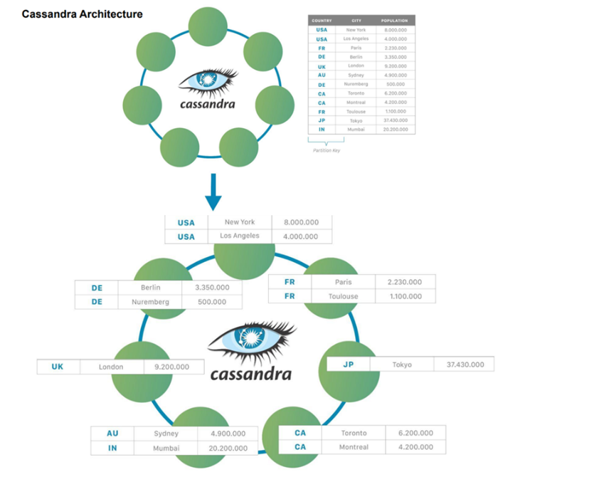
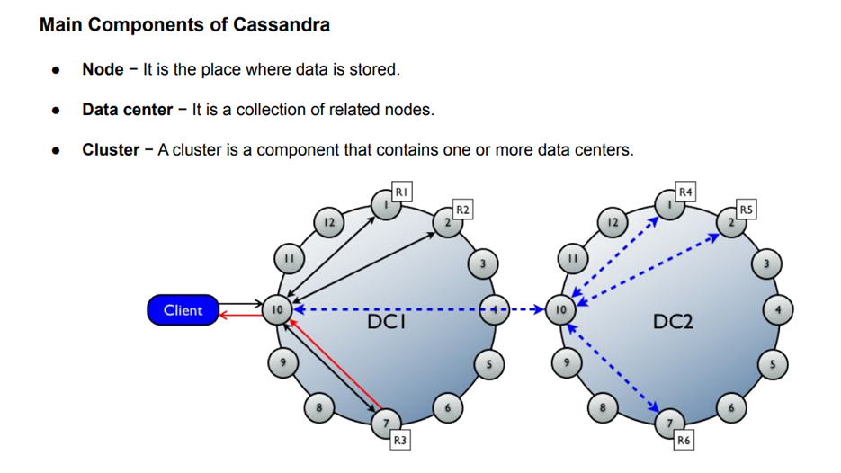
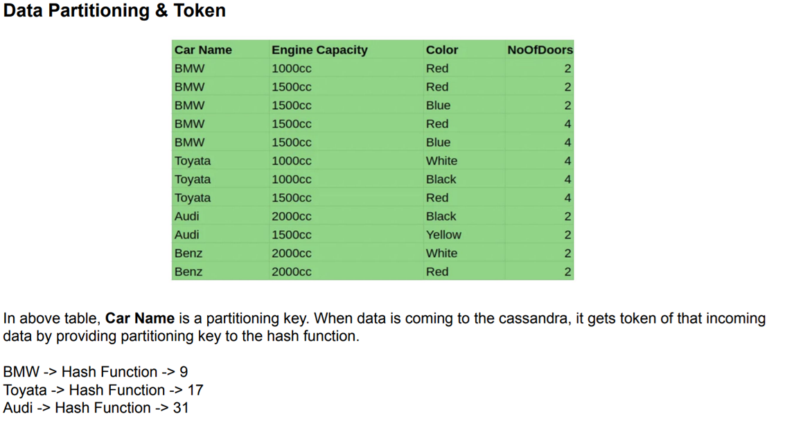
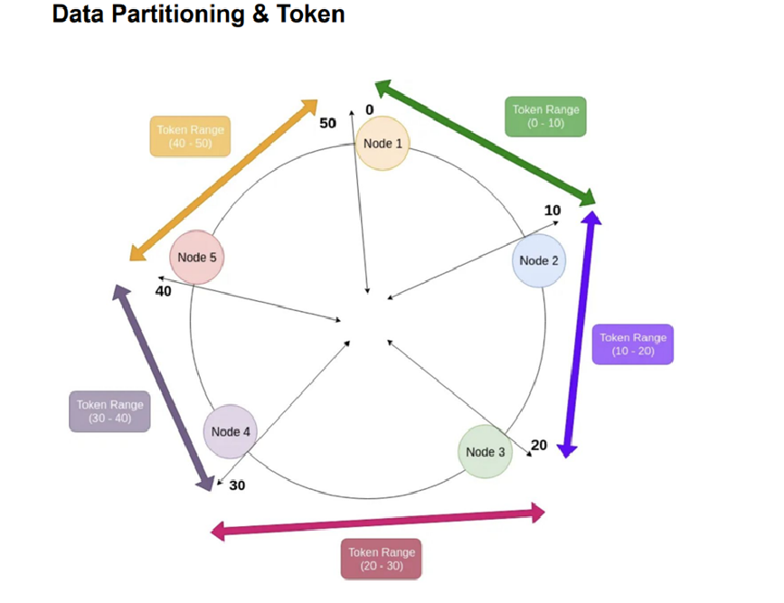
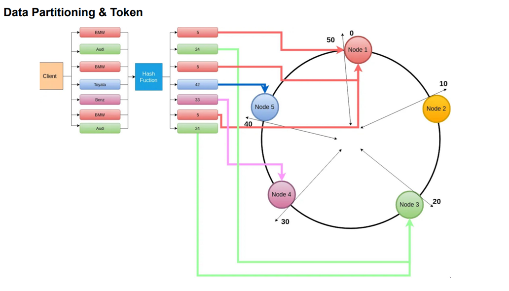
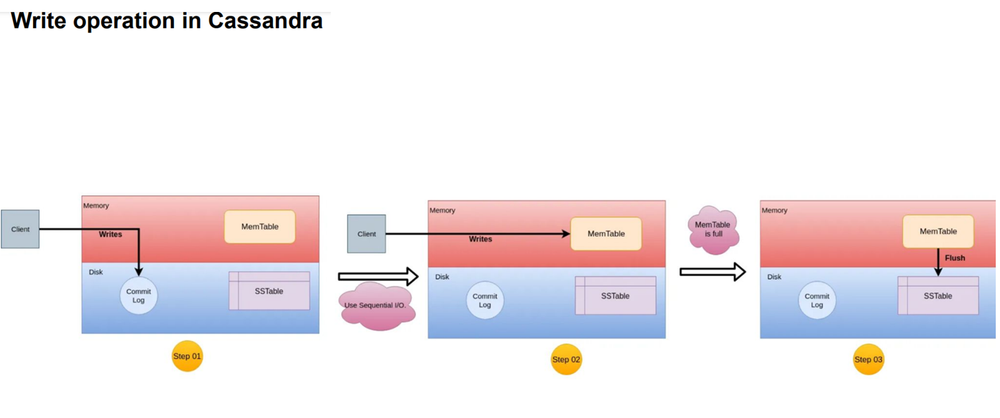
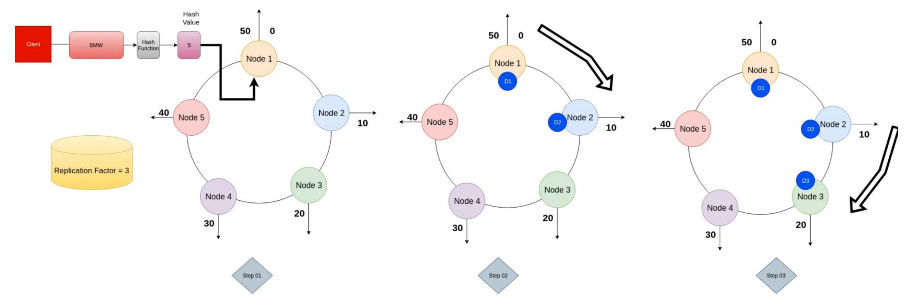
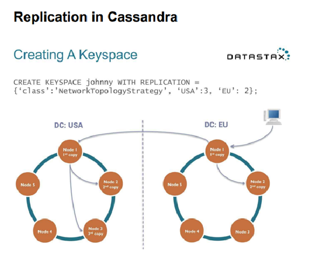

# **Apache Cassandra: A Deep Dive**

Apache Cassandra is a highly scalable, distributed, and fault-tolerant NoSQL database system. It is widely used for handling large-scale data across multiple nodes without a single point of failure. Developed originally at Facebook and later open-sourced under the Apache License, Cassandra is designed for high availability and fault tolerance, making it suitable for real-time big data applications.

---

## **1. Open-Source Distributed Database System**
Cassandra is an **open-source** database, meaning it is freely available for anyone to use, modify, and distribute. It is managed under the **Apache Software Foundation (ASF)**, which ensures continuous updates and improvements.  

### **Distributed Architecture**  
Unlike traditional relational databases that operate on a single server, Cassandra is built for **distributed computing**. Data is stored across multiple **commodity servers**, meaning low-cost, generic hardware can be used instead of expensive specialized systems.  

This distributed architecture helps:
- Scale **horizontally** by adding more nodes.
- Distribute data **across multiple locations**.
- Ensure high **fault tolerance** and **high availability**.

---

## **2. Wide-Column Store (NoSQL Database)**
Cassandra falls under the **wide-column store** category of NoSQL databases. Unlike relational databases that store data in tables with fixed schemas, Cassandra organizes data in **key-value pairs** with dynamic columns.

### **Key-Value Pair Storage Model**
- Data is stored in **rows**, but instead of a fixed number of columns, each row can have a **different number of columns**.
- The structure consists of:
  - **Keyspace**: Equivalent to a database in RDBMS.
  - **Column Family**: Equivalent to a table.
  - **Row**: Each row is identified by a unique **partition key**.
  - **Columns**: Each row can have a variable number of columns.

### **Advantages of Wide-Column Store:**
✅ Allows **high flexibility** in data modeling.  
✅ Supports **fast write and read operations**.  
✅ Scales efficiently for **big data applications**.

---

## **3. Highly Scalable**
Cassandra is designed for **horizontal scalability**, meaning that you can **add more nodes** (servers) to increase capacity rather than upgrading a single machine (**vertical scaling**).  

### **How Cassandra Achieves Scalability:**
- **Data is automatically partitioned** across nodes.
- Nodes communicate in a **peer-to-peer fashion**.
- Read and write operations are **distributed evenly**.
- It can handle **petabytes of data** without performance degradation.

Companies like **Netflix, Facebook, and Twitter** use Cassandra because of its ability to handle large-scale workloads efficiently.

---

## **4. Fault-Tolerant (No Single Point of Failure)**
Cassandra ensures that the system remains operational even if individual **nodes fail**.

### **How Cassandra Handles Fault Tolerance:**
- **Replication:** Data is copied across multiple nodes using **replication strategies**.
- **Automatic Failure Recovery:** If a node fails, the system automatically retrieves data from other replicas.
- **Decentralized Design:** Since there is no master-slave structure, failure of a single node does not disrupt operations.

✅ This makes Cassandra ideal for **mission-critical applications** that require **99.99% uptime**.

---

## **5. Decentralized Architecture**
Cassandra follows a **peer-to-peer model**, meaning **every node in the cluster is equal**.  

### **Key Features of Decentralization:**
- **No master-slave structure** (unlike traditional databases).
- **Every node can accept read and write requests**.
- **Automatic data replication** ensures high availability.

✅ This decentralized approach makes Cassandra **robust** and **self-healing**.

---

## **6. CAP Theorem and Cassandra (AP Model)**
Cassandra adheres to the **CAP Theorem**, which states that a distributed database can provide only **two out of three** guarantees:  
- **Consistency (C)**: Every read receives the most recent write.
- **Availability (A)**: Every request receives a response.
- **Partition Tolerance (P)**: The system continues to operate despite network failures.

### **Cassandra Prioritizes AP (Availability & Partition Tolerance)**
- **Availability:** Even if some nodes fail, requests are served using replicas.
- **Partition Tolerance:** It can handle network partitions without data loss.
- **Eventual Consistency:** Cassandra allows temporary inconsistencies but ensures **data consistency over time**.

✅ This makes Cassandra a great choice for systems that **cannot afford downtime**, like **banking, e-commerce, and social media** platforms.

---

## **7. Common Use Cases of Cassandra**
Cassandra is widely used in **industries that require fast, reliable, and scalable data management**. Some common use cases include:

### **1️⃣ Internet of Things (IoT)**
- IoT devices generate **huge amounts of data**.
- Cassandra efficiently **stores and processes** time-series data from millions of sensors.

### **2️⃣ Messaging and Chat Applications**
- WhatsApp, Discord, and Facebook Messenger **store billions of messages daily**.
- Cassandra’s **low-latency writes** make it ideal for real-time applications.

### **3️⃣ Fraud Detection Systems**
- Banks and financial institutions use Cassandra for **fraud detection**.
- Large-scale transaction data is processed **in real time**.

### **4️⃣ Recommendation Engines**
- Netflix, YouTube, and Amazon use Cassandra to **store user interactions**.
- Data is analyzed to provide **personalized recommendations**.

### **5️⃣ E-Commerce & Retail**
- Stores millions of **customer transactions**.
- Enables **real-time product recommendations**.

---

## **Conclusion**
Apache Cassandra is a **powerful, scalable, and fault-tolerant** NoSQL database. Its **distributed architecture**, **wide-column storage model**, and **eventual consistency** make it perfect for **big data applications** that require **high availability and reliability**.  

💡 If you are working on a **large-scale, high-traffic** application, Cassandra is a great choice! 🚀

<br/>
<br/>

# **Cassandra: Where It Fits Best & Its Limitations**  

Apache Cassandra is a NoSQL database designed for **high availability, scalability, and fast data processing**. It is best suited for applications that deal with **large volumes of data, require low-latency reads and writes, and cannot afford downtime**. However, it has some limitations, such as the lack of **JOIN operations** and certain other complex query capabilities.

---

# **✅ When to Use Cassandra (Ideal Use Cases)**  

Cassandra is perfect for scenarios that require:  
✔ **High availability** – Applications that need continuous uptime.  
✔ **Scalability** – Systems that handle ever-growing data.  
✔ **Fast read/write speeds** – Workloads that require real-time responses.  
✔ **Distributed architecture** – Businesses operating across multiple locations.  

### **1️⃣ Time-Series Data Processing**  
Cassandra is widely used in applications that handle **time-series data**, such as:  
- **IoT (Internet of Things) devices**: Storing sensor data from smart devices.  
- **Stock market analytics**: Recording stock prices at different timestamps.  
- **Weather monitoring systems**: Collecting real-time climate data.  

**Why?**  
🔹 Supports high-speed writes for continuous data streams.  
🔹 Easily scales to accommodate **huge data volumes** over time.  
🔹 Efficiently queries data using **partition keys** and **clustering keys**.  

---

### **2️⃣ Messaging & Chat Applications**  
Cassandra powers real-time **messaging platforms** like:  
- **WhatsApp, Telegram, Discord, and Facebook Messenger**.  
- **Live chat services for customer support**.  

**Why?**  
🔹 Handles **millions of concurrent messages** with low latency.  
🔹 Distributed architecture ensures **zero downtime**.  
🔹 Easily scales to support **global user bases**.  

---

### **3️⃣ Product Catalogs & Playlists**  
Many **e-commerce and entertainment platforms** use Cassandra to store:  
- **Product listings** (Amazon, Flipkart).  
- **Music/video playlists** (Spotify, Netflix, YouTube).  

**Why?**  
🔹 Handles **dynamic and frequently updated** catalog data.  
🔹 Supports **personalized recommendations**.  
🔹 Fast retrieval of product or media details for users.  

---

### **4️⃣ Recommendation Engines**  
Cassandra is ideal for **recommendation systems** in:  
- **E-commerce** (Amazon, eBay) – Product suggestions.  
- **Streaming platforms** (Netflix, YouTube, Spotify) – Movie/song recommendations.  
- **Social media** (Facebook, Instagram) – Personalized content feeds.  

**Why?**  
🔹 Can store and analyze **huge volumes of user interactions**.  
🔹 Provides **quick response times** for personalized recommendations.  

---

### **5️⃣ Fraud Detection & Financial Systems**  
Banks and financial institutions use Cassandra for:  
- **Detecting fraudulent transactions** in real time.  
- **Analyzing payment behaviors** for risk assessment.  
- **Storing and processing financial transactions** securely.  

**Why?**  
🔹 Supports **high-speed, real-time data processing**.  
🔹 **Highly available** – Ensures uninterrupted banking operations.  
🔹 Can handle **massive transaction volumes** efficiently.  

---

# **🚫 When Not to Use Cassandra (Limitations & Challenges)**  

While Cassandra is **highly scalable and performant**, it has some **limitations** compared to traditional relational databases (RDBMS) like MySQL and PostgreSQL.  

### **1️⃣ No Support for JOIN Operations**  
Cassandra **does not support** SQL-like **JOIN operations** that combine data from multiple tables.  

👉 In relational databases, **JOINs** are used to retrieve data from multiple related tables efficiently. However, Cassandra **avoids** them because:  
✔ JOINs are **computationally expensive** and slow down performance.  
✔ Cassandra's **distributed architecture** makes JOINs impractical.  
✔ The database prioritizes **speed and scalability** over complex querying.  

**Alternative Approach in Cassandra:**  
🔹 Instead of using **JOINs**, data is **denormalized** and stored in a **single table**.  
🔹 Data is duplicated across tables to **optimize read performance**.  

✅ **Example:** In a relational database, you might have separate tables for **Users** and **Orders** and use a JOIN to fetch order details for a specific user.  
❌ In Cassandra, you would store **user orders within the same table** to avoid JOINs, even if it means **duplicating data**.  

---

### **2️⃣ No ACID Compliance (Strong Consistency)**
Cassandra does **not** follow full **ACID (Atomicity, Consistency, Isolation, Durability)** principles like relational databases. Instead, it follows the **AP model** (Availability & Partition Tolerance) in the CAP theorem.  

🔹 **No Strong Consistency** – Data updates may take time to propagate (eventual consistency).  
🔹 **Writes are prioritized over strong read consistency** – Might see older data briefly.  
🔹 **Not ideal for banking applications requiring strict consistency.**  

✅ **Example:** If a user updates their email in one region, another region might still see the old email for a short time.  

---

### **3️⃣ No Complex Querying (No Aggregations, Subqueries)**
Cassandra **lacks** advanced SQL query capabilities such as:  
❌ Aggregations (`SUM()`, `AVG()`, `GROUP BY`).  
❌ Subqueries and correlated queries.  
❌ Complex filters that relational databases handle efficiently.  

**Alternative Approach:**  
✔ Use **Apache Spark or Presto** for complex analytics on Cassandra data.  
✔ Store **aggregated data in separate tables** to avoid on-the-fly computation.  

---

### **4️⃣ High Storage Due to Denormalization**
Since Cassandra avoids **JOINs**, data is **duplicated across multiple tables**.  
🔹 This leads to **higher storage costs** compared to RDBMS.  
🔹 More data redundancy, but **better read performance**.  

✅ **Example:** If a user’s information appears in 10 different tables, changing one field means updating all 10 records.  

---

# **🛠 Summary: When to Choose Cassandra?**  
| **Feature** | **Cassandra** | **RDBMS (MySQL, PostgreSQL)** |
|------------|--------------|------------------------------|
| **Scalability** | ✅ High (Horizontal Scaling) | 🚫 Limited (Vertical Scaling) |
| **High Availability** | ✅ Yes (No single point of failure) | 🚫 Not always (Master-Slave setup) |
| **Write Performance** | ✅ Very fast | 🚫 Slower |
| **Read Performance** | ✅ Optimized for pre-structured queries | ✅ Flexible queries |
| **JOIN Support** | 🚫 No | ✅ Yes |
| **Complex Queries** | 🚫 No (Limited querying) | ✅ Yes (Aggregations, Subqueries) |
| **ACID Compliance** | 🚫 No (Eventual Consistency) | ✅ Yes (Strong Consistency) |
| **Best Use Cases** | 🚀 Big Data, IoT, Messaging, Fraud Detection, Streaming | 🏦 Banking, ERP, Traditional Business Apps |

---

# **Conclusion**
**Cassandra is a great choice** for applications that require **high scalability, availability, and fast data processing**. However, it is **not suitable for traditional relational applications** that rely heavily on **JOINs, transactions, and complex queries**.  

✅ Use Cassandra for **real-time big data, IoT, messaging, recommendation engines, and fraud detection**.  
❌ Avoid Cassandra if you need **strong consistency, complex SQL queries, or strict ACID compliance**.  

<br/>
<br/>

# **Explanation of the Cassandra Architecture Diagram**  



The given diagram visually represents the **architecture of Apache Cassandra**, showing how data is distributed across multiple nodes in a decentralized manner. Below is a **detailed breakdown** of the key concepts illustrated in the image.

---

## **1️⃣ Cassandra's Ring Architecture**  
- The **top part of the diagram** shows Cassandra's **ring-based architecture**, where each node (green circle) is **connected to other nodes** in a peer-to-peer manner.
- This represents **Cassandra’s decentralized design**, where there is **no master node**—all nodes are equal.
- Each node is responsible for storing part of the data.

📌 **Key Takeaways:**  
✔ **Decentralized** – Every node in Cassandra plays the same role.  
✔ **Fault-Tolerant** – If a node fails, other nodes continue to serve the data.  
✔ **Scalable** – More nodes can be added without downtime.

---

## **2️⃣ Partitioning of Data (Partition Key Concept)**  
- The **table in the top right** shows a list of **cities, countries, and populations**.
- The **country** column is highlighted, indicating that it is used as the **Partition Key** in Cassandra.
- A **Partition Key** determines **which node stores the data**.

📌 **Example from the Diagram:**  
- **USA** is the partition key for:
  - New York (8,000,000)
  - Los Angeles (4,000,000)
- **DE (Germany)** is the partition key for:
  - Berlin (3,350,000)
  - Nuremberg (500,000)
- **CA (Canada)** is the partition key for:
  - Toronto (6,200,000)
  - Montreal (4,200,000)

🔹 The **Partition Key ensures even distribution** of data across nodes.  
🔹 Data from the **same partition key is stored together**, reducing the need for JOIN operations.

---

## **3️⃣ Distributed Data Storage in the Cassandra Ring**  
- The **bottom part of the diagram** shows how the **cities are stored across different nodes** in the Cassandra cluster.
- Each country’s data is placed in different **nodes in the ring**.
- There is **no central database server**—each node is responsible for storing and managing data.

📌 **Example from the Diagram:**  
- **USA-based cities (New York, Los Angeles)** are stored in **one or more nodes**.
- **Germany-based cities (Berlin, Nuremberg)** are stored in **another set of nodes**.
- **Japan (Tokyo) is stored separately**, ensuring a **balanced distribution**.

🔹 **Data is replicated** across multiple nodes for **fault tolerance**.  
🔹 If one node fails, the data can still be accessed from another node.  

---

## **4️⃣ Key Features Illustrated in the Diagram**  

🔹 **Partitioning:**  
   - The database is split across multiple nodes based on a **partition key** (in this case, **country**).  
   - The partitioning method ensures **fast lookups** and **high scalability**.  

🔹 **Replication & Fault Tolerance:**  
   - Data is **replicated** across multiple nodes to prevent data loss in case of failure.  
   - If a node goes down, another node contains the same copy.  

🔹 **Decentralization & Peer-to-Peer Model:**  
   - There is **no master-slave structure**—every node has equal responsibility.  
   - This enables **horizontal scaling**, meaning more servers can be added easily.  

🔹 **Eventual Consistency (AP Model – CAP Theorem):**  
   - Cassandra prioritizes **Availability** and **Partition Tolerance** over strict **Consistency**.  
   - **Writes are fast**, but reads may sometimes return slightly older data before reaching eventual consistency.  

---

## **5️⃣ Summary: How the Architecture Works**  
1. **Data is divided** into partitions using a partition key (e.g., **country**).  
2. **Each partition is stored** in a distributed manner across nodes in the ring.  
3. **Nodes communicate with each other** in a peer-to-peer fashion to handle requests.  
4. **If a node fails, data is still accessible** due to replication on other nodes.  
5. **New nodes can be added** without stopping the system, ensuring high scalability.  

---

### **🌟 Conclusion**  
This diagram **perfectly illustrates** how Cassandra achieves:  
✅ **Decentralization** – No master node, all nodes are equal.  
✅ **Scalability** – Can handle growing data by adding nodes.  
✅ **Fault Tolerance** – Data replication ensures no single point of failure.  
✅ **High Availability** – Ensures data is always accessible.  

<br/>
<br/>

# **Features of Apache Cassandra (Explained in Detail)**
Apache Cassandra is a **highly scalable**, **distributed**, and **fault-tolerant** NoSQL database designed for **big data applications**. Below is a **detailed explanation** of each feature you mentioned.

---

## **1️⃣ No Single Point of Failure 🚫**
- **What it means:** Cassandra is designed to ensure that no single component can cause the entire system to fail.
- **How it works:**
  - It uses a **peer-to-peer architecture** instead of a **master-slave model**.
  - Data is **replicated across multiple nodes**, so even if a node crashes, other nodes can handle the load.
  - **Failure detection mechanisms** help route traffic away from failed nodes.

📌 **Example:** If a node storing user account details crashes, the same data can be retrieved from another replica node.

---

## **2️⃣ Massive Scalability 📈**
- **What it means:** Cassandra can handle **huge amounts of data** and **scale horizontally** without affecting performance.
- **How it works:**
  - New nodes can be **added dynamically** without downtime.
  - Data is **automatically distributed** across nodes using a **consistent hashing** algorithm.

📌 **Example:** Companies like Facebook and Netflix use Cassandra to manage petabytes of data efficiently.

---

## **3️⃣ Possibility to Add Nodes Anytime 🔄**
- **What it means:** Unlike traditional databases, where adding new servers requires downtime or reconfiguration, Cassandra allows **live scaling**.
- **How it works:**
  - When a new node is added, the **data is automatically redistributed**.
  - The system **detects and integrates the new node** without manual intervention.

📌 **Example:** If an e-commerce site experiences **high traffic during sales**, they can add new Cassandra nodes on the fly without restarting the system.

---

## **4️⃣ Highly Distributed 🌍**
- **What it means:** Cassandra is designed to **distribute data across multiple locations** (datacenters, cloud servers, etc.).
- **How it works:**
  - It supports **multi-datacenter replication** to ensure **low-latency access** to users worldwide.
  - Each node acts independently and can process **read/write operations locally**.

📌 **Example:** A global video streaming service can store **Europe-based user data in European nodes** and **US-based user data in US nodes**, reducing latency.

---

## **5️⃣ High Performance ⚡**
- **What it means:** Cassandra is optimized for **fast read and write operations**, even with massive data volumes.
- **How it works:**
  - Writes are **always fast** due to an **append-only log structure (Commit Log)**.
  - Reads are optimized with **Bloom filters** and **Memtables**, reducing disk I/O.
  - **Replication ensures** that even if a node is overloaded, another node can serve the request.

📌 **Example:** Messaging apps like WhatsApp use Cassandra to **store chat messages in real-time**.

---

## **6️⃣ No Masters and Slaves (Peer-to-Peer) 🔄**
- **What it means:** All nodes in a Cassandra cluster are **equal**, unlike traditional databases with a **master-slave model**.
- **How it works:**
  - Any node can process **read/write requests**.
  - If a node fails, other nodes take over its tasks automatically.

📌 **Example:** In a **traditional database**, if the master node fails, the entire system may crash. In Cassandra, no such issue occurs.

---

## **7️⃣ Ring-Type Architecture 🔗**
- **What it means:** Cassandra organizes nodes in a **logical ring** rather than a hierarchical structure.
- **How it works:**
  - Each node in the ring is **responsible for a specific data range**.
  - Nodes communicate with their neighbors to balance the load.
  - This structure **eliminates bottlenecks**.

📌 **Example:** If 10 nodes handle 10 million users, each node stores data for 1 million users. Adding a new node redistributes data automatically.

---

## **8️⃣ Automatic Data Distribution Across All Nodes 📡**
- **What it means:** Data is **evenly spread across all nodes** without manual intervention.
- **How it works:**
  - Cassandra uses **consistent hashing** to assign data partitions to nodes.
  - When new nodes are added, data is **rebalanced** automatically.

📌 **Example:** If a **banking application** stores transaction data, Cassandra ensures transactions are distributed efficiently across nodes.

---

## **9️⃣ Replication of Data Across Nodes 🔄**
- **What it means:** Data is **copied to multiple nodes** to prevent loss in case of failure.
- **How it works:**
  - Cassandra allows **custom replication strategies** (Simple, NetworkTopology, etc.).
  - Users can define **replication factors** (e.g., **3 copies of each data item**).

📌 **Example:** In a **stock trading system**, data loss is unacceptable. Cassandra ensures that **every trade record is safely replicated**.

---

## **🔟 Data Kept in Memory and Written to Disk Lazily 🛠️**
- **What it means:** Cassandra stores data in **memory first** before writing it to disk.
- **How it works:**
  - **Memtables** store data in RAM for quick access.
  - Periodically, Memtables are flushed to **SSTables (disk storage)**.
  - This approach **boosts write speed**.

📌 **Example:** A social media platform like Twitter stores recent tweets in memory for quick access, then saves them to disk in batches.

---

## **1️⃣1️⃣ Hash Values of Keys Are Used for Data Distribution 🔢**
- **What it means:** Cassandra distributes data based on **hashed partition keys**.
- **How it works:**
  - **Murmur3 hashing** algorithm converts keys into hash values.
  - These hash values determine **which node stores the data**.
  - This ensures **balanced data distribution**.

📌 **Example:** A **weather application** can store temperature data using **location as the partition key**, ensuring that similar locations are stored together.

---

### **🚀 Summary: Why Cassandra is Powerful**
| Feature | Benefit |
|---------|---------|
| **No single point of failure** | Ensures **high availability** even if nodes fail. |
| **Massive scalability** | Supports **petabyte-scale data** with ease. |
| **Add nodes anytime** | Dynamically expand storage **without downtime**. |
| **Highly distributed** | Supports **multi-region** and **multi-cloud deployment**. |
| **High performance** | Optimized for **low-latency** reads and writes. |
| **Peer-to-peer model** | No dependency on a **single master**. |
| **Ring architecture** | **Even data distribution** and **fast lookups**. |
| **Automatic data distribution** | No need for **manual sharding**. |
| **Replication across nodes** | Data **remains safe** even if some nodes fail. |
| **In-memory writes** | **Fast transactions** before writing to disk. |
| **Hash-based partitioning** | **Efficient load balancing** across nodes. |

---

### **🎯 Conclusion**
Apache Cassandra is a **powerful, scalable, and fault-tolerant database**. Its **peer-to-peer architecture**, **automatic data distribution**, and **high performance** make it ideal for **big data applications, real-time analytics, and mission-critical workloads**.


<br/>
<br/>

# **Detailed Explanation of the Cassandra Components Diagram**



The diagram illustrates the **main components of Apache Cassandra**, including **nodes, data centers, and clusters**. Below is a breakdown of each component and the interactions between them.

---

## **1️⃣ Components in Cassandra**
### **🔹 Node**
- A **node** is the **basic unit of storage** in Cassandra.
- Each node stores **a subset of data** and is responsible for handling **read/write requests**.
- Nodes communicate with **each other** in a **peer-to-peer** fashion.

📌 **Example:** If you store user profile data in Cassandra, one node might store **users A–M**, while another stores **users N–Z**.

---

### **🔹 Data Center (DC)**
- A **data center (DC)** is a **collection of multiple nodes** that work together.
- Cassandra supports **multi-data center replication**, meaning data can be stored in **different geographic locations** for **fault tolerance and low latency**.

📌 **Example:** A **global e-commerce site** can have:
  - **DC1** (North America)
  - **DC2** (Europe)
  - **DC3** (Asia)

---

### **🔹 Cluster**
- A **cluster** contains **one or more data centers**.
- It ensures **high availability**, **load balancing**, and **fault tolerance**.
- A **client (application)** interacts with the **cluster** to perform database operations.

📌 **Example:** Netflix uses a **Cassandra cluster** to store **user watch history across multiple regions**.

---

## **2️⃣ Understanding the Diagram**
The diagram represents a **Cassandra cluster** with **two data centers** (**DC1 and DC2**) and shows how **data flows between nodes**.

### **🔵 Client Request (Blue Line)**
- The **client (blue box)** sends a request to **Node 10** in **DC1**.
- **Node 10** then routes the request within **DC1** to the **appropriate nodes**.

---

### **🔴 Data Replication in Data Center 1 (DC1) (Red Line)**
- When data is written to **Node 10**, it is **replicated to other nodes** in **DC1**.
- The arrows indicate **how data is distributed** among other nodes (**e.g., Node 7, Node 3**).
- This ensures **data redundancy** in case any node fails.

📌 **Example:** If a social media post is stored on **Node 10**, **copies are stored on other nodes** to prevent data loss.

---

### **🔵 Inter-Data Center Communication (Dashed Blue Line)**
- Cassandra supports **multi-datacenter replication**.
- In the diagram, **Node 10 (DC1) sends data to Node 10 (DC2)**.
- Once the data reaches **DC2**, it is further **distributed to other nodes** (e.g., Node 11, Node 7).

📌 **Example:** If an **Indian user uploads a photo**, the data is **replicated from DC1 (USA) to DC2 (India)** for **faster access**.

---

### **⚡ Key Takeaways**
| Feature | Explanation |
|---------|------------|
| **Nodes** | Individual storage units that store and manage data. |
| **Data Centers (DCs)** | Groups of nodes in a **specific geographical region**. |
| **Cluster** | A collection of data centers that work together. |
| **Client Requests** | Clients interact with any node, and data is replicated across nodes. |
| **Replication** | Ensures **fault tolerance** by copying data across multiple nodes and data centers. |

---

## **3️⃣ Why is this Architecture Important?**
✅ **Fault Tolerance** – Even if a node or data center fails, data is available from other nodes.  
✅ **High Availability** – Users can access data **without downtime**.  
✅ **Low Latency** – Data is **stored near users** for fast access.  
✅ **Automatic Load Balancing** – No **manual sharding** required; data is **automatically distributed**.  

---

## **🎯 Conclusion**
This diagram represents **Cassandra's distributed architecture**, which ensures **high availability, fault tolerance, and scalability**. Cassandra is ideal for **large-scale applications like social media platforms, e-commerce, and financial services**.

<br/>
<br/>

# **Data Partitioning & Token in Cassandra (Detailed Explanation)**

In **Apache Cassandra**, **partitioning** is a crucial concept that determines how data is distributed across multiple nodes in a cluster. Since Cassandra is a **distributed database**, it needs an efficient way to store and retrieve data from multiple servers. This is achieved through **data partitioning**, **tokens**, and **partitioners**.

---

## **1️⃣ What is Data Partitioning?**
**Data partitioning** refers to how Cassandra **distributes data** across multiple nodes. Instead of storing all data on a single node, Cassandra **splits data into partitions** and spreads them across different nodes.

💡 **Why is Partitioning Important?**
- **Scalability**: Data is evenly distributed, allowing horizontal scaling.
- **Performance**: Queries are directed to the correct partition, making lookups fast.
- **Load Balancing**: Prevents overloading a single node.

🔹 **Example**  
Suppose we have **user data**:
```
User_ID   Name      Country
101       Alice     USA
102       Bob       UK
103       Charlie   India
104       Dave      Canada
```
If Cassandra had **4 nodes**, it might distribute data as follows:
- **Node 1**: `User_ID 101`
- **Node 2**: `User_ID 102`
- **Node 3**: `User_ID 103`
- **Node 4**: `User_ID 104`

This distribution is done using **partition keys and tokens**.

---

## **2️⃣ Partition Key**
- The **partition key** is used to determine **which node stores a given row of data**.
- It is the **first part of the Primary Key** in a Cassandra table.

🔹 **Example**
```cql
CREATE TABLE users (
    user_id INT PRIMARY KEY,
    name TEXT,
    country TEXT
);
```
Here, `user_id` is the **partition key**. It determines which **node** will store the data.

🔹 **How it Works?**
- Cassandra **hashes the partition key** using a partitioner (explained later).
- The **hashed value (token)** decides which node stores the data.

---

## **3️⃣ What is a Token in Cassandra?**
A **token** is a **hashed value** of the partition key that determines where the data will be stored in the cluster.

### **🔹 Token Assignment**
- When data is written, the **partition key is converted into a token** using a **hash function**.
- This **token** determines **which node** stores the data.
- Each node in the cluster is responsible for a **range of tokens**.

🔹 **Example**  
Assume we have 4 nodes:
```
Node 1 → Stores tokens from -9 to -1
Node 2 → Stores tokens from 0 to 9
Node 3 → Stores tokens from 10 to 19
Node 4 → Stores tokens from 20 to 29
```
If a **partition key** gets hashed to **token 12**, it will be stored in **Node 3**.

---

## **4️⃣ Token Range**
- Each node in a Cassandra cluster is assigned a **range of tokens**.
- A **token range** defines the data each node is responsible for.
- This ensures **even data distribution** across all nodes.

🔹 **Example**
```
Node 1 → Tokens: -100 to -50
Node 2 → Tokens: -49 to 0
Node 3 → Tokens: 1 to 50
Node 4 → Tokens: 51 to 100
```
If **user_id 101** hashes to **token 45**, it will be stored in **Node 3**.

---

## **5️⃣ What is a Partitioner?**
A **partitioner** is a **hash function** that converts a **partition key** into a **token**.

### **🔹 Role of a Partitioner**
1. **Converts the partition key into a token** (hashing).
2. **Distributes data across nodes** in the cluster.
3. **Ensures balanced load** among nodes.

### **🔹 Types of Partitioners in Cassandra**
| **Partitioner**          | **Description** |
|--------------------------|----------------|
| **Murmur3Partitioner** (Default) | Uses the **MurmurHash function** to generate a **64-bit token**. |
| **RandomPartitioner** | Uses **MD5 hashing** to distribute data randomly. |
| **ByteOrderedPartitioner** | Stores data **in sorted order** (not recommended for large-scale use). |

🚀 **Cassandra uses `Murmur3Partitioner` by default**, as it provides **fast hashing** and **even data distribution**.

---

## **6️⃣ How Cassandra Distributes Data (Step-by-Step)**
**📌 Suppose we insert data into a Cassandra table:**
```cql
INSERT INTO users (user_id, name, country) VALUES (101, 'Alice', 'USA');
```

🔹 **Step 1**: **Compute the Token**
- The **partition key (101)** is hashed using **Murmur3Partitioner**.
- Suppose the **hashed token = 45**.

🔹 **Step 2**: **Find the Correct Node**
- If **Node 3** stores tokens **1 to 50**, it will store this data.

🔹 **Step 3**: **Data Replication**
- Cassandra will **replicate this data** to multiple nodes for **fault tolerance**.

---

## **7️⃣ Key Takeaways**
| Feature | Explanation |
|---------|------------|
| **Partitioning** | Divides data across nodes to ensure scalability. |
| **Partition Key** | Determines where data is stored in the cluster. |
| **Token** | A hash value of the partition key that assigns data to nodes. |
| **Token Range** | Each node is responsible for a specific range of tokens. |
| **Partitioner** | Hash function that determines which node stores data. |
| **Replication** | Data is copied across multiple nodes for fault tolerance. |

---

## **🎯 Conclusion**
- **Cassandra uses a partitioning strategy to distribute data efficiently across nodes.**
- **Tokens and partitioners ensure even data distribution and fast lookups.**
- **Understanding data partitioning is crucial for designing scalable Cassandra applications.**

<br/>
<br/>


# **Explanation of Data Partitioning & Token in Cassandra (Based on Image)**



In **Apache Cassandra**, data is **partitioned** and distributed across nodes using a **partition key** and a **hash function**. The provided table and explanation illustrate how Cassandra assigns **tokens** based on the partition key.

---

## **1️⃣ Understanding the Table**
The table consists of **four columns**:
- **Car Name** → **Partition Key** (used for data distribution)
- **Engine Capacity** → Engine size in "cc" (not a partitioning factor)
- **Color** → Car color (not a partitioning factor)
- **NoOfDoors** → Number of doors in the car (not a partitioning factor)

Since **Car Name** is the **partition key**, Cassandra will:
1. **Hash the partition key** using a hash function (like Murmur3).
2. **Generate a token**.
3. **Assign the data to a node responsible for that token range**.

---

## **2️⃣ How Cassandra Generates Tokens**
Each unique **partition key (Car Name)** is passed through a **hash function**, which outputs a **token**.

From the image:
- **BMW** → Hash Function → **Token = 9**
- **Toyota** → Hash Function → **Token = 17**
- **Audi** → Hash Function → **Token = 31**

🔹 **Example Process for BMW**:
1. Cassandra **takes "BMW" as the partition key**.
2. It **applies a hashing algorithm** (Murmur3Partitioner by default).
3. The result is **a token value = 9**.
4. Cassandra **assigns data with "BMW" as a partition key** to the **node responsible for token 9**.

This ensures that **all rows with "BMW" as Car Name** are stored together on the same node.

---

## **3️⃣ Why Partitioning is Important?**
- **Scalability** → Large datasets are distributed across multiple nodes.
- **Load Balancing** → Ensures an even distribution of data.
- **Efficient Reads/Writes** → Queries fetch data directly from the responsible node.

🔹 **Example Query in Cassandra Query Language (CQL)**:
```cql
SELECT * FROM cars WHERE car_name = 'BMW';
```
- This query **directly fetches data** from the node storing **token 9**.
- No need to **scan all nodes**, improving **query performance**.

---

## **4️⃣ Token Assignment & Distribution**
- Each node in a Cassandra cluster **is responsible for a token range**.
- Example:
  ```
  Node 1 → Tokens 0 to 10
  Node 2 → Tokens 11 to 20
  Node 3 → Tokens 21 to 40
  ```
- Based on the given token values:
  - **BMW (9)** → Stored in **Node 1**
  - **Toyota (17)** → Stored in **Node 2**
  - **Audi (31)** → Stored in **Node 3**

Thus, **each car brand's data is stored in a specific node** based on the **token range**.

---

## **5️⃣ Key Takeaways**
| Feature | Explanation |
|---------|------------|
| **Partition Key** | Determines where data is stored (Car Name in this case). |
| **Hash Function** | Converts the partition key into a token. |
| **Token** | A numeric value used to distribute data among nodes. |
| **Token Range** | Each node is responsible for a specific token range. |
| **Efficient Queries** | Since all related data is stored on the same node, queries are fast. |

---

## **6️⃣ Final Summary**
- **Cassandra partitions data based on the partition key (Car Name).**
- **A hash function generates a token that determines the node for storage.**
- **All records with the same partition key are stored on the same node.**
- **This ensures scalability, faster queries, and load balancing.**

<br/>
<br/>

# **Understanding Data Partitioning & Token Ring in Cassandra (Based on Image)**



The provided image represents **how Cassandra distributes data across multiple nodes** using **token ranges**. This method ensures that **each node is responsible for a portion of the data**, allowing for **scalability, fault tolerance, and efficient query performance**.

---

## **1️⃣ What is the Token Ring?**
- Cassandra uses a **token-based partitioning strategy**.
- The **token ring** is a **circular structure** where each node is assigned a **token range**.
- Each data row is **hashed using its partition key** to generate a **token**.
- The **node responsible for the corresponding token range** stores the data.

---

## **2️⃣ Breakdown of the Image**
The image illustrates **5 nodes** in a **circular token ring** with specific **token ranges**.

| **Node** | **Token Range**  |
|----------|-----------------|
| **Node 1** | 0 - 10  |
| **Node 2** | 10 - 20 |
| **Node 3** | 20 - 30 |
| **Node 4** | 30 - 40 |
| **Node 5** | 40 - 50 |

- **Each node stores the data** that falls within its **assigned token range**.
- **Example**: If a hashed partition key results in **token = 12**, it will be stored in **Node 2** (Token Range: **10-20**).

---

## **3️⃣ How Data is Stored in Cassandra**
1. **Data is inserted with a partition key** (e.g., "BMW").
2. **Cassandra applies a hash function** (e.g., Murmur3) to generate a token.
3. **The token determines the node responsible for storing the data**.
4. **Replication** ensures that copies of data exist on multiple nodes for fault tolerance.

---

## **4️⃣ Example: Token Assignment**
From the **previous table**, let's assume:
- **BMW → Hash Function → Token = 9**
- **Toyota → Hash Function → Token = 17**
- **Audi → Hash Function → Token = 31**

Using the **token ranges from the image**:
- **BMW (9)** → Stored in **Node 1** (Token Range: 0 - 10)
- **Toyota (17)** → Stored in **Node 2** (Token Range: 10 - 20)
- **Audi (31)** → Stored in **Node 4** (Token Range: 30 - 40)

---

## **5️⃣ Benefits of This Partitioning Approach**
✅ **Scalability** → New nodes can be added without downtime.  
✅ **Efficient Data Retrieval** → Queries directly access the responsible node.  
✅ **Load Balancing** → Each node stores a fair share of data.  
✅ **Fault Tolerance** → Data replication ensures high availability.  

---

## **6️⃣ Key Takeaways**
- **Cassandra partitions data using a token-based system**.
- **Each node is responsible for a specific token range**.
- **Hashing the partition key determines which node stores the data**.
- **This method ensures efficient, distributed, and scalable storage**.

<br/>
<br/>

# **Understanding Data Partitioning & Token Ring in Cassandra (Based on Image)**  



This image visually represents **how Cassandra partitions and distributes data** across multiple nodes using a **consistent hashing-based token ring**. This method ensures **scalability, fault tolerance, and efficient data retrieval**.

---

## **1️⃣ How the Token Ring Works?**
- Cassandra assigns a **unique token value** to each node in a **circular ring**.
- Each data row is assigned a **token** by hashing its **partition key** (e.g., "BMW", "Audi").
- The node responsible for storing the data is determined based on the **token range**.

---

## **2️⃣ Breakdown of the Image**
The image consists of **three key sections**:

### **A. Left Section: Client and Hash Function**
1. The **client sends data entries** (e.g., "BMW", "Audi", "Toyota").
2. The **hash function computes a token** for each entry.
3. The hashed tokens determine **which node stores the data**.

**Example:**
- "BMW" → Hashed Token = **5**
- "Audi" → Hashed Token = **24**
- "Toyota" → Hashed Token = **42**
- "Benz" → Hashed Token = **33**
- "BMW" → Hashed Token = **5**
- "Audi" → Hashed Token = **24**

---

### **B. Middle Section: Tokens Mapped to Nodes**
Each hashed token falls within a **specific node’s token range**.

| **Partition Key** | **Hashed Token** | **Stored in Node** |
|------------------|-----------------|-----------------|
| BMW             | 5               | **Node 1** (0-10) |
| Audi            | 24              | **Node 3** (20-30) |
| Toyota          | 42              | **Node 5** (40-50) |
| Benz            | 33              | **Node 4** (30-40) |
| BMW             | 5               | **Node 1** (0-10) |
| Audi            | 24              | **Node 3** (20-30) |

- The token values **determine which node stores the data**.
- If a new node is added, **the token ranges are redistributed** dynamically.

---

### **C. Right Section: The Token Ring**
- The **ring structure represents how nodes store data** based on token ranges.
- **Each node is responsible for a specific token range**:
  - **Node 1**: 0 - 10
  - **Node 2**: 10 - 20
  - **Node 3**: 20 - 30
  - **Node 4**: 30 - 40
  - **Node 5**: 40 - 50

- **Colored arrows show how each token is assigned to a node**.

#### **Example Walkthrough:**
- **BMW (Token = 5) → Stored in Node 1 (0-10)**
- **Audi (Token = 24) → Stored in Node 3 (20-30)**
- **Toyota (Token = 42) → Stored in Node 5 (40-50)**

---

## **3️⃣ Why Use This Partitioning Strategy?**
✅ **Scalability** – Easily add new nodes without affecting existing data.  
✅ **Efficient Data Retrieval** – Queries directly access the responsible node.  
✅ **Load Balancing** – Each node handles a fair share of data.  
✅ **Fault Tolerance** – Replication ensures high availability.  

---

## **4️⃣ Summary**
- Cassandra **hashes partition keys** to determine token values.
- Nodes in a **token ring** are responsible for **specific token ranges**.
- Data is **distributed efficiently** across nodes for **scalability and fault tolerance**.

<br/>
<br/>

# **Virtual Nodes (VNodes) in Cassandra - Detailed Explanation**  

## **1️⃣ What are Virtual Nodes (VNodes)?**
In Cassandra, **Virtual Nodes (VNodes)** help distribute data more efficiently by **assigning multiple token ranges to each node** instead of just one.  

- In a **traditional setup (vnode=1)**, each node is assigned **one large continuous token range**.
- With **VNodes**, each node is responsible for **multiple small token ranges** instead of one large one.

---

## **2️⃣ Why Were VNodes Introduced?**
In the past, Cassandra used **single-token range assignment** per node, meaning:
1. When **adding a new node**, data **had to be moved in large chunks** from other nodes, making rebalancing slow.
2. If a **specific token range had more requests**, it could create an **imbalance in load distribution**.

To solve these issues, **VNodes were introduced**. Instead of each node having **only one token range**, it now manages **multiple smaller token ranges**.

---

## **3️⃣ Comparison: Traditional vs VNodes**

### **A. Traditional Approach (vnode=1)**
- Each node is assigned **one large continuous token range**.
- Example in a **3-node cluster**:
  - **Node 1** → Token range: **1 – 100**
  - **Node 2** → Token range: **101 – 200**
  - **Node 3** → Token range: **201 – 300**
  
**Problems:**
- If **Node 2 fails**, a large portion of the data (101–200) is affected.
- Adding a **new node** means **redistributing an entire token range** (e.g., splitting Node 2’s data).
- **Load imbalance** if certain token ranges have **more read/write requests**.

---

### **B. VNodes Approach (vnode > 1)**
- Instead of **one large token range**, each node gets **multiple smaller ranges**.
- Example in a **3-node cluster**:
  - **Node 1** → **1–50, 151–200**
  - **Node 2** → **51–100, 201–250**
  - **Node 3** → **101–150, 251–300**

✅ **Advantages:**
1. **Better Data Distribution**  
   - Instead of having **one large chunk of data per node**, each node gets **multiple small chunks**.
   - Ensures **more even load balancing**.

2. **Easier to Add or Remove Nodes**  
   - When a new node is added, it takes **some token ranges from existing nodes** instead of large chunks.
   - This makes **cluster expansion and contraction smoother**.

3. **Improved Fault Tolerance**  
   - If **Node 2 fails**, the affected ranges (e.g., 51–100, 201–250) are **replicated across other nodes**.
   - **Less impact on availability**.

---

## **4️⃣ Example: Adding a New Node**
### **🔴 Without VNodes (vnode=1)**
- Assume we add a **new Node 4**.
- We must **split an entire range from an existing node** (e.g., Node 2: 101–200).
- This requires **reshuffling large amounts of data**.

### **🟢 With VNodes (e.g., vnode=3)**
- A new node **takes small token ranges from multiple nodes**.
- Instead of **one large transfer**, the system **moves multiple small pieces**.
- **Less data movement = Faster scaling.**

---

## **5️⃣ Real-World Benefits of VNodes**
| **Feature**          | **Without VNodes (vnode=1)** | **With VNodes** |
|----------------------|----------------------------|----------------|
| **Data Distribution** | Poor, uneven | Better, more balanced |
| **Adding Nodes** | Large data movement | Small, distributed changes |
| **Failure Recovery** | Affected node’s full range lost | Only small token ranges affected |
| **Performance** | May overload some nodes | Load is spread evenly |

---

## **6️⃣ How to Enable VNodes in Cassandra?**
To enable VNodes in Cassandra, configure the **num_tokens** parameter in **cassandra.yaml**:

```yaml
# Enable VNodes by setting the number of token ranges per node
num_tokens: 256
```

- **Higher `num_tokens`** = **More virtual nodes per node**, ensuring better **data balancing**.
- The default is **256**, but it can be adjusted based on workload.

---

## **7️⃣ Summary**
- **VNodes allow each node to manage multiple token ranges**, preventing bottlenecks.
- They make **adding/removing nodes faster** and **distribute data more evenly**.
- **Failure impact is minimized** since small token ranges are distributed across nodes.
- Cassandra recommends **using VNodes** for **better scalability and fault tolerance**.

<br/>
<br/>

# **Understanding VNodes in Cassandra with an Example**  

### **1️⃣ Recap: What are Virtual Nodes (VNodes)?**
Virtual Nodes (VNodes) **distribute data across multiple smaller token ranges** instead of assigning a **single large range to each node**.  
This improves:
- **Load balancing**
- **Scalability**
- **Failure recovery**

Now, let’s go step by step through a practical example to understand how VNodes help in **distributing data**.

---

### **2️⃣ Scenario: Cluster with 3 Physical Nodes and 6 VNodes**
We assume:
- **3 Physical Nodes** (Node 1, Node 2, Node 3)
- **6 Virtual Nodes (VNodes)**  
- **Total token range: 0 to 300** (simplified for explanation)

---

### **3️⃣ Step 1: Dividing the Token Range into VNodes**
Since we have **6 VNodes**, we **divide the token range (0-300) into 6 equal parts**:

| **VNode** | **Token Range** |
|-----------|---------------|
| VNode 1 | **0 - 50** |
| VNode 2 | **51 - 100** |
| VNode 3 | **101 - 150** |
| VNode 4 | **151 - 200** |
| VNode 5 | **201 - 250** |
| VNode 6 | **251 - 300** |

Each **VNode gets 50 tokens** because:  
\[
\text{Token Range per VNode} = \frac{\text{Total Token Range}}{\text{Number of VNodes}} = \frac{300}{6} = 50
\]

---

### **4️⃣ Step 2: Assigning VNodes to Physical Nodes**
Instead of **one node holding one continuous large range**, we **spread VNodes across physical nodes**:

| **Physical Node** | **Assigned VNodes** | **Token Ranges** |
|------------------|----------------|--------------|
| **Node 1** | VNode 1, VNode 4 | **0-50, 151-200** |
| **Node 2** | VNode 2, VNode 5 | **51-100, 201-250** |
| **Node 3** | VNode 3, VNode 6 | **101-150, 251-300** |

✅ **Why is this better than a single-token per node system?**  
- If **one node fails**, the data is **still present in replicas across other nodes**.
- **Load is more evenly balanced** since each node handles **multiple token ranges**.
- **Adding a new node** only requires moving a **few VNodes**, not a massive data transfer.

---

### **5️⃣ Step 3: How VNodes Improve Data Distribution**
Now, let's compare this **VNode-based system** with a **traditional single-token system**:

#### **🔴 Traditional Approach (No VNodes, vnode=1)**
- Suppose **Node 1 gets 0-100**, **Node 2 gets 101-200**, and **Node 3 gets 201-300**.
- If **Node 2 fails**, **the entire range (101-200) is lost**, leading to large recovery time.
- **Adding a new node** means **moving 100 tokens at once**, which is **expensive**.

#### **🟢 With VNodes (vnode=6)**
- Node 1 gets **0-50 & 151-200** (spread across different token ranges).
- If **Node 1 fails**, only small portions (**0-50 and 151-200**) need to be recovered.
- **New nodes can take small VNodes instead of large chunks**, making scaling easy.

---

### **6️⃣ Step 4: What Happens When a New Node is Added?**
Assume we add **Node 4** to our cluster.

**Without VNodes:**
- A **large continuous chunk** (e.g., 101-200) needs to be reassigned.
- This requires **major data movement** and slows down the system.

**With VNodes:**
- Node 4 can **steal small VNodes** from existing nodes, e.g.,  
  - **VNode 4 (151-200) from Node 1**
  - **VNode 6 (251-300) from Node 3**
- **Small, fast, and efficient data transfer** instead of moving huge blocks.

---

### **7️⃣ Real-World Example: Murmur3 Hash in Cassandra**
In real Cassandra systems:
- The **token range isn’t 0-300** but **-2⁶³ to +2⁶³-1**.
- Cassandra **uses the Murmur3 hash function** to generate token values.
- The principle remains the same:  
  - **VNodes split the hash space into smaller, more manageable chunks**.

---

### **8️⃣ Summary**
| **Feature** | **Without VNodes** | **With VNodes** |
|------------|----------------|--------------|
| **Data Distribution** | Uneven, large chunks | Even, multiple small ranges |
| **Scaling (Adding/Removing Nodes)** | Moves large token ranges | Moves small VNodes (faster) |
| **Fault Tolerance** | A failed node causes major data loss | Only small token ranges affected |
| **Load Balancing** | Some nodes may get more load | Load is spread across all nodes |

💡 **Final Thought:**  
VNodes **make Cassandra more scalable, fault-tolerant, and balanced** by allowing each node to handle **multiple small token ranges instead of one large chunk**. 🚀

<br/>
<br/>

# **Write Operation in Cassandra (Step-by-Step Explanation)**  

In **Apache Cassandra**, the **write operation** follows a well-defined path to ensure **durability, consistency, and high availability**.  
Let's break it down **step by step**.

---

## **1️⃣ Step 1: Client Sends Write Request**
- The **client** sends a **write request** to **one of the nodes** in the Cassandra cluster.
- This node acts as the **coordinator node** for the request.
- The **coordinator is responsible for**:
  - Routing the request to **replica nodes** based on the **replication strategy**.
  - Ensuring that the write is committed based on the **consistency level** specified.

🛠 **Example**:  
If a client sends a write request:  
```sql
INSERT INTO users (id, name, age) VALUES (101, 'Raj', 25);
```
The coordinator node will handle this request and route it to the correct replicas.

---

## **2️⃣ Step 2: Commit Log Write (Crash Recovery)**
- Before actually writing data, the **coordinator node** **logs the write operation into the commit log**.
- **Why?** The commit log acts as a **durability mechanism** in case the node crashes before the data is written to disk.
- The **commit log is stored on disk**, ensuring **persistence**.
- If a node fails, Cassandra **replays the commit log** to restore the data.

💡 **Think of the commit log like a journal where Cassandra records every write before actually processing it.**  

🔍 **Example**:
```plaintext
[101, 'Raj', 25] written to commit log
```
Now, even if the node crashes before writing to memory, the write is **not lost**.

---

## **3️⃣ Step 3: Writing to Memtable (In-Memory Store)**
- After logging the write in the commit log, the data is **stored in an in-memory data structure called a memtable**.
- **Memtable is a temporary, fast, in-memory table** that holds writes before they are written to disk.
- The memtable **stores data in sorted order**, improving read efficiency.

🔍 **Example:**
```plaintext
[101, 'Raj', 25] → stored in memtable (sorted)
```
- Memtables provide **fast writes** because data is stored in **RAM**.

---

## **4️⃣ Step 4: SSTable Flush (Persisting to Disk)**
- The **memtable has a size limit**. When it becomes **full**, Cassandra **flushes the data** to disk.
- This data is written to **SSTables (Sorted String Tables)**.
- **SSTables are immutable** (cannot be changed), ensuring data integrity.
- Flushing to SSTables improves **disk write efficiency**.

💡 **Why SSTables?**
- Since SSTables are **sorted**, Cassandra can retrieve data **quickly** without additional sorting.
- **Multiple SSTables** can exist for the same table, and Cassandra uses a process called **compaction** to merge them over time.

🔍 **Example**:  
Data from **memtable** is flushed to an **SSTable file on disk**:
```plaintext
SSTable: [101, 'Raj', 25] (stored permanently)
```

---

## **5️⃣ Step 5: Writing to Replicas (Replication)**
- Cassandra ensures **high availability** by writing the same data to multiple **replica nodes**.
- The number of replicas depends on the **Replication Factor (RF)**.
- If **RF = 3**, the data is written to **3 nodes**.
- Each replica node also performs **Steps 2, 3, and 4**:
  - Writes data to **commit log**
  - Stores data in **memtable**
  - Flushes data to **SSTable** when needed

📌 **Replication Strategies:**
- **SimpleStrategy** → For single data centers (places replicas on the next available nodes).  
- **NetworkTopologyStrategy** → For multiple data centers (places replicas across different racks/data centers for high availability).  

🔍 **Example:**
```plaintext
Replica 1 (Node 2): [101, 'Raj', 25]
Replica 2 (Node 5): [101, 'Raj', 25]
Replica 3 (Node 7): [101, 'Raj', 25]
```

Now, even if **Node 1 fails**, the data is still available in **other replicas**.

---

## **6️⃣ Step 6: Acknowledgement from Replicas**
- Each **replica node** sends an **acknowledgement (ACK)** back to the **coordinator node**.
- This tells the coordinator that the **write operation was successful** on those replicas.

🔍 **Example:**
```plaintext
Replica 1 → ACK ✅
Replica 2 → ACK ✅
Replica 3 → ACK ✅
```

The coordinator waits for **ACKs from a sufficient number of replicas**, depending on the **consistency level**.

📌 **Consistency Levels (for Writes)**:
- **ALL** → Wait for all replicas to acknowledge.  
- **QUORUM** → Wait for a majority of replicas (e.g., if RF=3, wait for 2).  
- **ONE** → Wait for only 1 replica to acknowledge.  
- **LOCAL_QUORUM** → Wait for a majority within the local data center.  

---

## **7️⃣ Step 7: Response Sent to Client**
- Once the coordinator node **receives enough acknowledgements** (based on the consistency level), it sends a **success response** to the client.
- This confirms that the **write operation is complete**.

🔍 **Example**:
```plaintext
Client receives: "Write successful!"
```
Now, the client knows that **data has been stored successfully**.

---

## **🔹 Final Summary: Cassandra Write Process**
| **Step** | **Description** |
|----------|---------------|
| **1. Client Request** | Client sends a write request to the coordinator node. |
| **2. Commit Log Write** | The write is logged in the commit log (crash recovery). |
| **3. Memtable Write** | The data is stored in an in-memory memtable (sorted). |
| **4. SSTable Flush** | When memtable is full, data is flushed to disk as an SSTable. |
| **5. Replica Write** | The data is also written to replica nodes (based on RF). |
| **6. Acknowledgement** | Replicas send ACKs back to the coordinator. |
| **7. Response to Client** | Once enough ACKs are received, a success message is sent to the client. |

---

## **🛠 Example of Write Operation in Cassandra**
Let's assume we have **Replication Factor (RF) = 3** and **Consistency Level = QUORUM**.  
Cassandra will:
1. **Write to 3 replica nodes**.
2. **Wait for at least 2 ACKs** before confirming the write.

🔹 **Command:**  
```sql
INSERT INTO users (id, name, age) VALUES (101, 'Raj', 25);
```

🔹 **Cassandra Execution Flow:**  
1️⃣ **Client sends write request** → Coordinator Node  
2️⃣ **Coordinator writes to commit log**  
3️⃣ **Data goes into memtable (in-memory store)**  
4️⃣ **Replication: Data sent to 3 replica nodes**  
5️⃣ **Replica nodes store data in memtable & commit log**  
6️⃣ **Coordinator waits for QUORUM (2 out of 3) ACKs**  
7️⃣ **Once received, client gets "Write Successful" response**  

---

## **💡 Why is Cassandra’s Write Process Efficient?**
✅ **Fast Writes**: Writes are **first stored in memory (memtable)** before being written to disk.  
✅ **Crash Recovery**: Commit log ensures **durability** in case of failure.  
✅ **Scalability**: Writes are distributed **across multiple nodes** for **high availability**.  
✅ **Flexible Consistency**: Users can **choose consistency levels** (e.g., `ALL`, `QUORUM`, `ONE`).  




This image illustrates the **write operation in Cassandra**, breaking it down into three main steps. Let's go through each step in detail:

---

## **🔹 Step 1: Writing to Commit Log & Memtable**
- **Client sends a write request** to a Cassandra node.
- The write request is **first stored in the Commit Log** (which is on disk).  
  - The **Commit Log ensures durability**, meaning that if the system crashes, the data can be recovered.
  - The **write operation in the Commit Log is sequential**, making it **fast**.
- **Simultaneously, the data is written to the Memtable** (which is in-memory).  
  - The Memtable stores the data **in sorted order**.
  - Memtable operations are **faster** than direct disk writes.

**Diagram Representation**:
- The first section of the image shows:
  - The client sending a write request.
  - Data being written to the **Commit Log (on disk)**.
  - The same data being written to the **Memtable (in-memory)**.

---

## **🔹 Step 2: Using Memtable for Fast Writes**
- Once the data is stored in the Memtable, **Cassandra can serve read queries from the Memtable** (instead of accessing disk).
- The **Commit Log is used only for recovery** and does not participate in reads.
- Cassandra **writes data in memory using efficient sequential I/O** instead of slow random disk writes.
- Data **remains in the Memtable** until its size **exceeds a threshold**.

**Diagram Representation**:
- The second section of the image shows:
  - Data being written **only to the Memtable** (highlighting its role in handling fast writes).
  - The **Commit Log still exists** in the background for durability.
  - **Sequential I/O** is mentioned to highlight the efficiency of Cassandra’s writing process.

---

## **🔹 Step 3: Flushing Memtable to SSTables (Persistent Storage)**
- When the **Memtable is full**, it is **flushed to disk** as an **SSTable (Sorted String Table)**.
  - **SSTables are immutable**, meaning they **cannot be modified** once written.
  - Flushing is done **asynchronously** to avoid performance impact.
  - The **Commit Log entry can now be discarded**, since the data is safely stored on disk.
- **Multiple SSTables exist on disk**, and Cassandra periodically merges them using a process called **Compaction**.

**Diagram Representation**:
- The third section of the image shows:
  - A **full Memtable** that is being flushed.
  - The data now being stored in **SSTables on disk**.
  - The Commit Log still exists, but after the flush, older entries can be deleted.

---

## **🔹 Final Summary of the Write Process**
| **Step**  | **Description** |
|-----------|---------------|
| **Step 1** | Write request received. Data is written to the **Commit Log (disk)** and **Memtable (memory)**. |
| **Step 2** | Data remains in Memtable for fast read/write access. Writes use **sequential I/O** for efficiency. |
| **Step 3** | When Memtable is **full**, data is **flushed to disk as SSTables**, ensuring persistence. |

### **💡 Key Takeaways**
✅ **Durability**: Writes are first stored in the Commit Log (disk) to prevent data loss.  
✅ **Performance**: Writes are stored in the Memtable (RAM), making them extremely fast.  
✅ **Persistence**: Once the Memtable is full, data is flushed to SSTables (disk).  
✅ **Efficiency**: Cassandra uses **sequential disk writes** to optimize performance.  

<br/>
<br/>

# **Why Cassandra write operation is fast?**

Cassandra's write operation is **extremely fast** due to its efficient design, which minimizes disk I/O and leverages in-memory storage. Let's break down why Cassandra's writes are fast.

---

## **🔹 1. Avoids Random Disk Writes**
Traditional databases perform **random disk writes**, which are slow because:
- The disk head must move to different locations to write data.
- Random I/O operations increase latency.

**Cassandra optimizes this process by using sequential writes**, making disk operations much faster.

---

## **🔹 2. Uses Commit Log for Durability**
Whenever a write request is received:
1. Cassandra **first writes to the Commit Log (on disk)**.
   - This ensures durability in case of a crash.
   - The Commit Log is **written sequentially**, which is **much faster** than random writes.
2. Simultaneously, the data is written to the **Memtable (in-memory storage)**.

**Why does this improve performance?**
- The write is stored in **memory first**, so there is **no immediate need to update disk storage**.
- The Commit Log uses **sequential writes**, which are efficient and quick.
- Since writes are **always appended** (instead of modifying existing data), there’s no expensive disk operation.

---

## **🔹 3. Writes Go to Memtable First**
- The Memtable is an **in-memory structure** that stores writes temporarily.
- Since **memory is much faster than disk**, Cassandra avoids writing to disk for every operation.
- The **client gets an acknowledgment immediately after data is stored in the Memtable and Commit Log**, **without waiting for disk operations**.

✅ **Benefit**: **Low latency because data is first written to memory instead of disk.**

---

## **🔹 4. Batched Writes & SSTables**
Instead of writing every change directly to disk, Cassandra:
1. **Accumulates writes in the Memtable.**
2. **Flushes the Memtable to disk as an SSTable only when it is full.**
   - The SSTable (Sorted String Table) is an **immutable file**, which means it does not allow modifications.
   - Instead of modifying existing records, **Cassandra writes a new version of the data**.
   - This avoids the need for slow **random disk I/O**.

✅ **Benefit**: **Minimizes disk operations, improving write speed.**

---

## **🔹 5. Uses Sequential I/O for Flushing Data**
When the Memtable is full, it is **flushed to disk** as an **SSTable**.
- **Flushing uses sequential disk writes**, which are **faster than random writes**.
- Since SSTables are **append-only**, there are no costly disk updates.

✅ **Benefit**: **Flushes are optimized for sequential writes, reducing latency.**

---

## **🔹 6. No Locking Mechanism**
Unlike traditional databases that use **locking mechanisms** (which slow down writes), Cassandra:
- **Uses eventual consistency**, which **avoids locks**.
- **Writes can proceed in parallel**, improving performance.

✅ **Benefit**: **No write locks = high concurrency & fast writes.**

---

## **🔹 7. Asynchronous Replication**
- Cassandra replicates data across multiple nodes **asynchronously**.
- The primary node **does not wait** for all replicas to acknowledge before responding to the client.
- This allows Cassandra to **return a response quickly**, rather than waiting for multiple disk writes across nodes.

✅ **Benefit**: **Client gets a response faster without waiting for full replication.**

---

## **🔹 8. Log-Structured Storage Model**
- Cassandra **never updates existing data** in SSTables.
- Instead, **new data is always appended**.
- Older data is removed during **Compaction**, which merges and optimizes SSTables in the background.

✅ **Benefit**: **No costly in-place updates, leading to high write performance.**

---

## **🔹 Final Summary**
| **Optimization** | **Why it Improves Speed?** |
|---------------|------------------|
| **Writes go to memory (Memtable) first** | Avoids immediate disk I/O, reducing latency. |
| **Commit Log uses sequential writes** | Faster than random disk writes. |
| **Memtable flushes data in batches** | Reduces the number of disk writes. |
| **SSTables are immutable & append-only** | No expensive updates, only fast sequential writes. |
| **No locks during writes** | Parallel writes are possible, improving concurrency. |
| **Asynchronous replication** | Client gets a response without waiting for full replication. |
| **Log-structured storage** | Avoids modifying existing files, reducing disk overhead. |

### **💡 Conclusion**
Cassandra achieves **high-speed writes** because:
✔ It **writes to memory first** instead of disk.  
✔ It **stores data in Commit Log sequentially**, avoiding slow random writes.  
✔ It **flushes data in batches** to disk as immutable SSTables.  
✔ It **avoids in-place updates**, reducing disk overhead.  
✔ It **does not use locks**, allowing high concurrency.  

<br/>
<br/>

# **What Happens If a Cassandra Machine Crashes Before Flushing Data to SSTable?**  

Cassandra is designed to handle failures efficiently. Since data is initially written to the **memtable (in-memory storage)**, a machine crash before flushing data to the **SSTable (disk storage)** could lead to data loss. However, **Cassandra prevents data loss using the Commit Log**.

Let's explore the recovery mechanism in detail.

---

## **🔹 1. How Cassandra Handles Writes**  
Whenever a write request is received, Cassandra follows these steps:  
1. **Writes data to the Commit Log (on disk)** 📝  
   - This is the **first** step to ensure durability.  
   - Commit Log is a sequentially written file that logs every write operation.  

2. **Writes data to the Memtable (in memory)** 💾  
   - Memtable is a temporary, **in-memory data structure** for fast writes.  
   - If the machine crashes before flushing to an SSTable, **this data will be lost**.  

3. **Flushes Memtable to SSTable (on disk) periodically** ⏳  
   - When the memtable is full, Cassandra flushes it to an **SSTable** (Sorted String Table).  
   - SSTables are immutable and persist data on disk.  

---

## **🔹 2. What Happens If the Machine Crashes?**  
If the machine **crashes before Memtable is flushed** to an SSTable, data in the **Memtable is lost** because it resides in volatile memory (RAM).  

However, **Cassandra prevents data loss using the Commit Log**:

- Since every write is first recorded in the **Commit Log (which is on disk)**, Cassandra can **recover lost data** when the node restarts.
- When the machine **reboots**, Cassandra **replays the Commit Log** to **rebuild the Memtable** before resuming normal operations.

---

## **🔹 3. How Cassandra Recovers Lost Data After a Crash?**  
### **Step 1: Machine Reboots**  
- When the crashed machine comes back online, **all data in the Memtable is lost** since it was stored in memory.

### **Step 2: Cassandra Reads the Commit Log**  
- Cassandra **scans the Commit Log** to check for any writes that were recorded but **not yet flushed to an SSTable**.

### **Step 3: Rebuilds the Memtable**  
- Using the entries from the Commit Log, **Cassandra restores the Memtable** as if the writes had just happened.

### **Step 4: Normal Operation Resumes**  
- The system continues processing new writes.  
- When the Memtable reaches its size threshold, **it gets flushed to an SSTable as usual**.  

✅ **Result:** **No data loss**, even though the machine crashed before flushing to an SSTable.

---

## **🔹 4. Why Commit Log Prevents Data Loss?**  
| **Storage**  | **Location** | **Durability** | **Lost on Crash?** |
|-------------|-------------|---------------|----------------|
| **Memtable** | RAM (Memory) | Temporary | ❌ Yes, lost on crash |
| **Commit Log** | Disk | Permanent | ✅ No, survives crash |
| **SSTable** | Disk | Permanent | ✅ No, survives crash |

Since **Commit Log is stored on disk**, it is **not lost when a machine crashes**, making it a **reliable recovery mechanism**.

---

## **🔹 5. Additional Recovery Mechanisms in Cassandra**  
1. **Hinted Handoff (For Temporary Failures)**  
   - If a node **fails temporarily**, other nodes **store hints** about missed writes.  
   - Once the node is back online, those hints are **replayed to update the missing data**.  

2. **Replica Synchronization (Using Replication Factor)**  
   - Cassandra **replicates data** across multiple nodes.  
   - If one node crashes, the **replica nodes** still have copies of the data.  

3. **Anti-Entropy Repair (For Permanent Failures)**  
   - Cassandra uses **Merkle trees** to compare data across nodes.  
   - If a crashed node is missing data, **repair operations restore it** from other replicas.  

---

## **🔹 6. Conclusion**  
### **What Happens If a Machine Crashes Before Flushing Data?**  
❌ **Memtable data is lost** because it was stored in memory.  
✅ **Commit Log ensures recovery** by replaying the writes after reboot.  
✅ **Replica nodes also help recover missing data** if needed.  

### **Why Cassandra Avoids Data Loss?**  
✔ **Commit Log writes persist on disk before Memtable writes.**  
✔ **Cassandra replays Commit Log to restore lost writes.**  
✔ **Replication ensures additional copies of data exist.**  
✔ **Repair mechanisms can sync data between nodes.**  

Cassandra’s **fault-tolerant architecture** ensures that even if a machine crashes, **data integrity and availability are maintained**. 🚀

<br/>
<br/>

# **Why Does Cassandra Write Data to the Commit Log Instead of Directly to SSTables?**  

Cassandra is designed for **high-performance, fault-tolerant, and scalable** data storage. Instead of writing data **directly to SSTables (on disk)**, Cassandra first writes to the **Commit Log** and **Memtable**. This approach significantly improves **write speed, durability, and efficiency**.

---

## **🔹 1. Understanding Cassandra’s Write Path**  
When a client writes data to Cassandra, the process follows these steps:

1. **Write to the Commit Log (on disk) 📝**  
   - The first step ensures durability.  
   - The write operation is **appended sequentially** to the Commit Log.  
   
2. **Write to the Memtable (in-memory) 💾**  
   - The data is then stored in an in-memory structure called the **Memtable**.  
   - Memtable holds data temporarily before flushing it to an SSTable.  

3. **Flush Memtable to SSTable (on disk) ⏳**  
   - Once the Memtable reaches a threshold, **Cassandra writes it to an SSTable (Sorted String Table)**.  
   - SSTables are **immutable**, meaning updates require writing new data instead of modifying existing records.  

4. **Commit Log Cleanup 🚀**  
   - Once the Memtable is flushed to an SSTable, the corresponding **Commit Log entries can be discarded**.  

---

## **🔹 2. Why Not Write Directly to SSTables?**  
Writing **directly to SSTables** would be **inefficient and slow** for several reasons:

### **1️⃣ Disk I/O Optimization: Sequential vs. Random Writes**  
- **Commit Log uses Sequential Writes** ✅ (Fast and Efficient)  
  - Writing to a Commit Log is **sequential**, meaning data is written **one after another** in a continuous file.  
  - Hard drives (HDDs) and SSDs **handle sequential writes much faster** than random writes.  

- **SSTables require Random Writes** ❌ (Slow)  
  - Writing directly to an SSTable would require **multiple disk seeks**, slowing down the write operation.  
  - Every update would need a **new file**, increasing fragmentation and disk wear.  

🔹 **Conclusion:** **Writing to the Commit Log first minimizes disk I/O, making writes faster and more efficient.**  

---

### **2️⃣ Handling Concurrent Writes Efficiently**  
- Cassandra is a **distributed system** that can receive **high volumes of concurrent writes**.  
- If Cassandra were to write directly to SSTables, it would **need to update multiple files at once**, leading to **disk contention and performance bottlenecks**.  
- Instead, by **buffering writes in the Memtable and appending them to the Commit Log**, Cassandra **efficiently batches writes before flushing them to SSTables**.

🔹 **Conclusion:** **Commit Logs allow Cassandra to efficiently handle thousands of concurrent writes.**  

---

### **3️⃣ Ensuring Data Durability & Crash Recovery**  
- If a **machine crashes before data is flushed to an SSTable**, the data in the **Memtable is lost** (since it’s stored in memory).  
- However, **since all writes are first recorded in the Commit Log (on disk)**, Cassandra can **replay the Commit Log** after a restart to **recover lost writes**.  

🔹 **Conclusion:** **Commit Log acts as a safety net, ensuring no data is lost during crashes.**  

---

### **4️⃣ Preventing Frequent SSTable Fragmentation**  
- SSTables are **immutable**, meaning **updates and deletes do not modify existing records**. Instead, Cassandra **creates new SSTables** for each change.  
- Writing every update directly to SSTables would generate **excessive small SSTables**, leading to **compaction overhead**.  
- **Commit Log helps buffer writes**, allowing Cassandra to flush data in a more **structured** and **optimized** way.  

🔹 **Conclusion:** **Commit Log prevents unnecessary fragmentation and reduces compaction overhead.**  

---

### **5️⃣ Reducing Read Latency (Efficient Indexing)**  
- Writes in SSTables are **sorted** for **faster reads**.  
- If Cassandra wrote directly to SSTables, it would need to **sort data in real time**, increasing latency.  
- Instead, **Cassandra sorts data in the Memtable first, and only flushes optimized, sorted data to SSTables**.  

🔹 **Conclusion:** **Using Memtable and Commit Log together optimizes both write speed and read efficiency.**  

---

## **🔹 3. How Commit Log and Memtable Work Together**  
| **Storage**  | **Location** | **Purpose** | **Persistence** | **Write Speed** |
|-------------|-------------|-------------|--------------|--------------|
| **Commit Log** | Disk | Durability & Crash Recovery | ✅ Persistent | ⚡ Fast (Sequential Writes) |
| **Memtable** | RAM (Memory) | Fast In-Memory Writes | ❌ Not Persistent | ⚡⚡ Super Fast |
| **SSTable** | Disk | Long-Term Storage | ✅ Persistent | ⏳ Slower (Flushed in Batches) |

✅ **Commit Log provides durability & crash recovery.**  
✅ **Memtable provides fast in-memory writes.**  
✅ **SSTables provide long-term, persistent storage.**  

---

## **🔹 4. Summary: Why Commit Log Instead of SSTables?**  

| **Reason** | **Commit Log Advantage** |
|-----------|----------------------|
| **🚀 High-Speed Writes** | Sequential writes reduce disk I/O overhead |
| **🔄 Efficient Crash Recovery** | Ensures no data loss after crashes |
| **📌 Prevents Frequent SSTable Writes** | Reduces unnecessary SSTable fragmentation |
| **📊 Optimized Read Performance** | Allows Memtable to sort data before flushing |
| **⚡ Handles Concurrent Writes** | Avoids disk contention and improves efficiency |

👉 **Commit Log acts as a fast, sequential, durable write buffer**, ensuring that **Cassandra remains highly available, scalable, and crash-resistant**.

---

## **🔹 5. Conclusion**  
Instead of writing directly to **SSTables**, Cassandra **first writes to the Commit Log and Memtable**. This strategy:  

✔ **Optimizes write speed** (using sequential writes instead of random disk writes).  
✔ **Ensures durability and crash recovery** (by replaying logs if needed).  
✔ **Reduces disk fragmentation and compaction overhead**.  
✔ **Improves read performance** (by allowing sorted writes).  
✔ **Handles high-concurrency writes efficiently**.  

🚀 **This design makes Cassandra one of the fastest NoSQL databases for write-heavy workloads!**

<br/>
<br/>

# **Replication in Apache Cassandra**  



Replication is a key feature of Apache Cassandra that ensures **data availability, fault tolerance, and durability**. Replication determines how many copies (**replicas**) of data exist across different nodes in a Cassandra cluster.  

---

## **🔹 1. Why is Replication Important?**  
✔ **Fault Tolerance:** If a node fails, data is still available from replicas.  
✔ **High Availability:** Ensures continuous access to data even during failures.  
✔ **Scalability:** Allows Cassandra to distribute data efficiently across multiple nodes.  

---

## **🔹 2. How Does Replication Work?**  
1. **Client writes data** to a node (determined by a partitioner).  
2. The node assigns a **hash value** and determines the primary node responsible.  
3. **Replication Factor (RF)** defines how many copies of data are stored in the cluster.  
4. Data is stored in **multiple nodes** according to the **replication strategy**.  

📌 **Example:**  
- **Replication Factor = 3** → Cassandra keeps **3 copies** of each piece of data in the cluster.  
- If **one node fails**, the data is still accessible from the other two replicas.  

---

## **🔹 3. Types of Replication Strategies**  
### **1️⃣ SimpleStrategy**  
✅ **Used in single data center clusters**  
✅ **Replicas are placed clockwise in the ring** without considering rack or data center location  

📌 **How it works?**  
- The first replica is placed on the node selected by the **partitioner**.  
- The next replicas are placed on the **next nodes in a clockwise direction**.  
- This method is **not rack-aware**, meaning it does not consider fault tolerance across different racks.  

📌 **Example:**  
- Suppose a **key-value pair** is written to Cassandra.  
- **Partitioner hashes the key** and assigns it to **Node 1**.  
- If **Replication Factor = 3**, Cassandra places copies on **Node 2 and Node 3 (clockwise direction)**.  

🔴 **Limitation:**  
- Since this strategy doesn’t consider **rack awareness**, it may **place all replicas in the same rack**.  
- If the rack fails, **all replicas can be lost**, leading to data unavailability.  

---

### **2️⃣ NetworkTopologyStrategy (Recommended for Multi-Data Centers)**
✅ **Used in multi-data center clusters**  
✅ Replicas are placed across **different racks and data centers**  
✅ Ensures **fault tolerance across different physical locations**  

📌 **How it works?**  
- You can specify **different replication factors for each data center**.  
- Cassandra ensures that **replicas are distributed across different racks** to prevent failure in a single rack.  

📌 **Example Configuration:**  
```cql
CREATE KEYSPACE myKeyspace 
WITH replication = { 
  'class': 'NetworkTopologyStrategy', 
  'DC1': 3, 
  'DC2': 2 
};
```
- This stores **3 copies in Data Center 1 (DC1)** and **2 copies in Data Center 2 (DC2)**.  

✅ **Advantage:**  
- Even if one **data center fails, another data center** still has a copy.  
- Suitable for **multi-region deployments** where users from different locations access data.  

---

## **🔹 4. Steps in Replication (Using the Image)**  


### **Step-by-Step Explanation of the Diagram**
1. **Step 1: Hashing the Key**
   - The key (e.g., "BMW") is **hashed**.
   - The hash value determines where the data is stored **on the ring**.
   - The first node that **owns the token range** stores the **first replica** (Primary Replica).
   - Here, **Node 1** is the **first replica**.

2. **Step 2: Replication (Replication Factor = 3)**
   - Since **SimpleStrategy** places replicas in a **clockwise manner**, the next two nodes in the ring receive the additional replicas.
   - **Node 2** receives the **second replica**.
   - **Node 3** receives the **third replica**.

3. **Step 3: Completion**
   - Now, the data is stored **on three consecutive nodes (Node 1 → Node 2 → Node 3)**.
   - There is **no awareness of racks or data centers**.
   - If a node fails, the data is still available from the remaining replicas.

---

### **Key Observations**
✅ **Follows SimpleStrategy** → Data is placed **sequentially on the next available nodes**.  
✅ **Replication Factor = 3** → Three copies of the data exist.  
✅ **No Data Center Awareness** → Unlike **NetworkTopologyStrategy**, this does **not** distribute replicas across data centers.  
✅ **Best for Single Data Centers** → Not recommended for multiple data centers because it does **not optimize fault tolerance** across different locations.

---

### **Conclusion**
Your instructor is correct in saying **this follows a simple strategy** because:
- The **replicas are placed sequentially in a ring**.
- There is **no data center or rack awareness**.
- This is exactly how **SimpleStrategy** works in Cassandra.

🚀 **Final Thought**: If you are working with **multiple data centers**, **NetworkTopologyStrategy** should be used instead. However, for a **basic single data center setup**, **SimpleStrategy** is sufficient.
📌 **Conclusion:**  
- This method ensures **fault tolerance and availability**.  
- With **SimpleStrategy**, replication follows a **clockwise order**.  
- With **NetworkTopologyStrategy**, replicas are distributed across racks/data centers for better **fault tolerance**.  

---

## **🔹 5. Choosing the Right Replication Strategy**  

| **Scenario** | **Best Replication Strategy** |
|-------------|------------------------------|
| Single Data Center | ✅ **SimpleStrategy** |
| Multi-Data Center | ✅ **NetworkTopologyStrategy** |
| High Fault Tolerance Across Racks | ✅ **NetworkTopologyStrategy** |
| Performance Optimization | ✅ **NetworkTopologyStrategy** |
| Testing / Small Clusters | ✅ **SimpleStrategy** |

---

## **🔹 6. Summary**  
✔ **Replication ensures data availability and fault tolerance.**  
✔ **Replication Factor (RF) determines how many copies of data exist.**  
✔ **SimpleStrategy is best for single data center clusters.**  
✔ **NetworkTopologyStrategy is ideal for multiple data centers and ensures rack awareness.**  
✔ **Cassandra distributes replicas efficiently to prevent data loss and downtime.**  

🚀 **Replication in Cassandra ensures that your data remains available, even in case of failures!**

<br/>
<br/>

# **NetworkTopologyStrategy in Cassandra Replication**  

## **🔹 Introduction**  
**NetworkTopologyStrategy (NTS)** is an advanced replication strategy used in **multi-data center Cassandra deployments**. It improves **fault tolerance, availability, and load balancing** by ensuring that replicas are distributed across **different racks within a data center** and across **multiple data centers**.  

---

## **🔹 Why Use NetworkTopologyStrategy?**  
🔹 **Data center awareness**: Ensures data replication across multiple data centers.  
🔹 **Rack-aware**: Distributes replicas across different racks within the same data center to handle rack failures.  
🔹 **High availability**: Ensures continuous access to data even if a node, rack, or an entire data center fails.  
🔹 **Better read performance**: Queries are routed to the nearest data center, reducing latency.  
🔹 **Load balancing**: Distributes the data efficiently across multiple locations.  

---

## **🔹 How Does NetworkTopologyStrategy Work?**  

1️⃣ **Data Center Selection**  
- Every write request in Cassandra is handled by a **coordinator node**.  
- The **coordinator node** is responsible for managing read and write requests across multiple data centers.  
- The coordinator node **does not have to be the primary replica** but acts as a mediator.  

2️⃣ **Replica Placement in the First Data Center**  
- The **primary replica** is assigned to the node **owning the token range** in the data center.  
- Additional replicas are placed on **nodes in different racks** within the same data center.  
- This ensures that replicas are not placed on the same rack, **minimizing risk in case of rack failure**.  
- The number of replicas in a data center is determined by the **replication factor** set for that specific data center.  

📌 **Example:**  
If the **replication factor (RF) is 3**, Cassandra will place:  
- The **first replica** on the **primary node** that owns the token range.  
- The **second and third replicas** on different nodes in different racks **within the same data center**.  

3️⃣ **Replica Placement in Additional Data Centers**  
- The **same process repeats in the second data center**.  
- The **primary replica** for that data center is assigned to the node owning the token range.  
- Subsequent replicas are placed on different racks in that data center.  
- Each data center has **independent replication** based on the **replication factor specified for that data center**.  

📌 **Example Configuration:**  
```cql
CREATE KEYSPACE myKeyspace 
WITH replication = { 
  'class': 'NetworkTopologyStrategy', 
  'DC1': 3,  -- 3 replicas in Data Center 1
  'DC2': 2   -- 2 replicas in Data Center 2
};
```
✔ Here, **DC1 has 3 replicas**, and **DC2 has 2 replicas**.  
✔ Cassandra **ensures fault tolerance** by placing replicas across different racks in each data center.  

---

## **🔹 Advantages of NetworkTopologyStrategy**  

✅ **High Availability:** Even if an entire **data center fails, data remains available** in another data center.  
✅ **Rack Awareness:** **Minimizes risk** by ensuring replicas are stored in different racks within the same data center.  
✅ **Efficient Reads:** Queries are routed to the **nearest data center** for faster responses.  
✅ **Disaster Recovery:** Data is **automatically replicated** across locations, preventing data loss.  
✅ **Customizable Replication:** Allows **different replication factors per data center**, optimizing storage and performance.  

---

## **🔹 Summary**  
✔ **NetworkTopologyStrategy is ideal for multi-data center deployments.**  
✔ It ensures **high availability, fault tolerance, and efficient replication**.  
✔ **Replicas are placed across multiple racks within the same data center** for redundancy.  
✔ It provides **customizable replication factors for each data center**, optimizing storage and performance.  

🚀 **Using NetworkTopologyStrategy ensures that data remains available even during failures, making Cassandra a robust distributed database!**

<br/>
<br/>

# **Explanation of the Image: Replication in Cassandra Using NetworkTopologyStrategy**



The image illustrates **replication in Cassandra** using **NetworkTopologyStrategy**. Let's break it down step by step.

---

### **1. Understanding the Keyspace Creation Command**
The command given in the image:

```sql
CREATE KEYSPACE johnny WITH REPLICATION = {'class':'NetworkTopologyStrategy', 'USA':3, 'EU':2};
```

- **Keyspace Name:** `johnny`
- **Replication Strategy:** `NetworkTopologyStrategy`
- **Data Centers:**
  - `USA`: **3 copies** of data are stored.
  - `EU`: **2 copies** of data are stored.

---

### **2. What is NetworkTopologyStrategy?**
- **Designed for multiple data centers**.
- **Replication is configured per data center**.
- **Rack-aware strategy**: It ensures that replicas are distributed across different racks in the data center to improve fault tolerance.
- **Avoids placing multiple copies on the same rack** (if possible).

---

### **3. Understanding the Diagram**
The diagram shows two **Data Centers (DCs)**:
- **DC: USA**
- **DC: EU**

Each data center has **five nodes** forming a ring.

#### **Replication in DC: USA**
- The first copy (primary replica) is placed on **Node 1**.
- The second copy is placed on **Node 2**.
- The third copy is placed on **Node 3**.

Since `USA:3` is specified, **three replicas are placed within the USA data center**.

#### **Replication in DC: EU**
- The first copy (primary replica) is placed on **Node 1**.
- The second copy is placed on **Node 2**.

Since `EU:2` is specified, **two replicas are placed within the EU data center**.

---

### **4. Key Takeaways**
✅ **Multi-Data Center Support**  
- NetworkTopologyStrategy **allows different replication factors for each data center**.

✅ **Improved Fault Tolerance**  
- Each data center operates **independently**.
- If the `USA` data center goes down, users in `EU` can still access the data.

✅ **Efficient Read/Write Performance**  
- Clients in `USA` will read/write from the **USA** data center.
- Clients in `EU` will read/write from the **EU** data center.
- **This reduces latency** because data access happens from the nearest data center.

✅ **Scalability**  
- New nodes can be added to either data center without affecting the other.
- Different data centers can have different replication factors.

---

### **5. When to Use NetworkTopologyStrategy?**
You should use **NetworkTopologyStrategy** when:
- You **have multiple data centers**.
- You want **fault tolerance across data centers**.
- You want to **control replication per data center**.

🚀 **Best Practice:**  
- Always use **NetworkTopologyStrategy** for production environments.  
- Avoid **SimpleStrategy** in multi-data center setups because it does **not consider rack awareness or data centers**.

---

### **Final Summary**
🔹 **NetworkTopologyStrategy** is used for **multi-data center replication**.  
🔹 The command specifies different replication factors for `USA` (**3 replicas**) and `EU` (**2 replicas**).  
🔹 Data is **replicated within each data center independently**.  
🔹 This setup **improves availability, fault tolerance, and performance**.

<br/>
<br/>

# **Rack Awareness in NetworkTopologyStrategy in Cassandra**
Cassandra's **NetworkTopologyStrategy** is **rack-aware**, meaning it **distributes replicas across different racks** to ensure high availability and fault tolerance. This prevents data loss in case of **rack failures**.

---

## **1. What is Rack Awareness?**
- **A rack** is a logical grouping of nodes within a **data center (DC)**.
- Cassandra ensures that replicas are **spread across multiple racks** instead of being placed on the same rack.
- This protects against **rack failures**, ensuring that if a rack goes down, other racks still hold the data.

---

## **2. How Does Rack Awareness Work?**
In **NetworkTopologyStrategy**, Cassandra considers **racks within a data center** when placing replicas.

### **Step-by-Step Replica Placement**
1. **Identify the Primary Replica**  
   - The node responsible for a given token (determined by the partitioner) becomes the **primary replica**.

2. **Select Additional Replicas Across Different Racks**  
   - The next replica is placed on a **node in a different rack**.
   - If more replicas are needed, Cassandra picks another **node in another rack**, ensuring the **replication factor (RF)** is met.

### **Example:**
Consider a **data center (DC1) with 3 racks** and a replication factor (RF) of 3:
```
DC1:
Rack1 -> Node1
Rack2 -> Node2
Rack3 -> Node3
```
- Cassandra places:
  - **Primary replica** on **Node1 (Rack1)**
  - **Second replica** on **Node2 (Rack2)**
  - **Third replica** on **Node3 (Rack3)**  
- This ensures **data is available even if an entire rack fails**.

---

## **3. How Cassandra Determines Racks**
- Cassandra uses **snitch configurations** to determine the rack layout.
- The **snitch** tells Cassandra which nodes belong to which racks.

### **Common Snitches Supporting Rack Awareness**
1. **GossipingPropertyFileSnitch (Recommended)**
   - Uses `cassandra-rackdc.properties` to define **data centers and racks**.
   - Supports **automatic detection** of data center and rack topology.
  
2. **Ec2Snitch / Ec2MultiRegionSnitch**
   - Designed for AWS, mapping racks to **AWS availability zones**.

3. **RackInferringSnitch**
   - Infers rack and data center from **IP addresses**.

---

## **4. Why is Rack Awareness Important?**
✔ **Fault Tolerance** – If a rack goes down, data is still available in another rack.  
✔ **Load Balancing** – Avoids overloading a single rack with too many replicas.  
✔ **Improved Availability** – Ensures queries can be served from multiple locations within the DC.  

---

## **5. Key Takeaways**
✅ **NetworkTopologyStrategy is rack-aware.**  
✅ **Replicas are distributed across different racks within a data center.**  
✅ **Cassandra uses snitches to determine rack placement.**  
✅ **This prevents data loss in case of rack failure.**  

<br/>
<br/>

# **Coordinator in Cassandra: Explained in Detail**

### **1. What is a Coordinator in Cassandra?**
In Apache Cassandra, when a **client sends a read or write request**, it does not necessarily reach the node that owns the data directly. Instead, the request is sent to a **random node in the cluster**, which then takes responsibility for processing the request. This node is called the **Coordinator**.

- The **Coordinator node** is the one that receives the request from the client and **forwards it to the appropriate replica nodes** based on the **replication strategy and consistency level**.
- The **Coordinator node is dynamic**—it can change with each request.
- The Coordinator is selected based on the **load balancing policy** configured in the **Cassandra driver**.

---

### **2. Responsibilities of the Coordinator Node**
When acting as a **Coordinator**, the node performs the following tasks:

#### **a) Write Requests Handling**
- The **Coordinator** receives the write request from the client.
- It determines which nodes should store the data based on **partitioning and replication strategy**.
- It forwards the write request to the **replica nodes**.
- It ensures that the write is successful based on the **Consistency Level (CL)**.
- If the **required number of acknowledgments** is received, it confirms success to the client.

#### **b) Read Requests Handling**
- The **Coordinator** node determines where the required data is stored.
- If the requested **Consistency Level (CL)** is **higher than one**, it sends read requests to multiple replicas.
- It collects the data from the replica nodes.
- If necessary, it performs **read repair** to ensure consistency across replicas.
- The Coordinator returns the response to the client.

---

### **3. How is the Coordinator Selected?**
The **Cassandra driver** (used by the client) selects the **Coordinator node** based on a **load balancing policy**. The most common policies are:

#### **a) DCAwareRoundRobinPolicy (Data Center Aware Round Robin)**
- Ensures that the **Coordinator is selected within the same data center**.
- This reduces **latency** since cross-data center communication is avoided.
- If no nodes are available in the local data center, it selects a node from another data center.

#### **b) TokenAwarePolicy**
- Selects the **Coordinator node that owns the requested data** based on **token ranges**.
- This improves performance by reducing extra hops in the cluster.
- It can be **combined with DCAwareRoundRobinPolicy** to ensure the selection of an **optimal node within the same data center**.

#### **c) DefaultRoundRobinPolicy**
- Selects a **random node** from the cluster in a round-robin fashion.
- **Not recommended for production** because it does not consider data locality.

---

### **4. Example: How a Write Request Works with a Coordinator**
#### **Scenario:**
- A client writes data to a **Cassandra cluster** with **5 nodes**.
- The replication factor (`RF`) is **3**.
- The **Coordinator node** ensures data is written to 3 replicas.

#### **Steps:**
1. **Client sends a write request to Node 2**.
2. **Node 2 acts as the Coordinator**.
3. The **Coordinator determines the 3 replica nodes** (e.g., Node 1, Node 3, and Node 5).
4. It forwards the write request to these nodes.
5. If the **Consistency Level (CL) = QUORUM**, it waits for acknowledgments from **at least 2 of the 3 replicas**.
6. Once acknowledgments are received, the Coordinator **confirms success to the client**.

---

### **5. Example: How a Read Request Works with a Coordinator**
#### **Scenario:**
- A client requests data.
- The **Coordinator node** forwards the request to **replicas** and ensures **consistency** before returning the result.

#### **Steps:**
1. **Client sends a read request to Node 3**.
2. **Node 3 acts as the Coordinator**.
3. It identifies **which nodes contain the requested data**.
4. The Coordinator **sends read requests to the replicas**.
5. The replicas return the data, and if needed, a **read repair** is performed.
6. The Coordinator **returns the final response to the client**.

---

### **6. Key Takeaways**
✅ **The Coordinator is the node that receives a request from the client.**  
✅ **It forwards the request to the appropriate replica nodes.**  
✅ **It ensures that the required consistency level is met before responding to the client.**  
✅ **The Coordinator changes dynamically for each request.**  
✅ **Load balancing policies (DCAwareRoundRobin, TokenAwarePolicy) determine Coordinator selection.**  

<br/>
<br/>

# **Coordinator in Cassandra: Detailed Explanation**

### **1. What is a Coordinator in Cassandra?**
In Apache Cassandra, when a **client sends a read or write request**, the request is not necessarily processed by the node that owns the data. Instead, the request is sent to a **random node in the cluster**, which then takes responsibility for processing it. This node is called the **Coordinator**.

- The **Coordinator node** receives the request and forwards it to the appropriate **replica nodes** based on the **replication strategy**.
- The **Coordinator is dynamically selected** for each request.
- The selection of the Coordinator is managed by the **Cassandra driver’s load balancing policy**.

---

### **2. Role of the Coordinator in Cassandra**
The **Coordinator node** has the following responsibilities:

#### **a) Handling Write Requests**
1. The **Coordinator receives the write request** from the client.
2. It **determines which nodes** are responsible for storing the data based on:
   - **Partition Key**
   - **Replication Factor**
   - **Consistent Hashing (Partitioner)**
3. The Coordinator forwards the write request to the **replica nodes**.
4. Based on the **Consistency Level (CL)**, it waits for the required number of acknowledgments.
5. Once the condition for CL is met, it **confirms the success of the write operation** to the client.

#### **b) Handling Read Requests**
1. The **Coordinator receives the read request** from the client.
2. It **determines which nodes** have the required data.
3. The Coordinator **routes the request to the best replica nodes**, depending on:
   - **Consistency Level (CL)**
   - **Read Repair Mechanism**
   - **Replication Strategy**
4. The Coordinator **merges the responses** from replicas (if necessary) and sends the result to the client.

---

### **3. Coordinator Selection Based on Load Balancing Policies**
The selection of the **Coordinator node** is influenced by **Load Balancing Policies** in the Cassandra driver.

#### **a) DCAwareRoundRobinPolicy**
- This policy ensures that requests are **prioritized within the local data center (DC)**.
- If nodes in the **local DC are available**, the request **never goes to another data center**.
- Only if **local nodes are unavailable or overloaded**, the policy routes the request to **nodes in another DC**.
- **Why?**  
  - **Minimizes network latency** by avoiding cross-DC communication.  
  - **Optimized for multi-DC deployments** where each data center serves its own users.

**Example Scenario:**
- **Setup:** Cassandra cluster has two data centers, **DC-1 (USA) and DC-2 (EU)**.
- **Replication Factor (RF) = 3, CL = QUORUM**.
- A **client in DC-1** sends a request.
- **DCAwareRoundRobinPolicy selects a Coordinator in DC-1**.
- The **Coordinator selects replicas within DC-1** instead of sending requests to DC-2.
- If DC-1 is unavailable, it **fallbacks to DC-2**.

✅ **Use case:** When Cassandra is deployed in multiple data centers for global applications.

---

#### **b) TokenAwarePolicy**
- **Optimized for read operations.**
- It **directly routes read requests to the node that owns the data**, avoiding unnecessary internode communication.
- Uses **Partition Key** to determine the target node.
- Reduces **latency** by **avoiding multiple hops**.

**How it Works:**
1. Cassandra partitions data using a **hashing function** (e.g., Murmur3Partitioner).
2. **Each node is responsible for a token range**.
3. **TokenAwarePolicy checks the partition key** in the query.
4. It **routes the query directly to the node** responsible for that partition range.

**Example Scenario:**
- **Setup:** Cassandra cluster with 5 nodes.
- **A client requests data for a specific user ID (Partition Key).**
- **Without TokenAwarePolicy:**  
  - The Coordinator might forward the request to any node.
  - That node may need to **contact other nodes** to retrieve the data.
- **With TokenAwarePolicy:**  
  - The Coordinator sends the request **directly to the node** that owns the partition, **reducing unnecessary hops**.

✅ **Use case:** When read latency is critical, and partitioned queries are used efficiently.

---

### **4. Combining Policies for Maximum Efficiency**
A common best practice is to **combine policies** for optimal performance.

- **DCAwareRoundRobinPolicy + TokenAwarePolicy**
  - Ensures the **Coordinator is in the local DC**.
  - Routes queries **directly to the responsible replica**.

**Example Configuration in Java Driver:**
```java
Cluster cluster = Cluster.builder()
        .addContactPoint("127.0.0.1")
        .withLoadBalancingPolicy(
            new TokenAwarePolicy(new DCAwareRoundRobinPolicy("DC1"))
        )
        .build();
```
- **TokenAwarePolicy** ensures direct access to the correct node.
- **DCAwareRoundRobinPolicy** ensures the Coordinator stays within the local DC.

---

### **5. Key Takeaways**
✅ The **Coordinator** is the node that receives a request and forwards it to the appropriate replicas.  
✅ **DCAwareRoundRobinPolicy** keeps requests within the local data center to reduce latency.  
✅ **TokenAwarePolicy** directs read requests to the replica that owns the data, reducing hops.  
✅ Combining **DCAwareRoundRobinPolicy + TokenAwarePolicy** provides the best performance in multi-DC setups.  
