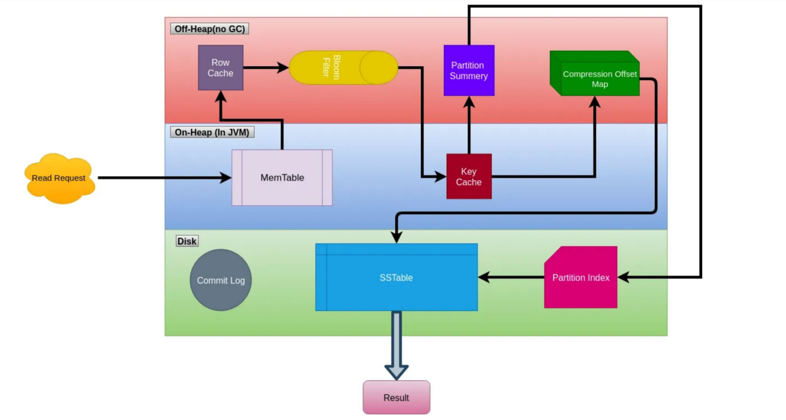

# **Read Operation in Cassandra: Detailed Explanation**  

In Apache Cassandra, **read requests** follow a structured approach to ensure **fast and efficient retrieval** of data. When a client issues a read request, it follows multiple steps to locate and fetch the required data efficiently. Let's break down the entire process in detail.

---

## **1. How a Read Request Works in Cassandra**
- When a client sends a read request, it is received by a **random node** in the cluster.
- This node becomes the **Coordinator** and is responsible for handling the request.
- The **Coordinator node** checks where the requested data is stored based on the **partition key**.
- It **routes the request** to the relevant **replica nodes** based on the **replication strategy**.
- The **Consistency Level (CL)** determines how many replica nodes must respond before returning data to the client.

### **Key Concept: Row Key**
- Every **read request** must include the **Row Key**.
- The **Row Key** is the **PRIMARY KEY** of the table, which consists of:
  - **Partition Key** (used to determine where data is stored)
  - **Clustering Keys** (used for sorting and organizing within the partition)

---

## **2. Step-by-Step Read Operation in Cassandra**
### **Step 1: Check the Memtable**
- The **memtable** is an in-memory storage structure where recent writes are cached before being flushed to disk as SSTables (Sorted String Tables).
- The **Coordinator first checks the memtable** for the requested data.
- If the data is found in the memtable, it is **returned immediately** without accessing the disk.
- If the data is **not found in the memtable**, the read process continues to the next steps.

---

### **Step 2: Check Row Cache (If Enabled)**
- **Row Cache** is an optional cache that stores **entire partitions** in memory.
- If row cache is **enabled and contains the requested row**, the data is **retrieved from memory**, avoiding disk access.
- However, if **any part of a cached partition is modified**, the **entire cache for that row is invalidated**. This leads to large chunks of memory being freed, making it **less efficient for frequently updated data**.
- If the row is **not in the row cache**, Cassandra continues the read process.

✅ **Row Cache is useful when:**  
- There are **frequent reads of the same data** (e.g., user profile information).  
- Data is **not updated frequently** (otherwise, cache invalidation happens often).  

---

### **Step 3: Check the Bloom Filter**
- **What is a Bloom Filter?**
  - A **Bloom filter** is a **probabilistic data structure** used to **quickly check if a partition exists** in an SSTable.
  - It does **not hold actual data**, but uses **hash functions** to **map data to a bit array**.
  - It **eliminates unnecessary disk reads** by telling Cassandra **which SSTables do NOT contain the required data**.
  - If the Bloom filter **indicates possible presence**, the read operation continues to the next step.
  - If the Bloom filter **indicates absence**, Cassandra skips checking that SSTable, reducing disk I/O.

✅ **Why is a Bloom Filter used?**  
- **Fast lookup** to avoid checking unnecessary SSTables.
- **Saves disk reads**, improving query performance.

---

### **Step 4: Check the Partition Key Cache (If Enabled)**
- The **partition key cache** is a **key-value store** that **maps partition keys to their locations in SSTables**.
- If **enabled**, Cassandra checks if the partition key exists in the cache.
- If found, the **exact SSTable location is retrieved** without scanning disk structures.

✅ **Partition Key Cache is useful when:**  
- Queries involve **frequent lookups of specific partition keys**.
- The dataset is **large, but only a subset is accessed regularly**.

---

### **Step 5: Partition Summary and Partition Index**
If the **partition key cache** does not have the required key, Cassandra uses a **partition summary and partition index**.

#### **A) Partition Summary**
- The **partition summary** is a **sampled index** of partition keys stored in SSTables.
- It does **not contain every partition key**, but instead, **every 128th partition key by default**.
- Each partition summary entry stores:
  - **Partition Key**
  - **Offset Position** (where to look in the partition index)

#### **B) Partition Index**
- The **partition index** is a complete **index of all partition keys** stored in the SSTable.
- The **partition summary helps find the approximate location** of the partition in the index, reducing the time required to locate it.

✅ **Why Use a Partition Summary?**  
- **Speeds up the search** in large SSTables.
- **Avoids scanning the full index** by jumping directly to relevant sections.

---

### **Step 6: Locate the Data on Disk (Compression Offset Map)**
- Once Cassandra identifies the correct **partition location**, it uses the **compression offset map**.
- **Compression Offset Map:**
  - Stores **offsets for compressed data blocks** in SSTables.
  - Allows **efficient seeking** to fetch data without reading unnecessary blocks.

✅ **Why Use Compression Offset Map?**  
- **Saves disk space** by allowing efficient storage of compressed SSTables.
- **Speeds up data retrieval** by jumping directly to compressed blocks.

---

### **Step 7: Fetch Data from SSTable on Disk**
- Cassandra **fetches the data from the SSTable** at the identified offset.
- If multiple SSTables contain different versions of the data, Cassandra **merges the results** using a **timestamp-based reconciliation**.
- The most recent version of the data is **returned to the client**.

✅ **Why Fetch Data from Multiple SSTables?**  
- Cassandra **appends writes** to new SSTables instead of updating existing ones.
- Over time, **multiple versions** of a partition may exist in different SSTables.
- The **latest version is chosen based on timestamp** to ensure **eventual consistency**.

---

## **3. Optimization Strategies for Faster Reads**
1. **Enable Row Cache** for frequently accessed, read-heavy data.
2. **Use Partition Key Cache** to avoid unnecessary SSTable scans.
3. **Optimize Bloom Filter settings** to minimize disk lookups.
4. **Use TokenAwarePolicy** to send queries directly to the replica that owns the partition.
5. **Perform Regular Compactions** to reduce the number of SSTables, making reads faster.

---

## **4. Summary of Read Operation**
| **Step** | **Description** |
|----------|---------------|
| **1. Check Memtable** | Look for data in memory (fastest) |
| **2. Check Row Cache** | If enabled, retrieves entire partitions from memory |
| **3. Check Bloom Filter** | Determines if partition exists in SSTable (avoids unnecessary reads) |
| **4. Check Partition Key Cache** | Stores partition key locations to avoid disk scanning |
| **5. Partition Summary & Partition Index** | Helps locate partition efficiently |
| **6. Compression Offset Map** | Finds exact data block efficiently in compressed SSTables |
| **7. Fetch Data from SSTable** | Reads data from disk and returns the latest version |

---

## **5. Key Takeaways**
✅ **Coordinator Node** handles read requests and forwards them to replica nodes.  
✅ **Memtable and Row Cache** help serve queries quickly without accessing disk.  
✅ **Bloom Filters** prevent unnecessary disk lookups.  
✅ **Partition Key Cache and Partition Summary** improve read efficiency.  
✅ **Compression Offset Map** allows fast data retrieval from compressed SSTables.  
✅ **Timestamp-based reconciliation** ensures the latest data version is returned.  

---

This is how Cassandra **efficiently handles read requests** while ensuring **high availability and low latency**.

<br/>
<br/>

# **📌 Step-by-Step Read Operation in Cassandra**


The provided image visually represents the **read operation workflow in Apache Cassandra**. Let's break down the process in detail.

---

When a **read request** is received by a node, the following steps are executed:

---

## **🟠 Step 1: Read Request Initiation**
- A **read request** arrives at a **coordinator node**.
- The **coordinator** routes the request to the appropriate **replica nodes** based on:
  - **Partition Key** (determines data location)
  - **Replication Factor** (determines how many copies exist)
  - **Consistency Level** (determines how many replicas must respond)

---

## **🟢 Step 2: Checking Memtable (On-Heap, JVM)**
- The system **first checks the Memtable** (stored in memory).
- If the requested data is found in the **Memtable**, it is **immediately returned**.
- If the data is **not found**, the system proceeds to the next steps.

✅ **Why check Memtable first?**  
- It is the **fastest** data lookup.
- Avoids unnecessary disk reads.

---

## **🟣 Step 3: Checking Row Cache (Off-Heap)**
- If **row cache** is enabled, Cassandra **checks if the entire row is stored in memory**.
- If found, the data is **retrieved directly from memory**.

✅ **Why use Row Cache?**  
- **Improves read performance** for frequently accessed rows.
- **Avoids disk access** entirely.

❌ **Row Cache Limitations:**  
- If any part of a row is modified, **the entire row cache is invalidated**.
- **Not effective for frequently updated data**.

---

## **🟡 Step 4: Checking Bloom Filter (Off-Heap)**
- If data is **not found in Memtable or Row Cache**, Cassandra checks the **Bloom Filter**.
- **Bloom Filter** is a **probabilistic data structure** that tells whether a **partition exists in an SSTable**.

✅ **Why use Bloom Filters?**  
- **Eliminates unnecessary SSTable lookups.**  
- Reduces disk I/O and speeds up read operations.

❌ **Bloom Filter Limitations:**  
- It **may return false positives** (i.e., it may say a partition exists when it actually doesn't).  
- But it **never returns false negatives** (if Bloom Filter says data is NOT in SSTables, it's guaranteed to be true).

---

## **🔴 Step 5: Checking Key Cache (Off-Heap)**
- If the **partition is likely in an SSTable**, the system **checks the Key Cache** (if enabled).
- **Key Cache** holds **references to partition key locations in SSTables**.

✅ **Why use Key Cache?**  
- It helps **avoid scanning SSTables**.
- **Reduces seek time** on disk.

---

## **🟣 Step 6: Checking Partition Summary & Partition Index**
- If the partition key is **not found in Key Cache**, Cassandra:
  1. Checks the **Partition Summary**, which is a **sampled index**.
  2. Uses it to locate the corresponding entry in the **Partition Index**.

✅ **Why use Partition Summary & Partition Index?**  
- **Speeds up the search** for a partition inside SSTables.
- **Avoids scanning large SSTables**.

❌ **Limitation:**  
- If data is **not found in the summary**, Cassandra has to perform a **full scan of the partition index**.

---

## **🟢 Step 7: Checking Compression Offset Map**
- After locating the partition index, the **Compression Offset Map** is used.
- **Compression Offset Map** helps **find exact data locations in compressed SSTables**.

✅ **Why use Compression Offset Map?**  
- **Efficiently reads compressed SSTables** without scanning unnecessary blocks.

---

## **🔵 Step 8: Fetching Data from SSTable (Disk)**
- After identifying the correct location, **Cassandra retrieves the requested data from the SSTable**.
- If multiple SSTables contain different versions of the data, **the latest version (based on timestamp) is returned**.

✅ **Why fetch from multiple SSTables?**  
- Cassandra **appends new writes** instead of updating old data, so multiple versions may exist.
- **Most recent version is selected** using **timestamp-based reconciliation**.

---

## **🔻 Step 9: Returning the Result**
- The data is **sent back to the Coordinator node**, which **returns the result to the client**.

---

# **📌 Summary of Read Operation Flow**
| **Step** | **Component Checked** | **Purpose** |
|----------|-----------------------|-------------|
| **1** | **Memtable** | Checks in-memory storage (fastest) |
| **2** | **Row Cache (if enabled)** | Retrieves entire row from memory |
| **3** | **Bloom Filter** | Avoids unnecessary SSTable lookups |
| **4** | **Key Cache (if enabled)** | Avoids scanning partition index |
| **5** | **Partition Summary & Partition Index** | Helps locate partition efficiently |
| **6** | **Compression Offset Map** | Finds exact data block in compressed SSTables |
| **7** | **SSTable on Disk** | Reads the latest version of data |
| **8** | **Return Data to Client** | The final step in the process |

---

# **📌 Optimizations for Faster Reads**
1. **Enable Row Cache** for frequently accessed, read-heavy data.
2. **Use Key Cache** to avoid scanning SSTables.
3. **Optimize Bloom Filters** to reduce unnecessary disk lookups.
4. **Use Compression Offset Map** for fast retrieval of compressed data.
5. **Perform Regular Compactions** to reduce the number of SSTables.

---

# **📌 Final Takeaways**
✅ **Coordinator Node** handles read requests and routes them to replica nodes.  
✅ **Memtable and Row Cache** provide the fastest lookups.  
✅ **Bloom Filters prevent unnecessary SSTable reads.**  
✅ **Partition Summary & Partition Index** improve read efficiency.  
✅ **Compression Offset Map speeds up reads from compressed SSTables.**  
✅ **Timestamp-based reconciliation ensures the latest data is returned.**  

---

This is how **Cassandra efficiently handles read requests** while ensuring **high availability and low latency**. 

<br/>
<br/>

# **How Bloom Filters Work in Cassandra Read Path**  

Bloom filters in Cassandra are **probabilistic data structures** that help determine whether a requested row **might** exist in a particular **SSTable**. They are stored **off-heap** (outside the JVM heap) to avoid garbage collection overhead.

---

## **📌 Why Are Bloom Filters Used?**
When a read request arrives, Cassandra needs to check **multiple SSTables** to find the most recent version of the data.  
Without Bloom filters, Cassandra would have to **scan every SSTable on disk**, which is slow.  
Instead, Bloom filters **quickly eliminate SSTables that do not contain the requested partition key**.

✅ **Goal:** Avoid unnecessary disk reads.  
✅ **Result:** Faster read performance.

---

## **📌 How Bloom Filters Work**
1. **Hashing the Partition Key:**  
   - When a partition is written to an SSTable, its **partition key** is hashed using **multiple hash functions**.
   - Each hash function sets a **bit in a bit array** (Bloom filter).
   
2. **Checking a Partition Key During Read:**  
   - When a read request arrives, the partition key is **hashed using the same hash functions**.
   - If all corresponding bits in the **bit array** are **set to 1**, the SSTable **might** contain the partition.
   - If **any bit is 0**, the SSTable **definitely does not contain the partition**, and Cassandra **skips checking that SSTable**.

✅ **False Positives:** Bloom filters **may say "yes" incorrectly**, meaning an SSTable is checked unnecessarily.  
❌ **False Negatives:** **Never happen**—if Bloom filter says "no," the data is definitely not in that SSTable.

---

## **📌 Impact on Performance**
- Bloom filters **significantly speed up reads** by avoiding expensive disk I/O.  
- They are particularly useful in **large clusters** where data is stored across multiple SSTables.

---

### **🔹 Example: Bloom Filter in Action**
1. **Write Operation:**  
   - A new row with **partition key = "user123"** is written to **SSTable1**.
   - The key **"user123"** is hashed using three hash functions, which set three bits in the Bloom filter.

2. **Read Request for "user123":**  
   - The request arrives, and **Cassandra checks the Bloom filter of SSTable1**.
   - The partition key **"user123"** is hashed again.
   - If **all corresponding bits are set to 1**, Cassandra **checks SSTable1**.
   - If **any bit is 0**, Cassandra skips SSTable1, saving a disk read.

---

## **📌 Key Takeaways**
✅ **Bloom filters help skip unnecessary SSTable reads.**  
✅ **They are off-heap and do not cause JVM garbage collection.**  
✅ **They provide fast lookups but may return false positives.**  
✅ **They never return false negatives.**  
✅ **Significantly improve read performance in Cassandra.**  

---

<br/>
<br/>

# **📌 Example: Bloom Filter in Cassandra Read Path**  

Let's take a **real-world scenario** to explain how Bloom Filters work in Cassandra.

---

### **🛒 Scenario: E-commerce Order Lookup**
Imagine an **e-commerce application** where customer orders are stored in Cassandra.  
Each order is stored with a **partition key** = `order_id`.  
Cassandra writes these orders into **SSTables** as data grows.

Now, a customer requests details for **Order ID = 12345**.

---

## **📌 Step-by-Step Bloom Filter Execution**

### **📝 Step 1: Data Storage in SSTables**  
When an order is written, it is stored in one of multiple SSTables.

| SSTable | Stored Orders (Partition Keys) |
|---------|--------------------------------|
| SSTable 1 | `10001, 10005, 10009, 12345` |
| SSTable 2 | `10002, 10006, 10010, 12346` |
| SSTable 3 | `10003, 10007, 10011, 12347` |

Each **SSTable** maintains a **Bloom Filter** that keeps track of the partition keys stored in it.

---

### **🔎 Step 2: Read Request for `order_id = 12345`**  
A user requests details for **Order ID = 12345**.  
Cassandra needs to check **which SSTable contains this order**.

#### **Checking Bloom Filters for Each SSTable**
1. **Hash "12345" and Check Bloom Filter of SSTable 1**  
   ✅ Bloom Filter returns **"Might Exist"** → Proceed to check SSTable 1.  
   
2. **Hash "12345" and Check Bloom Filter of SSTable 2**  
   ❌ Bloom Filter returns **"Does Not Exist"** → Skip SSTable 2.  

3. **Hash "12345" and Check Bloom Filter of SSTable 3**  
   ❌ Bloom Filter returns **"Does Not Exist"** → Skip SSTable 3.  

---

### **🚀 Step 3: Fetching the Order Data**
- Since **only SSTable 1** might contain the order, Cassandra **skips unnecessary SSTables**.
- The system **directly looks up Order ID = 12345 in SSTable 1** and **fetches the data**.

✅ **Faster lookup with reduced disk I/O.**  
✅ **Avoids scanning SSTables 2 and 3, saving processing time.**  

---

## **📌 Why This Works Well?**
- **Bloom Filters avoid unnecessary disk reads** → Improves performance.  
- **They never return false negatives** → If the filter says "Not Found," the data is **definitely not there**.  
- **They may return false positives** → But this just means an extra SSTable check (not a critical issue).  

---

## **📌 Key Takeaways**
✅ Bloom filters **speed up read operations** by reducing disk I/O.  
✅ They **help Cassandra decide which SSTables to scan**.  
✅ They **trade accuracy for efficiency** but are highly effective in practice.  
✅ They **work well for large datasets**, making reads much faster.  

---

### **🔥 Final Thought**
Without Bloom Filters, Cassandra would have to scan **every SSTable** for `order_id = 12345`, leading to slow performance.  
Instead, **Bloom Filters eliminate unnecessary SSTable checks**, making Cassandra extremely **fast and scalable**. 🚀  

<br/>
<br/>


# **🔥 Compaction in Apache Cassandra: A Deep Dive**  

Compaction is one of the most **critical processes** in Apache Cassandra that helps maintain **performance, efficiency, and disk space**.  

---

## **📌 What is Compaction?**  
Compaction is the **process of merging multiple SSTables** (Sorted String Tables) into a **new, optimized SSTable**.  
It helps in:
✅ **Removing tombstones** (deleted data)  
✅ **Merging updates to the same row**  
✅ **Reclaiming disk space**  
✅ **Improving read performance**  

---

## **📌 Why is Compaction Needed?**
Cassandra follows a **Log-Structured Merge (LSM) Tree** model where **writes are always append-only** to new SSTables.  
- Over time, **multiple SSTables accumulate**.  
- **Same row data may exist in multiple SSTables** due to updates.  
- **Deleted data (tombstones) remain in SSTables until compaction removes them**.  

Without compaction:  
❌ **Reads become slower** because they need to search across multiple SSTables.  
❌ **Disk usage keeps increasing** with unnecessary old versions of data.  

---

## **📌 Types of Compaction Strategies in Cassandra**  
Cassandra offers **three main compaction strategies** based on workload needs.  

### **1️⃣ Size-Tiered Compaction Strategy (STCS)**
👉 **Best for: Write-heavy workloads**  
🔹 This strategy merges **similarly-sized SSTables** when a certain number (usually 4) of them exist.  

#### **🛠 How It Works?**  
1. New SSTables are written continuously as data is inserted.  
2. Once 4 similarly sized SSTables exist, **Cassandra merges them into one larger SSTable**.  
3. This process repeats, forming **larger and larger SSTables over time**.  

✅ **Advantages:**  
✔ Efficient for **high-write workloads**  
✔ Uses **less CPU & I/O during compaction**  

❌ **Disadvantages:**  
❌ High **read latency** (since data is spread across many SSTables)  
❌ Can cause **large disk spikes** when merging many SSTables  

**🛠 Example:**  
Imagine we have SSTables of **size 100MB**.  
- When we have **4 SSTables of 100MB each**, they **merge into one 400MB SSTable**.  
- Later, **4 SSTables of 400MB merge into a 1.6GB SSTable**, and so on.  

---

### **2️⃣ Leveled Compaction Strategy (LCS)**
👉 **Best for: Read-heavy workloads**  
🔹 Unlike STCS, this strategy **organizes SSTables into multiple levels** to optimize read performance.  

#### **🛠 How It Works?**  
1. **Level 0** consists of **SSTables of any size**.  
2. When enough data accumulates, Cassandra compacts Level 0 SSTables into **Level 1**.  
3. In **Level 1 and beyond**, each level contains **10 times the data of the previous level**, but **no overlapping SSTables**.  
4. Reads become **faster** because queries only need to scan a small number of SSTables per level.  

✅ **Advantages:**  
✔ **Low read latency** (since SSTables are compacted into ordered levels)  
✔ Prevents **too many SSTables from accumulating**  

❌ **Disadvantages:**  
❌ **High write amplification** (since data is re-written multiple times across levels)  
❌ **Consumes more CPU and I/O resources**  

**🛠 Example:**  
If **Level 1** contains 10 SSTables of 100MB, then:  
- **Level 2 will contain 100 SSTables of 100MB**  
- **Level 3 will contain 1000 SSTables of 100MB**  

---

### **3️⃣ Time-Window Compaction Strategy (TWCS)**
👉 **Best for: Time-series data (e.g., logs, sensor data, analytics)**  
🔹 This strategy groups SSTables into **time windows** and compacts them separately.  

#### **🛠 How It Works?**  
1. Data is written into **SSTables grouped by time window** (e.g., hourly, daily).  
2. When a time window **ends**, Cassandra **compacts only those SSTables together**.  
3. Older data is **never modified**, ensuring efficiency for **append-only datasets**.  

✅ **Advantages:**  
✔ **Efficient for time-series data** where old data is rarely updated  
✔ **Minimizes write amplification**  
✔ **Reduces unnecessary merges**  

❌ **Disadvantages:**  
❌ Can cause **storage fragmentation** if data is not properly time-bounded  

**🛠 Example:**  
If we store **web logs** by day:  
- **Day 1 SSTables compact together**  
- **Day 2 SSTables compact together**  
- **Older data is rarely accessed**, so we avoid unnecessary compaction  

---

## **📌 How to Choose the Right Compaction Strategy?**  
| Compaction Strategy  | Best for  | Advantages  | Disadvantages  |
|----------------------|------------|-------------|---------------|
| **STCS** | High Write Workloads | Low CPU overhead | High Read Latency |
| **LCS** | High Read Workloads | Low Read Latency | High Write Amplification |
| **TWCS** | Time-Series Data | Efficient for append-only data | Storage Fragmentation |

---

## **📌 Summary**  
🔹 **Compaction is essential** to manage SSTables, improve reads, and reclaim disk space.  
🔹 **Three main compaction strategies:**  
  ✅ **STCS** → Best for **high write workloads**  
  ✅ **LCS** → Best for **high read workloads**  
  ✅ **TWCS** → Best for **time-series data**  
🔹 **Choosing the right strategy depends on your data workload.**  

🚀 **Compaction makes Cassandra fast, scalable, and efficient!**  

---

<br/>
<br/>

# **🔥 Gossip Protocol in Apache Cassandra: A Deep Dive**  

Apache Cassandra uses the **Gossip Protocol** for **peer-to-peer communication** between nodes in a cluster. Gossip plays a crucial role in **cluster management, failure detection, and data distribution**.  

---

## **📌 What is Gossip Protocol?**  
Gossip is a **decentralized, peer-to-peer communication protocol** where nodes in the cluster **exchange state information** with one another.  

👉 It ensures **fault tolerance** and **scalability** by distributing information **gradually** across the cluster.  

**Key Benefits of Gossip:**  
✅ No single point of failure (**decentralized**)  
✅ Works even when some nodes fail (**fault-tolerant**)  
✅ Scales well with large clusters (**efficient and lightweight**)  

---

## **📌 How Does Gossip Work?**  

### **1️⃣ Information Sharing (Gossip Exchange)**
- Every **second**, each node **randomly selects a few other nodes** and **exchanges its state** along with the state of nodes it has previously learned about.  
- This **gradual spreading** ensures that **all nodes eventually** learn about the **entire cluster's status**.  

📌 **Example:**  
Imagine a **6-node cluster (N1, N2, N3, N4, N5, N6)**  
1. **N1 gossips** with **N3**, sharing its state + info about N2.  
2. **N3 gossips** with **N5**, sharing its state + info about N1 and N2.  
3. **N5 gossips** with **N6**, and so on...  
🔁 Over time, all nodes **learn about the full cluster state**.  

---

### **2️⃣ Heartbeat Mechanism**
Every node **sends a heartbeat message** (Gossip message) every **second** to a **randomly selected node**.  

**Heartbeat Contains:**  
✅ The **sending node’s status** (UP, DOWN, JOINING, LEAVING)  
✅ Information about **other nodes** that it has gossiped about  
✅ **Schema version** to ensure consistency  
✅ **Uptime, token information, boot time**  

📌 **Example:**  
- **Node A** sends a heartbeat to **Node B** saying:  
  _"Hey, I'm alive! Also, Node C was alive when I last heard from it."_  
- **Node B** passes this info to **Node D**  
- This process **repeats until all nodes know the latest status**  

---

### **3️⃣ Failure Detection (Marking Nodes as Down)**
If a node **fails to send Gossip messages for a specific time**, other nodes will **mark it as down**.  

- Nodes keep a **failure detection timer** (default: **10 seconds**).  
- If a node **doesn't respond** within this time, it is **marked as suspected down**.  
- If the node **still doesn't respond**, it is **declared dead** and **removed from the cluster**.  

📌 **Example:**  
- Node N4 **stops responding** to Gossip messages.  
- N2, N3, and N5 notice this and **start marking N4 as unresponsive**.  
- After a few missed Gossip rounds, **N4 is considered DOWN**.  

🔹 **Nodes don’t wait for a central authority**—each node **detects failures independently**, making Cassandra **highly available**.  

---

### **4️⃣ Data Distribution & Cluster Management**
Gossip is **integral to data distribution** in Cassandra.  

- Helps in **deciding where to read/write data**  
- Provides details about **replica locations**  
- Ensures nodes know about **newly joined or removed nodes**  

📌 **Example:**  
- When **Node X joins the cluster**, it **gossips with other nodes** to announce itself.  
- Other nodes update their **replica placement strategies** accordingly.  

---

## **📌 Node States in Gossip**
Each node maintains a **status** that is shared through Gossip.  

| **Status**   | **Description** |
|-------------|----------------|
| **UP**      | Node is active and healthy |
| **DOWN**    | Node is not responding |
| **JOINING** | New node joining the cluster |
| **LEAVING** | Node gracefully exiting the cluster |
| **REMOVED** | Node is permanently removed |

---

## **📌 How Cassandra Uses Gossip?**
| **Function**           | **Role of Gossip**  |
|------------------------|-------------------|
| **Node Discovery**      | Identifies new nodes joining the cluster |
| **Failure Detection**   | Detects and marks unresponsive nodes as DOWN |
| **Data Distribution**   | Helps nodes understand replica locations |
| **Schema Synchronization** | Ensures all nodes have the same schema |
| **Cluster Health Monitoring** | Keeps track of which nodes are active |

---

## **📌 Summary**  
✅ **Gossip is a lightweight, peer-to-peer protocol used by Cassandra for inter-node communication.**  
✅ **Every second, nodes exchange information randomly, ensuring all nodes learn about the full cluster state.**  
✅ **Helps detect node failures, distribute data, and synchronize schema versions.**  
✅ **Highly scalable and fault-tolerant—works even if some nodes fail!**  

🚀 **Cassandra’s Gossip Protocol ensures that the cluster remains highly available and resilient!**  

---

<br/>
<br/>

# **🔥 Consistency in Apache Cassandra: A Deep Dive**  

**Consistency in Cassandra** refers to **how up-to-date and synchronized data** is across multiple **replica nodes** in the cluster.  

Cassandra follows an **eventual consistency model**, meaning that all replicas will eventually have the latest data, but not necessarily **immediately**. However, **Cassandra allows tuning consistency levels** to balance between **availability** and **data correctness** based on the application’s requirements.  

---

## **📌 How Consistency Works in Cassandra?**
When a client writes or reads data, it **doesn’t happen on a single node**. Instead, data is **replicated** to multiple nodes based on the **replication factor**.  

👉 The **Consistency Level (CL)** determines **how many nodes** must acknowledge a write or read operation before it is considered **successful**.  

⚖️ **Trade-off Between Availability & Consistency (CAP Theorem)**:  
- **Higher consistency level (e.g., ALL)** = More **correct** data but lower **availability**.  
- **Lower consistency level (e.g., ANY)** = More **available** system but possible **stale** data.  

---

## **📌 Write Consistency Levels in Cassandra**
Cassandra provides different **write consistency levels**, allowing users to control **how many nodes must acknowledge a write** before it is considered successful.

### **1️⃣ ANY (Highest Availability, Lowest Consistency)**
✅ The write is accepted if **at least one** node (even hinted handoff) stores the data.  
✅ It doesn't matter whether the node is **primary or replica**.  
✅ **Best for:** High **availability** use cases, but **risk of stale data**.  

📌 **Example:**  
```sql
INSERT INTO employees (id, first_name, last_name, email)
VALUES (1, 'John', 'Doe', 'john.doe@example.com')
USING CONSISTENCY ANY;
```
- The write is stored **even if no replica nodes are available**.  
- If a node is down, **hinted handoff** ensures the data is delivered later.  

---

### **2️⃣ ONE (Minimum Consistency, High Availability)**
✅ A write **must be acknowledged by at least one replica node** (either primary or backup).  
✅ **Faster writes** but a chance of **reading stale data** if the single acknowledged node is behind.  
✅ **Best for:** Applications that need **fast writes** but can tolerate some inconsistency.  

📌 **Example:**  
```sql
INSERT INTO employees (id, first_name, last_name, email)
VALUES (1, 'John', 'Doe', 'john.doe@example.com')
USING CONSISTENCY ONE;
```
- The write is **successful** if **any one replica node** acknowledges it.  

---

### **3️⃣ TWO (Moderate Consistency)**
✅ The write **must be acknowledged by at least two replica nodes**.  
✅ Slightly stronger consistency than **ONE** but **still fast**.  
✅ **Best for:** Applications that want **higher consistency** while keeping **availability**.  

📌 **Example:**  
```sql
INSERT INTO employees (id, first_name, last_name, email)
VALUES (1, 'John', 'Doe', 'john.doe@example.com')
USING CONSISTENCY TWO;
```
- The write is **confirmed only if two nodes** store the data.  

---

### **4️⃣ QUORUM (Balanced Approach)**
✅ **A majority of replicas (quorum) must acknowledge the write.**  
✅ **Formula:**  
   ```
   QUORUM = (Replication Factor / 2) + 1
   ```
✅ Ensures **strong consistency** while maintaining **availability**.  
✅ **Best for:** Applications requiring **consistent reads/writes** without compromising too much on speed.  

📌 **Example:**  
Assume **Replication Factor = 3**, then:  
```
QUORUM = (3/2) + 1 = 2 nodes
```
```sql
INSERT INTO employees (id, first_name, last_name, email)
VALUES (1, 'John', 'Doe', 'john.doe@example.com')
USING CONSISTENCY QUORUM;
```
- The write is **successful only if two out of three replicas** acknowledge it.  

📌 **Update Example:**
```sql
UPDATE employees
USING CONSISTENCY QUORUM
SET email = 'johndoe@example.com'
WHERE id = 1;
```
- Ensures that **most nodes** have the latest data.  

---

### **5️⃣ LOCAL QUORUM (Data Center-Specific Consistency)**
✅ A **quorum** (majority) of **replicas in the same data center** must acknowledge the write.  
✅ Prevents cross-data center latency.  
✅ **Best for:** Multi-data center setups where **low latency** is a priority.  

📌 **Example:**  
```sql
INSERT INTO employees (id, first_name, last_name, email)
VALUES (1, 'John', 'Doe', 'john.doe@example.com')
USING CONSISTENCY LOCAL_QUORUM;
```
- If a data center has **5 replicas**, then **at least 3 must acknowledge**.  

---

### **6️⃣ ALL (Lowest Availability, Highest Consistency)**
✅ **All replica nodes must acknowledge the write** before it succeeds.  
✅ Ensures **strongest consistency** but **if even one replica is down, the write fails**.  
✅ **Best for:** **Mission-critical systems** that **cannot afford stale data**.  

📌 **Example:**  
```sql
INSERT INTO employees (id, first_name, last_name, email)
VALUES (1, 'John', 'Doe', 'john.doe@example.com')
USING CONSISTENCY ALL;
```
- Write fails if **any one replica** is unreachable.  

---

## **📌 Choosing the Right Consistency Level**
| **Consistency Level** | **Nodes Required** | **Availability** | **Consistency** | **Best Use Case** |
|----------------------|------------------|-----------------|----------------|-----------------|
| **ANY** | At least 1 | ✅✅✅✅ (Highest) | ❌ (Weakest) | **High availability systems (e.g., logging, analytics)** |
| **ONE** | 1 replica | ✅✅✅ | ❌ | **Fast writes, but okay with stale reads (e.g., social media feeds)** |
| **TWO** | 2 replicas | ✅✅ | ✅ | **Moderate consistency (e.g., financial apps with minimal tolerance to stale reads)** |
| **QUORUM** | (RF/2) + 1 | ✅✅ | ✅✅ | **Balanced read/write consistency (e.g., banking, e-commerce transactions)** |
| **LOCAL QUORUM** | Quorum in local DC | ✅✅✅ | ✅✅ | **Multi-data center low latency apps (e.g., global applications)** |
| **ALL** | All replicas | ❌ (Lowest) | ✅✅✅✅ (Strongest) | **Critical systems requiring strong consistency (e.g., billing, ledgers)** |

---

## **📌 Summary**
- **Cassandra allows tuning consistency levels** based on the application's needs.  
- **ANY → Highest availability, weakest consistency**  
- **ALL → Strongest consistency, lowest availability**  
- **QUORUM → Balanced approach**  
- **LOCAL QUORUM → Optimized for multi-data center setups**  

🚀 **Choosing the right consistency level is crucial** for balancing performance, availability, and correctness in Cassandra.  

---

<br/>
<br/>

# **🔥 Read Consistency in Apache Cassandra**  

## **📌 What is Read Consistency?**  
Read consistency in Cassandra determines **how many replicas must respond** to a read request before returning data to the client.  

Since Cassandra follows an **eventual consistency model**, the same data might have **different versions on different replicas** due to **delayed replication**.  

### **⚖️ Strong vs. Eventual Consistency**  
- **Lower consistency levels (e.g., ONE)** → Faster reads but **possible stale data**  
- **Higher consistency levels (e.g., ALL)** → Strongest data consistency but **higher latency and lower availability**  

---

## **📌 Read Consistency Levels in Cassandra**
Unlike **write consistency**, read consistency ensures **correct and up-to-date data** by querying multiple replicas and applying **read repair techniques** if necessary.

### **1️⃣ ANY (Not Applicable for Reads)**
❌ This level **only applies to writes** and is **not supported for reads**.  
❌ You **cannot** use `USING CONSISTENCY ANY` in a `SELECT` query.  

---

### **2️⃣ ONE (Fastest Read, Possible Stale Data)**
✅ The query is successful if **one replica** returns data.  
✅ **Fastest read speed**, but there is a chance of **reading stale data**.  
✅ **Best for:** Applications that need **speed over correctness** (e.g., social media feeds, logs).  

📌 **Example:**  
```sql
SELECT * FROM employees WHERE id = 1 USING CONSISTENCY ONE;
```
- If the queried node has **older data**, stale data might be returned.  
- **Read repair will eventually fix outdated data** in the background.  

---

### **3️⃣ TWO (Higher Consistency, Slightly Slower)**
✅ The query waits for **two replicas** to return data.  
✅ **Lower chance of stale reads** compared to `ONE`.  
✅ **Best for:** Applications that need **moderate consistency** (e.g., financial apps).  

📌 **Example:**  
```sql
SELECT * FROM employees WHERE id = 1 USING CONSISTENCY TWO;
```
- The response comes from **two replicas**.  
- If there’s a conflict, Cassandra uses the **latest timestamped version**.  

---

### **4️⃣ QUORUM (Balanced Consistency & Availability)**
✅ A **majority** (quorum) of replicas must respond.  
✅ Ensures **stronger consistency** while keeping **good performance**.  
✅ **Formula:**  
   ```
   QUORUM = (Replication Factor / 2) + 1
   ```
✅ **Best for:** Applications that require **correct data** without sacrificing too much performance.  

📌 **Example:**  
If **Replication Factor = 3**, then:  
```
QUORUM = (3/2) + 1 = 2 nodes
```
```sql
SELECT * FROM employees WHERE id = 1 USING CONSISTENCY QUORUM;
```
- Ensures that **most replicas agree** on the latest data.  
- **Stronger than ONE or TWO** but still **fast enough**.  

---

### **5️⃣ LOCAL_QUORUM (Faster Reads in Multi-DC Setup)**
✅ Similar to **QUORUM**, but only considers replicas in the **local data center**.  
✅ Avoids cross-data center latency.  
✅ **Best for:** Multi-data center deployments where **each region should prioritize local consistency**.  

📌 **Example:**  
```sql
SELECT * FROM employees WHERE id = 1 USING CONSISTENCY LOCAL_QUORUM;
```
- Ensures **majority agreement within the local data center**.  
- Prevents **latency issues** caused by querying remote data centers.  

---

### **6️⃣ ALL (Strongest Consistency, Lowest Availability)**
✅ **All replicas must respond** before returning data.  
✅ **Strongest consistency** but **if any replica is down, the read fails**.  
✅ **Best for:** **Mission-critical systems** (e.g., banking, transactions).  

📌 **Example:**  
```sql
SELECT * FROM employees WHERE id = 1 USING CONSISTENCY ALL;
```
- **Guaranteed latest data**, but **high latency** and **availability issues**.  

---

## **📌 Choosing the Right Read Consistency Level**
| **Consistency Level** | **Nodes Required** | **Availability** | **Consistency** | **Best Use Case** |
|----------------------|------------------|-----------------|----------------|-----------------|
| **ANY** | ❌ Not applicable | ❌ | ❌ | ❌ |
| **ONE** | 1 node | ✅✅✅✅ (Highest) | ❌ (Lowest) | **High-speed reads, non-critical data (e.g., logs, social feeds)** |
| **TWO** | 2 nodes | ✅✅✅ | ✅ | **Moderate consistency (e.g., financial apps, messaging)** |
| **QUORUM** | (RF/2) + 1 | ✅✅ | ✅✅ | **Balanced performance & accuracy (e.g., banking, e-commerce)** |
| **LOCAL QUORUM** | Quorum in local DC | ✅✅✅ | ✅✅ | **Multi-data center, fast local reads (e.g., global applications)** |
| **ALL** | All replicas | ❌ (Lowest) | ✅✅✅✅ (Strongest) | **Mission-critical data (e.g., ledgers, banking transactions)** |

---

# **🔥 Partition Key, Cluster Key & Row Key in Cassandra**

## **📌 Understanding the `PRIMARY KEY` in Cassandra**
The **PRIMARY KEY** in Cassandra is different from relational databases.  
It **determines data distribution & sorting** within a partition.

---

### **📌 Table Definition**
```sql
CREATE TABLE employees (
    department_id int,
    office_id int,
    employee_id int,
    first_name text,
    last_name text,
    email text,
    PRIMARY KEY ((department_id, office_id), employee_id, last_name)
);
```

---

## **📌 Components of the Primary Key**
### **1️⃣ Partition Key (department_id, office_id)**
- **Determines which node stores the data.**  
- Data with the **same partition key** is stored **together on the same node**.  
- **Partition key can be single-column or composite** (like this example).  

👉 **In this case:**  
   - **(department_id, office_id) → Partition Key**  
   - All employees in the **same department & office** are stored **in the same partition**.  

---

### **2️⃣ Clustering Key (employee_id, last_name)**
- **Sorts data within a partition**.  
- **First clustering key (`employee_id`)** → Primary sort order.  
- **Second clustering key (`last_name`)** → Secondary sort order within the same `employee_id`.  

👉 **In this case:**  
   - Inside a partition `(department_id, office_id)`,  
   - Employees are **first sorted by `employee_id`**  
   - If `employee_id` is the same, then sorted by `last_name`.  

---

## **📌 Partition Key vs. Clustering Key**
| **Key Type** | **Purpose** | **Example in Table** |
|-------------|------------|------------------|
| **Partition Key** | Decides which node stores the data | `(department_id, office_id)` |
| **Clustering Key** | Sorts data within a partition | `employee_id, last_name` |

---

## **📌 Example Data Insertion & Query**
📌 **Inserting Data:**
```sql
INSERT INTO employees (department_id, office_id, employee_id, first_name, last_name, email)
VALUES (1, 101, 5001, 'John', 'Doe', 'john.doe@example.com');
```
- Data is stored in the **partition for (1, 101)**.  
- Inside that partition, it's **sorted by `employee_id` and `last_name`**.  

📌 **Querying Data:**
```sql
SELECT * FROM employees WHERE department_id = 1 AND office_id = 101;
```
- Retrieves **all employees in department 1, office 101**, sorted by `employee_id`.  

---

## **📌 Summary**
1️⃣ **Read Consistency in Cassandra** balances between **speed & correctness**.  
2️⃣ **QUORUM** is a **good balance** between performance and consistency.  
3️⃣ **Partition Key → Determines data placement in nodes**.  
4️⃣ **Clustering Key → Sorts data within a partition**.  
5️⃣ **Choosing the right key design impacts query performance!**  

