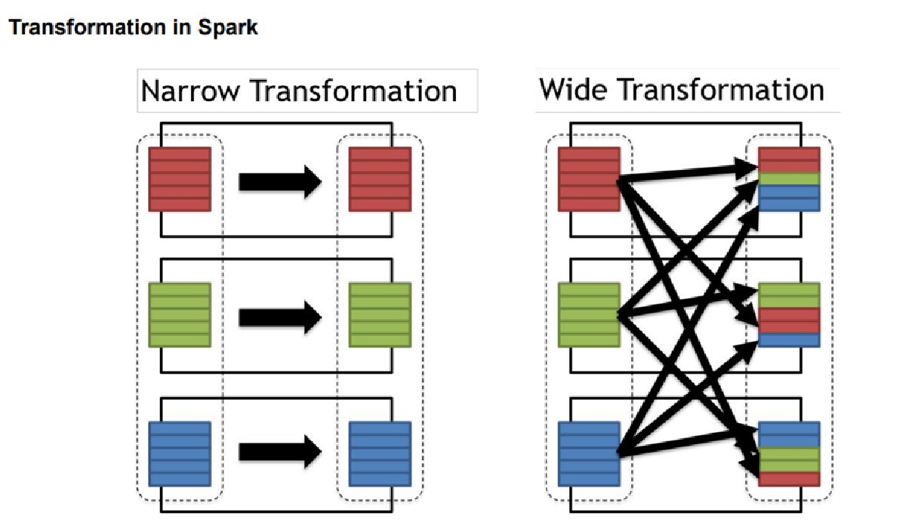

# 😥**Problems with Hadoop Map-Reduce?**
Hadoop MapReduce is a powerful framework for processing large datasets, but it has several limitations that make it less suitable for certain use cases. Let’s discuss each of these problems in detail:  

### **1. Batch Processing (Not Suitable for Real-time Data)**
   - Hadoop MapReduce is designed for batch processing, which means it processes large amounts of data in chunks over a period of time.  
   - It is not optimized for real-time or near real-time data processing, such as streaming data where immediate insights are needed.  
   - If you need real-time data analysis, frameworks like **Apache Spark (with Spark Streaming), Apache Flink, or Apache Kafka Streams** are better alternatives.  

### **2. Complexity (Difficult to Set Up and Maintain)**
   - Hadoop has a steep learning curve, especially for beginners.  
   - Setting up a Hadoop cluster, configuring nodes, managing storage (HDFS), and tuning performance require significant effort.  
   - Maintenance is also complex, as you need to manage **job scheduling, resource allocation, and fault tolerance mechanisms** manually.  
   - In contrast, cloud-based big data solutions like **AWS EMR, Google BigQuery, or Databricks** reduce much of this complexity.  

### **3. Data Movement Overhead (Network Congestion)**
   - Hadoop follows the "move computation to data" principle, but when dealing with smaller datasets, **data shuffling and network overhead** can slow down processing.  
   - Moving large amounts of data across nodes for MapReduce jobs creates network congestion and increases latency.  
   - Other frameworks like **Spark** optimize this issue by keeping intermediate data in memory instead of writing to disk.  

### **4. Fault Tolerance and Storage Inefficiency**
   - Hadoop ensures fault tolerance using **data replication**, where each data block is stored on multiple nodes.  
   - While this prevents data loss, it results in **high storage costs** as each piece of data is stored multiple times.  
   - Also, Hadoop does not handle **application-level failures** efficiently. If a job fails at the reducer stage, it has to be reprocessed from scratch.  
   - Spark, on the other hand, uses **RDDs (Resilient Distributed Datasets)**, which allow better fault tolerance with minimal data duplication.  

### **5. No Support for Interactive Processing**
   - Hadoop MapReduce does not support **interactive queries** or iterative processing, making it unsuitable for use cases where back-and-forth communication is required.  
   - For example, **machine learning algorithms** require iterative processing, but Hadoop starts a new MapReduce job for each iteration, which is inefficient.  
   - This is why **Apache Spark, Presto, and Apache Drill** are preferred for interactive querying and iterative computations.  

### **6. Not Efficient for Small Files**
   - Hadoop is designed to handle large files efficiently, but it struggles with **many small files**.  
   - HDFS has a **large block size (default 128MB or 256MB)**, so storing small files leads to inefficiencies and excessive metadata overhead in the NameNode.  
   - This can slow down processing and increase memory consumption.  
   - Solutions like **HBase (a NoSQL database on Hadoop) or merging small files into larger ones** can help mitigate this issue.  

### **Conclusion**
Hadoop MapReduce is still a great tool for batch processing of large datasets, but its limitations make it unsuitable for real-time, interactive, or iterative workloads. For modern data processing needs, technologies like **Apache Spark, Apache Flink, Kafka Streams, and cloud-based solutions** provide better performance, efficiency, and ease of use.

<br>
<br>

### **Key Features of Apache Spark**  

Apache Spark is a high-performance, distributed computing framework for big data analytics. Below are its major features:  

---

### **1. Speed 🚀**  
- Spark processes large-scale data **up to 100 times faster** than Hadoop MapReduce.  
- This is achieved using **in-memory computing**, which minimizes disk I/O operations.  
- Spark optimizes performance using **controlled partitioning**, which efficiently distributes data across cluster nodes.  

---

### **2. Powerful Caching & Persistence 🔄**  
- Spark supports **RDD (Resilient Distributed Dataset) caching**, allowing data to be stored in memory across multiple iterations.  
- It also provides **disk persistence**, meaning data that doesn’t fit in memory can be efficiently stored and retrieved.  
- This feature is especially useful for **iterative algorithms**, such as those used in machine learning and graph processing.  

---

### **3. Flexible Deployment Options 🛠️**  
- Spark can be deployed in multiple ways:  
  - **Standalone mode** (using its built-in cluster manager)  
  - **Apache Mesos**  
  - **Hadoop YARN** (running within Hadoop clusters)  
  - **Cloud platforms** (e.g., AWS EMR, Google Dataproc, Azure HDInsight)  
- This flexibility makes it easy to integrate with existing big data infrastructures.  

---

### **4. Real-Time Processing ⏳**  
- Unlike Hadoop MapReduce, which works on batch processing, Spark supports **real-time stream processing** via **Spark Streaming**.  
- In-memory computation ensures **low-latency** performance, making it ideal for real-time applications such as:  
  - Fraud detection  
  - Log monitoring  
  - Stock market analysis  

---

### **5. Polyglot (Multi-Language Support) 🌍**  
- Spark provides **high-level APIs** in multiple languages, including:  
  - **Java**  
  - **Scala** (default language for Spark development)  
  - **Python (PySpark)**  
  - **R (SparkR)**  
- It also offers **interactive shells** for Scala and Python, making it easier for developers to test and debug code.  

---

### **6. Scalability & Distributed Computing 🌎**  
- Spark is inherently **scalable**, capable of handling **petabytes of data**.  
- It distributes workloads across **multiple nodes** in a cluster, automatically managing resource allocation.  
- It can run on **thousands of nodes**, making it ideal for large-scale enterprise applications.  

---

### **Conclusion**  
Apache Spark is a **fast, powerful, and flexible** big data processing framework. Its **speed, real-time capabilities, caching, and scalability** make it a preferred choice over Hadoop MapReduce. Whether you're working with batch processing, real-time streaming, or machine learning, Spark is an excellent tool for big data analytics. 🚀

<br/>
<br/>

# **Apache Spark Ecosystem**  

The Apache Spark ecosystem is a **comprehensive framework** designed to handle large-scale data processing efficiently. It consists of multiple components, each serving a specific role in big data analytics. Below is a detailed breakdown of its key components:  

---

## **1. Spark Core Engine (Foundation of Spark)**  
At the heart of the Spark ecosystem is the **Spark Core Engine**, which provides:  

✅ **Task Scheduling** – Assigns and manages tasks across the cluster.  
✅ **Monitoring** – Tracks job execution and optimizes performance.  
✅ **Basic I/O Operations** – Reads and writes data efficiently across distributed systems.  
✅ **RDD (Resilient Distributed Dataset)** – The fundamental data structure in Spark that supports **fault tolerance and parallelism**.  

### **How RDDs Work?**  
- RDDs store data **across multiple nodes** in a cluster.  
- They allow **lazy evaluation**, meaning transformations are executed only when needed.  
- Spark’s **fault tolerance** ensures lost data can be recomputed from lineage information.  

---

## **2. Cluster Management (Resource Allocation & Scalability)**  
Spark is **highly flexible** when it comes to cluster management and can run on different cluster managers, including:  

🔹 **Hadoop YARN** – Uses Hadoop’s resource manager for running Spark on a Hadoop cluster.  
🔹 **Apache Mesos** – A general-purpose cluster manager for running Spark alongside other big data workloads.  
🔹 **Standalone Cluster Manager** – Spark’s built-in cluster manager for simpler deployments.  
🔹 **Kubernetes** – Can be used to manage Spark workloads in cloud-native environments.  

This flexibility ensures Spark can be **deployed in diverse environments**, from on-premises clusters to cloud-based platforms.  

---

## **3. Spark Libraries (Built-in Modules for Various Workloads)**  
The Spark ecosystem includes several powerful **libraries** that extend its capabilities beyond just batch processing.  

### **a. Spark SQL (Structured Data Processing)**  
- Enables users to query data using **SQL-like syntax**.  
- Can work with structured data in **HDFS, Apache Hive, JDBC, and JSON/Parquet files**.  
- Provides a **DataFrame API**, which is more optimized and user-friendly than traditional RDDs.  

**Use Cases:**  
✔ Data warehousing and reporting  
✔ Running SQL queries on big data  
✔ ETL (Extract, Transform, Load) pipelines  

---

### **b. Spark MLlib (Machine Learning Library)**  
- A scalable **machine learning library** built into Spark.  
- Supports **classification, regression, clustering, recommendation systems**, and feature extraction.  
- Provides **distributed training** for ML models, making it much faster than traditional single-node ML libraries.  

**Use Cases:**  
✔ Fraud detection  
✔ Predictive analytics  
✔ Recommendation systems (like Netflix, Amazon)  

---

### **c. Spark GraphX (Graph Processing Library)**  
- Used for working with **graph-structured data**.  
- Allows users to perform **graph analytics** like PageRank, community detection, and shortest path calculations.  
- Optimized for distributed graph computation.  

**Use Cases:**  
✔ Social network analysis  
✔ Web page ranking (Google PageRank)  
✔ Supply chain network optimization  

---

### **d. Spark Streaming (Real-Time Data Processing)**  
- Enables **real-time** stream processing using Spark’s in-memory computation capabilities.  
- Works with data sources like **Kafka, Flume, Twitter, and HDFS**.  
- Provides **fault tolerance** and ensures data is processed **in order and exactly once**.  

**Use Cases:**  
✔ Real-time fraud detection in banking  
✔ Log monitoring for cybersecurity  
✔ Stock market trend analysis  

---

## **4. Polyglot Programming (Multi-Language Support)**  
Apache Spark supports multiple programming languages, making it accessible to developers with different backgrounds.  

🔹 **Scala** – The native language of Spark; best for high-performance applications.  
🔹 **Python (PySpark)** – Popular among data scientists due to its easy syntax and strong integration with ML libraries like TensorFlow and scikit-learn.  
🔹 **Java** – Used in enterprise applications.  
🔹 **R (SparkR)** – Preferred for statistical computing and data analysis.  

This broad language support allows **different teams** to leverage Spark without switching programming languages.  

---

## **5. Storage Flexibility (Multiple Data Sources Support)**  
Spark is designed to work seamlessly with various **storage systems**, allowing it to process both structured and unstructured data.  

**Supported Storage Options:**  
📌 **HDFS (Hadoop Distributed File System)** – Works efficiently with Hadoop’s distributed storage.  
📌 **Amazon S3** – Cloud-based storage for scalable big data workloads.  
📌 **Apache Cassandra, MongoDB, HBase** – NoSQL databases integration for real-time analytics.  
📌 **JDBC/ODBC** – Connects with traditional **SQL databases** like MySQL, PostgreSQL, and Oracle.  
📌 **Local Filesystems** – Can process data from a single-node system or a shared network storage.  

This storage flexibility makes Spark a **universal analytics engine**, allowing organizations to process data wherever it resides.  

---

## **Conclusion**  
Apache Spark is not just a **data processing engine**—it is a **complete big data ecosystem** that supports **batch processing, real-time analytics, machine learning, and graph computations**.  

### **Why Use Spark?**  
✔ **Speed** – In-memory computation for fast processing.  
✔ **Scalability** – Handles petabytes of data across thousands of nodes.  
✔ **Versatility** – Supports **structured, unstructured, batch, and real-time data**.  
✔ **Multiple Languages** – Works with **Python, Java, Scala, and R**.  
✔ **Seamless Integration** – Connects with various storage and cluster management systems.  

This powerful ecosystem makes Spark one of the most widely used big data platforms today! 🚀

<br/>
<br/>

# **Apache Spark Ecosystem**


The image represents the **Apache Spark Ecosystem**, illustrating its key components categorized into **Programming, Library, Engine, Management, and Storage**. Below is a detailed explanation of each section:  

---

## **1. Programming (Polyglot Support)**
Apache Spark supports multiple programming languages, making it accessible to a wide range of developers. The image shows four primary languages:  

🔹 **Java** – Suitable for enterprise applications that rely on Java-based ecosystems.  
🔹 **Scala** – The default language of Spark, known for its concise syntax and performance.  
🔹 **Python** – Widely used for data science, machine learning, and analytics (PySpark).  
🔹 **R** – Used for statistical computing and data visualization (SparkR).  

### **Why is Multi-Language Support Important?**  
- Developers can use their preferred language without switching to a new ecosystem.  
- Data scientists can leverage Python and R, while software engineers can use Java or Scala.  
- Provides flexibility for different teams working within an organization.  

---

## **2. Library (Specialized Modules for Different Workloads)**
The Spark ecosystem includes several built-in libraries that extend its capabilities:  

🔹 **Spark SQL** – Enables structured data processing using SQL queries, DataFrames, and Datasets.  
🔹 **Spark GraphX** – Provides tools for **graph processing**, making it useful for social networks, web page ranking, and recommendation systems.  
🔹 **Spark Streaming** – Allows real-time data processing using streams of data from Kafka, Flume, and other sources.  
🔹 **Spark MLlib** – A machine learning library that supports classification, clustering, regression, and feature extraction.  

### **Why Are These Libraries Important?**  
- Users don’t need separate frameworks for SQL, graph analytics, or ML—everything is integrated into Spark.  
- They enable faster development by providing prebuilt functionalities for common tasks.  
- Supports both **batch and real-time processing** seamlessly.  

---

## **3. Engine (Spark Core)**
At the heart of the Spark ecosystem is **Spark Core**, which is responsible for:  

✅ **Distributed Task Scheduling** – Assigning and managing tasks across multiple nodes.  
✅ **Fault Tolerance** – Recovering lost data using lineage information.  
✅ **RDD (Resilient Distributed Dataset)** – The fundamental data structure that ensures efficient and parallel data processing.  

### **Why Is Spark Core Important?**  
- It enables parallel computation, making big data processing **fast and scalable**.  
- Acts as the foundation upon which all Spark components (SQL, Streaming, MLlib, etc.) are built.  
- Provides **in-memory processing**, which speeds up computations compared to disk-based systems like Hadoop MapReduce.  

---

## **4. Management (Cluster Management Systems)**
Spark can be deployed on multiple cluster managers, as shown in the image:  

🔹 **Hadoop YARN** – Uses Hadoop’s resource manager to run Spark applications on a Hadoop cluster.  
🔹 **Apache Spark Standalone** – Spark’s built-in cluster manager for simple deployments.  
🔹 **Apache Mesos** – A general-purpose cluster manager that can run Spark alongside other workloads.  

### **Why Are Cluster Managers Needed?**  
- Spark itself **does not handle cluster management**—it relies on external systems like YARN or Mesos.  
- They allocate resources efficiently, ensuring **load balancing and fault tolerance**.  
- Support for multiple cluster managers provides **deployment flexibility** for different environments.  

---

## **5. Storage (Supported Data Sources)**
Spark integrates with a variety of **storage systems**, as shown in the image:  

🔹 **HDFS (Hadoop Distributed File System)** – Used for large-scale distributed storage.  
🔹 **Amazon S3** – Cloud storage for scalable data processing.  
🔹 **NoSQL Databases** – Includes MongoDB, Cassandra, and HBase for unstructured data.  
🔹 **SQL Databases** – Supports traditional relational databases via JDBC/ODBC connections.  

### **Why Is Storage Flexibility Important?**  
- Organizations can process **data from multiple sources** without modifying Spark.  
- Supports both **structured (SQL) and unstructured (NoSQL) data**.  
- Ensures compatibility with cloud-based and on-premises storage solutions.  

---

## **Conclusion**  
The Spark ecosystem is designed to provide a **unified platform** for big data processing. Each layer in the image plays a crucial role in making Spark a **scalable, flexible, and high-performance framework**.  

✔ **Programming Flexibility** – Supports Java, Scala, Python, and R.  
✔ **Rich Libraries** – Includes SQL, Streaming, ML, and Graph processing.  
✔ **High-Performance Engine** – Optimized for parallel and in-memory computing.  
✔ **Flexible Deployment** – Works with YARN, Mesos, and Standalone.  
✔ **Diverse Storage Support** – Compatible with HDFS, S3, NoSQL, and SQL databases.  

This makes Apache Spark a **preferred choice** for big data analytics, machine learning, and real-time data processing. 🚀

<br/>
<br/>

# **Resilient Distributed Dataset (RDD) in Apache Spark**  

RDD (Resilient Distributed Dataset) is the **fundamental data structure** in Apache Spark that allows large-scale distributed data processing. It provides a **fault-tolerant**, **parallel**, and **immutable** way to process data efficiently across a Spark cluster.  

---

## **Understanding RDD: What Does It Stand For?**  

🔹 **Resilient** – RDDs are **fault-tolerant**; if a node fails, Spark can **rebuild the lost data** using lineage (a history of transformations applied to the original dataset).  

🔹 **Distributed** – RDDs **spread the data across multiple nodes** in a cluster, enabling parallel computation and increasing processing speed.  

🔹 **Dataset** – RDDs represent **a collection of data elements** that are split into **partitions**, which are processed independently across worker nodes.  

---

## **Key Features of RDDs in Spark**  

### **1️⃣ Fundamental Data Structure in Spark**  
RDDs are the **building blocks** of Apache Spark. They provide a way to distribute and process data efficiently across a cluster. Without RDDs, Spark wouldn’t be able to execute computations in a scalable and distributed manner.  

✅ Acts as the base layer for higher-level APIs like **DataFrames and Datasets**  
✅ Supports various **data sources** like HDFS, S3, NoSQL, and relational databases  
✅ Allows **parallel processing** across multiple machines  

---

### **2️⃣ Immutability: Once Created, Cannot Be Changed**  
RDDs are **immutable**, meaning once you create an RDD, you **cannot modify it**. Instead, any transformation on an RDD results in a **new RDD**.  

📌 **Example**  
```scala
val rdd1 = sc.parallelize(List(1, 2, 3, 4, 5))
val rdd2 = rdd1.map(x => x * 2)  // Creates a new RDD
```
Here, `rdd1` remains unchanged, and a new `rdd2` is created with transformed values.  

✅ Prevents unintended changes to data  
✅ Supports lineage tracking for **fault recovery**  

---

### **3️⃣ Resilience: Fault Tolerance Through Lineage**  
RDDs automatically recover from **failures** using **lineage information**.  

🔹 **What is Lineage?**  
Lineage is the **history of transformations** applied to an RDD. Instead of storing actual data, Spark keeps a record of transformations and can **recompute lost partitions** if a node crashes.  

📌 **Example**  
If an RDD is created from HDFS and a node fails, Spark will **rebuild the lost partitions** from the original data source.  

✅ No need for frequent data replication  
✅ Efficient fault recovery  

---

### **4️⃣ Lazy Evaluation: Computation Happens Only When Required**  
RDDs **follow lazy evaluation**, meaning transformations **aren’t executed immediately**. Instead, they are only computed when an **action** (like `collect()` or `count()`) is triggered.  

📌 **Example**  
```scala
val rdd = sc.textFile("data.txt")  
val words = rdd.flatMap(line => line.split(" "))  // This transformation is NOT executed yet
val wordCount = words.count()  // Now Spark executes the computation
```
✅ Optimizes execution by **grouping transformations**  
✅ Reduces unnecessary computations  

---

### **5️⃣ Partitioning: Enables Parallel Computation**  
RDDs are **split into partitions**, and each partition is processed independently by different nodes in the cluster.  

🔹 **Default Partitioning** – Spark automatically divides data into partitions.  
🔹 **Custom Partitioning** – Users can manually define the number of partitions for optimal performance.  

📌 **Example**  
```scala
val rdd = sc.parallelize(Seq(1, 2, 3, 4, 5, 6), numSlices = 3)
```
Here, the data is divided into **3 partitions** for parallel processing.  

✅ Reduces execution time by distributing workload  
✅ Prevents **data skew**, ensuring balanced processing  

---

### **6️⃣ In-Memory Computation: Fast and Efficient**  
Unlike Hadoop, which writes intermediate data to disk, Spark processes **RDDs in memory**, making it **100x faster** for iterative operations.  

📌 **Example**  
```scala
val rdd = sc.textFile("data.txt").cache()  // Stores RDD in memory for faster access
```
✅ Faster computation due to **reduced disk I/O**  
✅ Ideal for **machine learning** and **graph algorithms**  

---

### **7️⃣ Distributed Nature: Scalable Across Clusters**  
RDDs **run across multiple nodes** in a distributed environment, allowing Spark to handle **massive datasets** efficiently.  

✅ Supports **horizontal scaling** (adding more machines for better performance)  
✅ Handles **terabytes or petabytes of data** without performance degradation  

---

### **8️⃣ Persistence: Storing RDDs for Reuse**  
Spark allows users to **persist RDDs in memory** so they can be **reused multiple times** without recomputation.  

📌 **Persistence Levels**  
1. `MEMORY_ONLY` – Stores RDD in RAM (fastest but can cause memory overflow).  
2. `MEMORY_AND_DISK` – Stores in RAM but spills to disk if memory is full.  
3. `DISK_ONLY` – Stores RDDs only on disk (slowest).  

📌 **Example**  
```scala
val rdd = sc.textFile("data.txt")
rdd.persist(StorageLevel.MEMORY_AND_DISK)
```
✅ Saves computation time in iterative algorithms  
✅ Prevents unnecessary recomputation  

---

### **9️⃣ Operations on RDDs**  
RDDs support **two types of operations**:  

#### **a) Transformations (Lazy Evaluation)**
Transformations create **new RDDs** without modifying the original.  

✔ **map()** – Applies a function to each element  
✔ **filter()** – Selects elements based on a condition  
✔ **flatMap()** – Flattens nested structures  

📌 **Example**  
```scala
val rdd = sc.parallelize(List(1, 2, 3, 4, 5))
val squaredRdd = rdd.map(x => x * x)  // Returns [1, 4, 9, 16, 25]
```

#### **b) Actions (Triggers Execution)**
Actions **return a final result** or write data to external storage.  

✔ **collect()** – Brings all elements to the driver  
✔ **count()** – Returns the total number of elements  
✔ **reduce()** – Aggregates elements using a function  

📌 **Example**  
```scala
val sum = rdd.reduce((a, b) => a + b)  // Returns sum of all elements
```

✅ **Transformations are lazy**, but actions trigger **execution**  
✅ **Efficient execution** using **DAG (Directed Acyclic Graph)**  

---

## **✨ Why Are RDDs Important in Spark?**  

✔ **High-Speed Processing** – Faster than Hadoop MapReduce due to **in-memory computing**  
✔ **Fault Tolerance** – Automatically recovers lost data using **lineage**  
✔ **Distributed & Scalable** – Works on clusters with thousands of nodes  
✔ **Flexible** – Supports **structured, semi-structured, and unstructured data**  
✔ **Optimized Execution** – Uses **lazy evaluation** for performance  

---

## **🌟 Conclusion: RDDs Power the Spark Ecosystem**  
RDDs are the **foundation of Apache Spark**, enabling high-speed, fault-tolerant, and distributed data processing. They form the basis for **higher-level APIs** like **DataFrames and Datasets**, making Spark a powerful big data framework. 🚀  

---

<br/>
<br/>

# **Blocks in Hadoop ≈ Partitions in Spark**

✔ **HDFS Blocks store data** across different nodes in a distributed system.  
✔ **Spark Partitions distribute data** across different executors for parallel processing.  

In a way, both **divide large data into smaller chunks** to enable **distributed computing**.  

📌 **So, you can think of:**  
**Blocks in Hadoop ≈ Partitions in Spark** (conceptually) because both are about **data distribution** across a cluster.  

But technically, they are **not the same**:  
- **Blocks** are for **storage** (HDFS)  
- **Partitions** are for **processing** (Spark)  


<br/>
<br/>

# **How Spark Performs Data Partitioning?**  
Apache Spark **automatically partitions** data to enable **parallel processing** across multiple nodes in a cluster. Data partitioning plays a crucial role in **optimizing performance**, reducing **data shuffling**, and improving **resource utilization**.  

---

## **🚀 1. What is Data Partitioning in Spark?**  
👉 **Data Partitioning** means **dividing data into smaller chunks (partitions)** that can be processed in parallel across different nodes.  

- When Spark **reads data from external sources** (like HDFS, Amazon S3, databases, etc.), it **automatically partitions** the data.
- Each **partition** is **processed independently** by Spark executors, allowing parallel execution.  

---

## **🗂 2. How Spark Distributes Data Partitions?**  
👉 The **number of partitions** is determined by:  
1️⃣ **File Size & Block Size** (for HDFS/S3):  
   - If the HDFS block size is **128MB** and a file is **1GB**, the file is divided into **8 blocks**.  
   - **Spark creates 8 partitions**, each corresponding to an HDFS block.  

2️⃣ **Default Spark Configurations**:  
   - Spark sets the default partitions using `spark.default.parallelism`.  
   - If not set, Spark uses **2 × number of available CPU cores**.  

3️⃣ **Data Source-Specific Settings**:  
   - Databases (JDBC), Kafka, and other sources define their own partitioning strategies.

---

## **🛠 3. How to Control Partitioning in Spark?**  
You can **manually optimize** partitioning using:  

### **1️⃣ `repartition(n)`: Increase or evenly distribute partitions**
- **Redistributes data across partitions, but involves a full shuffle.**  
- Example:  
```python
df = df.repartition(10)  # Increases to 10 partitions
```
✅ **Use case:** When existing partitions are **skewed** (unevenly sized).  

---

### **2️⃣ `coalesce(n)`: Reduce partitions without full shuffle**
- **Merges partitions but avoids a full shuffle.**  
- Example:  
```python
df = df.coalesce(4)  # Reduces to 4 partitions
```
✅ **Use case:** Useful for reducing partitions **before writing data** to disk.  

---

### **3️⃣ `partitionBy(column)`: Partition data based on a key column**  
- **Applies to writing DataFrames (Parquet, ORC, etc.).**  
- Example:  
```python
df.write.partitionBy("department").parquet("hdfs://data/employees")
```
✅ **Use case:** When writing **structured data** where queries filter by `department`.  

---

## **🎯 4. Real-World Example: Spark Reading from HDFS**  
Let's assume we have a **1GB CSV file** stored in HDFS.  

### **💾 Step 1: HDFS Storage**
📂 **File: `emp_data.csv` (1GB)**  
🗃 **HDFS Block Size: 128MB**  
👉 **HDFS creates 8 blocks (1GB ÷ 128MB = 8 blocks)**  

### **🚀 Step 2: Spark Reads Data**  
```python
df = spark.read.csv("hdfs://namenode:9000/data/emp_data.csv", header=True)
```
👉 **Spark automatically creates 8 partitions** (since the file has 8 HDFS blocks).  

### **⚡ Step 3: Repartition for Optimization**
If we want **more parallelism**, we can increase partitions:  
```python
df = df.repartition(16)  # Increases partitions (useful for large clusters)
```
If we need **fewer partitions (e.g., before writing data to disk):**  
```python
df = df.coalesce(4)  # Reduces partitions without a full shuffle
```

---

## **🔍 Key Takeaways**
| Method | Function | When to Use? |
|--------|----------|--------------|
| **Default Partitioning** | Spark automatically partitions based on data source | Default, works well for HDFS/S3 |
| **`repartition(n)`** | Evenly redistributes data (full shuffle) | When partitions are uneven/skewed |
| **`coalesce(n)`** | Merges partitions (no full shuffle) | When reducing partitions before saving data |
| **`partitionBy(column)`** | Creates partitions based on a column | When writing structured data (e.g., Parquet) |

---

## **🚀 Conclusion**  
- Spark **automatically partitions** data from sources like **HDFS, S3, and databases**.  
- **Default partitions** depend on **file size, block size, and system settings**.  
- You can **control partitions** using **`repartition()`**, **`coalesce()`**, and **`partitionBy()`** to **optimize performance**.  


<br/>
<br/>

# **How Spark Performs Data Partitioning?**  


The provided image explains **how Apache Spark partitions data** and distributes it across multiple nodes in a **Spark cluster**. Let's break it down in detail.

---

## **📌 1. What is Data Partitioning in Spark?**  
**Partitioning** is the process of **dividing data** into **smaller chunks (partitions)** that can be processed in parallel across multiple nodes in a cluster.  

### **Why is Partitioning Important?**
✅ **Parallel Processing**: Spark can process multiple partitions **simultaneously**, improving performance.  
✅ **Load Balancing**: Evenly distributed partitions help **prevent bottlenecks** in processing.  
✅ **Minimizing Data Shuffle**: Proper partitioning reduces **data movement** across nodes.  

---

## **📌 2. Understanding the Image (Partitioning Example)**  

The image shows a dataset (`deptRDD`) containing **User IDs and Department Names**. Spark partitions this dataset into **three partitions (Partition 0, Partition 1, and Partition 2)**.

### **💾 Dataset (`deptRDD`) Before Partitioning**  
```
(101, IT)
(102, Finance)
(103, Marketing)
(104, HR)
(105, IT)
(106, Marketing)
(107, HR)
(108, HR)
(109, Finance)
(110, IT)
```

### **📂 Partitioning Process in Spark**
Spark **splits the dataset** into **three partitions**, distributing the data as follows:

- **Partition 0**: `(102, Finance)`, `(105, IT)`, `(108, HR)`
- **Partition 1**: `(103, Marketing)`, `(106, Marketing)`, `(109, Finance)`
- **Partition 2**: `(101, IT)`, `(104, HR)`, `(107, HR)`, `(110, IT)`

Each partition contains a **subset of the data**, and Spark assigns these partitions to **worker nodes** in the Spark cluster.

---

## **📌 3. How Spark Distributes Partitions Across Nodes?**  
The right side of the image shows that **partitions are distributed across multiple worker nodes** in a Spark cluster.  

📌 **How does this happen?**  
- **Spark assigns each partition** to a worker node.  
- **Nodes process partitions in parallel**, improving efficiency.  
- Each node contains **multiple partitions**, ensuring balanced workload distribution.  

In this example, we have **three nodes**, and Spark distributes partitions among them.  

---

## **📌 4. How Spark Controls Partitioning?**  
Spark provides multiple ways to **control and optimize partitioning**.

### **1️⃣ Default Partitioning (Automatic)**
When Spark reads data from **HDFS, S3, or a database**, it **automatically** determines the number of partitions based on:
- **File size**  
- **Block size (HDFS default = 128MB)**  
- **Number of available cores**  

---

### **2️⃣ Custom Partitioning (Manual)**
To **manually control** partitioning, we use:  

#### **📌 `repartition(n)`: Increase or Redistribute Partitions**  
- Redistributes data **evenly** across `n` partitions (causes a full shuffle).  
- Example:  
  ```python
  rdd = rdd.repartition(3)  # Creates 3 partitions
  ```
- **Use case**: When partitions are **imbalanced** or need more parallelism.

---

#### **📌 `coalesce(n)`: Reduce Partitions Without Shuffle**
- Merges partitions **without full shuffling**.  
- Example:  
  ```python
  rdd = rdd.coalesce(2)  # Reduces to 2 partitions
  ```
- **Use case**: Used before writing data **to reduce partitions** and avoid shuffle overhead.

---

#### **📌 `partitionBy(column)`: Partition Data by Key (For Writing Data)**
- Used **only for writing DataFrames** in **Parquet or ORC** format.  
- Example:  
  ```python
  df.write.partitionBy("DeptName").parquet("hdfs://data/employees")
  ```
- **Use case**: When queries frequently filter by `DeptName`, leading to **faster read performance**.

---

## **📌 5. Real-World Example: Reading & Partitioning Data in Spark**
Let's say we have a **CSV file (`emp_data.csv`)** stored in **HDFS**, and we want to load and partition it in Spark.

### **Step 1: Load Data**
```python
df = spark.read.csv("hdfs://namenode:9000/data/emp_data.csv", header=True)
```
👉 **Spark automatically partitions data** based on **HDFS blocks**.

---

### **Step 2: Check the Number of Partitions**
```python
df.rdd.getNumPartitions()
```
👉 Output: `8` (Assume HDFS has 8 blocks)

---

### **Step 3: Repartition Data for Optimization**
```python
df = df.repartition(4)  # Increase parallelism (shuffles data)
```
👉 Useful when we want **more parallel execution**.

---

### **Step 4: Reduce Partitions Before Writing**
```python
df = df.coalesce(2)  # Reduce partitions before writing
df.write.parquet("hdfs://namenode:9000/data/output")
```
👉 Reducing partitions **improves write performance**.

---

## **📌 6. Key Takeaways**
| Partitioning Method | Function | Use Case |
|--------------------|----------|----------|
| **Default Partitioning** | Spark automatically partitions based on HDFS blocks | When reading large files |
| **`repartition(n)`** | Increases or redistributes partitions (shuffles data) | When partitions are imbalanced |
| **`coalesce(n)`** | Reduces partitions without full shuffle | Before writing data to disk |
| **`partitionBy(column)`** | Partitions data by a key column (only for writing) | Optimizing queries on specific columns |

---

## **🚀 Conclusion**
- **Spark partitions data automatically** when reading from **HDFS, S3, or databases**.  
- Partitions are **distributed across worker nodes** for **parallel processing**.  
- **Manual partitioning (`repartition`, `coalesce`, `partitionBy`)** allows performance optimization.  

<br/>
<br/>

# **RDD Lazy Evaluation in Apache Spark**  
Lazy evaluation in Spark means **transformations on RDDs are not executed immediately**. Instead, Spark builds a **DAG (Directed Acyclic Graph)** of transformations, which is only **executed when an action is called**.  

This approach **optimizes execution**, minimizes computation, and **reduces data shuffling**.  

---

## **📌 1. Lazy Evaluation Concept**  
- **Transformations (Lazy):** Create a new RDD from an existing one, but do **not execute immediately**.  
- **Actions (Triggers Execution):** Perform computation and return a result or save data.  

### **📌 Example**
```python
from pyspark.sql import SparkSession

spark = SparkSession.builder.appName("LazyEvaluationExample").getOrCreate()
sc = spark.sparkContext

# Create RDD
rdd = sc.parallelize([1, 2, 3, 4, 5, 6, 7, 8, 9, 10])

# Transformation (Lazy)
filtered_rdd = rdd.filter(lambda x: x % 2 == 0)  # Even numbers

# No execution happens until an action is called
print("RDD is only defined, but not executed yet.")

# Action (Triggers Execution)
print(filtered_rdd.collect())  # Now Spark executes the transformation
```
👉 **Until `.collect()` is called, Spark does not execute `filter()` transformation.**  

---

## **📌 2. RDD Transformations (Lazy Evaluation Supported)**  
Transformations return a **new RDD** and are **not executed immediately**.

### **🔥 Common Lazy Transformations**
| Function | Description | Example |
|----------|------------|---------|
| **`map(func)`** | Applies `func` to each element | `rdd.map(lambda x: x*2)` |
| **`filter(func)`** | Filters elements based on `func` | `rdd.filter(lambda x: x > 5)` |
| **`flatMap(func)`** | Similar to `map`, but **flattens** results | `rdd.flatMap(lambda x: [x, x*2])` |
| **`distinct()`** | Removes duplicate elements | `rdd.distinct()` |
| **`union(rdd2)`** | Merges two RDDs | `rdd1.union(rdd2)` |
| **`intersection(rdd2)`** | Finds common elements | `rdd1.intersection(rdd2)` |
| **`groupByKey()`** | Groups by key (used in key-value RDDs) | `rdd.groupByKey()` |
| **`reduceByKey(func)`** | Aggregates values by key | `rdd.reduceByKey(lambda a, b: a+b)` |
| **`sortByKey()`** | Sorts RDD by key | `rdd.sortByKey()` |

---

## **📌 3. RDD Actions (Trigger Execution)**
Actions **trigger Spark to execute** the DAG of transformations.

### **🔥 Common Actions**
| Function | Description | Example |
|----------|------------|---------|
| **`collect()`** | Returns all elements | `rdd.collect()` |
| **`count()`** | Counts elements | `rdd.count()` |
| **`first()`** | Returns first element | `rdd.first()` |
| **`take(n)`** | Returns first `n` elements | `rdd.take(3)` |
| **`reduce(func)`** | Aggregates elements using `func` | `rdd.reduce(lambda a, b: a + b)` |
| **`saveAsTextFile(path)`** | Saves RDD to file | `rdd.saveAsTextFile("output/")` |

---

## **📌 4. Real-Time Example: Lazy Evaluation in Spark**  
### **🚀 Scenario: Processing Large Log Files**
Imagine we have a **large log file (server_logs.txt)** stored in **HDFS**, and we need to:
1. **Filter ERROR logs**
2. **Extract the timestamps**
3. **Count occurrences of each timestamp**

### **📂 Sample Data (`server_logs.txt`)**
```
INFO 2025-03-13 10:00:01 User logged in
ERROR 2025-03-13 10:05:43 Database connection failed
WARN  2025-03-13 10:10:22 CPU usage high
ERROR 2025-03-13 10:15:33 Network timeout
```

### **🔥 Spark Code with Lazy Evaluation**
```python
# Step 1: Read log file (Lazy)
log_rdd = sc.textFile("hdfs://namenode:9000/data/server_logs.txt")

# Step 2: Filter only ERROR logs (Lazy Transformation)
error_rdd = log_rdd.filter(lambda line: "ERROR" in line)

# Step 3: Extract timestamps (Lazy Transformation)
timestamp_rdd = error_rdd.map(lambda line: line.split()[1])

# Step 4: Count occurrences of each timestamp (Lazy Transformation)
count_rdd = timestamp_rdd.map(lambda ts: (ts, 1)).reduceByKey(lambda a, b: a + b)

# Step 5: Action - Trigger Execution
print(count_rdd.collect())
```
### **📌 Explanation**
1. `textFile()` **loads data** but doesn't execute immediately.  
2. `filter()`, `map()`, `reduceByKey()` **are transformations (lazy).**  
3. `.collect()` **triggers execution.**  

👉 Until `.collect()` is called, Spark **only builds the transformation plan** but does **not process data.**  

---

## **📌 5. Optimizations Using Lazy Evaluation**
### **🚀 Optimization 1: Avoid Unnecessary Computation**
Instead of:
```python
filtered = rdd.filter(lambda x: x % 2 == 0)
mapped = filtered.map(lambda x: x * 2)
print(mapped.collect())
```
Directly:
```python
print(rdd.filter(lambda x: x % 2 == 0).map(lambda x: x * 2).collect())
```
👉 **Avoids storing intermediate RDDs, improving performance.**

---

### **🚀 Optimization 2: Use `persist()` or `cache()` for Reuse**
If an RDD is used **multiple times**, store it in memory:
```python
filtered_rdd = rdd.filter(lambda x: x % 2 == 0).cache()
print(filtered_rdd.count())  # Triggers execution
print(filtered_rdd.collect())  # Uses cached data
```
👉 **Avoids recomputation of transformations.**

---

## **📌 6. Key Takeaways**
✅ **Lazy Evaluation** delays execution until an **action is called**.  
✅ **Transformations (`map`, `filter`, `flatMap`)** are **lazy**.  
✅ **Actions (`collect`, `count`, `saveAsTextFile`) trigger execution.**  
✅ **Optimized Execution**: Spark builds a **DAG** and optimizes transformations **before execution**.  
✅ **Use `cache()` or `persist()`** for efficiency when reusing RDDs.

---

<br/>
<br/>

# **🔥 Transformations in Apache Spark (Detailed Explanation) 🔥**  

Transformations in Spark **operate on RDDs, DataFrames, or Datasets** and return **a new transformed RDD or DataFrame** without modifying the original data.  
They are **lazy**, meaning execution happens **only when an action is triggered**.

---

# **📌 1. Types of Transformations in Spark**
Spark transformations are categorized into two types:  

✅ **Narrow Transformations (No Data Shuffle) 🚀**  
✅ **Wide Transformations (Data Shuffle Required) 🔄**  

---

## **📌 2. Narrow Transformations (Efficient, No Data Shuffle)**
**👉 Definition:**  
- Data required for computation comes **from a single partition**.  
- No data movement (shuffling) between partitions.  
- More efficient and faster.  

### **🔥 2.1 Examples of Narrow Transformations**
| Transformation | Description | Example |
|---------------|------------|---------|
| **`map(func)`** | Applies a function to each element | `rdd.map(lambda x: x * 2)` |
| **`filter(func)`** | Filters elements based on condition | `rdd.filter(lambda x: x > 10)` |
| **`flatMap(func)`** | Similar to `map`, but flattens the result | `rdd.flatMap(lambda x: (x, x*2))` |
| **`sample(withReplacement, fraction)`** | Extracts a sample from the dataset | `rdd.sample(False, 0.3)` |

---

### **📌 2.2 Example Code for Narrow Transformations**
#### **🔥 Example 1: `map()`**
```python
rdd = sc.parallelize([1, 2, 3, 4, 5])
mapped_rdd = rdd.map(lambda x: x * 2)
print(mapped_rdd.collect())  
# Output: [2, 4, 6, 8, 10]
```

#### **🔥 Example 2: `filter()`**
```python
filtered_rdd = rdd.filter(lambda x: x % 2 == 0)
print(filtered_rdd.collect())  
# Output: [2, 4]
```

#### **🔥 Example 3: `flatMap()`**
```python
rdd = sc.parallelize(["hello world", "spark transformations"])
flat_rdd = rdd.flatMap(lambda line: line.split(" "))
print(flat_rdd.collect())  
# Output: ['hello', 'world', 'spark', 'transformations']
```

#### **🔥 Example 4: `sample()`**
```python
sample_rdd = rdd.sample(False, 0.5)  # 50% random sampling without replacement
print(sample_rdd.collect())
```

👉 **Why is this efficient?**  
- No data movement between partitions.  
- Each transformation processes data **inside its partition**.  

---

## **📌 3. Wide Transformations (Require Data Shuffle)**
**👉 Definition:**  
- Data required for computation **comes from multiple partitions**.  
- Requires **shuffling of data** between partitions.  
- More expensive and time-consuming.  

### **🔥 3.1 Examples of Wide Transformations**
| Transformation | Description | Example |
|---------------|------------|---------|
| **`groupByKey()`** | Groups all values of each key | `rdd.groupByKey()` |
| **`reduceByKey(func)`** | Reduces values for each key | `rdd.reduceByKey(lambda a, b: a + b)` |
| **`join(rdd2)`** | Performs an SQL-style join | `rdd1.join(rdd2)` |
| **`distinct()`** | Removes duplicates | `rdd.distinct()` |
| **`repartition(n)`** | Increases partitions (shuffles data) | `rdd.repartition(4)` |
| **`coalesce(n)`** | Reduces partitions (minimizes shuffle) | `rdd.coalesce(2)` |

---

### **📌 3.2 Example Code for Wide Transformations**
#### **🔥 Example 1: `groupByKey()`**
```python
rdd = sc.parallelize([("A", 1), ("B", 2), ("A", 3), ("B", 4)])
grouped_rdd = rdd.groupByKey()
print([(k, list(v)) for k, v in grouped_rdd.collect()])
# Output: [('A', [1, 3]), ('B', [2, 4])]
```
🚨 **Problem:** `groupByKey()` shuffles all values of each key, causing **high network overhead**.  

#### **🔥 Example 2: `reduceByKey()` (Optimized Alternative to `groupByKey()`)**
```python
rdd = sc.parallelize([("A", 1), ("B", 2), ("A", 3), ("B", 4)])
reduced_rdd = rdd.reduceByKey(lambda a, b: a + b)
print(reduced_rdd.collect())
# Output: [('A', 4), ('B', 6)]
```
✅ **Optimized:** Reduces values locally before shuffling.  

#### **🔥 Example 3: `join()`**
```python
rdd1 = sc.parallelize([("A", 1), ("B", 2)])
rdd2 = sc.parallelize([("A", "Apple"), ("B", "Banana")])

joined_rdd = rdd1.join(rdd2)
print(joined_rdd.collect())
# Output: [('A', (1, 'Apple')), ('B', (2, 'Banana'))]
```
🚨 **Problem:** Requires shuffling to match keys across partitions.  

#### **🔥 Example 4: `distinct()`**
```python
rdd = sc.parallelize([1, 2, 2, 3, 3, 3, 4, 4])
distinct_rdd = rdd.distinct()
print(distinct_rdd.collect())
# Output: [1, 2, 3, 4]
```
🚨 **Problem:** Requires **global shuffling** to remove duplicates.  

#### **🔥 Example 5: `repartition(n)` vs. `coalesce(n)`**
```python
rdd = sc.parallelize(range(10), 2)

# Increase partitions (causes shuffle)
repartitioned_rdd = rdd.repartition(4)

# Decrease partitions (avoids shuffle if possible)
coalesced_rdd = rdd.coalesce(1)
```
🚨 **Problem with `repartition(n)`**: Causes a **full shuffle**, which is expensive.  
✅ **Solution**: Use `coalesce(n)` when reducing partitions, as it minimizes data movement.  

---

# **📌 4. Key Differences Between Narrow & Wide Transformations**
| Feature | Narrow Transformation | Wide Transformation |
|---------|----------------|----------------|
| **Data Shuffle** | No shuffle required | Requires shuffle |
| **Partition Dependency** | Operates within a single partition | Requires data across partitions |
| **Performance** | Faster, more efficient | Slower due to network overhead |
| **Examples** | `map()`, `filter()`, `flatMap()` | `reduceByKey()`, `groupByKey()`, `join()` |

---

# **📌 5. Optimization Techniques for Wide Transformations**
### ✅ **1. Use `reduceByKey()` Instead of `groupByKey()`**
🚀 **Why?**  
- `groupByKey()` **shuffles all values across partitions**, increasing overhead.  
- `reduceByKey()` **reduces locally first**, minimizing data transfer.  

```python
rdd = sc.parallelize([("A", 1), ("B", 2), ("A", 3), ("B", 4)])
optimized_rdd = rdd.reduceByKey(lambda a, b: a + b)
print(optimized_rdd.collect())
```

### ✅ **2. Use `coalesce(n)` Instead of `repartition(n)`**
🚀 **Why?**  
- `coalesce(n)` **reduces partitions efficiently** without full data shuffle.  
- `repartition(n)` **causes complete reshuffling**, increasing network cost.  

```python
optimized_rdd = rdd.coalesce(2)
```

---

# **📌 6. Conclusion**
✅ **Narrow Transformations** (Efficient, No Shuffle): `map()`, `filter()`, `flatMap()`  
✅ **Wide Transformations** (Expensive, Requires Shuffle): `groupByKey()`, `reduceByKey()`, `join()`  
✅ **Optimizations**: Use `reduceByKey()` instead of `groupByKey()`, and `coalesce()` instead of `repartition()`.  

<br/>
<br/>

# **🔥 Understanding Narrow vs. Wide Transformations in Apache Spark**


The image you uploaded visually represents **Narrow Transformation** and **Wide Transformation** in Apache Spark. Let's break down the differences and explain the diagram in detail.

---

Transformations in Spark are **lazy**, meaning they are only executed when an action is triggered. They define how Spark processes data and how it is distributed across partitions.

---

## **📌 1. Narrow Transformation (Efficient, No Data Shuffle)**
**✅ Key Characteristics:**
- **Each partition of the parent RDD is used by at most one child partition.**
- **No data movement (shuffling) between partitions.**
- **Faster and more efficient.**

### **🔍 Observing the Left Side of the Image (Narrow Transformation)**
- Each colored block (Red, Green, Blue) represents a **partition** in the RDD.
- **Each transformation occurs within the same partition** (indicated by straight arrows).
- **No data movement between partitions**.
- Examples include:
  - `map()`
  - `filter()`
  - `flatMap()`
  - `sample()`

**📝 Example Code for Narrow Transformation**
```python
rdd = sc.parallelize([1, 2, 3, 4, 5], 3)  # 3 partitions
mapped_rdd = rdd.map(lambda x: x * 2)  # Each partition processes independently
print(mapped_rdd.collect())
# Output: [2, 4, 6, 8, 10]
```
🚀 **Performance Advantage:**  
- No need for **data shuffling** across nodes.
- Faster **execution** and **low network overhead**.

---

## **📌 2. Wide Transformation (Requires Data Shuffle)**
**❌ Key Characteristics:**
- **Data from multiple partitions is needed to compute a single partition.**
- **Requires shuffling data across partitions**, causing high network overhead.
- **Slower than narrow transformations due to network data transfer.**

### **🔍 Observing the Right Side of the Image (Wide Transformation)**
- Data **from different partitions** is shuffled before creating new partitions.
- The **thick black arrows** indicate **shuffling** (data being sent across different partitions).
- **New partitions receive data from multiple parent partitions.**
- Examples include:
  - `groupByKey()`
  - `reduceByKey()`
  - `join()`
  - `distinct()`
  - `coalesce()`
  - `repartition()`

**📝 Example Code for Wide Transformation**
```python
rdd = sc.parallelize([("A", 1), ("B", 2), ("A", 3), ("B", 4)], 2)
grouped_rdd = rdd.groupByKey()  # Causes shuffle
print([(k, list(v)) for k, v in grouped_rdd.collect()])
# Output: [('A', [1, 3]), ('B', [2, 4])]
```
🚨 **Performance Drawback:**  
- Data is **shuffled across partitions**, increasing execution time.
- **More network communication is required**.

---

# **📌 3. Comparison: Narrow vs. Wide Transformations**
| Feature | Narrow Transformation | Wide Transformation |
|---------|----------------|----------------|
| **Data Movement** | No data movement across partitions | Data shuffled between partitions |
| **Processing Speed** | Faster | Slower |
| **Examples** | `map()`, `filter()`, `flatMap()` | `reduceByKey()`, `groupByKey()`, `join()` |
| **Partition Dependency** | Each partition is processed independently | Partitions depend on multiple partitions |
| **Network Overhead** | Low | High |

---

# **📌 4. How to Optimize Wide Transformations?**
1. **Use `reduceByKey()` Instead of `groupByKey()`** (Minimize Shuffling)
   ```python
   rdd = sc.parallelize([("A", 1), ("B", 2), ("A", 3), ("B", 4)])
   optimized_rdd = rdd.reduceByKey(lambda a, b: a + b)  # Reduces locally before shuffling
   print(optimized_rdd.collect())
   # Output: [('A', 4), ('B', 6)]
   ```
   ✅ **Advantage**: Performs local aggregation before shuffling, reducing data transfer.

2. **Use `coalesce()` Instead of `repartition()`** (Reduce Partitions Efficiently)
   ```python
   optimized_rdd = rdd.coalesce(2)  # Reduces partitions without full shuffle
   ```
   ✅ **Advantage**: Reduces partition count efficiently.

---

# **📌 5. Summary**
✔ **Narrow Transformations** are **faster** because they don’t require **data shuffling**.  
✔ **Wide Transformations** involve **shuffling**, which causes **performance overhead**.  
✔ **Optimization techniques** such as `reduceByKey()` and `coalesce()` can **reduce shuffle overhead**.

<br/>
<br/>

# **🔥 Actions in Apache Spark (With Detailed Explanation and Examples)**  

Actions in Apache Spark are operations that **trigger the execution** of transformations and **return a final result**. While transformations are **lazy** (they don’t execute immediately), **actions force the DAG (Directed Acyclic Graph) execution and return a concrete value.**  

---

## **📌 1. What Are Actions in Spark?**
✔ Actions in Spark **return non-RDD values** to the driver program.  
✔ They **trigger** all the transformations applied to an RDD/DataFrame.  
✔ Used to **write data to storage** or **retrieve results** to the driver.

**🔥 Key Point:** If you only apply transformations, Spark **does not execute** them immediately. Execution starts **only when an action is called**.  

**Example:**
```python
rdd = sc.parallelize([1, 2, 3, 4, 5])
rdd.map(lambda x: x * 2)  # This transformation is NOT executed immediately.
print(rdd.collect())  # collect() is an action that triggers execution.
```
✅ **Here, `collect()` triggers execution, forcing Spark to compute `map(lambda x: x * 2)`**.

---

## **📌 2. List of Common Spark Actions (With Examples)**  

### **1️⃣ collect()** (Returns all elements as a list to the Driver)  
✔ `collect()` retrieves all RDD elements and **brings them to the driver**.  
✔ **⚠ Be careful with large datasets** → it may cause an **OutOfMemory** error.  

**Example:**
```python
rdd = sc.parallelize([1, 2, 3, 4, 5])
result = rdd.collect()
print(result)  
# Output: [1, 2, 3, 4, 5]
```
✅ **Use `collect()` only for small datasets!**  

---

### **2️⃣ count()** (Returns the total number of elements in the RDD)  
✔ `count()` returns the **number of elements** in an RDD.  
✔ It is useful for **quick data analysis**.

**Example:**
```python
rdd = sc.parallelize([10, 20, 30, 40])
print(rdd.count())
# Output: 4
```
✅ **Performance Tip:** Counting is more efficient than `collect()` for large datasets.

---

### **3️⃣ first()** (Returns the first element of the RDD)  
✔ `first()` returns the **first element** from the RDD.  
✔ Works like `take(1)`, but more efficient.

**Example:**
```python
rdd = sc.parallelize(["apple", "banana", "cherry"])
print(rdd.first())
# Output: 'apple'
```
✅ **Use `first()` when you need only the first item (faster than `take(1)`)**.

---

### **4️⃣ take(n)** (Returns the first `n` elements)  
✔ `take(n)` returns the **first `n` elements** from the RDD as a list.  

**Example:**
```python
rdd = sc.parallelize([1, 2, 3, 4, 5, 6, 7, 8])
print(rdd.take(3))
# Output: [1, 2, 3]
```
✅ **Useful for sampling large datasets!**

---

### **5️⃣ foreach()** (Performs an operation on each element, without returning)  
✔ `foreach()` is used when you **don’t need a return value**, just to apply an operation.  
✔ **Used for logging, database writes, etc.**

**Example:**
```python
rdd = sc.parallelize(["A", "B", "C"])
rdd.foreach(lambda x: print(x))  # Prints each element (distributed execution)
```
✅ **Unlike `map()`, `foreach()` does not return an RDD.**

---

### **6️⃣ saveAsTextFile()** (Saves RDD as a text file)  
✔ `saveAsTextFile(path)` saves RDD content **to a specified directory**.  
✔ The result is **partitioned into multiple files**.

**Example:**
```python
rdd = sc.parallelize(["Spark is awesome", "Big Data processing"])
rdd.saveAsTextFile("output_text")  # Saves in HDFS or local filesystem
```
✅ **If there are 4 partitions, Spark will create 4 output files.**

---

### **7️⃣ saveAsSequenceFile()** (Saves RDD as a Sequence File)  
✔ Used to store **key-value RDDs** in **Hadoop SequenceFile** format.  
✔ Used for **efficient binary storage** in Hadoop.

**Example:**
```python
rdd = sc.parallelize([("A", 1), ("B", 2), ("C", 3)])
rdd.saveAsSequenceFile("output_sequence")
```
✅ **Efficient for key-value storage in Hadoop.**

---

# **📌 3. Comparison of Spark Actions**
| **Action** | **Returns** | **When to Use** |
|------------|------------|----------------|
| `collect()` | List of all elements | Small datasets (Avoid on large data) |
| `count()` | Number of elements | Get size of dataset |
| `first()` | First element | When you only need the first item |
| `take(n)` | First `n` elements | Quick sampling |
| `foreach()` | Nothing (side effects) | Logging, saving to database |
| `saveAsTextFile()` | Saves to a text file | Writing output data |
| `saveAsSequenceFile()` | Saves in SequenceFile format | Key-value storage in Hadoop |

---

# **📌 4. Real-Time Use Cases of Spark Actions**
### **🚀 1. Data Analysis**
```python
rdd = sc.parallelize([100, 200, 300, 400, 500])
print("Total Count:", rdd.count())
print("First Element:", rdd.first())
```
✅ **Quickly analyze a dataset’s size and sample values.**

### **🚀 2. Storing Output in a File**
```python
data_rdd = sc.parallelize(["Hello Spark!", "Big Data Processing"])
data_rdd.saveAsTextFile("hdfs://path/to/output")
```
✅ **Save processed data to HDFS.**

### **🚀 3. Logging or Monitoring Data in Real-Time**
```python
rdd = sc.parallelize(["INFO: Job started", "WARN: Memory high"])
rdd.foreach(lambda x: print(x))  # Distributed logging
```
✅ **Useful for real-time monitoring.**

---

# **📌 5. Key Takeaways**
✔ Actions **trigger execution** of transformations.  
✔ Use `count()`, `first()`, `take(n)` **for fast data retrieval**.  
✔ Avoid `collect()` on large datasets (Risk of memory overflow).  
✔ Use `saveAsTextFile()` and `saveAsSequenceFile()` **for writing data**.  

---

<br/>
<br/>

# **Action Execution Process in Apache Spark**

The provided image represents the **Action Execution Process in Apache Spark**. It illustrates how **RDDs (Resilient Distributed Datasets)** are created, transformed, and executed when an action is applied. Let's break down each component in detail:

---

### **📌 1. Understanding the Diagram**
The diagram shows the **lifecycle of an RDD** in Spark, from creation to execution. The key steps include:

1. **Create RDD** – The process begins with creating an RDD, which can be generated from:
   - An existing dataset (HDFS, S3, Local FileSystem)
   - Parallelizing a collection in memory (`sc.parallelize()`)
   - Reading from a database, Kafka, or another source

2. **Transformation** – Spark allows us to perform **lazy transformations** on RDDs such as:
   - `map()`
   - `filter()`
   - `flatMap()`
   - `groupByKey()`
   - `reduceByKey()`
   
   **Key Point:** Transformations are **lazy** and do not execute immediately. Instead, they build a **lineage** (a directed acyclic graph of transformations).

3. **Lineage** – The lineage tracks the sequence of transformations applied to an RDD.
   - Spark can **recompute lost partitions** using this lineage if a node fails.
   - **Lazy evaluation** ensures transformations are **only computed when an action is triggered**.

4. **RDD (Resilient Distributed Dataset)** – The core data structure of Spark.
   - Distributed across **multiple nodes** in a cluster.
   - Can be **recomputed** using lineage.

5. **Action** – When an **action** is called, Spark **triggers execution**.
   - Examples:
     - `collect()`
     - `count()`
     - `first()`
     - `take(n)`
     - `saveAsTextFile()`
     - `foreach()`
   - Actions **compute and return results** (either to the driver or storage).

6. **Result** – The final output of the action, either:
   - Sent to the **driver program** (e.g., `collect()`)
   - Stored in **external storage** (HDFS, S3, local file system)

---

### **📌 2. Step-by-Step Explanation of Execution Flow**
#### **🚀 Step 1: Create RDD**
```python
rdd = sc.parallelize([1, 2, 3, 4, 5])
```
- This creates an RDD from a Python list.
- The RDD is **not computed immediately**.

#### **🚀 Step 2: Apply Transformations (Lazy)**
```python
transformed_rdd = rdd.map(lambda x: x * 2)
```
- **`map()`** is a transformation.
- Spark **does NOT execute** the transformation yet.
- The **lineage graph** is updated.

#### **🚀 Step 3: Apply an Action (Triggers Execution)**
```python
result = transformed_rdd.collect()  # Action triggers execution
print(result)
# Output: [2, 4, 6, 8, 10]
```
- **`collect()`** is an action that **forces Spark to execute the DAG**.
- Spark **loads data, applies transformations, and returns the result**.

---

### **📌 3. Key Concepts in the Diagram**
| **Concept**        | **Explanation** |
|--------------------|---------------|
| **RDD**           | Immutable, distributed dataset stored in memory or disk |
| **Transformation** | Lazy operation that returns a new RDD (e.g., `map`, `filter`) |
| **Lineage**       | Tracks how RDDs are derived from each other (used for fault tolerance) |
| **Action**        | Triggers execution and returns a result (e.g., `collect`, `count`) |
| **Result**        | The final computed data |

---

### **📌 4. Key Takeaways**
✔ **Transformations are lazy** – They do not execute immediately.  
✔ **Actions trigger execution** – Only when an action is called, Spark processes data.  
✔ **Lineage provides fault tolerance** – If a node fails, Spark can recompute lost data.  
✔ **RDDs are immutable** – You cannot modify an existing RDD, only create a new one.  

---

### **📌 5. Real-World Example**
#### **🚀 Scenario: Processing Log Data in Spark**
1. **Create RDD from log file**
   ```python
   logs_rdd = sc.textFile("hdfs://logs/app.log")
   ```

2. **Filter ERROR messages**
   ```python
   error_logs = logs_rdd.filter(lambda line: "ERROR" in line)
   ```

3. **Count number of ERROR logs**
   ```python
   error_count = error_logs.count()  # Action triggers execution
   print(f"Total ERROR logs: {error_count}")
   ```

✅ Here, `filter()` is a **lazy transformation**, and `count()` is an **action** that forces execution.

---

# **🔥 Summary**
- **RDDs are created from external sources or parallelized collections.**
- **Transformations build the DAG but do not execute immediately.**
- **Actions trigger the execution of the DAG and return results.**
- **Spark ensures fault tolerance using lineage tracking.**

<br/>
<br/>

# **📌 Read & Write Operations in Apache Spark – Transformation or Action?**  

In Spark, **reading and writing data** are fundamental operations, but they behave differently from standard transformations and actions. Let’s break them down in detail.

---

## **🚀 Read Operation in Spark**
### **Is Reading a Transformation or an Action?**
- **Reading is NOT a transformation or an action.**  
- It is an **initialization step** that creates an **RDD, DataFrame, or Dataset**.  
- However, the data is **not actually loaded immediately** due to **lazy evaluation**.

### **How Read Operations Work?**
When you perform a **read operation**, Spark does not load the data into memory immediately. Instead, it creates a **logical plan** for how the data will be read when needed. The actual data loading happens only when an **action** is triggered.

### **Example: Reading a File**
#### **Using RDD API**
```python
rdd = sc.textFile("hdfs://path/to/file.txt")  # Read operation
```
- This **does not read the file immediately**.  
- It simply creates an **RDD lineage** that says, "I will read this file when required."  

#### **Using DataFrame API**
```python
df = spark.read.csv("hdfs://path/to/file.csv", header=True, inferSchema=True)
```
- Here, `spark.read.csv()` **defines** how to read the file, but the actual **data is not loaded yet**.
- The **data is loaded only when an action is performed**, like `df.show()` or `df.count()`.

### **When is the Data Actually Read?**
The data is **physically read from storage** when you perform an **action** like:
- `df.show()`
- `df.count()`
- `df.collect()`
- `df.write.csv()`

### **Key Takeaways for Read Operations**
✔ **Reading data is neither a transformation nor an action**—it’s just defining how data should be read.  
✔ **Spark does not read data immediately**—it waits for an action.  
✔ **Actions like `count()` trigger the actual read operation**.  

---

## **🚀 Write Operation in Spark**
### **Is Writing a Transformation or an Action?**
- **Writing is considered an Action.**
- When you **write data to a file or database**, Spark triggers execution.
- Examples:
  - `saveAsTextFile()`
  - `saveAsSequenceFile()`
  - `df.write.csv()`
  - `df.write.parquet()`

### **How Write Operations Work?**
Unlike read operations, **write operations force Spark to execute the DAG** because Spark needs to **compute** and **write the output** to external storage.

### **Example: Writing Data**
#### **Using RDD API**
```python
rdd.saveAsTextFile("hdfs://output/path")
```
- Here, `saveAsTextFile()` **triggers execution**.
- Spark processes the RDD **and writes the output to HDFS**.

#### **Using DataFrame API**
```python
df.write.csv("hdfs://output/path", mode="overwrite")
```
- The **write operation forces computation**.
- If transformations were applied before writing, they are **executed at this point**.

### **Key Takeaways for Write Operations**
✔ **Writing data is an action**—it forces Spark to compute and store the results.  
✔ **Write operations trigger execution of all previous transformations**.  
✔ **DataFrames and RDDs are not written until a write action is explicitly called**.  

---

## **📌 Summary: Read vs. Write in Spark**
| Operation  | Transformation or Action? | When Does Execution Happen? |
|------------|--------------------------|------------------------------|
| **Read**   | Neither (Initialization) | When an action like `count()` is called |
| **Write**  | **Action** | Immediately triggers execution |

---

## **🚀 Example: Read and Write Together**
```python
# Step 1: Read data (No execution yet)
df = spark.read.csv("hdfs://input/data.csv", header=True, inferSchema=True)

# Step 2: Apply transformation (Still no execution)
filtered_df = df.filter(df["age"] > 30)

# Step 3: Write data (Now execution happens!)
filtered_df.write.csv("hdfs://output/data.csv")
```
### **What Happens Here?**
1️⃣ **`spark.read.csv()` does not read data immediately**.  
2️⃣ **`df.filter()` does not execute yet (lazy transformation)**.  
3️⃣ **`write.csv()` triggers execution**, forcing Spark to:
   - Read the input data.
   - Apply the filter transformation.
   - Write the output.

---

# **🔥 Conclusion**
- **Reading data is NOT a transformation or action**—it’s an initialization step.  
- **Writing data is an action**—it forces computation and execution.  
- **Spark uses lazy evaluation**—data is only read/written when an action is triggered.  

<br/>
<br/>

# **🔥 Lazy Evaluation in Apache Spark – Detailed Explanation**  

## **🚀 What is Lazy Evaluation in Spark?**  
**Lazy evaluation** in Spark means that **transformations are not executed immediately** when they are called. Instead, Spark **records a lineage of transformations** and **only executes them when an action is triggered**.  

This is one of the key reasons why Spark is efficient—it minimizes computation by **avoiding unnecessary processing** until the result is absolutely needed.  

---

## **📌 How Lazy Evaluation Works in Spark?**
1️⃣ **Transformations are Lazy**  
   - When you apply a transformation (like `map`, `filter`, `groupBy`), Spark does not execute it immediately.  
   - Instead, Spark **creates a DAG (Directed Acyclic Graph)** of transformations and waits for an action.  

2️⃣ **Actions Trigger Execution**  
   - Execution only happens when an action like `count()`, `collect()`, or `saveAsTextFile()` is called.  
   - At this point, Spark **executes all pending transformations** in an optimized way.  

3️⃣ **Optimized Execution with DAG Scheduler**  
   - Spark optimizes the execution plan before running it.  
   - Unnecessary steps are eliminated, and transformations are combined to reduce computation.  

---

## **📌 Example of Lazy Evaluation in Spark**
Let's take a simple example to understand lazy evaluation in action.  

```python
# Step 1: Read a file (Lazy)
rdd = sc.textFile("hdfs://path/to/file.txt")

# Step 2: Apply transformations (Still Lazy)
filtered_rdd = rdd.filter(lambda line: "error" in line)  # No execution yet
mapped_rdd = filtered_rdd.map(lambda line: (line, 1))  # No execution yet

# Step 3: Trigger execution with an action
result = mapped_rdd.count()  # Now execution happens!
```

### **🛠 What Happens in This Code?**
| Step | Operation | Lazy or Immediate? | Execution Happens? |
|------|-----------|-------------------|--------------------|
| 1️⃣ | Read file (`textFile()`) | Lazy | ❌ No |
| 2️⃣ | Filter data (`filter()`) | Lazy | ❌ No |
| 3️⃣ | Transform data (`map()`) | Lazy | ❌ No |
| 4️⃣ | Count elements (`count()`) | **Action** | ✅ Yes! Execution happens |

✔ Until `count()` is called, **Spark does not process the data**.  
✔ When `count()` is executed, Spark **processes all the transformations in an optimized way**.

---

## **📌 Why Does Spark Use Lazy Evaluation?**
Lazy evaluation provides several benefits:

### **✅ 1. Performance Optimization**  
   - Instead of executing each transformation step-by-step, Spark **analyzes the entire DAG and optimizes execution**.  
   - Example: If you filter and then map, Spark can **combine them into one step**.

### **✅ 2. Avoiding Unnecessary Computation**  
   - If an intermediate transformation is never used in an action, it **won't be executed at all**.  
   - Example: If you filter an RDD but never use it, Spark **skips the computation**.

### **✅ 3. Fault Tolerance (RDD Lineage)**  
   - Since Spark records all transformations, it can **recompute lost data** in case of failures.

### **✅ 4. Efficient Memory Usage**  
   - Lazy evaluation helps in reducing memory usage by **avoiding storing unnecessary intermediate data**.

---

## **📌 When Does Spark Execute Computation?**
Spark **only executes computation when an action is triggered**, such as:
- `count()`
- `collect()`
- `first()`
- `take(n)`
- `saveAsTextFile()`
- `foreach()`

---

## **🔥 Real-World Example**
Imagine you have a **log file** containing **millions of lines**, and you want to **find all errors and save them**.

```python
logs = sc.textFile("hdfs://path/to/logs.txt")  # Lazy
errors = logs.filter(lambda line: "ERROR" in line)  # Lazy
errors.saveAsTextFile("hdfs://path/to/errors.txt")  # Now execution happens!
```
✔ Spark does not process anything until `saveAsTextFile()` is called.  
✔ Then, it **executes everything efficiently in a single job**.

---

## **📌 Key Takeaways**
✔ **Transformations are lazy** – they don’t execute immediately.  
✔ **Actions trigger execution** – Spark computes results only when needed.  
✔ **Lazy evaluation optimizes performance** by minimizing unnecessary computations.  
✔ **Spark constructs a DAG** before execution, allowing for optimizations.  

---

## **🔥 Summary: Lazy Evaluation in One Diagram**
```
RDD Creation  ->  Transformations (Lazy)  ->  Action (Triggers Execution)  ->  Result
```
🚀 This is why **Spark is much faster** than traditional data processing frameworks! 🚀  

<br/>
<br/>

# **🔥 Lineage Graph (DAG) in Apache Spark – Detailed Explanation**  

## **🚀 What is a Lineage Graph or DAG in Spark?**  
A **Directed Acyclic Graph (DAG)** in Spark represents the sequence of transformations applied to data. It is a **logical execution plan** that Spark constructs before execution.  

### **💡 Key Concepts of DAG in Spark:**  
✔ **DAG (Directed Acyclic Graph)** – A directed graph with **no cycles**, meaning no transformation depends on its future state.  
✔ **Nodes (Vertices)** – Represent **RDDs, DataFrames, or Datasets** at different stages.  
✔ **Edges** – Represent **transformations** (e.g., `map()`, `filter()`, `groupBy()`).  
✔ **Stages** – Spark divides the DAG into **stages** of tasks that can be executed in parallel.  
✔ **Jobs & Tasks** – Actions trigger **jobs**, which are divided into **stages**, and further into **tasks** that run on worker nodes.  

---

## **📌 How DAG Works in Spark?**
1️⃣ **RDD Creation**  
   - Spark starts with a dataset (from a file, database, etc.), forming the **initial node** in the DAG.  

2️⃣ **Transformations (Lazy Execution)**  
   - Transformations like `map()`, `filter()`, `groupBy()` create **new RDDs**, forming **new nodes in the DAG**.  
   - These transformations are **not executed immediately** but are recorded for future execution.  

3️⃣ **Action Triggers Execution**  
   - Actions like `collect()`, `count()`, `saveAsTextFile()` **trigger execution**.  
   - Spark **optimizes** the DAG before execution to **reduce redundant operations**.  

4️⃣ **DAG Scheduler Splits DAG into Stages**  
   - Spark **divides the DAG into stages**, separating **shuffle and non-shuffle operations**.  
   - Tasks within a stage run in **parallel** for efficiency.  

5️⃣ **Tasks Sent to Cluster for Execution**  
   - Each stage is broken into **tasks**, which are assigned to worker nodes for execution.  
   - **Parallel execution** improves speed and efficiency.  

---

## **📌 Example of DAG in Spark**
Let's understand with an example:

```python
# Step 1: Create an RDD (Lazy)
rdd = sc.textFile("hdfs://path/to/data.txt")

# Step 2: Apply transformations (Still Lazy)
filtered_rdd = rdd.filter(lambda line: "error" in line)
mapped_rdd = filtered_rdd.map(lambda line: (line, 1))
reduced_rdd = mapped_rdd.reduceByKey(lambda a, b: a + b)

# Step 3: Trigger execution with an action
result = reduced_rdd.collect()
```

### **🛠 What Happens Internally?**
| Step | Operation | Type | DAG Node Created? | Execution Happens? |
|------|-----------|------|------------------|-------------------|
| 1️⃣ | `textFile()` | Read | ✅ Yes | ❌ No |
| 2️⃣ | `filter()` | Transformation | ✅ Yes | ❌ No |
| 3️⃣ | `map()` | Transformation | ✅ Yes | ❌ No |
| 4️⃣ | `reduceByKey()` | Transformation | ✅ Yes | ❌ No |
| 5️⃣ | `collect()` | **Action** | 🚀 Triggers Execution | ✅ Yes |

✔ **Until `collect()` is called, Spark does not execute anything.**  
✔ **Spark optimizes the DAG and executes it in the most efficient way.**  

---

## **🔥 DAG Execution Flow in Spark**
### **1️⃣ Stage Creation**
- Spark **splits** the DAG into **stages** based on **shuffle boundaries**.
- A stage consists of **parallel tasks** that **do not require data shuffling**.

### **2️⃣ Task Execution**
- Each stage is **converted into tasks** and **sent to worker nodes** for execution.
- Tasks within a stage run **in parallel** to maximize performance.

### **3️⃣ Job Completion**
- The **final result is computed** and returned to the driver.

---

## **📌 Visualization of DAG Execution in Spark**
### **🔷 DAG Example for a Simple Job**
Imagine the following Spark job:

```python
rdd = sc.textFile("data.txt")   # RDD1
rdd2 = rdd.filter(lambda x: "error" in x)  # RDD2
rdd3 = rdd2.map(lambda x: (x, 1))  # RDD3
rdd4 = rdd3.reduceByKey(lambda a, b: a + b)  # RDD4
rdd4.collect()  # Action - Execution Starts
```

**DAG Representation:**
```
RDD1 (TextFile)  
   ↓ (filter)  
RDD2  
   ↓ (map)  
RDD3  
   ↓ (reduceByKey)  
RDD4  
   ↓ (collect - Action)  
Execution Starts!
```

### **🔷 DAG Execution Breakdown**
✔ **Stage 1:** Read file → Apply `filter()` → Apply `map()` → **Execute in parallel**  
✔ **Stage 2:** `reduceByKey()` requires a shuffle → New stage created  
✔ **Stage 3:** `collect()` retrieves results → Final stage  

**DAG Scheduler Optimizes Execution:**
- Combines transformations where possible.
- Minimizes shuffles and data movement.
- Executes tasks in parallel.

---

## **📌 Why DAG is Important in Spark?**
✅ **Optimized Execution** – Spark **minimizes redundant computations** before execution.  
✅ **Parallel Processing** – DAG allows Spark to run independent tasks **in parallel**, improving performance.  
✅ **Fault Tolerance** – If a node fails, Spark **recomputes missing data** from lineage information.  
✅ **Efficient Memory Management** – Spark **avoids unnecessary storage of intermediate results**.  

---

## **🔥 Summary: DAG in One Diagram**
```
RDD Creation  ->  Transformations (Lazy)  ->  DAG Scheduler  ->  Stages & Tasks  ->  Execution
```
🚀 DAG is the **heart of Spark’s execution model**, making it highly efficient and scalable! 🚀  

<br/>
<br/>

# **🔥 Understanding the RDD Lineage Graph (DAG) in Spark**  


The provided **RDD Lineage Example** (DAG) in Spark represents **the flow of transformations and actions** performed on RDDs. This is also known as the **Lineage Graph**, which helps Spark track dependencies and optimize execution.  

---

## **🛠 Breakdown of the DAG in the Image**
The diagram consists of **two input sources (HDFS files)** that go through multiple **transformations** before finally being written as an **HDFS file output**.

---

## **📌 Step-by-Step Execution of the DAG**
### **1️⃣ Reading Data from HDFS**
- **HDFS File Input 1** and **HDFS File Input 2** represent datasets stored in **Hadoop Distributed File System (HDFS)**.
- **RDD Creation:** `SparkContext.hadoopFile()` is used to read these files, creating two initial RDDs:
  ```python
  rdd1 = sc.hadoopFile("hdfs://path/to/file1")
  rdd2 = sc.hadoopFile("hdfs://path/to/file2")
  ```

---

### **2️⃣ Transformations (Lazy Execution)**
#### **Transformation on First RDD (Left Side of DAG)**
- **Filter Operation:**  
  ```python
  filtered_rdd = rdd1.filter(lambda line: "error" in line)
  ```
  - This creates a **FilteredRDD**, filtering out records based on a condition.  
- **Map Operation:**  
  ```python
  mapped_rdd1 = filtered_rdd.map(lambda line: (line, 1))
  ```
  - This creates a **MappedRDD**, transforming the filtered data into key-value pairs.

#### **Transformation on Second RDD (Right Side of DAG)**
- **Map Operation:**  
  ```python
  mapped_rdd2 = rdd2.map(lambda line: (line, 1))
  ```
  - This creates another **MappedRDD** from the second input file.

---

### **3️⃣ Join Operation (Triggers Shuffle)**
- The two MappedRDDs are joined together:
  ```python
  shuffled_rdd = mapped_rdd1.join(mapped_rdd2)
  ```
  - **What Happens?**
    - A **shuffle occurs**, which means Spark redistributes data across partitions to perform the join.
    - The **ShuffledRDD** is created, combining records from both inputs based on key matching.

---

### **4️⃣ Action - Writing to HDFS**
- The final result is saved into HDFS:
  ```python
  shuffled_rdd.saveAsHadoopFile("hdfs://path/to/output")
  ```
  - **This triggers execution**, as Spark starts computing from the beginning of the DAG.
  - The final RDD (`ShuffledRDD`) is written as an **HDFS file output**.

---

## **🔥 Key Takeaways from the DAG**
✔ **Transformations are Lazy:** Spark **only records** the transformations (`filter()`, `map()`, `join()`) without executing them immediately.  
✔ **Actions Trigger Execution:** The `saveAsHadoopFile()` action starts **actual computation**.  
✔ **DAG Scheduler Optimization:** Spark optimizes the DAG **before execution** to minimize shuffles and improve efficiency.  
✔ **Parallelism & Fault Tolerance:** Spark can execute independent tasks in parallel and recover from failures using the **lineage information** stored in the DAG.  

---

## **📌 Summary of DAG Stages**
| **Stage**  | **Operation**                 | **Type**  | **Triggers Execution?** |
|------------|-------------------------------|----------|-------------------------|
| Stage 1️⃣  | Read HDFS Files (`hadoopFile()`)  | RDD Creation | ❌ No (Lazy)  |
| Stage 2️⃣  | `filter()`, `map()` transformations | Transformations | ❌ No (Lazy) |
| Stage 3️⃣  | `join()` (Shuffle occurs)      | Transformation | ❌ No (Lazy) |
| Stage 4️⃣  | `saveAsHadoopFile()` (Write to HDFS) | **Action** | ✅ Yes (Triggers Execution) |

---

## **🚀 Conclusion**
The **RDD Lineage Graph (DAG)** is the **core execution model in Spark**, ensuring efficient parallel processing and fault tolerance. By **delaying execution until an action is triggered**, Spark optimizes the process and executes transformations in the most efficient way possible.

<br/>
<br/>

# **🔥 Understanding Job, Stage, and Task in Spark**

Apache Spark breaks down the execution of a program into **jobs, stages, and tasks** for efficient distributed computation. Understanding these components helps optimize Spark applications and debug performance issues.

---

## **📌 Overview**
| **Component** | **Definition** | **Execution Scope** | **Triggering Condition** |
|--------------|---------------|----------------------|-------------------------|
| **Job** | A set of computations triggered by an **action** (e.g., `count()`, `collect()`, `save()`) | Entire Spark Application | An action is called |
| **Stage** | A group of transformations that can be executed **without shuffling** | Within a Job | A shuffle boundary is reached |
| **Task** | A unit of computation on a **single data partition** | Within a Stage | A stage is submitted to executors |

---

## **🔹 1️⃣ Job in Spark**
A **Job** in Spark represents a **complete execution triggered by an action** like:
- `count()`
- `collect()`
- `saveAsTextFile()`
- `show()`

### **📌 Example of Job Execution**
```python
rdd = sc.textFile("hdfs://path/to/input.txt")  
word_counts = rdd.flatMap(lambda line: line.split()) \
                 .map(lambda word: (word, 1)) \
                 .reduceByKey(lambda a, b: a + b)

word_counts.saveAsTextFile("hdfs://path/to/output")  # 🚀 Action triggers a Job
```
- Here, `saveAsTextFile()` **triggers a Job** because it is an **action**.
- The Job **includes all transformations** (`flatMap`, `map`, `reduceByKey`) leading up to the action.

### **🛠 Key Points**
✔ A **Job** starts execution **only when an action is called**.  
✔ One **Spark Application** can have **multiple Jobs**.  
✔ Jobs are **independent** of each other.

---

## **🔹 2️⃣ Stage in Spark**
A **Stage** is a **subdivision of a Job** based on **shuffle boundaries**.

### **🔹 How Spark Creates Stages?**
Spark **breaks down Jobs into Stages** based on **transformations**:
- **Narrow Transformations** (`map`, `filter`, `flatMap`) → Stay in the same Stage
- **Wide Transformations** (`groupByKey`, `reduceByKey`, `join`) → Cause a **Shuffle**, starting a new Stage

### **📌 Example of Stage Breakdown**
```python
rdd = sc.textFile("hdfs://path/to/input.txt")  # Stage 1

filtered_rdd = rdd.filter(lambda line: "error" in line)  # Stage 1

word_counts = filtered_rdd.flatMap(lambda line: line.split()) \
                          .map(lambda word: (word, 1)) \
                          .reduceByKey(lambda a, b: a + b)  # Stage 2 (Shuffle)

word_counts.saveAsTextFile("hdfs://path/to/output")  # Stage 3 (Final Action)
```
#### **🛠 Breakdown into Stages**
| **Stage**  | **Operations Included** | **Why?** |
|------------|------------------------|---------|
| **Stage 1** | `textFile()`, `filter()`, `flatMap()`, `map()` | These are **narrow transformations**, no shuffle needed |
| **Stage 2** | `reduceByKey()` | A **wide transformation** causes a **shuffle**, starting a new Stage |
| **Stage 3** | `saveAsTextFile()` | Final output writing is an **action**, creating a new Stage |

### **🛠 Key Points**
✔ Stages contain **one or more transformations** that can be executed **without shuffling**.  
✔ **Narrow transformations** remain in the same Stage, while **wide transformations** create new Stages.  
✔ Each Stage **depends on the previous one** but executes **sequentially**.

---

## **🔹 3️⃣ Task in Spark**
A **Task** is the **smallest unit of work** in Spark, executing **on a single partition** within a Stage.

### **📌 How Tasks Work?**
- **Each partition gets one Task**.
- Tasks within a Stage run **in parallel** across the cluster.
- The number of Tasks per Stage = **number of partitions** in that Stage.

### **📌 Example**
```python
rdd = sc.textFile("hdfs://path/to/input.txt", minPartitions=4)  # 4 Partitions

word_counts = rdd.map(lambda line: (line, 1))  # Stage 1 (4 Tasks)

reduced_counts = word_counts.reduceByKey(lambda a, b: a + b)  # Stage 2 (4 Tasks)
```
#### **🛠 Breakdown into Tasks**
| **Stage**  | **Partitions (Tasks)** | **Reason** |
|------------|------------------------|------------|
| **Stage 1** | 4 Tasks | 4 partitions, so Spark creates 4 parallel Tasks |
| **Stage 2** | 4 Tasks | **Same number of partitions**, so Spark creates 4 new Tasks |

### **🛠 Key Points**
✔ A **Task** processes **one partition** of data at a time.  
✔ All **Tasks in a Stage run in parallel** (depending on cluster resources).  
✔ The number of **Tasks in a Stage = Number of partitions**.  

---

## **🔥 Summary: How Spark Executes Jobs**
### **📌 Steps in Spark Execution**
1️⃣ **A Job is triggered** when an **action** (`count()`, `collect()`, `save()`) is called.  
2️⃣ The Job is **divided into Stages** based on **shuffle boundaries**.  
3️⃣ Each Stage is **split into parallel Tasks**, with **one Task per partition**.  
4️⃣ Tasks are **executed on worker nodes** (executors).  
5️⃣ The final result is **returned to the driver** or **written to storage**.

---

## **📊 Example Breakdown of Job → Stages → Tasks**
| **Component** | **Trigger** | **Execution Unit** | **Parallel Execution?** |
|--------------|------------|--------------------|-------------------------|
| **Job** | **Action (e.g., collect())** | Full computation | ❌ No (Sequential execution of Stages) |
| **Stage** | **Shuffle (wide transformation)** | Series of transformations | ❌ No (Sequential execution of Stages) |
| **Task** | **Partition (single subset of data)** | Smallest execution unit | ✅ Yes (Tasks run in parallel) |

---

## **🚀 Final Thoughts**
✔ **Jobs, Stages, and Tasks form the core execution model of Spark.**  
✔ **Jobs** are triggered by **actions** and contain **multiple Stages**.  
✔ **Stages** are divided by **shuffle boundaries** and contain **Tasks**.  
✔ **Tasks** execute the **actual computation on partitions** in parallel.  

### **📌 Next Steps**
- Want to **monitor Jobs, Stages, and Tasks?** Use **Spark UI** (`http://<driver-host>:4040`).
- Need to **optimize performance?** Reduce the number of **wide transformations** and **shuffle operations**.

<br/>
<br/>

# **How DAG looks on Spark Web UI?**


The image shows how the **Directed Acyclic Graph (DAG)** visualization appears on the **Spark Web UI** for a Spark job. Let’s break it down step by step.

---

## **🔹 What is DAG in Spark?**
A **Directed Acyclic Graph (DAG)** in Spark represents the sequence of computations **from transformations to actions**. It helps Spark **optimize execution** by grouping operations into **stages** and scheduling tasks accordingly.

---

## **🔹 How DAG is Represented in Spark Web UI?**
When a Spark job runs, the DAG visualization in the **Spark Web UI** (available at `http://<driver-host>:4040`) shows:
1. **Stages**: Represented as **rectangles** (Stage 0 and Stage 1 in this case).
2. **Transformations**: Represented as **nodes inside stages** (e.g., `map`, `flatMap`, `reduceByKey`).
3. **Arrows**: Indicate **data flow** between transformations.
4. **Shuffle Dependency**: If a transformation like `reduceByKey()` requires **shuffling**, a new stage is created.

---

## **🔹 Understanding the DAG in the Image**
The DAG in the image represents the execution of a **word count-like operation** in Spark.

### **📌 Breakdown of the DAG**
| **Stage** | **Transformations** | **Why?** |
|-----------|---------------------|----------|
| **Stage 0** | `textFile() → flatMap() → map()` | These are **narrow transformations**, so they stay in the same stage. |
| **Stage 1** | `reduceByKey() → saveAsTextFile()` | `reduceByKey()` is a **wide transformation**, requiring a **shuffle**, so a new stage starts. |

---

## **🔹 Why is DAG Split into Stages?**
1. **Stage 0: Initial transformations (No shuffle required)**
   - `textFile()` loads data from HDFS.
   - `flatMap()` splits lines into words.
   - `map()` converts words into `(word, 1)` pairs.

2. **Stage 1: Wide transformation (Shuffle required)**
   - `reduceByKey()` aggregates word counts → Requires **shuffling** data across partitions.
   - `saveAsTextFile()` writes the final result to HDFS.

### **📌 How Many Tasks Will Run?**
- **Stage 0 Tasks** = Number of partitions in the input RDD.
- **Stage 1 Tasks** = Number of partitions after shuffling.

---

## **🔹 Key Observations**
✔ **DAG breaks a Job into Stages**, optimizing execution.  
✔ **Narrow transformations** (`map`, `flatMap`) are in the same Stage.  
✔ **Wide transformations** (`reduceByKey`) trigger a **shuffle**, creating a new Stage.  
✔ Tasks within a Stage **run in parallel**, but Stages execute **sequentially**.  

---

## **🔥 Conclusion**
The Spark Web UI provides a DAG visualization that helps in:
- Understanding **how Spark executes Jobs**.
- Identifying **performance bottlenecks** (e.g., shuffles).
- Debugging **execution issues**.

If you want to **optimize your Spark job**, you should:
✅ Minimize **wide transformations** to reduce **shuffling**.  
✅ Increase **parallelism** by tuning the **number of partitions**.  

<br/>
<br/>

# **Understanding Job, Stage, and Task Execution in the PySpark Example**
The provided PySpark script performs **data transformations and actions** on CSV files. Let's analyze **how Spark breaks down this execution into jobs and stages**, using the **DAG (Directed Acyclic Graph)** model.

---

## **🔹 Understanding Spark Execution Flow**
### **Step 1: Loading Data into DataFrames**
```python
employees = spark.read.csv('employees.csv', inferSchema=True, header=True)
departments = spark.read.csv('departments.csv', inferSchema=True, header=True)
regions = spark.read.csv('regions.csv', inferSchema=True, header=True)
```
- These are **lazy operations**. Spark **does not immediately load the data** into memory.
- Instead, it just **creates a logical plan** to read data when an action is triggered.

---

## **🔹 Spark Jobs and Stages**
### **📌 Job 0: Triggered by `collect()`**
```python
result_list = result_with_regions.collect()
```
- **`collect()` is an action**, which forces Spark to execute all pending transformations.
- Since transformations are **lazy**, Spark **now starts executing them**.
- **Spark breaks this job into 3 stages**, based on where shuffling occurs.

---

### **🔹 Breakdown of Stages in Job 0**
#### **🟢 Stage 0: Filter Transformation (Narrow Transformation)**
```python
filtered_employees = employees.filter(employees.age > 30)
```
- This **does not require shuffling**, so it remains in a single stage.
- **Each partition operates independently**, filtering records **without data movement** between partitions.

#### **🔵 Stage 1: Join Transformation (Wide Transformation)**
```python
result = filtered_employees.join(departments, filtered_employees.dept_id == departments.dept_id)
```
- This is a **wide transformation** because it involves a **shuffle**:
  - Data from **filtered_employees** and **departments** must be **repartitioned** and **grouped** by `dept_id`.
  - Spark must **exchange data** between partitions → This creates a **shuffle boundary**.
- A **new stage (Stage 1) is created** after the shuffle.

#### **🔴 Stage 2: Another Join Transformation (Wide Transformation)**
```python
result_with_regions = result.join(regions, result.region_id == regions.region_id)
```
- Another **shuffle occurs**, since Spark **must align partitions** based on `region_id`.
- A **new stage (Stage 2) is created**.

---

### **📌 Job 1: Triggered by `write.csv()`**
```python
selected_data.write.csv('result.csv')
```
- `write.csv()` is an **action**, which starts a new **job (Job 1)**.
- This job **has only one stage**, since:
  - **Selecting columns (`select()`) is a narrow transformation** (no shuffle required).
  - **Writing the file does not require shuffling** because it simply saves data **from the existing partitions**.

---

## **🔹 Summary of Jobs and Stages**
| **Job** | **Action Triggered** | **Stages** | **Transformations** |
|---------|----------------------|------------|----------------------|
| **Job 0** | `collect()` | **3 stages** | `filter()`, `join()`, `join()` |
| **Job 1** | `write.csv()` | **1 stage** | `select()`, `write.csv()` |

---

## **🔹 Tasks and Parallel Execution**
- Each **stage** contains **multiple tasks**.
- **Tasks run in parallel**, with each task handling **one partition**.
- Example:
  - If `employees.csv` has **8 partitions**, then **Stage 0 will have 8 tasks** (one per partition).
  - If after a shuffle, Spark decides to use **4 partitions**, then **Stage 1 and Stage 2 will each have 4 tasks**.

---

## **🔥 Key Takeaways**
✔ **Transformations are Lazy** → Execution starts **only when an action is triggered**.  
✔ **Stages are created at shuffle boundaries** → Wide transformations (`join()`) create **new stages**.  
✔ **Narrow transformations stay in the same stage** → `filter()` and `select()` remain within a **single stage**.  
✔ **Tasks run in parallel** → The number of **tasks = number of partitions per stage**.  

<br/>
<br/>

# **Handling Large Data in Spark When Cluster Memory is Limited**  

Spark is designed to handle **large datasets** even when the **available cluster memory is smaller** than the dataset size. It does this using **data partitioning, memory management, and disk-based computations**. Let's break this down with an example where we process **60 GB of data in a 30 GB memory cluster**.

---

## **🔹 Understanding the Challenge**  
- The **total dataset size (60 GB)** is **larger than available memory (30 GB)**.
- If Spark tries to **load everything into memory**, it will run out of memory.
- Spark avoids failures by **spilling data to disk, partitioning the dataset, and processing it in chunks**.

---

## **🔹 How Spark Manages Large Data in a Limited-Memory Cluster**

### **1️⃣ Data Partitioning**  
- When reading a large file (e.g., from **HDFS, S3, or a local file system**), Spark **splits the data into smaller partitions**.
- By default, Spark follows **HDFS block size** (typically **128 MB or 256 MB per block**).
- Example:  
  - If the file is **60 GB** and the partition size is **128 MB**, Spark will create **~480 partitions** (`60 GB / 128 MB = 480`).
  - Each partition **fits within memory constraints** and is **processed independently**.

💡 **Why is partitioning important?**  
- It ensures that **each task processes only a small subset** of the data.
- More partitions allow **better parallelism**, but **too many partitions increase overhead**.

---

### **2️⃣ Loading Data into Memory**  
- Spark loads **as many partitions as possible** into the available memory (**30 GB**).
- If **each partition is 128 MB**, Spark can process **around 234 partitions at a time** (`30 GB / 128 MB = 234`).
- Once memory is full, Spark **pauses new partition processing** and waits for some space to free up.

💡 **Key Takeaways:**  
✔ Spark **does not need to load all 60 GB at once**—only a manageable subset.  
✔ The data is processed **incrementally**, based on memory availability.

---

### **3️⃣ Spilling to Disk (Handling Memory Overflow)**  
- When **Spark's memory is full**, it uses **spilling** to **offload some data to disk**.
- This usually happens during **shuffle operations** (e.g., `groupByKey()`, `join()`, `sort()`, etc.).
- The spilled data is temporarily written to **disk storage (HDFS, local storage, or SSDs)**.

💡 **How does Spark decide when to spill data?**  
- Spark **monitors memory usage** using **Tungsten Execution Engine**.  
- If available memory **drops below a threshold**, Spark **moves least-used data to disk**.  

---

### **4️⃣ On-Disk Computation (Processing Data Without Fully Loading into Memory)**  
- Even when data is spilled to disk, Spark can **still process it efficiently**.
- The **shuffle files** (intermediate data) **stay on disk**, and Spark **retrieves them only when needed**.
- Disk-based computations are **slower than in-memory processing**, but they **allow Spark to handle large datasets**.

💡 **Optimizations to Reduce Disk Spilling:**  
✔ **Increase the shuffle partition count** (`spark.sql.shuffle.partitions=200`) to balance load.  
✔ Use **compression** (`spark.io.compression.codec=lz4`) to **reduce the size of shuffle files**.  
✔ Use **faster disks (SSD over HDD)** to improve shuffle performance.  

---

### **5️⃣ Sequential Processing (Stage Execution in Steps)**  
- Spark processes jobs in **stages**, **one at a time**.
- Each stage **only loads and processes the necessary partitions**.
- Example (for our 60 GB dataset):
  1. Stage 1 → Load and process first **30 GB** of data.
  2. Stage 2 → Write intermediate results, free up memory.
  3. Stage 3 → Load remaining **30 GB**, process, and combine results.

💡 **Why is this important?**  
- This avoids **out-of-memory (OOM) errors**.
- Spark **manages memory dynamically** and **clears unnecessary data between stages**.

---

## **🔹 Optimizations for Handling Large Data with Limited Memory**
If your **dataset is much larger than memory**, you can **optimize Spark settings** to improve performance:

| **Optimization** | **How It Helps** |
|-----------------|-----------------|
| **Increase Number of Partitions** (`spark.sql.shuffle.partitions`) | Balances load, reduces memory usage per partition |
| **Enable Compression** (`spark.io.compression.codec`) | Reduces shuffle file size, minimizing disk I/O |
| **Use Efficient File Formats** (Parquet, ORC) | Reduces storage size, speeds up queries |
| **Use Broadcast Joins** (`broadcast(df)`) | Avoids shuffle by sending small DataFrame to all executors |
| **Tune Executor Memory** (`spark.executor.memory`) | Allocates sufficient memory to tasks |
| **Increase Shuffle Spill Storage** (`spark.local.dir`) | Uses SSDs for faster on-disk operations |

---

## **🔹 Conclusion**
✔ **Spark efficiently handles large datasets by partitioning data and processing it in chunks.**  
✔ **It uses spilling to disk when memory is full, ensuring smooth execution.**  
✔ **On-disk computations allow Spark to work even when memory is limited.**  
✔ **By optimizing partitioning, compression, and shuffle behavior, you can improve performance.**  

<br/>
<br/>

# **Apache Spark Architecture and Its Components (Explained in Detail)**  


Apache Spark follows a **distributed computing model** to process large datasets efficiently. The architecture consists of **several key components**, including the **Driver Program, Cluster Manager, Worker Nodes, Executors, and Tasks**.  

Let’s break down the **Spark architecture** step by step using the provided diagram.  

---

## **🔹 1. Spark Architecture Overview**  
- The **Driver Program** runs on the **master node** and coordinates the execution.  
- The **Cluster Manager** allocates resources for execution.  
- **Worker Nodes** run **Executors**, which are responsible for executing **tasks** in parallel.  
- Spark divides the workload into **stages, tasks, and jobs**, ensuring efficient processing.  

The figure above shows a **distributed execution** where a Spark application is executed across multiple worker nodes.

---

## **🔹 2. Key Components of Spark Architecture**  

### **1️⃣ Driver Program (Master Node)**
- The **Driver Program** is the **entry point** of any Spark application.  
- It contains the **SparkContext**, which acts as the **master** of the Spark application.  
- The **Driver Program** is responsible for:
  - Converting the user’s **code** into a **logical execution plan**.
  - Splitting the execution into **stages and tasks**.
  - Scheduling tasks across **worker nodes**.
  - Monitoring and collecting results.  
- Example: If you're running **PySpark**, the **Driver Program** is the Python script you execute.

---

### **2️⃣ SparkContext**
- **SparkContext** is the **heart of Spark**.  
- It connects the **Driver Program** to the **Cluster Manager**.  
- It is responsible for:
  - Requesting **resources** from the Cluster Manager.
  - Creating **RDDs (Resilient Distributed Datasets)**.
  - Defining transformations and actions.
  - Managing DAG (Directed Acyclic Graph) execution.  

**Example:**  
```python
from pyspark.sql import SparkSession
spark = SparkSession.builder.appName("MyApp").getOrCreate()
```
Here, `SparkSession.builder` initializes the **SparkContext**.

---

### **3️⃣ Cluster Manager**
- The **Cluster Manager** is responsible for **allocating resources** across the cluster.
- It decides **which worker nodes** will run the tasks.  
- Spark can work with multiple cluster managers:
  - **Standalone** (default Spark cluster manager).
  - **YARN** (Hadoop resource manager).
  - **Mesos** (general-purpose resource manager).
  - **Kubernetes** (container-based cluster manager).  

💡 **Example:**  
When you submit a job to Spark, the **Cluster Manager** assigns executors on worker nodes.

---

### **4️⃣ Worker Nodes**
- **Worker nodes** are machines (nodes) in the cluster that **execute Spark tasks**.  
- Each worker node runs **one or more Executors**.  

💡 **Think of it like this:**  
If you have a **10-node cluster**, each node is a **worker node** running tasks **in parallel**.

---

### **5️⃣ Executors**
- **Executors** are processes that run on **worker nodes**.
- Each executor is responsible for:
  - Running **multiple tasks**.
  - Storing **intermediate data** in memory (RDDs, DataFrames).
  - Communicating with the **Driver Program**.  

💡 **Key Points:**  
✔ Executors are **dynamically allocated** based on workload.  
✔ More executors = **better parallelism**.  

---

### **6️⃣ Tasks**
- A **Task** is the smallest unit of execution in Spark.
- A **Task runs on an Executor** inside a worker node.
- Tasks process **data partitions** in parallel.

💡 **Example:**  
If we have **100 partitions** in our dataset and **10 executors**, Spark will assign **10 tasks at a time**, processing them in parallel.

---

## **🔹 3. How Spark Processes a Job (Step-by-Step Execution Flow)**
Let’s see how Spark executes a job:  

### **Step 1: User Submits a Spark Job**
- A **user writes a PySpark, Scala, or Java program**.  
- Example:  
  ```python
  df = spark.read.csv("data.csv", header=True, inferSchema=True)
  df.groupBy("category").count().show()
  ```

---

### **Step 2: Driver Program Initializes SparkContext**
- The **Driver Program** starts the **SparkContext**.  
- It **requests resources** from the **Cluster Manager**.

---

### **Step 3: Cluster Manager Allocates Resources**
- The **Cluster Manager** assigns **worker nodes** and **executors**.  
- The **Driver Program** communicates with **executors**.

---

### **Step 4: Spark Divides the Job into Stages and Tasks**
- Spark converts the job into a **DAG (Directed Acyclic Graph)**.
- The DAG is split into **stages**.
- Each stage consists of **multiple tasks**.

---

### **Step 5: Executors Execute Tasks in Parallel**
- Tasks are **distributed to executors**.
- Each executor **processes a partition** of data.
- Data transformations happen **in-memory** for better performance.

---

### **Step 6: Data is Shuffled and Aggregated**
- If operations like `groupBy()` or `join()` require **shuffling**, Spark exchanges data across nodes.
- This can cause **data spill to disk** if memory is limited.

---

### **Step 7: Results Are Collected and Sent to Driver**
- After processing, the **final results** are sent to the **Driver Program**.
- The results are **displayed to the user** or **saved as a file**.

---

## **🔹 4. Summary of Spark Architecture**
| **Component**  | **Description**  |
|---------------|----------------|
| **Driver Program**  | The **master process** that manages the execution. |
| **SparkContext**  | Connects Spark to the cluster and manages RDDs. |
| **Cluster Manager**  | Allocates **resources** for Spark jobs. |
| **Worker Nodes**  | Machines that execute tasks. |
| **Executors**  | Run tasks and store data in memory. |
| **Tasks**  | The smallest execution unit in Spark. |

---

## **🔹 5. Advantages of Spark Architecture**
✔ **In-Memory Computation:** 10–100x faster than Hadoop.  
✔ **Fault Tolerance:** Automatically recovers from failures.  
✔ **Parallel Processing:** Runs on multiple nodes for speed.  
✔ **Dynamic Resource Allocation:** Adapts to workload changes.  
✔ **Multiple Language Support:** Works with Python, Scala, Java, and R.  

---

## **🔹 6. Real-World Use Case**
Imagine you work at **Amazon**, analyzing **millions of customer orders**. You can use Spark to:
1️⃣ Read sales data from **HDFS / S3**.  
2️⃣ Group data by **product category**.  
3️⃣ Count the number of orders per category.  
4️⃣ Save the results in **Parquet format** for fast querying.  

💡 **Example Code:**  
```python
df = spark.read.csv("sales.csv", header=True)
df.groupBy("category").count().write.parquet("output.parquet")
```

---

## **🔹 Conclusion**
✅ **Spark Architecture** follows a **distributed computing model** with a **Driver, Cluster Manager, Executors, and Tasks**.  
✅ **It efficiently processes large datasets** by **dividing jobs into stages and tasks**.  
✅ **Parallel execution and in-memory processing** make Spark **faster than Hadoop**.  
✅ **Understanding Spark internals** helps in **optimizing performance** and **avoiding memory issues**.  

<br/>
<br/>

# **Apache Spark Architecture and Its Components (Detailed Explanation)**  

Apache Spark is a **distributed computing framework** designed for large-scale data processing. It processes data in parallel across multiple nodes, making it significantly faster than traditional data processing frameworks like Hadoop.

Spark follows a **master-slave architecture**, where the **Driver Program** acts as the master, and **Worker Nodes** (Executors) execute tasks. The execution process is optimized using **RDDs, DAGs, and an in-memory computation model**.

---

## **🔹 Key Components of Spark Architecture**
### 1️⃣ **Driver Program**
- The **Driver Program** is the **main entry point** of any Spark application.
- It **runs the `main()` function** and is responsible for controlling the **entire Spark job execution**.
- It **creates and manages the SparkContext**, which serves as the gateway to the Spark cluster.
- The **Driver Program** does the following:
  - **Transforms** user code into **a logical execution plan**.
  - Splits the execution plan into **stages and tasks**.
  - Schedules tasks on **worker nodes** and monitors their execution.
  - Collects results and provides final output.

💡 **Example:** When you run a PySpark, Scala, or Java program, it starts the **Driver Program**, which submits jobs to the Spark cluster.

---

### 2️⃣ **SparkContext**
- The **SparkContext** is the **core of Spark execution**.
- It acts as the **master** of the application and connects the **Driver Program** to the **Cluster Manager**.
- SparkContext is responsible for:
  - **Requesting resources** from the **Cluster Manager**.
  - **Creating RDDs (Resilient Distributed Datasets)**.
  - **Defining transformations and actions**.
  - **Managing job execution** and coordinating tasks.

💡 **Example Code (Creating SparkContext in Python):**
```python
from pyspark import SparkContext
sc = SparkContext("local", "MyApp")  # Creates a SparkContext
rdd = sc.parallelize([1, 2, 3, 4])   # Creates an RDD
```
Here, the **SparkContext** is initialized, allowing us to create **RDDs** and perform computations.

---

### 3️⃣ **Cluster Manager**
- The **Cluster Manager** is responsible for **allocating resources** like **CPU and memory** for Spark jobs.
- It decides **which worker nodes** will execute the tasks.
- Spark supports multiple cluster managers:
  - **Standalone** (Spark’s built-in cluster manager)
  - **Apache Mesos** (general-purpose cluster manager)
  - **Hadoop YARN** (resource manager in Hadoop ecosystem)
  - **Kubernetes** (container-based cluster manager)

💡 **Example:** When you submit a job, the Cluster Manager decides how many **Executors** are needed and assigns tasks accordingly.

---

### 4️⃣ **Executors (Worker Nodes)**
- **Executors** are **processes running on worker nodes** that execute Spark tasks.
- Each worker node runs **one or more Executors**, which handle:
  - **Executing tasks assigned by the Driver**.
  - **Storing intermediate data in memory** (RDD caching).
  - **Returning results to the Driver Program**.

💡 **Example:**
- If you run a job on a **5-node cluster**, each node runs an **Executor**, processing data in parallel.

---

### 5️⃣ **Tasks**
- **Tasks are the smallest unit of execution in Spark**.
- A **Task operates on a partition** of an RDD or DataFrame.
- **Each Executor runs multiple tasks concurrently** in separate threads.

💡 **Example:**
- If a dataset has **100 partitions** and there are **10 Executors**, Spark will **assign 10 tasks at a time**, processing them in parallel.

---

### 6️⃣ **RDD (Resilient Distributed Dataset)**
- **RDDs are the primary data structures** in Spark.
- They are **immutable, distributed collections of objects**.
- RDDs **allow parallel processing** across multiple nodes.

**Key Features of RDDs:**
✔ **Immutable** – Once created, they cannot be changed.  
✔ **Partitioned** – Split across multiple worker nodes for parallelism.  
✔ **Fault-tolerant** – If a node fails, Spark can recreate lost partitions using lineage information.  
✔ **Lazy Evaluation** – Operations are not executed immediately but when an action is called.  

💡 **Example Code (Creating RDDs in Python):**
```python
rdd = sc.parallelize([1, 2, 3, 4, 5])  # Creates an RDD
mapped_rdd = rdd.map(lambda x: x * 2)  # Transformation (lazy)
result = mapped_rdd.collect()          # Action (triggers execution)
print(result)  # Output: [2, 4, 6, 8, 10]
```

---

### 7️⃣ **DAG (Directed Acyclic Graph)**
- **Spark represents a series of transformations as a DAG**.
- DAG helps **optimize execution** by:
  - **Minimizing data shuffling**
  - **Pipelining operations**
  - **Efficient task scheduling**
- **Stages** are created in the DAG, and **tasks are assigned** within each stage.

💡 **Example (DAG Execution Flow):**
```python
rdd = sc.textFile("data.txt")         # Stage 1: Read data
words = rdd.flatMap(lambda x: x.split()) # Stage 2: Split lines into words
wordCounts = words.map(lambda x: (x, 1)).reduceByKey(lambda x, y: x + y)  # Stage 3: Reduce
wordCounts.collect()  # Action triggers execution
```
- Spark **builds a DAG** from transformations.
- The DAG determines **how tasks are executed in parallel**.

---

## **🔹 Step-by-Step Execution Flow of a Spark Job**
1️⃣ **User Submits a Spark Job**
   - The job is written in **PySpark, Scala, or Java**.
   - The **Driver Program starts execution**.

2️⃣ **Driver Program Initializes SparkContext**
   - SparkContext **requests resources** from the Cluster Manager.

3️⃣ **Cluster Manager Allocates Resources**
   - The **Cluster Manager assigns Executors** to worker nodes.

4️⃣ **Spark Divides the Job into Stages and Tasks**
   - The **DAG Scheduler** divides the job into **stages**.
   - Each stage consists of **multiple tasks**.

5️⃣ **Executors Run Tasks in Parallel**
   - Each **Task processes a partition** of data.
   - Intermediate results are stored **in-memory (RDD caching)**.

6️⃣ **Data is Shuffled and Aggregated**
   - Operations like **groupBy(), reduceByKey()** require **shuffling**.
   - Spark minimizes shuffling for better performance.

7️⃣ **Results Are Sent to the Driver Program**
   - The final result is **collected or stored** in HDFS/S3.

---

## **🔹 Summary of Spark Components**
| **Component**  | **Description**  |
|---------------|----------------|
| **Driver Program**  | Controls execution, defines datasets, schedules tasks. |
| **SparkContext**  | Entry point for Spark, creates RDDs, connects to Cluster Manager. |
| **Cluster Manager**  | Allocates resources across worker nodes. |
| **Executors**  | Run tasks, store intermediate data, and return results. |
| **Tasks**  | Smallest execution unit, runs on Executors. |
| **RDDs**  | Immutable, parallel collections of data. |
| **DAG**  | Optimized execution plan for Spark jobs. |

---

## **🔹 Advantages of Spark Architecture**
✔ **In-Memory Processing** – Faster than disk-based systems like Hadoop.  
✔ **Fault Tolerance** – Automatic recovery using RDD lineage.  
✔ **Parallel Processing** – Utilizes multiple nodes for speed.  
✔ **Scalability** – Works on a single machine or thousands of nodes.  
✔ **Lazy Evaluation** – Improves efficiency by optimizing execution plans.  

---

## **🔹 Real-World Use Case**
Imagine working at **Netflix**, analyzing **millions of streaming logs**. You can use Spark to:
1️⃣ Read logs from **HDFS or S3**.  
2️⃣ Identify most-watched **movies**.  
3️⃣ Aggregate watch times by **region**.  
4️⃣ Save results in a **Parquet format** for faster querying.  

💡 **Example Code:**
```python
df = spark.read.csv("logs.csv", header=True)
popular_movies = df.groupBy("movie_id").count().orderBy("count", ascending=False)
popular_movies.write.parquet("output.parquet")
```

---

## **🔹 Conclusion**
✅ **Spark Architecture** follows a **distributed model** with a **Driver, Executors, and Cluster Manager**.  
✅ **RDDs, DAGs, and Tasks** enable **parallel execution**.  
✅ **It efficiently processes big data**, outperforming Hadoop.  
✅ **Understanding Spark internals** helps optimize performance.  


## **🔹 Additional Components in Spark Architecture**  
Along with the core components (Driver, SparkContext, Cluster Manager, Executors, Tasks, RDDs, and DAG), Spark has additional critical components that play a key role in execution:  

| **Component** | **Description** |
|-------------|---------------|
| **DAG Scheduler** | Divides jobs into stages and sends them to the Task Scheduler. |
| **Task Scheduler** | Assigns tasks to Executors based on the DAG Scheduler's plan. |
| **Master** (Standalone mode) | Central node managing and distributing tasks to Workers. |
| **Worker** (Standalone mode) | Node in a standalone cluster that executes assigned tasks. |

---

## **🔷 1. DAG Scheduler (Directed Acyclic Graph Scheduler)**  
The **DAG Scheduler** is a core component of Spark that **divides transformations into stages** and **submits them to the Task Scheduler**.

### 🔸 **What is DAG (Directed Acyclic Graph)?**  
- A **DAG** is a sequence of vertices (nodes) and edges (connections) where **no cycles exist**.
- In Spark, a DAG represents a **logical execution plan** for a job.
- Each **RDD transformation** creates a new node in the DAG.
- **Actions trigger DAG execution**, breaking it into **stages** for execution.

### 🔸 **Responsibilities of DAG Scheduler**  
✅ **Builds a DAG of transformations** from user-defined Spark operations.  
✅ **Optimizes execution** by combining transformations into **stages**.  
✅ **Identifies shuffle dependencies** (data transfers between partitions).  
✅ **Submits stages** to the **Task Scheduler**.

### 🔸 **Example DAG in Spark**
```python
rdd = sc.textFile("data.txt")             # Stage 1
words = rdd.flatMap(lambda x: x.split())  # Stage 1
wordPairs = words.map(lambda x: (x, 1))   # Stage 1
wordCount = wordPairs.reduceByKey(lambda x, y: x + y)  # Stage 2 (shuffle occurs)
result = wordCount.collect()  # Action triggers execution
```
- The DAG Scheduler **groups** operations into two **stages**:
  1️⃣ **Stage 1**: `textFile()`, `flatMap()`, `map()`  
  2️⃣ **Stage 2**: `reduceByKey()` (requires data shuffle)  

---

## **🔷 2. Task Scheduler**  
The **Task Scheduler** is responsible for **launching tasks** on Executors and monitoring their execution.

### 🔸 **Responsibilities of Task Scheduler**  
✅ Receives **stages from the DAG Scheduler** and converts them into **tasks**.  
✅ **Assigns tasks** to available Executors.  
✅ Uses a **FIFO (First-In, First-Out) scheduling** policy for job execution.  
✅ Supports **local and distributed execution**.  

### 🔸 **Execution Flow**  
1️⃣ DAG Scheduler sends a **stage** with multiple tasks to the **Task Scheduler**.  
2️⃣ Task Scheduler **divides the stage into tasks** based on data partitions.  
3️⃣ It **assigns tasks to Executors** via the **Cluster Manager**.  
4️⃣ Executors **run tasks in parallel**.  
5️⃣ The results are sent back to the **Driver Program**.  

💡 **Example:**
- Suppose an RDD has **4 partitions**. The Task Scheduler assigns **4 tasks** to available Executors, processing them in parallel.

---

## **🔷 3. Master (Standalone Mode)**  
- The **Master** node is responsible for **managing Spark worker nodes**.  
- It is only used in **Spark’s Standalone cluster mode**.  
- It **allocates resources** and **distributes tasks** to Worker nodes.  

### 🔸 **Responsibilities of Master**  
✅ **Manages worker nodes** and assigns resources.  
✅ **Monitors worker health** (checks if they are running).  
✅ **Schedules and distributes tasks** to workers.  
✅ If a worker fails, the Master **reschedules tasks** on another worker.  

💡 **Example (Running Spark in Standalone Mode):**
```bash
$ ./sbin/start-master.sh   # Starts the Master node
$ ./sbin/start-worker.sh spark://MASTER_IP:PORT  # Starts a Worker node
```

---

## **🔷 4. Worker (Standalone Mode)**  
- A **Worker** is a machine that **executes Spark tasks** assigned by the Master.  
- Each Worker runs **one or more Executors** inside JVMs (Java Virtual Machines).  

### 🔸 **Responsibilities of Worker**  
✅ **Receives tasks** from the Master node.  
✅ **Runs Executors**, which process tasks in parallel.  
✅ **Reports task progress** and status to the Master.  

💡 **Example:**  
If a standalone Spark cluster has **3 Workers**, each worker will run **Executors** to process data in parallel.

---

## **🔷 Spark in YARN Mode (Without Master/Worker)**  
- **YARN (Yet Another Resource Negotiator)** is Hadoop's cluster manager.  
- In **YARN mode**, Spark does **not** have a separate **Master** and **Worker**.  
- Instead, YARN’s **ResourceManager** and **NodeManagers** handle resource allocation.

### 🔸 **How Spark Runs on YARN?**
1️⃣ **Driver Program submits a job** to YARN.  
2️⃣ **YARN ResourceManager** allocates resources.  
3️⃣ **NodeManagers launch Executors** on worker nodes.  
4️⃣ Executors **run tasks** and return results to the Driver.  

💡 **Example (Submitting a Spark Job to YARN):**
```bash
$ spark-submit --master yarn --deploy-mode cluster my_script.py
```
- `--master yarn`: Runs Spark on YARN.  
- `--deploy-mode cluster`: Runs Driver in the cluster.  

---

## **🔹 Summary: Standalone Mode vs. YARN Mode**
| Feature | Standalone Mode | YARN Mode |
|---------|---------------|----------|
| **Resource Manager** | Master Node | YARN ResourceManager |
| **Worker Nodes** | Workers | NodeManagers |
| **Task Execution** | Managed by Master | Managed by YARN |
| **Use Case** | Small clusters | Large Hadoop-based clusters |

---

## **🔹 Execution Flow of a Spark Job**
### **1️⃣ Job Submission**
- The **user submits a job** using `spark-submit`.

### **2️⃣ Driver Program Starts**
- The **Driver initializes SparkContext**.

### **3️⃣ DAG Scheduler Creates Stages**
- The DAG Scheduler **divides transformations** into **stages**.

### **4️⃣ Task Scheduler Assigns Tasks**
- The Task Scheduler **assigns tasks** to Executors.

### **5️⃣ Executors Run Tasks**
- Executors **process partitions in parallel**.

### **6️⃣ Results Are Collected**
- The **final results** are returned to the **Driver Program**.

---

## **🔹 Key Takeaways**
✔ **DAG Scheduler** optimizes execution and creates **stages**.  
✔ **Task Scheduler** assigns **tasks** to Executors.  
✔ **Master & Worker** exist only in **Standalone Mode**.  
✔ **YARN Mode** uses **ResourceManager and NodeManagers** for scheduling.  
✔ **Spark is highly scalable** and supports **multi-node parallelism**.  

---

## **🔹 Conclusion**
Understanding **DAG Scheduling, Task Scheduling, Master, and Worker roles** helps in **optimizing Spark performance**. If you’re using **YARN**, focus on how **ResourceManager handles scheduling** instead of Master/Worker.

<br/>
<br/>

# **Spark With Standalone Cluster Manager Type**

The image represents the **Spark Standalone Architecture**, where Apache Spark runs in its standalone cluster mode using its **built-in cluster manager** instead of relying on external ones like YARN or Mesos.

---

## **🔹 Understanding Spark Standalone Architecture**
The architecture in the image consists of the following components:

### **1️⃣ Master Node (Central Coordinator)**
- The **Master** node is the central manager of the Spark cluster.
- It **assigns tasks** to available **worker nodes (slaves)**.
- It keeps track of **resource availability** (CPU cores, memory) and **running applications**.
- It includes the **History Server**, which stores past job execution details.

💡 **Example Master URL:**  
```bash
spark://MASTER_IP:PORT
```

### **2️⃣ Slave Nodes (Worker Nodes)**
- **Worker (Slave) nodes** are machines in the cluster that execute **tasks** assigned by the **Master**.
- Each worker runs **Executor JVMs**, which handle task execution.
- Each worker has multiple **CPU cores** and **memory** to process Spark jobs.
- The **number of cores** assigned to a worker determines parallelism.

💡 **Example Worker Command:**  
```bash
./sbin/start-worker.sh spark://MASTER_IP:PORT
```

### **3️⃣ Executors (Inside Worker Nodes)**
- Executors are JVM processes that run **Spark tasks** in parallel.
- They **cache data** and **execute transformations/actions** on RDDs or DataFrames.
- The **number of cores per worker** defines how many tasks can run in parallel.

---

## **🔹 Spark Execution Flow in Standalone Mode**
1️⃣ **User submits a Spark job** using `spark-submit`.  
2️⃣ The **Master node** receives the job and divides it into **stages & tasks**.  
3️⃣ The **Master assigns tasks** to available **Worker nodes**.  
4️⃣ **Workers execute tasks** using **Executor JVMs** (each with allocated CPU cores).  
5️⃣ Results are **collected and returned** to the **Driver Program**.  

---

## **🔹 Advantages of Spark Standalone Mode**
✔ **Easy to set up** (does not require external cluster managers).  
✔ **Lightweight** and suitable for small clusters.  
✔ **Better control** over resource allocation.  

<br/>
<br/>

# **Spark with YARN Cluster Manager Type**


The image illustrates **Spark with YARN Cluster Manager Type** using **YARN (Yet Another Resource Negotiator)** as the cluster manager.

---

## **🔹 What is YARN in Spark?**
YARN (Yet Another Resource Negotiator) is a **resource management** and **job scheduling** system in Hadoop. When running Spark on YARN, Spark **does not manage its own cluster** but instead uses YARN to **allocate resources and schedule tasks**.

### **Key Benefits of Using YARN with Spark**
✔ **Resource Sharing**: Multiple applications can share resources efficiently.  
✔ **Scalability**: Can handle large clusters better than standalone mode.  
✔ **Fault Tolerance**: YARN monitors jobs and restarts failed tasks automatically.  
✔ **Security**: Supports authentication and authorization for job submissions.  

---

## **🔹 Components of YARN Architecture in Spark**  
The image highlights the major components involved in running **Spark on YARN**:

### **1️⃣ Client**
- The **Client** is the Spark application that submits a job to the **YARN Resource Manager**.
- It requests resources and waits for job execution.
- Spark jobs are submitted using the `spark-submit` command.

💡 **Example Command to Run Spark on YARN:**  
```bash
spark-submit --master yarn --deploy-mode cluster my_spark_job.py
```

---

### **2️⃣ Resource Manager (Central Coordinator)**
- The **Resource Manager (RM)** is the master daemon of YARN.
- It **allocates CPU & memory resources** across different applications.
- It communicates with the **Node Managers** to distribute resources.
- RM has two main components:
  - **Scheduler**: Allocates resources based on demand.
  - **Application Manager**: Handles the lifecycle of submitted applications.

---

### **3️⃣ Node Manager (Worker Nodes)**
- The **Node Manager (NM)** runs on each worker node in the cluster.
- It **monitors resource usage (CPU, memory) and reports it to the Resource Manager**.
- It **launches Containers** to run specific tasks like map tasks, reduce tasks, and executors.

---

### **4️⃣ Containers**
- **Containers** are **YARN’s execution units**. Each container runs a **part of a Spark job**.
- A **container** can hold:
  - **Map Task** (performs data processing).
  - **Reduce Task** (aggregates processed results).
  - **Application Master** (coordinates the execution of Spark jobs).
- The number of containers determines how many parallel tasks Spark can run.

---

### **5️⃣ Application Master**
- The **Application Master (AM)** is launched in a container.
- It **negotiates resources** with the **Resource Manager**.
- It **manages Spark executors** and **task execution**.
- Once all tasks are completed, the **AM releases resources back to YARN**.

---

## **🔹 How Spark Runs on YARN? (Execution Flow)**
1️⃣ **Client submits a job** using `spark-submit --master yarn`.  
2️⃣ **Resource Manager** assigns a **Container** for the **Application Master**.  
3️⃣ **Application Master requests more containers** for running tasks.  
4️⃣ **Node Managers launch Containers**, which execute **Map Tasks & Reduce Tasks**.  
5️⃣ Once execution is complete, the **Application Master shuts down** and resources are released.  

---

## **🔹 Spark Deployment Modes in YARN**
| Mode | Description |
|------|------------|
| **Cluster Mode** | The **driver runs on YARN**. Used for production jobs. |
| **Client Mode** | The **driver runs on the submitting machine** (local). Used for interactive jobs. |

---

## **🔹 Comparison: Spark Standalone vs YARN**
| Feature | Standalone Mode | YARN Mode |
|---------|----------------|-----------|
| **Resource Management** | Managed by Spark Master | Managed by YARN Resource Manager |
| **Scalability** | Limited to cluster nodes | Can scale dynamically |
| **Multi-Tenancy** | Not supported | Supports multi-tenancy |
| **Security** | Basic security | Advanced authentication & authorization |

<br/>
<br/>

Your description provides a concise explanation of how Spark runs on **YARN Cluster Manager**. Let's break it down in detail:

---

## **🔹 Spark With YARN Cluster Manager Type**
Apache Spark can run on YARN to **utilize Hadoop’s resource management capabilities**, ensuring efficient resource allocation across multiple applications.

---

### **1️⃣ Resource Manager**
The **Resource Manager (RM)** is the **central authority** in a YARN cluster that controls resource allocation across all applications.

#### ✅ Responsibilities:
- **Manages cluster resources** (CPU, memory, and disk usage).
- **Allocates resources dynamically** based on application needs.
- **Contains two main components**:
  - **Scheduler**: Assigns resources to applications based on priority & demand.
  - **Application Manager**: Handles application lifecycles.

💡 The **Resource Manager does NOT** execute tasks directly; it only assigns resources.

---

### **2️⃣ Node Manager**
Each **worker node** in the cluster has a **Node Manager (NM)** running.

#### ✅ Responsibilities:
- **Monitors and manages execution** of tasks inside containers.
- **Reports resource usage** (CPU, memory) to the Resource Manager.
- **Launches containers** to execute Spark tasks.
- **Works closely with the Application Master** to provide resources as needed.

💡 The **Node Manager does NOT** allocate resources; it only monitors usage.

---

### **3️⃣ Application Master**
The **Application Master (AM)** is created when a Spark job is submitted to YARN.

#### ✅ Responsibilities:
- **Negotiates resources** with the Resource Manager.
- **Launches Spark Executors** inside containers.
- **Monitors job progress** and requests more resources if required.
- **Releases resources** once the application completes execution.

💡 Each Spark job gets its own **Application Master**, running inside a container.

---

## **🔹 How Spark Runs on YARN (Execution Flow)**
1️⃣ **Client submits a job** using:  
   ```bash
   spark-submit --master yarn --deploy-mode cluster my_spark_job.py
   ```
2️⃣ The **Resource Manager assigns a container** for the **Application Master**.  
3️⃣ **Application Master requests additional containers** from the Resource Manager.  
4️⃣ **Node Managers launch Containers**, which execute **Spark Executors**.  
5️⃣ **Executors process tasks** (transformations and actions on RDDs).  
6️⃣ Once all tasks complete, the **Application Master releases resources** and shuts down.

---

## **🔹 Key Advantages of Running Spark on YARN**
✔ **Efficient Resource Utilization**: Dynamic allocation ensures that idle resources are not wasted.  
✔ **Scalability**: Can handle **very large clusters** efficiently.  
✔ **Fault Tolerance**: Failed tasks are **automatically retried** on different nodes.  
✔ **Multi-Tenancy**: Multiple users can run jobs simultaneously without interference.  
✔ **Security**: Supports **Kerberos authentication** for secure job execution.  

---

## **🔹 Spark YARN Deployment Modes**
| Deployment Mode | Description |
|----------------|------------|
| **Cluster Mode** | The **driver runs on YARN**. Best for production jobs. |
| **Client Mode** | The **driver runs on the submitting machine** (local). Best for interactive development. |

---

## **🔹 Spark Standalone vs YARN Mode**
| Feature | Standalone Mode | YARN Mode |
|---------|---------------|-----------|
| **Resource Management** | Managed by Spark Master | Managed by YARN |
| **Multi-Tenancy** | ❌ No | ✅ Yes |
| **Security** | ❌ Basic | ✅ Advanced |
| **Scalability** | ❌ Limited | ✅ High |

<br/>
<br/>

# **🔹 Client Mode - Detailed Explanation**

## **Deployment Modes of Apache Spark on YARN**
Apache Spark supports two primary deployment modes when running on **YARN**:

1️⃣ **Client Mode**  
2️⃣ **Cluster Mode**  

This explanation focuses on **Client Mode**, as depicted in your image.

---

In **Client Mode**, the **Driver program** (responsible for running the Spark application) runs on the **local machine** from which the Spark job is submitted. The **executors** (worker processes) run inside YARN containers in the cluster.

### **✅ Execution Flow of Client Mode**
1. **User Starts a Spark Application**  
   - The user submits a Spark job using **Spark Shell** or `spark-submit` from their local machine.
   - The **Driver program** (which includes a **SparkSession**) starts on the local machine.
   
   ```bash
   spark-submit --master yarn --deploy-mode client my_spark_job.py
   ```

2. **Driver Requests Resources from YARN**  
   - The Driver contacts the **YARN Resource Manager** to request resources.
   - The Resource Manager starts a new **Application Master (AM)** in a YARN container.

3. **Application Master Requests Executors**  
   - The **Application Master** negotiates with the **Resource Manager** for additional resources (executors).
   - Once granted, the Resource Manager **allocates new containers**, which host the Spark Executors.

4. **Executors Communicate with the Driver**  
   - The **executors** execute Spark tasks on worker nodes.
   - The **Driver** (running on the local machine) directly communicates with these **executors** for real-time results.
   
5. **Application Completes & Resources Are Released**  
   - After execution, Spark **releases** all allocated resources (executors, Application Master, and containers).

---

## **🔹 Key Components in Client Mode**
| Component | Description |
|-----------|------------|
| **Driver** | Runs on the local machine and orchestrates job execution. |
| **Resource Manager** | Manages and allocates resources across applications in the cluster. |
| **Application Master (AM)** | Runs inside YARN and requests containers for the Spark application. |
| **Executors** | Run on worker nodes inside YARN containers and execute tasks. |

---

## **🔹 Advantages of Client Mode**
✔ **Low Latency**: Since the **Driver** runs locally, results are returned faster.  
✔ **Interactive Execution**: Ideal for interactive workloads like **Spark Shell** or **Jupyter Notebook**.  
✔ **Easier Debugging**: Logs are available on the local machine, making debugging simpler.  

---

## **🔹 Disadvantages of Client Mode**
❌ **Driver Dependency**: If the local machine shuts down, the entire job fails.  
❌ **Not Suitable for Long-Running Jobs**: Large-scale jobs may be unstable if run from a local machine.  

---

## **🔹 When to Use Client Mode?**
- When working **interactively** (e.g., **Spark Shell**, **Jupyter Notebook**).  
- When **developing and debugging** Spark applications.  
- When the **Driver machine has high network bandwidth** to communicate with executors.  

---

<br/>
<br/>

# **Cluster Mode - Detailed Explanation**  

When running **Apache Spark on YARN in Cluster Mode**, the **Driver program** runs inside the cluster rather than on the user's local machine. This is the key difference compared to **Client Mode**.

---

## **🔹 Execution Flow in Cluster Mode**
1. **User Submits the Spark Application**  
   - The user submits the Spark job using `spark-submit` from a local machine.
   
   ```bash
   spark-submit --master yarn --deploy-mode cluster my_spark_job.py
   ```
   
2. **YARN Resource Manager Starts the Application Master**  
   - The **Resource Manager** in YARN receives the request.
   - It allocates a **container** to start the **Application Master**.

3. **Driver Runs Inside the Application Master**  
   - Unlike **Client Mode**, where the Driver runs on the local machine, in **Cluster Mode**, the **Application Master launches the Driver inside the cluster**.
   - The **Driver** now communicates with the **Resource Manager**.

4. **Application Master Requests Executors**  
   - The **Application Master** negotiates with YARN for additional containers.
   - The Resource Manager **allocates new containers** where **executors** are started.

5. **Executors Execute the Spark Tasks**  
   - The executors process the tasks assigned by the Driver.
   - The **Driver**, now inside the cluster, coordinates their execution.

6. **Completion of Application**  
   - Once all tasks are completed, the **Application Master shuts down**, releasing all resources.

---

## **🔹 Key Components in Cluster Mode**
| Component | Description |
|-----------|------------|
| **Driver** | Runs inside the **Application Master** in the cluster. |
| **Resource Manager** | Allocates containers for the Spark application. |
| **Application Master (AM)** | Hosts the **Driver** and requests resources for executors. |
| **Executors** | Execute Spark tasks inside YARN containers. |

---

## **🔹 Advantages of Cluster Mode**
✔ **No Dependency on Local Machine**: The Driver runs inside the cluster, making the job independent of the local system.  
✔ **Better Stability for Long-Running Jobs**: Since the Driver is inside the cluster, the job doesn't fail if the local machine disconnects.  
✔ **Scalability**: Suitable for **large-scale, production workloads**.  

---

## **🔹 Disadvantages of Cluster Mode**
❌ **Debugging is Harder**: Logs are stored inside the cluster instead of the local machine, making debugging more challenging.  
❌ **Not Suitable for Interactive Jobs**: Since the Driver is inside the cluster, you cannot interact with Spark in real time.  

---

## **🔹 When to Use Cluster Mode?**
- **Production environments** where jobs need to run **independently**.  
- When executing **large, batch-processing Spark applications**.  
- When **fault tolerance** is important (job shouldn't fail if the user's machine disconnects).  

---

### **📌 Difference Between Client Mode & Cluster Mode**
| Feature | Client Mode | Cluster Mode |
|---------|------------|--------------|
| **Driver Location** | Runs on the local machine | Runs inside the cluster |
| **Best For** | Interactive jobs, development, debugging | Production, large-scale jobs |
| **Resilience** | Fails if the local machine shuts down | Continues running even if the local machine disconnects |
| **Performance** | May have network latency issues | Better for large-scale jobs |

---

## **🔥 Summary**
- **Client Mode**: The Driver runs **on the local machine** and communicates with executors inside the cluster.  
- **Cluster Mode**: The Driver runs **inside the cluster**, making the job more stable and suitable for production workloads.  

<br/>
<br/>

# **Local Mode - Detailed Explanation**  

When running **Apache Spark in Local Mode**, the entire execution takes place on a **single machine** without requiring a cluster manager like **YARN** or **Mesos**.  

---

## **🔹 Execution Flow in Local Mode**
1. **User Starts the Spark Application**  
   - The Spark job is executed using `spark-shell` or `spark-submit` in local mode:  
   
   ```bash
   spark-submit --master local my_spark_job.py
   ```

2. **Spark Creates a JVM Process on the Local Machine**  
   - A **Spark JVM (Java Virtual Machine)** is started on the local machine.

3. **Driver and Executor Run on the Same Machine**  
   - The **Driver** and **Executor** both run **within the same JVM**.  
   - The Driver assigns tasks to the Executor, and the Executor processes them sequentially or in parallel (depending on the number of CPU cores).

4. **Task Execution Using Local Threads**  
   - Instead of launching multiple nodes, Spark runs tasks using **multiple threads** on the local machine.  
   - The number of threads can be controlled using:
     ```bash
     --master local[K]
     ```
     Where `K` represents the number of CPU cores to use.  

     - `--master local` → Uses a **single thread**.  
     - `--master local[2]` → Uses **2 CPU cores**.  
     - `--master local[*]` → Uses **all available CPU cores**.  

5. **Job Completion and Cleanup**  
   - Once all tasks finish execution, the **Executor** and **Driver** shut down.

---

## **🔹 Key Components in Local Mode**
| Component | Description |
|-----------|------------|
| **Driver** | Runs within the Spark JVM on the local machine. |
| **Executor** | Runs within the same JVM and processes tasks. |
| **Spark JVM** | The process that hosts both the Driver and Executor. |

---

## **🔹 Advantages of Local Mode**
✔ **Easy to Set Up**: No need for a cluster or external resource manager.  
✔ **Fast for Small Jobs**: Ideal for **testing and debugging** applications before deploying them on a cluster.  
✔ **Efficient for Development**: Useful for writing and debugging Spark code before running it in production.  

---

## **🔹 Disadvantages of Local Mode**
❌ **Not Scalable**: Limited by the resources (CPU, RAM) of a single machine.  
❌ **No Fault Tolerance**: If the machine crashes, the entire Spark job fails.  
❌ **Slower for Large Datasets**: Since it runs on a single machine, it cannot leverage distributed computing.  

---

## **🔹 When to Use Local Mode?**
- **Testing and debugging** Spark applications before deploying to a cluster.  
- Running **small jobs** that don't require a distributed computing environment.  
- **Learning and experimenting** with Spark features.  

---

### **📌 Comparison: Local Mode vs. Cluster Mode**
| Feature | Local Mode | Cluster Mode |
|---------|------------|--------------|
| **Driver Location** | Runs on the local machine | Runs inside the cluster |
| **Executor Location** | Runs on the local machine | Runs across multiple nodes in the cluster |
| **Performance** | Limited to single-machine resources | Distributed execution, better for large-scale workloads |
| **Best Use Case** | Development, testing, debugging | Production, large-scale data processing |
| **Fault Tolerance** | No fault tolerance | Handles failures using cluster managers (YARN, Mesos, Kubernetes) |

---

## **🔥 Summary**
- **Local Mode**: Spark runs on a **single machine**, using all available cores.  
- Best for **testing, debugging, and small-scale workloads**.  
- Not suitable for **large-scale production jobs**.  

<br/>
<br/>

# **Internals of Job Execution in Apache Spark**  

The provided diagram explains the execution flow of a job in **Apache Spark** from the **Driver Program** to **Executors** running on **Worker Nodes**. Below is a step-by-step breakdown of how Spark executes a job.

---

## **📌 Step-by-Step Execution Flow in Spark**

### **1️⃣ Driver Program (Application Entry Point)**
- The **Driver Program** is where the Spark application starts execution.
- It initializes the **SparkSession** (or **SparkContext** in older versions).
- The Driver defines **RDDs (Resilient Distributed Datasets)** and applies **Transformations** (e.g., `map`, `filter`) and **Actions** (e.g., `count`, `collect`).
- Example Code:
  ```python
  from pyspark.sql import SparkSession
  
  spark = SparkSession.builder.appName("MyApp").getOrCreate()
  rdd = spark.sparkContext.textFile("data.txt")
  filtered_rdd = rdd.filter(lambda line: "error" in line)
  result = filtered_rdd.count()  # Action triggers execution
  ```

### **2️⃣ SparkContext - Requesting Resources from Cluster Manager**
- The **SparkContext** (or `spark` in SparkSession) acts as the connection between the Driver and the Cluster.
- It requests resources from the **Cluster Manager** (YARN, Mesos, Kubernetes, or Spark Standalone).
- The Cluster Manager **allocates resources** and provides **Executors** on worker nodes.

### **3️⃣ DAG Scheduler - Creating the Execution Plan**
- When an **Action** (`count()`, `collect()`, `save()`) is encountered, Spark creates a **Job**.
- The **DAG (Directed Acyclic Graph) Scheduler**:
  - **Builds the DAG**: Converts RDD lineage into a DAG of stages.
  - **Splits into Stages**: Breaks the DAG into **stages** based on **shuffle boundaries**.
  - **Submits Stages to Task Scheduler**.

### **4️⃣ Task Scheduler - Scheduling Tasks on Executors**
- The **Task Scheduler** receives stages from the DAG Scheduler.
- It assigns **Tasks** (individual units of work) to available **Executors** on Worker Nodes.
- The **Cluster Manager** ensures proper resource allocation.

### **5️⃣ Executors - Executing the Tasks on Worker Nodes**
- **Executors** are responsible for executing tasks.
- Each Worker Node runs one or more **Executors**.
- Executors process the assigned tasks **in parallel**.
- They store intermediate results in memory and communicate with the Driver.

### **6️⃣ Collecting Results and Sending Back to Driver**
- Once the **Executors** complete their assigned tasks:
  - If the job produces an **output**, the data is written to **HDFS, S3, or local storage**.
  - If the job involves **aggregations (e.g., count, sum, reduce)**, results are sent back to the **Driver**.
- The **Driver** collects the final result and completes execution.

---

## **📌 Key Components of Spark Job Execution**
| **Component** | **Description** |
|--------------|---------------|
| **Driver Program** | The starting point of the Spark application. Defines transformations and actions. |
| **SparkContext** | Interface between the Driver and the Cluster. Requests resources. |
| **Cluster Manager** | Allocates resources (Executors) and manages jobs on Worker Nodes. |
| **DAG Scheduler** | Converts RDD lineage into a Directed Acyclic Graph (DAG). Splits DAG into stages. |
| **Task Scheduler** | Assigns tasks to Executors and handles scheduling. |
| **Worker Node** | Machines in the cluster where tasks run. Hosts Executors. |
| **Executors** | Perform computations and store data for tasks assigned to them. |

---

## **📌 Example of Job Execution in Spark**
Let’s take an example where we read a text file, filter lines, and count them:

```python
spark = SparkSession.builder.appName("WordCount").getOrCreate()
rdd = spark.sparkContext.textFile("data.txt")
filtered_rdd = rdd.filter(lambda line: "error" in line)
count = filtered_rdd.count()  # Action triggers execution
```

### **How Spark Executes This Job:**
1. **Driver Program Starts**:
   - SparkSession is initialized.
   - Reads `data.txt` as an RDD.

2. **DAG Scheduler**:
   - Creates a DAG of transformations (`textFile → filter → count`).
   - Splits the DAG into **stages** (based on data shuffle).

3. **Task Scheduler**:
   - Converts Stages into **Tasks** and submits them to Executors.

4. **Executors on Worker Nodes**:
   - Execute tasks in parallel on different data partitions.

5. **Results Aggregation**:
   - The filtered data is counted.
   - The final result is sent back to the Driver.

---

## **📌 Summary of Spark Job Execution Flow**
1️⃣ **Driver Program** initializes Spark.  
2️⃣ **SparkContext** requests resources from the **Cluster Manager**.  
3️⃣ **DAG Scheduler** builds a **DAG** and splits the job into **Stages**.  
4️⃣ **Task Scheduler** submits **Tasks** to Executors.  
5️⃣ **Executors** process data and perform computations.  
6️⃣ Results are collected and sent back to the **Driver**.  

This is how **Apache Spark** efficiently distributes and executes jobs across a **cluster** for large-scale data processing! 🚀

---
