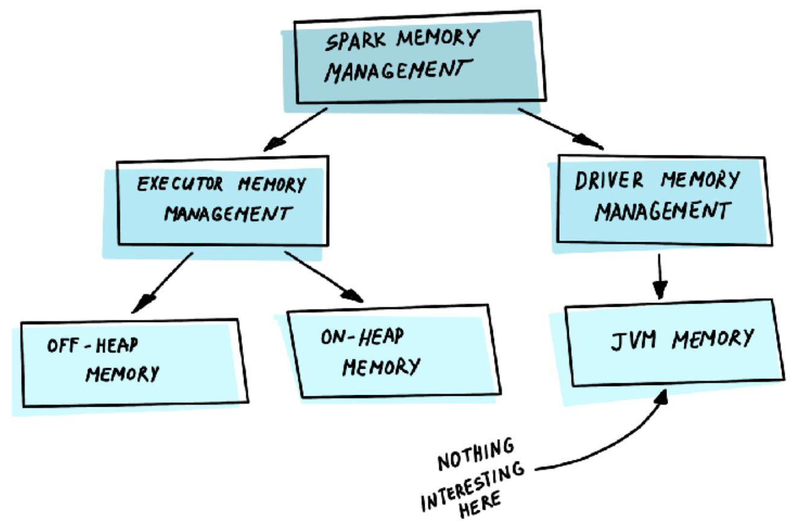
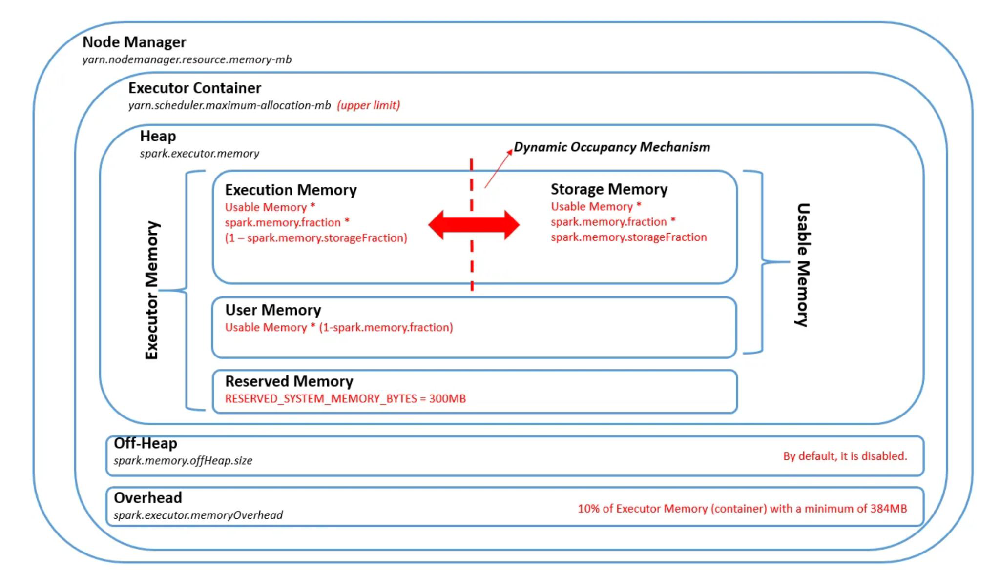
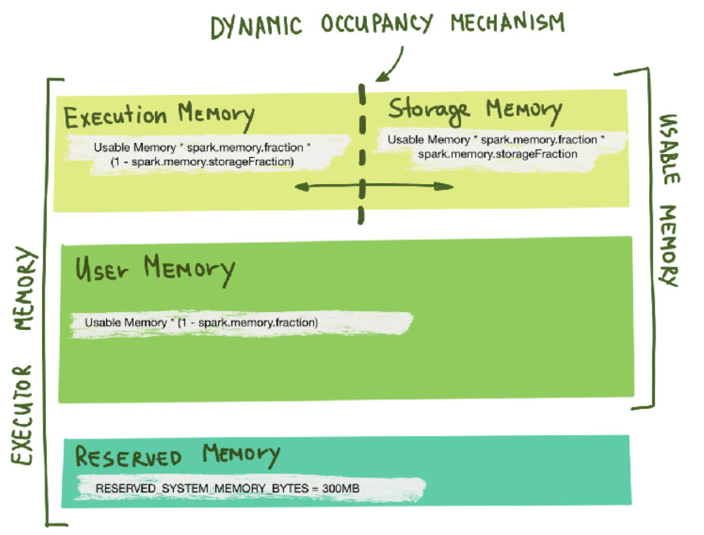
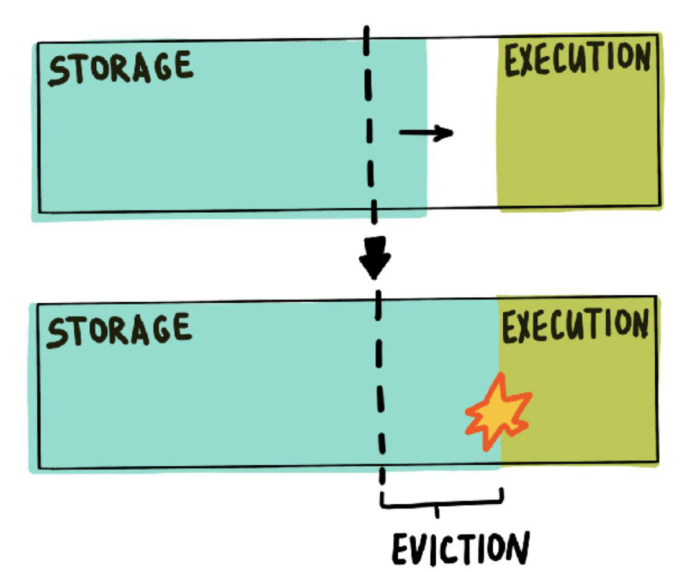

# **Persist and Caching in Apache Spark**  

Apache Spark provides mechanisms to store intermediate results in memory or disk to optimize performance and reduce redundant computations. Two important methods used for this purpose are `cache()` and `persist()`. These methods are particularly useful when performing iterative computations or reusing the same RDD (Resilient Distributed Dataset), DataFrame, or Dataset multiple times in a Spark job.

---

## **1. cache() Method**
The `cache()` method is a shorthand for `persist()` with the default storage level. When you call `cache()`, Spark stores the data in memory, and if it doesn’t fit, it moves the extra partitions to disk.

### **How cache() Works?**
- When you apply `cache()`, Spark does **not** immediately store the dataset. Instead, it marks the dataset as **cached**, and the actual caching happens when an action (like `count()`, `collect()`, etc.) is performed.
- If a partition of the dataset does not fit in memory, it is stored on disk.
- The next time you access the cached data, Spark retrieves it from memory rather than recomputing it.

### **Default Storage Level of cache()**
- In **PySpark**, `cache()` uses the **MEMORY_AND_DISK** storage level.
- In **Scala Spark**, `cache()` uses the **MEMORY_AND_DISK_SER** storage level.
- This means that data is stored in memory, and if there is not enough space, it is stored on disk instead of being recomputed.

### **Example Usage of cache()**
```python
from pyspark.sql import SparkSession

spark = SparkSession.builder.appName("CacheExample").getOrCreate()

# Creating a DataFrame
df = spark.range(1, 1000000)

# Caching the DataFrame
df.cache()

# Triggering an action to store data in cache
df.count()  # This triggers caching

# Further operations will use the cached data
df.show()
```

### **When to Use cache()?**
- When the dataset is small enough to fit in memory.
- When you want to reuse the dataset multiple times in the job.
- When you don’t need control over the storage level.

---

## **2. persist() Method**
The `persist()` method is similar to `cache()`, but it provides more control over how and where the dataset is stored by allowing you to specify a **storage level**.

### **How persist() Works?**
- When `persist(storageLevel)` is called, Spark assigns a **storage level** to the dataset.
- The actual persistence happens **only when an action is triggered**, just like `cache()`.
- The storage level determines whether the dataset is stored in memory, disk, or both.

### **Storage Levels in persist()**
Spark provides different storage levels, each offering a trade-off between memory usage and computation cost:

| Storage Level                 | Description |
|-------------------------------|-------------|
| MEMORY_ONLY                   | Stores the dataset in RAM. If it doesn’t fit, partitions are recomputed. |
| MEMORY_AND_DISK                | Stores in RAM and spills excess data to disk. |
| MEMORY_ONLY_SER (Serialized)   | Stores data in memory but in serialized format to reduce memory usage. |
| MEMORY_AND_DISK_SER (Serialized) | Stores in memory (serialized) and spills to disk if needed. |
| DISK_ONLY                      | Stores data only on disk, avoiding memory usage. |
| OFF_HEAP                       | Stores data in external memory (requires off-heap storage configuration). |

### **Example Usage of persist()**
```python
from pyspark import StorageLevel

# Persisting DataFrame with MEMORY_AND_DISK storage level
df.persist(StorageLevel.MEMORY_AND_DISK)

# Trigger an action to store the data
df.count()
```

### **When to Use persist()?**
- When you need control over storage (memory, disk, or both).
- When data is too large to fit in memory, and you want to avoid recomputation.
- When dealing with serialized data to optimize memory usage.

---

## **Key Differences Between cache() and persist()**
| Feature          | cache() | persist(storageLevel) |
|-----------------|--------|----------------------|
| Storage Level   | MEMORY_AND_DISK (default) | User-specified (e.g., MEMORY_ONLY, DISK_ONLY, etc.) |
| Control Over Storage | No | Yes |
| Disk Spill      | Yes, if memory is insufficient | Depends on the storage level |
| Serialization   | No (except in Scala, where it uses MEMORY_AND_DISK_SER) | Can be enabled with *_SER levels |
| Best Use Case   | When default storage settings are sufficient | When finer control over storage is needed |

---

## **Conclusion**
- Use **`cache()`** when you want to store data in memory with the default **MEMORY_AND_DISK** strategy.
- Use **`persist(storageLevel)`** when you need finer control over storage levels, like storing only in memory, on disk, or using serialization.

Both methods help optimize Spark jobs by avoiding redundant computations and improving performance, especially when dealing with iterative algorithms or repeated transformations.

<br/>
<br/>

# **Storage Levels in `persist()` in Apache Spark**  

Apache Spark provides various **storage levels** when persisting RDDs (Resilient Distributed Datasets). These levels determine how Spark stores data across memory and disk, optimizing performance based on available resources and computational needs.  

Using `persist(StorageLevel.<LEVEL>)`, we can specify **where** and **how** Spark should store data. Some levels also support **replication**, improving fault tolerance.

---

## **Categories of Storage Levels**
Spark's storage levels can be categorized into three main groups:  

1. **Memory-Only Storage:** Stores data in memory (RAM) for fast access. If there is insufficient memory, some partitions may be lost and recomputed.  
2. **Memory-and-Disk Storage:** Stores data in memory but writes excess data to disk if memory is insufficient.  
3. **Disk-Only Storage:** Stores data on disk, reducing memory usage but increasing read times.  

Additionally, some storage levels support **replication** (e.g., `_2` versions), where each partition is stored on two different cluster nodes to improve fault tolerance.

---

## **Detailed Explanation of Storage Levels**
### **1. `StorageLevel.DISK_ONLY`**
- Stores RDD partitions **only on disk**.
- When the data is required, it is read from disk.
- Saves memory but incurs a high I/O cost when retrieving data.
- Suitable when memory is limited or when data is accessed infrequently.

✅ **Use case:**  
- Large datasets that cannot fit in memory.  
- Workloads where reloading from disk is acceptable.

```python
rdd.persist(StorageLevel.DISK_ONLY)
```

---

### **2. `StorageLevel.DISK_ONLY_2`**
- Same as `DISK_ONLY`, but **each partition is replicated on two cluster nodes**.
- Improves fault tolerance in case a node fails.

✅ **Use case:**  
- Large datasets with a need for fault tolerance.  
- Scenarios where computation is expensive and data recovery is necessary.

```python
rdd.persist(StorageLevel.DISK_ONLY_2)
```

---

### **3. `StorageLevel.MEMORY_AND_DISK`**
- Stores RDD as **deserialized** objects in memory.  
- If there is not enough memory, excess partitions are stored on disk.  
- When retrieving data, Spark reads from memory if available; otherwise, it loads from disk.

✅ **Use case:**  
- Datasets that do not fully fit in memory but must be reused multiple times.  
- Balances performance and resource utilization.

```python
rdd.persist(StorageLevel.MEMORY_AND_DISK)
```

---

### **4. `StorageLevel.MEMORY_AND_DISK_2`**
- Same as `MEMORY_AND_DISK`, but **each partition is replicated on two nodes**.  
- Increases fault tolerance at the cost of using extra storage.  

✅ **Use case:**  
- Large datasets requiring fault tolerance without full reliance on disk.  

```python
rdd.persist(StorageLevel.MEMORY_AND_DISK_2)
```

---

### **5. `StorageLevel.MEMORY_AND_DISK_SER`**
- Stores RDD as **serialized Java objects** (one byte array per partition) in memory.  
- If there is insufficient memory, some partitions are moved to disk.  
- **More memory-efficient but CPU-intensive** due to serialization/deserialization overhead.

✅ **Use case:**  
- Large datasets that need compression to fit in memory.  
- Situations where CPU cost is acceptable in exchange for lower memory usage.

```python
rdd.persist(StorageLevel.MEMORY_AND_DISK_SER)
```

---

### **6. `StorageLevel.MEMORY_AND_DISK_SER_2`**
- Same as `MEMORY_AND_DISK_SER`, but **each partition is replicated on two nodes** for fault tolerance.  

✅ **Use case:**  
- Large datasets where data must be persisted reliably and memory efficiency is critical.  

```python
rdd.persist(StorageLevel.MEMORY_AND_DISK_SER_2)
```

---

### **7. `StorageLevel.MEMORY_ONLY`**
- Stores RDD in memory as **deserialized Java objects**.  
- If memory is insufficient, **some partitions are dropped** and will be recomputed when needed.  
- **Fastest option if enough memory is available.**  

✅ **Use case:**  
- Datasets that can fit in memory and are used multiple times.  
- Ideal when recomputation is cheaper than disk I/O.

```python
rdd.persist(StorageLevel.MEMORY_ONLY)
```

---

### **8. `StorageLevel.MEMORY_ONLY_2`**
- Same as `MEMORY_ONLY`, but **each partition is replicated on two cluster nodes**.  

✅ **Use case:**  
- Memory-intensive workloads requiring fault tolerance.  

```python
rdd.persist(StorageLevel.MEMORY_ONLY_2)
```

---

### **9. `StorageLevel.MEMORY_ONLY_SER`**
- Stores RDD as **serialized Java objects** (one byte array per partition) in memory.  
- **Reduces memory usage** but increases CPU load for serialization/deserialization.  

✅ **Use case:**  
- Datasets that need compression for memory efficiency.  
- When serialization overhead is acceptable for lower memory consumption.

```python
rdd.persist(StorageLevel.MEMORY_ONLY_SER)
```

---

### **10. `StorageLevel.MEMORY_ONLY_SER_2`**
- Same as `MEMORY_ONLY_SER`, but **each partition is replicated on two nodes**.  

✅ **Use case:**  
- Memory-intensive workloads requiring data replication for fault tolerance.  

```python
rdd.persist(StorageLevel.MEMORY_ONLY_SER_2)
```

---

## **Comparison of Storage Levels**
| **Storage Level**            | **Stored in Memory?** | **Serialized?** | **Stored on Disk?** | **Replication?** | **Use Case** |
|------------------------------|----------------------|----------------|----------------------|----------------|--------------------------|
| MEMORY_ONLY                  | ✅ Yes | ❌ No | ❌ No | ❌ No | Best for fast, repeated use if memory is available. |
| MEMORY_ONLY_2                | ✅ Yes | ❌ No | ❌ No | ✅ Yes | Like MEMORY_ONLY, but with fault tolerance. |
| MEMORY_ONLY_SER              | ✅ Yes | ✅ Yes | ❌ No | ❌ No | Saves memory using serialization, but CPU-intensive. |
| MEMORY_ONLY_SER_2            | ✅ Yes | ✅ Yes | ❌ No | ✅ Yes | Like MEMORY_ONLY_SER, but with replication. |
| MEMORY_AND_DISK              | ✅ Yes | ❌ No | ✅ Yes (if needed) | ❌ No | For large datasets that don’t fit in memory. |
| MEMORY_AND_DISK_2            | ✅ Yes | ❌ No | ✅ Yes (if needed) | ✅ Yes | Like MEMORY_AND_DISK, but with replication. |
| MEMORY_AND_DISK_SER          | ✅ Yes | ✅ Yes | ✅ Yes (if needed) | ❌ No | Memory-efficient, but CPU-intensive. |
| MEMORY_AND_DISK_SER_2        | ✅ Yes | ✅ Yes | ✅ Yes (if needed) | ✅ Yes | Like MEMORY_AND_DISK_SER, but with replication. |
| DISK_ONLY                    | ❌ No | ❌ No | ✅ Yes | ❌ No | When memory is unavailable, disk-based storage. |
| DISK_ONLY_2                  | ❌ No | ❌ No | ✅ Yes | ✅ Yes | Like DISK_ONLY, but with replication. |

---

## **Choosing the Right Storage Level**
- **Use MEMORY_ONLY** if your dataset **fits in RAM** and you need the **fastest** performance.  
- **Use MEMORY_AND_DISK** if your dataset is **too large for memory** but must be **retrievable from disk**.  
- **Use MEMORY_ONLY_SER** if memory is limited and you need **compression**, but are okay with CPU overhead.  
- **Use DISK_ONLY** if memory is **not available** and **recomputing is expensive**.  
- **Use `_2` versions** if **fault tolerance** is required.

### **Conclusion**
Choosing the right `persist()` storage level depends on the available memory, dataset size, and fault tolerance requirements. By understanding these options, you can optimize Spark jobs for performance and efficiency. 🚀

<br/>
<br/>

# **Data Skewness in Apache Spark: Causes and Solutions**  

## **What is Data Skewness in Spark?**  
Data **skewness** in Spark occurs when **data is not evenly distributed across partitions**. This imbalance causes some partitions to have significantly more data than others, leading to inefficient resource utilization and longer job execution times.  

In an ideal Spark job, data is evenly distributed across all partitions so that **each task takes roughly the same amount of time**. However, when skew occurs, some partitions get overloaded while others finish quickly, creating performance bottlenecks.

---

## **How Does Data Skewness Affect Performance?**  
- **Longer execution times:** Some tasks take longer due to heavier partitions, delaying the entire job.  
- **Inefficient resource utilization:** Some executors remain idle while others are overloaded.  
- **Increased memory and GC overhead:** Large partitions can cause OutOfMemory (OOM) errors.  

---

## **Common Scenarios That Cause Data Skewness**
### **1. Skew in Join Operations**
🔹 **Why It Happens:**  
When performing a **join** between two datasets, if some keys are significantly more frequent than others, those keys will generate **huge partitions**. This results in **some tasks taking much longer** than others.

🔹 **Example:**  
Consider two datasets:  
- `orders`: Contains **1 million records**, where **90% of records have the key "CustomerID_123"**.  
- `customers`: Contains **100,000 unique CustomerIDs**.

If you join these datasets on `CustomerID`, Spark will try to **shuffle data based on this key**, leading to **one huge partition for "CustomerID_123"** while other partitions remain small.

🔹 **Impact:**  
- Some executors process huge amounts of data, while others process very little.  
- The overloaded executor slows down the entire job.  

🔹 **Solution:**  
- **Salting Technique:** Add a random suffix to skewed keys to distribute them across multiple partitions.  
- **Broadcast Join:** If one dataset is small, use `broadcast()` to avoid shuffling.  
- **Skew Join Optimization in Spark 3.0+**: Spark automatically handles skewed joins by splitting large partitions.  

🔹 **Example Fix using Salting**:
```python
from pyspark.sql.functions import col, monotonically_increasing_id

# Add a salt value to the key (creating multiple partitions for skewed keys)
orders = orders.withColumn("salt", (monotonically_increasing_id() % 10).cast("string"))
orders = orders.withColumn("CustomerID_Salted", col("CustomerID") + col("salt"))

customers = customers.withColumn("CustomerID_Salted", col("CustomerID"))

# Perform join on salted key
orders.join(customers, "CustomerID_Salted", "inner")
```

---

### **2. Skew in GroupBy Operations (`groupByKey`, `reduceByKey`)**
🔹 **Why It Happens:**  
When using `groupByKey()` or `reduceByKey()`, Spark **shuffles** data based on keys. If some keys occur **much more frequently**, a few partitions will hold most of the data.

🔹 **Example:**  
```python
rdd = sc.parallelize([
    ("apple", 1), ("apple", 2), ("apple", 3), ("banana", 1),
    ("grape", 1), ("banana", 2), ("apple", 4), ("apple", 5)
])
rdd.groupByKey().mapValues(list).collect()
```
If `"apple"` appears in **90% of records**, the partition for `"apple"` will be **much larger** than others.

🔹 **Impact:**  
- Memory pressure on overloaded partitions.  
- Increased **GC (Garbage Collection) overhead**.  
- Possible **OOM (Out of Memory) errors**.  

🔹 **Solution:**  
- **Use `reduceByKey()` Instead of `groupByKey()`**: `reduceByKey()` aggregates values before shuffling.  
- **Pre-partitioning with `hashPartitioner`**: Ensures even distribution across partitions.  
- **Salting Technique**: Similar to join skew solutions.  

🔹 **Example Fix using `reduceByKey()`**
```python
rdd.reduceByKey(lambda x, y: x + y)  # Aggregates before shuffling
```

---

### **3. Skew Due to Uneven Data Distribution**
🔹 **Why It Happens:**  
Some datasets inherently contain **uneven distributions** of data. For example:  
- A dataset containing **log data from a website** might have **80% of traffic from a single IP address**.  
- A dataset storing **user transactions** may have **one user making 90% of the transactions**.  

🔹 **Impact:**  
- Partitions containing frequent data points are overloaded.  
- Causes **executor slowdowns** and **job delays**.  

🔹 **Solution:**  
- **Custom partitioning**: Use `hashPartitioner` to distribute data more evenly.  
- **Repartitioning with `.repartition()` or `.coalesce()`**: Adjust the number of partitions dynamically.  
- **Filtering Hot Keys**: If specific keys are known to be skewed, process them separately.  

🔹 **Example Fix using `repartition()`**
```python
df.repartition(100, "user_id")  # Evenly distributes data across 100 partitions
```

---

## **How to Detect Data Skewness?**
1. **Enable Spark UI and Check Stage Timelines:**  
   - Go to **Spark Web UI** (`http://localhost:4040` if running locally).  
   - Look for **tasks that take significantly longer** than others in a stage.  

2. **Check Partition Sizes:**  
   - Run `df.rdd.glom().map(len).collect()` to see the number of records in each partition.  

3. **Enable DEBUG Logs:**  
   - Set `spark.logConf=true` to log partitioning details.  

4. **Check Shuffle Read Metrics:**  
   - Use `df.explain("formatted")` to analyze shuffle operations.  

---

## **Summary Table: Causes and Solutions**
| **Cause of Skew**  | **Why It Happens** | **Impact** | **Solution** |
|--------------------|------------------|------------|-------------|
| **Join Skew** | Some keys appear more frequently than others | Some partitions get overloaded | **Salting, Broadcast Join, Spark 3.0 Skew Join Optimization** |
| **GroupBy Skew** | Some keys have many more values than others | Increased memory usage, GC overhead | **Use `reduceByKey()`, hash partitioning, salting** |
| **Uneven Data Distribution** | Certain values dominate dataset | Some executors overloaded | **Custom partitioning, `repartition()`, filtering hot keys** |

---

## **Final Thoughts**
- **Data skewness is a major cause of performance bottlenecks in Spark.**  
- **Salting, repartitioning, and using Spark's built-in optimizations can greatly improve performance.**  
- **Always analyze data distribution before designing partitioning strategies.**  

Understanding and handling data skew properly ensures **efficient resource utilization, faster execution, and reduced memory overhead in Spark applications**. 🚀

<br/>
<br/>

# **How to Deal with Data Skewness in Apache Spark?**  

**Data skewness** in Apache Spark occurs when data is unevenly distributed across partitions, leading to **inefficient processing, increased memory usage, and slower job execution**. To handle data skew effectively, we use **optimization techniques** to balance the workload across partitions.

---

## **1. Salting: Distributing Skewed Keys Across Multiple Partitions**
### **What is Salting?**
Salting involves **modifying skewed keys by appending a random value**. This creates **multiple unique keys**, distributing the workload across different partitions.

### **When to Use?**
- When performing **joins** where certain keys are significantly more frequent.
- When performing **groupBy operations** on skewed keys.

### **How It Works?**
1. **Identify skewed keys**.
2. **Append a random "salt" value** to create multiple versions of the key.
3. **Join based on salted keys**.
4. **Remove the salt** after the join operation.

### **Example: Fixing Join Skew with Salting**
#### **Without Salting (Causing Skew)**
```python
orders = spark.read.csv("orders.csv", header=True)
customers = spark.read.csv("customers.csv", header=True)

# Joining on skewed key (CustomerID)
result = orders.join(customers, "CustomerID")
```
👉 If **90% of records** have `CustomerID="123"`, Spark will **overload one partition**, causing performance issues.

#### **With Salting (Balanced Join)**
```python
from pyspark.sql.functions import col, expr, monotonically_increasing_id

# Add a salt value (randomly distribute skewed keys)
orders = orders.withColumn("salt", (monotonically_increasing_id() % 10).cast("string"))
orders = orders.withColumn("CustomerID_Salted", col("CustomerID") + col("salt"))

customers = customers.withColumn("salt", expr("explode(array(0,1,2,3,4,5,6,7,8,9))"))
customers = customers.withColumn("CustomerID_Salted", col("CustomerID") + col("salt"))

# Perform the join on the salted key
result = orders.join(customers, "CustomerID_Salted", "inner")

# Drop the extra columns
result = result.drop("salt", "CustomerID_Salted")
```
👉 Now, the **skewed keys are distributed across multiple partitions**, reducing the workload on any single partition.

---

## **2. Splitting Skewed Data: Processing Hot Keys Separately**
### **What is Splitting Skewed Data?**
Instead of processing all data together, **split the skewed data** and process it separately.

### **When to Use?**
- When a **few keys** dominate a dataset.
- When **salting is not an option** due to key integrity constraints.

### **How It Works?**
1. **Identify hot keys** (keys with excessive records).
2. **Separate them from normal data**.
3. **Process them separately in smaller partitions**.
4. **Combine the results**.

### **Example: Handling Skewed Transactions**
```python
from pyspark.sql.functions import col

# Identify skewed keys (assuming transactions with >10,000 records are skewed)
hot_keys = ["12345", "67890"]  # These are known to be skewed

# Separate hot key data
skewed_data = df.filter(col("CustomerID").isin(hot_keys))
normal_data = df.filter(~col("CustomerID").isin(hot_keys))

# Process separately
result_skewed = skewed_data.repartition(20, "CustomerID")  # More partitions for skewed keys
result_normal = normal_data.repartition(5, "CustomerID")  # Fewer partitions for normal keys

# Combine results
final_result = result_skewed.union(result_normal)
```
👉 This ensures **better distribution** and prevents **executor overload**.

---

## **3. Increasing the Number of Partitions**
### **What is Partitioning?**
Partitioning determines how data is **split across nodes**. Increasing partitions ensures that **each executor processes a smaller portion of data**, reducing workload imbalance.

### **When to Use?**
- When Spark tasks are **taking too long** due to large partitions.
- When **out-of-memory (OOM) errors** occur.

### **How It Works?**
1. Use `.repartition(n)` to **increase partitions (expensive, causes full shuffle)**.
2. Use `.coalesce(n)` to **decrease partitions (faster, avoids full shuffle)**.

### **Example: Increasing Partitions**
```python
df = df.repartition(100)  # Increase to 100 partitions
```
👉 This helps distribute data more evenly but **may cause more shuffling**.

### **Example: Using Coalesce (More Efficient)**
```python
df = df.coalesce(50)  # Reduce partitions without excessive shuffling
```
👉 **Use `coalesce()` instead of `repartition()` when reducing partitions**.

---

## **4. Using `reduceByKey()` Instead of `groupByKey()`**
### **What’s the Difference?**
| **Method**        | **When to Use?** | **Why?** |
|------------------|----------------|---------|
| `groupByKey()` | When collecting all values for a key | Can cause **huge partitions**, leading to **data skew** |
| `reduceByKey()` | When aggregating values | **Reduces data before shuffling**, avoiding skew |

### **Example: Avoiding Skew with `reduceByKey()`**
#### **Bad Approach (Using `groupByKey()`)**
```python
rdd = sc.parallelize([("apple", 1), ("apple", 2), ("banana", 3), ("apple", 4)])
result = rdd.groupByKey().mapValues(list)
```
❌ This method **shuffles all values** before reducing, causing skew.

#### **Better Approach (Using `reduceByKey()`)**
```python
result = rdd.reduceByKey(lambda x, y: x + y)
```
✔ **This aggregates locally before shuffling**, reducing skew.

---

## **5. Using Broadcast Variables to Avoid Shuffling**
### **What is a Broadcast Join?**
Instead of **shuffling data**, Spark can **broadcast small datasets** to all nodes, avoiding skewed shuffles.

### **When to Use?**
- When **joining a large DataFrame with a small DataFrame** (e.g., a lookup table).
- When the **small DataFrame fits in memory**.

### **How It Works?**
1. **Broadcast the small dataset** to all executors.
2. **Each executor joins locally**, avoiding expensive data movement.

### **Example: Using Broadcast Join**
#### **Without Broadcasting (Causes Skew)**
```python
df_large.join(df_small, "CustomerID")  # Causes shuffling
```
👉 **If `df_small` is tiny**, Spark still **shuffles `df_large`**, causing skew.

#### **With Broadcasting (Optimized)**
```python
from pyspark.sql.functions import broadcast

result = df_large.join(broadcast(df_small), "CustomerID")  # No shuffle!
```
✔ This ensures **fast local joins**, **eliminating shuffle skew**.

---

# **Conclusion: Best Practices for Handling Data Skew**
| **Problem** | **Cause** | **Solution** |
|------------|---------|-------------|
| **Join Skew** | Some keys appear much more frequently | **Salting, Broadcast Join, Spark 3.0 Skew Join Optimization** |
| **GroupBy Skew** | Some keys have many more values | **Use `reduceByKey()` instead of `groupByKey()`** |
| **Partition Imbalance** | Uneven data distribution | **Increase partitions using `repartition()` or `coalesce()`** |
| **Large Shuffles** | Too much data being moved | **Use `broadcast()` to avoid shuffle** |
| **Heavy Hot Keys** | A few keys dominate the workload | **Process skewed keys separately** |

### **Key Takeaways**
✅ **Salting is the best fix for join skew**.  
✅ **Use `reduceByKey()` instead of `groupByKey()`** to reduce shuffle.  
✅ **Increase partitions (`repartition()`) to distribute data better**.  
✅ **Use `broadcast()` for small DataFrames to avoid shuffle overhead**.  
✅ **Process hot keys separately** if some keys dominate the dataset.  

By implementing these techniques, **you can optimize Spark jobs, improve performance, and prevent data skew from slowing down your application! 🚀**

<br/>
<br/>

# **Difference Between `repartition()` and `coalesce()` in Apache Spark**

Both **`repartition()`** and **`coalesce()`** are used to modify the number of partitions in an RDD or DataFrame in Apache Spark. However, they **differ in terms of performance, data movement, and use cases**.

---

## **1. `repartition()`: Used to Increase or Decrease Partitions (Causes Full Shuffle)**
### **What is `repartition()`?**
- **`repartition(n)`** is used to **increase or decrease** the number of partitions in an RDD or DataFrame.
- It **triggers a full shuffle of the data** across the network to evenly distribute it into the new partitions.
- Because of the shuffle, **it ensures that partitions are balanced** (i.e., roughly equal in size).
- It is useful **when increasing partitions** to improve parallelism and efficiency.

### **When to Use `repartition()`?**
✅ **When increasing the number of partitions** to improve parallelism.  
✅ **When dealing with an imbalanced dataset** (some partitions are much larger than others).  
✅ **When preparing for joins or aggregations** that require even data distribution.  
✅ **When explicitly partitioning by a column** for better filtering performance.

### **Example: Increasing Partitions to Improve Parallelism**
```python
df = df.repartition(100)  # Increase to 100 partitions
```
👉 If the original DataFrame had **10 partitions**, `repartition(100)` will **redistribute the data** across **100 partitions**, improving parallelism.

### **Example: Repartitioning by Column for Optimized Filtering**
```python
df = df.repartition(50, "country")  # Partition data based on 'country' column
```
👉 Now, **all rows with the same country are in the same partition**, reducing shuffling for future operations like filtering.

### **Downside of `repartition()`**
❌ **Full shuffle operation** – All data is **moved across the cluster**, making it expensive.  
❌ **More network and disk I/O** – Can slow down performance if used unnecessarily.  

---

## **2. `coalesce()`: Used to Reduce Partitions (Avoids Full Shuffle)**
### **What is `coalesce()`?**
- **`coalesce(n)`** is used **only to reduce** the number of partitions.
- Unlike `repartition()`, **it avoids a full shuffle**, making it more efficient when reducing partitions.
- It works by **combining existing partitions**, meaning **data movement is minimized**.
- However, since some partitions are merged, it may lead to **uneven data distribution (data skew)**.

### **When to Use `coalesce()`?**
✅ **When decreasing the number of partitions** to optimize performance.  
✅ **When the dataset has too many small partitions** that create unnecessary overhead.  
✅ **When writing to disk** (e.g., saving as a file), reducing partitions helps to avoid creating too many small files.  

### **Example: Reducing Partitions for File Writing**
```python
df = df.coalesce(10)  # Reduce partitions to 10 before writing to disk
df.write.parquet("output_path")
```
👉 If the dataset initially had **100 partitions**, this ensures **only 10 output files**, avoiding **many small files**.

### **Example: Efficiently Reducing Partitions**
```python
df = df.coalesce(5)  # Reduce partitions without full shuffle
```
👉 This avoids unnecessary shuffling while reducing partition count.

### **Downside of `coalesce()`**
❌ **Data Skew** – If some partitions are too large, they may become **overloaded**, reducing efficiency.  
❌ **Not Suitable for Increasing Partitions** – It **only merges existing partitions**, so it cannot **increase** the number of partitions.  

---

## **3. Key Differences Between `repartition()` and `coalesce()`**
| Feature | `repartition()` | `coalesce()` |
|---------|---------------|--------------|
| **Purpose** | Increases or decreases the number of partitions | Only decreases the number of partitions |
| **Shuffle** | Causes **full shuffle** (expensive) | Avoids **full shuffle** (efficient) |
| **Data Movement** | **All data is redistributed** across partitions | **Only merges existing partitions**, minimizing movement |
| **Partitioning** | Ensures **balanced partitions** | May result in **data skew** |
| **Best Use Case** | **Increasing partitions** for parallelism or **redistributing data** | **Reducing partitions** before writing to disk |
| **Performance Cost** | **High cost** due to shuffle | **Low cost** due to minimal shuffling |

---

## **4. Choosing Between `repartition()` and `coalesce()`**
| **Scenario** | **Which Method to Use?** | **Why?** |
|-------------|----------------|---------|
| **You need to increase partitions for better parallelism** | `repartition()` | Because `coalesce()` only reduces partitions |
| **Your partitions are imbalanced and need even distribution** | `repartition()` | It shuffles data to create balanced partitions |
| **You need to reduce partitions before writing to disk** | `coalesce()` | It reduces shuffle overhead, making writes efficient |
| **You want to filter by a specific column frequently** | `repartition(column)` | It ensures related data is stored together |
| **You want to reduce small partitions without reshuffling all data** | `coalesce()` | It merges partitions efficiently |

---

## **5. Practical Example: Using Both Methods Together**
```python
df = df.repartition(50)  # First, increase partitions for parallel processing
df = df.coalesce(10)  # Then, reduce partitions before writing to disk
df.write.parquet("output_path")
```
👉 **First, repartition() ensures balanced data processing**,  
👉 **Then, coalesce() minimizes shuffling before saving the file**.

---

# **Conclusion**
- **Use `repartition()` when increasing partitions or when you need a full shuffle to balance data.**
- **Use `coalesce()` when reducing partitions without excessive shuffling.**
- **For optimal performance, use both together**: first, repartition to balance workload, then coalesce before writing data.

By choosing the right method, you can **significantly optimize Spark jobs, reduce execution time, and improve resource utilization! 🚀**

<br/>
<br/>

# **Salting in Apache Spark to Handle Data Skewness**

## **What is Salting?**
**Salting** is a technique used in **Apache Spark** to mitigate **data skewness** during operations like **joins** and **groupBy**. It works by **introducing additional randomness (salt) into skewed keys**, thereby **distributing the data more evenly across partitions**.

---

## **Why is Salting Needed?**
In **Spark Join operations**, when data is skewed (i.e., some keys have significantly more data than others), the partitions holding those keys become **overloaded**. This results in:
- **Uneven workload distribution** → Some tasks take much longer than others.
- **Resource inefficiency** → Some executors are idle while others handle heavy partitions.
- **Slow job execution** → The overall job runs at the speed of the slowest task.

👉 **Salting helps distribute the load by spreading out skewed keys across multiple partitions.**

---

## **Example: Handling Skewness with Salting in PySpark**
### **Step 1: Understanding the Problem**
Imagine we have two **DataFrames**:  
1️⃣ **`df1`** (large DataFrame)  
2️⃣ **`df2`** (small DataFrame)  

We want to perform a **join on the `id` column**, but some `id` values appear **much more frequently** than others, causing **data skew**.

#### **Without Handling Skewness: Standard Join**
```python
result = df1.join(df2, on="id", how="inner")
```
🚨 **Problem**: The keys with **high frequency** will cause **heavy partitioning imbalance**, leading to **slow execution**.

---

### **Step 2: Implementing Salting to Distribute Load**
#### **1️⃣ Generate Random "Salted Keys" in `df1`**
- We introduce a **random salt value** between `0` and `num_salting_keys` in `df1`.
- This ensures that **rows with the same id are spread across multiple partitions**.

#### **2️⃣ Expand `df2` by Cross Joining with Salt Values**
- We **replicate** `df2` **num_salting_keys** times.
- This allows each `id` in `df2` to match **multiple versions** of the same `id` in `df1`, enabling a distributed join.

#### **3️⃣ Perform the Join Using Both `id` and `salted_key`**
- Now, instead of joining just on `id`, we join using **both `id` and `salted_key`**.
- This ensures that **the workload is distributed more evenly**.

#### **4️⃣ Drop the Salt Column (Optional)**
- Once the join is complete, the **salted_key** is no longer needed and can be removed.

---

### **Code Implementation: Salting for Join Optimization**
```python
from pyspark.sql import SparkSession
import pyspark.sql.functions as F

# Initialize Spark session
spark = SparkSession.builder.appName("SaltingExample").getOrCreate()

# Create sample DataFrames (df1 has skewed data)
df1 = spark.createDataFrame([
    (1, "A"), (1, "B"), (1, "C"), (1, "D"), (1, "E"),  # Skewed key
    (2, "F"), (3, "G"), (4, "H"), (5, "I")
], ["id", "value1"])

df2 = spark.createDataFrame([
    (1, "X"), (2, "Y"), (3, "Z"), (4, "W"), (5, "V")
], ["id", "value2"])

# Define number of salting keys
num_salting_keys = 100

# Step 1: Add a "salted_key" column to df1 using random numbers
df1 = df1.withColumn("salted_key", (F.rand() * num_salting_keys).cast("int"))

# Step 2: Expand df2 by creating multiple rows with different salt values
df2_exploded = df2.crossJoin(
    spark.range(num_salting_keys).withColumnRenamed("id", "salted_key")
)

# Step 3: Perform the join on both 'id' and 'salted_key'
result = df1.join(df2_exploded, on=["id", "salted_key"], how="inner")

# Step 4: Drop 'salted_key' after the join (optional)
result = result.drop("salted_key")

# Show the final result
result.show()
```

---

## **How Salting Works**
### **1️⃣ Before Salting: Standard Join**
| id  | value1 | value2 |
|----|--------|--------|
| 1  | A      | X      |
| 1  | B      | X      |
| 1  | C      | X      |
| 1  | D      | X      |
| 1  | E      | X      |
| 2  | F      | Y      |
| 3  | G      | Z      |
| 4  | H      | W      |
| 5  | I      | V      |

👉 **Problem**: All `id=1` values are handled by the **same partition**, causing **skew**.

---

### **2️⃣ After Salting: Modified Join**
#### **Now, the `id=1` values are spread across multiple partitions!**
| id  | value1 | salted_key | value2 |
|----|--------|------------|--------|
| 1  | A      | 5          | X      |
| 1  | B      | 8          | X      |
| 1  | C      | 12         | X      |
| 1  | D      | 33         | X      |
| 1  | E      | 78         | X      |
| 2  | F      | 4          | Y      |
| 3  | G      | 2          | Z      |
| 4  | H      | 11         | W      |
| 5  | I      | 89         | V      |

👉 **Benefit**:  
- Now, the skewed key (`id=1`) **spreads across different partitions**, **reducing bottlenecks**.
- The join runs **faster** because **Spark distributes the load evenly**.

---

## **Advantages of Salting**
✅ **Reduces skewness** by distributing large-key data across multiple partitions.  
✅ **Optimizes joins and groupBy operations**, leading to **faster performance**.  
✅ **Balances cluster resources**, preventing bottlenecks in Spark tasks.  

---

## **Limitations of Salting**
❌ **Increases dataset size** (since we duplicate small tables like `df2`).  
❌ **Requires tuning the `num_salting_keys` value** (if too low, skew persists; if too high, excessive data is generated).  
❌ **Not suitable for non-skewed data** (unnecessary complexity).  

---

## **When to Use Salting?**
🔹 **When performing joins on skewed columns** with high-frequency values.  
🔹 **When using groupBy operations** that result in uneven data distribution.  
🔹 **When a few keys are causing a Spark job to be slow due to data imbalance.**  

---

## **Alternatives to Salting**
📌 **Broadcast Join** → If one DataFrame is small, use **broadcast variables** to avoid shuffling.  
📌 **Skew Join Optimization in Spark** → Spark **automatically detects skewed joins** and optimizes them.  
📌 **Repartitioning by Key** → Use `df.repartition("id")` to ensure even distribution.  

---

# **Conclusion**
- **Data skewness** in Spark can cause **slow joins and inefficient resource utilization**.
- **Salting distributes skewed keys** across multiple partitions, **balancing load**.
- **Salting works well for highly skewed joins**, but requires careful tuning.

By implementing salting correctly, **Spark jobs run faster, more efficiently, and scale better! 🚀**

<br/>
<br/>

# Comparison between **RDD (Resilient Distributed Dataset), DataFrame, and DataSet** in **Apache Spark**

## **1. Abstraction Level**
- **RDD (Resilient Distributed Dataset)**  
  - Low-level abstraction, providing a basic distributed data structure.  
  - It is the **core Spark data structure**, where transformations and actions must be manually defined.  
  - No built-in optimizations; the developer has to handle operations manually using functions like `map`, `filter`, and `reduce`.  

- **DataFrame**  
  - High-level abstraction **built on top of RDDs**.  
  - Provides a **structured tabular format**, similar to a SQL table.  
  - DataFrames enable **better optimizations** than RDDs through **Catalyst Optimizer**.  

- **DataSet**  
  - Also a high-level abstraction but **built on top of DataFrames**.  
  - Provides a **strongly-typed** view of structured data using **case classes or Java beans**.  
  - More type-safe than DataFrames while maintaining optimizations.  

### **Summary:**  
- **RDDs** → Raw, low-level, and unoptimized.  
- **DataFrames** → Higher-level abstraction, tabular format.  
- **DataSets** → Combines benefits of DataFrame with **compile-time type safety**.  

---

## **2. Type Safety**
- **RDD**: ✅ Provides **compile-time type safety**, since it is based on **objects**.  
- **DataFrame**: ❌ **No compile-time type safety**, as it deals with **semi-structured data**.  
- **DataSet**: ✅ Provides **compile-time type safety** because it deals with **structured data using case classes**.  

### **Why is this important?**
Type safety prevents errors at **compile-time** rather than **runtime**, making **DataSets** a safer choice for handling structured data.

---

## **3. Optimization**
- **RDD**:  
  - No automatic optimizations.  
  - Developers need to **manually optimize** using transformations like `map`, `reduce`, etc.  

- **DataFrame**:  
  - Uses **Catalyst Optimizer** for **automatic query plan optimizations**.  
  - Supports **predicate pushdown, column pruning, and logical optimizations** to **improve execution speed**.  

- **DataSet**:  
  - Also uses **Catalyst Optimizer** for efficient execution.  
  - Benefits from **both optimizations and type safety**.  

### **Summary:**  
- **RDDs** require **manual optimization**.  
- **DataFrames and DataSets** benefit from **automatic optimizations** using Catalyst Optimizer.  

---

## **4. Processing Speed**
- **RDD**:  
  - Slower because **it lacks automatic optimizations**.  
  - Every operation requires a new RDD to be created, leading to **performance overhead**.  

- **DataFrame**:  
  - **Faster than RDDs** because it benefits from **Catalyst Optimizer and Tungsten Execution Engine**.  
  - Spark **converts DataFrame operations into optimized execution plans**.  

- **DataSet**:  
  - Similar speed to **DataFrames** due to Catalyst Optimizer.  
  - **However, type safety in DataSets can sometimes add minor performance overhead** compared to DataFrames.  

### **Summary:**  
🚀 **DataFrames and DataSets are significantly faster than RDDs** because they leverage **Spark's optimizations**.

---

## **5. Ease of Use**
- **RDD**: ❌ Harder to use because developers must **manually optimize** everything.  
- **DataFrame**: ✅ Easier to use because of **SQL-like syntax** (`df.select(), df.filter()`).  
- **DataSet**: ✅ Similar to DataFrame but with **type safety and object-oriented programming support**.  

### **Example: Filtering Data**
#### **RDD Approach (Complex)**
```python
rdd = spark.sparkContext.parallelize([(1, "Alice"), (2, "Bob"), (3, "Charlie")])
filtered_rdd = rdd.filter(lambda x: x[0] > 1)
```

#### **DataFrame Approach (Simpler)**
```python
df = spark.createDataFrame([(1, "Alice"), (2, "Bob"), (3, "Charlie")], ["id", "name"])
filtered_df = df.filter(df.id > 1)
```

#### **DataSet Approach (Safer)**
```scala
case class Person(id: Int, name: String)
val ds = Seq(Person(1, "Alice"), Person(2, "Bob"), Person(3, "Charlie")).toDS()
val filtered_ds = ds.filter(_.id > 1)
```
👉 **DataFrames and DataSets are easier to use than RDDs!**

---

## **6. Interoperability**
- **RDD**: ✅ Easily **converted** to and from DataFrames and DataSets.  
- **DataFrame**: ✅ Easily **converted** to RDDs and DataSets.  
- **DataSet**: ✅ Easily **converted** to and from DataFrames and RDDs.  

### **Conversion Examples**
#### **RDD → DataFrame**
```python
df = rdd.toDF(["id", "name"])
```

#### **DataFrame → RDD**
```python
rdd = df.rdd
```

#### **DataFrame → DataSet (Scala)**
```scala
val ds = df.as[Person]
```

#### **DataSet → DataFrame**
```scala
val df = ds.toDF()
```

### **Summary:**  
All three structures **support easy conversion**, making Spark highly flexible.

---

## **When to Use RDD, DataFrame, or DataSet?**
| **Use Case** | **RDD** | **DataFrame** | **DataSet** |
|-------------|--------|-------------|-------------|
| **You need low-level control over data** | ✅ | ❌ | ❌ |
| **You want high performance** | ❌ | ✅ | ✅ |
| **You need compile-time type safety** | ✅ | ❌ | ✅ |
| **You are working with structured data** | ❌ | ✅ | ✅ |
| **You want SQL-like syntax** | ❌ | ✅ | ✅ |
| **You want automatic optimizations** | ❌ | ✅ | ✅ |

---

## **Final Verdict**
✅ **Use RDDs when:**  
- You need **low-level control** over data.  
- You work with **unstructured data**.  
- You need **fine-grained transformations** (e.g., custom partitioning).  

✅ **Use DataFrames when:**  
- You want **fast execution**.  
- You work with **structured or semi-structured data**.  
- You prefer **SQL-like syntax** for easy querying.  

✅ **Use DataSets when:**  
- You need **type safety** along with **performance optimizations**.  
- You work with **structured data** using case classes.  

---

### **Conclusion**
- **RDDs** are **low-level and require manual optimization**.  
- **DataFrames** provide **high performance but lack type safety**.  
- **DataSets** offer **both performance and type safety** but are limited to JVM languages (Scala & Java).  

🚀 **For most use cases, DataFrames or DataSets are preferred over RDDs due to their efficiency and ease of use!**

<br/>
<br/>

# **Understanding `spark-submit` in Apache Spark**

## **Introduction**
`spark-submit` is the primary **command-line tool** used to submit **Spark applications** to a **cluster** for execution. It allows users to **configure**, **deploy**, and **execute** their applications on various cluster managers like **Standalone, YARN, Mesos, and Kubernetes**.

---

## **General Syntax**
```bash
spark-submit \
 --class <main-class> \
 --master <master-url> \
 --deploy-mode <deploy-mode> \
 --conf <key>=<value> \
 <application-jar> \
 [application-arguments]
```

### **Components Breakdown**
| **Argument** | **Description** |
|-------------|----------------|
| `--class <main-class>` | Specifies the fully qualified main class name for Java/Scala applications. (e.g., `com.example.MainApp`) |
| `--master <master-url>` | Defines where Spark runs (e.g., `local`, `yarn`, `spark://host:port`, `mesos://host:port`). |
| `--deploy-mode <deploy-mode>` | Specifies whether to deploy in `client` or `cluster` mode. |
| `--conf <key>=<value>` | Allows setting configuration properties for execution. |
| `<application-jar>` | The path to the JAR file containing the application code. |
| `[application-arguments]` | Optional arguments to pass to the application’s main method. |

---

## **Understanding Each Option in Detail**
### **1. `--class <main-class>`**
- Specifies the **entry point** of the application.
- Required for **Java/Scala** applications.
- **Example:**
  ```bash
  --class com.example.MainApp
  ```
- Not needed for Python applications.

---

### **2. `--master <master-url>`**
This option tells Spark **where to run** the application. It supports various cluster managers:

| **Master URL** | **Description** |
|---------------|----------------|
| `local` | Runs Spark locally on a single machine using one thread. |
| `local[N]` | Runs Spark locally using `N` worker threads (e.g., `local[4]`). |
| `local[*]` | Runs Spark locally using **all available CPU cores**. |
| `spark://HOST:PORT` | Runs Spark in **Standalone Mode** on a specified Spark master node. |
| `yarn` | Runs Spark on **Hadoop YARN**. |
| `mesos://HOST:PORT` | Runs Spark on **Apache Mesos**. |
| `k8s://https://<k8s-master>:<port>` | Runs Spark on **Kubernetes**. |

- **Example:** Run Spark in Standalone mode on a master node.
  ```bash
  --master spark://192.168.1.100:7077
  ```
- **Example:** Run Spark locally using 4 CPU cores.
  ```bash
  --master local[4]
  ```
  
---

### **3. `--deploy-mode <deploy-mode>`**
Specifies **where the driver program runs**. There are two modes:

| **Mode** | **Description** |
|---------|----------------|
| `client` | Runs the driver on the **local machine** (default). |
| `cluster` | Runs the driver on the **cluster worker node** (better for long-running jobs). |

- **Example:** Running Spark in cluster mode.
  ```bash
  --deploy-mode cluster
  ```
- **Example:** Running Spark in client mode.
  ```bash
  --deploy-mode client
  ```

> **Tip:** Use `cluster` mode for **production** and `client` mode for **development/testing**.

---

### **4. `--conf <key>=<value>`**
This option allows setting Spark **configuration properties** dynamically.

#### **Common Configuration Options**
| **Configuration Key** | **Purpose** |
|----------------------|-------------|
| `spark.executor.memory` | Sets memory per executor (e.g., `4g`). |
| `spark.driver.memory` | Sets memory for the driver (e.g., `2g`). |
| `spark.executor.cores` | Defines the number of CPU cores per executor. |
| `spark.task.cpus` | Number of CPUs per task. |
| `spark.default.parallelism` | Controls default number of partitions. |
| `spark.sql.shuffle.partitions` | Controls the number of partitions for shuffle operations. |

- **Example: Set Executor and Driver Memory**
  ```bash
  --conf spark.executor.memory=4g --conf spark.driver.memory=2g
  ```

- **Example: Set Parallelism and Shuffle Partitions**
  ```bash
  --conf spark.default.parallelism=100 --conf spark.sql.shuffle.partitions=200
  ```

> **Tip:** You can find the full list of configurations in the **[Spark Official Documentation](https://spark.apache.org/docs/latest/configuration.html)**.

---

### **5. `<application-jar>`**
- The path to the **JAR file** containing your Spark application.
- Required for **Java/Scala** applications.
- **Example:**
  ```bash
  /home/user/my-spark-app.jar
  ```

For **Python applications**, replace JAR with a **Python script**:
```bash
spark-submit my_spark_script.py
```

---

### **6. `[application-arguments]`**
- Any additional **arguments** passed to the application.
- The main method inside the JAR/Python script can read them.

- **Example:** Passing arguments to an application.
  ```bash
  spark-submit my_app.py input_file.csv output_directory
  ```

---

## **Example Usage**
### **1. Running a Spark Application Locally**
```bash
spark-submit \
  --class com.example.MainApp \
  --master local[*] \
  --deploy-mode client \
  --conf spark.executor.memory=4g \
  my-spark-app.jar
```
📌 **Runs locally using all CPU cores, with 4GB memory per executor.**

---

### **2. Running on a Standalone Cluster**
```bash
spark-submit \
  --class com.example.MainApp \
  --master spark://192.168.1.100:7077 \
  --deploy-mode cluster \
  --conf spark.executor.memory=4g \
  --conf spark.executor.cores=2 \
  my-spark-app.jar
```
📌 **Runs in cluster mode, using a Spark master at `192.168.1.100:7077`, each executor gets 4GB RAM and 2 CPU cores.**

---

### **3. Running on YARN**
```bash
spark-submit \
  --class com.example.MainApp \
  --master yarn \
  --deploy-mode cluster \
  --conf spark.executor.memory=8g \
  --conf spark.executor.cores=4 \
  my-spark-app.jar
```
📌 **Runs on YARN in cluster mode, with each executor using 8GB RAM and 4 CPU cores.**

---

## **Key Takeaways**
- `spark-submit` is used to **deploy and run Spark applications**.
- Supports multiple cluster managers: **Standalone, YARN, Mesos, Kubernetes**.
- Allows configuration of **memory, CPU cores, parallelism**, etc.
- Supports **two deployment modes**: `client` (local driver) and `cluster` (driver runs in cluster).
- Works for both **Java/Scala (JAR) and Python (script) applications**.

🚀 **For production workloads, use `cluster` mode with YARN or Kubernetes.**

<br/>
<br/>

# **Running a Spark Job with `spark-submit` in Python (PySpark)**

If you have a **Spark job written in Python**, you can use the `spark-submit` command to run it on **a local machine or a cluster**. The following example demonstrates how to execute a Spark job on a **local machine**:

---

## **Example Command:**
```bash
spark-submit \
 --master local[4] \
 --py-files /path/to/other/python/files \
 /path/to/your/python/application.py \
 arg1 arg2
```

---

## **Breaking Down the Command**
| **Option** | **Description** |
|------------|----------------|
| `spark-submit` | The command used to submit a Spark job. |
| `--master local[4]` | Runs Spark on the **local machine** using **4 CPU cores**. |
| `--py-files /path/to/other/python/files` | Distributes additional **Python files** (modules, scripts, or dependencies). |
| `/path/to/your/python/application.py` | The **Python script** that contains your Spark job logic. |
| `arg1 arg2` | **Arguments** passed to the Python application. |

---

## **1. `--master local[4]`**
- Defines **where** Spark will execute the job.
- `local[4]` means **running Spark locally using 4 CPU cores**.
- Other possible values for `--master`:
  | **Value** | **Description** |
  |-----------|----------------|
  | `local` | Runs Spark using **a single thread** (no parallelism). |
  | `local[N]` | Runs Spark using **N CPU cores** (e.g., `local[4]` for 4 cores). |
  | `local[*]` | Uses **all available CPU cores**. |
  | `yarn` | Runs on a **Hadoop YARN** cluster. |
  | `spark://HOST:PORT` | Runs on a **Standalone Spark cluster**. |
  | `mesos://HOST:PORT` | Runs on an **Apache Mesos cluster**. |
  | `k8s://<K8S-CLUSTER-URL>` | Runs on **Kubernetes**. |

### **Example Usage:**
- Run locally with 2 cores:
  ```bash
  spark-submit --master local[2] your_script.py
  ```
- Run locally with all available cores:
  ```bash
  spark-submit --master local[*] your_script.py
  ```

---

## **2. `--py-files /path/to/other/python/files`**
- Used to **distribute additional Python files** (dependencies) along with your application.
- Accepts **`.py` files, `.zip` archives, or `.egg` packages**.
- Ensures that all worker nodes **can access the necessary Python modules**.

### **Example Usage:**
- Suppose you have additional Python files:
  ```
  /home/user/project/utils.py
  ```
  Then, submit the job like this:
  ```bash
  spark-submit --master local[4] --py-files /home/user/project/utils.py your_script.py
  ```
- If you have multiple dependency files, you can **zip them** and pass the `.zip` file:
  ```bash
  zip -r my_libs.zip utils.py helper.py
  spark-submit --master local[4] --py-files my_libs.zip your_script.py
  ```
- If using `.egg` files:
  ```bash
  spark-submit --master local[4] --py-files my_library.egg your_script.py
  ```

---

## **3. `/path/to/your/python/application.py`**
- This is the **main PySpark script** that will run.
- It must contain the **SparkContext (sc) or SparkSession (spark)** initialization.
  
### **Example PySpark Script (`your_script.py`)**
```python
from pyspark.sql import SparkSession

# Create a Spark session
spark = SparkSession.builder.appName("ExampleJob").getOrCreate()

# Read an input argument
import sys
input_path = sys.argv[1]  # First argument (arg1)

# Load a CSV file
df = spark.read.csv(input_path, header=True, inferSchema=True)

# Show the first few rows
df.show()

# Stop Spark
spark.stop()
```
- If running the above script:
  ```bash
  spark-submit --master local[4] your_script.py /path/to/input.csv
  ```

---

## **4. `arg1 arg2` (Passing Arguments)**
- Any **additional arguments** provided in `spark-submit` will be **passed to the Python script** as `sys.argv` values.
- In a Python script:
  ```python
  import sys
  arg1 = sys.argv[1]  # First argument
  arg2 = sys.argv[2]  # Second argument
  print(f"Argument 1: {arg1}, Argument 2: {arg2}")
  ```

### **Example Usage:**
- Run with arguments:
  ```bash
  spark-submit your_script.py input_file.csv output_directory
  ```
- Inside the script:
  ```python
  import sys
  input_file = sys.argv[1]  # "input_file.csv"
  output_directory = sys.argv[2]  # "output_directory"
  ```

---

## **Full Example Command**
```bash
spark-submit \
 --master local[4] \
 --py-files my_libs.zip \
 my_script.py \
 data.csv output_dir
```
📌 **What Happens Here?**
- Runs Spark **locally** with **4 CPU cores**.
- Distributes additional Python files (`my_libs.zip`).
- Runs `my_script.py` with arguments `data.csv` and `output_dir`.

---

## **Key Takeaways**
- `spark-submit` is used to **execute PySpark applications**.
- `--master` defines where the job runs (**local, cluster, YARN, etc.**).
- `--py-files` distributes **additional Python files** across Spark workers.
- Arguments (`arg1 arg2`) are accessible inside the script via `sys.argv`.

✅ **Best Practice:** Use `local[*]` for maximum CPU utilization in local mode.

<br/>
<br/>

# **Understanding `spark-submit` Command with an Example WordCount Application**

## **Overview**
The `spark-submit` command is used to submit **Spark applications** for execution on a **cluster** or a **local machine**. In this example, we are running a **WordCount application** using PySpark on a **Standalone Spark Cluster**.

### **Full Command**
```bash
spark-submit \
 --master spark://10.0.0.1:7077 \
 --deploy-mode client \
 --executor-memory 4G \
 --driver-memory 2G \
 --conf spark.app.name=WordCountApp \
 --conf spark.executor.cores=2 \
 --conf spark.executor.instances=5 \
 --conf spark.default.parallelism=20 \
 --conf spark.driver.maxResultSize=1G \
 --conf spark.network.timeout=800 \
 --py-files /path/to/other/python/files.zip \
 /path/to/your/python/wordcount.py \
 /path/to/input/textfile.txt
```

---

## **Breaking Down Each Parameter**
### **1. `--master spark://10.0.0.1:7077`**
- Specifies the **Spark master URL** where the job will run.
- `spark://10.0.0.1:7077` → Running on a **Standalone Spark Cluster** at **IP 10.0.0.1** on port `7077`.
- Other possible values:
  | **Master URL** | **Description** |
  |---------------|---------------|
  | `local` | Runs Spark on a **single thread** (no parallelism). |
  | `local[N]` | Runs Spark with **N CPU cores** (e.g., `local[4]`). |
  | `yarn` | Runs on a **Hadoop YARN cluster**. |
  | `spark://HOST:PORT` | Runs on a **Standalone Spark cluster**. |
  | `k8s://<K8S-CLUSTER-URL>` | Runs on **Kubernetes**. |

---

### **2. `--deploy-mode client`**
- Specifies the **deployment mode** for the Spark application.
- **Client Mode** → The driver program runs **on the machine where the job is submitted**.
- Other possible values:
  | **Deploy Mode** | **Description** |
  |---------------|----------------|
  | `client` | Driver runs **on the submitting machine**. |
  | `cluster` | Driver runs **inside the cluster on a worker node**. |

💡 **Use `cluster` mode when submitting jobs from an edge node in production environments** to avoid dependency on the local machine.

---

### **3. `--executor-memory 4G`**
- Allocates **4GB of memory** to each executor.
- Executors run **tasks in parallel** on worker nodes.

---

### **4. `--driver-memory 2G`**
- Allocates **2GB of memory** to the **driver**.
- The driver is responsible for:
  - Managing the execution plan.
  - Collecting and reducing results.
  - Communicating with workers.

---

### **5. `--conf spark.app.name=WordCountApp`**
- Sets the **name of the Spark application** (`WordCountApp`).
- Helps in **monitoring** the job on **Spark UI**.

---

### **6. `--conf spark.executor.cores=2`**
- Allocates **2 CPU cores** to each executor.

---

### **7. `--conf spark.executor.instances=5`**
- Launches **5 executor instances** in the cluster.
- The total CPU cores used:  
  \[
  \text{Total Cores} = \text{executor cores} \times \text{executor instances}
  \]
  \[
  2 \times 5 = 10 \text{ cores}
  \]

---

### **8. `--conf spark.default.parallelism=20`**
- Sets **default number of partitions** to `20` for RDD transformations like:
  - `join()`
  - `reduceByKey()`
  - `parallelize()`
- **Why?**
  - Controls **parallel processing**.
  - Prevents **data skew** (when some partitions are overloaded).

💡 **Good practice:** Set `spark.default.parallelism` **2-3 times the number of CPU cores**.

---

### **9. `--conf spark.driver.maxResultSize=1G`**
- Limits the **size of data** the driver can collect (`1GB`).
- Prevents **OutOfMemory (OOM) errors** when handling large datasets.

---

### **10. `--conf spark.network.timeout=800`**
- Sets **network timeout** to `800` seconds.
- Prevents **timeouts** in **large shuffle operations**.

---

### **11. `--py-files /path/to/other/python/files.zip`**
- **Bundles additional Python files** required by `wordcount.py`.
- Accepts:
  - `.py` (Python scripts)
  - `.zip` (Compressed dependencies)
  - `.egg` (Python packages)

#### **Example**
If `wordcount.py` depends on `utils.py`, create a zip file:
```bash
zip mylibs.zip utils.py helper.py
```
Then run:
```bash
spark-submit --py-files mylibs.zip wordcount.py
```

---

### **12. `/path/to/your/python/wordcount.py`**
- The **Python script** that runs the WordCount job.

#### **Example: `wordcount.py`**
```python
from pyspark.sql import SparkSession
import sys

# Initialize Spark Session
spark = SparkSession.builder.appName("WordCountApp").getOrCreate()

# Read input file
input_path = sys.argv[1]  # First argument passed from spark-submit
text_rdd = spark.sparkContext.textFile(input_path)

# Word count logic
word_counts = text_rdd.flatMap(lambda line: line.split(" ")) \
                      .map(lambda word: (word, 1)) \
                      .reduceByKey(lambda a, b: a + b)

# Show results
word_counts.collect()

# Stop Spark session
spark.stop()
```

---

### **13. `/path/to/input/textfile.txt`**
- Input file **passed as an argument** to `wordcount.py`.

#### **Example Usage**
```bash
spark-submit \
 --master spark://10.0.0.1:7077 \
 --deploy-mode client \
 --executor-memory 4G \
 --driver-memory 2G \
 --conf spark.app.name=WordCountApp \
 --conf spark.executor.cores=2 \
 --conf spark.executor.instances=5 \
 --conf spark.default.parallelism=20 \
 --conf spark.driver.maxResultSize=1G \
 --conf spark.network.timeout=800 \
 --py-files mylibs.zip \
 wordcount.py \
 /data/input.txt
```
---

## **Summary Table**
| **Parameter** | **Description** |
|--------------|----------------|
| `--master` | Specifies cluster master (Standalone, YARN, Mesos, Kubernetes). |
| `--deploy-mode` | Runs driver **on local machine** (`client`) or **worker node** (`cluster`). |
| `--executor-memory` | Memory allocated to each executor. |
| `--driver-memory` | Memory allocated to the driver. |
| `--conf spark.app.name` | Name of the Spark application. |
| `--conf spark.executor.cores` | Number of CPU cores per executor. |
| `--conf spark.executor.instances` | Number of executor instances. |
| `--conf spark.default.parallelism` | Number of partitions for parallel processing. |
| `--conf spark.driver.maxResultSize` | Maximum size of results collected by the driver. |
| `--conf spark.network.timeout` | Timeout for network communication. |
| `--py-files` | Python dependencies distributed with the application. |
| `wordcount.py` | The Spark job script. |
| `textfile.txt` | Input text file. |

---

## **Key Takeaways**
✅ **Standalone Cluster** (`spark://10.0.0.1:7077`) is used.  
✅ **Client Mode** runs the driver **on the submitting machine**.  
✅ **5 Executors**, each with **2 cores** (total **10 cores**).  
✅ **4GB per executor, 2GB for driver**.  
✅ **Parallelism set to 20** for better load balancing.  
✅ **WordCount logic reads, splits, and counts words** from `textfile.txt`.

📌 **Best Practices**:
- Use **more executor instances** for large datasets.
- Set **parallelism = 2-3x the number of cores**.
- Adjust `maxResultSize` to **avoid OOM errors**.

🚀 **This setup is optimized for distributed word count processing using Spark!** 🚀

<br/>
<br/>

# **Understanding Spark Memory Management**


When a **Spark application** runs, it launches two key processes:  
1. **Driver Process**  
2. **Executor Process**  

Each has its own memory management mechanism. Let's break it down.

---

# **1. Driver Memory Management**
- The **driver** is the **central coordinator** of a Spark application.
- It is responsible for:
  - Creating the **Spark Context**.
  - Submitting Spark **jobs**.
  - Transforming the Spark pipeline into **tasks**.
  - **Scheduling and orchestrating** tasks across executors.

### **Driver Memory**
- The driver's memory is essentially **JVM memory**.
- It is **similar to any Java application**, so it does **not have specialized memory management** like executors.
- Hence, it is **not discussed in depth** in the diagram.

---

# **2. Executor Memory Management**
- The **executor** is responsible for:
  - **Running computational tasks** on worker nodes.
  - **Storing RDDs** (Resilient Distributed Datasets) in memory.
  - **Sending results back** to the driver.

## **Executor Memory Breakdown**
Executor memory is divided into **two types**:
1. **On-Heap Memory**
2. **Off-Heap Memory**

---

## **A. On-Heap Memory**
- On-heap memory is managed **inside the JVM heap space**.
- It is divided into multiple sections:

### **1. Execution Memory**
- Used for **computing Spark operations** (e.g., sorting, shuffling, aggregation).
- Examples:
  - **Joins** (hash tables need memory).
  - **Shuffles** (data redistribution).
  - **Sorting** (when grouping or ordering data).
- **Dynamically allocated**: Spark can borrow storage memory if needed.

### **2. Storage Memory**
- Used for **caching RDDs, DataFrames, and Datasets**.
- Stores intermediate data in memory to **avoid recomputation**.
- **Can release memory to Execution Memory** if needed.

### **3. User Memory**
- Reserved for **user-defined data structures** (e.g., Python objects, custom transformations).
- It is NOT managed by Spark.
- The developer is responsible for handling memory usage.

### **4. Reserved Memory**
- A small fraction reserved for **JVM overhead**.
- Prevents crashes due to memory pressure.

---

## **B. Off-Heap Memory**
- Off-heap memory is allocated **outside the JVM heap space**.
- It is used when:
  - The application requires **direct memory access**.
  - **Avoiding garbage collection (GC) overhead** in large-memory applications.
- Controlled via the parameter:
  ```bash
  --conf spark.memory.offHeap.enabled=true
  --conf spark.memory.offHeap.size=1G
  ```

---

## **Memory Management in Action**
Spark dynamically manages memory allocation:
1. **Execution and Storage memory share space.**  
   - If execution memory needs more space, it can **steal from storage memory** (if unused).
   - Similarly, if **execution is idle**, storage can expand.
  
2. **GC (Garbage Collection) impacts performance.**  
   - High object allocation leads to **frequent GC pauses**.
   - Using **off-heap memory** can reduce GC pressure.

3. **Memory Tuning Parameters**
   - **Increase executor memory**:
     ```bash
     --executor-memory 4G
     ```
   - **Control storage/execution ratio**:
     ```bash
     --conf spark.memory.fraction=0.6
     --conf spark.memory.storageFraction=0.5
     ```
   - **Enable off-heap storage**:
     ```bash
     --conf spark.memory.offHeap.enabled=true
     --conf spark.memory.offHeap.size=1G
     ```

---

## **Summary**
| **Component**         | **Function** |
|----------------------|--------------|
| **Driver Memory**     | Standard JVM memory for **job orchestration**. |
| **Executor Memory**   | Used for **task execution** and **RDD storage**. |
| **On-Heap Memory**    | Managed by the JVM. Includes **Execution, Storage, User, and Reserved memory**. |
| **Off-Heap Memory**   | Managed outside JVM heap, **reduces GC overhead**. |
| **Execution Memory**  | Used for **computing** Spark jobs (sorting, shuffling, joins). |
| **Storage Memory**    | Used for **caching RDDs, DataFrames** to avoid recomputation. |
| **User Memory**       | For **custom objects** (Python, Java objects). |
| **Reserved Memory**   | For **JVM overhead, preventing crashes**. |

### **Final Thoughts**
✅ **Executor memory tuning is crucial for performance.**  
✅ **Balancing execution and storage memory prevents bottlenecks.**  
✅ **Off-heap memory helps reduce GC pressure for large applications.**  

This breakdown gives you a **clear understanding of Spark's memory model**, allowing you to **tune it efficiently** for better performance! 🚀

<br/>
<br/>

# **Understanding Memory Management in a Spark Executor Container (YARN Cluster Mode)**

When running a **Spark job** in a cluster with **YARN**, memory management plays a crucial role in **resource allocation and job execution**. The YARN **ResourceManager** is responsible for managing and allocating **Executor Containers** across different worker nodes.

---

## **1. YARN Resource Allocation for Spark Executors**
- **YARN allocates memory** to **Executor Containers** based on the configuration.
- The upper limit is controlled by:
  ```bash
  yarn.scheduler.maximum-allocation-mb
  ```
- If a memory request exceeds this value, the request **will not be accepted**.

---

## **2. Executor Container Breakdown**
Each executor container consists of different memory sections:

### **(A) Executor Memory (Heap)**
- This is defined using:
  ```bash
  spark.executor.memory
  ```
- It is **further divided into:**
  1. **Execution Memory** (for Spark computations, aggregations, joins)
  2. **Storage Memory** (for caching RDDs, DataFrames)
  3. **User Memory** (for custom transformations, Python objects)
  4. **Reserved Memory** (for system overhead)

#### **(1) Execution Memory**
- **Purpose:** Used for **Spark operations** like shuffling, sorting, and aggregations.
- **Formula:**
  ```bash
  Usable Memory * spark.memory.fraction * (1 - spark.memory.storageFraction)
  ```
- **Dynamic Allocation:** Execution memory **can borrow** from Storage Memory if needed.

#### **(2) Storage Memory**
- **Purpose:** Used for **caching RDDs, DataFrames, Datasets**.
- **Formula:**
  ```bash
  Usable Memory * spark.memory.fraction * spark.memory.storageFraction
  ```
- **Releases Memory:** If Execution Memory needs more space, Storage Memory **can shrink dynamically**.

#### **(3) User Memory**
- **Purpose:** Stores custom **data structures** (Python objects, user-defined transformations).
- **Formula:**
  ```bash
  Usable Memory * (1 - spark.memory.fraction)
  ```

#### **(4) Reserved Memory**
- **Fixed at 300MB** to prevent system crashes.
- **Formula:**
  ```bash
  RESERVED_SYSTEM_MEMORY_BYTES = 300MB
  ```

---

## **3. Off-Heap Memory**
- Off-heap memory is used when:
  - **Avoiding JVM Garbage Collection (GC) overhead.**
  - **Working with native memory allocation**.
- **Enabled via:**
  ```bash
  spark.memory.offHeap.enabled = true
  spark.memory.offHeap.size = 1G
  ```

---

## **4. Overhead Memory**
- This is additional memory for JVM overhead, YARN container memory, etc.
- **Formula:**
  ```bash
  10% of Executor Memory (minimum 384MB)
  ```
- **Configurable via:**
  ```bash
  spark.executor.memoryOverhead
  ```

---

## **5. Dynamic Occupancy Mechanism**
- **Execution and Storage Memory** can **borrow from each other**.
- **If execution needs more memory**, it **steals from storage** (if there are no cached objects).
- **If storage needs more memory**, execution memory **is reduced dynamically**.

---

## **6. Key Configurations in YARN Cluster Mode**
| **Parameter** | **Purpose** |
|--------------|------------|
| `yarn.nodemanager.resource.memory-mb` | Defines the **total memory** available on a YARN worker node. |
| `yarn.scheduler.maximum-allocation-mb` | Upper limit on the **executor memory allocation**. |
| `spark.executor.memory` | Defines the **executor's heap memory**. |
| `spark.memory.fraction` | Percentage of **usable memory** allocated to Execution + Storage. Default: `0.6`. |
| `spark.memory.storageFraction` | Percentage of **fraction memory** allocated to Storage Memory. Default: `0.5`. |
| `spark.memory.offHeap.enabled` | Enables **off-heap memory**. |
| `spark.memory.offHeap.size` | Defines **size of off-heap memory**. |
| `spark.executor.memoryOverhead` | Allocates extra memory for JVM overhead. Default: **10% of executor memory**. |

---

## **7. Summary**
✅ **YARN allocates Executor Containers** up to the `yarn.scheduler.maximum-allocation-mb` limit.  
✅ **Executor memory is divided into:** Execution, Storage, User, and Reserved memory.  
✅ **Execution and Storage Memory dynamically borrow from each other**.  
✅ **Off-heap memory reduces JVM GC overhead**.  
✅ **Overhead memory is necessary for stable execution in YARN**.

### **Final Thought**
Tuning Spark memory correctly ensures **efficient execution, reduced GC overhead, and optimal cluster utilization**. 🚀

<br/>
<br/>

# **Understanding Spark Executor Memory Management (YARN Mode)**

This diagram provides a **detailed breakdown of memory allocation** within a **Spark Executor Container** when running Spark on a **YARN cluster**. Let's go step by step to understand each component.

---

## **1. Node Manager**
- The **Node Manager** in YARN manages resources (CPU & memory) for each node.
- The total memory available for all executors on a node is controlled by:
  ```bash
  yarn.nodemanager.resource.memory-mb
  ```

---

## **2. Executor Container**
- Each **Executor Container** is allocated by YARN based on:
  ```bash
  yarn.scheduler.maximum-allocation-mb
  ```
- This value is the **upper memory limit** for an executor.
- If the requested memory exceeds this limit, the executor **will not be created**.

---

## **3. Heap Memory (`spark.executor.memory`)**
- The total **JVM heap memory** available to the Spark executor.
- It is **divided into four key parts:**
  1. **Execution Memory**
  2. **Storage Memory**
  3. **User Memory**
  4. **Reserved Memory**

---

## **4. Memory Breakdown Inside Executor Memory**
This section is the core **JVM memory** used for execution and storage.

### **(A) Execution Memory**
- **Purpose:** Used for **Spark computations** like joins, aggregations, and shuffling.
- **Formula:**
  ```bash
  Usable Memory * spark.memory.fraction * (1 - spark.memory.storageFraction)
  ```
- **Dynamic Occupancy Mechanism:**
  - If Storage Memory is **not full**, Execution Memory can **borrow from it**.

### **(B) Storage Memory**
- **Purpose:** Used to store **cached RDDs, DataFrames, and broadcast variables**.
- **Formula:**
  ```bash
  Usable Memory * spark.memory.fraction * spark.memory.storageFraction
  ```
- **Dynamic Sharing:** If Execution Memory needs more space, **Storage Memory will release unused space**.

### **(C) User Memory**
- **Purpose:** Stores **custom data structures** like Python objects, user-defined functions, and serialization buffers.
- **Formula:**
  ```bash
  Usable Memory * (1 - spark.memory.fraction)
  ```

### **(D) Reserved Memory**
- **Fixed at 300MB** to prevent **system crashes**.
- **Formula:**
  ```bash
  RESERVED_SYSTEM_MEMORY_BYTES = 300MB
  ```
- Ensures **stability** of Spark execution.

---

## **5. Off-Heap Memory**
- **Purpose:** Helps **avoid JVM Garbage Collection (GC) issues**.
- **By default, it is disabled.**
- **Enabled via:**
  ```bash
  spark.memory.offHeap.enabled = true
  spark.memory.offHeap.size = 1G
  ```

---

## **6. Overhead Memory**
- Extra memory required for JVM overhead, YARN container memory, etc.
- **Formula:**
  ```bash
  10% of Executor Memory (minimum 384MB)
  ```
- **Configurable via:**
  ```bash
  spark.executor.memoryOverhead
  ```

---

## **7. Dynamic Occupancy Mechanism**
- **Execution Memory** and **Storage Memory** can **borrow from each other** dynamically.
- If Execution Memory requires more space, it can take **unused Storage Memory** and vice versa.

---

## **8. Summary**
✅ **YARN allocates Executor Containers** based on `yarn.scheduler.maximum-allocation-mb`.  
✅ **Heap memory (`spark.executor.memory`) is divided into Execution, Storage, User, and Reserved memory.**  
✅ **Execution and Storage Memory dynamically share space.**  
✅ **Off-heap memory can reduce JVM GC pressure.**  
✅ **Overhead memory is required for stable execution in YARN.**  

### **Key Configurations:**
| **Parameter** | **Purpose** |
|--------------|------------|
| `yarn.nodemanager.resource.memory-mb` | Defines total memory available on a worker node. |
| `yarn.scheduler.maximum-allocation-mb` | Maximum memory limit for an executor. |
| `spark.executor.memory` | Defines heap memory available for an executor. |
| `spark.memory.fraction` | Fraction of memory used for Execution + Storage (default `0.6`). |
| `spark.memory.storageFraction` | Percentage of fraction memory allocated to Storage (default `0.5`). |
| `spark.memory.offHeap.enabled` | Enables off-heap memory to reduce GC overhead. |
| `spark.memory.offHeap.size` | Defines size of off-heap memory. |
| `spark.executor.memoryOverhead` | Allocates extra memory for JVM overhead. |

By **fine-tuning these parameters**, we can **optimize Spark memory usage** for better performance. 🚀

<br/>
<br/>

## **Memory Management in Spark Executor Container**

When running **Apache Spark** on **YARN**, memory management plays a crucial role in optimizing performance and avoiding failures due to **OutOfMemoryErrors (OOMs)**. Spark Executors are responsible for executing tasks and managing memory efficiently. The memory in an **Executor Container** is divided into multiple sections, as explained below.

---

## **1. Executor Container and NodeManager (YARN)**
### **What is an Executor Container?**
- An **Executor Container** is a **JVM process** that runs on a worker node in a **YARN cluster**.
- It is allocated by the **YARN NodeManager** and is responsible for executing Spark tasks.

### **What is NodeManager?**
- **NodeManager** is the YARN daemon that manages resources on a single node.
- It limits the amount of **memory** and **CPU** that can be allocated for containers (executors).
- The **total memory available** for all executor containers on a node is configured using:
  ```bash
  yarn.nodemanager.resource.memory-mb
  ```
  - This defines **the total amount of RAM (in MB) available per node** for YARN containers.
  - If this limit is **exceeded**, the NodeManager will **reject container requests**.

### **How does YARN allocate memory to Executor Containers?**
- Each executor container is assigned a **fixed memory limit** using:
  ```bash
  yarn.scheduler.maximum-allocation-mb
  ```
  - This sets the **upper limit** of memory that can be allocated to a single executor.

---

## **2. Memory Breakdown in Executor Container**
The **memory allocated to an executor container** is divided into **three major sections**:

1. **Heap Memory (JVM Managed)**
2. **Off-Heap Memory (Application Managed)**
3. **Overhead Memory (Non-Heap Memory)**

Let's break these down in detail:

---

### **A. Heap Memory (JVM Managed)**
This is the **primary memory** where Spark **runs computations and stores data**.  
Heap memory is allocated using the property:
```bash
spark.executor.memory
```
The total heap memory is further divided into:
1. **Execution Memory**
2. **Storage Memory**

#### **1. Execution Memory**
- **Purpose:**  
  - Used for **computations** such as:
    - **Shuffles**
    - **Joins**
    - **Sorts**
    - **Aggregations**
- **Formula:**
  ```bash
  Usable Memory * spark.memory.fraction * (1 - spark.memory.storageFraction)
  ```
- **Dynamic Sharing:**  
  - If **Storage Memory is not full**, Execution Memory **can borrow from it**.

#### **2. Storage Memory**
- **Purpose:**  
  - Used for:
    - **Caching RDDs and DataFrames**
    - **Broadcasting variables**
- **Formula:**
  ```bash
  Usable Memory * spark.memory.fraction * spark.memory.storageFraction
  ```
- **Dynamic Sharing:**  
  - If **Execution Memory needs more space**, unused Storage Memory can be **released for execution**.

#### **How Execution & Storage Memory Work Together?**
- Spark implements a **dynamic occupancy mechanism** where **Execution and Storage Memory share space**.
- If one type of memory needs more space and the other is **not fully utilized**, it can borrow memory.

#### **Other Heap Memory Components**
- **User Memory:** Stores **serialized objects, user-defined functions, and data structures**.
  - Formula:
    ```bash
    Usable Memory * (1 - spark.memory.fraction)
    ```
- **Reserved Memory:** Fixed **300MB** reserved for system processes to prevent failures.

---

### **B. Off-Heap Memory (Application Managed)**
- **What is Off-Heap Memory?**  
  - Memory **managed outside the JVM** to **reduce garbage collection (GC) overhead**.
  - Used for **native memory buffers** such as:
    - Spark's **Tungsten** execution engine
    - **Off-heap storage for caching**
- **By default, it is disabled.**
- **Configuration Properties:**
  ```bash
  spark.memory.offHeap.enabled = true
  spark.memory.offHeap.size = 2G
  ```
- **Why Use Off-Heap Memory?**
  - Helps **avoid JVM garbage collection issues**.
  - Useful for **long-running applications** with heavy memory usage.

---

### **C. Overhead Memory (Non-Heap Memory)**
- **Purpose:**  
  - Handles memory used by:
    - **JVM overhead**
    - **Interned strings**
    - **Garbage collection (GC) metadata**
    - **Python processes (PySpark)**
    - **Native memory allocations**
- **By default, it is set to 10% of executor memory with a minimum of 384MB.**
- **Formula:**
  ```bash
  spark.executor.memoryOverhead
  ```
- **Custom Configuration:**
  ```bash
  spark.executor.memoryOverheadFactor
  ```
  - Specifies overhead as a **fraction of total executor memory**.

---

## **3. Summary Table of Memory Allocation**
| **Memory Type**   | **Purpose** | **Key Configuration** |
|------------------|------------|----------------------|
| **Heap Memory** | JVM memory for Spark execution | `spark.executor.memory` |
| **Execution Memory** | Computation for shuffles, joins, and aggregations | `spark.memory.fraction` |
| **Storage Memory** | Caching RDDs, DataFrames, and broadcast variables | `spark.memory.storageFraction` |
| **User Memory** | Holds user-defined data structures and objects | `1 - spark.memory.fraction` |
| **Reserved Memory** | System-reserved memory (300MB) | Fixed value (`300MB`) |
| **Off-Heap Memory** | Managed outside JVM, reduces GC overhead | `spark.memory.offHeap.enabled`, `spark.memory.offHeap.size` |
| **Overhead Memory** | JVM overhead, native processes (Python, serialization, GC) | `spark.executor.memoryOverhead` (10% default) |

---

## **4. How to Tune Spark Memory?**
| **Scenario** | **Solution** |
|-------------|-------------|
| **Frequent Garbage Collection (GC) pauses** | Increase `spark.memory.offHeap.size` |
| **OOM (OutOfMemoryError) in computations** | Increase `spark.memory.fraction` or `spark.executor.memory` |
| **OOM in RDD caching** | Increase `spark.memory.storageFraction` |
| **Overhead errors in YARN/Kubernetes** | Increase `spark.executor.memoryOverhead` |
| **Executor lost due to memory pressure** | Adjust `spark.executor.memoryOverheadFactor` |

---

## **5. Key Takeaways**
✅ **NodeManager limits total memory allocation** using `yarn.nodemanager.resource.memory-mb`.  
✅ **Executor Container is a single JVM process** that runs Spark tasks.  
✅ **Heap Memory is divided into Execution & Storage Memory**, which share space dynamically.  
✅ **Off-Heap Memory helps avoid JVM GC issues** and can be enabled for large workloads.  
✅ **Overhead Memory accounts for JVM internals, Python processes, and system overheads**.  
✅ **Fine-tuning memory settings improves performance and avoids OOM errors.**

---

By understanding these concepts and **optimizing memory settings**, Spark applications can be **more efficient, stable, and faster** 🚀.

<br/>
<br/>

# **Spark Memory Management in Detail**  

Memory management in **Apache Spark** is a crucial aspect for optimizing performance and preventing failures due to **OutOfMemoryErrors (OOMs)**. Spark divides **executor memory** into different components to efficiently handle **computations, caching, and system overhead**.

---

## **1. Reserved Memory (System-Reserved)**
### **What is Reserved Memory?**
- This is the **memory portion** that Spark **reserves for system operations** and internal bookkeeping.
- **It prevents small JVM heaps from running out of memory** due to excessive allocation.
- **Hardcoded size:** **300 MB** (set in `RESERVED_SYSTEM_MEMORY_BYTES` in the source code).

### **Can Reserved Memory be modified?**
- **No,** it cannot be changed in production.
- However, for **test environments**, it can be modified using:
  ```bash
  spark.testing.reservedMemory
  ```

### **Usable Memory Calculation**
After reserving **300 MB**, the **remaining memory available** for execution is:
```bash
usableMemory = spark.executor.memory - RESERVED_SYSTEM_MEMORY_BYTES
```
If `spark.executor.memory = 4GB`, then:
```bash
usableMemory = 4GB - 300MB = 3.7GB
```
This **usable memory** is then further divided into **Execution Memory, Storage Memory, and User Memory**.

---

## **2. Storage Memory**
### **What is Storage Memory?**
- Used for **caching RDDs, DataFrames, and broadcasting variables**.
- Stores **persisted data** that needs to be reused across multiple transformations.

### **How is Storage Memory Calculated?**
```bash
Storage Memory = usableMemory * spark.memory.fraction * spark.memory.storageFraction
```
#### **Default Values:**
- `spark.memory.fraction = 0.6` (**60% of usableMemory**)
- `spark.memory.storageFraction = 0.5` (**50% of memory.fraction**)
- **Final calculation:**
  ```bash
  Storage Memory = 1 * 0.6 * 0.5 = 0.3 (30% of all system memory)
  ```

#### **Dynamic Occupancy Mechanism**
- If **Storage Memory is not full**, its space **can be borrowed by Execution Memory**.
- However, if **data is cached**, borrowed space **must be returned**.

#### **Example Calculation**
If `spark.executor.memory = 10GB`:
- **Usable Memory:** `10GB - 300MB = 9.7GB`
- **Storage Memory:** `9.7GB * 0.6 * 0.5 = 2.91GB`

---

## **3. Execution Memory**
### **What is Execution Memory?**
- Used for **computational tasks** such as:
  - **Shuffles**
  - **Joins**
  - **Aggregations**
  - **Sorts**
- Execution Memory is **released after computations**.

### **How is Execution Memory Calculated?**
```bash
Execution Memory = usableMemory * spark.memory.fraction * (1 - spark.memory.storageFraction)
```
#### **Default Values:**
- `spark.memory.fraction = 0.6`
- `spark.memory.storageFraction = 0.5`
- **Final calculation:**
  ```bash
  Execution Memory = 1 * 0.6 * (1 - 0.5) = 0.3 (30% of system memory)
  ```

#### **Dynamic Sharing with Storage Memory**
- Execution Memory **can borrow** unused Storage Memory.
- But **Storage Memory cannot borrow Execution Memory**.

#### **Example Calculation**
If `spark.executor.memory = 10GB`:
- **Usable Memory:** `10GB - 300MB = 9.7GB`
- **Execution Memory:** `9.7GB * 0.6 * 0.5 = 2.91GB`

---

## **4. User Memory**
### **What is User Memory?**
- Stores:
  - **RDD lineage metadata**
  - **User-defined data structures**
  - **Temporary objects created inside transformations**
- Spark does **not** track how you use this memory.

### **How is User Memory Calculated?**
```bash
User Memory = usableMemory * (1 - spark.memory.fraction)
```
#### **Default Values:**
- `spark.memory.fraction = 0.6`
- **Final calculation:**
  ```bash
  User Memory = 1 * (1 - 0.6) = 0.4 (40% of system memory)
  ```

#### **Example Calculation**
If `spark.executor.memory = 10GB`:
- **Usable Memory:** `10GB - 300MB = 9.7GB`
- **User Memory:** `9.7GB * (1 - 0.6) = 3.88GB`

---

## **5. Memory Breakdown Summary**
| **Memory Type**  | **Purpose** | **Formula** | **Default %** |
|--------------|------------|----------|-------------|
| **Reserved Memory** | System memory for internal Spark tasks | `300MB (fixed)` | `Fixed` |
| **Usable Memory** | Available memory for execution | `spark.executor.memory - 300MB` | `100% - Reserved` |
| **Storage Memory** | Caching & broadcasting data | `usableMemory * 0.6 * 0.5` | `30%` |
| **Execution Memory** | Computation (shuffles, joins, sorts) | `usableMemory * 0.6 * (1 - 0.5)` | `30%` |
| **User Memory** | User-defined objects and metadata | `usableMemory * (1 - 0.6)` | `40%` |

---

## **6. Key Takeaways**
✅ **Reserved Memory is always 300MB** and ensures system stability.  
✅ **Storage & Execution Memory dynamically share space**, but Execution Memory **cannot be borrowed** by Storage.  
✅ **User Memory is untracked** and used for temporary user-defined structures.  
✅ **Proper tuning of `spark.memory.fraction` and `spark.memory.storageFraction`** can improve performance.  
✅ **OutOfMemory errors (OOMs) often occur due to insufficient Execution Memory**—increasing it can help.

---

By tuning these memory configurations, Spark applications can be **more efficient, stable, and faster** 🚀.

<br/>
<br/>

# **Dynamic Occupancy Mechanism in Apache Spark**

The **Dynamic Occupancy Mechanism** in Apache Spark is responsible for **memory sharing** between **Execution Memory** and **Storage Memory**. This mechanism ensures that unused memory in one section can be utilized by the other to optimize performance.

---

## **1. Overview of Memory Allocation**
Spark divides its memory into:
1. **Execution Memory** → Used for **shuffles, joins, sorts, and aggregations**.
2. **Storage Memory** → Used for **caching RDDs, broadcast variables, and serialized data**.

By default, **both share the same memory pool**. If one memory pool has excess free space, the other can borrow it.

---

## **2. Working of Dynamic Occupancy Mechanism**
- **Shared Memory Concept**  
  Both **Execution** and **Storage Memory** operate within a shared memory space.
  
- **Borrowing Mechanism**  
  - If **Execution Memory** is **not fully used**, Storage Memory can expand and utilize the free space.
  - If **Storage Memory** is **not fully used**, Execution Memory can expand and use it.
  
- **Threshold (onHeapStorageRegionSize)**  
  - Spark enforces a limit on how much Storage Memory can grow.
  - This is defined in the code as **onHeapStorageRegionSize**.
  - Storage can only use Execution Memory **when it is free**.

---

## **3. Behavior in Different Scenarios**
### **Scenario 1: Execution Memory has Free Space**
📌 **Storage Memory expands into free space**  
- If Execution Memory is not fully utilized, Storage Memory **borrows the free space**.
- Cached data **remains in memory without eviction**.

✔ **Result:** Efficient use of memory without unnecessary eviction.

### **Scenario 2: Execution Memory Needs More Space**
📌 **Storage Memory releases borrowed space**  
- If Execution Memory needs more space, Storage Memory **must release borrowed space**.
- Cached data **may get evicted** if necessary.

✔ **Result:** Execution Memory gets the required space without performance bottlenecks.

---

## **4. Illustration (Based on Image)**
### **Top Image:**
- Execution Memory is not fully occupied.
- Storage Memory borrows some free space.
- **No eviction happens**.

### **Bottom Image:**
- Storage Memory expands while Execution Memory remains unchanged.
- **No eviction occurs** because Execution Memory does not need additional space.

---

## **5. Key Takeaways**
- Spark **dynamically balances** between **Execution Memory** and **Storage Memory**.
- Storage Memory can **borrow free space** from Execution Memory **only if it is not in use**.
- **Threshold (onHeapStorageRegionSize) prevents unlimited expansion** of Storage Memory.
- This mechanism **reduces unnecessary evictions** and optimizes Spark performance.


<br/>
<br/>

# **Understanding Execution Memory Priority in Apache Spark's Dynamic Occupancy Mechanism**  


The **Dynamic Occupancy Mechanism** in Apache Spark manages memory sharing between **Storage Memory** (used for caching data) and **Execution Memory** (used for computations like shuffles, joins, and aggregations). However, **Execution Memory has priority over Storage Memory**, ensuring smooth task execution and preventing job failures due to **Out of Memory (OOM) errors**.

---

## **1. How Memory Borrowing Works**  
- When Execution Memory is **not fully utilized**, **Storage Memory can temporarily borrow** the free space.  
- Storage expands into this free Execution Memory **without eviction** of cached data.  

✔ **Advantage:** Cached RDDs, broadcast variables, and serialized data can be stored efficiently.  

---

## **2. What Happens When Execution Memory Needs Space?**  
📌 **Execution Memory always takes priority over Storage Memory.**  

- If Execution Memory suddenly **needs more space** for processing:  
  - It will **reclaim its previously borrowed space from Storage Memory**.  
  - Cached data in Storage Memory will be **evicted** to free up space.  

- If there is **not enough space**, Spark will **evict cached blocks** from Storage Memory **until Execution Memory gets the required space**.

✔ **Advantage:** Ensures job execution is not interrupted due to memory shortages.

---

## **3. Behavior in Different Scenarios**  
### **Scenario 1: Storage Borrows Free Execution Memory**  
💡 **(Illustrated in the Top Image)**  
- Execution Memory is underutilized.  
- Storage Memory **expands** into unused Execution Memory.  
- Cached data remains **safe** (no eviction occurs).  

✔ **Result:** Efficient memory utilization.  

### **Scenario 2: Execution Needs More Memory**  
💡 **(Illustrated in the Bottom Image)**  
- Execution Memory requires more space for computations.  
- Cached data from Storage Memory **is evicted** to release space.  
- Eviction continues **until Execution gets the required memory**.  

✔ **Result:** Prevents OOM errors and ensures smooth execution.

---

## **4. Why Does Execution Memory Have Priority?**  
The designers of this mechanism prioritized Execution Memory over Storage Memory due to critical reasons:  

1. **Avoiding Out of Memory (OOM) Errors**  
   - If Execution Memory runs out of space, **the entire Spark job can crash**.  
   - Giving priority ensures **stable execution**.  

2. **Execution Is More Critical Than Caching**  
   - Cached data can be **recomputed** if evicted.  
   - Losing Execution Memory space **stops ongoing computations** and may cause failure.  

3. **Better Resource Utilization**  
   - Allows Spark to **dynamically adjust** memory allocation based on workload.  

---

## **5. Key Takeaways**
✔ **Execution Memory is always given priority over Storage Memory** to prevent OOM errors.  
✔ **Storage can borrow free Execution Memory**, but **must release it when Execution needs space**.  
✔ **Evictions occur when Execution Memory needs to reclaim borrowed space**.  
✔ **This design ensures stable and efficient Spark job execution**.  

<br/>
<br/>

# **Processing 1TB of Data in Apache Spark – A Detailed Breakdown**  

Apache Spark is designed to handle massive datasets efficiently using **distributed computing**. Let’s analyze how **1TB of data** can be processed in a Spark cluster with the given configuration.

---

## **1. Understanding the Data Partitioning in Spark**  
Before processing, the **1TB dataset** is divided into **blocks (partitions)**.  

- **HDFS default block size:** **128MB**  
- **Total number of blocks:**  
  \[
  \frac{1TB}{128MB} = \frac{1024 \times 1024MB}{128MB} = 8192 \text{ blocks}
  \]
  So, the dataset is split into **8192 blocks (or partitions)**.

---

## **2. Cluster Configuration**  
The Spark cluster consists of:  

- **20 Executor Nodes** (machines)  
- **Each executor has 5 CPU cores**  
- **Each executor has 6GB RAM**  
- **Total Executors = 20**  
- **Total Cores in the cluster = 20 × 5 = 100 cores**  
- **Total RAM in the cluster = 20 × 6GB = 120GB**

✔ Each **core** in Spark processes **one task (block) at a time**.  

✔ The cluster can execute **100 tasks (blocks) in parallel**.

---

## **3. Batch-wise Data Processing**  
Since each block size is **128MB**, Spark can process **100 blocks (tasks) in parallel**.

- **Data processed in one batch:**  
  \[
  100 \times 128MB = 12800MB = 12.5GB
  \]
  So, in each batch, the cluster **processes around 12GB of data**.

- **Total number of batches required:**  
  \[
  \frac{1024GB}{12GB} \approx 85 \text{ batches}
  \]
  It will take **85 iterations** to process the entire dataset.

---

## **4. Memory Utilization in Executors**  
Each executor has **6GB RAM**.  

- Since **20 executors process 12GB per batch**, the memory required per executor is:  
  \[
  \frac{12GB}{20} = 0.6GB \text{ (600MB per executor)}
  \]
- Available RAM per executor after processing one batch:  
  \[
  6GB - 0.6GB = 5.4GB
  \]
- This **remaining RAM** is reserved for:  
  - Other Spark jobs  
  - Overhead memory  
  - Caching intermediate data  

---

## **5. Considerations for Real-time Scenarios**  
The **actual performance** may differ due to:  

- **Data Skew** – Uneven distribution of data across partitions may cause some tasks to take longer.  
- **Memory Spillage** – If RAM is insufficient, Spark writes intermediate results to disk (slowing down performance).  
- **Network Bandwidth** – Data shuffle across nodes can be a bottleneck.  
- **Garbage Collection (GC) Overhead** – Java GC tuning is required to avoid frequent pauses.  
- **Compression & Serialization** – Efficient serialization (Kryo) can optimize memory usage.

---

## **6. Optimizations for Faster Processing**
To further improve performance, we can:  

### ✅ **1. Increase Parallelism**  
- Instead of **8192 partitions**, we can **increase the number of partitions** (e.g., 16000) to ensure better utilization of resources.  
  ```python
  df = df.repartition(16000)
  ```
- This allows more tasks to be executed concurrently.  

---

### ✅ **2. Optimize Memory Allocation**  
- Allocate more **Execution Memory** (`spark.memory.fraction`) to avoid disk spills.  
- Tune **Garbage Collection (GC)** to reduce pauses.  
  ```shell
  --conf spark.memory.fraction=0.75
  --conf spark.memory.storageFraction=0.5
  ```

---

### ✅ **3. Enable Data Caching**  
- Cache frequently used data in memory (`persist(StorageLevel.MEMORY_AND_DISK)`).  
  ```python
  df.persist(StorageLevel.MEMORY_AND_DISK)
  ```

---

### ✅ **4. Use Columnar Storage Formats**  
- Store data in **Parquet or ORC format** to reduce I/O.  
  ```python
  df.write.format("parquet").save("hdfs:///data/output/")
  ```

---

## **7. Final Summary**  
✔ **Spark processes 12GB per batch**, completing the entire **1TB dataset in ~85 batches**.  
✔ **100 tasks run in parallel** across **20 executors with 5 cores each**.  
✔ **Memory is optimized to avoid execution bottlenecks and OutOfMemory (OOM) errors**.  
✔ **Real-time performance may vary** due to **data skew, GC overhead, and disk spills**.  
✔ **Optimizations** like increasing partitions, tuning memory, caching data, and using efficient file formats **can significantly speed up processing**.

<br/>
<br/>

# **Case Study: Apache Spark Resource Allocation on a 6-Node Cluster**  

This case study describes **how to allocate resources efficiently in Apache Spark** based on the available hardware.  

---

## **1. Cluster Hardware Configuration**
- **6 Nodes**
- **Each node has:**
  - **16 CPU cores**
  - **64GB RAM**
- **Total cluster resources:**
  - **6 × 16 = 96 CPU cores**
  - **6 × 64GB = 384GB RAM**

---

## **2. Choosing the Number of Cores per Executor**
In Spark, each executor runs multiple tasks in parallel, and **each task requires one core**.

### **Optimal Number of Cores per Executor**
- **General rule:** Setting **5 cores per executor** is optimal for performance.  
- **Reason:** Research shows that **using more than 5 concurrent tasks per executor** leads to inefficiencies due to:
  - Increased context-switching overhead.
  - Higher garbage collection (GC) pauses.
  - Increased memory contention.

- **Even if a CPU has more cores (e.g., 32 cores), this number (5 cores) remains the same.**  
  - More cores **do not** mean better parallelism within a single executor.

Thus, we set **5 cores per executor**.

---

## **3. Calculating the Number of Executors**
Once we fix **5 cores per executor**, we need to determine **how many executors per node**.

- **Total available cores per node:** **15 (leaving 1 core for system and YARN daemons).**
- **Executors per node:**  
  \[
  15 \text{ (available cores)} / 5 \text{ (cores per executor)} = 3 \text{ executors per node}
  \]
- **Total executors in cluster:**  
  \[
  6 \text{ (nodes)} × 3 = 18 \text{ executors}
  \]
- **Application Master (AM)**: In YARN mode, **one executor is reserved for AM**, leaving us with:
  \[
  18 - 1 = 17 \text{ executors available for Spark jobs.}
  \]
- This **17** is the number we specify using:
  ```shell
  --num-executors 17
  ```

---

## **4. Calculating Executor Memory Allocation**
Each executor needs memory to process Spark tasks efficiently.

- **Available RAM per node:** **63GB** (excluding 1GB for the OS and YARN).  
- **Executors per node:** **3** (as calculated earlier).
- **Memory per executor:**
  \[
  63GB / 3 = 21GB \text{ per executor.}
  \]

However, YARN requires some memory overhead for managing Spark processes.

### **Calculating Overhead Memory**
YARN overhead memory is calculated using:  
  \[
  \text{max}(384MB, 0.07 \times \text{spark.executor.memory})
  \]
- **For 21GB executor memory:**  
  \[
  0.07 \times 21GB = 1.47GB
  \]
- Since **1.47GB > 384MB**, we take **1.47GB as the overhead**.

### **Final Executor Memory Calculation**
  \[
  21GB - 1.47GB = 19GB
  \]
Thus, we set **executor memory as 19GB**:
  ```shell
  --executor-memory 19G
  ```

---

## **5. Final Spark Configuration**
Based on the above calculations, the Spark job should be submitted using:

```shell
spark-submit \
  --num-executors 17 \
  --executor-cores 5 \
  --executor-memory 19G
```

### **Final Resource Allocation Summary:**
| Parameter | Value |
|-----------|--------|
| **Total Nodes** | 6 |
| **Cores per Node** | 16 |
| **Total Cores in Cluster** | 96 |
| **Available Cores per Node** | 15 (1 reserved for OS/YARN) |
| **Executors per Node** | 3 |
| **Total Executors** | 18 |
| **Executors for Spark Jobs** | 17 (1 reserved for AM) |
| **Cores per Executor** | 5 |
| **Total Cores Used** | 17 × 5 = 85 |
| **Available RAM per Node** | 63GB |
| **Memory per Executor** | 21GB |
| **Memory Overhead per Executor** | 1.47GB |
| **Final Executor Memory** | 19GB |

---

## **6. Key Takeaways**
1. **Why 5 cores per executor?**  
   - Prevents inefficiencies due to excessive parallelism within an executor.
   - Avoids high GC overhead.
   - Maximizes CPU throughput while keeping overhead minimal.

2. **Why do we reserve 1 core per node?**  
   - Ensures that OS and YARN daemon processes have enough resources.

3. **Why do we allocate memory overhead?**  
   - Spark jobs require some memory beyond executor processing (for JVM overhead, garbage collection, and shuffle memory).

4. **Why do we remove 1 executor for Application Master (AM)?**  
   - The AM is responsible for job coordination and scheduling in YARN mode.

---

## **7. Optimizing Further**
- **Adjust executor cores if job is CPU-intensive:**  
  - If the workload is not CPU-heavy, try increasing **executor cores** to **6** to test performance.
- **Enable dynamic allocation for better resource utilization:**  
  ```shell
  --conf spark.dynamicAllocation.enabled=true
  ```
- **Use a better serializer (Kryo) to improve memory efficiency:**  
  ```python
  spark.conf.set("spark.serializer", "org.apache.spark.serializer.KryoSerializer")
  ```

---

### 🚀 **Conclusion**
With the given **6-node cluster (16 cores, 64GB RAM per node)**, the optimal Spark configuration is:
```shell
--num-executors 17 \
--executor-cores 5 \
--executor-memory 19G
```
This setup ensures **balanced resource utilization**, **prevents memory overhead issues**, and **optimizes parallelism** for Spark tasks.


<br/>
<br/>

### **Case Study: Apache Spark Resource Allocation on a 6-Node Cluster**  
#### **(Case 2: Each Node Has 32 Cores, 64 GB RAM)**  

This case explains how to allocate **executors, cores, and memory** for an Apache Spark job on a **6-node cluster**, where **each node has 32 CPU cores and 64 GB RAM**.

---

## **1. Cluster Hardware Configuration**
- **6 Nodes**
- **Each node has:**
  - **32 CPU cores**
  - **64GB RAM**
- **Total cluster resources:**
  - **6 × 32 = 192 CPU cores**
  - **6 × 64GB = 384GB RAM**

---

## **2. Choosing the Number of Cores per Executor**
In Spark, each executor runs multiple tasks in parallel, and **each task requires one core**.

### **Why Fix 5 Cores per Executor?**
- **Research shows** that using **more than 5 concurrent tasks per executor** leads to:
  - Higher garbage collection (GC) pauses.
  - Increased memory contention.
  - Increased context-switching overhead.

- **Even though we now have 32 cores per node (instead of 16 in Case 1), the recommended 5 cores per executor remains the same.**  
  - This is because the optimal number **depends on Spark's processing model, not just the available cores**.

Thus, we keep **5 cores per executor**.

---

## **3. Calculating the Number of Executors**
Now, we determine **how many executors per node**.

- **Total available cores per node:** **32 (after reserving 1-2 cores for system/YARN daemons).**
- **Executors per node:**  
  \[
  32 \text{ (available cores)} / 5 \text{ (cores per executor)} = 6.4
  \]
- We take the integer value: **6 executors per node**.

- **Total executors in cluster:**  
  \[
  6 \text{ (nodes)} × 6 = 36 \text{ executors}
  \]

- **Application Master (AM):**  
  - In YARN mode, **1 executor is reserved for AM**, so:
  \[
  36 - 1 = 35 \text{ executors available for Spark jobs.}
  \]
- This **35** is the number we specify using:
  ```shell
  --num-executors 35
  ```

---

## **4. Calculating Executor Memory Allocation**
Each executor needs memory to process Spark tasks efficiently.

- **Available RAM per node:** **63GB** (excluding 1GB for the OS and YARN).  
- **Executors per node:** **6** (as calculated earlier).
- **Memory per executor:**
  \[
  63GB / 6 = 10GB \text{ per executor.}
  \]

However, **YARN requires some memory overhead** for managing Spark processes.

### **Calculating Overhead Memory**
YARN overhead memory is calculated using:  
  \[
  \text{max}(384MB, 0.07 \times \text{spark.executor.memory})
  \]
- **For 10GB executor memory:**  
  \[
  0.07 \times 10GB = 0.7GB \approx 700MB
  \]
- Since **700MB > 384MB**, we round it to **1GB as overhead**.

### **Final Executor Memory Calculation**
  \[
  10GB - 1GB = 9GB
  \]
Thus, we set **executor memory as 9GB**:
  ```shell
  --executor-memory 9G
  ```

---

## **5. Final Spark Configuration**
Based on the above calculations, the Spark job should be submitted using:

```shell
spark-submit \
  --num-executors 35 \
  --executor-cores 5 \
  --executor-memory 9G
```

### **Final Resource Allocation Summary:**
| Parameter | Value |
|-----------|--------|
| **Total Nodes** | 6 |
| **Cores per Node** | 32 |
| **Total Cores in Cluster** | 192 |
| **Available Cores per Node** | 32 |
| **Executors per Node** | 6 |
| **Total Executors** | 36 |
| **Executors for Spark Jobs** | 35 (1 reserved for AM) |
| **Cores per Executor** | 5 |
| **Total Cores Used** | 35 × 5 = 175 |
| **Available RAM per Node** | 63GB |
| **Memory per Executor** | 10GB |
| **Memory Overhead per Executor** | 1GB |
| **Final Executor Memory** | 9GB |

---

## **6. Key Takeaways**
1. **Why 5 cores per executor?**  
   - Prevents inefficiencies due to excessive parallelism within an executor.
   - Avoids high GC overhead.
   - Maximizes CPU throughput while keeping overhead minimal.

2. **Why do we reserve some cores per node?**  
   - Ensures that OS and YARN daemon processes have enough resources.

3. **Why do we allocate memory overhead?**  
   - Spark jobs require some memory beyond executor processing (for JVM overhead, garbage collection, and shuffle memory).

4. **Why do we remove 1 executor for Application Master (AM)?**  
   - The AM is responsible for job coordination and scheduling in YARN mode.

---

## **7. Optimizing Further**
- **Adjust executor cores if job is CPU-intensive:**  
  - If the workload is not CPU-heavy, try increasing **executor cores** to **6** to test performance.
- **Enable dynamic allocation for better resource utilization:**  
  ```shell
  --conf spark.dynamicAllocation.enabled=true
  ```
- **Use a better serializer (Kryo) to improve memory efficiency:**  
  ```python
  spark.conf.set("spark.serializer", "org.apache.spark.serializer.KryoSerializer")
  ```

---

### 🚀 **Conclusion**
With the given **6-node cluster (32 cores, 64GB RAM per node)**, the optimal Spark configuration is:
```shell
--num-executors 35 \
--executor-cores 5 \
--executor-memory 9G
```
This setup ensures **balanced resource utilization**, **prevents memory overhead issues**, and **optimizes parallelism** for Spark tasks.

<br/>
<br/>

### **Case 3: When More Memory is Not Required for Executors**  
This case discusses how to adjust the number of **executors, cores, and memory** when **less memory is required per executor**.

---

## **1. Cluster Configuration (Same as Previous Cases)**  
- **6 Nodes**  
- **Each node has:**  
  - **16 CPU cores**  
  - **64 GB RAM**  
- **Total cluster resources:**  
  - **6 × 16 = 96 CPU cores**  
  - **6 × 64GB = 384GB RAM**  

---

## **2. Initial Assumptions (From Case 1 & Case 2)**  
Previously, we followed a **fixed 5 cores per executor** rule and arrived at:  
- **19 GB per executor (Case 1).**  
- **10 GB per executor (Case 2, with 32 cores per node).**  

But now, **we realize that 10 GB memory per executor is sufficient** for our workload.  
- This means we must **recalculate the number of executors and cores per executor**.  
- If we **keep 5 cores per executor, we can only fit 3 executors per node** due to CPU limits.  

---

## **3. Problem with 5 Cores per Executor in This Case**  
- **Total available cores per node:** **15 (out of 16, reserving 1 core for OS/YARN).**  
- **Executors per node (assuming 5 cores per executor):**  
  \[
  15 / 5 = 3 \text{ executors per node.}
  \]
- **Total executors in cluster:**  
  \[
  6 \times 3 = 18 \text{ executors.}
  \]
- **Memory per executor (if 3 executors per node were used):**  
  \[
  63GB / 3 = 21GB.
  \]
  - But we **only need 10GB per executor**, so this allocation is wasteful.  

Thus, we need to **reduce the number of cores per executor** to **fit more executors per node**.

---

## **4. Adjusting the Number of Cores per Executor**  
To balance memory and CPU usage, we **reduce cores per executor from 5 to 3**.

- **Total available cores per node:** **15.**  
- **Executors per node (with 3 cores per executor):**  
  \[
  15 / 3 = 5 \text{ executors per node.}
  \]
- **Total executors in cluster:**  
  \[
  (5 \times 6) - 1 = 29 \text{ executors (subtracting 1 for Application Master).}
  \]

---

## **5. Adjusting Memory Allocation per Executor**  
- **Available RAM per node:** **63 GB.**  
- **Executors per node:** **5.**  
- **Memory per executor:**  
  \[
  63 / 5 = 12GB.
  \]
- **Memory overhead:**  
  \[
  12 \times 0.07 = 0.84GB.
  \]
  - We **round overhead to 1GB** for stability.
- **Final executor memory:**  
  \[
  12 - 1 = 11GB.
  \]

---

## **6. Final Spark Configuration**
```shell
spark-submit \
  --num-executors 29 \
  --executor-cores 3 \
  --executor-memory 11G
```

---

## **7. Final Resource Allocation Summary**
| Parameter | Value |
|-----------|--------|
| **Total Nodes** | 6 |
| **Cores per Node** | 16 |
| **Total Cores in Cluster** | 96 |
| **Available Cores per Node** | 15 |
| **Executors per Node** | 5 |
| **Total Executors** | 29 (after reserving 1 for AM) |
| **Cores per Executor** | 3 |
| **Total Cores Used** | 29 × 3 = 87 |
| **Available RAM per Node** | 63GB |
| **Memory per Executor** | 12GB |
| **Memory Overhead per Executor** | 1GB |
| **Final Executor Memory** | 11GB |

---

## **8. Key Takeaways**
1. **Why reduce cores per executor from 5 to 3?**  
   - If we kept **5 cores per executor**, we could only fit **3 executors per node**.  
   - By **reducing to 3 cores per executor**, we **fit 5 executors per node** and **utilize resources better**.

2. **Why allocate only 11GB per executor?**  
   - We determined that **10GB is sufficient for our workload**, so we adjust accordingly.  
   - The actual calculation gives **12GB per executor**, but we subtract **1GB overhead**.

3. **Why do we still remove 1 executor for the Application Master?**  
   - The AM manages the Spark job and requires dedicated resources.

---

### 🚀 **Conclusion**
Since **less memory is required**, we adjust the Spark configuration to:  
```shell
--num-executors 29 \
--executor-cores 3 \
--executor-memory 11G
```
This **optimally utilizes both CPU and memory**, leading to **better performance and efficient resource usage**.

<br/>
<br/>

# **Broadcast Variables and Accumulators in Apache Spark**

## **1. Introduction to Shared Variables in Spark**
In Apache Spark, when running computations on distributed datasets (RDDs), each task on a worker node **operates independently**.  
However, sometimes we need to share **read-only data** efficiently across nodes or maintain **global counters** to track progress.  
For these purposes, **Spark provides two types of shared variables:**
- **Broadcast Variables** (for efficiently sharing large read-only data).
- **Accumulators** (for aggregating values across nodes).

---

## **2. Broadcast Variables**
### **What are Broadcast Variables?**
- **Broadcast variables** allow the sharing of large **read-only** datasets across worker nodes **without sending them multiple times**.  
- Instead of sending a copy with each task, Spark **caches** the variable on each worker node.  
- This **optimizes network usage** and **improves performance**.

### **When to Use Broadcast Variables?**
- When we have **large lookup tables** or **static reference data** needed by all tasks.
- When we want to **avoid repeated transmission** of the same data to worker nodes.

---

### **Example of Broadcast Variables in PySpark**
```python
from pyspark.sql import SparkSession

# Initialize SparkSession
spark = SparkSession.builder.getOrCreate()

# Large lookup table that we want to broadcast
large_lookup_table = {
    "apple": "fruit",
    "broccoli": "vegetable",
    "chicken": "meat"
}

# Broadcasting the lookup table
broadcasted_table = spark.sparkContext.broadcast(large_lookup_table)

# Function to classify words using the broadcast variable
def classify(word):
    # Access the broadcasted data
    lookup_table = broadcasted_table.value
    return lookup_table.get(word, "unknown")

# Input data
data = ["apple", "banana", "chicken", "potato", "broccoli"]

# Convert data into an RDD
rdd = spark.sparkContext.parallelize(data)

# Apply classification function using the broadcast variable
classification = rdd.map(classify)

# Collect and print the result
print(classification.collect())  
```

---

### **Explanation of the Broadcast Example**
1. **SparkSession Initialization**  
   ```python
   spark = SparkSession.builder.getOrCreate()
   ```
   - Creates a SparkSession, required to use Spark functionalities.

2. **Creating a Large Lookup Table**  
   ```python
   large_lookup_table = {"apple": "fruit", "broccoli": "vegetable", "chicken": "meat"}
   ```
   - This dictionary represents a **large reference dataset**.

3. **Broadcasting the Lookup Table**  
   ```python
   broadcasted_table = spark.sparkContext.broadcast(large_lookup_table)
   ```
   - Spark **distributes and caches** this data across all worker nodes.

4. **Using Broadcasted Data in a Function**  
   ```python
   def classify(word):
       lookup_table = broadcasted_table.value
       return lookup_table.get(word, "unknown")
   ```
   - Each worker **accesses the cached** lookup table **instead of re-fetching** it from the driver.

5. **Parallelizing the Data & Mapping Function**  
   ```python
   data = ["apple", "banana", "chicken", "potato", "broccoli"]
   rdd = spark.sparkContext.parallelize(data)
   classification = rdd.map(classify)
   ```
   - Converts data into an RDD and applies the `classify` function in parallel.

6. **Output**
   ```
   ['fruit', 'unknown', 'meat', 'unknown', 'vegetable']
   ```
   - Words are classified based on the lookup table, with **default "unknown"** for missing entries.

---

## **3. Accumulators**
### **What are Accumulators?**
- **Accumulators** are shared variables used for **aggregating values** across worker nodes.  
- They are **only added to** using **associative and commutative operations** (like sum, count).  
- Workers **can update** the accumulator, but **cannot read its value**.

### **When to Use Accumulators?**
- Counting **events** (e.g., counting the number of errors).
- Tracking **progress** (e.g., number of processed records).
- Summing values **across worker nodes**.

---

### **Example of Accumulators in PySpark**
```python
from pyspark.sql import SparkSession

# Initialize SparkSession
spark = SparkSession.builder.getOrCreate()

# Create an Accumulator initialized to 0
accum = spark.sparkContext.accumulator(0)

# Create an RDD
rdd = spark.sparkContext.parallelize([1, 2, 3, 4])

# Function to add values to the accumulator
def add_to_accum(x):
    global accum
    accum += x  # Increment the accumulator

# Use foreach to apply function to each element in RDD
rdd.foreach(add_to_accum)

# Print the accumulated value
print(accum.value)
```

---

### **Explanation of the Accumulator Example**
1. **Creating an Accumulator**  
   ```python
   accum = spark.sparkContext.accumulator(0)
   ```
   - Creates an accumulator initialized to **0**.

2. **Defining a Function to Modify the Accumulator**  
   ```python
   def add_to_accum(x):
       global accum
       accum += x
   ```
   - Each task **adds** its value to the accumulator.

3. **Applying Function to RDD Elements**  
   ```python
   rdd.foreach(add_to_accum)
   ```
   - The function runs **in parallel** across all elements of the RDD.

4. **Printing the Final Value of the Accumulator**  
   ```python
   print(accum.value)
   ```
   - The accumulated **sum of all elements** is printed.

5. **Output**
   ```
   10
   ```
   - Because **1 + 2 + 3 + 4 = 10**.

---

## **4. Key Differences: Broadcast Variables vs Accumulators**

| Feature             | Broadcast Variables | Accumulators |
|---------------------|--------------------|-------------|
| **Purpose**         | Efficiently share **read-only** data | Aggregate **values across tasks** |
| **Data Type**       | Any **large dataset** | Numeric values (int, float) |
| **Read-Write Access** | **Read-only** for workers | Workers **can add, but not read** |
| **Scope**           | Available on **all nodes** | Tracked **on the driver** |
| **Use Cases**       | Lookup tables, configuration data | Counters, tracking progress, sums |

---

## **5. Summary**
- **Broadcast Variables** optimize **data sharing** across nodes by caching large read-only datasets.
- **Accumulators** provide a **distributed counter** that tasks can update but not read.
- Both improve **efficiency** and **performance** in distributed computing.

<br/>
<br/>

# **Handling Failures in Apache Spark**

Apache Spark is a **fault-tolerant distributed computing framework**. However, failures can still occur due to hardware crashes, out-of-memory errors, or unexpected exceptions in the application code. Spark provides **built-in fault tolerance mechanisms** to recover from such failures.

The main types of failures in Spark are:
1. **Driver Failure**
2. **Executor Failure**

---

## **1. Driver Failure in Spark**
### **What is the Driver in Spark?**
- The **driver** is the master node that **controls** the execution of a Spark application.
- It **creates the SparkContext** and **sends tasks** to the worker nodes (executors).
- The **main()** function in a Spark application runs on the driver.

### **Impact of Driver Failure**
- The **driver node is a single point of failure** in a Spark application.
- If the driver **crashes**, the entire Spark application **terminates**.
- All executors are **released** because they rely on the driver for **job coordination**.

### **Causes of Driver Failure**
1. **Exceptions in user code**  
   - If the driver encounters a programming error (e.g., a `NullPointerException`), it may crash.
2. **Out of Memory (OOM) errors**  
   - If the driver **runs out of memory**, it may terminate.
3. **Node failure**  
   - If the physical or virtual machine hosting the driver **fails**, Spark will lose control of the application.
4. **Network failures**  
   - If the driver **loses connectivity** with the cluster manager, it will be marked as failed.

### **How to Handle Driver Failure?**
1. **Exception Handling**  
   - Catch and handle exceptions in the driver code to **prevent crashes**.
   ```python
   try:
       # Spark operations
       df = spark.read.csv("data.csv")
   except Exception as e:
       print(f"Error: {e}")
   ```
   
2. **Monitoring and Alerting**  
   - Use **monitoring tools** like **Prometheus, Grafana, or Spark UI** to track the driver's health.

3. **High Availability Mode**  
   - In cluster managers like **Kubernetes**, Spark supports **automatic driver restarts**:
   ```bash
   spark-submit --conf spark.driver.supervise=true my_app.py
   ```
   - This ensures that if the driver fails, **it will be restarted automatically**.

---

## **2. Executor Failure in Spark**
### **What is an Executor in Spark?**
- Executors are **worker nodes** that execute **tasks** in a Spark application.
- Each executor:
  - **Runs multiple tasks in parallel**.
  - **Stores data in memory** (if using caching).
  - **Communicates with the driver** for task status updates.

### **Impact of Executor Failure**
- If an executor **fails**, all tasks running on it **fail**.
- However, the Spark application **does not fail**, unless all executors are lost.
- Spark **automatically reschedules failed tasks** on **healthy executors**.

### **Causes of Executor Failure**
1. **Out of Memory (OOM) errors**  
   - If an executor **uses more memory** than allocated, it may crash.
2. **Hardware or Network Failure**  
   - The machine hosting the executor may **fail** or **disconnect**.
3. **Exceeding Task Failure Threshold**  
   - If a task fails **more than 4 times** (default setting), Spark **terminates the job**.

### **How to Handle Executor Failure?**
1. **Rescheduling Tasks on Other Executors**  
   - Spark **automatically retries** failed tasks on different executors.
   - The **default retry limit** is **4**:
   ```bash
   --conf spark.task.maxFailures=4
   ```

2. **Allocating More Resources to Executors**  
   - If executors fail due to OOM errors, **increase the memory allocation**:
   ```bash
   --executor-memory 4G
   ```

3. **Replication of Data Across Executors**  
   - Use **RDD persist with replication** to avoid data loss when an executor crashes:
   ```python
   rdd.persist(StorageLevel.MEMORY_AND_DISK_2)
   ```

4. **Enable Dynamic Allocation**  
   - Allows Spark to **add or remove executors dynamically**:
   ```bash
   --conf spark.dynamicAllocation.enabled=true
   ```

---

## **3. Key Differences: Driver Failure vs Executor Failure**
| Feature              | Driver Failure | Executor Failure |
|----------------------|---------------|-----------------|
| **What fails?**      | The **master node** | A **worker node** |
| **Impact**          | Application **terminates** | Only **some tasks fail** |
| **Common Causes**    | Code exceptions, OOM, machine failure | OOM, hardware failure |
| **Recovery Mechanism** | **Driver restart (if supported)** | **Task rescheduling** |
| **Handling Strategies** | Exception handling, monitoring, HA mode | Increase memory, enable replication |

---

## **4. Summary**
- **Driver Failure** is **critical** as it **terminates the entire application**.
- **Executor Failure** is **recoverable** as Spark **reschedules failed tasks**.
- Spark provides **built-in fault tolerance** but requires **proper configuration** for resilience.

<br/>
<br/>

# **Out of Memory (OOM) Errors in Apache Spark Driver**

An **Out of Memory (OOM) error** occurs in Apache Spark when a process **exceeds the allocated memory** and cannot complete its execution. In Spark, **both the driver and the executors** can run out of memory if they handle **large datasets** inefficiently.  

Here, we focus on **Spark Driver OOM errors**, which can **crash the entire Spark application** if not handled properly.

---

## **Why Does the Spark Driver Run Out of Memory?**
The **driver program** is responsible for **coordinating** the execution of a Spark job. It:
- **Stores metadata** about RDDs, DataFrames, and DAGs.
- **Collects results** from worker nodes when using actions like `collect()`.
- **Manages broadcast variables** and **accumulators**.

If any of these operations require **more memory than allocated**, the driver will **run out of memory** and crash with an `OutOfMemoryError`.

---

## **Common Spark Driver OOM Scenarios and Solutions**
### **1. Large Collect Operations**
#### **Problem**
- Spark allows you to retrieve results from executors using actions like:
  - `collect()`
  - `take(n)`
  - `first()`
- If you **collect a large dataset** to the driver, it may **consume all available memory** and cause an OOM error.

#### **Example**
```python
# Collecting a huge dataset to the driver
large_rdd = spark.range(1, 100000000)  # 100 million numbers
data = large_rdd.collect()  # This can cause an OOM error!
```

#### **Solution**
✅ **Use Aggregations on Executors**  
- Instead of `collect()`, **aggregate** the data on executors first.
```python
# Using reduce() to aggregate data without collecting everything to driver
sum_of_numbers = large_rdd.reduce(lambda x, y: x + y)
```

✅ **Use `take(n)` Instead of `collect()`**  
- If only a sample of data is required, use `take(n)`, which **retrieves a small subset**:
```python
small_sample = large_rdd.take(10)  # Fetches only 10 records
```

✅ **Use `.show()` Instead of `collect()` for DataFrames**  
- If you need to **inspect** data, use `.show(n)`, which limits output size.
```python
df.show(10)
```

---

### **2. Large Broadcast Variables**
#### **Problem**
- Broadcast variables are **cached on each worker** for efficiency.
- If a broadcast variable is **too large** (e.g., a large lookup table), the driver may **run out of memory**.

#### **Example**
```python
# Broadcasting a huge dictionary (not recommended)
big_dict = {i: i**2 for i in range(10000000)}  # 10 million entries
broadcast_var = spark.sparkContext.broadcast(big_dict)
```

#### **Solution**
✅ **Avoid broadcasting large objects**  
- Instead of **broadcasting huge dictionaries**, store the data as a **lookup table in HDFS or a database**.

✅ **Use Spark’s Built-in Broadcast Joins**  
- When performing **joins**, use **broadcast join hints**:
```python
from pyspark.sql.functions import broadcast

small_df = spark.read.csv("small_data.csv")
large_df = spark.read.csv("large_data.csv")

# Optimized broadcast join
result_df = large_df.join(broadcast(small_df), "id")
```
🔹 **Spark will automatically decide if broadcasting is feasible**.

---

### **3. Improper Driver Memory Configuration**
#### **Problem**
- Spark’s **default driver memory** is **1 GB**.
- If an application needs more memory, the driver **may exceed its limit** and crash.

#### **Solution**
✅ **Increase Driver Memory Allocation**
- Use the `spark.driver.memory` setting to **increase driver memory**:
```bash
--conf spark.driver.memory=4G
```
- For very large applications, allocate **at least 8-16GB**:
```bash
--conf spark.driver.memory=16G
```

✅ **Optimize Memory Usage in Spark UI**
- Check the **Spark UI (http://<driver-ip>:4040)** for memory consumption and tune the configuration accordingly.

✅ **Use Checkpointing for Large Lineage Chains**
- If **RDD lineage** grows too long, persist intermediate results using **checkpointing**:
```python
rdd.checkpoint()
```

---

## **Final Summary: Preventing Spark Driver OOM Errors**
| **Issue**               | **Cause**  | **Solution**  |
|-------------------------|------------|---------------|
| **Large Collect Operations** | `collect()` pulls too much data into driver | Use `take(n)`, `reduce()`, or `show()` |
| **Large Broadcast Variables** | Broadcasting huge objects | Store lookup tables externally, use Spark’s **broadcast join** |
| **Improper Driver Memory Configuration** | Insufficient memory for Spark driver | Increase `spark.driver.memory`, monitor Spark UI |
| **Long RDD Lineages** | Driver storing too many dependencies | Use `checkpoint()` |

By following these best practices, you can **avoid driver OOM errors** and ensure your Spark applications run **smoothly**! 🚀

<br/>
<br/>

# **Out of Memory (OOM) Errors in Spark Executors**

When an **executor runs out of memory**, it crashes, which can cause **task failures** and even lead to **job failure** if not handled properly. Spark executors are responsible for **executing tasks, performing computations, caching data, and handling shuffle operations**. If any of these tasks exceed the available memory, an **OutOfMemoryError (OOM)** occurs.

---

## **Common Spark Executor OOM Scenarios and Solutions**

### **1. Large Task Results**
#### **Problem**
- Each Spark task processes a **partition of data**. If a **single task** generates **a very large output**, it may **exceed the executor's available memory**.
- This commonly happens when using **map operations** that generate **large objects** in memory.

#### **Example**
```python
rdd = spark.parallelize(range(1000000), 10)

# Mapping large objects (bad practice)
def create_large_object(x):
    return "x" * 1000000  # Creates a huge string for each value

large_rdd = rdd.map(create_large_object)
result = large_rdd.collect()  # OOM risk!
```

#### **Solution**
✅ **Avoid `collect()` on large datasets**  
- If you **collect all data at once**, the driver/executor may **run out of memory**.
- Instead, **use aggregations** to reduce data size.

✅ **Use `reduceByKey` or `aggregateByKey` Instead of `groupByKey`**  
- `groupByKey()` **shuffles all values together**, leading to **large memory consumption**.
```python
# BAD: groupByKey() stores all values for a key in memory
rdd.groupByKey().mapValues(list)

# GOOD: reduceByKey() aggregates values before shuffling
rdd.reduceByKey(lambda x, y: x + y)
```

✅ **Use Iterators Instead of Large Objects**  
- If processing **large objects**, use **iterators** instead of storing everything in memory.

---

### **2. Large RDD or DataFrame Operations**
#### **Problem**
- Certain operations **shuffle** large amounts of data across the cluster.
- Joins, `groupByKey()`, and `reduceByKey()` **can overload memory**.
- If a task **processes too much data at once**, the executor may crash.

#### **Example**
```python
df1 = spark.read.parquet("big_data1.parquet")
df2 = spark.read.parquet("big_data2.parquet")

# Performing a large join (OOM risk)
df1.join(df2, "id").show()
```

#### **Solution**
✅ **Use Broadcast Joins for Small Tables**  
- If one table is small enough, **broadcast it** to avoid large shuffles.
```python
from pyspark.sql.functions import broadcast

small_df = spark.read.parquet("small_data.parquet")
df = df1.join(broadcast(small_df), "id")
```

✅ **Use `reduceByKey()` Instead of `groupByKey()`**  
- `groupByKey()` collects **all values for a key** in memory.
```python
# BAD
rdd.groupByKey().mapValues(len)

# GOOD
rdd.reduceByKey(lambda x, y: x + y)
```

✅ **Increase Shuffle Partitions (`spark.sql.shuffle.partitions`)**  
- **Default = 200**, but increasing it **distributes data across more executors**, reducing memory pressure.
```python
spark.conf.set("spark.sql.shuffle.partitions", "500")  
```

✅ **Use `repartition()` or `coalesce()` to Manage Partitions**  
- Too **few partitions** → **Huge memory load on few executors**.  
- Too **many partitions** → **High shuffle cost**.
```python
df = df.repartition(500)  # Increase partitions
df = df.coalesce(50)  # Reduce partitions when writing to disk
```

---

### **3. Persistent RDDs/DataFrames**
#### **Problem**
- If **too many RDDs or DataFrames** are cached, they **consume all executor memory**, causing OOM errors.
- The **default storage fraction** might not be enough for caching.

#### **Example**
```python
df = spark.read.parquet("big_data.parquet")

df.persist()  # Caching too many DataFrames
df2 = df.groupBy("id").count()
df3 = df.join(df2, "id")
df4 = df3.filter(df3.counts > 10)

df4.collect()  # OOM risk if too many are cached!
```

#### **Solution**
✅ **Use `unpersist()` for Unused DataFrames**  
```python
df.unpersist()
```

✅ **Adjust `spark.memory.storageFraction`**  
- Default **0.5** (50% for storage, 50% for execution).
- If caching **more data**, increase this value:
```python
--conf spark.memory.storageFraction=0.7
```

✅ **Use `DISK_ONLY` or `MEMORY_AND_DISK` Storage Level**  
- **Avoid `MEMORY_ONLY`** if memory is limited.
```python
df.persist(StorageLevel.MEMORY_AND_DISK)
```

---

### **4. Improper Executor Memory Configuration**
#### **Problem**
- If `spark.executor.memory` is set **too high**, Spark might **request more memory than available**.
- If set **too low**, executors **cannot handle large operations**.

#### **Example**
```bash
--conf spark.executor.memory=32G  # Might be too high for available resources
```

#### **Solution**
✅ **Tune `spark.executor.memory` Based on Cluster Resources**
- If each **node has 64GB RAM** and **6 executors per node**, each executor gets:
  ```bash
  --conf spark.executor.memory=9G  # (63GB - 1GB overhead) / 6
  ```
  
✅ **Use `spark.memory.fraction` to Control Execution vs. Storage**
- Default **0.6** (60% for execution, 40% for storage).
- If **shuffle operations** are failing, increase execution memory:
```bash
--conf spark.memory.fraction=0.7
```

✅ **Enable Off-Heap Memory (`spark.memory.offHeap.enabled=true`)**  
- Helps **reduce GC pressure** by using off-heap memory.
```bash
--conf spark.memory.offHeap.size=2G
```

---

## **Final Summary: Preventing Spark Executor OOM Errors**
| **Issue**  | **Cause**  | **Solution**  |
|------------|------------|--------------|
| **Large Task Results** | Large objects in memory | Use `reduceByKey()`, avoid `groupByKey()`, use iterators |
| **Large Shuffle Operations** | Joins, aggregations | Use `broadcast()`, increase `shuffle.partitions` |
| **Too Many Cached DataFrames** | Unused `persist()` calls | Use `unpersist()`, set `storageFraction` wisely |
| **Improper Memory Allocation** | Executor memory too high/low | Tune `executor.memory`, use `offHeap.enabled=true` |

By following these **best practices**, you can **avoid executor OOM errors** and **ensure Spark jobs run efficiently**! 🚀

<br/>
<br/>

# **Resource Configuration Optimization in Apache Spark**

Optimizing resource configuration in Spark is **crucial for improving performance and reducing failures** such as Out of Memory (OOM) errors, excessive garbage collection (GC), and inefficient resource utilization. This guide will explain key strategies and configurations for tuning **memory, parallelism, dynamic allocation, garbage collection, and data structures**.

---

## **1. Tuning Memory Parameters**
Spark uses different types of memory, and improper configuration can lead to OOM errors or inefficient memory usage.

### **Key Parameters**
| **Parameter** | **Description** |
|--------------|----------------|
| `spark.driver.memory` | Memory allocated for the driver (e.g., 4G, 8G). |
| `spark.executor.memory` | Memory allocated for each executor. |
| `spark.memory.fraction` | Fraction of memory for execution and storage (default: `0.6`). |
| `spark.memory.storageFraction` | Memory reserved for cached DataFrames/RDDs (default: `0.5`). |

### **Best Practices**
1. **Set `spark.driver.memory` and `spark.executor.memory` appropriately**
   - Don't allocate **too much** memory per executor, as it may lead to **GC overhead**.
   - Example:
     ```bash
     --conf spark.driver.memory=4G
     --conf spark.executor.memory=8G
     ```
   - If a node has **64GB RAM** and runs **6 executors**, allocate:
     ```bash
     --conf spark.executor.memory=9G  # (63GB - 1GB for OS) / 6
     ```

2. **Adjust `spark.memory.fraction`**
   - Determines **how much memory** is used for execution and caching.
   - **Default** = `0.6` (60% for execution, 40% for storage).
   - If **shuffle operations fail**, increase execution memory:
     ```bash
     --conf spark.memory.fraction=0.7
     ```

3. **Adjust `spark.memory.storageFraction`**
   - If **caching many DataFrames**, increase storage memory:
     ```bash
     --conf spark.memory.storageFraction=0.6
     ```

---

## **2. Controlling Parallelism**
Spark distributes tasks **across multiple executors**. Improper tuning can lead to **inefficient CPU utilization**.

### **Key Parameters**
| **Parameter** | **Description** |
|--------------|----------------|
| `spark.default.parallelism` | Controls the **number of tasks** for **RDD transformations** (default: 2 × number of cores). |
| `spark.sql.shuffle.partitions` | Controls the **number of partitions for shuffling** (default: `200`). |

### **Best Practices**
1. **Set `spark.default.parallelism` Properly**
   - General rule: **2 × number of CPU cores**.
   - Example:
     ```bash
     --conf spark.default.parallelism=400
     ```

2. **Increase `spark.sql.shuffle.partitions` for Large Joins**
   - **Default** = `200`, but for large datasets, increase it:
     ```bash
     --conf spark.sql.shuffle.partitions=500
     ```

3. **Use `repartition()` and `coalesce()` Correctly**
   - `repartition(n)`: **Increases** partitions (for shuffles).
   - `coalesce(n)`: **Reduces** partitions (avoids shuffles).
   - Example:
     ```python
     df = df.repartition(500)  # More parallelism
     df = df.coalesce(50)  # Reduce partitions when saving
     ```

---

## **3. Dynamic Resource Allocation**
Dynamic allocation **automatically adjusts the number of executors** based on workload. This helps **save resources** when idle and **increase speed** when needed.

### **Key Parameters**
| **Parameter** | **Description** |
|--------------|----------------|
| `spark.dynamicAllocation.enabled` | Enables dynamic allocation (`true/false`). |
| `spark.dynamicAllocation.initialExecutors` | Number of executors to start with. |
| `spark.dynamicAllocation.minExecutors` | Minimum number of executors. |
| `spark.dynamicAllocation.maxExecutors` | Maximum number of executors. |
| `spark.dynamicAllocation.schedulerBacklogTimeout` | Time to wait before adding executors. |
| `spark.dynamicAllocation.executorIdleTimeout` | Time before an idle executor is removed. |

### **Best Practices**
1. **Enable Dynamic Allocation**
   ```bash
   --conf spark.dynamicAllocation.enabled=true
   --conf spark.dynamicAllocation.initialExecutors=2
   --conf spark.dynamicAllocation.minExecutors=1
   --conf spark.dynamicAllocation.maxExecutors=20
   ```

2. **Set Timeouts for Efficiency**
   - If Spark detects a **backlog of tasks**, it adds executors:
     ```bash
     --conf spark.dynamicAllocation.schedulerBacklogTimeout=1m
     ```
   - If an executor **remains idle**, it is removed:
     ```bash
     --conf spark.dynamicAllocation.executorIdleTimeout=2min
     ```

---

## **4. Tuning Garbage Collection**
Since Spark runs on **JVM**, **garbage collection (GC)** is critical for performance. **Improper GC settings** can lead to **long pauses and slow jobs**.

### **Key JVM GC Options**
| **Option** | **Description** |
|-----------|----------------|
| `-XX:+UseG1GC` | Enables **G1 Garbage Collector** (recommended). |
| `-XX:+UseParallelGC` | Parallel GC for batch workloads. |
| `-XX:+UseConcMarkSweepGC` | CMS GC for low-latency jobs. |
| `-XX:InitiatingHeapOccupancyPercent=35` | GC starts at 35% heap usage. |
| `-XX:+PrintGCDetails` | Logs GC details for debugging. |

### **Best Practices**
1. **Use G1GC for Large Workloads**
   ```bash
   --conf spark.executor.extraJavaOptions="-XX:+UseG1GC -XX:InitiatingHeapOccupancyPercent=35"
   ```

2. **Enable GC Logging for Debugging**
   ```bash
   --conf spark.executor.extraJavaOptions="-XX:+PrintGCDetails -XX:+PrintGCTimeStamps"
   ```

3. **Avoid Full GC Pauses**
   - If **GC is slow**, try **tuning heap size**:
     ```bash
     --conf spark.executor.memory=8G
     --conf spark.memory.fraction=0.7
     ```

---

## **5. Using Efficient Data Structures**
Choosing the right **data format and serialization** methods **reduces memory usage and speeds up processing**.

### **Best Practices**
1. **Use Parquet or Avro for Columnar Data**
   - **Parquet** is **highly optimized for Spark SQL queries**.
   - Example:
     ```python
     df.write.parquet("data.parquet")
     ```

2. **Enable Snappy Compression**
   - Reduces **disk space usage** while keeping queries fast.
   ```bash
   --conf spark.sql.parquet.compression.codec=snappy
   ```

3. **Use Kryo Serializer for Faster Execution**
   - **Kryo** is **faster and more memory-efficient** than Java serialization.
   ```bash
   --conf spark.serializer=org.apache.spark.serializer.KryoSerializer
   ```

---

# **Final Summary: Spark Resource Optimization Best Practices**
| **Optimization** | **Best Practices** |
|-----------------|--------------------|
| **Memory Management** | Tune `spark.executor.memory`, `spark.memory.fraction`, `spark.memory.storageFraction` |
| **Parallelism** | Set `spark.default.parallelism`, `spark.sql.shuffle.partitions`, use `repartition()` wisely |
| **Dynamic Allocation** | Enable `spark.dynamicAllocation.enabled`, set `minExecutors` and `maxExecutors` |
| **Garbage Collection** | Use G1GC (`-XX:+UseG1GC`), log GC details, tune heap size |
| **Efficient Data Structures** | Use **Parquet/Avro**, enable **Snappy compression**, switch to **Kryo serializer** |

By following these **best practices**, you can **maximize Spark performance** while minimizing resource usage! 🚀

<br/>
<br/>

# **Resource Optimization and Configuration in Apache Spark**

Optimizing resource allocation and configuration in Spark is crucial for **performance, stability, and efficient resource utilization**. This guide covers:

1. **Garbage Collection (GC) Tuning**  
2. **Choosing Appropriate Data Formats**  
3. **Memory Allocation**  
4. **Dynamic Resource Allocation**  
5. **Parallelism Configuration**  
6. **Infrastructure Considerations**  
7. **Monitoring and Iteration**  

---

## **1. Tune Garbage Collection (GC)**
Since Spark runs on **JVM**, inefficient garbage collection (GC) can cause **long pauses, memory leaks, and slow execution**. Proper tuning of GC settings is necessary for optimizing performance.

### **Key JVM Garbage Collection Options**
| **GC Type** | **Description** | **Best Use Case** |
|------------|----------------|----------------|
| `-XX:+UseG1GC` | **G1 Garbage Collector** | Large datasets, general workloads |
| `-XX:+UseParallelGC` | **Parallel Garbage Collector** | High-throughput batch processing |
| `-XX:+UseConcMarkSweepGC` | **Concurrent Mark-Sweep (CMS)** | Low-latency applications |
| `-XX:+UseZGC` | **Z Garbage Collector** | Very low-latency applications |

### **Best Practices**
1. **Enable G1GC for large workloads**
   ```bash
   --conf spark.executor.extraJavaOptions="-XX:+UseG1GC -XX:InitiatingHeapOccupancyPercent=35"
   ```
   - G1GC minimizes **long GC pauses** and is optimized for **large heap sizes**.

2. **Log GC details for debugging**
   ```bash
   --conf spark.executor.extraJavaOptions="-XX:+PrintGCDetails -XX:+PrintGCTimeStamps"
   ```
   - Helps in **troubleshooting memory issues**.

3. **Tune `InitiatingHeapOccupancyPercent`**
   - Start **garbage collection earlier** to avoid long pauses:
     ```bash
     -XX:InitiatingHeapOccupancyPercent=35
     ```

---

## **2. Use Appropriate Data Formats**
Choosing **efficient data formats** significantly **reduces memory usage and improves performance**.

### **Recommended File Formats**
| **Format** | **Description** | **Best Use Case** |
|------------|----------------|----------------|
| **Parquet** | Columnar format with high compression and fast query performance | Analytical queries |
| **Avro** | Row-based format optimized for schema evolution | Streaming and serialization |
| **ORC** | Optimized for Spark SQL | Heavy SQL workloads |
| **JSON/CSV** | Text-based formats, slower performance | Logs, semi-structured data |

### **Best Practices**
1. **Use Parquet for faster queries**
   ```python
   df.write.parquet("data.parquet")
   ```

2. **Enable Snappy compression to reduce file size**
   ```bash
   --conf spark.sql.parquet.compression.codec=snappy
   ```

3. **Use Kryo Serializer instead of Java Serialization**
   ```bash
   --conf spark.serializer=org.apache.spark.serializer.KryoSerializer
   ```
   - **Kryo is 10x faster** and uses **less memory**.

---

## **3. Memory Allocation**
Properly allocating memory to **executors, driver, and overhead** prevents **Out of Memory (OOM) errors**.

### **Key Parameters**
| **Parameter** | **Description** |
|--------------|----------------|
| `spark.driver.memory` | Memory allocated to the driver. |
| `spark.executor.memory` | Memory allocated to each executor. |
| `spark.memory.fraction` | Percentage of executor memory used for execution and caching (default: 0.6). |
| `spark.memory.storageFraction` | Storage memory reserved for caching (default: 0.5). |

### **Best Practices**
1. **Allocate executor memory based on available RAM**
   - If a node has **64GB RAM** and runs **6 executors**:
     ```bash
     --conf spark.executor.memory=9G  # (63GB - 1GB for OS) / 6
     ```

2. **Adjust `spark.memory.fraction` for shuffle-heavy workloads**
   ```bash
   --conf spark.memory.fraction=0.7
   ```

3. **Increase storage fraction if caching large datasets**
   ```bash
   --conf spark.memory.storageFraction=0.6
   ```

---

## **4. Dynamic Resource Allocation**
Dynamic allocation **automatically scales executors up or down** based on workload, saving resources.

### **Key Parameters**
| **Parameter** | **Description** |
|--------------|----------------|
| `spark.dynamicAllocation.enabled` | Enables dynamic allocation (`true/false`). |
| `spark.dynamicAllocation.initialExecutors` | Number of executors to start with. |
| `spark.dynamicAllocation.minExecutors` | Minimum executors allowed. |
| `spark.dynamicAllocation.maxExecutors` | Maximum executors allowed. |
| `spark.dynamicAllocation.executorIdleTimeout` | Removes idle executors. |

### **Best Practices**
1. **Enable dynamic allocation**
   ```bash
   --conf spark.dynamicAllocation.enabled=true
   --conf spark.dynamicAllocation.initialExecutors=2
   --conf spark.dynamicAllocation.minExecutors=1
   --conf spark.dynamicAllocation.maxExecutors=20
   ```

2. **Remove idle executors after inactivity**
   ```bash
   --conf spark.dynamicAllocation.executorIdleTimeout=2min
   ```

---

## **5. Configuring Parallelism**
Parallelism controls the **number of tasks** running in Spark.

### **Key Parameters**
| **Parameter** | **Description** |
|--------------|----------------|
| `spark.default.parallelism` | Controls RDD task distribution (default: 2 × CPU cores). |
| `spark.sql.shuffle.partitions` | Number of shuffle partitions for SQL queries (default: `200`). |

### **Best Practices**
1. **Set `spark.default.parallelism` based on CPU cores**
   ```bash
   --conf spark.default.parallelism=400
   ```

2. **Increase `spark.sql.shuffle.partitions` for large joins**
   ```bash
   --conf spark.sql.shuffle.partitions=500
   ```

3. **Use `repartition()` for better parallelism**
   ```python
   df = df.repartition(500)  # More partitions for parallel execution
   ```

---

## **6. Infrastructure Considerations**
Spark performance depends on **storage, network, and hardware resources**.

### **Best Practices**
1. **Use SSDs for faster I/O**
   - Disk I/O bottlenecks slow down Spark.
   ```bash
   --conf spark.local.dir=/mnt/ssd
   ```

2. **Ensure high-speed networking**
   - If shuffling **large amounts of data**, use a **10GbE network**.

3. **Increase the number of nodes and CPU cores**
   - More nodes **increase parallelism and speed**.

4. **Ensure Data Locality**
   - Process data **on nodes where it is stored** to reduce network transfers.

---

## **7. Monitor and Iterate**
Monitoring Spark performance helps identify **bottlenecks and optimize resource usage**.

### **Best Practices**
1. **Use Spark Web UI to monitor jobs**
   - Available at `http://<driver-host>:4040`
   - Look for:
     - **Stages that take too long**
     - **Tasks failing and retrying**
     - **Executor memory usage**
     - **Data shuffling bottlenecks**

2. **Enable event logging for deeper insights**
   ```bash
   --conf spark.eventLog.enabled=true
   --conf spark.eventLog.dir=/var/log/spark
   ```

3. **Enable metrics collection**
   - Send metrics to **Prometheus, Grafana, or Elasticsearch**.

---

# **Final Summary**
| **Optimization** | **Best Practices** |
|-----------------|--------------------|
| **Garbage Collection** | Use **G1GC**, log GC details, optimize heap size |
| **Data Format** | Use **Parquet/Avro**, enable **Snappy compression** |
| **Memory Management** | Set `spark.executor.memory`, `spark.memory.fraction` |
| **Parallelism** | Tune `spark.default.parallelism`, `spark.sql.shuffle.partitions` |
| **Dynamic Allocation** | Enable `spark.dynamicAllocation.enabled` |
| **Infrastructure** | Use **SSDs, high-speed networks, and optimize data locality** |
| **Monitoring** | Use **Spark Web UI, logs, and metrics collection** |

