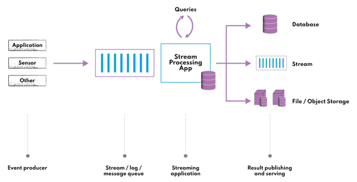
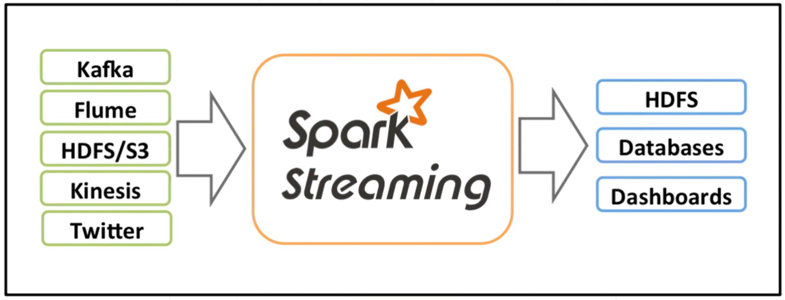
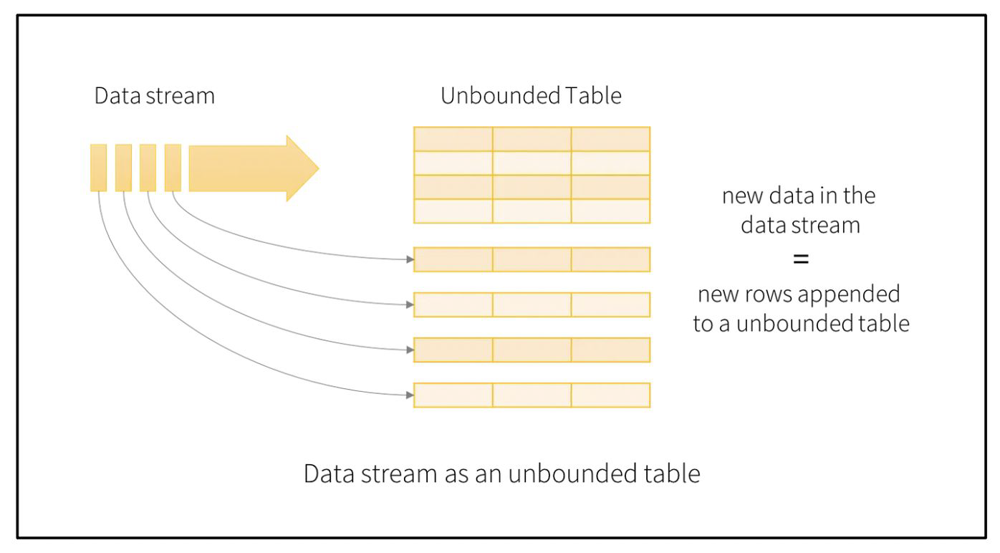
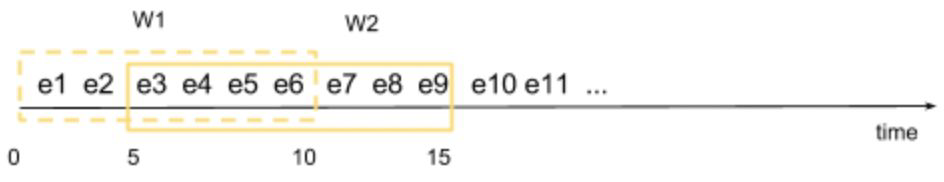
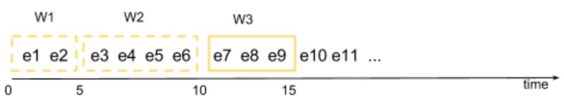

# **What is Stream Processing?** 🌊💻

Stream processing is a **real-time computing method** where data is processed as a **continuous flow** 🌐, rather than in batches. It’s like drinking water from a flowing river 🏞️ instead of collecting it in a bucket and drinking later. Let’s break it down with some fun emojis! 🎉

---

### **Key Features of Stream Processing** 🔑✨

1. **Real-Time Processing** ⏱️  
   - Stream processing acts on data **as it arrives** 🚀, not after it’s stored.  
   - It uses **"event time" processing** ⏳, meaning decisions are made based on the **current data** 📊, not old or stored data.  
   - Example: Detecting fraud 🕵️‍♂️ in a credit card transaction 💳 the moment it happens.  

2. **Continuous and Infinite Data Sets** ♾️📈  
   - Unlike batch processing (where data is collected and processed later 📦), stream processing works on **live, never-ending data streams** 🌊.  
   - Example: Monitoring social media trends 📱🔥 in real-time.  

3. **Fault-Tolerance** 🛡️⚙️  
   - If something goes wrong (like a system crash 💥), stream processing systems **don’t lose progress** 🚫📉.  
   - They have **built-in recovery mechanisms** 🔄 to ensure data integrity.  
   - Example: Apache Kafka 🐘 ensures no data is lost even during failures.  

4. **Statefulness** 🧠📚  
   - Stream processing systems **remember past data** 🗂️ to process current data.  
   - Example: Keeping a **running total** ➕ of sales 🛒 over time.  

5. **Scalability** 📊🚀  
   - Stream processing systems can handle **huge volumes of data** 🌍 and scale seamlessly as data grows.  
   - Example: Processing millions of IoT sensor readings 📡 in real-time.  

6. **Windowing** ⏳🪟  
   - Data is divided into **time-based chunks** (windows) for calculations.  
   - Example: Calculating the **average temperature** 🌡️ over the last 10 minutes.  

---

### **Why is Stream Processing Important?** 🌟  
- **Real-time insights** 🎯: Get actionable insights instantly.  
- **Efficiency** ⚡: No need to wait for batch processing.  
- **Adaptability** 🔄: Perfect for dynamic, fast-changing data environments.  

---

### **Examples of Stream Processing in Action** 🛠️🌍  
1. **Stock Market Analysis** 📈💹  
   - Real-time tracking of stock prices 💰 and trends.  
2. **Social Media Monitoring** 📱🔥  
   - Analyzing hashtags 🏷️ and trends as they happen.  
3. **IoT Devices** 🌐📡  
   - Processing data from smart devices like wearables ⌚ or sensors.  
4. **Fraud Detection** 🕵️‍♂️🚨  
   - Identifying suspicious transactions 💳 in real-time.  

---

### **Stream Processing vs Batch Processing** ⚖️  
| **Aspect**          | **Stream Processing** 🌊 | **Batch Processing** 📦 |  
|----------------------|--------------------------|-------------------------|  
| **Data Handling**    | Continuous flow ♾️       | Collected over time ⏳  |  
| **Latency**          | Low (real-time) ⏱️       | High (delayed) ⏳       |  
| **Use Case**         | Real-time analytics 📊   | Historical analysis 📚  |  

---

### **Popular Stream Processing Frameworks** 🛠️  
- **Apache Kafka** 🐘  
- **Apache Flink** 🐿️  
- **Apache Storm** 🌪️  
- **Amazon Kinesis** 🌊  

---

### **Conclusion** 🎉  
Stream processing is the **future of real-time data analysis** 🚀. It’s fast ⚡, efficient 🔄, and perfect for handling **never-ending data streams** 🌊. Whether it’s tracking social media trends 📱 or monitoring IoT devices 📡, stream processing makes it happen in real-time! 🕒✨  

--- 

Hope this makes your notes more fun and colorful! 🎨📝

<br/>
<br/>

# **What is Stream Processing?** 🌊💻

Stream processing is a **real-time data processing method** where data is processed **as it arrives** 🚀, rather than being stored and processed later in batches. It’s like counting the number of people entering a store 🏪 in real-time, instead of waiting until the end of the day to count them all at once. Let’s dive deeper into this concept with an example! 🎉

---

### **Real-World Example: Tracking Article Views on a News Website** 📰👀

Imagine you run a **popular news website** 🌐, and you want to track the number of views on your articles **in real-time**. Every time someone clicks on an article, it generates a **data event** 🖱️. Instead of waiting to collect all the clicks and processing them later (batch processing), you use **stream processing** to handle this data **as it happens**. Here’s how it works:

---

### **How Stream Processing Works in This Scenario** 🔄📊

1. **Event Generation** 🎯  
   - Every time a user clicks on an article, an **event** is generated.  
   - Example: User clicks on the article **"Top 10 Tech Trends of 2023"** 📱.  
   - This event contains information like:  
     - Article ID 🆔  
     - Timestamp of the click ⏰  
     - User ID (if available) 👤  

2. **Event Sent to Stream Processor** 📨  
   - The event is immediately sent to a **stream processing system** (e.g., Apache Kafka 🐘 or Apache Flink 🐿️).  
   - The stream processor acts as the **brain** 🧠 of the operation, handling the data in real-time.  

3. **Maintaining a Count of Views** 🔢  
   - The stream processor keeps a **running count** of views for each article.  
   - Example:  
     - Article A: 1,000 views 👀  
     - Article B: 500 views 👀  
     - Article C: 200 views 👁️  

4. **Updating the Count** 🔄  
   - When a new event comes in, the stream processor **updates the count** for the relevant article.  
   - Example: If someone clicks on **Article A**, its count increases from **1,000 to 1,001**.  

5. **Real-Time Dashboard** 📊  
   - The updated count is immediately available for use elsewhere in the system.  
   - Example: A **real-time dashboard** 🖥️ shows the **most popular articles** based on the latest view counts.  
   - This dashboard could display:  
     - Trending articles 📈  
     - Articles with the most views 🏆  
     - Articles with the fastest-growing views 🚀  

---

### **Why Use Stream Processing Here?** 🤔✨

1. **Real-Time Insights** ⏱️  
   - You can see which articles are trending **right now** 🕒, not 10 minutes or an hour later.  
   - Example: If a breaking news article 📢 is getting a lot of views, you can highlight it on your homepage immediately.  

2. **Immediate Action** 🚀  
   - You can take **instant actions** based on real-time data.  
   - Example: If an article is getting a lot of views, you can push it to more users via notifications 🔔 or emails 📧.  

3. **No Delays** ⏳  
   - Unlike batch processing, where you wait to collect data before processing it, stream processing gives you **instant results**.  

4. **Scalability** 📈  
   - Stream processing systems can handle **millions of events per second**, making them perfect for high-traffic websites 🌐.  

---

### **Stream Processing vs Batch Processing** ⚖️  

| **Aspect**          | **Stream Processing** 🌊 | **Batch Processing** 📦 |  
|----------------------|--------------------------|-------------------------|  
| **Data Handling**    | Processes data as it arrives 🚀 | Processes data in chunks ⏳ |  
| **Latency**          | Low (real-time) ⏱️       | High (delayed) ⏳       |  
| **Use Case**         | Real-time analytics 📊   | Historical analysis 📚  |  
| **Example**          | Tracking article views 👀 | Generating monthly reports 📅 |  

---

### **Benefits of Stream Processing in This Use Case** 🌟  

1. **Real-Time Popularity Tracking** 📈  
   - Know which articles are trending **right now** 🕒.  
2. **Improved User Experience** 😊  
   - Highlight popular articles on the homepage 🏠 or send personalized recommendations 📨.  
3. **Faster Decision-Making** 🚀  
   - Make quick decisions, like promoting an article on social media 📱 or sending breaking news alerts 🔔.  
4. **Scalability** 🌍  
   - Handle millions of clicks without slowing down ⚡.  

---

### **Popular Stream Processing Frameworks** 🛠️  

Here are some tools you can use to implement stream processing:  
- **Apache Kafka** 🐘: A distributed streaming platform for handling real-time data feeds.  
- **Apache Flink** 🐿️: A framework for stateful computations over data streams.  
- **Apache Storm** 🌪️: A real-time computation system for processing large volumes of data.  
- **Amazon Kinesis** 🌊: A cloud-based service for real-time data processing.  

---

### **Conclusion** 🎉  

Stream processing is a **game-changer** for real-time data analysis. In the context of a news website, it allows you to track article views **as they happen**, enabling you to make **instant decisions** and provide a **better user experience**. Whether it’s highlighting trending articles 📈 or sending breaking news alerts 🔔, stream processing makes it all possible in **real-time**! 🕒✨  

--- 

Hope this explanation helps! Let me know if you need more details. 😊

<br/>
<br/>

# **Explanation of the Diagram: Stream Processing Workflow**


The diagram represents a **stream processing workflow**, which is a system designed to handle and process continuous streams of data in real-time. Here's a detailed breakdown of each component and how they interact:

---

### **1. Event Producer** 🖥️  
- **Role**: Generates data events continuously.  
- **Example**: A user clicking on an article, a sensor sending temperature readings, or a transaction being made on an e-commerce site.  
- **Output**: These events are sent to a **stream/log message system** for further processing.

---

### **2. Stream/Log Message System** 📨  
- **Role**: Acts as a central hub for collecting and storing incoming data streams.  
- **Examples**: Apache Kafka, Amazon Kinesis, or Google Pub/Sub.  
- **Function**:  
  - Receives events from producers.  
  - Stores these events temporarily (in a log or stream).  
  - Ensures data is available for processing by downstream systems.

---

### **3. Stream Processing** ⚙️  
- **Role**: Processes the incoming data streams in real-time.  
- **Examples**: Apache Flink, Apache Storm, or Spark Streaming.  
- **Functions**:  
  - **Real-Time Computation**: Performs calculations, aggregations, or transformations on the data as it arrives.  
  - **State Management**: Maintains state (e.g., running totals, counts) for ongoing computations.  
  - **Windowing**: Breaks data into time-based chunks (e.g., last 5 minutes) for analysis.  
  - **Fault Tolerance**: Ensures data is not lost even if the system fails.  

---

### **4. Result Publishing and Serving** 📤  
- **Role**: Sends the processed results to downstream applications or storage systems.  
- **Examples**:  
  - **Real-Time Dashboards**: Displaying live metrics (e.g., most viewed articles).  
  - **Databases**: Storing processed data for future use.  
  - **Applications**: Triggering actions (e.g., sending alerts or notifications).  

---

### **5. Database** 🗄️  
- **Role**: Stores processed data for long-term use.  
- **Examples**: Relational databases (e.g., MySQL), NoSQL databases (e.g., MongoDB), or data warehouses (e.g., Snowflake).  
- **Function**: Provides a structured way to query and analyze historical data.  

---

### **6. Application** 📱  
- **Role**: Uses the processed data to provide value to end-users.  
- **Examples**:  
  - **Real-Time Dashboards**: Showing live metrics (e.g., website traffic).  
  - **Notifications**: Sending alerts based on real-time events (e.g., fraud detection).  
  - **APIs**: Serving processed data to other systems or applications.  

---

### **7. File/Object Storage** 📂  
- **Role**: Stores raw or processed data in a scalable, durable manner.  
- **Examples**: Amazon S3, Google Cloud Storage, or Azure Blob Storage.  
- **Function**: Used for archiving data, backup, or batch processing.  

---

### **8. Other** 🔄  
- **Role**: Represents additional components or systems that may interact with the stream processing workflow.  
- **Examples**:  
  - **Machine Learning Models**: Using processed data for real-time predictions.  
  - **External APIs**: Integrating with third-party services.  

---

### **How It All Works Together** 🔄  

1. **Event Generation**: Data is generated by event producers (e.g., user clicks, sensor data).  
2. **Stream Collection**: Events are sent to a stream/log message system (e.g., Kafka).  
3. **Real-Time Processing**: The stream processing system (e.g., Flink) processes the data as it arrives.  
4. **Result Publishing**: Processed results are sent to applications, databases, or dashboards.  
5. **Storage**: Raw or processed data is stored in databases or file/object storage for future use.  
6. **Application Use**: Applications use the processed data to provide real-time insights or trigger actions.  

---

### **Key Benefits of This Workflow** 🌟  

1. **Real-Time Insights**: Enables immediate decision-making based on live data.  
2. **Scalability**: Handles large volumes of data with ease.  
3. **Fault Tolerance**: Ensures data is not lost even during system failures.  
4. **Flexibility**: Can be integrated with various systems (databases, applications, storage).  

---

This workflow is widely used in industries like e-commerce, finance, IoT, and social media to process and analyze data in real-time. Let me know if you need further clarification! 😊

<br/>
<br/>

# **Apache Spark Structured Streaming** 🚀

Apache Spark Structured Streaming is a powerful, scalable, and fault-tolerant stream processing engine built on the **Spark SQL engine**. It allows you to process **streaming data** in real-time using the same APIs and concepts as batch processing. Let’s dive into the details! 🎉

---

### **What is Spark Structured Streaming?** 🌊

Spark Structured Streaming is a **high-level API** for processing continuous streams of data. It treats streaming data as a **continuously growing table**, where new data is appended as it arrives. You can write queries on this "table" using **DataFrames and Datasets**, and Spark will automatically update the results as new data comes in.

---

### **Key Features of Spark Structured Streaming** 🔑

1. **Ease of Use** 🛠️  
   - Provides high-level APIs in **Scala, Java, Python, and R**.  
   - Uses **DataFrames and Datasets** for structured data processing, making it easy to write complex streaming queries.  
   - Example: You can write a SQL-like query to filter, aggregate, or join streaming data.  

2. **Event-Time Processing** ⏰  
   - Supports **event-time** (the time when the event actually occurred) instead of just processing time (when the event is processed).  
   - Handles **out-of-order or late-arriving data** gracefully.  
   - Example: Calculate the number of clicks on a website in the last 10 minutes, even if some clicks arrive late.  

3. **Fault Tolerance** 🛡️  
   - Guarantees **end-to-end exactly-once processing** using **checkpointing** and **Write-Ahead Logs (WALs)**.  
   - Ensures that even if a failure occurs, the system will recover and produce the correct results.  
   - Example: If a server crashes, Spark will restart and continue processing from where it left off.  

4. **Integration with Spark Ecosystem** 🔄  
   - Fully integrated with other Spark components like **Spark SQL**, **MLlib**, and **GraphX**.  
   - Enables advanced use cases like **real-time machine learning** and **interactive analytics**.  
   - Example: Apply a pre-trained machine learning model to streaming data for real-time predictions.  

5. **Multiple Data Sources and Sinks** 📥📤  
   - Can read from various data sources like **Kafka**, **Flume**, **Kinesis**, and **TCP sockets**.  
   - Can write outputs to **file systems**, **databases**, or **live dashboards**.  
   - Example: Read data from Kafka, process it, and write the results to a PostgreSQL database.  

6. **Backpressure Handling** ⚙️  
   - Automatically adjusts the data ingestion rate if the system is overwhelmed.  
   - Prevents the system from crashing due to too much data.  
   - Example: If the processing speed is slower than the data arrival rate, Spark will slow down the ingestion.  

7. **Stateful Stream Processing** 🧠  
   - Supports **stateful operations** like `mapGroupsWithState` and `flatMapGroupsWithState`.  
   - Allows you to maintain and update **arbitrary state** across data streams.  
   - Example: Track the session duration of users on a website by maintaining a state for each user.  

---

### **How Spark Structured Streaming Works** 🔄

1. **Input Data Stream** 📥  
   - Data is ingested from sources like Kafka, Kinesis, or files.  
   - Example: A stream of user clicks on a website.  

2. **Query Definition** 📝  
   - Define a query using DataFrames/Datasets to process the data.  
   - Example: Count the number of clicks per user in the last 5 minutes.  

3. **Incremental Execution** ⚡  
   - Spark processes the data **incrementally** as it arrives.  
   - Example: For every new click, Spark updates the count for the relevant user.  

4. **Output Sink** 📤  
   - The results are written to an output sink like a database, file system, or dashboard.  
   - Example: Write the updated click counts to a PostgreSQL table.  

5. **Triggering** ⏱️  
   - You can define **triggers** to control when the results are updated.  
   - Example: Update the results every 1 minute or after every 1000 records.  

---

### **Advantages of Spark Structured Streaming** 🌟

1. **Unified API** 🎯  
   - Use the same API for both batch and streaming data.  
   - Example: Write a DataFrame query that works for both historical and real-time data.  

2. **Scalability** 📈  
   - Handles large volumes of data with ease.  
   - Example: Process millions of events per second.  

3. **Real-Time Insights** 🕒  
   - Enables real-time analytics and decision-making.  
   - Example: Detect fraud in real-time during financial transactions.  

4. **Flexibility** 🔄  
   - Supports a wide range of data sources and sinks.  
   - Example: Read from Kafka, process the data, and write to HDFS.  

---

### **Use Cases of Spark Structured Streaming** 🛠️

1. **Real-Time Analytics** 📊  
   - Example: Track website traffic, user behavior, or ad impressions in real-time.  

2. **Fraud Detection** 🕵️‍♂️  
   - Example: Detect fraudulent transactions as they happen.  

3. **IoT Data Processing** 🌐  
   - Example: Process sensor data from IoT devices in real-time.  

4. **Log Processing** 📝  
   - Example: Analyze server logs to detect anomalies or errors.  

5. **Machine Learning on Streams** 🤖  
   - Example: Apply machine learning models to streaming data for real-time predictions.  

---

### **Conclusion** 🎉

Spark Structured Streaming is a **powerful tool** for real-time data processing. It combines the ease of use of Spark SQL with the scalability and fault tolerance needed for streaming applications. Whether you’re tracking website clicks, detecting fraud, or processing IoT data, Spark Structured Streaming makes it easy to handle **continuous data streams** in real-time! 🚀

<br/>
<br/>

# **Spark Structured Streaming: Components and Workflow** 🚀



The diagram and description outline the **three major components** of Spark Streaming: **Input Sources**, **Streaming Engine**, and **Sinks**. Let’s break down each component and how they work together in detail.

---

### **1. Input Sources** 📥

Input sources are the **data generators** that produce the streaming data. These sources continuously feed data into the Spark Streaming engine. Common input sources include:

- **Kafka**: A distributed streaming platform that handles high-throughput, real-time data feeds.  
  - Example: A stream of user click events from a website.  
- **Flume**: A distributed service for collecting, aggregating, and moving large amounts of log data.  
  - Example: Logs from web servers being sent to Spark for processing.  
- **HDFS/S3**: Distributed file systems (Hadoop Distributed File System) or cloud storage (Amazon S3) that store large datasets.  
  - Example: Reading log files stored in HDFS for real-time analysis.  
- **Kinesis**: Amazon’s real-time data streaming service.  
  - Example: Processing real-time data from IoT devices.  
- **Twitter**: Social media data streams.  
  - Example: Analyzing tweets in real-time for sentiment analysis.  

---

### **2. Streaming Engine** ⚙️

The **Spark Streaming Engine** is the core component that processes the incoming data streams. It is built on the **Spark SQL engine** and provides a high-level API for real-time data processing. Key features of the streaming engine include:

- **Incremental Processing**: Processes data as it arrives, in small batches called **micro-batches**.  
  - Example: Aggregating user clicks every 10 seconds.  
- **Event-Time Processing**: Handles data based on the time the event occurred, not when it was processed.  
  - Example: Calculating the number of clicks in the last 5 minutes, even if some clicks arrive late.  
- **Fault Tolerance**: Ensures **exactly-once processing** using **checkpointing** and **Write-Ahead Logs (WALs)**.  
  - Example: If a server fails, Spark recovers and continues processing without data loss.  
- **Stateful Processing**: Maintains state across data streams for advanced operations.  
  - Example: Tracking user session durations over time.  
- **Backpressure Handling**: Automatically adjusts the data ingestion rate if the system is overwhelmed.  
  - Example: Slowing down data ingestion if processing cannot keep up with the incoming data rate.  

---

### **3. Sinks** 📤

Sinks are the **destinations** where the processed data is stored or sent for further use. Common sinks include:

- **HDFS**: Hadoop Distributed File System for storing large volumes of processed data.  
  - Example: Storing aggregated log data for future analysis.  
- **Databases**: Relational databases (e.g., MySQL, PostgreSQL) or NoSQL databases (e.g., MongoDB, Cassandra).  
  - Example: Storing real-time analytics results in a PostgreSQL database.  
- **Dashboards**: Real-time visualization tools for displaying processed data.  
  - Example: Showing live metrics (e.g., website traffic) on a dashboard like Grafana or Tableau.  

---

### **How It All Works Together** 🔄

1. **Data Ingestion** 📥  
   - Data is generated by input sources like Kafka, Flume, or Twitter.  
   - Example: A stream of user clicks from a website is sent to Kafka.  

2. **Stream Processing** ⚙️  
   - The Spark Streaming Engine processes the data in real-time.  
   - Example: Aggregating the number of clicks per user in the last 10 minutes.  

3. **Result Storage** 📤  
   - The processed data is sent to sinks like HDFS, databases, or dashboards.  
   - Example: Writing the aggregated click counts to a PostgreSQL database or displaying them on a live dashboard.  

---

### **Key Benefits of Spark Structured Streaming** 🌟

1. **Real-Time Processing** ⏱️  
   - Enables real-time analytics and decision-making.  
   - Example: Detecting fraud in financial transactions as they happen.  

2. **Scalability** 📈  
   - Handles large volumes of data with ease.  
   - Example: Processing millions of events per second from IoT devices.  

3. **Fault Tolerance** 🛡️  
   - Ensures data is not lost even during system failures.  
   - Example: Recovering from a server crash without losing any data.  

4. **Ease of Use** 🛠️  
   - Provides high-level APIs in Scala, Java, Python, and R.  
   - Example: Writing SQL-like queries for streaming data.  

5. **Integration** 🔄  
   - Works seamlessly with other Spark components like Spark SQL and MLlib.  
   - Example: Applying machine learning models to streaming data.  

---

### **Use Cases of Spark Structured Streaming** 🛠️

1. **Real-Time Analytics** 📊  
   - Example: Tracking website traffic or user behavior in real-time.  

2. **Fraud Detection** 🕵️‍♂️  
   - Example: Identifying fraudulent transactions as they occur.  

3. **IoT Data Processing** 🌐  
   - Example: Processing sensor data from IoT devices in real-time.  

4. **Log Processing** 📝  
   - Example: Analyzing server logs to detect anomalies or errors.  

5. **Social Media Analysis** 📱  
   - Example: Analyzing tweets in real-time for sentiment analysis.  

---

### **Conclusion** 🎉

Spark Structured Streaming is a **powerful and flexible** tool for real-time data processing. It combines **ease of use**, **scalability**, and **fault tolerance** to handle continuous data streams efficiently. Whether you’re analyzing website clicks, detecting fraud, or processing IoT data, Spark Structured Streaming provides the tools you need to process and analyze data in real-time! 🚀

<br/>
<br/>

# **Conceptualizing Spark Streaming Data as an Unbounded Table** 🚀



The idea of treating a **data stream** as an **unbounded table** is a powerful abstraction in Spark Structured Streaming. Let’s break down this concept and how it works in detail.

---

### **1. Data Stream as an Unbounded Table** 📊

In Spark Structured Streaming, a **data stream** is treated as a **continuously growing table**. Here’s how this abstraction works:

- **Unbounded Table**: Imagine a table that never ends. New rows are constantly appended to it as new data arrives.  
  - Example: A stream of user clicks on a website can be thought of as a table where each click is a new row.  

- **New Data = New Rows**: Every new piece of data in the stream is treated as a new row appended to this unbounded table.  
  - Example: If a user clicks on an article, a new row is added to the table with details like `user_id`, `article_id`, and `timestamp`.  

---

### **2. Micro-Batch Processing** ⚙️

Spark processes the data in **micro-batches**, which are small chunks of data processed at regular intervals. Here’s how it works:

- **Triggers**: You can define **triggers** to control how often Spark processes the data.  
  - Example: If you set a trigger interval of **1 second**, Spark will create a new micro-batch every second and process the data that arrived during that interval.  

- **Incremental Processing**: Instead of processing the entire table (which is unbounded and infinite), Spark processes only the **new rows** added since the last micro-batch.  
  - Example: If 100 new clicks occurred in the last second, Spark will process only those 100 clicks in the next micro-batch.  

---

### **3. How It Works in Practice** 🔄

Let’s walk through an example to understand this better:

1. **Data Ingestion** 📥  
   - A stream of user clicks is generated continuously.  
   - Example: Clicks on articles on a news website.  

2. **Unbounded Table** 📊  
   - Each click is treated as a new row in an unbounded table.  
   - Example:  
     - Row 1: `user_id=1, article_id=101, timestamp=10:00:00`  
     - Row 2: `user_id=2, article_id=102, timestamp=10:00:01`  
     - Row 3: `user_id=3, article_id=101, timestamp=10:00:02`  

3. **Micro-Batch Processing** ⚙️  
   - Spark processes the data in micro-batches based on the trigger interval.  
   - Example: If the trigger interval is **1 second**, Spark will:  
     - At **10:00:01**, process Row 1.  
     - At **10:00:02**, process Row 2.  
     - At **10:00:03**, process Row 3.  

4. **Result Update** 📤  
   - The results of the processing are updated incrementally.  
   - Example: If you’re counting the number of clicks per article, the count will be updated after each micro-batch.  

---

### **Key Benefits of This Abstraction** 🌟

1. **Simplicity** 🎯  
   - Treating a stream as a table makes it easy to use familiar SQL-like queries for processing.  
   - Example: You can write a query like `SELECT article_id, COUNT(*) FROM clicks GROUP BY article_id` to count clicks per article.  

2. **Incremental Processing** ⚡  
   - Only new data is processed in each micro-batch, making the system efficient.  
   - Example: Instead of reprocessing all historical data, Spark processes only the new clicks in the last second.  

3. **Real-Time Insights** 🕒  
   - Enables real-time analytics and decision-making.  
   - Example: You can see the most popular articles on your website in real-time.  

4. **Scalability** 📈  
   - Handles large volumes of data with ease.  
   - Example: Millions of clicks can be processed per second.  

---

### **Example Use Case: Real-Time Click Analytics** 📊

Let’s say you want to track the number of clicks per article on a news website in real-time. Here’s how Spark Structured Streaming can help:

1. **Data Stream**: A stream of user clicks is generated.  
2. **Unbounded Table**: Each click is added as a new row in the table.  
3. **Query**: You write a query to count clicks per article:  
   ```sql
   SELECT article_id, COUNT(*) as click_count 
   FROM clicks 
   GROUP BY article_id
   ```  
4. **Micro-Batch Processing**: Spark processes the clicks in 1-second micro-batches.  
5. **Result**: The click counts are updated in real-time and can be displayed on a dashboard.  

---

### **Conclusion** 🎉

The concept of treating a **data stream** as an **unbounded table** is a powerful abstraction in Spark Structured Streaming. It simplifies real-time data processing by allowing you to use familiar SQL-like queries and process data incrementally in micro-batches. Whether you’re tracking website clicks, analyzing sensor data, or detecting fraud, this approach makes it easy to handle continuous data streams efficiently! 🚀

<br/>
<br/>

# **Word Count Example in Spark Structured Streaming** 🚀

The provided code and explanation demonstrate how to perform a **word count** using **Spark Structured Streaming**. Let’s break it down step by step to understand how it works.

---

### **1. Setting Up the SparkSession** 🛠️

The first step is to create a **SparkSession**, which is the entry point to using Spark.

```python
from pyspark.sql import SparkSession

# Create a SparkSession
spark = SparkSession \
    .builder \
    .appName("StructuredNetworkWordCount") \
    .getOrCreate()
```

- **SparkSession**: This is the entry point for programming with Spark. It allows you to create DataFrames and execute SQL queries.
- **appName**: Sets the name of the application, which will appear in the Spark UI.
- **getOrCreate()**: Creates a new SparkSession or reuses an existing one.

---

### **2. Creating a Streaming DataFrame** 📥

Next, we create a **streaming DataFrame** that represents the input data stream. In this example, the data source is a **socket** listening on `localhost:9999`.

```python
# Create DataFrame representing the stream of input lines from connection to localhost:9999
lines = spark \
    .readStream \
    .format("socket") \
    .option("host", "localhost") \
    .option("port", 9999) \
    .load()
```

- **readStream**: Indicates that we are reading a streaming data source.
- **format("socket")**: Specifies that the data source is a socket.
- **option("host", "localhost")**: Sets the host to `localhost`.
- **option("port", 9999)**: Sets the port to `9999`.
- **load()**: Loads the data into a DataFrame.

This DataFrame (`lines`) represents an **unbounded table** where each row corresponds to a line of text received from the socket.

---

### **3. Splitting Lines into Words** 🔪

The next step is to split each line into individual words. This is done using the `split` and `explode` functions.

```python
from pyspark.sql.functions import explode, split

# Split the lines into words
words = lines.select(
    explode(
        split(lines.value, " ")
    ).alias("word")
)
```

- **split(lines.value, " ")**: Splits each line (stored in the `value` column) into an array of words based on spaces.
- **explode**: Converts the array of words into individual rows, each containing a single word.
- **alias("word")**: Renames the column to `word`.

The resulting DataFrame (`words`) contains a single column (`word`), where each row is a word from the input stream.

---

### **4. Counting Words** 🔢

Now, we group the words and count their occurrences using the `groupBy` and `count` functions.

```python
# Generate running word count
wordCounts = words.groupBy("word").count()
```

- **groupBy("word")**: Groups the DataFrame by the `word` column.
- **count()**: Counts the number of occurrences of each word.

The resulting DataFrame (`wordCounts`) contains two columns: `word` and `count`.

---

### **5. Starting the Streaming Query** 🚀

Finally, we start the streaming query to process the data and output the results.

```python
# Start running the query that prints the running counts to the console
query = wordCounts \
    .writeStream \
    .outputMode("complete") \
    .format("console") \
    .start()

query.awaitTermination()
```

- **writeStream**: Indicates that we are writing the output of the streaming query.
- **outputMode("complete")**: Specifies that the complete result table should be outputted every time.
- **format("console")**: Writes the output to the console.
- **start()**: Starts the streaming query.
- **awaitTermination()**: Waits for the query to terminate (e.g., when the user stops it).

---

### **How It Works Under the Hood** 🔄

1. **Input Table**: The streaming data is treated as an **unbounded table** where new rows (lines of text) are continuously appended.
2. **Micro-Batch Processing**: Spark processes the data in **micro-batches** based on the trigger interval. For example, if the trigger interval is 1 second, Spark will process all the data received in the last second.
3. **Result Table**: The result of the aggregation (word count) is computed for each micro-batch and stored in a **result table**.
4. **Output**: The result table is written to the console (or any other sink) after each micro-batch.

---

### **Key Concepts** 🔑

1. **Unbounded Table**: The input data stream is treated as a continuously growing table.
2. **Micro-Batch Processing**: Data is processed in small batches at regular intervals.
3. **Stateful Processing**: The system maintains state (e.g., word counts) across micro-batches.
4. **Fault Tolerance**: Spark ensures **exactly-once processing** using checkpointing and Write-Ahead Logs (WALs).

---

### **Example Output** 📤

If the input stream contains the following lines:

```
hello world
hello spark
spark streaming
```

The output might look like this:

```
Batch: 1
+-----+-----+
| word|count|
+-----+-----+
|hello|    2|
|world|    1|
|spark|    2|
|streaming|1|
+-----+-----+
```

---

### **Conclusion** 🎉

This example demonstrates how to use **Spark Structured Streaming** to perform a **word count** on a stream of text data. By treating the data stream as an **unbounded table** and processing it in **micro-batches**, Spark enables real-time analytics with ease and efficiency. Whether you’re counting words, analyzing logs, or processing sensor data, Spark Structured Streaming provides a powerful and flexible framework for real-time data processing! 🚀

<br/>
<br/>

# **Output Modes in Spark Structured Streaming** 🚀

In Spark Structured Streaming, **output modes** define **what data** is written to the sink (e.g., console, database, file system) after each trigger interval. There are **three output modes**: **Complete**, **Append**, and **Update**. Let’s dive deep into each mode with examples and explanations.

---

### **1. Complete Mode** 📊

#### **What It Does**:
- In **Complete Mode**, the **entire updated Result Table** is written to the sink after every trigger.  
- This mode is typically used for **aggregations** where the result is expected to be small, such as counts, sums, or averages.

#### **Example**:
Let’s consider a streaming job that counts the occurrences of each number in a stream of integers.

- **Batch 1**:  
  - Input: `[1, 2, 2, 3, 3, 3]`  
  - Output (running count): `[(1, 1), (2, 2), (3, 3)]`  

- **Batch 2**:  
  - Input: `[1, 2, 2, 4]`  
  - Output (running count): `[(1, 2), (2, 4), (3, 3), (4, 1)]`  

#### **Behavior in Complete Mode**:
- After **Batch 1**, the entire Result Table `[(1, 1), (2, 2), (3, 3)]` is written to the sink.  
- After **Batch 2**, the entire updated Result Table `[(1, 2), (2, 4), (3, 3), (4, 1)]` is written to the sink.  

#### **When to Use**:
- Use **Complete Mode** when you need the **full snapshot** of the Result Table after every trigger.  
- Example: Real-time dashboards showing **total counts** or **aggregated metrics**.

---

### **2. Append Mode** ➕

#### **What It Does**:
- In **Append Mode**, only the **new rows** appended to the Result Table since the last trigger are written to the sink.  
- This mode is suitable for use cases where the Result Table is **growing incrementally** (e.g., appending new rows without updating existing ones).

#### **Example**:
Using the same streaming job as above:

- **Batch 1**:  
  - Input: `[1, 2, 2, 3, 3, 3]`  
  - Output (running count): `[(1, 1), (2, 2), (3, 3)]`  

- **Batch 2**:  
  - Input: `[1, 2, 2, 4]`  
  - Output (running count): `[(1, 2), (2, 4), (3, 3), (4, 1)]`  

#### **Behavior in Append Mode**:
- After **Batch 1**, the entire Result Table `[(1, 1), (2, 2), (3, 3)]` is written to the sink (since all rows are new).  
- After **Batch 2**, only the **new row** `[(4, 1)]` is written to the sink. The updated counts for `1` and `2` are **not written** because they are updates to existing rows, not new rows.

#### **When to Use**:
- Use **Append Mode** when you only care about **new data** being added to the Result Table.  
- Example: Logging new events or appending data to a file.

---

### **3. Update Mode** 🔄

#### **What It Does**:
- In **Update Mode**, only the **rows that were updated** in the Result Table since the last trigger are written to the sink.  
- This mode is a **middle ground** between Complete and Append modes, as it provides a view of **what has changed** in the Result Table.

#### **Example**:
Using the same streaming job as above:

- **Batch 1**:  
  - Input: `[1, 2, 2, 3, 3, 3]`  
  - Output (running count): `[(1, 1), (2, 2), (3, 3)]`  

- **Batch 2**:  
  - Input: `[1, 2, 2, 4]`  
  - Output (running count): `[(1, 2), (2, 4), (3, 3), (4, 1)]`  

#### **Behavior in Update Mode**:
- After **Batch 1**, the entire Result Table `[(1, 1), (2, 2), (3, 3)]` is written to the sink (since all rows are new).  
- After **Batch 2**, the **updated rows** `[(1, 2), (2, 4)]` and the **new row** `[(4, 1)]` are written to the sink. The unchanged row `(3, 3)` is **not written**.

#### **When to Use**:
- Use **Update Mode** when you want to track **changes** in the Result Table (e.g., updated counts or metrics).  
- Example: Real-time dashboards showing **changes in metrics** or **updated records**.

---

### **Comparison of Output Modes** ⚖️

| **Output Mode** | **What’s Written to Sink**                     | **Use Case**                                                                 |
|------------------|-----------------------------------------------|------------------------------------------------------------------------------|
| **Complete**     | Entire Result Table                           | Aggregations (e.g., counts, sums) where the result is small.                |
| **Append**       | Only new rows appended to the Result Table    | Incrementally growing Result Tables (e.g., logging new events).              |
| **Update**       | Only rows updated in the Result Table         | Tracking changes in the Result Table (e.g., updated counts or metrics).      |

---

### **Key Takeaways** 🎯

1. **Complete Mode**:  
   - Provides a **full snapshot** of the Result Table after every trigger.  
   - Best for **small aggregations** like counts or sums.  

2. **Append Mode**:  
   - Writes only **new rows** appended to the Result Table.  
   - Ideal for **incrementally growing** Result Tables (e.g., logging).  

3. **Update Mode**:  
   - Writes only **updated rows** in the Result Table.  
   - Perfect for tracking **changes** in the Result Table (e.g., updated metrics).  

---

### **Conclusion** 🎉

Understanding **output modes** in Spark Structured Streaming is crucial for designing efficient and effective real-time data processing pipelines. Whether you need a **full snapshot**, **new rows**, or **updated rows**, Spark provides the flexibility to choose the right output mode for your use case. By selecting the appropriate mode, you can optimize performance and ensure that your streaming applications meet their requirements! 🚀

<br/>
<br/>

# **Memory Management in Spark Structured Streaming** 🚀

When working with **unbounded tables** in Spark Structured Streaming, memory management is a critical concern. Since the data stream is theoretically infinite, storing all data indefinitely would lead to **memory issues**. Spark addresses this challenge through a combination of techniques, depending on whether the operations are **stateless** or **stateful**. Let’s break this down in detail.

---

### **1. Unbounded Table and Memory Concerns** 🧠

- **Unbounded Table**: Spark treats a data stream as an **unbounded table**, where new rows are continuously appended.  
- **Memory Issue**: If all data were stored indefinitely, memory usage would grow infinitely, leading to **out-of-memory errors**.  

To avoid this, Spark uses different strategies for **stateless** and **stateful** operations.

---

### **2. Stateless Operations** 🔄

#### **What Are Stateless Operations?**  
- Stateless operations process each record **independently** of other records.  
- Examples: `map`, `filter`, `flatMap`.  

#### **How Spark Handles Memory for Stateless Operations**:
- Once a record is processed, Spark **frees up the memory** used by that record.  
- No historical data is retained, as the processing of one record does not depend on others.  

#### **Example**:
```python
# Stateless operation: Filtering
filtered_stream = stream.filter(stream.value > 10)
```
- Each record is processed independently, and memory is freed after processing.

---

### **3. Stateful Operations** 🧠

#### **What Are Stateful Operations?**  
- Stateful operations process records in a way that depends on **previous records**.  
- Examples: Aggregations (`count`, `sum`), windowed computations, and custom stateful transformations.  

#### **How Spark Handles Memory for Stateful Operations**:
Spark uses several techniques to manage memory for stateful operations:

---

#### **a. Incremental Updates** 🔄  
- For many stateful operations, Spark maintains a **running state** that is updated incrementally as new data arrives.  
- Instead of storing all raw data, Spark stores only the **aggregated state**.  

#### **Example**:
- **Word Count**: Spark maintains a running count for each word.  
  - Input: `["hello", "world", "hello"]`  
  - State: `{"hello": 2, "world": 1}`  
  - Memory Usage: Only the counts are stored, not the raw words.  

---

#### **b. Watermarking** 🌊  
- Watermarking is used for **windowed computations** and handling **late-arriving data**.  
- A **watermark** is a threshold in **event-time** that determines how long Spark should wait for late data.  
- Any data older than the watermark is considered **"too late"** and is **dropped**.  

#### **Example**:
- Suppose the watermark is set to **10 minutes**.  
- If the current event-time is `12:00`, any data with an event-time earlier than `11:50` will be dropped.  
- This limits the amount of historical data Spark needs to retain.  

#### **Code Example**:
```python
# Define a watermark
windowed_counts = stream \
    .withWatermark("eventTime", "10 minutes") \
    .groupBy(window("eventTime", "5 minutes")) \
    .count()
```
- Spark will only retain data within the **10-minute watermark**.

---

#### **c. State Expiration** ⏳  
- For **arbitrary stateful operations**, Spark allows you to specify a **time-to-live (TTL)** for the state data.  
- Any state data that has not been updated for the specified TTL is **cleared**.  

#### **Example**:
- Suppose you are tracking user sessions, and you set a TTL of **30 minutes**.  
- If a user’s session is inactive for 30 minutes, the state for that session is **cleared**.  

#### **Code Example**:
```python
# Define state TTL
stream \
    .groupByKey(...) \
    .mapGroupsWithState(GroupStateTimeout.ProcessingTimeTimeout) { ... }
```
- The state will expire after the specified timeout.

---

### **4. Memory Management in Action** 🔄

Let’s walk through an example to see how Spark manages memory for stateful operations:

#### **Scenario**:
- You are tracking the **number of clicks per user** on a website in real-time.  
- The data stream contains user click events: `(user_id, timestamp)`.  

#### **Steps**:
1. **Incremental Updates**:  
   - Spark maintains a running count of clicks for each user.  
   - Example:  
     - Input: `[(1, 10:00), (2, 10:01), (1, 10:02)]`  
     - State: `{1: 2, 2: 1}`  

2. **Watermarking**:  
   - Suppose the watermark is set to **5 minutes**.  
   - If the current event-time is `10:10`, any data older than `10:05` is dropped.  
   - Example:  
     - Input: `[(1, 10:03), (2, 10:06), (1, 10:07)]`  
     - Data older than `10:05` (e.g., `(1, 10:03)`) is dropped.  

3. **State Expiration**:  
   - Suppose the TTL for user sessions is **30 minutes**.  
   - If a user is inactive for 30 minutes, their state is cleared.  
   - Example:  
     - If user `1` has no clicks after `10:00`, their state is cleared at `10:30`.  

---

### **Key Takeaways** 🎯

1. **Stateless Operations**:  
   - Memory is freed after processing each record.  
   - No historical data is retained.  

2. **Stateful Operations**:  
   - **Incremental Updates**: Only aggregated state is stored, not raw data.  
   - **Watermarking**: Limits the amount of historical data retained for windowed computations.  
   - **State Expiration**: Clears state data that has not been updated for a specified TTL.  

---

### **Conclusion** 🎉

Spark Structured Streaming effectively manages memory for **unbounded tables** by using techniques like **incremental updates**, **watermarking**, and **state expiration**. These strategies ensure that Spark can handle **stateful operations** efficiently without running into memory issues, even for long-running streams with large volumes of data. By understanding these mechanisms, you can design streaming applications that are both **scalable** and **memory-efficient**! 🚀

<br/>
<br/>

# **Handling Memory Issues in Spark Structured Streaming** 🚀

When performing **stateful operations** like aggregations in Spark Structured Streaming, maintaining state can lead to **memory issues** if not managed properly. Here’s a detailed explanation of how to handle memory full scenarios and optimize your streaming application.

---

### **1. Scaling Horizontally** 📈

#### **What It Means**:
- Add more **worker nodes** to your Spark cluster to increase the total memory available for state maintenance.  
- This distributes the state across multiple nodes, reducing the memory burden on any single node.  

#### **How It Helps**:
- More nodes = more memory and processing power.  
- Example: If your current cluster has 4 nodes with 16GB RAM each, adding 4 more nodes increases the total memory to 128GB.  

#### **When to Use**:
- Use this approach when your state size grows beyond the memory capacity of your current cluster.  

---

### **2. State Expiration** ⏳

#### **What It Means**:
- Define a **timeout** after which the state for old keys is removed.  
- This is done using the `mapGroupsWithState` operation, which allows you to specify a **time-to-live (TTL)** for the state.  

#### **How It Helps**:
- Clears state for keys that haven’t been updated for a specified period, freeing up memory.  
- Example: If a user hasn’t clicked on your website for 30 minutes, their session state is cleared.  

#### **Code Example**:
```python
# Define state expiration using mapGroupsWithState
stream \
    .groupByKey(...) \
    .mapGroupsWithState(GroupStateTimeout.ProcessingTimeTimeout) { ... }
```

#### **When to Use**:
- Use this when your use case allows for state to expire after a certain period of inactivity.  

---

### **3. Optimize Aggregations** 🔢

#### **What It Means**:
- Use **built-in aggregations** that maintain a small state, such as `count`, `sum`, or `average`.  
- Alternatively, use **approximate data structures** like **HyperLogLog** (for unique counts) or **t-digest** (for median), which use fixed memory.  

#### **How It Helps**:
- Reduces the memory footprint of state maintenance.  
- Example: Use HyperLogLog to estimate the number of unique users instead of storing each user’s ID.  

#### **When to Use**:
- Use this when exact results are not required, and approximate results are acceptable.  

---

### **4. State Store Compression** 🗜️

#### **What It Means**:
- Compress the state data to reduce its memory footprint.  
- Spark supports compression codecs like **lz4**, **lzf**, **snappy**, and **zstd**.  

#### **How It Helps**:
- Reduces the amount of memory used by the state store.  
- Example: Enable compression by setting the configuration:  
  ```bash
  spark.sql.streaming.stateStore.compression.codec=lz4
  ```

#### **When to Use**:
- Use this when the state size is large, and you want to reduce memory usage without losing data.  

---

### **5. Increase Memory Overcommit** 💾

#### **What It Means**:
- Overcommit allows the operating system to allocate more memory to processes than the physical memory available.  
- This can be enabled by setting the `spark.memory.overcommit.enabled` configuration to `true`.  

#### **How It Helps**:
- Allows Spark to use more memory for tasks, but be cautious as it may lead to **out-of-memory errors**.  

#### **When to Use**:
- Use this as a temporary solution when you need to handle a spike in memory usage.  

---

### **6. Checkpointing** ✅

#### **What It Means**:
- Periodically save the state of a stream to a reliable storage system (e.g., HDFS, S3).  
- This provides **fault tolerance** but does not directly solve memory issues.  

#### **How It Helps**:
- If your job fails due to memory issues, it can be restarted from the last checkpoint.  
- Example: Enable checkpointing by specifying a checkpoint directory:  
  ```python
  query = stream \
      .writeStream \
      .format("console") \
      .option("checkpointLocation", "/path/to/checkpoint") \
      .start()
  ```

#### **When to Use**:
- Use this to ensure fault tolerance and recoverability in case of failures.  

---

### **7. Optimize for Network Traffic** 🌐

#### **What It Means**:
- Reduce the amount of network traffic generated by your streaming job.  
- This can be done by **decreasing the batch interval** or **repartitioning your data**.  

#### **How It Helps**:
- Reduces memory usage by minimizing the amount of data shuffled across the network.  
- Example: Repartition your data to reduce the number of partitions and thus the network traffic.  

#### **When to Use**:
- Use this when your job generates a large amount of network traffic, which can also consume significant memory.  

---

### **Summary of Solutions** 📝

| **Solution**               | **How It Helps**                                                                 | **When to Use**                                                                 |
|----------------------------|----------------------------------------------------------------------------------|---------------------------------------------------------------------------------|
| **Scaling Horizontally**    | Adds more memory and processing power by adding worker nodes.                     | When state size exceeds current cluster memory.                                  |
| **State Expiration**        | Clears state for inactive keys, freeing up memory.                                | When state can expire after a period of inactivity.                              |
| **Optimize Aggregations**   | Uses approximate data structures or built-in aggregations to reduce memory usage. | When approximate results are acceptable.                                         |
| **State Store Compression** | Compresses state data to reduce memory footprint.                                 | When state size is large, and you want to reduce memory usage.                   |
| **Increase Memory Overcommit** | Allows Spark to use more memory than physically available.                     | As a temporary solution for handling memory spikes.                              |
| **Checkpointing**           | Provides fault tolerance by saving state periodically.                            | To ensure recoverability in case of failures.                                    |
| **Optimize Network Traffic** | Reduces memory usage by minimizing network traffic.                              | When your job generates a large amount of network traffic.                       |

---

### **Conclusion** 🎉

Handling memory issues in Spark Structured Streaming requires a combination of **scaling**, **optimization**, and **configuration**. By using techniques like **state expiration**, **compression**, and **checkpointing**, you can ensure that your streaming application remains **scalable** and **memory-efficient**. Additionally, optimizing aggregations and network traffic can further reduce memory usage, allowing you to process large volumes of data without running into memory issues. 🚀

<br/>
<br/>

# **Comparison: DStreams vs. Spark Structured Streaming** 🚀

The table provides a detailed comparison between **DStreams** (Spark Streaming) and **Spark Structured Streaming**. Let’s break down each feature and explain the differences in detail.

---

### **1. API Level** 🛠️

#### **DStreams**:
- **Low-Level API**: Built on **RDDs (Resilient Distributed Datasets)**, which are the foundational data structure in Spark.  
- **Complexity**: Requires a deeper understanding of **transformations** and **actions** on RDDs.  
- **Example**:  
  ```python
  lines = ssc.socketTextStream("localhost", 9999)
  words = lines.flatMap(lambda line: line.split(" "))
  pairs = words.map(lambda word: (word, 1))
  wordCounts = pairs.reduceByKey(lambda x, y: x + y)
  wordCounts.pprint()
  ```

#### **Spark Structured Streaming**:
- **High-Level API**: Built on **DataFrames and Datasets**, which provide a higher-level abstraction.  
- **Ease of Use**: Offers **SQL-like operations**, making it easier to write and understand queries.  
- **Example**:  
  ```python
  lines = spark \
      .readStream \
      .format("socket") \
      .option("host", "localhost") \
      .option("port", 9999) \
      .load()
  words = lines.select(explode(split(lines.value, " ")).alias("word")
  wordCounts = words.groupBy("word").count()
  query = wordCounts.writeStream.format("console").start()
  query.awaitTermination()
  ```

#### **Key Difference**:
- **DStreams** require more manual coding and understanding of RDD operations.  
- **Structured Streaming** simplifies development with SQL-like syntax and DataFrame/Dataset APIs.

---

### **2. Processing Type** ⚙️

#### **DStreams**:
- **Micro-Batch Processing**: Processes data in small batches at regular intervals.  
- **Latency**: Higher latency due to the micro-batch model.  

#### **Spark Structured Streaming**:
- **Both Continuous and Micro-Batch Processing**: Supports both models, allowing for lower latency.  
- **Latency**: Lower end-to-end latency, especially in continuous processing mode.  

#### **Key Difference**:
- **DStreams** are limited to micro-batch processing, which can introduce higher latency.  
- **Structured Streaming** offers more flexibility with both micro-batch and continuous processing.

---

### **3. Operation Style** 🧩

#### **DStreams**:
- **Transformations and Actions**: Requires explicit use of RDD transformations (e.g., `map`, `reduceByKey`) and actions (e.g., `pprint`).  
- **Complexity**: More complex and verbose code.  

#### **Spark Structured Streaming**:
- **SQL-Like Operations**: Allows for declarative SQL-like queries on DataFrames/Datasets.  
- **Simplicity**: Easier to write and maintain code.  

#### **Key Difference**:
- **DStreams** require more manual coding and understanding of RDD operations.  
- **Structured Streaming** simplifies development with SQL-like syntax and DataFrame/Dataset APIs.

---

### **4. Late Data Handling** ⏳

#### **DStreams**:
- **Not as Efficient**: Handling late-arriving data is more challenging and less efficient.  

#### **Spark Structured Streaming**:
- **Graceful Handling**: Uses **watermarking** to handle late-arriving data gracefully.  
- **Example**:  
  ```python
  windowedCounts = words \
      .withWatermark("timestamp", "10 minutes") \
      .groupBy(window("timestamp", "5 minutes")) \
      .count()
  ```

#### **Key Difference**:
- **DStreams** lack built-in mechanisms for handling late data efficiently.  
- **Structured Streaming** provides robust support for late data through watermarking.

---

### **5. Processing Model** 🔄

#### **DStreams**:
- **Micro-Batch Model**: Each micro-batch results in an RDD, which is processed independently.  
- **Latency**: Higher end-to-end latency due to the micro-batch model.  

#### **Spark Structured Streaming**:
- **Efficient Model**: Processes data more efficiently, leading to lower end-to-end latency.  
- **Flexibility**: Supports both micro-batch and continuous processing.  

#### **Key Difference**:
- **DStreams** have higher latency due to the micro-batch model.  
- **Structured Streaming** offers lower latency and more flexibility.

---

### **6. Data Sources and Sinks** 📥📤

#### **DStreams**:
- **Limited Support**: Supports fewer data sources and sinks.  
- **Example**: Kafka, Flume, HDFS, and sockets.  

#### **Spark Structured Streaming**:
- **Wide Variety**: Supports a wider range of data sources and sinks.  
- **Example**: Kafka, Kinesis, HDFS, S3, JDBC, and more.  

#### **Key Difference**:
- **DStreams** have limited options for data sources and sinks.  
- **Structured Streaming** provides extensive support for various data sources and sinks.

---

### **Summary of Differences** 📝

| **Feature**               | **DStreams**                                      | **Spark Structured Streaming**                          |
|---------------------------|---------------------------------------------------|--------------------------------------------------------|
| **API Level**              | Low-level (RDDs)                                  | High-level (DataFrames/Datasets)                       |
| **Processing Type**        | Micro-Batch Processing                            | Both Continuous and Micro-Batch Processing             |
| **Operation Style**        | Requires understanding of Transformations/Actions | SQL-like operations                                    |
| **Late Data Handling**     | Not as efficient                                  | Handles gracefully with watermarking                   |
| **Processing Model**       | Higher latency                                    | Lower end-to-end latency                               |
| **Data Sources and Sinks** | Fewer options                                     | Wide variety of sources and sinks                      |

---

### **Conclusion** 🎉

**Spark Structured Streaming** offers significant advantages over **DStreams** in terms of **ease of use**, **flexibility**, and **performance**. With its high-level API, support for both micro-batch and continuous processing, and robust handling of late data, Structured Streaming is the preferred choice for modern stream processing applications. Whether you’re building real-time analytics, monitoring systems, or event-driven applications, Structured Streaming provides the tools you need to process data efficiently and effectively! 🚀

<br/>
<br/>

# **File Source in Spark Structured Streaming** 🚀

Spark Structured Streaming allows you to process files as they arrive in a directory. This is particularly useful for scenarios where data is continuously being written to files, such as log files, sensor data, or event logs. Let’s break down how this works in detail.

---

### **1. Monitoring a Directory for New Files** 📂

#### **How It Works**:
- Spark Structured Streaming can **monitor a directory** for new files using the `readStream` method.  
- It processes **only new files** that are added to the directory after the streaming computation starts.  
- Files that are already present in the directory or modified after the streaming starts are **not processed**.  

#### **Example**:
Suppose you have a directory `/data/stream` where new JSON files are added periodically. You can set up a streaming query to process these files as they arrive.

```python
from pyspark.sql import SparkSession

# Create a SparkSession
spark = SparkSession.builder.appName("FileStreamExample").getOrCreate()

# Define the schema for the JSON files
schema = "userId STRING, timestamp TIMESTAMP"

# Read new files from the directory
stream = spark \
    .readStream \
    .schema(schema) \
    .json("/data/stream")

# Perform some transformations (e.g., count users)
userCounts = stream.groupBy("userId").count()

# Start the streaming query
query = userCounts \
    .writeStream \
    .outputMode("complete") \
    .format("console") \
    .start()

query.awaitTermination()
```

---

### **2. Key Points to Remember** 🔑

#### **a. New Files Only**:
- Spark processes **only new files** added to the directory after the streaming query starts.  
- Files already present in the directory or modified after the streaming starts are **ignored**.  

#### **b. Atomic Files**:
- It is recommended to **move or copy** files atomically into the directory.  
- This ensures that Spark does not pick up **incomplete files** (e.g., files still being written).  

#### **c. Schema Inference**:
- You can enable **schema inference** by setting the `spark.sql.streaming.schemaInference` property to `true`.  
- This allows Spark to infer the schema of the files at runtime.  

#### **Example**:
```python
spark.conf.set("spark.sql.streaming.schemaInference", "true")
```

---

### **3. Example Scenario** 📝

Let’s consider an example where two JSON files (`File1.json` and `File2.json`) are added to the directory `/data/stream`.

#### **File1.json**:
```json
{"userId": "user1", "timestamp": "2023-07-23T00:00:00Z"}
{"userId": "user2", "timestamp": "2023-07-23T00:01:00Z"}
```

#### **File2.json**:
```json
{"userId": "user1", "timestamp": "2023-07-23T00:02:00Z"}
{"userId": "user3", "timestamp": "2023-07-23T00:03:00Z"}
```

#### **Streaming Query**:
- Spark will process `File1.json` and `File2.json` as they are added to the directory.  
- The output might look like this:  
  ```
  Batch: 1
  +------+-----+
  |userId|count|
  +------+-----+
  |user1 |    1|
  |user2 |    1|
  +------+-----+

  Batch: 2
  +------+-----+
  |userId|count|
  +------+-----+
  |user1 |    2|
  |user2 |    1|
  |user3 |    1|
  +------+-----+
  ```

---

### **4. Comparison with Batch Processing** ⚖️

| **Aspect**               | **Batch Processing**                              | **Structured Streaming**                              |
|--------------------------|--------------------------------------------------|------------------------------------------------------|
| **File Processing**       | Processes all files present in the directory.     | Processes only new files added after streaming starts.|
| **Latency**               | Higher latency (processes data in batches).       | Lower latency (processes data as it arrives).         |
| **Use Case**              | Suitable for historical data analysis.            | Suitable for real-time data processing.              |

---

### **5. Configuration and Best Practices** 🛠️

#### **a. Schema Inference**:
- Enable schema inference if the schema of the files is not known in advance.  
- Example:  
  ```python
  spark.conf.set("spark.sql.streaming.schemaInference", "true")
  ```

#### **b. File Formats**:
- Spark supports various file formats like **JSON**, **CSV**, **Parquet**, and **ORC**.  
- Example:  
  ```python
  stream = spark.readStream.format("json").load("/data/stream")
  ```

#### **c. Output Modes**:
- Choose the appropriate output mode (`append`, `complete`, `update`) based on your use case.  
- Example:  
  ```python
  query = userCounts.writeStream.outputMode("complete").format("console").start()
  ```

---

### **Conclusion** 🎉

Spark Structured Streaming provides a powerful and flexible way to process files as they arrive in a directory. By monitoring new files and processing them in real-time, you can build efficient streaming applications for log processing, event monitoring, and more. Remember to use **atomic file operations** and enable **schema inference** for a seamless experience. Whether you’re analyzing logs or processing sensor data, Spark Structured Streaming has you covered! 🚀

<br/>
<br/>

# **Spark Structured Streaming Example: User Log Count** 🚀

The provided code demonstrates how to use **Spark Structured Streaming** to process JSON files in a directory and generate a running count of logs for each user. Let’s break down the code and explain each part in detail.

---

### **1. Setting Up the SparkSession** 🛠️

```python
from pyspark.sql import SparkSession

# Create a SparkSession with schema inference enabled
spark = SparkSession \
    .builder \
    .appName("StructuredStreamingUserLogCount") \
    .config("spark.sql.streaming.schemaInference", "true") \
    .getOrCreate()
```

- **SparkSession**: The entry point to programming with Spark. It allows you to create DataFrames and execute SQL queries.
- **appName**: Sets the name of the application, which will appear in the Spark UI.
- **config("spark.sql.streaming.schemaInference", "true")**: Enables schema inference for the streaming data. This allows Spark to automatically infer the schema of the JSON files at runtime.
- **getOrCreate()**: Creates a new SparkSession or reuses an existing one.

---

### **2. Reading JSON Files from a Directory** 📂

```python
# Read JSON files from directory
logs = spark \
    .readStream \
    .format("json") \
    .option("path", "/path/to/your/directory") \
    .load()
```

- **readStream**: Indicates that we are reading a streaming data source.
- **format("json")**: Specifies that the data source is in JSON format.
- **option("path", "/path/to/your/directory")**: Specifies the directory where the JSON files are located.
- **load()**: Loads the data into a DataFrame.

This creates a streaming DataFrame (`logs`) that represents the incoming JSON files. The schema of the DataFrame is inferred automatically because schema inference is enabled.

---

### **3. Generating Running Count of Logs for Each User** 🔢

```python
# Generate running count of logs for each user
userLogCounts = logs.groupBy("userId").count()
```

- **groupBy("userId")**: Groups the DataFrame by the `userId` column.
- **count()**: Counts the number of logs for each user.

The resulting DataFrame (`userLogCounts`) contains two columns: `userId` and `count`.

---

### **4. Starting the Streaming Query** 🚀

```python
# Start running the query that prints the running counts to the console
query = userLogCounts \
    .writeStream \
    .format("json") \
    .outputMode("complete") \
    .option("path", "output_dir") \
    .queryName("Logging Count") \
    .start()

query.awaitTermination()
```

- **writeStream**: Indicates that we are writing the output of the streaming query.
- **format("json")**: Specifies that the output should be written in JSON format.
- **outputMode("complete")**: Specifies that the complete result table should be outputted every time.
- **option("path", "output_dir")**: Specifies the directory where the output JSON files will be written.
- **queryName("Logging Count")**: Sets a name for the query, which can be useful for monitoring.
- **start()**: Starts the streaming query.
- **awaitTermination()**: Waits for the query to terminate (e.g., when the user stops it).

---

### **How It Works Under the Hood** 🔄

1. **Input Directory**: Spark monitors the specified directory (`/path/to/your/directory`) for new JSON files.
2. **Schema Inference**: The schema of the JSON files is inferred automatically.
3. **Stream Processing**: As new files are added to the directory, Spark processes them in micro-batches.
4. **Aggregation**: The logs are grouped by `userId`, and the count of logs for each user is computed.
5. **Output**: The results are written to the specified output directory (`output_dir`) in JSON format.

---

### **Example Scenario** 📝

Suppose the input directory contains the following JSON files:

#### **File1.json**:
```json
{"userId": "user1", "timestamp": "2023-07-23T00:00:00Z"}
{"userId": "user2", "timestamp": "2023-07-23T00:01:00Z"}
```

#### **File2.json**:
```json
{"userId": "user1", "timestamp": "2023-07-23T00:02:00Z"}
{"userId": "user3", "timestamp": "2023-07-23T00:03:00Z"}
```

#### **Streaming Query**:
- Spark will process `File1.json` and `File2.json` as they are added to the directory.
- The output might look like this:

```
Batch: 1
+------+-----+
|userId|count|
+------+-----+
|user1 |    1|
|user2 |    1|
+------+-----+

Batch: 2
+------+-----+
|userId|count|
+------+-----+
|user1 |    2|
|user2 |    1|
|user3 |    1|
+------+-----+
```

---

### **Key Points to Remember** 🔑

1. **Schema Inference**: Enables Spark to infer the schema of JSON files at runtime.  
2. **Output Modes**: Choose the appropriate output mode (`append`, `complete`, `update`) based on your use case.  
3. **File Formats**: Spark supports various file formats like JSON, CSV, Parquet, and ORC.  
4. **Atomic Files**: Ensure that files are moved or copied atomically into the directory to avoid processing incomplete files.  

---

### **Conclusion** 🎉

This example demonstrates how to use **Spark Structured Streaming** to process JSON files in a directory and generate a running count of logs for each user. By leveraging schema inference and the powerful DataFrame API, you can build efficient and scalable streaming applications. Whether you’re analyzing logs, processing sensor data, or monitoring events, Spark Structured Streaming provides the tools you need to handle real-time data processing with ease! 🚀

<br/>
<br/>

# **Triggers in Spark Structured Streaming** 🚀

In Spark Structured Streaming, **triggers** determine **when** the system should check for new data and process it. Triggers are essential for controlling the timing and frequency of data processing in a streaming application. Let’s explore the three types of triggers in detail.

---

### **1. Default Trigger (Processing Time)** ⏱️

#### **What It Does**:
- If no trigger setting is explicitly specified, Spark uses the **default trigger**.  
- The system checks for new data **as soon as it finishes processing the last batch**.  
- This is known as **micro-batch processing**.  

#### **Behavior**:
- **Continuous Processing**: The system continuously processes data in micro-batches.  
- **Idle State**: If there is no new data to process, the system waits until new data arrives.  

#### **Example**:
```python
query = userLogCounts \
    .writeStream \
    .format("console") \
    .outputMode("complete") \
    .start()
```

- In this example, Spark will process data as soon as it finishes the last batch.

#### **When to Use**:
- Use the default trigger for **real-time processing** where low latency is important.  
- Example: Real-time analytics, monitoring systems.

---

### **2. Fixed Interval Micro-Batches** ⏲️

#### **What It Does**:
- The system checks for new data at a **fixed interval**, regardless of whether the previous batch has finished processing.  
- You can specify the interval using the `ProcessingTime` trigger.  

#### **Behavior**:
- **Fixed Timing**: The system processes data at regular intervals (e.g., every 10 seconds).  
- **Overlap Handling**: If a batch takes longer than the interval, the next batch will start immediately after the previous one finishes.  

#### **Example**:
```python
query = userLogCounts \
    .writeStream \
    .format("console") \
    .outputMode("complete") \
    .trigger(processingTime="10 seconds") \
    .start()
```

- In this example, Spark will process data every **10 seconds**.

#### **When to Use**:
- Use fixed interval triggers for **periodic processing** where you want to control the timing of data processing.  
- Example: Periodic aggregation, scheduled reports.

---

### **3. One-Time Micro-Batch** 🛑

#### **What It Does**:
- The system processes **one batch of data** and then **stops**.  
- This is useful for **testing** and **debugging** streaming applications.  

#### **Behavior**:
- **Single Batch**: The system processes a single batch of data and then terminates the streaming query.  
- **Manual Restart**: To process more data, you need to restart the query manually.  

#### **Example**:
```python
query = userLogCounts \
    .writeStream \
    .format("console") \
    .outputMode("complete") \
    .trigger(once=True) \
    .start()
```

- In this example, Spark will process **one batch** of data and then stop.

#### **When to Use**:
- Use one-time triggers for **testing** and **debugging** purposes.  
- Example: Testing the logic of a streaming application without running it continuously.

---

### **Comparison of Triggers** ⚖️

| **Trigger Type**            | **Behavior**                                                                 | **Use Case**                                                                 |
|-----------------------------|-----------------------------------------------------------------------------|------------------------------------------------------------------------------|
| **Default Trigger**          | Processes data as soon as the last batch finishes.                          | Real-time processing with low latency.                                       |
| **Fixed Interval Micro-Batches** | Processes data at fixed intervals (e.g., every 10 seconds).               | Periodic processing with controlled timing.                                  |
| **One-Time Micro-Batch**     | Processes one batch of data and then stops.                                 | Testing and debugging.                                                       |

---

### **Key Points to Remember** 🔑

1. **Default Trigger**:  
   - Best for **real-time processing** where low latency is critical.  
   - Example: Real-time dashboards, monitoring systems.  

2. **Fixed Interval Trigger**:  
   - Ideal for **periodic processing** where you need to control the timing of data processing.  
   - Example: Scheduled aggregations, periodic reports.  

3. **One-Time Trigger**:  
   - Useful for **testing** and **debugging** streaming applications.  
   - Example: Verifying the logic of a streaming query without running it continuously.  

---

### **Conclusion** 🎉

Triggers in Spark Structured Streaming provide fine-grained control over **when** and **how often** data is processed. By choosing the appropriate trigger type, you can optimize your streaming application for **real-time processing**, **periodic updates**, or **testing and debugging**. Whether you’re building a real-time analytics system or testing a new streaming query, understanding triggers is key to achieving the desired performance and behavior! 🚀

<br/>
<br/>

# **Triggers in Spark Structured Streaming: Examples** 🚀

The provided code snippets demonstrate how to use **triggers** in Spark Structured Streaming to control when data is processed. Let’s break down each example and explain the details.

---

### **1. One-Time Trigger** 🛑

#### **Code Example**:
```python
# Write the result to the console, and set a one-time trigger
query = counts \
    .writeStream \
    .outputMode("complete") \
    .format("console") \
    .trigger(once=True) \
    .start()
```

#### **What It Does**:
- **Trigger Type**: `once=True`  
- **Behavior**: The system processes **one batch of data** and then **stops**.  
- **Use Case**: This is useful for **testing** and **debugging** streaming applications.  

#### **How It Works**:
1. **Start the Query**: The streaming query starts and processes the available data in one batch.
2. **Stop After One Batch**: After processing the batch, the query stops automatically.
3. **Manual Restart**: To process more data, you need to restart the query manually.

#### **Example Scenario**:
- Suppose you have a streaming DataFrame `counts` that contains aggregated data (e.g., word counts).
- When you start the query with `once=True`, Spark will process one batch of data and print the results to the console.
- After processing, the query stops, and no further data is processed unless you restart the query.

#### **When to Use**:
- Use this trigger for **testing** and **debugging** purposes.
- Example: Verifying the logic of a streaming query without running it continuously.

---

### **2. Fixed Interval Trigger** ⏲️

#### **Code Example**:
```python
# Write the result to the console, and set a trigger
query = counts \
    .writeStream \
    .outputMode("complete") \
    .format("console") \
    .trigger(processingTime='5 seconds') \
    .start()
```

#### **What It Does**:
- **Trigger Type**: `processingTime='5 seconds'`  
- **Behavior**: The system checks for new data and processes it every **5 seconds**, regardless of whether the previous batch has finished processing.  
- **Use Case**: This is useful for **periodic processing** where you want to control the timing of data processing.  

#### **How It Works**:
1. **Start the Query**: The streaming query starts and processes the available data.
2. **Fixed Interval**: Every **5 seconds**, Spark checks for new data and processes it.
3. **Continuous Processing**: The query continues to run and process data at the specified interval until it is manually stopped.

#### **Example Scenario**:
- Suppose you have a streaming DataFrame `counts` that contains aggregated data (e.g., word counts).
- When you start the query with `processingTime='5 seconds'`, Spark will process data every **5 seconds** and print the results to the console.
- The query will continue to run and process data at the specified interval.

#### **When to Use**:
- Use this trigger for **periodic processing** where you need to control the timing of data processing.
- Example: Generating periodic reports, aggregating data at fixed intervals.

---

### **Comparison of Triggers** ⚖️

| **Trigger Type**            | **Behavior**                                                                 | **Use Case**                                                                 |
|-----------------------------|-----------------------------------------------------------------------------|------------------------------------------------------------------------------|
| **One-Time Trigger**         | Processes one batch of data and then stops.                                 | Testing and debugging.                                                       |
| **Fixed Interval Trigger**   | Processes data at fixed intervals (e.g., every 5 seconds).                  | Periodic processing with controlled timing.                                  |

---

### **Key Points to Remember** 🔑

1. **One-Time Trigger**:
   - Processes **one batch** of data and then stops.
   - Ideal for **testing** and **debugging** streaming applications.

2. **Fixed Interval Trigger**:
   - Processes data at **fixed intervals** (e.g., every 5 seconds).
   - Suitable for **periodic processing** where you need to control the timing of data processing.

---

### **Conclusion** 🎉

Triggers in Spark Structured Streaming provide fine-grained control over **when** and **how often** data is processed. By choosing the appropriate trigger type, you can optimize your streaming application for **testing**, **periodic updates**, or **real-time processing**. Whether you’re debugging a new streaming query or generating periodic reports, understanding triggers is key to achieving the desired performance and behavior! 🚀

<br/>
<br/>

# **How Spark Handles State in Distributed Aggregations** 🚀

In a Spark cluster, operations like **aggregation** are distributed across multiple nodes, with each node processing a part of the data. However, for operations that require knowledge of the entire dataset (e.g., `reduce`, `groupByKey`, or `count`), Spark needs to ensure that the **previous state** is considered. This is achieved through a combination of **data shuffling**, **partitioning**, and **state management**. Let’s break this down in detail.

---

### **1. Distributed Processing in Spark** 🌐

#### **How It Works**:
- Spark divides the data into **partitions**, and each partition is processed by a **task** running on a node in the cluster.  
- For example, in a word count operation, each node processes a subset of the data and maintains a **local count** for the words in its partition.  

#### **Example**:
- Suppose you have a dataset of words: `["hello", "world", "hello", "spark", "world", "hello"]`.  
- Spark might partition the data across two nodes:  
  - **Node 1**: `["hello", "world", "hello"]`  
  - **Node 2**: `["spark", "world", "hello"]`  
- Each node computes a local count:  
  - **Node 1**: `{"hello": 2, "world": 1}`  
  - **Node 2**: `{"spark": 1, "world": 1, "hello": 1}`  

---

### **2. Shuffling Data for Aggregation** 🔄

#### **What Is Shuffling?**
- Shuffling is the process of **redistributing data** across nodes so that all values associated with a single key end up on the same node.  
- This is necessary for operations like `reduce`, `groupByKey`, or `count`, where the final result depends on the **entire dataset**.  

#### **How It Works**:
- After computing local counts, Spark shuffles the data so that all counts for the same word are sent to the same node.  
- Example:  
  - **Node 1** sends `{"hello": 2, "world": 1}` to the appropriate nodes.  
  - **Node 2** sends `{"spark": 1, "world": 1, "hello": 1}` to the appropriate nodes.  
- After shuffling, the data might look like this:  
  - **Node 1**: `{"hello": [2, 1]}`  
  - **Node 2**: `{"world": [1, 1]}`  
  - **Node 3**: `{"spark": [1]}`  

#### **Final Aggregation**:
- Each node aggregates the counts for the words it received:  
  - **Node 1**: `{"hello": 3}`  
  - **Node 2**: `{"world": 2}`  
  - **Node 3**: `{"spark": 1}`  

---

### **3. State Management in Aggregations** 🧠

#### **Why State Matters**:
- In streaming applications, the state (e.g., running counts) must be maintained across batches.  
- Spark ensures that the **previous state** is considered when processing new data.  

#### **How It Works**:
- Spark uses **stateful operations** to maintain and update the state across batches.  
- For example, in a word count streaming application:  
  - The state might be a map of words to their counts.  
  - When new data arrives, Spark updates the state by adding the new counts to the existing ones.  

#### **Example**:
- **Batch 1**:  
  - Input: `["hello", "world", "hello"]`  
  - State: `{"hello": 2, "world": 1}`  
- **Batch 2**:  
  - Input: `["hello", "spark", "world"]`  
  - Updated State: `{"hello": 3, "world": 2, "spark": 1}`  

---

### **4. Partitioning and Memory Management** 🛠️

#### **Partitioning**:
- Data must be **evenly distributed** across nodes to avoid skew and ensure efficient processing.  
- Example: Use a good partitioning strategy (e.g., hash partitioning) to distribute keys evenly.  

#### **Memory Management**:
- If the state grows too large to fit in memory, you may need to:  
  - **Increase memory allocation** to Spark.  
  - **Adjust the application** to reduce memory usage (e.g., by using approximate algorithms).  
  - **Use disk-based storage** for state (e.g., RocksDB state store).  

---

### **5. Example: Word Count in Spark Streaming** 📝

#### **Code Example**:
```python
from pyspark.sql import SparkSession
from pyspark.sql.functions import explode, split

# Create a SparkSession
spark = SparkSession.builder.appName("WordCount").getOrCreate()

# Read data from a socket
lines = spark \
    .readStream \
    .format("socket") \
    .option("host", "localhost") \
    .option("port", 9999) \
    .load()

# Split lines into words
words = lines.select(explode(split(lines.value, " ")).alias("word"))

# Generate running word count
wordCounts = words.groupBy("word").count()

# Start the streaming query
query = wordCounts \
    .writeStream \
    .outputMode("complete") \
    .format("console") \
    .start()

query.awaitTermination()
```

#### **How It Works**:
1. **Data Ingestion**: Words are read from a socket and split into individual words.  
2. **Local Counts**: Each node computes local counts for the words in its partition.  
3. **Shuffling**: Spark shuffles the data so that all counts for the same word are sent to the same node.  
4. **Final Aggregation**: Each node aggregates the counts for the words it received.  
5. **State Management**: The state (running counts) is maintained across batches.  

---

### **Key Takeaways** 🎯

1. **Distributed Processing**: Spark distributes data across nodes for parallel processing.  
2. **Shuffling**: Data is shuffled to ensure all values for a key are processed together.  
3. **State Management**: Spark maintains state across batches for stateful operations.  
4. **Partitioning and Memory**: Proper partitioning and memory management are crucial for efficient processing.  

---

### **Conclusion** 🎉

Spark ensures that the **previous state** is considered in distributed aggregations through **shuffling**, **partitioning**, and **state management**. By distributing data across nodes and maintaining state across batches, Spark can efficiently process large datasets and provide accurate results. Whether you’re counting words, aggregating sensor data, or analyzing logs, Spark’s distributed processing capabilities make it a powerful tool for big data applications! 🚀

<br/>
<br/>

# **Checkpointing in Spark Structured Streaming** 🚀

Checkpointing is a **fault-tolerance mechanism** in Spark Structured Streaming that periodically persists metadata about the streaming query to a **fault-tolerant storage system** (e.g., HDFS, Amazon S3). This ensures that the streaming processing can **recover** from failures and continue where it left off. Let’s dive into the details of checkpointing and how it works.

---

### **1. What Is Checkpointing?** ✅

#### **Purpose**:
- Checkpointing ensures **fault tolerance** by saving the state of a streaming query to a reliable storage system.  
- If a failure occurs, Spark can **restart** the query from the last checkpoint, avoiding data loss and ensuring **exactly-once processing**.  

#### **What Is Checkpointed?**:
- **Metadata**: Configuration, streaming query ID, and other metadata.  
- **Offset**: The point in the data source up to which data has been read and processed.  
- **State Data**: For stateful operations (e.g., `window`, `mapGroupsWithState`), the state is also checkpointed.  

---

### **2. How Checkpointing Works** 🔄

#### **Steps**:
1. **Periodic Checkpoints**: Spark periodically saves the state of the streaming query to the specified checkpoint directory.  
2. **Failure Recovery**: If a failure occurs, Spark reads the checkpoint data to determine:  
   - The **offset** up to which data has been processed.  
   - The **state** of the query (for stateful operations).  
3. **Restart**: Spark restarts the query from the last checkpoint, ensuring that no data is lost or reprocessed.  

#### **Example**:
- Suppose a streaming query is processing data from Kafka.  
- If a failure occurs, Spark uses the checkpoint data to determine the last processed Kafka offset and restarts the query from that point.  

---

### **3. Configuring Checkpointing** 🛠️

#### **How to Enable Checkpointing**:
- Specify the **checkpoint directory** when starting a streaming query.  
- Example:  
  ```python
  query = counts \
      .writeStream \
      .outputMode("complete") \
      .format("console") \
      .option("checkpointLocation", "/path/to/checkpoint/directory") \
      .start()
  ```

#### **Checkpoint Directory**:
- The checkpoint directory must be a **fault-tolerant storage system** like HDFS, Amazon S3, or Azure Blob Storage.  
- Example:  
  - HDFS: `hdfs://namenode:8020/checkpoint`  
  - S3: `s3a://my-bucket/checkpoint`  

---

### **4. What Is Checkpointed?** 📝

#### **a. Metadata**:
- **Configuration**: Settings used to start the streaming query.  
- **StreamingQuery ID**: Unique identifier for the query.  
- **Progress**: Information about the progress of the query (e.g., processed offsets).  

#### **b. Offset**:
- The **offset** in the data source (e.g., Kafka, file) up to which data has been read and processed.  
- Example: Kafka offset `{"topic": "my-topic", "partition": 0, "offset": 100}`.  

#### **c. State Data**:
- For **stateful operations**, the state is checkpointed to ensure consistency.  
- Example:  
  - **Windowed Aggregations**: The state of the windowed counts.  
  - **mapGroupsWithState**: The state maintained by the custom stateful operation.  

---

### **5. Example: Checkpointing in Action** 🚀

#### **Code Example**:
```python
from pyspark.sql import SparkSession

# Create a SparkSession
spark = SparkSession.builder.appName("CheckpointExample").getOrCreate()

# Read data from a socket
lines = spark \
    .readStream \
    .format("socket") \
    .option("host", "localhost") \
    .option("port", 9999) \
    .load()

# Split lines into words
words = lines.select(explode(split(lines.value, " ")).alias("word"))

# Generate running word count
wordCounts = words.groupBy("word").count()

# Start the streaming query with checkpointing
query = wordCounts \
    .writeStream \
    .outputMode("complete") \
    .format("console") \
    .option("checkpointLocation", "/path/to/checkpoint/directory") \
    .start()

query.awaitTermination()
```

#### **How It Works**:
1. **Checkpoint Directory**: The checkpoint data is saved to `/path/to/checkpoint/directory`.  
2. **Periodic Checkpoints**: Spark periodically saves the state of the query (metadata, offsets, and state data).  
3. **Failure Recovery**: If a failure occurs, Spark reads the checkpoint data and restarts the query from the last checkpoint.  

---

### **6. Key Benefits of Checkpointing** 🌟

1. **Fault Tolerance**: Ensures that the query can recover from failures and continue processing.  
2. **Exactly-Once Processing**: Guarantees that each record is processed exactly once, even after a failure.  
3. **State Management**: Maintains the state of stateful operations across failures.  

---

### **7. Best Practices for Checkpointing** 🛠️

1. **Use Fault-Tolerant Storage**: Ensure the checkpoint directory is on a reliable storage system (e.g., HDFS, S3).  
2. **Monitor Checkpoint Size**: Large checkpoint data can slow down the query. Optimize state size if necessary.  
3. **Avoid Local File Systems**: Do not use local file systems for checkpointing, as they are not fault-tolerant.  

---

### **Conclusion** 🎉

Checkpointing is a **critical feature** in Spark Structured Streaming that ensures **fault tolerance** and **exactly-once processing**. By periodically saving the state of a streaming query to a reliable storage system, Spark can recover from failures and continue processing without data loss. Whether you’re processing real-time data from Kafka, files, or other sources, checkpointing provides the resilience needed to build robust streaming applications! 🚀

<br/>
<br/>

# **Exactly-Once Semantics in Spark Structured Streaming** 🚀

**Exactly-once processing** is a critical property in stream processing, ensuring that each record affects the final results **exactly once**, even in the case of failures. Spark Structured Streaming achieves this through a combination of **fault-tolerance mechanisms**, **source semantics**, and **sink idempotency**. Let’s break this down in detail.

---

### **1. What Is Exactly-Once Semantics?** ✅

#### **Definition**:
- **Exactly-once semantics** ensures that each record in the data stream is processed **exactly once**, even if failures occur during processing.  
- This is crucial for applications where **accuracy** is critical, such as financial transactions, sensor data processing, or real-time analytics.  

#### **Why It Matters**:
- Without exactly-once semantics, records might be **lost** (under-processing) or **duplicated** (over-processing), leading to incorrect results.  

---

### **2. How Spark Achieves Exactly-Once Semantics** 🔄

Spark Structured Streaming uses the following mechanisms to ensure exactly-once processing:

---

#### **a. Fault-Tolerance Through Checkpointing** ✅

#### **What It Does**:
- Spark periodically saves the **progress information** (metadata, offsets, and state data) to a **checkpoint directory**.  
- If a failure occurs, Spark restarts the query from the last checkpoint, ensuring that no data is lost or reprocessed.  

#### **How It Works**:
1. **Periodic Checkpoints**: Spark saves the state of the query (e.g., processed offsets, state data) to a fault-tolerant storage system (e.g., HDFS, S3).  
2. **Failure Recovery**: If a failure occurs, Spark reads the checkpoint data to determine the last processed offset and restarts the query from that point.  
3. **No Data Loss**: Since the query resumes from the last checkpoint, no data is lost or reprocessed.  

#### **Example**:
- Suppose a streaming query is processing data from Kafka.  
- If a failure occurs, Spark uses the checkpoint data to determine the last processed Kafka offset and restarts the query from that point.  

---

#### **b. Source Semantics** 📥

#### **What It Does**:
- The **source** (e.g., Kafka, files) must support either **replayable** or **acknowledgeable** semantics to ensure exactly-once processing.  

#### **Types of Sources**:
1. **Replayable Sources**:  
   - Can **replay data** if needed (e.g., files, HDFS).  
   - If a failure occurs, Spark can reread the data from the source.  
   - Example: File sources, where data is stored persistently and can be re-read.  

2. **Acknowledgeable Sources**:  
   - **Acknowledge data** after it is processed (e.g., Kafka).  
   - Once data is processed, the source marks it as "acknowledged," ensuring it is not delivered again.  
   - Example: Kafka, where offsets are committed after processing.  

#### **How It Works**:
- Spark ensures that data is **not reprocessed** by either:  
  - Replaying data from a replayable source.  
  - Acknowledging data in an acknowledgeable source.  

---

#### **c. Sink Idempotency** 📤

#### **What It Does**:
- The **sink** (e.g., file system, database) must be **idempotent** to ensure exactly-once processing.  
- **Idempotency** means that writing the same data multiple times does not change the result.  

#### **Examples of Idempotent Sinks**:
1. **File Sink**:  
   - Overwriting a file with the same data does not change the file’s content.  
   - Example: Writing aggregated results to a file in HDFS.  

2. **Database Sink**:  
   - Using **upsert** operations to insert or update rows in a database.  
   - Example: Writing results to a PostgreSQL table with a unique key.  

3. **Kafka Sink**:  
   - Achieving exactly-once semantics with Kafka is complex and requires additional configurations (e.g., transactional writes).  

#### **How It Works**:
- If a failure occurs and the query is restarted, Spark can safely **rewrite the output** to the sink without causing duplicates or inconsistencies.  

---

### **3. Example: Exactly-Once Processing in Action** 🚀

#### **Scenario**:
- A streaming query reads data from Kafka, processes it (e.g., counts words), and writes the results to a file in HDFS.  

#### **Steps**:
1. **Checkpointing**:  
   - Spark periodically saves the state (e.g., Kafka offsets, word counts) to a checkpoint directory in HDFS.  

2. **Source Semantics**:  
   - Kafka is an **acknowledgeable source**. Spark commits Kafka offsets after processing the data.  

3. **Sink Idempotency**:  
   - The file sink in HDFS is **idempotent**. Overwriting the output file with the same data does not change its content.  

4. **Failure Recovery**:  
   - If a failure occurs, Spark restarts the query from the last checkpoint.  
   - It reprocesses data from the last committed Kafka offset and overwrites the output file in HDFS.  

---

### **4. Key Benefits of Exactly-Once Semantics** 🌟

1. **Accuracy**: Ensures that each record is processed exactly once, leading to accurate results.  
2. **Fault Tolerance**: Recovers from failures without data loss or duplication.  
3. **Consistency**: Maintains consistency in the output, even in the face of failures.  

---

### **5. Challenges and Considerations** 🛠️

1. **Complexity with Kafka**:  
   - Achieving exactly-once semantics with Kafka requires **transactional writes** and careful configuration.  

2. **State Size**:  
   - For stateful operations, the state size can grow large, requiring sufficient memory and storage.  

3. **Sink Support**:  
   - Not all sinks support idempotency. You may need to implement custom logic for certain sinks.  

---

### **Conclusion** 🎉

**Exactly-once semantics** in Spark Structured Streaming is achieved through a combination of **checkpointing**, **source semantics**, and **sink idempotency**. By ensuring that data is processed exactly once, even in the case of failures, Spark provides the reliability and accuracy needed for mission-critical streaming applications. Whether you’re processing financial transactions, sensor data, or real-time analytics, Spark’s exactly-once processing capabilities make it a powerful tool for building robust and accurate streaming pipelines! 🚀

<br/>
<br/>

# **Stateless vs. Stateful Transformations in Spark Structured Streaming** 🚀

In Spark Structured Streaming, transformations can be classified into two categories: **stateless** and **stateful**. Understanding the difference between these two types of transformations is crucial for designing efficient and scalable streaming applications. Let’s dive into the details of **stateless transformations** and how they differ from **stateful transformations**.

---

### **1. Stateless Transformations** 🔄

#### **What Are Stateless Transformations?**
- **Stateless transformations** process each batch of data **independently**.  
- The processing of a batch does **not depend** on data from other batches.  
- The system does **not need to maintain any state** across batches.  

#### **Key Characteristics**:
- **Independent Processing**: Each batch is processed in isolation.  
- **No State Maintenance**: No need to remember or store data across batches.  
- **Low Overhead**: Stateless transformations are generally faster and require fewer resources.  

---

### **2. Examples of Stateless Transformations** 📝

#### **a. Select**:
- Extracts a subset of columns from the data.  
- Example:  
  ```python
  df = streaming_df.select("name", "age")
  ```
  - This transformation selects only the `name` and `age` columns from the streaming DataFrame.

#### **b. Filter**:
- Filters data based on a condition.  
- Example:  
  ```python
  df = streaming_df.filter(streaming_df.age > 21)
  ```
  - This transformation filters the data to include only rows where the `age` column is greater than 21.

#### **c. Map**:
- Applies a function to each element of the data.  
- Example:  
  ```python
  df = streaming_df.map(lambda row: row.age * 2)
  ```
  - This transformation multiplies the `age` column by 2 for each row.

#### **d. FlatMap**:
- Applies a function to each element and flattens the result.  
- Example:  
  ```python
  df = streaming_df.flatMap(lambda row: row.name.split(" "))
  ```
  - This transformation splits the `name` column into words and flattens the result.

---

### **3. How Stateless Transformations Work** 🔄

#### **Processing Flow**:
1. **Data Ingestion**: Data is ingested from a source (e.g., Kafka, files).  
2. **Transformation**: Each batch of data is processed independently using stateless transformations.  
3. **Output**: The transformed data is written to a sink (e.g., console, file, database).  

#### **Example**:
- Suppose you have a streaming DataFrame `streaming_df` with columns `name`, `age`, and `city`.  
- You apply a stateless transformation to filter rows where `age > 21`:  
  ```python
  filtered_df = streaming_df.filter(streaming_df.age > 21)
  ```
- Each batch of data is filtered independently, and the results are written to the sink.

---

### **4. Key Benefits of Stateless Transformations** 🌟

1. **Simplicity**: Easy to implement and understand.  
2. **Low Overhead**: No need to maintain state, reducing memory and storage requirements.  
3. **Scalability**: Can be easily scaled across multiple nodes in a cluster.  

---

### **5. Stateless vs. Stateful Transformations** ⚖️

| **Aspect**               | **Stateless Transformations**                          | **Stateful Transformations**                          |
|--------------------------|-------------------------------------------------------|------------------------------------------------------|
| **Dependency**           | Each batch is processed independently.                | Processing depends on data from previous batches.    |
| **State Maintenance**    | No state is maintained across batches.                | State is maintained across batches.                  |
| **Examples**             | `select`, `filter`, `map`, `flatMap`                  | `groupBy`, `window`, `mapGroupsWithState`            |
| **Resource Usage**       | Low memory and storage requirements.                  | Higher memory and storage requirements.              |
| **Use Case**             | Simple transformations (e.g., filtering, mapping).    | Complex transformations (e.g., aggregations, joins). |

---

### **6. When to Use Stateless Transformations** 🛠️

- Use stateless transformations for **simple, independent processing** of data.  
- Example Use Cases:  
  - Filtering out irrelevant data.  
  - Selecting specific columns.  
  - Applying simple transformations (e.g., mapping, flat mapping).  

---

### **Conclusion** 🎉

**Stateless transformations** are a fundamental building block in Spark Structured Streaming, enabling **simple and efficient processing** of data without the need to maintain state across batches. By understanding the difference between **stateless** and **stateful transformations**, you can design streaming applications that are both **scalable** and **resource-efficient**. Whether you’re filtering data, selecting columns, or applying simple transformations, stateless transformations provide the tools you need to process streaming data with ease! 🚀

<br/>
<br/>

# **Stateful Transformations in Spark Structured Streaming** 🚀

**Stateful transformations** are operations where the processing of a batch **depends on data from other batches**. This means the system needs to **maintain state** across batches, which is essential for operations like **aggregations**, **windowed computations**, and **custom stateful processing**. Let’s dive into the details of stateful transformations and how they work.

---

### **1. What Are Stateful Transformations?** 🧠

#### **Definition**:
- **Stateful transformations** require the system to **remember data** across batches.  
- The processing of a batch might depend on data from **previous batches**.  

#### **Key Characteristics**:
- **State Maintenance**: The system maintains a **state** (e.g., running counts, windowed aggregates) across batches.  
- **Dependency**: The result of a stateful transformation can change as new data arrives.  
- **Higher Overhead**: Stateful transformations require more memory and storage compared to stateless transformations.  

---

### **2. Examples of Stateful Transformations** 📝

#### **a. Aggregations**:
- Aggregations like **count**, **sum**, **average**, etc., are stateful because they depend on data from multiple batches.  
- Example:  
  ```python
  from pyspark.sql.functions import count
  df = streaming_df.groupBy("name").count()
  ```
  - This transformation calculates the count of records for each `name` across all batches.

#### **b. Windowed Aggregations**:
- Aggregations over a **time window** (e.g., last 5 minutes) are stateful because they depend on data within the window.  
- Example:  
  ```python
  from pyspark.sql.functions import window
  windowed_counts = streaming_df \
      .groupBy(window("timestamp", "5 minutes"), "name") \
      .count()
  ```
  - This transformation calculates the count of records for each `name` in 5-minute windows.

#### **c. Arbitrary Stateful Processing**:
- **mapGroupsWithState** and **flatMapGroupsWithState** allow you to define custom stateful processing logic.  
- Example:  
  ```python
  def update_func(key, values, state):
      # Define your stateful processing logic here
      pass

  df = streaming_df.groupByKey(lambda row: row.key).mapGroupsWithState(update_func)
  ```
  - This transformation allows you to maintain a **complex state** and update it based on new data.

---

### **3. How Stateful Transformations Work** 🔄

#### **Processing Flow**:
1. **Data Ingestion**: Data is ingested from a source (e.g., Kafka, files).  
2. **State Maintenance**: The system maintains a **state** (e.g., running counts, windowed aggregates) across batches.  
3. **Transformation**: Each batch of data is processed using the current state.  
4. **State Update**: The state is updated based on the new data.  
5. **Output**: The transformed data is written to a sink (e.g., console, file, database).  

#### **Example**:
- Suppose you have a streaming DataFrame `streaming_df` with columns `name`, `age`, and `timestamp`.  
- You apply a stateful transformation to calculate the count of records for each `name`:  
  ```python
  from pyspark.sql.functions import count
  df = streaming_df.groupBy("name").count()
  ```
- The system maintains a running count for each `name` across all batches.

---

### **4. Key Benefits of Stateful Transformations** 🌟

1. **Complex Processing**: Enables complex processing logic that depends on data from multiple batches.  
2. **Accurate Results**: Provides accurate results for operations like aggregations and windowed computations.  
3. **Custom Logic**: Allows you to define custom stateful processing logic using `mapGroupsWithState` and `flatMapGroupsWithState`.  

---

### **5. Stateful vs. Stateless Transformations** ⚖️

| **Aspect**               | **Stateless Transformations**                          | **Stateful Transformations**                          |
|--------------------------|-------------------------------------------------------|------------------------------------------------------|
| **Dependency**           | Each batch is processed independently.                | Processing depends on data from previous batches.    |
| **State Maintenance**    | No state is maintained across batches.                | State is maintained across batches.                  |
| **Examples**             | `select`, `filter`, `map`, `flatMap`                  | `groupBy`, `window`, `mapGroupsWithState`            |
| **Resource Usage**       | Low memory and storage requirements.                  | Higher memory and storage requirements.              |
| **Use Case**             | Simple transformations (e.g., filtering, mapping).    | Complex transformations (e.g., aggregations, joins). |

---

### **6. When to Use Stateful Transformations** 🛠️

- Use stateful transformations for **complex processing** that depends on data from multiple batches.  
- Example Use Cases:  
  - **Aggregations**: Calculating counts, sums, averages, etc.  
  - **Windowed Computations**: Aggregating data over time windows.  
  - **Custom Stateful Logic**: Maintaining and updating a complex state based on new data.  

---

### **7. Example: Stateful Transformation in Action** 🚀

#### **Scenario**:
- A streaming query reads data from Kafka, processes it (e.g., counts records for each user), and writes the results to a file in HDFS.  

#### **Steps**:
1. **State Maintenance**: Spark maintains a running count of records for each user.  
2. **Transformation**: Each batch of data is processed using the current state.  
3. **State Update**: The state is updated based on the new data.  
4. **Output**: The transformed data is written to the sink.  

#### **Code Example**:
```python
from pyspark.sql import SparkSession
from pyspark.sql.functions import count

# Create a SparkSession
spark = SparkSession.builder.appName("StatefulExample").getOrCreate()

# Read data from Kafka
streaming_df = spark \
    .readStream \
    .format("kafka") \
    .option("kafka.bootstrap.servers", "localhost:9092") \
    .option("subscribe", "my-topic") \
    .load()

# Generate running count of records for each user
user_counts = streaming_df.groupBy("user_id").count()

# Start the streaming query
query = user_counts \
    .writeStream \
    .outputMode("complete") \
    .format("console") \
    .start()

query.awaitTermination()
```

---

### **Conclusion** 🎉

**Stateful transformations** are essential for **complex processing** in Spark Structured Streaming, enabling operations like **aggregations**, **windowed computations**, and **custom stateful logic**. By maintaining state across batches, Spark can provide accurate and consistent results for streaming applications. Whether you’re calculating running counts, aggregating data over time windows, or implementing custom stateful logic, stateful transformations provide the tools you need to handle complex streaming scenarios! 🚀

<br/>
<br/>

# **Difference Between `groupBy` and `mapGroupsWithState` in Spark Structured Streaming** 🚀

Both `groupBy` and `mapGroupsWithState` are used for **stateful transformations** in Spark Structured Streaming, but they serve different purposes and offer different levels of control over the state. Let’s break down the differences in detail.

---

### **1. `groupBy` with Aggregations (e.g., `count`, `sum`)** 🔢

#### **What It Does**:
- **`groupBy`** groups the data by a key (e.g., `user_id`, `product_id`).  
- Aggregations like **`count`**, **`sum`**, or **`avg`** are applied to each group.  
- Spark **automatically manages the state** (e.g., running counts, sums) across batches.  

#### **Key Characteristics**:
- **Automatic State Management**: Spark handles the state (e.g., counts, sums) internally.  
- **Limited Control**: Developers cannot define or customize the state or its update logic.  
- **Use Case**: Simple aggregations where Spark’s built-in state management is sufficient.  

#### **Example**:
```python
from pyspark.sql.functions import count

# Group by "user_id" and count records
user_counts = streaming_df.groupBy("user_id").count()
```

- Spark maintains a running count of records for each `user_id` across batches.  
- The state (counts) is updated automatically as new data arrives.  

---

### **2. `mapGroupsWithState`** 🧠

#### **What It Does**:
- **`mapGroupsWithState`** allows you to define **custom stateful processing logic**.  
- You can maintain an **arbitrary state** for each key and update it based on new data.  
- You can also define a **timeout condition** to remove old state.  

#### **Key Characteristics**:
- **Custom State Management**: Developers define and manage the state explicitly.  
- **Flexibility**: You can implement complex stateful logic (e.g., sessionization, custom aggregations).  
- **Timeout Handling**: You can specify a timeout to remove stale state.  

#### **Example**:
```python
from pyspark.sql.streaming import GroupState, GroupStateTimeout

# Define a custom state update function
def update_func(key, values, state):
    if state.exists:
        # Update existing state
        state.update(state.get + len(values))
    else:
        # Initialize new state
        state.update(len(values))
    return (key, state.get)

# Apply mapGroupsWithState
user_counts = streaming_df \
    .groupByKey(lambda row: row.user_id) \
    .mapGroupsWithState(update_func, GroupStateTimeout.NoTimeout)
```

- In this example, the state is a **custom count** for each `user_id`.  
- The state is updated based on the number of records in each batch.  
- You can define more complex logic, such as maintaining a list of events or calculating custom metrics.  

---

### **3. Key Differences** ⚖️

| **Aspect**               | **`groupBy` with Aggregations**                      | **`mapGroupsWithState`**                              |
|--------------------------|-----------------------------------------------------|------------------------------------------------------|
| **State Management**     | Spark automatically manages the state.              | Developers define and manage the state explicitly.   |
| **Control**              | Limited control over state and update logic.        | Full control over state and update logic.            |
| **Flexibility**          | Suitable for simple aggregations (e.g., count, sum).| Suitable for complex stateful logic (e.g., sessionization). |
| **Timeout Handling**     | No timeout handling.                                | Supports timeout conditions to remove stale state.   |
| **Use Case**             | Simple aggregations where built-in logic is sufficient. | Custom stateful processing with complex logic.       |

---

### **4. When to Use `groupBy` vs. `mapGroupsWithState`** 🛠️

#### **Use `groupBy` with Aggregations**:
- When you need **simple aggregations** like counts, sums, or averages.  
- When you don’t need to define custom state or update logic.  
- Example: Counting the number of records for each user or calculating the total sales for each product.  

#### **Use `mapGroupsWithState`**:
- When you need **custom stateful processing** with complex logic.  
- When you need to maintain and update an **arbitrary state** (e.g., list of events, custom metrics).  
- When you need to handle **timeouts** to remove stale state.  
- Example: Sessionization (grouping events into user sessions), custom aggregations, or stateful event processing.  

---

### **5. Example: `groupBy` vs. `mapGroupsWithState`** 🚀

#### **Scenario**:
- You have a streaming DataFrame `streaming_df` with columns `user_id`, `event`, and `timestamp`.  
- You want to calculate the **count of events** for each user (`groupBy`) and also **track the sequence of events** for each user (`mapGroupsWithState`).  

#### **Using `groupBy`**:
```python
from pyspark.sql.functions import count

# Group by "user_id" and count events
user_counts = streaming_df.groupBy("user_id").count()
```

- Spark maintains a running count of events for each `user_id`.  
- The state (counts) is updated automatically as new data arrives.  

#### **Using `mapGroupsWithState`**:
```python
from pyspark.sql.streaming import GroupState, GroupStateTimeout

# Define a custom state update function
def update_func(key, values, state):
    if state.exists:
        # Update existing state (list of events)
        events = state.get
        events.extend([v.event for v in values])
        state.update(events)
    else:
        # Initialize new state (list of events)
        state.update([v.event for v in values])
    return (key, state.get)

# Apply mapGroupsWithState
user_events = streaming_df \
    .groupByKey(lambda row: row.user_id) \
    .mapGroupsWithState(update_func, GroupStateTimeout.NoTimeout)
```

- The state is a **list of events** for each `user_id`.  
- The state is updated to include new events from each batch.  
- You can define more complex logic, such as filtering events or calculating custom metrics.  

---

### **Conclusion** 🎉

- **`groupBy` with aggregations** is ideal for **simple stateful transformations** where Spark’s built-in state management is sufficient.  
- **`mapGroupsWithState`** provides **full control** over state and update logic, making it suitable for **complex stateful processing**.  

By understanding the differences between these two approaches, you can choose the right tool for your streaming application, whether you need simple aggregations or custom stateful logic! 🚀

<br/>
<br/>

# **Windowing in Spark Structured Streaming** 🚀

**Windowing** is a powerful mechanism in Spark Structured Streaming that allows you to divide data into **time-based windows** and apply transformations or aggregations on those windows. This is particularly useful for analyzing data over specific time frames, such as calculating averages, sums, or counts over fixed intervals. Let’s break down the concept of windowing and how it works in detail.

---

### **1. What Is Windowing?** ⏳

#### **Definition**:
- Windowing divides the data into **time-based windows** (e.g., 1-minute, 5-minute intervals).  
- Each window contains records that fall within a specific time frame.  
- You can apply transformations or aggregations (e.g., `count`, `sum`, `avg`) on the data within each window.  

#### **Key Concepts**:
- **Window Size**: The length of the window (e.g., 1 minute, 5 minutes).  
- **Slide Duration**: How frequently the window is computed (e.g., every 1 minute, every 5 minutes).  
- **Event Time**: The timestamp associated with each record, used to determine which window it belongs to.  

---

### **2. How Windowing Works** 🔄

#### **Steps**:
1. **Define the Window**: Specify the **window size** and **slide duration**.  
2. **Group Data by Window**: Use the `window` function to group records into time-based windows.  
3. **Apply Aggregations**: Perform aggregations (e.g., `count`, `sum`, `avg`) on the data within each window.  

#### **Example**:
```python
from pyspark.sql.functions import window

# Calculate the average sensor reading every 1 minute, based on event time
df = df.groupBy(
    window(df.event_time, "1 minute")
).avg("reading")
```

- **Window Size**: 1 minute.  
- **Slide Duration**: 1 minute (default, same as window size).  
- **Event Time Column**: `event_time`.  

---

### **3. Event-Time Based Windowing** 🕒

#### **What Is Event Time?**
- **Event time** is the timestamp associated with each record, representing when the event actually occurred.  
- Example: A sensor reading might have a timestamp indicating when the reading was taken.  

#### **Why Use Event Time?**
- Event time ensures that the data is processed based on when the events occurred, not when they were received.  
- This is crucial for handling **late-arriving data** and ensuring accurate results.  

#### **Example**:
- Suppose you have a streaming DataFrame with columns `event_time` and `reading`.  
- You want to calculate the **average reading** every 1 minute based on `event_time`.  

```python
from pyspark.sql.functions import window

# Group by 1-minute windows and calculate the average reading
windowed_avg = df.groupBy(
    window(df.event_time, "1 minute")
).avg("reading")
```

---

### **4. Example: Windowing in Action** 🚀

#### **Input Data**:
| **time**    | **value** |
|-------------|-----------|
| 10:00:05    | 1         |
| 10:00:15    | 2         |
| 10:00:45    | 3         |
| 10:01:05    | 4         |
| 10:01:25    | 5         |
| 10:01:55    | 6         |

#### **Windowing**:
- **Window Size**: 1 minute.  
- **Slide Duration**: 1 minute.  

#### **Windows**:
1. **Window 1 (10:00:00 - 10:01:00)**:
   - Records: `10:00:05`, `10:00:15`, `10:00:45`.  
   - Average: `(1 + 2 + 3) / 3 = 2`.  

2. **Window 2 (10:01:00 - 10:02:00)**:
   - Records: `10:01:05`, `10:01:25`, `10:01:55`.  
   - Average: `(4 + 5 + 6) / 3 = 5`.  

#### **Output**:
| **window**                  | **avg(value)** |
|-----------------------------|----------------|
| [10:00:00, 10:01:00)        | 2              |
| [10:01:00, 10:02:00)        | 5              |

---

### **5. Key Features of Windowing** 🌟

1. **Flexible Window Sizes**: You can define windows of any size (e.g., 1 minute, 5 minutes, 1 hour).  
2. **Slide Duration**: You can control how frequently the window is computed (e.g., every 1 minute, every 5 minutes).  
3. **Event-Time Handling**: Windowing is based on event time, ensuring accurate results even with late-arriving data.  
4. **Aggregations**: You can apply various aggregations (e.g., `count`, `sum`, `avg`) on the data within each window.  

---

### **6. Advanced Windowing: Sliding Windows** 🔄

#### **What Are Sliding Windows?**
- Sliding windows allow you to define a **window size** and a **slide duration** that is smaller than the window size.  
- This creates overlapping windows, enabling more granular analysis.  

#### **Example**:
- **Window Size**: 2 minutes.  
- **Slide Duration**: 1 minute.  

#### **Windows**:
1. **Window 1 (10:00:00 - 10:02:00)**:
   - Records: `10:00:05`, `10:00:15`, `10:00:45`, `10:01:05`, `10:01:25`.  
   - Average: `(1 + 2 + 3 + 4 + 5) / 5 = 3`.  

2. **Window 2 (10:01:00 - 10:03:00)**:
   - Records: `10:01:05`, `10:01:25`, `10:01:55`.  
   - Average: `(4 + 5 + 6) / 3 = 5`.  

---

### **7. Watermarking for Late Data** 🌊

#### **What Is Watermarking?**
- Watermarking is a mechanism to handle **late-arriving data**.  
- It defines a threshold (e.g., 10 minutes) after which late data is dropped.  

#### **Example**:
```python
from pyspark.sql.functions import window

# Define a watermark of 10 minutes
windowed_avg = df \
    .withWatermark("event_time", "10 minutes") \
    .groupBy(
        window(df.event_time, "1 minute")
    ).avg("reading")
```

- Any data older than 10 minutes will be dropped.  

---

### **Conclusion** 🎉

**Windowing** in Spark Structured Streaming is a powerful tool for analyzing data over specific time frames. By dividing data into time-based windows and applying aggregations, you can gain insights into trends and patterns in your streaming data. Whether you’re calculating averages, sums, or counts, windowing provides the flexibility and accuracy needed for real-time analytics. With features like **event-time handling**, **sliding windows**, and **watermarking**, Spark Structured Streaming makes it easy to perform complex time-based analysis on streaming data! 🚀

<br/>
<br/>

# **Sliding Windowing in Spark Structured Streaming** 🚀

**Sliding windowing** is a mechanism in Spark Structured Streaming that allows you to define **overlapping windows** for processing streaming data. Unlike fixed windows, sliding windows enable more granular analysis by allowing windows to overlap based on a specified **slide duration**. Let’s break down the concept of sliding windowing and how it works in detail.

---

### **1. What Is Sliding Windowing?** 🔄

#### **Definition**:
- **Sliding windowing** divides the data into **overlapping time-based windows**.  
- Each window is defined by a **window size** and a **slide duration**.  
- The slide duration determines how frequently a new window is created.  

#### **Key Concepts**:
- **Window Size**: The length of the window (e.g., 2 minutes).  
- **Slide Duration**: How frequently a new window is created (e.g., every 1 minute).  
- **Overlap**: Windows overlap when the slide duration is smaller than the window size.  

---

### **2. How Sliding Windowing Works** 🔄

#### **Steps**:
1. **Define the Window**: Specify the **window size** and **slide duration**.  
2. **Group Data by Window**: Use the `window` function to group records into overlapping time-based windows.  
3. **Apply Aggregations**: Perform aggregations (e.g., `sum`, `count`, `avg`) on the data within each window.  

#### **Example**:
```python
from pyspark.sql.functions import window

# Calculate the sum of "value" for each 2-minute window, sliding every 1 minute
df = df.groupBy(
    window(df.time, "2 minutes", "1 minute")
).sum("value")
```

- **Window Size**: 2 minutes.  
- **Slide Duration**: 1 minute.  
- **Overlap**: Windows overlap by 1 minute.  

---

### **3. Example: Sliding Windowing in Action** 🚀

#### **Input Data**:
| **time**    | **value** |
|-------------|-----------|
| 10:00:05    | 1         |
| 10:00:15    | 2         |
| 10:00:45    | 3         |
| 10:01:05    | 4         |
| 10:01:25    | 5         |
| 10:01:55    | 6         |

#### **Sliding Windowing**:
- **Window Size**: 2 minutes.  
- **Slide Duration**: 1 minute.  

#### **Windows**:
1. **Window 1 (10:00:00 - 10:02:00)**:
   - Records: `10:00:05`, `10:00:15`, `10:00:45`, `10:01:05`, `10:01:25`.  
   - Sum: `1 + 2 + 3 + 4 + 5 = 15`.  

2. **Window 2 (10:01:00 - 10:03:00)**:
   - Records: `10:01:05`, `10:01:25`, `10:01:55`.  
   - Sum: `4 + 5 + 6 = 15`.  

#### **Output**:
| **window**                  | **sum(value)** |
|-----------------------------|----------------|
| [10:00:00, 10:02:00)        | 15             |
| [10:01:00, 10:03:00)        | 15             |

---

### **4. Key Features of Sliding Windowing** 🌟

1. **Overlapping Windows**: Windows overlap based on the slide duration, enabling more granular analysis.  
2. **Flexible Window Sizes**: You can define windows of any size (e.g., 2 minutes, 5 minutes).  
3. **Flexible Slide Durations**: You can control how frequently new windows are created (e.g., every 1 minute, every 5 minutes).  
4. **Event-Time Handling**: Windowing is based on event time, ensuring accurate results even with late-arriving data.  

---

### **5. Comparison with Fixed Windowing** ⚖️

| **Aspect**               | **Fixed Windowing**                          | **Sliding Windowing**                          |
|--------------------------|---------------------------------------------|-----------------------------------------------|
| **Window Overlap**       | No overlap between windows.                 | Windows overlap based on slide duration.      |
| **Granularity**          | Less granular analysis.                     | More granular analysis due to overlapping windows. |
| **Use Case**             | Simple aggregations over fixed intervals.   | Complex analysis with overlapping time frames. |

---

### **6. Advanced Example: Sliding Windowing with Aggregations** 🚀

#### **Scenario**:
- You have a streaming DataFrame `df` with columns `time` and `value`.  
- You want to calculate the **sum of values** for each **2-minute window**, sliding every **1 minute**.  

#### **Code Example**:
```python
from pyspark.sql.functions import window

# Calculate the sum of "value" for each 2-minute window, sliding every 1 minute
windowed_sum = df.groupBy(
    window(df.time, "2 minutes", "1 minute")
).sum("value")
```

#### **Output**:
| **window**                  | **sum(value)** |
|-----------------------------|----------------|
| [10:00:00, 10:02:00)        | 15             |
| [10:01:00, 10:03:00)        | 15             |

---

### **7. Watermarking for Late Data** 🌊

#### **What Is Watermarking?**
- Watermarking is a mechanism to handle **late-arriving data**.  
- It defines a threshold (e.g., 10 minutes) after which late data is dropped.  

#### **Example**:
```python
from pyspark.sql.functions import window

# Define a watermark of 10 minutes
windowed_sum = df \
    .withWatermark("time", "10 minutes") \
    .groupBy(
        window(df.time, "2 minutes", "1 minute")
    ).sum("value")
```

- Any data older than 10 minutes will be dropped.  

---

### **Conclusion** 🎉

**Sliding windowing** in Spark Structured Streaming provides a powerful way to analyze streaming data with **overlapping time frames**. By defining a **window size** and **slide duration**, you can perform more granular and flexible analysis of your data. Whether you’re calculating sums, averages, or counts, sliding windowing enables you to gain deeper insights into trends and patterns in your streaming data. With features like **event-time handling** and **watermarking**, Spark Structured Streaming makes it easy to perform complex time-based analysis on streaming data! 🚀

<br/>
<br/>

# **When and Why to Use Windowing in Spark Structured Streaming** 🚀

**Windowing** is a powerful feature in Spark Structured Streaming that allows you to analyze data over specific time intervals. It is particularly useful for **aggregating data**, **detecting trends**, **handling late data**, and **improving resource efficiency**. Let’s explore the scenarios where windowing is beneficial and why you should use it.

---

### **1. Aggregating Data over Time** 📊

#### **What It Does**:
- Windowing allows you to perform **aggregations** (e.g., `count`, `sum`, `avg`, `max`) over specific time intervals.  
- Example: Calculate the total number of transactions per hour or the average temperature per day.  

#### **Why Use Windowing?**
- **Time-Based Insights**: Aggregating data over time intervals provides insights into trends and patterns.  
- **Real-Time Analytics**: Enables real-time analysis of streaming data.  

#### **Example**:
```python
from pyspark.sql.functions import window

# Calculate the total number of transactions per hour
hourly_transactions = df.groupBy(
    window(df.timestamp, "1 hour")
).count()
```

- This query calculates the number of transactions in **1-hour windows**.  

---

### **2. Detecting Trends** 📈

#### **What It Does**:
- Windowing helps you detect **trends** or **patterns** over time.  
- Example: Track how often a specific error occurs in application logs every 15 minutes.  

#### **Why Use Windowing?**
- **Trend Analysis**: Identify patterns or anomalies in your data over time.  
- **Proactive Monitoring**: Detect issues or trends early and take corrective actions.  

#### **Example**:
```python
from pyspark.sql.functions import window

# Track the number of errors every 15 minutes
error_counts = df.filter(df.error_type == "critical") \
    .groupBy(
        window(df.timestamp, "15 minutes")
    ).count()
```

- This query tracks the number of critical errors in **15-minute windows**.  

---

### **3. Handling Late Data** ⏳

#### **What It Does**:
- Windowing, combined with **watermarking**, allows you to handle **late-arriving data**.  
- Example: Process data that arrives late due to network delays.  

#### **Why Use Windowing?**
- **Accurate Results**: Ensures that late data is included in the correct time window.  
- **Flexibility**: Allows you to define how late data can be (e.g., 10 minutes) before it is dropped.  

#### **Example**:
```python
from pyspark.sql.functions import window

# Define a watermark of 10 minutes
windowed_avg = df \
    .withWatermark("timestamp", "10 minutes") \
    .groupBy(
        window(df.timestamp, "1 hour")
    ).avg("value")
```

- This query calculates the average value in **1-hour windows**, handling data that arrives up to **10 minutes late**.  

---

### **4. Resource Efficiency** ⚡

#### **What It Does**:
- Windowing allows you to focus computation on a **specific window of data**, reducing the amount of memory and computation resources needed.  
- Example: Process only the last 5 minutes of data instead of the entire stream.  

#### **Why Use Windowing?**
- **Reduced Resource Usage**: Limits the amount of data processed at any given time.  
- **Scalability**: Enables efficient processing of large-scale streaming data.  

#### **Example**:
```python
from pyspark.sql.functions import window

# Calculate the sum of values in the last 5 minutes
last_5_min_sum = df.groupBy(
    window(df.timestamp, "5 minutes")
).sum("value")
```

- This query calculates the sum of values in **5-minute windows**, reducing the amount of data processed.  

---

### **5. Example Scenarios** 🚀

#### **a. Financial Transactions**:
- **Use Case**: Calculate the total transaction amount per hour.  
- **Why Windowing?**: Provides real-time insights into transaction trends.  

#### **b. IoT Sensor Data**:
- **Use Case**: Calculate the average temperature per day.  
- **Why Windowing?**: Helps monitor environmental conditions over time.  

#### **c. Application Logs**:
- **Use Case**: Track the number of errors every 15 minutes.  
- **Why Windowing?**: Enables proactive monitoring and issue detection.  

#### **d. Network Monitoring**:
- **Use Case**: Calculate the total network traffic per minute.  
- **Why Windowing?**: Helps identify traffic spikes or anomalies.  

---

### **6. Key Benefits of Windowing** 🌟

1. **Time-Based Analysis**: Enables analysis of data over specific time intervals.  
2. **Trend Detection**: Helps identify patterns or anomalies in your data.  
3. **Late Data Handling**: Ensures accurate results even with late-arriving data.  
4. **Resource Efficiency**: Reduces memory and computation requirements.  

---

### **Conclusion** 🎉

**Windowing** is a versatile and powerful feature in Spark Structured Streaming that enables **time-based analysis**, **trend detection**, **late data handling**, and **resource efficiency**. Whether you’re analyzing financial transactions, monitoring IoT sensors, or tracking application logs, windowing provides the tools you need to gain real-time insights and make data-driven decisions. By leveraging windowing, you can build scalable and efficient streaming applications that deliver accurate and timely results! 🚀

<br/>
<br/>

# **Tumbling Windows vs. Sliding Windows in Spark Structured Streaming** 🚀


In Spark Structured Streaming, **tumbling windows** and **sliding windows** are two types of windowing mechanisms used to analyze streaming data over specific time intervals. While both are useful for time-based aggregations, they differ in how they handle **overlap** and **event assignment**. Let’s break down the differences and use cases for each.

---

### **1. Tumbling Windows** 🔄

#### **What Are Tumbling Windows?**
- **Tumbling windows** are **fixed, non-overlapping** time intervals.  
- Each record in the stream belongs to **exactly one window**.  
- The **window duration** is equal to the **slide duration**.  

#### **Key Characteristics**:
- **No Overlap**: Windows do not overlap.  
- **Mutually Exclusive**: Each event belongs to exactly one window.  
- **Fixed Intervals**: Windows are created at fixed intervals (e.g., every 1 minute).  

#### **Example**:
- **Window Duration**: 1 minute.  
- **Slide Duration**: 1 minute.  
- **Windows**:  
  - `10:00 - 10:01`  
  - `10:01 - 10:02`  
  - `10:02 - 10:03`  

#### **Code Example**:
```python
from pyspark.sql.functions import window

# Calculate the sum of "value" for each 1-minute tumbling window
tumbling_sum = df.groupBy(
    window(df.time, "1 minute")
).sum("value")
```

- This query calculates the sum of values in **1-minute tumbling windows**.  

---

### **2. Sliding Windows** 🔄

#### **What Are Sliding Windows?**
- **Sliding windows** are **overlapping** time intervals.  
- Each record can belong to **multiple windows**, depending on the **slide duration**.  
- The **slide duration** is typically smaller than the **window duration**.  

#### **Key Characteristics**:
- **Overlap**: Windows overlap based on the slide duration.  
- **Multiple Assignments**: Each event can belong to multiple windows.  
- **Flexible Intervals**: Windows are created at flexible intervals (e.g., every 30 seconds).  

#### **Example**:
- **Window Duration**: 1 minute.  
- **Slide Duration**: 30 seconds.  
- **Windows**:  
  - `10:00 - 10:01`  
  - `10:00:30 - 10:01:30`  
  - `10:01 - 10:02`  
  - `10:01:30 - 10:02:30`  

#### **Code Example**:
```python
from pyspark.sql.functions import window

# Calculate the sum of "value" for each 1-minute sliding window, sliding every 30 seconds
sliding_sum = df.groupBy(
    window(df.time, "1 minute", "30 seconds")
).sum("value")
```

- This query calculates the sum of values in **1-minute sliding windows**, sliding every **30 seconds**.  

---

### **3. Comparison of Tumbling and Sliding Windows** ⚖️

| **Aspect**               | **Tumbling Windows**                          | **Sliding Windows**                          |
|--------------------------|-----------------------------------------------|---------------------------------------------|
| **Overlap**              | No overlap between windows.                  | Windows overlap based on slide duration.    |
| **Event Assignment**     | Each event belongs to exactly one window.    | Each event can belong to multiple windows.  |
| **Window Creation**      | Windows are created at fixed intervals.      | Windows are created at flexible intervals.  |
| **Use Case**             | Simple aggregations over fixed intervals.    | Complex analysis with overlapping windows.  |

---

### **4. When to Use Tumbling vs. Sliding Windows** 🛠️

#### **Use Tumbling Windows**:
- When you need **simple, non-overlapping** time intervals.  
- Example Use Cases:  
  - Calculating hourly transaction totals.  
  - Aggregating daily sensor readings.  

#### **Use Sliding Windows**:
- When you need **overlapping** time intervals for more granular analysis.  
- Example Use Cases:  
  - Detecting trends or anomalies over time.  
  - Analyzing network traffic with overlapping windows.  

---

### **5. Example Scenarios** 🚀

#### **a. Tumbling Windows**:
- **Scenario**: Calculate the total number of transactions per hour.  
- **Why Tumbling Windows?**: Provides simple, non-overlapping hourly aggregates.  

#### **b. Sliding Windows**:
- **Scenario**: Track the number of errors every 15 minutes, with overlapping windows.  
- **Why Sliding Windows?**: Enables more granular analysis of error trends.  

---

### **6. Key Benefits** 🌟

#### **Tumbling Windows**:
- **Simplicity**: Easy to implement and understand.  
- **Efficiency**: Requires less memory and computation compared to sliding windows.  

#### **Sliding Windows**:
- **Granularity**: Provides more detailed insights due to overlapping windows.  
- **Flexibility**: Allows for fine-grained analysis of trends and patterns.  

---

### **Conclusion** 🎉

**Tumbling windows** and **sliding windows** are both powerful tools for time-based analysis in Spark Structured Streaming. While **tumbling windows** are ideal for simple, non-overlapping aggregations, **sliding windows** provide the flexibility and granularity needed for complex, overlapping analysis. By understanding the differences and use cases for each, you can choose the right windowing mechanism for your streaming application and gain deeper insights into your data! 🚀

<br/>
<br/>

# **Explanation of the Spark Job: Orders and Customers Data Analysis** 🚀

The provided code is a **PySpark script** (`orders_data_analysis_pyspark.py`) that performs data analysis on **orders** and **customers** data stored in Hive tables. The script is submitted to a Spark cluster using the `spark-submit` command. Let’s break down the script and the `spark-submit` command in detail.

---

### **1. `spark-submit` Command** 🛠️

The `spark-submit` command is used to submit the PySpark script to a Spark cluster. Here’s what each option means:

```bash
spark-submit --master yarn \
             --deploy-mode cluster \
             --driver-memory 2g \
             --num-executors 2 \
             --executor-cores 2 \
             --executor-memory 2g \
             orders_data_analysis_pyspark.py
```

- **`--master yarn`**: Specifies that the cluster manager is **YARN**.  
- **`--deploy-mode cluster`**: Runs the driver program on the cluster (not the client machine).  
- **`--driver-memory 2g`**: Allocates **2GB of memory** to the driver.  
- **`--num-executors 2`**: Launches **2 executors** for the job.  
- **`--executor-cores 2`**: Allocates **2 CPU cores** per executor.  
- **`--executor-memory 2g`**: Allocates **2GB of memory** per executor.  
- **`orders_data_analysis_pyspark.py`**: The PySpark script to be executed.  

---

### **2. PySpark Script: `orders_data_analysis_pyspark.py`** 📝

The script performs the following steps:

---

#### **Step 1: Create a SparkSession** 🛠️

```python
from pyspark.sql import SparkSession

# Create a SparkSession
spark = SparkSession.builder \
    .appName("Orders-Customers-Data-Analysis") \
    .enableHiveSupport() \
    .getOrCreate()
```

- **`SparkSession`**: The entry point to programming with Spark.  
- **`appName`**: Sets the name of the application.  
- **`enableHiveSupport`**: Enables Hive support, allowing Spark to read from Hive tables.  

---

#### **Step 2: Read Data from Hive Tables** 📂

```python
# Read both tables from Hive and store them in different dataframes
df_orders = spark.table("tables_by_spark.orders")
df_customers = spark.table("tables_by_spark.customers")

print('Read orders and customers data successfully')
```

- **`spark.table`**: Reads data from Hive tables into DataFrames.  
- **`df_orders`**: Contains the **orders** data.  
- **`df_customers`**: Contains the **customers** data.  

---

#### **Step 3: Clean Data (Remove Double Quotes)** 🧹

```python
# Remove double quotes from order_id and customer_id in orders dataframe
df_orders = df_orders.withColumn("order_id", regexp_replace("order_id", "\"", "")) \
                     .withColumn("customer_id", regexp_replace("customer_id", "\"", ""))

# Remove double quotes from customer_id and customer_unique_id in customers dataframe
df_customers = df_customers.withColumn("customer_id", regexp_replace("customer_id", "\"", "")) \
                           .withColumn("customer_unique_id", regexp_replace("customer_unique_id", "\"", ""))
```

- **`regexp_replace`**: Removes double quotes (`"`) from specific columns.  
- This step ensures that the data is clean and consistent for further processing.  

---

#### **Step 4: Cache DataFrames for Optimization** ⚡

```python
# Cache the dataframes to optimize reading operations
df_orders.cache()
df_customers.cache()
```

- **`cache`**: Persists the DataFrames in memory to optimize performance for repeated access.  

---

#### **Step 5: Filter Delivered Orders** 📦

```python
# Filter records where order_status='delivered' in orders dataframe
df_orders_delivered = df_orders.filter(df_orders.order_status == 'delivered')
```

- **`filter`**: Filters the `orders` DataFrame to include only rows where `order_status` is `'delivered'`.  

---

#### **Step 6: Group by Customer ID** 🔢

```python
# Perform groupby operation on customer_id column to calculate number of orders delivered to each customer
df_orders_grouped = df_orders_delivered.groupBy("customer_id").count()
```

- **`groupBy`**: Groups the data by `customer_id`.  
- **`count`**: Calculates the number of delivered orders for each customer.  

---

#### **Step 7: Join Customers with Grouped Orders** 🔗

```python
# Do a left join of customers dataframe with df_orders_grouped on customer_id column
df_joined = df_customers.join(df_orders_grouped, on="customer_id", how="left")

print('Join completed')
```

- **`join`**: Performs a **left join** between the `customers` DataFrame and the grouped `orders` DataFrame on the `customer_id` column.  
- This step combines customer information with the number of delivered orders for each customer.  

---

#### **Step 8: Show Results** 📊

```python
# Show some records (First Action - triggers first job with multiple stages)
df_joined.show()

# Trigger an action to materialize the cached dataframes (Second Action - triggers second job)
df_orders.count()
df_customers.count()
```

- **`show`**: Displays the first few rows of the joined DataFrame.  
- **`count`**: Triggers actions to materialize the cached DataFrames.  

---

#### **Step 9: Stop the SparkSession** 🛑

```python
# Stop the SparkSession
spark.stop()
```

- **`spark.stop`**: Stops the SparkSession, releasing resources.  

---

### **3. Key Points to Remember** 🔑

1. **Data Cleaning**: The script cleans the data by removing double quotes from specific columns.  
2. **Caching**: DataFrames are cached to optimize performance for repeated access.  
3. **Filtering and Aggregation**: The script filters delivered orders and calculates the number of orders per customer.  
4. **Joining Data**: The script joins customer data with the aggregated order data.  
5. **Actions**: Actions like `show` and `count` trigger the execution of the Spark job.  

---

### **4. Example Output** 📤

#### **Input Data**:
- **`orders` Table**:
  | **order_id** | **customer_id** | **order_status** |
  |--------------|-----------------|------------------|
  | "1"          | "101"           | "delivered"      |
  | "2"          | "102"           | "pending"        |
  | "3"          | "101"           | "delivered"      |

- **`customers` Table**:
  | **customer_id** | **customer_unique_id** | **customer_name** |
  |-----------------|------------------------|-------------------|
  | "101"           | "C101"                | "John Doe"        |
  | "102"           | "C102"                | "Jane Smith"      |

#### **Output**:
- **`df_joined`**:
  | **customer_id** | **customer_unique_id** | **customer_name** | **count** |
  |-----------------|------------------------|-------------------|-----------|
  | 101             | C101                   | John Doe          | 2         |
  | 102             | C102                   | Jane Smith        | null      |

---

### **Conclusion** 🎉

This PySpark script demonstrates how to perform **data cleaning**, **filtering**, **aggregation**, and **joining** on Hive tables using Spark. By leveraging Spark’s distributed processing capabilities, the script efficiently analyzes orders and customers data, providing insights into the number of delivered orders per customer. Whether you’re working with large-scale data or performing complex transformations, Spark provides the tools you need to build scalable and efficient data pipelines! 🚀