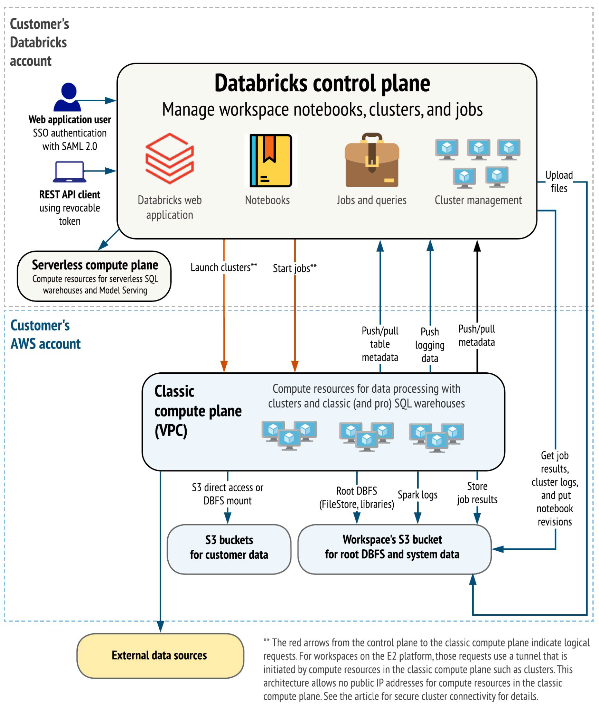
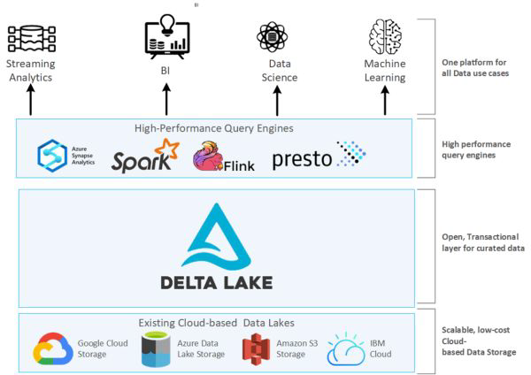
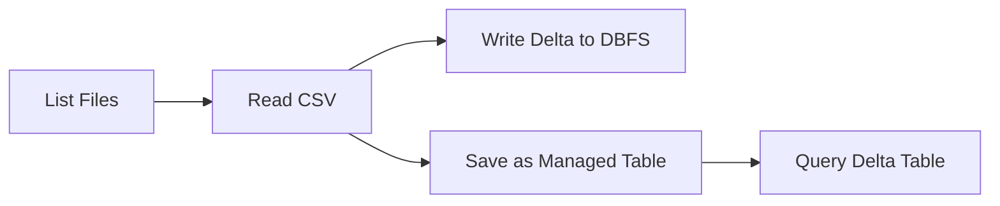
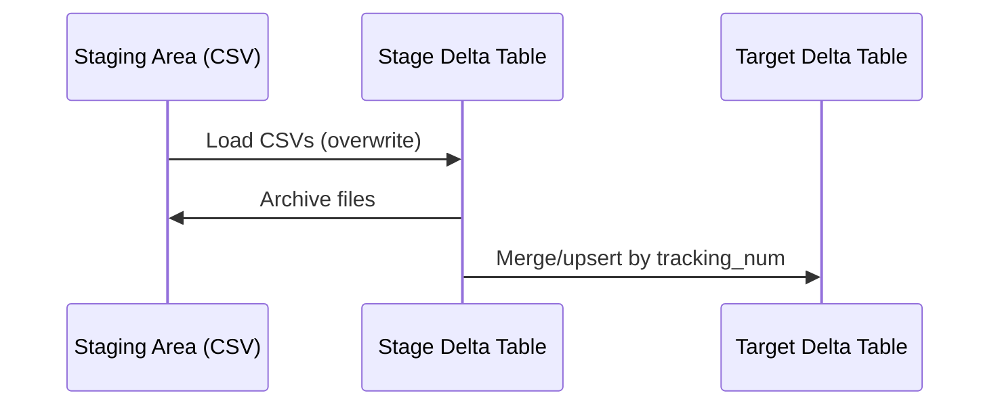

# Databricks: A Comprehensive Overview

Databricks is a unified data analytics platform designed to simplify large-scale data processing and machine learning. Built by the original creators of Apache Spark, it provides a cloud-based environment that combines data engineering, data science, and business analytics capabilities.

## Core Architecture

Databricks is built on several key components:

1. **Apache Spark Foundation**: At its core, Databricks utilizes Spark as its distributed computing engine, providing high-performance processing for large datasets.

2. **Cloud-Native Platform**: It's available on all major cloud providers (AWS, Azure, GCP) with optimized integrations for each environment.

3. **Workspace Environment**: A collaborative interface that supports notebooks, dashboards, and job scheduling with multi-language support (Python, R, SQL, Scala).

## Key Features

### Unified Analytics Platform
- **Databricks Lakehouse**: Combines the best features of data lakes and data warehouses in a single platform
- **Delta Lake**: An open-source storage layer that brings reliability to data lakes with ACID transactions
- **MLflow Integration**: For managing the complete machine learning lifecycle

### Managed Spark Infrastructure
- Automated cluster management and scaling
- Performance optimization (including the Photon execution engine)
- Built-in security and compliance features

### Collaborative Environment
- Shared notebooks with real-time collaboration
- Role-based access controls
- Integration with version control systems

## Why Databricks Matters

1. **Simplified Spark Operations**: Eliminates the complexity of deploying and managing Spark clusters manually.

2. **Increased Productivity**: Data teams can focus on analysis rather than infrastructure management with features like:
   - Auto-scaling compute resources
   - One-click cluster creation
   - Pre-configured machine learning environments

3. **Enterprise-Grade Capabilities**:
   - Fine-grained access controls
   - Audit logging
   - Compliance with major regulations (GDPR, HIPAA, etc.)

4. **Cost Efficiency**:
   - Serverless options to reduce costs
   - Automated cluster termination to prevent idle resource waste
   - Spot instance integration for additional savings

## Common Use Cases

1. **Large-Scale Data Processing**: ETL pipelines handling petabytes of data
2. **Machine Learning**: From experimentation to production deployment
3. **Business Analytics**: Interactive dashboards and SQL analytics
4. **Real-Time Processing**: Streaming data applications
5. **Data Governance**: Centralized data management with Unity Catalog

Databricks has become particularly valuable in modern data architectures by bridging the gap between raw data processing and business intelligence, enabling organizations to derive insights from their data more efficiently than traditional segmented approaches.

<br/>
<br/>

# Detailed Explanation of Databricks Architecture Diagram



This diagram illustrates the comprehensive architecture of Databricks, showing how different components interact across the customer's Databricks account and AWS infrastructure. Let's break it down systematically:

## 1. Authentication Layer
- **Web Application Users**: Authenticate via **SAML 2.0** (typically using enterprise identity providers like Okta or Azure AD)
- **REST API Clients**: Use **revocable tokens** for programmatic access (with configurable expiration for security)

## 2. Control Plane Components
The **Databricks control plane** manages all administrative functions:
- **Workspace Management**: Notebooks, folders, and workspace objects
- **Cluster Orchestration**: Lifecycle management (create/start/stop clusters)
- **Job Scheduling**: Execution and monitoring of scheduled jobs
- **Web Application Interface**: Serves the UI that users interact with

Key capabilities shown:
- Notebook execution environment
- Jobs and queries interface
- Cluster management dashboard
- File upload functionality

## 3. Compute Planes Architecture

### A. Serverless Compute Plane
- **Serverless SQL Warehouses**: Instant, auto-scaling SQL endpoints
- **Model Serving**: Dedicated infrastructure for ML model deployments
- **Fully Managed**: No customer visibility into underlying infrastructure

### B. Classic Compute Plane (VPC)
- **Data Processing Clusters**: Customer-configured Spark clusters
- **Classic SQL Warehouses**: Traditional SQL endpoints (non-serverless)
- **VPC-Based**: Runs in customer's AWS account for data isolation

## 4. Data Flow Patterns

### Control → Compute Communication
- **Red arrows** indicate logical requests for:
  - Cluster launches
  - Job initiations
- **E2 Platform Workspaces** use a **secure tunnel** initiated from compute resources:
  - No public IPs required for classic compute
  - Meets strict enterprise security requirements

### Data Access Patterns
- **S3 Direct Access/DBFS Mounts**: Customer data access options
- **Root DBFS**: Contains:
  - FileStore (workspace files)
  - Library repositories
  - System directories
- **Spark Logs**: Cluster execution diagnostics
- **Job Results Storage**: Persistent output storage

## 5. AWS Integration Points

### Customer's AWS Account Contains:
- **S3 Buckets** for:
  - Customer data (directly accessed)
  - Workspace system data (root DBFS)
- **Classic Compute Resources** in VPC:
  - Data processing clusters
  - SQL warehouse endpoints

### Key Data Flows:
1. **Metadata Synchronization**:
   - Table metadata pushed/pulled between control plane and compute
   - Logging data pushed to persistent storage

2. **Result Retrieval**:
   - Job outputs
   - Cluster logs
   - Notebook version history

3. **External Data Access**:
   - Connections to non-Databricks data sources

## Security Architecture Highlights

1. **Network Isolation**:
   - Classic compute resources reside in customer VPC
   - No public IP requirement for compute nodes (E2 platform)

2. **Data Protection**:
   - Customer data never transits through control plane
   - Direct S3 access preserves existing permissions

3. **Authentication Flows**:
   - Separate paths for human vs. machine access
   - SAML for web users vs. tokens for API

This architecture enables secure, scalable data processing while maintaining clear separation between:
- Management functions (control plane)
- Compute execution (compute planes)
- Data storage (customer AWS account)

<br/>
<br/>

# **Databricks Components: In-Depth Explanation**

Databricks is a unified analytics platform built around **Apache Spark**, but it extends far beyond Spark with additional components that enhance performance, collaboration, and AI/ML capabilities. Below is a detailed breakdown of its core components:

---

## **1. Apache Spark (Core Engine)**
### **What It Is**
- An open-source, distributed computing framework for large-scale data processing.
- Provides in-memory computation for faster analytics compared to traditional MapReduce.

### **How Databricks Enhances It**
- **Optimized Performance**: Databricks includes proprietary optimizations (e.g., **Photon Engine**, a vectorized query engine written in C++ for faster SQL workloads).
- **Auto-Scaling & Cluster Management**: Automatically adjusts compute resources based on workload.
- **Simplified Deployment**: Removes the need to manually configure Spark clusters (handled by Databricks).

### **Key Features**
- **Batch & Stream Processing**: Unified API for both batch and real-time data.
- **Multi-Language Support**: Python (PySpark), Scala, SQL, R.
- **Integration with Data Sources**: Works with S3, Delta Lake, JDBC, Parquet, Avro, etc.

---

## **2. Databricks Workspace (Collaborative Environment)**
### **What It Is**
A cloud-based UI where teams collaborate on data projects.

### **Key Components**
- **Interactive Notebooks**:  
  - Support Python, R, SQL, Scala.  
  - Real-time collaboration (like Google Docs).  
  - Integration with Git for version control.  
- **Dashboards & Visualizations**:  
  - Built-in visualization tools (matplotlib, ggplot, Plotly).  
  - Can publish dashboards for business users.  
- **Jobs & Workflows**:  
  - Schedule and automate Spark jobs.  
  - REST API for programmatic job management.  
- **Repos**:  
  - Git integration (GitHub, GitLab, Bitbucket).  
  - Enables CI/CD for data pipelines.  

### **Benefits**
- **Unified Collaboration**: Data engineers, scientists, and analysts work in one place.
- **Version Control**: Track changes in notebooks and code.
- **Managed Infrastructure**: No need to set up separate Spark clusters.

---

## **3. Databricks Runtime (Optimized Spark Execution)**
### **What It Is**
A **customized version of Spark** optimized for performance, security, and reliability in the cloud.

### **Key Optimizations**
- **Photon Engine**: Faster SQL query execution (up to 2x speedup).  
- **Delta Lake Integration**: Built-in support for ACID transactions.  
- **Auto-Optimized Shuffling**: Reduces data movement between nodes.  
- **GPU Support**: Accelerates deep learning workloads.  

### **Types of Runtimes**
- **Standard Runtime**: Basic Spark with Databricks optimizations.  
- **ML Runtime**: Pre-installed with popular ML libraries (TensorFlow, PyTorch, scikit-learn).  
- **Genomics Runtime**: For bioinformatics workloads.  

### **Why It Matters**
- **Faster Execution**: Optimized for cloud environments (AWS, Azure, GCP).  
- **Less Tuning Required**: Automatic optimizations reduce manual configuration.  

---

## **4. Delta Lake (Reliable Data Lake Storage)**
### **What It Is**
An **open-source storage layer** that brings **ACID transactions** to data lakes.

### **Key Features**
| Feature | Benefit |
|---------|---------|
| **ACID Transactions** | Ensures data consistency (no corrupt reads/writes). |
| **Time Travel** | Roll back to previous versions of data (like Git for data). |
| **Schema Enforcement** | Prevents bad data from being written. |
| **Unified Batch & Streaming** | Same API for batch and real-time processing. |
| **Z-Ordering & Data Skipping** | Faster queries by reducing I/O. |

### **How It Works with Databricks**
- **Default Storage Format**: Tables in Databricks use Delta Lake by default.  
- **Optimized for Spark**: Faster MERGE, UPDATE, DELETE operations.  
- **Open-Source**: Can be used outside Databricks (e.g., with standalone Spark).  

---

## **5. MLflow (Machine Learning Lifecycle)**
### **What It Is**
An **open-source platform** for managing ML experiments, reproducibility, and deployment.

### **Key Components**
1. **MLflow Tracking**  
   - Logs parameters, metrics, and artifacts (models, plots).  
   - Compare different model runs.  
2. **MLflow Projects**  
   - Packaging ML code for reproducibility.  
3. **MLflow Models**  
   - Standardized model format (supports TensorFlow, PyTorch, etc.).  
4. **MLflow Registry**  
   - Centralized model store (versioning, staging, production).  

### **Integration with Databricks**
- **Auto-Logging**: Automatically tracks experiments in Databricks notebooks.  
- **One-Click Deployment**: Deploy models to **Databricks Model Serving** or external systems.  
- **Collaboration**: Share experiments across teams.  

---

## **Summary: Why These Components Matter**
| Component | Key Benefit |
|-----------|-------------|
| **Apache Spark** | Fast, distributed data processing. |
| **Databricks Workspace** | Collaborative notebooks, dashboards, and automation. |
| **Databricks Runtime** | Optimized Spark for speed and reliability. |
| **Delta Lake** | Reliable, ACID-compliant data lake storage. |
| **MLflow** | End-to-end machine learning lifecycle management. |

### **Business Impact**
- **Faster Analytics**: Optimized Spark + Delta Lake = quicker insights.  
- **Better Collaboration**: Teams work together in one platform.  
- **Reliable AI/ML**: MLflow ensures reproducible, deployable models.  
- **Cost Efficiency**: Auto-scaling and serverless options reduce infrastructure costs.  

Databricks combines these components into a **unified platform** that simplifies big data, AI, and analytics—eliminating the need to stitch together multiple tools.

<br/>
<br/>

# **Databricks Components: Deep Dive (Part 2)**

This section covers additional critical components of the Databricks platform, focusing on SQL analytics, data integration, cluster management, security, and cloud-native capabilities.

---

## **1. Databricks SQL (Serverless SQL Analytics)**
### **What It Is**
A **serverless SQL engine** optimized for querying data lakes at scale, designed for BI analysts and SQL users.

### **Key Features**
| Feature | Description | Benefit |
|---------|-------------|---------|
| **Serverless SQL Warehouses** | On-demand, auto-scaling compute for SQL queries | No cluster management; pay-per-query pricing |
| **Delta Lake Integration** | Query Delta tables with full ACID compliance | Reliable, consistent SQL on data lakes |
| **Interactive Query Editor** | Web-based SQL IDE with syntax highlighting | Easy ad-hoc analysis |
| **Dashboarding** | Built-in visualization tools (charts, pivot tables) | Self-service BI without external tools |
| **Alerts & Scheduled Queries** | Monitor data changes and refresh dashboards | Proactive insights |
| **Performance Optimizations** | Caching, predicate pushdown, Z-ordering | Faster queries on massive datasets |

### **Use Cases**
- **Business Intelligence**: Power BI/Tableau users querying Delta Lake tables.
- **Data Exploration**: Analysts running ad-hoc SQL without Spark knowledge.
- **Automated Reporting**: Scheduled refreshes of dashboards.

---

## **2. Data Integration Tools**
### **What It Is**
Built-in connectors and tools to ingest data from diverse sources into Databricks.

### **Key Components**
| Tool/Feature | Supported Sources | Key Capability |
|-------------|-------------------|---------------|
| **Auto Loader** | S3, ADLS, Kafka | Incremental file ingestion (CDC) |
| **Delta Live Tables (DLT)** | Databases, APIs | Declarative ETL pipelines |
| **Spark Connectors** | JDBC, Snowflake, MongoDB | Read/write to external DBs |
| **Partner Integrations** | Fivetran, Talend, dbt | Third-party pipeline orchestration |

### **How It Works**
1. **Batch Ingestion**: Pull data from databases (JDBC), files (CSV/Parquet), or APIs.
2. **Streaming**: Real-time ingestion from Kafka, Kinesis, or Event Hubs.
3. **CDC (Change Data Capture)**: Auto Loader detects and processes new files.
4. **Data Transformation**: Clean/transform using Spark SQL or Python.

### **Benefits**
- **Simplified Pipelines**: No need for external ETL tools.
- **Schema Evolution**: Handles changing data structures automatically.
- **Unified Batch + Streaming**: Same API for both modes.

---

## **3. Cluster Management**
### **What It Is**
Automated provisioning and scaling of Apache Spark clusters.

### **Cluster Types**
| Type | Use Case | Key Feature |
|------|----------|-------------|
| **Interactive Clusters** | Notebook development | Shared across users |
| **Job Clusters** | Scheduled/automated jobs | Terminates after job completion |
| **High-Concurrency** | SQL/BI workloads | Shared resources with fine-grained access |
| **GPU Clusters** | Deep learning | Pre-installed ML libraries |

### **Key Features**
- **Auto-Scaling**: Dynamically adds/removes nodes based on workload.
- **Autoscaling Local Storage**: Ephemeral disk space scales with cluster size.
- **Spot Instance Support**: Up to 90% cost savings on AWS/Azure.
- **Cluster Policies**: Governance rules for instance types, max clusters, etc.

### **Example Workflow**
1. User selects cluster size (e.g., 4–16 nodes).
2. Databricks provisions VMs in customer’s cloud account.
3. Cluster auto-terminates after idle timeout.

---

## **4. Security & Compliance**
### **Enterprise-Grade Security**
| Layer | Features |
|-------|----------|
| **Authentication** | SAML, OAuth, SCIM (Azure AD, Okta) |
| **Authorization** | Table/column-level ACLs, RBAC |
| **Data Protection** | Encryption at rest (AWS KMS, Azure Key Vault) and in transit (TLS 1.2+) |
| **Audit Logging** | Track all workspace activity (Notebook edits, job runs) |
| **Compliance** | HIPAA, GDPR, SOC 2, ISO 27001 |

### **Key Tools**
- **Unity Catalog**: Centralized metadata and access control.
- **IP Access Lists**: Restrict workspace access by IP range.
- **PrivateLink (AWS/Azure)**: Secure connectivity without public internet.

---

## **5. Cloud Integration**
### **Multi-Cloud Support**
| Cloud | Key Integration |
|-------|----------------|
| **AWS** | Native S3 access, IAM roles, Glue Catalog |
| **Azure** | Synapse integration, ADLS Gen2, AAD auth |
| **GCP** | BigQuery connector, GCS support |

### **Architecture**
- **Control Plane**: Managed by Databricks (hosted in Databricks’ cloud account).
- **Compute Plane**: Runs in customer’s cloud account (data never leaves customer VPC).
- **Storage**: Direct access to S3/ADLS/GCS (no data passes through control plane).

### **Benefits**
- **VPC Peering**: Secure network connectivity.
- **Cloud-Native Services**: EventBridge (AWS), Event Grid (Azure) for triggers.
- **Cost Optimization**: Leverages cloud discounts (e.g., AWS Reserved Instances).

---

## **Summary: Why These Components Matter**
| Component | Business Impact |
|-----------|-----------------|
| **Databricks SQL** | Democratizes data access for non-Spark users |
| **Data Integration** | Eliminates silos; unified batch/streaming pipelines |
| **Cluster Management** | Reduces operational overhead by 70%+ |
| **Security** | Meets strict financial/healthcare compliance needs |
| **Cloud Integration** | Avoids vendor lock-in; leverages native cloud services |

### **Real-World Impact**
- **Analysts** can query petabytes of data with SQL in seconds.
- **Engineers** build pipelines 10x faster with Delta Live Tables.
- **IT Teams** enforce security policies centrally via Unity Catalog.
- **Finance** saves costs with auto-terminating clusters and spot instances.

Databricks’ integrated approach removes traditional trade-offs between performance, ease of use, and security in big data analytics.

<br/>
<br/>

# **Streaming Analytics & Unified Data Platform Architecture**

This diagram illustrates how Databricks provides a **single, unified platform** for diverse data workloads—streaming analytics, data science, machine learning, and high-performance queries—while integrating with existing cloud storage systems. Below is a detailed breakdown:

---

## **1. Core Components of the Platform**
### **A. Streaming Analytics**
- **Real-time data processing** using **Apache Spark Structured Streaming** or **Flink**.
- **Use Cases**:  
  - IoT sensor data processing  
  - Fraud detection  
  - Live dashboards  
- **Key Features**:  
  - Exactly-once processing guarantees  
  - Integration with Kafka, Kinesis, Event Hubs  
  - Low-latency results (sub-second to minutes)  

### **B. Data Science & Machine Learning**
- **Unified environment** for:  
  - **Exploratory data analysis** (Notebooks with Python/R/SQL)  
  - **Model training** (MLflow, TensorFlow, PyTorch)  
  - **Model deployment** (Databricks Model Serving)  
- **Key Features**:  
  - AutoML for automated model selection  
  - Feature Store for reusable ML features  
  - GPU-accelerated clusters for deep learning  

### **C. High-Performance Query Engines**
- Supports multiple engines for different workloads:  
  | Engine | Best For |  
  |--------|----------|  
  | **Spark SQL** | Complex ETL, large-scale transformations |  
  | **Flink** | Stateful stream processing (e.g., sessionization) |  
  | **Presto** | Interactive SQL queries (low-latency BI) |  
- **Optimized Execution**:  
  - Photon engine (C++ vectorized execution) for faster SQL.  
  - Z-ordering & data skipping to minimize I/O.  

---

## **2. Delta Lake: The Transactional Layer**
### **What It Solves**
- Traditional data lakes lack:  
  - **ACID transactions** (risks data corruption).  
  - **Schema enforcement** (bad data can break pipelines).  
  - **Time travel** (no point-in-time recovery).  

### **Key Features**
| Feature | Benefit |  
|---------|---------|  
| **ACID Compliance** | Safe concurrent reads/writes |  
| **Time Travel** | Roll back to prior data versions (e.g., `VERSION AS OF`) |  
| **Schema Evolution** | Handle new columns without breaking pipelines |  
| **Merge/Update/Delete** | Supports CDC (Change Data Capture) patterns |  

### **How It Fits In**
- Sits **between query engines and raw cloud storage**.  
- Curates raw data into a **reliable, analytics-ready layer**.  

---

## **3. Integration with Cloud Storage**
### **Supported Storage Systems**
- **Amazon S3** (most widely used)  
- **Azure Data Lake Storage (ADLS Gen2)**  
- **Google Cloud Storage (GCS)**  
- **IBM Cloud Object Storage**  

### **How It Works**
1. **Data Lands in Cloud Storage**:  
   - Raw files (CSV, JSON, Parquet) stored cost-effectively.  
   - No vendor lock-in (open formats like Delta/Parquet).  
2. **Delta Lake Adds Structure**:  
   - Applies schemas, partitions, and metadata.  
   - Enables transactions and optimizations (Z-ordering).  
3. **Query Engines Process Data**:  
   - Spark/Flink/Presto read from Delta Lake.  
   - Results served to dashboards, ML models, or APIs.  

### **Benefits of Cloud-Native Design**
- **Scalability**: Petabyte-scale storage with low cost.  
- **Security**: Cloud-native encryption (AWS KMS, Azure Key Vault).  
- **Flexibility**: Query data in place (no forced migrations).  

---

## **4. Why This Architecture Matters**
### **For Data Teams**
- **Single platform** for all workflows (no tool sprawl).  
- **Stream + batch processing** with the same API.  
- **ML and analytics** on fresh, transactional data.  

### **For Businesses**
- **Faster insights**: SQL queries run on optimized Delta Lake.  
- **Lower costs**: Cloud storage is cheap; compute scales dynamically.  
- **Reduced risk**: ACID compliance prevents data corruption.  

### **Example Workflow**
1. **Streaming**: Ingest clickstream data from Kafka → Delta Lake.  
2. **SQL Analytics**: Power BI queries Delta via Databricks SQL.  
3. **ML**: Train a recommendation model using fresh streaming data.  
4. **Governance**: Audit all changes via Delta Lake’s transaction log.  

---

## **Key Takeaways**
1. **Unified Platform**: Combines streaming, ML, and SQL analytics.  
2. **Delta Lake**: The "trust layer" that makes cloud storage reliable.  
3. **Cloud-Native**: Leverages S3/ADLS/GCS for scalable storage.  
4. **Open Ecosystem**: Works with Spark, Flink, Presto, and more.  

This architecture eliminates silos between data engineering, science, and BI—enabling teams to move from raw data to insights faster.

<br/>
<br/>

# **Delta Lake: The Transactional Foundation for Modern Data Lakes**

## **1. Introduction to Delta Lake**
Delta Lake is an **open-source storage layer** that transforms traditional cloud object storage (S3, ADLS, GCS) into a **reliable, high-performance data lake** by adding critical database-like features. It was developed by Databricks and is now a Linux Foundation project, ensuring vendor neutrality.

---

## **2. Core Architectural Components**
Delta Lake integrates with Databricks and cloud storage through these key layers:

| Layer | Role | Benefit |
|-------|------|---------|
| **Cloud Storage (S3/ADLS/GCS)** | Stores raw data files (Parquet format) | Low-cost, scalable storage |
| **Delta Transaction Log** | JSON-based log tracking all changes (ACID compliance) | Atomicity and consistency |
| **Metadata Layer** | Manages schema, partitioning, statistics | Faster queries via optimization |
| **Spark Integration** | Query engine for Delta tables | Unified batch + streaming |

---

## **3. Key Features & How They Work**

### **A. ACID Transactions**
#### **Problem Solved**
Traditional data lakes lack transaction support, risking:
- **Partial writes** (jobs failing mid-execution corrupt data).
- **Dirty reads** (queries seeing inconsistent intermediate states).

#### **Delta’s Solution**
- **Atomic commits**: All changes succeed or fail together.
- **Optimistic concurrency control**: Handles concurrent reads/writes without locks.
- **Serializable isolation**: Queries see a consistent snapshot.

**Example**:  
```python
# Atomic UPDATE operation in Delta
df.write.format("delta").mode("overwrite").save("/data/events")  # Either fully succeeds or fails
```

### **B. Schema Enforcement & Evolution**
#### **Schema Enforcement (On Write)**
- Rejects writes if data doesn’t match the table schema.
- Prevents "garbage in, garbage out" scenarios.

**Example**: Blocking a CSV with extra/missing columns.

#### **Schema Evolution (On Read)**
- Allows gradual schema changes via `mergeSchema` or `overwriteSchema`.
- Backward-compatible for existing queries.

**Example**:  
```python
df.write.option("mergeSchema", "true").format("delta").save("/data/events")
```

### **C. Time Travel (Data Versioning)**
- Maintains a versioned history of all changes via the transaction log.
- Enables:
  - **Rollbacks**: Revert to prior versions (e.g., `RESTORE TABLE`).
  - **Reproducibility**: Run queries on historical data snapshots.
  - **Auditing**: Track who changed what and when.

**Example Query**:  
```sql
SELECT * FROM events VERSION AS OF 12  -- Query data as it existed at version 12
```

### **D. Performance Optimizations**
| Feature | Mechanism | Impact |
|---------|-----------|--------|
| **Z-Ordering** | Co-locates related data | 10-100x faster range queries |
| **Data Skipping** | Min/max statistics in metadata | Reduces I/O for filtered queries |
| **Caching** | Automatic disk caching | Faster repeated queries |
| **Compaction** | Bin-packing small files | Eliminates "small file problem" |

---

## **4. Integration with Databricks**
### **A. Native Optimization**
- **Delta Engine**: Databricks’ proprietary acceleration layer for Delta Lake.
- **Auto-Optimization**: Auto-compaction and file size tuning.

### **B. Unified Batch + Streaming**
- **Same API** for batch and streaming jobs:
  ```python
  spark.readStream.format("delta").load("/data/events")  # Streaming
  spark.read.format("delta").load("/data/events")       # Batch
  ```
- **Change Data Feed**: Track row-level changes for incremental processing.

### **C. Security & Governance**
- **Unity Catalog Integration**: Centralized access control.
- **Fine-Grained ACLs**: Column/row-level security.

---

## **5. Real-World Use Cases**
1. **Financial Data Pipelines**  
   - ACID transactions ensure accurate balance calculations.
   - Time travel audits comply with regulations (e.g., GDPR).

2. **Machine Learning Feature Stores**  
   - Schema evolution accommodates new features.
   - Reproducible training on historical data versions.

3. **IoT Streaming**  
   - Merge real-time sensor data with batch dimensions.
   - Roll back faulty device firmware updates.

---

## **6. Comparison to Traditional Data Lakes**
| Feature | Traditional Data Lake | Delta Lake |
|---------|-----------------------|------------|
| **Transactions** | ❌ No ACID | ✅ Full ACID |
| **Schema** | ❌ "Schema on read" risks | ✅ Enforcement + evolution |
| **Performance** | ❌ Manual tuning | ✅ Auto-optimized |
| **Streaming** | ❌ Separate systems | ✅ Unified batch/streaming |

---

## **7. Getting Started**
### **Creating a Delta Table**
```python
# Convert existing Parquet to Delta
spark.sql("CONVERT TO DELTA parquet.`/path/to/data`")

# Write new data
df.write.format("delta").save("/delta/events")
```

### **Key Commands**
```sql
-- Time travel
RESTORE TABLE events TO VERSION AS OF 5;

-- Optimize performance
OPTIMIZE events ZORDER BY (date);
```

---

## **8. Why Delta Lake Matters**
- **Reliability**: No more corrupted data pipelines.
- **Performance**: Faster queries without manual tuning.
- **Simplified Architecture**: Replaces need for separate data warehouses + lakes.

Delta Lake turns object storage into a **true lakehouse**—combining the scale of data lakes with the reliability of databases.


<br/>
<br/>

# **Delta Lake: The Unified Data Lakehouse Solution**

## **1. Unified Batch & Streaming Data Processing**
### **Problem Solved**
Traditional systems require separate pipelines for batch and streaming, leading to:
- Complex architectures (Lambda/Kappa)
- Data consistency challenges
- Duplicate logic maintenance

### **Delta Lake's Solution**
- **Single API** for both batch and streaming:
  ```python
  # Batch read
  batch_df = spark.read.format("delta").load("/delta/events")
  
  # Streaming read (same syntax!)
  streaming_df = spark.readStream.format("delta").load("/delta/events")
  ```
- **Change Data Feed**: Track row-level changes for incremental processing
- **Merge Operations**: Upsert streaming data into batch tables

**Example Use Case**:  
Real-time dashboard showing daily sales (batch history) + live transactions (streaming) from the same Delta table.

---

## **2. Optimized Layout & Indexing**
### **Automatic Optimization Features**
| Feature | How It Works | Performance Impact |
|---------|-------------|--------------------|
| **Auto Compaction** | Bin-packs small files into larger ones | Eliminates "small file problem" (10-100x faster) |
| **Z-Ordering** | Co-locates related data physically | 50x faster for range queries (e.g., `WHERE date BETWEEN...`) |
| **Data Skipping** | Stores min/max statistics in metadata | Reduces I/O by skipping irrelevant files |
| **Caching** | Automatic disk caching for hot data | Sub-second response for repeated queries |

**Example Command**:  
```sql
OPTIMIZE sales_data ZORDER BY (customer_id, transaction_date);
```

---

## **3. Databricks Integration**
### **Seamless Workflow Integration**
- **Notebooks**:  
  ```python
  # Write to Delta
  df.write.format("delta").mode("overwrite").save("/mnt/delta/sales")
  
  # SQL Access
  spark.sql("SELECT * FROM delta.`/mnt/delta/sales` WHERE region = 'EMEA'")
  ```
- **Jobs**:  
  - Schedule Delta table maintenance (OPTIMIZE, VACUUM)  
  - Stream Delta tables to downstream systems  

### **UI Enhancements**
- **Data Explorer**: Visualize Delta table history/schema  
- **Delta Live Tables**: Declarative pipeline management  

---

## **4. Spark API Compatibility**
### **Adoption Without Rewrites**
- **Same Spark SQL/DataFrame APIs**:  
  ```python
  # Existing Parquet code
  df = spark.read.parquet("/data/events")
  
  # Convert to Delta with one line change
  df = spark.read.format("delta").load("/delta/events")
  ```
- **Supports All Spark Operations**:  
  - Joins  
  - Window functions  
  - MLlib  

**Migration Path**:  
1. Convert Parquet → Delta with `CONVERT TO DELTA`  
2. Gradually adopt Delta features (ACID, time travel)  

---

## **5. Accessibility & Ease of Use**
### **Multi-Language Support**
| Language | Example |
|----------|---------|
| **SQL** | `CREATE TABLE delta.`/path` AS SELECT...` |
| **Python** | `df.write.format("delta").save(...)` |
| **Scala** | `spark.read.delta("/path")` |
| **R** | `read.df(path, source = "delta")` |

### **User-Friendly Features**
- **Time Travel**:  
  ```sql
  -- Audit data changes
  DESCRIBE HISTORY sales_table;
  
  -- Recover from bad write
  RESTORE TABLE sales_table TO VERSION AS OF 4;
  ```
- **Schema Visualization**: Auto-generated docs from metadata  

---

## **6. Open Parquet Format**
### **Vendor-Neutral Storage**
- **File Format**: Parquet (columnar) + Delta transaction log  
- **Interoperability**:  
  - **Query Engines**: Presto, Trino, Redshift Spectrum  
  - **Tools**: Pandas (via `delta-rs`), DBT, Power BI  

**File Structure**:  
```
/delta/events/
  ├── part-0001.parquet  
  ├── part-0002.parquet  
  ├── _delta_log/       ← Transaction logs (JSON)
  │   ├── 0000001.json  
  │   └── 0000002.json  
```

---

## **7. Real-World Benefits**
### **Technical Teams**
- **Engineers**: 70% fewer pipeline failures (ACID guarantees)  
- **Data Scientists**: Reproducible ML experiments (time travel)  
- **Analysts**: Faster queries (auto-optimization)  

### **Business Impact**
| Metric | Improvement |
|--------|-------------|
| **Pipeline Development Time** | 2-5x faster (unified batch/streaming) |
| **Query Performance** | 10-100x faster (Z-ordering) |
| **Storage Costs** | 30-50% lower (compaction) |

---

## **8. Getting Started**
### **Sample Workflow**
1. **Create Delta Table**:  
   ```python
   df.write.format("delta").save("/delta/events")
   ```
2. **Stream Updates**:  
   ```python
   streaming_df.writeStream.format("delta").outputMode("append").start("/delta/events")
   ```
3. **Optimize**:  
   ```sql
   OPTIMIZE events ZORDER BY (timestamp);
   ```

### **Key Commands**
```sql
-- Convert existing data
CONVERT TO DELTA parquet.`/path/to/parquet`;

-- Audit history
DESCRIBE HISTORY events;
```

---

## **Why Delta Lake Wins**
- **Simplicity**: Replace complex architectures with one system  
- **Performance**: Auto-tuning beats manual optimization  
- **Future-Proof**: Open format avoids vendor lock-in  

By combining database reliability with data lake scalability, Delta Lake enables the **lakehouse paradigm**—the best of both worlds for modern data teams.

<br/>
<br/>

# **Databricks Notebook Walkthrough: Data Processing with Delta Lake**

This notebook demonstrates a complete workflow for data processing in Databricks, showcasing file operations, Spark DataFrame handling, and Delta Lake integration. Below is a detailed breakdown of each section:

---

## **1. Listing Files in DBFS**
```python
files = dbutils.fs.ls('/DataEngineering/input_data')
for file in files:
    print(file.path)
```
### **What It Does**
- Uses `dbutils.fs.ls()` to list files in the Databricks File System (DBFS) directory `/DataEngineering/input_data`.
- Prints the full path of each file.

### **Key Concepts**
- **DBFS**: Databricks' distributed file system (backed by cloud storage like S3/ADLS).
- **`dbutils`**: A utility module for file operations, secrets management, and widgets.

---

## **2. Reading CSV Data into a DataFrame**
```python
df = spark.read.csv(
    'dbfs:/DataEngineering/input_data/Employee_Attrition.csv', 
    header=True, 
    inferSchema=True
)
display(df)
```
### **What It Does**
- Reads a CSV file (`Employee_Attrition.csv`) into a Spark DataFrame.
- Arguments:
  - `header=True`: Uses the first row as column names.
  - `inferSchema=True`: Automatically detects column data types.
- `display()` renders the DataFrame as an interactive table.

### **Key Concepts**
- **Spark DataFrames**: Distributed collections of data with schema.
- **`spark.read`**: Entry point for reading data in various formats (CSV, Parquet, Delta, etc.).

---

## **3. Writing Data to Delta Format**
```python
df.write.format("delta").save("dbfs:/DataEngineering/output_data/employee_data")
```
### **What It Does**
- Writes the DataFrame to DBFS in **Delta Lake format** (stored as Parquet files + transaction logs).
- Creates a directory `employee_data` with Delta files.

### **Why Delta Lake?**
- **ACID transactions**: Safe concurrent reads/writes.
- **Time travel**: Query historical versions.
- **Optimized performance**: Z-ordering, compaction.

---

## **4. Saving to Unity Catalog (Managed Delta Table)**
```python
df.write.format("delta").saveAsTable("gds_de_bootcamp.default.Employee_Data")
```
### **What It Does**
- Creates a **managed table** in Unity Catalog (Databricks' metadata layer).
- Table path: `gds_de_bootcamp.default.Employee_Data` (format: `<catalog>.<schema>.<table>`).

### **Unity Catalog Benefits**
- **Centralized governance**: Access control, auditing.
- **Lineage tracking**: Understand data origins.
- **Cross-workspace sharing**: Securely reuse tables.

---

## **5. Reading from a Delta Table**
```python
tbl_df = spark.read.format("delta").table("gds_de_bootcamp.default.Employee_Data")
display(tbl_df)
```
### **What It Does**
- Reads the Delta table created earlier into a new DataFrame.
- `display()` shows the data with Databricks’ enhanced visualization.

### **Delta Query Features**
- **Time travel**:  
  ```python
  spark.read.format("delta").option("versionAsOf", 0).table("my_table")
  ```
- **Schema evolution**: Handles new columns automatically.

---

## **Key Takeaways**
1. **End-to-End Workflow**:  
   - List files → Read CSV → Write Delta → Query Delta table.  
2. **Delta Lake Advantages**:  
   - Reliability (ACID) + Performance (optimizations).  
3. **Unity Catalog Integration**:  
   - Production-grade metadata management.  

### **Execution Flow**


This notebook exemplifies how Databricks simplifies **data engineering** with Spark and Delta Lake, unifying batch processing, reliability, and governance.

<br/>
<br/>

# **Databricks Data Pipeline: Staging to Target Load Process**

This explanation covers two interconnected notebooks that implement a complete **data pipeline** in Databricks, demonstrating best practices for staging raw data and loading it into a target Delta table with merge/upsert functionality.

---

## **1. Stage Data Load Notebook (`stage_data_load.ipynb`)**
### **Purpose**
Processes raw CSV files from a staging area, creates a Delta table, and archives source files.

### **Code Breakdown**

#### **A. Path Configuration**
```python
source_dir = "dbfs:/FileStore/staging_zn/"  # Input CSV files
target_dir = "dbfs:/FileStore/archive/"     # Archive location
delta_table = "gds_de_bootcamp.default.stage_zn_new"  # Unity Catalog table
```

#### **B. Data Ingestion**
```python
df = spark.read.csv(source_dir, header=True, inferSchema=True)
```
- Reads **all CSV files** from the staging directory into a Spark DataFrame.
- `header=True`: Uses first row as column headers.
- `inferSchema=True`: Automatically detects data types.

#### **C. Delta Table Creation**
```python
df.write.format("delta").mode("overwrite").saveAsTable(delta_table)
```
- Creates/overwrites a **managed Delta table** in Unity Catalog.
- Uses `overwrite` mode to replace existing data (idempotent operation).

#### **D. File Archiving**
```python
files = dbutils.fs.ls(source_dir)
for file in files:
    dbutils.fs.mv(file.path, target_dir + file.name)
```
- Lists all files in the staging directory.
- Moves each file to an archive folder using `dbutils.fs.mv()`.

### **Key Features**
- **Atomic Load**: Entire CSV → Delta table conversion succeeds or fails together.
- **Data Governance**: Tables are registered in Unity Catalog (`gds_de_bootcamp.default`).
- **File Management**: Source files are archived post-processing.

---

## **2. Target Data Load Notebook (`target_data_load.ipynb`)**
### **Purpose**
Implements a **merge/upsert** pattern to synchronize staged data with a target Delta table.

### **Code Breakdown**

#### **A. Table Configuration**
```python
stage_table_name = "gds_de_bootcamp.default.stage_zn_new"
target_table_name = "gds_de_bootcamp.default.target_zn_new"
```

#### **B. Initial Load (If Target Doesn't Exist)**
```python
if not spark._jsparkSession.catalog().tableExists(target_table_name):
    stage_df.write.format("delta").saveAsTable(target_table_name)
```
- Checks for target table existence using Spark catalog.
- Creates the table by cloning the stage schema if missing.

#### **C. Merge/Upsert Operation**
```python
target_table = DeltaTable.forName(spark, target_table_name)
merge_condition = "stage.tracking_num = target.tracking_num"

target_table.alias("target") \
    .merge(stage_df.alias("stage"), merge_condition) \
    .whenMatchedDelete() \
    .execute()
```
1. **DeltaTable API**: Enables ACID transactions.
2. **Merge Condition**: Matches records on `tracking_num` (business key).
3. **Conflict Resolution**: 
   - Deletes matching records (`.whenMatchedDelete()`).
   - Appends all staged data afterward.

#### **D. Final Append**
```python
stage_df.write.format("delta").mode("append").saveAsTable(target_table_name)
```
- Ensures all staged records are inserted after deletions.

### **Why This Pattern?**
- **Idempotence**: Safe for reruns (no duplicate data).
- **Incremental Processing**: Only modifies changed records.
- **Auditability**: Delta Lake's time travel tracks all changes.

---

## **End-to-End Workflow**


## **Technical Highlights**

| Component | Benefit |
|-----------|---------|
| **Unity Catalog** | Centralized metadata & access control |
| **Delta Lake** | ACID transactions, time travel |
| **Merge Operation** | Efficient upserts without full rewrites |
| **DBFS Management** | Automated file archival |

## **Use Case Example**
**Scenario**: Daily sync of customer orders  
1. New CSV files land in `staging_zn/` nightly.  
2. Stage notebook loads them into `stage_zn_new`.  
3. Target notebook merges changes into `target_zn_new`:
   - Removes canceled orders (`.whenMatchedDelete()`).  
   - Adds new orders (append).  

**Result**: Target table always reflects current state while preserving history (via Delta time travel).  

This pipeline exemplifies production-grade data engineering on Databricks, combining file management, Delta Lake reliability, and efficient data synchronization.