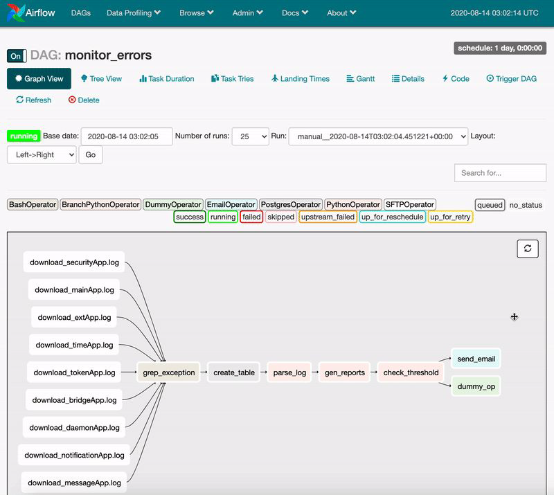
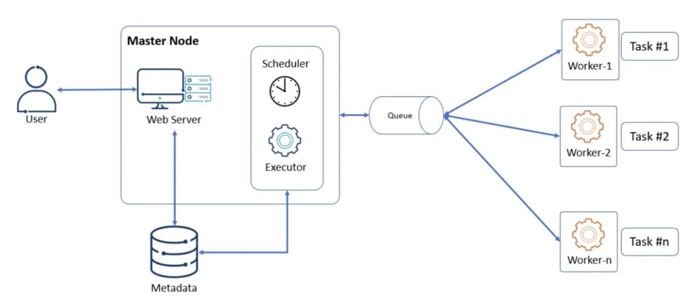

# **Orchestration in Big Data: A Detailed Explanation**

Orchestration in big data refers to the automated coordination, scheduling, and management of complex data workflows across distributed systems. Just as a conductor directs an orchestra to ensure all instruments play in harmony, big data orchestration ensures that various data processing tasks, tools, and systems work together seamlessly to achieve efficient and reliable data operations.

## **Key Aspects of Big Data Orchestration**

### **1. Workflow Management**
Big data workflows often involve multiple interdependent tasks, such as data ingestion, transformation, analysis, and storage. Orchestration tools help define and manage these workflows, which can be:
- **Linear workflows** (sequential execution of tasks).
- **Directed Acyclic Graphs (DAGs)** (tasks with dependencies, parallel execution, and conditional branching).

**Example:**  
In an ETL (Extract, Transform, Load) pipeline:  
1. **Extract** data from multiple sources (e.g., databases, APIs, logs).  
2. **Transform** the data (cleaning, aggregation, filtering).  
3. **Load** the processed data into a data warehouse.  

Orchestration ensures these steps execute in the correct order and handle dependencies.

---

### **2. Task Scheduling**
Big data workflows often need to run at specific times or in response to certain triggers (e.g., new data arrival). Orchestration tools manage scheduling by:
- **Time-based scheduling** (e.g., daily at 2 AM).
- **Event-based scheduling** (e.g., trigger a workflow when a file lands in HDFS/S3).
- **Dependency-based scheduling** (e.g., Task B runs only after Task A succeeds).

**Example:**  
A daily sales report pipeline may:  
- Pull raw sales data at midnight.  
- Process and aggregate it by 3 AM.  
- Load it into a dashboard by 5 AM.  

Orchestration ensures these tasks run in sequence without manual intervention.

---

### **3. Failure Handling & Recovery**
Big data workflows can fail due to network issues, resource constraints, or software bugs. Orchestration tools provide mechanisms to handle failures:
- **Automatic retries** (retry a failed task a set number of times).  
- **Error notifications** (alert administrators via email/Slack).  
- **Fallback mechanisms** (skip a task or trigger an alternative path).  
- **Checkpointing** (resume from the last successful step instead of restarting).  

**Example:**  
If a Spark job fails while processing data, the orchestration tool can:  
1. Retry the job 3 times.  
2. If it still fails, notify the admin and halt dependent tasks.  

---

### **4. Resource Management & Optimization**
Big data workflows often run on distributed systems (e.g., Hadoop, Kubernetes, Spark clusters). Orchestration tools help:
- Allocate resources (CPU, memory) efficiently.  
- Scale up/down based on workload.  
- Avoid resource conflicts (e.g., two jobs competing for the same cluster).  

**Example:**  
An orchestration tool like Apache Airflow can dynamically allocate more Spark executors for a heavy computation job and reduce them afterward.

---

### **5. Integration with Multiple Systems**
Big data ecosystems consist of various tools (e.g., Hadoop, Spark, Kafka, Hive, cloud services). Orchestration ensures smooth interaction between them by:
- Connecting different data sources and sinks.  
- Managing API calls, database queries, and streaming jobs.  
- Supporting hybrid environments (on-prem + cloud).  

**Example:**  
A workflow may:  
1. Pull data from Kafka (streaming).  
2. Process it in Spark.  
3. Store results in Snowflake (cloud data warehouse).  
4. Trigger a Tableau refresh.  

Orchestration ensures all these steps happen in sync.

---

## **Popular Big Data Orchestration Tools**
Several tools specialize in big data orchestration:

| **Tool** | **Key Features** |
|----------|------------------|
| **Apache Airflow** | DAG-based workflows, Python-defined, extensible with plugins. |
| **Apache Oozie** | Hadoop-centric, XML-based workflows, integrates with YARN. |
| **Luigi (Spotify)** | Python-based, focuses on dependency resolution. |
| **AWS Step Functions** | Serverless orchestration for AWS services. |
| **Kubernetes CronJobs** | For containerized big data workloads. |
| **Dagster** | Modern orchestration with data-aware scheduling. |

---

## **Use Cases of Big Data Orchestration**
1. **ETL/ELT Pipelines** – Automating data movement and transformation.  
2. **Machine Learning Pipelines** – Scheduling model training, validation, and deployment.  
3. **Data Lake/Warehouse Management** – Refreshing datasets, managing partitions.  
4. **Real-time Analytics** – Coordinating streaming jobs (Kafka + Spark + DB updates).  
5. **Reporting & BI** – Automating report generation and dashboard updates.  

---

## **Conclusion**
Big data orchestration is essential for managing complex, distributed data workflows efficiently. It ensures:  
✔ **Correct execution order** (dependencies).  
✔ **Automated scheduling** (time/event-based).  
✔ **Fault tolerance** (retries, alerts).  
✔ **Resource optimization** (scaling, allocation).  
✔ **Multi-tool integration** (Hadoop, Spark, cloud services).  

By using orchestration tools like **Airflow, Oozie, or Step Functions**, organizations can streamline their big data operations, reduce manual effort, and improve reliability.


<br/>
<br/>

# **The Need for Workflow & Dependency Management in Data Pipelines**

Designing efficient and reliable data pipelines requires careful management of workflows and dependencies. In big data environments, where pipelines involve multiple stages, tools, and distributed systems, workflow management becomes essential to ensure correctness, efficiency, and fault tolerance.

---

## **1. Ordering and Scheduling: Ensuring Correct Execution Sequence**
### **Why It’s Needed**
- Data pipelines consist of **interdependent tasks** (e.g., extract → clean → transform → load).  
- Some tasks **must run in sequence**, while others can run in parallel.  
- Without dependency management, tasks may execute prematurely, leading to **data corruption or incorrect results**.

### **How Workflow Management Helps**
- **DAG (Directed Acyclic Graph) Representation**:  
  - Defines task dependencies (e.g., Task B runs only after Task A succeeds).  
  - Example:  
    ```
    Extract → Clean → Transform → Load
    ```
- **Scheduling Based on Dependencies**:
  - Automatically ensures tasks run in the correct order.  
  - Example:  
    - A Spark aggregation job should not run before raw data is ingested.  

### **Real-World Example**
- In an **ETL pipeline**, data must be **extracted** from a database before it can be **cleaned**, and cleaned data must be ready before **aggregation**.  
- Workflow tools like **Apache Airflow** or **Oozie** enforce this sequencing.

---

## **2. Parallelization: Maximizing Efficiency**
### **Why It’s Needed**
- Some tasks are **independent** (e.g., processing different datasets).  
- Running them sequentially wastes time and resources.  
- Parallel execution **speeds up processing**, especially in distributed systems (Hadoop, Spark).

### **How Workflow Management Helps**
- **Identifies Independent Tasks**:  
  - Example:  
    - Cleaning logs and processing user data can happen simultaneously.  
- **Optimizes Cluster Usage**:  
  - Distributes tasks across multiple workers (e.g., Spark executors, Kubernetes pods).  

### **Real-World Example**
- A **recommendation engine** pipeline:  
  - User history processing and product catalog updates can run in parallel before merging results.  

---

## **3. Error Handling & Recovery: Ensuring Pipeline Resilience**
### **Why It’s Needed**
- Failures happen due to:  
  - Network issues, corrupted data, resource exhaustion.  
- Without recovery mechanisms, **entire pipelines can fail**, requiring manual intervention.  

### **How Workflow Management Helps**
- **Automatic Retries**:  
  - Retries failed tasks (e.g., 3 attempts before marking as failed).  
- **Fallback Strategies**:  
  - Skip a task, use cached data, or trigger an alternative workflow.  
- **Deadline Timeouts**:  
  - Prevents infinite hangs (e.g., kill a task after 1 hour).  
- **Notifications & Alerts**:  
  - Sends alerts (Slack, Email) if a critical task fails.  

### **Real-World Example**
- If a **Spark job fails** due to memory issues:  
  - The workflow manager retries with increased resources.  
  - If it still fails, it notifies the admin and halts dependent tasks.  

---

## **4. Visibility & Monitoring: Debugging and Optimization**
### **Why It’s Needed**
- Complex pipelines are hard to track manually.  
- Bottlenecks, failures, and inefficiencies may go unnoticed.  

### **How Workflow Management Helps**
- **Pipeline Visualization**:  
  - Tools like **Airflow UI** show task dependencies in a DAG.  
- **Logging & Auditing**:  
  - Tracks execution history, runtime, and errors.  
- **Real-time Monitoring**:  
  - Dashboards (Grafana, Prometheus) show pipeline health.  

### **Real-World Example**
- A **data engineer** notices a slow transformation task in Airflow and optimizes the SQL query.  

---

## **5. Resource Management: Optimizing Cluster Usage**
### **Why It’s Needed**
- Big data tasks vary in resource needs (CPU, memory, disk).  
- Poor allocation leads to:  
  - **Underutilization** (wasted resources).  
  - **Overloading** (job failures).  

### **How Workflow Management Helps**
- **Dynamic Resource Allocation**:  
  - Assigns more CPU/memory to heavy tasks (e.g., Spark joins).  
- **Queue Prioritization**:  
  - High-priority jobs (real-time analytics) run before batch jobs.  
- **Cost Optimization (Cloud)**:  
  - Spins up/down clusters based on workload (AWS EMR, Databricks).  

### **Real-World Example**
- A **daily sales report** pipeline:  
  - Runs on a small cluster at night.  
  - Auto-scales during peak business hours.  

---

## **Popular Workflow Management Tools**
| **Tool** | **Key Strengths** |
|----------|------------------|
| **Apache Airflow** | Python-based, DAGs, rich UI, extensible. |
| **Apache Oozie** | Hadoop-native, XML-based workflows. |
| **Luigi (Spotify)** | Simple Python workflows, good for dependency chains. |
| **AWS Step Functions** | Serverless, integrates with Lambda, S3, EMR. |
| **Prefect** | Modern alternative to Airflow, Python-first. |
| **Dagster** | Data-aware orchestration, testing-friendly. |

---

## **Conclusion: Why Workflow/Dependency Management is Crucial**
1. **Ensures Correct Execution Order** → Avoids data corruption.  
2. **Enables Parallel Processing** → Faster pipelines.  
3. **Handles Failures Gracefully** → Fewer manual recoveries.  
4. **Provides Visibility** → Easier debugging & optimization.  
5. **Optimizes Resources** → Cost-efficient big data processing.  

Without workflow management, data pipelines become **unreliable, slow, and hard to maintain**. Tools like **Airflow, Oozie, and Step Functions** automate these complexities, making pipelines **scalable and production-ready**.

<br/>
<br/>

# **Detailed Explanation of the Airflow DAG: `monitor_errors`**

This screenshot shows an **Apache Airflow Directed Acyclic Graph (DAG)** named **`monitor_errors`**, which appears to be a workflow for **monitoring and processing application logs**. Below is a breakdown of the key components and their functions:

---

## **1. DAG Overview**
- **Name**: `monitor_errors`  
- **Purpose**: Likely a pipeline for **downloading, parsing, and analyzing log files** from multiple applications to detect errors or anomalies.  
- **View**: The screenshot shows the **Graph View** (visual representation of tasks and dependencies).  

---

## **2. Key UI Components**
### **Top Navigation Bar**
- **Graph View**: Visualizes task dependencies (shown in the screenshot).  
- **Tree View**: Displays tasks in a hierarchical structure.  
- **Task Duration**: Shows how long each task took.  
- **Gantt Chart**: Helps identify bottlenecks by plotting task durations.  
- **Code**: Links to the Python DAG definition file.  
- **Trigger DAG**: Manually starts a new DAG run.  
- **Delete**: Removes the DAG from Airflow.  

---

### **DAG Run Information**
- **Status**: `Running` (currently executing).  
- **Base Date**: `2020-08-14 03:02:05` (when the DAG was triggered).  
- **Run ID**: `manual_2020-08-14T03:02:04.451221+00:00` (this was manually triggered).  
- **Layout**: `Left → Right` (tasks are arranged horizontally).  

---

### **Task Status Legend**
Airflow uses color-coded statuses for tasks:  
- **Success (Green)**: Task completed successfully.  
- **Running (Blue)**: Task is currently executing.  
- **Failed (Red)**: Task encountered an error.  
- **Skipped (Light Blue)**: Task was skipped due to a condition.  
- **Upstream Failed (Orange)**: A dependent task failed.  
- **Queued (Grey)**: Task is waiting for resources.  
- **Up for Retry (Yellow)**: Task will retry after a failure.  

---

## **3. Task Breakdown**
The DAG consists of multiple tasks, primarily **log downloads** followed by **processing steps**:

### **A. Log Download Tasks**
These tasks fetch logs from different applications (likely via **SFTP/HTTP/API**):  
- `download_securityApp.log`  
- `download_mainApp.log`  
- `download_extApp.log`  
- `download_timeApp.log`  
- `download_tokenApp.log`  
- `download_bridgeApp.log`  
- `download_daemonApp.log`  
- `download_notificationApp.log`  
- `download_messageApp.log`  

**Observation**:  
- These tasks likely run **in parallel** (no dependencies between them).  
- They may use operators like **SFTPOperator, PythonOperator, or BashOperator**.  

---

### **B. Core Processing Pipeline**
After logs are downloaded, the main workflow executes:  
```
drop_exception → create_table → parse_log → gen_reports → check_threshold
```
1. **`drop_exception`**  
   - Likely **filters out** irrelevant log entries (e.g., debug logs).  
   - May use a **PythonOperator** or **BranchPythonOperator** to decide which logs to process.  

2. **`create_table`**  
   - Probably **creates a structured table** (e.g., in PostgreSQL, BigQuery) to store parsed logs.  
   - Could use **PostgresOperator** or **BigQueryOperator**.  

3. **`parse_log`**  
   - **Extracts meaningful data** (e.g., error codes, timestamps).  
   - May use **PythonOperator** with regex/log parsing libraries.  

4. **`gen_reports`**  
   - **Generates summaries** (e.g., error frequency, trends).  
   - Could save reports to **S3, email (EmailOperator), or a dashboard**.  

5. **`check_threshold`**  
   - **Validates if error counts exceed a threshold**.  
   - If yes, may trigger **alerts (Slack/EmailOperator)**.  

---

## **4. DAG Execution Flow**
1. **All log downloads (`download_*.log`) run first (parallel).**  
2. Once **all logs are downloaded**, the pipeline proceeds to:  
   - `drop_exception` → `create_table` → `parse_log` → `gen_reports` → `check_threshold`.  
3. If any task fails:  
   - Airflow can **retry (Up for Retry)** or **notify admins (Failed)**.  

---

## **5. Technical Observations**
- **Operators Used**:  
  - **SFTPOperator / PythonOperator**: For log downloads.  
  - **PostgresOperator**: For database operations.  
  - **BranchPythonOperator**: Possibly for conditional logic.  
  - **EmailOperator**: For alerts.  
- **Error Handling**:  
  - If `download_mainApp.log` fails, downstream tasks (`drop_exception` etc.) won’t run.  
  - Airflow can auto-retry failed tasks.  
- **Scalability**:  
  - Parallel downloads optimize performance.  
  - Heavy tasks (e.g., `parse_log`) can be distributed across workers.  

---

## **6. Business Use Case**
This DAG likely serves:  
- **DevOps/IT Monitoring**: Detects application errors in real-time.  
- **Security Analysis**: Checks for suspicious log patterns.  
- **Performance Reporting**: Tracks system health over time.  

---

## **Conclusion**
This **`monitor_errors` DAG** is a **robust log processing pipeline** that:  
✔ **Downloads logs** from multiple apps in parallel.  
✔ **Filters, parses, and stores** log data.  
✔ **Generates reports** and checks for anomalies.  
✔ **Handles failures** with retries/alerts.  

Tools like **Airflow** make such workflows **automated, scalable, and observable**, reducing manual monitoring efforts.

<br/>
<br/>

# **Apache Airflow: A Detailed Explanation**

Apache Airflow is an **open-source workflow orchestration platform** designed to **programmatically author, schedule, and monitor complex data pipelines**. Initially developed by **Airbnb** in 2014 and later donated to the **Apache Software Foundation**, Airflow has become a **standard tool for managing batch-oriented, dependency-based workflows** in data engineering, machine learning, and DevOps.

---

## **1. Core Concepts of Airflow**
### **A. Directed Acyclic Graphs (DAGs)**
- Airflow workflows are defined as **DAGs (Directed Acyclic Graphs)**, where:
  - **Nodes** = Tasks (individual units of work, e.g., "Extract Data").
  - **Edges** = Dependencies (e.g., "Task B runs after Task A").
- **Acyclic** means no loops (prevents infinite workflows).
- Example:  
  ```
  Extract → Clean → Transform → Load
  ```

### **B. Tasks & Operators**
- **Tasks** are the smallest executable unit in Airflow.
- **Operators** define what a task does (e.g., run a Python function, execute a SQL query).
- Common Operators:
  - `PythonOperator` (executes Python code).
  - `BashOperator` (runs shell commands).
  - `PostgresOperator` (executes SQL in PostgreSQL).
  - `EmailOperator` (sends emails on task failure/success).

### **C. Scheduler**
- The **Airflow Scheduler** triggers DAG runs based on:
  - **Time-based schedules** (e.g., daily at 3 AM).
  - **Event-based triggers** (e.g., file arrival in S3).
  - **Manual triggers** (via UI/API).

### **D. Executors**
- Determines **how tasks are executed**:
  - **SequentialExecutor** (runs tasks one by one, for testing).
  - **LocalExecutor** (parallel execution on a single machine).
  - **CeleryExecutor** (distributed task execution across workers).
  - **KubernetesExecutor** (runs tasks in dynamic K8s pods).

---

## **2. Key Features of Airflow**
### **A. Dynamic Pipeline Creation (Python-Code Based)**
- Unlike GUI-based tools (e.g., **Azure Data Factory**), Airflow **defines workflows in Python**, allowing:
  - **Conditional logic** (e.g., skip tasks if data is missing).
  - **Loops & dynamic task generation** (e.g., process each file in a folder).
  - **Integration with external APIs/databases**.

### **B. Flexible Scheduling**
- Supports **cron-like schedules** (e.g., `0 3 * * *` for daily at 3 AM).
- **Backfilling**: Re-run past workflows if needed.
- **Catchup**: Automatically runs missed DAGs.

### **C. Robust Monitoring & UI**
- **Web UI** provides:
  - **DAG Visualization** (Graph/Tree/Gantt views).
  - **Task Logs** (debugging failures).
  - **Task Status Tracking** (Success/Failed/Running).
  - **Manual Triggers & Retries**.

### **D. Scalability**
- **Horizontal Scaling**: Distributes tasks across multiple workers (Celery/Kubernetes).
- **Resource Management**: Allocates CPU/memory per task.

### **E. Extensibility (Plugins & Hooks)**
- **Plugins**: Add custom UI views, operators.
- **Hooks**: Interface with external systems (e.g., `S3Hook`, `SnowflakeHook`).
- **XComs**: Share small data between tasks.

### **F. Failure Handling & Alerts**
- **Automatic Retries**: Configure retry attempts (e.g., 3 retries).
- **Alerts**: Notify via Slack/Email on failures.
- **Deadline Timeouts**: Kill stuck tasks.

---

## **3. How Airflow Works (Step-by-Step)**
1. **Define DAG** (Python script specifying tasks/dependencies).  
2. **Scheduler Parses DAG** and queues tasks based on schedule.  
3. **Executor Runs Tasks** (locally or on workers).  
4. **Monitor Progress** via UI/Logs.  
5. **Handle Failures** (retry/skip/alert).  

---

## **4. Airflow vs. Alternatives**
| **Feature**       | **Airflow**                          | **Luigi**               | **AWS Step Functions**  | **Prefect**            |
|-------------------|--------------------------------------|-------------------------|-------------------------|------------------------|
| **Language**      | Python                               | Python                  | JSON/YAML               | Python                 |
| **Scheduling**    | Built-in (cron-like)                 | Basic                   | Event-based             | Advanced               |
| **Scalability**   | High (Celery/K8s)                    | Low                     | Medium (Lambda-based)   | High (Dask/K8s)        |
| **UI**           | Rich (Graphs/Logs)                   | Minimal                 | AWS Console             | Modern UI              |
| **Use Case**     | Batch ETL, ML Pipelines              | Dependency Chains       | Serverless Workflows    | Dataflow Orchestration |

---

## **5. Real-World Use Cases**
1. **ETL/ELT Pipelines**  
   - Extract data → Clean → Load to warehouse.  
2. **Machine Learning Pipelines**  
   - Train model → Validate → Deploy.  
3. **Infrastructure Automation**  
   - Backup databases → Notify on failure.  
4. **Report Generation**  
   - Aggregate data → Generate PDF → Email stakeholders.  

---

## **6. Limitations**
- **Not for Streaming**: Designed for batch workflows (use **Apache Kafka** for streaming).  
- **Steep Learning Curve**: Requires Python knowledge.  
- **No Built-in Data Processing**: Needs integration with Spark/Pandas.  

---

## **Conclusion**
Apache Airflow is the **de facto standard for workflow orchestration** because of its:
✔ **Python-based flexibility** (dynamic DAGs).  
✔ **Powerful scheduling & monitoring**.  
✔ **Scalability** (Celery/Kubernetes).  
✔ **Extensibility** (plugins/hooks).  

It’s widely used by companies like **Airbnb, Lyft, PayPal, and NASA** for managing complex data workflows reliably.  

**When to Use Airflow?**  
- You need **fine-grained control** over workflows.  
- Your pipelines involve **multiple systems** (DBs, APIs, cloud services).  
- You require **failure recovery & auditing**.  

**Alternatives**:  
- For **serverless workflows**: AWS Step Functions.  
- For **simpler pipelines**: Prefect/Luigi.  
- For **streaming**: Apache Beam/Flink.  

Airflow is **best suited for batch-oriented, dependency-heavy data pipelines** where automation and reliability are critical.

<br/>
<br/>

# **Apache Airflow Architecture Explained**

This diagram illustrates the core components of Apache Airflow's distributed architecture, which enables scalable workflow orchestration. Let's break down each element and how they interact:

## **1. Master Node Components**
The master node is the control center of Airflow operations:

### **A. User**
- Interacts with Airflow through:
  - **CLI** (command-line interface)
  - **Web UI** (for monitoring/triggering DAGs)
  - **REST API** (for programmatic access)

### **B. Web Server**
- Provides the **Airflow UI** (Flask-based)
- Key functions:
  - Displays DAG statuses (success/failed/running)
  - Allows manual DAG triggers
  - Shows task logs and Gantt charts
  - Hosts at `http://<host>:8080` by default

### **C. Scheduler**
- The **brain** of Airflow operations:
  - Parses DAG files (checks for changes every 30 sec by default)
  - Determines task dependencies
  - Sends tasks to the **Queue** for execution
  - Handles retries and schedules

### **D. Executor**
- Decides **how tasks are executed**:
  - **SequentialExecutor**: Runs tasks one-by-one (testing only)
  - **LocalExecutor**: Parallel execution on a single machine
  - **CeleryExecutor**: Distributes tasks to multiple workers (production)
  - **KubernetesExecutor**: Runs each task in a new K8s pod

### **E. Queue**
- Acts as a **task buffer**:
  - Stores tasks scheduled for execution
  - Workers pull tasks from here (FIFO or priority-based)
  - Typically implemented with:
    - **RabbitMQ** (for CeleryExecutor)
    - **Redis** (alternative message broker)

---

## **2. Worker Nodes**
Workers are where the actual task execution happens:

### **Worker-1 to Worker-n**
- **Stateless** processes that:
  - Pull tasks from the **Queue**
  - Execute tasks using specified **Operators** (Python, Bash, etc.)
  - Report results back to the scheduler
- Can be scaled horizontally (add more workers for higher throughput)

### **Task Execution**
Each worker can handle multiple tasks:
- **Task #1, #2, ..., #n**: Individual units of work (e.g., running a SQL query, processing a file)
- Workers execute tasks **in isolation** (no shared memory)

---

## **3. Data Flow in Airflow**
1. **User** writes a DAG (Python file) and places it in the `dags/` folder.
2. **Scheduler** detects the DAG and:
   - Parses dependencies
   - Schedules tasks based on timing/dependencies
   - Pushes tasks to the **Queue**
3. **Executor** coordinates which worker gets which task.
4. **Workers** pull tasks from the queue and execute them.
5. Results are logged in the **metadata database** (PostgreSQL/MySQL).
6. **Web Server** displays real-time updates to users.

---

## **4. Key Architecture Features**
| Feature | Benefit |
|---------|---------|
| **Master-Worker Model** | Scales horizontally by adding workers |
| **Message Queue** | Decouples scheduling from execution |
| **Stateless Workers** | Fault-tolerant (failed tasks can be reassigned) |
| **Metadata DB** | Tracks all task states (PostgreSQL/MySQL) |

---

## **5. Production Considerations**
- **For small setups**: Use `LocalExecutor` (single machine).
- **For scalability**: Use `CeleryExecutor` with multiple workers.
- **For cloud-native**: Use `KubernetesExecutor` (auto-scaling).
- **High availability**: Run multiple schedulers (Airflow 2.0+).

This architecture makes Airflow **flexible, scalable, and fault-tolerant** for complex workflows. The separation of scheduler, executor, and workers allows it to handle thousands of tasks efficiently.


<br/>
<br/>

# **Apache Airflow Architecture: In-Depth Explanation**

Apache Airflow's architecture is designed for **scalable, fault-tolerant workflow orchestration**. Below is a comprehensive breakdown of its components and their interactions.

---

## **1. Core Components of Airflow Architecture**

### **A. Scheduler**  
**Primary Role**:  
- **Continuously scans** the `dags/` folder for new/modified DAGs.  
- **Parses DAGs** to extract task dependencies (DAG = Directed Acyclic Graph).  
- **Schedules tasks** based on:  
  - Time intervals (e.g., `schedule_interval="0 3 * * *"` for daily at 3 AM).  
  - Task dependencies (e.g., Task B runs only after Task A succeeds).  
- **Pushes tasks** to the **Message Queue** for execution.  
- **Updates task states** in the **Metadata Database**.  

**Key Features**:  
- Uses **multi-threading** to handle multiple DAGs.  
- Supports **backfilling** (re-running past workflows).  
- **Recovers from failures** by checking the metadata database.  

---

### **B. Metadata Database**  
**Supported Databases**: PostgreSQL (recommended), MySQL, SQLite (for testing).  

**Stores**:  
- **DAG definitions** (workflow structure).  
- **Task states** (queued, running, failed, success).  
- **Execution logs**.  
- **User roles/permissions** (for RBAC).  

**Why It’s Critical**:  
- Ensures **persistence** (Airflow can restart without losing state).  
- Enables **task recovery** (e.g., retry failed tasks).  
- Provides **audit logs** for compliance.  

---

### **C. Web Server**  
**UI Features**:  
- **DAG Visualization**: Graph/Tree/Gantt views.  
- **Task Logs**: Debugging failures.  
- **Manual Triggers**: Run DAGs on demand.  
- **Configuration**: Set variables/connections.  

**Tech Stack**:  
- Built with **Flask** (Python).  
- Serves at `http://<host>:8080`.  

**Interaction Flow**:  
1. User clicks "Trigger DAG" in UI.  
2. Web server writes to the **Metadata Database**.  
3. **Scheduler** picks up the change and schedules tasks.  

---

### **D. Executors**  
Determines **how tasks are executed**:  

| Executor Type        | Use Case                          | Scalability |  
|----------------------|-----------------------------------|-------------|  
| `SequentialExecutor` | Local testing (runs 1 task at a time) | ❌ Low |  
| `LocalExecutor`      | Single-machine parallelism        | ⚠️ Medium |  
| `CeleryExecutor`     | Distributed workers (production)  | ✅ High |  
| `KubernetesExecutor` | Dynamic pods in K8s (cloud-native)| ✅ Auto-scaling |  

**How It Works**:  
1. Scheduler assigns tasks to the executor.  
2. Executor delegates tasks to **workers** (via message queue for `CeleryExecutor`).  

---

### **E. Worker Nodes**  
**Responsibilities**:  
- Pull tasks from the **Message Queue**.  
- Execute tasks (e.g., run a Python function, SQL query).  
- Report results to the **Metadata Database**.  

**Scaling**:  
- Workers can be **added/removed dynamically**.  
- Stateless design allows **fault tolerance** (failed tasks are reassigned).  

**Example**:  
- A `PythonOperator` task runs on Worker-1, while a `BashOperator` task runs on Worker-2.  

---

### **F. Message Queue**  
**Purpose**: Decouples the **scheduler** from **workers** for reliability.  

**Supported Queues**:  
- **RabbitMQ** (most common with `CeleryExecutor`).  
- **Redis** (lightweight alternative).  
- **Apache Kafka** (for high-throughput workflows).  

**Workflow**:  
1. Scheduler pushes tasks to the queue.  
2. Workers poll the queue for tasks.  
3. Workers acknowledge task completion/failure.  

---

## **2. How Tasks Flow Through Airflow**  
1. **DAG Definition**: User writes a Python file (e.g., `my_dag.py`) with tasks.  
2. **Scheduler Parsing**:  
   - Scheduler reads `my_dag.py` and stores metadata.  
   - Determines which tasks are ready to run.  
3. **Task Scheduling**:  
   - Tasks are pushed to the **Message Queue**.  
4. **Task Execution**:  
   - Workers grab tasks from the queue and execute them.  
5. **State Tracking**:  
   - Workers update task status in the **Metadata Database**.  
6. **UI Updates**:  
   - Web server reflects live status in the UI.  

---

## **3. Key Features Enabled by This Architecture**  

### **A. Fault Tolerance**  
- **Task Retries**: Failed tasks are retried (configurable).  
- **State Recovery**: Metadata DB ensures no tasks are lost.  

### **B. Scalability**  
- **Horizontal Scaling**: Add more workers for higher throughput.  
- **Dynamic Scaling**: `KubernetesExecutor` auto-scales pods.  

### **C. Extensibility**  
- **Custom Operators**: Define new task types (e.g., `SnowflakeOperator`).  
- **Plugins**: Add UI panels or authentication methods.  

### **D. Monitoring**  
- **Real-time UI**: Track task progress visually.  
- **Alerts**: Email/Slack notifications on failures.  

---

## **4. Example: ETL Pipeline in Airflow**  
1. **Extract**: `PythonOperator` fetches data from an API.  
2. **Transform**: `PandasOperator` cleans the data.  
3. **Load**: `PostgresOperator` writes to a database.  
4. **Monitor**: UI shows success/failure of each step.  

---

## **5. When to Use Airflow?**  
✅ **Batch workflows** (ETL, ML pipelines).  
✅ **Complex dependencies** (Task B runs only if Task A succeeds).  
✅ **Need for auditing/logging**.  

❌ **Not for**:  
- **Streaming data** (use Apache Flink/Kafka).  
- **Simple cron jobs** (overkill).  

---

## **Conclusion**  
Airflow’s architecture is **modular and distributed**, built for:  
✔ **Reliability** (metadata DB + message queue).  
✔ **Scalability** (worker nodes + executors).  
✔ **Flexibility** (Python-defined DAGs).  

Used by **Netflix, Airbnb, and NASA**, it’s the **de facto standard** for orchestrating data pipelines.

<br/>
<br/>

# **Apache Airflow Operators: A Comprehensive Guide**

Operators in Airflow are the **building blocks of workflows**, defining individual tasks in a DAG. Each operator performs a specific type of work, such as running a Bash command, executing a SQL query, or triggering an external system. Below is a detailed breakdown of key operators, their use cases, and examples.

---

## **1. Core Operator Types**
### **A. Action Operators**
Execute a specific action (e.g., run code, send emails, trigger APIs).

#### **(1) `BashOperator`**
- **Purpose**: Runs a **Bash shell command**.
- **Use Case**: File operations, running scripts, or CLI tools.
- **Example**:
  ```python
  from airflow.operators.bash import BashOperator
  
  task = BashOperator(
      task_id="run_script",
      bash_command="python /path/to/script.py",
  )
  ```

#### **(2) `PythonOperator`**
- **Purpose**: Executes a **Python function**.
- **Use Case**: Data transformation, API calls, or custom logic.
- **Example**:
  ```python
  from airflow.operators.python import PythonOperator

  def process_data(**kwargs):
      print("Processing data...")

  task = PythonOperator(
      task_id="process_data",
      python_callable=process_data,
  )
  ```

#### **(3) `EmailOperator`**
- **Purpose**: Sends an **email** (e.g., alerts, reports).
- **Use Case**: Notify teams on task success/failure.
- **Example**:
  ```python
  from airflow.operators.email import EmailOperator

  task = EmailOperator(
      task_id="send_email",
      to="team@example.com",
      subject="Pipeline Completed",
      html_content="<h1>Data processed successfully!</h1>",
  )
  ```

#### **(4) `SimpleHttpOperator`**
- **Purpose**: Triggers an **HTTP request** (GET/POST).
- **Use Case**: Call REST APIs, webhooks.
- **Example**:
  ```python
  from airflow.operators.http import SimpleHttpOperator

  task = SimpleHttpOperator(
      task_id="call_api",
      endpoint="/data",
      method="GET",
      http_conn_id="my_api_connection",
  )
  ```

---

### **B. Database Operators**
Execute SQL commands on databases.

#### **(5) `PostgresOperator` / `MySqlOperator` / etc.**
- **Purpose**: Runs **SQL queries** on databases.
- **Use Case**: ETL jobs, data cleaning, aggregations.
- **Example**:
  ```python
  from airflow.providers.postgres.operators.postgres import PostgresOperator

  task = PostgresOperator(
      task_id="create_table",
      postgres_conn_id="postgres_conn",
      sql="CREATE TABLE IF NOT EXISTS users (id INT, name TEXT);",
  )
  ```

---

### **C. Utility Operators**
Special-purpose operators for control flow.

#### **(6) `DummyOperator`**
- **Purpose**: A **no-op placeholder** (useful for branching logic).
- **Use Case**: Grouping tasks or defining workflow structure.
- **Example**:
  ```python
  from airflow.operators.dummy import DummyOperator

  start = DummyOperator(task_id="start")
  end = DummyOperator(task_id="end")
  ```

#### **(7) `BranchPythonOperator`**
- **Purpose**: Dynamically **branches workflow paths** based on Python logic.
- **Use Case**: Conditional workflows (e.g., "Skip task if data is empty").
- **Example**:
  ```python
  from airflow.operators.python import BranchPythonOperator

  def decide_path(**kwargs):
      if condition:
          return "task_a"
      else:
          return "task_b"

  branch_task = BranchPythonOperator(
      task_id="branch",
      python_callable=decide_path,
  )
  ```

---

### **D. Sensor Operators**
Wait for a condition to be met before proceeding.

#### **(8) `FileSensor` / `S3KeySensor`**
- **Purpose**: Waits for a **file** or **S3 object** to appear.
- **Use Case**: Ensure data is available before processing.
- **Example**:
  ```python
  from airflow.sensors.filesystem import FileSensor

  task = FileSensor(
      task_id="wait_for_file",
      filepath="/data/input.csv",
      poke_interval=30,  # Check every 30 seconds
      timeout=300,       # Timeout after 5 minutes
  )
  ```

#### **(9) `ExternalTaskSensor`**
- **Purpose**: Waits for a **task in another DAG** to complete.
- **Use Case**: Cross-DAG dependencies.
- **Example**:
  ```python
  from airflow.sensors.external_task import ExternalTaskSensor

  task = ExternalTaskSensor(
      task_id="wait_for_etl",
      external_dag_id="etl_pipeline",
      external_task_id="load_data",
  )
  ```

---

### **E. System Integration Operators**
Interact with external systems (e.g., SSH, Docker, Spark).

#### **(10) `SSHOperator`**
- **Purpose**: Runs commands on a **remote server via SSH**.
- **Use Case**: Deploying code or triggering remote jobs.
- **Example**:
  ```python
  from airflow.providers.ssh.operators.ssh import SSHOperator

  task = SSHOperator(
      task_id="run_remote_script",
      ssh_conn_id="ssh_server",
      command="sh /scripts/start_job.sh",
  )
  ```

#### **(11) `DockerOperator`**
- **Purpose**: Runs a **Docker container**.
- **Use Case**: Isolated task execution (e.g., ML model training).
- **Example**:
  ```python
  from airflow.providers.docker.operators.docker import DockerOperator

  task = DockerOperator(
      task_id="run_container",
      image="python:3.8",
      command="python /app/process.py",
  )
  ```

#### **(12) `SparkSubmitOperator`**
- **Purpose**: Submits a **Spark job** to a cluster.
- **Use Case**: Large-scale data processing.
- **Example**:
  ```python
  from airflow.providers.apache.spark.operators.spark_submit import SparkSubmitOperator

  task = SparkSubmitOperator(
      task_id="run_spark_job",
      application="/jobs/etl.py",
      conn_id="spark_cluster",
  )
  ```

---

## **2. Key Concepts for Operators**
### **A. `task_id`**
- Unique identifier for the task in a DAG.

### **B. `conn_id`**
- References a **pre-configured connection** (e.g., database, SSH) in Airflow’s UI (`Admin → Connections`).

### **C. **Task Dependencies**
Operators are linked using `>>` (set_downstream) or `<<` (set_upstream):
```python
task1 >> task2  # task2 runs after task1
```

---

## **3. When to Use Which Operator?**
| **Use Case**               | **Recommended Operator**       |
|----------------------------|--------------------------------|
| Run a shell script         | `BashOperator`                |
| Execute Python logic       | `PythonOperator`              |
| Query a database           | `PostgresOperator`/`MySqlOperator` |
| Wait for a file            | `FileSensor`                  |
| Send alerts                | `EmailOperator`               |
| Trigger an API             | `SimpleHttpOperator`          |
| Conditional branching      | `BranchPythonOperator`        |
| Run Spark jobs             | `SparkSubmitOperator`         |

---

## **4. Creating Custom Operators**
If built-in operators don’t fit your needs, you can **create custom operators** by subclassing `BaseOperator`:
```python
from airflow.models import BaseOperator

class MyCustomOperator(BaseOperator):
    def __init__(self, my_param, **kwargs):
        super().__init__(**kwargs)
        self.my_param = my_param

    def execute(self, context):
        print(f"Running with param: {self.my_param}")
```

---

## **5. Best Practices**
1. **Idempotency**: Design tasks to produce the same result if rerun.  
2. **Atomicity**: Each task should do **one thing** well.  
3. **Error Handling**: Set `retries` and `retry_delay` for resilience.  
4. **Logging**: Use `self.log` in custom operators for debugging.  

---

## **Conclusion**
Airflow operators **abstract task execution**, enabling:  
✔ **Flexibility** (Python, Bash, SQL, etc.).  
✔ **Integration** (DBs, APIs, Spark, Docker).  
✔ **Reliability** (sensors, retries).  

By combining operators, you can build **complex workflows** (e.g., ETL, ML pipelines) while keeping code modular and maintainable.


<br/>
<br/>

# **Apache Airflow Cloud-Specific Operators: Deep Dive**

Airflow provides specialized operators for major cloud platforms (AWS, GCP) to simplify interactions with their services. Below is a detailed breakdown of these cloud operators, their use cases, and implementation examples.

---

## **AWS Operators**

### **1. `S3FileTransformOperator`**
**Purpose**:  
- Copies data from S3 → Local → (Transform) → S3  
- Useful for **ETL jobs** needing local processing.  

**Example**:
```python
from airflow.providers.amazon.aws.operators.s3_file_transform import S3FileTransformOperator

transform_task = S3FileTransformOperator(
    task_id="transform_data",
    source_s3_key="s3://bucket/raw/data.csv",
    dest_s3_key="s3://bucket/processed/data_clean.csv",
    transform_script="/scripts/transform.py",  # Local script
)
```

**Key Parameters**:
- `transform_script`: Python/Bash script to modify the file.
- `source/dest_s3_key`: S3 paths.

---

### **2. `S3ToRedshiftTransfer`**
**Purpose**:  
- Loads data **directly from S3 to Redshift** (uses Redshift `COPY` command).  
- Avoids manual ETL steps.  

**Example**:
```python
from airflow.providers.amazon.aws.transfers.s3_to_redshift import S3ToRedshiftTransfer

load_task = S3ToRedshiftTransfer(
    task_id="s3_to_redshift",
    s3_bucket="my-bucket",
    s3_key="data/orders.csv",
    schema="public",
    table="orders",
    redshift_conn_id="redshift_conn",
)
```

**Optimizations**:
- Supports **compressed files** (gzip, bzip2).
- Can specify **column mappings**.

---

### **3. EMR Operators**
#### **(a) `EmrCreateJobFlowOperator`**
**Purpose**:  
- **Creates an EMR cluster** (Hadoop/Spark).  

**Example**:
```python
from airflow.providers.amazon.aws.operators.emr import EmrCreateJobFlowOperator

create_cluster = EmrCreateJobFlowOperator(
    task_id="create_emr_cluster",
    job_flow_overrides={
        "Name": "MyCluster",
        "Instances": {"InstanceCount": 3},
        "Applications": [{"Name": "Spark"}],
    },
    aws_conn_id="aws_default",
)
```

#### **(b) `EmrAddStepsOperator`**
**Purpose**:  
- **Adds jobs** to a running EMR cluster.  

**Example**:
```python
from airflow.providers.amazon.aws.operators.emr import EmrAddStepsOperator

add_step = EmrAddStepsOperator(
    task_id="add_spark_job",
    job_flow_id="{{ task_instance.xcom_pull('create_emr_cluster') }}",
    steps=[{
        "Name": "ProcessData",
        "HadoopJarStep": {"Jar": "command-runner.jar", "Args": ["spark-submit", "/jobs/etl.py"]},
    }],
)
```

---

### **4. `AthenaOperator`**
**Purpose**:  
- Runs **SQL queries on AWS Athena** (serverless Presto).  

**Example**:
```python
from airflow.providers.amazon.aws.operators.athena import AthenaOperator

query_task = AthenaOperator(
    task_id="run_athena_query",
    query="SELECT * FROM cloudfront_logs LIMIT 10;",
    database="web_logs",
    output_location="s3://query-results/",
)
```

---

### **5. `AwsGlueJobOperator`**
**Purpose**:  
- Triggers **AWS Glue jobs** (serverless ETL).  

**Example**:
```python
from airflow.providers.amazon.aws.operators.glue import AwsGlueJobOperator

glue_task = AwsGlueJobOperator(
    task_id="run_glue_job",
    job_name="my_etl_job",
    script_args={"--input_path": "s3://raw-data/"},
    aws_conn_id="aws_default",
)
```

---

### **6. `S3DeleteObjectsOperator`**
**Purpose**:  
- **Deletes files** from S3 (cleanup after processing).  

**Example**:
```python
from airflow.providers.amazon.aws.operators.s3 import S3DeleteObjectsOperator

cleanup_task = S3DeleteObjectsOperator(
    task_id="delete_temp_files",
    bucket="my-bucket",
    keys=["temp/*.csv"],
)
```

---

## **GCP Operators**

### **1. BigQuery Operators**
#### **(a) `BigQueryOperator`**
**Purpose**:  
- Executes **BigQuery SQL** queries.  

**Example**:
```python
from airflow.providers.google.cloud.operators.bigquery import BigQueryOperator

bq_query = BigQueryOperator(
    task_id="run_query",
    sql="SELECT * FROM `project.dataset.table`",
    use_legacy_sql=False,
)
```

#### **(b) `BigQueryToBigQueryOperator`**
**Purpose**:  
- **Copies data** between BigQuery tables.  

**Example**:
```python
from airflow.providers.google.cloud.operators.bigquery import BigQueryToBigQueryOperator

copy_task = BigQueryToBigQueryOperator(
    task_id="copy_table",
    source_project_dataset_table="project.dataset.source_table",
    destination_project_dataset_table="project.dataset.backup_table",
)
```

---

### **2. Dataproc Operators**
#### **(a) `DataprocClusterCreateOperator`**
**Purpose**:  
- **Creates a Dataproc cluster** (managed Hadoop/Spark).  

**Example**:
```python
from airflow.providers.google.cloud.operators.dataproc import DataprocClusterCreateOperator

create_cluster = DataprocClusterCreateOperator(
    task_id="create_cluster",
    cluster_name="my-cluster",
    project_id="my-project",
    region="us-central1",
)
```

#### **(b) `DataProcPySparkOperator`**
**Purpose**:  
- Submits **PySpark jobs** to Dataproc.  

**Example**:
```python
from airflow.providers.google.cloud.operators.dataproc import DataprocSubmitPySparkJobOperator

pyspark_task = DataprocSubmitPySparkJobOperator(
    task_id="run_pyspark",
    main="/jobs/process.py",
    cluster_name="my-cluster",
)
```

#### **(c) `DataprocClusterDeleteOperator`**
**Purpose**:  
- **Deletes a Dataproc cluster** to avoid costs.  

**Example**:
```python
from airflow.providers.google.cloud.operators.dataproc import DataprocClusterDeleteOperator

delete_cluster = DataprocClusterDeleteOperator(
    task_id="delete_cluster",
    cluster_name="my-cluster",
)
```

---

## **Key Patterns for Cloud Operators**
1. **Connections**:  
   - Configure cloud credentials in Airflow’s UI (`Admin → Connections`).  
   - Example: AWS IAM keys, GCP service accounts.  

2. **XCom for Cross-Task Data**:  
   - Pass cluster IDs between tasks (e.g., EMR/Dataproc creation → job submission).  

3. **Idempotency**:  
   - Use `task_idempotency` flags where supported (e.g., skip if S3 file already exists).  

4. **Error Handling**:  
   - Set `retries` and `retry_delay` for transient cloud API failures.  

---

## **When to Use Which Operator?**
| **Cloud Service** | **Operator**                     | **Use Case**                          |
|-------------------|----------------------------------|---------------------------------------|
| **AWS S3**        | `S3FileTransformOperator`        | Local file transformations            |
| **AWS Redshift**  | `S3ToRedshiftTransfer`           | Bulk data loading                     |
| **AWS EMR**       | `EmrCreateJobFlowOperator`       | Spin up Hadoop/Spark clusters         |
| **AWS Athena**    | `AthenaOperator`                 | Serverless SQL queries                |
| **GCP BigQuery**  | `BigQueryOperator`               | Data analysis                         |
| **GCP Dataproc**  | `DataProcPySparkOperator`        | Run PySpark jobs                      |

---

## **Conclusion**
Airflow’s cloud operators **abstract away infrastructure management**, enabling:  
✔ **Simplified ETL**: Fewer manual steps for S3 → Redshift/BigQuery.  
✔ **Cost Control**: Auto-terminate clusters after jobs complete.  
✔ **Unified Orchestration**: Mix cloud and on-prem tasks in one DAG.  

By leveraging these operators, teams can build **scalable, cloud-native data pipelines** with minimal boilerplate code.

<br/>
<br/>


# **How to Write an Airflow DAG Script: Detailed Explanation**

Below is a comprehensive breakdown of each component in the provided Airflow DAG script, along with best practices and extensions for real-world use cases.

---

## **1. Importing Required Libraries**
```python
from datetime import datetime, timedelta
from airflow import DAG
from airflow.operators.dummy_operator import DummyOperator
```
- **`datetime`**: Used for defining time intervals and start dates.
- **`DAG`**: The core class to define a Directed Acyclic Graph (workflow).
- **`DummyOperator`**: A placeholder operator (does nothing, useful for structuring workflows).

**Additional Common Imports**:
```python
from airflow.operators.python import PythonOperator  # For Python functions
from airflow.operators.bash import BashOperator     # For shell commands
from airflow.providers.amazon.aws.operators.s3 import S3ListOperator  # AWS integration
```

---

## **2. Default Arguments (`default_args`)**
```python
default_args = {
    'owner': 'airflow',                   # Owner of the DAG (for UI filtering)
    'depends_on_past': False,             # Don't rerun if previous run failed
    'email_on_failure': False,            # Disable failure emails
    'email_on_retry': False,              # Disable retry emails
    'email': ['your-email@example.com'],  # Recipient list (if emails enabled)
    'retries': 1,                         # Number of retries on failure
    'retry_delay': timedelta(minutes=5)   # Delay between retries
}
```
**Key Parameters**:
| Parameter | Purpose | Common Values |
|-----------|---------|---------------|
| `owner` | Tracks responsibility | Team name (e.g., `data_engineering`) |
| `depends_on_past` | Ensures sequential runs | `True` for mission-critical pipelines |
| `retries` | Fault tolerance | `3` for unreliable external systems |
| `retry_delay` | Wait time before retry | `timedelta(minutes=5)` |

---

## **3. Instantiating the DAG**
```python
dag = DAG(
    'example_dag',                      # Unique DAG ID
    default_args=default_args,          # Applies args to all tasks
    description='An example DAG',       # Documentation
    schedule_interval=timedelta(days=1),  # Runs daily
    start_date=datetime(2022, 1, 1),    # First execution date
    catchup=False,                      # Disable backfilling
    tags=['example']                    # UI filtering
)
```
**Critical DAG Parameters**:
- **`schedule_interval`**:  
  - `timedelta(days=1)` = Daily  
  - `"@hourly"` = Cron-style syntax  
  - `None` = Manually triggered only  
- **`start_date`**:  
  - Must be a static date (not dynamic like `datetime.now()`).  
  - Airflow schedules the first run *after* this date.  
- **`catchup`**:  
  - `True`: Runs all missed intervals since `start_date` (risky for long periods).  
  - `False`: Skips past runs (recommended for most cases).  

---

## **4. Defining Tasks**
```python
start_task = DummyOperator(task_id='start', dag=dag)
end_task = DummyOperator(task_id='end', dag=dag)
```
- **`task_id`**: Must be unique within the DAG.  
- **`dag=dag`**: Links the task to the DAG instance.  

**Real-World Task Examples**:
```python
extract_task = PythonOperator(
    task_id='extract_data',
    python_callable=extract_function,  # Your Python function
    dag=dag
)

load_task = BashOperator(
    task_id='load_to_s3',
    bash_command='aws s3 cp /data/file.csv s3://bucket/',
    dag=dag
)
```

---

## **5. Setting Dependencies**
```python
start_task >> end_task  # Equivalent to start_task.set_downstream(end_task)
```
**Dependency Patterns**:
1. **Linear Flow**:  
   ```python
   task1 >> task2 >> task3
   ```
2. **Parallel Branches**:  
   ```python
   task1 >> [task2a, task2b] >> task3
   ```
3. **Conditional Branches**:  
   Use `BranchPythonOperator` to dynamically choose paths.

---

## **6. Full Example: ETL Pipeline**
```python
from airflow import DAG
from airflow.operators.python import PythonOperator
from airflow.operators.bash import BashOperator
from datetime import datetime

def extract():
    print("Extracting data...")

def transform():
    print("Transforming data...")

default_args = {
    'retries': 3,
    'retry_delay': timedelta(minutes=1)
}

dag = DAG(
    'etl_pipeline',
    default_args=default_args,
    schedule_interval='@daily',
    start_date=datetime(2023, 1, 1)
)

extract_task = PythonOperator(
    task_id='extract',
    python_callable=extract,
    dag=dag
)

transform_task = PythonOperator(
    task_id='transform',
    python_callable=transform,
    dag=dag
)

load_task = BashOperator(
    task_id='load',
    bash_command='echo "Loading to DB..."',
    dag=dag
)

extract_task >> transform_task >> load_task
```

---

## **7. Best Practices**
1. **Idempotency**:  
   - Design tasks to produce the same result if rerun (e.g., overwrite output files).  
2. **Atomicity**:  
   - Each task should perform **one logical operation** (e.g., "Clean data" vs. "Clean and load").  
3. **Parameterization**:  
   - Use `Airflow Variables` or `Jinja templating` for dynamic values:  
     ```python
     bash_command='echo {{ ds }}'  # Prints execution date
     ```
4. **Testing**:  
   - Test tasks locally with `airflow tasks test <dag_id> <task_id> <execution_date>`.  
5. **Documentation**:  
   - Add docstrings to DAGs/tasks for UI visibility.  

---

## **8. Common Pitfalls**
- **Dynamic `start_date`**:  
  Avoid `datetime.now()`—it causes unpredictable scheduling.  
- **Long-Running Tasks**:  
  Break into smaller tasks (e.g., "Process 10K rows per task").  
- **Resource Contention**:  
  Set `pool` and `priority_weight` for busy systems.  

---

## **9. Advanced Features**
- **Task Groups**: Organize tasks into collapsible UI groups.  
- **XComs**: Share small data between tasks.  
- **Hooks**: Reusable connections to databases/APIs.  

---

## **Conclusion**
This template covers the **essentials of writing an Airflow DAG**:
1. **Imports** → Libraries and operators.  
2. **`default_args`** → Global task settings.  
3. **DAG Definition** → Schedule, start date, metadata.  
4. **Tasks** → Operators with `task_id` and `dag=dag`.  
5. **Dependencies** → Set execution order with `>>`.  

For production, extend with:  
✔ **Error handling** (retries, alerts).  
✔ **Cloud integrations** (AWS/GCP operators).  
✔ **Monitoring** (logs, metrics).  

Airflow’s flexibility makes it ideal for **batch ETL, ML pipelines, and infrastructure automation**.


<br/>
<br/>

# **Detailed Explanation of Airflow DAG Attributes**

This comprehensive guide breaks down each attribute in an Airflow DAG definition, explaining its purpose, configuration options, and real-world implications.

## **1. Task-Level Attributes (default_args)**

### **1.1 `owner`**
- **Purpose**: Identifies who is responsible for the DAG/task
- **Usage**:
  ```python
  default_args = {'owner': 'data_team'}
  ```
- **Best Practices**:
  - Use team names (e.g., `data_engineering`) rather than individuals
  - Appears in the Airflow UI for filtering and notifications
- **Impact**: Helps in:
  - Audit trails
  - Incident escalation
  - Permission management (with RBAC)

### **1.2 `depends_on_past`**
- **Purpose**: Controls whether a task should run if the previous instance failed
- **Values**:
  - `False` (default): Run regardless of past failures
  - `True`: Skip if previous run failed
- **Use Case Example**:
  ```python
  # For mission-critical sequential processing
  default_args = {'depends_on_past': True}
  ```
- **Warning**: Can cause pipeline stalls if not handled carefully

### **1.3 `email_on_failure` & `email_on_retry`
- **Purpose**: Configure email alerts
- **Configuration**:
  ```python
  default_args = {
      'email_on_failure': True,
      'email_on_retry': True,
      'email': ['team@company.com', 'oncall@company.com']
  }
  ```
- **Notification Triggers**:
  | Setting | Trigger Condition |
  |---------|--------------------|
  | `email_on_failure` | After all retries exhausted |
  | `email_on_retry` | Before each retry attempt |

### **1.4 `retries` & `retry_delay`**
- **Purpose**: Automatic failure recovery
- **Typical Configuration**:
  ```python
  default_args = {
      'retries': 3,  # Total attempts = 1 + retries
      'retry_delay': timedelta(minutes=5)
  }
  ```
- **Pro Tips**:
  - Increase retries for unreliable external systems
  - Use exponential backoff for cloud APIs:
    ```python
    from airflow.models import Variable
    'retry_delay': timedelta(seconds=Variable.get('retry_delay', default_var=60))
    ```

## **2. DAG-Level Attributes**

### **2.1 `dag_id` ('example_dag')**
- **Requirements**:
  - Must be unique across all DAGs
  - Only alphanumeric + underscores
- **Naming Convention Examples**:
  - `marketing_daily_report`
  - `fraud_detection_hourly`

### **2.2 `default_args`**
- **Scope**: Applies to all tasks unless overridden
- **Override Example**:
  ```python
  task = PythonOperator(
      task_id='special_task',
      retries=5,  # Overrides default_args
      python_callable=process_data
  )
  ```

### **2.3 `description`**
- **Best Practices**:
  - 1-2 sentences explaining DAG purpose
  - Include business owner and SLA
  ```python
  description='''Daily ETL for customer transactions.
  Owner: Data Team
  SLA: 6AM UTC'''
  ```
- **UI Impact**: Shows in DAG details view

### **2.4 `schedule_interval`**
- **Options**:
  | Syntax | Example | Meaning |
  |--------|---------|---------|
  | `timedelta` | `timedelta(hours=6)` | Every 6 hours |
  | Cron string | `'0 3 * * *'` | Daily at 3AM |
  | Preset | `'@hourly'` | Every hour |
  | None | `None` | Manual triggers only |

- **Common Pitfall**:
  ```python
  # Wrong (dynamic date):
  schedule_interval=timedelta(days=1),
  start_date=datetime.now() - timedelta(days=1)
  
  # Correct (static date):
  start_date=datetime(2023, 1, 1)
  ```

### **2.5 `start_date`**
- **Critical Rules**:
  1. Must be static (no `datetime.now()`)
  2. First run occurs at `start_date + schedule_interval`
  3. Timezone-aware with `pendulum`:
     ```python
     from pendulum import datetime
     start_date=datetime(2023, 1, 1, tz='UTC')
     ```

### **2.6 `catchup`**
- **Behavior Comparison**:
  | Setting | DAG Start: Jan 1 | Current Date: Jan 3 | Result |
  |---------|------------------|---------------------|--------|
  | `catchup=True` | Daily schedule | 3 days later | Runs Jan 1, 2, 3 |
  | `catchup=False` | | | Only runs Jan 3 |

- **Performance Consideration**:
  - Disable for long-running DAGs to avoid backfill storms

### **2.7 `tags`**
- **UI Benefits**:
  - Filter DAGs by category (e.g., `['marketing', 'pii']`)
  - Team-based organization
- **Example**:
  ```python
  tags=['finance', 'monthly', 'critical']
  ```

## **3. Advanced Attributes**

### **3.1 `max_active_runs`**
- **Purpose**: Limits parallel DAG instances
- **Use Case**:
  ```python
  DAG(
      ...
      max_active_runs=3  # No more than 3 concurrent runs
  )
  ```

### **3.2 `concurrency`**
- **Purpose**: Limits total tasks across all runs
- **Example**:
  ```python
  DAG(
      ...
      concurrency=10  # Max 10 tasks across all active runs
  )
  ```

### **3.3 `template_searchpath`**
- **Purpose**: Custom Jinja template locations
- **Usage**:
  ```python
  DAG(
      ...
      template_searchpath='/opt/airflow/templates'
  )
  ```

## **4. Real-World DAG Example**

```python
from datetime import datetime
from airflow import DAG
from airflow.operators.python import PythonOperator
from airflow.utils.task_group import TaskGroup

def extract():
    print("Extracting data...")

default_args = {
    'owner': 'data_team',
    'depends_on_past': False,
    'email_on_failure': True,
    'email': ['alerts@company.com'],
    'retries': 2,
    'retry_delay': timedelta(minutes=3)
}

with DAG(
    dag_id='production_etl_v2',
    default_args=default_args,
    description='Customer data ETL with quality checks',
    schedule_interval='0 2 * * *',  # Daily at 2AM
    start_date=datetime(2023, 6, 1),
    catchup=False,
    max_active_runs=1,
    tags=['pii', 'customer_data']
) as dag:

    with TaskGroup('extract_load') as extract_group:
        extract_task = PythonOperator(
            task_id='extract',
            python_callable=extract
        )
        
        validate_task = PythonOperator(
            task_id='validate',
            python_callable=validate_data,
            retries=0  # Override default_args
        )
        
        extract_task >> validate_task

    transform_task = PythonOperator(
        task_id='transform',
        python_callable=transform
    )

    extract_group >> transform_task
```

## **5. Key Takeaways**

1. **Ownership Matters**:
   - Clear `owner` assignment improves maintainability
   - Combine with `tags` for team-based organization

2. **Failure Handling**:
   - Balance between `retries` and `retry_delay`
   - Use `depends_on_past` carefully for sequential workflows

3. **Scheduling**:
   - Always use static `start_date`
   - Understand `catchup` implications for backfills

4. **Operational Visibility**:
   - Meaningful `description` helps new team members
   - Proper `tags` enable efficient UI filtering

5. **Performance**:
   - Limit parallel execution with `max_active_runs`
   - Override `default_args` for specific tasks when needed

These attributes form the foundation of reliable, maintainable Airflow DAGs in production environments.

<br/>
<br/>

# **Parallel Task Execution in Apache Airflow: Detailed Explanation**

Parallel execution is a fundamental capability in Airflow that enables efficient workflow processing by running multiple tasks simultaneously. Below is a comprehensive breakdown of how to implement and optimize parallel task execution.

---

## **1. Basic Parallel Execution Setup**

### **Example Code**
```python
from airflow import DAG
from airflow.operators.dummy import DummyOperator
from datetime import datetime

dag = DAG(
    'parallel_tasks_example',
    start_date=datetime(2023, 1, 1),
    schedule_interval=None
)

# Define tasks
start_task = DummyOperator(task_id='start_task', dag=dag)
parallel_task_1 = DummyOperator(task_id='parallel_task_1', dag=dag)
parallel_task_2 = DummyOperator(task_id='parallel_task_2', dag=dag)
parallel_task_3 = DummyOperator(task_id='parallel_task_3', dag=dag)
end_task = DummyOperator(task_id='end_task', dag=dag)

# Set dependencies
start_task >> [parallel_task_1, parallel_task_2, parallel_task_3] >> end_task
```

### **Execution Flow**
1. **`start_task`** runs first (gatekeeper).
2. **All parallel tasks** (`parallel_task_1`, `parallel_task_2`, `parallel_task_3`) start **simultaneously** after `start_task` completes.
3. **`end_task`** runs only after **all parallel tasks finish**.

### **Visualization in Airflow UI**
```
start_task
      /  |  \
   ↗     ↑     ↘ 
parallel_task_1
parallel_task_2
parallel_task_3
      \  |  /
   ↘     ↓     ↗ 
end_task
```

---

## **2. Key Concepts for Parallel Execution**

### **A. Task Independence**
- Parallel tasks **must not depend on each other** (no shared state).
- Example of **invalid parallelism**:
  ```python
  # Wrong: parallel_task_2 depends on parallel_task_1
  start_task >> [parallel_task_1 >> parallel_task_2, parallel_task_3] >> end_task
  ```

### **B. Worker Slots**
- Parallelism is limited by:
  - **`parallelism`** in `airflow.cfg` (max total tasks across all DAGs).
  - **`dag_concurrency`** (max tasks per DAG).
  - **Worker node resources** (CPU/memory).

### **C. Execution Environment**
- For true parallelism, use:
  - **CeleryExecutor**: Distributes tasks across multiple workers.
  - **KubernetesExecutor**: Dynamically scales pods per task.

---

## **3. Advanced Parallel Patterns**

### **Pattern 1: Parallel Tasks with Dynamic Mapping**
```python
from airflow.decorators import task

@task
def process_file(file):
    print(f"Processing {file}")

files = ["file1.csv", "file2.csv", "file3.csv"]

start_task >> process_file.expand(file=files) >> end_task
```
- **Behavior**: Creates one task per file, all running in parallel.

### **Pattern 2: Task Groups for Organization**
```python
from airflow.utils.task_group import TaskGroup

with TaskGroup("parallel_tasks") as parallel_group:
    task1 = DummyOperator(task_id="task1")
    task2 = DummyOperator(task_id="task2")
    task3 = DummyOperator(task_id="task3")

start_task >> parallel_group >> end_task
```
- **UI Benefit**: Groups tasks collapsibly in Graph View.

### **Pattern 3: Conditional Parallel Branches**
```python
from airflow.operators.python import BranchPythonOperator

def decide_path():
    return ["task_a", "task_b"]  # Run both in parallel

branch_task = BranchPythonOperator(
    task_id="branch",
    python_callable=decide_path
)

start_task >> branch_task >> [task_a, task_b] >> end_task
```

---

## **4. Performance Optimization**

### **A. Resource Allocation**
- Set **`pool`** to manage concurrency:
  ```python
  task = PythonOperator(
      task_id="cpu_intensive_task",
      python_callable=...,
      pool="high_cpu_pool",
      priority_weight=2
  )
  ```

### **B. Parallelism Tuning**
1. In `airflow.cfg`:
   ```ini
   parallelism = 32           # Total tasks across all DAGs
   dag_concurrency = 16       # Tasks per DAG
   max_active_runs_per_dag = 4  # Concurrent DAG runs
   ```
2. Per-DAG override:
   ```python
   DAG(..., concurrency=10, max_active_runs=3)
   ```

### **C. Avoiding Deadlocks**
- Ensure **no circular dependencies**.
- Use **`trigger_rule`** for complex flows:
  ```python
  task = DummyOperator(
      task_id="merge",
      trigger_rule="all_done"  # Runs even if upstream fails
  )
  ```

---

## **5. Real-World Example: ETL Pipeline**

```python
from airflow import DAG
from airflow.operators.python import PythonOperator
from airflow.operators.bash import BashOperator
from datetime import datetime

def extract(table):
    print(f"Extracting {table}")

def load(table):
    print(f"Loading {table}")

dag = DAG(
    'parallel_etl',
    start_date=datetime(2023, 1, 1),
    schedule_interval="@daily"
)

tables = ["users", "orders", "products"]

start = DummyOperator(task_id="start")
end = DummyOperator(task_id="end")

# Parallel extract tasks
extract_tasks = [
    PythonOperator(
        task_id=f"extract_{table}",
        python_callable=extract,
        op_kwargs={"table": table}
    )
    for table in tables
]

# Parallel load tasks
load_tasks = [
    BashOperator(
        task_id=f"load_{table}",
        bash_command=f"echo 'Loading {table}'"
    )
    for table in tables
]

# Set dependencies
start >> extract_tasks >> load_tasks >> end
```

**Execution Flow**:
1. All `extract_{table}` tasks run in parallel.
2. All `load_{table}` tasks run in parallel after extraction completes.

---

## **6. Troubleshooting Parallel Execution**

| **Issue** | **Solution** |
|-----------|--------------|
| Tasks stuck in "queued" state | Increase `parallelism` in `airflow.cfg` |
| Some tasks never start | Check `pool` slots availability |
| Random task failures | Add `retries` and `retry_delay` |
| Workers overloaded | Limit concurrency with `dag_concurrency` |

---

## **Conclusion**
- **Basic Syntax**: Use lists in dependencies (`task1 >> [task2, task3]`).
- **Scaling**: Configure `parallelism` and use distributed executors.
- **Organization**: Group tasks with `TaskGroup`.
- **Optimization**: Set pools, priorities, and resource limits.

Parallel execution is key to **reducing pipeline runtime** and **maximizing resource utilization** in Airflow. By following these patterns, you can build efficient, scalable workflows.

<br/>
<br/>

# **Overriding `depends_on_past` in Airflow: A Detailed Guide**

The `depends_on_past` parameter is crucial for controlling task execution based on historical runs. Here's a comprehensive explanation of how to manage it at both DAG and task levels.

## **1. Understanding `depends_on_past`**

### **Default Behavior**
- When `True`: A task instance will only run if the **previous instance of the same task** succeeded
- When `False` (default): Tasks run regardless of previous task status

### **Impact Scenarios**
| Previous Task Status | `depends_on_past=True` | `depends_on_past=False` |
|----------------------|------------------------|-------------------------|
| Success              | Runs                   | Runs                    |
| Failed               | Skips                  | Runs                    |
| None (first run)     | Runs                   | Runs                    |

## **2. Implementation Levels**

### **A. Global Setting (DAG Level)**
```python
from datetime import datetime
from airflow import DAG
from airflow.operators.dummy import DummyOperator

default_args = {
    'depends_on_past': True,  # Applies to ALL tasks
    'start_date': datetime(2023, 1, 1)
}

dag = DAG(
    'global_dependency_dag',
    default_args=default_args,
    schedule_interval='@daily'
)
```

### **B. Task-Level Override**
```python
# This task IGNORES the global setting
override_task = DummyOperator(
    task_id='override_task',
    depends_on_past=False,  # Explicit override
    dag=dag
)

# This task INHERITS the global setting
inheriting_task = DummyOperator(
    task_id='inheriting_task',
    dag=dag  # Will use depends_on_past=True
)
```

## **3. Practical Use Cases**

### **Case 1: Initialization Tasks**
```python
init_db = PythonOperator(
    task_id='initialize_database',
    python_callable=init_function,
    depends_on_past=False,  # Must run every time
    dag=dag
)
```

### **Case 2: Sequential Processing**
```python
process_stage_1 = PythonOperator(
    task_id='stage_1',
    python_callable=stage1,
    depends_on_past=True,  # Requires previous success
    dag=dag
)

process_stage_2 = PythonOperator(
    task_id='stage_2',
    python_callable=stage2,
    depends_on_past=True,  # Chain of dependencies
    dag=dag
)
```

## **4. Advanced Considerations**

### **A. Combining with `wait_for_downstream`**
For strict sequential workflows:
```python
default_args = {
    'depends_on_past': True,
    'wait_for_downstream': True  # Requires ALL previous tasks
}
```

### **B. Dynamic Overrides**
Using Python callables:
```python
def dynamic_dependency(**context):
    return False if context['execution_date'].day == 1 else True

smart_task = PythonOperator(
    task_id='smart_task',
    python_callable=process_data,
    depends_on_past=dynamic_dependency,
    provide_context=True,
    dag=dag
)
```

### **C. UI Visualization**
- In Graph View: Tasks with `depends_on_past=True` show thicker dependency lines
- In Tree View: Skipped tasks display with orange borders

## **5. Troubleshooting**

### **Common Issues**
1. **Unexpected Skips**:
   - Check both DAG-level and task-level settings
   - Verify previous task status in Logs

2. **First Run Behavior**:
   - First execution always runs (no past to depend on)
   - Subsequent runs follow the rule

3. **Backfill Conflicts**:
   ```bash
   airflow backfill -i dag_id  # --ignore-depends-on-past
   ```

## **6. Best Practices**

1. **Document Overrides**:
   ```python
   override_task = DummyOperator(
       task_id='override_task',
       depends_on_past=False,  # Override: This must run even if previous failed
       dag=dag
   )
   ```

2. **Testing Strategy**:
   ```python
   test_task = PythonOperator(
       task_id='test_task',
       python_callable=test,
       depends_on_past=False,  # Allow isolated testing
       dag=dag
   )
   ```

3. **Monitoring**:
   - Set up alerts for excessive skips
   - Use `TriggerRule.ALL_DONE` for cleanup tasks

## **Conclusion**

Mastering `depends_on_past` gives you precise control over workflow execution:
- **Global consistency** through DAG-level defaults
- **Local flexibility** with task-level overrides
- **Reliable sequencing** for mission-critical pipelines

Remember:
- Overrides affect only the specified task
- First runs always execute
- Combine with `wait_for_downstream` for strict chains
- Document exceptions clearly for maintenance