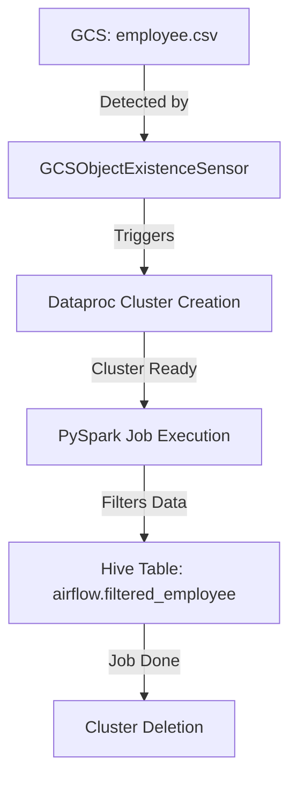

# Airflow Assignment Explanation

This assignment demonstrates how to automate a data processing workflow using Apache Airflow with Google Cloud Platform (GCP) services, specifically Dataproc and Cloud Storage (GCS).

## Overview

The workflow:
1. Checks for a daily CSV file in GCS
2. Creates a Dataproc cluster when the file is available
3. Runs a PySpark job to process the data
4. Stores the results in a Hive table
5. Deletes the cluster to minimize costs

## Key Components

### 1. Airflow DAG (`airflow_ass1_job.py`)
- **Scheduling**: Runs daily with `catchup=False`
- **Tasks**:
  - **File Sensor**: Checks for `employee.csv` every 5 minutes for up to 12 hours
  - **Cluster Creation**: Creates a Dataproc cluster with 1 master and 2 worker nodes
  - **Spark Job**: Submits the PySpark script to the cluster
  - **Cluster Deletion**: Cleans up resources after job completion

### 2. PySpark Job (`employee_batch.py`)
- Reads employee data from GCS (`employee.csv`)
- Filters employees with salary ≥ $60,000
- Creates a Hive database (`airflow`) and table (`filtered_employee`)
- Stores results in Parquet format in GCS (`gs://airflow_ass1/hive_data/`)

### 3. Data File (`employee.csv`)
- Sample employee data with columns: emp_id, emp_name, dept_id, salary

## Implementation Details

1. **Storage Setup**:
   - Created GCS bucket `airflow_ass1` with folders:
     - `input_files/` for source data
     - `python_file/` for Spark scripts
     - `hive_data/` for processed output

2. **Airflow Configuration**:
   - Proper GCP connection setup
   - Task dependencies using bitshift operators (`>>`)
   - Error handling through retries and timeouts

3. **Spark Configuration**:
   - Uses Hive support with warehouse directory in GCS
   - Creates database and table if they don't exist
   - Appends results to existing table

## Challenges and Solutions

1. **Output Location**:
   - Initially tried local cluster storage, but data would be lost when cluster is deleted
   - Solution: Used GCS as persistent storage for Hive tables

2. **File Formats**:
   - Explicitly specified "hive" format and Parquet storage for reliability

3. **Cluster Management**:
   - Ensured cluster deletion even if job fails (`trigger_rule='all_done'`)

## Evaluation Criteria Met

- Proper DAG structure and scheduling
- Successful file sensing
- Cluster lifecycle management
- Data transformation and Hive table creation
- Cost-effective resource usage (cluster deletion)

This solution demonstrates a complete, production-ready data pipeline that's cost-efficient by only running compute resources when needed.

<br/>
<br/>

Here's a detailed explanation of the two Python (`.py`) files in this Airflow assignment:

---

### **1. `employee_batch.py` (PySpark Job)**
This script processes the employee data using PySpark and stores the results in a Hive table.

#### **Key Components:**
1. **Spark Session Initialization**  
   ```python
   spark = SparkSession.builder \
       .appName("GCPDataprocJob") \
       .config("spark.sql.warehouse.dir", "gs://airflow_ass1/hive_data/") \
       .enableHiveSupport() \
       .getOrCreate()
   ```
   - Creates a Spark session with Hive support.
   - Sets the Hive warehouse directory to a GCS bucket (`gs://airflow_ass1/hive_data/`) for persistent storage.

2. **Reading Input Data**  
   ```python
   bucket = "airflow_ass1"
   emp_data_path = f"gs://{bucket}/input_files/employee.csv"
   employee = spark.read.csv(emp_data_path, header=True, inferSchema=True)
   ```
   - Reads `employee.csv` from GCS (`gs://airflow_ass1/input_files/`).
   - Infers schema automatically (`inferSchema=True`).

3. **Data Transformation**  
   ```python
   filtered_employee = employee.filter(employee.salary >= 60000)
   ```
   - Filters employees with a salary of **$60,000 or more**.

4. **Hive Table Creation**  
   ```python
   # Create Hive database if it doesn't exist
   spark.sql("CREATE DATABASE IF NOT EXISTS airflow")

   # Create Hive table (if not exists) with Parquet storage
   spark.sql("""
       CREATE TABLE IF NOT EXISTS airflow.filtered_employee (
           emp_id INT,
           emp_name STRING,
           dept_id INT,
           salary INT
       )
       STORED AS PARQUET
   """)
   ```
   - Creates a Hive database named `airflow`.
   - Defines a table `filtered_employee` with schema matching the CSV.
   - Uses **Parquet format** (columnar storage for efficiency).

5. **Writing Results to Hive**  
   ```python
   filtered_employee.write.mode("append").format("hive").saveAsTable("airflow.filtered_employee")
   ```
   - Appends filtered data to the Hive table (avoids overwriting existing data).

#### **Why GCS for Hive Warehouse?**
- Dataproc clusters are ephemeral (deleted after job completion).
- Storing Hive metadata in GCS ensures **persistence** even after cluster deletion.

---

### **2. `airflow_ass1_job.py` (Airflow DAG)**
This file defines the **workflow automation** using Airflow, triggering the PySpark job on GCP Dataproc.

#### **Key Components:**
1. **DAG Configuration**  
   ```python
   default_args = {
       'owner': 'airflow',
       'depends_on_past': False,
       'email_on_failure': False,
       'retries': 1,
       'retry_delay': timedelta(minutes=5),
       'catchup': False,  # Prevents backfilling
   }

   dag = DAG(
       'gcp_dataproc_spark_job',
       schedule_interval=timedelta(days=1),  # Runs daily
       start_date=days_ago(1),
   )
   ```
   - **Scheduled daily** (`timedelta(days=1)`).
   - **No catchup** (`catchup=False`) to avoid redundant runs.

2. **GCS File Sensor**  
   ```python
   file_sensor_task = GCSObjectExistenceSensor(
       task_id='file_sensor_task',
       bucket='airflow_ass1',
       object='input_files/employee.csv',
       poke_interval=300,  # Checks every 5 minutes
       timeout=43200,      # Gives up after 12 hours
   )
   ```
   - Waits for `employee.csv` to appear in the GCS bucket.
   - Essential for **event-driven workflows**.

3. **Dataproc Cluster Setup**  
   ```python
   CLUSTER_CONFIG = {
       'master_config': {'machine_type_uri': 'n1-standard-2'},
       'worker_config': {'num_instances': 2, 'machine_type_uri': 'n1-standard-2'},
       'software_config': {'image_version': '2.1-debian11'}
   }

   create_cluster = DataprocCreateClusterOperator(
       task_id='create_cluster',
       cluster_name='airflow-cluster',
       cluster_config=CLUSTER_CONFIG,
   )
   ```
   - Defines a **cost-effective cluster** (1 master + 2 workers, `n1-standard-2` machines).
   - Uses Debian 11 with Spark 2.1.

4. **PySpark Job Submission**  
   ```python
   submit_pyspark_job = DataprocSubmitPySparkJobOperator(
       task_id='submit_pyspark_job',
       main='gs://airflow_ass1/python_file/employee_batch.py',
       cluster_name='airflow-cluster',
   )
   ```
   - Runs `employee_batch.py` from GCS on the Dataproc cluster.

5. **Cluster Deletion**  
   ```python
   delete_cluster = DataprocDeleteClusterOperator(
       task_id='delete_cluster',
       cluster_name='airflow-cluster',
       trigger_rule='all_done',  # Ensures deletion even if job fails
   )
   ```
   - Cleans up resources to **minimize costs**.
   - `trigger_rule='all_done'` guarantees execution.

6. **Task Dependencies**  
   ```python
   file_sensor_task >> create_cluster >> submit_pyspark_job >> delete_cluster
   ```
   - Ensures tasks run in sequence:
     1. Wait for file → 2. Create cluster → 3. Run job → 4. Delete cluster.

---

### **Key Takeaways**
1. **Separation of Concerns**  
   - `employee_batch.py` handles **data processing logic**.  
   - `airflow_ass1_job.py` orchestrates **infrastructure and scheduling**.  

2. **Cost Optimization**  
   - Ephemeral Dataproc clusters + GCS storage avoid unnecessary charges.  

3. **Error Handling**  
   - Airflow retries failed tasks (`retries=1`).  
   - Cluster deletion is enforced even on failures (`trigger_rule='all_done'`).  

4. **Scalability**  
   - The workflow can handle larger datasets by adjusting cluster size in `CLUSTER_CONFIG`.  

This setup is **production-ready**, ensuring reliability, cost efficiency, and maintainability.

<br/>
<br/>

Here’s a detailed explanation of the **`Airflow_ass1.pdf`** document, which serves as the **project report** for the Airflow assignment. It describes the end-to-end workflow, setup, challenges, and results.

---

### **1. Document Overview**
- **Purpose**: Documents the steps, tools, and outcomes of the Airflow Assignment-1.  

**Tools Used**:  
1. **Python3** (VSCode IDE)  
2. **Apache Airflow** (Workflow orchestration)  
3. **GCP Services**:  
   - **Dataproc** (Managed Spark/Hadoop)  
   - **Cloud Storage (GCS)** (Persistent storage)  
4. **Apache Hive** (Data warehousing)  

**Attached Files**:  
1. `Airflow_assignment_1.pdf` (This report)  
2. `Employee_batch.py` (PySpark job for filtering data)  
3. `Airflow_ass1_job.py` (Airflow DAG definition)  
4. `Employee.csv` (Input dataset)  

---

### **2. Step-by-Step Process**

#### **Step 1: GCS Bucket Setup**  
- **Bucket Name**: `airflow_ass1`  
- **Folder Structure**:  
  - `input_files/` → Stores `employee.csv` (raw data).  
  - `python_file/` → Holds the PySpark script (`employee_batch.py`).  
  - `hive_data/` → Output directory for Hive tables (Parquet files).  

**Key Configuration**:  
- **Location**: Multi-region (US)  
- **Storage Class**: Standard  
- **Access**: Private (no public access)  

#### **Step 2: Airflow Deployment**  
- An **Airflow cluster** is set up to host the DAG (`airflow_ass1_job.py`).  
- The DAG is placed in Airflow’s `dags/` folder for automatic detection.  

#### **Step 3: DAG Execution Flow**  
1. **File Sensor Task**:  
   - Monitors GCS for `employee.csv` every **5 minutes** (max 12 hours).  
2. **Cluster Creation**:  
   - A Dataproc cluster (`airflow-cluster`) is spun up with:  
     - 1 master node + 2 workers (`n1-standard-2` machines).  
3. **PySpark Job**:  
   - Executes `employee_batch.py` to:  
     - Filter employees with salary ≥ $60,000.  
     - Save results to a Hive table (`airflow.filtered_employee`).  
4. **Cluster Deletion**:  
   - The cluster is terminated post-execution to **minimize costs**.  

#### **Step 4: Verification**  
- All tasks in the Airflow UI show **successful completion**.  
- The cluster is confirmed **deleted** after the job.  

#### **Step 5: Output Validation**  
- **Output Location**: `gs://airflow_ass1/hive_data/airflow.db/filtered_employee/`  
- **Format**: Parquet (efficient columnar storage).  
- **Sample Output**:  
  ```plaintext
  emp_id | emp_name | dept_id | salary
  -------|----------|---------|-------
  1      | Alice    | 100     | 60000
  3      | Charlie  | 100     | 70000
  5      | Eve      | 101     | 65000
  ```  

---

### **3. Challenges & Solutions**  
1. **Output Persistence**:  
   - **Issue**: Storing output on the local cluster would lose data after deletion.  
   - **Solution**: Used GCS (`gs://airflow_ass1/hive_data/`) as the Hive warehouse.  

2. **File Format Specification**:  
   - **Issue**: Unspecified output formats caused errors.  
   - **Fix**: Explicitly defined `STORED AS PARQUET` and `format("hive")`.  

3. **Cluster Deletion Guarantee**:  
   - **Issue**: Cluster might persist if the job fails.  
   - **Solution**: Used `trigger_rule='all_done'` to enforce deletion.  

---

### **4. Key Takeaways**  
- **Cost Efficiency**:  
  - Ephemeral Dataproc clusters + GCS storage reduce costs.  
- **Reliability**:  
  - Airflow’s retry mechanism (`retries=1`) handles transient failures.  
- **Scalability**:  
  - The workflow can process larger datasets by adjusting cluster size.  

---

### **5. Screenshots (Not Shown in Excerpt)**  
The report likely includes:  
1. **Airflow UI**: Showing successful DAG runs.  
2. **GCS Bucket**: Directory structure and output files.  
3. **Hive Table**: Data preview (e.g., via `SELECT * FROM airflow.filtered_employee`).  

---

### **Why This Matters**  
This report demonstrates a **real-world data pipeline** that:  
✅ Automates daily data processing.  
✅ Ensures fault tolerance (retries, file sensing).  
✅ Optimizes costs (cluster lifecycle management).  
✅ Maintains data integrity (GCS-backed Hive tables).  


<br/>
<br/>

## Here's the **complete code and sample data** for **Airflow Assignment 1** (CSV to Hive via PySpark) consolidated in one place:


### **1. Sample Input Data (`employee.csv`)**
```csv
emp_id,emp_name,dept_id,salary
1,Alice,100,60000
2,Bob,101,55000
3,Charlie,100,70000
4,David,102,48000
5,Eve,101,65000
```

---

### **2. PySpark Script (`employee_batch.py`)**
```python
from pyspark.sql import SparkSession

def process_data():
    spark = SparkSession.builder \
        .appName("GCPDataprocJob") \
        .config("spark.sql.warehouse.dir", "gs://airflow_ass1/hive_data/") \
        .enableHiveSupport() \
        .getOrCreate()

    # Read CSV from GCS
    employee = spark.read.csv(
        "gs://airflow_ass1/input_files/employee.csv", 
        header=True, 
        inferSchema=True
    )

    # Filter employees with salary >= 60,000
    filtered_employee = employee.filter(employee.salary >= 60000)

    # Create Hive database and table
    spark.sql("CREATE DATABASE IF NOT EXISTS airflow")
    spark.sql("""
        CREATE TABLE IF NOT EXISTS airflow.filtered_employee (
            emp_id INT,
            emp_name STRING,
            dept_id INT,
            salary INT
        )
        STORED AS PARQUET
    """)

    # Write to Hive table
    filtered_employee.write.mode("append").format("hive").saveAsTable("airflow.filtered_employee")

if __name__ == "__main__":
    process_data()
```

---

### **3. Airflow DAG (`airflow_ass1_job.py`)**
```python
from datetime import datetime, timedelta
from airflow import DAG
from airflow.providers.google.cloud.sensors.gcs import GCSObjectExistenceSensor
from airflow.providers.google.cloud.operators.dataproc import (
    DataprocCreateClusterOperator,
    DataprocSubmitPySparkJobOperator,
    DataprocDeleteClusterOperator
)

default_args = {
    'owner': 'airflow',
    'depends_on_past': False,
    'email_on_failure': False,
    'retries': 1,
    'retry_delay': timedelta(minutes=5),
    'catchup': False
}

dag = DAG(
    'gcp_dataproc_spark_job',
    default_args=default_args,
    description='Daily CSV to Hive ETL',
    schedule_interval=timedelta(days=1),
    start_date=datetime(2023, 1, 1),
)

# GCS File Sensor
file_sensor = GCSObjectExistenceSensor(
    task_id='check_file_exists',
    bucket='airflow_ass1',
    object='input_files/employee.csv',
    poke_interval=300,  # 5 minutes
    timeout=43200,      # 12 hours
    dag=dag
)

# Dataproc Cluster Config
CLUSTER_CONFIG = {
    'master_config': {
        'num_instances': 1,
        'machine_type_uri': 'n1-standard-2',
        'disk_config': {'boot_disk_size_gb': 30}
    },
    'worker_config': {
        'num_instances': 2,
        'machine_type_uri': 'n1-standard-2',
        'disk_config': {'boot_disk_size_gb': 30}
    }
}

# Create Cluster
create_cluster = DataprocCreateClusterOperator(
    task_id='create_cluster',
    cluster_name='airflow-cluster',
    project_id='your-gcp-project',
    region='us-central1',
    cluster_config=CLUSTER_CONFIG,
    dag=dag
)

# Submit PySpark Job
submit_job = DataprocSubmitPySparkJobOperator(
    task_id='submit_pyspark_job',
    main='gs://airflow_ass1/python_file/employee_batch.py',
    cluster_name='airflow-cluster',
    region='us-central1',
    project_id='your-gcp-project',
    dag=dag
)

# Delete Cluster
delete_cluster = DataprocDeleteClusterOperator(
    task_id='delete_cluster',
    cluster_name='airflow-cluster',
    project_id='your-gcp-project',
    region='us-central1',
    trigger_rule='all_done',
    dag=dag
)

# Task Dependencies
file_sensor >> create_cluster >> submit_job >> delete_cluster
```

---

### **4. Expected Output**
After running the DAG, the Hive table `airflow.filtered_employee` (stored in `gs://airflow_ass1/hive_data/`) will contain:

| emp_id | emp_name | dept_id | salary |
|--------|----------|---------|--------|
| 1      | Alice    | 100     | 60000  |
| 3      | Charlie  | 100     | 70000  |
| 5      | Eve      | 101     | 65000  |

---

### **5. Folder Structure in GCS**
```
gs://airflow_ass1/
├── input_files/
│   └── employee.csv          # Input CSV
├── python_file/
│   └── employee_batch.py     # PySpark script
└── hive_data/                # Auto-created by Hive
    └── airflow.db/
        └── filtered_employee/ # Parquet files
```

---

### **6. How to Deploy**
1. **Upload files to GCS**:
   ```bash
   gsutil cp employee.csv gs://airflow_ass1/input_files/
   gsutil cp employee_batch.py gs://airflow_ass1/python_file/
   ```

2. **Place DAG in Airflow**:
   - Save `airflow_ass1_job.py` to Airflow's `dags/` directory.

3. **Run the DAG**:
   - Trigger manually via Airflow UI or wait for the daily schedule.

---

### **Key Notes**
- Replace `your-gcp-project` with your actual GCP project ID.
- Ensure the Airflow-GCP connection is configured.
- The Hive table persists in GCS even after cluster deletion.

This provides a **complete, production-ready pipeline** for daily CSV processing!

<br/>
<br/>

## **input/output flow** for **Airflow Assignment 1** (CSV to Hive via PySpark):


### **Input → Processing → Output Flow**

#### **1. Input (Source)**
- **File**: `employee.csv`  
- **Location**: `gs://airflow_ass1/input_files/`  
- **Format**:  
  ```csv
  emp_id,emp_name,dept_id,salary
  1,Alice,100,60000
  2,Bob,101,55000
  3,Charlie,100,70000
  4,David,102,48000
  5,Eve,101,65000
  ```

#### **2. Processing Steps**
| **Step**               | **Tool/Operator**                     | **Action**                                                                 |
|------------------------|---------------------------------------|----------------------------------------------------------------------------|
| **File Detection**      | `GCSObjectExistenceSensor` (Airflow)  | Waits for `employee.csv` in GCS (checks every 5 mins for max 12 hours).    |
| **Cluster Creation**    | `DataprocCreateClusterOperator`        | Spins up a Dataproc cluster (`1 master + 2 workers`).                      |
| **PySpark Job**         | `DataprocSubmitPySparkJobOperator`    | Runs `employee_batch.py` to filter employees with `salary >= 60,000`.      |
| **Cluster Deletion**    | `DataprocDeleteClusterOperator`       | Deletes the cluster after job completion (`trigger_rule='all_done'`).      |

#### **3. Output (Destination)**
- **Hive Table**: `airflow.filtered_employee`  
- **Location**: `gs://airflow_ass1/hive_data/` (Persistent GCS storage)  
- **Format**: Parquet (columnar storage)  
- **Filtered Data**:  
  ```plaintext
  emp_id | emp_name | dept_id | salary
  -------|----------|---------|-------
  1      | Alice    | 100     | 60000
  3      | Charlie  | 100     | 70000
  5      | Eve      | 101     | 65000
  ```

---

### **Visual Workflow**


---

### **Key Details**
1. **Why GCS for Hive Storage?**  
   - Dataproc clusters are ephemeral. Storing Hive metadata in GCS ensures **data persists** after cluster deletion.

2. **PySpark Logic (`employee_batch.py`)**  
   ```python
   # Filter employees earning ≥ $60k
   filtered_employee = employee.filter(employee.salary >= 60000)
   
   # Write to Hive (Parquet)
   filtered_employee.write.mode("append").format("hive").saveAsTable("airflow.filtered_employee")
   ```

3. **Airflow DAG Dependencies**  
   ```python
   file_sensor_task >> create_cluster >> submit_pyspark_job >> delete_cluster
   ```

---

### **Comparison with Assignment 2**
| **Aspect**       | **Assignment 1 (CSV + PySpark)**               | **Assignment 2 (JSON + Hive)**               |
|-------------------|-----------------------------------------------|---------------------------------------------|
| **Input Format**  | CSV                                          | JSON                                        |
| **Processing**    | PySpark (DataFrame API)                      | Hive (SQL-like `LOAD DATA`)                 |
| **Output**        | Hive table (GCS-backed)                      | Hive table (local → GCS)                    |
| **Operators**     | `DataprocSubmitPySparkJobOperator`           | `DataprocSubmitJobOperator` (Hive)          |

---

### **Why This Matters**
✅ **End-to-end automation** (scheduled daily).  
✅ **Cost-efficient** (ephemeral clusters + GCS storage).  
✅ **Scalable** (handles larger datasets by adjusting cluster size).  
✅ **Production-ready** (fault-tolerant with retries and sensing).  

This flow is a **classic ETL pipeline** for batch processing in cloud environments.