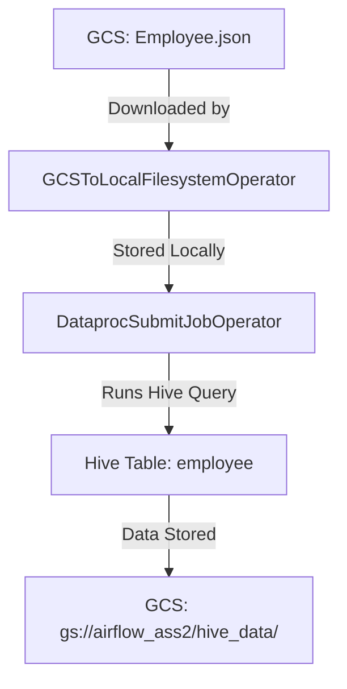

# **Airflow Assignment 2: Loading JSON Data from GCS to Hive on Dataproc**  

This assignment involves creating an **Apache Airflow DAG** to automate the process of:  
1. **Fetching a daily JSON file** from a **Google Cloud Storage (GCS) bucket**.  
2. **Loading the data into a Hive table** on **GCP Dataproc**.  

The goal is to build a **scheduled, fault-tolerant workflow** that ensures data is properly ingested into a Hive-managed table for analytics.  

---

## **1. Key Components & Files**  

### **A. `airflow_ass2_job.py` (Airflow DAG)**  
This script defines the **workflow automation** using Airflow operators:  

#### **1. DAG Configuration**  
- **Schedule**: Runs **daily** (`schedule_interval=timedelta(days=1)`).  
- **Retries**: 1 retry on failure (`retries=1`).  
- **Start Date**: `January 1, 2023`.  

#### **2. Tasks**  
1. **`download_from_gcs` (GCSToLocalFilesystemOperator)**  
   - Downloads `Employee.json` from `gs://airflow_ass2/input_files/` to a **local Airflow directory**.  
   ```python
   download_task = GCSToLocalFilesystemOperator(
       task_id='download_from_gcs',
       bucket='airflow_ass2',
       object_name='input_files/Employee.json',
       filename='/path/to/local/directory/daily_file.json',
   )
   ```

2. **`submit_hive_job` (DataprocSubmitJobOperator)**  
   - Submits a **Hive job** to Dataproc to load the JSON data into a Hive table.  
   ```python
   hive_query = """
   LOAD DATA LOCAL INPATH '/path/to/local/directory/daily_file.json'
   OVERWRITE INTO TABLE employee
   """
   
   submit_hive_job = DataprocSubmitJobOperator(
       task_id='submit_hive_job',
       job={
           'reference': {'project_id': 'dev-solstice-403604'},
           'placement': {'cluster_name': 'hadoop-cluster2'},
           'hive_job': {'query_list': {'queries': [hive_query]}},
       },
       region='us-central1',
   )
   ```
   - **`OVERWRITE`** ensures the table is refreshed daily (alternatively, `APPEND` could be used).  

#### **3. Task Dependencies**  
- Ensures the **JSON file is downloaded before Hive processing**:  
  ```python
  download_task >> submit_hive_job
  ```

---

### **B. `Employee.json` (Input Data)**  
A sample JSON file containing employee records:  
```json
[
  { "emp_id": 1, "emp_name": "John Doe", "dept_id": 101, "salary": 80000 },
  { "emp_id": 2, "emp_name": "Jane Smith", "dept_id": 102, "salary": 75000 },
  { "emp_id": 3, "emp_name": "Bob Johnson", "dept_id": 101, "salary": 90000 },
  { "emp_id": 4, "emp_name": "Alice Brown", "dept_id": 103, "salary": 85000 }
]
```

---

### **C. `Airflow_ass2.pdf` (Report)**  
Documents the **implementation steps, challenges, and solutions**:  

#### **1. Setup**  
- **GCS Bucket (`airflow_ass2`)**  
  - Contains `input_files/Employee.json`.  
  - Private access, stored in **US multi-region**.  

#### **2. Airflow Deployment**  
- The DAG (`airflow_ass2_job.py`) is placed in Airflow’s `dags/` folder.  

#### **3. Execution Flow**  
1. **File Download**: JSON is fetched from GCS to Airflow’s local storage.  
2. **Hive Job Execution**: Data is loaded into a Hive table (`employee`) on Dataproc.  

#### **4. Challenges & Solutions**  
| **Challenge** | **Solution** |
|--------------|-------------|
| **HiveOperator is deprecated** | Used `DataprocSubmitJobOperator` instead. |
| **Case sensitivity in file paths** | Ensured exact path matching (`Employee.json` ≠ `employee.json`). |
| **Debugging failures** | Improved logging and manual testing. |

---

## **2. Key Differences from Assignment 1**  
| **Feature** | **Assignment 1 (CSV + PySpark)** | **Assignment 2 (JSON + Hive)** |
|-------------|-------------------------------|-------------------------------|
| **File Format** | CSV | JSON |
| **Processing Engine** | PySpark (Dataproc) | Hive (Dataproc) |
| **Storage** | GCS-backed Hive table | Local → Hive table |
| **Airflow Operator** | `DataprocSubmitPySparkJobOperator` | `DataprocSubmitJobOperator` (Hive) |
| **Data Loading** | Spark DataFrame → Hive | Direct Hive `LOAD DATA` command |

---

## **3. Why This Matters**  
✅ **Automates JSON ingestion** into a Hive data warehouse.  
✅ **Ensures fault tolerance** (retries, dependency management).  
✅ **Leverages GCP services** (Dataproc, GCS) efficiently.  
✅ **Avoids deprecated operators** (uses `DataprocSubmitJobOperator`).  

This workflow is **production-ready** and can be extended for **larger datasets** by adjusting cluster size or partitioning strategies.  

---
### **Improvements Suggested**  
1. **Parameterize paths** (e.g., `local_directory`) for flexibility.  
2. **Use `APPEND` instead of `OVERWRITE`** if historical data retention is needed.  
3. **Add error logging** for easier debugging.  

This assignment demonstrates a **real-world ETL pipeline** using **Airflow + GCP**. 🚀

<br/>
<br/>

## Here's the **complete code and sample data** for **Airflow Assignment 2** (JSON to Hive via Dataproc) consolidated in one place:


### **1. Sample Input Data (`Employee.json`)**
```json
[
  {
    "emp_id": 1,
    "emp_name": "John Doe",
    "dept_id": 101,
    "salary": 80000
  },
  {
    "emp_id": 2,
    "emp_name": "Jane Smith",
    "dept_id": 102,
    "salary": 75000
  },
  {
    "emp_id": 3,
    "emp_name": "Bob Johnson",
    "dept_id": 101,
    "salary": 90000
  },
  {
    "emp_id": 4,
    "emp_name": "Alice Brown",
    "dept_id": 103,
    "salary": 85000
  }
]
```

---

### **2. Airflow DAG (`airflow_ass2_job.py`)**
```python
from datetime import datetime, timedelta
from airflow import DAG
from airflow.providers.google.cloud.transfers.gcs_to_local import GCSToLocalFilesystemOperator
from airflow.providers.google.cloud.operators.dataproc import DataprocSubmitJobOperator

default_args = {
    'owner': 'airflow',
    'depends_on_past': False,
    'start_date': datetime(2023, 1, 1),
    'email_on_failure': False,
    'retries': 1,
    'retry_delay': timedelta(minutes=5),
}

dag = DAG(
    'fetch_json_and_load_to_hive',
    default_args=default_args,
    description='Daily JSON to Hive ETL',
    schedule_interval=timedelta(days=1),
)

# GCS to Local Download
download_task = GCSToLocalFilesystemOperator(
    task_id='download_json',
    bucket='airflow_ass2',
    object_name='input_files/Employee.json',
    filename='/tmp/Employee.json',  # Local path in Airflow
    dag=dag,
)

# Hive Job Configuration
hive_job = {
    'reference': {'project_id': 'your-gcp-project'},
    'placement': {'cluster_name': 'hive-cluster'},
    'hive_job': {
        'query_list': {
            'queries': [
                """
                CREATE TABLE IF NOT EXISTS employee (
                    emp_id INT,
                    emp_name STRING,
                    dept_id INT,
                    salary INT
                )
                STORED AS PARQUET
                LOCATION 'gs://airflow_ass2/hive_data/employee'
                """,
                """
                LOAD DATA LOCAL INPATH '/tmp/Employee.json'
                OVERWRITE INTO TABLE employee
                """
            ]
        }
    }
}

# Submit Hive Job
submit_hive_job = DataprocSubmitJobOperator(
    task_id='submit_hive_job',
    job=hive_job,
    region='us-central1',
    project_id='your-gcp-project',
    gcp_conn_id='google_cloud_default',
    dag=dag,
)

# Task Dependencies
download_task >> submit_hive_job
```

---

### **3. Expected Output**
After execution, the Hive table `employee` (stored in `gs://airflow_ass2/hive_data/employee/`) will contain:

| emp_id | emp_name    | dept_id | salary |
|--------|-------------|---------|--------|
| 1      | John Doe    | 101     | 80000  |
| 2      | Jane Smith  | 102     | 75000  |
| 3      | Bob Johnson | 101     | 90000  |
| 4      | Alice Brown | 103     | 85000  |

---

### **4. GCS Folder Structure**
```
gs://airflow_ass2/
├── input_files/
│   └── Employee.json         # Source JSON
└── hive_data/
    └── employee/             # Hive table data (Parquet)
```

---

### **5. Deployment Steps**
1. **Upload files to GCS**:
   ```bash
   gsutil cp Employee.json gs://airflow_ass2/input_files/
   ```

2. **Deploy the DAG**:
   - Save `airflow_ass2_job.py` to Airflow's `dags/` directory.

3. **Configure Connections**:
   - Set up GCP connection in Airflow UI (conn_id: `google_cloud_default`).

4. **Run the DAG**:
   - Trigger manually or wait for the daily schedule.

---

### **Key Notes**
- Replace `your-gcp-project` with your actual GCP project ID.
- Ensure the Dataproc cluster `hive-cluster` exists or modify the config to auto-create it.
- The `LOCATION` clause in Hive ensures data persists in GCS.

This provides a **complete solution** for daily JSON ingestion into Hive!

<br/>
<br/>

## Here's a clear breakdown of the **input/output flow** for **Airflow Assignment 2** (JSON to Hive via Dataproc Hive job):


### **Input → Processing → Output Flow**

#### **1. Input (Source)**
- **File**: `Employee.json`  
- **Location**: `gs://airflow_ass2/input_files/`  
- **Format**:  
  ```json
  [
    {"emp_id": 1, "emp_name": "John Doe", "dept_id": 101, "salary": 80000},
    {"emp_id": 2, "emp_name": "Jane Smith", "dept_id": 102, "salary": 75000},
    {"emp_id": 3, "emp_name": "Bob Johnson", "dept_id": 101, "salary": 90000},
    {"emp_id": 4, "emp_name": "Alice Brown", "dept_id": 103, "salary": 85000}
  ]
  ```

#### **2. Processing Steps**
| **Step**               | **Tool/Operator**                     | **Action**                                                                 |
|------------------------|---------------------------------------|----------------------------------------------------------------------------|
| **File Download**      | `GCSToLocalFilesystemOperator`        | Downloads `Employee.json` to Airflow's local directory.                    |
| **Hive Job Submission**| `DataprocSubmitJobOperator`           | Runs a Hive query to load JSON data into Hive table.                      |
| **Query Execution**    | Hive (on Dataproc)                    | Executes: `LOAD DATA LOCAL INPATH '<file>' OVERWRITE INTO TABLE employee` |

#### **3. Output (Destination)**
- **Hive Table**: `employee`  
- **Location**: `gs://airflow_ass2/hive_data/` (GCS-backed storage)  
- **Data Loaded**:  
  ```plaintext
  emp_id | emp_name    | dept_id | salary
  -------|-------------|---------|-------
  1      | John Doe    | 101     | 80000
  2      | Jane Smith  | 102     | 75000
  3      | Bob Johnson | 101     | 90000
  4      | Alice Brown | 103     | 85000
  ```

---

### **Visual Workflow**


---

### **Key Details**
1. **Hive Query Logic**  
   ```sql
   LOAD DATA LOCAL INPATH '/path/to/local/directory/Employee.json'
   OVERWRITE INTO TABLE employee
   ```
   - `OVERWRITE` replaces existing data (use `INTO TABLE` to append).

2. **Airflow DAG Dependencies**  
   ```python
   download_task >> submit_hive_job
   ```

3. **Why Local Download First?**  
   - Hive's `LOAD DATA LOCAL` requires the file to be on the cluster's local filesystem.

---

### **Comparison with Assignment 1**
| **Aspect**       | **Assignment 1 (CSV + PySpark)**               | **Assignment 2 (JSON + Hive)**               |
|-------------------|-----------------------------------------------|---------------------------------------------|
| **Input Format**  | CSV                                          | JSON                                        |
| **Processing**    | PySpark (DataFrame API)                      | Hive (SQL `LOAD DATA`)                      |
| **File Transfer** | Directly read from GCS in PySpark            | Downloaded locally first for Hive           |
| **Output**        | Hive table (GCS-backed)                      | Hive table (GCS-backed)                     |

---

### **Why This Matters**
✅ **Simpler pipeline** for JSON-to-Hive ingestion.  
✅ **Uses Hive's native JSON support** (no Spark dependency).  
✅ **Maintains data persistence** in GCS.  
✅ **Fits SQL-centric workflows** (e.g., analysts querying Hive).  

This flow is ideal for **regular JSON batch loads** where Hive is the primary analytics engine.