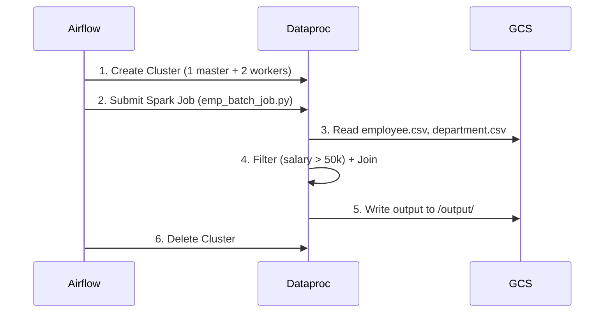
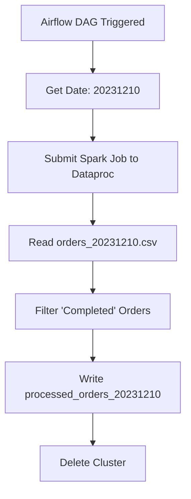

# Project Explanation: GCP Dataproc Spark Job with Airflow Orchestration

## Project Requirements

This project demonstrates a data processing pipeline with the following requirements:

1. **Data Processing**: Join employee and department data, filtering for high-salary employees
2. **Infrastructure Automation**: Automatically create and destroy cloud resources to minimize costs
3. **Scheduled Execution**: Run the processing job daily
4. **Scalability**: Handle potentially large datasets using Spark
5. **Reliability**: Include retry mechanisms for failures

## Solution Architecture

The solution implements these requirements using:

1. **Google Cloud Platform (GCP) Services**:
   - Dataproc for managed Spark clusters
   - Google Cloud Storage (GCS) for data storage

2. **Apache Airflow** for workflow orchestration:
   - Scheduling daily runs
   - Managing cluster lifecycle
   - Handling job submission and dependencies

3. **Apache Spark** for distributed data processing

## Component Details

### 1. Airflow DAG (`airflow_spark_job.py`)

- **Cluster Configuration**:
  - 1 master node and 2 worker nodes (n1-standard-2 machines)
  - 30GB standard persistent disks
  - Debian-based Dataproc image version 2.2.26

- **Workflow Tasks**:
  1. `create_cluster`: Provisions a Dataproc cluster
  2. `submit_pyspark_job`: Runs the Spark job
  3. `delete_cluster`: Tears down the cluster (even if job fails)

- **Scheduling**:
  - Runs daily
  - No catchup to prevent backfills
  - 1 retry with 5-minute delay on failure

### 2. Spark Job (`emp_batch_job.py`)

- **Data Processing Logic**:
  1. Reads employee and department data from GCS
  2. Filters employees with salary > $50,000
  3. Joins with department data on `dept_id`
  4. Writes results back to GCS

- **Input Data**:
  - `employee.csv`: Contains employee details (ID, name, department, salary)
  - `department.csv`: Contains department details (ID, name)

### 3. Data Files

- **employee.csv**: Sample employee data
- **department.csv**: Sample department data

## Execution Flow

1. Airflow creates a Dataproc cluster
2. Spark job is submitted to the cluster:
   - Reads input data from GCS
   - Processes and filters the data
   - Writes output to GCS
3. Cluster is deleted regardless of job success/failure

## Benefits

1. **Cost Efficiency**: Clusters only exist during job execution
2. **Scalability**: Spark can handle large datasets by distributing work
3. **Maintainability**: Infrastructure-as-code approach
4. **Reliability**: Airflow handles scheduling, retries, and dependencies
5. **Separation of Concerns**: 
   - Airflow manages orchestration
   - Spark handles data processing
   - GCP provides managed services

## Potential Enhancements

1. Add data validation steps
2. Implement error handling and notifications
3. Add monitoring and logging
4. Parameterize the salary threshold
5. Enable Spark resource configuration (commented in the code)
6. Add unit tests for the Spark job

This solution provides a complete, production-ready pipeline for daily processing of employee data while optimizing cloud resource usage.

<br/>
<br/>

Here's a detailed explanation of both `.py` files in the project:

---

### **1. `airflow_spark_job.py` (Airflow DAG File)**

This file defines an **Airflow Directed Acyclic Graph (DAG)** that orchestrates the creation, execution, and teardown of a **Dataproc Spark job** on Google Cloud.

#### **Key Components:**

#### **A. Imports**
```python
from datetime import datetime, timedelta
from airflow import DAG
from airflow.providers.google.cloud.operators.dataproc import (
    DataprocCreateClusterOperator,
    DataprocSubmitPySparkJobOperator,
    DataprocDeleteClusterOperator
)
from airflow.utils.dates import days_ago
```
- **`DAG`**: The core Airflow class for defining workflows.
- **Dataproc Operators**:
  - `DataprocCreateClusterOperator`: Creates a Dataproc cluster.
  - `DataprocSubmitPySparkJobOperator`: Submits a PySpark job to the cluster.
  - `DataprocDeleteClusterOperator`: Deletes the cluster after job completion.
- **`days_ago`**: Helper function to set the DAG's start date.

---

#### **B. Default Arguments**
```python
default_args = {
    'owner': 'airflow',
    'depends_on_past': False,
    'email_on_failure': False,
    'email_on_retry': False,
    'retries': 1,
    'retry_delay': timedelta(minutes=5),
}
```
- **`retries`**: If the job fails, Airflow will retry once.
- **`retry_delay`**: Waits 5 minutes before retrying.
- **`depends_on_past`**: Ensures that a task does not depend on its previous run.

---

#### **C. DAG Definition**
```python
dag = DAG(
    'gcp_dataproc_spark_job',
    default_args=default_args,
    description='A DAG to run Spark job on Dataproc',
    schedule_interval=timedelta(days=1),
    start_date=days_ago(1),
    catchup=False,
    tags=['dev'],
)
```
- **`schedule_interval=timedelta(days=1)`**: Runs the job **daily**.
- **`catchup=False`**: Prevents backfilling past runs.
- **`tags=['dev']`**: Helps categorize the DAG in the Airflow UI.

---

#### **D. Dataproc Cluster Configuration**
```python
CLUSTER_NAME = 'spark-airflow-demo'
PROJECT_ID = 'mindful-pillar-426308-k1'
REGION = 'us-central1'
CLUSTER_CONFIG = {
    'master_config': {
        'num_instances': 1,
        'machine_type_uri': 'n1-standard-2',
        'disk_config': {
            'boot_disk_type': 'pd-standard',
            'boot_disk_size_gb': 30
        }
    },
    'worker_config': {
        'num_instances': 2,
        'machine_type_uri': 'n1-standard-2',
        'disk_config': {
            'boot_disk_type': 'pd-standard',
            'boot_disk_size_gb': 30
        }
    },
    'software_config': {
        'image_version': '2.2.26-debian12'
    }
}
```
- **Cluster Setup**:
  - **1 master node** (`n1-standard-2` machine, 30GB disk).
  - **2 worker nodes** (same specs as master).
  - **Image version**: `2.2.26-debian12` (Debian-based Dataproc).

---

#### **E. Airflow Tasks**
##### **1. `create_cluster`**
```python
create_cluster = DataprocCreateClusterOperator(
    task_id='create_cluster',
    cluster_name=CLUSTER_NAME,
    project_id=PROJECT_ID,
    region=REGION,
    cluster_config=CLUSTER_CONFIG,
    dag=dag,
)
```
- **Creates a Dataproc cluster** before running the Spark job.

##### **2. `submit_pyspark_job`**
```python
pyspark_job = {
    'main_python_file_uri': 'gs://airflow-projects/airflow-project-1/spark-code/emp_batch_job.py'
}

submit_pyspark_job = DataprocSubmitPySparkJobOperator(
    task_id='submit_pyspark_job',
    main=pyspark_job['main_python_file_uri'],
    cluster_name=CLUSTER_NAME,
    region=REGION,
    project_id=PROJECT_ID,
    dag=dag,
)
```
- **Submits the PySpark job (`emp_batch_job.py`)** stored in GCS.
- The job filters and joins employee & department data.

##### **3. `delete_cluster`**
```python
delete_cluster = DataprocDeleteClusterOperator(
    task_id='delete_cluster',
    project_id=PROJECT_ID,
    cluster_name=CLUSTER_NAME,
    region=REGION,
    trigger_rule='all_done',  # Ensures deletion even if job fails
    dag=dag,
)
```
- **Deletes the cluster** after job completion (success or failure).

---

#### **F. Task Dependencies**
```python
create_cluster >> submit_pyspark_job >> delete_cluster
```
- **Execution Flow**:
  1. **Create Cluster** → **Submit Job** → **Delete Cluster**.

---

### **2. `emp_batch_job.py` (PySpark Job File)**

This script contains the **Spark data processing logic** that runs on Dataproc.

#### **Key Components:**

#### **A. Imports**
```python
from pyspark.sql import SparkSession
```
- **`SparkSession`**: Entry point for Spark SQL operations.

---

#### **B. `process_data()` Function**
##### **1. Initialize Spark Session**
```python
spark = SparkSession.builder.appName("GCPDataprocJob").getOrCreate()
```
- Creates a Spark session with the app name `"GCPDataprocJob"`.

##### **2. Define Input/Output Paths**
```python
bucket = "airflow-projects"
emp_data_path = f"gs://{bucket}/airflow-project-1/data/employee.csv"
dept_data_path = f"gs://{bucket}/airflow-project-1/data/department.csv"
output_path = f"gs://{bucket}/airflow-project-1/output"
```
- **Inputs**:
  - `employee.csv` (employee data)
  - `department.csv` (department data)
- **Output**: Written to `output/` in GCS.

##### **3. Read Data**
```python
employee = spark.read.csv(emp_data_path, header=True, inferSchema=True)
department = spark.read.csv(dept_data_path, header=True, inferSchema=True)
```
- Reads CSV files with headers and schema inference.

##### **4. Filter Employees (Salary > 50,000)**
```python
filtered_employee = employee.filter(employee.salary > 50000)
```
- Keeps only employees with salary > $50,000.

##### **5. Join with Department Data**
```python
joined_data = filtered_employee.join(department, "dept_id", "inner")
```
- Joins `filtered_employee` with `department` on `dept_id`.

##### **6. Write Output**
```python
joined_data.write.csv(output_path, mode="overwrite", header=True)
```
- Saves results as CSV with headers (overwrites existing files).

##### **7. Stop Spark Session**
```python
spark.stop()
```
- Releases Spark resources.

---

#### **C. Main Block**
```python
if __name__ == "__main__":
    process_data()
```
- Ensures the script runs only when executed directly (not when imported).

---

### **Summary of `.py` Files**

| File | Purpose | Key Features |
|------|---------|-------------|
| `airflow_spark_job.py` | **Orchestrates Spark job execution** | - Defines Airflow DAG <br> - Manages cluster lifecycle <br> - Submits Spark job |
| `emp_batch_job.py` | **Processes data using Spark** | - Reads CSV files <br> - Filters & joins data <br> - Writes output to GCS |

This setup ensures **cost-efficient, scalable, and automated** data processing in GCP. 🚀

<br/>
<br/>

## **Sample Input & Output Flow**

#### **1. Input Data (Stored in GCS)**
**File Structure:**  
```
gs://airflow-projects/airflow-project-1/data/
├── employee.csv  
├── department.csv  
```

**Sample `employee.csv`:**
```
emp_id,emp_name,dept_id,salary
1,Alice,100,60000
2,Bob,101,55000
3,Charlie,100,70000
4,David,102,48000
5,Eve,101,65000
```

**Sample `department.csv`:**
```
dept_id,dept_name
100,Engineering
101,Marketing
102,HR
```

---

#### **2. Airflow DAG Execution**
1. **Trigger DAG** (`gcp_dataproc_spark_job`):
   - Airflow creates a Dataproc cluster (1 master + 2 workers).
   - Submits the Spark job (`emp_batch_job.py`).
   - Passes input/output paths from GCS.

2. **Spark Job Logic** (`emp_batch_job.py`):
   - **Step 1:** Reads `employee.csv` and `department.csv`.
   - **Step 2:** Filters employees with `salary > 50000`:
     ```python
     filtered_employee = employee.filter(employee.salary > 50000)
     ```
     **Filtered Employees**:
     ```
     emp_id,emp_name,dept_id,salary
     1,Alice,100,60000
     2,Bob,101,55000
     3,Charlie,100,70000
     5,Eve,101,65000
     ```
   - **Step 3:** Joins with `department.csv` on `dept_id`:
     ```python
     joined_data = filtered_employee.join(department, "dept_id", "inner")
     ```
     **Joined Output**:
     ```
     dept_id,emp_id,emp_name,salary,dept_name
     100,1,Alice,60000,Engineering
     101,2,Bob,55000,Marketing
     100,3,Charlie,70000,Engineering
     101,5,Eve,65000,Marketing
     ```

3. **Writes Output to GCS**:
   - Path: `gs://airflow-projects/airflow-project-1/output/`
   - Format: CSV with headers (overwritten daily).

---

#### **3. Output Data**
**File Structure:**  
```
gs://airflow-projects/airflow-project-1/output/
├── part-00000-...csv  # Spark output file
├── _SUCCESS           # Marker file (indicates job success)
```

**Sample Output (`part-00000-...csv`):**
```
dept_id,emp_id,emp_name,salary,dept_name
100,1,Alice,60000,Engineering
101,2,Bob,55000,Marketing
100,3,Charlie,70000,Engineering
101,5,Eve,65000,Marketing
```

---

#### **4. Cluster Teardown**
- Airflow deletes the Dataproc cluster after job completion (success/failure) to save costs.

---

### **Visual Workflow**


---

### **Key Points**
1. **Input**: Raw CSV files in GCS (`employee.csv`, `department.csv`).
2. **Transformation**:
   - Filter employees by salary.
   - Join with department data.
3. **Output**: Processed CSV in GCS (only high-salary employees with department names).
4. **Infrastructure**:  
   - Cluster auto-created/deleted by Airflow.  
   - Spark handles distributed processing.  

This flow ensures **cost-efficiency** (no idle clusters) and **scalability** (Spark can handle large datasets).


<br/>
<br/>

# **Project Explanation: Batch Order Processing with Airflow & Dataproc**

## **Project Requirements**
This project automates **daily batch processing of order data** with the following requirements:

1. **Data Processing**:
   - Filter and process order data to retain only **"Completed"** orders.
   - Store processed data in a structured format.

2. **Automation & Scheduling**:
   - Run the job **daily** using Airflow.
   - Dynamically pass the **execution date** to the Spark job.

3. **Infrastructure Management**:
   - Use **Google Dataproc** for Spark processing.
   - Automatically **create and delete clusters** to optimize costs.

4. **Error Handling & Logging**:
   - Retry failed jobs.
   - Log execution details.

5. **Scalability**:
   - Process large datasets efficiently using **Spark**.
   - Store input/output in **Google Cloud Storage (GCS)**.

---

## **Solution Architecture**
The solution consists of **4 key components**:

| Component | Purpose |
|-----------|---------|
| **Airflow DAG (`airflow_orders_job.py`)** | Orchestrates the workflow (scheduling, cluster management, job submission). |
| **Spark Job (`orders_data_process.py`)** | Processes order data (filters "Completed" orders). |
| **Input Data (`orders_YYYYMMDD.csv`)** | Raw order data stored in GCS. |
| **Output Data (`processed_orders_YYYYMMDD`)** | Processed results stored in GCS. |

### **1. Airflow DAG (`airflow_orders_job.py`)**
#### **Key Features:**
- **Scheduled Execution**: Runs daily (`schedule_interval=timedelta(days=1)`).
- **Dynamic Date Handling**:
  - Uses `PythonOperator` to fetch the execution date (`{{ ds_nodash }}`).
  - Passes the date to the Spark job as an argument (`--date=20231210`).
- **Dataproc Job Submission**:
  - Submits `orders_data_process.py` to Dataproc.
  - Uses `DataprocSubmitPySparkJobOperator` for job execution.
- **Error Handling**:
  - Retries failed jobs (`retries=1`).
  - Waits 5 minutes before retrying (`retry_delay=timedelta(minutes=5)`).

#### **Workflow Steps:**
1. **`get_execution_date_task`** → Extracts the execution date (`20231210`).
2. **`submit_pyspark_job`** → Submits the Spark job with the date parameter.

---

### **2. Spark Job (`orders_data_process.py`)**
#### **Key Features:**
- **Accepts Date Argument** (`--date=20231210`).
- **Reads CSV from GCS** (`gs://.../orders_20231210.csv`).
- **Filters "Completed" Orders** (`df.filter(df.order_status == "Completed")`).
- **Writes Processed Data** (`gs://.../processed_orders_20231210`).

#### **Execution Flow:**
1. **Initialize Spark** (`SparkSession`).
2. **Read Input Data** (`spark.read.csv`).
3. **Filter Orders** (only "Completed").
4. **Write Output** (`df_filtered.write.csv`).

---

### **3. Input Data (`orders_YYYYMMDD.csv`)**
- **Format**: CSV with headers (`order_id, product, quantity, order_status, order_date`).
- **Example Files**:
  - `orders_20231210.csv` (3 completed orders)
  - `orders_20231211.csv` (1 completed order)
  - `orders_20231217.csv` (2 completed orders)

---

### **4. Output Data (`processed_orders_YYYYMMDD`)**
- **Stored in GCS** (`gs://.../processed_orders_20231210`).
- **Format**: CSV with headers (only "Completed" orders).

---

## **Execution Workflow**
1. **Airflow Triggers DAG** (daily).
2. **`get_execution_date_task`** determines the date (`20231210`).
3. **`submit_pyspark_job`** runs `orders_data_process.py` on Dataproc:
   - Reads `orders_20231210.csv`.
   - Filters "Completed" orders.
   - Writes to `processed_orders_20231210`.
4. **Cluster is deleted** after job completion.

---

## **Benefits of This Solution**
✅ **Cost-Efficient**:  
   - Dataproc clusters are **auto-deleted** after job completion.  

✅ **Scalable**:  
   - Spark handles **large datasets efficiently**.  

✅ **Automated & Scheduled**:  
   - Airflow ensures **daily execution without manual intervention**.  

✅ **Dynamic Date Handling**:  
   - Processes data **for the correct date** (`{{ ds_nodash }}`).  

✅ **Reliable**:  
   - Retries failed jobs automatically.  

✅ **Auditable**:  
   - Outputs are stored **with date-based naming** (`processed_orders_20231210`).  

---

## **Potential Enhancements**
1. **Add Data Validation** (e.g., check if input file exists).
2. **Send Alerts on Failure** (Slack/Email notifications).
3. **Optimize Spark Performance** (adjust `executor.memory`, `executor.cores`).
4. **Store Metadata** (e.g., job execution logs in BigQuery).
5. **Support Backfilling** (process historical data if needed).

---

### **Final Summary**
This project provides a **fully automated, scalable, and cost-effective** solution for daily order processing using **Airflow + Dataproc + Spark**. 🚀


<br/>
<br/>

### 1. `airflow_orders_job.py` (Airflow DAG File)

#### Purpose:
This file defines an Airflow DAG that orchestrates the daily processing of order data using Google Cloud Dataproc and PySpark.

#### Key Components:

**A. Imports and Setup**
```python
from datetime import datetime, timedelta
from airflow import DAG
from airflow.models import Variable
from airflow.providers.google.cloud.operators.dataproc import (
    DataprocSubmitPySparkJobOperator,
    DataprocCreateClusterOperator,
    DataprocDeleteClusterOperator
)
from airflow.operators.python import PythonOperator
from airflow.utils.dates import days_ago
from airflow.models.param import Param
```

**B. Default Arguments**
```python
default_args = {
    'owner': 'airflow',
    'depends_on_past': False,  # Doesn't depend on previous runs
    'email_on_failure': False,
    'email_on_retry': False,
    'retries': 1,  # Will retry once if fails
    'retry_delay': timedelta(minutes=5),  # 5 minute delay between retries
}
```

**C. DAG Definition**
```python
dag = DAG(
    'batch_spark_job_new',
    default_args=default_args,
    description='A DAG to run Spark job on Dataproc',
    schedule_interval=timedelta(days=1),  # Runs daily
    start_date=datetime(2024, 7, 25),  # Start date
    catchup=False,  # No backfilling
    tags=['dev'],  # For organization
    params={  # Parameter that can be passed when triggering the DAG
        'execution_date': Param(default='NA', type='string', 
                              description='Execution date in yyyymmdd format'),
    }
)
```

**D. Configuration**
```python
# Fetch cluster details from Airflow Variables
config = Variable.get("cluster_details", deserialize_json=True)
CLUSTER_NAME = config['CLUSTER_NAME']
PROJECT_ID = config['PROJECT_ID']
REGION = config['REGION']

pyspark_job_file_path = 'gs://airflow-projects/airflow-project-2/spark_code/orders_data_process.py'
```

**E. Python Function for Date Handling**
```python
def get_execution_date(ds_nodash, **kwargs):
    execution_date = kwargs['params'].get('execution_date', 'NA')
    if execution_date == 'NA':
        execution_date = ds_nodash  # Default to DAG run date
    return execution_date
```

**F. Tasks Definition**
```python
# Task to get execution date
get_execution_date_task = PythonOperator(
    task_id='get_execution_date',
    python_callable=get_execution_date,
    provide_context=True,
    op_kwargs={'ds_nodash': '{{ ds_nodash }}'},  # Airflow template variable
    dag=dag,
)

# Task to submit Spark job
submit_pyspark_job = DataprocSubmitPySparkJobOperator(
    task_id='submit_pyspark_job',
    main=pyspark_job_file_path,
    arguments=['--date={{ ti.xcom_pull(task_ids="get_execution_date") }}'],
    cluster_name=CLUSTER_NAME,
    region=REGION,
    project_id=PROJECT_ID,
    dag=dag,
)
```

**G. Task Dependencies**
```python
get_execution_date_task >> submit_pyspark_job
```

### 2. `orders_data_process.py` (PySpark Job File)

#### Purpose:
This script processes daily order data, filtering for completed orders and saving the results.

#### Key Components:

**A. Imports**
```python
from pyspark.sql import SparkSession
import argparse
```

**B. Main Processing Function**
```python
def main(date):
    # Initialize Spark session
    spark = SparkSession.builder.appName("DataprocOrderProcessing").getOrCreate()
    
    # Define input path using the date parameter
    input_path = f"gs://airflow-projects/airflow-project-2/data/orders_{date}.csv"
    
    # Read CSV with header and schema inference
    df = spark.read.csv(input_path, header=True, inferSchema=True)
    
    # Filter for completed orders
    df_filtered = df.filter(df.order_status == "Completed")
    
    # Define output path
    output_path = f"gs://airflow-projects/airflow-project-2/output/processed_orders_{date}"
    
    # Write output as CSV with header
    df_filtered.write.csv(output_path, mode="overwrite", header=True)
    
    # Stop Spark session
    spark.stop()
```

**C. Argument Parsing and Main Execution**
```python
if __name__ == "__main__":
    # Set up argument parser
    parser = argparse.ArgumentParser(description='Process date argument')
    parser.add_argument('--date', type=str, required=True, 
                      help='Date in yyyymmdd format')
    
    # Parse arguments
    args = parser.parse_args()
    
    # Call main function with date argument
    main(args.date)
```

### Key Interactions Between Files:

1. **Airflow DAG**:
   - Triggers daily execution
   - Passes the execution date to the Spark job
   - Manages the Dataproc cluster lifecycle

2. **Spark Job**:
   - Receives the date parameter from Airflow
   - Processes the corresponding daily data file
   - Writes filtered results to a new location

3. **Data Files**:
   - Follow naming convention `orders_YYYYMMDD.csv`
   - Stored in GCS bucket
   - Processed results stored with `processed_orders_YYYYMMDD` prefix

### Advanced Features:

1. **Dynamic Date Handling**:
   - Airflow's `ds_nodash` template variable provides execution date
   - Date is passed via XCom between tasks
   - Spark job accepts date as command-line argument

2. **Configuration Management**:
   - Cluster details stored in Airflow Variables
   - Makes the DAG more portable across environments

3. **Error Handling**:
   - Built-in retry mechanism in Airflow
   - Spark job will fail if input file doesn't exist

4. **Parameterization**:
   - DAG can be manually triggered with a specific date
   - Defaults to execution date if no parameter provided

This architecture provides a robust, scalable solution for daily batch processing of order data with clear separation of concerns between orchestration (Airflow) and processing (Spark).

<br/>
<br/>

## Step sample input and output flow for the **Batch Order Processing with Airflow & Dataproc** project:

### **Sample Execution (Processing Date: 20231210)**

#### **1. Input Data Preparation**
**Location:** Google Cloud Storage (GCS)  
**Path:** `gs://airflow-projects/airflow-project-2/data/orders_20231210.csv`  

**File Content:**
```csv
order_id,product,quantity,order_status,order_date
1,Keyboard,2,Completed,2023-08-07
2,Mouse,1,Pending,2023-08-07
3,Monitor,1,Completed,2023-08-07
4,Laptop,1,Failed,2023-08-07
```

---

#### **2. Airflow DAG Execution**
1. **DAG Trigger**:
   - Scheduled to run daily at midnight.
   - For December 10, 2023, Airflow passes `ds_nodash="20231210"`.

2. **Task 1: `get_execution_date_task`**  
   - Extracts the date parameter (`20231210`).
   - Passes it to the next task via XCom.

3. **Task 2: `submit_pyspark_job`**  
   - Submits the Spark job to Dataproc with argument:  
     ```bash
     --date=20231210
     ```

---

#### **3. Spark Job Processing**
**Script:** `orders_data_process.py`  
**Logic:**  
1. **Read Input File**:
   ```python
   df = spark.read.csv("gs://.../orders_20231210.csv", header=True)
   ```
   **Data Loaded:**  
   | order_id | product | quantity | order_status | order_date  |
   |----------|---------|----------|--------------|-------------|
   | 1        | Keyboard| 2        | Completed    | 2023-08-07  |
   | 2        | Mouse   | 1        | Pending      | 2023-08-07  |
   | 3        | Monitor | 1        | Completed    | 2023-08-07  |
   | 4        | Laptop  | 1        | Failed       | 2023-08-07  |

2. **Filter "Completed" Orders**:
   ```python
   df_filtered = df.filter(df.order_status == "Completed")
   ```
   **Filtered Data:**  
   | order_id | product | quantity | order_status | order_date  |
   |----------|---------|----------|--------------|-------------|
   | 1        | Keyboard| 2        | Completed    | 2023-08-07  |
   | 3        | Monitor | 1        | Completed    | 2023-08-07  |

3. **Write Output**:
   ```python
   df_filtered.write.csv("gs://.../output/processed_orders_20231210")
   ```

---

#### **4. Output Result**
**Location:** GCS  
**Path:** `gs://airflow-projects/airflow-project-2/output/processed_orders_20231210/`  

**Output Files:**
```
part-00000-...csv  # Contains filtered data
_SUCCESS           # Indicates job completion
```

**Output Content (`part-00000-...csv`):**
```csv
order_id,product,quantity,order_status,order_date
1,Keyboard,2,Completed,2023-08-07
3,Monitor,1,Completed,2023-08-07
```

---

#### **5. Cluster Management**
- **Cluster Created**: Before job submission (if not persistent).  
- **Cluster Deleted**: After job completion (cost optimization).  

---

### **Visual Workflow**


---

### **Key Features Demonstrated**
1. **Date-Parameterized Processing**:
   - Processes files dynamically based on `YYYYMMDD` date.
   - Output follows the same naming convention.

2. **Data Filtering**:
   - Only retains orders with `order_status="Completed"`.

3. **Infrastructure Automation**:
   - Cluster lifecycle fully managed by Airflow.

4. **Output Structure**:
   - Each day's output is stored in a separate directory.
   - Includes a `_SUCCESS` flag file for validation.

---

### **Example for Another Date (20231211)**
**Input:** `orders_20231211.csv`  
```csv
5,Tablet,2,Pending,2023-08-08
6,Charger,3,Completed,2023-08-08
7,Phone,1,Failed,2023-08-08
```

**Output:** `processed_orders_20231211/part-00000-...csv`  
```csv
6,Charger,3,Completed,2023-08-08
```

---

### **Why This Matters**
- **Scalability**: Processes 10 or 10M orders with the same workflow.  
- **Reliability**: Airflow retries failed jobs automatically.  
- **Cost-Effective**: Clusters exist only during job execution.  
- **Auditability**: Clear input/output mapping by date.  

This flow ensures **efficient, automated, and reliable** daily order processing. 🚀

<br/>
<br/>

# **XCom in This Project**
#### **Where It's Used**
In `airflow_orders_job.py`, XCom is used to:  
1. **Pass the execution date** from `get_execution_date_task` (PythonOperator) to `submit_pyspark_job` (DataprocSubmitPySparkJobOperator).  
2. **Dynamically inject the date** into the Spark job arguments.

---

### **Key XCom Interactions**
#### **1. Producing XCom (Writing Data)**
- **Task**: `get_execution_date_task` (PythonOperator)  
- **How**: The Python function returns a value (`execution_date`), which Airflow **automatically pushes to XCom**.  
  ```python
  def get_execution_date(ds_nodash, **kwargs):
      execution_date = kwargs['params'].get('execution_date', 'NA')
      if execution_date == 'NA':
          execution_date = ds_nodash  # Default to DAG run date (e.g., "20231210")
      return execution_date  # This value is pushed to XCom
  ```

#### **2. Consuming XCom (Reading Data)**
- **Task**: `submit_pyspark_job` (DataprocSubmitPySparkJobOperator)  
- **How**: Uses `ti.xcom_pull()` to fetch the date from the previous task:  
  ```python
  arguments=['--date={{ ti.xcom_pull(task_ids="get_execution_date") }}']
  ```
  - **`ti.xcom_pull()`**: Fetches the XCom value pushed by `get_execution_date_task`.  
  - **Rendered Argument**: If the date is `20231210`, the Spark job receives `--date=20231210`.

---

### **XCom Mechanics**
| Feature | Details |
|---------|---------|
| **Storage** | Stored in Airflow's metadata database (PostgreSQL/MySQL). |
| **Scope** | Available within the same DAG run. |
| **Size Limit** | Designed for small data (e.g., dates, file paths), not large datasets. |
| **Key** | Defaults to `return_value` (can be customized). |

---

### **Why XCom is Used Here**
1. **Dynamic Date Handling**:  
   - The DAG needs to process data for **different dates** (e.g., `20231210`, `20231211`).  
   - XCom allows passing the date **without hardcoding it**.  

2. **Task Dependency**:  
   - Ensures `submit_pyspark_job` runs only after the date is resolved.  

3. **Parameterized Spark Jobs**:  
   - The date is injected into the Spark job as a CLI argument (`--date=20231210`).  

---

### **Example Flow with XCom**
1. **DAG Run Starts** (for `20231210`):  
   - Airflow sets `ds_nodash="20231210"`.  

2. **`get_execution_date_task` Executes**:  
   - Returns `"20231210"` → stored in XCom.  

3. **`submit_pyspark_job` Executes**:  
   - Pulls `"20231210"` from XCom.  
   - Submits Spark job with `--date=20231210`.  

4. **Spark Job Processes**:  
   - Reads `orders_20231210.csv` (input).  
   - Writes `processed_orders_20231210` (output).  

---

### **Alternatives to XCom**
- **Airflow Variables**: For static values (not date-dependent).  
- **Params**: For DAG-level parameters (passed at runtime).  
- **Temp Files/GCS**: For large data (not needed here).  

---

### **Key Takeaways**
✅ **XCom enables small data sharing between tasks** (like dates, file paths).  
✅ **Critical for dynamic workflows** (e.g., daily batch processing).  
✅ **Lightweight**: Not for large datasets (use external storage like GCS for those).  

In this project, XCom ensures the **right date is passed to the right job**, making the workflow flexible and automated.