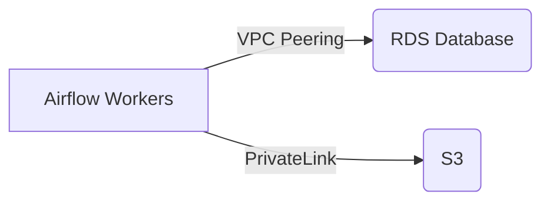

### How to Set Up Dynamic Parallel Tasks in Airflow  

#### **Question:1**  
How can you dynamically create parallel tasks in Apache Airflow based on a variable input (e.g., a list of items)?  

#### **Answer:**  
In Apache Airflow, you can set up dynamic parallel tasks using **loop constructs** (like `for` loops) along with **operators** such as `PythonOperator`, `BranchPythonOperator`, or `TaskGroup` (for grouping related tasks).  

Here’s a step-by-step breakdown:  

---

### **1. Define a List of Dynamic Parameters**  
First, determine the dynamic inputs (e.g., a list of cities, dates, or IDs) that will generate multiple parallel tasks.  

**Example:**  
```python
cities = ['NYC', 'LA', 'SF']
```

---

### **2. Loop Over the List to Generate Tasks**  
Use a `for` loop to create multiple instances of a task (e.g., `PythonOperator`), each with a unique `task_id` and parameters.  

**Example:**  
```python
from airflow import DAG
from airflow.operators.python import PythonOperator
from datetime import datetime

def process_city(city_name):
    print(f"Processing data for {city_name}")

# Define the DAG
dag = DAG(
    'dynamic_parallel_tasks',
    start_date=datetime(2023, 1, 1),
    schedule_interval=None,
)

# Dynamically generate tasks
for city in cities:
    task = PythonOperator(
        task_id=f"process_{city}",  # Unique task ID for each city
        python_callable=process_city,
        op_args=[city],  # Pass city as an argument
        dag=dag,
    )
```

---

### **3. (Optional) Add Dependencies**  
If tasks need to run in a specific order, set dependencies using `>>` or `set_downstream()`.  

**Example:**  
```python
start_task = DummyOperator(task_id="start", dag=dag)
end_task = DummyOperator(task_id="end", dag=dag)

# Run all city tasks in parallel after 'start_task'
start_task >> [process_NYC, process_LA, process_SF] >> end_task
```

---

### **4. (Advanced) Use `BranchPythonOperator` for Conditional Tasks**  
If tasks should run conditionally, use `BranchPythonOperator` to decide which tasks execute.  

**Example:**  
```python
from airflow.operators.python import BranchPythonOperator

def decide_branch(**kwargs):
    if some_condition:
        return "process_NYC"
    else:
        return "process_LA"

branch_task = BranchPythonOperator(
    task_id="branch_decision",
    python_callable=decide_branch,
    dag=dag,
)

branch_task >> [process_NYC, process_LA]
```

---

### **5. (Alternative) Use `TaskGroup` for Better Organization**  
For complex workflows, group dynamic tasks using `TaskGroup` (Airflow 2.0+).  

**Example:**  
```python
from airflow.utils.task_group import TaskGroup

with TaskGroup("city_processing") as city_group:
    for city in cities:
        PythonOperator(
            task_id=f"process_{city}",
            python_callable=process_city,
            op_args=[city],
        )

start_task >> city_group >> end_task
```

---

### **Key Takeaways:**  
- **Dynamic task generation** is achieved using loops (e.g., `for city in cities`).  
- Each task must have a **unique `task_id`** (e.g., `process_NYC`, `process_LA`).  
- **Dependencies** can be set between dynamic tasks and other tasks.  
- For conditional branching, use `BranchPythonOperator`.  
- For cleaner DAGs, organize tasks with `TaskGroup`.  

This approach allows Airflow to scale workflows dynamically based on input data.  

---

### **Final Note:**  
Airflow also supports **dynamic task mapping (Airflow 2.3+)** using `expand()` for more elegant parallelization:  
```python
PythonOperator.partial(task_id="process_city").expand(op_args=[['NYC'], ['LA'], ['SF']])
```  

<br/>
<br/>

### **How to Implement Conditional Tasks in Airflow Based on Specific Criteria?**  

#### **Question:2**  
How can you ensure that certain tasks in an Airflow DAG only run if they meet specific conditions (e.g., date checks, external API responses, or business logic)?  

#### **Answer:**  
In Apache Airflow, you can enforce conditional task execution using:  
1. **`BranchPythonOperator`** (for branching logic)  
2. **`ShortCircuitOperator`** (to skip downstream tasks if a condition fails)  
3. **`SkipMixin`** (to explicitly skip tasks)  

Below is a detailed breakdown of each approach.  

---

## **1. Using `BranchPythonOperator` (Dynamic Path Selection)**  
The `BranchPythonOperator` evaluates a condition and returns the `task_id` of the next task to execute, effectively creating a branching workflow.  

### **Example: Skip Tasks Based on Date**  
Suppose we want to run a task only on weekdays (Monday–Friday) and skip it on weekends.  

#### **Step 1: Define the Branching Logic**  
```python
from airflow.operators.python import BranchPythonOperator
from datetime import datetime

def _check_if_weekday(**context):
    execution_date = context["execution_date"]
    if execution_date.weekday() < 5:  # 0-4 = Mon-Fri
        return "process_data_task"  # Run this task
    else:
        return "skip_task"  # Skip processing on weekends
```

#### **Step 2: Set Up the DAG with Branching**  
```python
from airflow import DAG
from airflow.operators.dummy import DummyOperator

with DAG(
    dag_id="conditional_branching",
    schedule_interval="@daily",
    start_date=datetime(2023, 1, 1),
) as dag:

    decide_branch = BranchPythonOperator(
        task_id="check_weekday",
        python_callable=_check_if_weekday,
        provide_context=True,
    )

    process_data = PythonOperator(
        task_id="process_data_task",
        python_callable=lambda: print("Processing data..."),
    )

    skip_task = DummyOperator(task_id="skip_task")

    decide_branch >> [process_data, skip_task]
```

#### **How It Works:**  
- If `execution_date` is a weekday → `process_data_task` runs.  
- If it's a weekend → `skip_task` (a dummy task) runs instead.  

---

## **2. Using `ShortCircuitOperator` (Skip Downstream Tasks if Condition Fails)**  
The `ShortCircuitOperator` evaluates a condition and continues downstream tasks only if the condition is `True`. Otherwise, it skips all subsequent tasks.  

### **Example: Skip Tasks if a File Doesn’t Exist**  
```python
from airflow.operators.python import ShortCircuitOperator
import os

def _check_file_exists(**context):
    file_path = "/data/input.csv"
    return os.path.exists(file_path)  # Returns True/False

with DAG(...) as dag:

    check_file = ShortCircuitOperator(
        task_id="check_file_exists",
        python_callable=_check_file_exists,
    )

    process_file = PythonOperator(
        task_id="process_file",
        python_callable=lambda: print("File processed!"),
    )

    check_file >> process_file
```

#### **Behavior:**  
- If `input.csv` exists → `process_file` runs.  
- If not → `process_file` is **automatically skipped**.  

---

## **3. Using `SkipMixin` (Explicitly Skip Tasks)**  
If you want to manually skip a task from inside a `PythonOperator`, you can raise `AirflowSkipException`.  

### **Example: Skip Task Based on API Response**  
```python
from airflow.exceptions import AirflowSkipException

def _fetch_api_data(**context):
    import requests
    response = requests.get("https://api.example.com/data")
    if response.status_code != 200:
        raise AirflowSkipException("API failed, skipping task.")
    return response.json()

fetch_data = PythonOperator(
    task_id="fetch_data",
    python_callable=_fetch_api_data,
)
```

#### **Behavior:**  
- If the API fails (`status_code != 200`), the task is **marked as skipped** in the Airflow UI.  
- Downstream tasks can still proceed if needed.  

---

## **Comparison of Approaches**  
| Method | Use Case | Behavior |
|--------|----------|----------|
| **`BranchPythonOperator`** | Choose between multiple task paths | Returns `task_id` of the next task to run |
| **`ShortCircuitOperator`** | Skip all downstream tasks if condition fails | Returns `True` (continue) or `False` (skip) |
| **`AirflowSkipException`** | Manually skip a task in a `PythonOperator` | Raises an exception to skip the task |

---

## **Best Practices**  
1. **Use `BranchPythonOperator`** when you need **multiple branching paths**.  
2. **Use `ShortCircuitOperator`** when you want to **skip all downstream tasks** if a condition fails.  
3. **Use `AirflowSkipException`** when you need **fine-grained control** inside a task.  

<br/>
<br/>

### **How to Address Airflow Metadata Database Bottlenecks at Scale?**  

#### **Question:3**  
Our company runs thousands of tasks daily, and the Airflow metadata database (PostgreSQL/MySQL) is becoming a bottleneck. What strategies can we implement to optimize performance?  

#### **Answer:**  
To mitigate database bottlenecks in Airflow, we need a **multi-layered approach** focusing on:  
1. **Database maintenance & cleanup**  
2. **Scaling & optimization**  
3. **Airflow configuration tuning**  
4. **Advanced architectural improvements**  

---

### **1. Database Maintenance & Cleanup**  

#### **Why is this needed?**  
Airflow’s metadata database stores:  
- Task instances  
- DAG runs  
- Logs  
- Variables & Connections  
Over time, this data grows exponentially, slowing down queries.  

#### **Solutions:**  

✅ **A. Enable Automatic Data Retention Policies**  
```python
# In airflow.cfg (or via env vars)
[core]
# Keep task logs for 30 days
log_retention_days = 30

# Clean up old task instances
dag_run_cleanup_batch_size = 500  # Batch deletion for efficiency
```

✅ **B. Schedule Regular Cleanup Jobs**  
- **Manual cleanup:**  
  ```bash
  airflow db clean --clean-before-timestamp "2023-01-01" --verbose
  ```
- **Automated DAG cleanup:**  
  ```python
  from airflow.operators.bash import BashOperator
  clean_db = BashOperator(
      task_id="clean_old_records",
      bash_command="airflow db clean --clean-before-timestamp '{{ macros.ds_add(ds, -30) }}'",
  )
  ```

✅ **C. Offload Logs to External Storage**  
```python
[logging]
remote_logging = True  
remote_base_log_folder = s3://airflow-logs/  # Or GCS/Azure Blob
```

---

### **2. Database Scaling & Optimization**  

#### **A. Vertical Scaling (Increase DB Resources)**  
- Upgrade **CPU, RAM, and disk IOPs**.  
- Use **managed databases** (AWS RDS, Google Cloud SQL).  

#### **B. Horizontal Scaling (Read Replicas)**  
- **Use read replicas** for Webserver (UI) queries:  
  ```python
  [database]
  sql_alchemy_conn = postgresql://primary-host:5432/airflow
  sql_alchemy_replica_conn = postgresql://replica-host:5432/airflow
  ```

#### **C. Database Optimization**  
- **Add indexes** for frequent queries:  
  ```sql
  CREATE INDEX idx_task_instance_dag_run ON task_instance(dag_id, execution_date);
  ```
- **Run `VACUUM ANALYZE`** (PostgreSQL) periodically.  
- **Tune DB connection pooling:**  
  ```python
  [database]
  sql_alchemy_pool_size = 20  # Adjust based on workload
  ```

---

### **3. Airflow Configuration Tuning**  

#### **A. Reduce DAG Parsing Overhead**  
```python
[core]
store_serialized_dags = True  # Airflow 2.0+
min_serialized_dag_update_interval = 30  # Seconds
```

#### **B. Optimize Scheduler Performance**  
```python
[scheduler]
max_threads = 10  # Reduce DB contention
parsing_processes = 2  # Limit DAG parsing threads
schedule_after_task_execution = False  # Reduce DB writes
```

#### **C. Tune Executor Settings**  
```python
[celery]
worker_concurrency = 16  # Adjust based on DB capacity
```

---

### **4. Advanced Strategies for Large-Scale Deployments**  

#### **A. Sharding (Split Metadata DBs by Team/Dept)**  
- Run **multiple Airflow instances** with separate DBs.  

#### **B. Use KubernetesExecutor**  
- Reduces DB dependency by managing tasks in Kubernetes.  

#### **C. Offload Metrics & Logs**  
- Use **Prometheus + Grafana** for metrics.  
- Use **ELK Stack** for log aggregation.  

---

### **Comparison of Solutions**  

| **Strategy**               | **Impact** | **Effort** | **Best For** |
|----------------------------|------------|------------|--------------|
| **DB Cleanup & Retention** | High       | Low        | All deployments |
| **Vertical Scaling**       | High       | Medium     | Large-scale setups |
| **Read Replicas**          | Medium     | High       | High UI load |
| **DAG Serialization**      | Medium     | Low        | Airflow 2.0+ |
| **KubernetesExecutor**     | High       | High       | Cloud-native setups |

---

### **Final Recommendations**  
1. **Start with `db clean` and log offloading** (quick wins).  
2. **Upgrade DB hardware** if needed.  
3. **Enable DAG serialization** and optimize scheduler settings.  
4. **For very large setups**, explore **sharding or Kubernetes**.  

<br/>
<br/>

### **How to Implement Error Handling and Retries in Airflow?**  

#### **Question:4**  
How can we configure **automatic retries**, **custom error handling**, and **notifications** for Airflow tasks to ensure workflow resilience?  

#### **Answer:**  
Airflow provides multiple mechanisms for error handling:  
1. **Built-in Retries** (Simple retry logic)  
2. **Exponential Backoff** (Smart retry delays)  
3. **Custom Callbacks** (Notifications, cleanup, logging)  
4. **Task Timeouts** (Prevent hanging tasks)  

---

## **1. Basic Retry Mechanism**  
### **A. Configure `retries` and `retry_delay`**  
Set these at the **DAG** or **task level**:  
```python
from datetime import timedelta  
from airflow import DAG  
from airflow.operators.python import PythonOperator  

default_args = {  
    'retries': 3,                   # Max retry attempts  
    'retry_delay': timedelta(minutes=5),  # Fixed delay between retries  
}  

with DAG(  
    dag_id='retry_example',  
    default_args=default_args,  
) as dag:  

    task1 = PythonOperator(  
        task_id='flaky_task',  
        python_callable=unreliable_function,  
        retries=5,  # Override DAG-level retries  
    )  
```

**Behavior:**  
- Task fails → Retries up to `retries` times.  
- Waits `retry_delay` between attempts.  

---

## **2. Exponential Backoff (Smarter Retries)**  
Use `retry_exponential_backoff` for variable delays:  
```python
from airflow.models import DAG  
from airflow.utils.retries import exponential_backoff  

default_args = {  
    'retries': 3,  
    'retry_delay': exponential_backoff(  
        factor=2,          # Delay multiplier (e.g., 5min → 10min → 20min)  
        max_delay=timedelta(minutes=30),  
    ),  
}  
```

**Use Case:**  
- APIs with rate limits.  
- Cloud services with transient failures.  

---

## **3. Custom Error Handling**  
### **A. `on_failure_callback` (Notifications)**  
Trigger alerts (Slack/Email) on failure:  
```python
from airflow.providers.slack.notifications.slack import send_slack_notification  

def _alert_on_failure(context):  
    dag_id = context['dag'].dag_id  
    task_id = context['task'].task_id  
    error = context.get('exception')  

    send_slack_notification(  
        slack_conn_id="slack_conn",  
        text=f"❌ Task failed: {dag_id}.{task_id}\nError: {error}",  
    )  

task = PythonOperator(  
    task_id='critical_task',  
    python_callable=risky_operation,  
    on_failure_callback=_alert_on_failure,  # Calls this function on failure  
)  
```

### **B. `on_retry_callback` (Logging Retries)**  
```python
def _log_retry(context):  
    print(f"Retry #{context['ti'].try_number} for {context['task'].task_id}")  

task = PythonOperator(  
    task_id='retry_aware_task',  
    python_callable=flakey_api_call,  
    on_retry_callback=_log_retry,  
)  
```

---

## **4. Task Timeouts**  
Prevent tasks from hanging indefinitely:  
```python
from datetime import timedelta  

PythonOperator(  
    task_id='timeout_task',  
    python_callable=long_running_process,  
    execution_timeout=timedelta(minutes=30),  # Fails after 30 mins  
)  
```

**Note:**  
- Overrides Airflow’s default `dagrun_timeout`.  
- Useful for API calls or resource-heavy tasks.  

---

## **5. Advanced Scenarios**  
### **A. Conditional Retries**  
Retry only for specific errors:  
```python
def _handle_api_error(exception):  
    if "429 Too Many Requests" in str(exception):  
        return True  # Retry on rate limits  
    return False     # Fail on other errors  

PythonOperator(  
    task_id='smart_retry_task',  
    python_callable=call_rate_limited_api,  
    retry_args={  
        'retry_on_exception': _handle_api_error,  # Custom retry logic  
    },  
)  
```

### **B. Cleanup on Failure**  
```python
def _cleanup_temp_files(context):  
    import shutil  
    shutil.rmtree("/tmp/failed_task_data")  

PythonOperator(  
    task_id='cleanup_aware_task',  
    python_callable=process_data,  
    on_failure_callback=_cleanup_temp_files,  
)  
```

---

## **6. Best Practices**  

| **Practice**                | **Implementation**                              |  
|-----------------------------|------------------------------------------------|  
| **Idempotent Tasks**        | Design tasks to handle retries safely.         |  
| **Alert Throttling**        | Use `on_retry_callback` to avoid spam.         |  
| **Log Context**             | Include `try_number` in logs for debugging.    |  
| **Test Failure Paths**      | Mock failures in staging.                      |  

---

## **Comparison of Strategies**  

| **Method**                 | **Use Case**                          | **Complexity** |  
|----------------------------|---------------------------------------|----------------|  
| **Fixed Retries**          | Simple transient errors                | Low            |  
| **Exponential Backoff**    | APIs/rate limits                      | Medium         |  
| **Custom Callbacks**       | Notifications/cleanup                 | High           |  
| **Conditional Retries**    | Error-specific handling               | Highest        |  

---

### **Final Recommendations**  
1. **Start with `retries` + `retry_delay`** for basic resilience.  
2. **Add `on_failure_callback`** for alerts.  
3. **Use exponential backoff** for cloud/API tasks.  
4. **Enforce timeouts** to prevent hangs.  


<br/>
<br/>

### **How to Design an Airflow Workflow with Data Quality Checks and Failure Notifications?**  

#### **Question:5**  
How can we design an Airflow DAG where:  
1. **Data quality checks** are mandatory before processing.  
2. **Failures in these checks trigger alerts** (Slack/Email).  

#### **Answer:**  
We can achieve this using:  
✅ **Data Quality Operators** (`PythonOperator`, `SQLCheckOperator`)  
✅ **Failure Callbacks** (`on_failure_callback`)  
✅ **Conditional Workflows** (`BranchPythonOperator` if needed)  

---

### **1. Setting Up Data Quality Checks**  

#### **Option A: Using `PythonOperator` (Custom Logic)**  
```python
from airflow.operators.python import PythonOperator

def validate_data_quality(**kwargs):
    import pandas as pd
    df = pd.read_csv("/data/sample.csv")
    
    # Check 1: Ensure no nulls in critical column
    if df["critical_column"].isnull().any():
        raise ValueError("Data quality check failed: Nulls found!")
    
    # Check 2: Validate row count
    if len(df) < 1000:
        raise ValueError("Data too small, expected ≥1000 rows.")

validate_task = PythonOperator(
    task_id="validate_data",
    python_callable=validate_data_quality,
    on_failure_callback=notify_failure,  # See Step 2
)
```

#### **Option B: Using `SQLCheckOperator` (DB Validation)**  
```python
from airflow.providers.common.sql.operators.sql import SQLCheckOperator

check_task = SQLCheckOperator(
    task_id="check_data_quality",
    conn_id="postgres_conn",
    sql="SELECT COUNT(*) FROM orders WHERE order_date IS NULL",
    on_failure_callback=notify_failure,
)
```

---

### **2. Configuring Failure Notifications**  

#### **A. Slack Alert Example**  
```python
from airflow.providers.slack.notifications.slack import send_slack_notification

def notify_failure(context):
    dag_id = context["dag"].dag_id
    task_id = context["task"].task_id
    error = context.get("exception") or "Unknown error"
    
    slack_msg = f"""
    :red_circle: Data Quality Check Failed!
    *DAG*: {dag_id}  
    *Task*: {task_id}  
    *Error*: {error}  
    """
    send_slack_notification(
        slack_conn_id="slack_conn",
        text=slack_msg,
    )

# Attach to any task:
validate_task = PythonOperator(..., on_failure_callback=notify_failure)
```

#### **B. Email Alert Example**  
```python
from airflow.utils.email import send_email

def email_alert(context):
    subject = f"Airflow Alert: {context['task'].task_id} failed"
    body = f"Error in DAG {context['dag'].dag_id}: {context['exception']}"
    send_email(to="team@company.com", subject=subject, html_content=body)

validate_task = PythonOperator(..., on_failure_callback=email_alert)
```

---

### **3. Advanced: Conditional Workflow Handling**  

#### **Scenario:**  
- If quality check passes → Proceed with processing.  
- If check fails → Skip downstream tasks and notify.  

#### **Implementation:**  
```python
from airflow.operators.python import BranchPythonOperator

def _check_quality(**context):
    try:
        validate_data_quality(**context)
        return "process_data_task"  # Proceed if OK
    except ValueError:
        return "send_alert_task"   # Else notify & stop

branch_op = BranchPythonOperator(
    task_id="branch_based_on_quality",
    python_callable=_check_quality,
)

process_data = PythonOperator(task_id="process_data_task", ...)
send_alert = PythonOperator(
    task_id="send_alert_task",
    python_callable=notify_failure,  # Reuse notification func
    trigger_rule="one_success",      # Run even if upstream fails
)

branch_op >> [process_data, send_alert]
```

---

### **4. Best Practices**  

| **Practice**               | **Implementation** |
|----------------------------|--------------------|
| **Modular Checks**         | Separate validation logic into reusable functions |
| **Alert Throttling**       | Use `on_retry_callback` to avoid spam |
| **Centralized Logging**    | Log checks to S3/ELK for auditing |
| **Test in Dev**            | Mock failures to verify alerts |

---

### **Full Example DAG**  
```python
from airflow import DAG
from datetime import datetime

with DAG(
    dag_id="data_quality_pipeline",
    schedule="@daily",
    default_args={
        "on_failure_callback": notify_failure,  # Applies to all tasks
    },
) as dag:

    validate = PythonOperator(
        task_id="validate_data",
        python_callable=validate_data_quality,
    )

    process = PythonOperator(
        task_id="process_data",
        python_callable=lambda: print("Processing clean data..."),
    )

    validate >> process
```

---

### **Key Takeaways**  
1. **Use `on_failure_callback`** for real-time alerts.  
2. **Combine with `BranchPythonOperator`** for conditional workflows.  
3. **Standardize checks** across DAGs for consistency.  
4. **Test failure scenarios** to ensure reliability.  

<br/>
<br/>

### **How to Use Airflow in a Hybrid Cloud Environment (On-Prem + Public Cloud)?**  

#### **Question:6**  
How can we design an Airflow DAG where some tasks run **on-premises** (local servers) while others execute in a **public cloud** (AWS/GCP/Azure)?  

#### **Answer:**  
Airflow supports hybrid cloud workflows using:  
✅ **Environment-specific operators** (SSH, Kubernetes, cloud providers)  
✅ **Secure connection management** (SSH, VPN, private networking)  
✅ **Unified orchestration** (Single DAG coordinating cross-environment tasks)  

---

## **1. Key Components for Hybrid Cloud Workflows**  

| **Component**          | **On-Premises**                          | **Public Cloud**                          |
|------------------------|------------------------------------------|-------------------------------------------|
| **Task Execution**     | `SSHOperator`, `KubernetesPodOperator`   | Cloud operators (e.g., `AWSBatchOperator`) |
| **Authentication**     | SSH keys, VPN tunnels                    | IAM roles, service accounts               |
| **Data Transfer**      | `SFTPOperator`, `Rsync`                  | Cloud Storage (S3/GCS/Azure Blob)         |
| **Monitoring**         | Airflow logs + on-prem tools             | Cloud Logging + Prometheus                |

---

## **2. Step-by-Step Implementation**  

### **Step 1: Configure Connections for Both Environments**  
#### **A. On-Premises (SSH)**  
```python
# airflow.cfg or UI -> Admin -> Connections
Connection ID: `on_prem_ssh`  
Connection Type: SSH  
Host: 192.168.1.100 (on-prem server)  
Login: user  
Password/SSH Key: [key_or_password]  
```

#### **B. Public Cloud (AWS Example)**  
```python
Connection ID: `aws_conn`  
Connection Type: AWS  
AWS Access Key ID: [key]  
AWS Secret Access Key: [secret]  
Region: us-east-1  
```

---

### **Step 2: Define Tasks for Each Environment**  
#### **A. On-Prem Task (`SSHOperator`)**  
```python
from airflow.providers.ssh.operators.ssh import SSHOperator

on_prem_task = SSHOperator(
    task_id="run_etl_on_prem",
    ssh_conn_id="on_prem_ssh",
    command="/scripts/run_etl.sh",
)
```

#### **B. Cloud Task (`AWSBatchOperator`)**  
```python
from airflow.providers.amazon.aws.operators.batch import AWSBatchOperator

cloud_task = AWSBatchOperator(
    task_id="process_in_aws",
    job_name="data_pipeline",
    job_queue="aws-batch-queue",
    job_definition="pyspark-job",
    aws_conn_id="aws_conn",
)
```

---

### **Step 3: Handle Cross-Environment Data Transfer**  
#### **Option A: Sync Data to Cloud (S3/GCS)**  
```python
from airflow.providers.amazon.aws.transfers.sftp_to_s3 import SFTPToS3Operator

transfer_task = SFTPToS3Operator(
    task_id="upload_to_s3",
    sftp_conn_id="on_prem_ssh",
    sftp_path="/data/output.csv",
    s3_conn_id="aws_conn",
    s3_bucket="my-bucket",
    s3_key="cloud-data/output.csv",
)
```

#### **Option B: Use Hybrid Storage (MinIO/NFS)**  
- Deploy **MinIO** on-prem for S3-compatible storage.  
- Mount **NFS/EFS** accessible to both environments.  

---

### **Step 4: Secure Communication**  
| **Requirement**       | **Solution**                              |
|-----------------------|-------------------------------------------|
| **Encryption**        | TLS/SSL for all connections               |
| **Network Isolation** | VPN (e.g., AWS Direct Connect)            |
| **Auth**              | IAM roles (cloud) + SSH certificates (on-prem) |

---

### **Step 5: Full Hybrid DAG Example**  
```python
from airflow import DAG
from datetime import datetime

with DAG(
    dag_id="hybrid_cloud_workflow",
    schedule="@daily",
    start_date=datetime(2023, 1, 1),
) as dag:

    # On-prem task
    extract = SSHOperator(
        task_id="extract_data_on_prem",
        ssh_conn_id="on_prem_ssh",
        command="/scripts/extract.sh",
    )

    # Cloud task
    transform = AWSBatchOperator(
        task_id="transform_in_aws",
        job_name="transform_data",
        aws_conn_id="aws_conn",
    )

    # Cross-cloud transfer
    load = SFTPToS3Operator(
        task_id="load_to_s3",
        sftp_conn_id="on_prem_ssh",
        s3_conn_id="aws_conn",
        sftp_path="/data/final.csv",
        s3_bucket="hybrid-bucket",
    )

    extract >> transform >> load
```

---

## **3. Best Practices**  

1. **Isolate Sensitive Configs**  
   - Use **Airflow Variables** or **Secrets Backend** (AWS Secrets Manager).  

2. **Monitor Hybrid Tasks**  
   - Cloud: **CloudWatch/Stackdriver**  
   - On-Prem: **Prometheus + Grafana**  

3. **Optimize Costs**  
   - Use **spot instances** for cloud tasks.  
   - Schedule heavy on-prem tasks during off-peak hours.  

4. **Disaster Recovery**  
   - Backup Airflow metadata DB.  
   - Cross-region replication for critical cloud data.  

---

## **Comparison of Approaches**  

| **Strategy**            | **Pros**                          | **Cons**                          |
|-------------------------|-----------------------------------|-----------------------------------|
| **SSHOperator**         | Simple, no cloud dependency       | Limited scalability              |
| **KubernetesPodOperator**| Portable (works on-prem/cloud)    | Requires K8s expertise           |
| **Cloud-Specific Operators** | Native integration with AWS/GCP | Vendor lock-in                  |

---

### **Final Recommendations**  
1. Start with **SSHOperator + Cloud Operators** for simplicity.  
2. For large-scale workflows, adopt **KubernetesPodOperator**.  
3. Use **Terraform** to manage hybrid infrastructure as code.  


<br/>
<br/>

### **How to Set Up Monitoring and Logging for Airflow?**  

#### **Question:7**  
How can we configure **monitoring** (metrics, alerts) and **logging** (centralized storage, analysis) for an Airflow deployment to ensure reliability and quick issue resolution?  

#### **Answer:**  
A robust monitoring and logging setup for Airflow involves:  
1. **Real-time monitoring** (metrics, dashboards, alerts)  
2. **Centralized logging** (aggregation, retention, searchability)  
3. **Alerting** (Slack/Email/PagerDuty for failures)  

---

## **1. Monitoring Airflow**  

### **A. Built-in Airflow Tools**  
| **Tool**               | **Purpose**                              | **How to Access**                     |  
|------------------------|------------------------------------------|---------------------------------------|  
| **Web UI**             | View DAG status, task logs               | `http://<airflow-server>:8080`        |  
| **CLI**               | Check task/DAG states                    | `airflow tasks list --dag-id <dag>`   |  
| **Health Checks**     | API endpoint for liveness probes         | `curl http://<server>:8080/health`    |  

### **B. Advanced Metrics with Prometheus + Grafana**  
#### **Step 1: Enable Airflow Metrics**  
```python
# airflow.cfg
[metrics]
statsd_on = True
statsd_host = localhost  # Replace with Prometheus server
statsd_port = 9125
statsd_prefix = airflow
```

#### **Step 2: Deploy Prometheus**  
- Scrape Airflow metrics via **StatsD exporter** or **Prometheus HTTP endpoint**.  
- Example `prometheus.yml`:  
  ```yaml
  scrape_configs:
    - job_name: 'airflow'
      static_configs:
        - targets: ['airflow-webserver:9111']  # Airflow Prometheus plugin
  ```

#### **Step 3: Grafana Dashboards**  
- Import pre-built dashboards (e.g., [Airflow Official Dashboard](https://grafana.com/grafana/dashboards/11010)).  
- Track:  
  - **DAG run durations**  
  - **Task failures**  
  - **Scheduler latency**  

---

## **2. Centralized Logging**  

### **A. Remote Log Storage (S3/GCS/Elasticsearch)**  
```python
# airflow.cfg
[logging]
remote_logging = True
remote_base_log_folder = s3://airflow-logs/  # Or gs://, wasb://
encrypt_s3_logs = True
```

### **B. ELK Stack (Elasticsearch + Kibana)**  
1. **Ship logs to Elasticsearch**:  
   - Use **Filebeat** or **Fluentd** to forward logs.  
2. **Visualize in Kibana**:  
   - Create filters for `ERROR` logs or specific DAGs.  

### **C. Cloud-Specific Solutions**  
| **Cloud** | **Service**          | **Configuration**                                  |  
|-----------|----------------------|---------------------------------------------------|  
| **AWS**   | CloudWatch Logs      | `remote_base_log_folder = cloudwatch://log_group` |  
| **GCP**   | Stackdriver          | Use `gcp_stackdriver_handler` in `logging_config.py` |  
| **Azure** | Azure Monitor        | `wasb://<container>@<storage-account>.blob.core.windows.net` |  

---

## **3. Alerting for Failures**  

### **A. Task Failure Alerts (Slack/Email)**  
```python
from airflow.utils.email import send_email
from airflow.providers.slack.notifications.slack import send_slack_notification

def alert_on_failure(context):
    # Slack Alert
    send_slack_notification(
        slack_conn_id="slack_conn",
        text=f"🚨 Task failed: {context['task'].task_id}",
    )
    
    # Email Alert
    send_email(
        to="admin@company.com",
        subject=f"Airflow Failure: {context['dag'].dag_id}",
        html_content=f"Error: {context['exception']}",
    )

# Attach to DAG
default_args = {
    'on_failure_callback': alert_on_failure,
}
```

### **B. Proactive Monitoring Alerts**  
- **Grafana Alerts**: Trigger when:  
  - Scheduler heartbeat stops.  
  - Task failure rate > 5%.  
- **Prometheus AlertManager**:  
  ```yaml
  # alertmanager.yml
  routes:
    - match:
        severity: 'critical'
      receiver: 'slack-admin'
  ```

---

## **4. Best Practices**  

| **Practice**                | **Implementation**                                  |  
|-----------------------------|----------------------------------------------------|  
| **Log Retention**           | Keep logs for 30-90 days (adjust in `airflow.cfg`). |  
| **Error Classification**    | Use structured logging (JSON) for easier filtering. |  
| **Test Alerts**             | Force-fail a test DAG to verify notifications.     |  
| **Cost Control**            | Compress old logs (e.g., S3 Glacier).              |  

---

## **Comparison of Logging Solutions**  

| **Solution**       | **Pros**                          | **Cons**                          |  
|--------------------|-----------------------------------|-----------------------------------|  
| **S3/GCS**        | Cheap, scalable                   | No built-in search                |  
| **ELK**           | Powerful search (Kibana)          | Complex setup                     |  
| **CloudWatch**    | Native AWS integration            | Expensive at scale               |  

---

### **Final Recommendations**  
1. **Start with Prometheus+Grafana** for metrics and **S3** for logs.  
2. **Add Slack alerts** for critical failures.  
3. **For enterprises**, adopt **ELK** or cloud-native logging.  

<br/>
<br/>

### **How to Troubleshoot and Optimize a Slow-Running DAG in Airflow?**  

#### **Question:8**  
What steps should you take when a DAG’s execution time exceeds expectations, causing delays in the workflow?  

#### **Answer:**  
To diagnose and resolve performance bottlenecks in a slow DAG, follow this structured approach:  

---

## **1. Diagnose the Bottleneck**  

### **A. Identify Slow Tasks**  
1. **Check Airflow UI**:  
   - Navigate to **DAG Runs** → **Task Duration** to spot outliers.  
   - Look for tasks with **high `Queued` or `Running` times**.  

2. **Review Logs**:  
   ```bash
   airflow logs --task_id slow_task --dag_id my_dag --subdir /path/to/dag.py
   ```
   - Search for warnings like `Long-running task` or timeouts.  

3. **Use `execution_timeout`**:  
   ```python
   PythonOperator(
       task_id="slow_task",
       python_callable=my_function,
       execution_timeout=timedelta(minutes=30),  # Fail if exceeded
   )
   ```

### **B. Profile Task Performance**  
- **Python Profiling**:  
  ```python
  import cProfile
  def my_function():
      profiler = cProfile.Profile()
      profiler.enable()
      # Your code here
      profiler.disable()
      profiler.dump_stats("/tmp/profile_stats.prof")
  ```
  Analyze with:  
  ```bash
  snakeviz /tmp/profile_stats.prof  # Visualize profiling data
  ```

- **Database Queries**:  
  Enable SQL query logging for DB-heavy tasks:  
  ```python
  from sqlalchemy import event
  from sqlalchemy.engine import Engine
  import logging

  logging.basicConfig()
  logger = logging.getLogger("sqlalchemy.engine")
  logger.setLevel(logging.INFO)
  ```

---

## **2. Optimize the DAG**  

### **A. Task-Level Optimizations**  
| **Issue**               | **Solution**                              |  
|--------------------------|-------------------------------------------|  
| **Inefficient Code**     | Replace Pandas with Polars/Dask for large datasets. |  
| **API Throttling**       | Implement retries with exponential backoff. |  
| **Unparallelized Work**  | Use `ThreadPoolExecutor` in Python tasks. |  

**Example: Parallel Processing**  
```python
from concurrent.futures import ThreadPoolExecutor

def process_chunk(data):
    # Process a subset of data
    return data * 2

def parallel_processor():
    data = range(1000)
    with ThreadPoolExecutor(max_workers=4) as executor:
        results = list(executor.map(process_chunk, data))
```

### **B. DAG Structural Improvements**  
1. **Split Monolithic DAGs**:  
   - Break into smaller sub-DAGs triggered via `TriggerDagRunOperator`.  
   ```python
   trigger_subdag = TriggerDagRunOperator(
       task_id="trigger_etl_stage2",
       trigger_dag_id="etl_stage2",
   )
   ```

2. **Dynamic Task Mapping**: (Airflow 2.3+)  
   ```python
   @task
   def process_file(file):
       return file.upper()

   files = ["A.txt", "B.txt"]
   process_file.expand(file=files)  # Parallelizes tasks
   ```

---

## **3. Adjust Airflow Configuration**  

### **A. Scale Resources**  
| **Setting**               | **Adjustment**                            |  
|---------------------------|-------------------------------------------|  
| `parallelism`             | Increase in `airflow.cfg` (default: 32).  |  
| `worker_concurrency`      | Set higher for Celery/K8s executors.      |  
| `dag_concurrency`         | Limit concurrent DAG runs if resource-bound. |  

### **B. Prioritize Critical Tasks**  
```python
task1 = PythonOperator(
    task_id="high_priority_task",
    priority_weight=100,  # Higher than default (1)
    queue="high_priority",  # Dedicated worker queue
)
```

---

## **4. Infrastructure Upgrades**  

### **A. Hardware Scaling**  
- **Vertical Scaling**: Upgrade worker node CPU/RAM.  
- **Horizontal Scaling**: Add more workers (Celery/K8s).  

### **B. Specialized Executors**  
| **Executor**           | **Use Case**                              |  
|------------------------|-------------------------------------------|  
| **CeleryExecutor**     | Distributed task execution.               |  
| **KubernetesExecutor** | Auto-scaling for bursty workloads.        |  

---

## **5. Monitor and Prevent Regressions**  

### **A. Set SLAs**  
```python
with DAG(
    sla_miss_callback=alert_sla_miss,  # Notify if delayed
):
    task1 = PythonOperator(
        task_id="task1",
        sla=timedelta(hours=2),  # Max allowed runtime
    )
```

### **B. Dashboards & Alerts**  
- **Grafana**: Track DAG durations over time.  
- **Prometheus Alert**: Trigger if `airflow_dag_run_duration > threshold`.  

---

## **Comparison of Optimization Strategies**  

| **Strategy**            | **Impact** | **Effort** | **Best For**            |  
|-------------------------|------------|------------|--------------------------|  
| **Code Optimization**   | High       | Medium     | CPU-bound tasks          |  
| **DAG Splitting**       | Medium     | High       | Monolithic DAGs          |  
| **Executor Scaling**    | High       | High       | Resource-bound workflows |  

---

### **Final Recommendations**  
1. **Profile first** to identify bottlenecks (logs/profiling).  
2. **Optimize tasks** (code, parallelism).  
3. **Adjust Airflow configs** (concurrency, queues).  
4. **Scale infrastructure** if needed (Celery/K8s).  
5. **Set SLAs** to catch future delays.  


<br/>
<br/>

### **How to Manage and Organize a Large Number of DAGs for Multiple Teams?**  

#### **Question:9**  
How can we **structure, categorize, and secure** hundreds of DAGs in Airflow when multiple teams (Data Engineering, Analytics, ML) contribute to the same Airflow instance?  

#### **Answer:**  
To maintain scalability and clarity in a multi-team Airflow environment, implement:  
1. **Logical Folder Structure**  
2. **Consistent Naming Conventions**  
3. **DAG Tagging for Filtering**  
4. **Access Control (RBAC)**  
5. **Version Control & Deployment Best Practices**  

---

## **1. Folder Structure for DAGs**  
Organize DAGs by **team** and **purpose** to avoid clutter:  

```bash
dags/  
│  
├── team_data_engineering/  
│   ├── ingestion/  
│   │   ├── dag_s3_to_redshift.py  
│   │   └── dag_api_ingest.py  
│   └── transformation/  
│       └── dag_dim_users.py  
│  
├── team_analytics/  
│   ├── reporting/  
│   │   └── dag_daily_sales.py  
│   └── experiments/  
│       └── dag_ab_test.py  
│  
└── team_ml/  
    ├── training/  
    │   └── dag_train_model.py  
    └── inference/  
        └── dag_batch_predict.py  
```

**Why?**  
- Prevents naming collisions (e.g., two teams creating `dag_etl.py`).  
- Simplifies CI/CD pipeline management (team-specific deployment).  

---

## **2. Naming Conventions**  
Adopt a standardized naming pattern:  

| **Component**       | **Example**                     | **Rule**                              |  
|---------------------|---------------------------------|---------------------------------------|  
| **DAG ID**          | `de_ingest_s3_redshift`         | `<team>_<purpose>_<detail>`           |  
| **Task IDs**        | `extract_raw_data`              | Verb + object (avoid generic names)   |  
| **Variables**       | `team_analytics_db_password`    | `<team>_<usage>_<context>`            |  

**Benefits:**  
- Self-documenting DAGs.  
- Easier debugging (`grep de_ingest_*` in logs).  

---

## **3. DAG Tagging for UI Filtering**  
Use **tags** to categorize DAGs in the Airflow UI:  

```python
from airflow import DAG

with DAG(
    dag_id="de_ingest_s3_redshift",
    tags=["data_engineering", "ingestion"],  # Team + function
):
    ...
```

**Result:**  
- Filter DAGs by team (`data_engineering`) or type (`ingestion`).  
- Avoids reliance on folder structure alone.  

  

---

## **4. Role-Based Access Control (RBAC)**  
Restrict DAG access by team using **Airflow’s RBAC**:  

### **Step 1: Define Roles**  
```python
# In airflow.cfg or via UI (Admin -> Roles)
- Role: `data_engineer`  
  Permissions: `can_edit`, `can_read` on `team_data_engineering/*`  
- Role: `analyst`  
  Permissions: `can_read` on `team_analytics/*`  
```

### **Step 2: Assign Users to Roles**  
```bash
airflow users create \
    --username alice \
    --role data_engineer \
    --email alice@company.com
```

**Why?**  
- Prevents accidental edits/deletes by unauthorized teams.  
- Complies with data governance policies.  

---

## **5. Version Control & Deployment**  
### **A. Git Branching Strategy**  
```bash
git/  
├── team-data-engineering/  # Submodule  
├── team-analytics/  
└── team-ml/  
```

- Each team manages DAGs in **separate repos/submodules**.  
- CI/CD pipelines deploy only changed DAGs (e.g., `git diff --name-only`).  

### **B. DAG Versioning**  
Embed version in DAG IDs:  
```python
with DAG(
    dag_id="de_ingest_s3_redshift_v2",  # Append version
):
    ...
```

---

## **6. Additional Best Practices**  
| **Practice**               | **Implementation**                              |  
|----------------------------|------------------------------------------------|  
| **Documentation**          | Add team-owned `README.md` in each DAG folder. |  
| **DAG Ownership**          | Use `owner` param: `owner="data_engineering"`. |  
| **SLA Misses**             | Set `sla_miss_callback` for critical DAGs.     |  
| **DAG Pausing**            | Auto-pause unused DAGs (e.g., via `DagRun` audit). |  

---

## **Comparison of Organization Methods**  

| **Method**            | **Pros**                          | **Cons**                          |  
|-----------------------|-----------------------------------|-----------------------------------|  
| **Folder Structure**  | Simple, works with all Airflow versions | Manual maintenance             |  
| **Tags**             | UI-friendly, flexible             | No access control                |  
| **RBAC**            | Secure, enterprise-ready          | Complex setup                    |  

---

### **Final Recommendations**  
1. **Start with folders + naming conventions** (quick win).  
2. **Add tags** for cross-team discoverability.  
3. **Enforce RBAC** as team count grows.  
4. **Automate deployments** with CI/CD (e.g., GitHub Actions).  

<br/>
<br/>

### **How to Implement Secure Data Transfer Between Airflow and External Systems?**  

#### **Question:10**  
How can we ensure **secure, encrypted, and auditable** data transfers between Airflow and external systems (e.g., databases, APIs, cloud storage)?  

#### **Answer:**  
To achieve secure data transfers, implement:  
1. **Encrypted Connections** (SSH/HTTPS/SFTP)  
2. **Credential Management** (Airflow Connections + Secrets Backend)  
3. **Network Security** (VPCs, IP Whitelisting)  
4. **Data Encryption** (At-rest and in-transit)  

---

## **1. Securing Credentials**  

### **A. Airflow Connections (Base Approach)**  
Store credentials in Airflow’s metadata DB **encrypted**:  
```python
# airflow.cfg
[core]
fernet_key = your_fernet_key  # Encrypts connection passwords
```

**Example: SFTP Connection**  
```python
# Admin -> Connections -> Add
Conn ID: `sftp_prod`  
Conn Type: SFTP  
Host: sftp.example.com  
Login: user  
Password/Extra: {"private_key": "{{ var.value.sftp_private_key }}"}  # From Variables
```

### **B. Secrets Backend (Enterprise-Grade)**  
Integrate with **HashiCorp Vault** or **AWS Secrets Manager**:  
```python
# airflow.cfg
[secrets]
backend = airflow.providers.hashicorp.secrets.vault.VaultBackend
backend_kwargs = {
    "url": "http://vault:8200",
    "mount_point": "airflow",
}
```

**Usage in DAG:**  
```python
from airflow.models import Variable

db_password = Variable.get("prod_db_password")  # Fetched from Vault
```

---

## **2. Encrypted Data Transfer Protocols**  

| **Protocol** | **Use Case**               | **Airflow Operator**                     |  
|--------------|----------------------------|------------------------------------------|  
| **SFTP/SCP** | File transfers             | `SFTPOperator` / `SSHOperator`           |  
| **HTTPS**    | API calls                  | `SimpleHttpOperator`                     |  
| **S3 (TLS)** | Cloud storage              | `S3ToRedshiftOperator`                   |  
| **SSH**      | Remote command execution   | `SSHOperator`                            |  

**Example: Encrypted S3 Transfer**  
```python
from airflow.providers.amazon.aws.transfers.s3_to_redshift import S3ToRedshiftOperator

transfer = S3ToRedshiftOperator(
    task_id="secure_s3_to_redshift",
    s3_bucket="encrypted-bucket",
    s3_key="data.parquet",
    redshift_conn_id="redshift_prod",  # Uses TLS
    aws_conn_id="aws_encrypted",       # IAM role with KMS
)
```

---

## **3. Network Security**  

### **A. IP Whitelisting**  
- Restrict Airflow workers’ **outbound IPs** in cloud firewalls.  
- Use **VPC Peering** for private cloud communication (AWS/GCP).  

### **B. Private Networking**  
- Deploy Airflow in a **private subnet** (no public internet access).  
- Use **AWS PrivateLink** or **GCP Private Service Connect**.  

**Example: Isolated AWS Setup**  


---

## **4. Data Encryption**  

### **A. In-Transit (TLS/SSL)**  
- Force HTTPS for all external calls:  
  ```python
  extra_options = {"ssl": True, "ssl_ca": "/path/to/cert.pem"}
  PostgresHook(conn_id="db_prod", extra_options=extra_options)
  ```

### **B. At-Rest (Cloud KMS)**  
- Enable **AWS S3 SSE-KMS** or **GCP CMEK**:  
  ```python
  S3Hook(aws_conn_id="aws_kms").load_file(
      filename="data.csv",
      bucket_name="secure-bucket",
      encrypt=True,  # Uses AWS KMS
  )
  ```

---

## **5. Audit & Compliance**  

### **A. Log All Transfers**  
```python
# airflow.cfg
[logging]
remote_logging = True
remote_base_log_folder = s3://audit-logs/
```

### **B. Use Airflow’s Audit Logs**  
- Track who accessed connections/variables (Enterprise version only).  

### **C. Data Masking**  
- For logs, mask sensitive fields:  
  ```python
  def _transfer_data(**context):
      logger.info(f"Transferring to {context['params']['s3_path']}")  # Avoid logging credentials
  ```

---

## **Comparison of Security Methods**  

| **Method**               | **Security Level** | **Complexity** | **Best For**            |  
|--------------------------|--------------------|----------------|-------------------------|  
| **Airflow Connections**  | Medium             | Low            | Small teams             |  
| **HashiCorp Vault**      | High               | High           | Enterprises             |  
| **IP Whitelisting**      | Medium             | Medium         | Hybrid clouds           |  
| **PrivateLink/VPC**      | High               | High           | Cloud-native setups     |  

---

### **Final Recommendations**  
1. **Start with Airflow Connections + TLS** for basic security.  
2. **Adopt Vault/AWS Secrets Manager** for credential management.  
3. **Enforce private networking** in cloud environments.  
4. **Log and audit all transfers** for compliance.  

