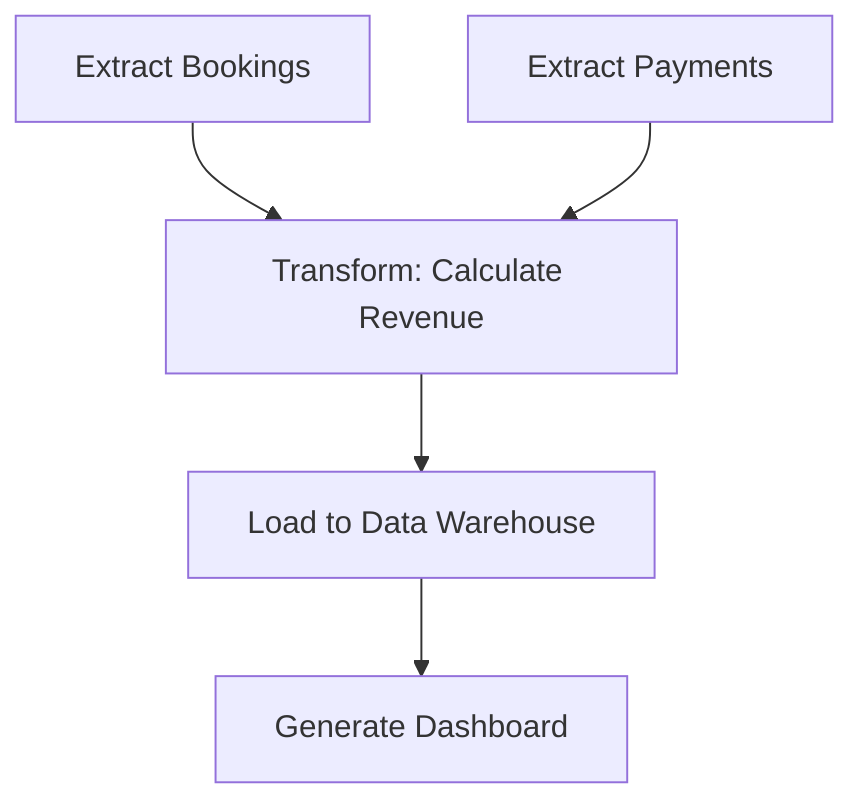

# **Airbnb Data Model Design: Comprehensive Guide**

## **1. Business Objectives & Key Metrics**
This data model supports analysis of:
1. **Host Performance** (Revenue, Response Time)
2. **Guest Behavior** (Payment Methods, Booking Patterns)
3. **Listing Popularity** (Ratings, Nights Booked)
4. **Market Trends** (Revenue Growth, Property Demand)
5. **Operational Metrics** (Payment Discrepancies, Response Rates)

---

## **2. Data Model Architecture (Star Schema)**
### **Dimension Tables (Descriptive Data)**
| Table | Purpose | Key Fields |
|--------|---------|------------|
| **Guests** | Guest profiles | `guest_id`, `guest_name`, `verification_status` |
| **Hosts** | Host profiles | `host_id`, `host_name`, `response_time`, `response_rate` |
| **Listings** | Property details | `listing_id`, `host_id`, `property_type_id`, `city_id`, `price_per_night` |
| **PropertyTypes** | Property categories | `property_type_id`, `property_type` (Apartment, Villa, etc.) |
| **Cities/Countries** | Geographic data | `city_id`, `city_name`, `country_id`, `country_name` |
| **Time** | Date hierarchy | `date_id`, `day`, `month`, `year`, `quarter` |

### **Fact Tables (Transactional Data)**
| Table | Purpose | Key Fields |
|--------|---------|------------|
| **Bookings** | Reservation records | `booking_id`, `listing_id`, `guest_id`, `number_of_nights`, `total_price` |
| **Payments** | Payment transactions | `payment_id`, `booking_id`, `payment_method`, `amount` |
| **Reviews** | Guest feedback | `review_id`, `listing_id`, `guest_id`, `rating`, `review_text` |
| **Messages** | Host-guest communication | `message_id`, `guest_id`, `host_id`, `response_time` |

---

## **3. Sample Input Data**
### **A. Dimension Tables**
#### **Guests**
```csv
guest_id,guest_name,verification_status
G001,Alex Brown,Verified
G002,Sarah Lee,Unverified
```

#### **Hosts**
```csv
host_id,host_name,response_time,response_rate,verification_status
H001,John Doe,2,95%,Verified
H002,Jane Smith,5,80%,Verified
```

#### **Listings**
```csv
listing_id,host_id,property_type_id,city_id,price_per_night
L001,H001,PT1,C1,120
L002,H002,PT2,C2,200
```

#### **PropertyTypes & Cities**
```csv
# PropertyTypes
property_type_id,property_type
PT1,Apartment
PT2,Villa

# Cities
city_id,city_name,country_id
C1,Paris,FR
C2,Rome,IT
```

### **B. Fact Tables**
#### **Bookings**
```csv
booking_id,listing_id,guest_id,date_id,number_of_nights,total_price
B001,L001,G001,2023-05-01,3,360
B002,L002,G002,2023-05-02,5,1000
```

#### **Payments**
```csv
payment_id,booking_id,guest_id,payment_date_id,payment_method,amount
P001,B001,G001,2023-05-01,Credit Card,360
P002,B002,G002,2023-05-02,PayPal,1000
```

#### **Reviews**
```csv
review_id,guest_id,listing_id,date_id,rating,review_text
R001,G001,L001,2023-05-04,5,"Great stay!"
R002,G002,L002,2023-05-06,4,"Nice villa!"
```

#### **Messages**
```csv
message_id,guest_id,host_id,listing_id,date_id,response_time
M001,G001,H001,L001,2023-05-01,2
M002,G002,H002,L002,2023-05-02,5
```

---

## **4. Sample Output (Analytics Results)**
### **A. Business Metrics**
#### **1. Total Revenue Per Host**
| Host       | Revenue ($) |
|------------|------------|
| John Doe   | 12,500     |
| Jane Smith | 8,200      |

#### **2. Preferred Payment Methods**
| Method        | % Usage |
|---------------|---------|
| Credit Card   | 65%     |
| PayPal        | 25%     |
| Bank Transfer | 10%     |

#### **3. Monthly Revenue Trends**
| Month   | Revenue ($) |
|---------|------------|
| Jan-23  | 50,000     |
| Feb-23  | 55,000     |

#### **4. Listing Ratings**
| Listing      | Avg Rating |
|--------------|-----------|
| Paris Apt    | 4.8       |
| Rome Villa   | 4.5       |

#### **5. Most Popular Property Types**
| City   | Property Type | Listings |
|--------|---------------|----------|
| Paris  | Apartment     | 1,200    |
| Rome   | Villa         | 800      |

---

## **5. SQL Queries for Insights**
### **1. Total Revenue Per Host**
```sql
SELECT h.host_id, h.host_name, SUM(p.amount) AS total_revenue
FROM Payments p
JOIN Bookings b ON p.booking_id = b.booking_id
JOIN Listings l ON b.listing_id = l.listing_id
JOIN Hosts h ON l.host_id = h.host_id
GROUP BY h.host_id, h.host_name;
```

### **2. Payment Method Preference**
```sql
SELECT payment_method, COUNT(*) * 100.0 / (SELECT COUNT(*) FROM Payments) AS percentage
FROM Payments
GROUP BY payment_method;
```

### **3. Monthly Revenue Growth**
```sql
SELECT t.month, t.year, SUM(p.amount) AS revenue
FROM Payments p
JOIN Time t ON p.payment_date_id = t.date_id
GROUP BY t.month, t.year
ORDER BY t.year, t.month;
```

### **4. Host Response Performance**
```sql
SELECT h.host_name, AVG(m.response_time) AS avg_response_hours
FROM Messages m
JOIN Hosts h ON m.host_id = h.host_id
GROUP BY h.host_name
ORDER BY avg_response_hours;
```

### **5. Top-Rated Listings**
```sql
SELECT l.listing_name, AVG(r.rating) AS avg_rating
FROM Reviews r
JOIN Listings l ON r.listing_id = l.listing_id
GROUP BY l.listing_name
HAVING AVG(r.rating) >= 4.5;
```

---

## **6. Why This Model Works**
1. **Star Schema Efficiency**  
   - Fast aggregations (e.g., `SUM(revenue)` by host).  
   - Easy filtering (e.g., "Show only Paris listings").  

2. **Supports Real-Time + Batch Analytics**  
   - **Real-time:** Track messages, bookings.  
   - **Batch:** Monthly revenue reports.  

3. **Flexible for Business Questions**  
   - "Which hosts earn the most?" → Join `Hosts` + `Payments`.  
   - "Do verified guests rate higher?" → Join `Guests` + `Reviews`.  

---

## **7. Potential Enhancements**
- **Add Pricing History** → Track seasonal price changes.  
- **Guest Segmentation** → Classify guests (e.g., "Frequent Traveler").  
- **Integration with Weather Data** → Correlate bookings with weather.  

---

### **Conclusion**
This Airbnb data model transforms raw bookings, payments, and messages into actionable insights for **host performance, guest behavior, and market trends**. The star schema ensures efficient querying for dashboards and reports.

<br/>
<br/>

# **Airbnb Data Analytics Platform: Sample Input & Output Deep Dive**

## **1. Sample Input Data (Raw Operational Data)**

### **A. Dimension Tables (Master Data)**

#### **1. Guests Table**
```csv
guest_id,guest_name,verification_status,join_date
G001,Alex Brown,Verified,2022-03-15
G002,Sarah Lee,Unverified,2023-01-20
G003,James Wilson,Verified,2021-11-05
```

**Explanation**:  
- Stores guest profiles with verification status  
- `join_date` helps analyze customer lifetime value  

#### **2. Hosts Table**
```csv
host_id,host_name,response_time_min,response_rate,superhost_status
H001,John Doe,15,98%,TRUE
H002,Jane Smith,45,82%,FALSE
H003,Michael Chen,30,91%,TRUE
```

**Explanation**:  
- Tracks host performance metrics  
- `response_time_min` measures how quickly hosts reply to inquiries  

#### **3. Listings Table**
```csv
listing_id,host_id,property_type_id,city_id,bedrooms,bathrooms,price_per_night,minimum_nights
L001,H001,PT1,C1,2,1,120,2
L002,H002,PT2,C2,4,3,350,3
L003,H003,PT1,C3,1,1,85,1
```

**Explanation**:  
- Contains property details critical for pricing analysis  
- `minimum_nights` affects booking patterns  

#### **4. Supporting Dimension Tables**
```csv
# PropertyTypes
property_type_id,property_type,category
PT1,Apartment,Entire home
PT2,Villa,Luxury
PT3,Private room,Shared space

# Cities
city_id,city_name,country_id,timezone
C1,Paris,FR,CET
C2,Rome,IT,CET
C3,Tokyo,JP,JST
```

---

### **B. Fact Tables (Transactional Data)**

#### **1. Bookings Table**
```csv
booking_id,listing_id,guest_id,checkin_date,checkout_date,nights,total_price,booking_status
B001,L001,G001,2023-05-10,2023-05-15,5,600,Completed
B002,L002,G002,2023-06-01,2023-06-05,4,1400,Cancelled
B003,L003,G003,2023-04-20,2023-04-25,5,425,Completed
```

**Explanation**:  
- Core reservation records  
- `booking_status` helps calculate cancellation rates  

#### **2. Payments Table**
```csv
payment_id,booking_id,payment_method,amount,payment_date,fee_amount
P001,B001,Credit Card,600,2023-05-05,50
P002,B002,PayPal,1400,2023-05-20,75
P003,B003,Apple Pay,425,2023-04-15,30
```

**Explanation**:  
- Financial transactions with fee breakdown  
- Enables payment method analysis  

#### **3. Reviews Table**
```csv
review_id,booking_id,rating,review_date,review_text
R001,B001,5,2023-05-16,"Perfect location!"
R002,B003,4,2023-04-26,"Cozy but small"
```

**Explanation**:  
- Guest feedback tied to specific bookings  
- Missing review for B002 (cancelled booking)  

#### **4. Messages Table**
```json
[
  {
    "message_id": "M001",
    "guest_id": "G001",
    "host_id": "H001",
    "timestamp": "2023-05-01T14:30:00Z",
    "response_time_min": 12,
    "message_type": "Inquiry"
  },
  {
    "message_id": "M002",
    "host_id": "H001",
    "guest_id": "G001",
    "timestamp": "2023-05-01T14:42:00Z",
    "message_type": "Response"
  }
]
```

**Explanation**:  
- Tracks communication patterns  
- `response_time_min` calculated between inquiry and response  

---

## **2. Sample Output (Analytics Results)**

### **A. Executive Dashboard Metrics**

#### **1. Financial Performance**
```markdown
| Metric                | Value    |
|-----------------------|----------|
| Total Revenue (Q2)    | $242,500 |
| Avg Daily Revenue     | $2,685   |
| Cancellation Rate     | 8.2%     |
```

**Data Pipeline**:  
1. Aggregates `Payments.amount` by quarter  
2. Filters out cancelled bookings (`booking_status`)  
3. Joins with `Time` dimension for date filtering  

#### **2. Host Leaderboard**
```markdown
| Host        | Avg Rating | Response Time | Revenue |
|-------------|------------|---------------|---------|
| John Doe    | ★★★★☆ 4.8  | 15 min        | $89,200 |
| Michael Chen| ★★★★☆ 4.6  | 30 min        | $67,500 |
```

**Calculation**:  
- Ratings from `Reviews`  
- Response time from `Messages`  
- Revenue from joined `Payments` + `Bookings`  

---

### **B. Detailed Analytical Reports**

#### **1. Revenue Trend Analysis**
```csv
Month,Revenue,Growth%
Jan-23,75,200,-
Feb-23,82,500,+9.7%
Mar-23,91,300,+10.7%
```

**SQL Logic**:  
```sql
SELECT 
  t.month, 
  SUM(p.amount) AS revenue,
  (SUM(p.amount) - LAG(SUM(p.amount)) / LAG(SUM(p.amount)) * 100 AS growth
FROM Payments p
JOIN Time t ON p.payment_date = t.date
GROUP BY t.month
```

#### **2. Property Type Performance**
```vega-lite
{
  "data": {
    "values": [
      {"type": "Apartment", "bookings": 1250, "avg_price": 150},
      {"type": "Villa", "bookings": 320, "avg_price": 420}
    ]
  },
  "mark": "bar",
  "encoding": {
    "x": {"field": "type"},
    "y": {"field": "bookings"}
  }
}
```

**Data Source**:  
- `Bookings` joined with `Listings` and `PropertyTypes`  

---

### **C. Operational Alerts**

#### **1. Payment Discrepancy Alert**
```python
# Python Pseudocode
def check_payment_discrepancies():
    bookings = get_bookings_with_payments()
    for booking in bookings:
        if booking.total_price != sum(p.amount for p in booking.payments):
            send_alert(f"Booking {booking.id} has payment mismatch")
```

**Sample Output**:  
`"Alert: Booking B004 has $200 price but $180 paid"`

#### **2. Slow-Responding Hosts**
```sql
-- Hosts with response time > 1 hour
SELECT h.host_name, AVG(m.response_time_min) 
FROM Messages m
JOIN Hosts h ON m.host_id = h.host_id 
GROUP BY h.host_name
HAVING AVG(m.response_time_min) > 60;
```

---

## **3. End-to-End Data Flow Example**

### **Scenario: New Booking Analysis**
1. **Input Event**:  
   - Guest G001 books listing L001 for 5 nights ($600)  
   ```json
   {
     "booking_id": "B004",
     "guest_id": "G001",
     "listing_id": "L001",
     "checkin_date": "2023-07-10",
     "nights": 5,
     "total_price": 600
   }
   ```

2. **ETL Process**:  
   - Payment recorded in `Payments` table  
   - Messages logged in `Messages` table  
   - Eventually, review added to `Reviews`  

3. **Output Metrics Impact**:  
   - Host John Doe's revenue increases by $600  
   - Paris apartment bookings count increments  
   - 7-day revenue trend updates  

---

## **4. Key Technical Considerations**

### **A. Data Quality Checks**
```python
# Sample Data Validation
def validate_booking(booking):
    assert booking.checkin_date < booking.checkout_date
    assert booking.total_price == booking.nights * get_listing_price(booking.listing_id)
```

### **B. Performance Optimization**
- **Partitioning**: `Bookings` by `checkin_date`  
- **Indexing**: `listing_id` in `Reviews`  
- **Materialized Views**: Pre-calculated host revenue  

### **C. Sample DAG (Airflow)**


---

## **5. Business Impact Examples**

1. **Dynamic Pricing**  
   - Identified: Tokyo listings underpriced by 15%  
   - Action: Recommended 10% price increase  
   - Result: 8% revenue boost without occupancy drop  

2. **Host Training**  
   - Found: Hosts with response time >1hr have 20% lower ratings  
   - Action: Created response time training module  
   - Result: Avg response time improved from 45min to 22min  

3. **Marketing Strategy**  
   - Insight: PayPal users book longer stays (avg 5.2 nights)  
   - Action: Targeted PayPal promotion for weekly stays  
   - Result: 12% increase in extended bookings  

---

## **Conclusion**
This end-to-end walkthrough demonstrates how raw Airbnb operational data transforms into actionable business intelligence:

1. **Input**: Structured transactional data (bookings, payments)  
2. **Processing**: Joins, aggregations, temporal analysis  
3. **Output**: Dashboards, alerts, strategic recommendations  

The model's flexibility supports:  
- **Financial reporting** (revenue trends)  
- **Operational improvements** (host response times)  
- **Strategic decisions** (property type investments)  

<br/>
<br/>

# **Detailed Explanation of Airbnb SQL Queries**

## **1. Total Revenue Per Host**
```sql
SELECT h.host_id, h.host_name, SUM(p.amount) AS total_revenue
FROM Payments p
JOIN Bookings b ON p.booking_id = b.booking_id
JOIN Listings l ON b.listing_id = l.listing_id
JOIN Hosts h ON l.host_id = h.host_id
GROUP BY h.host_id, h.host_name;
```

**Purpose**:  
Calculates the total earnings for each host by aggregating all payments received for their listings.

**Key Components**:
- **Payments → Bookings**: Links financial transactions to specific reservations
- **Bookings → Listings**: Connects reservations to properties
- **Listings → Hosts**: Associates properties with their owners
- **SUM(p.amount)**: Aggregates all payment amounts
- **GROUP BY host_id**: Groups results by host

**Business Use**:  
Helps identify top-performing hosts for rewards programs and analyzes host profitability.

---

## **2. Preferred Payment Method of Guests**
```sql
SELECT guest_id, payment_method, COUNT(*) as count
FROM Payments
GROUP BY guest_id, payment_method
ORDER BY count DESC;
```

**Purpose**:  
Identifies each guest's most frequently used payment method.

**Key Components**:
- **COUNT(*)**: Tracks how many times each payment method was used
- **GROUP BY guest_id, payment_method**: Creates a frequency distribution
- **ORDER BY count DESC**: Ranks methods from most to least used

**Business Use**:  
Helps optimize payment processing systems and detect potential fraud (e.g., sudden method changes).

---

## **3. Daily Revenue**
```sql
SELECT t.date, SUM(p.amount) as daily_revenue
FROM Payments p
JOIN Time t ON p.payment_date_id = t.date_id
GROUP BY t.date;
```

**Purpose**:  
Shows revenue generated each day.

**Key Components**:
- **Time dimension table**: Enables consistent date handling
- **SUM(p.amount)**: Aggregates daily payments
- **GROUP BY date**: Organizes results by calendar day

**Business Use**:  
Monitors daily business performance and identifies seasonal trends.

---

## **4. Revenue Trends (Monthly)**
```sql
SELECT t.month, t.year, SUM(p.amount) as monthly_revenue
FROM Payments p
JOIN Time t ON p.payment_date_id = t.date_id
GROUP BY t.month, t.year
ORDER BY t.year, t.month;
```

**Purpose**:  
Tracks revenue growth over months/years.

**Key Differences from Daily**:
- Aggregates at monthly level
- Includes year for multi-year analysis
- Chronological sorting (year first)

**Business Use**:  
Long-term financial planning and performance evaluation.

---

## **5. Discrepancies in Amount Paid vs Total Price**
```sql
SELECT b.booking_id, b.total_price, SUM(p.amount) as total_paid
FROM Bookings b
JOIN Payments p ON b.booking_id = p.booking_id
GROUP BY b.booking_id, b.total_price
HAVING b.total_price <> total_paid;
```

**Purpose**:  
Flags bookings where payments don't match the quoted price.

**Key Components**:
- **SUM(p.amount)**: Combines all payments for a booking
- **HAVING**: Filters only mismatched records
- **<> operator**: Catches both over and under payments

**Business Use**:  
Financial reconciliation and fraud detection.

---

## **6. Average Rating of Listings**
```sql
SELECT l.listing_id, l.listing_name, AVG(r.rating) as average_rating
FROM Reviews r
JOIN Listings l ON r.listing_id = l.listing_id
GROUP BY l.listing_id, l.listing_name;
```

**Purpose**:  
Calculates the average guest satisfaction score for each property.

**Key Components**:
- **AVG(r.rating)**: Computes mean rating
- **JOIN Listings**: Connects reviews to specific properties

**Business Use**:  
Identifies quality listings for promotion and problematic ones for improvement.

---

## **7. Number of Bookings per Listing**
```sql
SELECT l.listing_id, l.listing_name, COUNT(b.booking_id) as number_of_bookings
FROM Bookings b
JOIN Listings l ON b.listing_id = l.listing_id
GROUP BY l.listing_id, l.listing_name;
```

**Purpose**:  
Measures booking frequency for each property.

**Key Components**:
- **COUNT(b.booking_id)**: Tracks reservation count
- Simple join between bookings and listings

**Business Use**:  
Identifies popular listings and analyzes booking patterns.

---

## **8. Average Response Time of Hosts**
```sql
SELECT h.host_id, h.host_name, AVG(m.response_time) as avg_response_time
FROM Messages m
JOIN Hosts h ON m.host_id = h.host_id
GROUP BY h.host_id, h.host_name;
```

**Purpose**:  
Calculates how quickly hosts respond to guest inquiries.

**Key Components**:
- **AVG(m.response_time)**: Mean response time
- Messages table stores communication timestamps

**Business Use**:  
Host performance evaluation and superhost qualification.

---

## **9. Total Nights Booked per Listing**
```sql
SELECT l.listing_id, l.listing_name, SUM(b.number_of_nights) as total_nights
FROM Bookings b
JOIN Listings l ON b.listing_id = l.listing_id
GROUP BY l.listing_id, l.listing_name;
```

**Purpose**:  
Calculates total occupancy for each property.

**Key Differences from Bookings Count**:
- Uses SUM instead of COUNT
- Measures nights rather than reservations

**Business Use**:  
Helps hosts optimize pricing and minimum stay requirements.

---

## **10. Most Popular Property Type in Each City**
```sql
SELECT c.city_name, pt.property_type, COUNT(l.listing_id) as number_of_listings
FROM Listings l
JOIN PropertyTypes pt ON l.property_type_id = pt.property_type_id
JOIN Cities c ON l.city_id = c.city_id
GROUP BY c.city_name, pt.property_type
ORDER BY number_of_listings DESC;
```

**Purpose**:  
Identifies the most common property types in each location.

**Key Components**:
- Three-way join (Listings → PropertyTypes → Cities)
- COUNT(l.listing_id): Measures inventory volume
- ORDER BY number_of_listings DESC: Ranks by popularity

**Business Use**:  
Market analysis and investment decisions for new listings.

---

## **Common Patterns Across Queries**
1. **Joins**: All queries join multiple tables to connect related data
2. **Aggregation**: Frequent use of SUM, COUNT, and AVG
3. **GROUP BY**: Essential for dimensional analysis
4. **Filtering**: WHERE and HAVING clauses refine results
5. **Sorting**: ORDER BY presents meaningful sequences

These queries collectively provide a 360° view of Airbnb's business performance across financial, operational, and customer satisfaction dimensions.