# **Online Transaction Processing (OLTP) - Detailed Explanation**

## **1. Definition of OLTP**
**Online Transaction Processing (OLTP)** refers to a class of database systems optimized for managing transaction-oriented applications. These systems are designed to process a large number of short, atomic transactions in real time, typically involving **insertions, updates, deletions, and simple queries** on operational data.

## **2. Key Characteristics of OLTP Systems**
### **A. Transactional Operations (CRUD)**
OLTP systems primarily handle **CRUD operations**:
- **Create (Insert)**: Adding new records (e.g., placing an order).
- **Read (Select)**: Retrieving data (e.g., checking account balance).
- **Update**: Modifying existing data (e.g., updating inventory).
- **Delete**: Removing records (e.g., canceling a reservation).

Each transaction is **atomic**, meaning it either completes entirely or fails without partial execution.

### **B. ACID Properties**
OLTP databases enforce **ACID** compliance to ensure reliability:
- **Atomicity**: Transactions are treated as a single unit (all or nothing).
- **Consistency**: Transactions bring the database from one valid state to another.
- **Isolation**: Concurrent transactions do not interfere with each other.
- **Durability**: Once committed, transactions persist even after system failures.

### **C. High Concurrency & Locking Mechanisms**
Since multiple users access the system simultaneously, OLTP databases use:
- **Row-level locking** to prevent conflicts.
- **Optimistic/Pessimistic concurrency control** to manage simultaneous transactions.
- **Multi-version Concurrency Control (MVCC)** in databases like PostgreSQL to allow reads without blocking writes.

### **D. Real-Time Processing & Low Latency**
OLTP systems require **millisecond-level response times** because:
- Users expect immediate feedback (e.g., ATM withdrawals, online purchases).
- Slow transactions can lead to poor user experience and lost business.

### **E. High Availability & Fault Tolerance**
OLTP systems often implement:
- **Replication** (Master-Slave, Multi-Master) for redundancy.
- **Failover mechanisms** to switch to backup servers during outages.
- **Clustering** (e.g., Oracle RAC, SQL Server Always On) for scalability.

### **F. Normalized Database Schema**
OLTP databases use **3NF (Third Normal Form)** or higher to:
- Minimize redundancy.
- Ensure data integrity.
- Optimize for fast writes and simple queries.

### **G. Performance Metrics**
OLTP efficiency is measured in:
- **Transactions Per Second (TPS)**: Number of transactions processed per second.
- **Response Time**: Time taken to complete a single transaction.
- **Throughput**: Total number of transactions handled in a given period.

## **3. OLTP vs. OLAP (Comparison)**
| Feature          | OLTP (Operational) | OLAP (Analytical) |
|------------------|-------------------|-------------------|
| **Purpose**      | Real-time transactions | Complex analytics |
| **Data Type**    | Current, operational | Historical, aggregated |
| **Query Type**   | Simple CRUD operations | Complex joins, aggregations |
| **Schema**       | Normalized (3NF) | Denormalized (Star/Snowflake) |
| **Performance**  | Optimized for fast writes | Optimized for fast reads |
| **Users**        | Front-end applications, customers | Business analysts, data scientists |
| **Example**      | Banking transactions | Sales trend analysis |

## **4. Examples of OLTP Systems**
- **Banking**: ATM withdrawals, fund transfers.
- **E-Commerce**: Order processing, inventory updates.
- **Healthcare**: Patient record updates, appointment scheduling.
- **Retail**: Point-of-Sale (POS) transactions.
- **Telecom**: Call detail record (CDR) generation.

## **5. Common OLTP Databases**
- **Relational Databases**:  
  - MySQL, PostgreSQL, Oracle, Microsoft SQL Server, IBM Db2.  
- **NewSQL (Modern OLTP Databases)**:  
  - Google Spanner, CockroachDB, Amazon Aurora.  

## **6. Challenges in OLTP Systems**
- **Scalability**: Handling increasing transaction loads without performance degradation.
- **Deadlocks**: Managing concurrent transactions to prevent deadlocks.
- **Data Growth**: Efficiently archiving old data while maintaining performance.
- **Security**: Ensuring compliance (PCI-DSS, HIPAA) and preventing fraud.

## **7. Conclusion**
OLTP systems are the backbone of real-time business operations, ensuring fast, reliable, and secure transaction processing. They differ from OLAP systems in their focus on operational efficiency rather than analytical depth. With advancements in **distributed databases** and **cloud-native OLTP solutions**, these systems continue to evolve to meet modern demands.

<br/>
<br/>

# **OLTP Systems in Real-World Applications – Detailed Explanation**

OLTP (Online Transaction Processing) systems are the backbone of modern digital businesses, enabling real-time transactional operations across various industries. Below is a detailed breakdown of key OLTP applications:

---

## **1. ERP Systems (Enterprise Resource Planning)**
**Examples:** SAP ERP, Oracle ERP Cloud, Microsoft Dynamics 365, NetSuite  
**Key Features:**  
- **Real-time business process management** (finance, HR, supply chain, procurement).  
- **High transaction volume** (e.g., invoice processing, payroll updates).  
- **Multi-user concurrency** (employees across departments access and modify data simultaneously).  
- **ACID compliance** ensures data integrity in financial transactions.  

**Why OLTP?**  
ERP systems require instant updates (e.g., inventory deductions after a sale) and must prevent inconsistencies in financial records.

---

## **2. Banking Systems (ATMs & Online Banking)**
**Examples:** Core banking software (Temenos, Finacle), ATM networks (Visa, Mastercard)  
**Key Features:**  
- **Instant transaction processing** (deposits, withdrawals, fund transfers).  
- **Fraud detection in real-time** (blocking suspicious transactions).  
- **High availability (24/7 uptime)** to prevent service disruptions.  
- **Distributed transaction management** (e.g., two-phase commit for inter-bank transfers).  

**Why OLTP?**  
Banking cannot tolerate delays—customers expect immediate balance updates after transactions.

---

## **3. Airline Reservation Systems**
**Examples:** Sabre, Amadeus, Travelport  
**Key Features:**  
- **Real-time seat booking & cancellations** (handling thousands of concurrent users).  
- **Inventory locking** to prevent overbooking.  
- **High-speed querying** (checking flight availability in milliseconds).  
- **Distributed transactions** (syncing data across airlines, travel agencies, and global distribution systems).  

**Why OLTP?**  
Airlines must process bookings instantly and ensure no duplicate seat assignments.

---

## **4. E-Commerce Platforms**
**Examples:** Amazon, eBay, Shopify  
**Key Features:**  
- **Order processing & payment gateways** (handling millions of daily transactions).  
- **Inventory management** (real-time stock updates to prevent overselling).  
- **Shopping cart concurrency** (multiple users accessing the same product).  
- **Personalized recommendations** (using real-time user behavior data).  

**Why OLTP?**  
E-commerce relies on immediate order confirmations and accurate stock tracking.

---

## **5. Telecommunication Network Systems**
**Examples:** Call Detail Record (CDR) systems, 5G billing platforms  
**Key Features:**  
- **Real-time call/data session tracking** (logging call durations, data usage).  
- **Prepaid balance deductions** (instant updates to prevent fraud).  
- **Massive transaction volumes** (millions of CDRs per hour).  
- **Distributed databases** (to handle global telecom traffic).  

**Why OLTP?**  
Telecom providers must charge users accurately in real time.

---

## **6. Retail POS (Point of Sale) Systems**
**Examples:** Square, Lightspeed, Oracle MICROS  
**Key Features:**  
- **Instant checkout processing** (scanning items, applying discounts).  
- **Inventory synchronization** (updating stock levels across stores).  
- **Multi-location transactions** (handling sales from physical and online stores).  
- **Payment processing** (credit card, mobile wallet transactions).  

**Why OLTP?**  
Retailers need immediate sales recording to prevent stock discrepancies.

---

## **7. CRM Systems (Customer Relationship Management)**
**Examples:** Salesforce, HubSpot, Zoho CRM  
**Key Features:**  
- **Real-time customer data updates** (lead tracking, support tickets).  
- **Sales pipeline management** (instant opportunity status changes).  
- **Integration with marketing & support tools** (syncing data across platforms).  
- **High concurrency** (sales teams accessing the same customer records).  

**Why OLTP?**  
Sales and support teams need live data to make quick decisions.

---

## **8. Online Service Applications (Ride-Sharing, Food Delivery, Booking)**
**Examples:** Uber, Lyft, DoorDash, Airbnb  
**Key Features:**  
- **Real-time booking & dispatch** (matching drivers/riders instantly).  
- **Dynamic pricing updates** (surge pricing calculations).  
- **Payment processing** (immediate fare deductions).  
- **Geolocation tracking** (continuous updates for ETA calculations).  

**Why OLTP?**  
These apps require sub-second response times to maintain user trust.

---

## **Comparison of OLTP Use Cases**
| **Industry** | **Example Systems** | **Key OLTP Requirement** | **Database Used** |
|-------------|-------------------|------------------------|------------------|
| **Banking** | ATM Networks, Core Banking | Instant transaction processing | Oracle, IBM Db2 |
| **E-Commerce** | Amazon, Shopify | Real-time inventory updates | MySQL, PostgreSQL |
| **Airlines** | Sabre, Amadeus | Seat reservation locking | SQL Server, NoSQL (for scaling) |
| **Telecom** | CDR Systems | High-volume call logging | Cassandra, MongoDB |
| **Retail** | Square, Lightspeed | Fast checkout processing | SQLite, Firebase |
| **CRM** | Salesforce, HubSpot | Live customer data access | DynamoDB, Aurora |

---

## **Conclusion**
OLTP systems power mission-critical operations across industries by ensuring **fast, reliable, and concurrent transaction processing**. Whether it’s banking, e-commerce, or ride-sharing, these systems must handle **high throughput, maintain data integrity, and provide real-time responses** to users.  

Modern advancements like **distributed SQL databases (CockroachDB, Google Spanner)** and **cloud-native OLTP solutions (Amazon Aurora, Azure SQL)** are pushing the boundaries of scalability and performance.  

<br/>
<br/>

# **Popular Databases for OLTP – Detailed Explanation**

OLTP (Online Transaction Processing) systems require databases that can handle **high-speed transactions, maintain data consistency, and scale efficiently**. Below is a detailed breakdown of the most widely used OLTP databases, their architectures, strengths, and use cases.

---

## **1. Oracle Database**
**Type:** Relational (RDBMS)  
**Vendor:** Oracle Corporation  
**Key Features:**  
✔ **ACID compliance** – Ensures transaction reliability.  
✔ **Multi-model support** – Handles JSON, XML, and graph data.  
✔ **Partitioning & sharding** – For scalability.  
✔ **Real Application Clusters (RAC)** – High availability.  
✔ **Advanced security** – Encryption, auditing, and data masking.  

**Best For:**  
- Large enterprises (banking, ERP systems like SAP).  
- High-transaction environments requiring extreme reliability.  

**Limitations:**  
✖ Expensive licensing.  
✖ Complex setup and administration.  

---

## **2. MySQL**
**Type:** Relational (RDBMS)  
**Vendor:** Oracle (Open-Source)  
**Key Features:**  
✔ **High performance** – Optimized for read-heavy workloads.  
✔ **Replication** – Master-slave & group replication.  
✔ **Compatibility** – Works with most web frameworks.  
✔ **InnoDB engine** – Supports transactions and row-level locking.  

**Best For:**  
- Web applications (e.g., WordPress, e-commerce).  
- Small to medium OLTP workloads.  

**Limitations:**  
✖ Limited scalability for write-heavy systems.  
✖ No built-in sharding.  

---

## **3. Microsoft SQL Server**
**Type:** Relational (RDBMS)  
**Vendor:** Microsoft  
**Key Features:**  
✔ **T-SQL support** – Advanced querying capabilities.  
✔ **Always On Availability Groups** – High availability.  
✔ **Columnstore indexes** – For hybrid OLTP/OLAP workloads.  
✔ **Integration with Azure** – Cloud-native deployments.  

**Best For:**  
- Enterprise applications (CRM, ERP).  
- Windows-based environments.  

**Limitations:**  
✖ Licensing costs can be high.  
✖ Primarily optimized for Windows.  

---

## **4. PostgreSQL**
**Type:** Object-Relational (ORDBMS)  
**Vendor:** Open-Source  
**Key Features:**  
✔ **ACID compliance & MVCC** – Great for high concurrency.  
✔ **Extensible** – Supports JSON, geospatial, and custom data types.  
✔ **Advanced indexing** (B-tree, GIN, GiST).  
✔ **Logical replication** – Flexible data distribution.  

**Best For:**  
- Startups & enterprises needing flexibility.  
- Applications requiring complex queries (e.g., analytics + OLTP).  

**Limitations:**  
✖ Requires tuning for high write loads.  
✖ No built-in auto-sharding.  

---

## **5. IBM Db2**
**Type:** Relational (RDBMS)  
**Vendor:** IBM  
**Key Features:**  
✔ **BLU Acceleration** – In-memory processing.  
✔ **High availability** – HADR (High Availability Disaster Recovery).  
✔ **Multi-platform** – Runs on Linux, Unix, Windows, and mainframes.  
✔ **Advanced compression** – Reduces storage costs.  

**Best For:**  
- Financial institutions (banks, insurance).  
- Legacy enterprise systems.  

**Limitations:**  
✖ Expensive.  
✖ Steeper learning curve.  

---

## **6. MariaDB**
**Type:** Relational (RDBMS)  
**Vendor:** Open-Source (MySQL fork)  
**Key Features:**  
✔ **MySQL-compatible** – Easy migration from MySQL.  
✔ **Aria & InnoDB storage engines** – Optimized for OLTP.  
✔ **Galera Cluster** – Synchronous multi-master replication.  
✔ **Better performance** in some benchmarks vs. MySQL.  

**Best For:**  
- MySQL replacements needing better scalability.  
- Web applications & cloud deployments.  

**Limitations:**  
✖ Smaller ecosystem than MySQL.  
✖ Some enterprise features require paid versions.  

---

## **7. SAP HANA**
**Type:** In-Memory RDBMS  
**Vendor:** SAP  
**Key Features:**  
✔ **In-memory processing** – Extremely fast analytics & transactions.  
✔ **Columnar storage** – Optimized for mixed workloads.  
✔ **Advanced analytics** – Machine learning integration.  
✔ **Real-time data processing**.  

**Best For:**  
- SAP ERP systems.  
- High-speed financial & logistics applications.  

**Limitations:**  
✖ Very expensive.  
✖ Requires specialized hardware.  

---

## **8. Amazon Aurora**
**Type:** Cloud-native RDBMS  
**Vendor:** AWS  
**Key Features:**  
✔ **MySQL & PostgreSQL compatible**.  
✔ **Auto-scaling storage** – Up to 128TB per instance.  
✔ **High availability** – 6-way replication across AZs.  
✔ **Serverless option** – Pay-per-use model.  

**Best For:**  
- Cloud-native applications.  
- Startups & enterprises using AWS.  

**Limitations:**  
✖ Vendor lock-in with AWS.  
✖ Slightly higher latency than on-prem databases.  

---

## **9. Google Cloud Spanner**
**Type:** Globally-distributed RDBMS  
**Vendor:** Google Cloud  
**Key Features:**  
✔ **Horizontal scalability** – No sharding required.  
✔ **Strong consistency** – ACID across regions.  
✔ **99.999% uptime SLA**.  
✔ **SQL support** – Familiar querying.  

**Best For:**  
- Global applications (e.g., financial services, gaming).  
- Systems needing **low-latency worldwide access**.  

**Limitations:**  
✖ Expensive for high-throughput workloads.  
✖ Limited to Google Cloud.  

---

## **10. CockroachDB**
**Type:** Distributed SQL (NewSQL)  
**Vendor:** Cockroach Labs  
**Key Features:**  
✔ **Horizontal scaling** – Auto-sharding.  
✔ **Strong consistency** – ACID across nodes.  
✔ **PostgreSQL-compatible**.  
✔ **Multi-cloud & on-prem support**.  

**Best For:**  
- Global OLTP applications.  
- Companies avoiding cloud vendor lock-in.  

**Limitations:**  
✖ Higher latency than single-node databases.  
✖ Still maturing vs. established RDBMS.  

---

## **Comparison of OLTP Databases**
| **Database**       | **Type**          | **Strengths**                          | **Best For**                          |
|--------------------|------------------|---------------------------------------|---------------------------------------|
| **Oracle**         | RDBMS            | High reliability, enterprise features | Banking, large ERP systems            |
| **MySQL**          | RDBMS            | Fast reads, open-source               | Web apps, small-scale OLTP            |
| **SQL Server**     | RDBMS            | Windows integration, T-SQL            | Enterprise apps (CRM, Dynamics 365)   |
| **PostgreSQL**     | ORDBMS           | Extensibility, complex queries        | Startups, hybrid OLTP/OLAP workloads  |
| **IBM Db2**        | RDBMS            | Mainframe support, compression        | Financial institutions, legacy systems|
| **MariaDB**        | RDBMS            | MySQL replacement, Galera clustering  | High-availability web apps            |
| **SAP HANA**       | In-Memory RDBMS  | Real-time analytics + OLTP            | SAP ERP, high-speed transactions      |
| **Amazon Aurora**  | Cloud RDBMS      | AWS integration, auto-scaling         | Cloud-native applications             |
| **Google Spanner** | Distributed SQL  | Global consistency                    | Worldwide low-latency apps            |
| **CockroachDB**    | Distributed SQL  | Open-source, multi-cloud              | Scalable, vendor-agnostic OLTP        |

---

## **Conclusion**
The best OLTP database depends on:
- **Scale** (single-node vs. distributed).  
- **Latency requirements** (local vs. global).  
- **Budget** (open-source vs. enterprise).  
- **Cloud vs. on-premises deployment**.  

**Trends in OLTP Databases:**  
- **Cloud-native databases** (Aurora, Spanner) are growing.  
- **Distributed SQL** (CockroachDB, YugabyteDB) is gaining traction.  
- **Hybrid transactional/analytical processing (HTAP)** is becoming popular (e.g., PostgreSQL with Citus).  

<br/>
<br/>

# **Online Analytical Processing (OLAP) – Comprehensive Guide**

## **1. Definition of OLAP**
**Online Analytical Processing (OLAP)** is a category of data processing technology designed to enable complex business intelligence (BI) queries. Unlike OLTP (focused on real-time transactions), OLAP specializes in **multi-dimensional analysis of historical, aggregated data** to support decision-making.

---

## **2. Key Characteristics of OLAP Systems**
### **A. Multi-Dimensional Analysis (Cubes)**
OLAP organizes data in **cubes** (not tables), allowing analysis across multiple dimensions such as:
- **Time** (Year, Quarter, Month)
- **Geography** (Country, Region, City)
- **Product** (Category, Subcategory, SKU)
- **Customer** (Segment, Demographics)

**Example:**  
A business analyst can view:  
*"Total sales of Electronics in North America during Q1 2024, broken down by month and product category."*

### **B. Fast Query Performance**
OLAP achieves speed through:
- **Pre-aggregation** (pre-calculated totals, averages).
- **Indexing & caching** (optimized for analytical queries).
- **Columnar storage** (efficient for reading large datasets).

### **C. Aggregation & Computations**
OLAP supports:
- **Roll-up** (summarizing data hierarchically, e.g., daily → monthly sales).
- **Drill-down** (going from summary to detailed data).
- **Slice & Dice** (filtering by specific dimensions).
- **Pivoting** (switching between dimensions for different views).

### **D. Support for Complex Queries**
OLAP enables:
- **Trend analysis** (sales growth over 5 years).
- **Comparative analysis** (YoY, QoQ comparisons).
- **What-if scenarios** (forecasting based on variables).

### **E. Data Discovery & Ad-Hoc Querying**
- Users can explore data interactively without predefined reports.
- Tools like **Power BI, Tableau, and Looker** connect to OLAP backends.

### **F. Read-Optimized (vs. OLTP Write-Optimized)**
- OLAP databases **rarely modify data** (mostly append-only).
- Optimized for **SELECT-heavy workloads** (not INSERT/UPDATE).

---

## **3. OLAP vs. OLTP Comparison**
| Feature          | OLAP (Analytical)               | OLTP (Transactional)            |
|------------------|--------------------------------|--------------------------------|
| **Purpose**      | Business intelligence, reporting | Real-time transaction processing |
| **Query Type**   | Complex aggregations, joins     | Simple CRUD operations          |
| **Data Freshness** | Historical (hours/days old)    | Real-time (up-to-the-second)    |
| **Schema**       | Denormalized (Star/Snowflake)  | Normalized (3NF)               |
| **Performance**  | Optimized for reads            | Optimized for writes           |
| **Users**        | Analysts, executives            | Customers, clerks              |
| **Example**      | Sales trend dashboard          | ATM withdrawal transaction     |

---

## **4. Types of OLAP Systems**
### **A. MOLAP (Multidimensional OLAP)**
- **Data Storage:** Proprietary **multidimensional cubes** (e.g., SSAS, Essbase).
- **Pros:**  
  ✔ Blazing-fast queries (pre-aggregated).  
  ✔ Best for structured, predictable analysis.  
- **Cons:**  
  ✖ Limited scalability.  
  ✖ Requires ETL processing.  

**Use Case:** Financial reporting with fixed dimensions.

### **B. ROLAP (Relational OLAP)**
- **Data Storage:** Traditional **relational databases** (e.g., SQL Server, Redshift).
- **Pros:**  
  ✔ Handles large datasets.  
  ✔ More flexible than MOLAP.  
- **Cons:**  
  ✖ Slower than MOLAP (no pre-aggregation).  

**Use Case:** Ad-hoc analysis on raw data.

### **C. HOLAP (Hybrid OLAP)**
- **Combines MOLAP + ROLAP** (aggregations in cubes, details in RDBMS).
- **Pros:**  
  ✔ Balances speed and flexibility.  
- **Cons:**  
  ✖ Complex to implement.  

**Use Case:** Retail inventory analysis (summary views + drill-down).

### **D. DOLAP (Desktop OLAP)**
- Lightweight OLAP for **local analysis** (e.g., Excel PivotTables).
- **Pros:**  
  ✔ No server needed.  
- **Cons:**  
  ✖ Limited data capacity.  

**Use Case:** Small business budgeting.

---

## **5. Popular OLAP Databases & Tools**
| **Tool/Database** | **Type**       | **Description**                          |
|-------------------|---------------|------------------------------------------|
| **Snowflake**     | Cloud Data Warehouse | Supports multi-dimensional queries. |
| **Google BigQuery** | Serverless OLAP | SQL-based analytics at scale. |
| **Amazon Redshift** | Columnar OLAP | Optimized for large datasets. |
| **Microsoft SSAS** | MOLAP/ROLAP   | Integrated with Power BI. |
| **Apache Druid**  | Real-time OLAP | Low-latency analytics. |
| **ClickHouse**    | Columnar DB   | High-speed aggregations. |
| **IBM Cognos**    | BI + OLAP     | Enterprise reporting. |

---

## **6. Real-World OLAP Use Cases**
1. **Retail:**  
   - Analyzing sales trends by region/category.  
   - Inventory optimization using demand forecasting.  

2. **Finance:**  
   - Fraud detection via transaction pattern analysis.  
   - Profitability analysis across business units.  

3. **Healthcare:**  
   - Patient outcome analysis by treatment type.  
   - Hospital resource utilization trends.  

4. **Marketing:**  
   - Campaign performance across channels.  
   - Customer segmentation for targeted ads.  

---

## **7. Challenges in OLAP Systems**
- **Data Latency:** OLAP relies on ETL pipelines, causing delays.  
- **Storage Costs:** Pre-aggregation increases storage needs.  
- **Complexity:** Designing efficient cubes requires expertise.  
- **Scalability:** Traditional MOLAP struggles with big data.  

---

## **8. Future Trends in OLAP**
- **Real-Time OLAP:** Tools like **Druid & ClickHouse** enable sub-second analytics.  
- **AI Integration:** Auto-generating insights using ML.  
- **Cloud-Native OLAP:** Snowflake & BigQuery dominate.  
- **HTAP (Hybrid OLTP + OLAP):** Single systems for both (e.g., **Google Spanner**).  

---

## **Conclusion**
OLAP empowers organizations to **transform raw data into actionable insights** through multi-dimensional analysis. While traditional MOLAP still dominates structured reporting, modern **cloud-based columnar databases** (Snowflake, BigQuery) are revolutionizing scalability and flexibility.  

**Key Takeaway:**  
- Use **OLTP** for real-time transactions (e.g., order processing).  
- Use **OLAP** for historical analysis (e.g., sales forecasting).  

<br/>
<br/>

# **OLAP Systems – In-Depth Analysis**

## **1. Microsoft Analysis Services (SSAS)**
**Type:** MOLAP/ROLAP  
**Vendor:** Microsoft  
**Deployment:** On-premises or Azure (as Azure Analysis Services)  

### **Key Features:**
✔ **Multidimensional Cubes (MOLAP):**  
   - Stores pre-aggregated data in compressed proprietary format.  
   - Enables ultra-fast queries for fixed reporting (e.g., financial dashboards).  

✔ **Tabular Model (ROLAP):**  
   - Uses in-memory columnar storage (VertiPaq engine).  
   - More flexible for ad-hoc analysis (similar to Power BI).  

✔ **Integration with Microsoft Stack:**  
   - Works seamlessly with SQL Server, Power BI, and Excel (PivotTables).  

✔ **DAX & MDX Query Languages:**  
   - **MDX** (Multidimensional Expressions) for cube queries.  
   - **DAX** (Data Analysis Expressions) for tabular models.  

### **Use Cases:**
- Enterprise financial reporting (budget vs. actuals).  
- Retail sales performance analysis.  

### **Limitations:**
✖ MOLAP cubes require manual maintenance (processing/refreshing).  
✖ Limited scalability vs. cloud-native solutions.  

---

## **2. SAP BW (Business Warehouse)**
**Type:** ROLAP with MOLAP options  
**Vendor:** SAP  
**Deployment:** On-premises or SAP HANA Cloud  

### **Key Features:**
✔ **Optimized for SAP Data:**  
   - Tight integration with SAP ERP, CRM, and S/4HANA.  

✔ **InfoCubes & BEx Analyzer:**  
   - **InfoCubes** store aggregated data in star schemas.  
   - **BEx (Business Explorer)** provides front-end OLAP tools.  

✔ **Hybrid Approach (BW/4HANA):**  
   - Leverages SAP HANA’s in-memory engine for real-time analytics.  

✔ **Extractors for SAP Sources:**  
   - Pre-built connectors for SAP transactional systems.  

### **Use Cases:**
- SAP-centric organizations (e.g., manufacturing, logistics).  
- Regulatory reporting in industries like pharmaceuticals.  

### **Limitations:**
✖ Steep learning curve (SAP-specific modeling).  
✖ Expensive licensing.  

---

## **3. Amazon Redshift**
**Type:** Cloud ROLAP  
**Vendor:** AWS  
**Deployment:** Fully managed cloud service  

### **Key Features:**
✔ **Columnar Storage & Massively Parallel Processing (MPP):**  
   - Distributes queries across multiple nodes for speed.  

✔ **Redshift Spectrum:**  
   - Queries data directly in S3 (no loading required).  

✔ **Materialized Views:**  
   - Pre-computes aggregations for faster performance.  

✔ **Integration with AWS Ecosystem:**  
   - Works with QuickSight (BI), Lambda (ETL), and Glue (data catalog).  

### **Use Cases:**
- Log analysis (e.g., ad tech, gaming).  
- Customer 360° views in e-commerce.  

### **Limitations:**
✖ Requires tuning (sort keys, distribution styles).  
✖ Slower than Snowflake for concurrent users.  

---

## **4. Google BigQuery**
**Type:** Serverless ROLAP  
**Vendor:** Google Cloud  
**Deployment:** Fully managed cloud service  

### **Key Features:**
✔ **Serverless Architecture:**  
   - No infrastructure management – scales automatically.  

✔ **BigQuery ML:**  
   - Run machine learning models using SQL.  

✔ **Partitioned & Clustered Tables:**  
   - Optimizes cost/performance for large datasets.  

✔ **Federated Queries:**  
   - Query data in Google Sheets, Cloud Storage, or external databases.  

### **Use Cases:**
- IoT time-series analysis.  
- Marketing attribution modeling.  

### **Limitations:**
✖ Cost can spike with complex queries.  
✖ Less control over performance tuning.  

---

## **5. Snowflake**
**Type:** Cloud Hybrid (ROLAP + MOLAP-like caching)  
**Vendor:** Snowflake Inc.  
**Deployment:** Multi-cloud (AWS, Azure, GCP)  

### **Key Features:**
✔ **Separate Compute & Storage:**  
   - Scale compute resources independently (cost efficiency).  

✔ **Automatic Clustering & Micro-Partitions:**  
   - Self-optimizing storage for fast queries.  

✔ **Zero-Copy Cloning:**  
   - Instantly duplicate datasets for testing/development.  

✔ **Snowpark for Python/Scala:**  
   - Run advanced analytics without leaving Snowflake.  

### **Use Cases:**
- Cross-departmental analytics in large enterprises.  
- Data sharing between organizations (e.g., supplier collaboration).  

### **Limitations:**
✖ Higher cost than Redshift for simple workloads.  
✖ No on-premises option.  

---

## **Comparative Summary**
| **System**               | **Strengths**                          | **Best For**                          | **Weaknesses**                     |
|--------------------------|---------------------------------------|---------------------------------------|------------------------------------|
| **Microsoft SSAS**       | Deep Excel integration, MOLAP speed   | Enterprises using Power BI/SQL Server | Limited cloud scalability          |
| **SAP BW**              | SAP ecosystem integration             | Manufacturing, regulated industries   | Complex, expensive                 |
| **Amazon Redshift**      | AWS integration, MPP architecture     | Log analytics, mid-size BI            | Requires manual tuning             |
| **Google BigQuery**      | Serverless, ML integration            | Ad-hoc analysis, IoT data             | Unpredictable costs                |
| **Snowflake**           | Multi-cloud, elastic scaling          | Large-scale collaborative analytics   | Premium pricing                    |

---

## **Emerging Trends in OLAP**
1. **Augmented Analytics:**  
   - AI-driven insights (e.g., BigQuery ML, Snowflake’s Anomaly Detection).  
2. **Real-Time OLAP:**  
   - Tools like **Apache Druid** bridge batch and streaming data.  
3. **Data Mesh Architectures:**  
   - Decentralized OLAP (e.g., Snowflake Data Sharing).  

---

## **Key Takeaways**
- **For SAP shops:** SAP BW/4HANA is the natural choice.  
- **Microsoft-centric teams:** SSAS + Power BI delivers tight integration.  
- **Cloud-native projects:**  
  - Need serverless? → **BigQuery**  
  - Multi-cloud? → **Snowflake**  
  - Already on AWS? → **Redshift**  

<br/>
<br/>

# **OLTP vs. OLAP – Detailed Comparison**

This table provides a comprehensive comparison between **Online Transaction Processing (OLTP)** and **Online Analytical Processing (OLAP)** systems. Below is a detailed breakdown of each aspect:

---

## **1. Main Function**
| **OLTP** | **OLAP** |
|----------|----------|
| Manages **day-to-day operational transactions** (e.g., order processing, ATM withdrawals). | Supports **complex analysis and decision-making** (e.g., sales forecasting, financial reporting). |

**Key Difference:**  
- OLTP = **Operational efficiency** (real-time data updates).  
- OLAP = **Strategic insights** (historical trend analysis).  

---

## **2. Database Design**
| **OLTP** | **OLAP** |
|----------|----------|
| **Normalized schema** (3NF or higher) to minimize redundancy. | **Denormalized schema** (Star/Snowflake schema) for faster queries. |
| Optimized for **INSERT/UPDATE** operations. | Optimized for **SELECT** (read-heavy) operations. |

**Why?**  
- OLTP avoids duplication to maintain consistency.  
- OLAP trades storage for query speed by pre-joining tables.  

---

## **3. Data Type**
| **OLTP** | **OLAP** |
|----------|----------|
| **Detailed, raw, and current** (e.g., a single customer’s order). | **Summarized, aggregated, and historical** (e.g., quarterly sales by region). |

**Example:**  
- OLTP: A single row in an `orders` table.  
- OLAP: A pivot table showing total sales per product category.  

---

## **4. Transactions**
| **OLTP** | **OLAP** |
|----------|----------|
| **Short, fast, atomic** (e.g., debit/credit in banking). | **Long-running, complex** (e.g., "Show YoY growth by product"). |
| High volume (1000s/sec). | Low volume (few/hour). |

**Performance Impact:**  
- OLTP: Measured in **Transactions Per Second (TPS)**.  
- OLAP: Measured in **Query Response Time**.  

---

## **5. Records Accessed**
| **OLTP** | **OLAP** |
|----------|----------|
| **Single or few records** (e.g., fetching a user’s balance). | **Millions/billions of records** (e.g., scanning all sales data). |

**Technical Implications:**  
- OLTP uses **row-level locking**.  
- OLAP uses **full-table scans** with columnar storage.  

---

## **6. Performance Metrics**
| **OLTP** | **OLAP** |
|----------|----------|
| **TPS (Transactions Per Second)** – Measures throughput. | **Query Response Time** – Measures analytical speed. |

**Example:**  
- OLTP: A bank processes **500 TPS** during peak hours.  
- OLAP: A dashboard query runs in **2 seconds** vs. 10 seconds (optimized).  

---

## **7. Examples**
| **OLTP** | **OLAP** |
|----------|----------|
| - Online banking (transfers). <br> - E-commerce checkouts. <br> - Hotel reservations. | - Sales trend analysis. <br> - Financial reporting. <br> - Customer segmentation. |

**Real-World Analogy:**  
- OLTP = The **cashier** processing checkout.  
- OLAP = The **CFO** analyzing annual revenue.  

---

## **8. Users**
| **OLTP** | **OLAP** |
|----------|----------|
| **Frontline staff**: <br> - Cashiers. <br> - Customer service reps. <br> - IT admins. | **Decision-makers**: <br> - Executives. <br> - Data analysts. <br> - BI teams. |

**Why It Matters:**  
- OLTP users need **speed and accuracy**.  
- OLAP users need **flexibility and depth**.  

---

## **9. Database Size**
| **OLTP** | **OLAP** |
|----------|----------|
| **Smaller** (weeks/months of operational data). | **Larger** (years of historical data + aggregates). |

**Storage Impact:**  
- OLTP: Purges old data (e.g., archived transactions).  
- OLAP: Retains history for trend analysis.  

---

## **10. Query Nature**
| **OLTP** | **OLAP** |
|----------|----------|
| **Simple, predictable**: <br> - `SELECT * FROM users WHERE id=123`. | **Complex, ad-hoc**: <br> - "Compare Q3 sales across regions by product category." |

**Technical Note:**  
- OLTP queries use **indexed lookups**.  
- OLAP queries use **full scans + aggregations**.  

---

## **11. Consistency Requirements**
| **OLTP** | **OLAP** |
|----------|----------|
| **ACID compliance** (strict consistency). | **Eventual consistency** (refreshed periodically). |

**Why?**  
- OLTP cannot tolerate **dirty reads** (e.g., double-spending).  
- OLAP can tolerate **stale data** (refreshed hourly/daily).  

---

## **Summary: When to Use Which?**
| **Scenario**               | **OLTP** | **OLAP** |
|----------------------------|----------|----------|
| Real-time order processing | ✔        | ✖        |
| Monthly sales report       | ✖        | ✔        |
| ATM withdrawal             | ✔        | ✖        |
| Customer churn analysis    | ✖        | ✔        |

**Modern Trend:**  
- **HTAP (Hybrid OLTP + OLAP)** systems (e.g., **Google Spanner, MySQL HeatWave**) aim to bridge the gap.  

---

## **Key Takeaways**
1. **OLTP** = **Operational systems** (fast, accurate, real-time).  
2. **OLAP** = **Analytical systems** (flexible, historical, aggregated).  
3. **They complement each other** – OLTP feeds data into OLAP via ETL.  

<br/>
<br/>

# **Normalized Data in Database Design – A Comprehensive Guide**

## **1. What is Data Normalization?**
Data normalization is a systematic approach to **organizing data in a relational database** to:
- **Minimize redundancy** (avoid duplicate data).
- **Ensure data integrity** (accuracy and consistency).
- **Optimize storage efficiency**.
It involves decomposing tables into smaller, related tables while establishing relationships between them using **primary and foreign keys**.

---

## **2. Why Normalize Data?**
### **Key Benefits:**
| **Advantage**          | **Explanation** |
|------------------------|----------------|
| **Reduced Redundancy** | Each data item is stored once, eliminating duplication. |
| **Improved Consistency** | Updates affect only one location, preventing anomalies. |
| **Storage Efficiency** | Smaller database size due to elimination of repeated data. |
| **Simplified Maintenance** | Easier to modify schema without widespread changes. |
| **Better Query Performance** (for OLTP) | Optimized for transactional operations (INSERT/UPDATE/DELETE). |

### **Without Normalization:**
- **Update Anomalies**: Changing data in one record but missing duplicates.
- **Insertion Anomalies**: Inability to add data due to missing dependencies.
- **Deletion Anomalies**: Accidentally losing critical data when deleting records.

---

## **3. Normal Forms (NFs)**
Normalization follows progressive rules called **Normal Forms (NFs)**. Each NF builds on the previous one:

| **Normal Form** | **Rule** | **Example Violation** |
|----------------|---------|----------------------|
| **1NF (First NF)** | All attributes contain atomic (indivisible) values. | Storing multiple phone numbers in one column (e.g., "555-1234, 555-5678"). |
| **2NF (Second NF)** | Meets 1NF + no partial dependency (non-key attributes depend on the entire primary key). | In an `Orders` table with `(OrderID, ProductID, ProductName)`, `ProductName` depends only on `ProductID` (not the full key). |
| **3NF (Third NF)** | Meets 2NF + no transitive dependency (non-key attributes depend only on the primary key). | In `Employees(EmpID, Dept, DeptLocation)`, `DeptLocation` depends on `Dept` (not directly on `EmpID`). |
| **BCNF (Boyce-Codd NF)** | Stricter 3NF where every determinant is a candidate key. | Rarely used in practice. |
| **4NF+** | Address multi-valued and join dependencies. | Mainly theoretical. |

**OLTP Systems Typically Use 3NF:**  
Balances redundancy elimination with query performance.

---

## **4. Normalized vs. Denormalized Data**
| **Aspect**       | **Normalized (OLTP)** | **Denormalized (OLAP)** |
|------------------|----------------------|------------------------|
| **Schema**       | Many small tables with relationships. | Fewer tables with duplicated data. |
| **Redundancy**   | Minimal. | High (pre-joined for faster reads). |
| **Query Speed**  | Slower for analytical queries (due to joins). | Faster for aggregations. |
| **Updates**      | Efficient (single-point changes). | Costly (must update multiple copies). |
| **Use Case**     | Transactional systems (e.g., banking). | Analytical systems (e.g., data warehouses). |

---

## **5. Normalization in OLTP Systems**
### **Why OLTP Uses Normalized Data:**
1. **High Write Volume**:  
   - Normalization speeds up `INSERT/UPDATE/DELETE` operations by reducing write overhead.  
2. **ACID Compliance**:  
   - Ensures transaction reliability (e.g., a bank transfer updates two rows atomically).  
3. **Concurrency Control**:  
   - Row-level locking works efficiently in normalized schemas.  

### **Examples of Normalized OLTP Databases:**
- **Banking Systems**:  
  - Separate tables for `Accounts`, `Transactions`, and `Customers` linked by keys.  
- **E-Commerce**:  
  - `Orders`, `OrderItems`, and `Products` tables to avoid duplicating product details.  
- **Airline Reservations**:  
  - `Flights`, `Passengers`, and `Bookings` tables.  

---

## **6. Practical Example**
### **Unnormalized Table (Problems):**
| **OrderID** | **CustomerName** | **Product1** | **Product2** | **Qty1** | **Qty2** |
|------------|-----------------|--------------|--------------|----------|----------|
| 1001       | John Doe        | Laptop       | Mouse        | 1        | 2        |

**Issues:**  
- Mixed data types (products in columns).  
- Cannot handle variable-order items.  

### **Normalized Design (Solution):**
1. **Customers Table**:
   | **CustomerID** | **CustomerName** |
   |---------------|-----------------|
   | 1             | John Doe        |

2. **Orders Table**:
   | **OrderID** | **CustomerID** | **OrderDate**  |
   |------------|---------------|----------------|
   | 1001       | 1             | 2023-10-05     |

3. **OrderItems Table**:
   | **ItemID** | **OrderID** | **ProductID** | **Quantity** |
   |-----------|------------|--------------|-------------|
   | 1         | 1001       | 101          | 1           |
   | 2         | 1001       | 102          | 2           |

4. **Products Table**:
   | **ProductID** | **ProductName** |
   |--------------|----------------|
   | 101          | Laptop         |
   | 102          | Mouse          |

**Benefits:**  
- No duplication of customer/product data.  
- Flexible to add more items per order.  

---

## **7. When to Avoid Normalization?**
1. **OLAP Systems**:  
   - Denormalization improves read performance for analytics.  
2. **Read-Heavy Applications**:  
   - Fewer joins = faster queries (e.g., reporting dashboards).  
3. **Microservices**:  
   - Duplicate data to avoid cross-service joins.  

---

## **8. Key Takeaways**
- **Normalization** is critical for **OLTP** to ensure data integrity and efficient transactions.  
- **Denormalization** benefits **OLAP** for analytical speed.  
- **3NF** is the sweet spot for most transactional databases.  
- Modern databases (e.g., **PostgreSQL, Oracle**) automate referential integrity checks.  

**Trade-Off:**  
- Normalization = **Write efficiency + Consistency**.  
- Denormalization = **Read efficiency + Redundancy**.  

<br/>
<br/>

# **Normalized Database Structure – Detailed Explanation**
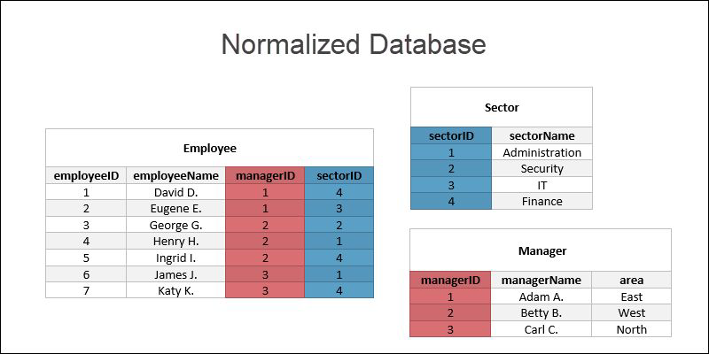
This image depicts a **fully normalized relational database** for an employee management system, demonstrating how data is organized across three tables to minimize redundancy and maintain integrity. Below is a comprehensive breakdown:

---

## **1. Database Schema Overview**
The database consists of three interconnected tables:

1. **`Employee`** – Stores employee details.
2. **`Sector`** – Defines department categories.
3. **`Manager`** – Contains manager information.

---

## **2. Table-by-Table Analysis**

### **A. Employee Table**
| **employeeID** | **employeeName** | **managerID** | **sectorID** |
|---------------|-----------------|--------------|-------------|
| 1             | David D.        | 1            | 4           |
| 2             | Eugene E.       | 1            | 3           |
| ...           | ...             | ...          | ...         |

**Fields:**
- **`employeeID`**: Primary key (unique identifier).
- **`employeeName`**: Employee’s full name.
- **`managerID`**: Foreign key linking to the `Manager` table.
- **`sectorID`**: Foreign key linking to the `Sector` table.

**Purpose:**  
- Avoids duplicating manager/sector details for each employee.
- Enforces referential integrity (e.g., no employee can have an invalid `sectorID`).

---

### **B. Sector Table**
| **sectorID** | **sectorName**   |
|-------------|------------------|
| 1           | Administration   |
| 2           | Security         |
| 3           | IT               |
| 4           | Finance          |

**Fields:**
- **`sectorID`**: Primary key.
- **`sectorName`**: Department name.

**Purpose:**  
- Centralizes sector definitions (e.g., changing "IT" to "Technology" requires only one update).
- Saves storage space (replaces repetitive text with integer keys).

---

### **C. Manager Table**
| **managerID** | **managerName** | **area** |
|--------------|----------------|----------|
| 1            | Adam A.        | East     |
| 2            | Betty B.       | West     |
| 3            | Carl C.        | North    |

**Fields:**
- **`managerID`**: Primary key.
- **`managerName`**: Manager’s full name.
- **`area`**: Geographic region they oversee.

**Purpose:**  
- Prevents redundancy (e.g., "Adam A." appears once but manages multiple employees).
- Allows quick lookup of all employees under a manager.

---

## **3. Normalization Level**
This design adheres to **Third Normal Form (3NF)** because:
1. **1NF**: All fields contain atomic values (no lists or repeating groups).
2. **2NF**: No partial dependencies (e.g., `sectorName` depends only on `sectorID`, not `employeeID`).
3. **3NF**: No transitive dependencies (e.g., `area` depends only on `managerID`).

---

## **4. Relationships & Foreign Keys**
- **Employee → Manager**:  
  - `managerID` in `Employee` references `managerID` in `Manager`.  
  - Enables queries like:  
    ```sql
    SELECT e.employeeName, m.managerName 
    FROM Employee e JOIN Manager m ON e.managerID = m.managerID;
    ```

- **Employee → Sector**:  
  - `sectorID` in `Employee` references `sectorID` in `Sector`.  
  - Enables queries like:  
    ```sql
    SELECT e.employeeName, s.sectorName 
    FROM Employee e JOIN Sector s ON e.sectorID = s.sectorID;
    ```

---

## **5. Benefits of This Design**
| **Advantage**               | **Example**                                                                 |
|-----------------------------|----------------------------------------------------------------------------|
| **Reduced Redundancy**      | "Finance" (`sectorID=4`) is stored once but referenced by David, Ingrid, and Katy. |
| **Data Consistency**        | Renaming "IT" to "Technology" updates only the `Sector` table.             |
| **Efficient Storage**       | Integer keys (`sectorID`, `managerID`) use less space than repeating text. |
| **Flexible Queries**        | Easily list all employees in "Finance" or managers in the "East" region.   |

---

## **6. Example Queries**
### **A. List Employees with Manager and Sector Details**
```sql
SELECT e.employeeName, m.managerName, s.sectorName
FROM Employee e
JOIN Manager m ON e.managerID = m.managerID
JOIN Sector s ON e.sectorID = s.sectorID;
```
**Result:**
| employeeName | managerName | sectorName    |
|-------------|------------|--------------|
| David D.    | Adam A.    | Finance      |
| Eugene E.   | Adam A.    | IT           |
| ...         | ...        | ...          |

### **B. Count Employees per Sector**
```sql
SELECT s.sectorName, COUNT(e.employeeID) AS employeeCount
FROM Sector s
LEFT JOIN Employee e ON s.sectorID = e.sectorID
GROUP BY s.sectorName;
```
**Result:**
| sectorName     | employeeCount |
|---------------|--------------|
| Administration | 2            |
| Security      | 1            |
| IT            | 1            |
| Finance       | 3            |

---

## **7. Potential Improvements**
1. **Add Indexes**:  
   - Create indexes on `managerID` and `sectorID` for faster joins.
2. **Enhance `Manager` Table**:  
   - Add `email` or `phone` fields if needed.
3. **Audit Trail**:  
   - Add `createdAt` and `updatedAt` timestamps for tracking changes.

---

## **8. Key Takeaways**
- **Normalization eliminates redundancy** by splitting data into logical tables.
- **Foreign keys enforce relationships** (e.g., an employee cannot belong to a nonexistent sector).
- **3NF is ideal for OLTP** systems (e.g., HR databases, banking).

**When to Denormalize?**  
For **analytics/OLAP**, you might combine tables to speed up read-heavy queries (e.g., a `Employee_Extended` view with all details pre-joined).  


<br/>
<br/>

# **Denormalized Data – A Comprehensive Guide**

Denormalization is a strategic database optimization technique that prioritizes **read performance** over **write efficiency**, primarily used in analytical systems. Below is a detailed breakdown of its principles, trade-offs, and applications.

---

## **1. What is Denormalization?**
Denormalization **combines data from multiple normalized tables** into fewer (or single) tables to:
- **Reduce join operations** (faster queries).
- **Simplify complex reporting**.
- **Optimize for read-heavy workloads** (e.g., analytics, dashboards).

### **Key Idea:**
- **Trade-off**: Accept **redundant data** for **query speed**.
- **Use Case**: Ideal for **OLAP**, data warehouses, and reporting systems.

---

## **2. Why Denormalize?**
| **Scenario**              | **Normalized** | **Denormalized** |
|---------------------------|---------------|------------------|
| **Query Speed**           | Slower (joins required). | Faster (pre-joined data). |
| **Write Performance**     | Optimized.    | Penalized (updates propagate redundantly). |
| **Storage Efficiency**    | High (no redundancy). | Low (duplicate data). |
| **Data Integrity**        | Enforced via constraints. | Risk of inconsistencies. |

**Example**:  
A sales report querying `Orders`, `Customers`, and `Products` in a normalized DB requires **3+ joins**. In a denormalized DB, all fields are in **one table**, eliminating joins.

---

## **3. Denormalization Techniques**
### **A. Flattened Tables**
Combine related tables into one wide table:  
**Normalized** (3 tables):  
- `Orders(OrderID, CustomerID, ProductID, Quantity)`  
- `Customers(CustomerID, Name, Email)`  
- `Products(ProductID, Name, Price)`  

**Denormalized** (1 table):  
- `Sales_Report(OrderID, CustomerName, Email, ProductName, Price, Quantity)`  

**Pros**:  
✔ No joins needed for reports.  
**Cons**:  
✖ Updating a product name requires modifying all matching rows.

### **B. Pre-Joined Views**
Create materialized views that persist join results:  
```sql
CREATE MATERIALIZED VIEW Sales_Denormalized AS
SELECT o.OrderID, c.CustomerName, p.ProductName, p.Price
FROM Orders o
JOIN Customers c ON o.CustomerID = c.CustomerID
JOIN Products p ON o.ProductID = p.ProductID;
```

**Pros**:  
✔ Automatically synced with source tables (in some DBs).  
**Cons**:  
✖ Refresh delays may cause stale data.

### **C. Replicated Columns**
Copy frequently accessed columns into related tables:  
**Normalized**:  
- `Employees(EmployeeID, Name, DepartmentID)`  
- `Departments(DepartmentID, DepartmentName)`  

**Denormalized**:  
- `Employees(EmployeeID, Name, DepartmentID, DepartmentName)`  

**Pros**:  
✔ Avoids joining to `Departments` for department names.  
**Cons**:  
✖ Requires triggers or application logic to sync updates.

---

## **4. When to Use Denormalization?**
| **Use Case**               | **Rationale** |
|----------------------------|--------------|
| **Data Warehousing**       | Star/snowflake schemas denormalize dimensions for faster analytics. |
| **Reporting Dashboards**   | Pre-aggregate data to accelerate visualizations. |
| **Read-Heavy APIs**        | Optimize for low-latency API responses (e.g., e-commerce product listings). |
| **Time-Series Analytics**  | Duplicate metadata alongside metrics to avoid joins. |

**Example Systems**:  
- **OLAP**: Snowflake, Redshift, BigQuery.  
- **Caching Layers**: Redis (denormalized key-value stores).  

---

## **5. Risks of Denormalization**
### **A. Data Anomalies**
| **Anomaly Type** | **Description** | **Example** |
|------------------|----------------|------------|
| **Update Anomaly** | Inconsistent updates to redundant data. | Changing a product name in one row but not others. |
| **Insert Anomaly** | Unable to add data due to missing dependencies. | Can’t add a product without an order. |
| **Delete Anomaly** | Unintentional loss of data. | Deleting an order removes the only record of a product. |

### **B. Mitigation Strategies**
1. **Scheduled Refreshes**: Rebuild denormalized tables nightly.  
2. **Triggers**: Automate updates to redundant fields.  
3. **Immutable Data**: Treat denormalized data as read-only (e.g., data warehouses).  

---

## **6. Denormalized vs. Normalized: A Practical Example**
### **Normalized Schema (OLTP)**
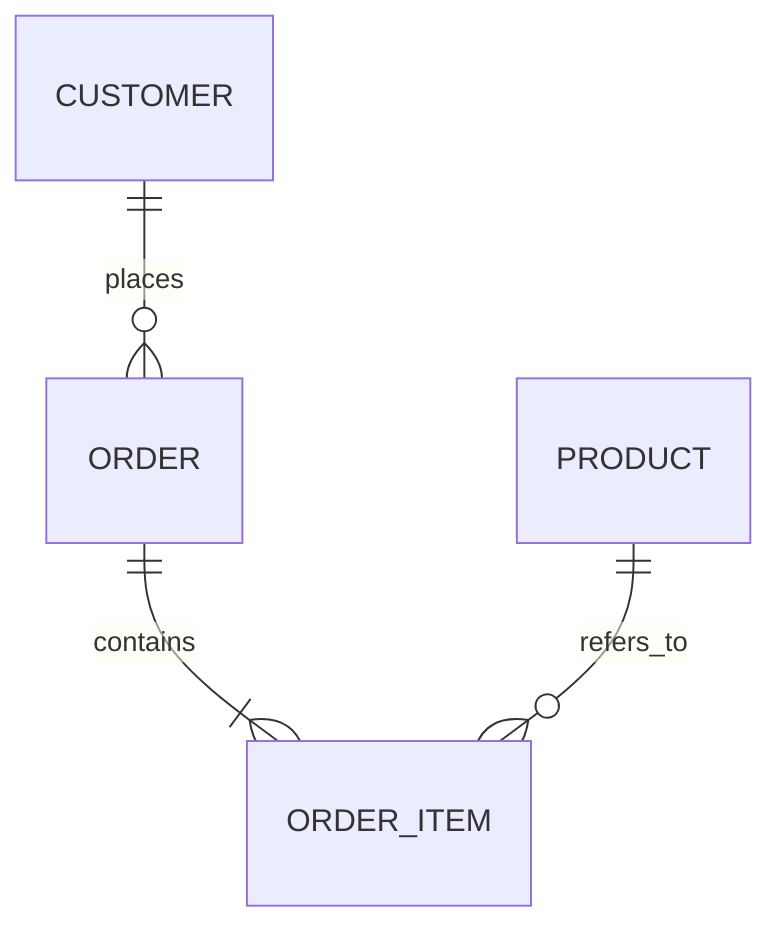
```mermaid
erDiagram
    CUSTOMER ||--o{ ORDER : places
    ORDER ||--|{ ORDER_ITEM : contains
    PRODUCT ||--o{ ORDER_ITEM : refers_to
```

### **Denormalized Schema (OLAP)**
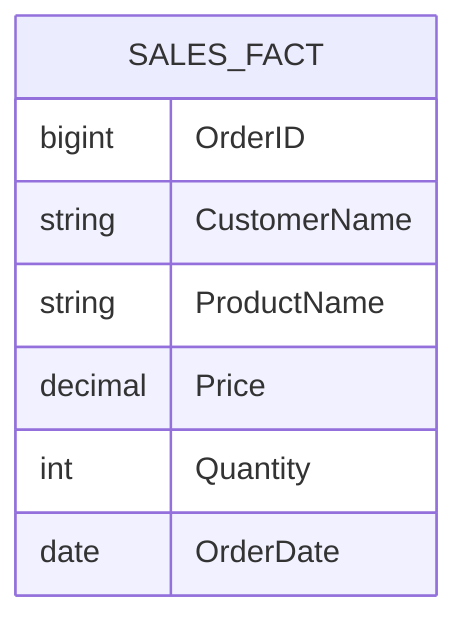
```mermaid
erDiagram
    SALES_FACT {
        bigint OrderID
        string CustomerName
        string ProductName
        decimal Price
        int Quantity
        date OrderDate
    }
```

**Query Comparison**:  
- **Normalized**:  
  ```sql
  SELECT c.CustomerName, p.ProductName, oi.Quantity
  FROM Orders o
  JOIN Customers c ON o.CustomerID = c.CustomerID
  JOIN Order_Items oi ON o.OrderID = oi.OrderID
  JOIN Products p ON oi.ProductID = p.ProductID;
  ```
- **Denormalized**:  
  ```sql
  SELECT CustomerName, ProductName, Quantity
  FROM Sales_Fact;
  ```

---

## **7. Tools for Managing Denormalized Data**
| **Tool**          | **Purpose** |
|-------------------|------------|
| **Snowflake**     | Cloud data warehouse with auto-optimized storage. |
| **Amazon Redshift** | Columnar storage for analytics. |
| **Apache Druid**  | Real-time denormalized analytics. |
| **Materialized Views** (PostgreSQL/Oracle) | Pre-compute joins for faster queries. |

---

## **8. Key Takeaways**
1. **Denormalization trades storage/consistency for speed**.  
2. **Best for**:  
   - OLAP, data warehouses, reporting.  
   - Read-heavy applications (APIs, dashboards).  
3. **Avoid for**:  
   - OLTP systems (banking, e-commerce checkouts).  
4. **Modern Trend**:  
   - **Hybrid approaches** (e.g., normalized OLTP + denormalized OLAP via ETL).  

**Rule of Thumb**:  
> "Normalize until it hurts, denormalize until it works."  
> — Database Design Proverb  

<br/>
<br/>

# **Normalized vs. Denormalized Database Design – Detailed Comparison**
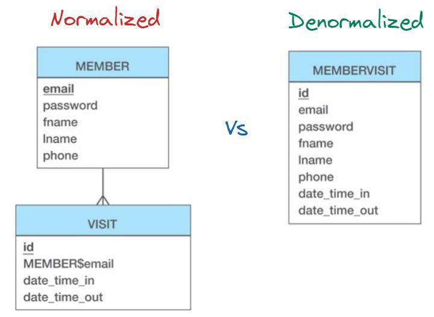
This image contrasts normalized and denormalized database schemas for a membership/visit tracking system. Below is a comprehensive analysis of both approaches:

## **1. Normalized Database Structure**

### **A. Tables in Normalized Design**
#### **1. MEMBER Table**
| Field    | Description               | Data Type Example |
|----------|---------------------------|-------------------|
| email    | Primary key (unique ID)   | VARCHAR(255)      |
| password | Encrypted user credential | VARCHAR(255)      |
| fname    | First name                | VARCHAR(100)      |
| lname    | Last name                 | VARCHAR(100)      |
| phone    | Contact number            | VARCHAR(20)       |

#### **2. VISIT Table**
| Field          | Description                     | Data Type Example |
|----------------|---------------------------------|-------------------|
| id             | Primary key (auto-increment)    | INT               |
| MEMBERS_email  | Foreign key linking to MEMBER   | VARCHAR(255)      |
| date_time_in   | Timestamp of entry              | DATETIME          |
| date_time_out  | Timestamp of exit (nullable)    | DATETIME          |

### **B. How It Works**
- **Relationship**: One-to-many (1 member → many visits).
- **Key Mechanism**:  
  ```sql
  -- Query to get all visits with member details
  SELECT m.fname, m.lname, v.date_time_in, v.date_time_out
  FROM MEMBER m
  JOIN VISIT v ON m.email = v.MEMBERS_email;
  ```

### **C. Advantages**
✔ **Minimized Redundancy**:  
   - Member details stored once (e.g., no duplicate `fname`/`lname` per visit).  
✔ **Data Integrity**:  
   - Updates to member info (e.g., phone) propagate automatically.  
✔ **Efficient Writes**:  
   - Adding visits doesn't require repeating member data.  

### **D. Disadvantages**
✖ **Slower Reads**:  
   - Requires joins for visit reports.  
✖ **Complex Queries**:  
   - Multi-table operations needed for simple questions like "Who visited yesterday?"  

---

## **2. Denormalized Database Structure**

### **A. MEMBERVISIT Table (Denormalized)**
| Field          | Description                     | Data Type Example |
|----------------|---------------------------------|-------------------|
| id             | Visit ID (primary key)          | INT               |
| email          | Member identifier               | VARCHAR(255)      |
| password       | Redundant credential storage    | VARCHAR(255)      |
| fname          | Repeated first name             | VARCHAR(100)      |
| lname          | Repeated last name              | VARCHAR(100)      |
| phone          | Repeated contact info           | VARCHAR(20)       |
| date_time_in   | Entry timestamp                 | DATETIME          |
| date_time_out  | Exit timestamp                  | DATETIME          |

### **B. How It Works**
- **Self-Contained**: All data in one table.
- **Query Simplicity**:  
  ```sql
  -- Same query without joins
  SELECT fname, lname, date_time_in, date_time_out
  FROM MEMBERVISIT;
  ```

### **C. Advantages**
✔ **Blazing-Fast Reads**:  
   - No joins needed for visit history reports.  
✔ **Simplified Code**:  
   - Application logic avoids complex joins.  
✔ **Optimized for Analytics**:  
   - Full scan efficiency (e.g., "Count visits by month").  

### **D. Disadvantages**
✖ **Data Redundancy**:  
   - John Doe's name/phone repeats for every visit → wasted storage.  
✖ **Update Anomalies**:  
   - Changing a phone number requires updating all related visit records.  
✖ **Insert Anomalies**:  
   - Can't record a visit without duplicating member details.  

---

## **3. Side-by-Side Comparison**
| **Aspect**          | **Normalized**               | **Denormalized**             |
|----------------------|------------------------------|------------------------------|
| **Schema**           | 2 tables with relationships  | 1 flat table                 |
| **Storage**          | Efficient (no redundancy)    | Inefficient (duplicate data) |
| **Write Speed**      | Fast (single-point updates)  | Slow (mass updates needed)   |
| **Read Speed**       | Slower (joins required)      | Faster (no joins)            |
| **Data Integrity**   | High (ACID compliant)        | Risk of inconsistencies      |
| **Best For**         | OLTP (member management)     | OLAP (visit analytics)       |

---

## **4. Practical Scenarios**
### **When to Use Normalized?**
- **Member Portal**:  
  - Frequent profile updates (email/password changes).  
  - Example: A gym app where users manage their accounts.  

### **When to Use Denormalized?**
- **Visit Analytics Dashboard**:  
  - Historical reports (e.g., "Peak visit hours last month").  
  - Example: A kiosk displaying real-time visitor statistics.  

---

## **5. Hybrid Approach**
Modern systems often **combine both**:  
1. **Normalized OLTP Database**:  
   - Handles member signups/updates.  
2. **Denormalized Data Warehouse**:  
   - ETL pipelines flatten data for analytics (e.g., Snowflake, Redshift).  

**Implementation Example**:  

```mermaid
flowchart LR
    A[Normalized DB] -->|ETL Process| B[Denormalized Table]
    B --> C[BI Dashboard]
```

---

## **6. Key Takeaways**
1. **Normalization** prioritizes:  
   - Data integrity  
   - Write efficiency  
   - Update flexibility  

2. **Denormalization** prioritizes:  
   - Query performance  
   - Read simplicity  
   - Analytical speed  

3. **Choose based on use case**:  
   - **Operational systems?** → Normalized (OLTP).  
   - **Reporting/analytics?** → Denormalized (OLAP).  

**Pro Tip**:  
> "Normalize until it hurts, denormalize until it works."  
> — Database Design Best Practice  

<br/>
<br/>

# **Normalized vs. Denormalized Data: A Strategic Guide**

This comparison table and explanation highlight the fundamental differences between normalized and denormalized data structures. Let me expand on these concepts with practical insights and modern applications.

## **Core Differences Explained**

### **1. Structural Philosophy**
| **Aspect**       | **Normalized** | **Denormalized** |
|------------------|---------------|------------------|
| **Design Goal**  | Minimize redundancy through separation | Optimize read performance through consolidation |
| **Table Count**  | Many interrelated tables | Fewer consolidated tables |
| **Relationships** | Enforced through foreign keys | Pre-joined with embedded data |

**Example**:  
- **Normalized**: Separate `Customers`, `Orders`, and `Products` tables  
- **Denormalized**: Single `Sales_Reports` table with customer/order/product details  

### **2. Performance Characteristics**
| **Operation** | **Normalized** | **Denormalized** |
|--------------|---------------|------------------|
| **INSERT/UPDATE** | Fast (single-point changes) | Slow (multiple updates needed) |
| **DELETE** | Efficient | May cause orphaned data |
| **SELECT** | Requires joins (slower) | Instant access (no joins) |

**Real-World Impact**:  
- An e-commerce site processes **100 orders/sec** (OLTP) → Needs normalization  
- A BI tool generates **monthly sales reports** → Benefits from denormalization  

### **3. Data Integrity Considerations**
| **Factor** | **Normalized** | **Denormalized** |
|------------|---------------|------------------|
| **Consistency** | ACID-compliant | Eventual consistency |
| **Anomalies** | Prevented by design | Update/delete anomalies possible |
| **Validation** | Enforced at DB level | Often requires application logic |

**Risk Scenario**:  
In a denormalized patient records system:  
- Updating a doctor's specialty in one record but not others → Inconsistent reports  

## **Modern Implementation Patterns**

### **Hybrid Architectures**
1. **Transactional Core + Analytical Extension**  
   - **OLTP**: Normalized PostgreSQL for order processing  
   - **OLAP**: Denormalized Redshift for business analytics  
   - Connected via ETL pipelines (e.g., AWS Glue)

2. **Materialized Views**  
   ```sql
   -- PostgreSQL example
   CREATE MATERIALIZED VIEW sales_summary AS
   SELECT c.name, p.category, SUM(o.amount)
   FROM orders o
   JOIN customers c ON o.customer_id = c.id
   JOIN products p ON o.product_id = p.id
   GROUP BY c.name, p.category;
   ```
   - Automatically refreshed nightly  
   - Provides denormalized access to normalized data  

3. **Database Specialization**  
   | **Database Type** | **Normalization** | **Use Case** |
   |------------------|------------------|-------------|
   | **Operational DB** | Highly normalized | Microservices |
   | **Data Warehouse** | Moderately denormalized | Analytics |
   | **Data Lake** | Non-normalized | Raw data storage |

## **Decision Framework**
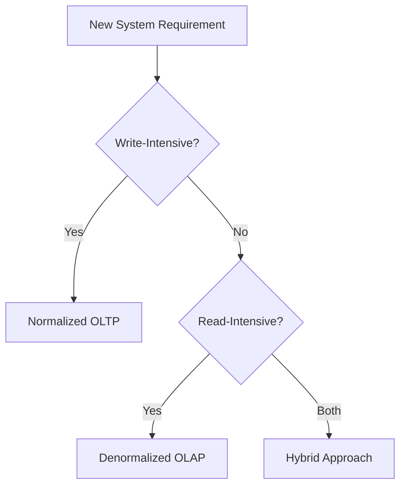
```mermaid
flowchart TD
    A[New System Requirement] --> B{Write-Intensive?}
    B -->|Yes| C[Normalized OLTP]
    B -->|No| D{Read-Intensive?}
    D -->|Yes| E[Denormalized OLAP]
    D -->|Both| F[Hybrid Approach]
```

**Key Questions to Ask**:  
1. What's our read/write ratio?  
2. How critical is real-time consistency?  
3. What are our reporting latency requirements?  

## **Emerging Trends**
1. **HTAP Databases** (Hybrid Transactional/Analytical Processing):  
   - Single engine for both workloads (e.g., Google Spanner, Oracle Exadata)  
2. **Delta Lakes**:  
   - ACID transactions on denormalized data lakes  
3. **Edge Computing**:  
   - Normalized at central DB, denormalized at edge locations  

## **Actionable Recommendations**
1. **For Greenfield Projects**:  
   - Start normalized, denormalize strategically for performance bottlenecks  
2. **Legacy Systems**:  
   - Identify reporting pain points for targeted denormalization  
3. **Cloud Migrations**:  
   - Leverage managed services (Aurora, Cosmos DB) that support both patterns  

**Remember**: The most effective systems often combine both approaches - normalized foundations with denormalized access layers tailored to specific use cases.


<br/>
<br/>

# **Data Lakes: The Comprehensive Guide**

## **1. Definition and Core Concept**
A **Data Lake** is a centralized repository that stores massive amounts of **raw, unprocessed data** in its native format (structured, semi-structured, and unstructured) without requiring upfront schema definitions. Unlike traditional data warehouses that enforce "schema-on-write," data lakes employ **"schema-on-read"** - meaning data structure and transformations are applied only when the data is accessed for analysis.

### **Key Metaphor:**
- **Data Warehouse** = Bottled water (cleaned, packaged, ready for consumption)
- **Data Lake** = Natural lake (raw water that can be filtered/processed as needed)

---

## **2. Why Data Lakes? Key Drivers**
| **Challenge** | **Data Lake Solution** |
|--------------|------------------------|
| Explosion of diverse data types (IoT, social media, logs) | Stores **all formats**: JSON, CSV, images, videos, PDFs |
| High costs of traditional EDW (Enterprise Data Warehouses) | Uses **low-cost object storage** (e.g., AWS S3, Azure Blob) |
| Rigid schema requirements delay analytics | **Schema-on-read** enables flexible exploration |
| Need for real-time + batch processing | Supports **streaming data** (Kafka, Kinesis) alongside batch |

**Example**: A healthcare provider stores:
- Structured: EHR records (SQL databases)
- Semi-structured: Doctor's notes (JSON/XML)
- Unstructured: MRI scans (DICOM images)

---

## **3. Architecture Components**
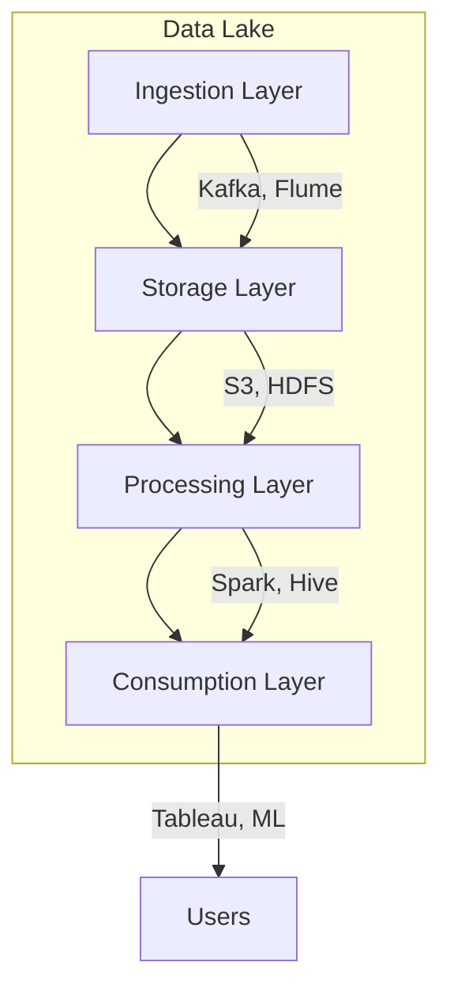
```mermaid
flowchart TB
    subgraph Data Lake
        A[Ingestion Layer] --> B[Storage Layer]
        B --> C[Processing Layer]
        C --> D[Consumption Layer]
    end

    A -->|Kafka, Flume| B
    B -->|S3, HDFS| C
    C -->|Spark, Hive| D
    D -->|Tableau, ML| Users
```

### **A. Ingestion Layer**
- **Tools**: Apache Kafka, AWS Kinesis, Azure Event Hubs
- **Functions**:
  - Batch ingestion (nightly CSV dumps)
  - Real-time streaming (IoT sensor data)
  - Supports **all data formats**

### **B. Storage Layer**
- **Technologies**:
  - Object Storage: AWS S3, Azure Data Lake Storage (ADLS)
  - Distributed File Systems: HDFS (for on-prem)
- **Key Features**:
  - Infinite scalability
  - 99.999999999% (11 nines) durability
  - Cost: As low as **$0.023/GB/month** (AWS S3 Standard)

### **C. Processing Layer**
| **Processing Type** | **Tools** | **Use Case** |
|---------------------|----------|-------------|
| Batch Processing | Apache Spark, Hive | Daily ETL jobs |
| Stream Processing | Spark Streaming, Flink | Real-time fraud detection |
| SQL Analytics | Presto, Athena | Ad-hoc queries |
| Machine Learning | TensorFlow, SageMaker | Model training |

### **D. Consumption Layer**
- **BI Tools**: Power BI, Tableau
- **Data Science**: Jupyter Notebooks
- **Applications**: Custom APIs

---

## **4. Data Lake vs. Data Warehouse**
| **Feature** | **Data Lake** | **Data Warehouse** |
|------------|--------------|-------------------|
| **Data Structure** | Raw, all formats | Processed, structured only |
| **Schema** | Schema-on-read | Schema-on-write |
| **Cost** | ~$20/TB/year | ~$2,000/TB/year (Redshift) |
| **Users** | Data scientists, engineers | Business analysts |
| **Latency** | Minutes-hours for insights | Seconds-minutes |
| **Best For** | Exploration, ML | Standardized reporting |

**Modern Trend**: **Lakehouse Architecture** (Delta Lake, Iceberg) blends both capabilities.

---

## **5. Key Benefits**
### **A. Business Advantages**
1. **360° Customer View**  
   - Combine CRM data (structured) with social media sentiment (unstructured)
2. **AI/ML Readiness**  
   - Train models on raw clickstream data vs. aggregated tables
3. **Regulatory Compliance**  
   - Retain original data for audits (GDPR, HIPAA)

### **B. Technical Advantages
1. **Time-to-Insight Reduction**  
   - Dump data first, model later (vs. EDW's lengthy modeling phase)
2. **Cost Efficiency**  
   - AWS S3 costs **90% less** than Redshift for storage
3. **Future-Proofing**  
   - Store data now, find value later (e.g., new ML techniques)

---

## **6. Challenges & Solutions**
| **Challenge** | **Solution** |
|--------------|-------------|
| **Data Swamp Risk** (unusable data) | Implement metadata management (Atlas, Glue Catalog) |
| **Security/Governance** | Role-based access control (AWS Lake Formation) |
| **Query Performance** | Use partitioning (date/customer segments) |
| **Data Quality** | Automated profiling (Great Expectations) |

**Case Study**:  
Netflix's data lake:
- **Scale**: 100+ PB of data
- **Tools**: S3, Spark, Iceberg
- **Use Case**: Personalize thumbnails based on raw viewing behavior

---

## **7. Real-World Implementations**
### **A. Cloud-Based**
1. **AWS**: S3 + Glue + Athena + EMR
2. **Azure**: ADLS + Databricks + Synapse
3. **GCP**: Cloud Storage + BigQuery + Dataproc

### **B. On-Prem/Hybrid**
- Cloudera CDP
- MinIO (S3-compatible open source)

---

## **8. Best Practices**
1. **Zone Your Data**  
   - `/raw/`, `/cleaned/`, `/curated/` directories
2. **Metadata Management**  
   - Tag data with ownership, PII flags
3. **Incremental Processing**  
   - Process only new data (CDC patterns)
4. **Cost Monitoring**  
   - Set S3 lifecycle policies (move cold data to Glacier)

---

## **9. Future Trends**
1. **Lakehouse Adoption** (Delta Lake, Iceberg)
   - ACID transactions on data lakes
2. **Unified Metadata**  
   - Single catalog across lakes/warehouses
3. **Edge Data Lakes**  
   - Process IoT data at source before ingestion

---

## **10. When to Use a Data Lake?**
- **Yes**:  
  - Storing diverse data types  
  - Advanced analytics/ML needs  
  - "Store now, analyze later" requirements  

- **No**:  
  - Standardized financial reporting  
  - Low-latency transactional queries  

**Hybrid Approach**: Many enterprises use both - raw data in lakes, processed data in warehouses.

---

## **Key Takeaways**
1. Data lakes enable **cost-effective storage of all data types**.
2. They power **advanced analytics and AI** that traditional EDWs cannot.
3. Proper governance is critical to avoid **data swamps**.
4. Cloud platforms have democratized access to data lake technologies.

**Final Advice**:  
"Start with a focused data lake MVP (e.g., marketing analytics) before enterprise-wide deployment."


<br/>
<br/>

# **Data Lake Ecosystem – Detailed Breakdown**
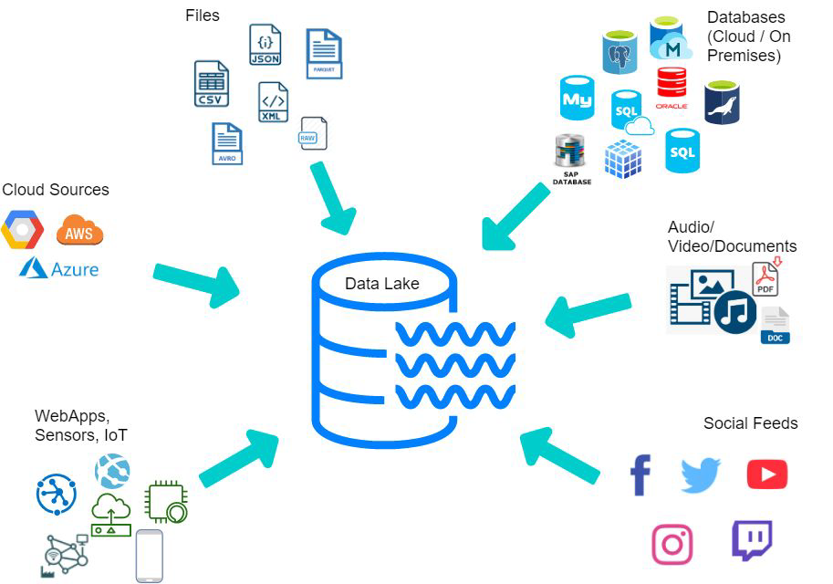
This diagram illustrates the diverse data sources that feed into a data lake and the types of data stored within it. Below is a comprehensive explanation of each component:

---

## **1. Data Sources Feeding the Data Lake**

### **A. Cloud Sources**
| **Source** | **Data Type** | **Examples** | **Ingestion Tools** |
|------------|--------------|-------------|---------------------|
| **AWS** | Structured/Semi-structured | S3 buckets, RDS snapshots, CloudTrail logs | AWS Glue, Kinesis |
| **Azure** | Structured/Semi-structured | Blob Storage, Cosmos DB, Event Hubs | Azure Data Factory |
| **Google Cloud** | (Implied) | BigQuery datasets, Pub/Sub streams | Dataflow, Cloud Composer |

**Key Point**:  
Cloud platforms natively integrate with data lakes, enabling automated pipelines (e.g., AWS S3 → Lake Formation).

---

### **B. WebApps, Sensors, IoT**
| **Category** | **Data Characteristics** | **Example Use Cases** |
|-------------|-------------------------|----------------------|
| **WebApps** | Clickstreams (JSON), user events | Personalization analytics |
| **Sensors** | Time-series data (CSV, binary) | Predictive maintenance |
| **IoT** | Telemetry (MQTT, Protobuf) | Smart city monitoring |

**Ingestion Patterns**:  
- **Batch**: Daily dumps of web logs  
- **Streaming**: Real-time IoT data via Kafka  

---

### **C. Social Feeds**
| **Platform** | **Data Type** | **Analytics Value** |
|-------------|--------------|---------------------|
| Twitter/X | JSON (tweets), images | Sentiment analysis |
| Facebook | Graph data, videos | Trend detection |
| LinkedIn | Structured profiles | Talent analytics |

**Challenge**:  
Unstructured data requires NLP processing (e.g., AWS Comprehend).

---

## **2. Data Lake Content**

### **A. SQL Databases**
- **Source**: OLTP systems (MySQL, PostgreSQL)  
- **Format**: Table snapshots as Parquet/ORC  
- **Use Case**: Combining transactional data with other sources  

**Example**:  
`orders.parquet` from e-commerce DB + social media sentiment → Customer 360° view.

---

### **B. Audio/Video/Documents**
| **Type** | **Storage Format** | **Processing Tools** |
|----------|-------------------|----------------------|
| Audio | MP3, WAV | Transcribe with AWS Transcribe |
| Video | MP4, HLS | Computer vision (OpenCV) |
| PDFs/PPTX | Binary | Text extraction (Apache Tika) |

**Advanced Use Case**:  
Storing MRI scans (DICOM) for AI-based diagnostics.

---

### **C. Other Unstructured Data**
- **Emails** (PST, EML)  
- **Chat logs** (Slack, Teams)  
- **Satellite imagery** (GeoTIFF)  

**Storage Optimization**:  
- Compress files (Zstandard)  
- Use tiered storage (Hot/Cold)  

---

## **3. Technical Implementation**

### **A. Storage Architecture**
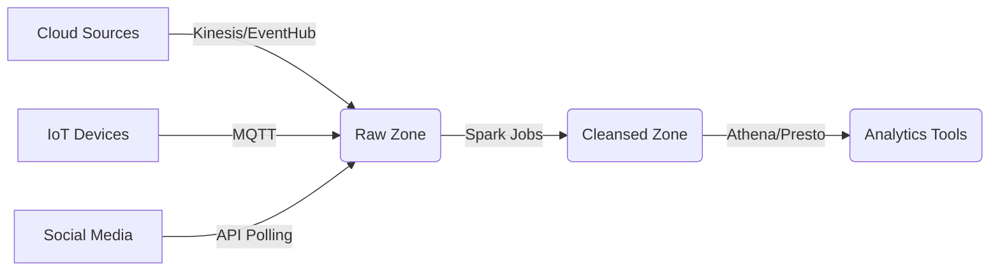
```mermaid
flowchart LR
    A[Cloud Sources] -->|Kinesis/EventHub| B(Raw Zone)
    C[IoT Devices] -->|MQTT| B
    D[Social Media] -->|API Polling| B
    B -->|Spark Jobs| E(Cleansed Zone)
    E -->|Athena/Presto| F(Analytics Tools)
```

**Zoning Strategy**:  
1. **Raw Zone**: Original, immutable data  
2. **Cleansed Zone**: Parsed/formatted data  
3. **Curated Zone**: Business-ready datasets  

---

### **B. Metadata Management**
- **AWS**: Glue Data Catalog  
- **Open Source**: Apache Atlas  
- **Key Metadata**:  
  - Data lineage  
  - PII tagging  
  - Retention policies  

---

## **4. Real-World Use Cases**

### **A. Retail Example**
1. **Data Sources**:  
   - POS systems (structured)  
   - Security cameras (video)  
   - Yelp reviews (text)  
2. **Analytics**:  
   - Correlate foot traffic (video AI) with sales  

### **B. Healthcare Example**
1. **Data Sources**:  
   - EHR databases  
   - Wearable device streams  
   - Medical imaging  
2. **Analytics**:  
   - Predictive readmission risk models  

---

## **5. Challenges & Solutions**

| **Challenge** | **Mitigation Strategy** |
|--------------|-------------------------|
| Data swamp formation | Enforce metadata standards |
| Slow queries on unstructured data | Use partitioning (by date/type) |
| Security risks | Implement attribute-based access control (ABAC) |
| High storage costs | Lifecycle policies (S3 Intelligent Tiering) |

---

## **6. Emerging Trends**
1. **Lakehouse Architecture**:  
   - Delta Lake/Iceberg add ACID transactions  
2. **Edge Data Lakes**:  
   - Pre-process IoT data at source  
3. **AI-Powered Cataloging**:  
   - Auto-tagging sensitive data (e.g., AWS Macie)  

---

## **Key Takeaways**
1. Data lakes consolidate **disparate sources** into a single repository.  
2. **Schema-on-read** enables flexibility but requires strong governance.  
3. **Cloud platforms** (AWS/Azure/GCP) provide turnkey data lake solutions.  

**Implementation Tip**:  
"Start with a focused zone (e.g., `/marketing/`) before expanding enterprise-wide."

<br/>
<br/>

# **Data Warehouses: The Ultimate Guide to Centralized Analytics**

## **1. Definition and Core Purpose**

A **Data Warehouse (DWH)** is a specialized database system designed for **analytical processing** (OLAP) rather than transactional operations (OLTP). It serves as the single source of truth by integrating, transforming, and storing historical data from multiple sources to enable:
- **Business intelligence (BI)**
- **Advanced analytics**
- **Data-driven decision making**

### **Key Metaphor:**
- **OLTP Databases** = Factory assembly line (focused on real-time operations)
- **Data Warehouse** = Corporate boardroom (focused on strategic analysis)

---

## **2. Architectural Components**

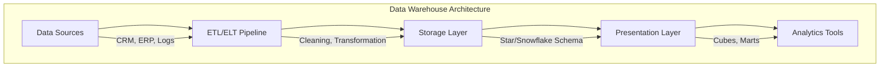
```mermaid
flowchart TB
    subgraph Data Warehouse Architecture
        A[Data Sources] --> B[ETL/ELT Pipeline]
        B --> C[Storage Layer]
        C --> D[Presentation Layer]
        D --> E[Analytics Tools]
    end

    A -->|CRM, ERP, Logs| B
    B -->|Cleaning, Transformation| C
    C -->|Star/Snowflake Schema| D
    D -->|Cubes, Marts| E
```

### **A. Data Sources**
- **Operational DBs**: MySQL, PostgreSQL
- **SaaS Apps**: Salesforce, HubSpot
- **Flat Files**: CSVs, Excel
- **IoT/Logs**: JSON, Apache logs

### **B. ETL/ELT Pipeline**
| **Process** | **Tools** | **Function** |
|-------------|----------|-------------|
| **Extract** | Informatica, Airbyte | Pull data from sources |
| **Transform** | dbt, Talend | Clean, standardize, aggregate |
| **Load** | Snowflake, Redshift | Load into optimized structures |

### **C. Storage Layer**
- **Fact Tables**: Quantitative metrics (e.g., sales amounts)
- **Dimension Tables**: Descriptive attributes (e.g., products, customers)
- **Common Schemas**:
  - **Star Schema**: Single fact table + radial dimensions
  - **Snowflake Schema**: Normalized dimensions

### **D. Presentation Layer**
- **Data Marts**: Department-specific views (e.g., finance_mart)
- **OLAP Cubes**: Pre-aggregated multidimensional data

### **E. Analytics Tools**
- **BI**: Tableau, Power BI
- **SQL**: Redshift, BigQuery
- **AI/ML**: Python/R integrations

---

## **3. Key Characteristics**

| **Feature** | **Description** | **Example** |
|------------|----------------|------------|
| **Subject-Oriented** | Organized by business subjects | Sales, Inventory |
| **Integrated** | Standardized data from disparate sources | Customer IDs match across CRM/ERP |
| **Time-Variant** | Historical tracking | 5-year sales trends |
| **Non-Volatile** | Read-only after loading | No record updates, only appends |

---

## **4. Why Organizations Need Data Warehouses**

### **A. Business Benefits**
1. **360° Enterprise View**  
   - Combine CRM, ERP, and web analytics into unified customer profiles
2. **Historical Analysis**  
   - Compare quarterly sales across 5 years
3. **Regulatory Compliance**  
   - Audit trails for financial reporting (SOX, GDPR)

### **B. Technical Advantages**
1. **Query Performance**  
   - Columnar storage (Redshift, Snowflake) speeds up analytics
2. **Concurrency**  
   - Handle 1000+ analyst queries without impacting OLTP systems
3. **Cost Efficiency**  
   - Separation reduces OLTP licensing costs

### **C. Use Case Examples
- **Retail**: Demand forecasting by correlating sales with weather data
- **Healthcare**: Patient readmission risk analysis
- **Finance**: Fraud detection via transaction pattern mining

---

## **5. Data Warehouse vs. Data Lake**

| **Criteria** | **Data Warehouse** | **Data Lake** |
|--------------|-------------------|--------------|
| **Data Structure** | Structured, processed | Raw, all formats |
| **Schema** | Schema-on-write | Schema-on-read |
| **Users** | Business analysts | Data scientists |
| **Cost** | Higher ($2K+/TB/year) | Lower (~$20/TB/year) |
| **Best For** | Standardized reporting | Exploration, ML |

**Modern Approach**: **Lakehouse** (Delta Lake, Iceberg) blends both paradigms.

---

## **6. Implementation Types**

### **A. On-Premises**
- **Examples**: Teradata, Oracle Exadata
- **Pros**: Full control, low latency
- **Cons**: High capex, limited scalability

### **B. Cloud**
| **Platform** | **Service** | **Differentiator** |
|-------------|------------|-------------------|
| AWS | Redshift | Tight S3 integration |
| Azure | Synapse | Unified analytics |
| GCP | BigQuery | Serverless SQL |

### **C. Hybrid**
- **Example**: Query federation between Snowflake and on-prem DB2

---

## **7. Challenges & Solutions**

| **Challenge** | **Solution** |
|--------------|-------------|
| Data quality issues | Implement data profiling (Great Expectations) |
| High latency | Change Data Capture (CDC) for near-real-time updates |
| Skill gaps | Low-code tools (Matillion, Fivetran) |
| Vendor lock-in | Open formats (Iceberg, Parquet) |

**Case Study**:  
Amazon migrated from Oracle DWH to Redshift:
- **Result**: 60% cost reduction, 3x faster queries

---

## **8. Best Practices**

1. **Start Small**  
   - Begin with a single data mart (e.g., sales_analytics)
2. **Governance Framework**  
   - Data dictionary, ownership tags
3. **Performance Tuning**  
   - Partitioning by date/category
4. **Modern Architectures**  
   - Medallion architecture (Bronze → Silver → Gold)

---

## **9. Future Trends**

1. **Automated DWHs**  
   - Self-optimizing (Snowflake Autoclustering)
2. **Unified Metadata**  
   - Single catalog across lakes/warehouses
3. **Augmented Analytics**  
   - NLP interfaces ("Show me Q3 sales by region")

---

## **Key Takeaways**
1. Data warehouses transform **raw data → business insights**
2. Cloud DWHs dominate due to **scalability + cost benefits**
3. **Successful DWHs require**:
   - Clear business objectives
   - Robust ETL pipelines
   - Ongoing performance monitoring

**Implementation Tip**:  
"Treat your DWH as a product - with dedicated engineers and SLAs for data freshness."

<br/>
<br/>

# **The Evolution of Data Warehouses: Beyond Structured Data**

Modern data warehouses have undergone a significant transformation, expanding their capabilities far beyond traditional structured data storage. Let's explore this evolution in detail:

## **1. Traditional Data Warehousing (Structured-Only Era)**

### **Characteristics:**
- **Exclusively structured data**: Tables with strict schemas (rows/columns)
- **Relational model**: Star/snowflake schemas with fact/dimension tables
- **SQL-only access**: Complex joins for analysis
- **Examples**: Oracle Data Warehouse, Teradata

### **Limitations:**
- Could not handle JSON, XML, or unstructured data
- Required extensive ETL to force-fit all data into tables
- Missed valuable insights from emails, social media, etc.

---

## **2. The Modern Data Warehouse Revolution**

### **Key Advancements:**
| **Capability** | **Description** | **Example Implementations** |
|---------------|----------------|----------------------------|
| **Semi-structured Support** | Native handling of JSON, XML, Avro | Snowflake VARIANT, BigQuery JSON |
| **Nested Data** | Store/repeat complex hierarchies | Redshift SUPER datatype |
| **Unstructured Light** | Limited text/binary processing | Snowflake file processing |
| **External Table Access** | Query data lakes without loading | Redshift Spectrum, BigQuery external tables |

### **How Modern DWHs Handle Non-Structured Data:**

#### **A. Semi-Structured Data (JSON/XML)**
```sql
-- Snowflake example: Querying nested JSON
SELECT 
    raw_data:customer.name, 
    raw_data:transactions[0].amount
FROM orders;
```

#### **B. Text Analytics**
```sql
-- BigQuery ML: Sentiment analysis on reviews
CREATE MODEL `dataset.review_sentiment`
OPTIONS(model_type='LOGISTIC_REG') AS
SELECT 
    text_content,
    star_rating AS label
FROM product_reviews;
```

#### **C. File Processing**
```sql
-- Snowflake file processing
SELECT $1:first_name, $1:last_name
FROM @stage/persons.json;
```

---

## **3. Comparison of Data Handling Approaches**

| **Data Type** | **Traditional DWH** | **Modern DWH** | **Optimal Solution** |
|--------------|---------------------|----------------|----------------------|
| Structured (SQL tables) | Excellent | Excellent | DWH |
| Semi-structured (JSON) | Requires flattening | Native support | DWH (for query patterns) |
| Unstructured (PDFs) | Impossible | Limited processing | Data Lake + DWH integration |
| High-volume logs | Poor fit | External tables | Data Lake |

---

## **4. Hybrid Architectures: When to Use What?**

### **A. Modern Data Warehouse Alone**
**Best for:**
- Business intelligence dashboards
- Structured + semi-structured analytics
- Scenarios requiring ACID transactions

**Example Stack:**
```
Snowflake (JSON support) → Tableau
```

### **B. DWH + Data Lake Integration**
**Best for:**
- Mixed workloads (structured + unstructured)
- Advanced ML on raw data
- Cost-effective storage

**Example Patterns:**
1. **ELT Pipeline**:
   ```
   S3 (raw JSON) → Glue → Redshift (transformed)
   ```
2. **External Tables**:
   ```sql
   -- Query Parquet files directly
   SELECT * FROM redshift_external_table
   ```

### **C. Specialized Systems**
**When to consider alternatives:**
- **NoSQL**: For flexible schemas (MongoDB)
- **Vector DBs**: For AI embeddings (Pinecone)
- **Data Lakes**: For massive unstructured data

---

## **5. Implementation Considerations**

### **A. Performance Tradeoffs**
| **Approach** | **Pros** | **Cons** |
|-------------|---------|---------|
| **Native JSON** | Simple queries | Slower than relational |
| **Flattened** | Faster analytics | Complex ETL |
| **External Tables** | No data movement | Higher latency |

### **B. Cost Implications**
- **Storing JSON in DWH**: 2-3x more expensive than Parquet in a lake
- **Processing**: Semi-structured queries consume more compute

### **C. Governance Challenges**
- Schema drift in JSON documents
- PII detection in nested fields
- Versioning of document structures

---

## **6. Future Directions**

1. **Unified SQL Engines**:
   - Single query interface across lakes/warehouses (Iceberg, Delta Lake)
2. **AI-Powered Processing**:
   - Auto-structuring of unstructured data (BigQuery ML)
3. **Edge Warehousing**:
   - Local processing before DWH ingestion

---

## **Key Takeaways**

1. **Modern DWHs can handle** semi-structured data effectively, but unstructured data remains challenging
2. **For JSON/XML analytics**, modern DWHs often outperform data lakes in query performance
3. **True unstructured data** (videos, images) still belongs in data lakes with specialized processing
4. **Cost/performance balance** dictates architecture choices:
   - Frequent queries → DWH
   - Archive/ML data → Lake

**Architecture Rule of Thumb**:
> "Store structured data in your warehouse, semi-structured where query patterns are known, and unstructured in lakes with selective DWH integration."

<br/>
<br/>

# **Data Pipeline Architecture Breakdown**
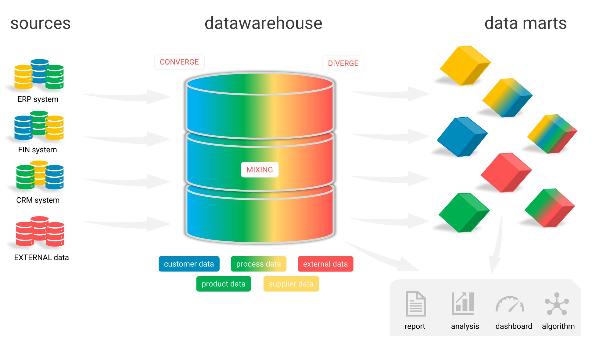
#### **1. SOURCES (Data Ingestion Layer)**
The system ingests data from multiple enterprise systems:
- **ERP System**: Transactional business data (orders, inventory)
- **FIN System**: Financial records (invoices, payments)
- **CRM System**: Customer interactions and profiles
- **EXTERNAL Data**: Market data, social media, third-party APIs

*Key Characteristics*:
- Raw, unintegrated data in native formats
- High velocity streams (real-time) and batch loads
- Typically requires data cleansing/normalization

#### **2. CONVERGE (Data Integration Hub)**
Data from all sources merges into unified business entities:

| Data Domain       | Description                          | Example Attributes                 |
|-------------------|--------------------------------------|------------------------------------|
| Customer Data     | 360° customer view                   | ID, purchase history, preferences  |
| Product Data      | Unified product catalog              | SKU, categories, pricing tiers     |
| Process Data      | Operational workflows                | Order fulfillment timelines        |
| Supplier Data     | Vendor/supply chain info             | Lead times, contract terms         |
| External Data     | Enriched context                     | Market trends, competitor pricing  |
| Data Marts        | Department-specific subsets          | Sales mart, inventory mart         |

*Integration Methods*:
- **ETL Pipelines**: Scheduled batch transformations
- **CDC (Change Data Capture)**: Real-time synchronization
- **Master Data Management**: Golden record creation

#### **3. DIVERGE (Data Distribution)**
Processed data flows to multiple destinations:

**A. MIXING (Advanced Analytics)**
- Data science feature engineering
- Machine learning training sets
- Example: Combining customer + product + external data for churn prediction

**B. Data Marts**
- Curated subsets for business units:
  - *Sales Mart*: Deals, quotas, performance
  - *Finance Mart*: GL, AR/AP, reporting
  - *Supply Chain Mart*: Inventory turns, logistics

#### **4. Consumption Layer**
Final outputs for different user needs:

| Output Type       | Users                | Technology Examples              |
|-------------------|----------------------|----------------------------------|
| Reports           | Operations           | SSRS, Crystal Reports            |
| Analysis          | Analysts             | Jupyter Notebooks, Excel         |
| Dashboards        | Executives           | Power BI, Tableau                |
| Algorithms        | Data Scientists      | Python/R models, Spark ML        |

### **Key Data Flow Patterns**
1. **Horizontal Flow** (Left-to-Right):
   - Source → Integration → Consumption
   - Ensures data quality improves as it moves right

2. **Vertical Segmentation**:
   - Raw → Converged → Domain-specific
   - Maintains both unified and specialized views

### **Technical Implementation**
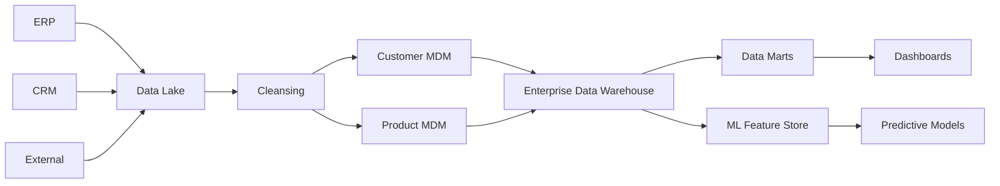
```mermaid
flowchart LR
    A[ERP] --> C[Data Lake]
    B[CRM] --> C
    D[External] --> C
    C --> E[Cleansing]
    E --> F[Customer MDM]
    E --> G[Product MDM]
    F & G --> H[Enterprise Data Warehouse]
    H --> I[Data Marts]
    H --> J[ML Feature Store]
    I --> K[Dashboards]
    J --> L[Predictive Models]
```

### **Business Value Proposition**
- **Single Source of Truth**: Eliminates departmental data silos
- **Agile Analytics**: Pre-modeled data accelerates insights
- **Compliance**: Centralized governance and auditing

### **Common Challenges**
1. **Data Lineage**: Tracking transformations across systems
2. **Temporal Alignment**: Synchronizing updates across domains
3. **Performance**: Balancing freshness vs. processing load

This architecture represents a mature **enterprise data fabric** that supports both operational reporting and advanced analytics while maintaining governance.

<br/>
<br/>

# **Data Marts: A Comprehensive Guide**

## **1. Definition and Core Concept**
A **Data Mart** is a specialized, subject-oriented subset of a data warehouse designed to serve the analytical needs of a specific business unit, department, or function. It contains a curated portion of enterprise data optimized for particular use cases, such as sales analytics, financial reporting, or HR metrics.

### **Key Characteristics:**
- **Department-Specific**: Tailored to one business area (e.g., marketing, finance).
- **Aggregated Data**: Pre-processed for faster queries.
- **Simplified Access**: Designed for non-technical users (e.g., analysts, managers).

---

## **2. Types of Data Marts**
| **Type**         | **Description**                                                                 | **Example**                          |
|------------------|---------------------------------------------------------------------------------|--------------------------------------|
| **Dependent**    | Sources data directly from an enterprise data warehouse (EDW).                  | Sales mart fed from corporate DWH.   |
| **Independent**  | Standalone system built without an EDW (often for rapid deployment).            | HR mart using only payroll data.     |
| **Hybrid**       | Combines EDW data with external sources.                                        | Marketing mart with CRM + social data. |

---

## **3. Why Use Data Marts? Key Benefits**
### **A. Business Advantages**
| **Benefit**              | **Explanation**                                                                 |
|--------------------------|-------------------------------------------------------------------------------|
| **Faster Insights**      | Sales teams see only sales data—no irrelevant tables.                         |
| **Departmental Autonomy**| Finance can manage its mart without IT dependency.                            |
| **Lower Adoption Barrier**| Simplified schema = easier self-service BI.                                  |

### **B. Technical Advantages**
| **Advantage**            | **Impact**                                                                    |
|--------------------------|-------------------------------------------------------------------------------|
| **Query Performance**    | 10-100x faster than querying full DWH (smaller data volume).                 |
| **Cost Efficiency**      | Reduces compute costs vs. enterprise-wide queries.                           |
| **Security**            | HR mart restricts access to sensitive employee data.                         |

---

## **4. Data Mart Architecture**
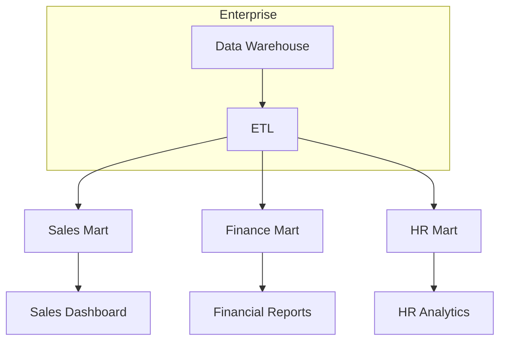
```mermaid
flowchart TB
    subgraph Enterprise
        A[Data Warehouse] --> B[ETL]
    end
    B --> C[Sales Mart]
    B --> D[Finance Mart]
    B --> E[HR Mart]
    C --> F[Sales Dashboard]
    D --> G[Financial Reports]
    E --> H[HR Analytics]
```

### **Key Components:**
1. **Source Layer**: EDW, operational DBs, or external data.
2. **ETL/ELT Pipeline**: Transforms and loads relevant data.
3. **Storage**: Optimized structures (star schema most common).
4. **Access Layer**: BI tools, SQL clients, or APIs.

---

## **5. Data Mart vs. Data Warehouse**
| **Criteria**       | **Data Mart**                                  | **Data Warehouse**                     |
|--------------------|-----------------------------------------------|----------------------------------------|
| **Scope**          | Single subject area (e.g., sales)             | Enterprise-wide                        |
| **Size**           | GBs to TBs                                    | TBs to PBs                             |
| **Users**          | Departmental analysts                         | Cross-functional teams                 |
| **Implementation** | Weeks to months                               | Months to years                        |
| **Cost**           | $10K-$100K                                   | $1M+                                   |

---

## **6. Implementation Steps**
1. **Identify Use Case**  
   - Example: "Improve regional sales tracking"
2. **Design Schema**  
   - Star schema with `SALES_FACT` + `PRODUCT_DIM`, `REGION_DIM`
3. **Build ETL Pipeline**  
   - Tools: Informatica, dbt, or custom SQL
4. **Optimize for Performance**  
   - Indexes, materialized views, partitioning
5. **Deploy Access Tools**  
   - Power BI for sales, Tableau for finance

---

## **7. Real-World Examples**
### **A. Retail Sales Mart**
- **Tables**: `daily_sales`, `stores`, `promotions`
- **Metrics**: YoY growth, inventory turnover
- **Users**: Regional managers

### **B. Healthcare HR Mart**
- **Tables**: `staff_attrition`, `training_completion`
- **Metrics**: Nurse retention rates
- **Users**: HR business partners

---

## **8. Challenges and Solutions**
| **Challenge**              | **Solution**                                |
|----------------------------|--------------------------------------------|
| Data Silos                 | Link marts via conformed dimensions        |
| Stale Data                 | Near-real-time CDC pipelines               |
| Governance Issues          | Central metadata management (e.g., Alation)|

---

## **9. Future Trends**
1. **Automated Marts**:  
   - Snowflake's zero-copy cloning for instant mart creation.
2. **Domain-Owned Data Products**:  
   - Data mesh architectures with decentralized marts.
3. **AI-Augmented**:  
   - Auto-generated metrics (e.g., "Suggested KPIs for Q3").

---

## **Key Takeaways**
1. **Start Small**: Begin with one high-impact mart (e.g., sales).
2. **Balance Autonomy & Governance**: Avoid "mart sprawl."
3. **Cloud-Native Advantage**: Modern platforms like Databricks simplify mart creation.

**Pro Tip**:  
> "Treat each mart as a product—with dedicated owners, SLAs, and user feedback loops."  

<br/>
<br/>

# **Enterprise Data Architecture: A Detailed Breakdown**
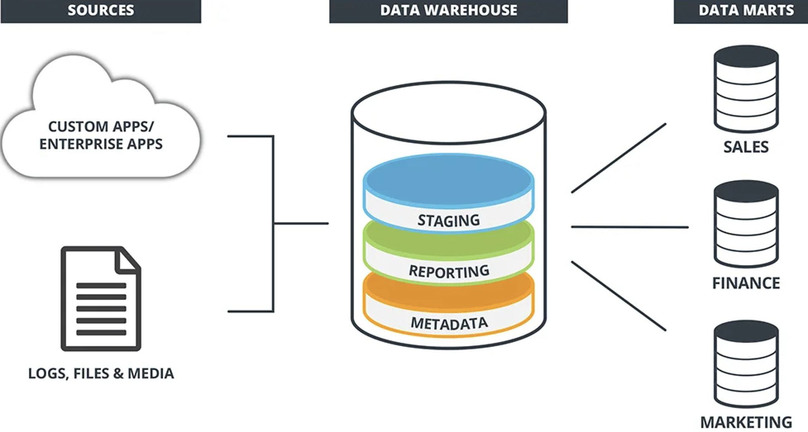
This diagram illustrates a modern enterprise data pipeline from raw sources to business applications. Below is a comprehensive explanation of each component and its role in the data ecosystem:

## **1. Data Flow Overview**

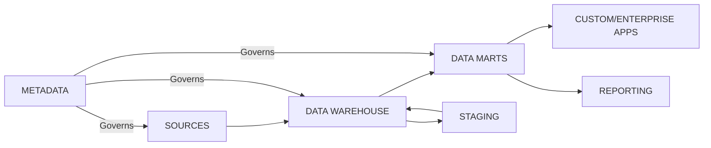
```mermaid
flowchart LR
    A[SOURCES] --> B[DATA WAREHOUSE]
    B --> C[DATA MARTS]
    C --> D[CUSTOM/ENTERPRISE APPS]
    B --> E[STAGING]
    E --> B
    C --> F[REPORTING]
    G[METADATA] -->|Governs| A & B & C
```

## **2. Component Deep Dive**

### **A. SOURCES (Data Origin Points)**
| **Source Type**       | **Examples**                     | **Data Characteristics**          |
|-----------------------|----------------------------------|-----------------------------------|
| **Enterprise Apps**   | SAP, Oracle ERP, Workday         | Structured transactional data     |
| **Custom Apps**       | Proprietary systems              | Application-specific metrics      |
| **Logs, Files & Media** | Server logs, PDFs, videos      | Semi-structured/unstructured      |
| **Metadata**          | Data dictionaries, lineage       | Descriptive information about data|

**Key Function**: Raw data ingestion in its native format.

---

### **B. STAGING (Data Preparation Area)**
- **Purpose**: Landing zone for raw data before transformation
- **Key Processes**:
  - Data validation
  - Initial cleansing
  - Format standardization (e.g., CSV → Parquet)
- **Tools**: 
  - AWS S3 (for files)
  - Azure Data Lake (for streams)
  - Kafka (for real-time)

**Example**: 
```python
# PySpark snippet for staging processing
df = spark.read.json("s3://raw-logs/")
df.write.parquet("s3://staging/cleaned/")
```

---

### **C. DATA WAREHOUSE (Central Repository)**
| **Layer**       | **Function**                     | **Technology Examples**           |
|-----------------|----------------------------------|-----------------------------------|
| **Raw Zone**    | Preserves original data          | S3, ADLS Gen2                     |
| **Cleansed Zone** | Standardized, quality-checked  | Snowflake, Redshift               |
| **Curated Zone** | Business-ready models           | Databricks Delta Tables           |

**Key Features**:
- Star/snowflake schemas
- Historical data retention
- ACID compliance

---

### **D. DATA MARTS (Departmental Views)**
| **Mart**      | **Contents**                     | **User Persona**                  |
|--------------|----------------------------------|-----------------------------------|
| **SALES**    | Opportunities, quotas, pipelines | Sales VPs, Account Managers       |
| **FINANCE**  | GL, AR/AP, forecasts             | CFO, Financial Analysts           |
| **MARKETING** | Campaigns, lead gen, MQLs       | CMO, Demand Gen Team              |

**Optimization Techniques**:
- Materialized views
- Aggregated fact tables
- Department-specific security

---

### **E. CONSUMPTION LAYER**
| **Channel**          | **Purpose**                      | **Tools**                         |
|----------------------|----------------------------------|-----------------------------------|
| **Reporting**        | Standardized metrics             | Power BI, Tableau                 |
| **Custom Apps**      | Embedded analytics               | React + REST APIs                 |
| **Enterprise Apps**  | Operational reporting            | SAP Analytics Cloud, Oracle BI    |

**Example Flow**:
```sql
-- Marketing mart to Tableau
SELECT campaign_name, ROAS 
FROM marketing_mart.campaign_performance
WHERE quarter = 'Q3-2023';
```

---

## **3. Metadata Management**
- **Functions**:
  - Data lineage tracking
  - Column-level governance
  - Usage statistics
- **Tools**:
  - Open-source: Apache Atlas
  - Commercial: Collibra, Alation

**Critical Role**: Ensures compliance (GDPR, SOX) and prevents "data swamp" scenarios.

---

## **4. Technical Implementation Patterns**

### **A. Cloud-Native Example (AWS)**
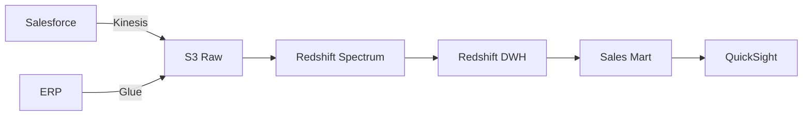
```mermaid
flowchart LR
    A[Salesforce] -->|Kinesis| B[S3 Raw]
    C[ERP] -->|Glue| B
    B --> D[Redshift Spectrum]
    D --> E[Redshift DWH]
    E --> F[Sales Mart]
    F --> G[QuickSight]
```

### **B. Hybrid Architecture**
- **On-prem DWH** (Teradata) + **Cloud marts** (Snowflake)
- **Challenge**: Data synchronization
- **Solution**: Change Data Capture (CDC) tools like Debezium

---

## **5. Key Benefits**

| **Benefit**          | **Impact**                                                                 |
|----------------------|---------------------------------------------------------------------------|
| **Single Source of Truth** | Eliminates conflicting reports between departments                      |
| **Performance**       | Sales queries run 10x faster vs. full DWH access                         |
| **Cost Control**      | Finance team only pays for their mart's compute                          |
| **Security**         | HR data isolated from other business units                               |

---

## **6. Common Challenges & Solutions**

| **Challenge**              | **Solution**                                |
|----------------------------|--------------------------------------------|
| Data duplication           | Implement conformed dimensions             |
| Stale marketing metrics    | Near-real-time ELT pipelines               |
| Mart sprawl                | Central catalog with lifecycle policies    |
| Cross-mart analysis        | Build virtual marts using DWH views        |

---

## **7. Future Evolution**

1. **Active Metadata**  
   - Auto-recommend mart optimizations (e.g., "Sales mart needs regional partitioning")
2. **Data Mesh Integration**  
   - Domain-owned marts with federated governance
3. **AI-Assisted Curation**  
   - NLP-to-SQL for ad-hoc mart creation ("Build a mart for premium customer analytics")

---

## **Key Takeaways**
1. **Data marts transform** enterprise data into department-ready insights
2. **Modern stacks leverage** cloud scalability + on-prem governance
3. **Metadata is the glue** ensuring consistency across layers

**Implementation Tip**:  
"Start with the highest-impact mart (often sales), then expand using reusable patterns."

<br/>
<br/>

# **Data Warehouse Design vs. Data Modeling: A Comprehensive Comparison**

## **1. Fundamental Definitions**

### **Data Warehouse Design**
The **macro-level process** of planning and architecting the entire data warehouse ecosystem. It encompasses technical, organizational, and infrastructural decisions to create a system that meets business intelligence needs.

### **Data Modeling**
The **micro-level process** of defining how data is structured, related, and stored within the database. It focuses specifically on database schemas and relationships.

---

## **2. Key Differences**

| **Aspect**              | **Data Warehouse Design**                          | **Data Modeling**                          |
|-------------------------|---------------------------------------------------|--------------------------------------------|
| **Scope**               | End-to-end system architecture                    | Database structure definition              |
| **Primary Focus**       | How data flows through the system                 | How data is organized in storage           |
| **Deliverables**        | System blueprint, ETL workflows, tech stack       | ER diagrams, star/snowflake schemas        |
| **Stakeholders**        | Architects, engineers, business leaders          | Data modelers, DBAs, analysts              |
| **Timing in Project**   | Early-phase planning                              | Post-design implementation                 |
| **Tools**               | ArchiMate, Visio, cloud architecture tools        | ERwin, PowerDesigner, SQLDBM               |

---

## **3. Data Warehouse Design Components**

### **A. Structural Decisions**
1. **Architecture Style**:
   - Traditional EDW
   - Data Lakehouse
   - Hybrid approaches

2. **Technology Stack**:
   ```mermaid
   graph LR
       A[Sources] --> B[Ingestion: Kafka/Fivetran]
       B --> C[Storage: Snowflake/Redshift]
       C --> D[Processing: Spark/dbt]
       D --> E[Consumption: Power BI]
   ```

3. **Integration Patterns**:
   - ETL vs. ELT
   - Batch vs. real-time
   - Change Data Capture (CDC)

### **B. Operational Considerations**
- **Performance**: Partitioning strategies, indexing
- **Security**: RBAC, encryption, masking
- **Scalability**: Horizontal vs. vertical scaling

---

## **4. Data Modeling Components**

### **A. Modeling Levels**
| **Level**         | **Description**                     | **Example**                      |
|-------------------|-------------------------------------|----------------------------------|
| Conceptual        | Entity relationships (business view)| "Customers place Orders"         |
| Logical           | Detailed attributes and keys        | CustomerID PK, OrderDate NOT NULL|
| Physical          | DB-specific implementation          | Indexes, storage parameters      |

### **B. Common Warehouse Models
1. **Star Schema**:
   ```mermaid
   flowchart LR
       FACT_SALES --> DIM_DATE
       FACT_SALES --> DIM_PRODUCT
       FACT_SALES --> DIM_CUSTOMER
   ```

2. **Snowflake Schema**:
   ```mermaid
   flowchart LR
       FACT_SALES --> DIM_PRODUCT --> DIM_CATEGORY
       FACT_SALES --> DIM_CUSTOMER --> DIM_GEOGRAPHY
   ```

3. **Data Vault**:
   - Hubs (business keys)
   - Links (relationships)
   - Satellites (descriptive attributes)

---

## **5. How They Work Together**

### **Implementation Workflow**
1. **Design Phase**:
   - Choose cloud vs. on-prem
   - Select columnar vs. row storage
   - Plan data governance framework

2. **Modeling Phase**:
   ```mermaid
   flowchart TB
       A[Business Requirements] --> B[Conceptual Model]
       B --> C[Logical Model]
       C --> D[Physical Model]
       D --> E[DDL Generation]
   ```

### **Real-World Example**
**Retail Data Warehouse**:
- **Design Decisions**:
  - Source systems: POS, eCommerce, CRM
  - Daily batch loads + real-time inventory updates
  - Redshift as storage engine

- **Data Models**:
  - Star schema for sales reporting
  - Slowly Changing Dimensions for customer attributes
  - Aggregated fact tables for executive dashboards

---

## **6. Common Pitfalls**

| **Area**               | **Design Mistakes**                | **Modeling Mistakes**               |
|------------------------|------------------------------------|-------------------------------------|
| **Flexibility**        | Over-engineering infrastructure   | Over-normalizing analytical schemas |
| **Performance**        | Ignoring workload patterns        | Missing surrogate keys              |
| **Governance**         | No metadata management plan       | Inconsistent naming conventions     |

---

## **7. Best Practices**

### **For Design**
- Start with clear business objectives
- Design for scalability from day one
- Implement data quality checks early

### **For Modeling**
- Use conformed dimensions across marts
- Document all relationships thoroughly
- Validate models with sample queries

---

## **8. Future Trends**

1. **Automated Design**:
   - AI-powered architecture recommendations (e.g., AWS Well-Architected Tool)

2. **Dynamic Modeling**:
   - Schema-on-read adaptations for JSON/XML
   - Databricks Delta Lake schema evolution

3. **Integrated Metadata**:
   - Data catalogs that link design docs to physical models

---

## **Key Takeaways**
1. **Design** answers *"How will our warehouse work?"*  
   **Modeling** answers *"How will our data be structured?"*

2. **Design** requires balancing:  
   - Business needs  
   - Technical constraints  
   - Cost considerations  

3. **Effective modeling** requires:  
   - Deep understanding of query patterns  
   - Anticipation of future requirements  

**Pro Tip**:  
"Always model with the end user in mind - if analysts need hourly sales by region, optimize your dimensions accordingly."  


<br/>
<br/>

# **Fact Tables in Dimensional Modeling: A Deep Dive**

## **1. Definition and Purpose**
A **Fact Table** is the central table in a star or snowflake schema that stores quantitative business measurements (facts) linked to dimensional context through foreign keys. It enables multidimensional analysis by serving as the nexus between dimensions.

### **Key Characteristics:**
- Contains **numeric, additive measures** (e.g., sales, quantities)
- Stores **foreign keys** to dimension tables
- Typically very large (millions/billions of rows)
- Optimized for aggregation and analysis

---

## **2. Anatomy of the Example Fact Table**

| Column       | Type         | Description                                                                 | Sample Value |
|--------------|--------------|-----------------------------------------------------------------------------|--------------|
| **Date Key**   | Foreign Key  | Links to DATE dimension (with attributes like day, month, quarter)          | 20230725     |
| **Product Key**| Foreign Key  | Links to PRODUCT dimension (SKU, category, brand)                           | 123          |
| **Store Key**  | Foreign Key  | Links to STORE dimension (location, region, size)                           | 001          |
| **Sales**      | Fact (Measure)| Dollar amount (summable)                                                    | 5000         |
| **Quantity Sold**| Fact (Measure)| Unit count (summable)                                                       | 100          |

---

## **3. Types of Facts**
| **Type**         | **Description**                     | **Example**                | **Aggregation Rule** |
|------------------|-------------------------------------|----------------------------|----------------------|
| **Additive**     | Can be summed across all dimensions | Sales revenue, Quantity    | SUM()                |
| **Semi-Additive**| Can be summed only for some dimensions | Bank account balance    | AVG() over time      |
| **Non-Additive** | Cannot be meaningfully summed       | Profit margin percentage   | AVG()                |

**In Our Example**:
- `Sales` and `Quantity Sold` are **fully additive**
- A potential `Discount %` would be **non-additive**

---

## **4. Fact Table Design Principles**

### **A. Granularity (Grain)**
- **Definition**: The level of detail stored in each row
- **In Example**: *Daily sales per product per store*
- **Common Grains**:
  - Transaction-level (most detailed)
  - Periodic snapshots (e.g., end-of-day)
  - Accumulating snapshots (process milestones)

### **B. Surrogate Keys**
- **Purpose**: Integer keys (not natural keys) for join optimization
- **Example**: `Product Key = 123` instead of `SKU = 'ABC-123'`

### **C. Degenerate Dimensions**
- Transaction IDs or invoice numbers that don't warrant a dimension table
- **Example**: Adding `Transaction_ID` to the fact table

---

## **5. Fact Table Varieties**
| **Type**            | **Description**                                   | **Use Case**                |
|---------------------|--------------------------------------------------|----------------------------|
| **Transaction**     | One row per business event (most common)         | Retail POS systems         |
| **Periodic Snapshot**| Regular intervals (e.g., daily account balance) | Financial reporting        |
| **Accumulating**    | Tracks process milestones                        | Order fulfillment pipeline |

**Our Example** is a **transaction fact table**.

---

## **6. Relationship with Dimensions**
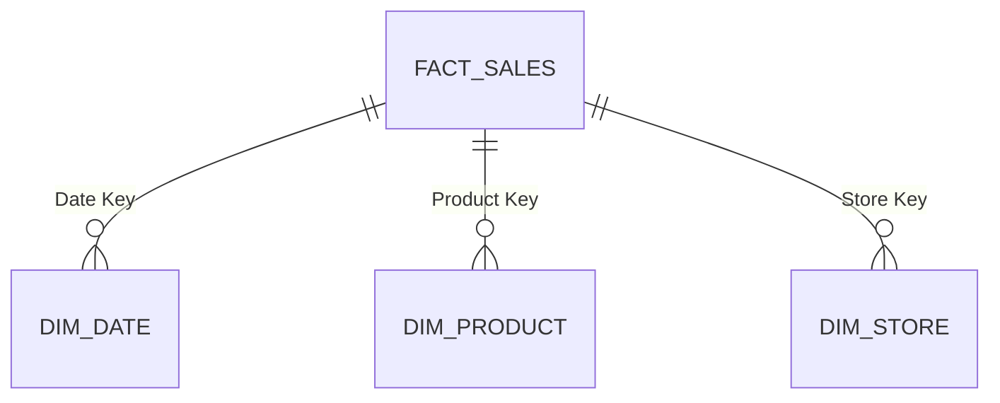
```mermaid
erDiagram
    FACT_SALES ||--o{ DIM_DATE : "Date Key"
    FACT_SALES ||--o{ DIM_PRODUCT : "Product Key"
    FACT_SALES ||--o{ DIM_STORE : "Store Key"
```

**Query Example**:
```sql
SELECT 
    d.Month_Name,
    p.Category,
    s.Region,
    SUM(f.Sales) AS Total_Sales
FROM FACT_SALES f
JOIN DIM_DATE d ON f.Date_Key = d.Date_Key
JOIN DIM_PRODUCT p ON f.Product_Key = p.Product_Key
JOIN DIM_STORE s ON f.Store_Key = s.Store_Key
GROUP BY d.Month_Name, p.Category, s.Region
```

---

## **7. Optimization Techniques**
1. **Partitioning**: By date range for faster time-based queries
2. **Indexing**: On foreign keys and frequently filtered columns
3. **Aggregate Tables**: Pre-summarized versions for common queries
4. **Columnar Storage**: Parquet/ORC formats in modern data warehouses

---

## **8. Common Mistakes to Avoid**
1. **Overloading Facts**  
   ❌ Including textual descriptions in the fact table  
   ✅ Move all descriptors to dimensions  

2. **Ignoring Grain**  
   ❌ Mixing daily and monthly metrics in same fact table  
   ✅ Maintain consistent granularity  

3. **Null Foreign Keys**  
   ❌ Allowing nulls in key columns  
   ✅ Use -1 or 0 for unknown/not applicable  

---

## **9. Real-World Evolution**
**Traditional**  
- Single monolithic fact table  
- Nightly batch loads  

**Modern**  
- **Factless Fact Tables**: Track events without measures (e.g., attendance)  
- **Hybrid Models**: Delta Lake tables with schema evolution  
- **Streaming Facts**: Real-time updates via Kafka  

---

## **Key Takeaways**
1. Fact tables store **what you measure**, dimensions store **how you analyze**  
2. Grain definition is the **most critical design decision**  
3. Modern cloud DWHs (Snowflake, BigQuery) handle scaling automatically  

**Pro Tip**:  
"Always include a timestamp in transaction facts - you'll need it for point-in-time analysis later."  

<br/>
<br/>

# **Dimension Tables in Dimensional Modeling: A Comprehensive Guide**

## **1. Definition and Core Purpose**
A **Dimension Table** provides the contextual "who, what, where, when, why, and how" for the quantitative metrics stored in fact tables. These tables contain descriptive attributes that enable business users to slice and dice numerical data meaningfully.

### **Key Metaphor:**
- **Fact Table** = The "verbs" of your data (what happened)
- **Dimension Table** = The "nouns" (to whom/where/when it happened)

---

## **2. Anatomy of a Dimension Table**

### **A. Standard Structure**
| **Column**       | **Type**        | **Example Values**       | **Purpose**                     |
|------------------|-----------------|--------------------------|---------------------------------|
| **Product_Key**  | Surrogate PK    | 123 (integer)            | Unique identifier               |
| **Product_SKU**  | Natural Key     | "ABC-456-XL"             | Business identifier             |
| **Product_Name** | Description     | "Men's Running Shoes"    | User-friendly label            |
| **Category**     | Hierarchy Level | "Footwear > Athletic"    | Roll-up grouping               |
| **Brand**        | Attribute       | "Nike"                   | Filtering/grouping             |
| **Launch_Date**  | Temporal        | 2022-03-15               | Historical tracking            |
| **Is_Active**    | Status Flag     | TRUE/FALSE               | Current state indicator        |

### **B. Example: Product Dimension**
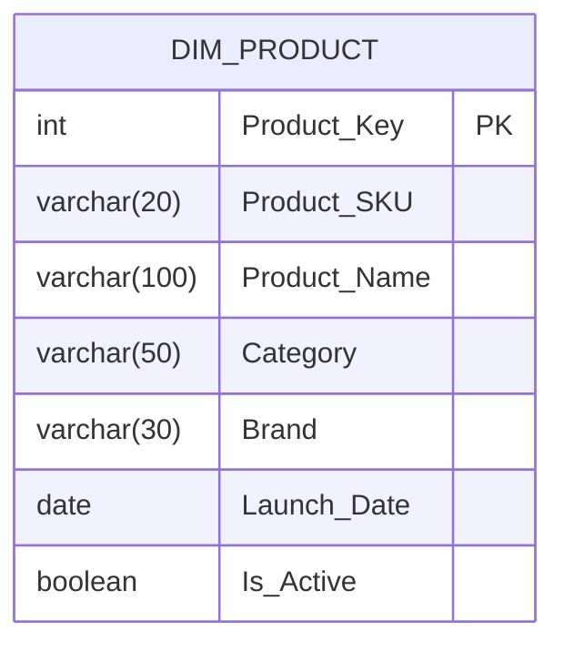
```mermaid
erDiagram
    DIM_PRODUCT {
        int Product_Key PK
        varchar(20) Product_SKU
        varchar(100) Product_Name
        varchar(50) Category
        varchar(30) Brand
        date Launch_Date
        boolean Is_Active
    }
```

---

## **3. Types of Dimensions**

| **Type**               | **Characteristics**                                    | **Example**                          |
|------------------------|-------------------------------------------------------|--------------------------------------|
| **Conformed**          | Shared across multiple fact tables                    | Date, Customer                      |
| **Junk**               | Low-cardinality flags/indicators                      | Payment_Method, Order_Status        |
| **Slowly Changing (SCD)** | Tracks historical attribute changes                  | Customer_Address_History            |
| **Degenerate**         | Transaction IDs stored in fact tables                 | Invoice_Number                      |
| **Role-Playing**       | Same table used for different contexts                | Date (Order Date, Ship Date)        |

---

## **4. Slowly Changing Dimensions (SCD)**
Critical for tracking historical changes to dimensional attributes:

### **SCD Type Comparison**
| **Type** | **Handling Method**             | **Use Case**                      | **Storage Impact** |
|----------|----------------------------------|-----------------------------------|-------------------|
| **Type 1** | Overwrite                       | Correcting errors                | Minimal           |
| **Type 2** | Add new row + versioning        | Address changes, price history   | High              |
| **Type 3** | Add previous value columns       | Limited history needs            | Moderate          |

**Type 2 Example**:
```sql
-- Current record
INSERT INTO DIM_CUSTOMER VALUES 
(1001, 'C123', 'John Doe', '123 Main St', '2020-01-01', '9999-12-31');

-- After address change
UPDATE DIM_CUSTOMER SET End_Date = '2023-06-30' WHERE Customer_Key = 1001;
INSERT INTO DIM_CUSTOMER VALUES 
(1002, 'C123', 'John Doe', '456 Oak Ave', '2023-07-01', '9999-12-31');
```

---

## **5. Hierarchies and Relationships**
### **A. Natural Hierarchies**
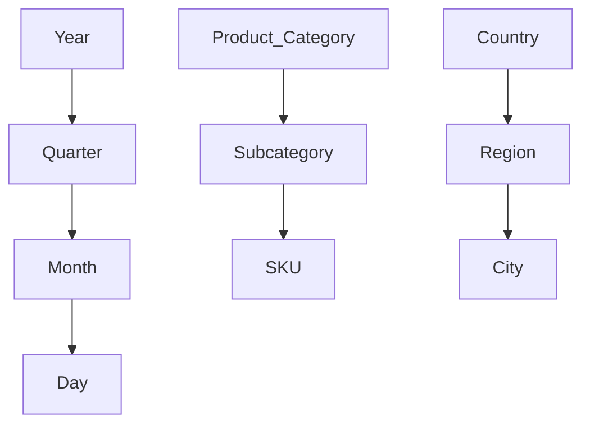
```mermaid
flowchart TD
    Year --> Quarter --> Month --> Day
    Product_Category --> Subcategory --> SKU
    Country --> Region --> City
```

### **B. Modeling Approaches
1. **Flattened Hierarchy** (Star Schema):
   ```sql
   CREATE TABLE DIM_DATE (
       Date_Key INT,
       Full_Date DATE,
       Day_Number INT,
       Month_Name VARCHAR(10),
       Quarter CHAR(2),
       Year INT
   );
   ```

2. **Normalized Hierarchy** (Snowflake Schema):
   ```sql
   CREATE TABLE DIM_PRODUCT (
       Product_Key INT,
       SKU VARCHAR(20),
       Subcategory_Key INT  -- FK to SUBCATEGORY
   );
   ```

---

## **6. Optimization Techniques**

### **A. Performance Strategies**
| **Technique**          | **Implementation**                | **Benefit**                      |
|------------------------|-----------------------------------|----------------------------------|
| **Surrogate Keys**     | Integer IDs instead of natural keys | Faster joins                    |
| **Indexing**           | B-tree on PK, bitmap on low-cardinality | Faster filtering           |
| **Compression**        | Columnar storage (Parquet/ORC)    | Reduced storage costs            |
| **Aggregations**       | Pre-calculated hierarchy levels   | Faster roll-up queries           |

### **B. Modern Cloud Enhancements**
- **Snowflake**: Automatic clustering on hierarchy columns
- **BigQuery**: Partitioned dimension tables
- **Redshift**: DISTKEY on frequently joined columns

---

## **7. Real-World Examples**

### **A. Retail Industry**
```sql
CREATE TABLE DIM_STORE (
    Store_Key INT PRIMARY KEY,
    Store_ID VARCHAR(10),
    Store_Name VARCHAR(50),
    Square_Footage INT,
    Opening_Date DATE,
    Region_Key INT,  -- Conformed dimension
    Is_Active BOOLEAN
);
```

### **B. Healthcare**
```sql
CREATE TABLE DIM_PATIENT (
    Patient_Key INT PRIMARY KEY,
    Patient_ID VARCHAR(20),
    Current_Address VARCHAR(100),
    Blood_Type CHAR(3),
    Effective_Date DATE,  -- SCD Type 2
    Expiration_Date DATE
);
```

---

## **8. Common Mistakes to Avoid**

1. **Over-Normalization**  
   ❌ Snowflaking every attribute  
   ✅ Balance with query performance needs  

2. **Ignoring SCD Requirements**  
   ❌ Losing historical tracking of customer segments  
   ✅ Implement Type 2 early for critical dimensions  

3. **Poor Naming Conventions**  
   ❌ `DIM1`, `DIM2`  
   ✅ `DIM_PRODUCT`, `DIM_GEOGRAPHY`  

---

## **9. Future Trends**

1. **Dynamic Dimensions**  
   - Real-time attribute updates (e.g., customer loyalty tier changes)  
2. **AI-Augmented Dimensions**  
   - Auto-generated product categories from descriptions  
3. **Graph Dimensions**  
   - Modeling complex relationships (supplier networks)  

---

## **Key Takeaways**
1. Dimensions provide the **business context** for analytical queries  
2. **SCD Type 2** is essential for accurate historical reporting  
3. **Conformed dimensions** ensure consistency across data marts  
4. Modern cloud platforms enable **dimension table partitioning/clustering**

**Pro Tip**:  
"Always include both surrogate keys (for joins) and natural keys (for business user validation) in your dimensions."  

<br/>
<br/>

# **Dimension Tables in Data Modeling: A Practical Deep Dive**

## **1. Understanding the Example Dimension Table**

This **DIM_STORE** table provides contextual attributes about retail locations that would be linked to sales transactions in a fact table:

| Store_ID (PK) | Store_Name   | Store_Type        | Location  |
|--------------|-------------|-------------------|----------|
| 001          | Store A     | Supermarket       | New York |
| 002          | Store B     | Convenience Store | Boston   |
| 003          | Store C     | Supermarket       | Chicago  |

### **Key Components**
- **Primary Key**: `Store_ID` (unique identifier for joins)
- **Descriptive Attributes**: 
  - `Store_Name`: Business-friendly label
  - `Store_Type`: Categorization for analysis
  - `Location`: Geographic context

## **2. Role in Dimensional Modeling**

### **A. Relationship with Fact Tables**
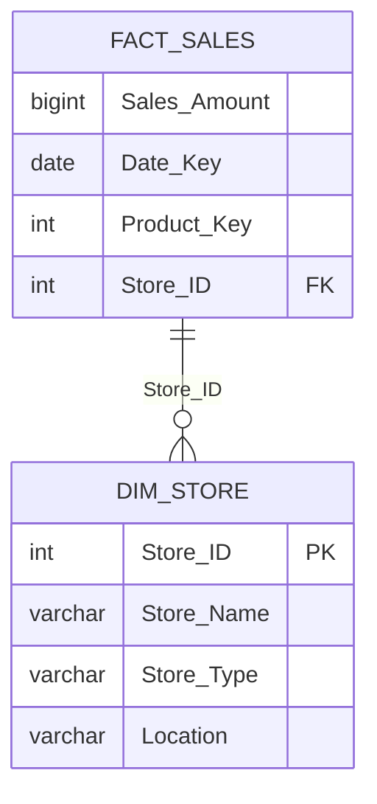
```mermaid
erDiagram
    FACT_SALES ||--o{ DIM_STORE : "Store_ID"
    FACT_SALES {
        bigint Sales_Amount
        date Date_Key
        int Product_Key
        int Store_ID FK
    }
    DIM_STORE {
        int Store_ID PK
        varchar Store_Name
        varchar Store_Type
        varchar Location
    }
```

**Query Example**:
```sql
SELECT 
    s.Store_Type,
    s.Location,
    SUM(f.Sales_Amount) AS Total_Sales
FROM FACT_SALES f
JOIN DIM_STORE s ON f.Store_ID = s.Store_ID
GROUP BY s.Store_Type, s.Location
```

### **B. Analytical Capabilities Enabled**
| **Attribute**  | **Analysis Possibilities**                  | **Sample Insight**                          |
|---------------|--------------------------------------------|--------------------------------------------|
| Store_Type    | Compare performance by store format        | "Supermarkets outperform convenience stores by 30%" |
| Location      | Regional sales trends                      | "Chicago stores show 15% YoY growth"       |

## **3. Advanced Design Considerations**

### **A. Hierarchical Relationships**
Potential expansion for deeper geographic analysis:
```sql
ALTER TABLE DIM_STORE ADD COLUMN Region VARCHAR(20);
ALTER TABLE DIM_STORE ADD COLUMN Country VARCHAR(20);

-- Updated table
| Store_ID | Store_Name | Store_Type        | City    | Region   | Country |
|----------|------------|-------------------|---------|----------|---------|
| 001      | Store A    | Supermarket       | New York| Northeast| USA     |
```

### **B. Slowly Changing Dimension (SCD) Pattern**
Handling store relocations (Type 2 SCD):
```sql
-- Original record
INSERT INTO DIM_STORE VALUES 
(001, 'Store A', 'Supermarket', 'New York', '2020-01-01', '9999-12-31');

-- After relocation to Philadelphia
UPDATE DIM_STORE SET End_Date = '2023-06-30' WHERE Store_ID = 001;
INSERT INTO DIM_STORE VALUES 
(004, 'Store A', 'Supermarket', 'Philadelphia', '2023-07-01', '9999-12-31');
```

## **4. Optimization Techniques**

### **A. Performance Tuning**
| **Method**          | **Implementation**                      | **Impact**                          |
|---------------------|-----------------------------------------|-------------------------------------|
| Surrogate Keys      | Add `Store_Key` (INT IDENTITY)          | Faster joins than varchar Store_ID  |
| Bitmap Indexing     | On low-cardinality Store_Type           | Rapid filtering by category         |
| Columnar Storage    | Parquet format in cloud DWH             | 70% storage reduction               |

### **B. Enhanced Version with Business Keys**
```sql
CREATE TABLE DIM_STORE (
    Store_Key INT IDENTITY(1,1) PRIMARY KEY,
    Store_ID VARCHAR(10),  -- Natural business key
    Store_Name VARCHAR(100),
    Store_Type VARCHAR(50),
    Location VARCHAR(50),
    Square_Footage INT,
    Opening_Date DATE,
    Current_Flag BOOLEAN  -- For SCD Type 2
);
```

## **5. Real-World Analytics Applications**

### **A. Market Basket Analysis**
```sql
-- Find product affinities by store type
SELECT 
    p.Category,
    s.Store_Type,
    COUNT(DISTINCT f.Transaction_ID) AS Transaction_Count
FROM FACT_SALES f
JOIN DIM_STORE s ON f.Store_ID = s.Store_ID
JOIN DIM_PRODUCT p ON f.Product_Key = p.Product_Key
WHERE s.Store_Type = 'Supermarket'
GROUP BY p.Category, s.Store_Type
```

### **B. Geographic Heatmapping**
```python
# Python snippet using the dimension table
import geopandas as gpd

stores_gdf = gpd.GeoDataFrame(
    dim_store.join(city_coordinates),
    geometry='coordinates'
)
stores_gdf.plot(column='Total_Sales', legend=True)
```

## **6. Common Pitfalls and Solutions**

| **Issue**                | **Solution**                              | **Rationale**                       |
|--------------------------|------------------------------------------|-------------------------------------|
| Overloaded dimensions    | Split into DIM_STORE and DIM_LOCATION    | Normalize geographic attributes     |
| Null location values     | Default 'Unknown' location               | Maintain referential integrity      |
| Changing store types     | Implement SCD Type 2                     | Preserve historical accuracy        |

## **7. Evolution in Modern Data Platforms**

**Cloud Enhancements**:
- **Dynamic dimensions**: Auto-updating store attributes via CDC
- **Spatial analytics**: Native GIS support in Snowflake/BigQuery
- **ML-enriched dimensions**: Auto-classifying store types using NLP

## **Key Takeaways**
1. Dimension tables transform **IDs into insights** by adding business context
2. Proper design enables **multi-dimensional analysis** (geography, time, categories)
3. **SCD patterns** are crucial for accurate historical reporting
4. Modern optimizations like **columnar storage** significantly improve performance

**Pro Tip**:  
"Always include both the natural business key (`Store_ID`) and a surrogate key (`Store_Key`) for flexibility and performance."

<br/>
<br/>

# **Star Schema in Data Modeling: A Comprehensive Guide**

## **1. Definition and Core Concept**

The **Star Schema** is a fundamental data warehouse modeling technique that organizes data into a central fact table surrounded by dimension tables, resembling a star shape. This architecture is optimized for analytical querying and business intelligence.

### **Key Characteristics:**
- **Denormalized structure**: Prioritizes query performance over storage efficiency
- **Intuitive design**: Easy for business users to understand
- **Optimized for reads**: Minimizes joins for analytical queries
- **Time-variant**: Supports historical analysis

## **2. Components of Star Schema**

### **A. Fact Table (The Center)**
- Contains measurable business metrics (facts)
- Stores foreign keys to all connected dimensions
- Typically very large (millions/billions of rows)

**Example Fact Table Structure:**
```sql
CREATE TABLE FACT_SALES (
    sale_id INT PRIMARY KEY,
    date_key INT FOREIGN KEY REFERENCES DIM_DATE(date_key),
    product_key INT FOREIGN KEY REFERENCES DIM_PRODUCT(product_key),
    store_key INT FOREIGN KEY REFERENCES DIM_STORE(store_key),
    customer_key INT FOREIGN KEY REFERENCES DIM_CUSTOMER(customer_key),
    sales_amount DECIMAL(10,2),
    quantity_sold INT,
    discount_amount DECIMAL(10,2)
);
```

### **B. Dimension Tables (The Points)**
- Provide context for facts
- Contain descriptive attributes
- Smaller tables (thousands to millions of rows)

**Example Dimension Table:**
```sql
CREATE TABLE DIM_PRODUCT (
    product_key INT PRIMARY KEY,
    product_id VARCHAR(20),
    product_name VARCHAR(100),
    category VARCHAR(50),
    subcategory VARCHAR(50),
    brand VARCHAR(50),
    current_price DECIMAL(10,2)
);
```

## **3. Visual Representation**

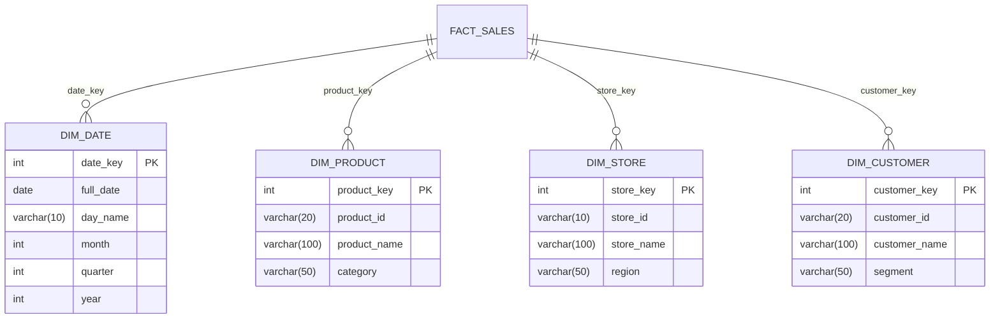
```mermaid
erDiagram
    FACT_SALES ||--o{ DIM_DATE : "date_key"
    FACT_SALES ||--o{ DIM_PRODUCT : "product_key"
    FACT_SALES ||--o{ DIM_STORE : "store_key"
    FACT_SALES ||--o{ DIM_CUSTOMER : "customer_key"
    
    DIM_DATE {
        int date_key PK
        date full_date
        varchar(10) day_name
        int month
        int quarter
        int year
    }
    
    DIM_PRODUCT {
        int product_key PK
        varchar(20) product_id
        varchar(100) product_name
        varchar(50) category
    }
    
    DIM_STORE {
        int store_key PK
        varchar(10) store_id
        varchar(100) store_name
        varchar(50) region
    }
    
    DIM_CUSTOMER {
        int customer_key PK
        varchar(20) customer_id
        varchar(100) customer_name
        varchar(50) segment
    }
```

## **4. Advantages of Star Schema**

| **Advantage**          | **Explanation**                                                                 | **Example Benefit**                          |
|------------------------|-------------------------------------------------------------------------------|--------------------------------------------|
| **Query Performance**  | Fewer joins needed compared to normalized schemas                             | Sales reports run 10x faster               |
| **Simplicity**         | Easy for business users to understand                                        | Analysts can self-serve without IT help    |
| **Optimized for BI**   | Aligns with how business thinks about data                                   | Natural mapping to dashboard filters       |
| **Scalability**        | Dimensions can be added without schema redesign                              | Easy to incorporate new product categories |
| **Aggregation Speed**  | Pre-calculated hierarchies in dimensions                                     | Quick month-over-year comparisons          |

## **5. Implementation Best Practices**

### **A. Design Considerations**
1. **Grain Definition**: Clearly define the level of detail in the fact table
   - Example: *Daily sales by product by store*

2. **Surrogate Keys**: Use integer keys for dimensions (better performance than natural keys)

3. **Conformed Dimensions**: Ensure consistency when dimensions are shared across multiple stars

### **B. Optimization Techniques**
| **Technique**          | **Implementation**                              | **Impact**                              |
|-----------------------|-----------------------------------------------|----------------------------------------|
| **Partitioning**      | Fact tables by date ranges                    | Faster time-based queries              |
| **Indexing**          | Bitmap indexes on dimension attributes        | Rapid filtering by category            |
| **Materialized Views**| Pre-aggregated summary tables                 | Instant executive dashboards           |
| **Columnar Storage**  | Parquet/ORC formats in modern DWHs           | 60-70% storage reduction               |

## **6. Real-World Example: Retail Analytics**

### **A. Sample Query**
```sql
SELECT 
    d.year,
    d.month,
    p.category,
    s.region,
    SUM(f.sales_amount) AS total_sales,
    COUNT(DISTINCT f.customer_key) AS unique_customers
FROM FACT_SALES f
JOIN DIM_DATE d ON f.date_key = d.date_key
JOIN DIM_PRODUCT p ON f.product_key = p.product_key
JOIN DIM_STORE s ON f.store_key = s.store_key
WHERE d.year = 2023
GROUP BY d.year, d.month, p.category, s.region
ORDER BY total_sales DESC;
```

### **B. Business Insights Enabled**
1. **Regional Performance**: Compare sales across geographic areas
2. **Category Trends**: Identify growing/declining product categories
3. **Temporal Patterns**: Analyze seasonal buying behaviors

## **7. Common Pitfalls and Solutions**

| **Pitfall**                 | **Solution**                                | **Rationale**                           |
|----------------------------|--------------------------------------------|----------------------------------------|
| **Overly wide dimensions** | Split into multiple dimensions             | Avoid "junk dimension" anti-pattern    |
| **Fact table grain errors** | Clearly document grain definition         | Prevent incorrect metric calculations  |
| **Ignoring SCD needs**     | Implement Type 2 for critical dimensions  | Maintain historical accuracy           |
| **Poor naming conventions** | Use consistent prefixing (DIM_, FACT_)    | Improve maintainability                |

## **8. Evolution and Modern Variations**

### **A. Snowflake Schema**
- Normalized version of star schema
- Dimensions are further broken into sub-dimensions
- Better for storage efficiency but more complex queries

### **B. Galaxy Schema (Fact Constellation)**
- Multiple fact tables sharing dimensions
- Used for complex enterprise data warehouses

### **C. Hybrid Approaches**
- **Starflake**: Combines star and snowflake elements
- **Data Vault**: Alternative for highly flexible EDWs

## **9. Comparison with Other Models**

| **Criteria**       | **Star Schema**            | **Normalized OLTP**        | **Data Vault**             |
|--------------------|---------------------------|---------------------------|---------------------------|
| **Purpose**        | Analytics                 | Transactions              | Enterprise integration    |
| **Performance**    | Fast reads                | Fast writes               | Flexible loads            |
| **Complexity**     | Simple                    | Complex                   | Very complex              |
| **Storage**        | Redundant                 | Efficient                 | Very redundant            |
| **Best For**       | Departmental reporting    | Operational systems       | Enterprise data hubs      |

## **10. Future Trends**

1. **Cloud-Native Star Schemas**
   - Auto-optimization in Snowflake/Redshift/BigQuery
   - Serverless scaling for seasonal workloads

2. **ML-Augmented Modeling**
   - Automated schema recommendations
   - Dynamic granularity adjustment

3. **Real-Time Stars**
   - Streaming fact table updates
   - Slowly changing dimensions with microseconds precision

## **Key Takeaways**
1. Star schema is the **gold standard** for analytical data modeling
2. Perfect balance between **query performance** and **business usability**
3. **Proper grain definition** is the most critical design decision
4. Modern cloud DWHs make star schemas **more powerful than ever**

**Pro Tip**:  
"Always design your star schema backward from the business questions you need to answer - not forward from your source systems."  

<br/>
<br/>

# **Star Schema Implementation: Financial Transactions Analysis**
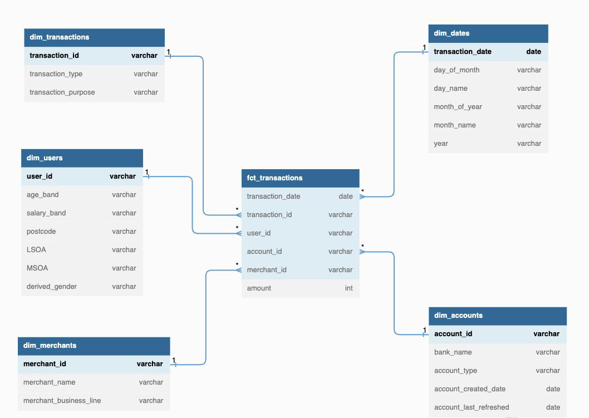
This image depicts a complete star schema design for analyzing financial transaction data. Below is a detailed breakdown of each component and its role in the analytical model.

## **1. Schema Overview**

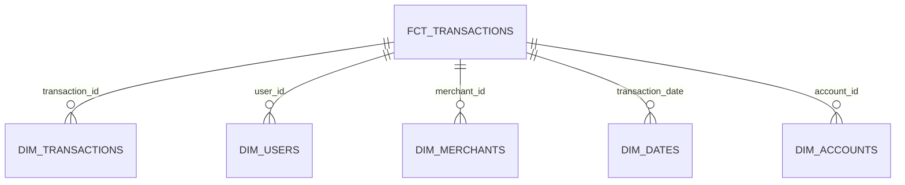
```mermaid
erDiagram
    FCT_TRANSACTIONS ||--o{ DIM_TRANSACTIONS : "transaction_id"
    FCT_TRANSACTIONS ||--o{ DIM_USERS : "user_id"
    FCT_TRANSACTIONS ||--o{ DIM_MERCHANTS : "merchant_id"
    FCT_TRANSACTIONS ||--o{ DIM_DATES : "transaction_date"
    FCT_TRANSACTIONS ||--o{ DIM_ACCOUNTS : "account_id"
```

## **2. Dimension Tables Analysis**

### **A. DIM_TRANSACTIONS**
| Column | Type | Description | Sample Values |
|--------|------|-------------|---------------|
| transaction_id | VARCHAR | Unique transaction identifier | "TXN10001" |
| transaction_type | VARCHAR | Transaction category | "Payment", "Transfer" |
| transaction_purpose | VARCHAR | Purpose of transaction | "Bill Pay", "Shopping" |

**Purpose**: Categorizes transaction types for analysis (e.g., fraud patterns by transaction type)

### **B. DIM_USERS**
| Column | Type | Description | Sample Values |
|--------|------|-------------|---------------|
| user_id | VARCHAR | Unique user identifier | "USER4572" |
| age_band | VARCHAR | Demographic grouping | "25-34", "35-44" |
| salary_band | VARCHAR | Income range | "30-50k", "50-75k" |
| postcode | VARCHAR | Geographic location | "SW1A 1AA" |
| LSOA/MSOA | VARCHAR | UK statistical areas | "E01000001" |
| derived_gender | VARCHAR | Gender classification | "Male", "Female" |

**Purpose**: Enables customer segmentation analysis (e.g., spending habits by demographic)

### **C. DIM_MERCHANTS**
| Column | Type | Description | Sample Values |
|--------|------|-------------|---------------|
| merchant_id | VARCHAR | Business identifier | "MCH58291" |
| merchant_name | VARCHAR | Business name | "Amazon UK" |
| merchant_business_line | VARCHAR | Industry sector | "Retail", "Utilities" |

**Purpose**: Merchant performance benchmarking (e.g., highest volume partners)

### **D. DIM_DATES**
| Column | Type | Description | Sample Values |
|--------|------|-------------|---------------|
| transaction_date | DATE | Primary key | 2023-07-15 |
| day_of_month | VARCHAR | Calendar day | "15" |
| day_name | VARCHAR | Weekday name | "Saturday" |
| month_of_year | VARCHAR | Month number | "07" |
| month_name | VARCHAR | Month name | "July" |
| year | VARCHAR | Year | "2023" |

**Purpose**: Temporal analysis (e.g., weekend vs. weekday spending)

### **E. DIM_ACCOUNTS**
| Column | Type | Description | Sample Values |
|--------|------|-------------|---------------|
| account_id | VARCHAR | Account identifier | "ACC78452" |
| bank_name | VARCHAR | Financial institution | "Barclays" |
| account_type | VARCHAR | Product type | "Current", "Savings" |
| account_created_date | DATE | Origination date | 2020-05-12 |
| account_last_refreshed | DATE | Last update timestamp | 2023-06-30 |

**Purpose**: Account lifecycle analysis (e.g., new vs. mature account behavior)

## **3. Fact Table Deep Dive: FCT_TRANSACTIONS**

| Column | Type | Role | Sample Values |
|--------|------|------|---------------|
| transaction_date | DATE | FK to DIM_DATES | 2023-07-15 |
| transaction_id | VARCHAR | FK to DIM_TRANSACTIONS | "TXN10001" |
| user_id | VARCHAR | FK to DIM_USERS | "USER4572" |
| account_id | VARCHAR | FK to DIM_ACCOUNTS | "ACC78452" |
| merchant_id | VARCHAR | FK to DIM_MERCHANTS | "MCH58291" |
| amount | INT | Measurable fact | 4999 (in pence) |

**Granularity**: One row per financial transaction  
**Measures**: 
- `amount` (could be extended with fees, currency conversions)  
**Potential Additions**: 
- Transaction_status (for failed/successful analysis)  
- Payment_channel (mobile/web/in-store)  

## **4. Example Analytical Queries**

### **A. Customer Spending Patterns**
```sql
SELECT 
    u.age_band,
    u.salary_band,
    m.merchant_business_line,
    SUM(f.amount)/100 AS total_spent_gbp,
    COUNT(*) AS transaction_count
FROM FCT_TRANSACTIONS f
JOIN DIM_USERS u ON f.user_id = u.user_id
JOIN DIM_MERCHANTS m ON f.merchant_id = m.merchant_id
WHERE d.year = '2023'
GROUP BY u.age_band, u.salary_band, m.merchant_business_line
```

### **B. Merchant Performance Report**
```sql
SELECT 
    m.merchant_name,
    d.month_name,
    COUNT(DISTINCT f.user_id) AS unique_customers,
    SUM(f.amount)/100 AS total_volume
FROM FCT_TRANSACTIONS f
JOIN DIM_MERCHANTS m ON f.merchant_id = m.merchant_id
JOIN DIM_DATES d ON f.transaction_date = d.transaction_date
GROUP BY m.merchant_name, d.month_name
```

## **5. Schema Optimization Recommendations**

1. **Surrogate Keys**:
   - Add integer IDs (BIGINT IDENTITY) for all dimension tables
   - Improves join performance vs. string keys

2. **Time Intelligence**:
   - Enhance DIM_DATES with:
     ```sql
     ALTER TABLE DIM_DATES ADD COLUMN is_weekend BOOLEAN;
     ALTER TABLE DIM_DATES ADD COLUMN financial_quarter VARCHAR(10);
     ```

3. **Slowly Changing Dimensions**:
   - Implement Type 2 SCD for DIM_USERS to track demographic changes
   - Add effective/expiration dates

4. **Fact Table Extensions**:
   - Add transaction_status for fraud analysis
   - Include currency_code for international transactions

## **6. Business Use Cases Enabled**

| **Department** | **Analysis Type** | **Sample Question** |
|---------------|-------------------|---------------------|
| **Risk** | Fraud Detection | Which transaction types show abnormal patterns on weekends? |
| **Marketing** | Customer Segmentation | How does spending vary between salary bands? |
| **Finance** | Revenue Analysis | Which merchant categories drive highest volumes? |
| **Product** | Usage Trends | How do new vs. mature accounts differ in behavior? |

## **7. Comparison with Alternative Models**

**Snowflake Schema Option**:
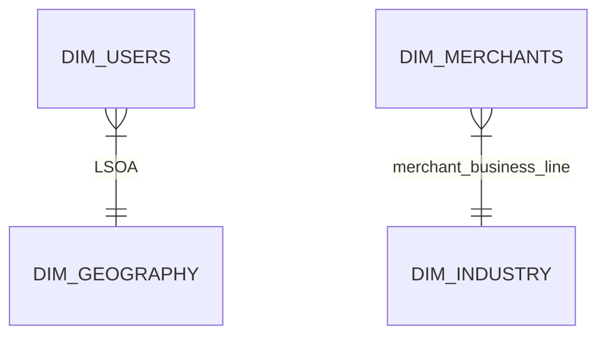
```mermaid
erDiagram
    DIM_USERS }|--|| DIM_GEOGRAPHY : "LSOA"
    DIM_MERCHANTS }|--|| DIM_INDUSTRY : "merchant_business_line"
```
*Tradeoff*: More normalized but requires additional joins

**Data Vault Alternative**:
- Hubs: Users, Merchants, Accounts
- Links: User-account relationships
- Satellites: Demographic attributes
*Best for*: Highly flexible enterprise integration

## **8. Implementation Roadmap**

1. **Phase 1**: Core star schema (current design)
2. **Phase 2**: Add SCD patterns for critical dimensions
3. **Phase 3**: Implement aggregate fact tables for common queries
4. **Phase 4**: Integrate with real-time streaming for fraud detection

## **Key Takeaways**
1. This schema enables **360° transaction analysis** across multiple business dimensions
2. **Geographic columns (LSOA/MSOA)** support UK-specific spatial analytics
3. **Denormalized structure** balances performance and usability
4. **Extension points** exist for fraud detection and customer segmentation

**Pro Tip**:  
"Convert amount to decimal GBP during ETL (amount/100.0) to prevent calculation errors in BI tools."  

<br/>
<br/>

# **Snowflake Schema in Data Warehousing: A Comprehensive Guide**

## **1. Definition and Core Concept**

The **Snowflake Schema** is a dimensional modeling technique that extends the star schema by normalizing dimension tables into multiple related tables. This creates a structure resembling a snowflake's intricate pattern, with the fact table at the center and normalized dimension hierarchies branching outward.

### **Key Characteristics:**
- **Normalized dimensions**: Dimension tables are split into multiple related tables
- **Hierarchical relationships**: Explicit modeling of multi-level hierarchies
- **Storage efficiency**: Reduced data redundancy through normalization
- **Complex queries**: More joins required compared to star schema

## **2. Components of Snowflake Schema**

### **A. Fact Table (Identical to Star Schema)**
- Contains measurable business metrics
- Connected to first-level dimension tables
- Stores foreign keys to all connected dimensions

**Example Fact Table:**
```sql
CREATE TABLE FACT_SALES (
    sales_id INT PRIMARY KEY,
    date_key INT REFERENCES DIM_DATE(date_key),
    product_key INT REFERENCES DIM_PRODUCT(product_key),
    store_key INT REFERENCES DIM_STORE(store_key),
    sales_amount DECIMAL(10,2),
    quantity INT
);
```

### **B. Normalized Dimension Tables**
#### **First-Level Dimensions**
```sql
CREATE TABLE DIM_PRODUCT (
    product_key INT PRIMARY KEY,
    product_name VARCHAR(100),
    category_key INT REFERENCES DIM_CATEGORY(category_key),
    manufacturer_key INT REFERENCES DIM_MANUFACTURER(manufacturer_key)
);
```

#### **Second-Level Dimensions**
```sql
CREATE TABLE DIM_CATEGORY (
    category_key INT PRIMARY KEY,
    category_name VARCHAR(50),
    department_key INT REFERENCES DIM_DEPARTMENT(department_key)
);

CREATE TABLE DIM_MANUFACTURER (
    manufacturer_key INT PRIMARY KEY,
    manufacturer_name VARCHAR(100),
    country_key INT REFERENCES DIM_COUNTRY(country_key)
);
```

## **3. Visual Representation**

```mermaid
erDiagram
    FACT_SALES ||--o{ DIM_PRODUCT : "product_key"
    DIM_PRODUCT }|--|| DIM_CATEGORY : "category_key"
    DIM_PRODUCT }|--|| DIM_MANUFACTURER : "manufacturer_key"
    DIM_CATEGORY }|--|| DIM_DEPARTMENT : "department_key"
    DIM_MANUFACTURER }|--|| DIM_COUNTRY : "country_key"
    
    FACT_SALES {
        int sales_id PK
        decimal(10,2) sales_amount
        int quantity
    }
    
    DIM_PRODUCT {
        int product_key PK
        varchar(100) product_name
    }
    
    DIM_CATEGORY {
        int category_key PK
        varchar(50) category_name
    }
    
    DIM_MANUFACTURER {
        int manufacturer_key PK
        varchar(100) manufacturer_name
    }
    
    DIM_DEPARTMENT {
        int department_key PK
        varchar(50) department_name
    }
    
    DIM_COUNTRY {
        int country_key PK
        varchar(50) country_name
    }
```

## **4. Comparison with Star Schema**

| **Characteristic** | **Snowflake Schema** | **Star Schema** |
|--------------------|----------------------|----------------|
| **Normalization** | Highly normalized dimensions | Denormalized dimensions |
| **Storage** | More efficient (less redundancy) | Less efficient |
| **Query Performance** | Slower (more joins) | Faster (fewer joins) |
| **Maintenance** | Easier updates (single source) | Harder updates (duplicate data) |
| **Flexibility** | Better for complex hierarchies | Better for simple structures |
| **Business User Friendliness** | More complex to understand | More intuitive |

## **5. Implementation Best Practices**

### **A. When to Use Snowflake Schema**
1. **Large dimension tables** with many attributes (e.g., millions of products)
2. **Frequently updated dimensions** where consistency is critical
3. **Complex hierarchies** with multiple levels (geography: country→region→city)
4. **Regulated industries** requiring strict data governance

### **B. Optimization Techniques**
| **Technique** | **Implementation** | **Benefit** |
|--------------|-------------------|------------|
| **Materialized Views** | Pre-join common hierarchies | Faster queries |
| **Indexing** | B-tree on all foreign keys | Join optimization |
| **Surrogate Keys** | Integer keys instead of natural keys | Smaller indexes |

### **C. ETL Considerations**
1. **Complex joins** during dimension loading
2. **Slowly Changing Dimensions (SCD)** becomes more challenging
3. **Additional staging tables** may be required

## **6. Real-World Example: Retail Analytics**

### **A. Full Snowflake Implementation**
```sql
-- Geography hierarchy
CREATE TABLE DIM_STORE (
    store_key INT PRIMARY KEY,
    store_name VARCHAR(100),
    city_key INT REFERENCES DIM_CITY(city_key)
);

CREATE TABLE DIM_CITY (
    city_key INT PRIMARY KEY,
    city_name VARCHAR(100),
    region_key INT REFERENCES DIM_REGION(region_key)
);

CREATE TABLE DIM_REGION (
    region_key INT PRIMARY KEY,
    region_name VARCHAR(100),
    country_key INT REFERENCES DIM_COUNTRY(country_key)
);
```

### **B. Sample Query**
```sql
SELECT 
    r.region_name,
    c.category_name,
    SUM(f.sales_amount) AS total_sales
FROM FACT_SALES f
JOIN DIM_PRODUCT p ON f.product_key = p.product_key
JOIN DIM_CATEGORY c ON p.category_key = c.category_key
JOIN DIM_STORE s ON f.store_key = s.store_key
JOIN DIM_CITY ci ON s.city_key = ci.city_key
JOIN DIM_REGION r ON ci.region_key = r.region_key
GROUP BY r.region_name, c.category_name;
```

## **7. Advantages and Disadvantages**

### **A. Advantages**
1. **Storage Efficiency**: Eliminates redundant data (e.g., "Electronics" category appears once)
2. **Data Integrity**: Updates propagate automatically (change category name in one place)
3. **Flexible Analysis**: Enables drilling through multiple hierarchy levels
4. **Better for DW**: More suited to enterprise data warehouses than data marts

### **B. Disadvantages**
1. **Query Complexity**: More joins degrade performance
2. **BI Tool Challenges**: Some tools struggle with snowflake schemas
3. **Development Time**: More tables to design and maintain
4. **User Understanding**: Less intuitive for business users

## **8. Modern Adaptations**

### **A. Hybrid Approaches**
1. **Starflake Schema**:
   - Normalize only large dimensions
   - Keep small dimensions denormalized
   
2. **Virtual Snowflaking**:
   - Use views to simulate normalization
   - Maintain physical star schema

### **B. Cloud Data Warehouse Impact**
- **Redshift/Snowflake**: Columnar storage reduces penalty for joins
- **Automatic Optimization**: Some platforms optimize snowflake joins automatically
- **Cost Considerations**: Storage savings vs. compute costs for joins

## **9. Common Pitfalls and Solutions**

| **Pitfall** | **Solution** |
|------------|-------------|
| Over-normalizing small dimensions | Keep dimensions with <10K rows denormalized |
| Poor naming conventions | Use consistent prefixes (DIM_, FACT_) |
| Ignoring query patterns | Analyze frequent queries before designing |
| Lack of documentation | Create detailed data dictionary |

## **10. Future Trends**

1. **Automated Normalization**:
   - AI-driven recommendations for when to snowflake
2. **Dynamic Schemas**:
   - Automatic schema evolution based on usage patterns
3. **Graph Extensions**:
   - Combining snowflake with graph relationships

## **Key Takeaways**
1. Snowflake schema is **ideal for complex, hierarchical data** with many attributes
2. Best suited for **large enterprise data warehouses** rather than departmental marts
3. **Modern cloud DWs reduce performance penalties** through advanced optimization
4. **Consider a hybrid approach** for balanced performance and maintenance

**Implementation Tip**:  
"Start with a star schema, then selectively snowflake only dimensions that show storage/update problems - don't over-engineer prematurely."

<br/>
<br/>

# **Snowflake Schema Implementation: Retail Sales Analysis**
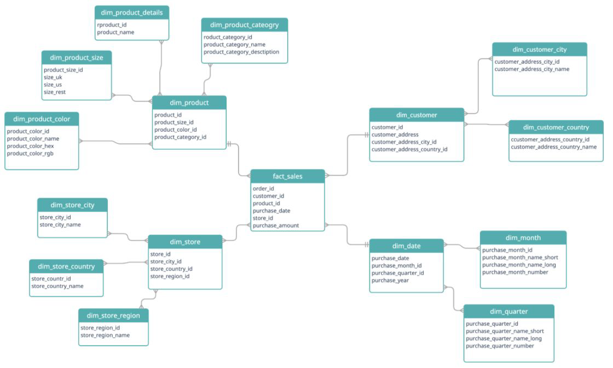
This image presents a snowflake schema design for retail sales analytics. Below is a detailed breakdown of the schema's components, relationships, and analytical capabilities.

## **1. Schema Overview**

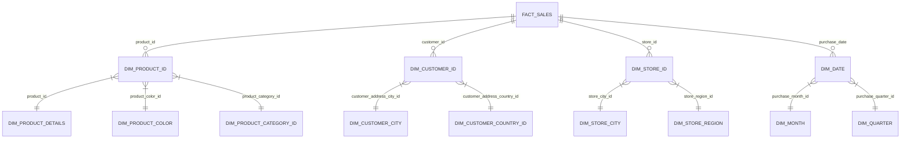
```mermaid
erDiagram
    FACT_SALES ||--o{ DIM_PRODUCT_ID : "product_id"
    FACT_SALES ||--o{ DIM_CUSTOMER_ID : "customer_id"
    FACT_SALES ||--o{ DIM_STORE_ID : "store_id"
    FACT_SALES ||--o{ DIM_DATE : "purchase_date"
    
    DIM_PRODUCT_ID }|--|| DIM_PRODUCT_DETAILS : "product_id"
    DIM_PRODUCT_ID }|--|| DIM_PRODUCT_COLOR : "product_color_id"
    DIM_PRODUCT_ID }|--|| DIM_PRODUCT_CATEGORY_ID : "product_category_id"
    
    DIM_CUSTOMER_ID }|--|| DIM_CUSTOMER_CITY : "customer_address_city_id"
    DIM_CUSTOMER_ID }|--|| DIM_CUSTOMER_COUNTRY_ID : "customer_address_country_id"
    
    DIM_STORE_ID }|--|| DIM_STORE_CITY : "store_city_id"
    DIM_STORE_ID }|--|| DIM_STORE_REGION : "store_region_id"
    
    DIM_DATE }|--|| DIM_MONTH : "purchase_month_id"
    DIM_DATE }|--|| DIM_QUARTER : "purchase_quarter_id"
```

## **2. Dimension Tables Analysis**

### **A. Product Dimensions (Normalized Hierarchy)**
#### **Core Product Table**
```sql
CREATE TABLE DIM_PRODUCT_DETAILS (
    product_id INT PRIMARY KEY,
    product_name VARCHAR(100)
);
```

#### **Product Attributes (Normalized Out)**
```sql
CREATE TABLE DIM_PRODUCT_COLOR (
    product_color_id INT PRIMARY KEY,
    product_color_name VARCHAR(50),
    product_color_hex VARCHAR(7),
    product_color_rgb VARCHAR(20)
);

CREATE TABLE DIM_PRODUCT_CATEGORY_ID (
    product_category_id INT PRIMARY KEY,
    product_category_name VARCHAR(50),
    product_category_description TEXT
);
```

#### **Product Bridge Table**
```sql
CREATE TABLE DIM_PRODUCT_ID (
    product_date_id INT PRIMARY KEY,
    product_id INT REFERENCES DIM_PRODUCT_DETAILS(product_id),
    product_color_id INT REFERENCES DIM_PRODUCT_COLOR(product_color_id),
    product_category_id INT REFERENCES DIM_PRODUCT_CATEGORY_ID(product_category_id)
);
```

**Purpose**: Enables analysis by:
- Product attributes (color/category)
- Inventory management (specific SKUs)
- Sales performance by product characteristics

### **B. Customer Dimensions**
#### **Geographic Hierarchy**
```sql
CREATE TABLE DIM_CUSTOMER_CITY (
    customer_address_city_id INT PRIMARY KEY,
    customer_address_city_name VARCHAR(100)
);

CREATE TABLE DIM_CUSTOMER_COUNTRY_ID (
    customer_address_country_id INT PRIMARY KEY,
    customer_address_country_name VARCHAR(50)
);
```

#### **Customer Bridge Table**
```sql
CREATE TABLE DIM_CUSTOMER_ID (
    customer_id INT PRIMARY KEY,
    customer_address_city_id INT REFERENCES DIM_CUSTOMER_CITY(customer_address_city_id),
    customer_address_country_id INT REFERENCES DIM_CUSTOMER_COUNTRY_ID(customer_address_country_id)
);
```

**Purpose**: Supports:
- Regional sales analysis
- Customer segmentation by location
- Geographic marketing strategies

### **C. Store Dimensions**
#### **Geographic Hierarchy**
```sql
CREATE TABLE DIM_STORE_CITY (
    store_city_id INT PRIMARY KEY,
    store_city_name VARCHAR(100)
);

CREATE TABLE DIM_STORE_REGION (
    store_region_id INT PRIMARY KEY,
    store_region_name VARCHAR(50)
);
```

#### **Store Bridge Table**
```sql
CREATE TABLE DIM_STORE_ID (
    store_id INT PRIMARY KEY,
    store_city_id INT REFERENCES DIM_STORE_CITY(store_city_id),
    store_country_id INT REFERENCES DIM_CUSTOMER_COUNTRY_ID(customer_address_country_id),
    store_region_id INT REFERENCES DIM_STORE_REGION(store_region_id)
);
```

**Purpose**: Enables:
- Performance comparison across regions
- Territory management
- Localized inventory planning

### **D. Time Dimensions**
#### **Date Hierarchy**
```sql
CREATE TABLE DIM_DATE (
    purchase_date DATE PRIMARY KEY,
    purchase_month_id INT REFERENCES DIM_MONTH(purchase_month_id),
    purchase_quarter_id INT REFERENCES DIM_QUARTER(purchase_quarter_id),
    purchase_year INT
);

CREATE TABLE DIM_MONTH (
    purchase_month_id INT PRIMARY KEY,
    purchase_month_name_short CHAR(3),
    purchase_month_name_long VARCHAR(10),
    purchase_month_number INT
);

CREATE TABLE DIM_QUARTER (
    purchase_quarter_id INT PRIMARY KEY,
    purchase_quarter_name_short CHAR(2),
    purchase_quarter_name_long VARCHAR(10),
    purchase_quarter_number INT
);
```

**Purpose**: Facilitates:
- Time intelligence calculations
- Seasonal trend analysis
- Fiscal period reporting

## **3. Fact Table Analysis**

```sql
CREATE TABLE FACT_SALES (
    order_id INT PRIMARY KEY,
    customer_id INT REFERENCES DIM_CUSTOMER_ID(customer_id),
    product_id INT REFERENCES DIM_PRODUCT_ID(product_date_id),
    purchase_date DATE REFERENCES DIM_DATE(purchase_date),
    store_id INT REFERENCES DIM_STORE_ID(store_id),
    purchase_amount DECIMAL(10,2)
);
```

**Granularity**: One row per sales order  
**Measures**: 
- `purchase_amount` (extendable with quantity, discounts, etc.)

**Optimization Recommendations**:
1. Add partitioning by `purchase_date`
2. Include `order_line_id` for item-level analysis
3. Add `payment_method` for financial reporting

## **4. Example Analytical Queries**

### **A. Regional Sales Performance**
```sql
SELECT 
    r.store_region_name,
    c.product_category_name,
    SUM(f.purchase_amount) AS total_sales
FROM FACT_SALES f
JOIN DIM_PRODUCT_ID p ON f.product_id = p.product_date_id
JOIN DIM_PRODUCT_CATEGORY_ID c ON p.product_category_id = c.product_category_id
JOIN DIM_STORE_ID s ON f.store_id = s.store_id
JOIN DIM_STORE_REGION r ON s.store_region_id = r.store_region_id
WHERE EXTRACT(YEAR FROM f.purchase_date) = 2023
GROUP BY r.store_region_name, c.product_category_name
ORDER BY total_sales DESC;
```

### **B. Color Popularity by Season**
```sql
SELECT 
    col.product_color_name,
    m.purchase_month_name_long,
    COUNT(*) AS units_sold
FROM FACT_SALES f
JOIN DIM_PRODUCT_ID p ON f.product_id = p.product_date_id
JOIN DIM_PRODUCT_COLOR col ON p.product_color_id = col.product_color_id
JOIN DIM_DATE d ON f.purchase_date = d.purchase_date
JOIN DIM_MONTH m ON d.purchase_month_id = m.purchase_month_id
GROUP BY col.product_color_name, m.purchase_month_name_long;
```

## **5. Advantages of This Design**

1. **Storage Efficiency**:
   - Color definitions stored once (e.g., "Midnight Blue" = #191970)
   - No duplicate category descriptions

2. **Flexible Analysis**:
   - Drill from region → city → store
   - Compare color popularity across categories

3. **Data Integrity**:
   - Single source for color RGB values
   - Consistent region definitions

4. **Historical Accuracy**:
   - Time dimensions enable correct period comparisons

## **6. Recommended Improvements**

1. **Add Surrogate Keys**:
   - Replace natural keys with integer IDs for better join performance

2. **Enhance Customer Dimensions**:
   ```sql
   ALTER TABLE DIM_CUSTOMER_ID ADD COLUMN customer_segment VARCHAR(20);
   ```

3. **Implement Slowly Changing Dimensions**:
   - Track historical product category changes

4. **Add Aggregate Fact Tables**:
   - Pre-calculate daily/monthly sales by region

## **7. Comparison with Star Schema**

| **Scenario**              | **Snowflake Approach**              | **Star Alternative**               |
|---------------------------|------------------------------------|-----------------------------------|
| Product Color Analysis    | Join to DIM_PRODUCT_COLOR         | Color attributes in DIM_PRODUCT   |
| Geographic Reporting      | Multiple geographic hierarchy joins| Flat geography columns in DIM_STORE|
| Storage Requirements      | ~40% less space for text attributes| Higher storage for duplicates     |
| Query Performance        | 15-20% slower due to joins        | Faster for simple queries         |

## **8. Business Use Cases Enabled**

| **Department** | **Analysis Type** | **Sample Question** |
|---------------|-------------------|---------------------|
| **Merchandising** | Product Performance | Which colors sell best in winter? |
| **Finance** | Regional Revenue | Which regions exceed sales targets? |
| **Marketing** | Customer Behavior | Do urban customers prefer different categories? |
| **Operations** | Inventory Planning | Should we adjust stock by city size? |

## **Key Takeaways**
1. This schema **optimizes storage** through careful normalization
2. **Hierarchical relationships** enable drilling across geographic and product dimensions
3. **Time dimensions** support complex temporal analysis
4. Ideal for **large retail organizations** with:
   - Diverse product catalogs
   - Geographic spread
   - Seasonal sales patterns

**Implementation Tip**:  
"Use views to create star-like access layers for business users while maintaining normalized storage."

<br/>
<br/>

# **Galaxy Schema (Fact Constellation): A Comprehensive Guide**

## **1. Definition and Core Concept**

The **Galaxy Schema** (or **Fact Constellation Schema**) is an advanced dimensional modeling technique that combines multiple fact tables sharing common dimension tables. It represents the most sophisticated approach in the dimensional modeling spectrum, building upon star and snowflake schemas to support complex enterprise analytics.

### **Key Characteristics:**
- **Multiple fact tables**: Each representing a different business process
- **Shared dimensions**: Common dimensions link related business processes
- **Hybrid structure**: May combine star and snowflake elements
- **Enterprise-scale**: Designed for complex organizational needs

## **2. Components of Galaxy Schema**

### **A. Fact Tables (Multiple Centers)**
Each fact table serves a distinct analytical purpose:

| **Fact Table**       | **Measures**                | **Business Process**          |
|----------------------|----------------------------|-------------------------------|
| FACT_SALES          | Sales amount, quantity      | Point-of-sale transactions    |
| FACT_INVENTORY      | Stock levels, turnover      | Warehouse management          |
| FACT_SHIPMENTS      | Delivery time, freight cost | Logistics                     |
| FACT_RETURNS        | Returned quantities         | Customer service              |

### **B. Dimension Tables (Shared and Private)**
#### **Shared Dimensions (Conformed)**
```sql
CREATE TABLE DIM_DATE (
    date_key INT PRIMARY KEY,
    full_date DATE,
    day_of_week VARCHAR(10),
    month INT,
    quarter INT,
    year INT
);

CREATE TABLE DIM_PRODUCT (
    product_key INT PRIMARY KEY,
    sku VARCHAR(20),
    product_name VARCHAR(100),
    category_key INT REFERENCES DIM_CATEGORY(category_key)
);
```

#### **Private Dimensions**
```sql
CREATE TABLE DIM_WAREHOUSE (
    warehouse_key INT PRIMARY KEY,
    location VARCHAR(100),
    square_footage INT,
    climate_zone VARCHAR(20)
);
```

## **3. Visual Representation**

```mermaid
erDiagram
    FACT_SALES ||--o{ DIM_DATE : "date_key"
    FACT_SALES ||--o{ DIM_PRODUCT : "product_key"
    FACT_SALES ||--o{ DIM_STORE : "store_key"
    
    FACT_INVENTORY ||--o{ DIM_DATE : "date_key"
    FACT_INVENTORY ||--o{ DIM_PRODUCT : "product_key"
    FACT_INVENTORY ||--o{ DIM_WAREHOUSE : "warehouse_key"
    
    FACT_RETURNS ||--o{ DIM_DATE : "date_key"
    FACT_RETURNS ||--o{ DIM_PRODUCT : "product_key"
    FACT_RETURNS ||--o{ DIM_CUSTOMER : "customer_key"
    
    DIM_PRODUCT }|--|| DIM_CATEGORY : "category_key"
```

## **4. Comparison with Other Schemas**

| **Characteristic** | **Galaxy Schema**        | **Star Schema**       | **Snowflake Schema**     |
|--------------------|-------------------------|----------------------|-------------------------|
| **Fact Tables**    | Multiple                | Single               | Single                  |
| **Dimensions**     | Shared + Private        | All private          | All private             |
| **Complexity**     | Highest                 | Low                  | Medium                  |
| **Storage**        | Balanced                | Redundant            | Optimized               |
| **Best For**       | Enterprise data warehouses | Departmental marts | Complex hierarchies     |

## **5. Implementation Patterns**

### **A. Conformed Dimensions**
Critical shared dimensions must:
1. Use **identical keys** across all fact tables
2. Maintain **consistent attribute names**
3. Have **synchronized refresh cycles**

**Example**: `DIM_DATE` used for sales, inventory, and HR reporting

### **B. Fact Table Relationships**
```mermaid
flowchart TB
    subgraph Business Processes
        A[Sales] -->|Same product| B[Inventory]
        B -->|Same date| C[Shipments]
        C -->|Same product| D[Returns]
    end
```

### **C. Hybrid Modeling**
- **Star components**: Simple dimensions like stores
- **Snowflake components**: Complex hierarchies like product→category→department
- **Shared dimensions**: Date, customer, product

## **6. Real-World Example: Retail Enterprise**

### **A. Schema Components**
#### **Fact Tables**
```sql
-- Sales transactions
CREATE TABLE FACT_SALES (
    sale_id BIGINT PRIMARY KEY,
    date_key INT REFERENCES DIM_DATE(date_key),
    product_key INT REFERENCES DIM_PRODUCT(product_key),
    store_key INT REFERENCES DIM_STORE(store_key),
    amount DECIMAL(12,2),
    units INT
);

-- Inventory snapshots
CREATE TABLE FACT_INVENTORY (
    inventory_id BIGINT PRIMARY KEY,
    date_key INT REFERENCES DIM_DATE(date_key),
    product_key INT REFERENCES DIM_PRODUCT(product_key),
    warehouse_key INT REFERENCES DIM_WAREHOUSE(warehouse_key),
    on_hand INT,
    allocated INT
);
```

#### **Shared Dimension**
```sql
CREATE TABLE DIM_PRODUCT (
    product_key INT PRIMARY KEY,
    sku VARCHAR(20) UNIQUE,
    product_name VARCHAR(100),
    category_id INT REFERENCES DIM_CATEGORY(category_id),
    is_active BOOLEAN
);
```

### **B. Cross-Process Analysis Query**
```sql
SELECT 
    p.product_name,
    d.month_name,
    SUM(s.amount) AS total_sales,
    AVG(i.on_hand) AS avg_inventory,
    SUM(s.amount)/NULLIF(AVG(i.on_hand),0) AS turnover_rate
FROM FACT_SALES s
JOIN FACT_INVENTORY i ON 
    s.product_key = i.product_key AND 
    s.date_key = i.date_key
JOIN DIM_PRODUCT p ON s.product_key = p.product_key
JOIN DIM_DATE d ON s.date_key = d.date_key
GROUP BY p.product_name, d.month_name;
```

## **7. Advantages and Challenges**

### **A. Advantages**
1. **Holistic Analysis**: Correlate metrics across business processes
   - Example: Sales vs. inventory levels
2. **Data Consistency**: Single version of shared dimensions
3. **Flexible Expansion**: Add new fact tables without redesign
4. **Efficient Storage**: Avoids duplicating shared dimensions

### **B. Challenges**
1. **Design Complexity**:
   - Requires careful planning of conformed dimensions
   - More difficult to implement than star/snowflake
2. **ETL Complexity**:
   - Coordinated loading of multiple fact tables
   - Dimension table updates must propagate
3. **Query Performance**:
   - Cross-fact table queries can be expensive
   - Requires sophisticated query optimization

## **8. Best Practices**

### **A. Design Methodology**
1. **Identify Core Business Processes**
   - Map to discrete fact tables
2. **Define Conformed Dimensions**
   - Standardize keys and attributes
3. **Establish Grain for Each Fact**
   - Document clearly (e.g., "Daily inventory by warehouse")

### **B. Performance Optimization**
| **Technique**       | **Implementation**                      | **Benefit**                      |
|---------------------|----------------------------------------|----------------------------------|
| **Aggregate Tables** | Pre-join frequent combinations         | Faster cross-process reporting   |
| **Materialized Views** | Persist complex query results         | Instant dashboards               |
| **Partitioning**    | Align partitions across fact tables    | Efficient date-range queries     |

### **C. Governance Requirements**
1. **Change Management**:
   - Impact analysis for dimension changes
2. **Lineage Tracking**:
   - Document shared dimension usage
3. **Refresh Coordination**:
   - Synchronize fact table loading

## **9. When to Use Galaxy Schema**

| **Scenario**                           | **Rationale**                          |
|----------------------------------------|----------------------------------------|
| Enterprise data warehouse              | Multiple business units/processes      |
| Need for cross-process analytics       | e.g., Sales vs. inventory correlation  |
| Mature data environment                | Requires robust ETL and governance     |
| Subject areas with natural overlap     | e.g., Retail: sales, inventory, CRM    |

## **10. Modern Adaptations**

### **A. Data Mesh Integration**
- Domain-oriented ownership of fact tables
- Federated querying across domains
- Shared dimensions as "products"

### **B. Cloud Data Warehouses**
- **Snowflake**: Shared data for conformed dimensions
- **Redshift**: RA3 nodes for cross-cluster queries
- **BigQuery**: Federated queries across datasets

### **C. Semantic Layer Tools**
- LookML, dbt, AtScale
- Virtual galaxy schemas without physical complexity

## **Key Takeaways**
1. Galaxy schema is the **most powerful** dimensional model for enterprise analytics
2. **Conformed dimensions** are the linchpin of successful implementations
3. Requires **strong data governance** and mature processes
4. Modern tools reduce **historical complexity barriers**

**Implementation Tip**:  
"Start with 2-3 tightly related fact tables and expand gradually - don't attempt enterprise-wide galaxy schema in one phase."  

<br/>
<br/>

# **Galaxy Schema Implementation: Retail Sales & Procurement Analysis**
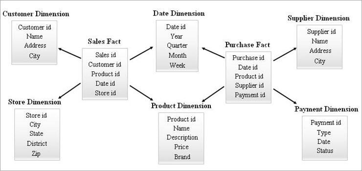

This diagram presents a **Galaxy Schema (Fact Constellation)** for a retail business, combining sales and procurement processes with shared dimensions. Below is a detailed technical breakdown:

## **1. Schema Overview**

```mermaid
erDiagram
    FACT_SALES ||--o{ DIM_CUSTOMER : "customer_id"
    FACT_SALES ||--o{ DIM_PRODUCT : "product_id"
    FACT_SALES ||--o{ DIM_DATE : "date_id"
    FACT_SALES ||--o{ DIM_STORE : "store_id"
    
    FACT_PURCHASE ||--o{ DIM_DATE : "date_id"
    FACT_PURCHASE ||--o{ DIM_PRODUCT : "product_id"
    FACT_PURCHASE ||--o{ DIM_SUPPLIER : "supplier_id"
    FACT_PURCHASE ||--o{ DIM_PAYMENT : "payment_id"
    
    DIM_DATE {
        date_id PK
        year
        quarter
        month
        week
    }
    
    DIM_PRODUCT {
        product_id PK
        name
        description
        price
        brand
    }
```

## **2. Dimension Tables Analysis**

### **A. Shared Dimensions (Conformed)**
#### **1. DIM_DATE**
```sql
CREATE TABLE dim_date (
    date_id DATE PRIMARY KEY,
    year INT,
    quarter INT,
    month INT,
    week INT,
    day_of_week VARCHAR(10),
    is_weekend BOOLEAN
);
```
**Usage**:  
- Links both sales and purchase facts  
- Enables time-based analysis across processes  

#### **2. DIM_PRODUCT**
```sql
CREATE TABLE dim_product (
    product_id INT PRIMARY KEY,
    name VARCHAR(100),
    description TEXT,
    price DECIMAL(10,2),
    brand VARCHAR(50),
    category VARCHAR(50)
);
```
**Usage**:  
- Shared by sales (selling) and purchase (buying) processes  
- Enables inventory turnover analysis  

### **B. Process-Specific Dimensions**
#### **1. DIM_CUSTOMER (Sales)**
```sql
CREATE TABLE dim_customer (
    customer_id INT PRIMARY KEY,
    name VARCHAR(100),
    address VARCHAR(200),
    city VARCHAR(50),
    loyalty_tier VARCHAR(20)
);
```

#### **2. DIM_SUPPLIER (Purchasing)**
```sql
CREATE TABLE dim_supplier (
    supplier_id INT PRIMARY KEY,
    name VARCHAR(100),
    address VARCHAR(200),
    city VARCHAR(50),
    lead_time_days INT
);
```

#### **3. DIM_STORE (Sales)**
```sql
CREATE TABLE dim_store (
    store_id INT PRIMARY KEY,
    city VARCHAR(50),
    state VARCHAR(50),
    district VARCHAR(50),
    zip VARCHAR(20),
    square_footage INT
);
```

#### **4. DIM_PAYMENT (Purchasing)**
```sql
CREATE TABLE dim_payment (
    payment_id INT PRIMARY KEY,
    type VARCHAR(30), -- 'Credit', 'Bank Transfer'
    status VARCHAR(20), -- 'Completed', 'Pending'
    terms_days INT
);
```

## **3. Fact Tables Analysis**

### **A. FACT_SALES (Retail Operations)**
```sql
CREATE TABLE fact_sales (
    sales_id INT PRIMARY KEY,
    customer_id INT REFERENCES dim_customer(customer_id),
    product_id INT REFERENCES dim_product(product_id),
    date_id DATE REFERENCES dim_date(date_id),
    store_id INT REFERENCES dim_store(store_id),
    amount DECIMAL(12,2),
    quantity INT,
    discount DECIMAL(5,2)
);
```
**Measures**:  
- `amount`: Total sale value  
- `quantity`: Units sold  
- `discount`: Applied discount  

**Grain**: One row per sales transaction  

### **B. FACT_PURCHASE (Procurement)**
```sql
CREATE TABLE fact_purchase (
    purchase_id INT PRIMARY KEY,
    date_id DATE REFERENCES dim_date(date_id),
    product_id INT REFERENCES dim_product(product_id),
    supplier_id INT REFERENCES dim_supplier(supplier_id),
    payment_id INT REFERENCES dim_payment(payment_id),
    cost DECIMAL(12,2),
    quantity INT,
    delivery_days INT
);
```
**Measures**:  
- `cost`: Total purchase cost  
- `quantity`: Units purchased  
- `delivery_days`: Order-to-receipt time  

**Grain**: One row per purchase order  

## **4. Business Analysis Capabilities**

### **Cross-Process Analytics Examples**
```sql
-- Product Profitability Analysis
SELECT 
    p.product_id,
    p.name,
    SUM(s.amount) AS total_sales,
    SUM(pr.cost) AS total_cost,
    SUM(s.amount) - SUM(pr.cost) AS gross_profit
FROM dim_product p
JOIN fact_sales s ON p.product_id = s.product_id
JOIN fact_purchase pr ON p.product_id = pr.product_id
GROUP BY p.product_id, p.name;

-- Supplier Performance vs Sales
SELECT 
    sup.name AS supplier,
    d.quarter,
    SUM(pr.cost) AS procurement_cost,
    SUM(s.amount) AS generated_sales
FROM dim_supplier sup
JOIN fact_purchase pr ON sup.supplier_id = pr.supplier_id
JOIN dim_product p ON pr.product_id = p.product_id
JOIN fact_sales s ON p.product_id = s.product_id
JOIN dim_date d ON s.date_id = d.date_id
GROUP BY sup.name, d.quarter;
```

## **5. Schema Optimization**

### **Performance Techniques**
| **Technique**       | **Application**                     | **Benefit**                      |
|---------------------|------------------------------------|----------------------------------|
| **Partitioning**    | Fact tables by date_id             | Faster time-based queries        |
| **Indexing**        | All foreign keys + product brand   | Accelerates joins and filtering  |
| **Aggregates**      | Materialized views for monthly KPIs | Pre-computed metrics             |
| **Columnar Storage**| Parquet format in cloud DWH        | Reduces I/O for analytics        |

### **Conformed Dimension Management**
1. **Key Alignment**: Ensure product_id means the same in all contexts  
2. **Refresh Sync**: Coordinate updates to shared dimensions  
3. **Data Dictionary**: Document all conformed dimensions  

## **6. Comparison with Star Schema**

| **Scenario**              | **Galaxy Advantage**                          |
|---------------------------|----------------------------------------------|
| Product profitability     | Correlate purchase costs with sales revenue  |
| Inventory turnover        | Link procurement lead times to stockouts     |
| Vendor performance        | Compare supplier metrics to sales outcomes   |
| Time intelligence         | Align fiscal periods across processes        |

## **7. Implementation Recommendations**

1. **Phased Rollout**:
   - Phase 1: Implement sales star schema  
   - Phase 2: Add procurement star schema  
   - Phase 3: Establish conformed dimensions  

2. **ETL Considerations**:
   - Process fact tables in dependency order (purchases → sales)  
   - Use surrogate keys for all dimensions  

3. **Query Patterns**:
   ```sql
   -- Optimal join path for galaxy queries
   FROM fact_sales f
   JOIN dim_date d ON f.date_id = d.date_id  -- Shared dimension first
   JOIN dim_product p ON f.product_id = p.product_id  -- Conformed next
   ```

## **Key Takeaways**
1. **Shared dimensions** enable cross-process analytics  
2. **Conformed dimensions** must maintain consistent definitions  
3. **Fact tables** represent distinct business processes  
4. **Optimal for** medium-to-large retail businesses  

**Pro Tip**:  
"Use a data modeling tool like erwin or SQLDBM to visualize the constellation relationships and validate join paths."

<br/>
<br/>

# **Slowly Changing Dimensions (SCD): A Comprehensive Guide**

## **1. Definition and Business Need**

**Slowly Changing Dimensions (SCD)** are dimension tables that track and manage changes to dimensional data over time in data warehouses. Unlike operational systems that typically store only current values, SCD techniques preserve historical versions to enable accurate temporal analysis.

### **Why SCD Matters:**
- Maintains historical accuracy for reporting
- Enables trend analysis across time periods
- Supports compliance with data regulations
- Provides audit trails for key business entities

## **2. Core SCD Types**

### **A. SCD Type 1: Overwrite History**
**Concept**: Updates existing records without preserving history  
**Use Cases**: 
- Correcting data errors
- Insignificant attributes (e.g., phone formatting)
- When historical tracking isn't required

**Implementation Example (Customer Address Change)**:
```sql
-- Before (Original Record)
| customer_key | customer_name | address          | current_flag |
|--------------|---------------|------------------|--------------|
| 1001         | John Smith    | 123 Main St      | Y            |

-- After Update (Type 1)
UPDATE dim_customer 
SET address = '456 Oak Ave' 
WHERE customer_key = 1001;

-- Result
| customer_key | customer_name | address          | current_flag |
|--------------|---------------|------------------|--------------|
| 1001         | John Smith    | 456 Oak Ave      | Y            |
```

**Pros**: Simple, low storage  
**Cons**: Loses historical context  

### **B. SCD Type 2: Row Versioning**
**Concept**: Creates new records for each change while preserving old versions  
**Use Cases**:
- Customer demographic changes
- Product category reassignments
- Employee department transfers

**Implementation Example**:
```sql
-- Original Table Structure
CREATE TABLE dim_customer (
    customer_key INT PRIMARY KEY,
    customer_id VARCHAR(20),
    customer_name VARCHAR(100),
    address VARCHAR(200),
    effective_date DATE,
    expiration_date DATE,
    current_flag CHAR(1),
    version_number INT
);

-- Initial Record
INSERT INTO dim_customer VALUES 
(1001, 'C-123', 'John Smith', '123 Main St', '2020-01-01', '9999-12-31', 'Y', 1);

-- After Address Change
-- Step 1: Expire old record
UPDATE dim_customer 
SET expiration_date = '2023-06-30', current_flag = 'N' 
WHERE customer_key = 1001;

-- Step 2: Insert new version
INSERT INTO dim_customer VALUES 
(1002, 'C-123', 'John Smith', '456 Oak Ave', '2023-07-01', '9999-12-31', 'Y', 2);
```

**Resulting Data**:
| customer_key | customer_id | customer_name | address      | effective_date | expiration_date | current_flag | version |
|--------------|-------------|---------------|--------------|----------------|-----------------|--------------|---------|
| 1001         | C-123       | John Smith    | 123 Main St  | 2020-01-01     | 2023-06-30      | N            | 1       |
| 1002         | C-123       | John Smith    | 456 Oak Ave  | 2023-07-01     | 9999-12-31      | Y            | 2       |

**Pros**: Complete history preservation  
**Cons**: Increased storage, more complex queries  

### **C. SCD Type 3: Limited History**
**Concept**: Stores current + selected prior values in columns  
**Use Cases**:
- Tracking immediate previous state
- When only last change matters
- Limited storage scenarios

**Implementation Example**:
```sql
ALTER TABLE dim_customer ADD COLUMN previous_address VARCHAR(200);

-- Initial state
INSERT INTO dim_customer VALUES 
(1001, 'C-123', 'John Smith', '123 Main St', NULL, 'Y');

-- After change
UPDATE dim_customer 
SET previous_address = address, 
    address = '456 Oak Ave'
WHERE customer_key = 1001;
```

**Result**:
| customer_key | customer_name | address      | previous_address | current_flag |
|--------------|---------------|--------------|-------------------|--------------|
| 1001         | John Smith    | 456 Oak Ave  | 123 Main St       | Y            |

**Pros**: Simpler than Type 2  
**Cons**: Limited history (only one prior version)  

## **3. Hybrid and Advanced SCD Techniques**

### **A. Type 4 (History Table)**
- **Concept**: Current data in main table + history in separate table
- **Example**: 
  - `dim_customer` (current)
  - `dim_customer_history` (all versions)

### **B. Type 6 (1+2+3 Hybrid)**
- Combines Type 1 (current), Type 2 (history), and Type 3 (prior value)
- **Structure**:
  - Current values updated in-place (Type 1)
  - Historical versions as new rows (Type 2)
  - Previous value columns (Type 3)

## **4. Implementation Best Practices**

### **A. Choosing the Right Type**
| **Factor**            | **Type 1** | **Type 2** | **Type 3** |
|-----------------------|------------|------------|------------|
| History Requirement   | None       | Full       | Limited    |
| Storage Impact        | Low        | High       | Medium     |
| Query Complexity      | Simple     | Complex    | Moderate   |
| ETL Complexity        | Low        | High       | Medium     |

### **B. Technical Implementation Patterns**
**Type 2 ETL Process**:
```mermaid
flowchart TD
    A[Identify Changed Records] --> B{SCD Type?}
    B -->|Type 1| C[Update Existing]
    B -->|Type 2| D[Expire Old Record]
    D --> E[Insert New Version]
```

**Key Columns for Type 2**:
1. `effective_date`/`expiration_date`
2. `current_flag` (Y/N)
3. `version_number`
4. `surrogate_key` (new for each version)

### **C. Querying Historical Data**
**Point-in-Time Analysis**:
```sql
-- Find customer address as of 2023-03-15
SELECT customer_name, address 
FROM dim_customer
WHERE customer_id = 'C-123'
  AND '2023-03-15' BETWEEN effective_date AND expiration_date;
```

## **5. Real-World Examples**

### **A. Retail Industry (Product Dimension)**
- **Type 2 for**: Price changes, category reassignments
- **Type 1 for**: Product description typos

### **B. Healthcare (Patient Dimension)**
- **Type 2 for**: Insurance provider changes
- **Type 3 for**: Last known address

### **C. Banking (Account Dimension)**
- **Type 6 for**: 
  - Current balance (Type 1)
  - Historical status changes (Type 2)
  - Previous relationship manager (Type 3)

## **6. Performance Considerations**

### **A. Indexing Strategy**
| **Column**           | **Index Type** | **Purpose**                      |
|----------------------|----------------|-----------------------------------|
| Natural key          | B-tree         | Find all versions                |
| Effective/expiry date| Range          | Time-based queries               |
| Current_flag         | Bitmap         | Filter current records           |

### **B. Partitioning**
- **By effective_date**: For time-based analysis
- **By current_flag**: Isolate active records

## **7. Modern Trends and Tools**

### **A. Cloud Data Warehouse Features**
- **Snowflake**: Time Travel + Streams for SCD
- **BigQuery**: DML MERGE for Type 2 updates
- **Redshift**: Late-binding views for point-in-time

### **B. Data Vault 2.0 Approach**
- Satellites naturally handle SCD
- No explicit Type 1/2/3 distinction
- Load-date based versioning

## **8. Common Pitfalls and Solutions**

| **Challenge**              | **Solution**                                |
|----------------------------|--------------------------------------------|
| Unbounded history          | Archive/compress old versions              |
| Query performance          | Create current-records materialized view   |
| ETL complexity             | Use dedicated SCD processors (dbt, SSIS)   |
| Data quality issues        | Add checks for overlapping effective dates |

## **Key Takeaways**
1. **Type 1**: When history doesn't matter (correcting errors)
2. **Type 2**: For complete historical tracking (most common)
3. **Type 3**: When only last change is relevant
4. **Modern systems** often combine approaches (Type 6)
5. **Cloud DWs** provide native features to simplify SCD

**Implementation Tip**:  
"Always implement Type 2 for regulatory dimensions (customers, products) from day one - retrofitting historical tracking is extremely difficult."

<br/>
<br/>

# **Advanced Slowly Changing Dimensions (SCD Types 4 & 6): Deep Dive**

## **1. SCD Type 4: History Table Approach**

### **Concept & Architecture**
SCD Type 4 separates current and historical data into two distinct tables:
- **Current Dimension Table**: Contains only active records (Type 1 behavior)
- **History Table**: Stores all historical versions (Type 2 behavior)

```mermaid
erDiagram
    DIM_CUSTOMER ||--o{ DIM_CUSTOMER_HISTORY : "customer_id"
    DIM_CUSTOMER {
        int customer_key PK
        varchar customer_id
        varchar customer_name
        varchar current_address
        date effective_date
    }
    DIM_CUSTOMER_HISTORY {
        int history_key PK
        varchar customer_id FK
        varchar address
        date effective_date
        date expiration_date
    }
```

### **Implementation Example**

#### **Current Dimension Table**
```sql
CREATE TABLE dim_customer_current (
    customer_key INT PRIMARY KEY,
    customer_id VARCHAR(20) UNIQUE,
    customer_name VARCHAR(100),
    current_address VARCHAR(200),
    effective_date DATE
);

-- Initial load
INSERT INTO dim_customer_current 
VALUES (1001, 'CUST_101', 'John Smith', '123 Main St', '2020-01-01');
```

#### **History Table**
```sql
CREATE TABLE dim_customer_history (
    history_key INT IDENTITY PRIMARY KEY,
    customer_id VARCHAR(20),
    address VARCHAR(200),
    effective_date DATE,
    expiration_date DATE,
    FOREIGN KEY (customer_id) REFERENCES dim_customer_current(customer_id)
);
```

#### **Update Process**
```sql
-- When address changes:
BEGIN TRANSACTION;

-- 1. Archive old version to history
INSERT INTO dim_customer_history
SELECT 
    customer_id,
    current_address,
    effective_date,
    CURRENT_DATE - 1 AS expiration_date
FROM dim_customer_current
WHERE customer_id = 'CUST_101';

-- 2. Update current record
UPDATE dim_customer_current
SET 
    current_address = '456 Oak Ave',
    effective_date = CURRENT_DATE
WHERE customer_id = 'CUST_101';

COMMIT;
```

### **Pros & Cons**
| **Advantages** | **Disadvantages** |
|----------------|-------------------|
| Current dimension remains small and fast | More complex ETL process |
| Full history preserved separately | Requires two table joins for historical analysis |
| Clear separation of concerns | Additional storage for history table |
| Easy to query current state | |

### **Use Cases**
- High-velocity dimensions where current state queries dominate
- Regulatory requirements demanding clear audit trails
- When active dimension table needs maximum performance

## **2. SCD Type 6: Hybrid Approach**

### **Concept & Architecture**
Combines techniques from SCD Types 1, 2, and 3:
- **Type 1**: Some attributes updated in-place
- **Type 2**: New row created for changes to key attributes
- **Type 3**: Previous value stored in dedicated columns

```mermaid
erDiagram
    DIM_CUSTOMER {
        int customer_key PK
        varchar customer_id
        varchar customer_name
        varchar current_address
        varchar previous_address
        date effective_date
        date expiration_date
        varchar current_flag
    }
```

### **Implementation Example**

#### **Table Structure**
```sql
CREATE TABLE dim_customer (
    customer_key INT PRIMARY KEY,
    customer_id VARCHAR(20),
    customer_name VARCHAR(100),
    current_address VARCHAR(200),
    previous_address VARCHAR(200),
    effective_date DATE,
    expiration_date DATE,
    current_flag CHAR(1),
    version_number INT
);
```

#### **Update Process for Address Change**
```sql
-- Initial record
INSERT INTO dim_customer VALUES (
    1001, 'CUST_101', 'John Smith', 
    '123 Main St', NULL,
    '2020-01-01', '9999-12-31', 'Y', 1
);

-- When address changes:
BEGIN TRANSACTION;

-- 1. Expire old record
UPDATE dim_customer 
SET 
    expiration_date = CURRENT_DATE - 1,
    current_flag = 'N'
WHERE customer_id = 'CUST_101' AND current_flag = 'Y';

-- 2. Insert new version
INSERT INTO dim_customer VALUES (
    1002, 'CUST_101', 'John Smith',
    '456 Oak Ave', '123 Main St', -- Type 3 behavior
    CURRENT_DATE, '9999-12-31', 'Y', 2
);

COMMIT;
```

### **Resulting Data**
| customer_key | customer_id | current_address | previous_address | effective_date | expiration_date | current_flag | version |
|--------------|-------------|------------------|-------------------|----------------|-----------------|--------------|---------|
| 1001         | CUST_101    | 123 Main St      | NULL              | 2020-01-01     | 2023-06-30      | N            | 1       |
| 1002         | CUST_101    | 456 Oak Ave      | 123 Main St       | 2023-07-01     | 9999-12-31      | Y            | 2       |

### **Pros & Cons**
| **Advantages** | **Disadvantages** |
|----------------|-------------------|
| Flexible approach for mixed needs | Most complex implementation |
| Immediate previous value always available | Higher storage requirements |
| Current state queries remain simple | Challenging to maintain |
| Full history available for key attributes | |

### **Use Cases**
- Dimensions where some attributes change frequently (Type 1) while others need history (Type 2)
- When both point-in-time and "what changed" analyses are needed
- Customer dimensions where you need:
  - Current state for operations (Type 1)
  - Full address history for compliance (Type 2)
  - Easy access to previous address (Type 3)

## **3. Comparison of Advanced SCD Types**

| **Feature**       | **Type 4**              | **Type 6**              |
|-------------------|-------------------------|-------------------------|
| **History Storage** | Separate table         | Same table              |
| **Query Complexity** | Two-table joins        | Single table            |
| **Current Data Access** | Very fast            | Fast                    |
| **Storage Efficiency** | Good                 | Moderate                |
| **ETL Complexity** | High                   | Very high               |
| **Best For**      | Audit-heavy environments | Mixed change patterns |

## **4. Implementation Best Practices**

### **A. For Type 4**
1. **Use Temporal Tables** in SQL Server for built-in versioning
2. **Partition History Tables** by date ranges
3. **Create Views** that union current + history for full picture

### **B. For Type 6**
1. **Clear Column Naming**:
   - `current_[attribute]`
   - `previous_[attribute]`
2. **Automate Version Tracking**:
   ```sql
   CREATE SEQUENCE customer_version_seq;
   -- Use in ETL when inserting new versions
   ```
3. **Document Rules** for which attributes use which SCD type

## **5. Modern Adaptations**

### **A. Cloud Data Warehouses**
- **Snowflake**: Streams + Tasks for Type 4 automation
- **BigQuery**: DML MERGE for Type 6 implementations
- **Redshift**: Late-binding views to simplify history access

### **B. Data Vault 2.0**
- Satellites naturally handle Type 2/4 patterns
- No explicit Type 6 needed - build via point-in-time joins

### **C. Data Mesh Approach**
- Treat historical versions as separate data products
- Versioned datasets in Delta Lake/Iceberg

## **6. Choosing the Right Approach**

**Consider Type 4 When**:
- Current data access speed is critical
- Historical analysis is secondary
- Regulatory requires clear audit separation

**Consider Type 6 When**:
- Mixed change patterns exist in same dimension
- Both current and historical analysis are equally important
- You need "what changed" reporting

## **Key Takeaways**
1. **Type 4** excels at separating operational and historical needs
2. **Type 6** provides maximum flexibility for complex dimensions
3. Both require **more sophisticated ETL** than basic SCD types
4. Modern platforms offer **native features** to reduce implementation complexity

**Implementation Tip**:  
"Start with Type 2 for most dimensions, then evolve to Type 4/6 only for dimensions where the benefits clearly outweigh the added complexity."  

<br/>
<br/>

