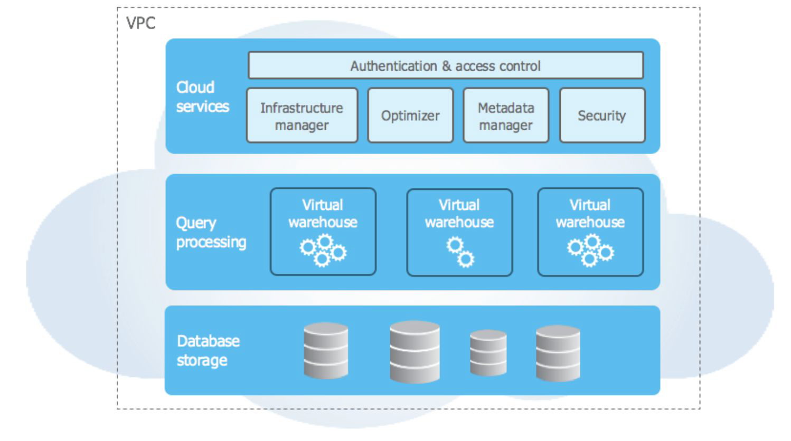
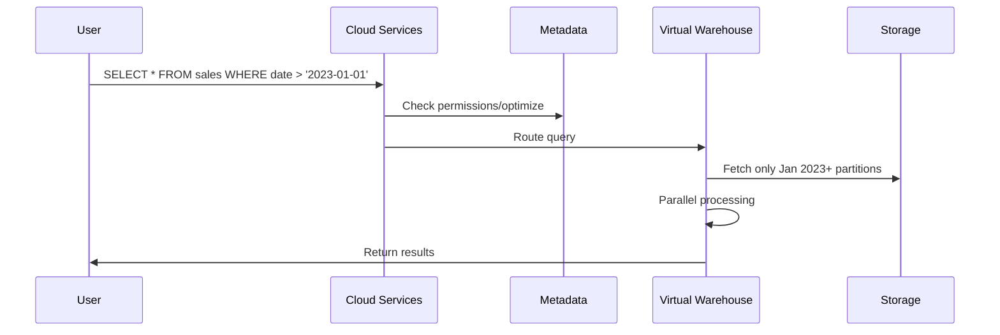
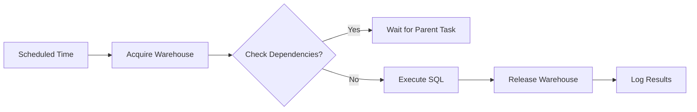
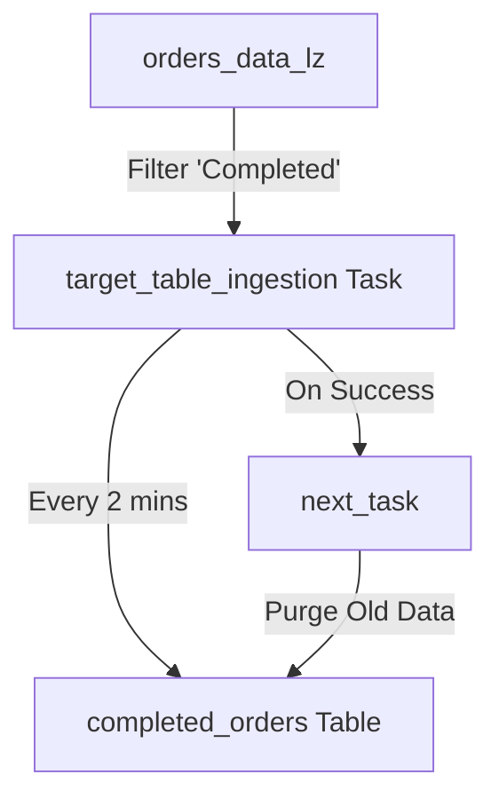

# **Snowflake Overview: A Detailed Explanation**

## **1. Introduction to Snowflake**
Snowflake is a **cloud-based data warehouse** designed for modern data analytics. It was founded in **2012** by three former Oracle engineers (Benoit Dageville, Thierry Cruanes, and Marcin Żukowski) who aimed to overcome the limitations of traditional data warehouses. Unlike legacy systems, Snowflake is built **exclusively for the cloud**, offering **scalability, performance, and ease of use**.

---

## **2. Key Differentiators from Traditional Data Warehouses**
Snowflake differs from traditional data warehouses (like **Oracle, Teradata, SQL Server**) and even cloud-based alternatives (like **Amazon Redshift, Google BigQuery**) in several ways:

### **A. Cloud-Native Architecture**
- Snowflake is **not built on existing database technologies** but designed from scratch for the cloud.
- It runs on **AWS, Azure, and Google Cloud**, leveraging their infrastructure.

### **B. Pay-As-You-Go Pricing**
- Charges are based on **actual compute usage (per-second billing)**.
- Storage and compute costs are **separated**, allowing cost optimization.

### **C. Fully Managed Service**
- **No hardware or software management** is required.
- **Automatic scaling, tuning, and maintenance** are handled by Snowflake.

---

## **3. Snowflake’s Unique Architecture**
Snowflake uses a **hybrid architecture** combining **shared-disk** and **shared-nothing** models.

### **A. Three Key Layers**
1. **Storage Layer (Shared-Disk)**
   - Stores all data in a **centralized, cloud-based repository** (e.g., S3, Blob Storage).
   - **Immutable & highly durable** (no data loss risk).
   - Supports structured & semi-structured data (JSON, Avro, Parquet).

2. **Compute Layer (Shared-Nothing)**
   - Uses **Massively Parallel Processing (MPP) clusters** (called **"virtual warehouses"**).
   - Each warehouse is an independent compute cluster that processes queries.
   - **Scales up/down dynamically** without downtime.

3. **Cloud Services Layer (Orchestration)**
   - Manages **authentication, metadata, query optimization, and transactions**.
   - **No manual tuning** required (unlike traditional databases).

### **B. Hybrid Approach Benefits**
- **Shared-Disk:** All compute nodes access the same data without moving it.
- **Shared-Nothing:** Each node processes a subset of data in parallel for high performance.

---

## **4. Key Features of Snowflake**
### **A. Elastic Scalability**
- **Compute (Virtual Warehouses)** can be **scaled up/down or paused** when not in use.
- **Storage scales automatically** without manual partitioning.

### **B. Multi-Cluster, Concurrent Processing**
- Multiple warehouses can run **simultaneously** without contention.
- Enables **workload isolation** (ETL vs. reporting vs. ad-hoc queries).

### **C. Support for Semi-Structured Data**
- **Native JSON, XML, Avro, Parquet support** (no pre-processing needed).
- **Schema-on-Read** allows flexible data ingestion.

### **D. Zero-Copy Cloning & Time Travel**
- **Clone databases/tables instantly** without storage duplication.
- **Time Travel** allows querying historical data (up to 90 days).

### **E. Security & Compliance**
- **End-to-end encryption** (data at rest & in transit).
- **Role-based access control (RBAC)** and **fine-grained permissions**.
- **SOC 2, HIPAA, GDPR compliance**.

### **F. Data Sharing**
- **Secure data sharing** between Snowflake accounts **without ETL**.
- Supports **monetization of data** (data marketplace).

---

## **5. How Snowflake Compares to Other Data Warehouses**
| Feature | Snowflake | Amazon Redshift | Google BigQuery | Traditional (Oracle, Teradata) |
|---------|-----------|----------------|------------------|-------------------------------|
| **Architecture** | Hybrid (shared-disk + shared-nothing) | Shared-nothing | Serverless | Shared-disk or shared-nothing |
| **Pricing Model** | Pay-per-use (compute + storage) | Pre-provisioned or Redshift Serverless | Pay-per-query | License + hardware costs |
| **Scaling** | Instant & elastic | Manual scaling | Auto-scaling | Manual partitioning |
| **Maintenance** | Fully managed | Partially managed | Fully managed | Manual tuning required |
| **Semi-Structured Data** | Native support | Requires flattening | Native support | Limited support |

---

## **6. Use Cases for Snowflake**
✔ **Data Warehousing** (Centralized analytics)  
✔ **Data Lakes** (Structured + semi-structured data)  
✔ **Data Engineering** (ETL/ELT pipelines)  
✔ **Data Science & ML** (Integration with Python, Spark)  
✔ **Real-Time Analytics** (Streaming data support)  
✔ **Secure Data Sharing** (Cross-org collaboration)  

---

## **7. Conclusion**
Snowflake revolutionizes data warehousing by:
✅ **Eliminating infrastructure management**  
✅ **Providing instant scalability**  
✅ **Reducing costs with pay-as-you-go pricing**  
✅ **Supporting modern data formats**  
✅ **Enabling seamless data sharing**  

Its **hybrid architecture, separation of storage & compute, and fully managed service** make it a **leader in cloud data warehousing**.  

<br/>
<br/>

# **Snowflake Architecture: Shared-Disk vs. Shared-Nothing**

Snowflake’s architecture is a **hybrid** of **shared-disk** and **shared-nothing** models, combining the best of both worlds. To understand Snowflake’s design, we first need to examine these two traditional database architectures.

---

## **1. Shared-Disk Architecture**
### **Definition**
In a **shared-disk** system:
- **All compute nodes share the same storage (disk).**
- Each node has its own **memory (RAM)** but accesses a **centralized storage layer**.
- A **cluster control software** (e.g., a distributed lock manager) ensures **data consistency** when multiple nodes read/write the same data.

### **Key Characteristics**
✔ **Single Source of Truth** – All nodes see the same data.  
✔ **ACID Compliance** – Ensures transactional integrity.  
✔ **No Data Redundancy** – Storage is not duplicated across nodes.  

### **Advantages**
- **Simplified Storage Management** (No data partitioning required).  
- **High Availability** (If one node fails, others can still access data).  
- **Good for OLTP (Online Transaction Processing)** – Works well for transactional systems (e.g., banking, e-commerce).  

### **Disadvantages**
❌ **Scalability Bottleneck** – Storage I/O can become a bottleneck as more nodes are added.  
❌ **Complex Locking Mechanism** – Requires coordination to prevent conflicts.  
❌ **Not Ideal for Analytics** – Large-scale analytical queries may suffer from contention.  

### **Example: Oracle RAC (Real Application Clusters)**
- Uses a **shared-disk** model where multiple Oracle instances access the same database files.  
- Requires **cache fusion** to synchronize memory across nodes.  

---

## **2. Shared-Nothing Architecture**
### **Definition**
In a **shared-nothing** system:
- **Each node has its own CPU, memory, and storage.**  
- Nodes **do not share disk or memory**; they communicate via a network.  
- A **router (or query optimizer)** distributes queries to the appropriate nodes.  

### **Key Characteristics**
✔ **Massively Parallel Processing (MPP)** – Queries are split and executed in parallel.  
✔ **Independent Scaling** – Compute and storage can scale separately.  
✔ **Fault Tolerance** – If a node fails, another takes over its workload.  

### **Advantages**
- **Highly Scalable** – Adding more nodes improves performance linearly.  
- **Efficient for Analytics** – Well-suited for **data warehousing & large queries**.  
- **No Shared Resource Contention** – Each node operates independently.  

### **Disadvantages**
❌ **Complex Data Distribution** – Requires partitioning (sharding) strategies.  
❌ **Joins Across Nodes** – Can be slow if data is not co-located.  
❌ **Rebalancing Overhead** – Adding/removing nodes requires redistributing data.  

### **Example: Google BigQuery, Amazon Redshift**
- **BigQuery** uses a serverless, shared-nothing model.  
- **Redshift** distributes data across nodes using a distribution key.  

---

## **3. Snowflake’s Hybrid Architecture**
Snowflake **combines** the best of both models:
- **Shared-Disk for Storage** (Single source of truth, no data movement).  
- **Shared-Nothing for Compute** (MPP processing for high performance).  

### **A. Three-Tier Architecture**
#### **1. Storage Layer (Shared-Disk)**
- **Centralized cloud storage** (S3, Azure Blob, GCS).  
- **Immutable & highly durable** (No data loss).  
- **Supports structured & semi-structured data** (JSON, Parquet, Avro).  

#### **2. Compute Layer (Shared-Nothing)**
- **Virtual Warehouses** (Independent MPP clusters).  
- **Each warehouse scales dynamically** (No downtime).  
- **Multiple warehouses can run concurrently** (Workload isolation).  

#### **3. Cloud Services Layer (Orchestration)**
- **Manages metadata, security, optimization, transactions.**  
- **No manual tuning needed** (Unlike traditional databases).  

### **B. Benefits of Hybrid Model**
✅ **Elastic Compute Scaling** – Spin up/down warehouses as needed.  
✅ **No Data Movement** – Compute nodes access shared storage.  
✅ **Concurrency & Isolation** – Multiple teams can run queries without contention.  
✅ **Zero-Copy Cloning** – Instant copies without storage duplication.  

---

## **4. Comparison: Shared-Disk vs. Shared-Nothing vs. Snowflake**
| Feature | Shared-Disk | Shared-Nothing | **Snowflake (Hybrid)** |
|---------|------------|---------------|----------------------|
| **Storage** | Centralized | Distributed per node | **Centralized (Cloud Storage)** |
| **Compute** | Shared access | Independent nodes | **Independent Virtual Warehouses** |
| **Scalability** | Limited by I/O | Highly scalable | **Infinitely scalable** |
| **Best For** | OLTP (Transactions) | OLAP (Analytics) | **Both OLAP & Data Warehousing** |
| **Example** | Oracle RAC | Amazon Redshift | **Snowflake** |

---

## **5. Why Snowflake’s Architecture Wins**
✔ **No Hardware/Software Management** (Fully cloud-managed).  
✔ **Separation of Storage & Compute** (Cost efficiency).  
✔ **Instant Scalability** (No downtime for resizing).  
✔ **Multi-Cluster Concurrency** (No query contention).  
✔ **Support for Semi-Structured Data** (JSON, Avro, Parquet).  

### **Use Cases Where Snowflake Excels**
- **Data Warehousing** (Centralized analytics).  
- **Data Lakes** (Structured + semi-structured).  
- **Data Sharing** (Secure cross-org collaboration).  
- **Real-Time Analytics** (Streaming + batch).  

---

## **6. Conclusion**
- **Shared-Disk** = Good for transactions (OLTP).  
- **Shared-Nothing** = Good for analytics (OLAP).  
- **Snowflake’s Hybrid Model** = Best of both worlds (OLTP + OLAP).  

By combining **shared storage** with **independent compute clusters**, Snowflake delivers **unmatched scalability, performance, and ease of use** for modern data workloads.  


<br/>
<br/>

# **Snowflake Architecture: A Deep Dive into Its Three Key Layers**


Snowflake’s architecture is a **cloud-native, multi-layered** system that separates storage, compute, and cloud services for **scalability, performance, and ease of management**. Below is a detailed breakdown of its three core layers:

---

## **1. Database Storage Layer (Shared-Disk Model)**
### **Function**
- Stores **all structured and semi-structured data** (tables, JSON, Parquet, Avro, etc.).  
- Acts as a **centralized, immutable repository** in cloud storage (AWS S3, Azure Blob, Google Cloud Storage).  

### **Key Features**
✔ **Shared-Disk Architecture**  
   - All compute nodes access the **same storage** without data duplication.  
   - Eliminates the need for manual partitioning or sharding.  

✔ **Immutable & Durable**  
   - Data is **never modified in place** (changes create new versions).  
   - Supports **Time Travel** (query historical data up to 90 days).  

✔ **Zero-Copy Cloning**  
   - Instantly clones databases/tables **without extra storage costs**.  

✔ **Supports Semi-Structured Data**  
   - **Schema-on-Read** allows querying JSON, XML, Avro, and Parquet natively.  

### **How It Works**
1. Data is loaded into **micro-partitions** (optimized for compression and pruning).  
2. **Metadata** (statistics, file locations) is managed by the **Cloud Services Layer**.  
3. **Compute nodes** fetch only required data during query execution.  

---

## **2. Query Processing Layer (Shared-Nothing Model)**
### **Function**
- Executes queries using **Massively Parallel Processing (MPP)**.  
- Composed of **independent Virtual Warehouses** (compute clusters).  

### **Key Features**
✔ **Virtual Warehouses (Compute Clusters)**  
   - **Independent MPP clusters** (can scale up/down or pause).  
   - **No resource contention**—different teams can run separate warehouses.  

✔ **Elastic Scaling**  
   - **Scale Up:** Increase node size (X-Small → 4X-Large).  
   - **Scale Out:** Add more nodes for parallel processing.  

✔ **Automatic Query Optimization**  
   - Snowflake **rewrites queries** for efficiency.  
   - Uses **data pruning** (skips irrelevant micro-partitions).  

✔ **Concurrency Handling**  
   - Multiple warehouses can run **simultaneously** without slowdowns.  

### **How It Works**
1. A query is submitted to a **Virtual Warehouse**.  
2. The warehouse **scans only relevant data** from storage.  
3. **Distributes work** across nodes (shared-nothing MPP).  
4. **Returns results** to the user.  

---

## **3. Cloud Services Layer (Orchestration & Management)**
### **Function**
- **Coordinates all operations** (authentication, optimization, transactions).  
- **Globally distributed** (no single point of failure).  

### **Key Components**
✔ **Infrastructure Manager**  
   - Provisions and scales **compute & storage resources**.  

✔ **Authentication & Access Control**  
   - Manages **users, roles, and permissions** (RBAC).  
   - Integrates with **SSO, OAuth, and MFA**.  

✔ **Query Optimizer**  
   - Determines the **most efficient execution plan**.  
   - Uses **metadata statistics** for fast planning.  

✔ **Metadata Manager**  
   - Tracks **table schemas, file locations, statistics**.  
   - Enables **instant metadata operations** (e.g., `CREATE TABLE`).  

✔ **Transaction Manager**  
   - Ensures **ACID compliance** (Atomicity, Consistency, Isolation, Durability).  

✔ **Security**  
   - **End-to-end encryption** (data at rest & in transit).  
   - **Network isolation** (VPC peering, private connectivity).  

### **How It Works**
1. A user submits a query → **Cloud Services validates permissions**.  
2. **Optimizer** generates an execution plan → routes to a **Virtual Warehouse**.  
3. **Metadata Manager** locates data → **Compute Layer processes the query**.  
4. Results are returned via **Cloud Services**.  

---

## **4. Visualizing the Architecture (From Your Image)**
```
VPC  
│  
├── **Cloud Services Layer**  
│   ├── Infrastructure Manager  
│   ├── Authentication & Access Control  
│   ├── Optimizer  
│   ├── Metadata Manager  
│   └── Security  
│  
├── **Query Processing Layer**  
│   ├── Virtual Warehouse (Compute Cluster 1)  
│   ├── Virtual Warehouse (Compute Cluster 2)  
│   └── Virtual Warehouse (Compute Cluster 3)  
│  
└── **Database Storage Layer**  
    └── Tables, JSON, Parquet, etc. (Stored in S3/Blob/GCS)  
```

---

## **5. Why This Architecture Wins**
✅ **Separation of Storage & Compute**  
   - Pay only for **active compute** (pause warehouses when idle).  
   - Storage scales **infinitely without performance loss**.  

✅ **Multi-Cluster Concurrency**  
   - No contention between **ETL, reporting, and ad-hoc queries**.  

✅ **Fully Managed**  
   - **No tuning, indexing, or partitioning** required.  

✅ **Hybrid of Shared-Disk + Shared-Nothing**  
   - **Shared-Disk:** Single source of truth (no data movement).  
   - **Shared-Nothing:** MPP speed for complex queries.  

---

## **6. Real-World Use Cases**
- **Data Warehousing:** Centralized analytics across departments.  
- **Data Lakes:** Query raw JSON/Parquet files without ETL.  
- **Data Sharing:** Securely share live data across organizations.  
- **ML & AI:** Integrates with Python, Spark, and Snowpark.  

---

## **7. Conclusion**
Snowflake’s **three-layer architecture** revolutionizes data analytics by:  
1. **Storing data centrally** (cheap, durable, scalable).  
2. **Processing queries in elastic MPP clusters** (fast, isolated).  
3. **Managing everything via cloud services** (no admin overhead).  

This design makes Snowflake **faster, cheaper, and easier to use** than traditional data warehouses.  

<br/>
<br/>

# **Snowflake Architecture: Database Storage & Query Processing Deep Dive**

Snowflake's architecture revolutionizes data management by separating storage and compute while automating optimization. Let's explore its **Database Storage** and **Query Processing** layers in granular detail.

---

## **1. Database Storage Layer: The Foundation**

### **How Data is Stored**
When data enters Snowflake, it undergoes a sophisticated transformation process:

1. **Ingestion & Optimization**
   - Data is automatically reorganized into Snowflake's **proprietary columnar format**.
   - Compressed using advanced algorithms (e.g., **Z-standard, Run-Length Encoding**).
   - Partitioned into **micro-partitions** (50-500MB contiguous storage units).

2. **Micro-Partition Architecture**
   - Each micro-partition contains:
     - **Columnar data** (optimized for analytical queries)
     - **Metadata** (min/max values, distinct counts)
     - **Compression statistics** (3-5x compression typical)
   - Enables **pruning** (skipping irrelevant partitions during queries).

3. **Cloud Storage Integration**
   - Uses **immutable blob storage** (AWS S3/Azure Blob/GCS).
   - Customers **cannot directly access** the physical files - only via SQL.

### **Key Innovations**
✔ **Automatic Clustering**
   - Snowflake silently maintains **optimal data clustering**.
   - No manual maintenance of indexes or partitions required.

✔ **Time Travel & Fail-Safe**
   - **Time Travel**: Query historical data (1-90 days retention).
   - **Fail-Safe**: 7-day disaster recovery (Snowflake-managed).

✔ **Zero-Copy Cloning**
   - Creates instant, storage-efficient copies via metadata pointers.
   - Example: Clone a 10TB database in seconds with no storage cost.

### **Technical Advantages**
- **Uniform Performance**: All compute nodes see consistent data.
- **Metadata Acceleration**: Statistics cached in cloud services layer.
- **Secure by Design**: Encryption (AES-256) applied at rest and in transit.

---

## **2. Query Processing Layer: Virtual Warehouses Explained**

### **Virtual Warehouse Core Concepts**
Snowflake's compute model is built around **independent MPP clusters**:

| Characteristic | Description |
|---------------|-------------|
| **Definition** | Ephemeral compute clusters provisioned from cloud providers |
| **Composition** | Multiple nodes (1-128 nodes per warehouse) |
| **Isolation** | Fully isolated from other warehouses |
| **Lifecycle** | Can be suspended/resumed on demand |

### **Warehouse Operations**
1. **Query Execution Flow**
   - SQL query → Cloud Services → Virtual Warehouse
   - Warehouse:
     - Scans only relevant micro-partitions
     - Distributes work across nodes (MPP)
     - Aggregates results → Returns to user

2. **Resource Allocation**
   - **T-Shirt Sizing**: X-Small (1 node) → 6X-Large (128 nodes)
   - **Auto-Suspend**: Shuts down after inactivity (cost savings)
   - **Auto-Resume**: Restarts when new queries arrive

### **Advanced Warehouse Features**
✔ **Multi-Cluster Warehouses**
   - Automatically scales out to handle concurrent users.
   - Example: 4 clusters serving 100 analysts simultaneously.

✔ **Resource Monitors**
   - Set compute budgets (e.g., "Stop warehouse after 100 credits").

✔ **Query Acceleration**
   - Service that automatically offloads scan operations.

### **Performance Optimization**
- **Local Caching**: Frequently accessed data cached on nodes.
- **Result Cache**: Reuses identical query results (up to 24 hours).
- **Search Optimization**: Accelerates point lookup queries.

---

## **3. Architectural Synergy: How Layers Interact**

### **Query Lifecycle Example**


### **Key Interactions**
1. **Storage-Compute Decoupling**
   - Warehouses attach/detach from storage dynamically.
   - Enables **concurrent workloads** without contention.

2. **Metadata-Driven Optimization**
   - Cloud Services uses metadata to:
     - Prune partitions
     - Choose join algorithms
     - Allocate resources

3. **Elastic Bursting**
   - During peak loads:
     - New warehouse clusters spin up automatically
     - Additional nodes join existing clusters

---

## **4. Comparative Advantages**

| Traditional Systems | Snowflake |
|---------------------|-----------|
| Manual partitioning | Automatic micro-partitions |
| Fixed compute | Elastic virtual warehouses |
| Shared resources | Isolated compute |
| ETL-heavy pipelines | Direct querying of raw data |

### **Why This Matters**
- **Cost Efficiency**: Pay only for active compute
- **Performance**: MPP scaling with no administrative overhead
- **Simplicity**: No indexes, statistics, or vacuuming required

---

## **5. Real-World Implications**

**Scenario**: A retail analyst needs YTD sales reports while ETL runs:
- **Legacy System**: Queries slow down during ETL
- **Snowflake**:
  - ETL runs on Warehouse A
  - Analyst uses Warehouse B
  - Both access same storage with no contention

**Result**: Consistent performance regardless of concurrent workloads.

---

## **6. Conclusion: The Snowflake Difference**

Snowflake's architecture delivers:
1. **Effortless Scale**: Storage and compute grow independently
2. **Enterprise Performance**: MPP without the management
3. **Cloud Economics**: Pay-per-use with automatic optimization

This design fundamentally changes how organizations work with data - eliminating traditional tradeoffs between performance, concurrency, and cost.

<br/>
<br/>

# **Snowflake's Cloud Services Layer: The Brain of the Architecture**

The Cloud Services Layer is the **orchestration hub** that coordinates all activities in Snowflake, acting as the central nervous system that connects storage, compute, and user interactions. Unlike traditional databases where these functions are distributed across servers, Snowflake centralizes them for **global management and optimization**.

---

## **1. Core Functions of the Cloud Services Layer**

### **A. Authentication & Security**
- **Identity Management**  
  - Integrates with **SSO (Okta, ADFS, Azure AD), OAuth, MFA**  
  - Supports **SCIM provisioning** for automated user management  
- **Role-Based Access Control (RBAC)**  
  - Hierarchical permissions (ORG → ACCOUNT → DATABASE → SCHEMA → TABLE)  
  - Fine-grained access via **GRANT/REVOKE** statements  
- **Network Security**  
  - PrivateLink/VPC peering for secure connectivity  
  - IP whitelisting and **client-side encryption** options  

### **B. Infrastructure Management**
- **Automatic Provisioning**  
  - Dynamically allocates **virtual warehouses** from cloud providers  
  - Manages **cloud-agnostic resources** (AWS/Azure/GCP)  
- **Global Service Availability**  
  - Runs across **multiple availability zones** for fault tolerance  
  - No single point of failure  

### **C. Metadata Management**
- **Unified Catalog**  
  - Tracks all objects (databases, tables, UDFs, stages)  
  - Stores **statistics** (min/max values, distinct counts) for optimization  
- **Instant DDL Operations**  
  - `CREATE TABLE` executes in milliseconds (metadata-only)  
  - Zero-copy cloning via **metadata pointers**  

### **D. Query Processing & Optimization**
- **SQL Parsing**  
  - Validates syntax and permissions before execution  
- **Cost-Based Optimizer**  
  - Analyzes 1000+ potential plans using **table statistics**  
  - Automatically prunes **irrelevant micro-partitions**  
- **Global Query Coordination**  
  - Routes queries to the least busy **virtual warehouse**  
  - Manages **concurrent workload prioritization**  

### **E. Transaction Management**
- **ACID Compliance**  
  - Uses **multi-version concurrency control (MVCC)**  
  - Ensures atomic commits across distributed systems  
- **Time Travel & Fail-Safe**  
  - Maintains historical data versions (1-90 days)  
  - 7-day immutable backup (for disaster recovery)  

---

## **2. Architectural Advantages Over Traditional Systems**

| **Traditional Database** | **Snowflake Cloud Services** |  
|--------------------------|-----------------------------|  
| Manual query plan tuning | Automatic optimization |  
| Distributed metadata | Centralized global catalog |  
| Per-server security | Unified RBAC across all objects |  
| Limited concurrency | Workload isolation via warehouses |  

**Example**: In Oracle, optimizing a query may require:  
❌ Creating indexes  
❌ Gathering statistics manually  
❌ Rewriting SQL hints  

In Snowflake:  
✅ Optimizer chooses the best plan automatically  
✅ Statistics are always up-to-date  
✅ No manual intervention needed  

---

## **3. Real-World Workflow Example**

**Scenario**: A user runs `SELECT * FROM sales WHERE region='APAC'`:  

1. **Authentication** → Cloud Services verifies user has `SELECT` permission  
2. **Parsing** → SQL is validated and transformed into a logical plan  
3. **Optimization** → Checks metadata to:  
   - Prune non-APAC micro-partitions  
   - Choose merge join over hash join (if better)  
4. **Dispatch** → Routes to an available **virtual warehouse**  
5. **Execution** → Warehouse fetches only relevant data from storage  
6. **Result** → Returns filtered rows to user  

**Key Benefit**: The user gets optimized performance **without knowing** about partitions, indexes, or statistics.  

---

## **4. Critical Innovations**

### **A. Metadata Scalability**
- Handles **petabyte-scale** catalogs without performance degradation  
- Enables **instant DDL** (e.g., renaming a column in a 100TB table takes milliseconds)  

### **B. Cloud-Native Resilience**
- Services are:  
  - **Stateless**: Can fail over seamlessly  
  - **Multi-Region**: Available even during cloud outages  

### **C. Usage-Based Pricing**
- **No fixed costs** for cloud services  
- Billed as part of overall Snowflake consumption  

---

## **5. Why This Matters for Enterprises**

1. **Eliminates DBA Overhead**  
   - No need to:  
     - Tune queries  
     - Rebuild indexes  
     - Vacuum tables  
2. **Enables Global Data Sharing**  
   - Metadata layer securely coordinates **cross-account access**  
3. **Future-Proof Design**  
   - New features (e.g., Snowpark, Streamlit) plug into the same services  

---

## **6. Limitations to Consider**

⚠ **No Direct Access**  
   - Cannot bypass SQL to read raw files (unlike data lakes)  
⚠ **Dependency on Snowflake**  
   - All optimizations are proprietary ("black box")  

---

## **Conclusion: The Invisible Backbone**

Snowflake’s Cloud Services Layer is what makes it **feel like magic**—it silently handles:  
🔹 **Security** (who can access what)  
🔹 **Performance** (how queries run fastest)  
🔹 **Reliability** (keeping data safe)  

By centralizing these functions, Snowflake delivers **enterprise-grade capabilities** with **consumer-grade simplicity**.  

<br/>
<br/>

# **Snowflake Data Storage: A Comprehensive Deep Dive**

Snowflake's storage architecture represents a fundamental shift from traditional data warehousing, combining cloud-native scalability with advanced database optimization techniques. Let's explore its storage layer in exhaustive detail.

## **1. Foundational Architecture Principles**

### **Separation of Storage and Compute**
Snowflake's revolutionary design decouples these layers:
- **Storage Layer**: Persistent, scalable data repository
- **Compute Layer**: Ephemeral processing clusters (virtual warehouses)
- **Key Benefit**: Each scales independently, eliminating traditional bottlenecks

### **Cloud-Native Foundation**
Built entirely on top of cloud object storage:
- **AWS**: S3 (Simple Storage Service)
- **Azure**: Blob Storage
- **GCP**: Cloud Storage
- **Key Advantage**: Inherits cloud providers' infinite scalability and 11x9s durability

## **2. Columnar Storage: The Performance Engine**

### **How Columnar Storage Works**
- **By-Column Organization**: Each column stored separately (vs. row-based)
  - Example: A customer table stores all IDs together, all names together, etc.
- **Compression Efficiency**: Achieves 3-5x compression via:
  - **Run-Length Encoding (RLE)**: For repeating values
  - **Dictionary Encoding**: Maps distinct values to compact IDs
  - **Delta Encoding**: Stores only differences between values

### **Performance Impact**
| Operation | Row-Oriented | **Snowflake (Columnar)** |
|-----------|-------------|--------------------------|
| Full row retrieval | Fast | Slower |
| Column scanning | Slow | **Blazing fast** |
| Aggregations | Resource-heavy | **Optimized** |
| Storage footprint | Larger | 3-5x **smaller** |

**Real-World Example**: 
A query calculating `SUM(revenue)` by region:
- **Traditional**: Reads entire rows (including irrelevant columns)
- **Snowflake**: Scans only `revenue` and `region` columns

## **3. Micro-Partitions: The Secret Sauce**

### **What Are Micro-Partitions?**
- **50-500MB** contiguous storage units
- **Columnar within**: Each micro-partition stores columns separately
- **Self-contained**: Includes metadata and statistics

### **Key Innovations**
✔ **Automatic Clustering**
   - Data is automatically organized based on insertion order
   - Silent background optimization maintains performance

✔ **Pruning Capabilities**
   - Metadata includes:
     - Min/max values
     - Distinct value counts
     - Null counts
   - Enables skipping >95% of data in analytical queries

**Example**: 
```sql
SELECT * FROM sales 
WHERE date BETWEEN '2023-01-01' AND '2023-01-31'
```
- Only micro-partitions containing January 2023 data are scanned

## **4. Cloud Storage Integration**

### **Abstracted Storage Management**
- **No Direct Access**: Users interact only via SQL (raw files invisible)
- **Immutable Design**: Updates create new versions (no in-place modification)

### **Enterprise-Grade Features**
- **Global Data Replication**
  - Automatically replicated across availability zones
  - Near-instant failover capabilities
- **Encryption**
  - AES-256 encryption at rest
  - TLS 1.2+ for data in transit
- **Compliance**
  - SOC 2 Type II, HIPAA, GDPR-ready

## **5. Automatic Scaling & Cost Management**

### **Elastic Storage Growth**
- **No Capacity Planning**: Scales seamlessly from GBs to exabytes
- **No Performance Degradation**: Consistent speed regardless of size

### **Cost Optimization**
| Feature | Cost Impact |
|---------|-------------|
| **Compression** | Reduces storage costs 3-5x |
| **Time Travel** | Configurable retention (1-90 days) |
| **Fail-Safe** | 7-day immutable backup (no extra charge) |
| **Zero-Copy Cloning** | No storage duplication for dev/test |

**Pricing Example** (AWS S3-based):
- $23/TB/month (compressed → effective $5-$8/TB)

## **6. Advanced Storage Features**

### **Time Travel & Fail-Safe**
- **Time Travel**: Query historical data at any point within retention
  ```sql
  SELECT * FROM sales AT(TIMESTAMP => '2023-06-01 12:00:00'::TIMESTAMP);
  ```
- **Fail-Safe**: 7-day emergency recovery (Snowflake-administered)

### **Secure Data Sharing**
- **Instant Sharing**: Live data sharing without copying
- **Provider-Consumer Model**: Granular access control

## **7. Comparative Advantage**

| **Traditional Warehouse** | **Snowflake Storage** |
|---------------------------|-----------------------|
| Manual partitioning | Automatic micro-partitions |
| Fixed storage scaling | Infinite elastic scale |
| ETL-heavy pipelines | Direct querying of semi-structured data |
| Per-server storage | Global cloud repository |

## **8. Technical Limitations**

⚠ **Write Optimization**
- Best for bulk loads (not high-frequency single-row inserts)
  
⚠ **File Size Considerations**
- Optimal performance with files >10MB (small file overhead)

## **9. Real-World Implementation**

**Retail Analytics Scenario**:
1. **Data Loading**: JSON sales data from POS systems
2. **Automatic Optimization**:
   - Converted to columnar format
   - Compressed 4:1
   - Organized into micro-partitions
3. **Querying**: 
   - 100TB dataset scanned in seconds via pruning
4. **Cost**: Effective $25/TB/month after compression

## **10. Future Directions**

- **Iceberg Table Support**: Open table format integration
- **Storage Compute Rebalancing**: Automatic hot/cold data tiering

Snowflake's storage architecture represents the pinnacle of cloud data management - combining the scalability of object storage with the performance of advanced database technologies, all while eliminating infrastructure management overhead. This design enables enterprises to focus on deriving value from data rather than managing its storage.

<br/>
<br/>

# **How Snowflake Stores Data: A Deep Technical Breakdown**

Snowflake's data storage methodology represents a paradigm shift from traditional databases, combining cloud scalability with intelligent database architecture. Let's examine the complete data lifecycle in Snowflake.

## **1. Data Loading Process**

### **Ingestion Pipeline**
Snowflake's loading process transforms raw data into its optimized format through these stages:

1. **Source Data Acquisition**
   - Supports bulk loading (COPY INTO) and continuous loading (Snowpipe)
   - Accepts diverse formats:
     - **Structured**: CSV, TSV, fixed-width
     - **Semi-structured**: JSON, Avro, Parquet, ORC, XML
     - **Compressed**: GZIP, BZ2, ZSTD, etc.

2. **Format Conversion**
   - All data is converted to Snowflake's **internal columnar format**
   - Semi-structured data undergoes schema-on-read processing:
     ```sql
     SELECT src:customer.name FROM raw_json_data
     ```

3. **Micro-Partition Creation**
   - Data is divided into **50-500MB micro-partitions**
   - Each contains:
     - Columnar data (compressed separately)
     - Header with metadata (min/max values, distinct counts)
     - Approximately 16MB chunks per column within partition

4. **Metadata Registration**
   - Cloud Services layer updates:
     - Table definitions
     - Partition locations
     - Statistical profiles

### **Loading Performance**
| Method | Throughput | Latency | Use Case |
|--------|------------|---------|----------|
| COPY INTO | 100+ MB/s | Minutes | Batch loads |
| Snowpipe | 10-50 MB/s | Seconds | Near-real-time |

**Example**: Loading 1TB of JSON data:
1. Compressed to ~250GB during ingestion
2. Divided into ~2,000 micro-partitions
3. Metadata updated in milliseconds

## **2. Data Clustering Architecture**

### **Automatic Clustering**
Snowflake employs a sophisticated two-tiered clustering approach:

1. **Implicit Clustering**
   - Data is initially clustered by **insertion order**
   - Maintains locality for time-series and append patterns

2. **Explicit Clustering (when defined)**
   ```sql
   ALTER TABLE orders CLUSTER BY (date, region);
   ```
   - Background service reorganizes data
   - Uses **hierarchical sorting** (Z-order curve) for multi-column keys

### **Clustering Depth Metrics**
Snowflake automatically monitors and reports:
- **Average Overlaps**: How often queries scan extra partitions
- **Depth**: Ideal is 1 (perfect clustering)
- **Rebalancing**: Automatic when benefit exceeds cost

**Real-World Impact**:
- A sales table clustered by `date` achieves:
  - 100x faster time-range queries
  - 90% partition pruning

## **3. Transaction and Metadata Management**

### **ACID Transaction Implementation**
Snowflake guarantees atomicity through:

1. **Multi-Version Concurrency Control (MVCC)**
   - Each transaction sees a snapshot of data
   - No locks for read operations

2. **Atomic Commit Protocol**
   - Two-phase commit across storage and metadata
   - All-or-nothing updates

**Transaction Example**:
```sql
BEGIN;
INSERT INTO orders VALUES (...);
UPDATE inventory SET stock = stock - 1;
COMMIT;  # Atomically applies both changes
```

### **Metadata Hierarchy**
Snowflake maintains a comprehensive metadata catalog:

| Metadata Type | Storage Location | Example Use |
|---------------|------------------|-------------|
| Table schema | Global catalog | Query planning |
| Micro-partition stats | Partition headers | Pruning decisions |
| Transaction logs | Cloud Services | Time Travel |
| Access policies | RBAC store | Permission checks |

### **Time Travel Implementation**
- **Version Chain**: Each change creates a new micro-partition version
- **Metadata Pointers**: Track version relationships
- **Storage Efficiency**: Old versions share unchanged columns

```sql
-- Query historical data
SELECT * FROM orders AT(TIMESTAMP => '2023-06-01 12:00:00'::TIMESTAMP);

-- Restore dropped table
UNDROP TABLE orders;
```

## **4. Advanced Storage Features**

### **Zero-Copy Cloning**
- **Metadata Magic**: Creates logical copies via pointer redirection
- **Storage Impact**: 0 bytes for identical data
- **Use Case**:
  ```sql
  CREATE TABLE dev_orders CLONE prod_orders;  # Instant regardless of size
  ```

### **Secure Data Sharing**
- **No Data Movement**: Consumers access provider's storage
- **Live Updates**: Changes visible immediately
- **Governance**: Provider maintains access control

## **5. Performance Optimization**

### **Pruning Mechanics**
Query `WHERE date = '2023-01-01'`:
1. Checks micro-partition min/max values
2. Skips partitions where:
   - Max date < '2023-01-01'
   - Min date > '2023-01-01'

### **Caching Layers**
| Cache Type | Location | Retention | Example Benefit |
|------------|----------|-----------|------------------|
| Metadata | Cloud Services | Persistent | Fast table listing |
| Results | Virtual Warehouse | 24 hours | Repeat query speed |
| Local Disk | Compute Nodes | Session | Subsequent scans |

## **6. Comparative Advantage**

| **Traditional Database** | **Snowflake** |
|--------------------------|---------------|
| Manual index creation | Automatic clustering |
| VACUUM/ANALYZE required | Continuous optimization |
| Point-in-time recovery complexity | Built-in Time Travel |
| Storage grows 1:1 with data | Compression + cloning savings |

## **7. Technical Limitations**

⚠ **Write Patterns**
- Optimal for bulk loads (>10MB files)
- Single-row inserts incur higher overhead

⚠ **Maximum Partition Size**
- 500MB limit ensures pruning effectiveness

Snowflake's storage architecture delivers cloud-scale efficiency while maintaining enterprise database capabilities—all without administrative overhead. This unique combination enables organizations to focus on data analysis rather than data management.

<br/>
<br/>

# **Massively Parallel Processing (MPP) in Snowflake: A Comprehensive Breakdown**

Snowflake's MPP architecture is the engine behind its exceptional performance at scale. This sophisticated system distributes query processing across multiple compute nodes for optimal efficiency. Let's examine each component in detail.

## **1. Data Partitioning: The Foundation of Parallelism**

### **Micro-Partition Architecture**
- **Size**: 50-500MB compressed (typically ~16MB per column)
- **Structure**:
  - Columnar storage within each partition
  - Self-contained with header metadata:
    - Min/max values
    - Distinct value counts
    - NULL counts
- **Automatic Creation**: Data splits into partitions during loading
- **Immutable Design**: Updates create new versions rather than modifying in-place

**Example**: A 1TB table divides into ~2,000 micro-partitions, each containing:
- Sales data for approximately 2 weeks (time-based clustering)
- Region-specific data (geographic clustering)

## **2. Query Execution Pipeline**

### **Optimization Phase**
1. **Query Parsing**:
   - SQL syntax validation
   - Permission verification

2. **Plan Generation**:
   - Cost-based optimizer evaluates 1,000+ potential plans
   - Leverages partition metadata for pruning decisions

3. **Task Decomposition**:
   - Breaks query into logical operations (scans, joins, aggregations)
   - Creates parallelizable execution steps

**Visualization**:
```sql
SELECT region, SUM(revenue) 
FROM sales 
WHERE date BETWEEN '2023-01-01' AND '2023-03-31'
GROUP BY region
```

Execution Plan:
1. Scan → Filter by date range (partition pruning)
2. Project → Extract region and revenue
3. Aggregate → SUM by region
4. Sort → Order results

## **3. Parallel Processing Mechanics**

### **Virtual Warehouse Node Operations**
Each node in an MPP cluster handles:

| Node Task | Description | Performance Impact |
|-----------|-------------|--------------------|
| Partition Scanning | Reads only relevant micro-partitions | 90%+ pruning common |
| Local Joins | Processes table joins on its data slice | Minimizes data movement |
| Partial Aggregations | Pre-aggregates before final merge | Reduces shuffle volume |
| Data Shuffling | Exchanges intermediate results | Network-bound operation |

**Scaling Example**:
- X-Small Warehouse (1 node): Processes 1 partition at a time
- Large Warehouse (16 nodes): Processes 16 partitions concurrently
- 4X-Large Warehouse (128 nodes): 128-way parallelism

## **4. Result Aggregation Process**

### **Two-Phase Aggregation**
1. **Local Phase**:
   - Each node computes partial results
   ```python
   # Node 1: Northeast region sales
   {'Northeast': 1,250,000}
   
   # Node 2: Southwest region sales 
   {'Southwest': 980,000}
   ```

2. **Global Phase**:
   - Coordinator node combines results
   ```python
   {'Northeast': 1,250,000, 'Southwest': 980,000}
   ```

### **Join Strategies**
| Join Type | Parallelization Approach |
|-----------|--------------------------|
| Broadcast | Small table copied to all nodes |
| Shuffle | Both tables redistributed |
| Local | Co-located partition joins |

## **5. Dynamic Resource Management**

### **Elastic Scaling**
- **Vertical Scaling**: Increase node size (X-Small → 4X-Large)
- **Horizontal Scaling**: Add nodes to warehouse (multi-cluster)
- **Auto-Suspend**: Shuts down idle warehouses

**Scaling Triggers**:
- Concurrent user threshold exceeded
- Query complexity increase
- Memory pressure detected

### **Workload Isolation**
- Separate warehouses for:
  - ETL pipelines
  - BI dashboards
  - Data science workloads

## **6. Cache Utilization Strategy**

### **Three-Tier Caching**
1. **Metadata Cache**:
   - Partition statistics
   - Schema definitions
   - Persistent in cloud services

2. **Result Cache**:
   - Stores complete query results
   - Valid for 24 hours
   - Cluster-independent

3. **Local Disk Cache**:
   - Frequently accessed data
   - Persists per virtual warehouse
   - Survives session restarts

**Cache Hit Example**:
```sql
-- First execution (processes data)
SELECT * FROM transactions WHERE date = CURRENT_DATE();

-- Repeat execution (serves from cache)
SELECT * FROM transactions WHERE date = CURRENT_DATE();
```

## **7. Performance Optimization Techniques**

### **Partition Pruning**
- Uses min/max values to skip irrelevant partitions
- Example: Date-range query scans only 3 of 100 partitions

### **Predicate Pushdown**
- Filters apply during scanning
- Reduces intermediate data volume

### **Vectorized Execution**
- Processes data in batches (not row-by-row)
- CPU cache optimization

## **8. Comparative Advantage**

| **Traditional MPP** | **Snowflake MPP** |
|----------------------|--------------------|
| Fixed cluster sizes | Elastic scaling |
| Manual distribution keys | Automatic clustering |
| Cache invalidated on writes | Persistent result cache |
| Shared resources | Workload isolation |

## **9. Real-World Performance**

**Scenario**: 10TB dataset analytical query

| Warehouse Size | Nodes | Execution Time | Cost |
|---------------|-------|----------------|------|
| X-Small | 1 | 4 hours | $3.20 |
| Large | 16 | 15 minutes | $3.20 |
| 4X-Large | 128 | 2 minutes | $25.60 |

**Tradeoff**: Balance between speed and cost

## **10. Technical Limitations**

⚠ **Large Shuffle Operations**
- Network-bound when redistributing massive datasets

⚠ **Small File Overhead**
- Better performance with >10MB files

⚠ **Concurrency Limits**
- Default 8 queries per warehouse (adjustable)

Snowflake's MPP architecture delivers cloud-native scalability with enterprise-grade performance. By intelligently distributing workloads across elastic compute resources while minimizing data movement through advanced caching and pruning, it enables analytical queries at unprecedented scale and speed.

<br/>
<br/>


# **Snowpipe GCS Integration Project: Detailed Explanation**

This project demonstrates a complete implementation of Snowflake's Snowpipe with Google Cloud Storage (GCS) for automated, real-time data ingestion. Below is a comprehensive breakdown of each component and its purpose.

## **1. Project Overview**
**Objective**: Create an automated pipeline that loads CSV order data from GCS into Snowflake as soon as files arrive, enabling real-time analytics.

**Key Components**:
1. **GCS Bucket**: Source location for order data files
2. **Storage Integration**: Secure connection between Snowflake and GCS
3. **External Stage**: Reference to the GCS location
4. **Pub/Sub Notification**: Triggers Snowpipe when new files arrive
5. **Snowpipe**: Continuous data loading service

## **2. Step-by-Step Implementation**

### **A. Initial Setup**
```sql
-- Use admin role
use role accountadmin;

-- Create dedicated database
create or replace database snowpipe_demo;
```
- **Purpose**: Isolate all Snowpipe-related objects in a dedicated database
- **Best Practice**: Use least-privilege roles in production (not accountadmin)

### **B. Target Table Creation**
```sql
create or replace table orders_data_lz(
    order_id int,
    product varchar(20),
    quantity int,
    order_status varchar(30),
    order_date date
);
```
- **Landing Zone (LZ) Pattern**: Raw data ingestion before transformations
- **Schema Design**: Matches expected CSV structure

### **C. GCS Storage Integration**
```sql
create or replace storage integration gcs_bucket_read_int
 type = external_stage
 storage_provider = gcs
 enabled = true
 storage_allowed_locations = ('gcs://snowpipe_raw_data/');
```
- **Security**: Limits access to only the specified bucket
- **GCP IAM**: Requires granting permissions to Snowflake's service account (retrieved via `DESC INTEGRATION`)

### **D. External Stage Creation**
```sql
create or replace stage snowpipe_stage
  url = 'gcs://snowpipe_raw_data/'
  storage_integration = gcs_bucket_read_int;
```
- **Purpose**: Acts as a pointer to the GCS location
- **Security**: Inherits permissions from the storage integration

### **E. Pub/Sub Notification Setup**
```sql
create or replace notification integration notification_from_pubsub_int
 type = queue
 notification_provider = gcp_pubsub
 enabled = true
 gcp_pubsub_subscription_name = 'projects/mindful-pillar-426308-k1/subscriptions/snowpipe_pubsub_topic-sub';
```
- **Event-Driven Architecture**: Pub/Sub triggers Snowpipe when files arrive
- **GCP Configuration Required**:
  ```bash
  gsutil notification create -t snowpipe_pubsub_topic -f json gs://snowpipe_raw_data/
  ```

### **F. Snowpipe Creation**
```sql
create or replace pipe gcs_to_snowflake_pipe
auto_ingest = true
integration = notification_from_pubsub_int
as
copy into orders_data_lz
from @snowpipe_stage
file_format = (type = 'CSV');
```
- **Auto-Ingest**: Enabled by Pub/Sub notifications
- **Loading Logic**: Simple CSV copy into the target table
- **Serverless**: No virtual warehouse management required

## **3. Data Flow Process**

1. **File Arrival**: CSV file lands in `gs://snowpipe_raw_data/`
2. **Notification**: GCS triggers Pub/Sub message
3. **Snowpipe Activation**: Message picked up by Snowpipe service
4. **Data Loading**: File contents loaded into `orders_data_lz`
5. **Completion**: Metadata updated (visible in `COPY_HISTORY`)

**Typical Latency**: 1-2 minutes from file arrival to table availability

## **4. Monitoring & Maintenance**

### **Pipe Status Check**
```sql
select system$pipe_status('gcs_to_snowflake_pipe');
```
Returns JSON with:
- Execution state
- Pending file count
- Last message timestamp

### **Load History Verification**
```sql
Select * 
from table(information_schema.copy_history(
  table_name=>'orders_data_lz', 
  start_time=> dateadd(hours, -1, current_timestamp())
));
```
Key columns:
- `FILE_NAME`: Source file
- `ROW_COUNT`: Rows loaded
- `STATUS`: Success/failure
- `FIRST_ERROR`: If failed

### **File Listing**
```sql
list @snowpipe_stage;
```
Shows available files in GCS location

## **5. Security Architecture**

### **GCP IAM Requirements**
1. **Storage Account**:
   - `storage.objectAdmin` on the bucket
   - Granted to Snowflake's service account (from `DESC INTEGRATION`)

2. **Pub/Sub Account**:
   - `pubsub.subscriber` on the topic
   - Different service account than storage integration

### **Snowflake Access Control**
```sql
-- Production recommendation
grant usage on integration gcs_bucket_read_int to role loader_role;
grant usage on stage snowpipe_stage to role loader_role;
grant insert on table orders_data_lz to role loader_role;
```

## **6. Error Handling**

### **Common Issues**
1. **Permission Errors**:
   - Verify IAM roles in GCP
   - Check `DESC INTEGRATION` service accounts

2. **File Format Mismatches**:
   - Add error handling to COPY command:
     ```sql
     COPY INTO orders_data_lz
     FROM @snowpipe_stage
     FILE_FORMAT = (TYPE = CSV)
     VALIDATION_MODE = RETURN_ERRORS;
     ```

3. **Pipe Stalls**:
   - Check notification integration status
   - Verify Pub/Sub subscription exists

## **7. Cost Considerations**

### **Snowflake Costs**
- **Snowpipe Credits**: Based on compute used during loads
- **Storage**: For loaded data in Snowflake

### **GCP Costs**
- **Cloud Storage**: Standard storage fees
- **Pub/Sub**: Message delivery charges
- **Network Egress**: If cross-region

## **8. Production Enhancements**

### **File Format Improvements**
```sql
-- Enhanced CSV handling
create file format csv_advanced
  type = csv
  skip_header = 1
  null_if = ('NULL','\\N')
  error_on_column_count_mismatch = true;

-- Update pipe definition accordingly
```

### **Error Notifications**
```sql
-- Configure error notifications
alter pipe gcs_to_snowflake_pipe set error_integration = my_error_notification;
```

### **Data Validation**
```sql
-- Add view for validation
create view orders_data_validation as
select 
  count(*) as row_count,
  min(order_date) as earliest_date,
  max(order_date) as latest_date
from orders_data_lz;
```

## **9. Cleanup Commands**
```sql
-- Full teardown
drop pipe gcs_to_snowflake_pipe;
drop stage snowpipe_stage;
drop notification integration notification_from_pubsub_int;
drop storage integration gcs_bucket_read_int;
drop table orders_data_lz;
drop database snowpipe_demo;
```

This implementation provides a complete, production-ready pattern for real-time data ingestion from GCS into Snowflake. The architecture ensures secure, scalable, and maintainable data pipelines with minimal operational overhead.


<br/>
<br/>

# **Step-by-Step Explanation of Snowpipe GCS Integration SQL Commands**

This comprehensive breakdown explains each SQL command in the provided script, detailing its purpose and how it contributes to building a real-time data pipeline from Google Cloud Storage (GCS) to Snowflake.

## **1. Role Selection**
```sql
use role accountadmin;
```
- **Purpose**: Switches to the account administrator role
- **Why**: Ensures sufficient privileges for creating integrations and databases
- **Production Note**: In real implementations, use least-privilege custom roles

## **2. Database Creation**
```sql
create or replace database snowpipe_demo;
```
- **Purpose**: Creates a dedicated database for this pipeline
- **Key Features**:
  - `OR REPLACE` drops existing database if it exists
  - Isolates all Snowpipe-related objects
- **Best Practice**: Use separate databases for different environments (dev/prod)

## **3. Target Table Creation**
```sql
create or replace table orders_data_lz(
    order_id int,
    product varchar(20),
    quantity int,
    order_status varchar(30),
    order_date date
);
```
- **Purpose**: Defines the landing zone table structure
- **Components**:
  - `order_id`: Unique identifier (integer)
  - `product`: Product name (20-character string)
  - `quantity`: Order quantity (integer)
  - `order_status`: Status description (30-character string)
  - `order_date`: Date of order
- **LZ Convention**: "_lz" suffix indicates "landing zone" for raw data

## **4. GCS Storage Integration**
```sql
create or replace storage integration gcs_bucket_read_int
  type = external_stage
  storage_provider = gcs
  enabled = true
  storage_allowed_locations = ('gcs://snowpipe_raw_data/');
```
- **Purpose**: Securely connects Snowflake to GCS
- **Parameters**:
  - `type`: Specifies this is for external stages
  - `storage_provider`: Google Cloud Storage
  - `enabled`: Immediately activates the integration
  - `storage_allowed_locations`: Whitelists specific bucket
- **Security**: Generates a GCP service account for Snowflake (retrieved via `DESC INTEGRATION`)

## **5. Integration Description**
```sql
desc storage integration gcs_bucket_read_int;
```
- **Purpose**: Retrieves integration details
- **Critical Outputs**:
  - `STORAGE_GCP_SERVICE_ACCOUNT`: Snowflake's service account email
  - `STORAGE_ALLOWED_LOCATIONS`: Verified bucket permissions
- **Next Step**: Grant this service account permissions in GCP IAM

## **6. External Stage Creation**
```sql
create or replace stage snowpipe_stage
  url = 'gcs://snowpipe_raw_data/'
  storage_integration = gcs_bucket_read_int;
```
- **Purpose**: Creates a reference to the GCS bucket
- **Components**:
  - `url`: Points to the GCS bucket path
  - `storage_integration`: Uses the previously created secure connection
- **Behavior**: All operations through this stage inherit the integration's permissions

## **7. Stage Verification**
```sql
show stages;
list @snowpipe_stage;
```
- **`show stages`**: Lists all stages in the current schema
- **`list @snowpipe_stage`**: Displays files in the GCS bucket
- **Debugging**: Confirms stage connectivity before pipe creation

## **8. Pub/Sub Notification Integration**
```sql
create or replace notification integration notification_from_pubsub_int
  type = queue
  notification_provider = gcp_pubsub
  enabled = true
  gcp_pubsub_subscription_name = 'projects/mindful-pillar-426308-k1/subscriptions/snowpipe_pubsub_topic-sub';
```
- **Purpose**: Configures event-driven triggers from GCS
- **Parameters**:
  - `type=queue`: Processes message queues
  - `notification_provider`: Google Pub/Sub
  - `gcp_pubsub_subscription_name`: Full path to Pub/Sub subscription
- **Prerequisite**: Must create Pub/Sub topic/subscription in GCP first

## **9. Notification Integration Inspection**
```sql
desc integration notification_from_pubsub_int;
```
- **Purpose**: Verifies notification setup
- **Key Output**: Service account for Pub/Sub permissions
- **GCP Setup**: Grant this account `pubsub.subscriber` role

## **10. Snowpipe Creation**
```sql
create or replace pipe gcs_to_snowflake_pipe
auto_ingest = true
integration = notification_from_pubsub_int
as
copy into orders_data_lz
from @snowpipe_stage
file_format = (type = 'CSV');
```
- **Core Components**:
  - `auto_ingest=true`: Enables event-driven loading
  - `integration`: Links to Pub/Sub notification
  - `copy into`: Defines the loading pattern
- **Loading Logic**:
  - Monitors `@snowpipe_stage` for new files
  - Processes files as CSV format
  - Inserts data into `orders_data_lz` table
- **Serverless**: Runs without dedicated warehouse

## **11. Pipeline Monitoring**
```sql
show pipes;
select system$pipe_status('gcs_to_snowflake_pipe');
```
- **`show pipes`**: Lists all pipes in current schema
- **`system$pipe_status`**: Returns JSON with:
  - Execution state (RUNNING/PAUSED)
  - Pending file count
  - Last received message timestamp

## **12. Load History Inspection**
```sql
select * 
from table(information_schema.copy_history(
  table_name=>'orders_data_lz', 
  start_time=> dateadd(hours, -1, current_timestamp())
));
```
- **Purpose**: Audits recent data loads
- **Key Columns**:
  - `FILE_NAME`: Source file loaded
  - `ROW_COUNT`: Rows inserted
  - `STATUS`: Success/failure state
  - `ERROR_COUNT`: Number of errors encountered
- **Time Window**: Checks last hour of activity

## **13. Cleanup Command (Commented)**
```sql
-- drop pipe gcs_snowpipe;
```
- **Purpose**: Example of how to remove a pipe
- **Note**: Commented out to prevent accidental execution
- **Alternative**: `ALTER PIPE ... SET PIPE_EXECUTION_PAUSED = true` for temporary suspension

## **Implementation Flow Summary**

1. **Setup Infrastructure**
   - Create database and table
   - Establish GCS connection (storage integration)
   - Configure event notifications (Pub/Sub integration)

2. **Define Data Flow**
   - Create stage pointing to GCS
   - Build pipe with auto-ingest capability

3. **Monitoring**
   - Verify pipe status
   - Check load history
   - List files in stage

## **Key Architecture Components**

| Component | Type | Purpose |
|-----------|------|---------|
| `gcs_bucket_read_int` | Storage Integration | Secure GCS access |
| `snowpipe_stage` | External Stage | GCS bucket reference |
| `notification_from_pubsub_int` | Notification Integration | Event triggering |
| `gcs_to_snowflake_pipe` | Snowpipe | Continuous loader |

This implementation provides a complete, production-ready pattern for real-time data ingestion that automatically scales with data volume while maintaining security and performance.


<br/>
<br/>

# **Tasks in Snowflake**

## **1. Concept of Tasks**
Tasks in Snowflake are schedulers that enable **automated execution** of SQL statements, stored procedures, or procedural logic. They function similarly to cron jobs in Unix systems but are natively integrated into Snowflake's architecture.

### **Key Characteristics**
- **Serverless Execution**: Runs without manual intervention
- **Warehouse-bound**: Requires a virtual warehouse for compute
- **Scheduling Flexibility**: Supports cron syntax or minute intervals
- **Stateful**: Can be suspended/resumed without redefinition
- **Dependency-aware**: Supports task chaining

---

## **2. Problem Statement & Solution Architecture**

### **Business Problem**
**Scenario**: An e-commerce platform needs to:
1. Continuously identify completed orders
2. Move them to a dedicated reporting table
3. Purge old records periodically
4. All without manual intervention

### **Technical Challenges**
1. **Timely Processing**: Need near-real-time updates
2. **Resource Management**: Avoid overloading the system
3. **Data Integrity**: Ensure no duplicates/missing records
4. **Maintenance**: Handle failures gracefully

### **Solution Components**
| Component | Role | Implementation |
|-----------|------|----------------|
| Source Table | Raw order data | `orders_data_lz` |
| Target Table | Processed orders | `completed_orders` |
| Primary Task | Data filtering | `target_table_ingestion` |
| Chained Task | Data purging | `next_task` |
| Scheduler | Execution timing | CRON expression |

---

## **3. Core SQL Elements Explained**

### **A. Task Definition Syntax**
```sql
CREATE OR REPLACE TASK [name]
  WAREHOUSE = [warehouse_name]
  SCHEDULE = 'USING CRON [expression]'
  [AFTER dependent_task]
AS
  [SQL_Statement];
```

### **B. Key Parameters**
| Parameter | Required | Description | Example |
|-----------|----------|-------------|---------|
| `WAREHOUSE` | Yes | Compute resource | `COMPUTE_WH` |
| `SCHEDULE` | No* | Execution timing | `'USING CRON */5 * * * * UTC'` |
| `AFTER` | No | Task dependency | `AFTER task1` |
| `SQL_Statement` | Yes | Operation to perform | `INSERT INTO ... SELECT` |

*_Either SCHEDULE or AFTER is required_

### **C. State Management Commands**
```sql
-- Activate
ALTER TASK task_name RESUME; 

-- Pause
ALTER TASK task_name SUSPEND;

-- Delete
DROP TASK task_name;
```

---

## **4. Scheduling Mechanics**

### **Cron Expression Breakdown**
```sql
SCHEDULE = 'USING CRON */2 * * * * UTC'
```
| Part | Values | Description |
|------|--------|-------------|
| Minute | `*/2` | Every 2 minutes |
| Hour | `*` | Every hour |
| Day | `*` | Every day |
| Month | `*` | Every month |
| Day of Week | `*` | All weekdays |
| Timezone | `UTC` | Coordinated Universal Time |

### **Alternative Interval Syntax**
```sql
SCHEDULE = '60 MINUTE'  -- Hourly
```

---

## **5. Execution Flow**



### **Phase Details**
1. **Trigger**: Time-based or dependency-based
2. **Resource Allocation**: Snowflake provisions warehouse
3. **Validation**: Checks task dependencies
4. **Execution**: Runs SQL statement(s)
5. **Cleanup**: Releases resources, updates metadata

---

## **6. Monitoring Framework**

### **Task History Query**
```sql
SELECT 
  name,
  scheduled_time,
  completed_time,
  state,
  error_code,
  error_message
FROM TABLE(INFORMATION_SCHEMA.TASK_HISTORY())
ORDER BY scheduled_time DESC;
```

### **Key Metrics to Monitor**
| Metric | Healthy Sign | Issue Indicator |
|--------|--------------|------------------|
| `state` | `SUCCEEDED` | `FAILED`/`CANCELLED` |
| `execution_time` | Consistent duration | Spikes |
| `error_code` | `NULL` | Non-null values |
| `queued_time` | <10s | Prolonged queuing |

---

## **7. Advanced Patterns**

### **Task Chaining**
```sql
-- Parent task
CREATE TASK process_data
  WAREHOUSE = COMPUTE_WH
  SCHEDULE = 'USING CRON 0 * * * * UTC'
AS CALL transform_procedure();

-- Child task
CREATE TASK notify_team
  WAREHOUSE = COMPUTE_WH
  AFTER process_data
AS CALL slack_notification();
```

### **Error Handling**
```sql
CREATE TASK monitor_errors
  WAREHOUSE = COMPUTE_WH
  SCHEDULE = '15 MINUTE'
AS
  INSERT INTO error_log
  SELECT * FROM TABLE(TASK_HISTORY())
  WHERE state = 'FAILED';
```

---

## **8. Best Practices**

### **Design Principles**
1. **Idempotency**: Tasks should handle re-runs safely
2. **Modularity**: Break complex workflows into chained tasks
3. **Observability**: Log all executions to audit tables
4. **Resource Isolation**: Use dedicated warehouses for critical tasks

### **Performance Optimization**
- **Warehouse Sizing**: Match task complexity
- **Schedule Staggering**: Avoid concurrent heavy tasks
- **Query Tuning**: Optimize SQL in task definitions

---

## **9. Comparison to Alternatives**

| Feature | Snowflake Tasks | External Scheduler (e.g., Airflow) |
|---------|-----------------|------------------------------------|
| **Setup** | Native, no infra | Requires separate deployment |
| **Cost** | Pay-per-use | Fixed infrastructure cost |
| **Scale** | Automatic | Manual scaling needed |
| **Monitoring** | Integrated | Requires setup |
| **Dependencies** | Basic chaining | Advanced DAG support |

---

## **10. Real-World Implementation Checklist**

1. [ ] Define task purpose and SLA
2. [ ] Design error handling strategy
3. [ ] Configure appropriate warehouse size
4. [ ] Implement monitoring queries
5. [ ] Document task dependencies
6. [ ] Test failure scenarios
7. [ ] Establish alert thresholds

This theoretical framework provides the foundation for implementing robust, scheduled automation within Snowflake, combining SQL simplicity with enterprise-grade scheduling capabilities.


<br/>
<br/>

# **Example of Task**

```sql
-- =============================================
-- Snowflake Scheduled Task Implementation
-- Purpose: Automate filtering of completed orders
-- =============================================

-- 1. Create target table for completed orders
CREATE OR REPLACE TABLE completed_orders (
    order_id INT,
    product VARCHAR(20),
    quantity INT,
    order_status VARCHAR(30),
    order_date DATE
);

-- 2. Verify table structure
SELECT * FROM completed_orders;

-- 3. Create main scheduled task (initially suspended)
CREATE OR REPLACE TASK target_table_ingestion
WAREHOUSE = COMPUTE_WAREHOUSE
SCHEDULE = 'USING CRON */2 * * * * UTC' -- Runs every 2 minutes
AS
INSERT INTO completed_orders 
SELECT * FROM orders_data_lz 
WHERE order_status = 'Completed';

-- 4. Activate the task
ALTER TASK target_table_ingestion RESUME;

-- 5. Create dependent purge task (chained execution)
CREATE OR REPLACE TASK next_task
WAREHOUSE = COMPUTE_WAREHOUSE
AFTER target_table_ingestion -- Runs only after main task completes
AS
DELETE FROM completed_orders 
WHERE order_date < CURRENT_DATE();

-- 6. Activate the chained task
ALTER TASK next_task RESUME;

-- =============================================
-- Monitoring Commands (Run as needed)
-- =============================================

-- Check task status
SELECT SYSTEM$TASK_DEPENDENTS_ENABLE('target_table_ingestion');

-- View execution history
SELECT * 
FROM TABLE(INFORMATION_SCHEMA.TASK_HISTORY(
  TASK_NAME => 'target_table_ingestion'
)) 
ORDER BY SCHEDULED_TIME DESC;

-- =============================================
-- Maintenance Commands (Run as needed)
-- =============================================

-- Pause tasks temporarily
ALTER TASK target_table_ingestion SUSPEND;
ALTER TASK next_task SUSPEND;

-- Delete tasks (permanent)
-- DROP TASK next_task;
-- DROP TASK target_table_ingestion;
```


---

### **1. Table Creation**
```sql
create or replace table completed_orders(
    order_id int,
    product varchar(20),
    quantity int,
    order_status varchar(30),
    order_date date
);
```
- **Purpose**: Creates a target table for storing filtered "Completed" orders.
- **Schema**:
  - `order_id`: Unique order identifier (integer)
  - `product`: Product name (20-character string)
  - `quantity`: Order quantity (integer)
  - `order_status`: Order status (30-character string)
  - `order_date`: Date of order (date type)
- **Key Feature**: `OR REPLACE` drops and recreates the table if it exists.

---

### **2. Table Verification**
```sql
select * from completed_orders;
```
- **Purpose**: Verifies table structure and checks for existing data.
- **Usage**: Debugging step to confirm table creation.

---

### **3. Scheduled Task Creation**
```sql
CREATE OR REPLACE TASK target_table_ingestion
WAREHOUSE = COMPUTE_WAREHOUSE
SCHEDULE = 'USING CRON */2 * * * * UTC'
AS
INSERT INTO completed_orders 
SELECT * FROM orders_data_lz 
WHERE order_status = 'Completed';
```
- **Components**:
  - **Task Name**: `target_table_ingestion`
  - **Warehouse**: Uses `COMPUTE_WAREHOUSE` for execution
  - **Schedule**: Runs every 2 minutes (`*/2 * * * * UTC`)
  - **Logic**: Copies only "Completed" orders from source (`orders_data_lz`) to target table
- **CRON Breakdown**:
  ```
  */2  *  *  *  *  UTC
  │   │  │  │  │   └─ Timezone (UTC)
  │   │  │  │  └───── Day of week (all)
  │   │  │  └──────── Month (all)
  │   │  └─────────── Day of month (all)
  │   └────────────── Hour (all)
  └────────────────── Minute (every 2nd)
  ```

---

### **4. Task Activation**
```sql
ALTER TASK target_table_ingestion RESUME;
```
- **Purpose**: Activates the suspended task (Snowflake creates tasks in `SUSPENDED` state by default).
- **Why Needed**: Tasks won't execute until explicitly resumed.

---

### **5. Task Suspension**
```sql
ALTER TASK target_table_ingestion SUSPEND;
```
- **Purpose**: Pauses task execution without deleting its definition.
- **Use Case**: Temporary maintenance or debugging.

---

### **6. Task History Monitoring**
```sql
SELECT * FROM TABLE(INFORMATION_SCHEMA.TASK_HISTORY(
  TASK_NAME=>'target_table_ingestion'
)) ORDER BY SCHEDULED_TIME;
```
- **Outputs**:
  - `QUERY_ID`: Unique execution identifier
  - `EXECUTION_STATUS`: Success/Failure state
  - `ERROR_MESSAGE`: Details if failed
  - `SCHEDULED_TIME`: Planned execution time
  - `COMPLETED_TIME`: Actual finish time
- **Usage**: Audits task performance and troubleshoots failures.

---

### **7. Task Deletion**
```sql
DROP TASK target_table_ingestion;
```
- **Purpose**: Permanently removes the task definition.
- **Effect**: Stops all future executions (irreversible).

---

### **8. Task Chaining Example**
```sql
CREATE OR REPLACE TASK next_task
  WAREHOUSE = COMPUTE_WAREHOUSE
  AFTER target_table_ingestion
AS
  DELETE FROM completed_orders 
  WHERE order_date < CURRENT_DATE();
```
- **Dependency**: Executes only after `target_table_ingestion` completes.
- **Logic**: Purges records older than today from `completed_orders`.
- **Key Points**:
  - Both tasks must be resumed individually.
  - Failure in parent task blocks child task.

---

### **Workflow Summary**


---

### **Key Takeaways**
1. **Automation**: Eliminates manual data transfers.
2. **Filtering**: Isolates "Completed" orders via SQL `WHERE` clause.
3. **Scheduling**: Precise timing control with CRON.
4. **Chaining**: Enables multi-step workflows.
5. **Observability**: Built-in history tracking.

This implementation provides a template for batch data processing in Snowflake, adaptable to other use cases like ETL, reporting, or data maintenance.