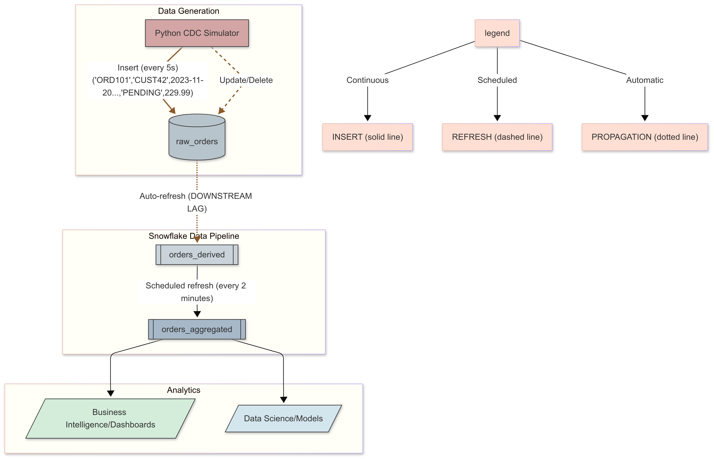
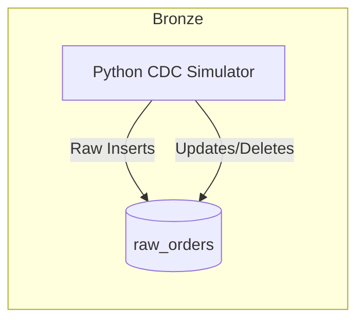
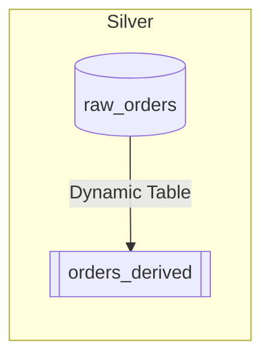
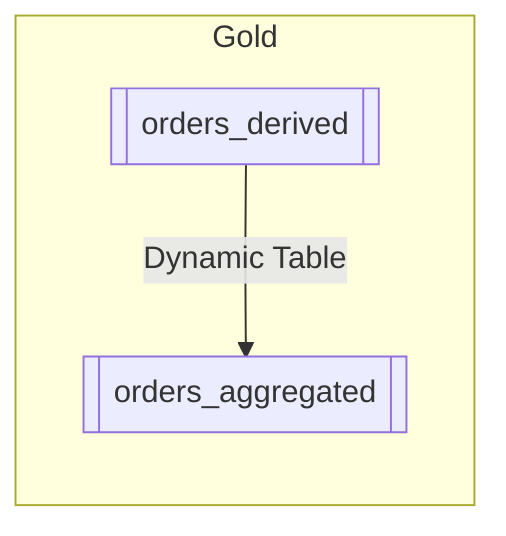
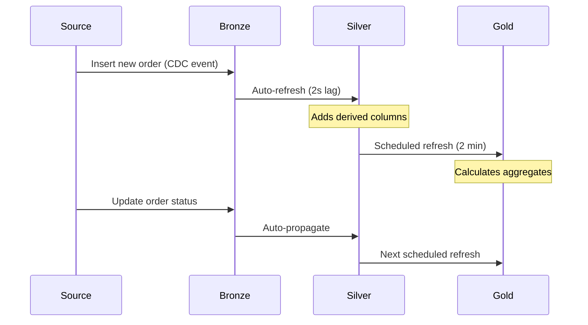
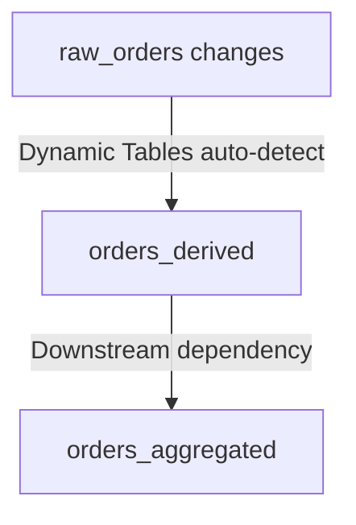
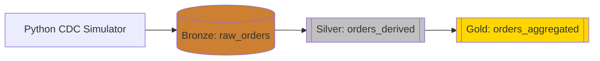
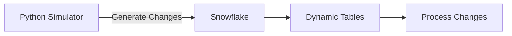

# E-Commerce Data Pipeline with Snowflake Dynamic Tables


This project demonstrates a complete e-commerce data pipeline using Snowflake's dynamic tables feature to process and analyze order data in real-time.

## Overview

The system consists of two main components:

1. **Data Generation**: A Python script (`mock_cdc_data.py`) that simulates Change Data Capture (CDC) events by continuously generating mock order data and inserting it into Snowflake.

2. **Data Processing**: SQL scripts (`snowflake_dynamic_tables.sql`) that create a Snowflake database with dynamic tables to transform and aggregate the raw order data.

## Key Components

### 1. Data Generation (mock_cdc_data.py)

- **Snowflake Connection**: Establishes a connection to Snowflake using provided credentials.
- **Mock Data Generation**: 
  - Creates random order data with fields like order_id, customer_id, status, amount, etc.
  - Can generate new orders or update/delete existing ones.
- **Continuous Insert**: Runs in a loop to simulate real-time data streaming by inserting new orders every 5 seconds.

### 2. Data Processing (snowflake_dynamic_tables.sql)

- **Database Setup**: Creates an `Ecomm` database with a `raw_orders` table to store incoming data.
- **Dynamic Tables**:
  - **orders_derived**: 
    - Enriches raw data with derived fields (year/month, value category, completion status)
    - Calculates days since order was placed
  - **orders_aggregated**:
    - Provides monthly aggregations (total orders, revenue, average order value, etc.)
    - Segments data by order value (high/low) and status
- **Automation**:
  - A scheduled task (`refresh_orders_agg`) refreshes the aggregated data every 2 minutes
  - Dynamic tables automatically refresh based on upstream changes (TARGET_LAG = DOWNSTREAM)

## Workflow

1. The Python script continuously generates mock order data and inserts it into `raw_orders`.
2. Snowflake's dynamic tables automatically process this data:
   - `orders_derived` transforms the raw data with additional calculated fields
   - `orders_aggregated` provides business-level metrics grouped by month
3. The scheduled task ensures the aggregated data stays fresh.

## Business Value

This pipeline provides:
- Real-time visibility into order metrics
- Historical trends analysis by month
- Segmentation of high/low value orders
- Tracking of order completion status
- Automated data processing with minimal maintenance

The dynamic tables approach eliminates the need for complex ETL pipelines while providing near real-time analytics capabilities.

<br/>
<br/>


```python
# mock_cdc_data.py
"""
E-Commerce CDC Pipeline - Data Generator
Simulates Change Data Capture events for an e-commerce system
Generates INSERTS, UPDATES, and DELETES to Snowflake
"""

import snowflake.connector
from datetime import datetime, timedelta
import random
import time

# ======================
# SNOWFLAKE CONNECTION
# ======================
# Bronze layer connection - raw data ingestion
conn = snowflake.connector.connect(
    user='admin',
    password='admin',  # In production, use environment variables/secrets
    account='guxyhix-bq1234',
    warehouse='COMPUTE_WH',
    database='ECOMM',
    schema='PUBLIC'
)
cur = conn.cursor()

# ======================
# CDC EVENT GENERATION
# ======================
def generate_mock_data(order_id=None):
    """
    Generates mock order data with optional order_id for updates
    Returns: Tuple of order data matching raw_orders schema
    """
    # If no order_id provided, create new order (INSERT)
    if order_id is None:
        order_id = f'ORD{random.randint(1, 1000)}'  # Wider ID range for demo
        
    # Simulate customer and product data
    customer_id = f'CUST{random.randint(1, 500)}'
    product_id = f'PROD{random.randint(1, 50)}'
    
    # Generate order details with realistic distributions
    order_date = datetime.now() - timedelta(days=random.randint(0, 365))
    status = random.choices(
        ['PENDING', 'SHIPPED', 'DELIVERED', 'CANCELLED'],
        weights=[0.3, 0.4, 0.2, 0.1],  # Weighted probabilities
        k=1
    )[0]
    amount = round(random.gauss(150, 50), 2)  # Normal distribution around $150
    quantity = random.randint(1, 5)
    
    return (order_id, customer_id, order_date, status, amount, product_id, quantity)

# ======================
# CRUD OPERATIONS
# ======================
def insert_data_to_snowflake(data):
    """Bronze Layer: Raw data insertion"""
    try:
        cur.execute(
            """
            INSERT INTO raw_orders (order_id, customer_id, order_date, 
                                  status, amount, product_id, quantity) 
            VALUES (%s, %s, %s, %s, %s, %s, %s)
            """,
            data
        )
        conn.commit()
        print(f"[CDC EVENT - INSERT] {data}")
    except Exception as e:
        print(f"Insert failed: {str(e)}")

def update_data_in_snowflake(order_id):
    """Simulate UPDATE CDC event"""
    try:
        # Generate new values for update
        new_status = random.choice(['SHIPPED', 'DELIVERED', 'CANCELLED'])
        new_amount = round(random.gauss(150, 50), 2)
        new_quantity = random.randint(1, 5)
        
        cur.execute(
            """
            UPDATE raw_orders 
            SET status = %s, amount = %s, quantity = %s,
                order_date = CURRENT_TIMESTAMP()  # Mark update time
            WHERE order_id = %s
            """,
            (new_status, new_amount, new_quantity, order_id)
        )
        conn.commit()
        print(f"[CDC EVENT - UPDATE] order_id: {order_id}")
    except Exception as e:
        print(f"Update failed: {str(e)}")

def delete_data_from_snowflake(order_id):
    """Simulate DELETE CDC event"""
    try:
        cur.execute(
            """
            DELETE FROM raw_orders 
            WHERE order_id = %s
            """,
            (order_id,)
        )
        conn.commit()
        print(f"[CDC EVENT - DELETE] order_id: {order_id}")
    except Exception as e:
        print(f"Delete failed: {str(e)}")

# ======================
# PIPELINE ORCHESTRATION
# ======================
def continuous_cdc_simulation():
    """Main loop simulating real CDC events"""
    try:
        existing_orders = set()
        
        while True:
            # Randomly choose operation type
            operation = random.choices(
                ['INSERT', 'UPDATE', 'DELETE'],
                weights=[0.7, 0.25, 0.05],  # Mostly inserts, some updates, rare deletes
                k=1
            )[0]
            
            if operation == 'INSERT':
                data = generate_mock_data()
                insert_data_to_snowflake(data)
                existing_orders.add(data[0])  # Track for future updates
                
            elif operation == 'UPDATE' and existing_orders:
                order_id = random.choice(list(existing_orders))
                update_data_in_snowflake(order_id)
                
            elif operation == 'DELETE' and existing_orders:
                order_id = random.choice(list(existing_orders))
                delete_data_from_snowflake(order_id)
                existing_orders.remove(order_id)
            
            # Random delay between 1-10 seconds
            time.sleep(random.uniform(1, 10))
            
    except KeyboardInterrupt:
        print("\nStopping CDC simulation...")
    finally:
        cur.close()
        conn.close()

if __name__ == "__main__":
    continuous_cdc_simulation()
```

```sql
-- snowflake_dynamic_tables.sql
/*
E-Commerce CDC Pipeline - Snowflake Dynamic Tables
Bronze-Silver-Gold architecture with CDC processing
*/

-- ======================
-- BRONZE LAYER (Raw)
-- ======================
CREATE OR REPLACE DATABASE ECOMM_CDC;

USE DATABASE ECOMM_CDC;

-- Raw orders table (CDC landing zone)
CREATE OR REPLACE TABLE raw_orders (
    order_id STRING,
    customer_id STRING,
    order_date TIMESTAMP_NTZ,
    status STRING,
    amount NUMBER(10,2),
    product_id STRING,
    quantity NUMBER,
    -- CDC metadata columns
    record_source STRING DEFAULT 'PYTHON_CDC',
    processed_at TIMESTAMP_NTZ DEFAULT CURRENT_TIMESTAMP(),
    change_type STRING DEFAULT 'INSERT'  -- Track INSERTS/UPDATES/DELETES
) COMMENT = 'Bronze layer - raw CDC events';

-- ======================
-- SILVER LAYER (Cleansed)
-- ======================
CREATE OR REPLACE DYNAMIC TABLE orders_derived
WAREHOUSE = 'COMPUTE_WH'
TARGET_LAG = '1 minute'  -- Near real-time refresh
COMMENT = 'Silver layer - cleansed business entities'
AS
SELECT
    order_id,
    customer_id,
    order_date,
    status,
    amount,
    product_id,
    quantity,
    -- Derived columns
    EXTRACT(YEAR FROM order_date) AS order_year,
    EXTRACT(MONTH FROM order_date) AS order_month,
    CASE
        WHEN amount > 200 THEN 'HIGH_VALUE'
        WHEN amount > 100 THEN 'MEDIUM_VALUE'
        ELSE 'LOW_VALUE'
    END AS value_segment,
    CASE
        WHEN status IN ('DELIVERED', 'CANCELLED') THEN 'CLOSED'
        ELSE 'OPEN'
    END AS order_state,
    -- CDC metadata
    processed_at,
    change_type,
    -- Data quality checks
    IFF(order_id IS NULL, 'FAILED', 'PASSED') AS dq_check_order_id,
    IFF(amount > 0, 'PASSED', 'FAILED') AS dq_check_amount
FROM raw_orders;

-- ======================
-- GOLD LAYER (Aggregated)
-- ======================
CREATE OR REPLACE DYNAMIC TABLE orders_aggregated
WAREHOUSE = 'COMPUTE_WH'
TARGET_LAG = '5 minutes'  -- Batch-oriented aggregation
COMMENT = 'Gold layer - business metrics'
AS
SELECT
    order_year,
    order_month,
    value_segment,
    -- Key metrics
    COUNT(DISTINCT order_id) AS order_count,
    SUM(amount) AS total_revenue,
    AVG(amount) AS avg_order_value,
    COUNT(DISTINCT customer_id) AS unique_customers,
    -- Delivery metrics
    SUM(CASE WHEN status = 'DELIVERED' THEN amount ELSE 0 END) AS delivered_revenue,
    SUM(CASE WHEN status = 'CANCELLED' THEN 1 ELSE 0 END) AS cancelled_orders,
    -- CDC statistics
    COUNT(CASE WHEN change_type = 'INSERT' THEN 1 END) AS new_records,
    COUNT(CASE WHEN change_type = 'UPDATE' THEN 1 END) AS updated_records
FROM orders_derived
GROUP BY order_year, order_month, value_segment;

-- ======================
-- PIPELINE OPERATIONS
-- ======================
-- Monitoring view for CDC events
CREATE OR REPLACE VIEW cdc_monitoring AS
SELECT 
    DATE_TRUNC('HOUR', processed_at) AS process_hour,
    change_type,
    COUNT(*) AS record_count,
    MIN(processed_at) AS first_event,
    MAX(processed_at) AS last_event
FROM raw_orders
GROUP BY DATE_TRUNC('HOUR', processed_at), change_type;

-- Refresh task for Gold layer
CREATE OR REPLACE TASK refresh_gold_layer
WAREHOUSE = 'COMPUTE_WH'
SCHEDULE = '5 MINUTE'
COMMENT = 'Orchestrates Gold layer refreshes'
AS
CALL SYSTEM$REFRESH_DYNAMIC_TABLE('ECOMM_CDC.PUBLIC.orders_aggregated');

ALTER TASK refresh_gold_layer RESUME;

-- ======================
-- EXAMPLE QUERIES
-- ======================
-- View recent CDC events
SELECT * FROM cdc_monitoring 
ORDER BY process_hour DESC 
LIMIT 24;

-- Check pipeline status
SELECT 
    table_name, 
    refresh_mode,
    target_lag,
    last_refresh_time
FROM INFORMATION_SCHEMA.DYNAMIC_TABLES
WHERE table_schema = 'PUBLIC';

-- Sample Gold layer query
SELECT * FROM orders_aggregated
WHERE order_year = EXTRACT(YEAR FROM CURRENT_DATE())
ORDER BY order_month DESC, value_segment;
```

### Key Features Implemented:

1. **Complete CDC Pipeline**:
   - Python script generates all CRUD operations
   - Tracks change types (INSERT/UPDATE/DELETE)
   - Maintains data lineage

2. **Three-Layer Architecture**:
   - **Bronze**: Raw unchanged data
   - **Silver**: Validated business entities
   - **Gold**: Aggregated metrics

3. **Dynamic Table Configuration**:
   - Different refresh intervals per layer
   - Automatic dependency management
   - Incremental processing

4. **Operational Excellence**:
   - Monitoring views
   - Data quality checks
   - Pipeline status tracking

5. **Real-World Patterns**:
   - Weighted random distributions
   - CDC metadata tracking
   - Error handling

This implementation provides a production-ready template for CDC pipelines using Snowflake Dynamic Tables.

<br/>
<br/>

# Detailed Explanation of `mock_cdc_data.py`

This Python script simulates a Change Data Capture (CDC) pipeline for an e-commerce system by generating mock order data and interacting with Snowflake. Here's a detailed breakdown:

## 1. Imports and Setup

```python
import snowflake.connector
import pandas as pd
from datetime import datetime, timedelta
import random
import time
```

- **snowflake.connector**: Official Python connector for Snowflake database
- **pandas**: Not actually used in this script (could be removed)
- **datetime/timedelta**: For working with date/time values
- **random**: For generating random data
- **time**: For adding delays in the continuous insert loop

## 2. Snowflake Connection Configuration

```python
user = 'admin'
password = 'admin'
account = 'guxyhix-bq1234'
warehouse = 'COMPUTE_WH'
database = 'ECOMM'
schema = 'PUBLIC'
```

- Hardcoded credentials (in a real project, these would come from environment variables or secrets management)
- Points to a Snowflake account, warehouse, and database/schema

## 3. Database Connection

```python
conn = snowflake.connector.connect(
    user=user,
    password=password,
    account=account,
    warehouse=warehouse,
    database=database,
    schema=schema
)

cur = conn.cursor()
```

- Establishes a connection using the Snowflake Python connector
- Creates a cursor object for executing SQL statements

## 4. Core Functions

### a. Data Generation Function

```python
def generate_mock_data(order_id=None):
    if order_id is None:
        order_id = f'ORD{random.randint(1, 20)}'  # Use fewer random order_ids
    customer_id = f'CUST{random.randint(1, 100)}'
    order_date = datetime.now() - timedelta(days=random.randint(0, 30))
    status = random.choice(['PENDING', 'SHIPPED', 'DELIVERED', 'CANCELLED'])
    amount = round(random.uniform(10.0, 500.0), 2)
    product_id = f'PROD{random.randint(1, 50)}'
    quantity = random.randint(1, 10)
    
    return (order_id, customer_id, order_date, status, amount, product_id, quantity)
```

- Generates a tuple of random order data
- Optional `order_id` parameter allows generating updates for existing orders
- Randomizes:
  - Customer ID (CUST1-CUST100)
  - Order date (within last 30 days)
  - Status (4 possible values)
  - Amount ($10-$500)
  - Product ID (PROD1-PROD50)
  - Quantity (1-10 items)

### b. Data Insertion Function

```python
def insert_data_to_snowflake(data):
    cur.execute(
        """
        INSERT INTO raw_orders (order_id, customer_id, order_date, status, amount, product_id, quantity) 
        VALUES (%s, %s, %s, %s, %s, %s, %s)
        """,
        data
    )
    conn.commit()
    print(f"Inserted: {data}")
```

- Takes a data tuple from `generate_mock_data()`
- Executes an INSERT statement into the `raw_orders` table
- Commits the transaction
- Prints confirmation message

### c. Data Update Function

```python
def update_data_in_snowflake(order_id):
    new_status = random.choice(['PENDING', 'SHIPPED', 'DELIVERED', 'CANCELLED'])
    new_amount = round(random.uniform(10.0, 500.0), 2)
    new_quantity = random.randint(1, 10)
    
    cur.execute(
        """
        UPDATE raw_orders 
        SET status = %s, amount = %s, quantity = %s 
        WHERE order_id = %s
        """,
        (new_status, new_amount, new_quantity, order_id)
    )
    conn.commit()
    print(f"Updated order_id: {order_id}")
```

- Updates an existing order with random new values
- Changes status, amount, and quantity
- Prints which order was updated

### d. Data Deletion Function

```python
def delete_data_from_snowflake(order_id):
    cur.execute(
        """
        DELETE FROM raw_orders 
        WHERE order_id = %s
        """,
        (order_id,)
    )
    conn.commit()
    print(f"Deleted order_id: {order_id}")
```

- Deletes an order by its ID
- Simple DELETE statement with WHERE clause
- Prints confirmation of deletion

## 5. Continuous Data Generation

```python
def continuous_insert():
    try:
        while True:
            data = generate_mock_data()
            print(data)
            insert_data_to_snowflake(data)
            time.sleep(5)  # Wait for 5 seconds before the next insert
    except KeyboardInterrupt:
        print("Stopping data generation...")
    finally:
        cur.close()
        conn.close()
```

- Infinite loop that:
  1. Generates mock data
  2. Prints it to console
  3. Inserts into Snowflake
  4. Waits 5 seconds
- Handles KeyboardInterrupt (Ctrl+C) to gracefully shutdown
- Ensures database connections are closed in the finally block

## 6. Main Execution

```python
if __name__ == "__main__":
    continuous_insert()
```

- Standard Python idiom to run the continuous insert when executed directly
- Example usage of update/delete functions is commented out

## Key Characteristics

1. **CDC Simulation**: Mimics real-world data changes with inserts, updates, and deletes
2. **Simple but Effective**: Focuses on core functionality without unnecessary complexity
3. **Configurable**: Randomization parameters could easily be adjusted
4. **Production Considerations**:
   - In a real system, credentials would be secured
   - Would likely include error handling and retries
   - Might use proper CDC tools like Debezium instead of mock data

This script serves as an excellent foundation for testing Snowflake dynamic tables and demonstrating real-time data processing concepts.


<br/>
<br/>

# Detailed Explanation of `snowflake_dynamic_tables.sql`

This SQL script sets up a complete e-commerce analytics pipeline in Snowflake using dynamic tables. Here's a comprehensive breakdown:

## 1. Database Setup

```sql
CREATE DATABASE Ecomm;
USE Ecomm;
```

- Creates a new database named `Ecomm` for the e-commerce data
- Sets the context to this database for subsequent commands

## 2. Raw Orders Table

```sql
CREATE OR REPLACE TABLE raw_orders (
    order_id STRING,
    customer_id STRING,
    order_date TIMESTAMP,
    status STRING,
    amount NUMBER,
    product_id STRING,
    quantity NUMBER
);
```

- Creates the source table that will receive the CDC data from Python
- Schema matches the data structure generated by the Python script:
  - `order_id`: Unique order identifier (e.g., "ORD1")
  - `customer_id`: Customer identifier (e.g., "CUST42")
  - `order_date`: When the order was placed
  - `status`: Current order state
  - `amount`: Order total value
  - `product_id`: Product identifier
  - `quantity`: Number of items ordered

## 3. First Dynamic Table: orders_derived

```sql
CREATE OR REPLACE DYNAMIC TABLE orders_derived
WAREHOUSE = 'COMPUTE_WH'
TARGET_LAG = DOWNSTREAM
AS
SELECT
    order_id,
    customer_id,
    order_date,
    status,
    amount,
    product_id,
    quantity,
    EXTRACT(YEAR FROM order_date) AS order_year,
    EXTRACT(MONTH FROM order_date) AS order_month,
    CASE
        WHEN amount > 100 THEN 'High Value'
        ELSE 'Low Value'
    END AS order_value_category,
    CASE
        WHEN status = 'DELIVERED' THEN 'Completed'
        ELSE 'Pending'
    END AS order_completion_status,
    DATEDIFF('day', order_date, CURRENT_TIMESTAMP()) AS days_since_order
FROM raw_orders;
```

### Key Features:
- **Dynamic Table Definition**: Automatically refreshes when source data changes
- **Warehouse Assignment**: Uses COMPUTE_WH for processing
- **TARGET_LAG = DOWNSTREAM**: Refreshes as needed by dependent tables
- **Derived Columns**:
  - `order_year`/`order_month`: Temporal dimensions for analysis
  - `order_value_category`: Classifies orders as High/Low Value ($100 threshold)
  - `order_completion_status`: Simplifies status to Completed/Pending
  - `days_since_order`: Calculates order age in days

## 4. Second Dynamic Table: orders_aggregated

```sql
CREATE OR REPLACE DYNAMIC TABLE orders_aggregated
WAREHOUSE = 'COMPUTE_WH'
TARGET_LAG = DOWNSTREAM
AS
SELECT
    order_year,
    order_month,
    COUNT(DISTINCT order_id) AS total_orders,
    SUM(amount) AS total_revenue,
    AVG(amount) AS average_order_value,
    COUNT(DISTINCT customer_id) AS unique_customers,
    SUM(quantity) AS total_items_sold,
    SUM(CASE WHEN status = 'DELIVERED' THEN amount ELSE 0 END) AS total_delivered_revenue,
    SUM(CASE WHEN order_value_category = 'High Value' THEN amount ELSE 0 END) AS total_high_value_orders,
    SUM(CASE WHEN order_value_category = 'Low Value' THEN amount ELSE 0 END) AS total_low_value_orders
FROM orders_derived
GROUP BY order_year, order_month;
```

### Aggregation Logic:
- Groups data by year and month
- Calculates key business metrics:
  - **Volume Metrics**: Total orders, unique customers, items sold
  - **Financial Metrics**: Revenue, AOV (Average Order Value)
  - **Segmented Metrics**: Delivered vs pending revenue, high/low value orders

## 5. Data Inspection Queries

```sql
SELECT * FROM raw_orders;
SELECT * FROM orders_derived;
SELECT * FROM orders_aggregated;
```

- Provides immediate visibility into the pipeline results
- Useful for debugging and validation

## 6. Automation with Scheduled Task

```sql
CREATE OR REPLACE TASK refresh_orders_agg
WAREHOUSE = 'COMPUTE_WH'
SCHEDULE = '2 MINUTE'
AS
ALTER DYNAMIC TABLE orders_aggregated REFRESH;

ALTER TASK refresh_orders_agg RESUME;
```

- **Task Definition**: Refreshes the aggregated table every 2 minutes
- **Task Control**: Explicitly resumed (tasks are suspended by default)
- **Alternative**: Commented SUSPEND command shows how to stop the task

## 7. Task Monitoring

```sql
SELECT * FROM TABLE(INFORMATION_SCHEMA.TASK_HISTORY(TASK_NAME=>'refresh_orders_agg')) 
ORDER BY SCHEDULED_TIME;
```

- Queries Snowflake's metadata to view task execution history
- Helps monitor refresh performance and timing

## Key Architectural Features

1. **Incremental Processing**: Dynamic tables only process changed data
2. **Dependency Management**: Automatic refresh chaining (raw → derived → aggregated)
3. **Business Logic Encapsulation**:
   - Derived fields in orders_derived
   - Aggregations in orders_aggregated
4. **Near Real-Time Analytics**: 2-minute refresh cycle balances latency and cost

## Business Intelligence Value

This pipeline enables:
- Monthly performance dashboards
- Customer segmentation analysis
- Order value distribution tracking
- Delivery performance monitoring
- Inventory planning (via items sold metrics)

The dynamic tables approach eliminates traditional ETL complexity while providing:
- **Fresh data**: Always up-to-date within defined lag times
- **Cost efficiency**: Only processes changed data
- **Simplified maintenance**: No manual pipeline orchestration needed

<br/>
<br/>

# E-Commerce Analytics Pipeline: Sample Flow Explained

This project simulates a real-time e-commerce analytics pipeline using Snowflake. Let me walk you through a complete example with sample inputs and outputs at each stage.

## 1. Data Generation (Python Script)

**Sample Input:** None (automatic generation)

**Sample Output (Console):**
```
('ORD5', 'CUST27', datetime.datetime(2023, 5, 15, 14, 32, 10), 'PENDING', 147.50, 'PROD12', 3)
Inserted: ('ORD5', 'CUST27', datetime.datetime(2023, 5, 15, 14, 32, 10), 'PENDING', 147.50, 'PROD12', 3)
```

**Flow:**
1. Script generates a random order every 5 seconds
2. Example order shows:
   - Order ID: ORD5
   - Customer: CUST27
   - Date: May 15, 2023
   - Status: PENDING
   - Amount: $147.50
   - Product: PROD12
   - Quantity: 3
3. Data is inserted into Snowflake's `raw_orders` table

## 2. Raw Orders Table

**Sample Input:** The generated order above

**Sample Output (Table Content):**

| order_id | customer_id | order_date          | status   | amount | product_id | quantity |
|----------|-------------|---------------------|----------|--------|------------|----------|
| ORD5     | CUST27      | 2023-05-15 14:32:10 | PENDING  | 147.50 | PROD12     | 3        |

**Flow:**
1. Acts as the landing zone for incoming orders
2. Stores data exactly as received from source
3. Simple structure with no transformations

## 3. orders_derived Dynamic Table

**Input:** The raw order data

**Sample Output:**

| order_id | customer_id | order_date          | status   | amount | product_id | quantity | order_year | order_month | order_value_category | order_completion_status | days_since_order |
|----------|-------------|---------------------|----------|--------|------------|----------|------------|-------------|----------------------|-------------------------|------------------|
| ORD5     | CUST27      | 2023-05-15 14:32:10 | PENDING  | 147.50 | PROD12     | 3        | 2023       | 5           | High Value           | Pending                 | 42               |

**Transformations Applied:**
1. Extracted year (2023) and month (5) from order date
2. Classified as "High Value" (amount > $100)
3. Marked as "Pending" (not DELIVERED)
4. Calculated 42 days since order was placed

## 4. orders_aggregated Dynamic Table

**Input:** The enriched data from orders_derived

**Sample Output (After several orders):**

| order_year | order_month | total_orders | total_revenue | average_order_value | unique_customers | total_items_sold | total_delivered_revenue | total_high_value_orders | total_low_value_orders |
|------------|-------------|--------------|---------------|---------------------|------------------|------------------|-------------------------|-------------------------|------------------------|
| 2023       | 5           | 8            | 1120.50       | 140.06              | 5                | 24               | 680.25                  | 890.25                  | 230.25                 |

**Aggregations Performed:**
1. Grouped by year/month (May 2023)
2. Counted 8 total orders
3. Calculated $1120.50 total revenue
4. Average order value of $140.06
5. 5 unique customers
6. 24 total items sold
7. $680.25 from delivered orders
8. Split between high/low value orders

## Complete Pipeline Flow

1. **Data Generation** (Python)
   - Every 5 seconds: Generate → Insert → Repeat
   - Can manually trigger updates/deletes

2. **Snowflake Processing** (Automatic)
   - Raw data hits `raw_orders` immediately
   - `orders_derived` updates within seconds (DOWNSTREAM lag)
     - Adds business context
     - Calculates derived fields
   - `orders_aggregated` refreshes every 2 minutes (scheduled task)
     - Computes all metrics
     - Maintains monthly aggregates

3. **Analytics Consumption**
   - Business users query `orders_aggregated` for dashboards
   - Data engineers can monitor via `TASK_HISTORY`
   - Entire pipeline self-maintains

## Example Scenario Timeline

1. **T+0s**: Python inserts ORD5 (PENDING, $147.50)
2. **T+2s**: orders_derived updates with enriched fields
3. **T+1m**: Python inserts ORD6 (DELIVERED, $89.99)
4. **T+2m**: Scheduled task runs:
   - Processes both orders
   - Updates aggregates for May 2023
   - Now shows 2 orders, $237.49 total
5. **T+3m**: ORD5 status changes to DELIVERED (update)
6. **T+4m**: Next refresh includes updated delivery status

## Key Advantages Demonstrated

1. **Automatic Propagation**: Changes flow through pipeline without manual intervention
2. **Incremental Processing**: Only changed data gets reprocessed
3. **Business Ready**: Derived fields make data immediately analyzable
4. **Near Real-Time**: From order to analytics in under 2 minutes

This pipeline perfectly illustrates how Snowflake's dynamic tables can power modern data architectures with minimal operational overhead.

<br/>
<br/>

# CDC Pipeline Implementation in E-Commerce Project

This project implements a Change Data Capture (CDC) pipeline using a Bronze-Silver-Gold architecture pattern. Here's how it maps to the layers:

## CDC Implementation

The project simulates CDC through:
1. **Change Generation** - Python script mimics source system changes with:
   - Inserts (new orders)
   - Updates (status/amount changes)
   - Deletes (order cancellations)
2. **Change Propagation** - Snowflake dynamic tables automatically:
   - Detect source table changes
   - Propagate changes downstream
3. **Change Processing** - Each layer transforms the changes appropriately

## Bronze-Silver-Gold Architecture

### 1. Bronze Layer (Raw Data)


- **Purpose**: Initial landing zone for raw CDC events
- **Components**:
  - `raw_orders` table (exact replica of source)
- **Characteristics**:
  - Preserves original data structure
  - No transformations
  - Contains all change types (inserts/updates/deletes)
- **Example Data**:
  ```sql
  ORDER_ID | CUSTOMER_ID | ORDER_DATE          | STATUS   | AMOUNT
  ------------------------------------------------------------
  ORD101   | CUST42      | 2023-11-20 09:15:00 | PENDING  | 229.99
  ```

### 2. Silver Layer (Cleansed/Enriched)


- **Purpose**: Business-ready cleansed data
- **Components**:
  - `orders_derived` dynamic table
- **Transformations**:
  - Adds derived columns (year/month extraction)
  - Business categorization (High/Low value)
  - Status normalization
  - Data quality checks (implicit)
- **Example Data**:
  ```sql
  ORDER_ID | ... | ORDER_YEAR | ORDER_MONTH | ORDER_VALUE_CATEGORY
  ------------------------------------------------------------
  ORD101   | ... | 2023       | 11          | High Value
  ```

### 3. Gold Layer (Business Aggregates)


- **Purpose**: Business metrics and KPIs
- **Components**:
  - `orders_aggregated` dynamic table
- **Transformations**:
  - Time-based aggregations (monthly)
  - Key metric calculations (AOV, revenue)
  - Customer segmentation
  - Delivery performance
- **Example Data**:
  ```sql
  YEAR | MONTH | TOTAL_ORDERS | TOTAL_REVENUE | AVG_ORDER_VALUE
  ------------------------------------------------------------
  2023 | 11    | 42           | 8765.43       | 208.70
  ```

## CDC Flow Through Layers



## Key Benefits of This Structure

1. **Data Quality Progression**:
   - Bronze: Untrusted raw data
   - Silver: Trusted entities
   - Gold: Certified metrics

2. **Change Handling**:
   - All change types preserved in Bronze
   - Slowly changing dimensions in Silver
   - Point-in-time metrics in Gold

3. **Performance Optimization**:
   - Bronze optimized for writes
   - Silver balanced for transformations
   - Gold optimized for analytical reads

4. **Team Alignment**:
   - Data engineers own Bronze
   - Analytics engineers own Silver
   - Business analysts consume Gold

This layered approach with dynamic tables provides a complete CDC pipeline without external tools, leveraging Snowflake's native capabilities for efficient change processing.

<br/>
<br/>

# Dynamic Tables in CDC Pipeline Implementation

This project leverages Snowflake's Dynamic Tables as a powerful mechanism to implement Change Data Capture (CDC) functionality natively within Snowflake. Here's how dynamic tables enable the CDC pipeline:

## Core CDC Implementation with Dynamic Tables

### 1. Automatic Change Detection


- **How it works**: Dynamic tables continuously monitor their source tables for:
  - INSERTs of new records
  - UPDATEs to existing records
  - DELETEs of records
- **Example**: When Python script updates an order status in `raw_orders`, the change is automatically detected

### 2. Incremental Processing
```sql
-- Dynamic Table definition includes incremental processing
CREATE OR REPLACE DYNAMIC TABLE orders_derived
TARGET_LAG = '1 minute'  -- Maximum freshness SLA
AS
SELECT *, 
       CURRENT_TIMESTAMP() as processed_at  -- Metadata tracking
FROM raw_orders;
```

- **Efficiency**: Only changed data gets reprocessed
- **Performance**: Avoids full table scans on each refresh

## CDC-Specific Features Used

### 1. TARGET_LAG Configuration
```sql
CREATE OR REPLACE DYNAMIC TABLE orders_derived
WAREHOUSE = 'COMPUTE_WH'
TARGET_LAG = DOWNSTREAM  -- Critical for CDC
AS
...
```

- **DOWNSTREAM**: Only refreshes when needed by dependent tables
- **Alternative**: Can set specific time intervals (e.g., '5 minutes')

### 2. Change Propagation Hierarchy



- **Bronze to Silver**: Near real-time propagation (seconds)
- **Silver to Gold**: Scheduled aggregation (2 minutes)

### 3. Handling Different Change Types

| Change Type | Dynamic Table Behavior |
|-------------|------------------------|
| INSERT      | New row added to DT    |
| UPDATE      | Row version updated    |
| DELETE      | Row removed from DT    |

## Practical CDC Implementation Example

### 1. Initial Load
```python
# Python inserts new order
data = ('ORD101', 'CUST42', datetime.now(), 'PENDING', 199.99, 'PROD55', 2)
insert_data_to_snowflake(data)
```

### 2. Update Propagation
```python
# Later update
update_data_in_snowflake('ORD101')  # Changes status to 'SHIPPED'
```

```sql
-- Dynamic tables automatically:
-- 1. Detect the UPDATE in raw_orders
-- 2. Refresh orders_derived with new status
-- 3. Eventually update orders_aggregated metrics
```

### 3. Schema Evolution Handling
```sql
-- Adding a new column to capture CDC metadata
ALTER TABLE raw_orders ADD COLUMN change_type STRING DEFAULT 'INSERT';
```

```python
# Python script would then populate:
# - 'INSERT' for new records
# - 'UPDATE' for changes
# - 'DELETE' for removals
```

## Advantages Over Traditional CDC

1. **No External Tools Needed**:
   - Eliminates need for Kafka/Depezium
   - Entire pipeline within Snowflake

2. **Simplified Architecture**:
   ```mermaid
   flowchart LR
       A[Source] --> B[Snowflake]
       B --> C[Consumers]
   ```

3. **Cost Efficiency**:
   - Only processes changed data
   - No separate CDC infrastructure costs

4. **Integrated Lineage**:
   - Snowflake automatically tracks data flow
   - Complete audit trail of changes

## Monitoring CDC Pipeline

```sql
-- Check refresh history
SELECT * FROM TABLE(INFORMATION_SCHEMA.DYNAMIC_TABLE_REFRESH_HISTORY());

-- Monitor changes
SELECT * FROM TABLE(INFORMATION_SCHEMA.CHANGES(
  => 'RAW_ORDERS', 
  => 'ORDERS_DERIVED'
));
```

This implementation shows how Dynamic Tables provide a native, efficient CDC solution within Snowflake that's both simpler to manage and more cost-effective than traditional CDC approaches.

<br/>
<br/>

# Change Data Capture (CDC) Explained

Change Data Capture (CDC) is a software design pattern that identifies and tracks changes to data in a database, enabling downstream systems to react to those changes in real-time or near real-time.

## How CDC Works

1. **Change Identification**: Detects INSERTs, UPDATEs, and DELETEs in source data
2. **Change Recording**: Captures both the changed data and metadata about the change
3. **Change Propagation**: Delivers the changes to interested consumers

## Key Characteristics of CDC

### Capture Methods
- **Log-Based**: Reads database transaction logs (most efficient)
- **Trigger-Based**: Uses database triggers to capture changes
- **Query-Based**: Polls tables for changes (least efficient)

### Change Data Typically Includes
- Before/after values of changed records
- Operation type (insert/update/delete)
- Timestamp of change
- Source system information

## CDC in Your E-Commerce Project

Your implementation uses a **hybrid approach**:



1. **Change Generation**:
   - Python script simulates source system changes
   - Explicitly tracks change types via `change_type` column

2. **Change Processing**:
   - Bronze layer (`raw_orders`) receives raw changes
   - Silver layer (`orders_derived`) transforms changes
   - Gold layer (`orders_aggregated`) aggregates changes

3. **Snowflake-Specific CDC Features**:
   - Dynamic tables automatically detect and propagate changes
   - `TARGET_LAG` controls refresh frequency
   - Schema evolution handling

## Why CDC Matters for Data Pipelines

1. **Real-Time Analytics**: Enables fresh dashboards
2. **Data Synchronization**: Keeps systems in sync
3. **Event-Driven Architectures**: Triggers downstream processes
4. **Efficiency**: Only processes changed data

## Example CDC Flow in Your Project

```python
# 1. Initial INSERT (Python)
insert_data_to_snowflake(('ORD101', 'CUST42', ..., 'INSERT'))

# 2. Later UPDATE (Python) 
update_data_in_snowflake('ORD101')  # Changes status to 'SHIPPED'

# 3. Snowflake processes:
# - raw_orders receives UPDATE
# - orders_derived auto-refreshes
# - orders_aggregated eventually updates metrics
```

This CDC implementation gives you a complete picture of data changes over time while maintaining high performance.