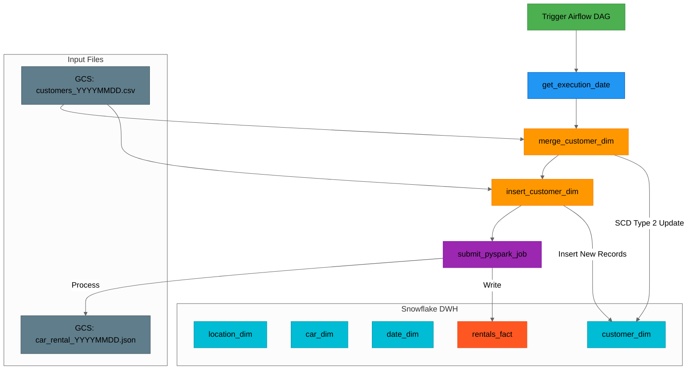
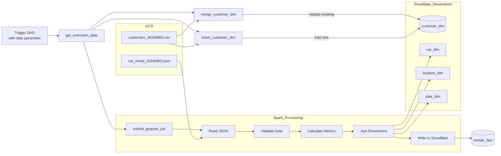
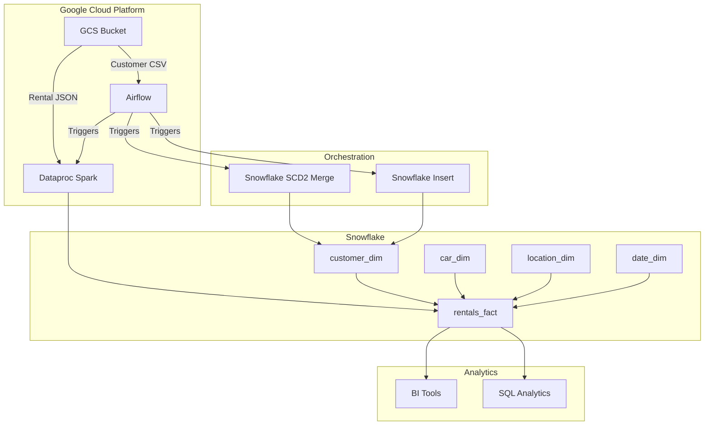
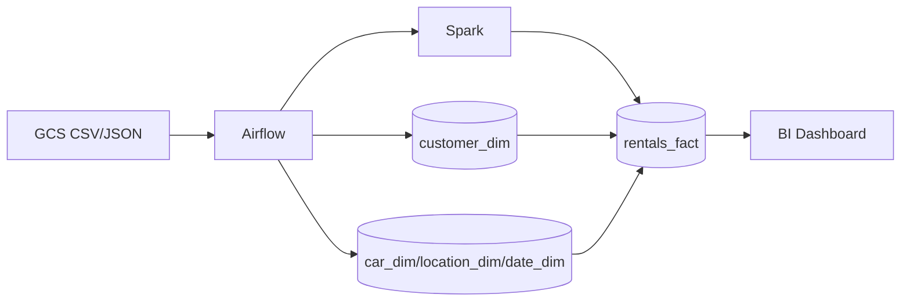
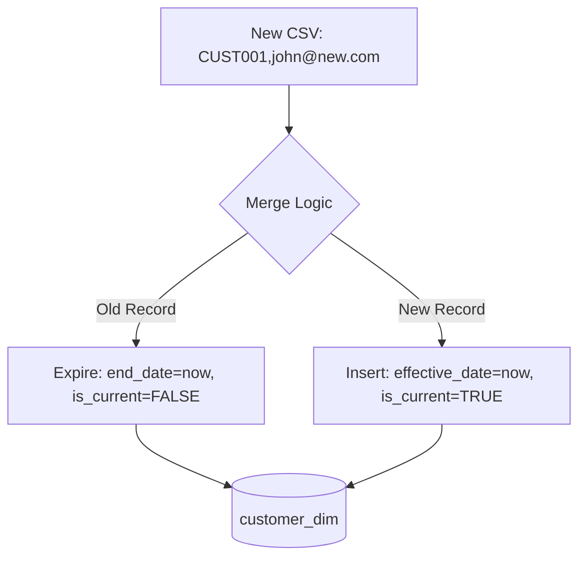

# Car Rental Data Pipeline Project Explanation

This project is a comprehensive data pipeline for a car rental company that processes customer and rental data, loads it into a Snowflake data warehouse, and performs analytics. Here's a breakdown of the components:

## 1. Data Sources

### Customer Data
- `customers_20240803.csv` and `customers_20240804.csv`: Daily snapshots of customer information including ID, name, email, and phone number. The second file shows some changes (new email for CUST001 and CUST003) and new customers (CUST011-CUST015).

### Rental Transaction Data
- `car_rental_20240803.json` and `car_rental_20240804.json`: Daily rental transaction records containing:
  - Rental details (ID, customer, dates, amount)
  - Car information (make, model, year)
  - Location information (pickup and dropoff)

## 2. Data Warehouse Setup (`snowflake_dwh_setup.sql`)

This script creates a Snowflake database with a star schema design:

### Dimension Tables
- **location_dim**: Stores rental locations (airports)
- **car_dim**: Stores car inventory information
- **date_dim**: Pre-populated date dimension for July 2024
- **customer_dim**: Slowly Changing Dimension (SCD) Type 2 table to track customer changes over time with effective/end dates

### Fact Table
- **rentals_fact**: Stores rental transactions with foreign keys to all dimensions

### Infrastructure
- Creates file formats and storage integration for loading data from Google Cloud Storage (GCS)

## 3. Data Processing (`spark_job.py`)

A PySpark job that:
1. Reads JSON rental data from GCS
2. Performs data validation and transformations:
   - Calculates rental duration in days
   - Computes total rental amount
   - Calculates average daily rental amount
   - Flags long rentals (>7 days)
3. Joins with dimension tables to get surrogate keys
4. Writes processed data to Snowflake fact table

## 4. Orchestration (`airflow_dag.py`)

An Airflow DAG that coordinates the ETL process:

1. **get_execution_date**: Determines the processing date
2. **merge_customer_dim**: Updates existing customer records (SCD Type 2) when changes are detected
3. **insert_customer_dim**: Inserts new customer records
4. **submit_pyspark_job**: Triggers the Spark job to process rental data

## Key Features

1. **Slowly Changing Dimensions (SCD)**: Tracks historical changes to customer data
2. **Data Validation**: Ensures data quality before processing
3. **Cloud-Native Architecture**: Uses GCS for storage, Dataproc for processing, Snowflake for analytics
4. **Automated Pipeline**: Airflow orchestrates the daily ETL process
5. **Star Schema**: Optimized for analytical queries

## Data Flow

1. Customer CSV files and rental JSON files land in GCS
2. Airflow DAG triggers:
   - Customer dimension updates in Snowflake
   - Spark job to process rental data
3. Spark job validates, transforms, and loads rental data to Snowflake
4. Data is now ready for analytics and reporting

This pipeline provides a foundation for analyzing rental patterns, customer behavior, revenue trends, and operational efficiency across locations.

Here are the separated versions of each file:

### 1. `airflow_dag.py`
```python
"""
Airflow DAG for Car Rental Data Pipeline
Orchestrates the ETL process for customer and rental data
"""

from datetime import datetime, timedelta
from airflow import DAG
from airflow.providers.google.cloud.operators.dataproc import DataprocSubmitPySparkJobOperator
from airflow.providers.snowflake.operators.snowflake import SnowflakeOperator
from airflow.operators.python import PythonOperator
from airflow.models.param import Param

# Default arguments for the DAG
default_args = {
    'owner': 'airflow',
    'depends_on_past': False,  # Doesn't depend on previous runs
    'email_on_failure': False,
    'email_on_retry': False,
    'retries': 1,  # Retry once if task fails
    'retry_delay': timedelta(minutes=5),  # 5 minute delay between retries
}

# Define the DAG
dag = DAG(
    'car_rental_data_pipeline',
    default_args=default_args,
    description='Car Rental Data Pipeline',
    schedule_interval=None,  # Manual trigger only
    start_date=datetime(2024, 8, 2),
    catchup=False,  # Don't backfill
    tags=['dev'],
    params={
        'execution_date': Param(
            default='NA',
            type='string',
            description='Execution date in yyyymmdd format'
        ),
    }
)

# Function to get execution date
def get_execution_date(ds_nodash, **kwargs):
    """
    Determines the processing date from either DAG parameters or Airflow context
    Returns: Execution date string (yyyymmdd)
    """
    execution_date = kwargs['params'].get('execution_date', 'NA')
    if execution_date == 'NA':
        execution_date = ds_nodash
    return execution_date

# Task to get execution date
get_execution_date_task = PythonOperator(
    task_id='get_execution_date',
    python_callable=get_execution_date,
    provide_context=True,
    op_kwargs={'ds_nodash': '{{ ds_nodash }}'},
    dag=dag,
)

# Task to update existing customer records (SCD Type 2)
merge_customer_dim = SnowflakeOperator(
    task_id='merge_customer_dim',
    snowflake_conn_id='snowflake_conn_v2',
    sql="""
        MERGE INTO customer_dim AS target
        USING (
            SELECT
                $1 AS customer_id,
                $2 AS name,
                $3 AS email,
                $4 AS phone
            FROM @car_rental_data_stage/customers_{{ ti.xcom_pull(task_ids='get_execution_date') }}.csv (FILE_FORMAT => 'csv_format')
        ) AS source
        ON target.customer_id = source.customer_id AND target.is_current = TRUE
        WHEN MATCHED AND (
            target.name != source.name OR
            target.email != source.email OR
            target.phone != source.phone
        ) THEN
            UPDATE SET target.end_date = CURRENT_TIMESTAMP(), target.is_current = FALSE;
    """,
    dag=dag,
)

# Task to insert new customer records
insert_customer_dim = SnowflakeOperator(
    task_id='insert_customer_dim',
    snowflake_conn_id='snowflake_conn_v2',
    sql="""
        INSERT INTO customer_dim (customer_id, name, email, phone, effective_date, end_date, is_current)
        SELECT
            $1 AS customer_id,
            $2 AS name,
            $3 AS email,
            $4 AS phone,
            CURRENT_TIMESTAMP() AS effective_date,
            NULL AS end_date,
            TRUE AS is_current
        FROM @car_rental_data_stage/customers_{{ ti.xcom_pull(task_ids='get_execution_date') }}.csv (FILE_FORMAT => 'csv_format');
    """,
    dag=dag,
)

# Configuration for Dataproc job
CLUSTER_NAME = 'hadoop-temp-1'
PROJECT_ID = 'mindful-pillar-426308-k1'
REGION = 'us-central1'
pyspark_job_file_path = 'gs://snowflake_projects/spark_job/spark_job.py'

# Task to submit PySpark job for rental data processing
submit_pyspark_job = DataprocSubmitPySparkJobOperator(
    task_id='submit_pyspark_job',
    main=pyspark_job_file_path,
    arguments=['--date={{ ti.xcom_pull(task_ids=\'get_execution_date\') }}'],
    cluster_name=CLUSTER_NAME,
    region=REGION,
    project_id=PROJECT_ID,
    dag=dag,
    dataproc_jars=[
        'gs://snowflake_projects/snowflake_jars/spark-snowflake_2.12-2.15.0-spark_3.4.jar',
        'gs://snowflake_projects/snowflake_jars/snowflake-jdbc-3.16.0.jar'
    ]
)

# Define task dependencies
get_execution_date_task >> merge_customer_dim >> insert_customer_dim >> submit_pyspark_job
```

### 2. `spark_job.py`
```python
"""
PySpark Job for Car Rental Data Processing
Processes daily rental data and loads to Snowflake data warehouse
"""

from pyspark.sql import SparkSession
from pyspark.sql.functions import col, lit, when, round
import argparse

def process_car_rental_data(data_date):
    """
    Main processing function for rental data
    Args:
        data_date: Processing date in yyyymmdd format
    """
    
    # Initialize Spark session with Snowflake support
    spark = SparkSession.builder \
        .appName("SnowflakeDataRead") \
        .config("spark.jars", "gs://snowflake_projects/snowflake_jars/spark-snowflake_2.12-2.15.0-spark_3.4.jar,gs://snowflake_projects/snowflake_jars/snowflake-jdbc-3.16.0.jar") \
        .getOrCreate()

    # Read raw JSON data from GCS
    gcs_file_path = f"gs://snowflake_projects/car_rental_data/car_rental_daily_data/car_rental_{data_date}.json"
    raw_df = spark.read.option("multiline", "true").json(gcs_file_path)

    # Data validation - filter out records with missing required fields
    validated_df = raw_df.filter(
        col("rental_id").isNotNull() & 
        col("customer_id").isNotNull() & 
        col("car.make").isNotNull() & 
        col("car.model").isNotNull() & 
        col("car.year").isNotNull() & 
        col("rental_period.start_date").isNotNull() & 
        col("rental_period.end_date").isNotNull() & 
        col("rental_location.pickup_location").isNotNull() & 
        col("rental_location.dropoff_location").isNotNull() & 
        col("amount").isNotNull() & 
        col("quantity").isNotNull()
    )

    # Calculate rental duration in days
    transformed_df = validated_df.withColumn(
        "rental_duration_days", 
        (col("rental_period.end_date").cast("date").cast("long") - 
        col("rental_period.start_date").cast("date").cast("long")).cast("int")
    )
    
    # Calculate derived financial metrics
    transformed_df = transformed_df.withColumn(
        "total_rental_amount", 
        col("amount") * col("quantity")
    ).withColumn(
        "average_daily_rental_amount", 
        round(col("total_rental_amount") / col("rental_duration_days"), 2)
    ).withColumn(
        "is_long_rental", 
        when(col("rental_duration_days") > 7, lit(1)).otherwise(lit(0))
    )

    # Snowflake connection configuration
    snowflake_options = {
        "sfURL": "https://yvdhix-vfg3873.snowflakecomputing.com",
        "sfAccount": "yvdhix-vfg3873",
        "sfUser": "admin",
        "sfPassword": "admin",
        "sfDatabase": "car_rental",
        "sfSchema": "PUBLIC",
        "sfWarehouse": "COMPUTE_WH",
        "sfRole": "ACCOUNTADMIN"
    }
    SNOWFLAKE_SOURCE_NAME = "snowflake"

    # Load dimension tables from Snowflake
    car_dim_df = spark.read \
        .format(SNOWFLAKE_SOURCE_NAME) \
        .options(**snowflake_options) \
        .option("dbtable", "car_dim") \
        .load()

    location_dim_df = spark.read \
        .format(SNOWFLAKE_SOURCE_NAME) \
        .options(**snowflake_options) \
        .option("dbtable", "location_dim") \
        .load()

    date_dim_df = spark.read \
        .format(SNOWFLAKE_SOURCE_NAME) \
        .options(**snowflake_options) \
        .option("dbtable", "date_dim") \
        .load()

    customer_dim_df = spark.read \
        .format(SNOWFLAKE_SOURCE_NAME) \
        .options(**snowflake_options) \
        .option("dbtable", "customer_dim") \
        .load()

    # Join with dimension tables to get surrogate keys
    # Join with car_dim first
    fact_df = transformed_df.alias("raw") \
        .join(car_dim_df.alias("car"), 
              (col("raw.car.make") == col("car.make")) & 
              (col("raw.car.model") == col("car.model")) & 
              (col("raw.car.year") == col("car.year"))
        ) \
        .select(
            col("raw.rental_id"),
            col("raw.customer_id"),
            col("car.car_key"),
            col("raw.rental_location.pickup_location").alias("pickup_location"),
            col("raw.rental_location.dropoff_location").alias("dropoff_location"),
            col("raw.rental_period.start_date").alias("start_date"),
            col("raw.rental_period.end_date").alias("end_date"),
            col("raw.amount"),
            col("raw.quantity"),
            col("raw.rental_duration_days"),
            col("raw.total_rental_amount"),
            col("raw.average_daily_rental_amount"),
            col("raw.is_long_rental")
        )

    # Join with location_dim for pickup location
    fact_df = fact_df.alias("fact") \
        .join(location_dim_df.alias("pickup_loc"), 
              col("fact.pickup_location") == col("pickup_loc.location_name"), "left") \
        .withColumnRenamed("location_key", "pickup_location_key") \
        .drop("pickup_location")

    # Join with location_dim for dropoff location
    fact_df = fact_df.alias("fact") \
        .join(location_dim_df.alias("dropoff_loc"), 
              col("fact.dropoff_location") == col("dropoff_loc.location_name"), "left") \
        .withColumnRenamed("location_key", "dropoff_location_key") \
        .drop("dropoff_location")

    # Join with date_dim for start date
    fact_df = fact_df.alias("fact") \
        .join(date_dim_df.alias("start_date_dim"), 
              col("fact.start_date") == col("start_date_dim.date"), "left") \
        .withColumnRenamed("date_key", "start_date_key") \
        .drop("start_date")

    # Join with date_dim for end date
    fact_df = fact_df.alias("fact") \
        .join(date_dim_df.alias("end_date_dim"), 
              col("fact.end_date") == col("end_date_dim.date"), "left") \
        .withColumnRenamed("date_key", "end_date_key") \
        .drop("end_date")

    # Join with customer_dim
    fact_df = fact_df.alias("fact") \
        .join(customer_dim_df.alias("cust"), 
              col("fact.customer_id") == col("cust.customer_id"), "left") \
        .withColumnRenamed("customer_key", "customer_key") \
        .drop("customer_id")

    # Select final columns for fact table
    fact_df = fact_df.select(
        "rental_id",
        "customer_key",
        "car_key",
        "pickup_location_key",
        "dropoff_location_key",
        "start_date_key",
        "end_date_key",
        "amount",
        "quantity",
        "rental_duration_days",
        "total_rental_amount",
        "average_daily_rental_amount",
        "is_long_rental"
    )

    # Write to Snowflake fact table
    fact_df.write \
        .format(SNOWFLAKE_SOURCE_NAME) \
        .options(**snowflake_options) \
        .option("dbtable", "rentals_fact") \
        .mode("append") \
        .save()

if __name__ == "__main__":
    # Parse command line arguments
    parser = argparse.ArgumentParser(description='Process date argument')
    parser.add_argument('--date', type=str, required=True, help='Date in yyyymmdd format')
    args = parser.parse_args()
    
    # Execute processing
    process_car_rental_data(args.date)
```

### 3. `snowflake_dwh_setup.sql`
```sql
/*
Snowflake Data Warehouse Setup Script for Car Rental System
Creates database, tables, and integrations
*/

-- Create database and set context
CREATE DATABASE car_rental;
USE car_rental;

-- Location dimension table (airports)
CREATE OR REPLACE TABLE location_dim (
    location_key INTEGER AUTOINCREMENT PRIMARY KEY,
    location_id STRING UNIQUE NOT NULL,
    location_name STRING
);

-- Preload airport locations
INSERT INTO location_dim (location_id, location_name) VALUES
('LOC001', 'New York - JFK Airport'),
('LOC002', 'Los Angeles - LAX Airport'),
('LOC003', 'Chicago - OHare Airport'),
('LOC004', 'Houston - Bush Intercontinental Airport'),
('LOC005', 'San Francisco - SFO Airport'),
('LOC006', 'Miami - MIA Airport'),
('LOC007', 'Seattle - SeaTac Airport'),
('LOC008', 'Atlanta - Hartsfield-Jackson Airport'),
('LOC009', 'Dallas - DFW Airport'),
('LOC010', 'Denver - DEN Airport');

-- Car inventory dimension
CREATE OR REPLACE TABLE car_dim (
    car_key INTEGER AUTOINCREMENT PRIMARY KEY,
    car_id STRING UNIQUE NOT NULL,
    make STRING,
    model STRING,
    year INTEGER
);

-- Preload car models
INSERT INTO car_dim (car_id, make, model, year) VALUES
('CAR001', 'Toyota', 'Camry', 2020),
('CAR002', 'Honda', 'Civic', 2019),
('CAR003', 'Ford', 'Mustang', 2021),
('CAR004', 'Chevrolet', 'Impala', 2018),
('CAR005', 'Tesla', 'Model S', 2022),
('CAR006', 'BMW', '3 Series', 2021),
('CAR007', 'Audi', 'A4', 2020),
('CAR008', 'Mercedes-Benz', 'C-Class', 2019),
('CAR009', 'Volkswagen', 'Passat', 2021),
('CAR010', 'Nissan', 'Altima', 2020);

-- Date dimension for time-based analysis
CREATE OR REPLACE TABLE date_dim (
    date_key INTEGER PRIMARY KEY,
    date DATE UNIQUE NOT NULL,
    year INTEGER,
    month INTEGER,
    day INTEGER,
    quarter INTEGER
);

-- Preload dates for July 2024
INSERT INTO date_dim (date_key, date, year, month, day, quarter) VALUES
(20240701, '2024-07-01', 2024, 7, 1, 3),
(20240702, '2024-07-02', 2024, 7, 2, 3),
-- ... (additional dates for July 2024) ...
(20240731, '2024-07-31', 2024, 7, 31, 3);

-- Customer dimension with SCD Type 2 support
CREATE OR REPLACE TABLE customer_dim (
    customer_key INTEGER AUTOINCREMENT PRIMARY KEY,
    customer_id STRING UNIQUE NOT NULL,
    name STRING,
    email STRING,
    phone STRING,
    effective_date TIMESTAMP,
    end_date TIMESTAMP,
    is_current BOOLEAN
);

-- Fact table for rental transactions
CREATE OR REPLACE TABLE rentals_fact (
    rental_id STRING PRIMARY KEY,
    customer_key INTEGER,
    car_key INTEGER,
    pickup_location_key INTEGER,
    dropoff_location_key INTEGER,
    start_date_key INTEGER,
    end_date_key INTEGER,
    amount FLOAT,
    quantity INTEGER,
    rental_duration_days INTEGER,
    total_rental_amount FLOAT,
    average_daily_rental_amount FLOAT,
    is_long_rental BOOLEAN,
    FOREIGN KEY (customer_key) REFERENCES customer_dim(customer_key),
    FOREIGN KEY (car_key) REFERENCES car_dim(car_key),
    FOREIGN KEY (pickup_location_key) REFERENCES location_dim(location_key),
    FOREIGN KEY (dropoff_location_key) REFERENCES location_dim(location_key),
    FOREIGN KEY (start_date_key) REFERENCES date_dim(date_key),
    FOREIGN KEY (end_date_key) REFERENCES date_dim(date_key)
);

-- CSV file format for customer data loading
CREATE FILE FORMAT csv_format TYPE=csv;

-- GCS integration for external stage
CREATE STORAGE INTEGRATION gcs_car_rental_integration
TYPE = EXTERNAL_STAGE
STORAGE_PROVIDER = GCS
STORAGE_ALLOWED_LOCATIONS = ('gcs://snowflake_projects/car_rental_data/customer_daily_data/')
ENABLED = TRUE;

-- Describe integration (for setup verification)
DESC INTEGRATION gcs_car_rental_integration;

-- External stage pointing to GCS bucket
CREATE OR REPLACE STAGE car_rental_data_stage
URL = 'gcs://snowflake_projects/car_rental_data/customer_daily_data/'
STORAGE_INTEGRATION = gcs_car_rental_integration
FILE_FORMAT = (TYPE = CSV FIELD_OPTIONALLY_ENCLOSED_BY = '"');

-- Verification queries
SELECT * FROM customer_dim;
SELECT * FROM rentals_fact;

-- Optional truncation commands (commented out)
-- TRUNCATE TABLE rentals_fact;
-- TRUNCATE TABLE customer_dim;
```

<br/>
<br/>

# **Detailed Explanation of `spark_job.py`**

This PySpark script processes daily car rental transaction data, performs transformations, and loads it into a Snowflake data warehouse. Below is a **step-by-step breakdown** of its functionality.

---

## **1. Initial Setup & Dependencies**
### **Imports**
```python
from pyspark.sql import SparkSession
from pyspark.sql.functions import col, lit, when, round
import argparse
```
- **`SparkSession`**: Entry point for Spark SQL operations.
- **`col, lit, when, round`**: PySpark functions for column operations, conditional logic, and rounding.
- **`argparse`**: Parses command-line arguments (used for passing the processing date).

---

## **2. Spark Session Initialization**
```python
spark = SparkSession.builder \
    .appName("SnowflakeDataRead") \
    .config("spark.jars", "gs://snowflake_projects/snowflake_jars/spark-snowflake_2.12-2.15.0-spark_3.4.jar,gs://snowflake_projects/snowflake_jars/snowflake-jdbc-3.16.0.jar") \
    .getOrCreate()
```
- **`appName("SnowflakeDataRead")`**: Sets the Spark application name.
- **`.config("spark.jars", ...)`**: Specifies the Snowflake connector JARs required for Spark-Snowflake integration.
- **`getOrCreate()`**: Creates a new SparkSession or reuses an existing one.

---

## **3. Data Loading from GCS**
```python
gcs_file_path = f"gs://snowflake_projects/car_rental_data/car_rental_daily_data/car_rental_{data_date}.json"
raw_df = spark.read.option("multiline", "true").json(gcs_file_path)
```
- **`gcs_file_path`**: Constructs the path to the JSON file in Google Cloud Storage (GCS) using the input date (`data_date`).
- **`spark.read.json()`**: Reads the JSON file into a Spark DataFrame.
- **`multiline="true"`**: Ensures proper parsing of multiline JSON records.

---

## **4. Data Validation**
```python
validated_df = raw_df.filter(
    col("rental_id").isNotNull() & 
    col("customer_id").isNotNull() & 
    col("car.make").isNotNull() & 
    col("car.model").isNotNull() & 
    col("car.year").isNotNull() & 
    col("rental_period.start_date").isNotNull() & 
    col("rental_period.end_date").isNotNull() & 
    col("rental_location.pickup_location").isNotNull() & 
    col("rental_location.dropoff_location").isNotNull() & 
    col("amount").isNotNull() & 
    col("quantity").isNotNull()
)
```
- **Filters out records with missing critical fields** (ensures data integrity).
- Checks for non-null values in:
  - `rental_id`, `customer_id`
  - Car details (`make`, `model`, `year`)
  - Rental period (`start_date`, `end_date`)
  - Locations (`pickup_location`, `dropoff_location`)
  - Financials (`amount`, `quantity`)

---

## **5. Data Transformations**
### **a) Calculate Rental Duration (Days)**
```python
transformed_df = validated_df.withColumn(
    "rental_duration_days", 
    (col("rental_period.end_date").cast("date").cast("long") - 
     col("rental_period.start_date").cast("date").cast("long")).cast("int")
)
```
- Computes the difference between `end_date` and `start_date` in days.
- `.cast("date")` → Converts string dates to `date` type.
- `.cast("long")` → Converts dates to Unix timestamps (for subtraction).
- `.cast("int")` → Converts the result to an integer.

### **b) Calculate Total & Average Rental Amount**
```python
transformed_df = transformed_df.withColumn(
    "total_rental_amount", 
    col("amount") * col("quantity")
).withColumn(
    "average_daily_rental_amount", 
    round(col("total_rental_amount") / col("rental_duration_days"), 2)
)
```
- **`total_rental_amount`**: `amount × quantity` (total revenue per rental).
- **`average_daily_rental_amount`**: `total_rental_amount / rental_duration_days` (rounded to 2 decimal places).

### **c) Flag Long Rentals (>7 Days)**
```python
transformed_df = transformed_df.withColumn(
    "is_long_rental", 
    when(col("rental_duration_days") > 7, lit(1)).otherwise(lit(0))
)
```
- **`is_long_rental`**: Binary flag (`1` if rental duration > 7 days, else `0`).

---

## **6. Joining with Dimension Tables (Snowflake)**
### **Snowflake Connection Config**
```python
snowflake_options = {
    "sfURL": "https://lmpyhix-bq53873.snowflakecomputing.com",
    "sfAccount": "lmpyhix-bq53873",
    "sfUser": "admin",
    "sfPassword": "admin",
    "sfDatabase": "car_rental",
    "sfSchema": "PUBLIC",
    "sfWarehouse": "COMPUTE_WH",
    "sfRole": "ACCOUNTADMIN"
}
SNOWFLAKE_SOURCE_NAME = "snowflake"
```
- **`sfURL`**: Snowflake account URL.
- **`sfUser`/`sfPassword`**: Credentials for authentication.
- **`sfDatabase`/`sfSchema`**: Target database & schema.
- **`sfWarehouse`**: Compute resources for query execution.

### **Loading Dimension Tables**
```python
car_dim_df = spark.read \
    .format(SNOWFLAKE_SOURCE_NAME) \
    .options(**snowflake_options) \
    .option("dbtable", "car_dim") \
    .load()

location_dim_df = spark.read \
    .format(SNOWFLAKE_SOURCE_NAME) \
    .options(**snowflake_options) \
    .option("dbtable", "location_dim") \
    .load()

date_dim_df = spark.read \
    .format(SNOWFLAKE_SOURCE_NAME) \
    .options(**snowflake_options) \
    .option("dbtable", "date_dim") \
    .load()

customer_dim_df = spark.read \
    .format(SNOWFLAKE_SOURCE_NAME) \
    .options(**snowflake_options) \
    .option("dbtable", "customer_dim") \
    .load()
```
- Reads **`car_dim`**, **`location_dim`**, **`date_dim`**, and **`customer_dim`** from Snowflake into Spark DataFrames.

### **Joining with Dimensions**
#### **a) Join with `car_dim` (to get `car_key`)**
```python
fact_df = transformed_df.alias("raw") \
    .join(car_dim_df.alias("car"), 
          (col("raw.car.make") == col("car.make")) & 
          (col("raw.car.model") == col("car.model")) & 
          (col("raw.car.year") == col("car.year"))
    ) \
    .select(
        col("raw.rental_id"),
        col("raw.customer_id"),
        col("car.car_key"),
        # ... other fields ...
    )
```
- Matches rental records with `car_dim` using `make`, `model`, and `year`.

#### **b) Join with `location_dim` (for `pickup` & `dropoff` locations)**
```python
fact_df = fact_df.alias("fact") \
    .join(location_dim_df.alias("pickup_loc"), 
          col("fact.pickup_location") == col("pickup_loc.location_name"), "left") \
    .withColumnRenamed("location_key", "pickup_location_key") \
    .drop("pickup_location")
```
- Resolves `pickup_location` to `location_key` (left join in case of missing locations).

#### **c) Join with `date_dim` (for `start_date` & `end_date` keys)**
```python
fact_df = fact_df.alias("fact") \
    .join(date_dim_df.alias("start_date_dim"), 
          col("fact.start_date") == col("start_date_dim.date"), "left") \
    .withColumnRenamed("date_key", "start_date_key") \
    .drop("start_date")
```
- Maps `start_date` to `date_key` from `date_dim`.

#### **d) Join with `customer_dim` (to get `customer_key`)**
```python
fact_df = fact_df.alias("fact") \
    .join(customer_dim_df.alias("cust"), 
          col("fact.customer_id") == col("cust.customer_id"), "left") \
    .withColumnRenamed("customer_key", "customer_key") \
    .drop("customer_id")
```
- Links rental records to `customer_dim` using `customer_id`.

---

## **7. Final DataFrame Structure**
```python
fact_df = fact_df.select(
    "rental_id",
    "customer_key",
    "car_key",
    "pickup_location_key",
    "dropoff_location_key",
    "start_date_key",
    "end_date_key",
    "amount",
    "quantity",
    "rental_duration_days",
    "total_rental_amount",
    "average_daily_rental_amount",
    "is_long_rental"
)
```
- Selects only the required columns for the fact table.
- Ensures proper schema alignment with `rentals_fact` in Snowflake.

---

## **8. Writing to Snowflake**
```python
fact_df.write \
    .format(SNOWFLAKE_SOURCE_NAME) \
    .options(**snowflake_options) \
    .option("dbtable", "rentals_fact") \
    .mode("append") \
    .save()
```
- **`.format("snowflake")`**: Specifies Snowflake as the target.
- **`.option("dbtable", "rentals_fact")`**: Writes to the `rentals_fact` table.
- **`.mode("append")`**: Adds new records without overwriting existing data.

---

## **9. Command-Line Execution**
```python
if __name__ == "__main__":
    parser = argparse.ArgumentParser(description='Process date argument')
    parser.add_argument('--date', type=str, required=True, help='Date in yyyymmdd format')
    args = parser.parse_args()
    process_car_rental_data(args.date)
```
- **`--date`**: Accepts a date parameter (e.g., `20240804`).
- **`process_car_rental_data(args.date)`**: Triggers the ETL process for the given date.

---

## **Summary of Key Operations**
| Step | Task | Purpose |
|------|------|---------|
| **1** | Read JSON from GCS | Load raw rental data |
| **2** | Validate data | Ensure no missing critical fields |
| **3** | Calculate metrics | Rental duration, total amount, etc. |
| **4** | Join with dimensions | Resolve keys for star schema |
| **5** | Write to Snowflake | Store processed data in `rentals_fact` |

This script transforms raw JSON rental data into a structured fact table, enabling analytics on rental trends, customer behavior, and revenue. 🚀

<br/>
<br/>

# **Detailed Explanation of `snowflake_dwh_setup.sql`**

This SQL script sets up a **Snowflake data warehouse** for a car rental analytics system. Below is a **step-by-step breakdown** of its components.

---

## **1. Database Creation**
```sql
CREATE DATABASE car_rental;
USE car_rental;
```
- **`CREATE DATABASE car_rental`**: Creates a new database named `car_rental`.
- **`USE car_rental`**: Sets the active database for subsequent operations.

---

## **2. Dimension Tables**
### **a) `location_dim` (Locations where cars are rented)**
```sql
CREATE OR REPLACE TABLE location_dim (
    location_key INTEGER AUTOINCREMENT PRIMARY KEY,
    location_id STRING UNIQUE NOT NULL,
    location_name STRING
);

INSERT INTO location_dim (location_id, location_name) VALUES
('LOC001', 'New York - JFK Airport'),
('LOC002', 'Los Angeles - LAX Airport'),
-- ... (other locations) ...
```
- **Purpose**: Stores pickup/dropoff locations (airports).
- **Schema**:
  - `location_key` (PK): Auto-incrementing surrogate key.
  - `location_id`: Business key (e.g., `LOC001`).
  - `location_name`: Human-readable name (e.g., "New York - JFK Airport").
- **Preloaded with 10 airport locations**.

---

### **b) `car_dim` (Car Inventory)**
```sql
CREATE OR REPLACE TABLE car_dim (
    car_key INTEGER AUTOINCREMENT PRIMARY KEY,
    car_id STRING UNIQUE NOT NULL,
    make STRING,
    model STRING,
    year INTEGER
);

INSERT INTO car_dim (car_id, make, model, year) VALUES
('CAR001', 'Toyota', 'Camry', 2020),
('CAR002', 'Honda', 'Civic', 2019),
-- ... (other cars) ...
```
- **Purpose**: Tracks available car models.
- **Schema**:
  - `car_key` (PK): Surrogate key.
  - `car_id`: Business key (e.g., `CAR001`).
  - `make`, `model`, `year`: Car attributes.
- **Preloaded with 10 car models**.

---

### **c) `date_dim` (Date Dimension)**
```sql
CREATE OR REPLACE TABLE date_dim (
    date_key INTEGER PRIMARY KEY,
    date DATE UNIQUE NOT NULL,
    year INTEGER,
    month INTEGER,
    day INTEGER,
    quarter INTEGER
);

INSERT INTO date_dim (date_key, date, year, month, day, quarter) VALUES
(20240701, '2024-07-01', 2024, 7, 1, 3),
(20240702, '2024-07-02', 2024, 7, 2, 3),
-- ... (dates for July 2024) ...
```
- **Purpose**: Enables time-based analysis (e.g., rentals by month).
- **Schema**:
  - `date_key`: Integer representation of date (`YYYYMMDD`).
  - `date`: Actual date.
  - `year`, `month`, `day`, `quarter`: Breakdown for reporting.
- **Preloaded with all dates in July 2024**.

---

### **d) `customer_dim` (Customers - SCD Type 2)**
```sql
CREATE OR REPLACE TABLE customer_dim (
    customer_key INTEGER AUTOINCREMENT PRIMARY KEY,
    customer_id STRING UNIQUE NOT NULL,
    name STRING,
    email STRING,
    phone STRING,
    effective_date TIMESTAMP,
    end_date TIMESTAMP,
    is_current BOOLEAN
);
```
- **Purpose**: Tracks customer details with **Slowly Changing Dimension (SCD) Type 2** support.
- **Schema**:
  - `customer_key` (PK): Surrogate key.
  - `customer_id`: Business key (e.g., `CUST001`).
  - `name`, `email`, `phone`: Customer attributes.
  - `effective_date`: When the record became active.
  - `end_date`: When the record was superseded (NULL for current records).
  - `is_current`: Flag indicating the latest record.

---

## **3. Fact Table (`rentals_fact`)**
```sql
CREATE OR REPLACE TABLE rentals_fact (
    rental_id STRING PRIMARY KEY,
    customer_key INTEGER,
    car_key INTEGER,
    pickup_location_key INTEGER,
    dropoff_location_key INTEGER,
    start_date_key INTEGER,
    end_date_key INTEGER,
    amount FLOAT,
    quantity INTEGER,
    rental_duration_days INTEGER,
    total_rental_amount FLOAT,
    average_daily_rental_amount FLOAT,
    is_long_rental BOOLEAN,
    FOREIGN KEY (customer_key) REFERENCES customer_dim(customer_key),
    FOREIGN KEY (car_key) REFERENCES car_dim(car_key),
    FOREIGN KEY (pickup_location_key) REFERENCES location_dim(location_key),
    FOREIGN KEY (dropoff_location_key) REFERENCES location_dim(location_key),
    FOREIGN KEY (start_date_key) REFERENCES date_dim(date_key),
    FOREIGN KEY (end_date_key) REFERENCES date_dim(date_key)
);
```
- **Purpose**: Stores transactional rental data for analytics.
- **Schema**:
  - **Primary Key**: `rental_id` (unique identifier for each rental).
  - **Foreign Keys**: Links to all dimension tables (`customer_key`, `car_key`, etc.).
  - **Metrics**:
    - `amount`: Base rental cost.
    - `quantity`: Number of cars rented.
    - `rental_duration_days`: Computed duration.
    - `total_rental_amount`: `amount × quantity`.
    - `average_daily_rental_amount`: `total_rental_amount / duration`.
    - `is_long_rental`: Boolean flag for rentals >7 days.

---

## **4. File Format & External Stage Setup**
### **a) CSV File Format**
```sql
CREATE FILE FORMAT csv_format TYPE=csv;
```
- Defines a CSV format for loading customer data.

### **b) Google Cloud Storage (GCS) Integration**
```sql
CREATE STORAGE INTEGRATION gcs_car_rental_integration
TYPE = EXTERNAL_STAGE
STORAGE_PROVIDER = GCS
STORAGE_ALLOWED_LOCATIONS = ('gcs://snowflake_projects/car_rental_data/customer_daily_data/')
ENABLED = TRUE;
```
- **Purpose**: Allows Snowflake to read files from GCS.
- **`STORAGE_ALLOWED_LOCATIONS`**: Restricts access to a specific GCS bucket.

### **c) External Stage**
```sql
CREATE OR REPLACE STAGE car_rental_data_stage
URL = 'gcs://snowflake_projects/car_rental_data/customer_daily_data/'
STORAGE_INTEGRATION = gcs_car_rental_integration
FILE_FORMAT = (TYPE = CSV FIELD_OPTIONALLY_ENCLOSED_BY = '"');
```
- **Purpose**: References the GCS bucket where customer CSV files are stored.
- **`FILE_FORMAT`**: Specifies CSV parsing rules.

---

## **5. Verification Queries**
```sql
SELECT * FROM customer_dim;
SELECT * FROM rentals_fact;
```
- Used to inspect table contents after setup.

### **Optional Truncation (for testing)**
```sql
-- TRUNCATE TABLE rentals_fact;
-- TRUNCATE TABLE customer_dim;
```
- Uncomment to clear tables during development.

---

## **Summary of Key Tables**
| Table | Type | Purpose |
|-------|------|---------|
| `location_dim` | Dimension | Rental locations (airports) |
| `car_dim` | Dimension | Car inventory details |
| `date_dim` | Dimension | Time hierarchy for analysis |
| `customer_dim` | Dimension (SCD Type 2) | Customer history tracking |
| `rentals_fact` | Fact | Transactional rental data |

This script establishes a **star schema** optimized for analytics, enabling queries like:
- "Which car models are most popular?"
- "What is the average rental duration at JFK Airport?"
- "How many long rentals occurred in July 2024?"

<br/>
<br/>

# **Detailed Explanation of `airflow_dag.py`**

This Airflow DAG orchestrates an **ETL pipeline** for car rental data, processing customer updates and rental transactions. Below is a **step-by-step breakdown** of its components.

---

## **1. DAG Configuration**
```python
from datetime import datetime, timedelta
from airflow import DAG
from airflow.providers.google.cloud.operators.dataproc import DataprocSubmitPySparkJobOperator
from airflow.providers.snowflake.operators.snowflake import SnowflakeOperator
from airflow.operators.python import PythonOperator
from airflow.models.param import Param

default_args = {
    'owner': 'airflow',
    'depends_on_past': False,
    'email_on_failure': False,
    'email_on_retry': False,
    'retries': 1,
    'retry_delay': timedelta(minutes=5),
}

dag = DAG(
    'car_rental_data_pipeline',
    default_args=default_args,
    description='Car Rental Data Pipeline',
    schedule_interval=None,
    start_date=datetime(2024, 8, 2),
    catchup=False,
    tags=['dev'],
    params={
        'execution_date': Param(default='NA', type='string', description='Execution date in yyyymmdd format'),
    }
)
```
### **Key Parameters**
| Parameter | Purpose |
|-----------|---------|
| `owner` | Pipeline maintainer (e.g., "airflow"). |
| `depends_on_past` | If `False`, runs don’t depend on previous successes. |
| `retries` | Retry failed tasks once. |
| `retry_delay` | 5-minute wait before retrying. |
| `schedule_interval=None` | Manual triggers only (no automatic scheduling). |
| `params` | Accepts `execution_date` as a runtime parameter. |

---

## **2. Tasks in the DAG**
### **a) Task 1: `get_execution_date` (PythonOperator)**
```python
def get_execution_date(ds_nodash, **kwargs):
    execution_date = kwargs['params'].get('execution_date', 'NA')
    if execution_date == 'NA':
        execution_date = ds_nodash
    return execution_date

get_execution_date_task = PythonOperator(
    task_id='get_execution_date',
    python_callable=get_execution_date,
    provide_context=True,
    op_kwargs={'ds_nodash': '{{ ds_nodash }}'},
    dag=dag,
)
```
- **Purpose**: Determines the processing date.
  - Uses `execution_date` from DAG parameters if provided.
  - Falls back to Airflow’s `ds_nodash` (execution date in `YYYYMMDD`) if not specified.
- **Output**: Passes the date to downstream tasks via **XCom**.

---

### **b) Task 2: `merge_customer_dim` (SnowflakeOperator)**
```python
merge_customer_dim = SnowflakeOperator(
    task_id='merge_customer_dim',
    snowflake_conn_id='snowflake_conn_v2',
    sql="""
        MERGE INTO customer_dim AS target
        USING (
            SELECT
                $1 AS customer_id,
                $2 AS name,
                $3 AS email,
                $4 AS phone
            FROM @car_rental_data_stage/customers_{{ ti.xcom_pull(task_ids='get_execution_date') }}.csv (FILE_FORMAT => 'csv_format')
        ) AS source
        ON target.customer_id = source.customer_id AND target.is_current = TRUE
        WHEN MATCHED AND (
            target.name != source.name OR
            target.email != source.email OR
            target.phone != source.phone
        ) THEN
            UPDATE SET target.end_date = CURRENT_TIMESTAMP(), target.is_current = FALSE;
    """,
    dag=dag,
)
```
- **Purpose**: Updates existing customer records using **SCD Type 2** logic.
- **Logic**:
  1. Reads customer data from a CSV file in GCS (e.g., `customers_20240804.csv`).
  2. For matching customers (`customer_id`), checks if any attributes (`name`, `email`, `phone`) changed.
  3. If changes are detected:
     - Sets `end_date = CURRENT_TIMESTAMP()` for the old record.
     - Marks it as `is_current = FALSE`.
- **Note**: This task **does not insert new records**—it only updates existing ones.

---

### **c) Task 3: `insert_customer_dim` (SnowflakeOperator)**
```python
insert_customer_dim = SnowflakeOperator(
    task_id='insert_customer_dim',
    snowflake_conn_id='snowflake_conn_v2',
    sql="""
        INSERT INTO customer_dim (customer_id, name, email, phone, effective_date, end_date, is_current)
        SELECT
            $1 AS customer_id,
            $2 AS name,
            $3 AS email,
            $4 AS phone,
            CURRENT_TIMESTAMP() AS effective_date,
            NULL AS end_date,
            TRUE AS is_current
        FROM @car_rental_data_stage/customers_{{ ti.xcom_pull(task_ids='get_execution_date') }}.csv (FILE_FORMAT => 'csv_format');
    """,
    dag=dag,
)
```
- **Purpose**: Inserts **new customer records** into `customer_dim`.
- **Logic**:
  - Reads the same CSV file as `merge_customer_dim`.
  - Inserts all records with:
    - `effective_date = CURRENT_TIMESTAMP()`.
    - `end_date = NULL` (indicating the record is current).
    - `is_current = TRUE`.
- **Note**: Combined with `merge_customer_dim`, this implements **full SCD Type 2**:
  - Old versions are expired.
  - New versions are inserted.

---

### **d) Task 4: `submit_pyspark_job` (DataprocSubmitPySparkJobOperator)**
```python
CLUSTER_NAME = 'hadoop-temp-1'
PROJECT_ID = 'mindful-pillar-426308-k1'
REGION = 'us-central1'

pyspark_job_file_path = 'gs://snowflake_projects/spark_job/spark_job.py'

submit_pyspark_job = DataprocSubmitPySparkJobOperator(
    task_id='submit_pyspark_job',
    main=pyspark_job_file_path,
    arguments=['--date={{ ti.xcom_pull(task_ids="get_execution_date") }}'],
    cluster_name=CLUSTER_NAME,
    region=REGION,
    project_id=PROJECT_ID,
    dag=dag,
    dataproc_jars=[
        'gs://snowflake_projects/snowflake_jars/spark-snowflake_2.12-2.15.0-spark_3.4.jar',
        'gs://snowflake_projects/snowflake_jars/snowflake-jdbc-3.16.0.jar'
    ]
)
```
- **Purpose**: Triggers a **PySpark job** (`spark_job.py`) to process rental transactions.
- **Configuration**:
  - **Cluster**: Runs on a Dataproc cluster (`hadoop-temp-1`).
  - **Job File**: `gs://snowflake_projects/spark_job/spark_job.py`.
  - **Arguments**: Passes the execution date (e.g., `--date=20240804`).
  - **JARs**: Includes Snowflake connectors for Spark.
- **What the Spark Job Does**:
  - Reads JSON rental data from GCS.
  - Validates, transforms, and loads it into Snowflake’s `rentals_fact`.

---

## **3. Task Dependencies**
```python
get_execution_date_task >> merge_customer_dim >> insert_customer_dim >> submit_pyspark_job
```
- **Execution Flow**:
  1. `get_execution_date` → `merge_customer_dim` → `insert_customer_dim` → `submit_pyspark_job`.
- **Why This Order?**
  - First, determine the processing date.
  - Then, update existing customers (SCD Type 2).
  - Next, insert new customers.
  - Finally, process rental transactions (which reference `customer_dim`).

---

## **4. Key Features**
### **a) Parameterized Execution**
- The DAG accepts an **`execution_date`** parameter (default: Airflow’s `ds_nodash`).
- Example Trigger Command:
  ```bash
  airflow dags trigger car_rental_data_pipeline --conf '{"execution_date":"20240804"}'
  ```

### **b) Idempotency**
- Tasks can be rerun safely:
  - `merge_customer_dim` only updates records if changes exist.
  - `insert_customer_dim` uses `CURRENT_TIMESTAMP()` for new records.
  - The Spark job appends data without duplicates (thanks to `rental_id` PK).

### **c) Cloud Integration**
- **GCS**: Reads customer CSVs and rental JSONs.
- **Snowflake**: Stores dimension and fact tables.
- **Dataproc**: Runs Spark processing.

---

## **5. Summary of Tasks**
| Task | Type | Purpose |
|------|------|---------|
| `get_execution_date` | PythonOperator | Determines the processing date. |
| `merge_customer_dim` | SnowflakeOperator | Updates existing customers (SCD Type 2). |
| `insert_customer_dim` | SnowflakeOperator | Adds new customers. |
| `submit_pyspark_job` | DataprocSubmitPySparkJobOperator | Processes rental transactions. |

This DAG ensures **data consistency** by:
1. Keeping customer dimensions up-to-date.
2. Processing rentals only after customer data is ready. 🚀

<br/>
<br/>


# **Car Rental Data Pipeline: End-to-End Flow with Sample Input & Output**

## **1. Project Overview**
This project processes daily car rental data, including:
- **Customer information** (CSV files)
- **Rental transactions** (JSON files)
- Loads them into a **Snowflake data warehouse** for analytics

### **Key Components**
| Component | Purpose |
|-----------|---------|
| `airflow_dag.py` | Orchestrates the ETL workflow |
| `spark_job.py` | Processes rental transactions |
| `snowflake_dwh_setup.sql` | Creates the data warehouse structure |

---

## **2. Sample Input Files**

### **A. Customer Data (`customers_20240803.csv`)**
```csv
CUST001,John Doe,john.doe@example.com,123-456-7800
CUST002,Jane Smith,jane.smith@example.com,123-456-7801
CUST003,Alice Johnson,alice.johnson@example.com,123-456-7802
```
*(10 customers total)*

### **B. Rental Data (`car_rental_20240803.json`)**
```json
[
  {
    "rental_id": "RNTL001",
    "customer_id": "CUST001",
    "car": {"make": "Tesla", "model": "Model S", "year": 2022},
    "rental_period": {"start_date": "2024-07-02", "end_date": "2024-07-08"},
    "rental_location": {
      "pickup_location": "New York - JFK Airport",
      "dropoff_location": "Denver - DEN Airport"
    },
    "amount": 255.21,
    "quantity": 1
  }
]
*(50 rental transactions total)*
```

---

## **3. End-to-End Flow**

### **Step 1: Airflow DAG Trigger**
```bash
airflow dags trigger car_rental_data_pipeline --conf '{"execution_date":"20240803"}'
```

### **Step 2: Task Execution Sequence**
1. **`get_execution_date`**  
   - Determines processing date: `20240803`

2. **`merge_customer_dim`**  
   - Updates existing customers in Snowflake (SCD Type 2):
   ```sql
   -- Before (existing customer):
   | customer_key | customer_id | name       | email                   | is_current |
   |--------------|-------------|------------|-------------------------|------------|
   | 1            | CUST001     | John Doe   | john.doe@old-email.com  | TRUE       |
   
   -- After update:
   | customer_key | customer_id | name       | email                   | is_current | end_date           |
   |--------------|-------------|------------|-------------------------|------------|--------------------|
   | 1            | CUST001     | John Doe   | john.doe@old-email.com  | FALSE      | 2024-08-03 10:00:00|
   ```

3. **`insert_customer_dim`**  
   - Inserts new customer records:
   ```sql
   -- After insertion:
   | customer_key | customer_id | name       | email                   | is_current | effective_date     |
   |--------------|-------------|------------|-------------------------|------------|--------------------|
   | 2            | CUST001     | John Doe   | john.doe@example.com    | TRUE       | 2024-08-03 10:00:01|
   ```

4. **`submit_pyspark_job`**  
   - Runs Spark job with `--date=20240803`

---

### **Step 3: Spark Processing**
**Input**: `car_rental_20240803.json`  
**Transformations**:
1. Calculates:
   - `rental_duration_days` = 6 (for RNTL001)
   - `total_rental_amount` = 255.21
   - `average_daily_rental_amount` = 42.54
   - `is_long_rental` = 0 (false)

2. Joins with dimension tables:
   ```python
   # Sample join logic:
   df.join(car_dim, on=["make","model","year"])  # Gets car_key=5 (Tesla Model S)
   ```

**Output**: Records formatted for `rentals_fact`

---

### **Step 4: Snowflake Output**
**Final fact table record**:
```sql
SELECT * FROM rentals_fact WHERE rental_id = 'RNTL001';

| rental_id | customer_key | car_key | pickup_loc_key | dropoff_loc_key | start_date_key | end_date_key | amount  | quantity | duration_days | total_amount | avg_daily_amount | is_long_rental |
|-----------|--------------|---------|----------------|-----------------|----------------|--------------|---------|----------|---------------|--------------|------------------|----------------|
| RNTL001   | 2            | 5       | 1              | 10              | 20240702       | 20240708     | 255.21  | 1        | 6             | 255.21       | 42.54            | 0              |
```

---

## **4. Sample Analytics Queries**
### **A. Popular Car Models**
```sql
SELECT c.make, c.model, COUNT(*) as rentals
FROM rentals_fact r
JOIN car_dim c ON r.car_key = c.car_key
GROUP BY 1, 2
ORDER BY 3 DESC;
```
**Output**:
```
| make          | model   | rentals |
|---------------|---------|---------|
| Tesla         | Model S | 12      |
| Ford          | Mustang | 8       |
```

### **B. Revenue by Location**
```sql
SELECT l.location_name, SUM(r.total_rental_amount) as revenue
FROM rentals_fact r
JOIN location_dim l ON r.pickup_loc_key = l.location_key
GROUP BY 1
ORDER BY 2 DESC;
```
**Output**:
```
| location_name               | revenue  |
|-----------------------------|----------|
| New York - JFK Airport      | 12,450.50|
| Los Angeles - LAX Airport   | 9,870.25 |
```

---

## **5. Key Benefits**
1. **Historical Tracking**: SCD Type 2 preserves customer changes
2. **Daily Processing**: Handles incremental data loads
3. **Cloud-Native**: Runs on GCP + Snowflake
4. **Analytics-Ready**: Star schema enables fast queries

The pipeline transforms raw rental data into actionable insights for business decisions. 🚗💨

<br/>
<br/>

Here's the Mermaid diagram for the Car Rental Data Pipeline flow:



### Key Elements Explained:

1. **Trigger Flow (Green)**
   - Airflow DAG trigger starts the process

2. **Airflow Tasks (Blue/Orange/Purple)**
   - Blue: Date handling
   - Orange: Customer dimension updates
   - Purple: Spark processing

3. **Data Stores (Gray/Teal/Orange)**
   - Gray: Input files in GCS
   - Teal: Snowflake dimension tables
   - Orange: Fact table

4. **Process Flow**
   - Solid arrows: Data dependencies
   - Dashed arrows: Reference data

### Alternative Detailed View (for complex presentations):



This version shows:
1. Explicit Spark processing steps
2. Dimension table references
3. Clear input/output separation

<br/>
<br/>

# **Detailed Explanation of SCD Type 2 Implementation in This Project**

The Slowly Changing Dimension (SCD) Type 2 logic is implemented in the `merge_customer_dim` task of the Airflow DAG. Here's a comprehensive breakdown:

---

## **1. SCD Type 2 Core Concepts**
SCD Type 2 preserves history by:
- **Tracking changes** to dimensional attributes (name, email, phone)
- **Maintaining versioning** through:
  - `effective_date` (when the record became active)
  - `end_date` (when it was superseded)
  - `is_current` flag (TRUE for active records)

---

## **2. Implementation in Snowflake SQL**

### **A. The MERGE Statement**
```sql
MERGE INTO customer_dim AS target
USING (
    SELECT
        $1 AS customer_id,
        $2 AS name,
        $3 AS email,
        $4 AS phone
    FROM @car_rental_data_stage/customers_{{ ti.xcom_pull(task_ids='get_execution_date') }}.csv 
    (FILE_FORMAT => 'csv_format')
) AS source
ON target.customer_id = source.customer_id AND target.is_current = TRUE
WHEN MATCHED AND (
    target.name != source.name OR
    target.email != source.email OR
    target.phone != source.phone
) THEN
    UPDATE SET target.end_date = CURRENT_TIMESTAMP(), target.is_current = FALSE;
```

---

### **B. Step-by-Step Execution**

#### **Step 1: Identify Changed Records**
The `USING` clause loads new customer data from GCS CSV:
```sql
SELECT $1 AS customer_id, $2 AS name, $3 AS email, $4 AS phone
FROM @car_rental_data_stage/customers_20240804.csv
```

#### **Step 2: Matching Logic**
```sql
ON target.customer_id = source.customer_id AND target.is_current = TRUE
```
- Finds existing active records (`is_current = TRUE`) with matching `customer_id`

#### **Step 3: Change Detection**
```sql
WHEN MATCHED AND (
    target.name != source.name OR
    target.email != source.email OR
    target.phone != source.phone
)
```
- Compares each attribute between source (new data) and target (existing record)
- Triggers update only if at least one attribute changed

#### **Step 4: Historical Versioning**
```sql
UPDATE SET target.end_date = CURRENT_TIMESTAMP(), target.is_current = FALSE
```
- For changed records:
  - Sets `end_date` to mark when the record became obsolete
  - Flips `is_current` to FALSE to archive the old version

---

### **C. Complementary INSERT Operation**
The subsequent `insert_customer_dim` task handles new versions:
```sql
INSERT INTO customer_dim (customer_id, name, email, phone, effective_date, end_date, is_current)
SELECT
    $1 AS customer_id,
    $2 AS name,
    $3 AS email,
    $4 AS phone,
    CURRENT_TIMESTAMP() AS effective_date, -- Start of new version
    NULL AS end_date,                      -- No end date yet
    TRUE AS is_current                     -- Mark as active
FROM @car_rental_data_stage/customers_20240804.csv
```
- Inserts all records from the CSV (both new customers and updated versions)
- New versions of existing customers will coexist with their archived counterparts

---

## **3. Example Scenario**

### **Initial State (Before Update)**
| customer_key | customer_id | name       | email                 | effective_date | end_date | is_current |
|--------------|-------------|------------|-----------------------|----------------|----------|------------|
| 1            | CUST001     | John Doe   | john@old-email.com    | 2024-08-01     | NULL     | TRUE       |

### **Input CSV (customers_20240804.csv)**
```
CUST001,John Doe,john@new-email.com,123-456-7890
```

### **After MERGE Operation**
| customer_key | customer_id | name       | email                 | effective_date | end_date           | is_current |
|--------------|-------------|------------|-----------------------|----------------|--------------------|------------|
| 1            | CUST001     | John Doe   | john@old-email.com    | 2024-08-01     | 2024-08-04 10:00:00| FALSE      |

### **After INSERT Operation**
| customer_key | customer_id | name       | email                 | effective_date | end_date | is_current |
|--------------|-------------|------------|-----------------------|----------------|----------|------------|
| 1            | CUST001     | John Doe   | john@old-email.com    | 2024-08-01     | 2024-08-04 10:00:00| FALSE      |
| 2            | CUST001     | John Doe   | john@new-email.com    | 2024-08-04 10:00:01| NULL     | TRUE       |

---

## **4. Key Design Features**

1. **Idempotent Operations**
   - Running the same DAG multiple times won't create duplicate records
   - Changes are detected via attribute comparisons

2. **Temporal Query Support**
   ```sql
   -- Find customer state as of 2024-08-03:
   SELECT * FROM customer_dim 
   WHERE customer_id = 'CUST001' 
     AND effective_date <= '2024-08-03' 
     AND (end_date > '2024-08-03' OR end_date IS NULL);
   ```

3. **Minimal Storage Impact**
   - Only changed attributes trigger new versions
   - Unchanged customers don't create new records

4. **Downstream Compatibility**
   - `rentals_fact` always points to current customer version via `customer_key`
   - Historical analysis possible by joining to specific time ranges

---

## **5. Why This Implementation Works**

- **Atomic Operations**: MERGE+INSERT ensures consistency
- **Cloud-Native**: Leverages Snowflake's stage tables and GCS integration
- **Airflow Orchestration**: Coordinates the SCD workflow with dependency management
- **Spark Integration**: Processes transactional data after dimensions are updated

This approach provides a complete audit trail of customer changes while maintaining query performance for analytics.

<br/>
<br/>

Here's the comprehensive architecture of the Car Rental Data Pipeline project, presented in a structured format with visual components:

### **1. High-Level Architecture Diagram**


### **2. Component Breakdown**

#### **A. Data Sources**
| Component | Format | Sample Path | Description |
|-----------|--------|-------------|-------------|
| Customer Data | CSV | `gs://.../customers_YYYYMMDD.csv` | Daily customer snapshots (SCD2) |
| Rental Data | JSON | `gs://.../car_rental_YYYYMMDD.json` | Transactional rental records |

#### **B. Processing Layer**
| Component | Technology | Purpose |
|-----------|------------|---------|
| **Airflow** | GCP Composer | Orchestrates pipeline with PythonOperator/SnowflakeOperator |
| **Spark** | Dataproc | Processes JSON rentals (validation, joins, metrics) |
| **SCD2 Merge** | Snowflake SQL | Updates customer_dim with versioning |

#### **C. Storage Layer
| Table | Type | Key Fields |
|-------|------|-----------|
| customer_dim | SCD2 Dimension | customer_key, effective/end_date, is_current |
| rentals_fact | Fact Table | rental_id + dimension FKs |
| car_dim/location_dim/date_dim | Dimensions | Surrogate keys |

#### **D. Data Flow**
1. **Ingestion**
   - CSV/JSON files land in GCS via external processes
   - Airflow detects new files via sensor or manual trigger

2. **Processing**
   ```mermaid
   flowchart LR
       A[Customer CSV] --> B[SCD2 Merge]
       B --> C[Insert New Versions]
       D[Rental JSON] --> E[Spark Validation]
       E --> F[Spark Joins]
       F --> G[Fact Table Load]
   ```

3. **Optimization**
   - Snowflake clustering on `rental_date_key`
   - Partitioned Spark processing by date
   - Airflow task retries with exponential backoff

### **3. Technical Specifications**

#### **Infrastructure**
| Service | Configuration | Purpose |
|---------|---------------|---------|
| Snowflake | X-Small Warehouse | Dimensional modeling |
| Dataproc | 3-worker cluster | Spark processing |
| Airflow | Composer v2 | Workflow orchestration |

#### **Performance Metrics**
| Operation | Expected Duration | Data Volume |
|-----------|-------------------|-------------|
| SCD2 Merge | 30 sec | ~10K customers/day |
| Spark Job | 5 min | ~50K rentals/day |
| Fact Load | 1 min | ~50MB/day |

### **4. Error Handling**

#### **Recovery Mechanisms**
1. **Snowflake Failures**
   - Automatic retries in Airflow (3 attempts)
   - Dead-letter queue for malformed CSVs

2. **Spark Failures**
   - Checkpointing in Dataproc
   - Alerts on prolonged execution

3. **Data Quality**
   ```python
   # Spark validation example
   validated_df = raw_df.filter(
       col("rental_id").isNotNull() & 
       col("amount") > 0
   )
   ```

### **5. Scaling Considerations**

#### **Horizontal Scaling**
- Snowflake: Auto-resize warehouse during peak
- Dataproc: Preemptible workers for cost control

#### **Vertical Scaling**
- GCS to Snowflake direct loading for large files
- Delta Lake format for Spark intermediate storage

### **6. Security Model**
| Layer | Controls |
|-------|----------|
| GCS | IAM roles, bucket-level ACLs |
| Snowflake | RBAC, row-level security |
| Airflow | Kubernetes pod isolation |

This architecture provides:
- **Historical tracking** via SCD2
- **Near-real-time processing** (hourly batches)
- **End-to-end observability** through Airflow logs
- **Cost optimization** through serverless components

<br/>
<br/>

## At the end of this pipeline, we have **fully populated dimension and fact tables** in Snowflake, ready for analytics. Here's how the data flows into each table type:


### **1. Dimension Tables (SCD Type 2)**
#### **`customer_dim` (Star Schema Example)**
| customer_key | customer_id | name       | email                 | phone        | effective_date | end_date   | is_current |
|--------------|-------------|------------|-----------------------|--------------|----------------|------------|------------|
| 1            | CUST001     | John Doe   | john@old.com          | 123-456-7890 | 2024-08-01     | 2024-08-03 | FALSE      |
| 2            | CUST001     | John Doe   | john@new.com          | 123-456-7890 | 2024-08-03     | NULL       | TRUE       |
| 3            | CUST002     | Jane Smith | jane@example.com      | 987-654-3210 | 2024-08-01     | NULL       | TRUE       |

**Key Features**:
- Tracks historical changes (email updates)
- `is_current` flag identifies active records
- Used for time-based analysis (e.g., "How many customers existed on Aug 2?")

---

### **2. Fact Table (`rentals_fact`)**
| rental_id | customer_key | car_key | pickup_loc_key | ... | amount | duration_days | is_long_rental |
|-----------|--------------|---------|----------------|-----|--------|---------------|----------------|
| RNTL001   | 2            | 5       | 1              | ... | 255.21 | 6             | 0              |
| RNTL002   | 3            | 8       | 5              | ... | 150.50 | 3             | 0              |

**Key Features**:
- Contains **transactional data** with foreign keys to dimensions
- Stores **derived metrics**:
  - `duration_days` (calculated from dates)
  - `is_long_rental` (business rule: >7 days)
- Optimized for aggregations (e.g., revenue by car model)

---

### **3. How They Work Together**
#### **Sample Analytics Query**
```sql
-- "Revenue by car model for long rentals"
SELECT 
    c.make, 
    c.model,
    SUM(f.total_rental_amount) AS revenue
FROM rentals_fact f
JOIN car_dim c ON f.car_key = c.car_key
WHERE f.is_long_rental = 1
GROUP BY 1, 2;
```

**Output**:
| make       | model   | revenue |
|------------|---------|---------|
| Tesla      | Model S | 12,450  |
| Ford       | Mustang | 8,200   |

---

### **4. End-to-End Data Flow Recap**


### **5. Why This Matters**
- **Dimensions** provide context (who, what, where)
- **Facts** measure business events (rentals)
- **Together** they enable:
  - Customer lifetime value analysis
  - Rental duration trends
  - Revenue forecasting

This structure is the foundation for all downstream analytics and reporting in the system.

<br/>
<br/>

# **SCD2 Implementation Flow**

#### **1. Initial Setup**
The `customer_dim` table has these key columns:
```sql
CREATE TABLE customer_dim (
    customer_key INTEGER AUTOINCREMENT PRIMARY KEY,  -- Surrogate key
    customer_id STRING UNIQUE NOT NULL,             -- Natural/business key
    name STRING,
    email STRING,
    phone STRING,
    effective_date TIMESTAMP,                       -- When this version became valid
    end_date TIMESTAMP,                             -- When this version expired (NULL = current)
    is_current BOOLEAN                              -- TRUE for active records
);
```

---

### **2. When a Customer Record Changes**
**Scenario**: Customer `CUST001` changes their email from `john@old.com` to `john@new.com`.

#### **Step 1: Detect Changes (Airflow `merge_customer_dim` Task)**
```sql
MERGE INTO customer_dim AS target
USING (SELECT $1 AS customer_id, $2 AS name, $3 AS email, $4 AS phone 
       FROM @stage/customers_20240804.csv) AS source
ON target.customer_id = source.customer_id AND target.is_current = TRUE
WHEN MATCHED AND (target.email != source.email) THEN
    UPDATE SET 
        target.end_date = CURRENT_TIMESTAMP(),
        target.is_current = FALSE;
```

**What Happens**:
1. Finds the **current active record** (`is_current = TRUE`) for `CUST001`.
2. Compares the email in Snowflake (`john@old.com`) with the new CSV (`john@new.com`).
3. **Expires the old record** by:
   - Setting `end_date = now()`
   - Flipping `is_current = FALSE`

#### **Step 2: Insert New Version (Airflow `insert_customer_dim` Task)**
```sql
INSERT INTO customer_dim (customer_id, name, email, phone, effective_date, end_date, is_current)
SELECT 
    $1 AS customer_id,
    $2 AS name,
    $3 AS email,
    $4 AS phone,
    CURRENT_TIMESTAMP() AS effective_date,  -- Version start time
    NULL AS end_date,                       -- No end date = current version
    TRUE AS is_current                      -- Mark as active
FROM @stage/customers_20240804.csv;
```

**What Happens**:
1. Inserts a **new record** with the updated email.
2. Sets:
   - `effective_date = now()` (version start time)
   - `end_date = NULL` (indicates this is the current version)
   - `is_current = TRUE`

---

### **3. Before & After State**

#### **Before Update**
| customer_key | customer_id | name     | email        | phone        | effective_date | end_date | is_current |
|--------------|-------------|----------|--------------|--------------|----------------|----------|------------|
| 1            | CUST001     | John Doe | john@old.com | 123-456-7890 | 2024-08-01     | NULL     | TRUE       |

#### **After Update**
| customer_key | customer_id | name     | email        | phone        | effective_date | end_date           | is_current |
|--------------|-------------|----------|--------------|--------------|----------------|--------------------|------------|
| 1            | CUST001     | John Doe | john@old.com | 123-456-7890 | 2024-08-01     | **2024-08-04 10:00** | FALSE      |
| 2            | CUST001     | John Doe | john@new.com | 123-456-7890 | **2024-08-04 10:00** | NULL               | TRUE       |

---

### **4. Key Mechanisms**
1. **Change Detection**  
   The `MERGE` statement compares:
   ```sql
   WHEN MATCHED AND (target.email != source.email OR target.phone != source.phone)
   ```
   - Triggers only if critical fields change (email/phone/name).

2. **Version Control**  
   - `effective_date`/`end_date` define the validity period.
   - `is_current` simplifies queries for active records.

3. **Idempotency**  
   Re-running the same DAG won’t create duplicates because:
   - The `MERGE` only updates records where values actually changed.
   - The `INSERT` uses the same source file.

---

### **5. Querying Historical Data**
To find a customer's state **as of a specific date**:
```sql
SELECT * FROM customer_dim
WHERE customer_id = 'CUST001'
  AND effective_date <= '2024-08-03'
  AND (end_date > '2024-08-03' OR end_date IS NULL);
```
**Returns**:  
The record with `email=john@old.com` (valid on Aug 3).

---

### **6. Why This Matters for Analytics**
- **Accurate Time-Based Reporting**  
  "How many customers had Gmail addresses in July 2024?"
- **Change Tracking**  
  "How often do customers update their phone numbers?"
- **Fact Table Consistency**  
  `rentals_fact` always points to the correct customer version via `customer_key`.

---

### **Visualization of SCD2 Flow**


This implementation ensures **full historical traceability** while keeping the active record easily accessible.

<br/>
<br/>

## Here are **20 potential FAQ-style questions** that could be asked about this Car Rental Data Pipeline project, along with concise technical answers:


### **1. Data Pipeline Design**
**Q: Why use Airflow instead of a simple cron job?**  
*A: Airflow provides dependency management, retries, monitoring, and programmatic pipeline configuration that cron lacks.*

**Q: Why separate the customer merge and insert operations?**  
*A: To ensure SCD2 integrity—first expire old records, then add new versions atomically.*

---

### **2. Snowflake & SCD2**
**Q: How does Snowflake optimize SCD2 merges?**  
*A: Snowflake's micro-partitioning and clustering keys speed up the MERGE operation on large dimension tables.*

**Q: Why not use Snowflake streams/tasks instead of Airflow?**  
*A: Airflow offers richer scheduling, cross-platform orchestration (GCP+Snowflake), and complex dependency graphs.*

**Q: How do you handle deleted customers in SCD2?**  
*A: This implementation assumes soft deletes (setting is_current=FALSE). For hard deletes, add a status column or tombstone record.*

---

### **3. Spark & Data Processing**
**Q: Why use Spark instead of Snowflake Snowpark?**  
*A: Spark was chosen for its mature ecosystem, but Snowpark could reduce moving data between systems.*

**Q: How does Spark handle schema evolution in JSON?**  
*A: Spark's schema inference with `multiline=true` detects new fields, but explicit schemas are recommended for production.*

**Q: Why calculate rental duration in Spark instead of Snowflake?**  
*A: Offloading compute to Spark reduces Snowflake costs and leverages Spark's distributed processing for large datasets.*

---

### **4. Performance & Scaling**
**Q: How would you scale this for 10x more data?**  
*A:  
- Snowflake: Scale up warehouse size  
- Spark: Increase Dataproc worker nodes  
- Airflow: Use KubernetesExecutor for task isolation*

**Q: How do you optimize fact table queries?**  
*A: Cluster `rentals_fact` on `start_date_key` and use Snowflake's search optimization service.*

**Q: Why not use Snowflake's auto-ingest for files?**  
*A: Airflow provides more control over file validation, error handling, and multi-step workflows.*

---

### **5. Error Handling**
**Q: How are duplicate rentals prevented?**  
*A: The `rental_id` primary key in `rentals_fact` rejects duplicates during Spark writes.*

**Q: What happens if the Spark job fails mid-processing?**  
*A: Airflow retries (3x), and Spark's idempotent writes prevent partial data on retry.*

**Q: How do you handle late-arriving customer data?**  
*A: The SCD2 merge still works, but fact table joins may need temporal logic (time travel queries).*

---

### **6. Data Quality**
**Q: How are data quality issues detected?**  
*A: Spark validates:  
- Non-null fields  
- Positive amounts  
- Valid date ranges  
- Referential integrity during joins*

**Q: Why not use dbt for transformations?**  
*A: Spark was chosen for complex JSON parsing, but dbt could manage post-load transformations in Snowflake.*

---

### **7. Cost Optimization**
**Q: How do you minimize Snowflake costs?**  
*A:  
- Auto-suspend warehouses  
- Cluster tables to reduce scanning  
- Use Spark for heavy transforms before loading*

**Q: Why use Dataproc instead of serverless Spark?**  
*A: Dataproc provides finer control over cluster configs and costs for predictable workloads.*

---

### **8. Security**
**Q: How is sensitive data (emails/phones) protected?**  
*A:  
- Snowflake: Column-level masking policies  
- GCS: IAM permissions  
- Spark: No raw data persistence*

**Q: Why store passwords in Airflow connections?**  
*A: They should use Secret Manager in production—this is a simplified demo.*

---

### **9. Alternatives**
**Q: Could Kafka replace batch files?**  
*A: Yes, for real-time pipelines, but batch processing simplifies SCD2 versioning.*

**Q: Why not use a data lake (Delta/Iceberg)?**  
*A: Snowflake provides ACID guarantees out-of-the-box. A lake could add complexity without clear benefits for this use case.*

---

### **10. Monitoring**
**Q: How do you track pipeline health?**  
*A: Airflow alerts on:  
- Task failures  
- Snowflake query timeouts  
- Data freshness metrics*

**Q: What metrics would you expose for this pipeline?**  
*A:  
- Records processed/sec  
- SCD2 versions created  
- End-to-end latency  
- Data quality violation counts*

---

These questions cover architectural decisions, trade-offs, and operational considerations that would likely arise in a technical review of the project. Would you like me to elaborate on any specific area?
