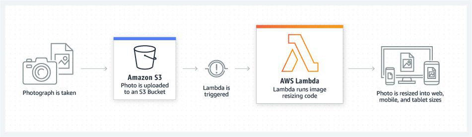

# **Why Cloud Data Pipelines Are Cheaper Than On-Premises Solutions – Detailed Explanation**  

Cloud-based data pipelines are generally more cost-effective than on-premises (on-prem) solutions due to several key factors, including reduced infrastructure costs, better scalability, operational efficiencies, and flexible pricing models. Below is a detailed breakdown of why cloud pipelines are cheaper:

---

## **1. Lower Infrastructure Costs**  
### **On-Premises:**  
- Requires **upfront capital expenditure (CapEx)** for servers, storage, networking, and data center space.  
- Ongoing costs include power, cooling, physical security, and hardware refreshes every 3-5 years.  
- Additional expenses for redundancy (backup power, networking, storage arrays).  

### **Cloud:**  
- **No upfront hardware costs** – operates on an **operational expenditure (OpEx)** model (pay-as-you-go).  
- Cloud providers (AWS, Azure, GCP) handle data center costs, maintenance, and upgrades.  
- **Eliminates underutilized hardware** – no need to buy excess capacity for future growth.  

**Cost Savings:** Avoids large capital investments and reduces long-term depreciation costs.  

---

## **2. Elastic Scalability (Pay Only for What You Use)**  
### **On-Premises:**  
- Must **over-provision** resources to handle peak loads, leading to idle capacity during low usage.  
- Scaling requires purchasing and deploying new hardware, which is slow and expensive.  

### **Cloud:**  
- **Auto-scaling** adjusts resources dynamically (e.g., AWS Lambda, Kubernetes).  
- **Serverless options** (e.g., AWS Glue, Azure Data Factory) eliminate the need to manage servers.  
- **Downscaling** reduces costs when demand drops.  

**Cost Savings:** Eliminates wasted resources and allows precise cost optimization.  

---

## **3. Reduced Operational & Maintenance Costs**  
### **On-Premises:**  
- Requires **dedicated IT teams** for:  
  - Hardware setup, patching, and upgrades.  
  - Security, compliance, and troubleshooting.  
- Labor costs for 24/7 monitoring and maintenance.  

### **Cloud:**  
- **Managed services** (e.g., Snowflake, BigQuery, Databricks) reduce administrative overhead.  
- Cloud providers handle **security patches, backups, and compliance** (e.g., GDPR, HIPAA).  
- **Automation tools** (Terraform, CI/CD pipelines) reduce manual intervention.  

**Cost Savings:** Reduces staffing needs and operational complexity.  

---

## **4. Higher Resource Utilization & Multi-Tenancy**  
### **On-Premises:**  
- **Low utilization rates** (often 20-30%) due to fixed hardware allocation.  
- Dedicated clusters for different workloads (ETL, analytics, ML) lead to siloed inefficiencies.  

### **Cloud:**  
- **Shared infrastructure (multi-tenancy)** allows better utilization.  
- **Serverless & containerized** workloads optimize resource usage.  
- **Spot instances & reserved pricing** offer discounts for flexible workloads.  

**Cost Savings:** Higher efficiency means less wasted compute/storage.  

---

## **5. Flexible Pricing Models**  
### **On-Premises:**  
- Fixed costs regardless of usage.  
- No way to "pause" infrastructure when not in use.  

### **Cloud:**  
- **Pay-as-you-go** – only pay for active usage.  
- **Reserved Instances (RIs)** & **Savings Plans** (AWS) offer discounts for long-term commitments.  
- **Spot Instances** (AWS) / **Preemptible VMs (GCP)** provide up to 90% discounts for interruptible workloads.  

**Cost Savings:** Aligns spending with actual demand.  

---

## **6. Built-In Disaster Recovery & Redundancy**  
### **On-Premises:**  
- Requires **duplicate hardware, backup sites, and failover systems**, increasing costs.  
- Manual backup processes are time-consuming and error-prone.  

### **Cloud:**  
- **Automated backups** (e.g., AWS S3, Azure Blob Storage).  
- **Multi-region replication** at minimal extra cost.  
- **Managed disaster recovery** (e.g., AWS Backup, Azure Site Recovery).  

**Cost Savings:** Avoids expensive on-prem redundancy setups.  

---

## **7. Faster Innovation & No Upgrade Costs**  
### **On-Premises:**  
- New features require **hardware/software upgrades**, which are costly and disruptive.  
- Legacy systems may become obsolete, requiring migrations.  

### **Cloud:**  
- **Continuous updates** (new features, security patches) are included.  
- Access to **cutting-edge tools** (AI/ML, streaming analytics) without extra investment.  

**Cost Savings:** Avoids expensive upgrade cycles and keeps pipelines modern.  

---

### **Final Summary: Key Cost Advantages of Cloud Pipelines**  
| **Factor**               | **On-Premises Cost** | **Cloud Cost Advantage** |
|--------------------------|----------------------|--------------------------|
| **Infrastructure**       | High CapEx + OpEx    | No upfront hardware costs |
| **Scalability**          | Over-provisioning    | Pay-per-use + auto-scaling |
| **Maintenance**          | Dedicated IT teams   | Managed services reduce labor |
| **Resource Utilization** | Low (~20-30%)        | High (multi-tenancy, serverless) |
| **Pricing Flexibility**  | Fixed costs          | Pay-as-you-go, spot instances |
| **Disaster Recovery**    | Expensive redundancy | Built-in, low-cost backups |
| **Innovation**           | Manual upgrades      | Continuous free updates |

### **Conclusion**  
Cloud data pipelines reduce costs by:  
✅ **Eliminating upfront hardware investments**  
✅ **Optimizing resource usage with auto-scaling**  
✅ **Reducing operational overhead with managed services**  
✅ **Offering flexible pricing models**  
✅ **Providing built-in redundancy and security**  

For most organizations, especially those with variable workloads, the cloud provides a **more cost-efficient, scalable, and manageable** solution compared to on-premises data pipelines.

<br/>
<br/>

# **Most Commonly Used AWS Services for Building Data Pipelines**  

AWS provides a wide range of services to build **scalable, reliable, and cost-effective data pipelines**. Below is a detailed breakdown of the most commonly used AWS services for data ingestion, processing, storage, and analytics.  

---

## **1. Amazon S3 (Simple Storage Service)**  
**Role:** Primary storage for raw and processed data.  
**Use Case:**  
- Stores structured/unstructured data (CSV, JSON, Parquet, etc.).  
- Acts as a data lake for batch and real-time processing.  
- Integrates with **AWS Glue, Athena, EMR, and Redshift**.  
**Key Features:**  
- **Durable & scalable** (99.999999999% durability).  
- **Serverless** (no infrastructure management).  
- **Lifecycle policies** (move data to S3 Glacier for cost savings).  

---

## **2. AWS Lambda**  
**Role:** Serverless compute for event-driven processing.  
**Use Case:**  
- Trigger data transformations when files land in **S3**.  
- Process streaming data from **Kinesis/SQS**.  
- Lightweight ETL tasks (e.g., JSON → Parquet conversion).  
**Key Features:**  
- **Pay-per-execution** (cost-efficient for sporadic workloads).  
- **Auto-scaling** (no server management).  
- **Integrates with S3, DynamoDB, SQS, EventBridge**.  

---

## **3. AWS IAM (Identity and Access Management)**  
**Role:** Security and access control for data pipelines.  
**Use Case:**  
- Grants permissions to **Lambda, Glue, EC2, Redshift**.  
- Defines **least-privilege policies** for data access.  
- Enables **cross-account access** (if using multiple AWS accounts).  
**Key Features:**  
- **Fine-grained access control** (users, roles, policies).  
- **Temporary credentials** (AWS STS for short-lived access).  
- **Integrates with all AWS services**.  

---

## **4. Amazon EventBridge**  
**Role:** Event-driven automation for pipelines.  
**Use Case:**  
- Triggers **Lambda, Step Functions, Glue** on schedule or events.  
- Routes events from **S3, DynamoDB, SaaS apps**.  
- Enables **event-based architectures** (decoupled pipelines).  
**Key Features:**  
- **Serverless event bus**.  
- **Cron-like scheduling**.  
- **Integrates with 100+ AWS/SaaS services**.  

---

## **5. Amazon EC2 (Elastic Compute Cloud)**  
**Role:** Managed virtual servers for heavy workloads.  
**Use Case:**  
- Runs **custom ETL scripts (Python, Spark)**.  
- Hosts **long-running jobs** (not suitable for Lambda).  
- Used in **EMR clusters** for big data processing.  
**Key Features:**  
- **On-demand, spot, and reserved instances**.  
- **Auto-scaling groups** for variable workloads.  
- **Supports Docker (ECS/EKS)**.  

---

## **6. Amazon SNS (Simple Notification Service)**  
**Role:** Pub/Sub messaging for pipeline alerts.  
**Use Case:**  
- Sends **email/SMS alerts** on pipeline failures.  
- Triggers **Lambda or SQS** when new data arrives.  
- Fan-out notifications to multiple subscribers.  
**Key Features:**  
- **Push-based notifications**.  
- **Integrates with Lambda, SQS, HTTP endpoints**.  

---

## **7. Amazon SQS (Simple Queue Service)**  
**Role:** Decouples pipeline components.  
**Use Case:**  
- Buffers data between **Lambda, EC2, or external apps**.  
- Handles **asynchronous processing** (prevents data loss).  
- Works with **EventBridge & SNS** for event-driven flows.  
**Key Features:**  
- **Standard (at-least-once) & FIFO (exactly-once) queues**.  
- **Auto-retries failed messages**.  
- **Delays & dead-letter queues (DLQ)** for error handling.  

---

## **8. AWS Step Functions**  
**Role:** Orchestrates multi-step workflows.  
**Use Case:**  
- Coordinates **Lambda, Glue, EMR, Redshift** in a sequence.  
- Handles **retries, error handling, branching logic**.  
- Replaces **cron jobs + shell scripts** with serverless workflows.  
**Key Features:**  
- **Visual workflow designer**.  
- **Serverless (pay per transition)**.  
- **Supports Express Workflows (high-frequency jobs)**.  

---

## **9. AWS Glue**  
**Role:** Serverless ETL (Extract, Transform, Load).  
**Use Case:**  
- **Crawls & catalogs** data in S3, RDS, Redshift.  
- **Generates PySpark/Spark code** for transformations.  
- Schedules jobs via **EventBridge or Step Functions**.  
**Key Features:**  
- **Fully managed Spark environment**.  
- **Data Catalog (Hive Metastore compatible)**.  
- **Glue Studio (low-code ETL interface)**.  

---

## **10. Amazon Kinesis**  
**Role:** Real-time data streaming.  
**Use Case:**  
- **Kinesis Data Streams**: High-throughput ingestion (e.g., clickstreams, logs).  
- **Kinesis Firehose**: Loads streaming data into **S3, Redshift, Elasticsearch**.  
- **Kinesis Data Analytics**: SQL-based stream processing.  
**Key Features:**  
- **Scales automatically**.  
- **Integrates with Lambda, Glue, S3**.  

---

## **11. Amazon RDS (Relational Database Service)**  
**Role:** Managed SQL databases for transactional data.  
**Use Case:**  
- **PostgreSQL, MySQL, SQL Server** for OLTP workloads.  
- **Aurora** for high-performance, scalable databases.  
- **Source/target for ETL pipelines (via Glue/DMS)**.  
**Key Features:**  
- **Automated backups, patching, scaling**.  
- **Read replicas for analytics queries**.  

---

## **12. Amazon Athena**  
**Role:** Serverless SQL querying on S3.  
**Use Case:**  
- **Ad-hoc analytics** on raw data in S3.  
- **Replaces traditional data warehouses** for lightweight use cases.  
- **Works with Glue Data Catalog**.  
**Key Features:**  
- **Pay-per-query pricing**.  
- **Supports Parquet, ORC, JSON, CSV**.  

---

## **13. Amazon Redshift**  
**Role:** Cloud data warehouse for analytics.  
**Use Case:**  
- **Large-scale SQL analytics**.  
- **ETL from S3, RDS, DynamoDB**.  
- **Redshift Spectrum** (query data directly in S3).  
**Key Features:**  
- **Columnar storage for fast queries**.  
- **ML integration (Redshift ML)**.  

---

## **14. Amazon DynamoDB**  
**Role:** NoSQL database for high-speed access.  
**Use Case:**  
- **Key-value & document storage**.  
- **Serverless, auto-scaling**.  
- **Streams data to Lambda/Kinesis**.  
**Key Features:**  
- **Single-digit millisecond latency**.  
- **DynamoDB Streams (CDC for real-time pipelines)**.  

---

### **Typical AWS Data Pipeline Architecture**  
1. **Ingestion**:  
   - Batch: **S3, Glue, RDS**  
   - Streaming: **Kinesis, SQS, DynamoDB Streams**  
2. **Processing**:  
   - ETL: **Glue, Lambda, EMR**  
   - Orchestration: **Step Functions, EventBridge**  
3. **Storage**:  
   - Data Lake: **S3**  
   - Warehouse: **Redshift**  
   - NoSQL: **DynamoDB**  
4. **Analytics**:  
   - SQL: **Athena, Redshift**  
   - ML: **SageMaker**  

### **Conclusion**  
AWS provides a **fully managed, scalable, and cost-efficient** ecosystem for building data pipelines. The choice of services depends on:  
✅ **Data volume & velocity** (batch vs. streaming)  
✅ **Processing needs** (ETL, real-time analytics)  
✅ **Cost constraints** (serverless vs. provisioned)  

By combining these services, you can build **end-to-end pipelines** from ingestion to analytics without managing infrastructure.

<br/>
<br/>

# **Amazon S3 (Simple Storage Service) – Detailed Explanation**  

Amazon S3 (Simple Storage Service) is a **scalable, durable, and highly available object storage service** offered by AWS. It is designed to store and retrieve **any amount of data** from anywhere on the web, making it a fundamental service for cloud storage, data lakes, backups, and application data hosting.  

---

## **1. What is Amazon S3?**  
Amazon S3 is an **object storage service**, meaning it stores data as **objects** (files) inside **buckets** (logical containers). Unlike traditional file systems (which use hierarchies), S3 uses a **flat namespace** with unique keys for each object.  

### **Key Characteristics:**  
✔ **Unlimited Storage** – No upper limit on data stored.  
✔ **High Durability** – Designed for **99.999999999% (11 nines) durability** (extremely low risk of data loss).  
✔ **High Availability** – **99.99% uptime SLA** (varies by storage class).  
✔ **Global Service** – Buckets are region-specific, but accessible worldwide.  
✔ **Secure by Default** – Supports encryption, access policies, and compliance certifications.  

---

## **2. Core Concepts of Amazon S3**  

### **A. Buckets**  
- A **bucket** is a logical container for storing objects (similar to a folder in a file system).  
- **Bucket names must be globally unique** (across all AWS accounts).  
- **Region-specific** – You choose the AWS region where the bucket is created.  

### **B. Objects**  
- An **object** is a file + metadata stored in a bucket.  
- Each object has:  
  - **Key** (unique identifier, like a file path).  
  - **Value** (the actual data).  
  - **Version ID** (if versioning is enabled).  
  - **Metadata** (e.g., `Content-Type`, `Last-Modified`).  

### **C. Storage Classes**  
AWS offers **multiple storage classes** to optimize cost vs. access speed:  

| **Storage Class**          | **Use Case**                          | **Durability** | **Availability** | **Cost** |
|----------------------------|---------------------------------------|----------------|------------------|----------|
| **S3 Standard**            | Frequently accessed data              | 99.999999999%  | 99.99%           | Highest  |
| **S3 Intelligent-Tiering** | Auto-optimizes cost for variable access | 99.999999999%  | 99.9%            | Medium   |
| **S3 Standard-IA**         | Infrequent access (cheaper than Standard) | 99.999999999%  | 99.9%           | Medium   |
| **S3 One Zone-IA**         | Infrequent access (single AZ only)    | 99.999999999%  | 99.5%           | Lower    |
| **S3 Glacier**             | Long-term archival (retrieval in mins/hrs) | 99.999999999%  | 99.99% (after restore) | Very Low |
| **S3 Glacier Deep Archive** | Lowest-cost archival (retrieval in hrs) | 99.999999999%  | 99.99% (after restore) | Lowest   |

---

## **3. Key Features of Amazon S3**  

### **A. Versioning**  
- Keeps **multiple versions** of an object (protects against accidental deletions/modifications).  
- Once enabled, **cannot be disabled** (only suspended).  
- **Example:** If you overwrite `file.txt`, the old version is retained.  

### **B. Security & Access Control**  
1. **IAM Policies** – Control access at the **user/role level**.  
2. **Bucket Policies** – Define **bucket-wide permissions** (e.g., allow public read access).  
3. **ACLs (Access Control Lists)** – Legacy method for fine-grained permissions.  
4. **Encryption**  
   - **SSE-S3** (AWS-managed keys).  
   - **SSE-KMS** (AWS Key Management Service).  
   - **SSE-C** (Customer-provided keys).  
   - **Client-Side Encryption** (encrypt before uploading).  

### **C. Event Notifications**  
- Trigger **AWS Lambda, SQS, SNS, or EventBridge** when objects are:  
  - Uploaded (`s3:ObjectCreated`).  
  - Deleted (`s3:ObjectRemoved`).  
  - Modified (`s3:ObjectRestore`).  
- **Use Case:** Automate workflows (e.g., process new files in real-time).  

### **D. Lifecycle Management**  
- **Automatically transition objects** between storage classes.  
- **Example Rule:**  
  - Move logs to **S3 Standard-IA** after 30 days.  
  - Archive to **S3 Glacier** after 90 days.  
  - Delete after **365 days**.  

### **E. Cross-Region Replication (CRR)**  
- **Automatically replicates objects** to a bucket in another AWS region.  
- **Use Case:** Compliance, disaster recovery, low-latency global access.  

### **F. Static Website Hosting**  
- Host **HTML, CSS, JS files** directly from S3.  
- Supports **custom domain + HTTPS** (via CloudFront).  

### **G. S3 Select & Glacier Select**  
- Retrieve **only a subset of data** (e.g., query a CSV/JSON file without downloading the whole object).  

### **H. Batch Operations**  
- Perform **bulk actions** (copy, delete, restore) on millions of objects.  

---

## **4. Common Use Cases for Amazon S3**  

### **1. Data Lakes & Analytics**  
- Store **raw data** (logs, JSON, Parquet) for processing with **Athena, Redshift, EMR**.  

### **2. Backup & Disaster Recovery**  
- **Automated backups** from RDS, EC2, on-premises servers.  

### **3. Static Website Hosting**  
- Serve **frontend apps** (React, Angular) directly from S3.  

### **4. Media Storage & Distribution**  
- Store **videos, images** for apps (with CloudFront CDN for fast delivery).  

### **5. Log Storage & Archival**  
- Centralized logging for **CloudTrail, ELB, VPC Flow Logs**.  

### **6. Machine Learning & AI**  
- Store **training datasets** for SageMaker.  

---

## **5. Pricing Model**  
Amazon S3 charges based on:  
- **Storage volume** (per GB/month).  
- **Requests** (PUT, GET, LIST operations).  
- **Data transfer** (outbound to the internet).  
- **Storage class** (Glacier is cheaper than Standard).  

**Example Cost (us-east-1, as of 2024):**  
- **S3 Standard**: $0.023 per GB/month.  
- **S3 Glacier Deep Archive**: $0.00099 per GB/month.  

---

## **6. Comparison with Other AWS Storage Services**  

| **Service**       | **Use Case**                     | **Access Speed** | **Cost** |
|-------------------|----------------------------------|------------------|----------|
| **S3**            | General-purpose object storage  | Milliseconds     | Medium   |
| **EBS**          | Block storage for EC2           | Milliseconds     | High     |
| **EFS**          | Shared file storage (NFS)       | Milliseconds     | High     |
| **Glacier**      | Long-term archival              | Minutes-Hours    | Very Low |

---

## **7. Best Practices for Using Amazon S3**  
✅ **Enable Versioning** – Protects against accidental deletions.  
✅ **Use Lifecycle Policies** – Automatically move old data to cheaper storage.  
✅ **Enable Encryption** – Use **SSE-KMS** for sensitive data.  
✅ **Restrict Public Access** – Use **S3 Block Public Access** settings.  
✅ **Monitor with S3 Storage Lens** – Track usage & optimize costs.  

---

### **Conclusion**  
Amazon S3 is the **backbone of AWS storage**, offering **unmatched durability, scalability, and security**. It supports a wide range of use cases—from **data lakes** to **static websites**—while integrating seamlessly with other AWS services like **Lambda, Glue, and Athena**.  

By leveraging **storage classes, lifecycle policies, and event-driven automation**, businesses can optimize costs while maintaining high performance and reliability.  

<br/>
<br/>

# **AWS S3 Pricing – Detailed Breakdown**  

Amazon S3 follows a **pay-as-you-go pricing model**, meaning you only pay for what you use. The total cost depends on multiple factors, including **storage usage, request types, data transfer, and additional features**. Below is a **detailed breakdown** of all pricing components.  

---

## **1. Storage Costs (Per GB per Month)**  
The **primary cost factor** is the amount of data stored, measured in **GB per month**, prorated based on:  
- **Storage class** (Standard, Intelligent-Tiering, Glacier, etc.).  
- **Region** (prices vary by AWS region).  

### **Storage Pricing Examples (us-east-1, as of 2024)**  
| **Storage Class**          | **Price per GB/Month** |
|----------------------------|-----------------------|
| **S3 Standard**            | $0.023                |
| **S3 Intelligent-Tiering** | $0.023 (auto-tiering) |
| **S3 Standard-IA**         | $0.0125               |
| **S3 One Zone-IA**         | $0.01                |
| **S3 Glacier Instant Retrieval** | $0.004        |
| **S3 Glacier Flexible Retrieval** | $0.0036      |
| **S3 Glacier Deep Archive** | $0.00099             |

**Key Notes:**  
- **Intelligent-Tiering** automatically moves objects between tiers (frequent/infrequent access) to optimize costs.  
- **Glacier** has **retrieval fees** (cost depends on speed: expedited, standard, bulk).  

---

## **2. Request & Operation Costs**  
Every API call to S3 (upload, download, list) incurs a **per-request cost**. Pricing varies by:  
- **Request type** (PUT, GET, COPY, LIST, etc.).  
- **Storage class** (Standard vs. Glacier).  

### **Request Pricing Examples (us-east-1, per 1,000 requests)**  
| **Request Type**       | **S3 Standard** | **S3 Standard-IA** | **S3 Glacier** |
|------------------------|----------------|--------------------|----------------|
| **PUT, COPY, POST**    | $0.005         | $0.01              | $0.05          |
| **GET, SELECT**        | $0.0004        | $0.001             | $0.01 (retrieval fee) |
| **LIST (per 1,000)**   | $0.005         | $0.005             | N/A            |
| **Lifecycle Transitions** | $0.01 per 1,000 objects | | |

**Key Notes:**  
- **GET requests** are cheaper than **PUT requests**.  
- **Glacier retrieval** has additional costs (e.g., $0.01 per 1,000 requests + data retrieval fees).  

---

## **3. Data Transfer Costs**  
Data transfer pricing depends on:  
- **Direction** (inbound vs. outbound).  
- **Destination** (same region, cross-region, internet).  

### **Data Transfer Pricing (us-east-1, per GB)**  
| **Transfer Type**              | **Cost** |
|--------------------------------|---------|
| **Data IN (Upload to S3)**     | **Free** |
| **Data OUT to Internet**       | **$0.09/GB** (first 10TB) |
| **Data OUT to another AWS Region** | **$0.02/GB** |
| **Data OUT to CloudFront**     | **Free** (if cached) |
| **Accelerated Transfer (S3 Transfer Acceleration)** | Extra $0.04 - $0.08/GB |

**Key Notes:**  
- **Uploading to S3 is free** (no cost for inbound data).  
- **Downloading from S3** (outbound to the internet) is **the most expensive**.  
- **Using CloudFront (CDN) reduces costs** for frequently accessed content.  

---

## **4. Additional Feature Costs**  
### **A. Versioning**  
- **No extra cost for storage**, but **each version counts toward storage billing**.  
- Example: If you store **1GB file with 5 versions**, you pay for **5GB storage**.  

### **B. S3 Inventory & Analytics**  
- **S3 Inventory** (~$0.0025 per million objects listed).  
- **S3 Storage Lens** (Free tier: first 1M objects, then ~$0.20 per million objects).  

### **C. Replication (Cross-Region / Same-Region)**  
- **Cross-Region Replication (CRR)** – $0.02 per GB replicated.  
- **Same-Region Replication (SRR)** – $0.01 per GB replicated.  

### **D. S3 Select & Glacier Select**  
- **S3 Select** – $0.0007 per GB scanned + $0.002 per GB returned.  
- **Glacier Select** – $0.0025 per GB scanned + retrieval fees.  

### **E. Batch Operations**  
- **$0.25 per job** + standard request/data transfer fees.  

---

## **5. Storage Management & Monitoring Costs**  
| **Feature**            | **Cost** |
|------------------------|---------|
| **S3 Object Tagging**  | Free (but API calls cost $0.005 per 1,000 tags) |
| **CloudWatch Metrics** | $0.30 per metric/month (first 10 metrics free) |
| **S3 Event Notifications** | Free (but Lambda/SQS/SNS may incur costs) |

---

## **6. Cost Optimization Strategies**  
To **reduce S3 costs**, consider:  

✅ **Use Lifecycle Policies**  
   - Move old data to **cheaper storage classes** (Standard → Standard-IA → Glacier).  
   - Automatically **delete expired objects**.  

✅ **Enable S3 Intelligent-Tiering**  
   - Automatically moves data between **Frequent & Infrequent Access tiers**.  

✅ **Compress & Optimize Data Formats**  
   - Use **Parquet, ORC, or GZIP** to reduce storage & transfer costs.  

✅ **Limit Data Transfer Out**  
   - Use **CloudFront caching** for frequently accessed files.  
   - **Avoid unnecessary cross-region transfers**.  

✅ **Monitor with S3 Storage Lens**  
   - Identify **unused storage, excessive requests, or misconfigured buckets**.  

✅ **Use S3 Batch Operations**  
   - Perform **bulk deletions or transitions** instead of individual API calls.  

---

## **7. Example S3 Cost Calculation**  
**Scenario:**  
- **100GB** stored in **S3 Standard**.  
- **10,000 GET requests** & **1,000 PUT requests** per month.  
- **50GB downloaded to the internet**.  
- **Versioning enabled** (2 versions per object).  

**Cost Breakdown:**  
1. **Storage Cost** = 100GB × $0.023 = **$2.30**  
2. **Request Costs**  
   - GET = 10,000 × $0.0004 = **$4.00**  
   - PUT = 1,000 × $0.005 = **$5.00**  
3. **Data Transfer Cost** = 50GB × $0.09 = **$4.50**  
4. **Versioning Cost** = Extra 100GB × $0.023 = **$2.30**  
5. **Total Estimated Cost** = **$18.10/month**  

---

## **Conclusion: Key Takeaways**  
- **Storage class** has the biggest impact on cost (Standard vs. Glacier).  
- **Data transfer out** can be expensive (use CloudFront to reduce costs).  
- **Requests add up** (especially for high-frequency applications).  
- **Versioning & replication increase storage costs**.  
- **Use lifecycle policies & Intelligent-Tiering** to optimize spending.  

<br/>
<br/>

# **AWS S3 CLI Commands – Complete Guide**  

The **AWS Command Line Interface (CLI)** is a powerful tool for managing **Amazon S3** directly from the terminal. Below is a **detailed breakdown** of essential **S3 CLI commands**, covering **bucket operations, file transfers, permissions, and advanced features**.  

---

## **1. AWS CLI Setup & Configuration**  
Before using S3 commands, **configure AWS credentials**:  

```bash
aws configure
```
- Prompts for:  
  - **AWS Access Key ID**  
  - **AWS Secret Access Key**  
  - **Default Region** (e.g., `us-east-1`)  
  - **Default Output Format** (`json`, `text`, `table`)  

**Verify Configuration:**  
```bash
aws sts get-caller-identity
```

---

## **2. Bucket Operations**  

### **A. List All Buckets**  
```bash
aws s3 ls
```
- Lists all S3 buckets in your account.  

### **B. Create a Bucket**  
```bash
aws s3 mb s3://bucket-name --region us-east-1
```
- `mb` = **Make Bucket**  
- Bucket names **must be globally unique**.  

### **C. Delete a Bucket**  
```bash
aws s3 rb s3://bucket-name
```
- `rb` = **Remove Bucket**  
- **Fails if the bucket is not empty** (use `--force` to delete non-empty buckets).  

### **D. List Bucket Contents**  
```bash
aws s3 ls s3://bucket-name
```
- Lists **all objects** in the bucket.  
- **List a specific folder**:  
  ```bash
  aws s3 ls s3://bucket-name/folder/
  ```

---

## **3. File & Folder Operations**  

### **A. Upload a File to S3**  
```bash
aws s3 cp file.txt s3://bucket-name/
```
- `cp` = **Copy**  
- **Upload with a different name**:  
  ```bash
  aws s3 cp file.txt s3://bucket-name/new-name.txt
  ```
- **Upload a folder (recursively)**:  
  ```bash
  aws s3 cp ./local-folder s3://bucket-name/remote-folder --recursive
  ```

### **B. Download a File from S3**  
```bash
aws s3 cp s3://bucket-name/file.txt ./
```
- Downloads `file.txt` to the current directory.  
- **Download a folder (recursively)**:  
  ```bash
  aws s3 cp s3://bucket-name/remote-folder ./local-folder --recursive
  ```

### **C. Move (Cut-Paste) a File**  
```bash
aws s3 mv file.txt s3://bucket-name/
```
- `mv` = **Move** (deletes local file after upload).  

### **D. Delete a File from S3**  
```bash
aws s3 rm s3://bucket-name/file.txt
```
- `rm` = **Remove**  
- **Delete a folder (recursively)**:  
  ```bash
  aws s3 rm s3://bucket-name/folder/ --recursive
  ```

---

## **4. Advanced S3 Operations**  

### **A. Sync Local Folder with S3**  
```bash
aws s3 sync ./local-folder s3://bucket-name/remote-folder
```
- **Only uploads modified/new files** (faster than `cp --recursive`).  
- **Exclude files**:  
  ```bash
  aws s3 sync ./local-folder s3://bucket-name/ --exclude "*.log"
  ```

### **B. Set File Permissions (ACL)**  
```bash
aws s3 cp file.txt s3://bucket-name/ --acl public-read
```
- Common ACLs:  
  - `private` (default)  
  - `public-read`  
  - `bucket-owner-full-control`  

### **C. Enable S3 Versioning**  
```bash
aws s3api put-bucket-versioning --bucket bucket-name --versioning-configuration Status=Enabled
```

### **D. Generate a Pre-Signed URL (Temporary Access)**  
```bash
aws s3 presign s3://bucket-name/file.txt --expires-in 3600
```
- Generates a **time-limited URL** (expires in `3600` seconds = 1 hour).  

### **E. Check Object Metadata**  
```bash
aws s3api head-object --bucket bucket-name --key file.txt
```
- Shows **size, last modified, storage class, encryption status**.  

---

## **5. Performance & Optimization**  

### **A. Upload Large Files Faster (Multipart Upload)**  
```bash
aws s3 cp large-file.zip s3://bucket-name/ --storage-class STANDARD_IA --sse aws:kms
```
- `--storage-class` = `STANDARD`, `STANDARD_IA`, `GLACIER`  
- `--sse` = Server-side encryption (`aws:kms`, `AES256`)  

### **B. Use S3 Transfer Acceleration (Faster Uploads)**  
```bash
aws configure set default.s3.use_accelerate_endpoint true
```
- Uses **CloudFront Edge Locations** for faster transfers.  

---

## **6. Common Errors & Fixes**  

| **Error** | **Solution** |
|-----------|-------------|
| `Access Denied` | Check IAM permissions (`s3:ListBucket`, `s3:PutObject`). |
| `BucketAlreadyExists` | Bucket names must be **globally unique**. |
| `NoSuchBucket` | Verify bucket name & region. |
| `Slow Uploads` | Use `--multipart-chunk-size-mb` or enable **Transfer Acceleration**. |

---

## **7. Best Practices**  
✅ **Use `sync` instead of `cp --recursive`** (faster incremental updates).  
✅ **Set `--storage-class` for cost savings** (e.g., `STANDARD_IA` for backups).  
✅ **Enable versioning** to prevent accidental deletions.  
✅ **Use `--dryrun` to test commands before execution**:  
   ```bash
   aws s3 cp file.txt s3://bucket-name/ --dryrun
   ```

---

## **8. Example Workflow**  

### **Step 1: Upload a Website to S3**  
```bash
aws s3 sync ./website s3://my-static-site --acl public-read
```

### **Step 2: Make the Bucket Public**  
```bash
aws s3api put-bucket-policy --bucket my-static-site --policy file://policy.json
```
**`policy.json`:**  
```json
{
  "Version": "2012-10-17",
  "Statement": [{
    "Effect": "Allow",
    "Principal": "*",
    "Action": "s3:GetObject",
    "Resource": "arn:aws:s3:::my-static-site/*"
  }]
}
```

### **Step 3: Enable Static Website Hosting**  
```bash
aws s3 website s3://my-static-site --index-document index.html --error-document error.html
```

---

## **Conclusion**  
The **AWS S3 CLI** is a **fast, scriptable way** to manage files and buckets. Key takeaways:  
- **`aws s3 cp/mv/rm`** – Basic file operations.  
- **`aws s3 sync`** – Efficient folder synchronization.  
- **`aws s3api`** – Advanced operations (versioning, policies).  
- **Optimize costs** with `--storage-class` & `--sse`.  

For automation, combine with **`cron` (Linux) or Task Scheduler (Windows)**.  

<br/>
<br/>

# **AWS Lambda – Complete Guide**  

AWS Lambda is a **serverless compute service** that lets you run **event-driven code** without managing servers. It automatically **scales, patches, and executes** functions in response to triggers like **S3 uploads, API calls, or database changes**.  

---

## **1. What is AWS Lambda?**  
- **Serverless**: No servers to provision or manage.  
- **Event-Driven**: Runs code in response to **AWS events (S3, DynamoDB, API Gateway, etc.)**.  
- **Auto-Scaling**: Handles from **1 request to thousands per second**.  
- **Pay-Per-Use**: Billed only for **execution time** (rounded to the nearest millisecond).  

---

## **2. Key Features**  

### **A. Event Sources (Triggers)**  
Lambda integrates with **100+ AWS services**, including:  
| **Service**         | **Trigger Example**                     |
|---------------------|----------------------------------------|
| **S3**             | New file uploaded (`s3:ObjectCreated`). |
| **DynamoDB**       | Table updates (`INSERT`, `MODIFY`).    |
| **API Gateway**    | HTTP REST API calls.                   |
| **SQS / SNS**      | Processes messages from queues/topics. |
| **CloudWatch Events** | Scheduled cron jobs (e.g., every 5 mins). |
| **Kinesis**        | Real-time stream processing.           |

### **B. Supported Runtimes**  
Lambda supports:  
✅ **Node.js** (20.x, 18.x, 16.x)  
✅ **Python** (3.12, 3.11, 3.10)  
✅ **Java** (21, 17, 11, 8)  
✅ **Go**  
✅ **.NET** (6, 7)  
✅ **Ruby**  
✅ **Custom Runtimes** (bring your own)  

### **C. Execution Model**  
- **Stateless**: Each invocation is independent (no local storage).  
- **Ephemeral Storage**: `/tmp` (512 MB max, deleted after execution).  
- **Max Duration**: **15 minutes** per execution.  
- **Concurrency Limit**: **1,000+** parallel executions (can be increased).  

### **D. Resource Allocation**  
- **Memory**: **128 MB – 10,240 MB** (CPU scales proportionally).  
- **CPU**: ~1 vCPU at **1,792 MB** memory.  
- **Disk**: Only `/tmp` (512 MB).  

---

## **3. Lambda Pricing**  
- **Pay per request** ($0.20 per 1M invocations).  
- **Pay per duration** ($0.0000166667 per GB-second).  
- **Free Tier**: 1M requests & 400,000 GB-seconds/month.  

**Example Cost Calculation:**  
- **1M requests/month** = $0.20  
- **Each request runs 1s at 1GB RAM** = 1M GB-seconds = $16.67  
- **Total** = **$16.87/month**  

---

## **4. How Lambda Works**  

### **Step 1: Deployment**  
1. **Write code** (e.g., Python, Node.js).  
2. **Package** (ZIP file or container image).  
3. **Upload** to Lambda.  

### **Step 2: Triggering**  
- An **event source** (e.g., S3 upload) invokes Lambda.  
- AWS spins up a **micro-VM** (cold start if idle).  

### **Step 3: Execution**  
- Runs the function **in an isolated environment**.  
- Returns response (or error).  

### **Step 4: Scaling**  
- If **10 S3 files upload at once**, Lambda runs **10 parallel instances**.  

---

## **5. Use Cases**  
✅ **Real-Time File Processing** (e.g., resize images on S3 upload).  
✅ **Backend for APIs** (with **API Gateway**).  
✅ **Data Transformation** (e.g., CSV → JSON).  
✅ **Scheduled Tasks** (CloudWatch Events).  
✅ **Chatbots** (process Slack/Teams messages).  

---

## **6. AWS CLI Examples**  

### **Create a Lambda Function**  
```bash
aws lambda create-function \
  --function-name my-function \
  --runtime python3.12 \
  --handler lambda_function.lambda_handler \
  --role arn:aws:iam::123456789012:role/lambda-role \
  --zip-file fileb://function.zip
```

### **Invoke Lambda Manually**  
```bash
aws lambda invoke \
  --function-name my-function \
  --payload '{"key": "value"}' \
  output.json
```

### **Update Lambda Code**  
```bash
aws lambda update-function-code \
  --function-name my-function \
  --zip-file fileb://updated-function.zip
```

---

## **7. Best Practices**  
✔ **Keep Functions Small** (<50MB ZIP, <250MB unzipped).  
✔ **Use Environment Variables** for config (not hardcoded values).  
✔ **Enable Concurrency Controls** to avoid throttling.  
✔ **Monitor with CloudWatch Logs**.  
✔ **Use Lambda Layers** for shared libraries.  

---

## **8. Limitations**  
⚠ **15-Minute Max Runtime** (not for long tasks).  
⚠ **No Persistent Storage** (use S3/DynamoDB).  
⚠ **Cold Starts** (first run delay if idle).  

---

## **9. Comparison with Other AWS Compute Services**  

| **Service**   | **Best For**                | **Scaling**       | **Max Runtime** |
|--------------|----------------------------|------------------|----------------|
| **Lambda**   | Event-driven micro-tasks    | Fully automatic  | 15 mins        |
| **EC2**      | Long-running, full control | Manual           | Unlimited      |
| **Fargate**  | Docker containers           | Auto (ECS/EKS)   | Unlimited      |

---

## **10. Advanced Features**  
- **Lambda Layers** (Share code across functions).  
- **Destinations** (Route execution results to SQS/SNS).  
- **VPC Support** (Access private RDS/ElastiCache).  
- **ARM64 (Graviton2)** (Cheaper & faster for some workloads).  

---

### **Conclusion**  
AWS Lambda is **ideal for short, event-driven tasks** with **zero server management**. It’s cost-efficient for **sporadic workloads** but may need **EC2/Fargate** for long-running jobs.  

**Next Steps:**  
1. Try the **AWS Lambda Free Tier**.  
2. Build a **serverless API** with **API Gateway + Lambda**.  
3. Automate **S3 file processing**.  


<br/>
<br/>

# **AWS Lambda – In-Depth Technical Guide**

AWS Lambda is Amazon's flagship serverless compute service that revolutionizes how developers deploy and run applications. Let's explore its advanced capabilities in detail:

## **1. Built-in Fault Tolerance & High Availability**

### **Infrastructure Resilience**
- Lambda runs your functions across **multiple Availability Zones (AZs)** in a region
- Automatic **health monitoring** of underlying compute resources
- Failed instances are automatically **retired and replaced**

### **Execution Reliability**
- **Automatic retries** for:
  - Service errors (Lambda infrastructure issues) - 3 retries
  - Function errors (your code throws exceptions) - 2 retries
- **Dead Letter Queues (DLQ)** can be configured to capture failed events
- Integrated with **AWS X-Ray** for distributed tracing

### **Monitoring & Logging**
- **CloudWatch Logs** integration (all stdout/stderr captured automatically)
- **CloudWatch Metrics** for:
  - Invocation counts
  - Duration
  - Error rates
  - Throttles
- **CloudWatch Alarms** can trigger notifications

## **2. Deployment & Packaging**

### **Deployment Packages**
| Format | Max Size | Use Case |
|--------|---------|----------|
| **ZIP** | 50MB (direct upload)<br>250MB (S3) | Most common for interpreted languages |
| **Container Image** | 10GB | Large dependencies, custom runtimes |
| **Inline Editor** | 3MB | Quick testing only |

### **Deployment Methods**
1. **AWS Management Console** (built-in editor)
2. **AWS CLI** (`aws lambda update-function-code`)
3. **AWS SAM/CloudFormation** (Infrastructure as Code)
4. **CI/CD Pipelines** (CodePipeline, GitHub Actions)
5. **Terraform** (for multi-cloud deployments)

### **Blueprints & Samples**
- Pre-configured templates for common patterns:
  - S3 file processing
  - DynamoDB stream processing
  - API Gateway backends
  - Alexa skills

## **3. Deep Integration with AWS Services**

### **Event Source Mappings**
| Service | Integration Pattern | Key Features |
|---------|---------------------|-------------|
| **S3** | Object notifications | Supports all S3 events (PUT, DELETE, etc.) |
| **DynamoDB** | Stream processing | Exactly-once processing within a shard |
| **Kinesis** | Stream processing | Checkpointing, batch processing |
| **SQS** | Message processing | FIFO queue support, visibility timeouts |
| **API Gateway** | REST/HTTP APIs | Supports payload version 1.0 and 2.0 |
| **EventBridge** | Event bus | Schema discovery, cross-account events |

### **Advanced Integration Features**
- **Event filtering** (reduce unnecessary invocations)
- **Batching controls** (optimize for throughput vs. latency)
- **Bisect on error** (Kinesis/DynamoDB Streams)

## **4. Lambda Layers Deep Dive**

### **Layer Benefits**
- **Share common code** across functions
- **Separate concerns** between business logic and dependencies
- **Reduce deployment package size**
- **Version control** for shared components

### **Common Layer Use Cases**
1. **Custom Runtimes** (PHP, Rust, etc.)
2. **Data Science Libraries** (NumPy, Pandas)
3. **Security Agents** (New Relic, Datadog)
4. **Database Drivers** (PostgreSQL, MongoDB)

### **Layer Limits**
- **5 layers** per function
- **250MB total** (unzipped) for all layers
- **50MB** upload size limit (S3 for larger)

## **5. Advanced Billing & Cost Optimization**

### **Cost Components**
1. **Requests** ($0.20 per million invocations)
2. **Duration** ($0.0000166667 per GB-second)
3. **Provisioned Concurrency** (when enabled)

### **Cost Optimization Strategies**
- **Right-size memory** (CPU scales linearly)
- **Set appropriate timeouts**
- **Use Graviton2 processors** (up to 20% cheaper)
- **Leverage provisioned concurrency** for predictable workloads
- **Implement efficient cold start mitigation**

## **6. Event Source Mapping Advanced Features**

### **Stream Processing (Kinesis/DynamoDB)**
- **Checkpointing** (tracks processed records)
- **Batch Size** (1-10,000 records)
- **Parallelization Factor** (1-10)
- **Bisect Batch on Error** (for debugging)

### **SQS Integration**
- **Visibility Timeout** coordination
- **Batch Window** (0-300 seconds)
- **Maximum Concurrency** control

## **7. Concurrency & Scaling**

### **Concurrency Model**
- **Reserved Concurrency** (guaranteed capacity)
- **Provisioned Concurrency** (pre-warmed instances)
- **Unreserved Concurrency** (shared pool)

### **Scaling Behavior**
| Trigger Type | Scaling Pattern |
|-------------|----------------|
| **Synchronous** (API Gateway) | Immediate, demand-based |
| **Asynchronous** (S3, SNS) | Controlled ramp-up |
| **Streams** (Kinesis) | 1 invocation per shard |

### **Concurrency Limits**
- **Account Limit**: 1,000 (can be increased)
- **Function Limit**: Can be set per function
- **Burst Limits**: 500-3000 depending on region

## **8. Advanced Use Cases**

### **Stateful Applications**
- **External Data Stores**:
  - DynamoDB for key-value state
  - ElastiCache for low-latency needs
  - S3 for large objects

### **Data Processing Pipelines**
- **Chaining Lambdas** with Step Functions
- **Fan-out Patterns** using SNS
- **MapReduce Implementations**

### **Machine Learning**
- **Lightweight inference** for pre-trained models
- **Integration with SageMaker**
- **Custom TensorFlow/PyTorch runtimes**

## **9. Security Best Practices**

### **IAM Permissions**
- **Principle of Least Privilege**
- **Execution Roles** vs Resource Policies
- **Permissions Boundaries**

### **Network Security**
- **VPC Connectivity** for private resources
- **Security Groups** for inbound/outbound
- **PrivateLink** for service endpoints

### **Data Protection**
- **Environment Variables Encryption**
- **Secrets Manager Integration**
- **DLQ for sensitive failures**

## **10. Performance Optimization**

### **Cold Start Mitigation**
- **Provisioned Concurrency**
- **Smaller package sizes**
- **Avoid VPC when possible**
- **ARM/Graviton2 architecture**

### **Warm Start Optimization**
- **Connection pooling** for databases
- **Static initialization** of variables
- **Keep-alive strategies**

## **Comparison with Alternatives**

| Feature | AWS Lambda | Fargate | EC2 |
|---------|-----------|---------|-----|
| **Management** | None | Some | Full |
| **Scaling** | Automatic | Automatic | Manual |
| **Billing** | Per-request | Per-second | Per-second |
| **Max Duration** | 15 min | Unlimited | Unlimited |
| **Cold Starts** | Yes | No | No |

## **Conclusion**

AWS Lambda provides an incredibly powerful platform for event-driven computing when properly architected. Key takeaways:

1. **Design for statelessness** but leverage external storage when needed
2. **Understand your event sources** and their scaling characteristics
3. **Monitor performance metrics** to identify optimization opportunities
4. **Implement proper error handling** with DLQs and retry logic
5. **Consider cold starts** in your latency requirements

For production workloads, combine Lambda with:
- **Step Functions** for orchestration
- **EventBridge** for complex event routing
- **SQS** for decoupling and buffering

<br/>
<br/>

# **Image Processing Pipeline with AWS S3 & Lambda – Detailed Explanation**


This diagram illustrates a **serverless image processing workflow** where uploaded photos are automatically resized into multiple dimensions. Here's a comprehensive breakdown of each component and the technical processes involved:

## **1. Image Upload to Amazon S3**
- **Trigger**: User uploads a photo (JPEG/PNG) to a designated S3 bucket
- **S3 Bucket Configuration**:
  - **Event Notifications** enabled for `s3:ObjectCreated:*` events
  - **Permissions**: IAM role grants Lambda permission to read/write to the bucket
- **Example Path**: 
  ```
  s3://user-uploads-bucket/original/photo.jpg
  ```

## **2. Lambda Function Trigger**
- **Event Source Mapping**: S3 automatically invokes the Lambda function when new objects are uploaded
- **Event Payload Structure**:
  ```json
  {
    "Records": [{
      "eventVersion": "2.1",
      "eventSource": "aws:s3",
      "s3": {
        "bucket": {"name": "user-uploads-bucket"},
        "object": {"key": "original/photo.jpg"}
      }
    }]
  }
  ```
- **Cold Start Consideration**: The first upload after inactivity may experience ~100-500ms latency

## **3. Lambda Execution Environment**
- **Runtime**: Typically Python (Pillow) or Node.js (Sharp) for image processing
- **Memory Allocation**: 1024MB-2048MB recommended for image operations
- **Key Steps in Code**:
  1. Download original image from S3 to `/tmp` directory
  2. Process image using libraries:
     - Python: `Pillow` (`pip install pillow`)
     - Node.js: `Sharp` (`npm install sharp`)
  3. Generate resized versions:
     ```python
     # Example Pillow resizing
     from PIL import Image
     
     with Image.open('/tmp/photo.jpg') as img:
         # Web size
         img.resize((1200, 800)).save('/tmp/web.jpg')
         # Mobile size
         img.resize((800, 600)).save('/tmp/mobile.jpg')
         # Tablet size
         img.resize((1024, 768)).save('/tmp/tablet.jpg')
     ```
  4. Upload processed images back to S3:
     ```
     s3://user-uploads-bucket/web/photo.jpg
     s3://user-uploads-bucket/mobile/photo.jpg
     s3://user-uploads-bucket/tablet/photo.jpg
     ```

## **4. Advanced Architecture Considerations**
### **Performance Optimization**
- **Lambda Configuration**:
  - Use **ARM/Graviton2** processors (20% cheaper/faster)
  - Set timeout to 30-60 seconds (image processing is CPU-intensive)
- **S3 Optimization**:
  - Store originals in **Standard-IA** after processing
  - Enable **Transfer Acceleration** for global uploads

### **Error Handling**
- Implement **S3 Event Notifications on Failure**:
  ```bash
  aws s3api put-bucket-notification-configuration \
    --bucket user-uploads-bucket \
    --notification-configuration file://notification.json
  ```
  Where `notification.json` includes an SQS DLQ target

### **Cost Control**
- **S3 Lifecycle Rules**:
  - Transition original images to Glacier after 30 days
  - Delete failed processing attempts after 1 day
- **Lambda Concurrency Limit**:
  ```bash
  aws lambda put-function-concurrency \
    --function-name image-resizer \
    --reserved-concurrent-executions 20
  ```

## **5. Alternative Architectures**
| Approach | Pros | Cons |
|----------|------|------|
| **Lambda + S3** | Simple, cost-effective | 15-min timeout limit |
| **EC2 Auto Scaling** | No timeout limits | Higher management overhead |
| **AWS Batch** | Better for bulk processing | More complex setup |
| **EKS Fargate** | Container flexibility | Higher cold start times |

## **6. Security Implementation**
1. **IAM Roles**:
   - Lambda execution role with:
     ```json
     {
       "Effect": "Allow",
       "Action": ["s3:GetObject", "s3:PutObject"],
       "Resource": "arn:aws:s3:::user-uploads-bucket/*"
     }
     ```
2. **Encryption**:
   - Enable **SSE-S3** or **SSE-KMS** on S3 bucket
   - Use `/tmp` encryption in Lambda (automatic with AWS-managed keys)

## **7. Monitoring & Logging**
- **CloudWatch Metrics**:
  - Track `Invocations`, `Duration`, and `Errors`
  - Alarm on `Throttles` > 0
- **X-Ray Tracing**:
  ```python
  from aws_xray_sdk.core import xray_recorder
  @xray_recorder.capture('image_processing')
  def resize_image(): ...
  ```

## **8. Complete AWS CLI Deployment Example**
```bash
# Create S3 bucket
aws s3 mb s3://user-uploads-bucket

# Create Lambda deployment package
zip -r function.zip lambda_function.py Pillow/

# Deploy Lambda
aws lambda create-function \
  --function-name image-resizer \
  --runtime python3.9 \
  --handler lambda_function.handler \
  --role arn:aws:iam::123456789012:role/lambda-execution-role \
  --zip-file fileb://function.zip \
  --environment Variables={DEST_BUCKET=user-uploads-bucket} \
  --memory-size 2048 \
  --architectures arm64

# Configure S3 trigger
aws s3api put-bucket-notification-configuration \
  --bucket user-uploads-bucket \
  --notification-configuration '{
    "LambdaFunctionConfigurations": [{
      "LambdaFunctionArn": "arn:aws:lambda:us-east-1:123456789012:function:image-resizer",
      "Events": ["s3:ObjectCreated:*"]
    }]
  }'
```

## **9. Troubleshooting Guide**
| Issue | Solution |
|-------|----------|
| Lambda timeout | Increase memory/timeout; optimize image lib |
| Permission errors | Verify S3 bucket policy and Lambda role |
| Corrupted images | Validate file headers before processing |
| High costs | Add S3 event filtering; set concurrency limits |

This serverless image processing pipeline exemplifies AWS's strength in event-driven architectures, combining S3's durable storage with Lambda's elastic compute for a fully managed, scalable solution.