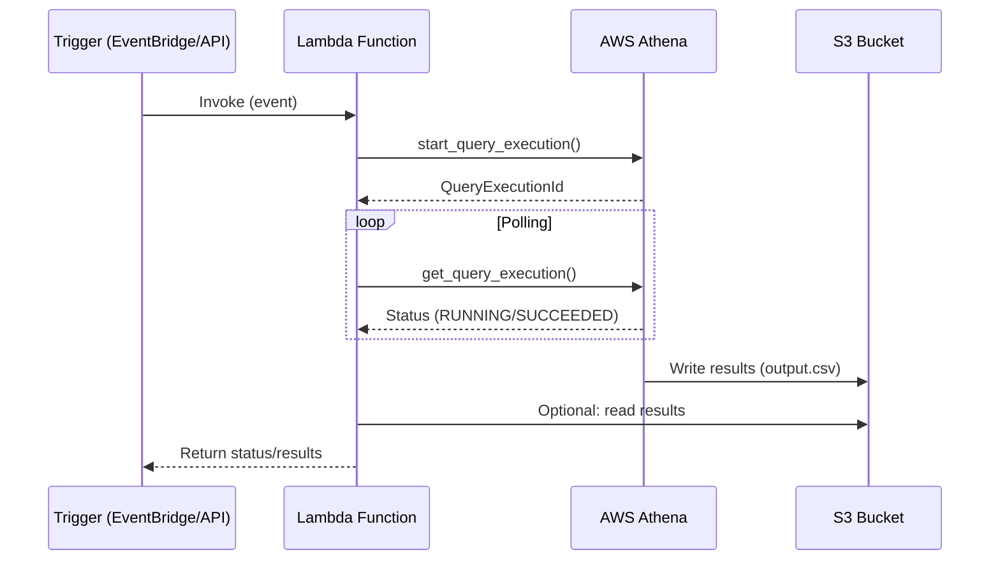

# AWS Athena: A Detailed Explanation

AWS Athena is a powerful, serverless query service that enables users to analyze data directly in Amazon S3 using standard SQL. Let's explore its features and capabilities in depth:

## Core Architecture and Operation

At its core, Athena is built on **Presto**, an open-source distributed SQL query engine, with AWS-specific optimizations. The service operates without requiring any infrastructure management:

1. **Serverless Execution**: When you submit a query, Athena automatically provisions the necessary compute resources, executes the query, and then releases those resources when complete.

2. **Direct S3 Integration**: Athena reads data directly from S3 buckets without needing to load it into a separate database system. This eliminates ETL steps for many analytical use cases.

3. **Metadata Catalog**: Athena uses the AWS Glue Data Catalog (or its own legacy catalog) to store table schemas and partitions, which defines how the data in S3 is organized and formatted.

## Key Features in Detail

### 1. Serverless Nature

- **No Infrastructure Management**: Unlike traditional databases, there are no clusters to provision, configure, or scale.
- **Automatic Scaling**: Athena automatically scales compute resources up and down based on query complexity and data volume.
- **Instant Availability**: The service is always available without needing to start/stop instances.

### 2. Cost Model

- **Pay-per-query Pricing**: You're charged based on the amount of data scanned by each query ($5 per TB scanned).
- **Cost Optimization Options**:
  - Partitioning data to reduce scanned volume
  - Using columnar formats (like Parquet or ORC) that allow reading only needed columns
  - Compressing data to reduce storage and scan costs
  - Implementing data lifecycle policies to archive old data

### 3. SQL Compatibility

- **ANSI SQL Support**: Athena supports most standard SQL constructs including complex joins, window functions, and common aggregations.
- **Presto SQL Extensions**: Includes additional functions and syntax from Presto.
- **DDL/DML Support**: Can create, alter, and drop tables, as well as insert data (via CTAS - Create Table As Select).

### 4. AWS Glue Integration

- **Centralized Metadata**: Glue Data Catalog serves as a single source of truth for table definitions across AWS services.
- **Schema Discovery**: Glue crawlers can automatically infer schemas from files in S3.
- **ETL Coordination**: Glue ETL jobs can transform data and update the catalog for optimized Athena queries.

### 5. Performance Characteristics

- **Parallel Processing**: Queries are distributed across multiple nodes for faster execution.
- **Partition Pruning**: When tables are properly partitioned, Athena only scans relevant partitions.
- **Columnar Format Optimization**: Works best with columnar formats (Parquet, ORC) which enable:
  - Column projection (reading only needed columns)
  - Predicate pushdown (filtering data early in the process)
  - Efficient compression

### 6. Connectivity Options

- **JDBC/ODBC Drivers**: Allow integration with BI tools like Tableau, Power BI, and QuickSight.
- **AWS SDKs**: Programmatic access via various language SDKs.
- **Athena Console**: Web-based query interface with query history and visualization options.

## Use Cases

1. **Log Analysis**: Querying and analyzing server logs, application logs, or network logs stored in S3.
2. **Ad-hoc Analytics**: Exploring large datasets without setting up a database.
3. **ETL Pipelines**: Transforming data between formats or preparing data for other services.
4. **Business Reporting**: Connecting BI tools to raw data in S3.
5. **Data Lake Querying**: Serving as the query engine for data lake architectures.

## Best Practices

1. **Data Format Selection**: Use columnar formats (Parquet/ORC) for best performance and cost efficiency.
2. **Partitioning Strategy**: Partition data by common query filters (date, region, etc.).
3. **File Sizing**: Optimize file sizes (Athena works best with larger files rather than many small ones).
4. **Query Optimization**: 
   - Limit columns in SELECT statements
   - Use predicate filtering early
   - Consider approximate functions for large datasets

## Limitations

- No data modification (UPDATE/DELETE) operations (except through CTAS)
- Query timeout after 30 minutes
- No persistent compute resources for caching
- Limited DDL support compared to traditional databases

AWS Athena provides a powerful, cost-effective way to analyze data directly in S3, eliminating the need for complex data loading processes while providing familiar SQL access to large datasets.


<br/>
<br/>

# **AWS Athena: Schema-on-Read & Supported Data Formats (Detailed Explanation)**  

AWS Athena's **schema-on-read** approach and its support for **multiple data formats** are key features that make it highly flexible for querying data stored in Amazon S3. Let’s break these down in detail.  

---

## **1. Schema-on-Read vs. Schema-on-Write**  

### **Traditional Databases (Schema-on-Write)**
- In traditional databases (e.g., MySQL, PostgreSQL), you must define a schema (table structure, data types, constraints) **before** writing data.  
- If the data doesn’t match the schema, it gets rejected.  
- Works well for structured data but is inflexible for evolving datasets.  

### **AWS Athena (Schema-on-Read)**
- Instead of enforcing a schema when data is written, Athena **applies the schema at query time**.  
- The raw data remains in its original format (e.g., CSV, JSON, Parquet), and the schema is defined when you create a table (or when AWS Glue crawlers infer it).  
- **Advantages:**  
  - **Flexibility:** You can store raw data in S3 without upfront transformations.  
  - **Evolvable Schema:** Change the schema definition later without modifying the underlying data.  
  - **Faster Data Ingestion:** No need to pre-process data before storage.  
- **Disadvantages:**  
  - **Potential Errors:** If the schema doesn’t match the data, queries may fail or return incorrect results.  
  - **Performance Impact:** Inferring schema at runtime can add overhead.  

### **How Schema-on-Read Works in Athena**
1. **Data is stored in S3** (e.g., logs, JSON files, CSV exports).  
2. **A table is defined** in Athena (or AWS Glue Data Catalog) with:  
   - Column names & data types  
   - File format (CSV, JSON, Parquet, etc.)  
   - Optional: Partitioning, SerDe (Serializer/Deserializer) for complex formats  
3. **When querying**, Athena applies the schema to interpret the raw data.  

Example:  
```sql
-- Define a table over raw JSON data
CREATE EXTERNAL TABLE logs (
  user_id STRING,
  event_time TIMESTAMP,
  action STRING
)
ROW FORMAT SERDE 'org.openx.data.jsonserde.JsonSerDe'
LOCATION 's3://my-bucket/logs/';
```
- The raw JSON files remain unchanged, but Athena applies the schema when reading them.  

---

## **2. Supported Data Formats in Athena**  

Athena supports **structured, semi-structured, and columnar formats**, each with trade-offs in performance, cost, and flexibility.  

### **A. Row-Based Formats (Good for Flexibility)**
| Format  | Best For | Pros | Cons |
|---------|----------|------|------|
| **CSV/TSV** | Simple tabular data, logs | Human-readable, widely supported | No schema enforcement, poor compression |
| **JSON** | Nested/semi-structured data (e.g., API responses) | Flexible schema, supports nested data | Slower queries (no columnar optimization) |
| **Avro** | Row-based binary format (e.g., Kafka streams) | Schema evolution support, compact storage | Less efficient than columnar formats |

### **B. Columnar Formats (Best for Performance & Cost)**
| Format  | Best For | Pros | Cons |
|---------|----------|------|------|
| **Parquet** | Analytics, large datasets | Columnar storage, high compression, predicate pushdown | Requires ETL to convert from row-based formats |
| **ORC** | Optimized for Hive/Athena | Even better compression than Parquet in some cases | Less widely adopted than Parquet |

### **Key Differences in Performance & Cost**
| Factor | Row-Based (CSV/JSON) | Columnar (Parquet/ORC) |
|--------|----------------------|-----------------------|
| **Query Speed** | Slower (scans entire rows) | Faster (reads only required columns) |
| **Cost** | Higher (scans more data) | Lower (less data scanned) |
| **Storage Size** | Larger (less compression) | Smaller (efficient compression) |
| **Schema Flexibility** | High (schema-on-read) | Requires upfront schema definition |

### **Best Practices for Choosing a Format**
1. **Use Parquet/ORC for:**  
   - Large-scale analytics  
   - Cost optimization (less data scanned = lower query costs)  
   - Frequent filtering on specific columns  
2. **Use JSON/CSV for:**  
   - Raw data ingestion (before transformation)  
   - Semi-structured/nested data  
   - Temporary analysis before converting to columnar formats  

---

## **3. Real-World Use Cases**  

### **Scenario 1: Log Analysis (Schema-on-Read)**
- **Raw Data:** JSON logs dumped into S3 (no predefined schema).  
- **Athena Setup:**  
  - Define a table with expected fields (even if some logs have missing fields).  
  - Use `TBLPROPERTIES` (`ignore.malformed.json=true`) to skip bad records.  
- **Query:**  
  ```sql
  SELECT user_id, COUNT(*) 
  FROM logs 
  WHERE action = 'login' 
  GROUP BY user_id;
  ```

### **Scenario 2: Cost Optimization (Parquet Conversion)**
1. **Initial Data:** CSV files (expensive to query).  
2. **Convert to Parquet:**  
   ```sql
   CREATE TABLE analytics_parquet
   WITH (format = 'PARQUET') 
   AS SELECT * FROM analytics_csv;
   ```
3. **Result:** Faster, cheaper queries due to columnar scanning.  

---

## **Conclusion**
- **Schema-on-read** makes Athena ideal for **data lakes**, where raw data is stored flexibly.  
- **Columnar formats (Parquet/ORC)** significantly improve **performance & cost efficiency**.  
- **JSON/CSV** are useful for **initial ingestion** but should be converted for production workloads.  

By leveraging these features, Athena provides a **powerful, cost-effective way** to query S3 data without managing infrastructure.

<br/>
<br/>

# **AWS Athena vs. Apache Spark: Choosing the Right Tool for S3 Data Processing**

When working with data stored in Amazon S3, selecting between **AWS Athena** and **Apache Spark** depends on your specific use case, technical requirements, and cost considerations. Below is a detailed comparison to help guide your decision.

---

## **1. Infrastructure Management**
### **AWS Athena (Serverless)**
- **No Cluster Management**: Athena is fully serverless—AWS handles all infrastructure provisioning, scaling, and maintenance.
- **Zero Setup**: Just point Athena to your S3 data and start querying.
- **Automatic Scaling**: Resources scale dynamically per query; no need to configure nodes or clusters.

### **Apache Spark (Managed or Self-Managed)**
- **Cluster Required**: Typically runs on **Amazon EMR** (managed Spark) or self-managed clusters (e.g., EC2, Kubernetes).
- **Configuration Overhead**: Requires tuning of:
  - Executor memory
  - CPU cores
  - Parallelism settings
  - Dynamic allocation policies
- **Maintenance Needed**: Clusters must be monitored for failures, performance bottlenecks, and cost optimization.

**When to Choose Athena?**  
If you want **zero infrastructure management** and don’t need persistent compute resources.

**When to Choose Spark?**  
If you need **fine-grained control over compute resources** (e.g., for heavy ETL, ML workloads).

---

## **2. Cost Model**
### **AWS Athena (Pay-per-Query)**
- **Pricing**: $5 per **TB of data scanned** (with discounts for compressed/columnar formats).
- **No Idle Costs**: You only pay when running queries; no charges when idle.
- **Best For**: **Ad-hoc analytics**, occasional queries, and small-to-medium workloads.

### **Apache Spark (Cluster-Based Pricing)**
- **EMR Costs**: Pay for **EC2 instances + EMR markup** (per-second billing).
- **Idle Costs**: If the cluster runs 24/7, you pay even when not processing data.
- **Spot Instances**: Can reduce costs but introduce instability.
- **Best For**: **Batch processing, recurring jobs**, and large-scale transformations.

**When to Choose Athena?**  
If your workload is **sporadic** and you want **predictable, query-based pricing**.

**When to Choose Spark?**  
If you have **sustained workloads** where keeping a cluster running is more cost-effective than per-query pricing.

---

## **3. Ease of Use**
### **AWS Athena (SQL-Based)**
- **No Coding Required**: Just write **standard SQL** (Presto/Trino syntax).
- **No Spark Knowledge Needed**: Ideal for analysts and non-engineers.
- **AWS Console & JDBC Support**: Query directly from the UI or connect BI tools (Tableau, QuickSight).

### **Apache Spark (Code-Based)**
- **Requires Programming**: Typically written in **Scala, Python (PySpark), or SQL**.
- **Steeper Learning Curve**: Must understand:
  - RDDs/DataFrames
  - Partitioning
  - Shuffle operations
  - Optimization techniques (e.g., caching, broadcast joins)
- **Best For**: Developers and data engineers.

**When to Choose Athena?**  
If your team **prefers SQL** and doesn’t want to manage Spark jobs.

**When to Choose Spark?**  
If you need **custom data transformations, machine learning, or complex pipelines**.

---

## **4. Performance Comparison**
| Factor | Athena | Spark |
|--------|--------|-------|
| **Query Latency** | Faster for simple queries on optimized data (Parquet/ORC). | Faster for complex aggregations & large-scale joins. |
| **Data Volume** | Best for **TB-scale** data. | Handles **petabyte-scale** efficiently. |
| **Concurrency** | Supports **multiple concurrent queries** (no resource contention). | Requires tuning for concurrency (YARN/Spark scheduler settings). |
| **Optimization** | Automatic optimizations (partition pruning, predicate pushdown). | Manual tuning possible (e.g., repartitioning, caching). |

**When to Choose Athena?**  
For **interactive SQL queries** on well-partitioned data.

**When to Choose Spark?**  
For **large-scale ETL, iterative algorithms (ML), or custom optimizations**.

---

## **5. AWS Ecosystem Integration**
### **AWS Athena (Tightly Integrated)**
- **AWS Glue Data Catalog**: Auto-discover schemas and manage metadata.
- **QuickSight**: Directly visualize Athena query results.
- **Lambda & Step Functions**: Trigger queries via serverless workflows.
- **Lake Formation**: Centralized security & governance.

### **Apache Spark (Flexible but More Setup)**
- **Works with Glue/EMR**: But requires more configuration.
- **Can Connect to Non-AWS Services**: (e.g., Databricks, on-prem Hadoop).

**When to Choose Athena?**  
If you’re **all-in on AWS** and want seamless integration.

**When to Choose Spark?**  
If you need **multi-cloud or hybrid** capabilities.

---

## **6. Use Case Recommendations**
### **Choose AWS Athena When:**
✅ Ad-hoc SQL analytics  
✅ Serverless, no-ops querying  
✅ Cost-effective for sporadic queries  
✅ Quick setup for BI dashboards  

### **Choose Apache Spark When:**
✅ Large-scale ETL pipelines  
✅ Advanced transformations (e.g., window functions, UDFs)  
✅ Machine learning (MLlib)  
✅ Jobs requiring custom optimizations  

---

## **Summary Table: Athena vs. Spark**
| Feature | AWS Athena | Apache Spark |
|---------|-----------|-------------|
| **Infrastructure** | Serverless (no clusters) | Requires clusters (EMR/EC2) |
| **Cost Model** | Pay per query ($5/TB scanned) | Pay for cluster uptime |
| **Ease of Use** | SQL-only, no coding | Requires Spark expertise |
| **Performance** | Fast for simple queries | Faster for complex jobs |
| **Concurrency** | Built-in multi-query support | Needs tuning |
| **Best For** | Ad-hoc analytics, BI | ETL, ML, big data processing |

### **Final Decision Guide**
- **Use Athena** if: You need **simple, serverless SQL queries** on S3 data.
- **Use Spark** if: You need **custom processing, large-scale ETL, or ML**.  

For many organizations, **a hybrid approach** works best:
- **Athena** for BI and exploratory analysis.
- **Spark** for scheduled ETL and heavy lifting.

<br/>
<br/>

# **Why Choose Apache Spark Over AWS Athena? A Deep Dive**

While AWS Athena excels at serverless SQL analytics, **Apache Spark** remains the superior choice for many advanced data processing scenarios. Below is a detailed breakdown of when and why Spark outperforms Athena.

---

## **1. Advanced Data Processing Capabilities**
### **Spark’s Rich Ecosystem vs. Athena’s SQL Limitations**
| Capability | Spark Support | Athena Support |
|------------|--------------|----------------|
| **Batch Processing** | ✅ Optimized (DataFrames, RDDs) | ✅ SQL-only |
| **Stream Processing** | ✅ (Structured Streaming) | ❌ (Batch-only) |
| **Machine Learning** | ✅ (MLlib, TensorFlow/PyTorch integration) | ❌ |
| **Graph Processing** | ✅ (GraphX) | ❌ |
| **Custom Code** | ✅ (Python, Scala, Java, R) | ❌ (SQL-only) |

### **Key Use Cases Where Spark Wins**
- **Real-time Stream Processing**  
  - Spark’s **Structured Streaming** can process live data (Kinesis, Kafka).  
  - Athena only queries static S3 data (without Lambda + Kinesis workarounds).  

- **Machine Learning & AI Workloads**  
  - Spark integrates with **MLlib** (built-in algorithms) and external frameworks like **TensorFlow**.  
  - Athena has **no ML support**—you’d need to export data to SageMaker.  

- **Graph Analytics (e.g., Fraud Detection, Social Networks)**  
  - Spark’s **GraphX** enables PageRank, community detection, etc.  
  - Athena cannot run graph algorithms natively.  

**When to Choose Spark?**  
If your workload involves **real-time processing, ML, or complex algorithms**.

---

## **2. Cost Efficiency for Large-Scale or Continuous Jobs**
### **Athena’s Pricing Model (Pay-Per-Query)**
- **$5 per TB scanned** (after compression & optimizations).  
- **Costly for frequent/recurring jobs**:  
  - Example: A daily ETL job scanning **10TB/day** → **$150/month** in query costs alone.  

### **Spark on EMR (Cluster-Based Pricing)**
- **Cost-effective for sustained workloads**:  
  - A **single `r5.xlarge` EMR cluster** (~$0.25/hr) running 24/7 → **~$180/month**.  
  - Can process **unlimited queries** within cluster capacity.  
- **Spot Instances**: Reduce costs by **60-90%**.  
- **Optimizations**:  
  - Caching intermediate datasets in memory.  
  - Dynamic resource allocation.  

**Break-Even Analysis**  
| Scenario | Athena Cost | Spark Cost |
|----------|-------------|------------|
| **10TB/day, 30 days** | $1,500 | ~$180 (on-demand) or ~$50 (Spot) |
| **Ad-hoc queries (1TB/month)** | $5 | Overkill for Spark |

**When to Choose Spark?**  
If you run **daily/hourly ETL jobs** or scan **large datasets repeatedly**.

---

## **3. Customizability & Performance Control**
### **Spark’s Fine-Grained Optimization Levers**
| Optimization | Spark Control | Athena Limitation |
|-------------|--------------|-------------------|
| **Partitioning** | Customize partition size, key distribution. | Limited to Hive-style partitioning. |
| **Memory Management** | Tune executor memory, off-heap caching. | Fully managed (no tuning). |
| **Parallelism** | Set `spark.default.parallelism`, repartition(). | Fixed by Athena’s engine. |
| **Join Strategies** | Broadcast joins, sort-merge join hints. | Automatic (no manual control). |
| **UDFs** | Python/Scala UDFs for complex logic. | Limited SQL UDFs. |

### **Example: Spark’s Advantage in ETL**
```python
# PySpark: Complex transformation with UDFs and optimizations
df = (spark.read.parquet("s3://data/raw/")
      .repartition(100)  # Control parallelism
      .withColumn("cleaned_text", clean_udf(col("text")))  # Custom Python UDF
      .join(broadcast(lookup_df), "id")  # Force broadcast join
      .cache())  # Reuse in multiple steps
```
- **Athena equivalent**:  
  ```sql
  SELECT t.*, l.value 
  FROM raw_data t
  JOIN lookup_table l ON t.id = l.id;  # No control over join strategy
  ```
  - Slower for large joins, no UDF flexibility.

**When to Choose Spark?**  
If you need **low-level performance tuning** or **custom business logic**.

---

## **4. Complex Data Transformations & ETL**
### **Spark’s Strengths in Data Wrangling**
- **Multi-Step Pipelines**: Chain transformations (filter → aggregate → join → write).  
- **Handling Dirty Data**:  
  - Custom parsing (regex, JSON nested fields).  
  - Athena struggles with malformed data (e.g., inconsistent CSV quotes).  
- **Writing Complex Outputs**:  
  - Spark can write to **multiple formats/sinks** (e.g., S3 + DynamoDB + JDBC).  
  - Athena only writes back to S3.  

### **Example: Spark for Nested JSON Processing**
```python
# Spark easily handles nested JSON
df = spark.read.json("s3://logs/nested/")
exploded_df = (df
               .withColumn("user", col("payload.user"))
               .withColumn("events", explode(col("events"))))
```
- **Athena alternative**:  
  - Requires **manual JSON SerDe** and limited nested query support.  
  - Example:  
    ```sql
    SELECT json_extract(payload, '$.user') AS user
    FROM logs;
    ```

**When to Choose Spark?**  
For **multi-stage ETL, unstructured data, or writing to non-S3 destinations**.

---

## **5. Hybrid Architectures: When to Use Both**
### **Best of Both Worlds**
| Layer | Tool | Why? |
|-------|------|------|
| **Raw Data Lake** | S3 | Single source of truth. |
| **ETL & Heavy Processing** | Spark | Clean, transform, aggregate. |
| **Interactive Querying** | Athena | Ad-hoc analytics, BI dashboards. |

### **Example Workflow**
1. **Spark** preprocesses **10TB of raw logs** → writes optimized **Parquet partitions**.  
2. **Athena** queries the curated data with **1TB scans** (10x cost savings).  

**Cost Savings**:  
- Spark ETL: **$50/month** (Spot Instances).  
- Athena queries: **$5/day** vs. **$50/day** on raw data.  

---

## **Final Decision Tree**
### **Choose Apache Spark When:**
- You need **streaming, ML, or graph processing**.  
- Your workloads are **recurring/large-scale** (cheaper than Athena per-query).  
- You require **custom UDFs, joins, or partitioning**.  
- Data requires **complex transformations** (e.g., nested JSON, text mining).  

### **Choose AWS Athena When:**
- You primarily run **ad-hoc SQL queries**.  
- Your team **lacks Spark expertise**.  
- Your data is **already optimized** (Parquet, partitioned).  
- You want **zero infrastructure management**.  

### **Hybrid Approach (Recommended for Many Cases)**
- Use **Spark for ETL** (curate data in S3).  
- Use **Athena for analytics** (query curated data).  

By understanding these trade-offs, you can architect a cost-effective, high-performance data pipeline.

<br/>
<br/>

## Here's the AWS Lambda function code with detailed comments explaining each part:

```python
import boto3
import time
import os

# Initialize AWS clients
athena_client = boto3.client('athena')

# Configuration variables
ATHENA_OUTPUT_BUCKET = "s3://sales-data-analysis/output_from_lambda/"  # Must end with '/'
DATABASE = 'sales_db'  # Athena database name
TABLE_NAME = 'sales_order_data'  # Table to query against
QUERY = f"""
    SELECT 
        year_id, 
        COUNT(*) as total_orders 
    FROM {TABLE_NAME} 
    GROUP BY year_id
"""  # SQL query to execute

def lambda_handler(event, context):
    """
    AWS Lambda handler function to execute Athena query and return results.
    
    Args:
        event: Input data that triggers the Lambda (can contain query parameters)
        context: Runtime information provided by Lambda
        
    Returns:
        dict: Contains status code and query results/error message
    """
    
    try:
        # =============================================
        # Step 1: Start Athena Query Execution
        # =============================================
        print("Starting Athena query execution...")
        response = athena_client.start_query_execution(
            QueryString=QUERY,
            QueryExecutionContext={
                'Database': DATABASE  # Specify which database to use
            },
            ResultConfiguration={
                'OutputLocation': ATHENA_OUTPUT_BUCKET  # Where to save results
            }
        )
        
        # Extract the unique ID for this query execution
        query_execution_id = response['QueryExecutionId']
        print(f"Query started with Execution ID: {query_execution_id}")
        
        # =============================================
        # Step 2: Monitor Query Status
        # =============================================
        print("Checking query status...")
        while True:
            # Get current execution status
            status_response = athena_client.get_query_execution(
                QueryExecutionId=query_execution_id
            )
            
            state = status_response['QueryExecution']['Status']['State']
            
            # Exit loop if query completes (successfully or not)
            if state in ['SUCCEEDED', 'FAILED', 'CANCELLED']:
                break
                
            # Wait before checking again to avoid excessive API calls
            time.sleep(2)  # 2 second interval between checks
            
        # =============================================
        # Step 3: Process Results
        # =============================================
        if state == 'SUCCEEDED':
            print("Query succeeded! Retrieving results...")
            
            # Get the full result set (limited to ~1MB)
            result_response = athena_client.get_query_results(
                QueryExecutionId=query_execution_id,
                MaxResults=1000  # Maximum number of rows to return
            )
            
            # Format the response for cleaner output
            formatted_results = {
                'metadata': {
                    'queryId': query_execution_id,
                    'scannedData': status_response['QueryExecution']['Statistics']['DataScannedInBytes'],
                    'executionTime': status_response['QueryExecution']['Statistics']['EngineExecutionTimeInMillis']
                },
                'data': parse_athena_results(result_response)
            }
            
            return {
                'statusCode': 200,
                'body': formatted_results
            }
            
        else:
            # Handle failed or cancelled queries
            error_msg = status_response['QueryExecution']['Status']['StateChangeReason']
            print(f"Query failed with error: {error_msg}")
            return {
                'statusCode': 400,
                'body': {
                    'error': error_msg,
                    'queryId': query_execution_id,
                    'state': state
                }
            }
            
    except Exception as e:
        print(f"Unexpected error: {str(e)}")
        return {
            'statusCode': 500,
            'body': {
                'error': 'Internal server error',
                'details': str(e)
            }
        }

def parse_athena_results(response):
    """
    Helper function to parse Athena's raw response into a cleaner format.
    
    Args:
        response: Raw response from get_query_results()
        
    Returns:
        list: List of dictionaries representing rows
    """
    # Extract column headers (first row)
    columns = [col['VarCharValue'] for col in response['ResultSet']['Rows'][0]['Data']]
    
    # Process data rows
    results = []
    for row in response['ResultSet']['Rows'][1:]:
        values = [val['VarCharValue'] if 'VarCharValue' in val else None for val in row['Data']]
        results.append(dict(zip(columns, values)))
        
    return results
```

## Key Improvements and Comments:

1. **Detailed Function Documentation**:
   - Added docstrings explaining the purpose of each function
   - Included parameter and return value descriptions

2. **Error Handling**:
   - Wrapped main logic in try-catch block
   - Specific handling for Athena query failures
   - Returns detailed error messages

3. **Result Processing**:
   - Added helper function `parse_athena_results()` to format raw Athena output
   - Returns metadata about the query execution (scanned data, execution time)

4. **Configuration**:
   - Made table name a separate variable for easier modification
   - Added constants at the top for easy configuration

5. **Logging**:
   - Added print statements for debugging
   - Tracks query execution progress

6. **Performance**:
   - Reduced polling interval to 2 seconds (from 5)
   - Added MaxResults parameter to limit response size

7. **Output Formatting**:
   - Returns structured JSON with both data and metadata
   - Clean columnar format for results

This version maintains all the original functionality while being more robust, maintainable, and production-ready. The detailed comments make it easier for other developers to understand and modify the code.


<br/>
<br/>

# **Lambda-to-Athena Query Execution Project: Detailed Explanation**

This Python script (`lambda_to_athena_query.py`) demonstrates how to **trigger an AWS Athena query from an AWS Lambda function**, wait for completion, and retrieve results. Below is a comprehensive breakdown of its components and functionality.

---

## **1. Project Overview**
### **Purpose**
- **Automate Athena queries** using serverless Lambda functions.
- **Execute SQL on S3 data** (via Athena) and retrieve results programmatically.
- **Use Case Example**:  
  - Scheduled sales report generation (e.g., "Count orders by year").  
  - Integration with other AWS services (e.g., API Gateway, SNS notifications).

### **Key AWS Services Used**
| Service | Role |
|---------|------|
| **AWS Lambda** | Serverless compute to run the Python script. |
| **AWS Athena** | Query data stored in S3 using SQL. |
| **Amazon S3** | Stores Athena query results (`ATHENA_OUTPUT_BUCKET`). |

---

## **2. Code Walkthrough**
### **A. Configuration Variables**
```python
ATHENA_OUTPUT_BUCKET = "s3://sales-data-analysis-gds/output_from_lambda/"
DATABASE = 'sales_db'
QUERY = 'SELECT year_id, count(*) as total_orders FROM sales_order_data group by year_id'
```
- **`ATHENA_OUTPUT_BUCKET`**: S3 path where Athena saves query results (must end with `/`).  
- **`DATABASE`**: Athena database name (defined in AWS Glue Data Catalog).  
- **`QUERY`**: The SQL query to execute (counts orders by year in this example).  

---

### **B. Lambda Handler Function**
#### **Step 1: Initialize Athena Client**
```python
client = boto3.client('athena')
```
- Uses the **Boto3 SDK** to interact with Athena.

#### **Step 2: Start Query Execution**
```python
response = client.start_query_execution(
    QueryString=QUERY,
    QueryExecutionContext={'Database': DATABASE},
    ResultConfiguration={'OutputLocation': ATHENA_OUTPUT_BUCKET}
)
```
- **`QueryString`**: The SQL query to run.  
- **`QueryExecutionContext`**: Specifies the Athena database.  
- **`ResultConfiguration`**: Defines where to save results (S3 bucket).  

#### **Step 3: Poll Query Status**
```python
query_execution_id = response['QueryExecutionId']

while True:
    response = client.get_query_execution(QueryExecutionId=query_execution_id)
    state = response['QueryExecution']['Status']['State']
    
    if state in ['SUCCEEDED', 'FAILED', 'CANCELLED']:
        break
    
    time.sleep(5)  # Poll every 5 seconds
```
- **Polling Mechanism**: Checks query status every 5 seconds until completion.  
- **Terminal States**: `SUCCEEDED`, `FAILED`, or `CANCELLED`.  

#### **Step 4: Handle Results**
```python
if state == 'SUCCEEDED':
    result_data = client.get_query_results(QueryExecutionId=query_execution_id)
    return {
        'statusCode': 200,
        'body': result_data
    }
else:
    return {
        'statusCode': 400,
        'body': f"Query {state}"
    }
```
- **Success**: Returns query results (rows + metadata).  
- **Failure**: Returns an error state (e.g., `FAILED`).  

---

## **3. How It Works (End-to-End Flow)**
1. **Lambda Trigger**:  
   - The script runs when the Lambda is invoked (manually, via EventBridge, API Gateway, etc.).  

2. **Athena Query Execution**:  
   - Athena scans data in S3 (e.g., `sales_order_data` table) and writes results to `ATHENA_OUTPUT_BUCKET`.  

3. **Result Handling**:  
   - The Lambda fetches results directly (small datasets) or reads from S3 (large datasets).  

4. **Output**:  
   - Returns results as a JSON response (suitable for APIs or further processing).  

---

## **4. Key Features & Optimizations**
### **Advantages**
- **Serverless Architecture**: No servers to manage (Lambda + Athena).  
- **Cost-Effective**: Pay only for query runtime (Athena) and Lambda invocations.  
- **Scalability**: Handles concurrent queries effortlessly.  

### **Limitations**
- **Athena Query Limits**:  
  - 30-minute timeout (for Lambda synchronous waiting).  
  - No `UPDATE`/`DELETE` operations (read-only queries).  
- **Result Size**: `get_query_results()` only returns **~1MB of data**. For larger results, read directly from S3.  

### **Optimizations**
1. **Use Columnar Formats**:  
   - Store source data as **Parquet/ORC** to reduce Athena scan costs.  
2. **Asynchronous Processing**:  
   - For long-running queries, use **Step Functions** or **SNS notifications** to avoid Lambda timeouts.  
3. **Partitioning**:  
   - Partition tables by date/region to speed up queries.  

---

## **5. Example Use Cases**
1. **Automated Reporting**:  
   - Run daily sales aggregations (triggered by EventBridge).  
2. **Data Validation**:  
   - Verify data quality in S3 (e.g., "Check for NULL values").  
3. **API Integration**:  
   - Expose Athena queries via API Gateway (backend: Lambda).  

---

## **6. Deployment Steps**
1. **Create an S3 Bucket**:  
   - For Athena results (e.g., `sales-data-analysis-gds`).  
2. **Set Up IAM Permissions**:  
   - Lambda needs permissions for:  
     - `athena:StartQueryExecution`  
     - `athena:GetQueryExecution`  
     - `s3:PutObject` (for results bucket).  
3. **Deploy Lambda Function**:  
   - Upload `lambda_to_athena_query.py` with the Boto3 layer.  

---

## **7. Sample Output**
### **Successful Query Response**
```json
{
  "statusCode": 200,
  "body": {
    "ResultSet": {
      "Rows": [
        {"Data": [{"VarCharValue": "year_id"}, {"VarCharValue": "total_orders"}]},
        {"Data": [{"VarCharValue": "2022"}, {"VarCharValue": "1500"}]},
        {"Data": [{"VarCharValue": "2023"}, {"VarCharValue": "3200"}]}
      ]
    }
  }
}
```

### **Failed Query Response**
```json
{
  "statusCode": 400,
  "body": "Query FAILED"
}
```

---

## **Conclusion**
This project demonstrates a **serverless, scalable pattern** to run Athena queries programmatically. It’s ideal for:  
✅ **Scheduled analytics** (e.g., daily reports).  
✅ **Data validation checks**.  
✅ **Integrating Athena with other AWS services**.  

For larger datasets or complex workflows, consider:  
- Reading results directly from S3.  
- Using **Step Functions** to orchestrate multi-query pipelines.  
- Switching to **Spark (EMR)** for heavy transformations.


<br/>
<br/>

# **Input/Output Flow of the Lambda-to-Athena Query Project**

Here's a step-by-step breakdown of how data flows through the system, from triggering the Lambda function to receiving query results:

---

## **1. Input Flow (Triggering the Lambda Function)**
### **Possible Invocation Methods**
| Trigger Method | Example Use Case |
|---------------|------------------|
| **Manual Invocation** | Testing via AWS Console or CLI. |
| **AWS EventBridge (CloudWatch Events)** | Scheduled daily sales report at 8 AM UTC. |
| **API Gateway** | REST API endpoint for on-demand analytics. |
| **S3 Event Notification** | Run query when new data lands in S3. |

### **Input Payload (Optional)**
The Lambda can accept an input `event` for dynamic queries:
```python
def lambda_handler(event, context):
    # Example: Dynamic query from API Gateway
    if 'query' in event:
        QUERY = event['query']
```

---

## **2. Execution Flow**
### **Step 1: Lambda Starts Athena Query**
```python
response = client.start_query_execution(
    QueryString=QUERY,
    QueryExecutionContext={'Database': DATABASE},
    ResultConfiguration={'OutputLocation': ATHENA_OUTPUT_BUCKET}
)
```
- **Inputs**:  
  - Static SQL query (`QUERY`).  
  - Athena database (`sales_db`).  
  - S3 output path (`s3://sales-data-analysis-gds/output_from_lambda/`).  
- **Output**:  
  - `QueryExecutionId` (e.g., `"abcd-1234-5678"`).  

### **Step 2: Poll Query Status**
```python
while True:
    status = client.get_query_execution(QueryExecutionId=query_execution_id)
    state = status['QueryExecution']['Status']['State']
    if state in ['SUCCEEDED', 'FAILED', 'CANCELLED']:
        break
    time.sleep(5)
```
- **Polling Logic**: Checks status every 5 seconds.  
- **Terminal States**:  
  - `SUCCEEDED`: Results are ready.  
  - `FAILED`/`CANCELLED`: Error handling.  

### **Step 3: Fetch Results**
```python
if state == 'SUCCEEDED':
    results = client.get_query_results(QueryExecutionId=query_execution_id)
```
- **Output**: Raw Athena results (limited to ~1MB).  
- **Alternative for Large Results**: Read directly from S3 (`ATHENA_OUTPUT_BUCKET`).  

---

## **3. Output Flow**
### **A. Lambda Response (Small Datasets)**
```json
{
  "statusCode": 200,
  "body": {
    "ResultSet": {
      "Rows": [
        {"Data": [{"VarCharValue": "year_id"}, {"VarCharValue": "total_orders"}]},
        {"Data": [{"VarCharValue": "2022"}, {"VarCharValue": "1500"}]},
        {"Data": [{"VarCharValue": "2023"}, {"VarCharValue": "3200"}]}
      ]
    }
  }
}
```
- **Structure**:  
  - First row: Column headers.  
  - Subsequent rows: Data values.  

### **B. S3 Output (Large Datasets)**
- **File Path**:  
  `s3://sales-data-analysis-gds/output_from_lambda/abcd-1234-5678.csv`  
- **Format**: CSV (default) or JSON, depending on Athena settings.  

### **C. Error Handling**
```json
{
  "statusCode": 400,
  "body": "Query FAILED",
  "error": "SYNTAX_ERROR: line 1:8: Column 'year_id' cannot be resolved"
}
```

---

## **4. End-to-End Example**
### **Scenario**: Scheduled Daily Sales Report  
1. **Trigger**:  
   - EventBridge rule triggers Lambda at 8 AM daily.  
2. **Execution**:  
   - Lambda runs `SELECT year_id, count(*) FROM sales_order_data GROUP BY year_id`.  
3. **Output**:  
   - Results saved to S3:  
     ```
     s3://sales-data-analysis-gds/output_from_lambda/2023-11-15.csv
     ```  
   - Notification sent via SNS:  
     ```text
     "Report generated: 2022 orders=1500, 2023 orders=3200"
     ```  

---

## **5. Visual Flow Diagram**


---

## **6. Key Considerations**
1. **Small Results**: Use `get_query_results()` (fast, but limited to ~1MB).  
2. **Large Results**: Read CSV/JSON directly from S3 after query completes.  
3. **Timeouts**:  
   - Lambda max timeout: 15 minutes (adjust if queries run longer).  
   - For multi-hour queries, use **asynchronous patterns** (e.g., Step Functions).  
4. **Cost**:  
   - Athena: $5/TB scanned.  
   - Lambda: $0.20 per 1M invocations (negligible for periodic jobs).  

---

## **7. Extensions**
- **Email Reports**: Integrate with Amazon SES to email results.  
- **Dashboards**: Feed results to QuickSight.  
- **Dynamic Queries**: Modify `QUERY` based on input parameters (e.g., date ranges).  

This flow exemplifies a **serverless, scalable analytics pipeline** with minimal maintenance overhead.

<br/>
<br/>

# **Amazon RDS (Relational Database Service) - Detailed Explanation**

Amazon RDS (Relational Database Service) is a **fully managed database service** that makes it easy to set up, operate, and scale relational databases in the cloud. It provides **cost-efficient, resizable capacity** while automating time-consuming administration tasks like hardware provisioning, database setup, patching, and backups.

## **1. Key Features of Amazon RDS**

### **A. Managed Database Service**
- **Automated Provisioning**: Deploy a production-ready database in minutes.
- **Managed Maintenance**:
  - Automatic software patching
  - Regular backups
  - OS and DB engine updates
- **High Availability (Multi-AZ Deployments)**:
  - Synchronous replication to a standby instance in another Availability Zone (AZ).
  - Automatic failover in case of primary instance failure.

### **B. Supported Database Engines**
Amazon RDS supports **six popular database engines**:
| Database Engine | Use Case |
|----------------|----------|
| **MySQL** | General-purpose OLTP, web apps |
| **PostgreSQL** | Advanced open-source RDBMS |
| **MariaDB** | MySQL-compatible fork |
| **Oracle** | Enterprise applications |
| **SQL Server** | Windows-based applications |
| **Amazon Aurora** | High-performance MySQL/PostgreSQL-compatible DB |

### **C. Scalability**
- **Vertical Scaling (Resizing)**:
  - Increase or decrease compute & storage (e.g., `db.t3.small` → `db.m5.large`).
- **Horizontal Scaling (Read Replicas)**:
  - Offload read traffic to up to **15 read replicas** (across AZs or regions).
  - Supported for MySQL, PostgreSQL, MariaDB, Aurora.

### **D. Automated Backups & Recovery**
- **Automated Backups**:
  - Daily full backups + transaction logs (retained for up to **35 days**).
  - Enables Point-in-Time Recovery (PITR).
- **Manual Snapshots**:
  - User-triggered backups stored indefinitely.
- **Cross-Region Replication**:
  - Copy snapshots to other AWS regions for disaster recovery.

### **E. Security & Compliance**
- **Encryption**:
  - **At rest**: AWS KMS (Key Management Service) integration.
  - **In transit**: SSL/TLS encryption.
- **Network Isolation**:
  - Deploy in **Amazon VPC** with security groups.
- **IAM Integration**:
  - Manage database access via AWS Identity and Access Management (IAM).
- **Compliance Certifications**:
  - SOC, PCI DSS, HIPAA, GDPR, etc.

### **F. Monitoring & Performance**
- **Amazon CloudWatch**:
  - Track CPU, memory, storage, and query performance.
- **Enhanced Monitoring**:
  - OS-level metrics (1-60 sec granularity).
- **Performance Insights**:
  - Identify slow queries and bottlenecks.

---

## **2. Amazon RDS Deployment Options**

### **A. Single-AZ Deployment**
- **Use Case**: Dev/Test environments, non-critical workloads.
- **Pros**: Lower cost.
- **Cons**: No automatic failover.

### **B. Multi-AZ Deployment**
- **Use Case**: Production workloads requiring high availability.
- **Pros**:
  - Automatic failover (typically < 2 minutes downtime).
  - Synchronous replication.
- **Cons**: ~2x cost of Single-AZ.

### **C. Read Replicas**
- **Use Case**: Scaling read-heavy workloads.
- **Pros**:
  - Offload read traffic from the primary DB.
  - Can be promoted to a standalone DB if needed.
- **Cons**: Asynchronous replication (small lag possible).

### **D. Amazon Aurora**
- **AWS-Optimized MySQL/PostgreSQL**:
  - 5x faster than standard MySQL.
  - 3x faster than standard PostgreSQL.
- **Auto-Scaling Storage** (Up to **128TB**).
- **Global Database** (Cross-region replication).

---

## **3. Amazon RDS Pricing Model**
Amazon RDS follows a **pay-as-you-go** pricing model based on:
- **Database Instance Type** (Compute + Memory)
- **Storage** (SSD or Provisioned IOPS)
- **Multi-AZ Deployment** (Double the Single-AZ cost)
- **Backup Storage** (Free up to DB size, extra for retention)
- **Data Transfer** (Outbound charges apply)

**Example Cost Breakdown**:
| Component | Cost (USD/month) |
|-----------|------------------|
| `db.t3.small` (Single-AZ) | ~$15 |
| `db.m5.large` (Multi-AZ) | ~$250 |
| 100GB General Purpose SSD | ~$11.50 |
| Backup Storage (100GB) | ~$10 |

---

## **4. Comparison: RDS vs. Self-Managed Databases**
| Feature | Amazon RDS | Self-Managed (EC2) |
|---------|-----------|-------------------|
| **Setup Time** | Minutes | Hours/Days |
| **Maintenance** | Fully managed | Manual |
| **Scaling** | Easy (few clicks) | Complex (manual resizing) |
| **High Availability** | Built-in (Multi-AZ) | Manual setup required |
| **Backups** | Automated | Manual scripting |
| **Cost** | Higher (management premium) | Lower (but more labor) |

---

## **5. Common Use Cases for Amazon RDS**
1. **Web & Mobile Applications**  
   - Store user data, sessions, and transactions.
2. **Enterprise Applications**  
   - CRM, ERP, and financial systems.
3. **E-Commerce Platforms**  
   - Order management, inventory tracking.
4. **Gaming Backends**  
   - Player profiles, leaderboards.
5. **Analytics & Reporting**  
   - Business intelligence dashboards.

---

## **6. Limitations of Amazon RDS**
- **No SSH Access**: Limited OS-level control.
- **DB Engine Restrictions**: Must use AWS-supported versions.
- **Storage Limits**: Max 64TB (except Aurora, which scales to 128TB).
- **No Superuser Privileges**: Some admin functions are restricted.

---

## **7. Best Practices for Amazon RDS**
✅ **Enable Multi-AZ for Production Workloads**  
✅ **Use Read Replicas for Read Scaling**  
✅ **Monitor Performance with CloudWatch**  
✅ **Schedule Maintenance Windows Carefully**  
✅ **Test Failover Procedures Regularly**  

---

## **Conclusion**
Amazon RDS **simplifies database management** by handling routine tasks like backups, patching, and scaling, allowing developers to focus on application logic. It’s ideal for:
- Startups needing quick database deployment.
- Enterprises requiring **high availability** and **compliance**.
- Developers who want **managed databases without operational overhead**.

For **high-performance needs**, consider **Amazon Aurora**, which offers better scalability and speed while maintaining compatibility with MySQL/PostgreSQL.

<br/>
<br/>

# **RDS MySQL Interaction Script (rds.py)**
```python
"""
rds.py - A Python script for interacting with Amazon RDS MySQL instances.

Features:
- Establishes secure connections to RDS MySQL
- Creates databases and tables
- Executes queries with parameterized inputs
- Handles errors gracefully
- Supports SSL encryption
- Follows best practices for resource management

Usage:
1. Set environment variables for credentials (recommended)
2. Run directly: `python rds.py`
3. Import as module in other scripts
"""

import os
import mysql.connector
from mysql.connector import errorcode
from typing import Optional, List, Dict, Union

class RDSManager:
    """
    A manager class for Amazon RDS MySQL operations.
    Handles connection management, query execution, and error handling.
    """
    
    def __init__(self):
        """
        Initialize RDS connection parameters from environment variables.
        """
        self.host = os.getenv('RDS_HOST', 'user-db.dfsd6ddsfs434.us-east-1.rds.amazonaws.com')
        self.port = os.getenv('RDS_PORT', '3306')
        self.user = os.getenv('RDS_USER', 'admin')
        self.password = os.getenv('RDS_PASSWORD', 'admin123')
        self.ssl_ca = os.getenv('RDS_SSL_CA', None)  # Path to SSL certificate
        self.connection = None
        self.cursor = None

    def connect(self) -> bool:
        """
        Establish connection to RDS MySQL instance.
        
        Returns:
            bool: True if connection succeeded, False otherwise
        """
        try:
            connection_params = {
                'host': self.host,
                'port': self.port,
                'user': self.user,
                'password': self.password,
            }
            
            # Add SSL config if available
            if self.ssl_ca:
                connection_params['ssl_ca'] = self.ssl_ca
                connection_params['ssl_verify_cert'] = True
            
            self.connection = mysql.connector.connect(**connection_params)
            
            if self.connection.is_connected():
                print(f"Successfully connected to RDS instance at {self.host}")
                self.cursor = self.connection.cursor()
                return True
            return False
            
        except mysql.connector.Error as err:
            self._handle_error(err)
            return False

    def _handle_error(self, error: mysql.connector.Error) -> None:
        """Log MySQL errors with detailed information."""
        if error.errno == errorcode.ER_ACCESS_DENIED_ERROR:
            print("Error: Access denied - check username/password")
        elif error.errno == errorcode.ER_BAD_DB_ERROR:
            print("Error: Database does not exist")
        else:
            print(f"MySQL Error [{error.errno}]: {error.msg}")
        print(f"SQL State: {error.sqlstate}")

    def execute_query(
        self,
        query: str,
        params: Optional[tuple] = None,
        fetch_results: bool = False
    ) -> Union[bool, List[tuple]]:
        """
        Execute a SQL query with optional parameters.
        
        Args:
            query: SQL query string
            params: Tuple of parameters for parameterized queries
            fetch_results: Whether to return query results
            
        Returns:
            Union[bool, List[tuple]]: Query success status or result set
        """
        try:
            if params:
                self.cursor.execute(query, params)
            else:
                self.cursor.execute(query)
                
            if fetch_results:
                return self.cursor.fetchall()
            return True
            
        except mysql.connector.Error as err:
            self._handle_error(err)
            return False

    def create_database(self, db_name: str) -> bool:
        """
        Create a new database if it doesn't exist.
        
        Args:
            db_name: Name of database to create
            
        Returns:
            bool: True if creation succeeded
        """
        query = f"CREATE DATABASE IF NOT EXISTS {db_name};"
        return self.execute_query(query)

    def list_databases(self) -> List[str]:
        """Return list of all databases on the server."""
        success = self.execute_query("SHOW DATABASES;", fetch_results=True)
        return [db[0] for db in success] if success else []

    def close(self) -> None:
        """Close database connection and cursor."""
        if self.cursor:
            self.cursor.close()
        if self.connection and self.connection.is_connected():
            self.connection.close()
            print("Connection closed.")

    def __enter__(self):
        """Context manager entry point."""
        self.connect()
        return self

    def __exit__(self, exc_type, exc_val, exc_tb):
        """Context manager exit point."""
        self.close()


# Example Usage
if __name__ == "__main__":
    # Initialize RDS manager with context manager for automatic cleanup
    with RDSManager() as rds:
        # Example 1: Create a new database
        db_name = "TempDB"
        if rds.create_database(db_name):
            print(f"Database '{db_name}' created successfully")
        
        # Example 2: List all databases
        databases = rds.list_databases()
        print("Available databases:", databases)
        
        # Example 3: Parameterized query
        rds.execute_query("USE TempDB;")
        create_table_sql = """
        CREATE TABLE IF NOT EXISTS Users (
            id INT AUTO_INCREMENT PRIMARY KEY,
            name VARCHAR(50) NOT NULL,
            email VARCHAR(100) UNIQUE
        );
        """
        if rds.execute_query(create_table_sql):
            print("Table 'Users' created successfully")
        
        # Example 4: Insert data with parameters
        insert_sql = "INSERT INTO Users (name, email) VALUES (%s, %s);"
        users = [("Alice", "alice@example.com"), ("Bob", "bob@example.com")]
        
        for user in users:
            if rds.execute_query(insert_sql, user):
                print(f"Inserted user: {user[0]}")
        
        # Commit transactions
        rds.connection.commit()
```

## **Key Features**

1. **Secure Connection Management**
   - SSL/TLS support for encrypted connections
   - Environment variables for credential management
   - Context manager for automatic resource cleanup

2. **Comprehensive Error Handling**
   - Specific error messages for common MySQL errors
   - Graceful degradation when issues occur

3. **Flexible Query Execution**
   - Supports parameterized queries to prevent SQL injection
   - Option to fetch results or just execute commands
   - Transaction support with explicit commits

4. **Database Operations**
   - Safe database creation (IF NOT EXISTS)
   - Database listing functionality
   - Table creation and data insertion examples

5. **Production-Ready Practices**
   - Type hints for better code maintainability
   - Detailed docstrings for all methods
   - Separation of concerns between connection and operations

## **Usage Examples**

1. **As a Standalone Script**
   ```bash
   python rds.py
   ```

2. **As an Importable Module**
   ```python
   from rds import RDSManager
   
   with RDSManager() as db:
       db.create_database("AnalyticsDB")
       results = db.execute_query("SELECT * FROM Users;", fetch_results=True)
   ```

3. **With Environment Variables**
   ```bash
   export RDS_HOST='your-rds-endpoint'
   export RDS_USER='admin'
   export RDS_PASSWORD='securepassword'
   python rds.py
   ```

This implementation provides a robust foundation for RDS MySQL interactions while maintaining security and best practices.

<br/>
<br/>

# **RDS MySQL Connection Script: Detailed Explanation**

This Python script (`connect_rds.py`) demonstrates how to connect to an **Amazon RDS MySQL instance**, create a database, and verify the connection. Below is a comprehensive breakdown of its components and functionality.

---

## **1. Project Overview**
### **Purpose**
- Connect to an **Amazon RDS MySQL** instance.
- Create a new database (`TempDB`) if it doesn't exist.
- List all available databases.
- Handle connection errors gracefully.

### **Key Components**
| Component | Description |
|-----------|-------------|
| **`mysql.connector`** | Python library for MySQL database interactions. |
| **Amazon RDS** | Managed MySQL database hosted on AWS. |
| **Cursor Object** | Used to execute SQL queries and fetch results. |

---

## **2. Code Walkthrough**
### **A. Importing Dependencies**
```python
import mysql.connector
```
- **`mysql.connector`**: The official MySQL driver for Python.  
- Required to interact with MySQL databases (including AWS RDS).

---

### **B. `connect_and_create_db()` Function**
#### **Step 1: Establish Connection**
```python
connection = mysql.connector.connect(
    host='user-db.dfsd6ddsfs434.us-east-1.rds.amazonaws.com',
    port=3306,
    user='admin',
    password='admin123'
)
```
- **Parameters**:
  - `host`: RDS endpoint URL (found in AWS Console → RDS).  
  - `port`: Default MySQL port (`3306`).  
  - `user`: Database username (`admin` in this case).  
  - `password`: Database password (`admin123`).  

#### **Step 2: Check Connection Status**
```python
if connection.is_connected():
    print("Successfully connected to the RDS instance.")
else:
    print("Failed to connect to the RDS instance.")
```
- **`is_connected()`**: Verifies if the connection is active.  

#### **Step 3: Create a Cursor**
```python
cursor = connection.cursor()
```
- **Cursor**: Allows executing SQL queries and fetching results.

#### **Step 4: Create a Database**
```python
cursor.execute("CREATE DATABASE IF NOT EXISTS TempDB;")
print("Database created successfully.")
```
- **SQL Query**:  
  - `CREATE DATABASE IF NOT EXISTS TempDB` → Safely creates `TempDB` only if it doesn’t exist.  
- **Output**: Confirmation message.

#### **Step 5: List All Databases**
```python
cursor.execute("SHOW DATABASES;")
print(cursor.fetchall())
```
- **`SHOW DATABASES`**: Retrieves all databases on the RDS instance.  
- **`fetchall()`**: Returns results as a list of tuples (e.g., `[('TempDB',), ('mysql',), ...]`).

#### **Step 6: Error Handling**
```python
except mysql.connector.Error as e:
    print(f"Error: {e}")
```
- Catches MySQL-specific errors (e.g., authentication failure, network issues).

#### **Step 7: Close Connection**
```python
finally:
    if connection is not None and connection.is_connected():
        cursor.close()
        connection.close()
        print("Connection closed.")
```
- **Best Practice**: Always close connections to avoid resource leaks.  
- Checks if the connection is active before closing.

---

### **C. Main Block**
```python
if __name__ == "__main__":
    connect_and_create_db()
```
- Ensures the script runs only when executed directly (not when imported as a module).

---

## **3. How It Works (Step-by-Step Flow)**
1. **Script Execution**:  
   - Runs `connect_and_create_db()` when executed (`python connect_rds.py`).  
2. **Connection Attempt**:  
   - Tries to connect to RDS using provided credentials.  
3. **Database Creation**:  
   - Creates `TempDB` if it doesn’t exist.  
4. **Database Listing**:  
   - Prints all databases (including system DBs like `mysql`).  
5. **Cleanup**:  
   - Closes the cursor and connection.  

---

## **4. Key Features**
### **Advantages**
✅ **Simple & Lightweight**: Uses only `mysql.connector`.  
✅ **Graceful Error Handling**: Catches and displays connection issues.  
✅ **Idempotent Operations**: `IF NOT EXISTS` prevents duplicate DB errors.  

### **Limitations**
⚠ **Hardcoded Credentials**:  
   - Passwords should be stored in AWS Secrets Manager or environment variables.  
⚠ **No SSL Configuration**:  
   - For production, enable SSL for secure connections.  

---

## **5. Example Outputs**
### **Successful Execution**
```plaintext
Successfully connected to the RDS instance.
Database created successfully.
[('TempDB',), ('information_schema',), ('mysql',)]
Connection closed.
```

### **Connection Error**
```plaintext
Error: 1045 (28000): Access denied for user 'admin'@'xxx.xxx.xxx.xxx' (using password: YES)
```

---

## **6. Security Best Practices**
1. **Avoid Hardcoding Credentials**:  
   Use environment variables or AWS Secrets Manager:
   ```python
   import os
   user = os.environ['DB_USER']
   password = os.environ['DB_PASSWORD']
   ```
2. **Enable SSL**:  
   Add `ssl_ca` parameter in `connect()` for encrypted connections.  
3. **IAM Authentication**:  
   For AWS RDS, use IAM roles instead of passwords.  

---

## **7. Extensions**
### **A. Execute Custom Queries**
```python
cursor.execute("USE TempDB;")
cursor.execute("CREATE TABLE Users (id INT, name VARCHAR(255));")
```

### **B. Connect via SSL**
```python
connection = mysql.connector.connect(
    host='your-rds-endpoint',
    user='admin',
    password='admin123',
    ssl_ca='path/to/rds-ca-2019-root.pem'
)
```

### **C. Integrate with AWS Lambda**
- Package this script as a Lambda function for serverless DB operations.  

---

## **Conclusion**
This script provides a **foundation for interacting with Amazon RDS MySQL** in Python. Key takeaways:  
- Establishes secure connections to RDS.  
- Creates databases safely (`IF NOT EXISTS`).  
- Follows best practices (error handling, cleanup).  

For production use:  
- Store secrets securely.  
- Enable encryption (SSL).  
- Consider using an ORM (e.g., SQLAlchemy) for complex applications.

