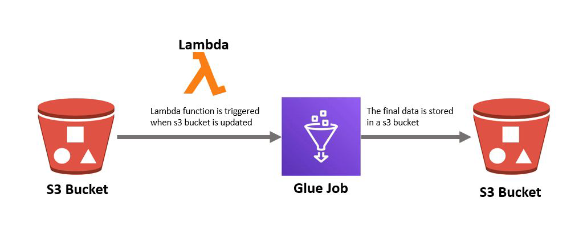

# AWS Glue: A Comprehensive Explanation

AWS Glue is Amazon Web Services' fully managed extract, transform, and load (ETL) service designed to simplify data preparation and loading for analytics. It automates many of the labor-intensive tasks traditionally associated with ETL processes, enabling data analysts, engineers, and scientists to focus more on deriving insights rather than data wrangling.

## Core Components of AWS Glue

### 1. Data Catalog

The **AWS Glue Data Catalog** serves as the central metadata repository for your data assets, functioning similarly to a traditional Apache Hive metastore but with enhanced capabilities:

- **Persistent metadata store**: Maintains table definitions, schemas, and other metadata
- **Cross-service accessibility**: Can be used by Amazon Athena, Amazon Redshift Spectrum, and Amazon EMR
- **Versioning**: Tracks schema evolution over time
- **Partition management**: Automatically discovers and manages partitions in your data
- **Integration**: Works with various data sources including S3, JDBC-compatible databases

### 2. Crawlers

**Crawlers** are automated processes that scan your data sources to infer schemas and populate the Data Catalog:

- **Schema inference**: Automatically detects data formats (CSV, JSON, Parquet, etc.) and schemas
- **Incremental crawling**: Can detect only new or changed data to avoid full rescans
- **Classification**: Identifies data formats and can apply custom classifiers
- **Connection management**: Handles authentication and connectivity to various data stores
- **Partition discovery**: Automatically detects partitioned data layouts (e.g., Hive-style partitions)

### 3. ETL Jobs

AWS Glue provides powerful **ETL capabilities** through automatically generated or custom-written scripts:

- **Code generation**: Produces PySpark or Scala (Spark) code based on visual job designs
- **Visual editor**: Drag-and-drop interface for creating ETL jobs without coding
- **Transformations**: Supports common ETL operations like joins, aggregations, and data cleansing
- **Job bookmarks**: Tracks processed data to prevent reprocessing
- **Flexible execution**: Can run on-demand or on a schedule

### 4. Schedulers and Triggers

AWS Glue includes robust **orchestration capabilities**:

- **Time-based scheduling**: Run jobs at specific intervals (hourly, daily, etc.)
- **Event-based triggers**: Initiate jobs based on events like new data arrival
- **Dependency management**: Create complex workflows with multiple dependent jobs
- **Monitoring integration**: Works with Amazon CloudWatch for alerting

## Key Features and Benefits

### Serverless Architecture

- **No infrastructure management**: AWS handles all resource provisioning and scaling
- **Automatic scaling**: Resources adjust based on workload demands
- **Cost efficiency**: Pay only for the resources used during job execution

### Integration Ecosystem

- **Data sources**: Works with S3, RDS, Redshift, DynamoDB, JDBC-compatible databases, and more
- **Data targets**: Can output to S3, Redshift, Aurora, and other destinations
- **AWS service integration**: Works seamlessly with Lambda, Step Functions, CloudFormation, etc.

### Performance Optimization

- **Auto-scaling Spark**: Dynamically allocates executors based on workload
- **DPU (Data Processing Unit)**: Measurement unit for processing capacity (1 DPU = 4 vCPU + 16GB memory)
- **Job metrics**: Provides performance monitoring and optimization suggestions

### Security and Compliance

- **IAM integration**: Fine-grained access control through AWS Identity and Access Management
- **Encryption**: Supports data encryption at rest and in transit
- **VPC support**: Can run in your Virtual Private Cloud for added security

## Typical Workflow in AWS Glue

1. **Set up connections** to your data sources (S3, databases, etc.)
2. **Run crawlers** to discover data schemas and populate the Data Catalog
3. **Author ETL jobs** using the visual editor or by writing custom PySpark/Scala code
4. **Schedule jobs** or set up event-based triggers
5. **Monitor execution** through the AWS Management Console or CloudWatch
6. **Analyze results** in your target data store or analytics service

## Use Cases

- **Data lake formation**: Centralize and organize disparate data sources
- **Data warehouse loading**: Prepare and transform data for analytics in Redshift
- **Database migration**: Convert and transfer data between different database systems
- **Streaming ETL**: Process near-real-time data (when combined with Kinesis)
- **Machine learning data prep**: Clean and prepare data for ML training

AWS Glue significantly reduces the operational overhead of traditional ETL processes, allowing organizations to focus on deriving value from their data rather than managing infrastructure and pipelines.

<br/>
<br/>

# **AWS Glue Data Catalog: Detailed Explanation with Step-by-Step Process & Real-World Use Cases**

## **1. What is AWS Glue Data Catalog?**
The **AWS Glue Data Catalog** is a fully managed, centralized metadata repository that stores structural and operational metadata about data assets. It serves as a **Hive-compatible metastore**, meaning it can be used by services like **Amazon Athena, Amazon Redshift Spectrum, and Amazon EMR** to query data without needing to manually define schemas.

### **Key Features of AWS Glue Data Catalog**
- **Stores metadata** (table definitions, schemas, partitions, locations)
- **Automatically updated** via **Glue Crawlers**
- **Hive Metastore-compatible** (works with Spark, Presto, Hive)
- **Supports multiple data sources** (S3, RDS, DynamoDB, JDBC databases)
- **Schema versioning** (tracks changes over time)
- **Partition management** (auto-detects partitioned datasets)

---

## **2. Step-by-Step Process of Using AWS Glue Data Catalog**
### **Step 1: Define a Data Source**
- Example: You have **CSV/JSON/Parquet files in Amazon S3** (e.g., `s3://sales-data-bucket/transactions/`).

### **Step 2: Create a Glue Crawler**
- A **Crawler** scans the data and extracts metadata (column names, data types, partitions).
- Configure:
  - **Data source**: S3 path (`s3://sales-data-bucket/transactions/`)
  - **IAM role**: Permissions to access S3
  - **Target database**: `sales_db` (created in Glue Catalog)
  - **Schedule**: Run on-demand or periodically (e.g., daily)

### **Step 3: Run the Crawler**
- The crawler:
  1. **Infers schema** (e.g., detects columns like `transaction_id`, `customer_id`, `amount`, `date`)
  2. **Detects partitions** (if data is partitioned, e.g., `year=2023/month=01/day=01/`)
  3. **Creates/updates tables** in the Glue Data Catalog.

### **Step 4: Query Data Using AWS Services**
- Now, the table (`transactions`) is available in:
  - **Amazon Athena** (SQL queries)
  - **Amazon Redshift Spectrum** (query S3 directly)
  - **AWS Glue ETL Jobs** (Spark transformations)
  - **Amazon EMR** (Hive/Spark jobs)

### **Step 5: Automate Updates**
- If new data arrives in S3 (`s3://sales-data-bucket/transactions/year=2023/month=02/`), rerun the crawler to update the catalog.

---

## **3. Real-World Use Cases**
### **Use Case 1: Data Lake Analytics**
- **Scenario**: A retail company stores sales data in S3 (CSV, Parquet).
- **Solution**:
  - **Crawler** scans S3 and populates the **Glue Catalog**.
  - **Athena** queries the data without needing to load it into a database.
  - **Redshift Spectrum** joins S3 data with warehouse data.

### **Use Case 2: Schema Evolution Tracking**
- **Scenario**: A log analytics platform has JSON logs where fields change over time.
- **Solution**:
  - **Glue Catalog** tracks schema versions (e.g., new fields added).
  - **ETL jobs** handle backward compatibility.

### **Use Case 3: Partitioned Data Queries**
- **Scenario**: IoT sensor data is stored in S3 with partitions (`device_id=123/date=2023-01-01/`).
- **Solution**:
  - **Glue Crawler** detects partitions.
  - **Athena** queries only relevant partitions (faster & cheaper).

### **Use Case 4: Data Sharing Across Teams**
- **Scenario**: Multiple teams (Marketing, Finance) need access to the same dataset.
- **Solution**:
  - **Glue Catalog** acts as a single source of truth.
  - **Lake Formation** manages fine-grained access control.

---

## **4. Benefits of Using AWS Glue Data Catalog**
✅ **No manual schema management** (auto-detected by crawlers)  
✅ **Serverless & fully managed** (no infrastructure to maintain)  
✅ **Works with multiple AWS analytics services** (Athena, Redshift, EMR)  
✅ **Cost-effective** (pay only for crawler runs & queries)  
✅ **Supports schema evolution** (tracks changes over time)  

---

## **5. Conclusion**
The **AWS Glue Data Catalog** simplifies metadata management by automatically discovering, storing, and organizing schemas. It enables seamless querying across AWS analytics services and eliminates the need for manual schema definitions.  

### **When to Use It?**
✔ You have **structured/semi-structured data in S3**  
✔ You need **schema discovery & management**  
✔ You use **Athena, Redshift Spectrum, or EMR**  
✔ You want a **centralized metadata repository**  

By leveraging the Glue Data Catalog, organizations can **reduce ETL complexity, improve data discoverability, and accelerate analytics workflows**.


<br/>
<br/>

# **AWS Glue Crawlers: In-Depth Guide with Step-by-Step Process & Real-World Use Cases**

## **1. What is an AWS Glue Crawler?**
An **AWS Glue Crawler** is an automated service that scans data sources (S3, RDS, JDBC databases, etc.), **infers schemas**, and populates the **AWS Glue Data Catalog** with metadata (tables, partitions, and schemas). It eliminates manual schema definition and keeps metadata updated as data changes.

### **Key Features of AWS Glue Crawlers**
- **Schema inference** (detects column names, data types, formats like CSV, JSON, Parquet)
- **Partition discovery** (auto-detects Hive-style partitions like `year=2023/month=01/`)
- **Incremental crawling** (only scans new/modified data to save time)
- **Supports multiple data sources** (S3, RDS, Redshift, DynamoDB, JDBC)
- **Custom classifiers** (define custom patterns for log files, CSV formats)
- **Scheduled or on-demand runs** (keeps metadata up-to-date)

---

## **2. Step-by-Step Process of Using AWS Glue Crawlers**
### **Step 1: Define a Data Source**
- **Example**: You have log files in Amazon S3:  
  `s3://logs-bucket/app_logs/year=2023/month=10/day=01/`

### **Step 2: Create an IAM Role for the Crawler**
- Go to **IAM Console** → Create a role with permissions to:
  - Read from the S3 bucket (`s3:GetObject`, `s3:ListBucket`)
  - Access AWS Glue (`glue:Get*`, `glue:CreateTable`)

### **Step 3: Configure the Crawler**
1. **Open AWS Glue Console** → **Crawlers** → **Add Crawler**  
2. **Name the crawler** (e.g., `app_logs_crawler`)  
3. **Choose Data Sources**:
   - Select **S3** and enter the path (`s3://logs-bucket/app_logs/`)  
4. **Configure IAM Role** (created in Step 2)  
5. **Set Crawler Schedule**:
   - **On-demand**: Run manually  
   - **Recurring**: Daily, hourly, etc.  
6. **Select Target Database** (e.g., `logs_db` in Glue Data Catalog)  
7. **Review & Create**  

### **Step 4: Run the Crawler**
- Manually trigger or wait for scheduled run.
- The crawler:
  1. **Scans the S3 path**  
  2. **Infers schema** (e.g., detects `timestamp`, `user_id`, `event_type` columns)  
  3. **Detects partitions** (`year=2023/month=10/day=01/`)  
  4. **Creates/updates a table** (`app_logs`) in the Glue Data Catalog  

### **Step 5: Query the Data**
- Now, the table (`app_logs`) is available for:
  - **Amazon Athena** (SQL queries)  
  - **Amazon Redshift Spectrum** (query S3 directly)  
  - **AWS Glue ETL Jobs** (transformations in Spark)  

### **Step 6: Automate Updates**
- If new logs arrive (`s3://logs-bucket/app_logs/year=2023/month=10/day=02/`), rerun the crawler to update the catalog.

---

## **3. Real-World Use Cases**
### **Use Case 1: Log Analytics Pipeline**
- **Scenario**: A SaaS company stores application logs in S3 (JSON format).  
- **Solution**:
  - **Crawler** scans logs daily and updates the Glue Catalog.  
  - **Athena** queries logs for error trends.  
  - **QuickSight** visualizes log analytics.  

### **Use Case 2: Data Lake Ingestion**
- **Scenario**: A retail company receives daily sales data (CSV) in S3.  
- **Solution**:
  - **Crawler** runs hourly, detects new files, and updates the catalog.  
  - **Glue ETL Job** transforms data into Parquet for analytics.  
  - **Redshift Spectrum** queries the data lake.  

### **Use Case 3: Database Migration Tracking**
- **Scenario**: A company migrates from MySQL to Aurora and needs schema tracking.  
- **Solution**:
  - **Crawler** connects to MySQL, extracts schema, and stores it in Glue Catalog.  
  - **AWS DMS** migrates data while Glue tracks schema changes.  

### **Use Case 4: IoT Data Processing**
- **Scenario**: IoT devices send sensor data (Parquet) to S3 with partitions (`device_id=123/date=...`).  
- **Solution**:
  - **Crawler** auto-detects partitions and updates metadata.  
  - **Athena** queries only relevant partitions for faster analytics.  

---

## **4. Benefits of Using AWS Glue Crawlers**
✅ **Automated schema discovery** (no manual definition)  
✅ **Partition awareness** (optimizes query performance)  
✅ **Supports structured & semi-structured data** (CSV, JSON, Parquet, Avro)  
✅ **Serverless & scalable** (no infrastructure management)  
✅ **Cost-effective** (pay per crawl, no fixed costs)  

---

## **5. Best Practices for Crawlers**
✔ **Use incremental crawls** (only scan new data to save costs)  
✔ **Schedule crawlers wisely** (run after new data arrives)  
✔ **Use custom classifiers** if data doesn’t fit standard formats  
✔ **Avoid over-crawling** (balance frequency vs. cost)  
✔ **Monitor crawler runs** (CloudWatch logs for failures)  

---

## **6. Conclusion**
AWS Glue Crawlers **eliminate manual schema management** by automatically discovering and cataloging metadata. They are essential for:
- **Data lakes** (keep schemas updated)  
- **ETL pipelines** (ensure correct schema for transformations)  
- **Querying S3 data** (via Athena, Redshift Spectrum)  

### **When to Use Crawlers?**
✔ You have **raw data in S3, RDS, or JDBC databases**  
✔ You need **automated schema detection**  
✔ You use **Athena, Redshift Spectrum, or Glue ETL**  
✔ You want **partition-aware querying**  

By leveraging crawlers, organizations can **reduce manual effort, improve data discovery, and accelerate analytics workflows**.

<br/>
<br/>

# **AWS Glue ETL Jobs: Comprehensive Guide with Step-by-Step Process & Real-World Use Cases**

## **1. What are AWS Glue ETL Jobs?**
AWS Glue ETL (Extract, Transform, Load) Jobs are serverless Spark-based processes that:
- **Extract** data from sources (S3, JDBC, DynamoDB, etc.)
- **Transform** data (clean, filter, join, aggregate)
- **Load** results into targets (S3, Redshift, databases, or data lakes)

### **Key Features**
✔ **Serverless Spark environment** (no cluster management)  
✔ **Auto-generated PySpark/Scala code** (with visual editor option)  
✔ **Job bookmarks** (tracks processed data to avoid duplicates)  
✔ **Flexible scheduling** (on-demand or event-driven)  
✔ **Integration with Glue Data Catalog** (uses crawled schemas)  

---

## **2. Step-by-Step Process to Create & Run a Glue ETL Job**

### **Step 1: Prepare Data Sources**
- **Example**: Sales data in S3 (`s3://sales-data/raw/`) in CSV format
- Ensure:
  - A **Glue Crawler** has cataloged the data (`sales_db.raw_sales` table exists)
  - IAM permissions allow Glue to read/write from S3

### **Step 2: Create a New ETL Job**
1. **AWS Glue Console** → **ETL** → **Jobs** → **Add Job**  
2. **Configure Job Properties**:
   - **Name**: `sales_data_processing`  
   - **IAM Role**: Glue service role with S3 access  
   - **Type**: **Spark** (or Spark Streaming)  
   - **Glue Version**: Latest (e.g., Glue 4.0)  
   - **Worker Type**: **G.1X** (for medium workloads)  
   - **Number of Workers**: **10** (auto-scaling available)  

### **Step 3: Define Data Source & Target**
1. **Data Source**:
   - Select `sales_db.raw_sales` from Glue Catalog  
   - Or manually specify S3 path (`s3://sales-data/raw/`)  
2. **Data Target**:
   - Choose format (e.g., Parquet) and path (`s3://sales-data/processed/`)  
   - Optionally write to Redshift, RDS, etc.  

### **Step 4: Add Transformations (3 Options)**
#### **Option A: Visual Editor (No-Code)**
- Drag-and-drop transformations:
  - **Filter**: Remove null values  
  - **Rename Columns**: Standardize field names  
  - **Join**: Merge with customer data  
  - **Aggregate**: Sum sales by region  

#### **Option B: Edit Auto-Generated Script**
- Glue provides starter PySpark/Scala code:
  ```python
  # Sample transformation (convert USD to EUR)
  from pyspark.sql.functions import col
  df = df.withColumn("amount_eur", col("amount_usd") * 0.85)
  ```

#### **Option C: Custom Script**
- Write full PySpark code:
  ```python
  from awsglue.context import GlueContext
  glueContext = GlueContext(SparkContext.getOrCreate())
  dyf = glueContext.create_dynamic_frame.from_catalog(database="sales_db", table_name="raw_sales")
  dyf = dyf.filter(lambda r: r["amount"] > 0)  # Filter invalid records
  glueContext.write_dynamic_frame.from_options(frame=dyf, connection_type="s3", format="parquet", connection_options={"path": "s3://sales-data/processed/"})
  ```

### **Step 5: Configure Job Bookmarks (Optional)**
- Enables incremental processing:
  - **Glue Console** → Job → **Edit** → **Job bookmark** → **Enable**  
  - Tracks already processed files to avoid reprocessing  

### **Step 6: Run the Job**
- **On-Demand**: Manually trigger from console  
- **Scheduled**: Set up via Glue Triggers (e.g., daily at 2 AM)  
- **Event-Driven**: Trigger via S3 Event Notifications  

### **Step 7: Monitor Execution**
- **AWS Glue Console**: View run status, duration, and DPU usage  
- **CloudWatch Logs**: Debug errors in `/aws-glue/jobs/`  
- **CloudWatch Metrics**: Track records processed, success rate  

---

## **3. Real-World Use Cases**
### **Use Case 1: Data Lake Processing**
- **Scenario**: Raw JSON clickstream data → Cleaned Parquet for analytics  
- **Solution**:
  - **Extract**: Read from `s3://clickstream/raw/`  
  - **Transform**: Filter bots, parse timestamps, flatten nested JSON  
  - **Load**: Write to `s3://clickstream/processed/` in Parquet  

### **Use Case 2: Database Migration**
- **Scenario**: Move MySQL orders table → Redshift with transformations  
- **Solution**:
  - **Extract**: JDBC connection to MySQL  
  - **Transform**: Convert dates to UTC, mask PII  
  - **Load**: Redshift COPY command  

### **Use Case 3: Machine Learning Feature Engineering**
- **Scenario**: Prepare retail data for ML model training  
- **Solution**:
  - **Extract**: Cataloged sales data  
  - **Transform**: Calculate rolling 7-day sales, one-hot encode categories  
  - **Load**: S3 in Parquet for SageMaker  

### **Use Case 4: Near-Real-Time Processing (Glue Streaming)**
- **Scenario**: Process IoT sensor data every 5 minutes  
- **Solution**:
  - **Source**: Kinesis Data Stream  
  - **Transform**: Running averages, anomaly detection  
  - **Sink**: S3 + DynamoDB for alerts  

---

## **4. Best Practices**
### **Performance Optimization**
- **Partitioning**: Write transformed data with partition keys (`date=2023-01-01`)  
- **DPU Sizing**: Start with G.1X workers, scale up for complex jobs  
- **File Size**: Aim for 128MB–1GB files (coalesce Spark output)  

### **Cost Control**
- **Auto Scaling**: Use `MaxCapacity` to limit DPUs  
- **Job Timeout**: Set to prevent runaway costs  
- **Spot Instances**: Enable for non-critical jobs  

### **Reliability**
- **Error Handling**: Use `try-catch` in custom scripts  
- **Data Validation**: Add checks for row counts/quality  
- **Retries**: Configure for transient failures  

---

## **5. Comparison: Glue ETL vs. Alternatives**
| Feature          | AWS Glue ETL | EMR Spark | Lambda (Custom) |
|------------------|-------------|-----------|----------------|
| **Serverless**   | ✅ Yes       | ❌ No      | ✅ Yes          |
| **Spark Support**| ✅ PySpark/Scala | ✅ Yes | ❌ No |
| **Max Runtime**  | 48 hours    | Unlimited | 15 minutes     |
| **Cost Model**   | Per DPU-hour | Per EC2 hour | Per request |

---

## **6. Conclusion**
AWS Glue ETL Jobs provide a **fully managed, scalable way to process data** without Spark cluster management. Ideal for:
- **Batch data pipelines** (daily/hourly processing)  
- **Data lake transformations** (raw → curated zones)  
- **ETL migrations** (legacy → modern formats)  

### **When to Choose Glue ETL?**
✔ You need **serverless Spark**  
✔ Your jobs run **< 48 hours**  
✔ You want **tight Glue Catalog integration**  

For longer-running or custom Spark workloads, consider **EMR**. For lightweight transformations, **Lambda** may suffice.

<br/>
<br/>

# **AWS Glue Schedulers: In-Depth Guide with Step-by-Step Process & Real-World Use Cases**

## **1. What are AWS Glue Schedulers?**
AWS Glue Schedulers (implemented through **Triggers**) automate the execution of Glue workflows by:
- Running jobs **on a time-based schedule** (e.g., daily at 2 AM)
- Triggering jobs **based on events** (e.g., new file in S3)
- Creating **job dependencies** (Run Job B only after Job A succeeds)

### **Key Features**
- **Time-based scheduling**: Cron-style or rate-based (e.g., "every 6 hours")
- **Event-driven triggers**: S3 uploads, CloudWatch Events, etc.
- **Workflow chaining**: Run jobs in sequence/parallel
- **Serverless**: No infrastructure to manage
- **Conditional execution**: Start jobs only if previous jobs succeed

---

## **2. Step-by-Step Process to Set Up Glue Scheduling**

### **Step 1: Prepare Your Glue Jobs**
- Ensure your ETL jobs are created (e.g., `raw_to_cleaned_job`, `cleaned_to_analytics_job`)

### **Step 2: Create Triggers**
1. **Navigate to AWS Glue Console** → **Triggers** → **Add trigger**
2. **Configure Trigger Properties**:
   - **Name**: `daily_sales_processing`
   - **Trigger type**: 
     - **Scheduled** (for time-based)
     - **On-demand** (manual)
     - **Event** (S3 upload, etc.)
   - **Schedule**:
     - **Cron expression**: `0 2 * * ? *` (runs daily at 2 AM UTC)
     - **Recurring rate**: "Every 12 hours"
3. **Assign Jobs to Trigger**:
   - Select jobs to run (`raw_to_cleaned_job`)
   - For workflows, add multiple jobs with dependencies

### **Step 3: Set Up Job Dependencies (For Workflows)**
1. **Create a NEW Trigger** → Type: **Conditional**
2. **Add Jobs in Order**:
   - First job: `raw_to_cleaned_job`
   - Second job: `cleaned_to_analytics_job` (set to run AFTER first succeeds)
3. **Configure Actions**:
   - **On Success**: Start next job
   - **On Failure**: Send SNS alert

### **Step 4: Event-Based Trigger Example (S3 Upload)**
1. **Enable S3 Event Notifications**:
   - Go to S3 bucket → Properties → Event notifications
   - Add notification for `s3:ObjectCreated:Put`
   - Destination: **AWS Glue**
2. **Create Glue Trigger**:
   - Type: **Event**
   - Event pattern: Match S3 PUT events
   - Target: Your data ingestion job

### **Step 5: Monitor Scheduled Runs**
- **Glue Console**: View trigger history, run status
- **CloudWatch**: Set alarms for job failures
- **SNS**: Get notifications for successes/failures

---

## **3. Real-World Use Cases**

### **Use Case 1: Daily Data Warehouse Refresh**
- **Scenario**: Retail company updates analytics tables every night
- **Implementation**:
  - **Trigger**: Scheduled (Cron: `0 3 * * ? *` = 3 AM daily)
  - **Jobs**:
    1. `extract_sales_job` (RDS → S3)
    2. `transform_sales_job` (S3 → Redshift) - runs after #1 succeeds
  - **Monitoring**: CloudWatch alerts if runtime exceeds 2 hours

### **Use Case 2: Real-Time Data Pipeline**
- **Scenario**: Process new IoT sensor data within 5 minutes of arrival
- **Implementation**:
  - **Trigger**: S3 Event (PUT in `s3://iot-data/raw/`)
  - **Job**: `stream_transform_job` (converts JSON → Parquet)
  - **Bookmarks**: Enabled to process only new files

### **Use Case 3: Monthly Compliance Reporting**
- **Scenario**: Financial institution generates reports on the 1st of each month
- **Implementation**:
  - **Trigger**: Scheduled (Cron: `0 6 1 * ? *` = 6 AM on 1st day of month)
  - **Workflow**:
    1. `aggregate_transactions_job`
    2. `generate_pdf_reports_job` (depends on #1)
  - **Error Handling**: SNS notifies DataOps team if failed

### **Use Case 4: Multi-Region Data Sync**
- **Scenario**: Sync processed data from us-east-1 to eu-west-1 every 6 hours
- **Implementation**:
  - **Trigger**: Scheduled (Rate: 6 hours)
  - **Job**: `cross_region_replicate_job` (uses S3 CopyObject)
  - **Cost Control**: Runs only during off-peak hours (8 PM, 2 AM, 8 AM, 2 PM)

---

## **4. Best Practices**

### **Scheduling Strategies**
- **For time-sensitive data**: Use frequent schedules (e.g., hourly)
- **For large batch jobs**: Schedule during low-traffic periods
- **For dependencies**: Use conditional triggers instead of hardcoded delays

### **Error Handling**
- **Set up retries**: Configure 1-3 retries for transient failures
- **Implement dead-letter queues**: For event-driven triggers
- **Use CloudWatch Alarms**: Monitor "FailedRunCount" metric

### **Cost Optimization**
- **Right-size DPUs**: Smaller jobs don't need max workers
- **Use warm-up periods**: For recurring triggers to avoid cold starts
- **Terminate hung jobs**: Set timeout (default 48 hours; reduce if possible)

---

## **5. Advanced Features**

### **Custom Cron Expressions**
| Example | Meaning |
|---------|---------|
| `0 18 ? * MON-FRI` | Weekdays at 6 PM UTC |
| `0/15 * * * ? *` | Every 15 minutes |
| `0 8 1 * ? *` | 8 AM on 1st day of month |

### **Workflow Visualization**
- View dependencies in **Glue Studio** → **Graph view**
- Example flow:
  ```
  S3 Upload → Crawler → Transform Job → Redshift Load
                ↓
            Catalog Update
  ```

### **Integration with Other Services**
- **AWS Step Functions**: For complex workflows
- **Lambda**: Pre/post-processing hooks
- **EventBridge**: Advanced event routing

---

## **6. Troubleshooting Common Issues**
❌ **Trigger not firing**:
- Check IAM permissions for `glue:StartTrigger`
- Verify CloudTrail logs for errors

❌ **Jobs running out of order**:
- Use explicit job dependencies (Job B → "Depends on" → Job A)
- Add small delays between jobs if needed

❌ **Missed schedules**:
- Ensure Glue isn't hitting account limits (default: 100 triggers/account)
- Check for conflicting cron expressions

---

## **7. Conclusion**
AWS Glue Schedulers provide **flexible, serverless orchestration** for data pipelines. Key takeaways:

✔ **Use time-based triggers** for regular batch processing  
✔ **Event-driven triggers** enable real-time pipelines  
✔ **Conditional workflows** handle complex dependencies  
✔ **Monitor with CloudWatch** to ensure reliability  

### **When to Use Glue Schedulers?**
- You need **simple-to-configure scheduling** without Airflow/Lambda  
- Your pipelines **run within AWS ecosystem**  
- You require **basic dependency management**  

For **complex DAGs**, consider **AWS Step Functions** or **MWAA (Airflow)**. For **sub-minute scheduling**, use **EventBridge + Lambda**.

<br/>
<br/>

# **AWS Glue Flow Explanation: S3 Event-Driven ETL Pipeline**

Based on the provided diagram, this describes a serverless data processing pipeline where AWS services work together to transform and move data when new files arrive in an S3 bucket. Here's a detailed breakdown:

## **1. Pipeline Overview**
```
S3 Upload → Lambda Trigger → Glue Job → Processed Data in S3
```

## **2. Step-by-Step Flow**

### **Step 1: Data Ingestion (S3 Bucket)**
- **Source**: Raw data files (CSV, JSON, etc.) are uploaded to an S3 bucket (e.g., `s3://raw-data-bucket/`).
- **Trigger Mechanism**: The S3 bucket is configured to send event notifications (e.g., `PutObject` events) to AWS Lambda.

### **Step 2: Event Trigger (Lambda)**
- When a new file arrives in S3, it automatically triggers a **Lambda function**.
- **Lambda's Role**:
  - Validates the file (e.g., checks file format/size).
  - Optionally pre-processes metadata.
  - Starts the **AWS Glue Job** (via `glue:StartJobRun` API).

### **Step 3: ETL Processing (Glue Job)**
- The **Blue Job** (Glue ETL Job) executes with the new file as input.
- **Typical Transformations**:
  - Cleanses data (handles nulls, formatting).
  - Converts formats (CSV → Parquet/ORC).
  - Partitions data (e.g., by `date=YYYY-MM-DD`).
- **Output**: Writes processed data to another S3 bucket (e.g., `s3://processed-data-bucket/`).

### **Step 4: Final Storage (Target S3)**
- The transformed data is stored in the destination S3 bucket, ready for:
  - Analytics (Athena, Redshift Spectrum).
  - Machine Learning (SageMaker).
  - Further processing.

---

## **3. Key AWS Services Involved**
| Service       | Role                                                                 |
|---------------|----------------------------------------------------------------------|
| **S3**        | Source (raw data) and destination (processed data) storage           |
| **Lambda**    | Event-driven trigger to start Glue jobs                              |
| **Glue**      | Serverless ETL processing (Blue Job)                                 |
| **IAM**       | Permissions for Lambda → Glue and Glue → S3 access                   |

---

## **4. Real-World Use Case Example**
**Scenario**: A retail company uploads daily sales reports (CSV) to S3.  
**Pipeline Behavior**:  
1. Sales team uploads `sales_20231001.csv` to `s3://raw-sales/`.  
2. Lambda triggers `sales_etl_job` in Glue.  
3. Glue:  
   - Validates data.  
   - Converts CSV → Parquet.  
   - Adds partition (`date=2023-10-01`).  
4. Output lands in `s3://processed-sales/date=2023-10-01/`.  
5. Athena queries the processed data for dashboards.  

---

## **5. Benefits of This Architecture**
✅ **Serverless**: No infrastructure to manage.  
✅ **Cost-Effective**: Pay only per Lambda invocation/Glue DPU-second.  
✅ **Scalable**: Handles any file volume automatically.  
✅ **Event-Driven**: Near-real-time processing (vs. batch scheduling).  

---

## **6. Variations & Enhancements**
- **Replace Lambda with EventBridge**: For complex event routing.  
- **Add Crawlers**: Update Glue Data Catalog automatically.  
- **Use Step Functions**: For multi-job workflows with error handling.  

This pipeline is ideal for **raw-to-processed data lake workflows** with minimal operational overhead.