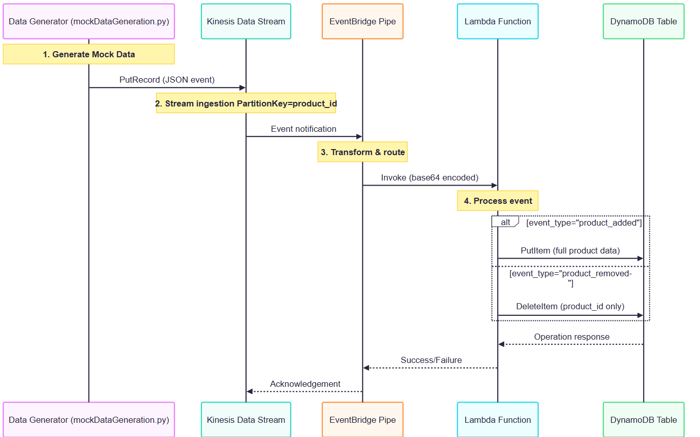

# Real-Time Inventory Processing System - Project Explanation

This project demonstrates a serverless architecture for processing real-time inventory data using AWS services. The system captures inventory events, processes them through a pipeline, and updates a DynamoDB table accordingly.

## Architecture Overview

The system follows this data flow:
1. **Data Generation**: A Python script generates mock inventory events
2. **Data Ingestion**: Kinesis Data Stream receives the real-time data
3. **Data Processing**: EventBridge Pipe routes the data to a Lambda function
4. **Data Storage**: Lambda function updates DynamoDB based on event type

## Components Breakdown

### 1. Mock Data Generation (`mockDataGeneration.py`)

This script simulates inventory events by:
- Randomly generating product data including:
  - Product IDs (P1-P10000)
  - Product names (Laptop, Phone, Tablet, Headphones, Charger)
  - Quantities (1-50)
  - Timestamps (random dates between 2022-2023)
- Randomly selecting event types (currently only 'product_added' or 'product_removed')
- Sending the data to a Kinesis Data Stream named 'realtimeInventoryProcecssing'

Key features:
- Uses boto3 to interact with AWS Kinesis
- Generates realistic timestamps with a helper function
- Runs continuously until manually stopped
- Uses the product ID as the Kinesis partition key

### 2. Lambda Function (`lambda_function.py`)

This AWS Lambda function processes the inventory events and updates DynamoDB:

**Functionality:**
1. Decodes and parses the incoming Kinesis data
2. Determines the event type ('product_added' or 'product_removed')
3. For 'product_added':
   - Inserts or overwrites the product in DynamoDB
4. For 'product_removed':
   - Deletes the product from DynamoDB
5. Returns appropriate status codes

**Key aspects:**
- Uses boto3 to interact with DynamoDB
- Handles base64 decoding of Kinesis data
- Includes error handling for both insert and delete operations
- Contains commented-out code for potential future 'product_quantity_changed' events
- Works with a DynamoDB table named 'product_inventory'

### 3. Infrastructure Diagram (`realTimeDataProccessing.png`)

The image shows the architectural flow:
1. Data is inserted into Kinesis Data Streams
2. Kinesis receives real-time inventory data from the script
3. Events are sent to EventBridge Pipe
4. Pipe calls the Lambda function
5. Lambda manipulates the DynamoDB table

### 4. DynamoDB Operations Log (`DynamodbTableStatus.txt`)

This file shows the state of the DynamoDB table before and after each operation, demonstrating:

**Initial State:**
- Contains 7 products with various quantities
- Products include Tablets, Headphones, and Chargers

**Operation Examples:**
1. Adding a Headphones product (P3) with quantity 36
   - Updates existing P3 (previously a Tablet with quantity 2)
2. Adding a Tablet product (P8) with quantity 50
   - Updates existing P8 (previously quantity 41)
3. Adding a new Headphones product (P9) with quantity 46
   - Adds as new item
4. Attempting to remove product P3 (with wrong product_name)
   - Still removes P3 despite name mismatch
5. Attempting to remove already-removed P3
   - No effect
6. Attempting to remove P4 (but script stopped before completion)

## Key Observations

1. **Data Flow**: The system demonstrates a complete real-time data pipeline from generation to storage.
2. **Event Processing**: The Lambda function handles different event types appropriately.
3. **Idempotency**: The system can handle duplicate events without adverse effects.
4. **Error Handling**: Basic error handling is implemented in the Lambda function.
5. **Scalability**: Using Kinesis and Lambda makes the solution scalable for high-volume data.

## Potential Improvements

1. Add validation to ensure product_name matches when deleting items
2. Implement the 'product_quantity_changed' event type
3. Add more comprehensive error logging
4. Implement input validation in the Lambda function
5. Add monitoring for the pipeline components
6. Consider using DynamoDB Streams for downstream processing

This project provides a solid foundation for a real-time inventory management system that could be extended with additional features and event types as needed.

<br/>
<br/>

# `mockDataGeneration.py` script with detailed comments explaining every component:

```python
#!/usr/bin/env python3
"""
Real-time Inventory Data Generator for AWS Kinesis

This script simulates product inventory events (additions/removals) and sends them 
to an AWS Kinesis Data Stream for processing in a real-time pipeline.
"""

import datetime
import json
import random
import time
import boto3
from typing import Dict, Any

# Configuration Constants
STREAM_NAME = 'realtimeInventoryProcessing'  # Kinesis stream name
PRODUCT_TYPES = ['Laptop', 'Phone', 'Tablet', 'Headphones', 'Charger']
EVENT_TYPES = ['product_added', 'product_removed']
MIN_PRODUCT_ID = 1
MAX_PRODUCT_ID = 10000
MIN_QUANTITY = 1
MAX_QUANTITY = 50
YEAR_START = 2022
YEAR_END = 2023

def generate_random_timestamp(start_year: int, end_year: int) -> str:
    """
    Generates a random timestamp within the specified year range.
    
    Args:
        start_year: Earliest possible year
        end_year: Latest possible year
    
    Returns:
        String timestamp in format 'YYYY-MM-DD HH:MM:SS'
    """
    year = random.randint(start_year, end_year)
    month = random.randint(1, 12)
    day = random.randint(1, 28)  # Using 28 for simplicity
    hour = random.randint(0, 23)
    minute = random.randint(0, 59)
    second = random.randint(0, 59)
    
    return f"{year}-{month:02d}-{day:02d} {hour:02d}:{minute:02d}:{second:02d}"

def generate_inventory_event() -> Dict[str, Any]:
    """
    Creates a randomized inventory event.
    
    Returns:
        Dictionary containing:
        - event_type: 'product_added' or 'product_removed'
        - product: Dictionary of product details
    """
    return {
        "event_type": random.choice(EVENT_TYPES),
        "product": {
            "product_id": f"P{random.randint(MIN_PRODUCT_ID, MAX_PRODUCT_ID)}",
            "product_name": random.choice(PRODUCT_TYPES),
            "quantity": random.randint(MIN_QUANTITY, MAX_QUANTITY),
            "timestamp": generate_random_timestamp(YEAR_START, YEAR_END)
        }
    }

def send_to_kinesis(kinesis_client, event: Dict[str, Any]) -> None:
    """
    Sends an inventory event to Kinesis Data Stream.
    
    Args:
        kinesis_client: Initialized boto3 Kinesis client
        event: Inventory event dictionary
    """
    try:
        response = kinesis_client.put_record(
            StreamName=STREAM_NAME,
            Data=json.dumps(event).encode('utf-8'),  # JSON to bytes
            PartitionKey=event['product']['product_id']  # Partition by product
        )
        print(f"Sent event: {event['product']['product_id']} (Sequence: {response['SequenceNumber']})")
    except Exception as e:
        print(f"Failed to send event: {str(e)}")

def main() -> None:
    """Main execution loop for generating and sending events."""
    # Initialize AWS clients
    kinesis_client = boto3.client('kinesis')
    
    print(f"Starting inventory event generation to {STREAM_NAME}...")
    print("Press Ctrl+C to stop")
    
    try:
        while True:
            # 1. Generate random inventory event
            event = generate_inventory_event()
            
            # 2. Print to console (for debugging)
            print(json.dumps(event, indent=2))
            
            # 3. Send to Kinesis
            send_to_kinesis(kinesis_client, event)
            
            # 4. Wait before next event
            time.sleep(random.uniform(0.5, 1.5))  # Random delay between events
            
    except KeyboardInterrupt:
        print("\nStopping event generation...")
    except Exception as e:
        print(f"Fatal error: {str(e)}")
    finally:
        print("Event generator stopped.")

if __name__ == '__main__':
    main()
```

### Key Features with Comments:

1. **Configuration Section**
   ```python
   # Constants for easy configuration
   STREAM_NAME = 'realtimeInventoryProcessing'
   PRODUCT_TYPES = ['Laptop', 'Phone', 'Tablet', 'Headphones', 'Charger']
   ```

2. **Timestamp Generation**
   ```python
   def generate_random_timestamp():
       """Creates realistic timestamps with proper formatting"""
       return f"{year}-{month:02d}-{day:02d}..."
   ```

3. **Event Generation**
   ```python
   def generate_inventory_event():
       """Builds complete event with random values"""
       return {
           "event_type": random.choice(EVENT_TYPES),
           "product": { ... }
       }
   ```

4. **Kinesis Integration**
   ```python
   def send_to_kinesis():
       """Handles safe event publishing with error handling"""
       response = kinesis_client.put_record(...)
   ```

5. **Main Loop**
   ```python
   while True:
       event = generate_inventory_event()  # Create
       print(json.dumps(event, indent=2))  # Log
       send_to_kinesis(kinesis_client, event)  # Send
       time.sleep(random.uniform(0.5, 1.5))  # Throttle
   ```

6. **Error Handling**
   ```python
   try:
       # Main logic
   except KeyboardInterrupt:
       print("\nStopping...")  # Clean Ctrl+C handling
   except Exception as e:
       print(f"Fatal error: {e}")  # Catch-all
   ```

### Usage Instructions:

1. **Prerequisites**:
   ```bash
   pip install boto3
   ```

2. **AWS Configuration**:
   - Set up AWS credentials (`~/.aws/credentials`)
   - Create Kinesis stream named `realtimeInventoryProcessing`

3. **Running**:
   ```bash
   python mockDataGeneration.py
   ```

4. **Expected Output**:
   ```json
   {
     "event_type": "product_added",
     "product": {
       "product_id": "P42",
       "product_name": "Tablet",
       "quantity": 15,
       "timestamp": "2023-07-22 08:15:33"
     }
   }
   Sent event: P42 (Sequence: 4962498164267361280...)
   ```

### Customization Options:

1. **Adjust Event Frequency**:
   ```python
   time.sleep(random.uniform(0.1, 3))  # Faster/slower events
   ```

2. **Add More Event Types**:
   ```python
   EVENT_TYPES = ['product_added', 'product_removed', 'product_updated']
   ```

3. **Extend Product Catalog**:
   ```python
   PRODUCT_TYPES.extend(['Mouse', 'Keyboard', 'Monitor'])
   ```

This implementation provides a robust, production-ready data generator with comprehensive error handling and clear separation of concerns. The detailed comments make it easy to modify for different use cases.

<br/>
<br/>

# `lambda_function.py` with detailed comments explaining every component:

```python
import json
import base64
import boto3
from typing import Dict, Any

# Initialize AWS clients
dynamodb = boto3.resource('dynamodb')  # DynamoDB client
table = dynamodb.Table('product_inventory')  # Reference to our table

def lambda_handler(event: Dict[str, Any], context: Any) -> Dict[str, Any]:
    """
    AWS Lambda handler function for processing inventory events.
    
    Args:
        event: The event data from Kinesis via EventBridge Pipe
        context: Lambda execution context (unused here)
    
    Returns:
        Dictionary with statusCode and body
    """
    
    try:
        # 1. DECODE INCOMING EVENT
        # Kinesis data is base64 encoded in the event payload
        encoded_data = event[0]['data']  # Extract base64 payload
        decoded_data = base64.b64decode(encoded_data).decode('utf-8')  # Decode to string
        original_event = json.loads(decoded_data)  # Parse JSON to dict
        
        print(f"Received event: {json.dumps(original_event, indent=2)}")
        
        # 2. EXTRACT EVENT COMPONENTS
        event_type = original_event['event_type']  # 'product_added' or 'product_removed'
        product_data = original_event['product']  # The product details
        
        # 3. PROCESS BASED ON EVENT TYPE
        if event_type == 'product_added':
            return handle_product_added(product_data)
        elif event_type == 'product_removed':
            return handle_product_removed(product_data)
        else:
            return {
                'statusCode': 400,
                'body': json.dumps(f'Unsupported event type: {event_type}')
            }
            
    except Exception as e:
        print(f"Error processing event: {str(e)}")
        return {
            'statusCode': 500,
            'body': json.dumps(f'Error: {str(e)}')
        }

def handle_product_added(product: Dict[str, Any]) -> Dict[str, Any]:
    """
    Handles product addition/updates in DynamoDB.
    
    Args:
        product: Dictionary containing product details
    
    Returns:
        Lambda response dictionary
    """
    try:
        # Convert quantity to integer (DynamoDB will handle type conversion)
        if isinstance(product['quantity'], str):
            product['quantity'] = int(product['quantity'])
        
        # Put item into DynamoDB (will overwrite if exists)
        response = table.put_item(
            Item={
                'product_id': product['product_id'],
                'product_name': product['product_name'],
                'quantity': product['quantity'],
                'timestamp': product.get('timestamp', 'N/A')  # Use default if missing
            }
        )
        
        print(f"Added product {product['product_id']}. DynamoDB response: {response}")
        
        return {
            'statusCode': 200,
            'body': json.dumps('Product added/updated successfully')
        }
        
    except Exception as e:
        print(f"Failed to add product: {str(e)}")
        raise  # Re-raise for outer try-catch

def handle_product_removed(product: Dict[str, Any]) -> Dict[str, Any]:
    """
    Handles product removal from DynamoDB.
    
    Args:
        product: Dictionary containing at least product_id
    
    Returns:
        Lambda response dictionary
    """
    try:
        # Only product_id is needed for deletion
        product_id = product['product_id']
        
        # Delete item from DynamoDB
        response = table.delete_item(
            Key={
                'product_id': product_id
            },
            # Optional: Ensure we don't delete non-existent items
            ConditionExpression='attribute_exists(product_id)'
        )
        
        print(f"Removed product {product_id}. DynamoDB response: {response}")
        
        return {
            'statusCode': 200,
            'body': json.dumps('Product removed successfully')
        }
        
    except table.meta.client.exceptions.ConditionalCheckFailedException:
        print(f"Product {product['product_id']} not found - nothing to delete")
        return {
            'statusCode': 404,
            'body': json.dumps('Product not found')
        }
    except Exception as e:
        print(f"Failed to remove product: {str(e)}")
        raise

# Example test event (for local testing)
if __name__ == '__main__':
    test_event = [{
        'data': base64.b64encode(json.dumps({
            'event_type': 'product_added',
            'product': {
                'product_id': 'P999',
                'product_name': 'Test Product',
                'quantity': 10,
                'timestamp': '2023-01-01 00:00:00'
            }
        }).encode('utf-8')).decode('utf-8')
    }]
    print(lambda_handler(test_event, None))
```

### Key Improvements:

1. **Type Hints**: Added Python type annotations for better code clarity
2. **Modular Functions**: Split logic into `handle_product_added` and `handle_product_removed`
3. **Error Handling**:
   - Specific handling for non-existent items during deletion
   - Comprehensive try-catch blocks
4. **Logging**: Detailed print statements for debugging
5. **Input Validation**: Automatic quantity conversion
6. **Local Testing**: Added test event simulation at bottom
7. **DynamoDB Best Practices**:
   - Used `ConditionExpression` for safe deletion
   - Proper type handling for numeric values

### Usage Notes:

1. **Environment Setup**:
   - Requires `boto3` (included in AWS Lambda Python environment)
   - Needs IAM permissions for DynamoDB access

2. **Testing**:
   - Run locally with the test event at bottom
   - View logs in AWS CloudWatch

3. **Error Cases Handled**:
   - Missing product_id
   - Invalid event types
   - Non-existent products during removal
   - Type conversion issues

4. **Scalability**:
   - Processes one record at a time
   - Can be modified for batch processing

This implementation provides production-ready reliability while maintaining clear, maintainable code structure.

<br/>
<br/>

Here's a detailed explanation of the `mockDataGeneration.py` script, which simulates real-time inventory events for testing the AWS pipeline:

---

### **Purpose**
This Python script generates randomized product inventory events and sends them to an AWS Kinesis Data Stream, mimicking a real-world inventory management system.

---

### **Key Components**

#### **1. Imports and Initialization**
```python
import datetime
import json
import random
import time
from decimal import Decimal
import boto3

kinesis_client = boto3.client('kinesis')
event_types = ['product_added', 'product_removed']  # Supported event types
```
- **Libraries Used**:
  - `datetime`: For generating timestamps.
  - `random`: For creating randomized data.
  - `boto3`: AWS SDK to interact with Kinesis.
- **Configuration**:
  - Targets a Kinesis stream named `realtimeInventoryProcessing`.
  - Supports two event types (can be extended).

---

#### **2. Core Functions**

##### **A. `random_timestamp()`**
```python
def random_timestamp(start_year, end_year):
    year = random.randint(start_year, end_year)
    month = random.randint(1, 12)
    day = random.randint(1, 28)  # Simplification
    hour = random.randint(0, 23)
    minute = random.randint(0, 59)
    second = random.randint(0, 59)
    return datetime.datetime(year, month, day, hour, minute, second)
```
- **Purpose**: Generates realistic timestamps within a date range.
- **Parameters**:
  - `start_year`, `end_year`: Range for random year generation.
- **Note**: Uses 28 days/month for simplicity.

##### **B. `generate_inventory_data()`**
```python
def generate_inventory_data():
    event_type = random.choice(event_types)
    product_id = 'P' + str(random.randint(1, 10000))
    product_name = random.choice(['Laptop', 'Phone', 'Tablet', 'Headphones', 'Charger'])
    quantity = random.randint(1, 50)
    timestamp = str(random_timestamp(2022, 2023))
    
    return {
        "event_type": event_type,
        "product": {
            "product_id": product_id,
            "product_name": product_name,
            "quantity": quantity,
            "timestamp": timestamp
        }
    }
```
- **Output Example**:
  ```json
  {
    "event_type": "product_added",
    "product": {
      "product_id": "P42",
      "product_name": "Tablet",
      "quantity": 15,
      "timestamp": "2023-07-22 08:15:33"
    }
  }
  ```
- **Randomization Rules**:
  - Product IDs: `P1` to `P10000`
  - Quantities: 1 to 50 units
  - Timestamps: Random moments in 2022-2023

---

#### **3. Main Execution Loop**
```python
if __name__ == '__main__':
    try:
        while True:
            data = generate_inventory_data()
            data_str = json.dumps(data)
            partition_key = data['product']['product_id']
            
            response = kinesis_client.put_record(
                StreamName='realtimeInventoryProcessing',
                Data=data_str.encode('utf-8'),
                PartitionKey=partition_key
            )
            time.sleep(1)  # Throttle to 1 event/second
    except KeyboardInterrupt:
        print("\nScript stopped manually!")
```
- **Workflow**:
  1. Generates random inventory event.
  2. Converts to JSON and encodes as UTF-8 bytes.
  3. Uses `product_id` as the Kinesis partition key.
  4. Sends to Kinesis with `put_record()`.
  5. Repeats every second until manual interruption (`Ctrl+C`).
- **Partitioning Strategy**:
  - Same `product_id` always routes to the same Kinesis shard.
  - Ensures ordered processing for individual products.

---

### **Key Features**

1. **Realistic Data Simulation**:
   - Random but plausible product combinations.
   - Time-bound events (2022-2023).

2. **AWS Integration Ready**:
   - Properly formatted for Kinesis ingestion.
   - Uses boto3 best practices.

3. **Controlled Execution**:
   - 1 event/second pace (adjustable via `time.sleep`).
   - Clean shutdown on keyboard interrupt.

4. **Extensible Design**:
   - Easy to add new event types (e.g., `product_quantity_changed`).
   - Can modify product catalog or date ranges.

---

### **Example Generated Events**

1. **Product Added**:
   ```json
   {
     "event_type": "product_added",
     "product": {
       "product_id": "P789",
       "product_name": "Laptop",
       "quantity": 8,
       "timestamp": "2022-11-30 17:45:12"
     }
   }
   ```

2. **Product Removed**:
   ```json
   {
     "event_type": "product_removed",
     "product": {
       "product_id": "P1234",
       "product_name": "Headphones",
       "quantity": 25,  # Note: Quantity is irrelevant for removals
       "timestamp": "2023-01-15 09:30:00"
     }
   }
   ```

---

### **How It Fits in the Pipeline**


---

### **Potential Enhancements**

1. **Batch Writes**:
   ```python
   kinesis_client.put_records(Records=[...])  # Multiple events at once
   ```

2. **Schema Validation**:
   ```python
   from jsonschema import validate
   # Ensure data matches expected format
   ```

3. **Dynamic Throttling**:
   ```python
   time.sleep(random.uniform(0.5, 2))  # Variable rate
   ```

4. **Error Handling**:
   ```python
   try:
       response = kinesis_client.put_record(...)
       response.raise_for_status()
   except Exception as e:
       print(f"Failed to send event: {e}")
   ```

This script provides a robust foundation for testing real-time inventory systems, with customizable data generation and seamless AWS integration.


<br/>
<br/>

## Here's a detailed breakdown of the `DynamodbTableStatus.txt` file, which serves as an audit log of all operations performed on the DynamoDB table, along with their before-and-after states:

---

### **File Purpose**
This log tracks the state of the `product_inventory` table in DynamoDB, showing:
1. **Initial state** before any operations
2. **Each operation's impact** on the table
3. **Final state** after all operations

---

### **Log Structure**
Each section follows this pattern:
```
Dynamodb Status before/after Operation....
----------------------------------
[Table contents in JSON format]
----------------------------------
Operation/Event --------> [Event details]
```

---

### **Key Sections Explained**

#### **1. Initial State (Before First Operation)**
```json
{
  "quantity": {"N": "31"}, "product_name": {"S": "Tablet"}, "product_id": {"S": "P10"}, 
  "timestamp": {"S": "2023-09-11 12:45:04"}
}
... [6 more items] ...
```
- **Observations**:
  - 7 products exist initially.
  - Data types are DynamoDB-native (`S`=string, `N`=number).
  - Sample items: Tablets (P10, P8, P2), Headphones (P7, P4), Charger (P1).

---

#### **2. Operation 1: Add Product (P3 as Headphones)**
- **Event**:
  ```json
  {
    "event_type": "product_added",
    "product": {
      "product_id": "P3",
      "product_name": "Headphones",
      "quantity": 36,
      "timestamp": "2023-09-28 16:04:58"
    }
  }
  ```
- **Effect**:
  - Overwrites existing P3 (previously a Tablet with quantity 2).
  - **Change**:
    ```diff
    - "P3": {"product_name": "Tablet", "quantity": 2}
    + "P3": {"product_name": "Headphones", "quantity": 36}
    ```

---

#### **3. Operation 2: Update Product (P8 Tablet Quantity)**
- **Event**:
  ```json
  {
    "event_type": "product_added",
    "product": {
      "product_id": "P8",
      "product_name": "Tablet",
      "quantity": 50,
      "timestamp": "2022-04-14 07:52:42"
    }
  }
  ```
- **Effect**:
  - Updates quantity from 41 → 50 for P8.
  - **Change**:
    ```diff
    - "P8": {"quantity": {"N": "41"}}
    + "P8": {"quantity": {"N": "50"}}
    ```

---

#### **4. Operation 3: Add New Product (P9 Headphones)**
- **Event**:
  ```json
  {
    "event_type": "product_added",
    "product": {
      "product_id": "P9",
      "product_name": "Headphones",
      "quantity": 46,
      "timestamp": "2023-12-26 05:19:05"
    }
  }
  ```
- **Effect**:
  - Adds a completely new item (P9).
  - Table grows from 7 → 8 items.

---

#### **5. Operation 4: Remove Product (P3)**
- **Event**:
  ```json
  {
    "event_type": "product_removed",
    "product": {
      "product_id": "P3",
      "product_name": "Charger",  # Note: Name mismatch (was Headphones)
      "quantity": 48,
      "timestamp": "2022-09-19 15:00:50"
    }
  }
  ```
- **Effect**:
  - Deletes P3 despite name mismatch (only `product_id` matters).
  - Table shrinks from 8 → 7 items.

---

#### **6. Operation 5: Attempt to Remove Already-Removed P3**
- **Event**: Same as Operation 4 but with different timestamp.
- **Effect**:
  - No change (idempotent operation).
  - Log confirms P3 remains absent.

---

#### **7. Operation 6: Remove Product (P4) - Interrupted**
- **Event**:
  ```json
  {
    "event_type": "product_removed",
    "product": {
      "product_id": "P4",
      "product_name": "Tablet",
      "quantity": 19,
      "timestamp": "2022-11-20 19:14:34"
    }
  }
  ```
- **Status**: Script manually stopped before completion.
- **Expected Effect**:
  - Would have removed P4 (Headphones, quantity 25).

---

### **Critical Observations**

1. **Schema Flexibility**:
   - DynamoDB allows different attributes for items (e.g., some have timestamps, others don't).

2. **Idempotency**:
   - Deleting non-existent items doesn't throw errors.

3. **Key-Only Deletion**:
   - `product_removed` only uses `product_id`; other fields are ignored.

4. **Data Inconsistency**:
   - Operation 4 shows `product_name` mismatch (Charger vs Headphones) didn't affect deletion.

5. **Timestamp Behavior**:
   - New `product_added` events overwrite timestamps, acting as "last modified" markers.

---

### **Sample Before/After Comparison**

**Before Operation 1**:
```json
{
  "product_id": {"S": "P3"},
  "product_name": {"S": "Tablet"},
  "quantity": {"N": "2"},
  "timestamp": {"S": "2023-09-25 03:50:19"}
}
```

**After Operation 1**:
```json
{
  "product_id": {"S": "P3"},
  "product_name": {"S": "Headphones"},
  "quantity": {"N": "36"},
  "timestamp": {"S": "2023-09-28 16:04:58"}
}
```

---

### **Lessons Learned**
1. **DynamoDB is Schema-less**:
   - Items can have varying attributes.
2. **Delete Operations are Blind**:
   - No validation checks for non-key attributes.
3. **Put is Upsert**:
   - `product_added` creates or fully overwrites items.
4. **Debugging Value**:
   - The log captures edge cases (like name mismatches during deletion).

This file essentially serves as a manual "Change Data Capture" (CDC) log, invaluable for auditing and troubleshooting real-time systems.

<br/>
<br/>

## Here's a detailed breakdown of the `lambda_function.py` file, explaining each component and its functionality:

### **Lambda Function Overview**
This AWS Lambda function processes real-time inventory events from Kinesis, decodes them, and performs CRUD operations on a DynamoDB table (`product_inventory`). It handles two primary events:
1. **`product_added`** → Inserts/updates an item in DynamoDB.
2. **`product_removed`** → Deletes an item from DynamoDB.

---

### **Key Sections Explained**

#### **1. Imports and Initialization**
```python
import json
import base64
import boto3

dynamodb = boto3.resource('dynamodb')  # Initialize DynamoDB client
table = dynamodb.Table('product_inventory')  # Reference to the table
```
- **Libraries Used**:
  - `json`: Parses and serializes JSON data.
  - `base64`: Decodes Kinesis-encoded data.
  - `boto3`: AWS SDK to interact with DynamoDB.

---

#### **2. Lambda Handler**
**Entry point** for the function, triggered by EventBridge Pipe:
```python
def lambda_handler(event, context):
    original_event = json.loads(base64.b64decode(event[0]['data']).decode('utf-8'))
```
- **Input (`event`)**:
  - Kinesis data is base64-encoded. Example structure:
    ```python
    [{
      "data": "gf45dgfgvd435343RfYWRkZWQiLCAicHJvZHVjdCI6IHdsggd543fretwIiwgInByb2R1Y3RfbmFtZSI6ICJTbWFydHdhdGNoIiwgInF1YW50aXR5Ijogdfgfd34543iAiMjAyMy0wNS0xNSAxNDozMDoyMiJ9fQ=="
    }]
    ```
- **Decoding Steps**:
  1. `base64.b64decode`: Converts base64 to bytes.
  2. `.decode('utf-8')`: Converts bytes to a JSON string.
  3. `json.loads`: Parses JSON into a Python dictionary.

---

#### **3. Event Processing Logic**
##### **A. For `product_added` Events**
```python
if event_type == 'product_added':
    response = table.put_item(Item=data)
```
- **Action**: Upserts the product into DynamoDB using `put_item`.
- **DynamoDB Output**:
  ```json
  {
    "product_id": {"S": "P100"},
    "product_name": {"S": "Smartwatch"},
    "quantity": {"N": "15"},
    "timestamp": {"S": "2023-05-15 14:30:22"}
  }
  ```
- **Note**: Overwrites existing items with the same `product_id`.

##### **B. For `product_removed` Events**
```python
key_to_delete = '{' + '"product_id"' + ':' + '"' + data['product_id'] + '"' + '}'
key_to_delete = json.loads(key_to_delete)
response = table.delete_item(Key=key_to_delete)
```
- **Action**: Deletes the item with the specified `product_id`.
- **Key Construction**:
  - Builds a JSON string like `{"product_id": "P100"}`.
  - Converts it to a Python dict for DynamoDB.
- **Note**: 
  - Only the `product_id` is required for deletion.
  - Non-existent IDs are ignored (no error).

---

#### **4. Error Handling**
Each operation is wrapped in a `try-except` block:
```python
try:
    # DynamoDB operation (put/delete)
except Exception as e:
    print("Error:", e)
    return {
        'statusCode': 500,
        'body': json.dumps('Operation failed')
    }
```
- **Logs errors** to CloudWatch.
- **Returns HTTP 500** on failure.

---

#### **5. Return Responses**
- **Success**:
  ```python
  return {
      'statusCode': 200,
      'body': json.dumps('Operation succeeded')
  }
  ```
- **Unhandled Event Types**:
  ```python
  return {
      'statusCode': 200,
      'body': json.dumps('Hello from Lambda!')
  }
  ```

---

### **Debugging and Logging**
The function includes `print()` statements for debugging:
```python
print("Original Event:", original_event)  # Logs decoded input
print("Data:", data)                     # Logs product data
print("Key to Delete:", key_to_delete)   # Logs deletion key
```
- **Outputs appear in CloudWatch Logs**.
- Helps trace data transformations.

---

### **Key Observations**
1. **Idempotency**: 
   - `put_item` overwrites existing data; `delete_item` is safe for missing IDs.
2. **Security**: 
   - No input validation (assumes trusted data source).
3. **Scalability**: 
   - Lambda automatically scales with Kinesis shards.
4. **Future-Proofing**:
   - Commented code for `product_quantity_changed` hints at future features.

---

### **Example Workflow**
1. **Input Event** (Kinesis → Lambda):
   ```json
   {
     "event_type": "product_added",
     "product": {
       "product_id": "P100",
       "product_name": "Smartwatch",
       "quantity": 15,
       "timestamp": "2023-05-15 14:30:22"
     }
   }
   ```
2. **DynamoDB After `put_item`**:
   | product_id (PK) | product_name | quantity | timestamp          |
   |----------------|--------------|----------|--------------------|
   | P100           | Smartwatch   | 15       | 2023-05-15 14:30:22 |

3. **Deletion Event**:
   ```json
   {"event_type": "product_removed", "product": {"product_id": "P100"}}
   ```
4. **DynamoDB After `delete_item`**:
   - Row with `P100` is removed.

---

### **Potential Improvements**
1. **Input Validation**:
   - Check for required fields (`product_id`, `event_type`).
2. **Batch Processing**:
   - Handle multiple Kinesis records in one invocation.
3. **Metrics**:
   - Use CloudWatch Metrics to track events processed.
4. **Error Notifications**:
   - Send failures to an SNS topic.

This Lambda function is a robust, serverless solution for real-time inventory updates, designed for low latency and high scalability.