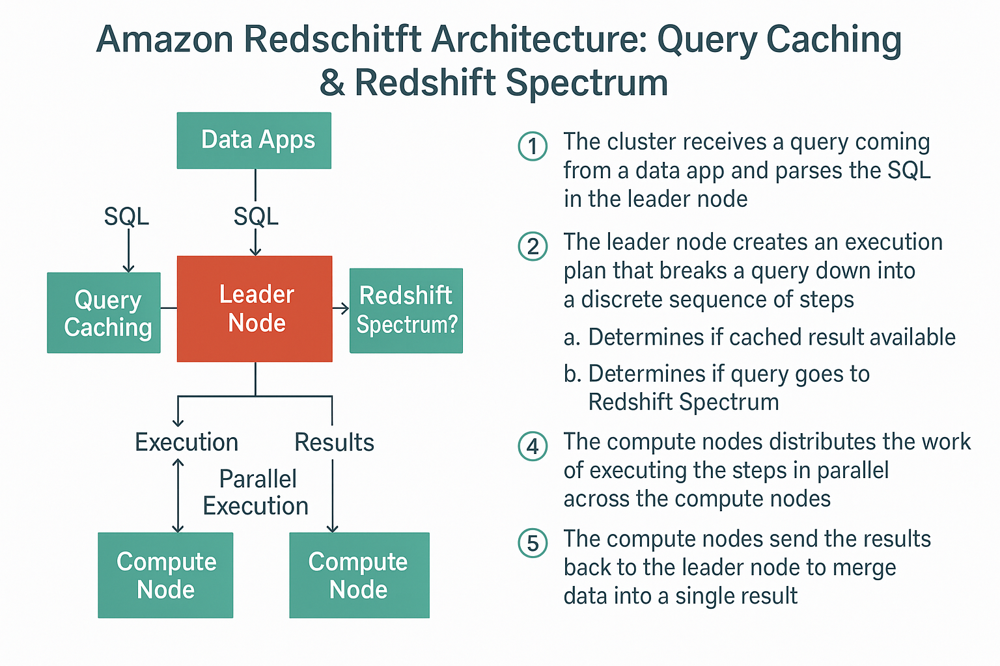
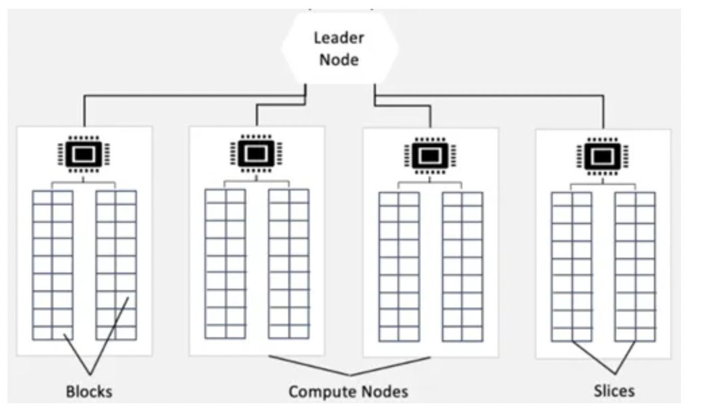
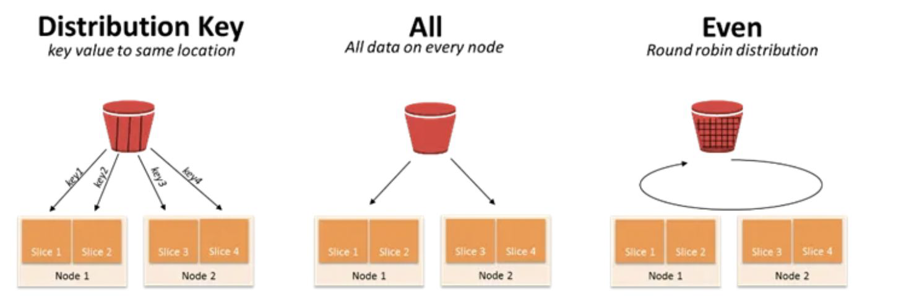
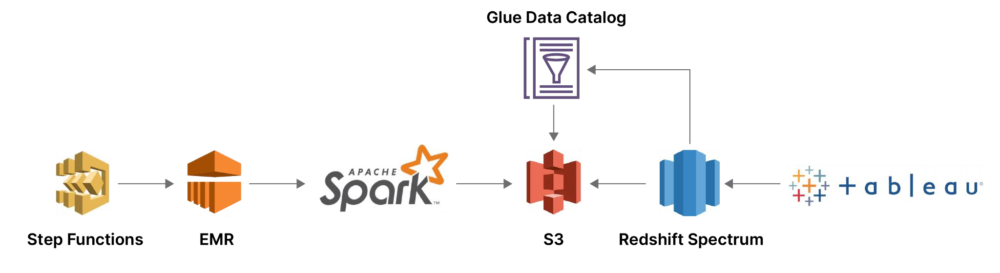

# Amazon Redshift: A Detailed Explanation

Amazon Redshift is AWS's fully managed, petabyte-scale data warehouse service that has become one of the most popular cloud database solutions. Let's break down its architecture and performance features in detail:

## Core Architecture

### 1. Fully Managed, PostgreSQL-based Service
Redshift is built on PostgreSQL 8.0.2 but is specifically optimized for online analytical processing (OLAP) and business intelligence (BI) applications. While it shares SQL syntax with PostgreSQL, it's not suitable for OLTP workloads.

### 2. Shared-Nothing Massively Parallel Processing (MPP) Architecture
Redshift employs a "shared-nothing" architecture where:
- The system is divided into multiple independent nodes
- Each node has its own CPU, memory, and storage
- No resource contention occurs between nodes
- All communication between nodes happens over the network

This architecture allows Redshift to scale horizontally by adding more nodes to the cluster.

## Performance Optimization Features

### 1. Columnar Storage
Unlike traditional row-based databases, Redshift stores data by columns rather than rows:
- **Benefits for analytics**: Most analytical queries only need a subset of columns
- **Improved I/O efficiency**: Only the needed columns are read from disk
- **Better compression**: Similar data types stored together enable higher compression ratios

### 2. Advanced Compression
Redshift employs multiple compression techniques:
- **Automatic compression selection**: Analyzes sample data to choose optimal encoding
- **Column-specific encodings**: Different columns can use different compression schemes
- **Common encodings**: Delta, Delta32k, Mostly8, Run-length, Text255, and others
- **Zone maps**: Metadata that helps skip over blocks that don't contain relevant data

### 3. Query Optimization
Redshift's query optimizer uses several techniques:
- **Cost-based optimization**: Estimates the cost of different execution plans
- **Predicate pushdown**: Filters data as early as possible in the execution plan
- **Join optimization**: Selects optimal join methods (hash, merge, nested loop)
- **Statistics collection**: Uses ANALYZE command to gather table statistics

### 4. Compiled Query Execution
Unlike interpreted queries in many databases:
- Queries are compiled into machine code
- Eliminates interpretation overhead during execution
- Compiled code is distributed to all nodes
- Results in faster execution, especially for complex queries

## Cluster Architecture Components

### 1. Leader Node
- Manages client connections
- Parses and optimizes queries
- Coordinates parallel query execution
- Compiles code for worker nodes
- Doesn't store user data

### 2. Compute Nodes
- Store data and perform queries
- Divided into slices (virtual CPUs)
- Each slice gets a portion of the node's memory and disk
- Communicate with each other during query execution

### 3. Node Types
- **Dense Compute (DC)**: More CPU and RAM for compute-intensive workloads
- **Dense Storage (DS)**: More storage capacity for data-intensive workloads
- **RA3**: Separates compute and storage using Amazon's managed storage

## Additional Features

### 1. Workload Management (WLM)
- Manages query queues and concurrency
- Can prioritize certain types of queries
- Automatic or manual query queue configuration

### 2. Redshift Spectrum
- Query data directly in S3 without loading into Redshift
- Uses same SQL syntax and joins with Redshift tables
- Scales compute resources independently

### 3. Concurrency Scaling
- Automatically adds transient clusters during peak loads
- Handles increased concurrent queries without performance degradation
- Scales back down when load decreases

## Use Cases

Redshift is ideal for:
- Enterprise data warehousing
- Business intelligence and analytics
- Log analysis and event data processing
- Combining structured and semi-structured data
- Large-scale ETL (Extract, Transform, Load) processes

## Limitations

While powerful, Redshift has some limitations:
- Not designed for high-volume transactional workloads
- Limited single-row INSERT performance
- Not a replacement for operational databases
- Some PostgreSQL features aren't supported

Amazon Redshift's combination of columnar storage, parallel processing, advanced compression, and query optimization makes it one of the most performant cloud data warehouse solutions available today, capable of handling petabyte-scale datasets with fast query performance.


<br/>
<br/>

# Amazon Redshift Query Processing: Caching & Spectrum Explained

This diagram illustrates Amazon Redshift's query processing architecture, highlighting two important features: query caching and Redshift Spectrum integration. Let's break down each component and the execution flow in detail.

## Architecture Components

### 1. Data Applications
- Client applications that connect to Redshift (BI tools, custom apps, etc.)
- Submit SQL queries to the Redshift cluster
- Receive query results for analysis/display

### 2. Redshift Cluster Components
- **Leader Node**:
  - Entry point for all client connections
  - SQL parser and query optimizer
  - Coordinates query execution across compute nodes
  - Manages query caching and Spectrum integration

- **Compute Nodes**:
  - Store actual data in columnar format
  - Execute query steps in parallel
  - Each node contains multiple slices (virtual CPUs)

### 3. Special Features
- **Query Caching**: Stores frequently used query results
- **Redshift Spectrum**: Allows querying data directly in S3

## Detailed Query Execution Flow

### Step 1: Query Submission
- Data application sends SQL query to the Redshift cluster
- Leader node receives and parses the SQL statement
- Performs syntax validation and security checks

### Step 2: Execution Plan Creation
Leader node creates an optimized execution plan that:
1. **Checks Query Cache**:
   - Examines if identical query was recently run
   - If cached result exists and is still valid, skips computation
   - Cache is automatically invalidated when underlying data changes

2. **Evaluates Redshift Spectrum Usage**:
   - Determines if query needs external data in S3
   - For Spectrum-eligible queries:
     - Generates plan to retrieve S3 data via Spectrum
     - Coordinates with Spectrum's serverless compute layer

3. **Optimizes Query Steps**:
   - Breaks query into parallelizable operations
   - Determines optimal join methods and data distribution
   - Plans data movement between nodes if needed

### Step 3: Parallel Execution
- Leader node distributes query steps to compute nodes
- Each compute node:
  - Processes its portion of data independently
  - May communicate with other nodes for joins/aggregations
  - For Spectrum queries, retrieves relevant S3 data chunks

### Step 4: Result Merging
- Compute nodes send intermediate results to leader node
- Leader node:
  - Combines partial results
  - Performs final sorting/aggregation if needed
  - Applies LIMIT/OFFSET clauses
  - Stores results in cache if appropriate

### Step 5: Result Delivery
- Final result set returned to client application
- Results remain available in cache for subsequent identical queries

## Key Performance Features

### Query Caching
- **Automatic**: No configuration needed
- **Result-level**: Stores complete query results
- **Invalidation**: Automatic when underlying data changes
- **Benefit**: Eliminates reprocessing for repeated queries

### Redshift Spectrum
- **External Data**: Query S3 without loading into Redshift
- **Serverless**: No infrastructure to manage
- **Cost-effective**: Pay per query, not for storage
- **Integrated**: Same SQL interface as regular Redshift tables

### Parallel Execution
- **Massively Parallel Processing (MPP)**: All nodes work simultaneously
- **Data Locality**: Computations happen where data resides
- **Pipelining**: Multiple operations can execute concurrently

## Practical Implications

1. **Performance Optimization**:
   - Structure queries to leverage caching (parameterized queries help)
   - Design workloads to maximize parallel execution

2. **Cost Management**:
   - Use Spectrum for infrequently accessed historical data
   - Cache frequently used queries to reduce compute costs

3. **Architecture Design**:
   - Hot data in Redshift storage
   - Cold data in S3 accessed via Spectrum
   - Balance between storage costs and query performance

This architecture enables Redshift to deliver fast performance for both simple cached queries and complex analytical operations across massive datasets, while providing cost-effective options for data storage and retrieval.

<br/>
<br/>

# Amazon Redshift Leader Node: Deep Dive into Query Processing

The leader node is the brain of an Amazon Redshift cluster, orchestrating all query processing activities. Let's examine its architecture and functions in detail, combining the information from your image and description.

## Leader Node Architecture

### Front End Components

1. **Parser**
   - First point of contact for incoming SQL queries
   - Validates query syntax against Redshift's PostgreSQL-compatible dialect
   - Converts raw SQL text into an initial query tree structure
   - Handles query rewriting for views and security policies
   - Identifies and resolves table and column references

2. **Logical Transformation**
   - Applies rule-based optimizations to the query tree
   - Performs operations like:
     - Predicate pushdown (moving filters closer to data sources)
     - View expansion
     - Subquery flattening
     - Join reordering based on table statistics
   - Transforms the query into canonical logical form

3. **Physical Planning**
   - Converts logical plan into executable physical operations
   - Makes cost-based decisions about:
     - Join methods (hash, merge, nested loop)
     - Aggregation strategies
     - Sort operations
     - Data distribution across nodes
   - Considers statistics from system tables (like pg_table_def, pg_stats)

### Back End Components

1. **Query Compilation**
   - Translates the physical plan into optimized C++ code
   - Uses LLVM-based compilation for high performance
   - Generates machine code specifically for the cluster's architecture
   - Creates parallelized execution plans for compute nodes

2. **Execution Engine**
   - Coordinates the distributed execution across compute nodes
   - Manages inter-node communication during query processing
   - Handles data movement between nodes when required
   - Performs final result assembly and sorting

3. **System Tables Integration**
   - Maintains metadata about tables, columns, and statistics
   - Uses pg_table_def for table definitions
   - Leverages pg_stats for column statistics and distributions
   - Tracks query history and performance metrics

## Detailed Workflow

1. **Query Reception**
   - Receives SQL query from client application via JDBC/ODBC or other interfaces
   - Validates user permissions against system catalog

2. **Query Analysis**
   - Parses SQL into abstract syntax tree (AST)
   - Resolves all object references (tables, columns, functions)
   - Expands views and inline functions

3. **Logical Optimization**
   - Applies transformations like:
     - Constant folding
     - Redundant operation elimination
     - Join condition simplification
   - Determines optimal join order based on table sizes and filters

4. **Physical Planning**
   - Selects algorithms for each operation
   - Decides on data distribution methods (broadcast, partition)
   - Estimates resource requirements
   - Interfaces with Workload Manager (WLM) for resource allocation

5. **Code Generation**
   - Produces optimized C++ code for the execution plan
   - Compiles to native machine code using LLVM
   - Packages code for distribution to compute nodes

6. **Execution Coordination**
   - Distributes compiled code to appropriate compute nodes
   - Monitors progress and handles failures
   - Manages intermediate result aggregation
   - Enforces query timeouts and resource limits

## Key Responsibilities

### Query Processing
- **Query Rewriting**: Optimizes queries before execution (e.g., converting subqueries to joins)
- **Plan Caching**: Stores frequently used execution plans
- **Predicate Pushdown**: Moves filters as close to data as possible

### Compute Node Coordination
- **Task Scheduling**: Breaks work into parallelizable units
- **Data Distribution**: Determines how data moves between nodes
- **Fault Handling**: Manages node failures during execution

### System Management
- **Workload Management (WLM)**: 
  - Routes queries to appropriate queues
  - Enforces concurrency limits
  - Manages memory allocation
- **Metadata Maintenance**: 
  - Updates statistics via ANALYZE
  - Manages system catalogs

## Performance Considerations

1. **Statistics Importance**
   - Accurate statistics crucial for optimal planning
   - Auto-analyze runs periodically, but may need manual ANALYZE
   - Particularly important after large data loads

2. **Compilation Overhead**
   - Complex queries have higher compilation cost
   - Benefit from plan caching for repeated queries
   - Simple queries may use interpreted execution

3. **Leader Node Sizing**
   - Sufficient memory needed for complex query planning
   - Large numbers of concurrent queries require adequate CPU
   - Doesn't scale automatically (fixed per cluster)

## Practical Implications

1. **Query Design**
   - Use explicit JOIN syntax rather than WHERE joins
   - Avoid SELECT * to help the optimizer
   - Structure queries to enable predicate pushdown

2. **Performance Tuning**
   - Maintain fresh statistics with ANALYZE
   - Review EXPLAIN plans for optimization opportunities
   - Consider denormalization for complex joins

3. **Workload Management**
   - Configure WLM queues appropriately
   - Set memory allocations based on query patterns
   - Use query monitoring rules for problem queries

The leader node's sophisticated processing pipeline enables Redshift to deliver high performance on complex analytical queries across distributed data, while its integration with system statistics and workload management ensures efficient resource utilization across the entire cluster.

<br/>
<br/>

# Amazon Redshift Compute Nodes: Architecture and Parallel Processing

## Compute Node Fundamentals

Amazon Redshift's compute nodes form the processing backbone of the data warehouse, designed for massively parallel execution:

### Core Characteristics
- **Isolated Network**: Operate on a private, high-speed network separate from client traffic
- **Direct Inaccessibility**: Clients only interact with the leader node; compute nodes are never directly accessed
- **Dedicated Resources**: Each node has its own CPU, memory, and storage resources

## Architectural Components

### 1. Node Hierarchy
```
Leader Node
│
├── Compute Node 1
│   ├── Slice 1
│   ├── Slice 2
│   └── ...
├── Compute Node 2
│   ├── Slice 1
│   └── ...
└── ...
```

### 2. Block Storage
- **Local Storage**: Each compute node contains high-performance block storage
- **Columnar Format**: Data is stored in column-oriented blocks for efficient analytics
- **Replication**: Blocks are replicated across nodes for fault tolerance

### 3. Slices (Parallel Processing Units)
- **Virtual CPUs**: Each slice represents a portion of the node's processing power
- **Data Distribution**: Tables are distributed across slices using distribution keys
- **Memory Allocation**: Each slice gets dedicated memory for query processing

## Parallel Execution Model

### Massively Parallel Processing (MPP) Implementation

1. **Query Distribution**:
   - Leader node breaks queries into discrete operations
   - Operations are distributed to all available slices
   - Each slice processes its portion of data independently

2. **Data Locality Principle**:
   - "Compute follows data" architecture
   - Processing occurs where data is stored
   - Minimizes data movement between nodes

3. **Coordinated Execution**:
   - Slices communicate during joins and aggregations
   - Intermediate results are exchanged via the high-speed interconnect
   - Leader node coordinates final result assembly

## Key Responsibilities

### Query Processing
- **Columnar Scan Execution**: Efficiently reads compressed columnar data
- **Filter Application**: Pushes predicates down to storage level
- **Local Aggregations**: Performs partial aggregations before sending to leader
- **Join Processing**: Executes hash joins or merge joins locally when possible

### Data Management
- **Backup Operations**: Participates in cluster snapshots
- **Restore Processes**: Handles data restoration from backups
- **Data Redistribution**: Rebalances data when nodes are added/removed
- **Compression**: Applies column-specific compression algorithms

## Performance Features

### 1. Columnar Execution
- Vectorized processing of column batches
- Predicate evaluation on compressed data
- Zone maps to skip irrelevant blocks

### 2. Memory Management
- Workload-specific memory allocation
- Disk spill for operations exceeding memory limits
- Memory-aware query execution

### 3. Network Optimization
- RDMA (Remote Direct Memory Access) for fast internode communication
- Optimized data serialization formats
- Flow control to prevent network congestion

## Node Types and Scaling

### Available Configurations
- **Dense Compute (DC)**: Higher CPU-to-storage ratio
- **Dense Storage (DS)**: More storage capacity
- **RA3**: Separates compute and storage (uses Redshift Managed Storage)

### Elastic Scaling
- **Concurrency Scaling**: Adds transient compute capacity during peaks
- **Elastic Resize**: Modifies node count with minimal downtime
- **Maintenance Operations**: Automated node recovery and replacement

## Practical Implications

1. **Distribution Strategy**:
   - Choose appropriate distribution keys (KEY, ALL, EVEN)
   - Consider data skew when designing tables

2. **Performance Tuning**:
   - Monitor slice-level performance metrics
   - Balance workload across slices
   - Optimize sort keys for common query patterns

3. **Capacity Planning**:
   - Right-size nodes for workload characteristics
   - Plan for concurrency requirements
   - Consider managed storage for large datasets

This architecture enables Redshift to process petabytes of data with high performance by distributing both the storage and computation across many independent units that work in parallel, while maintaining fault tolerance through replication and automated management.


<br/>
<br/>

# Amazon Redshift Data Distribution: Slices and Distribution Styles Explained

## Slices: The Parallel Processing Units

### Fundamental Concepts
- **Processing Cores**: Each slice represents a virtual CPU core within a compute node
- **Memory Allocation**: Slices receive equal portions of the node's memory
- **Storage Assignment**: Data is distributed to slices based on the table's distribution style
- **Parallel Execution**: All slices work simultaneously on different portions of queries

### Architecture
```
Compute Node
├── Slice 1 (CPU + Memory + Storage portion)
├── Slice 2
├── ...
└── Slice N
```

### Key Characteristics
- **Fixed Number**: Determined by node type (e.g., DC2 large has 2 slices per node)
- **Isolation**: Each slice operates independently during query execution
- **Coordination**: Slices communicate during joins and aggregations
- **Load Balancing**: Workload Manager distributes tasks evenly across slices

## Distribution Styles Deep Dive

### 1. KEY Distribution
**Principle**: Rows with same key value go to same slice

**Implementation**:
- Uses hash function on specified column(s)
- Identical distribution keys always hash to same slice
- Ideal for join columns in star schemas

**Example**:
```sql
CREATE TABLE sales (
    sale_id INTEGER,
    customer_id INTEGER,
    amount DECIMAL(10,2)
)
DISTKEY(customer_id);
```

**Pros**:
- Optimizes join performance (co-located joins)
- Reduces data movement during queries
- Efficient for large fact tables

**Cons**:
- Risk of data skew if keys are unevenly distributed
- Poor distribution if key has low cardinality

### 2. ALL Distribution
**Principle**: Complete copy of table on every node

**Implementation**:
- Replicates entire table to first slice of each node
- No distribution key needed
- Best for small dimension tables

**Example**:
```sql
CREATE TABLE products (
    product_id INTEGER,
    name VARCHAR(100)
)
DISTSTYLE ALL;
```

**Pros**:
- Eliminates data movement for joins
- Ideal for frequently joined small tables
- Guaranteed even access

**Cons**:
- Storage overhead (N copies for N nodes)
- Not suitable for large tables
- Slower load operations

### 3. EVEN Distribution
**Principle**: Round-robin assignment across all slices

**Implementation**:
- Rows distributed sequentially without regard to content
- No distribution key specified
- Default when no style is declared

**Example**:
```sql
CREATE TABLE logs (
    log_id INTEGER,
    event_time TIMESTAMP,
    message VARCHAR(255)
)
DISTSTYLE EVEN;
```

**Pros**:
- Guarantees even data distribution
- Simple to implement
- Good for tables not joined to others

**Cons**:
- Requires data movement for most joins
- Poor performance for join-intensive schemas
- No locality benefits

### 4. AUTO Distribution (Modern Addition)
**Principle**: Redshift optimizes distribution automatically

**Implementation**:
- Analyzes query patterns and table relationships
- May switch between KEY/ALL dynamically
- Default for new tables in recent Redshift versions

**Example**:
```sql
CREATE TABLE inventory (
    item_id INTEGER,
    warehouse_id INTEGER,
    quantity INTEGER
)
DISTSTYLE AUTO;
```

**Pros**:
- Reduces manual tuning effort
- Adapts to changing query patterns
- Good for evolving schemas

**Cons**:
- Less predictable than manual styles
- May not optimize for all use cases
- Requires statistics to be current

## Practical Distribution Examples

### Scenario 1: Star Schema
```
Fact Table (DISTKEY = customer_id)
│
├── Dimension 1 (DISTSTYLE ALL)
├── Dimension 2 (DISTSTYLE ALL)
└── Dimension 3 (DISTSTYLE ALL)
```

### Scenario 2: Event Data Analysis
```
Events Table (DISTSTYLE EVEN)
│
└── EventTypes Table (DISTSTYLE ALL)
```

### Scenario 3: Large Join Tables
```
Table A (DISTKEY = join_column)
│
└── Table B (DISTKEY = join_column)
```

## Performance Considerations

### Data Skew
- Monitor svv_diskusage for uneven distribution
- Redshift Console shows skew metrics
- Redistribute or choose different key if skew > 20%

### Join Efficiency
- Co-located joins (same DISTKEY) are fastest
- Broadcast joins (ALL distribution) good for small tables
- Redistribution joins (EVEN or mismatched keys) are slowest

### Storage Impact
- ALL distribution multiplies storage needs
- EVEN and KEY have similar storage requirements
- Compression affects actual disk usage

## Best Practices

1. **Design Strategy**:
   - Use KEY for large fact tables joined to dimension tables
   - Use ALL for small dimension tables (< 2GB compressed)
   - Use EVEN for standalone tables or staging tables

2. **Key Selection**:
   - Choose high-cardinality columns (many unique values)
   - Prefer columns frequently used in JOIN conditions
   - Avoid dates or other sequentially increasing values

3. **Monitoring**:
   - Check STL_DIST for distribution alerts
   - Analyze STL_ALERT_EVENT_LOG for skew warnings
   - Use SVV_TABLE_INFO to review distribution choices

This distribution architecture enables Redshift to balance parallel processing across all available hardware resources while optimizing for different query patterns and table relationships, forming the foundation of its MPP performance capabilities.

<br/>
<br/>

# Amazon Redshift Data Distribution Strategies: A Comprehensive Guide

## KEY Distribution: Optimized for Join Performance

### How It Works
- **Hash-based Allocation**: Redshift applies a consistent hash function to the specified distribution key column(s)
- **Same Value → Same Slice**: Identical key values always map to the same physical slice
- **Locality Principle**: Related data from different tables co-locates when using the same distribution key

### Technical Implementation
1. Hash function converts key value to numeric hash
2. Hash value maps to specific slice using modulo operation
3. Row stored on that slice's portion of disk

### Ideal Use Cases
- **Large fact tables** in star schemas (e.g., sales transactions)
- **Join-intensive tables** that frequently join on common columns
- **Aggregation scenarios** where groups align with distribution key

### Example Scenario
```sql
-- Fact table distributed on customer_id
CREATE TABLE sales (
    sale_id INTEGER,
    customer_id INTEGER DISTKEY,
    sale_date DATE,
    amount DECIMAL(10,2)
);

-- Dimension table replicated to all nodes
CREATE TABLE customers (
    customer_id INTEGER,
    name VARCHAR(100)
DISTSTYLE ALL;
```

### Performance Benefits
- **Co-located Joins**: Tables with same DISTKEY join without data movement
- **Reduced Network Traffic**: Minimizes data redistribution during queries
- **Parallel Aggregation**: Group by operations benefit from pre-sorted data

### Potential Drawbacks
- **Data Skew Risk**: Uneven value distribution causes uneven workload
- **Suboptimal for Non-Key Queries**: Filters on non-key columns may scan all slices
- **Resharding Overhead**: Changing keys requires table recreation

## ALL Distribution: The Replication Approach

### How It Works
- **Full Copy Creation**: Entire table replicated to first slice of every node
- **No Distribution Key**: All nodes contain complete dataset
- **Broadcast Mechanism**: Queries access local copy without network transfer

### Technical Implementation
1. Leader node sends complete data to each compute node
2. Each node stores copy in its first slice's storage
3. All updates propagate to all copies

### Ideal Use Cases
- **Small dimension tables** (typically < 2GB compressed)
- **Frequently joined reference tables**
- **Slow-changing tables** with infrequent updates

### Example Scenario
```sql
-- Small product catalog replicated everywhere
CREATE TABLE products (
    product_id INTEGER,
    product_name VARCHAR(100),
    category VARCHAR(50)
)
DISTSTYLE ALL;
```

### Performance Benefits
- **Eliminates Data Movement**: Joins happen locally on each node
- **Consistent Performance**: Not affected by distribution skew
- **Predictable Behavior**: Same performance regardless of join type

### Potential Drawbacks
- **Storage Overhead**: Requires N copies (N = number of nodes)
- **Write Penalty**: Inserts/updates must propagate to all copies
- **Scalability Limits**: Impractical for large tables

## EVEN Distribution: The Balanced Default

### How It Works
- **Round-Robin Allocation**: Rows distributed sequentially across slices
- **No Value Consideration**: Data content doesn't affect placement
- **Equal Distribution**: Each slice receives ~same number of rows

### Technical Implementation
1. Leader node assigns rows to slices in rotating order
2. No hash calculation performed
3. Pure sequential distribution

### Ideal Use Cases
- **Staging tables** before transformation
- **Standalone tables** not joined to others
- **Tables without obvious distribution key**
- **ETL intermediate tables**

### Example Scenario
```sql
-- Raw log data with no natural join key
CREATE TABLE server_logs (
    log_id INTEGER,
    event_time TIMESTAMP,
    message VARCHAR(1000)
)
DISTSTYLE EVEN;
```

### Performance Benefits
- **Guaranteed Balance**: No risk of data skew
- **Simple Loading**: No complex hash calculations
- **Good for Full Scans**: All slices participate equally

### Potential Drawbacks
- **Join Inefficiency**: Requires data redistribution for most joins
- **No Locality Benefits**: Related rows not co-located
- **Suboptimal for Aggregations**: Group by operations may need reshuffling

## Comparative Analysis

| Characteristic | KEY Distribution | ALL Distribution | EVEN Distribution |
|---------------|------------------|------------------|-------------------|
| Storage Efficiency | High | Low (N copies) | High |
| Join Performance | Excellent (co-located) | Excellent (broadcast) | Poor (redistribution) |
| Data Skew Risk | Possible | None | None |
| Load Performance | Moderate | Slow (multiple writes) | Fast |
| Best For | Fact tables, join columns | Small dimension tables | Standalone tables |
| Network Traffic | Low for key joins | None | High for joins |

## Advanced Considerations

### AUTO Distribution (Modern Default)
- **Dynamic Adaptation**: Analyzes query patterns to choose between styles
- **Hybrid Approach**: May use KEY for some tables, ALL for others
- **Requires Statistics**: Depends on current ANALYZE data

### Monitoring Distribution Effectiveness
```sql
-- Check for data skew
SELECT table_id, table_name, diststyle, skew_rows 
FROM svv_table_info
ORDER BY skew_rows DESC;

-- View disk usage by slice
SELECT * FROM svv_diskusage;
```

### Redistribution Recommendations
1. **Change from EVEN to KEY** when:
   - Table participates in frequent joins
   - Clear high-cardinality join column exists

2. **Change from KEY to ALL** when:
   - Table is small (<2GB) and joined frequently
   - Current key causes significant skew

3. **Change from ALL to KEY** when:
   - Table grows beyond recommended size
   - Writes become performance bottleneck

This comprehensive distribution strategy framework enables Redshift to optimize for various workload patterns while maintaining the benefits of its massively parallel processing architecture.


<br/>
<br/>

# Amazon Redshift Spectrum: Deep Dive Analysis

## Core Concept and Architecture

Redshift Spectrum is a serverless query engine that extends Amazon Redshift's analytical capabilities beyond data stored in Redshift clusters to data residing in Amazon S3. It effectively decouples compute resources from storage, enabling petabyte-scale analytics without requiring data movement.

### Architectural Components:
1. **Redshift Cluster**: Handles query planning and final aggregation
2. **Spectrum Layer**: Serverless compute fleet that processes S3 data
3. **S3 Storage**: Houses the actual data files in various formats
4. **AWS Glue Data Catalog**: Central metadata repository (or Hive Metastore)

## Technical Implementation

### Query Execution Flow:
1. **Query Submission**: User executes SQL query in Redshift
2. **Plan Generation**: Leader node determines which portions need Spectrum
3. **Work Distribution**:
   - Cluster processes local Redshift data
   - Spectrum processes S3 data in parallel
4. **Result Merging**: Leader node combines results from both sources
5. **Final Delivery**: Results returned to client

### Parallel Processing Model:
- Dynamically scales to thousands of virtual workers
- Each worker processes different S3 object ranges
- Automatic partition pruning minimizes data scanned

## Key Features and Capabilities

### 1. Data Format Support
- **Columnar Formats**: Parquet, ORC (optimal for analytics)
- **Row-Based Formats**: JSON, Avro, CSV, TSV
- **Compression**: GZIP, Snappy, LZO, BZIP2
- **Partitioned Datasets**: Hive-style partitioning (e.g., `s3://bucket/year=2023/month=01/`)

### 2. Performance Optimizations
- **Predicate Pushdown**: Filters applied at storage level
- **Column Projection**: Only reads necessary columns
- **Partition Elimination**: Skips irrelevant partitions
- **Statistics-Based Planning**: Uses metadata for optimal execution

### 3. Cost Structure
- **Pay-per-Query**: $5 per TB of data scanned
- **No Cluster Sizing**: No infrastructure to provision
- **Storage Savings**: S3 costs significantly lower than Redshift storage

## Integration Points

### With AWS Ecosystem:
1. **AWS Glue Data Catalog**:
   - Central metadata repository
   - Schema versioning and evolution
   - Integration with other AWS services

2. **Amazon Athena**:
   - Shares the same underlying engine
   - Metadata compatibility

3. **AWS IAM**:
   - Fine-grained access control to S3 data
   - Permission management at table/column level

## Use Case Scenarios

### Ideal For:
1. **Data Lake Analytics**:
   - Query raw data in S3 without transformation
   - Combine with curated data in Redshift

2. **Historical Data Analysis**:
   - Keep older data in cost-effective S3
   - Maintain recent data in Redshift

3. **Ad-Hoc Exploration**:
   - Investigate new datasets without ETL
   - Prototype before full ingestion

4. **Multi-Format Analysis**:
   - Query across different file formats
   - Handle semi-structured data

## Performance Considerations

### Optimization Techniques:
1. **File Organization**:
   - Use columnar formats (Parquet/ORC)
   - Implement partitioning
   - Optimize file sizes (256MB-1GB ideal)

2. **Query Patterns**:
   - Limit scanned columns with explicit SELECT
   - Push predicates to Spectrum layer
   - Use partition columns in WHERE clauses

3. **Metadata Management**:
   - Keep statistics current (MSCK REPAIR TABLE)
   - Maintain accurate schema definitions
   - Use appropriate data types

## Limitations and Constraints

### Current Limitations:
1. **DML Operations**:
   - Read-only for external tables
   - No UPDATE/DELETE/MERGE

2. **Performance Boundaries**:
   - Slower than native Redshift tables
   - Not for low-latency requirements

3. **Feature Parity**:
   - Some Redshift functions unavailable
   - Limited transaction support

## Practical Implementation

### Setup Process:
1. **Define External Schema**:
   ```sql
   CREATE EXTERNAL SCHEMA spectrum_schema
   FROM DATA CATALOG
   DATABASE 'spectrum_db'
   IAM_ROLE 'arn:aws:iam::123456789012:role/spectrum_role'
   ```

2. **Create External Table**:
   ```sql
   CREATE EXTERNAL TABLE spectrum_schema.sales(
     sale_id INT,
     sale_date DATE,
     amount DECIMAL(10,2))
   PARTITIONED BY (year INT, month INT)
   STORED AS PARQUET
   LOCATION 's3://bucket/sales/';
   ```

3. **Load Partitions**:
   ```sql
   ALTER TABLE spectrum_schema.sales
   ADD PARTITION (year=2023, month=01)
   LOCATION 's3://bucket/sales/year=2023/month=01/';
   ```

## Comparative Advantage

### vs. Direct Redshift Loading:
| Factor | Redshift Tables | Spectrum |
|--------|----------------|----------|
| Data Location | Cluster Storage | S3 |
| Cost Model | Per Cluster | Per Query |
| Setup Time | Load Required | Immediate |
| Performance | Faster | Slightly Slower |
| Scalability | Cluster Limits | Petabyte-Scale |

### vs. Amazon Athena:
- **Same Engine**: Both use Spectrum technology
- **Different Interface**: Redshift vs. Presto-like
- **Integration**: Spectrum allows joining S3 data with Redshift tables

Redshift Spectrum represents a powerful extension of traditional data warehousing, enabling organizations to implement cost-effective, scalable data lake architectures while maintaining the familiar SQL interface and analytical power of Amazon Redshift.

<br/>
<br/>

# Amazon Redshift Spectrum: Advanced Technical Overview

## Integration with AWS Data Ecosystem

The diagram highlights Redshift Spectrum's position within the broader AWS data architecture:

1. **Blue Data Catalog (AWS Glue Data Catalog)**
   - Central metadata repository for Spectrum tables
   - Stores schema definitions, partitions, and data types
   - Shared across AWS services (Athena, EMR, Redshift)

2. **Step Functions & EMR Integration**
   - Enables complex data processing workflows
   - EMR can prepare/transform data for Spectrum consumption
   - Step Functions orchestrate multi-service pipelines

3. **S3 Foundation**
   - Primary storage layer for Spectrum-accessible data
   - Supports virtually unlimited scalability
   - Cost-effective storage for analytical data

## Security Architecture

### Multi-Layer Protection
1. **Encryption**
   - **At Rest**: AES-256 encryption for S3 data (SSE-S3, SSE-KMS, SSE-C)
   - **In Transit**: TLS 1.2+ for all communications
   - **Redshift Integration**: Consistent with cluster encryption policies

2. **Access Control**
   - IAM role-based permissions for Spectrum access
   - Fine-grained S3 bucket policies
   - Column-level security in Redshift
   - Lake Formation integration for table/row-level security

3. **Audit & Compliance**
   - AWS CloudTrail logging for all Spectrum operations
   - Integration with AWS Security Hub
   - Compliance with HIPAA, PCI DSS, SOC frameworks

## Unified Data Analysis Capabilities

### Hybrid Query Processing
1. **Single SQL Interface**
   - Identical SQL syntax for Redshift and Spectrum tables
   - Transparent query federation
   - Example joining local and external data:
     ```sql
     SELECT r.customer_id, s.clickstream_data
     FROM redshift_local.sales r
     JOIN spectrum_schema.clicks s
       ON r.customer_id = s.user_id
     ```

2. **Data Type Support**
   - Structured data (Redshift tables)
   - Semi-structured data (JSON, Avro in S3)
   - Nested data support (Parquet/ORC structs, arrays)

3. **Metadata Consistency**
   - Shared Glue Data Catalog definitions
   - Schema evolution tracking
   - Unified view across services

## Performance Optimization Framework

### Query Execution Enhancements
1. **Columnar Storage Benefits**
   - Only reads necessary columns (column projection)
   - Advanced compression (Snappy, Zstd, Gzip)
   - Predicate pushdown to storage layer

2. **Partition Pruning**
   - Skips irrelevant partitions automatically
   - Hive-style partition discovery
   - Dynamic partition filtering

3. **Parallel Processing**
   - Thousands of virtual workers
   - Adaptive scaling based on query complexity
   - Balanced workload distribution

4. **Caching Layers**
   - Metadata caching (partition info, statistics)
   - Query result caching (repeated queries)
   - S3 request caching

## Advanced Technical Components

### Spectrum Query Engine
1. **Distributed Execution**
   - Breaks queries into logical segments
   - Processes S3 objects in parallel
   - Dynamic task scheduling

2. **Resource Management**
   - Automatic memory allocation
   - Spill-to-disk for large operations
   - Network bandwidth optimization

3. **Format-Specific Optimizations**
   - Parquet/ORC row group skipping
   - JSON path optimization
   - CSV header detection

## Practical Implementation Patterns

### Common Architectures
1. **Hot-Warm-Cold Data Tiering**
   - Hot: Recent data in Redshift
   - Warm: Older data in Spectrum
   - Cold: Archived data in S3 Glacier

2. **Data Lake Analytics**
   ```sql
   CREATE EXTERNAL TABLE spectrum_schema.web_logs (
     request_time TIMESTAMP,
     ip_address VARCHAR(15),
     user_agent STRING
   )
   PARTITIONED BY (date DATE)
   STORED AS PARQUET
   LOCATION 's3://data-lake/web-logs/';
   ```

3. **Hybrid Schema Approach**
   - Curated dimensions in Redshift
   - Raw facts in Spectrum
   - Materialized views combining both

## Performance Benchmarking Considerations

### Optimization Metrics
1. **Data Scanned**
   - Primary cost driver ($5/TB)
   - Monitor via SVL_S3QUERY

2. **Execution Time**
   - Compare to Redshift-native performance
   - Evaluate partition effectiveness

3. **Resource Utilization**
   - Spectrum vs cluster compute balance
   - Network transfer overhead

## Emerging Features

### Recent Enhancements
1. **Spectrum Accelerated Storage**
   - Intelligent tiering for frequently accessed data
   - Automatic performance optimization

2. **Federated Query Support**
   - Extends beyond S3 to other data sources
   - RDS, Aurora, and third-party connectors

3. **Enhanced Machine Learning Integration**
   - SageMaker model invocation from Spectrum queries
   - In-query inference capabilities

Redshift Spectrum represents a powerful evolution of cloud data warehousing, eliminating traditional boundaries between data lakes and data warehouses while maintaining enterprise-grade security and performance characteristics. Its deep integration with AWS services creates a unified analytics platform capable of handling the most demanding analytical workloads across diverse data sources.


<br/>
<br/>

# Amazon Redshift Table Creation and Data Loading: Comprehensive Guide

## Internal Table Creation Command Breakdown

### Basic Syntax Structure
```sql
CREATE TABLE schema_name.table_name (
  column_name data_type [column_constraints] [ENCODE encoding_type],
  ...
)
[table_constraints]
[DISTSTYLE distribution_style]
[DISTKEY (column_name)]
[SORTKEY (sort_key_definition)];
```

### Example Command Analysis
```sql
CREATE TABLE sales (
  id INT ENCODE lzo,
  date DATE ENCODE bytedict,
  product VARCHAR(255) ENCODE lzo,
  quantity INT ENCODE delta,
  revenue DECIMAL(10,2) ENCODE delta
)
DISTSTYLE KEY
DISTKEY (date)
SORTKEY (date, product);
```

### Column Definitions
1. **id INT ENCODE lzo**
   - Integer column for unique identifiers
   - LZO compression: Good for medium/high cardinality columns

2. **date DATE ENCODE bytedict**
   - Date column for temporal data
   - Bytedict encoding: Optimal for low cardinality (repeated values)

3. **product VARCHAR(255) ENCODE lzo**
   - Text field for product names
   - LZO compression: Effective for text data

4. **quantity INT ENCODE delta**
   - Integer quantity values
   - Delta encoding: Efficient for sequential/numeric data

5. **revenue DECIMAL(10,2) ENCODE delta**
   - Monetary values with 2 decimal places
   - Delta encoding: Suitable for numeric values with small variations

### Table Distribution Configuration
- **DISTSTYLE KEY**: Specifies key-based distribution
- **DISTKEY (date)**: Distributes rows based on date column
  - Rows with same date value go to same slice
  - Optimizes queries filtering/joining on date

### Sort Key Configuration
- **SORTKEY (date, product)**: Compound sort key
  - Data physically sorted by date first, then product
  - Benefits:
    - Zone maps for efficient date range queries
    - Merge joins on product within date ranges
    - Better compression for sorted columns

## COPY Command for Data Loading

### Basic Syntax Structure
```sql
COPY target_table_name
FROM 's3://bucket_name/path/to/data'
[WITH] options...;
```

### Example Command Analysis
```sql
COPY sales
FROM 's3://your-bucket/path/to/data/sales-data.csv'
IAM_ROLE 'arn:aws:iam::your-account-id:role/YourRedshiftRole'
DELIMITER ','
IGNOREHEADER 1
REGION 'us-west-2';
```

### Parameter Breakdown
1. **Target Specification**
   - `COPY sales`: Loads data into 'sales' table created earlier

2. **Data Source**
   - `FROM 's3://...'`: CSV file location in S3
   - Supports multiple files using prefixes or manifests

3. **Security**
   - `IAM_ROLE 'arn:...'`: Role with S3 read permissions
   - Alternative: CREDENTIALS with access keys

4. **File Format**
   - `DELIMITER ','`: CSV format with comma separation
   - Other options: FIXEDWIDTH, JSON, AVRO, etc.

5. **Header Handling**
   - `IGNOREHEADER 1`: Skips first row (column headers)

6. **Regional Configuration**
   - `REGION 'us-west-2'`: Bucket location specification

### Advanced COPY Options
- **DATEFORMAT/ TIMEFORMAT**: Custom datetime parsing
- **NULL AS**: Specify NULL value representations
- **MAXERROR**: Allowable error threshold
- **COMPUPDATE**: Compression analysis control
- **STATUPDATE**: Statistics update behavior

## Performance Optimization Techniques

### For Table Design
1. **Distribution Key Selection**
   - Choose columns frequently used in JOIN/GROUP BY
   - High cardinality preferred (many distinct values)
   - Avoid distribution skew

2. **Sort Key Strategies**
   - Leading columns should match common filter predicates
   - Compound sort keys for multi-column queries
   - INTERLEAVED sort for equal-weight filters

3. **Compression Encoding**
   - Automatic encoding: `ENCODE AUTO`
   - Manual selection based on data characteristics:
     - RAW: No compression (rarely used)
     - BYTEDICT: Low cardinality (≤ 255 distinct values)
     - DELTA: Sequential/ordered numeric data
     - LZO: Text and high cardinality columns
     - ZSTD: High compression ratio (CPU intensive)

### For Data Loading
1. **File Preparation**
   - Split large files (optimal size: 1-128MB)
   - Compress source files (GZIP, BZIP2)
   - Use manifest files for controlled loading

2. **Parallel Loading**
   - Multiple files load faster than single large file
   - Use `PARALLEL ON` (default) for automatic splitting

3. **Network Optimization**
   - Load from S3 in same region as cluster
   - Use Amazon S3 Transfer Acceleration if needed

## Practical Example Workflow

### Step 1: Create Optimized Table
```sql
CREATE TABLE customer_orders (
  order_id BIGINT ENCODE RAW,
  customer_id INTEGER ENCODE delta,
  order_date DATE ENCODE bytedict,
  ship_date DATE ENCODE bytedict,
  total_amount DECIMAL(12,2) ENCODE delta32k,
  items JSON ENCODE lzo
)
DISTSTYLE KEY
DISTKEY (customer_id)
SORTKEY (order_date);
```

### Step 2: Load Data from S3
```sql
COPY customer_orders
FROM 's3://data-lake/orders/year=2023/month=03/*.parquet'
IAM_ROLE 'arn:aws:iam::123456789012:role/RedshiftLoadRole'
FORMAT PARQUET
REGION 'us-east-1';
```

### Step 3: Verify Load
```sql
-- Check load errors
SELECT * FROM stl_load_errors
ORDER BY starttime DESC
LIMIT 10;

-- Analyze table statistics
ANALYZE customer_orders;
```

## Common Patterns and Best Practices

### Table Design Patterns
1. **Star Schema**
   - Fact tables with DISTKEY on join columns
   - Dimension tables with DISTSTYLE ALL

2. **Time-Series Data**
   - Date-based DISTKEY for time-ordered queries
   - Range-restricted SORTKEY for time filters

3. **Large Text Columns**
   - Separate into dedicated table
   - Use VARCHAR(MAX) with LZO encoding

### Loading Strategies
1. **Incremental Loads**
   - Use staging tables
   - MERGE into target tables

2. **Bulk Loads**
   - Disable automatic ANALYZE during load
   - Load in sort key order when possible

3. **Error Handling**
   - Implement error logging tables
   - Use REJECTLIMIT for partial loads

These commands and techniques form the foundation for efficient data management in Amazon Redshift, enabling high-performance analytics at scale while optimizing storage utilization and query performance.

<br/>
<br/>

# Amazon Redshift UNLOAD Command: Comprehensive Guide

## UNLOAD Command Fundamentals

The UNLOAD command exports query results from Redshift to Amazon S3 in text (CSV, TSV) or Parquet format. It's the most efficient way to extract large datasets from Redshift.

### Basic Syntax
```sql
UNLOAD ('select_statement')
TO 's3://bucket/prefix'
[WITH] options...;
```

## Multi-Part UNLOAD Example

```sql
UNLOAD ('SELECT * FROM sales WHERE date = ''2023-08-01''')
TO 's3://your-bucket/path/to/export/sales-data-'
IAM_ROLE 'arn:aws:iam::your-account-id:role/YourRedshiftRole'
DELIMITER ','
ADDQUOTES
ALLOWOVERWRITE
REGION 'us-west-2';
```

### Key Features:
1. **Multi-File Output**:
   - Automatically splits output into multiple files
   - Appends sequence numbers to prefix (e.g., `sales-data-000`, `sales-data-001`)
   - Enables parallel export for faster performance

2. **Security**:
   - Uses IAM role for S3 write permissions
   - Supports temporary credentials via `CREDENTIALS` clause

3. **Format Control**:
   - `DELIMITER ','`: CSV format (use '\t' for TSV)
   - `ADDQUOTES`: Wraps fields in double quotes
   - Supports NULL value representation with `NULL AS`

4. **Overwrite Protection**:
   - `ALLOWOVERWRITE`: Permits overwriting existing files
   - Without this, fails if files exist

5. **Regional Specification**:
   - `REGION`: Required if bucket is in different region than cluster

## Single-File UNLOAD Example

```sql
UNLOAD ('SELECT * FROM sales WHERE date = ''2023-08-01''')
TO 's3://your-bucket/path/to/export/sales-data.csv'
IAM_ROLE 'arn:aws:iam::your-account-id:role/YourRedshiftRole'
DELIMITER ','
ADDQUOTES
ALLOWOVERWRITE
REGION 'us-west-2'
PARALLEL OFF;
```

### Key Differences:
1. **Single Output File**:
   - `PARALLEL OFF` forces single-file output
   - Uses exact filename specified (no suffixes)
   - Slower for large datasets (no parallelization)

2. **Use Cases**:
   - When downstream systems require single file
   - For smaller result sets (< 1GB typically)
   - When filename predictability is required

## Advanced UNLOAD Options

### Performance Optimization
1. **GZIP Compression**:
   ```sql
   GZIP
   ```
   - Reduces storage and transfer costs
   - Adds '.gz' extension automatically

2. **Max File Size**:
   ```sql
   MAXFILESIZE 100 MB
   ```
   - Controls multi-part file sizes
   - Default is 6.2GB for text, 1GB for Parquet

3. **Manifest File**:
   ```sql
   MANIFEST
   ```
   - Generates manifest.json listing all files
   - Useful for tracking multi-part exports

### Format Options
1. **Header Row**:
   ```sql
   HEADER
   ```
   - Adds column headers as first row

2. **Escape Characters**:
   ```sql
   ESCAPE
   ```
   - Escapes special characters in text fields

3. **Parquet Format**:
   ```sql
   FORMAT PARQUET
   ```
   - Binary columnar format for analytics
   - Supports complex data types

## Practical Examples

### 1. Exporting to Parquet
```sql
UNLOAD ('SELECT * FROM large_table')
TO 's3://analytics-bucket/exports/large-table/year=2023/month=08/'
IAM_ROLE 'arn:aws:iam::123456789012:role/RedshiftExportRole'
FORMAT PARQUET
PARTITION BY (year, month)
REGION 'us-east-1';
```

### 2. Scheduled Export with Manifest
```sql
UNLOAD ('SELECT product_id, sum(quantity) FROM sales GROUP BY product_id')
TO 's3://inventory-bucket/daily-exports/20230801/product-sales-'
IAM_ROLE 'arn:aws:iam::123456789012:role/RedshiftExportRole'
DELIMITER '|'
HEADER
MANIFEST
GZIP
ALLOWOVERWRITE;
```

## Best Practices

1. **File Naming**:
   - Use trailing hyphen (`-`) for multi-part exports
   - Include timestamps in paths for historical tracking

2. **Security**:
   - Limit IAM role permissions to specific buckets
   - Use S3 lifecycle policies to auto-expire exports

3. **Performance**:
   - Use PARALLEL ON (default) for large exports
   - Compress outputs with GZIP for text formats
   - Consider Parquet for analytical reuse

4. **Error Handling**:
   - Check STL_UNLOAD_LOG for errors
   - Verify file counts match expected rows

## Comparison: COPY vs. UNLOAD

| Feature          | COPY (Import)          | UNLOAD (Export)         |
|------------------|------------------------|-------------------------|
| Direction        | S3 → Redshift          | Redshift → S3           |
| Parallelism      | Always parallel        | Configurable            |
| File Splitting   | Automatic              | Controlled by MAXFILESIZE|
| Formats          | CSV, JSON, Avro, etc.  | CSV, Parquet            |
| Compression      | Automatic detection    | Explicit (GZIP)         |

The UNLOAD command provides flexible, high-performance data export capabilities from Redshift, enabling seamless integration with other AWS services and external analytics tools.

<br/>
<br/>

# Amazon Redshift UNLOAD with Manifest File: Complete Explanation

## What is a Manifest File?

A manifest file is a JSON document that lists all the data files created during an UNLOAD operation. When you use the `MANIFEST` option with UNLOAD, Redshift creates this additional file that serves as an inventory of your exported data files.

## Command Breakdown

```sql
UNLOAD ('SELECT * FROM sales')
TO 's3://your-bucket/path/to/export/sales-data-'
IAM_ROLE 'arn:aws:iam::your-account-id:role/YourRedshiftRole'
DELIMITER ','
ADDQUOTES
ALLOWOVERWRITE
MANIFEST;
```

### Key Components:

1. **Query Specification**:
   - `('SELECT * FROM sales')`: The query whose results will be exported

2. **Destination Path**:
   - `TO 's3://your-bucket/path/to/export/sales-data-'`:
     - The hyphen at the end indicates multi-file output
     - Files will be named like: `sales-data-000`, `sales-data-001`, etc.

3. **Security**:
   - `IAM_ROLE`: Specifies the AWS IAM role with permissions to write to S3

4. **Format Options**:
   - `DELIMITER ','`: Creates CSV output with comma separation
   - `ADDQUOTES`: Wraps all fields in double quotes

5. **File Management**:
   - `ALLOWOVERWRITE`: Allows overwriting existing files
   - `MANIFEST`: Generates the manifest file

## Manifest File Structure

The generated manifest file (named `manifest`) will contain:

```json
{
  "entries": [
    {
      "url": "s3://your-bucket/path/to/export/sales-data-000",
      "mandatory": true
    },
    {
      "url": "s3://your-bucket/path/to/export/sales-data-001",
      "mandatory": true
    }
    // Additional files as needed
  ]
}
```

## How It Works

1. **Execution**:
   - Redshift executes the query and begins exporting results
   - Data is split across multiple files in parallel (default behavior)

2. **File Creation**:
   - Each compute node slice writes its portion of data
   - Files are named sequentially (000, 001, 002, etc.)

3. **Manifest Generation**:
   - After all data files are written, Redshift creates the manifest
   - The manifest lists all data files with their full S3 paths
   - Marks files as "mandatory" (cannot be missing for complete dataset)

## Benefits of Using MANIFEST

1. **Reliable Data Tracking**:
   - Provides a complete list of all exported files
   - Helps verify all parts were successfully written

2. **Simplified Data Loading**:
   - Other services (like Athena, EMR) can use the manifest to locate all files
   - Ensures complete dataset is processed

3. **Data Integrity**:
   - Helps detect if any files were corrupted or deleted
   - Enables atomic loading operations

4. **Workflow Management**:
   - Downstream processes can poll for manifest file as completion signal
   - Simplifies automation pipelines

## Practical Use Cases

1. **ETL Pipelines**:
   ```python
   # Pseudocode for ETL workflow
   execute_redshift_unload_with_manifest()
   wait_for_s3_file('manifest')
   trigger_downstream_processing()
   ```

2. **Data Sharing**:
   - Share manifest with external teams to identify all relevant data files
   - Avoids missing files when transferring large datasets

3. **Incremental Exports**:
   - Combine manifests from multiple UNLOAD operations
   - Create consolidated views of historical exports

## Advanced Manifest Options

### Custom Manifest Name
```sql
MANIFEST VERBOSE 's3://your-bucket/manifests/sales_export_20230801.json'
```

### Detailed Manifest (Redshift Spectrum)
```sql
MANIFEST DETAILED
```
- Adds additional metadata about each file

## Best Practices

1. **File Organization**:
   - Use date-based prefixes (e.g., `exports/2023/08/01/`)
   - Include timestamps in manifest names for versioning

2. **Security**:
   - Set appropriate S3 bucket policies
   - Consider temporary credentials for one-time exports

3. **Error Handling**:
   - Check for manifest file existence as success indicator
   - Verify file counts match expected volume

4. **Performance**:
   - For large exports, keep default parallel UNLOAD
   - Use GZIP compression if needed: `GZIP`

## Complete Example with All Options

```sql
UNLOAD ('SELECT * FROM sales WHERE order_date BETWEEN ''2023-08-01'' AND ''2023-08-31''')
TO 's3://analytics-bucket/monthly-exports/2023/08/sales-'
IAM_ROLE 'arn:aws:iam::123456789012:role/RedshiftExportRole'
DELIMITER '|'
ADDQUOTES
NULL AS '\\N'
ESCAPE
GZIP
MAXFILESIZE 256 MB
ALLOWOVERWRITE
MANIFEST VERBOSE 's3://analytics-bucket/manifests/sales_202308.json'
REGION 'us-west-2';
```

This command:
1. Exports August 2023 sales data
2. Uses pipe delimiters and proper NULL handling
3. Compresses output with GZIP
4. Limits files to 256MB each
5. Generates a verbose manifest with custom name
6. Specifies the correct AWS region

The manifest file approach provides a robust mechanism for managing data exports from Redshift, particularly when dealing with large datasets that are split across multiple files. It ensures data completeness and simplifies integration with other services in your data pipeline.

<br/>
<br/>

# Amazon Redshift COPY with Manifest File: In-Depth Guide

## Understanding Manifest-Based Loading

The manifest file approach for loading data into Redshift provides precise control over the data ingestion process. Here's a detailed breakdown of the command and its benefits:

## The COPY Command with Manifest

```sql
COPY sales
FROM 's3://your-bucket/path/to/import/sales-data.manifest'
IAM_ROLE 'arn:aws:iam::your-account-id:role/YourRedshiftRole'
DELIMITER ','
MANIFEST;
```

### Command Components:

1. **Target Table**: `sales` - The destination Redshift table
2. **Data Source**: 
   - Points to a manifest file (not the data files directly)
   - Manifest contains references to actual data files
3. **Security**: 
   - Uses IAM role for S3 access permissions
4. **Format**:
   - `DELIMITER ','` - Specifies CSV format
   - Other options: `JSON`, `PARQUET`, `AVRO` etc.
5. **Key Option**:
   - `MANIFEST` - Indicates the source is a manifest file

## Manifest File Structure

A typical manifest file (JSON format) contains:

```json
{
  "entries": [
    {"url":"s3://your-bucket/data/file1.csv", "mandatory":true},
    {"url":"s3://your-bucket/data/file2.csv", "mandatory":true},
    {"url":"s3://another-bucket/data/file3.csv", "mandatory":false}
  ]
}
```

### Entry Properties:
- **url**: Full S3 path to data file
- **mandatory**: Whether the file must be present (true/false)

## Key Benefits Explained

### 1. Explicit File Selection
**Problem**: S3 folders often contain mixed content
- Log files
- Temporary files
- Multiple versions
- Unrelated datasets

**Solution**:
- Manifest explicitly lists only files to load
- Avoids accidental loading of wrong files
- Example: Load only the 3 specific files needed, ignoring 20 others in the same folder

### 2. Robust Error Handling
**Failure Scenario**:
- 100 files to load
- File #53 is corrupt
- Traditional COPY fails entire operation

**Manifest Advantage**:
1. First attempt fails at file #53
2. Create new manifest with only failed files:
   ```json
   {"entries":[
     {"url":"s3://.../file53.csv", "mandatory":true}
   ]}
   ```
3. Retry just the problematic files
4. Merge successful loads

### 3. Optimized Parallel Loading
**How Redshift Processes Files**:
- Each compute node slice handles multiple files
- More files = better parallelization
- Too few large files causes bottlenecks

**Manifest Impact**:
- Can explicitly include many small files
- Enables full utilization of all slices
- Especially useful after UNLOAD operations (which create multiple files)

### 4. Cross-Location Flexibility
**Advanced Scenarios**:
- Combine files from different buckets
- Mix files from different paths
- Include files with different formats (using separate COPY commands)

**Example Manifest**:
```json
{
  "entries": [
    {"url":"s3://bucket1/sales/2023/01/data.csv"},
    {"url":"s3://bucket2/archive/sales_2022.csv"},
    {"url":"s3://partner-bucket/ext_sales.csv"}
  ]
}
```

### 5. Data Completeness Guarantee
**Challenge**: Continuously arriving data
- New files added while COPY runs
- Risk of partial/incomplete loads

**Solution**:
- Manifest acts as a "snapshot" of files to load
- Atomic operation - either all files load or none
- Audit trail of exactly what was loaded

## Practical Implementation

### Creating a Manifest File
1. **Manual Creation**:
   ```json
   {
     "entries": [
       {"url":"s3://bucket/data/part1.csv", "mandatory":true},
       {"url":"s3://bucket/data/part2.csv", "mandatory":true}
     ]
   }
   ```

2. **Programmatic Generation** (Python example):
   ```python
   import json
   
   files = ["s3://bucket/data/part1.csv", "s3://bucket/data/part2.csv"]
   manifest = {"entries": [{"url": f, "mandatory": True} for f in files]}
   
   with open('manifest.json', 'w') as f:
       json.dump(manifest, f)
   ```

### Advanced Use Cases

1. **Incremental Loading**:
   ```sql
   -- First load
   COPY sales FROM 's3://.../initial_load.manifest' MANIFEST;
   
   -- Subsequent incremental load
   COPY sales FROM 's3://.../delta_load.manifest' MANIFEST;
   ```

2. **Multi-Format Loading**:
   ```sql
   -- Load CSV files
   COPY sales FROM 's3://.../csv_files.manifest' MANIFEST DELIMITER ',';
   
   -- Load JSON files
   COPY sales FROM 's3://.../json_files.manifest' MANIFEST JSON 'auto';
   ```

3. **Conditional Loading**:
   ```json
   {
     "entries": [
       {"url":"s3://.../required.csv", "mandatory":true},
       {"url":"s3://.../optional.csv", "mandatory":false}
     ]
   }
   ```

## Performance Considerations

1. **File Size Optimization**:
   - Ideal file size: 1MB to 1GB
   - Too small: Overhead of many small files
   - Too large: Limits parallel processing

2. **Network Optimization**:
   - Keep data files in same region as cluster
   - Use S3 Transfer Acceleration if needed

3. **Compression**:
   - Include compressed files in manifest
   - Specify compression type:
     ```sql
     COPY sales FROM '...' MANIFEST GZIP;
     ```

## Error Handling and Monitoring

1. **Checking Load Status**:
   ```sql
   SELECT * FROM stl_load_errors 
   ORDER BY starttime DESC 
   LIMIT 10;
   ```

2. **Analyzing Manifest Issues**:
   ```sql
   SELECT * FROM stl_load_commits 
   WHERE filename LIKE '%manifest%';
   ```

3. **Validating Completeness**:
   ```sql
   SELECT COUNT(*) FROM sales 
   WHERE loaded_date = CURRENT_DATE;
   ```

## Best Practices

1. **Version Control**:
   - Store manifests with timestamps
   - Maintain history of loaded manifests

2. **Automation**:
   - Generate manifests as part of ETL pipelines
   - Automate retry logic for failed files

3. **Security**:
   - Restrict IAM role to specific buckets
   - Encrypt manifest files in S3

4. **Documentation**:
   - Include metadata in manifest names
   - Maintain data lineage records

The manifest file approach transforms Redshift data loading from a simple bulk operation into a precise, manageable process that handles real-world complexities of data integration while maximizing performance and reliability.

<br/>
<br/>

# Amazon Redshift Spectrum External Schema and Table Creation: Comprehensive Guide

## CREATE EXTERNAL SCHEMA Command

### Command Syntax:
```sql
CREATE EXTERNAL SCHEMA your_external_schema
FROM DATA CATALOG
DATABASE 'your_external_database'
IAM_ROLE 'arn:aws:iam::your-account-id:role/YourRedshiftRole'
CREATE EXTERNAL DATABASE IF NOT EXISTS;
```

### Detailed Explanation:

1. **Purpose**:
   - Establishes a connection between Redshift and external metadata
   - Creates a schema in Redshift that maps to an external database in AWS Glue Data Catalog

2. **Components**:
   - `your_external_schema`: Name for the schema in Redshift
   - `FROM DATA CATALOG`: Specifies using AWS Glue as the metadata store
   - `DATABASE 'your_external_database'`: Corresponding database in Glue
   - `IAM_ROLE`: ARN of role with permissions to access Glue and S3
   - `CREATE EXTERNAL DATABASE IF NOT EXISTS`: Creates the Glue database if missing

3. **Key Features**:
   - **Serverless Metadata**: Uses Glue Data Catalog (no Redshift storage used)
   - **Cross-Service Access**: Enables querying via Redshift, Athena, EMR
   - **Centralized Management**: Single metadata repository for all services

4. **IAM Role Requirements**:
   - `glue:GetDatabase` and `glue:GetTable` permissions
   - S3 read permissions for the data locations
   - `glue:CreateDatabase` (if using IF NOT EXISTS)

5. **Practical Use**:
   ```sql
   -- Query external tables immediately after creation
   SELECT * FROM your_external_schema.sales LIMIT 10;
   ```

## CREATE EXTERNAL TABLE Command (Spectrum)

### Command Syntax:
```sql
CREATE EXTERNAL TABLE spectrum_schema.sales (
  id INT,
  date DATE,
  product VARCHAR(255),
  quantity INT,
  revenue DECIMAL(10,2)
)
ROW FORMAT DELIMITED
FIELDS TERMINATED BY ','
STORED AS TEXTFILE
LOCATION 's3://your-bucket/path/to/data/'
TABLE PROPERTIES ('skip.header.line.count'='1');
```

### Detailed Explanation:

1. **Purpose**:
   - Defines metadata for S3-based data without loading into Redshift
   - Enables SQL queries directly against files in S3

2. **Components**:
   - **Column Definitions**: Specify name, data type (mapped to file content)
   - **File Format**:
     - `ROW FORMAT DELIMITED`: For text files
     - `FIELDS TERMINATED BY ','`: CSV delimiter
     - `STORED AS TEXTFILE`: File type (alternatives: PARQUET, ORC, etc.)
   - **Data Location**: S3 path containing the files
   - **Table Properties**: Format-specific options like header skipping

3. **Supported Formats**:
   - **Text**: CSV, TSV, JSON (with appropriate serdes)
   - **Binary**: Parquet, ORC, Avro
   - **Compressed**: GZIP, BZIP2, Snappy (auto-detected)

4. **Partitioning**:
   ```sql
   CREATE EXTERNAL TABLE spectrum_schema.partitioned_sales (
     id INT,
     product VARCHAR(255),
     quantity INT
   )
   PARTITIONED BY (sale_date DATE, region VARCHAR(10))
   STORED AS PARQUET
   LOCATION 's3://your-bucket/sales/';
   
   -- Load partitions manually
   ALTER TABLE spectrum_schema.partitioned_sales
   ADD PARTITION (sale_date='2023-08-01', region='west')
   LOCATION 's3://your-bucket/sales/sale_date=2023-08-01/region=west/';
   ```

5. **Advanced Properties**:
   - `'serialization.null.format'='\\N'`: NULL value representation
   - `'compressionType'='gzip'`: For compressed files
   - `'ignore.malformed.json'='true'`: Skip bad JSON records

## Practical Implementation Workflow

### Step 1: Set Up IAM Role
1. Create role with:
   - AWSGlueServiceRole policy
   - S3 read access to target buckets
   - Redshift spectrum access

### Step 2: Create External Schema
```sql
CREATE EXTERNAL SCHEMA retail_spectrum
FROM DATA CATALOG
DATABASE 'retail_db'
IAM_ROLE 'arn:aws:iam::123456789012:role/RedshiftSpectrumRole'
CREATE EXTERNAL DATABASE IF NOT EXISTS;
```

### Step 3: Define External Tables
```sql
-- CSV example
CREATE EXTERNAL TABLE retail_spectrum.transactions (
  transaction_id BIGINT,
  customer_id INT,
  amount DECIMAL(10,2),
  transaction_time TIMESTAMP
)
ROW FORMAT DELIMITED
FIELDS TERMINATED BY '|'
LOCATION 's3://retail-data/transactions/raw/'
TABLE PROPERTIES ('skip.header.line.count'='1');

-- Parquet example
CREATE EXTERNAL TABLE retail_spectrum.customers (
  customer_id INT,
  name VARCHAR(100),
  demographics STRUCT<
    age:INT,
    gender:VARCHAR(10),
    income_band:VARCHAR(20)>
)
STORED AS PARQUET
LOCATION 's3://retail-data/customers/parquet/';
```

### Step 4: Query External Data
```sql
-- Join Redshift and Spectrum tables
SELECT c.name, SUM(t.amount) AS total_spend
FROM retail_spectrum.transactions t
JOIN redshift_local.customers c ON t.customer_id = c.id
WHERE t.transaction_time BETWEEN '2023-01-01' AND '2023-01-31'
GROUP BY c.name
ORDER BY total_spend DESC;
```

## Performance Optimization

1. **File Organization**:
   - Optimal file size: 256MB-1GB
   - Partition by common filter columns (date, region)
   - Use columnar formats (Parquet/ORC) for analytics

2. **Statistics Collection**:
   ```sql
   ANALYZE EXTERNAL TABLE retail_spectrum.transactions;
   ```
   - Improves query planning
   - Run after major data changes

3. **Predicate Pushdown**:
   - Filter early in WHERE clauses
   - Use partition columns in conditions

## Error Handling

1. **Common Issues**:
   - IAM permission errors
   - Malformed data files
   - Schema mismatches

2. **Diagnostic Queries**:
   ```sql
   -- Check Spectrum query history
   SELECT * FROM svl_s3query;
   
   -- View errors
   SELECT * FROM stl_load_errors
   WHERE query LIKE '%spectrum_schema%';
   ```

## Cost Considerations

1. **Spectrum Pricing**:
   - $5 per TB of data scanned
   - No charge for storage (S3 costs apply)
   - No cluster resources used

2. **Optimization Techniques**:
   - Limit columns in SELECT
   - Push predicates to Spectrum layer
   - Use partition pruning

This external table infrastructure enables powerful data lake architectures where Redshift can query petabytes of S3 data directly while maintaining high performance through intelligent metadata management and query optimization.

<br/>
<br/>

# Amazon Redshift Materialized Views: Comprehensive Guide

## Understanding Materialized Views

Materialized views in Amazon Redshift are powerful database objects that store pre-computed query results physically in your cluster, unlike regular views that execute the underlying query each time they're accessed. This implementation provides significant performance benefits for analytical workloads.

## Core Characteristics

### Physical Storage
- **Persisted Results**: Stores actual data rows in Redshift storage
- **Storage Structure**: Uses columnar format with compression
- **Optimized Layout**: Can have its own distribution and sort keys

### Refresh Mechanism
- **Manual Refresh**: Explicitly updated via REFRESH command
- **Incremental Refresh**: For certain query patterns (Redshift automatically determines)
- **Staleness**: Data becomes outdated until refreshed

## CREATE MATERIALIZED VIEW Command

### Basic Syntax
```sql
CREATE MATERIALIZED VIEW mv_name
[BACKUP {YES | NO}]
[DISTKEY (column_name)]
[SORTKEY (column_name [, ...])]
AS
select_statement;
```

### Example Breakdown
```sql
CREATE MATERIALIZED VIEW sales_summary AS
SELECT product, 
       SUM(quantity) AS total_quantity, 
       SUM(revenue) AS total_revenue
FROM sales
GROUP BY product;
```

### Key Components:
1. **View Name**: `sales_summary` - Identifier for the materialized view
2. **Query Definition**: The SELECT statement that populates the view
3. **Storage Attributes**: Optional DISTKEY/SORTKEY specifications
4. **Backup Option**: Controls whether included in cluster snapshots

### Advanced Creation Options

1. **Optimized Distribution**:
   ```sql
   CREATE MATERIALIZED VIEW customer_orders_mv
   DISTKEY (customer_id)
   AS
   SELECT customer_id, COUNT(*) AS order_count
   FROM orders
   GROUP BY customer_id;
   ```

2. **Composite Sort Key**:
   ```sql
   CREATE MATERIALIZED VIEW daily_sales_mv
   SORTKEY (sale_date, region)
   AS
   SELECT sale_date, region, SUM(amount) AS daily_sales
   FROM transactions
   GROUP BY sale_date, region;
   ```

## REFRESH MATERIALIZED VIEW Command

### Basic Syntax
```sql
REFRESH MATERIALIZED VIEW mv_name;
```

### Refresh Behavior
1. **Full Refresh**:
   - Recomputes entire view from scratch
   - Default behavior for most cases
   - Atomic operation (view remains available during refresh)

2. **Incremental Refresh**:
   - Only updates changed data (when possible)
   - Automatic when query meets certain criteria:
     - Single base table with primary key
     - No aggregations or limited aggregations
     - Specific types of joins

### Refresh Strategies

1. **Manual Refresh**:
   ```sql
   -- Refresh on demand
   REFRESH MATERIALIZED VIEW sales_summary;
   ```

2. **Scheduled Refresh**:
   ```sql
   -- Using stored procedures and event triggers
   CREATE OR REPLACE PROCEDURE refresh_mvs()
   AS
   $$
   BEGIN
     REFRESH MATERIALIZED VIEW sales_summary;
     REFRESH MATERIALIZED VIEW customer_metrics;
   END;
   $$ LANGUAGE plpgsql;
   ```

3. **Automated Refresh**:
   - Implement via AWS Lambda + CloudWatch Events
   - Trigger after base table updates

## Performance Benefits

### Query Acceleration
1. **Complex Query Simplification**:
   - Pre-computes multi-join aggregations
   - Example: 5-table join reduced to single table access

2. **Aggregation Performance**:
   ```sql
   -- Original query (runs against large fact table)
   SELECT category, SUM(sales) 
   FROM products JOIN sales ON products.id = sales.product_id
   GROUP BY category;
   
   -- Materialized view equivalent
   SELECT * FROM category_sales_mv; -- 100x faster
   ```

3. **Reduced I/O**:
   - Scans pre-aggregated data
   - Fewer blocks read from disk

### Cost Optimization
1. **Compute Savings**:
   - Avoids repeated processing of same data
   - Redshift RA3 clusters: Saves on compute costs

2. **Concurrency Improvement**:
   - Offloads complex queries from main tables
   - Reduces queue times during peak periods

## Use Case Patterns

### 1. Dashboard Acceleration
```sql
CREATE MATERIALIZED VIEW dashboard_metrics AS
SELECT 
  DATE_TRUNC('month', order_date) AS month,
  region,
  COUNT(DISTINCT customer_id) AS customers,
  SUM(amount) AS revenue,
  AVG(amount) AS avg_order
FROM orders
GROUP BY 1, 2;
```

### 2. Pre-Joined Datasets
```sql
CREATE MATERIALIZED VIEW customer_360 AS
SELECT 
  c.*,
  o.order_count,
  o.total_spend,
  p.preferred_categories
FROM customers c
JOIN (
  SELECT customer_id, 
         COUNT(*) AS order_count,
         SUM(amount) AS total_spend
  FROM orders
  GROUP BY customer_id
) o ON c.id = o.customer_id
JOIN (
  SELECT customer_id,
         LISTAGG(DISTINCT category, ',') AS preferred_categories
  FROM orders JOIN products ON orders.product_id = products.id
  GROUP BY customer_id
) p ON c.id = p.customer_id;
```

### 3. Real-Time Analytics
```sql
CREATE MATERIALIZED VIEW real_time_analytics
SORTKEY (event_time)
AS
SELECT 
  user_id,
  event_type,
  COUNT(*) AS event_count,
  DATE_TRUNC('minute', event_time) AS minute_interval
FROM user_events
WHERE event_time > DATEADD(hour, -1, GETDATE())
GROUP BY 1, 2, 4;
```

## Limitations and Considerations

### Refresh Constraints
1. **Base Table Changes**:
   - DDL changes may require view recreation
   - Adding columns to base tables doesn't auto-update views

2. **Performance Impact**:
   - Full refreshes can be resource-intensive
   - Schedule during low-usage periods

### Usage Restrictions
1. **No Direct DML**:
   - Cannot INSERT/UPDATE/DELETE into materialized views
   - Source data modification requires refresh

2. **View Dependencies**:
   - Cannot reference other materialized views
   - Limited to base tables and regular views

## Best Practices

### Design Recommendations
1. **Selective Materialization**:
   - Focus on frequently-run expensive queries
   - 80/20 rule: Target the 20% of queries taking 80% of resources

2. **Optimal Granularity**:
   - Balance between freshness and performance
   - Daily snapshots vs. real-time for different needs

3. **Naming Conventions**:
   - Use `_mv` suffix for clarity
   - Include refresh frequency in name (e.g., `daily_sales_mv`)

### Maintenance Strategy
1. **Refresh Scheduling**:
   ```sql
   -- Example: Nightly refresh
   CREATE OR REPLACE PROCEDURE nightly_mv_refresh()
   AS $$
   BEGIN
     REFRESH MATERIALIZED VIEW daily_sales_summary;
     REFRESH MATERIALIZED VIEW customer_segments;
     -- Add logging
     INSERT INTO refresh_log VALUES ('MV Refresh', GETDATE());
   END;
   $$ LANGUAGE plpgsql;
   ```

2. **Monitoring**:
   ```sql
   -- Check last refresh times
   SELECT * FROM pg_matviews;
   
   -- Monitor space usage
   SELECT * FROM svv_table_info
   WHERE table_type = 'MATERIALIZED VIEW';
   ```

3. **Lifecycle Management**:
   - Archive unused materialized views
   - Version views for schema changes
   - Document purpose and refresh logic

## Advanced Techniques

### Query Rewrite
Redshift can automatically rewrite queries to use materialized views when beneficial:

1. **Automatic Matching**:
   - Query must be logically equivalent
   - Works for subset of view's data

2. **Forced Rewrite**:
   ```sql
   SET enable_mv_query_rewrite = on; -- Session-level setting
   ```

### Partitioned Views
Simulate partitioning with multiple views:
```sql
-- Current month
CREATE MATERIALIZED VIEW sales_current_mv AS...;

-- Historical months
CREATE MATERIALIZED VIEW sales_2023_01_mv AS...;
CREATE MATERIALIZED VIEW sales_2023_02_mv AS...;
```

### Integration with Workload Management
1. **Dedicated Queue**:
   - Create WLM queue for refresh operations
   - Prevent user query interference

2. **Concurrency Control**:
   - Stagger refresh times for large views
   - Use resource groups for prioritization

Materialized views represent a powerful tool in the Redshift optimization toolkit, offering order-of-magnitude performance improvements for the right use cases while maintaining manageable overhead through flexible refresh mechanisms.