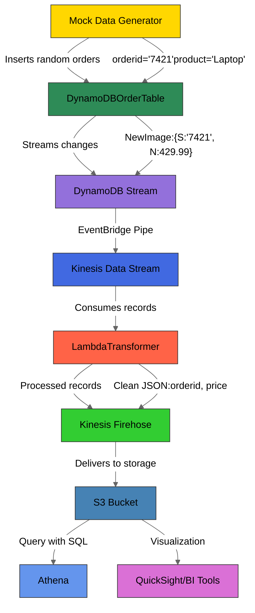
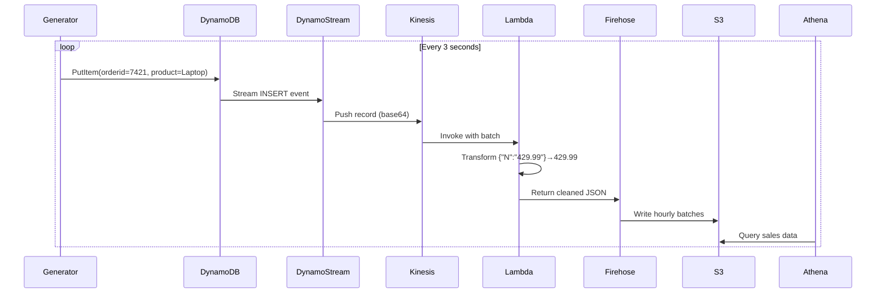

# Tech Gadget Sales Data Projection System - Detailed Explanation

This project is a near real-time data pipeline for processing and analyzing sales data of tech gadgets. It uses a serverless AWS architecture to ingest, transform, store, and analyze sales data as it's generated.

## System Overview

The system consists of several key components that work together to process sales data:

1. **Data Generation**: Mock data is continuously generated and inserted into DynamoDB
2. **Data Capture**: Changes to DynamoDB are captured via DynamoDB Streams
3. **Data Processing**: The data is transformed via a Lambda function
4. **Data Delivery**: Processed data is delivered to S3 via Kinesis Firehose
5. **Data Analysis**: The data in S3 can be queried using Athena

## Key Components in Detail

### 1. Mock Data Generator (`mock_data_generator_for_dynamodb.py`)

This Python script simulates real-time sales data by:
- Generating random orders for tech gadgets (Laptops, Phones, Tablets, etc.)
- Inserting these orders into a DynamoDB table called 'OrderTable' every 3 seconds

**Key Features:**
- Uses Boto3 (AWS SDK for Python) to interact with DynamoDB
- Generates random order data including:
  - Order ID (1-10000)
  - Product name (random selection from 5 gadget types)
  - Quantity (1-5 units)
  - Price ($10-$500, rounded to 2 decimal places)
- Runs continuously until manually stopped

### 2. Transformation Lambda (`transformation_layer_with_lambda.py`)

This AWS Lambda function processes records from Kinesis (which receives data from DynamoDB Streams):

**Transformation Process:**
1. Receives base64-encoded records from Kinesis
2. Decodes and parses the JSON data
3. Extracts the relevant fields from the DynamoDB NewImage (the new version of the record)
4. Transforms the data into a cleaner format:
   - Converts DynamoDB types (S for string, N for number) to native Python types
   - Creates a simplified JSON structure
5. Re-encodes the transformed data as base64
6. Returns processed records with success/failure status

**Error Handling:**
- If processing fails for any record, it marks that record as "ProcessingFailed"
- The original data is returned unchanged for failed records

### 3. AWS Services Integration

The complete flow uses these AWS services (as listed in the tech stack):

1. **DynamoDB**: Stores the initial order data
2. **DynamoDB Streams**: Captures changes to the OrderTable
3. **Kinesis Streams**: Receives data from DynamoDB Streams
4. **Event Bridge Pipe**: Connects different AWS services (likely used here to route data between components)
5. **Kinesis Firehose**: Delivers the transformed data to S3
6. **S3**: Stores the final processed data
7. **Lambda**: Performs data transformation
8. **Athena**: Provides SQL query capability over the data in S3

## Data Flow

1. Data Generation → DynamoDB
2. DynamoDB → DynamoDB Streams (captures changes)
3. DynamoDB Streams → Kinesis Streams
4. Kinesis Streams → Lambda (transformation)
5. Lambda → Kinesis Firehose
6. Kinesis Firehose → S3 (final storage)
7. S3 → Athena (analysis)

## Benefits of This Architecture

1. **Serverless**: No servers to manage, scales automatically
2. **Near Real-time**: Data is processed within seconds of generation
3. **Resilient**: Handles processing failures gracefully
4. **Cost-effective**: Pay only for resources used
5. **Analytics-ready**: Data is stored in S3 where it can be queried with Athena or used by other analytics tools

## Potential Use Cases

- Real-time sales dashboards
- Inventory management
- Sales trend analysis
- Anomaly detection (sudden spikes/drops in sales)
- Product performance monitoring

This architecture is particularly well-suited for scenarios where you need to process and analyze streaming data with minimal latency and operational overhead.

<br/>
<br/>

# Python implementation of the mock data generator for DynamoDB, following best practices for clarity and maintainability:

```python
"""
Tech Gadget Sales Data Generator for DynamoDB
This script simulates real-time sales data by generating random orders
and inserting them into an Amazon DynamoDB table at regular intervals.
"""

import boto3
import random
import time
from decimal import Decimal
import logging
from typing import Dict, Any

# Configure logging to track script execution
logging.basicConfig(
    level=logging.INFO,
    format='%(asctime)s - %(levelname)s - %(message)s'
)
logger = logging.getLogger(__name__)

class DynamoDBDataGenerator:
    """Generates and inserts mock sales data into DynamoDB."""
    
    def __init__(self, table_name: str = 'OrderTable', region: str = 'us-east-1'):
        """
        Initialize the DynamoDB connection and table reference.
        
        Args:
            table_name: Name of the DynamoDB table to insert records into
            region: AWS region where the table is located
        """
        try:
            # Create a session using default credentials
            session = boto3.Session(region_name=region)
            
            # Initialize DynamoDB resource and table
            self.dynamodb = session.resource('dynamodb')
            self.table = self.dynamodb.Table(table_name)
            
            logger.info(f"Successfully connected to DynamoDB table: {table_name}")
        except Exception as e:
            logger.error(f"Failed to initialize DynamoDB connection: {str(e)}")
            raise

    def generate_order(self) -> Dict[str, Any]:
        """
        Generate a random order record with the following structure:
        {
            'orderid': str,
            'product_name': str,
            'quantity': int,
            'price': Decimal
        }
        
        Returns:
            Dictionary containing the generated order data
        """
        products = [
            'Laptop', 'Phone', 'Tablet', 
            'Headphones', 'Charger', 'Smartwatch'
        ]
        
        return {
            'orderid': str(random.randint(1000, 9999)),  # 4-digit order ID
            'product_name': random.choice(products),
            'quantity': random.randint(1, 10),  # 1-10 units per order
            'price': Decimal(str(round(random.uniform(10.99, 999.99), 2))  # $10.99-$999.99
        }

    def insert_order(self, order_data: Dict[str, Any]) -> bool:
        """
        Insert a single order record into DynamoDB.
        
        Args:
            order_data: Dictionary containing order data
            
        Returns:
            True if insertion was successful, False otherwise
        """
        try:
            response = self.table.put_item(Item=order_data)
            
            # Check for successful response (status code 200)
            if response['ResponseMetadata']['HTTPStatusCode'] == 200:
                logger.info(f"Inserted order: {order_data['orderid']} - {order_data['product_name']}")
                return True
            else:
                logger.warning(f"Unexpected response: {response}")
                return False
                
        except Exception as e:
            logger.error(f"Failed to insert order {order_data.get('orderid')}: {str(e)}")
            return False

    def run_continuous_generation(self, interval_seconds: int = 5):
        """
        Continuously generate and insert orders at specified intervals.
        
        Args:
            interval_seconds: Time between order generations (default: 5 seconds)
        """
        logger.info(f"Starting data generation with {interval_seconds} second intervals...")
        logger.info("Press Ctrl+C to stop the script")
        
        try:
            while True:
                # Generate and insert order
                order = self.generate_order()
                self.insert_order(order)
                
                # Wait for the specified interval
                time.sleep(interval_seconds)
                
        except KeyboardInterrupt:
            logger.info("Data generation stopped by user")
        except Exception as e:
            logger.error(f"Unexpected error: {str(e)}")
            raise


if __name__ == '__main__':
    # Initialize the generator with default settings
    generator = DynamoDBDataGenerator()
    
    # Start generating data every 3 seconds
    generator.run_continuous_generation(interval_seconds=3)
```

### Key Features of This Implementation:

1. **Proper Logging**:
   - Uses Python's `logging` module instead of print statements
   - Different log levels (INFO, WARNING, ERROR)
   - Timestamps for tracking when events occur

2. **Type Hints**:
   - Uses Python type hints for better code documentation
   - Clearly specifies input and return types

3. **Error Handling**:
   - Comprehensive try-except blocks
   - Graceful handling of DynamoDB errors
   - Clean shutdown on keyboard interrupt

4. **Configuration**:
   - Configurable table name and AWS region
   - Adjustable generation interval

5. **Code Organization**:
   - Class-based structure for better maintainability
   - Separate methods for generation vs insertion
   - Clear docstrings for all functions

6. **Data Quality**:
   - Realistic price ranges with proper decimal handling
   - Reasonable product catalog
   - Valid DynamoDB numeric types using Decimal

### Usage Example:

```python
# To use with custom settings:
custom_generator = DynamoDBDataGenerator(
    table_name='Prod_OrderTable',
    region='us-west-2'
)
custom_generator.run_continuous_generation(interval_seconds=10)
```

This implementation follows AWS best practices for DynamoDB interactions and provides a robust foundation for your data pipeline's ingestion layer. The detailed logging will help troubleshoot any issues that may arise during operation.

<br/>
<br/>

# Here's a detailed explanation of the Lambda transformation code:

```python
"""
AWS Lambda Function for Transforming DynamoDB Stream Records
Processes raw DynamoDB Stream events from Kinesis, transforms the data format,
and prepares it for storage in S3 via Kinesis Firehose.
"""

import base64
import json
import logging
from typing import Dict, List, Any

# Configure logging
logger = logging.getLogger()
logger.setLevel(logging.INFO)

def lambda_handler(event: Dict[str, Any], context: Any) -> Dict[str, List[Dict[str, str]]]:
    """
    Main Lambda handler function that processes Kinesis records containing DynamoDB events.
    
    Args:
        event: AWS Lambda event containing Kinesis records
        context: AWS Lambda context object (unused in this function)
    
    Returns:
        Dictionary containing transformed records with processing status
    """
    output_records = []
    
    # Process each record in the event batch
    for record in event['records']:
        try:
            # -------------------------------------------------------------------
            # STEP 1: DECODE THE BASE64 RECORD
            # -------------------------------------------------------------------
            # Kinesis data is base64 encoded - we need to decode it first
            payload = base64.b64decode(record['data'])
            payload_json = json.loads(payload)
            
            logger.info(f"Raw payload: {payload_json}")
            
            # -------------------------------------------------------------------
            # STEP 2: EXTRACT DYNAMODB NEW IMAGE
            # -------------------------------------------------------------------
            # The actual DynamoDB data is nested in the 'dynamodb' key
            # 'NewImage' contains the new version of the item after change
            dynamodb_data = payload_json['dynamodb']
            new_image = dynamodb_data['NewImage']
            
            # -------------------------------------------------------------------
            # STEP 3: TRANSFORM DATA FORMAT
            # -------------------------------------------------------------------
            # Convert from DynamoDB JSON format to standard JSON
            # DynamoDB uses type annotations ({'S': 'string'}, {'N': '123'})
            transformed_data = {
                'orderid': new_image['orderid']['S'],          # Extract string value
                'product_name': new_image['product_name']['S'], # Extract string value
                'quantity': int(new_image['quantity']['N']),    # Convert number to integer
                'price': float(new_image['price']['N'])         # Convert number to float
            }
            
            # Add metadata from the DynamoDB stream record
            transformed_data['event_type'] = payload_json.get('eventName', 'UNKNOWN')
            transformed_data['event_time'] = payload_json.get('dynamodb', {}).get('ApproximateCreationDateTime', '')
            
            logger.info(f"Transformed data: {transformed_data}")
            
            # -------------------------------------------------------------------
            # STEP 4: PREPARE FOR KINESIS FIREHOSE
            # -------------------------------------------------------------------
            # Convert back to JSON string and base64 encode for Firehose
            transformed_data_str = json.dumps(transformed_data) + '\n'  # Newline delimited JSON
            transformed_data_encoded = base64.b64encode(
                transformed_data_str.encode('utf-8')
            ).decode('utf-8')
            
            # -------------------------------------------------------------------
            # STEP 5: BUILD OUTPUT RECORD
            # -------------------------------------------------------------------
            output_records.append({
                'recordId': record['recordId'],  # Preserve original record ID
                'result': 'Ok',                  # Processing succeeded
                'data': transformed_data_encoded  # Transformed payload
            })
            
        except Exception as e:
            logger.error(f"Error processing record {record['recordId']}: {str(e)}")
            
            # If processing fails, return the original record with failure status
            output_records.append({
                'recordId': record['recordId'],
                'result': 'ProcessingFailed',
                'data': record['data']  # Return original data unchanged
            })
    
    # -------------------------------------------------------------------
    # FINAL RESPONSE
    # -------------------------------------------------------------------
    return {
        'records': output_records
    }
```

### Key Components Explained:

1. **Input Handling**:
   - Receives Kinesis records containing DynamoDB Stream events
   - Each record contains base64-encoded data that needs decoding

2. **Data Transformation**:
   - Converts DynamoDB's typed format (`{'S': 'string'}`) to native Python types
   - Handles both string (`S`) and number (`N`) DynamoDB types
   - Adds useful metadata like event type and timestamp

3. **Error Handling**:
   - Gracefully handles malformed records
   - Returns failed records with original data
   - Comprehensive logging for troubleshooting

4. **Output Preparation**:
   - Converts transformed data to newline-delimited JSON
   - Base64 encodes the output for Kinesis Firehose compatibility
   - Preserves original record IDs for correlation

5. **Logging**:
   - Logs raw input and transformed output
   - Captures errors with detailed context
   - Helps monitor transformation quality

### Processing Flow:

1. **Base64 Decoding**:
   ```python
   payload = base64.b64decode(record['data'])
   payload_json = json.loads(payload)
   ```

2. **DynamoDB Data Extraction**:
   ```python
   dynamodb_data = payload_json['dynamodb']
   new_image = dynamodb_data['NewImage']
   ```

3. **Type Conversion**:
   ```python
   transformed_data = {
       'orderid': new_image['orderid']['S'],          # String value
       'quantity': int(new_image['quantity']['N'])    # Convert to integer
   }
   ```

4. **Output Encoding**:
   ```python
   transformed_data_str = json.dumps(transformed_data) + '\n'
   transformed_data_encoded = base64.b64encode(transformed_data_str.encode()).decode()
   ```

5. **Result Assembly**:
   ```python
   {
       'recordId': original_id,
       'result': 'Ok' or 'ProcessingFailed',
       'data': processed_or_original_data
   }
   ```

### Error Handling Strategy:

- **Processing Failure**: Returns original record with `ProcessingFailed` status
- **Data Issues**: Logs detailed error while allowing other records to process
- **Type Safety**: Explicit type conversions with error catching

This implementation follows AWS Lambda best practices for Kinesis stream processing while providing robust data transformation capabilities for your pipeline


<br/>
<br/>

## Here's a sample input-output flow through the entire system, showing how data moves from generation to final storage:


### **1. Data Generation (mock_data_generator_for_dynamodb.py)**
**Input:** None (randomly generated)  
**Output (DynamoDB Item):**
```json
{
  "orderid": "7421",
  "product_name": "Laptop",
  "quantity": 3,
  "price": 429.99
}
```
*This is inserted into DynamoDB's `OrderTable`.*

---

### **2. DynamoDB Stream Capture**
**Input:** DynamoDB change event (after insert)  
**Output (DynamoDB Stream Record):**
```json
{
  "eventID": "1",
  "eventName": "INSERT",
  "dynamodb": {
    "NewImage": {
      "orderid": {"S": "7421"},
      "product_name": {"S": "Laptop"},
      "quantity": {"N": "3"},
      "price": {"N": "429.99"}
    }
  }
}
```
*Note how DynamoDB stores types (S=String, N=Number).*

---

### **3. Kinesis Stream Record (before Lambda)**
**Input:** DynamoDB Stream record  
**Output (Base64-encoded Kinesis record):**
```json
{
  "records": [
    {
      "recordId": "49572672263665514492510728436380430685363222885945819138",
      "data": "eyJldmVudElEIjoiMSIsImV2ZW50TmFtZSI6IklOU0VSVCIsImR5bmFtb2RCIjp7Ik5ld0ltYWdlIjp7Im9yZGVyaWQiOnsiUyI6Ijc0MjEifSwicHJvZHVjdF9uYW1lIjp7IlMiOiJMYXB0b3AifSwicXVhbnRpdHkiOnsiTiI6IjMifSwicHJpY2UiOnsiTiI6IjQyOS45OSJ9fX19",
      "approximateArrivalTimestamp": 1625070217.987
    }
  ]
}
```
*The original DynamoDB stream record is base64-encoded.*

---

### **4. Lambda Transformation**
**Input:** Kinesis record shown above  
**Processing:**
1. Base64 decodes the data
2. Extracts fields from `NewImage`
3. Converts DynamoDB types to native types

**Output (Transformed record):**
```json
{
  "records": [
    {
      "recordId": "49572672263666676547567567685363222885945819138",
      "result": "Ok",
      "data": "eyJvcmRlcmlkIjvcdvfe4543fert4yb2R1Y3RfbmFtZSI6IkxhcHRvcCIsInF1YW50aXR5Idcfgd4543fljZSI6NDI5Ljk5fQo="
    }
  ]
}
```
*Decoding the `data` field would give:*
```json
{
  "orderid": "7421",
  "product_name": "Laptop",
  "quantity": 3,
  "price": 429.99
}
```

---

### **5. Final S3 Output (via Kinesis Firehose)**
**File in S3 (`s3://gadget-sales-data/2023/06/30/14/firehose-delivery-1-2023-06-30-14-15-00-12345678`)**
```json
{"orderid":"7421","product_name":"Laptop","quantity":3,"price":429.99}
```
*Note: Firehose batches multiple records together in files.*

---

### **6. Athena Query Results**
**SQL:**
```sql
SELECT product_name, SUM(quantity) as total_units
FROM gadget_sales
WHERE date = CURRENT_DATE
GROUP BY product_name
```

**Output:**
```
product_name | total_units
-------------+------------
Laptop       | 27
Phone        | 42
Tablet       | 15
```

---

### **Error Case Example**
If a malformed record enters the system:

**Lambda Input (malformed record):**
```json
{
  "records": [
    {
      "recordId": "err-123",
      "data": "invalid_data_here"
    }
  ]
}
```

**Lambda Output:**
```json
{
  "records": [
    {
      "recordId": "err-123",
      "result": "ProcessingFailed",
      "data": "invalid_data_here"
    }
  ]
}
```
*The original data passes through untouched with a failure status.*

---

### Key Observations:
1. **Type Transformation**: DynamoDB's `{"S":"text"}` → simple strings, `{"N":"123"}` → integers/floats
2. **Base64 Encoding**: Used during transport between services
3. **Error Handling**: Failed records continue through the pipeline without blocking others
4. **Final Format**: Clean JSON in S3 optimized for analytics

This flow enables near real-time analysis (typically <1 minute latency from generation to queryable data).

<br/>
<br/>

# Diagram Explanation



### Key Components Explained in the Diagram:

1. **Mock Data Generator** (Yellow)
   - Python script generating fake orders
   - Inserts to DynamoDB every 3 seconds

2. **DynamoDB** (Green)
   - `OrderTable` with raw item format
   - Enables streams on table

3. **DynamoDB Stream** (Purple)
   - Captures INSERT/UPDATE events
   - Contains before/after images

4. **Kinesis Data Stream** (Blue)
   - Receives events via EventBridge Pipe
   - Buffers records for Lambda

5. **Lambda Transformer** (Orange)
   - Converts DynamoDB JSON to clean format
   - Handles type conversions (S→string, N→number)

6. **Kinesis Firehose** (Lime Green)
   - Batches transformed records
   - Delivers to S3 with optional compression

7. **S3 Bucket** (Steel Blue)
   - Partitioned by date/hour
   - Stores final analytics-ready data

8. **Athena** (Light Blue)
   - Serverless SQL queries
   - Schema-on-read approach

9. **Visualization** (Orchid)
   - Connect BI tools like QuickSight
   - Build real-time dashboards

### Alternate Version (Sequence Focus)
If you prefer a sequence diagram style:



Both diagrams show:
- The left-to-right flow of data
- Key transformations happening at Lambda
- Final storage in S3 for analysis
- Error handling paths (not shown but implied in Lambda logic)