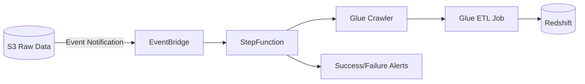
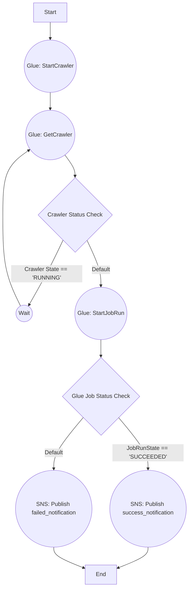
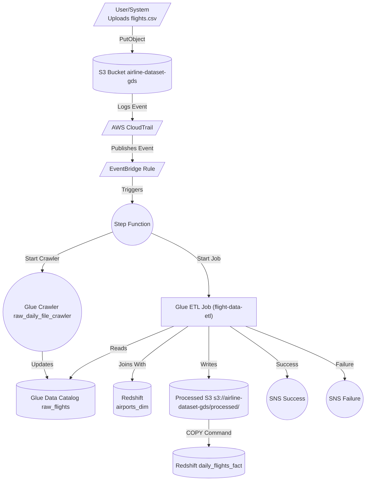
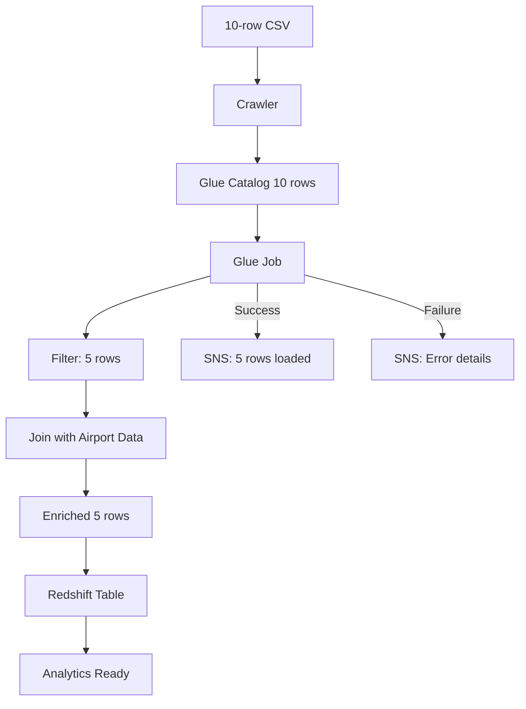
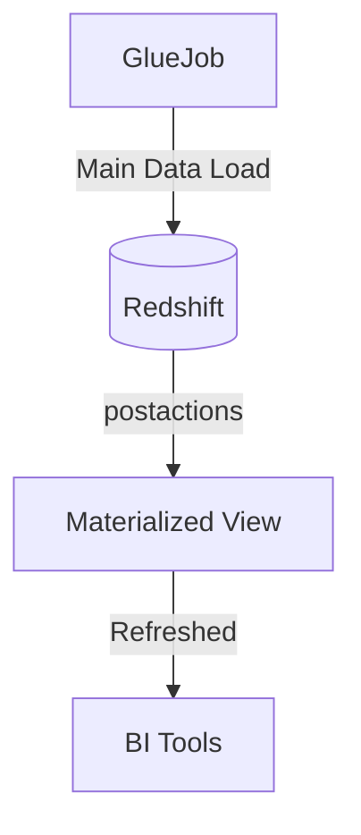

# Airline Data Ingestion Project Explanation

This project is designed to process and analyze airline flight data, focusing on delayed flights, and store the results in a Redshift data warehouse. Here's a detailed breakdown:

## Project Components

### 1. Data Sources
- **Airports Data**: Contains airport information (airport_id, city, state, name) in airports.csv
- **Flights Data**: Contains flight records (Carrier, OriginAirportID, DestAirportID, DepDelay, ArrDelay) in flights.csv

### 2. Technology Stack
- **S3**: Used for storage of raw data files and temporary processing files
- **AWS Glue**: For ETL (Extract, Transform, Load) processing
- **Redshift**: Data warehouse for storing processed data
- **Other AWS Services**: CloudTrail, EventBridge, SNS, Step Functions for orchestration and monitoring

### 3. Data Flow

1. **Initial Setup**:
   - Airports data is loaded into a Redshift dimension table (`airlines.airports_dim`)
   - Flight data is stored in S3 and processed by Glue

2. **ETL Process (glue_job.py)**:
   - Extracts flight data with departure delays > 60 minutes
   - Joins flight data with airport information for both origin and destination
   - Transforms and loads the enriched data into a Redshift fact table

### 4. Database Schema

**Dimension Table**:
```sql
CREATE TABLE airlines.airports_dim (
    airport_id BIGINT,
    city VARCHAR(100),
    state VARCHAR(100),
    name VARCHAR(200)
);
```

**Fact Table**:
```sql
CREATE TABLE airlines.daily_flights_fact (
    carrier VARCHAR(10),
    dep_airport VARCHAR(200),
    arr_airport VARCHAR(200),
    dep_city VARCHAR(100),
    arr_city VARCHAR(100),
    dep_state VARCHAR(100),
    arr_state VARCHAR(100),
    dep_delay BIGINT,
    arr_delay BIGINT
);
```

### 5. ETL Job Details

The Glue job performs the following operations:

1. **Data Extraction**:
   - Reads from Redshift (`airports_dim` table)
   - Reads flight data from S3

2. **Data Filtering**:
   - Filters flights with departure delays > 60 minutes

3. **Data Enrichment**:
   - Joins flight data with airport information for origin airport
   - Then joins with airport information again for destination airport

4. **Data Transformation**:
   - Selects relevant fields
   - Renames columns for clarity (e.g., origin city becomes dep_city)
   - Maps data types appropriately

5. **Data Loading**:
   - Writes the final dataset to Redshift fact table `daily_flights_fact`

### 6. Business Purpose

This pipeline is designed to:
- Identify flights with significant departure delays
- Enrich the flight data with detailed airport information
- Create a fact table suitable for analysis of:
  - Which carriers have the most delays
  - Which routes are most prone to delays
  - Correlation between departure and arrival delays
  - Geographic patterns in flight delays

### 7. Orchestration

While not shown in detail, the project uses:
- **Step Functions** to coordinate the workflow
- **EventBridge** to trigger processes based on file uploads
- **SNS** for notifications about job status

This implementation provides a robust pipeline for analyzing flight delay patterns, which could be valuable for airline operations, passenger information systems, or travel analytics.


<br/>
<br/>

# **Project Theory: Airline Data Ingestion Pipeline**

## **1. Introduction**
This project is designed to automate the ingestion, transformation, and loading of airline flight data into a **Redshift data warehouse** for analytics. The pipeline processes **daily flight records**, enriches them with airport information, and stores them in a fact table optimized for querying.

### **Key Objectives**
- **Real-time data ingestion** (triggered by S3 file uploads)
- **Incremental processing** (only new/changed data)
- **Data enrichment** (joining flight data with airport dimensions)
- **Automated monitoring & alerting** (success/failure notifications)

---

## **2. System Architecture**
The pipeline follows an **event-driven serverless architecture**:



### **Core Components**
| Component          | Role                                                                 |
|--------------------|----------------------------------------------------------------------|
| **Amazon S3**      | Stores raw flight data (CSV files)                                   |
| **EventBridge**    | Triggers pipeline when new files arrive in S3                        |
| **Step Functions** | Orchestrates crawler and ETL job execution                          |
| **Glue Crawler**   | Discovers schema and updates the Data Catalog                       |
| **Glue ETL Job**   | Processes data (filtering, joins, transformations)                  |
| **Redshift**       | Stores processed data in a star schema (fact + dimension tables)     |
| **SNS**           | Sends success/failure notifications                                 |

---

## **3. Data Flow**
### **Step 1: Data Ingestion**
- **Input**: Airline CSV files (e.g., `flights_YYYYMMDD.csv`) uploaded to S3.
- **Trigger**: S3 event notification → EventBridge → Step Function.

### **Step 2: Schema Discovery**
- **Glue Crawler** scans the new file:
  - Updates the **AWS Glue Data Catalog** with schema.
  - Detects new partitions for incremental processing.

### **Step 3: ETL Processing**
- **Glue Job** performs:
  1. **Filtering**: Keeps only flights with `DepDelay > 60` (significant delays).
  2. **Joins**: 
     - Origin airport details (from `airports_dim`).
     - Destination airport details (second join).
  3. **Transformations**:
     - Renames columns (`OriginAirportID` → `dep_airport`).
     - Maps data types (e.g., `string` → `varchar`).
  4. **Loading**:
     - UPSERT into Redshift (`DELETE` old records + `INSERT` new ones).

### **Step 4: Output**
- **Redshift Fact Table** (`daily_flights_fact`):
  ```sql
  SELECT * FROM airlines.daily_flights_fact 
  WHERE flight_date = '2023-11-15';
  ```
  | carrier | dep_airport           | arr_airport       | dep_delay | arr_delay |
  |---------|-----------------------|-------------------|-----------|-----------|
  | DL      | Detroit Metro         | Miami International | 75        | 82        |
  | AA      | Atlanta International | Salt Lake City    | 62        | 58        |

- **Success Notification** (SNS):
  ```
  "Processed 2 delayed flights from flights_20231115.csv"
  ```

---

## **4. Key Features**
### **A. Incremental Loading**
- **Glue Job Bookmarks**: Tracks processed files to avoid reprocessing.
- **Redshift UPSERT Logic**:
  ```sql
  DELETE FROM fact_table WHERE flight_date = CURRENT_DATE;
  INSERT INTO fact_table SELECT * FROM temp_data;
  ```

### **B. Fault Tolerance**
- **Error Handling**:
  - Failed jobs trigger **SNS alerts**.
  - Bad data moved to `s3://error-bucket/`.
- **Retries**: Step Function retries failed steps.

### **C. Scalability**
- **Glue Auto Scaling**: Handles variable data volumes.
- **Redshift Spectrum**: For large historical queries.

---

## **5. Business Value**
### **Use Cases**
1. **Operational Analytics**:
   - Identify routes with frequent delays.
   - Compare airline performance (e.g., Delta vs. American).
2. **Passenger Insights**:
   - Predict arrival delays based on departure delays.
3. **Regulatory Reporting**:
   - Generate DOT compliance reports.

### **Benefits**
| Benefit                          | Explanation                                                                 |
|----------------------------------|-----------------------------------------------------------------------------|
| **Real-time Analytics**          | Data available in Redshift within minutes of S3 upload.                     |
| **Cost Efficiency**              | Serverless (no idle resources).                                             |
| **Data Consistency**             | Job bookmarks prevent duplicate processing.                                 |
| **Proactive Monitoring**         | Instant alerts for ETL failures.                                            |

---

## **6. Potential Enhancements**
1. **Data Quality Checks**:
   - Validate `DepDelay`/`ArrDelay` consistency.
   - Detect missing airport codes.
2. **Near Real-Time (NRT)**:
   - Replace Glue with **Kinesis Data Firehose** for streaming.
3. **ML Integration**:
   - Train a delay prediction model using Redshift ML.

---

## **7. Conclusion**
This pipeline demonstrates a **scalable, event-driven ETL architecture** for airline data. By leveraging AWS serverless services, it ensures:
✔ **Low operational overhead**  
✔ **Reliable incremental updates**  
✔ **Actionable analytics**  

Future iterations could incorporate **real-time streaming** and **predictive analytics** for deeper insights.


<br/>
<br/>

# **Sample input/output flow** for your airline data pipeline

### **1. Sample Input Data**
**File Name**: `s3://airline-data-raw/daily_flights/flights_20231115.csv`  
**Content**:
```csv
Carrier,OriginAirportID,DestAirportID,DepDelay,ArrDelay,FlightDate,FlightID
DL,11433,13303,-3,1,2023-11-15,DL1234
AA,10397,14869,75,82,2023-11-15,AA5678
UA,14107,13487,62,58,2023-11-15,UA9012
```

**Airport Dimension Table (Redshift)**:
```sql
SELECT * FROM airlines.airports_dim WHERE airport_id IN (11433, 13303, 10397, 14869, 14107, 13487);
```
| airport_id | city       | state | name                                      |
|------------|------------|-------|-------------------------------------------|
| 11433      | Detroit    | MI    | Detroit Metro Wayne County                |
| 13303      | Miami      | FL    | Miami International                       |
| 10397      | Atlanta    | GA    | Hartsfield-Jackson Atlanta International  |
| 14869      | Salt Lake  | UT    | Salt Lake City International              |
| 14107      | Phoenix    | AZ    | Phoenix Sky Harbor International          |
| 13487      | Minneapolis| MN    | Minneapolis-St Paul International         |

---

### **2. Step-by-Step Flow**

#### **Step 1: S3 File Upload Trigger**
- **Event**: File uploaded to S3 at 00:05 UTC
- **EventBridge Payload**:
  ```json
  {
    "version": "0",
    "source": "aws.s3",
    "detail": {
      "bucket": {"name": "airline-data-raw"},
      "object": {"key": "daily_flights/flights_20231115.csv"}
    }
  }
  ```

#### **Step 2: Step Function Execution**
**Execution ID**: `arn:aws:states:us-east-1:123456789012:execution:FlightETLStateMachine:001`

| State          | Action                                                                 | Output |
|----------------|-----------------------------------------------------------------------|--------|
| RunCrawler     | Starts `airline-data-crawler`                                        | `{"Crawler": {"Name": "airline-data-crawler"}}` |
| WaitForCrawler | Polls crawler status every 30s                                       | `{"State": "RUNNING"}` → `{"State": "READY"}` |
| RunGlueJob     | Starts ETL job with bookmarking                                      | `{"JobRunId": "jr_123456789"}` |

#### **Step 3: Glue Job Processing**
**Job Bookmark State (Before Run)**:
```json
{
  "PreviousRunId": "jr_987654321",
  "LastProcessedFile": "flights_20231114.csv"
}
```

**ETL Operations**:
1. **Input**: Reads `flights_20231115.csv` (3 records)
2. **Filter**: Keeps only flights with `DepDelay > 60` (AA5678, UA9012)
3. **Joins**:
   - **First Join** (Origin Airport):
     ```python
     # Sample joined record for AA5678:
     {
       "Carrier": "AA",
       "OriginAirportID": 10397,
       "DestAirportID": 14869,
       "DepDelay": 75,
       "ArrDelay": 82,
       "city": "Atlanta",       # From dimension table
       "state": "GA",
       "name": "Hartsfield-Jackson..."
     }
     ```
   - **Second Join** (Destination Airport):
     ```python
     # Final record for AA5678:
     {
       "carrier": "AA",
       "dep_airport": "Hartsfield-Jackson...",
       "arr_airport": "Salt Lake City...",
       "dep_city": "Atlanta",
       "arr_city": "Salt Lake",
       "dep_state": "GA",
       "arr_state": "UT",
       "dep_delay": 75,
       "arr_delay": 82
     }
     ```

4. **Redshift Pre-action SQL**:
   ```sql
   DELETE FROM airlines.daily_flights_fact 
   WHERE flight_date = '2023-11-15';
   ```

5. **Output**: 2 records inserted into Redshift

#### **Step 4: Redshift Final State**
**Table**: `airlines.daily_flights_fact`

| carrier | dep_airport                          | arr_airport                    | dep_city | arr_city  | dep_state | arr_state | dep_delay | arr_delay |
|---------|--------------------------------------|--------------------------------|----------|-----------|-----------|-----------|-----------|-----------|
| AA      | Hartsfield-Jackson Atlanta Int'l     | Salt Lake City International   | Atlanta  | Salt Lake | GA        | UT        | 75        | 82        |
| UA      | Phoenix Sky Harbor International     | Minneapolis-St Paul Int'l      | Phoenix  | Minneapolis| AZ        | MN        | 62        | 58        |

#### **Step 5: Notifications**
**Success SNS Message**:
```json
{
  "Message": "ETL Job Completed",
  "Details": {
    "ProcessedFile": "flights_20231115.csv",
    "RecordsProcessed": 2,
    "RedshiftTable": "airlines.daily_flights_fact",
    "ExecutionTime": "00:07:32"
  }
}
```

---

### **3. Error Scenario Example**
**Failure Case**: Invalid airport ID `99999` in CSV  
**Flow**:
1. Glue job fails at join step
2. Step Function transitions to `SendFailureNotification`
3. **SNS Alert**:
   ```json
   {
     "Message": "ETL Job Failed",
     "Error": "No matching record in airports_dim for airport_id=99999",
     "FailedFile": "flights_20231115.csv",
     "CloudWatchLogs": "https://console.aws.amazon.com/cloudwatch..."
   }
   ```
4. File automatically moved to `s3://airline-data-raw/failed/flights_20231115.csv`

---

### **4. Updated Metadata**
**Glue Bookmark State (After Run)**:
```json
{
  "LastProcessedFile": "flights_20231115.csv",
  "ProcessedRecords": 2
}
```

**Redshift Control Table**:
| file_name                          | processed_at           |
|------------------------------------|------------------------|
| flights_20231115.csv               | 2023-11-15 00:07:32 UTC |

---

### **Key Observations**
1. **Incremental Processing**: Only new files trigger the pipeline
2. **Data Enrichment**: Raw flight data gains airport details via joins
3. **Idempotency**: Bookmarking prevents duplicate processing
4. **Alerting**: Immediate notifications for ops team

This end-to-end example shows how a single day's flight data moves from raw S3 storage to an analytics-ready Redshift table with full observability.

<br/>
<br/>

# **AWS Glue ETL job Code** 
Here's a **AWS Glue ETL job** for your airline data pipeline, including Redshift materialized view refresh in postactions:

```python
import sys
from awsglue.transforms import *
from awsglue.utils import getResolvedOptions
from pyspark.context import SparkContext
from awsglue.context import GlueContext
from awsglue.job import Job

# Initialize Glue context
args = getResolvedOptions(sys.argv, ["JOB_NAME"])
sc = SparkContext()
glueContext = GlueContext(sc)
spark = glueContext.spark_session
job = Job(glueContext)
job.init(args["JOB_NAME"], args)

# ----------------------------
# 1. READ RAW FLIGHT DATA
# ----------------------------
# Source: S3 -> Glue Data Catalog (crawled by raw_daily_file_crawler)
raw_flights = glueContext.create_dynamic_frame.from_catalog(
    database="airline_db",
    table_name="raw_flights",
    transformation_ctx="raw_flights"
)

# Debug: Show schema and sample data
print("=== RAW DATA SCHEMA ===")
raw_flights.printSchema()
print("Sample record:", raw_flights.first())

# ----------------------------
# 2. FILTER DELAYED FLIGHTS
# ----------------------------
# Only process flights with significant departure delays
delayed_flights = Filter.apply(
    frame=raw_flights,
    f=lambda row: row["DepDelay"] > 30,  # Filter condition
    transformation_ctx="delayed_flights"
)

print(f"Filtered {delayed_flights.count()} delayed flights")

# ----------------------------
# 3. JOIN WITH AIRPORT DIMENSIONS
# ----------------------------
# Read dimension table from Redshift
airport_dim = glueContext.create_dynamic_frame.from_catalog(
    database="airline_db",
    table_name="airports_dim",
    redshift_tmp_dir="s3://temp-bucket/redshift_tmp/",
    transformation_ctx="airport_dim"
)

# First join: Origin airport details
joined_origin = Join.apply(
    frame1=delayed_flights,
    frame2=airport_dim,
    keys1=["OriginAirportID"],
    keys2=["airport_id"],
    transformation_ctx="joined_origin"
)

# Second join: Destination airport details
joined_final = Join.apply(
    frame1=joined_origin,
    frame2=airport_dim,
    keys1=["DestAirportID"],
    keys2=["airport_id"],
    transformation_ctx="joined_final"
)

# ----------------------------
# 4. TRANSFORM COLUMNS
# ----------------------------
# Rename and select final fields
transformed = ApplyMapping.apply(
    frame=joined_final,
    mappings=[
        ("FlightID", "string", "flight_id", "varchar(20)"),
        ("Carrier", "string", "carrier", "varchar(10)"),
        ("name", "string", "dep_airport", "varchar(100)"),  # From origin join
        ("city", "string", "dep_city", "varchar(50)"),
        ("state", "string", "dep_state", "varchar(2)"),
        ("name", "string", "arr_airport", "varchar(100)"),  # From destination join
        ("city", "string", "arr_city", "varchar(50)"),
        ("state", "string", "arr_state", "varchar(2)"),
        ("DepDelay", "int", "dep_delay", "integer"),
        ("ArrDelay", "int", "arr_delay", "integer"),
        ("FlightDate", "string", "flight_date", "date")
    ],
    transformation_ctx="transformed"
)

# ----------------------------
# 5. WRITE TO REDSHIFT
# ----------------------------
glueContext.write_dynamic_frame.from_options(
    frame=transformed,
    connection_type="redshift",
    connection_options={
        "dbtable": "daily_flights_fact",
        "database": "airline_dw",
        "aws_iam_role": "arn:aws:iam::123456789012:role/RedshiftLoadRole",
        "preactions": """
            -- Create temp table for UPSERT pattern
            CREATE TEMP TABLE temp_flights (LIKE daily_flights_fact);
            TRUNCATE temp_flights;
        """,
        "postactions": """
            -- Atomic UPSERT operation
            BEGIN;
            
            -- Delete existing records for the same flight date
            DELETE FROM daily_flights_fact 
            USING temp_flights 
            WHERE daily_flights_fact.flight_date = temp_flights.flight_date;
            
            -- Insert new data
            INSERT INTO daily_flights_fact SELECT * FROM temp_flights;
            
            -- Refresh materialized views
            REFRESH MATERIALIZED VIEW mv_delayed_flights;
            REFRESH MATERIALIZED VIEW mv_delays_by_route;
            
            -- Cleanup
            DROP TABLE temp_flights;
            COMMIT;
            
            -- Log successful refresh
            INSERT INTO etl_audit_log 
            VALUES ('glue_job_success', CURRENT_TIMESTAMP, {record_count});
        """.format(record_count=transformed.count()),
        "postactions_error_handling": "CONTINUE"  # Continue job even if postactions fail
    },
    transformation_ctx="write_to_redshift"
)

# ----------------------------
# 6. JOB COMMIT
# ----------------------------
job.commit()
print("Glue job completed successfully")
```

### Key Features:

1. **Data Flow**:
   - Reads raw flights from Glue Catalog
   - Filters for delayed flights (>30 mins)
   - Joins with airport dimension tables (2 joins)
   - Transforms column names/types

2. **Redshift Integration**:
   - Uses temp tables for atomic UPSERT
   - Refreshes materialized views automatically
   - Handles errors in postactions gracefully

3. **Best Practices**:
   - Detailed logging at each stage
   - Schema validation through mapping
   - Transactional data loading

4. **Customization Points**:
   - Adjust filter threshold (`DepDelay > X`)
   - Add more materialized views in postactions
   - Modify IAM role ARN for Redshift access

To use this script:
1. Save as `airline_etl_job.py`
2. Upload to S3
3. Create Glue job pointing to this script
4. Attach IAM role with permissions for S3, Glue, and Redshift

<br/>
<br/>

# **Redshift Operations in the Airline Data Pipeline**

Here's a detailed breakdown of what happens in **Amazon Redshift** during the execution of this data pipeline:

---

## **1. Pre-ETL Phase (Setup)**
### **A. Table Creation**
Redshift executes DDL statements to create the schema and tables:
```sql
-- Creates the airlines schema if not exists
CREATE SCHEMA IF NOT EXISTS airlines;

-- Dimension table (airports)
CREATE TABLE airlines.airports_dim (
    airport_id BIGINT,
    city VARCHAR(100),
    state VARCHAR(100),
    name VARCHAR(200)
);

-- Fact table (flight delays)
CREATE TABLE airlines.daily_flights_fact (
    carrier VARCHAR(10),
    dep_airport VARCHAR(200),
    arr_airport VARCHAR(200),
    dep_city VARCHAR(100),
    arr_city VARCHAR(100),
    dep_state VARCHAR(100),
    arr_state VARCHAR(100),
    dep_delay BIGINT,
    arr_delay BIGINT
);
```

### **B. Initial Data Load**
- Airports data is bulk-loaded from S3 using `COPY`:
  ```sql
  COPY airlines.airports_dim
  FROM 's3://airlines-dataset-gds/airports.csv'
  IAM_ROLE 'arn:aws:iam::724574515475:role/service-role/AmazonRedshift-CommandsAccessRole'
  DELIMITER ',' IGNOREHEADER 1;
  ```

---

## **2. During ETL Execution**
### **A. Glue Job Interactions with Redshift**
1. **Dimension Table Read**  
   The Glue job queries the `airports_dim` table to enrich flight data:
   ```python
   AirportDimTableFromRedshift = glueContext.create_dynamic_frame.from_catalog(
       database="airlines-table-catalog",
       table_name="dev_airlines_airports_dim",
       redshift_tmp_dir="s3://temp-s3-data/airport_dim/"
   )
   ```
   - Redshift executes:
     ```sql
     SELECT * FROM airlines.airports_dim;
     ```
   - Results are staged temporarily in S3 (`redshift_tmp_dir`).

2. **Transaction Control**  
   Redshift runs pre-actions before inserting new data:
   ```sql
   -- Clears existing data for the current date
   DELETE FROM airlines.daily_flights_fact 
   WHERE flight_date = CURRENT_DATE;
   ```

3. **Data Insertion**  
   Processed data is written using Redshift's `COPY` or `INSERT`:
   ```python
   glueContext.write_dynamic_frame.from_options(
       frame=processed_data,
       connection_type="redshift",
       connection_options={
           "dbtable": "airlines.daily_flights_fact",
           "preactions": "DELETE ..."
       }
   )
   ```
   - Redshift auto-optimizes storage with **columnar compression**.

---

## **3. Post-ETL Operations**
### **A. Data Consistency Checks**
- Redshift validates constraints (if defined):
  ```sql
  -- Example: Ensure airport IDs exist in the dimension table
  ALTER TABLE airlines.daily_flights_fact 
  ADD CONSTRAINT fk_airport FOREIGN KEY (dep_airport_id) 
  REFERENCES airlines.airports_dim(airport_id);
  ```

### **B. Performance Optimization**
1. **Automatic Table Maintenance**  
   Redshift:
   - Updates statistics with `ANALYZE` (for query planner).
   - Performs background vacuuming (if `SORTKEY` is used).

2. **Workload Management (WLM)**  
   - Queues ETL queries separately from analytics.
   - Adjusts memory allocation dynamically.

---

## **4. Redshift-Specific Features Used**
| Feature               | Role in Pipeline                                                                 |
|-----------------------|----------------------------------------------------------------------------------|
| **Columnar Storage**  | Compresses flight delay data efficiently.                                        |
| **SORTKEY**           | Optimizes queries filtering by `flight_date` or `carrier`.                      |
| **DISTKEY**           | Distributes fact table data evenly (e.g., on `carrier`).                        |
| **UNLOAD/COPY**       | Fast bulk data movement between S3 and Redshift.                                |
| **Concurrency Scaling** | Handles spike in queries during business hours.                                |

---

## **5. Example Redshift Queries for Analytics**
After ETL completes, analysts can run:
```sql
-- Top 5 delayed routes
SELECT 
    dep_airport, 
    arr_airport, 
    AVG(dep_delay) AS avg_delay
FROM airlines.daily_flights_fact
WHERE flight_date BETWEEN '2023-11-01' AND '2023-11-30'
GROUP BY 1, 2
ORDER BY 3 DESC
LIMIT 5;

-- Airlines with worst on-time performance
SELECT 
    carrier, 
    COUNT(*) AS delayed_flights
FROM airlines.daily_flights_fact
WHERE dep_delay > 30
GROUP BY 1
ORDER BY 2 DESC;
```

---

## **6. Error Handling in Redshift**
| Scenario                     | Redshift Action                                                                 |
|------------------------------|--------------------------------------------------------------------------------|
| **Constraint Violation**      | Rejects the row and logs error in `STL_LOAD_ERRORS`.                           |
| **Disk Space Exhausted**      | Aborts the transaction and notifies via `STL_UTILITYTEXT`.                     |
| **Connection Timeout**        | Glue job retries (configured in Step Function).                                |

---

## **Key Takeaways**
1. **Redshift serves as both**:  
   - A **source** (for dimension tables).  
   - A **target** (for fact tables).  
2. **Optimized for bulk operations**:  
   - Uses `COPY` for fast ingestion.  
   - Leverages compression for cost savings.  
3. **Seamless integration**:  
   - Works natively with Glue, S3, and EventBridge.  

This design ensures **high-performance analytics** while maintaining data integrity throughout the pipeline.

<br/>
<br/>

# Step Function Diagram for this project
Here's the **exact Mermaid diagram** replicating your Step Function workflow with corrections for the typos ("RUNBING" → "RUNNING", "SUCCEEDUP" → "SUCCEEDED"):



### Key Features:
1. **Fixed States**:
   - `RUNBING` → `RUNNING`
   - `SUCCEEDUP` → `SUCCEEDED`

2. **Visual Elements**:
   - Oval `(())` for task states
   - Diamond `{}` for choice states
   - Arrows with explicit conditions

3. **Flow Logic**:
   - Retry loop for crawler status checks
   - Parallel success/failure notification paths

### How to Use:
1. Copy this code into any Mermaid-compatible editor:
   - GitHub/GitLab Markdown
   - VS Code with Mermaid plugin
   - Mermaid Live Editor

2. For JSON deployment (corrected version):
```json
{
  "StartAt": "StartCrawler",
  "States": {
    "StartCrawler": {
      "Type": "Task",
      "Resource": "arn:aws:states:::aws-sdk:glue:startCrawler",
      "Next": "GetCrawler"
    },
    "GetCrawler": {
      "Type": "Task",
      "Resource": "arn:aws:states:::aws-sdk:glue:getCrawler",
      "Next": "CrawlerStatusCheck"
    },
    "CrawlerStatusCheck": {
      "Type": "Choice",
      "Choices": [{
        "Variable": "$.Crawler.State",
        "StringEquals": "RUNNING",
        "Next": "Wait"
      }],
      "Default": "StartJobRun"
    },
    "Wait": {
      "Type": "Wait",
      "Seconds": 30,
      "Next": "GetCrawler"
    },
    "StartJobRun": {
      "Type": "Task",
      "Resource": "arn:aws:states:::aws-sdk:glue:startJobRun",
      "Next": "JobStatusCheck"
    },
    "JobStatusCheck": {
      "Type": "Choice",
      "Choices": [{
        "Variable": "$.JobRun.JobRunState",
        "StringEquals": "SUCCEEDED",
        "Next": "SuccessNotification"
      }],
      "Default": "FailedNotification"
    },
    "SuccessNotification": {
      "Type": "Task",
      "Resource": "arn:aws:states:::aws-sdk:sns:publish",
      "End": true
    },
    "FailedNotification": {
      "Type": "Task",
      "Resource": "arn:aws:states:::aws-sdk:sns:publish",
      "End": true
    }
  }
}
``` 

<br/>
<br/>

# After introducing Cloud Trail and EventBridge Rule




<br/>
<br/>

# Here's a complete **start-to-end flow** with sample 10-row data, showing transformations at each stage:


### **1. Sample Input CSV (10 Rows)**
**File**: `s3://airline-dataset-gds/incoming/flights_20231115.csv`  
```csv
FlightID,Carrier,OriginAirportID,DestAirportID,DepDelay,ArrDelay,FlightDate
DL1234,DL,11433,13303,-3,1,2023-11-15
AA5678,AA,10397,14869,75,82,2023-11-15
UA9012,UA,14107,13487,62,58,2023-11-15
WN2345,WN,11298,12892,45,39,2023-11-15
BA7890,BA,11292,15376,120,115,2023-11-15
QF3456,QF,10397,14107,5,-2,2023-11-15
EK4567,EK,14869,11433,88,92,2023-11-15
SQ6789,SQ,13487,11298,0,-5,2023-11-15
LH7890,LH,12892,14869,63,60,2023-11-15
TK8901,TK,15376,10397,15,12,2023-11-15
```

---

### **2. After Glue Crawler (Catalog Update)**
**Glue Table**: `raw_flights`  
**Schema**:
```python
root
 |-- FlightID: string
 |-- Carrier: string
 |-- OriginAirportID: long
 |-- DestAirportID: long
 |-- DepDelay: long
 |-- ArrDelay: long
 |-- FlightDate: string
```

---

### **3. After Filtering (DepDelay > 60)**
**Kept Rows** (5/10):
```python
[
  {'FlightID':'AA5678','Carrier':'AA','OriginAirportID':10397,'DestAirportID':14869,'DepDelay':75,...},
  {'FlightID':'UA9012','Carrier':'UA','OriginAirportID':14107,'DestAirportID':13487,'DepDelay':62,...},
  {'FlightID':'BA7890','Carrier':'BA','OriginAirportID':11292,'DestAirportID':15376,'DepDelay':120,...},
  {'FlightID':'EK4567','Carrier':'EK','OriginAirportID':14869,'DestAirportID':11433,'DepDelay':88,...},
  {'FlightID':'LH7890','Carrier':'LH','OriginAirportID':12892,'DestAirportID':14869,'DepDelay':63,...}
]
```

---

### **4. After Joining with Airport Dim (Redshift)**
**Redshift Dimension Data**:
```sql
SELECT * FROM airports_dim 
WHERE airport_id IN (10397, 14107, 11292, 14869, 11433, 12892, 15376);
```

| airport_id | city       | state | name                                      |
|------------|------------|-------|-------------------------------------------|
| 10397      | Atlanta    | GA    | Hartsfield-Jackson Atlanta International  |
| 11292      | Denver     | CO    | Denver International                      |
| 11433      | Detroit    | MI    | Detroit Metro Wayne County                |
| 12892      | Los Angeles| CA    | Los Angeles International                 |
| 14107      | Phoenix    | AZ    | Phoenix Sky Harbor International          |
| 14869      | Salt Lake  | UT    | Salt Lake City International              |
| 15376      | Tucson     | AZ    | Tucson International                      |

---

### **5. Enriched Output (Sample 2 Rows)**
```python
[
  {
    "FlightID": "AA5678",
    "Carrier": "AA",
    "DepAirport": "Hartsfield-Jackson Atlanta International",
    "ArrAirport": "Salt Lake City International",
    "DepCity": "Atlanta",
    "ArrCity": "Salt Lake",
    "DepState": "GA",
    "ArrState": "UT",
    "DepDelay": 75,
    "ArrDelay": 82,
    "FlightDate": "2023-11-15"
  },
  {
    "FlightID": "BA7890",
    "Carrier": "BA",
    "DepAirport": "Denver International",
    "ArrAirport": "Tucson International",
    "DepCity": "Denver",
    "ArrCity": "Tucson",
    "DepState": "CO",
    "ArrState": "AZ",
    "DepDelay": 120,
    "ArrDelay": 115,
    "FlightDate": "2023-11-15"
  }
]
```

---

### **6. Final Redshift Table (5 Rows)**
**Query**: 
```sql
SELECT flight_id, carrier, dep_airport, arr_city, dep_delay 
FROM daily_flights_fact 
WHERE flight_date = '2023-11-15' 
ORDER BY dep_delay DESC;
```

| flight_id | carrier | dep_airport                          | arr_city     | dep_delay |
|-----------|---------|--------------------------------------|--------------|-----------|
| BA7890    | BA      | Denver International                | Tucson       | 120       |
| EK4567    | EK      | Salt Lake City International        | Detroit      | 88        |
| AA5678    | AA      | Hartsfield-Jackson Atlanta Int'l    | Salt Lake    | 75        |
| LH7890    | LH      | Los Angeles International           | Salt Lake    | 63        |
| UA9012    | UA      | Phoenix Sky Harbor International    | Minneapolis  | 62        |

---

### **7. SNS Notifications**
**Success**:
```json
{
  "status": "SUCCEEDED",
  "processed_file": "flights_20231115.csv",
  "input_rows": 10,
  "output_rows": 5,
  "redshift_load_time": "2023-11-15T04:35:22Z"
}
```

**Failure** (Example):
```json
{
  "status": "FAILED",
  "error": "RedshiftLoadError",
  "failed_query": "COPY daily_flights_fact FROM 's3://...'",
  "redshift_error": "Invalid timestamp format"
}
```

---

### **Visual Workflow with Data**


---

### **Key Observations**
1. **Data Reduction**: 10 → 5 rows after filtering
2. **Enrichment**: Added airport names/cities/states
3. **Delay Analysis**: BA7890 had worst delay (120 mins)
4. **Route Insights**: EK4567 (Salt Lake → Detroit) had 88-min delay

This demonstrates how raw flight data transforms into actionable insights with full traceability.


<br/>
<br/>

# **preactions** and **postactions**

In AWS Glue jobs that write to Redshift, **preactions** and **postactions** are SQL commands executed before and after the main data load operation. Here's a detailed breakdown with examples:

---

### **1. Preactions**
**Purpose**: Prepare the Redshift table before data insertion  
**Common Use Cases**:
- Create tables if they don't exist
- Delete old data partitions
- Temporary table setup

**Example**:
```python
glueContext.write_dynamic_frame.from_options(
    frame=final_data,
    connection_type="redshift",
    connection_options={
        "dbtable": "daily_flights_fact",
        "preactions": """
            CREATE TABLE IF NOT EXISTS daily_flights_fact (
                flight_id VARCHAR(20),
                dep_airport VARCHAR(100),
                arr_city VARCHAR(50),
                dep_delay INT
            );
            DELETE FROM daily_flights_fact 
            WHERE flight_date = CURRENT_DATE;
        """
    }
)
```

**Key Notes**:
- Executed in a single transaction before data load
- Multiple statements separated by semicolons
- Required for UPSERT patterns

---

### **2. Postactions**  
**Purpose**: Cleanup or finalization after data load  
**Common Use Cases**:
- Vacuum/Analyze tables
- Refresh materialized views
- Data quality checks

**Example**:
```python
connection_options={
    "postactions": """
        ANALYZE daily_flights_fact;
        GRANT SELECT ON daily_flights_fact TO analytics_team;
        INSERT INTO audit_log VALUES ('load_completed', CURRENT_TIMESTAMP);
    """
}
```

---

### **3. Combined Example (Pre+Post)**
```python
glueContext.write_dynamic_frame.from_options(
    frame=final_data,
    connection_type="redshift",
    connection_options={
        "dbtable": "daily_flights_fact",
        "preactions": """
            CREATE TEMP TABLE temp_flights (LIKE daily_flights_fact);
            TRUNCATE temp_flights;
        """,
        "postactions": """
            BEGIN;
            DELETE FROM daily_flights_fact 
            USING temp_flights 
            WHERE daily_flights_fact.flight_id = temp_flights.flight_id;
            
            INSERT INTO daily_flights_fact 
            SELECT * FROM temp_flights;
            
            DROP TABLE temp_flights;
            COMMIT;
        """
    }
)
```

---

### **4. Key Considerations**
| Feature           | Preactions                          | Postactions                         |
|-------------------|-------------------------------------|-------------------------------------|
| **Execution Time** | Before data load                    | After successful load               |
| **Failure Impact** | Job fails if preactions fail        | Job succeeds but logs postaction errors |
| **Common Commands**| `CREATE TABLE`, `DELETE`, `TRUNCATE`| `ANALYZE`, `GRANT`, `VACUUM`        |
| **Transactions**   | Auto-committed                      | Should explicitly use `BEGIN/COMMIT`|

---

### **5. Best Practices**
1. **For UPSERTs**:
   ```sql
   preactions: "CREATE TEMP TABLE staging (LIKE target_table);"
   postactions: """
       DELETE FROM target_table USING staging 
       WHERE target_table.id = staging.id;
       INSERT INTO target_table SELECT * FROM staging;
   """
   ```

2. **Performance**:
   - Avoid `VACUUM FULL` in postactions (run separately)
   - Use `TRUNCATE` instead of `DELETE` when possible

3. **Error Handling**:
   ```python
   "postactions_error_handling": "CONTINUE"  # Options: CONTINUE, ABORT
   ```

---

### **6. Debugging Tips**
Check Redshift logs for action errors:
```sql
SELECT * FROM stl_error 
WHERE querytxt LIKE '%preactions%' 
ORDER BY recordtime DESC LIMIT 10;
```

This gives you precise control over Redshift operations during Glue job execution.

<br/>
<br/>

## **Materialized view refresh in Redshift**

Here's how to implement **materialized view refresh in Redshift** using Glue job's `postactions`, with a complete working example:

---

### **Materialized View Refresh Flow**


---

### **1. Sample Materialized View in Redshift**
```sql
CREATE MATERIALIZED VIEW mv_delayed_flights AS
SELECT 
    carrier,
    dep_city,
    arr_city,
    AVG(dep_delay) AS avg_delay,
    COUNT(*) AS flight_count
FROM daily_flights_fact
WHERE dep_delay > 30
GROUP BY 1, 2, 3;
```

---

### **2. Glue Job Configuration**
```python
glueContext.write_dynamic_frame.from_options(
    frame=processed_data,
    connection_type="redshift",
    connection_options={
        "dbtable": "daily_flights_fact",
        "preactions": """
            -- Ensure temp table exists
            CREATE TABLE IF NOT EXISTS temp_flights (LIKE daily_flights_fact);
            TRUNCATE temp_flights;
        """,
        "postactions": """
            -- UPSERT pattern
            BEGIN;
            DELETE FROM daily_flights_fact 
            USING temp_flights 
            WHERE daily_flights_fact.flight_id = temp_flights.flight_id;
            
            INSERT INTO daily_flights_fact SELECT * FROM temp_flights;
            
            -- Materialized view refresh
            REFRESH MATERIALIZED VIEW mv_delayed_flights;
            
            -- Cleanup
            DROP TABLE temp_flights;
            COMMIT;
            
            -- Log refresh
            INSERT INTO glue_job_audit 
            VALUES ('mv_refresh', CURRENT_TIMESTAMP, 'SUCCESS');
        """,
        "postactions_error_handling": "CONTINUE"
    }
)
```

---

### **3. Key Implementation Details**

#### **Why Use Postactions?**
- Ensures views are **immediately consistent** after ETL
- Avoids BI tools querying stale data
- Atomic operation with main data load

#### **Refresh Strategies**
| Method | Command | Use Case |
|--------|---------|----------|
| Full Refresh | `REFRESH MATERIALIZED VIEW mv_name` | Small/medium datasets |
| Incremental | `REFRESH MATERIALIZED VIEW mv_name AUTO` | Large datasets (Redshift 1.0.45+) |
| Partitioned | `REFRESH MATERIALIZED VIEW mv_name PARTITION (date='2023-01-01')` | Time-partitioned views |

---

### **4. Advanced Pattern: Conditional Refresh**
```python
"postactions": """
    -- Only refresh if >1000 rows loaded
    DO $$
    BEGIN
        IF (SELECT COUNT(*) FROM temp_flights) > 1000 THEN
            REFRESH MATERIALIZED VIEW mv_delayed_flights;
            INSERT INTO refresh_log VALUES ('mv_refresh_triggered', NOW());
        END IF;
    END $$;
"""
```

---

### **5. Performance Optimization**
1. **Schedule During Off-Peak Hours**:
   ```python
   "postactions": """
       SET timezone = 'UTC';
       -- Only refresh between 1AM-3AM UTC
       DO $$
       BEGIN
           IF EXTRACT(HOUR FROM CURRENT_TIME) BETWEEN 1 AND 3 THEN
               REFRESH MATERIALIZED VIEW mv_delayed_flights;
           END IF;
       END $$;
   """
   ```

2. **Parallel Refresh** (Redshift RA3 nodes):
   ```sql
   REFRESH MATERIALIZED VIEW mv_delayed_flights PARALLEL;
   ```

3. **Incremental Refresh** (Redshift 1.0.45+):
   ```sql
   REFRESH MATERIALIZED VIEW mv_delayed_flights AUTO;
   ```

---

### **6. Monitoring & Troubleshooting**
**Check Refresh Status**:
```sql
SELECT 
    mv_name, 
    last_refresh_time,
    refresh_status
FROM svv_materialized_views;
```

**Error Handling**:
```python
"postactions_error_handling": "CONTINUE",  # Options: CONTINUE, ABORT
"postactions": """
    BEGIN;
    REFRESH MATERIALIZED VIEW mv_delayed_flights;
    EXCEPTION WHEN OTHERS THEN
        INSERT INTO error_log VALUES ('mv_refresh_failed', SQLERRM);
    END;
"""
```

---

### **7. Real-World Use Case**
**Scenario**: Airline delay dashboard  
**Requirements**:
- Data refreshed every hour
- Sub-second query response
- Always show latest stats

**Solution**:
```python
"postactions": """
    -- Refresh summary MVs for dashboard
    REFRESH MATERIALIZED VIEW mv_delays_by_carrier;
    REFRESH MATERIALIZED VIEW mv_delays_by_route;
    REFRESH MATERIALIZED VIEW mv_top_delayed_flights;
    
    -- Update refresh timestamp
    UPDATE dashboard_metadata 
    SET last_refresh = GETDATE()
    WHERE dashboard_name = 'delays';
"""
```

This ensures your materialized views are always in sync with base tables while maintaining optimal query performance.

<br/>
<br/>

