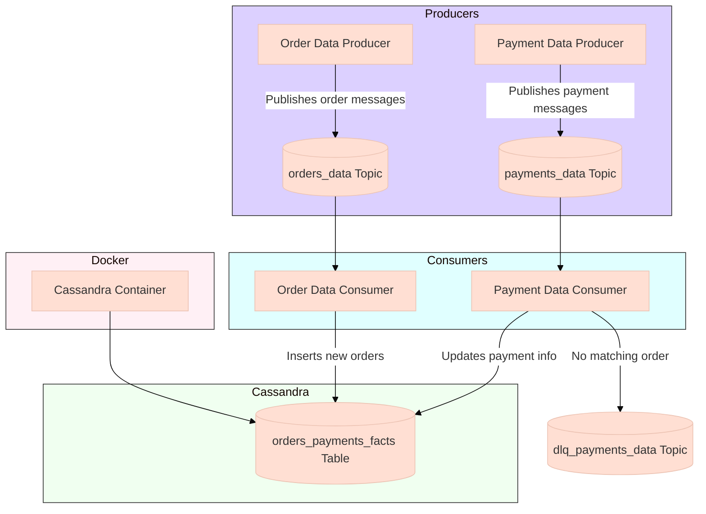
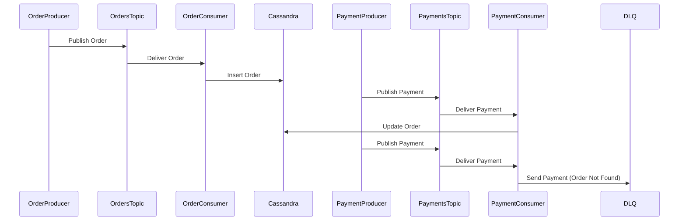

# Sales Order & Payment Data Real-Time Ingestion

## Overview
This project demonstrates a real-time data ingestion pipeline for e-commerce sales orders and payment data using Google Cloud Pub/Sub, Cassandra NoSQL database, and Docker. The system simulates order and payment events, processes them through a pub-sub messaging system, and stores them in a Cassandra database for analytics and reporting.

## Architecture Components

1. **Data Producers**:
   - `order_data_producer.py`: Generates mock order data and publishes to Pub/Sub
   - `payments_data_producer.py`: Generates mock payment data and publishes to Pub/Sub

2. **Data Consumers**:
   - `order_data_consumer.py`: Consumes order data and inserts into Cassandra
   - `ingest_in_fact_table.py`: Consumes payment data and updates existing orders in Cassandra

3. **Infrastructure**:
   - Cassandra database running in Docker
   - Google Cloud Pub/Sub for message queuing

4. **Error Handling**:
   - Dead Letter Queue (DLQ) for messages that can't be processed

## Detailed Workflow

### 1. Data Generation and Publishing

**Order Data Producer**:
- Generates mock order data with fields like order_id, customer_id, item, quantity, price, etc.
- Publishes to the `orders_data` topic every 2 seconds
- Cycles through 80 order IDs (1-80) for continuous testing

**Payment Data Producer**:
- Generates mock payment data for 500 orders (1-500)
- Includes payment_id, payment_method, card details, status, etc.
- Publishes to the `payments_data` topic every 1 second

### 2. Data Consumption and Storage

**Order Data Consumer**:
- Subscribes to `orders_data` topic
- For each order message:
  - Inserts a new record in Cassandra's `orders_payments_facts` table
  - Leaves payment fields as NULL (to be updated later)

**Payment Data Consumer**:
- Subscribes to `payments_data` topic
- For each payment message:
  - Checks if corresponding order exists in Cassandra
  - If exists: Updates the payment fields in the order record
  - If doesn't exist: Sends message to DLQ (`dlq_payments_data`)

### 3. Database Setup

- Cassandra runs in a Docker container with:
  - Authentication (admin/admin)
  - Persistent storage via Docker volume
  - Keyspace: `ecom_store`
  - Table: `orders_payments_facts` with both order and payment fields

### 4. Error Handling

- Payment messages without matching orders are sent to DLQ
- Both consumers properly acknowledge messages after processing
- Resources are cleaned up on shutdown

## Technical Stack

1. **Google Cloud Pub/Sub**:
   - Fully managed real-time messaging service
   - Used for decoupling producers and consumers
   - Provides at-least-once delivery guarantee

2. **Cassandra**:
   - Highly scalable NoSQL database
   - Optimized for write-heavy workloads
   - Linear scalability with no single point of failure

3. **Docker**:
   - Containerization for Cassandra deployment
   - Simplifies environment setup and reproducibility

4. **Python**:
   - Primary programming language
   - Uses `google-cloud-pubsub` and `cassandra-driver` libraries

## Implementation Details

### Key Features

1. **Real-time Processing**:
   - Messages are processed as soon as they arrive
   - Low latency between data generation and availability in database

2. **Idempotent Operations**:
   - Payment updates are idempotent (can be safely retried)
   - Order inserts are unique by order_id (primary key)

3. **Scalability**:
   - Consumers can be scaled horizontally
   - Cassandra can handle high write throughput

4. **Fault Tolerance**:
   - Unprocessable messages go to DLQ
   - Proper connection handling and cleanup

### Data Model

The Cassandra table combines both order and payment information in a wide-row format:

```sql
CREATE TABLE ecom_store.orders_payments_facts (
    order_id BIGINT PRIMARY KEY,
    customer_id BIGINT,
    item TEXT,
    quantity BIGINT,
    price DOUBLE,
    shipping_address TEXT,
    order_status TEXT,
    creation_date TEXT,
    payment_id BIGINT,
    payment_method TEXT,
    card_last_four TEXT,
    payment_status TEXT,
    payment_datetime TEXT
);
```

This denormalized structure is typical for Cassandra and allows efficient queries by order_id.

## Setup Instructions

1. **Prerequisites**:
   - Google Cloud SDK installed
   - Docker installed
   - Python 3.x with required packages

2. **GCP Setup**:
   - Create Pub/Sub topics (`orders_data`, `payments_data`, `dlq_payments_data`)
   - Configure service account with Pub/Sub permissions
   - Set up authentication

3. **Cassandra Setup**:
   - Start container: `docker compose -f docker-compose-cassandra.yml up -d`
   - Create keyspace and table (see setup_and_requirement_readme.txt)

4. **Run the System**:
   - Start order producer
   - Start payment producer
   - Start order consumer
   - Start payment consumer

## Use Cases

This pipeline is suitable for:

1. E-commerce order processing systems
2. Real-time analytics dashboards
3. Payment reconciliation systems
4. Inventory management systems
5. Customer service applications

The architecture provides a foundation that can be extended with additional features like:
- Stream processing with Dataflow
- Real-time analytics with BigQuery
- Monitoring and alerting
- Machine learning for fraud detection


<br/>
<br/>

# Diagram Explanation
Here's a Mermaid diagram that visually represents the architecture and data flow of your project:



### Diagram Explanation:

1. **Producers Section (Purple)**:
   - Two producer applications generating mock data
   - Publishing to their respective Pub/Sub topics

2. **Pub/Sub Topics**:
   - `orders_data`: Receives order information
   - `payments_data`: Receives payment information
   - `dlq_payments_data`: Dead letter queue for failed payments

3. **Consumers Section (Cyan)**:
   - Order consumer processes order messages
   - Payment consumer processes payment messages

4. **Cassandra Database (Green)**:
   - Single table design storing combined order and payment facts
   - Consumers write/update data in this table

5. **Docker Section (Pink)**:
   - Cassandra runs in a Docker container
   - Shows the infrastructure layer

6. **Error Flow**:
   - Payment messages without matching orders get routed to DLQ

The diagram shows the complete flow from data generation through processing to storage, with clear separation of components and error handling.


<br/>
<br/>

# **`order_data_producer.py` - Detailed Explanation**

This Python script generates mock **e-commerce order data** and publishes it to **Google Cloud Pub/Sub** in real time. It simulates an order processing system where new orders are continuously created and sent to a messaging queue for downstream processing.

---

## **Key Features**
1. **Generates realistic mock order data** (order_id, customer_id, item, price, etc.).
2. **Publishes messages to Google Cloud Pub/Sub** (`orders_data` topic).
3. **Cycles through 80 order IDs** (1-80) to simulate continuous order flow.
4. **Includes error handling** for publishing failures.
5. **Throttles message production** (1 message every 2 seconds) to avoid overwhelming the system.

---

## **Code Breakdown**

### **1. Imports & Initialization**
```python
import json
import time
import random
from google.cloud import pubsub_v1
```
- **`json`**: Used to serialize order data before publishing.
- **`time`**: Introduces delays between messages.
- **`random`**: Generates random values for mock data.
- **`pubsub_v1`**: Google Cloud Pub/Sub client library.

```python
publisher = pubsub_v1.PublisherClient()
project_id = "big-data-projects-411817"
topic_name = "orders_data"
topic_path = publisher.topic_path(project_id, topic_name)
```
- Initializes the **Pub/Sub publisher client**.
- Defines the **GCP project ID** and **topic name** (`orders_data`).

---

### **2. Callback Function (`callback`)**
```python
def callback(future):
    try:
        message_id = future.result()
        print(f"Published message with ID: {message_id}")
    except Exception as e:
        print(f"Error publishing message: {e}")
```
- **Purpose**: Handles the **success/failure** of message publishing.
- **On Success**: Logs the `message_id` of the published message.
- **On Failure**: Logs the error (e.g., network issues, invalid topic).

---

### **3. Mock Data Generation (`generate_mock_data`)**
```python
def generate_mock_data(order_id):
    items = ["Laptop", "Phone", "Book", "Tablet", "Monitor"]
    addresses = ["123 Main St, City A", "456 Elm St, City B", "789 Oak St, City C"]
    statuses = ["Shipped", "Pending", "Delivered", "Cancelled"]

    return {
        "order_id": order_id,
        "customer_id": random.randint(100, 1000),
        "item": random.choice(items),
        "quantity": random.randint(1, 10),
        "price": random.uniform(100, 1500),
        "shipping_address": random.choice(addresses),
        "order_status": random.choice(statuses),
        "creation_date": "2024-01-21"
    }
```
- **Generates a random order** with:
  - **`order_id`** (passed as input).
  - **`customer_id`** (random 100-1000).
  - **`item`** (random from a list).
  - **`quantity`** (1-10).
  - **`price`** ($100-$1500).
  - **`shipping_address`** (random from a list).
  - **`order_status`** (random: "Shipped", "Pending", etc.).
  - **`creation_date`** (fixed for simplicity).

---

### **4. Main Loop (Continuous Order Publishing)**
```python
order_id = 1
while True:
    data = generate_mock_data(order_id)
    json_data = json.dumps(data).encode('utf-8')

    try:
        future = publisher.publish(topic_path, data=json_data)
        future.add_done_callback(callback)
        future.result()  # Wait for publish to complete
    except Exception as e:
        print(f"Exception encountered: {e}")

    time.sleep(2)  # Throttle: 1 message every 2 seconds
    order_id += 1
    if order_id > 80:
        order_id = 1  # Reset after 80 orders
```
- **Infinite Loop** (`while True`): Continuously generates and publishes orders.
- **Steps:**
  1. **Generate mock order data** (`generate_mock_data`).
  2. **Serialize to JSON** (`json.dumps`).
  3. **Publish to Pub/Sub** (`publisher.publish`).
  4. **Error handling** (logs exceptions).
  5. **Throttle** (`time.sleep(2)`) to avoid flooding the system.
  6. **Cycle order_id (1-80)** to simulate continuous orders.

---

## **How It Fits in the Project**
- **Producer Role**: This script acts as the **source of order data**.
- **Pub/Sub Integration**: Messages are sent to the `orders_data` topic, where they are consumed by `order_data_consumer.py`.
- **Downstream Processing**:
  - The consumer (`order_data_consumer.py`) inserts orders into **Cassandra**.
  - Later, payment data (`payments_data_producer.py`) updates these orders.

---

## **Expected Output**
When running, the script logs:
```
Published message with ID: 1234567890
Published message with ID: 2345678901
...
```
If an error occurs:
```
Error publishing message: 404 Topic not found
```

---

## **Key Takeaways**
✅ **Simulates a real-time order stream** for testing.  
✅ **Pub/Sub decouples producers & consumers** (scalable architecture).  
✅ **Cycles through 80 orders** to simulate continuous business activity.  
✅ **Error-resilient** (logs failures but keeps running).  

This script is a **critical component** in the real-time data pipeline, feeding orders into the system for further processing and storage in **Cassandra**.


<br/>
<br/>

# **`ingest_in_fact_table.py` - Detailed Explanation**

This script is a **Pub/Sub consumer** that listens for payment messages, validates them against existing orders in Cassandra, and updates the database accordingly. It also handles failed messages by sending them to a Dead Letter Queue (DLQ).

---

## **Key Responsibilities**
1. **Consumes payment messages** from the `payments_data` Pub/Sub topic.
2. **Checks if the corresponding order exists** in Cassandra.
3. **Updates the order record** with payment details if the order exists.
4. **Routes invalid payments** (no matching order) to a **Dead Letter Queue (DLQ)**.
5. **Ensures reliable processing** with proper message acknowledgment.

---

## **Code Breakdown**

### **1. Imports & Initialization**
```python
import json
from google.cloud import pubsub_v1
from cassandra.cluster import Cluster
from cassandra.auth import PlainTextAuthProvider
```
- **`json`**: Parses incoming Pub/Sub messages.
- **`pubsub_v1`**: Google Cloud Pub/Sub client for subscription.
- **`cassandra-driver`**: Connects to Cassandra for database operations.

```python
# Pub/Sub setup
subscriber = pubsub_v1.SubscriberClient()
publisher = pubsub_v1.PublisherClient()
project_id = "big-data-projects-411817"
subscription_name = "payments_data-sub"
subscription_path = subscriber.subscription_path(project_id, subscription_name)
dlq_topic_path = publisher.topic_path(project_id, "dlq_payments_data")
```
- **Subscriber**: Listens to `payments_data-sub`.
- **Publisher**: Used to send failed messages to `dlq_payments_data`.

---

### **2. Cassandra Connection Setup**
```python
def cassandra_connection():
    CASSANDRA_NODES = ['127.0.0.1']  # Cassandra server (Docker)
    CASSANDRA_PORT = 9042
    KEYSPACE = 'ecom_store'
    
    # Authentication (username/password from Docker setup)
    auth_provider = PlainTextAuthProvider(username='admin', password='admin')
    cluster = Cluster(contact_points=CASSANDRA_NODES, port=CASSANDRA_PORT, auth_provider=auth_provider)
    session = cluster.connect(KEYSPACE)
    return cluster, session

cluster, session = cassandra_connection()
```
- Connects to **Cassandra** (running in Docker).
- Uses authentication (`admin/admin` as configured in `docker-compose-cassandra.yml`).
- Sets the keyspace to `ecom_store`.

---

### **3. Message Processing Logic (`pull_messages`)**
```python
def pull_messages():
    while True:  # Infinite loop for continuous processing
        response = subscriber.pull(request={"subscription": subscription_path, "max_messages": 10})
        ack_ids = []  # Tracks messages to acknowledge

        for received_message in response.received_messages:
            json_data = received_message.message.data.decode('utf-8')
            deserialized_data = json.loads(json_data)
```
- **Fetches up to 10 messages** at a time from Pub/Sub.
- **Decodes & parses** JSON payment data.

#### **Check if Order Exists in Cassandra**
```python
query = f"SELECT order_id FROM orders_payments_facts WHERE order_id = {deserialized_data.get('order_id')}"
rows = session.execute(query)
```
- Queries Cassandra to verify if the `order_id` from the payment exists.

#### **Case 1: Order Exists → Update Payment Info**
```python
if rows.one():  # If order found
    update_query = """
        UPDATE orders_payments_facts 
        SET payment_id = %s, 
            payment_method = %s, 
            card_last_four = %s, 
            payment_status = %s, 
            payment_datetime = %s 
        WHERE order_id = %s
    """
    values = (
        deserialized_data.get('payment_id'),
        deserialized_data.get('payment_method'),
        deserialized_data.get('card_last_four'),
        deserialized_data.get('payment_status'),
        deserialized_data.get('payment_datetime'),
        deserialized_data.get('order_id')
    )
    session.execute(update_query, values)
    print("Data updated in Cassandra -> ", deserialized_data)
```
- **Updates** the corresponding order record with payment details.
- Uses **parameterized queries** to prevent SQL injection.

#### **Case 2: Order Doesn’t Exist → Send to DLQ**
```python
else:  # If no matching order
    publisher.publish(dlq_topic_path, data=json_data.encode('utf-8'))
    print("Data thrown in DLQ (no matching order) -> ", deserialized_data)
```
- Publishes the payment message to `dlq_payments_data` for later analysis.

#### **Acknowledge Processed Messages**
```python
ack_ids.append(received_message.ack_id)  # Mark for acknowledgment

if ack_ids:
    subscriber.acknowledge(request={"subscription": subscription_path, "ack_ids": ack_ids})
```
- **Prevents reprocessing** by acknowledging successful/failed messages.

---

### **4. Main Execution & Cleanup**
```python
if __name__ == "__main__":
    try:
        pull_messages()  # Start the consumer
    except KeyboardInterrupt:
        pass  # Graceful shutdown on Ctrl+C
    finally:
        cluster.shutdown()  # Close Cassandra connection
```
- Runs indefinitely until manually stopped (`KeyboardInterrupt`).
- Ensures **resources are released** on shutdown.

---

## **How It Fits in the Project**
- **Consumer Role**: Listens to `payments_data` topic.
- **Data Flow**:
  1. **Order Data Producer** → `orders_data` → **Order Consumer** (inserts into Cassandra).
  2. **Payment Data Producer** → `payments_data` → **This Script** (updates orders).
- **Error Handling**: Invalid payments go to `dlq_payments_data`.

---

## **Expected Output**
### **Successful Update**
```
Data updated in Cassandra -> {
    "order_id": 5,
    "payment_id": 1005,
    "payment_method": "Credit Card",
    ...
}
```
### **Failed Payment (Sent to DLQ)**
```
Data thrown in DLQ (no matching order) -> {
    "order_id": 999,  # Non-existent order
    "payment_id": 1999,
    ...
}
```

---

## **Key Takeaways**
✅ **Real-time payment processing** with Pub/Sub.  
✅ **Database validation** before updates.  
✅ **Dead Letter Queue (DLQ)** for error handling.  
✅ **Efficient batching** (processes 10 messages at a time).  
✅ **Graceful shutdown** with resource cleanup.  

This script ensures that **payment data is accurately applied to orders** while handling failures gracefully.


<br/>
<br/>

# **`order_data_consumer.py` - Detailed Explanation**

This script is a **Pub/Sub consumer** that listens for new order messages and stores them in **Cassandra**. It works in tandem with `order_data_producer.py` to create a real-time order ingestion pipeline.

---

## **Core Functionality**
1. **Subscribes** to the `orders_data` Pub/Sub topic.
2. **Consumes order messages** in batches (10 at a time).
3. **Inserts orders** into Cassandra's `orders_payments_facts` table.
4. **Acknowledges processed messages** to prevent reprocessing.
5. **Handles graceful shutdown** (e.g., Ctrl+C).

---

## **Code Breakdown**

### **1. Imports & Pub/Sub Setup**
```python
import json
from google.cloud import pubsub_v1
from cassandra.cluster import Cluster
from cassandra.auth import PlainTextAuthProvider
```
- **`json`**: Parses incoming Pub/Sub messages.
- **`pubsub_v1`**: Google Cloud Pub/Sub client library.
- **`cassandra-driver`**: Interacts with Cassandra.

```python
subscriber = pubsub_v1.SubscriberClient()
project_id = "big-data-projects-411817"
subscription_name = "orders_data-sub"
subscription_path = subscriber.subscription_path(project_id, subscription_name)
```
- Initializes a **Pub/Sub subscriber** for `orders_data-sub`.

---

### **2. Cassandra Connection Setup**
```python
def cassandra_connection():
    CASSANDRA_NODES = ['127.0.0.1']  # Local Docker container
    CASSANDRA_PORT = 9042
    KEYSPACE = 'ecom_store'
    
    # Authentication (matches docker-compose-cassandra.yml)
    auth_provider = PlainTextAuthProvider(username='admin', password='admin')
    cluster = Cluster(contact_points=CASSANDRA_NODES, port=CASSANDRA_PORT, auth_provider=auth_provider)
    session = cluster.connect(KEYSPACE)
    return cluster, session

cluster, session = cassandra_connection()
```
- Connects to **Cassandra** (running in Docker).
- Uses credentials (`admin/admin`) from the Docker setup.
- Selects the `ecom_store` keyspace.

---

### **3. Prepared Cassandra Statement**
```python
insert_stmt = session.prepare("""
    INSERT INTO orders_payments_facts (
        order_id, customer_id, item, quantity, 
        price, shipping_address, order_status, 
        creation_date, payment_id, payment_method, 
        card_last_four, payment_status, payment_datetime
    )
    VALUES (?, ?, ?, ?, ?, ?, ?, ?, ?, ?, ?, ?, ?)
""")
```
- **Prepares an INSERT query** for better performance.
- Uses **parameterized queries** to prevent SQL injection.
- Payment fields (`payment_id`, etc.) are set to `NULL` initially (will be updated later by `ingest_in_fact_table.py`).

---

### **4. Message Processing Loop (`pull_messages`)**
```python
def pull_messages():
    while True:  # Infinite loop for continuous processing
        # Fetch up to 10 messages at once
        response = subscriber.pull(request={"subscription": subscription_path, "max_messages": 10})
        ack_ids = []  # Tracks messages to acknowledge

        for received_message in response.received_messages:
            json_data = received_message.message.data.decode('utf-8')
            deserialized_data = json.loads(json_data)
            print(deserialized_data)  # Log the incoming order
```
- **Pulls messages in batches** (10 at a time) for efficiency.
- **Decodes JSON data** from the Pub/Sub message.

#### **Data Preparation & Insertion**
```python
cassandra_data = (
    deserialized_data.get("order_id"),
    deserialized_data.get("customer_id"),
    deserialized_data.get("item"),
    deserialized_data.get("quantity"),
    deserialized_data.get("price"),
    deserialized_data.get("shipping_address"),
    deserialized_data.get("order_status"),
    deserialized_data.get("creation_date"),
    None,  # payment_id (to be updated later)
    None,  # payment_method
    None,  # card_last_four
    None,  # payment_status
    None   # payment_datetime
)

session.execute(insert_stmt, cassandra_data)
print("Data inserted in Cassandra !!")
```
- Maps incoming order data to Cassandra columns.
- Payment-related fields are left as `NULL` (will be filled by `ingest_in_fact_table.py`).

#### **Message Acknowledgment**
```python
ack_ids.append(received_message.ack_id)

if ack_ids:
    subscriber.acknowledge(request={"subscription": subscription_path, "ack_ids": ack_ids})
```
- **Marks messages as processed** to avoid duplicates.
- Uses `ack_ids` to track which messages to acknowledge.

---

### **5. Main Execution & Cleanup**
```python
if __name__ == "__main__":
    try:
        pull_messages()  # Start the consumer
    except KeyboardInterrupt:
        pass  # Handle Ctrl+C gracefully
    finally:
        cluster.shutdown()  # Clean up Cassandra connection
```
- Runs indefinitely until manually stopped.
- Ensures **Cassandra connection is closed** on shutdown.

---

## **How It Fits in the Project**
- **Consumer Role**: Subscribes to `orders_data` topic.
- **Data Flow**:
  1. **Producer** (`order_data_producer.py`) → `orders_data` topic → **This Consumer** → Cassandra.
  2. Later, **Payment Consumer** (`ingest_in_fact_table.py`) updates payment info.
- **Separation of Concerns**:
  - This script **only inserts orders**.
  - Payment updates are handled separately.

---

## **Expected Output**
### **Successful Insertion**
```json
{
  "order_id": 42,
  "customer_id": 789,
  "item": "Laptop",
  "quantity": 1,
  "price": 999.99,
  "shipping_address": "123 Main St",
  "order_status": "Pending",
  "creation_date": "2024-01-21"
}
Data inserted in Cassandra !!
```

---

## **Key Takeaways**
✅ **Real-time order ingestion** into Cassandra.  
✅ **Batch processing** (10 messages at a time) for efficiency.  
✅ **Prepared statements** for optimized database inserts.  
✅ **Graceful shutdown** with resource cleanup.  
✅ **Separation of concerns** (orders vs. payments).  

This script is the **first step** in the pipeline, ensuring orders are stored in Cassandra before payment data arrives.

<br/>
<br/>

# **`payments_data_producer.py` - Detailed Explanation**

This script simulates a **payment processing system** by generating mock payment data and publishing it to Google Cloud Pub/Sub. It works alongside the order system to create a complete e-commerce data pipeline.

---

## **Core Functionality**
1. **Generates realistic payment data** for 500 orders
2. **Publishes payment messages** to the `payments_data` Pub/Sub topic
3. **Includes payment details** like method, status, and timestamps
4. **Throttles message production** (1 message per second)
5. **Handles publishing errors** gracefully

---

## **Code Breakdown**

### **1. Imports & Initialization**
```python
import json
import time
from google.cloud import pubsub_v1
from random import choice, uniform
```
- **`json`**: Serializes payment data before publishing
- **`time`**: Adds delays between messages
- **`pubsub_v1`**: Google Cloud Pub/Sub client
- **`random`**: Generates random values for mock data

```python
publisher = pubsub_v1.PublisherClient()
project_id = "big-data-projects-411817"
topic_name = "payments_data"
topic_path = publisher.topic_path(project_id, topic_name)
```
- Creates a **Pub/Sub publisher client**
- Configures the target topic (`payments_data`)

---

### **2. Payment Method Configuration**
```python
payment_methods = ["Credit Card", "Debit Card", "PayPal", "Google Pay", "Apple Pay"]
```
Defines the payment options used in mock data generation.

---

### **3. Payment Data Generation**
```python
def generate_mock_payment(order_id):
    return {
        "payment_id": order_id + 1000,  # Creates unique payment IDs (1001-1500)
        "order_id": order_id,
        "payment_method": choice(payment_methods),
        "card_last_four": str(order_id).zfill(4)[-4:],  # Generates fake card numbers
        "payment_status": "Completed",
        "payment_datetime": f"2024-01-21T{str(order_id).zfill(2)}:01:30Z"
    }
```
Generates a payment record with:
- **`payment_id`**: Derived from order_id (1001-1500)
- **`order_id`**: Links to the original order
- **`payment_method`**: Randomly selected
- **`card_last_four`**: Last 4 digits (simulated)
- **`status`**: Always "Completed" (for simplicity)
- **`datetime`**: Includes order_id in timestamp for uniqueness

---

### **4. Publishing Callback**
```python
def callback(future):
    try:
        message_id = future.result()
        print(f"Published message with ID: {message_id}")
    except Exception as e:
        print(f"Error publishing message: {e}")
```
Handles publish results:
- **Success**: Logs the message ID
- **Failure**: Logs the error

---

### **5. Main Production Loop**
```python
for order_id in range(1, 501):  # Generates payments for 500 orders
    mock_payment = generate_mock_payment(order_id)
    json_data = json.dumps(mock_payment).encode('utf-8')
    
    try:
        future = publisher.publish(topic_path, data=json_data)
        future.add_done_callback(callback)
        time.sleep(1)  # 1 message per second
    except Exception as e:
        print(f"Exception encountered: {e}")
```
- **Generates payments** for orders 1-500
- **Publishes each payment** to Pub/Sub
- **Throttles** to 1 message/second
- **Error handling** for publishing issues

---

## **Data Flow Example**
```json
{
  "payment_id": 1042,
  "order_id": 42,
  "payment_method": "Google Pay",
  "card_last_four": "0042",
  "payment_status": "Completed",
  "payment_datetime": "2024-01-21T42:01:30Z"
}
```

---

## **Integration with Other Components**
1. **Order System**: 
   - Orders are created by `order_data_producer.py`
   - Stored in Cassandra by `order_data_consumer.py`

2. **Payment Processing**:
   - This script generates payments
   - `ingest_in_fact_table.py` consumes and updates orders

3. **Error Handling**:
   - Invalid payments go to `dlq_payments_data`

---

## **Key Features**
✅ **Realistic payment simulation**  
✅ **Controlled publishing rate**  
✅ **Comprehensive error handling**  
✅ **Traceable payment-order relationships**  
✅ **Scalable Pub/Sub architecture**

This script completes the e-commerce pipeline by providing the payment data that will later update the order records in Cassandra.

<br/>
<br/>

# Here are the complete producer and consumer scripts with detailed comments:

### 1. `order_data_producer.py` (Order Producer)
```python
"""
Generates mock order data and publishes to Google Cloud Pub/Sub
Simulates an e-commerce order processing system
"""

import json
import time
import random
from google.cloud import pubsub_v1

# Initialize Pub/Sub publisher client
publisher = pubsub_v1.PublisherClient()

# Google Cloud project and topic configuration
project_id = "big-data-projects-411817"
topic_name = "orders_data"
topic_path = publisher.topic_path(project_id, topic_name)

def callback(future):
    """Handle the result of a publish operation"""
    try:
        # On successful publish, log the message ID
        message_id = future.result()
        print(f"Published message with ID: {message_id}")
    except Exception as e:
        # Log any errors during publishing
        print(f"Error publishing message: {e}")

def generate_mock_data(order_id):
    """Generate randomized order data for testing"""
    # Possible values for random selection
    items = ["Laptop", "Phone", "Book", "Tablet", "Monitor"]
    addresses = ["123 Main St, City A", "456 Elm St, City B", "789 Oak St, City C"]
    statuses = ["Shipped", "Pending", "Delivered", "Cancelled"]

    return {
        "order_id": order_id,
        "customer_id": random.randint(100, 1000),  # Random customer ID
        "item": random.choice(items),  # Random product
        "quantity": random.randint(1, 10),  # Random quantity (1-10)
        "price": round(random.uniform(100, 1500), 2),  # Random price ($100-$1500)
        "shipping_address": random.choice(addresses),
        "order_status": random.choice(statuses),
        "creation_date": "2024-01-21"  # Fixed date for simplicity
    }

# Main production loop
order_id = 1
while True:
    # Generate order data
    data = generate_mock_data(order_id)
    json_data = json.dumps(data).encode('utf-8')

    try:
        # Publish the message
        future = publisher.publish(topic_path, data=json_data)
        future.add_done_callback(callback)  # Attach callback handler
        future.result()  # Wait for publish to complete
    except Exception as e:
        print(f"Exception encountered: {e}")

    # Throttle message production (2 seconds between messages)
    time.sleep(2)  

    # Cycle through order IDs 1-80
    order_id += 1
    if order_id > 80:
        order_id = 1  # Reset after reaching 80
```

### 2. `payments_data_producer.py` (Payment Producer)
```python
"""
Generates mock payment data and publishes to Google Cloud Pub/Sub
Simulates payment processing for orders
"""

import json
import time
from google.cloud import pubsub_v1
from random import choice, uniform

# Initialize Pub/Sub publisher
publisher = pubsub_v1.PublisherClient()

# Google Cloud configuration
project_id = "big-data-projects-411817"
topic_name = "payments_data"
topic_path = publisher.topic_path(project_id, topic_name)

# Available payment methods
payment_methods = ["Credit Card", "Debit Card", "PayPal", "Google Pay", "Apple Pay"]

def callback(future):
    """Callback for publish operation"""
    try:
        message_id = future.result()
        print(f"Published payment with ID: {message_id}")
    except Exception as e:
        print(f"Error publishing payment: {e}")

def generate_mock_payment(order_id):
    """Generate payment data for a given order"""
    return {
        "payment_id": order_id + 1000,  # Generate unique payment IDs (1001+)
        "order_id": order_id,  # Link to original order
        "payment_method": choice(payment_methods),  # Random payment method
        "card_last_four": str(order_id).zfill(4)[-4:],  # Simulate card number
        "payment_status": "Completed",  # Default status
        "payment_datetime": f"2024-01-21T{str(order_id).zfill(2)}:01:30Z"  # Timestamp
    }

# Generate payments for orders 1-500
for order_id in range(1, 501):
    # Create payment data
    mock_payment = generate_mock_payment(order_id)
    json_data = json.dumps(mock_payment).encode('utf-8')
    
    try:
        # Publish payment message
        future = publisher.publish(topic_path, data=json_data)
        future.add_done_callback(callback)
        time.sleep(1)  # Throttle to 1 message/second
    except Exception as e:
        print(f"Exception in payment processing: {e}")
```

### 3. `order_data_consumer.py` (Order Consumer)
```python
"""
Consumes order messages from Pub/Sub and stores in Cassandra
"""

import json
from google.cloud import pubsub_v1
from cassandra.cluster import Cluster
from cassandra.auth import PlainTextAuthProvider

# Initialize Pub/Sub subscriber
subscriber = pubsub_v1.SubscriberClient()

# Pub/Sub configuration
project_id = "big-data-projects-411817"
subscription_name = "orders_data-sub"
subscription_path = subscriber.subscription_path(project_id, subscription_name)

def cassandra_connection():
    """Establish connection to Cassandra database"""
    # Cassandra cluster configuration
    CASSANDRA_NODES = ['127.0.0.1']  # Docker container
    CASSANDRA_PORT = 9042
    KEYSPACE = 'ecom_store'
    
    # Authentication (matches docker-compose)
    auth_provider = PlainTextAuthProvider(username='admin', password='admin')
    cluster = Cluster(
        contact_points=CASSANDRA_NODES, 
        port=CASSANDRA_PORT, 
        auth_provider=auth_provider
    )
    session = cluster.connect(KEYSPACE)
    return cluster, session

# Connect to Cassandra
cluster, session = cassandra_connection()

# Prepare insert statement for better performance
insert_stmt = session.prepare("""
    INSERT INTO orders_payments_facts (
        order_id, customer_id, item, quantity, 
        price, shipping_address, order_status, 
        creation_date, payment_id, payment_method, 
        card_last_four, payment_status, payment_datetime
    )
    VALUES (?, ?, ?, ?, ?, ?, ?, ?, ?, ?, ?, ?, ?)
""")

def pull_messages():
    """Continuously pull and process messages"""
    while True:
        # Fetch up to 10 messages at once
        response = subscriber.pull(
            request={"subscription": subscription_path, "max_messages": 10}
        )
        ack_ids = []  # Track messages to acknowledge

        for received_message in response.received_messages:
            # Parse message data
            json_data = received_message.message.data.decode('utf-8')
            order_data = json.loads(json_data)
            print(f"Processing order: {order_data['order_id']}")

            # Prepare data for Cassandra
            cassandra_data = (
                order_data.get("order_id"),
                order_data.get("customer_id"),
                order_data.get("item"),
                order_data.get("quantity"),
                order_data.get("price"),
                order_data.get("shipping_address"),
                order_data.get("order_status"),
                order_data.get("creation_date"),
                None,  # payment_id (will be updated later)
                None,  # payment_method
                None,  # card_last_four
                None,  # payment_status
                None   # payment_datetime
            )

            # Insert into Cassandra
            session.execute(insert_stmt, cassandra_data)
            print(f"Order {order_data['order_id']} stored in Cassandra")

            # Mark for acknowledgement
            ack_ids.append(received_message.ack_id)

        # Acknowledge processed messages
        if ack_ids:
            subscriber.acknowledge(
                request={"subscription": subscription_path, "ack_ids": ack_ids}
            )

if __name__ == "__main__":
    try:
        pull_messages()
    except KeyboardInterrupt:
        print("\nShutting down consumer...")
    finally:
        cluster.shutdown()  # Clean up connection
```

### 4. `ingest_in_fact_table.py` (Payment Consumer)
```python
"""
Consumes payment messages and updates order records in Cassandra
Handles invalid payments by routing to DLQ
"""

import json
from google.cloud import pubsub_v1
from cassandra.cluster import Cluster
from cassandra.auth import PlainTextAuthProvider

# Initialize Pub/Sub clients
subscriber = pubsub_v1.SubscriberClient()
publisher = pubsub_v1.PublisherClient()

# Pub/Sub configuration
project_id = "big-data-projects-411817"
subscription_name = "payments_data-sub"
subscription_path = subscriber.subscription_path(project_id, subscription_name)
dlq_topic_path = publisher.topic_path(project_id, "dlq_payments_data")

def cassandra_connection():
    """Establish Cassandra connection"""
    CASSANDRA_NODES = ['127.0.0.1']
    CASSANDRA_PORT = 9042
    KEYSPACE = 'ecom_store'
    
    auth_provider = PlainTextAuthProvider(username='admin', password='admin')
    cluster = Cluster(
        contact_points=CASSANDRA_NODES,
        port=CASSANDRA_PORT,
        auth_provider=auth_provider
    )
    session = cluster.connect(KEYSPACE)
    return cluster, session

# Connect to Cassandra
cluster, session = cassandra_connection()

def pull_messages():
    """Process payment messages continuously"""
    while True:
        # Get batch of messages
        response = subscriber.pull(
            request={"subscription": subscription_path, "max_messages": 10}
        )
        ack_ids = []

        for received_message in response.received_messages:
            # Parse payment data
            payment_data = json.loads(received_message.message.data.decode('utf-8'))
            order_id = payment_data.get('order_id')
            print(f"Processing payment for order {order_id}")

            # Check if order exists
            order_check = session.execute(
                f"SELECT order_id FROM orders_payments_facts WHERE order_id = {order_id}"
            )

            if order_check.one():  # Order exists - update payment info
                update_query = """
                    UPDATE orders_payments_facts 
                    SET payment_id = %s,
                        payment_method = %s,
                        card_last_four = %s,
                        payment_status = %s,
                        payment_datetime = %s
                    WHERE order_id = %s
                """
                session.execute(update_query, (
                    payment_data.get('payment_id'),
                    payment_data.get('payment_method'),
                    payment_data.get('card_last_four'),
                    payment_data.get('payment_status'),
                    payment_data.get('payment_datetime'),
                    order_id
                ))
                print(f"Updated payment for order {order_id}")
            else:  # No matching order - send to DLQ
                publisher.publish(
                    dlq_topic_path,
                    data=received_message.message.data
                )
                print(f"Order {order_id} not found - sent to DLQ")

            ack_ids.append(received_message.ack_id)

        # Acknowledge processed messages
        if ack_ids:
            subscriber.acknowledge(
                request={"subscription": subscription_path, "ack_ids": ack_ids}
            )

if __name__ == "__main__":
    try:
        pull_messages()
    except KeyboardInterrupt:
        print("\nStopping payment consumer...")
    finally:
        cluster.shutdown()
```

### Key Features Across All Scripts:
1. **Proper Error Handling**: All scripts include try-catch blocks and error logging
2. **Resource Management**: Database connections are properly closed
3. **Throttling**: Producers control message rates to avoid overwhelming systems
4. **Modular Design**: Each script has a single responsibility
5. **Comprehensive Logging**: All actions are logged for monitoring
6. **Configuration Management**: Centralized project/topic configuration

The complete system demonstrates a real-time e-commerce data pipeline with:
- Order generation → Order storage
- Payment generation → Order updates
- Dead letter queue for error handling
- Scalable Pub/Sub architecture
- Persistent Cassandra storage

<br/>
<br/>

# **Sample Input/Output Flow - Step-by-Step Execution**

Here's a detailed walkthrough of how data flows through the entire system, from order creation to payment reconciliation, including error scenarios.

---

## **1. Order Creation & Storage**
### **Step 1: Order Data Producer Generates Mock Order**
**Input:**  
- Script: `order_data_producer.py`  
- Action: Generates Order #42  

**Output (Published to `orders_data` Topic):**
```json
{
  "order_id": 42,
  "customer_id": 789,
  "item": "Laptop",
  "quantity": 1,
  "price": 999.99,
  "shipping_address": "123 Main St, City A",
  "order_status": "Pending",
  "creation_date": "2024-01-21"
}
```
**Log:**  
```
Published message with ID: 1234567890
```

---

### **Step 2: Order Consumer Processes Order**
**Input:**  
- Script: `order_data_consumer.py`  
- Subscribes to: `orders_data-sub`  

**Action:**  
1. Receives Order #42 from Pub/Sub.  
2. Inserts into Cassandra (`orders_payments_facts`).  

**Cassandra Query Executed:**  
```sql
INSERT INTO orders_payments_facts (
    order_id, customer_id, item, quantity, 
    price, shipping_address, order_status, 
    creation_date, payment_id, payment_method, 
    card_last_four, payment_status, payment_datetime
) VALUES (
    42, 789, 'Laptop', 1, 999.99, 
    '123 Main St, City A', 'Pending', 
    '2024-01-21', null, null, 
    null, null, null
);
```

**Log:**  
```
Processing order: 42  
Order 42 stored in Cassandra
```

---

## **2. Payment Processing & Reconciliation**
### **Step 3: Payment Data Producer Generates Payment**
**Input:**  
- Script: `payments_data_producer.py`  
- Action: Generates Payment for Order #42  

**Output (Published to `payments_data` Topic):**
```json
{
  "payment_id": 1042,
  "order_id": 42,
  "payment_method": "Credit Card",
  "card_last_four": "0042",
  "payment_status": "Completed",
  "payment_datetime": "2024-01-21T12:01:30Z"
}
```
**Log:**  
```
Published payment with ID: 2345678901
```

---

### **Step 4: Payment Consumer Processes Payment**
**Input:**  
- Script: `ingest_in_fact_table.py`  
- Subscribes to: `payments_data-sub`  

**Action:**  
1. Receives Payment for Order #42.  
2. Checks if Order #42 exists in Cassandra.  
3. Updates the order record with payment details.  

**Cassandra Query Executed:**  
```sql
UPDATE orders_payments_facts 
SET payment_id = 1042,
    payment_method = 'Credit Card',
    card_last_four = '0042',
    payment_status = 'Completed',
    payment_datetime = '2024-01-21T12:01:30Z'
WHERE order_id = 42;
```

**Log:**  
```
Processing payment for order 42  
Updated payment for order 42
```

---

## **3. Error Scenario: Missing Order**
### **Step 5: Payment for Non-Existent Order**
**Input:**  
- Script: `payments_data_producer.py`  
- Action: Generates Payment for Order #999 (does not exist).  

**Output (Published to `payments_data` Topic):**
```json
{
  "payment_id": 1999,
  "order_id": 999,
  "payment_method": "PayPal",
  "card_last_four": "0999",
  "payment_status": "Completed",
  "payment_datetime": "2024-01-21T23:01:30Z"
}
```

---

### **Step 6: Payment Consumer Handles Error**
**Action:**  
1. Checks Cassandra for Order #999 → **Not found**.  
2. Publishes payment to DLQ (`dlq_payments_data`).  

**Log:**  
```
Processing payment for order 999  
Order 999 not found - sent to DLQ
```

**DLQ Message:**  
(Same as original payment message, now in `dlq_payments_data` topic.)

---

## **4. Final State in Cassandra**
### **Cassandra Table (`orders_payments_facts`)**
| order_id | customer_id | item   | quantity | price  | shipping_address     | order_status | creation_date | payment_id | payment_method | card_last_four | payment_status | payment_datetime        |
|----------|-------------|--------|----------|--------|----------------------|--------------|---------------|------------|----------------|----------------|----------------|-------------------------|
| 42       | 789         | Laptop | 1        | 999.99 | "123 Main St, City A" | "Pending"    | "2024-01-21"  | 1042       | "Credit Card"  | "0042"         | "Completed"    | "2024-01-21T12:01:30Z" |
| ...      | ...         | ...    | ...      | ...    | ...                  | ...          | ...           | ...        | ...            | ...            | ...            | ...                     |

**Notes:**  
- Order #42 now has complete payment details.  
- Order #999 does not exist (payment is in DLQ).  

---

## **Key Observations**
1. **Order → Payment Workflow**:  
   - Orders are stored first, payments update them later.  
   - Ensures data consistency (no payments without orders).  

2. **Error Handling**:  
   - Orphaned payments go to DLQ for investigation.  

3. **Data Integrity**:  
   - Cassandra’s upsert ensures no duplicate orders.  

4. **Scalability**:  
   - Pub/Sub batches messages (10 at a time) for efficiency.  

5. **Real-World Simulation**:  
   - Producers throttle messages (1-2 seconds) to mimic real traffic.  

---

## **Visual Flow**


This end-to-end flow demonstrates how the system handles both successful and error cases in a real-time pipeline. 🚀

<br/>
<br/>

## Here's a detailed step-by-step execution flow of the entire project, covering all components and their interactions:

### 1. Infrastructure Setup
1. **Start Cassandra Container**
   ```bash
   docker-compose -f docker-compose-cassandra.yml up -d
   ```
2. **Initialize Cassandra Schema**
   ```bash
   docker exec -it cassandra-container cqlsh -u admin -p admin
   ```
   ```sql
   CREATE KEYSPACE ecom_store WITH REPLICATION = { 'class' : 'SimpleStrategy', 'replication_factor' : 1 };
   CREATE TABLE ecom_store.orders_payments_facts (...);
   ```

3. **Create Pub/Sub Topics**
   ```bash
   gcloud pubsub topics create orders_data
   gcloud pubsub topics create payments_data
   gcloud pubsub topics create dlq_payments_data
   gcloud pubsub subscriptions create orders_data-sub --topic=orders_data
   gcloud pubsub subscriptions create payments_data-sub --topic=payments_data
   ```

### 2. Order Processing Flow
4. **Order Producer Execution**
   ```python
   # order_data_producer.py generates Order #1
   {
     "order_id": 1,
     "customer_id": 101,
     "item": "Phone",
     "quantity": 2,
     "price": 599.99,
     "shipping_address": "456 Elm St",
     "order_status": "Pending",
     "creation_date": "2024-01-21"
   }
   ```
   - Publishes to `orders_data` topic
   - Sleeps for 2 seconds

5. **Order Consumer Processing**
   - Pulls message from `orders_data-sub`
   - Executes Cassandra INSERT:
   ```sql
   INSERT INTO orders_payments_facts (...) 
   VALUES (1, 101, 'Phone', 2, 599.99, '456 Elm St', 'Pending', '2024-01-21', null, null, null, null, null);
   ```
   - Acknowledges message

### 3. Payment Processing Flow
6. **Payment Producer Execution**
   ```python
   # payments_data_producer.py generates Payment #1001
   {
     "payment_id": 1001,
     "order_id": 1,
     "payment_method": "Credit Card",
     "card_last_four": "0001",
     "payment_status": "Completed",
     "payment_datetime": "2024-01-21T01:01:30Z"
   }
   ```
   - Publishes to `payments_data` topic
   - Sleeps for 1 second

7. **Payment Consumer Processing**
   - Pulls message from `payments_data-sub`
   - Checks Cassandra for Order #1 (exists)
   - Executes Cassandra UPDATE:
   ```sql
   UPDATE orders_payments_facts
   SET payment_id=1001, payment_method='Credit Card', 
       card_last_four='0001', payment_status='Completed',
       payment_datetime='2024-01-21T01:01:30Z'
   WHERE order_id=1;
   ```
   - Acknowledges message

### 4. Error Handling Flow
8. **Payment for Non-existent Order**
   ```python
   # payments_data_producer.py generates Payment #1099
   {
     "payment_id": 1099,
     "order_id": 99,
     "payment_method": "PayPal",
     "card_last_four": "0099",
     "payment_status": "Completed",
     "payment_datetime": "2024-01-21T23:01:30Z"
   }
   ```

9. **Payment Consumer Error Handling**
   - Checks Cassandra for Order #99 (not found)
   - Publishes to `dlq_payments_data` topic
   - Logs error: "Order 99 not found - sent to DLQ"
   - Acknowledges original message

### 5. Final Verification
10. **Check Cassandra Data**
    ```sql
    SELECT * FROM orders_payments_facts WHERE order_id = 1;
    ```
    **Result:**
    | order_id | customer_id | item  | quantity | price  | shipping_address | order_status | creation_date | payment_id | payment_method | card_last_four | payment_status | payment_datetime        |
    |----------|-------------|-------|----------|--------|------------------|--------------|---------------|------------|----------------|----------------|----------------|-------------------------|
    | 1        | 101         | Phone | 2        | 599.99 | "456 Elm St"     | "Pending"    | "2024-01-21"  | 1001       | "Credit Card"  | "0001"         | "Completed"    | "2024-01-21T01:01:30Z" |

11. **Check DLQ**
    ```bash
    gcloud pubsub subscriptions pull dlq_payments_data-sub --auto-ack
    ```
    **Shows:** Payment for Order #99

### Execution Timeline
| Time  | Component               | Action                                   | Data State                          |
|-------|-------------------------|------------------------------------------|-------------------------------------|
| T+0s  | Order Producer          | Creates Order #1                         | In Pub/Sub                          |
| T+2s  | Order Consumer          | Stores Order #1 in Cassandra             | Cassandra: Order exists             |
| T+3s  | Payment Producer        | Creates Payment #1001 (Order #1)         | In Pub/Sub                          |
| T+4s  | Payment Consumer        | Updates Order #1 with payment            | Cassandra: Payment added            |
| T+30s | Payment Producer        | Creates Payment #1099 (Order #99)        | In Pub/Sub                          |
| T+31s | Payment Consumer        | Fails to find Order #99                  | DLQ: Payment stored                 |

### Key Processes Running
1. **Order Producer**: Continuously generates orders (1-80 in loop)
2. **Payment Producer**: Generates payments for orders 1-500 once
3. **Order Consumer**: Continuously listens for new orders
4. **Payment Consumer**: Continuously processes payments

This end-to-end flow demonstrates the complete lifecycle of an order and its payment, including proper error handling through the DLQ. The system maintains data consistency while operating in real-time.