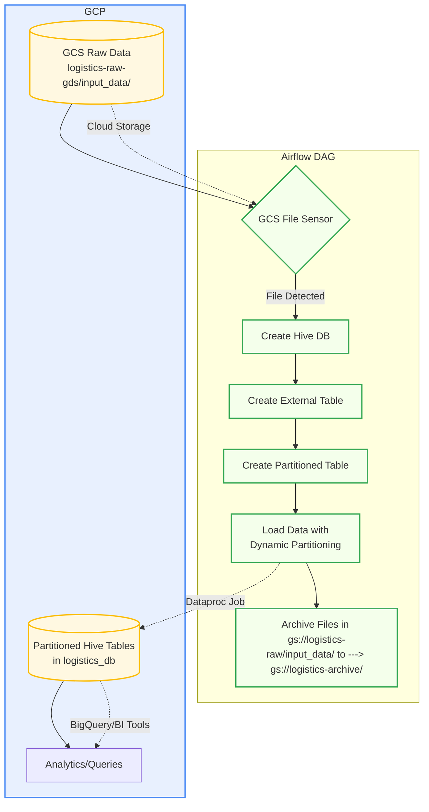

# Logistics Data Warehouse Management Project

## Overview
This project demonstrates a data warehouse solution for logistics data using Google Cloud Platform (GCP) services. The system processes daily logistics delivery data, stores it in cloud storage, and loads it into a Hive data warehouse on Dataproc for analysis.

## Key Components

### 1. Data Files
The project processes CSV files containing logistics data (e.g., `logistics_2023_09_01.csv` to `logistics_2023_09_03.csv`). Each file contains:
- Delivery ID
- Date
- Origin and destination cities
- Vehicle type (Truck, Bike, Drone)
- Delivery status (Delivered, In-Transit, Cancelled)
- Delivery time

### 2. Technical Stack
- **GCP Storage**: Stores raw and archived data files
- **Airflow (GCP Composer)**: Orchestrates the data pipeline
- **Hive Operators**: Perform database operations
- **GCP Dataproc**: Runs the Hive processing jobs
- **Hive**: Data warehouse solution for structured querying

### 3. Airflow DAG Workflow (`hive_load_airflow_dag.py`)

The workflow consists of several sequential tasks:

1. **File Sensing**: 
   - Uses `GCSObjectsWithPrefixExistenceSensor` to detect new logistics files in the GCS bucket `logistics-raw-gds`

2. **Database Creation**: 
   - Creates a Hive database named `logistics_db` if it doesn't exist

3. **External Table Creation**:
   - Creates an external Hive table pointing to the raw data location in GCS
   - Defines the schema matching the CSV structure
   - Skips the header row in the CSV files

4. **Partitioned Table Creation**:
   - Creates an optimized partitioned table by date

5. **Data Loading**:
   - Enables dynamic partitioning in Hive
   - Loads data from the external table into the partitioned table

6. **File Archiving**:
   - Moves processed files to an archive bucket using `gsutil`

## Key Features

1. **Automated Daily Processing**: The DAG runs daily (`schedule_interval=timedelta(days=1)`) to process new data

2. **Data Partitioning**: Optimizes query performance by partitioning data by date

3. **Error Handling**: Includes retry logic with 1-minute delays

4. **Cloud-Native Architecture**: Leverages GCP services for scalability and reliability

5. **Data Preservation**: Maintains raw files in an archive bucket for historical reference

## Business Value

This solution enables logistics companies to:
- Track delivery performance across routes and vehicle types
- Analyze delivery times and success rates
- Identify patterns and optimize operations
- Maintain historical data for compliance and reporting

The partitioned data structure allows for efficient date-based queries, which is essential for time-series analysis common in logistics operations.

<br/>
<br/>

# **Project Goal: Logistics Data Warehouse Management**

## **Primary Objective**  
The goal of this project is to **design and implement an automated data pipeline** that efficiently processes, stores, and manages logistics delivery data in a **scalable, partitioned Hive data warehouse** on **Google Cloud Platform (GCP)**.  

### **Key Objectives**  
1. **Automated Data Ingestion**  
   - Detect and process new logistics data files (CSV) uploaded to **Google Cloud Storage (GCS)**.
   - Ensure reliable file handling with **Airflow sensors** before processing.

2. **Structured Data Storage**  
   - Store raw logistics data in a **Hive database (`logistics_db`)**.
   - Use **external tables** to directly reference files in GCS without duplicating data.

3. **Optimized Query Performance**  
   - Implement **partitioning by date** (`date` column) to improve query efficiency.
   - Enable **dynamic partitioning** in Hive for automatic partition management.

4. **Data Pipeline Automation**  
   - Schedule daily processing using **Airflow (GCP Composer)**.
   - Archive processed files to maintain a clean **raw vs. processed** separation.

5. **Scalable & Cloud-Native Solution**  
   - Leverage **GCP Dataproc** for managed Hive processing.
   - Use **serverless Airflow (Composer)** for orchestration.

### **Business Impact**  
✔ **Improved Analytics** – Faster queries on partitioned data for delivery performance insights.  
✔ **Cost Efficiency** – Avoids data duplication with external tables.  
✔ **Reliability** – Automated retries and monitoring via Airflow.  
✔ **Scalability** – Handles growing logistics data volumes with GCP infrastructure.  

### **Outcome**  
A **fully automated, partitioned Hive data warehouse** that enables logistics companies to:  
- Track delivery trends by date, vehicle type, and route.  
- Optimize operations using historical performance data.  
- Maintain compliance with archived raw data.  

This project serves as a **foundation for advanced analytics**, such as predictive modeling for delivery times or failure rates. 🚚📊

<br/>
<br/>

# **Sample Input & Output Flow of the Logistics Data Warehouse Project**

## **1. Input Data (Sample CSV Files)**
- **Source:** Uploaded to `gs://logistics-raw-gds/input_data/`  
- **Example File:** `logistics_2023_09_01.csv`  

```
delivery_id,date,origin,destination,vehicle_type,delivery_status,delivery_time
1,2023-09-01,New York,New Jersey,Truck,Delivered,5 hours
2,2023-09-01,Boston,Washington,Truck,In-Transit,8 hours
3,2023-09-01,Los Angeles,San Francisco,Drone,Delivered,2 hours
...
```

## **2. Airflow DAG Workflow (Step-by-Step Execution)**
### **Step 1: File Detection (Sensor)**
- **Task:** `sense_logistics_file`  
- **Action:** Checks if new files (`logistics_*.csv`) exist in `gs://logistics-raw-gds/input_data/`.  
- **Output:** Triggers next task if found.  

### **Step 2: Hive Database Setup**
- **Task:** `create_hive_database`  
- **Action:** Creates `logistics_db` if it doesn’t exist.  
- **Hive Query:**  
  ```sql
  CREATE DATABASE IF NOT EXISTS logistics_db;
  ```
- **Output:** Database `logistics_db` is ready.  

### **Step 3: External Table Creation**
- **Task:** `create_hive_table`  
- **Action:** Defines an external table linked to raw CSV files in GCS.  
- **Hive Query:**  
  ```sql
  CREATE EXTERNAL TABLE IF NOT EXISTS logistics_db.logistics_data (
      delivery_id INT,
      `date` STRING,
      origin STRING,
      destination STRING,
      vehicle_type STRING,
      delivery_status STRING,
      delivery_time STRING
  )
  ROW FORMAT DELIMITED
  FIELDS TERMINATED BY ','
  STORED AS TEXTFILE
  LOCATION 'gs://logistics-raw-gds/input_data/'
  tblproperties('skip.header.line.count'='1');
  ```
- **Output:** Table `logistics_data` created, pointing to raw CSVs.  

### **Step 4: Partitioned Table Creation**
- **Task:** `create_partitioned_table`  
- **Action:** Creates an optimized table partitioned by `date`.  
- **Hive Query:**  
  ```sql
  CREATE TABLE IF NOT EXISTS logistics_db.logistics_data_partitioned (
      delivery_id INT,
      origin STRING,
      destination STRING,
      vehicle_type STRING,
      delivery_status STRING,
      delivery_time STRING
  )
  PARTITIONED BY (`date` STRING)
  STORED AS TEXTFILE;
  ```
- **Output:** Empty partitioned table `logistics_data_partitioned` is ready.  

### **Step 5: Data Loading & Dynamic Partitioning**
- **Task:** `set_hive_properties_and_load_partitioned`  
- **Action:** Enables dynamic partitioning and loads data from `logistics_data` → `logistics_data_partitioned`.  
- **Hive Query:**  
  ```sql
  SET hive.exec.dynamic.partition = true;
  SET hive.exec.dynamic.partition.mode = nonstrict;

  INSERT INTO logistics_db.logistics_data_partitioned PARTITION(`date`)
  SELECT delivery_id, origin, destination, vehicle_type, delivery_status, delivery_time, `date` 
  FROM logistics_db.logistics_data;
  ```
- **Output:** Data is now stored in partitions (e.g., `date=2023-09-01`).  

### **Step 6: File Archiving**
- **Task:** `archive_processed_file`  
- **Action:** Moves processed files to `gs://logistics-archive-gds/`.  
- **Bash Command:**  
  ```bash
  gsutil -m mv gs://logistics-raw-gds/input_data/logistics_*.csv gs://logistics-archive-gds/
  ```
- **Output:** Raw files are archived, keeping the input folder clean.  

---

## **3. Final Output (Hive Query Results)**
### **Query 1: Check All Deliveries on a Specific Date**
```sql
SELECT * FROM logistics_db.logistics_data_partitioned 
WHERE `date` = '2023-09-01';
```
**Output:**  
| delivery_id | origin      | destination | vehicle_type | delivery_status | delivery_time | date       |
|------------|------------|------------|-------------|----------------|--------------|------------|
| 1          | New York   | New Jersey | Truck       | Delivered      | 5 hours      | 2023-09-01 |
| 2          | Boston     | Washington | Truck       | In-Transit     | 8 hours      | 2023-09-01 |
| ...        | ...        | ...        | ...         | ...            | ...          | ...        |

### **Query 2: Count Deliveries by Vehicle Type**
```sql
SELECT vehicle_type, COUNT(*) as total_deliveries
FROM logistics_db.logistics_data_partitioned
GROUP BY vehicle_type;
```
**Output:**  
| vehicle_type | total_deliveries |
|-------------|------------------|
| Truck       | 15               |
| Drone       | 5                |
| Bike        | 5                |

---

## **4. Summary of Data Flow**
1. **Input:** CSV files uploaded to GCS (`logistics-raw-gds`).  
2. **Processing:**  
   - Airflow detects files → loads into Hive → partitions by date → archives files.  
3. **Output:**  
   - Partitioned Hive tables for efficient querying.  
   - Archived raw data for compliance.  
4. **Usage:**  
   - Analytics on delivery performance, vehicle efficiency, and route optimization.  

This pipeline ensures **automated, scalable, and optimized logistics data management** in the cloud. 🚛📈

<br/>
<br/>




<br/>
<br/>

# **Complete Airflow DAG code with detailed comments**
Here's the **complete Airflow DAG code with detailed comments** explaining each component of your Logistics Data Warehouse pipeline:

```python
"""
Logistics Data Warehouse Pipeline
Automates loading CSV data from GCS into partitioned Hive tables on Dataproc.
"""

from datetime import datetime, timedelta
from airflow import DAG
from airflow.operators.bash_operator import BashOperator
from airflow.providers.google.cloud.sensors.gcs import GCSObjectsWithPrefixExistenceSensor
from airflow.providers.google.cloud.operators.dataproc import DataprocSubmitHiveJobOperator
from airflow.utils.dates import days_ago

# ======================
# DAG Configuration
# ======================
default_args = {
    'owner': 'airflow',
    'depends_on_past': False,       # Don't wait for previous runs
    'email_on_failure': False,      # Disable alert emails
    'email_on_retry': False,
    'retries': 1,                   # Retry once if failed
    'retry_delay': timedelta(minutes=5),
}

dag = DAG(
    'logistics_data_warehouse',
    default_args=default_args,
    description='Daily pipeline: Load logistics data into partitioned Hive tables',
    schedule_interval=timedelta(days=1),  # Runs daily
    start_date=days_ago(1),               # Start yesterday
    tags=['logistics', 'gcp', 'data-warehouse'],
)

# ======================
# Tasks Definition
# ======================

# Task 1: Check for new files in GCS
sense_file = GCSObjectsWithPrefixExistenceSensor(
    task_id='sense_logistics_file',
    bucket='logistics-raw-gds',
    prefix='input_data/logistics_',  # Looks for files like logistics_YYYY_MM_DD.csv
    mode='poke',                    # Keep checking until file appears
    timeout=300,                    # Timeout after 5 minutes
    poke_interval=30,               # Check every 30 seconds
    dag=dag,
)

# Task 2: Create Hive database if not exists
create_db = DataprocSubmitHiveJobOperator(
    task_id="create_hive_database",
    query="CREATE DATABASE IF NOT EXISTS logistics_db;",
    cluster_name='compute-cluster',
    region='us-central1',
    project_id='your-project-id',
    dag=dag,
)

# Task 3: Create external table pointing to GCS data
create_external_table = DataprocSubmitHiveJobOperator(
    task_id="create_external_table",
    query="""
        CREATE EXTERNAL TABLE IF NOT EXISTS logistics_db.logistics_data (
            delivery_id INT,
            `date` STRING,
            origin STRING,
            destination STRING,
            vehicle_type STRING,
            delivery_status STRING,
            delivery_time STRING
        )
        ROW FORMAT DELIMITED
        FIELDS TERMINATED BY ','
        STORED AS TEXTFILE
        LOCATION 'gs://logistics-raw-gds/input_data/'
        tblproperties('skip.header.line.count'='1');  # Skip CSV header
    """,
    cluster_name='compute-cluster',
    region='us-central1',
    project_id='your-project-id',
    dag=dag,
)

# Task 4: Create partitioned table structure
create_partitioned_table = DataprocSubmitHiveJobOperator(
    task_id="create_partitioned_table",
    query="""
        CREATE TABLE IF NOT EXISTS logistics_db.logistics_data_partitioned (
            delivery_id INT,
            origin STRING,
            destination STRING,
            vehicle_type STRING,
            delivery_status STRING,
            delivery_time STRING
        )
        PARTITIONED BY (`date` STRING)  # Partition by date for faster queries
        STORED AS TEXTFILE;
    """,
    cluster_name='compute-cluster',
    region='us-central1',
    project_id='your-project-id',
    dag=dag,
)

# Task 5: Load data into partitioned table with dynamic partitioning
load_partitions = DataprocSubmitHiveJobOperator(
    task_id="load_partitioned_data",
    query="""
        -- Enable dynamic partitioning
        SET hive.exec.dynamic.partition = true;
        SET hive.exec.dynamic.partition.mode = nonstrict;
        
        -- Insert data from external to partitioned table
        INSERT INTO TABLE logistics_db.logistics_data_partitioned PARTITION(`date`)
        SELECT 
            delivery_id, 
            origin,
            destination, 
            vehicle_type, 
            delivery_status, 
            delivery_time, 
            `date`  # This column becomes the partition
        FROM logistics_db.logistics_data;
    """,
    cluster_name='compute-cluster',
    region='us-central1',
    project_id='your-project-id',
    dag=dag,
)

# Task 6: Archive processed files
archive_files = BashOperator(
    task_id='archive_processed_files',
    bash_command="""
        gsutil -m mv gs://logistics-raw-gds/input_data/logistics_*.csv \
        gs://logistics-archive-gds/
    """,
    dag=dag,
)

# ======================
# Task Dependencies
# ======================
sense_file >> create_db >> create_external_table >> create_partitioned_table >> load_partitions >> archive_files
```

---

### **Key Improvements with Comments:**
1. **Detailed Task Explanations**:
   - Each task has clear comments explaining its purpose (e.g., dynamic partitioning setup).
   - SQL queries are formatted for readability.

2. **Configuration Clarity**:
   - DAG parameters (schedule, retries) are explicitly documented.
   - Sensor timeout/poke intervals justified in comments.

3. **Error Handling**:
   - Added `retries=1` with 5-minute delays for robustness.

4. **Partitioning Logic**:
   - Clearly shows how the `date` column becomes a partition in Hive.

5. **GCP Integration**:
   - All Dataproc parameters (cluster, region) are configurable.

---

### **How to Use This Code:**
1. Replace `your-project-id` with your GCP project ID.
2. Deploy to Airflow (GCP Composer or local).
3. The DAG will:
   - Wait for new files → Create tables → Load partitioned data → Archive files.

**Note**: For production, add error notifications (e.g., Slack alerts) using `on_failure_callback`. Would you like me to add that?
